# P-101 基于母体氢化物的天然产物命名（生物碱、甾类、萜烯、胡萝卜素、咕啉类、四吡咯类及类似化合物）

本节基于出版物《Revised Section F: Natural Products and Related Compounds, IUPAC Recommendations 1999》及补充文件《Corrections and Modifications 2004》（文献 9）。

> **关于结构式示例的说明：** 原文中用于说明规则的结构式插图为图像，本翻译中以「母体结构 → 修饰后名称」的形式呈现命名实例，并保留母体名称及修饰后名称；规则正文完整翻译。
>
> **关于配图的说明：** 基础母体结构配图由 RDKit 生成，SMILES 取自 PubChem 记录并经分子式与环数核对。**立体化学（5α/5β、14α 等）未在图中标注**——IUPAC 母体氢化物是规则定义的理想化结构，PubChem 记录不含其立体信息，图中仅表示连接性骨架。修饰后结构（如 4-nor-5β-pregnane）的配图未生成，仅以名称呈现。

## 目录

- P-101.1 生物学来源俗名
- P-101.2 天然产物的半系统命名（立体母体氢化物）
- P-101.3 母体结构的骨架修饰
- P-101.4 骨架原子的置换
- P-101.5 环与环系的并入
- P-101.6 母体结构氢化程度的修饰
- P-101.7 母体结构的衍生物
- P-101.8 构型规定的其他方面

---

## P-101.1 生物学来源俗名

**P-101.1.1** 当化合物从天然来源中分离出来且需要俗名时，该名称应尽可能基于其分离自的生物材料所属的科、属或种名。若适当，某化合物出现在若干相关科中时，也可用其纲或目来命名。

**P-101.1.2** 词尾 'une'（或为谐音起见用 'iune'）用于表明其所终止的俗名描述的是结构未知的化合物。

---

## P-101.2 天然产物的半系统命名（立体母体氢化物）

### P-101.2.0 导论

许多天然存在的化合物属于明确定义的结构类别，每一类都可以用一组结构上密切相关的母体结构来表征，即每一个都可由一个基本母体结构（fundamental parent structure）通过系统取代命名（见 P-13）中的一种或多种规定操作衍生而来。

一旦一个简单的新天然产物的结构被完全测定，就应放弃俗名，改用按第 P-1 至 P-9 章规定的有机化合物系统命名规则形成的系统名称。对于更复杂的结构，使用 P-101.2.7 中列出的既有半系统名称对化合物进行完整命名。若找不到已知的母体结构，则按下述小节所述程序形成并编号一个新的母体结构。

### P-101.2.1 选择母体结构的一般准则

**P-101.2.1.1** 基本母体结构应反映该类大多数化合物所共有的基本骨架（包括非末端杂原子和杂基团）。

**P-101.2.1.2** 基本母体结构的选择应使得尽可能多的天然产物能通过明确定义的操作和有机化合物命名规则由之衍生。

**P-101.2.1.3** 基本母体结构应尽可能多地包含相关类别天然产物所共有的构型。这样的母体结构称为"立体母体"（stereoparents）。

### P-101.2.2 母体结构允许的结构特征

下列规则适用于新的母体结构。不符合新规则的既有母体结构名称视为保留名（retained names）（见表 10.1）。

**P-101.2.2.1** 基本母体结构仅在特殊情况下包含属于特征基团（characteristic group）的环，如内酯或环状缩醛。

**P-101.2.2.2** 基本母体结构不应含末端杂原子或特征基团（见 P-101.2.1.1）。

**P-101.2.2.3** 基本母体结构应包含该类天然产物大多数化合物中出现的无环烃基团。

**P-101.2.2.4** 基本母体结构在最大数目非累积双键（mancude 环）的意义上应尽量完全饱和或完全不饱和，同时仍尽量代表尽可能多相关化合物的饱和（或不饱和）程度。

**P-101.2.2.5** 基本母体结构的半系统名称应尽可能由按 P-101 形成的俗名衍生。用于替代 'une' 或 'iune' 的词尾必须按如下方式指定：

(a) 整个立体母体氢化物完全饱和时用 'ane'；

(b) 环状部分或非环部分的主链含最大数目非累积双键时用 'ene'；

(c) 在其余部分完全饱和的母体结构中存在一个或多个单独的 mancude 环时用 'arane'。

母体结构的既有名称中词尾与上述不同者，如 morphinan 和 ibogamine，为特例，视为保留名。

**P-101.2.2.6** 指示氢（indicated hydrogen，定义见 P-14.7、P-25.7 和 P-58.2）用于描述基本母体结构的异构体。

### P-101.2.3 母体结构的编号

**P-101.2.3.1** 在一组结构相关的天然产物中已建立的编号模式用于对基本母体结构的骨架原子编号，前提是全部骨架原子都已纳入编号系统。

**P-101.2.3.2** 若在一组结构相关的天然产物之间尚未建立编号模式，则按下列准则对基本母体结构编号：

(a) 检查骨架，按 P-44 确定优先环或环系。'1' 号位分配给优先环系中按该系统命名规则编号应为 '1' 的那个原子；

(b) 从 '1' 号位开始，将优先环系的全部骨架原子按该特定类型环或环系规定的路径依次编以连续的阿拉伯数字，包括稠合环系的稠合位置原子；

(c) 对连接在环组分的骨架原子上或连接无环结构的无环取代基整体（含支链）分别编号，按其连接骨架原子的编号从小到大顺序进行；

(d) 对连接至其他环或环系的无环连接部分的骨架原子，从邻近优先环系的原子开始依次编号，随后按上述 (b) 对其他环或环系的骨架原子编号；若存在两个或更多通往其他环或环系的无环连接，则先对连接在优先环系最低编号位置上的那个连接编号，再对其所连的环编号，然后对优先环系次低位置上的无环连接编号，依此类推；

(e) 在借二取代位置的两个基团之间，先对骨架原子数较多的大基团编号；若仍有选择，则按字母数字顺序（规则 P-14.5）。若两基团相同且连接在按附录 3 正确绘制的立体母体结构上，则先对立体化学上为 'α'（按 P-101.2.6）的基团编号；若两基团相同且连接在无环末端双键上，则先对与主链呈 'trans' 的基团编号，如胡萝卜素建议所述（文献 40 中规则 12.4）。

### P-101.2.4 环的标识

由于位标（locants）用于描述骨架修饰（见 P-101.3），过去用字母 A、B、C 等标识单个环的做法不再推荐，但去除末端环这一相当特殊的情况除外（见 P-101.3.6）。尽管如此，为与既有用法衔接，在适当处仍给出用字母标识环的名称，但不再推荐。

### P-101.2.5 原子连接体、末端链段和键连接体

为命名目的，基本母体结构由称为"原子连接体"（atomic connectors）、"末端链段"（terminal segments）和"键连接体"（bond connectors）的特定原子或原子团排列来描述，在修饰基本母体结构的加成或削减操作中必须加以考虑。

"原子连接体"是连接桥头原子或稠环连接原子、环或环系（即环组装体）、母体结构中被取代的骨架原子或杂原子中任意组合的同种元素的同质骨架原子链。"骨架结构的末端链段"是其同质骨架原子的无环部分，仅在一端由终止原子连接体的结构特征所连接。"键连接体"是桥头原子或稠环连接原子、环或环系（即环组装体）、被取代的骨架原子或杂原子中任意组合之间的连接。下列结构说明原子连接体、键连接体和末端链段。这些术语的用法进一步见 P-101.3.1 中关于用前缀 'nor' 表示骨架原子去除的部分。

**示例：**

cholestane（胆甾烷）与 ergoline（麦角灵）的划分：

- cholestane 中的原子连接体：1-4、6-7、11-12、15-16 和 22-24；末端链段：18、19、21、26 和 27
- ergoline 中的原子连接体：2、4、7-9 和 12-14；末端链段：无
- cholestane 中的键连接体：5-10、8-9、8-14、9-10、13-14、13-17 和 17-20
- ergoline 中的键连接体：1-15、3-16、5-6、5-10、10-11、11-16 和 15-16

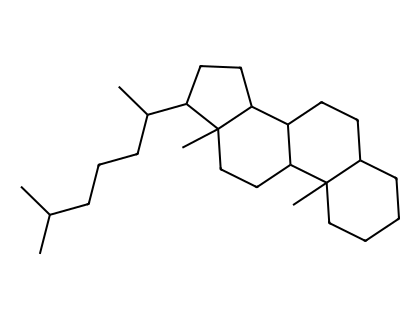
*图：cholestane（胆甾烷）母体骨架*

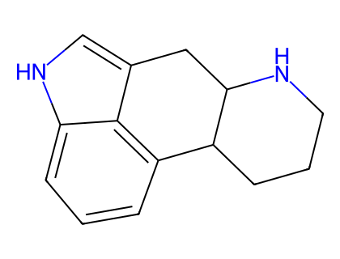
*图：ergoline（麦角灵）母体骨架*

### P-101.2.6 母体结构的立体化学构型

基本母体结构的名称通常隐含了所有手性中心的绝对构型以及在适用时双键的构型，无需进一步说明。所有手性必须被定义，例如对甾体，'C-5' 处的立体化学在相关时须以 α、β 或 ξ 表示。当平面或准平面环系以投影表示时（如本建议中），连接在环上的原子或基团若位于纸平面之下则称为 'α'，位于纸平面之上则称为 'β'。使用该系统要求按各规则示例及附录 3 中所给的结构取向。在下面的示例中，隐含构型将 '8'、'10' 和 '13' 位连接的氢原子和甲基定义为 'β'，将 '9' 和 '14' 位定义为 'α'；这里 5 位氢原子的构型未知，因此取向为 'ξ'（xi），在结构式中用波浪线表示。用于描述隐含或标明的构型的立体描述符 'α'、'β' 和 'ξ' 不带括号地引在基本母体结构名称之前。

'α/β' 符号按上述定义使用，并以下列方式推广以表达修饰后的基本母体结构构型的不同方面。

#### P-101.2.6.1 与母体结构中不同的构型

**P-101.2.6.1.1** 在手性中心，'α/β' 系统按 IUPAC-IUBMB 甾类命名建议（文献 16）使用。每个手性中心用立体描述符 'α'、'β' 或 'ξ' 描述，以指明必须规定的构型以及被反转的构型。符号 'α'、'β' 或 'ξ' 前加相应位标，紧置于基本母体结构名称的开头。在下面的示例中，'C-5' 的构型必须规定；桥头 'C-9' 和 'C-10' 的构型与基本母体结构相比发生了反转。此方法优先于 P-101.2.6.1.2 中所述的各种替代方法。

**示例：** pregnane（基本母体结构）→ 5β,9β,10α-pregnane

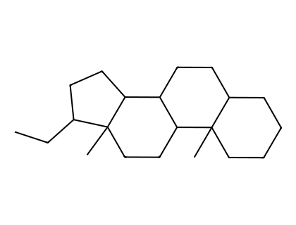
*图：pregnane（孕烷）母体骨架*

母体中非桥头侧链构型的改变用甾类 'C-17' 规定的方法表示（见文献 16 的 3S-5.2），其中 'α' 或 'β' 指侧链本身，而非同一位置上的氢原子。

**示例：** abietane（基本母体结构）→ 13β-abietane

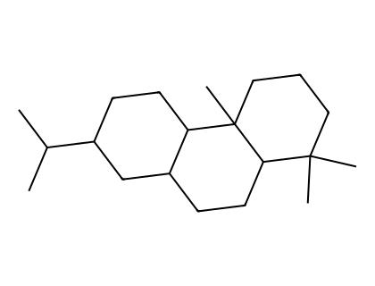
*图：abietane（松香烷）母体骨架*

**P-101.2.6.1.2** 基本母体结构名称中隐含或明文规定的某一立体中心处的构型反转，可用斜体前缀 'epi'（源自 'epimer'，差向异构体）置于母体结构名称前并冠以受影响原子的位标来表示。

上文 P-101.2.6.1.1 中所述名称 13β-abietane 也可命名为 13-epi-abietane。

**示例：** eburnamenine（基本母体结构）→ 3-epi-eburnamenine（即 3α-eburnamenine）

**P-101.2.6.1.3** 立体描述符 'R' 和 'S'

立体描述符 'R' 和 'S' 用于描述上述 'α/β' 系统未规定的绝对构型，遵循 CIP 优先顺序系统及第 9 章所述规则和约定。当环被打开并产生两个手性中心（其中一个可旋转）时，也使用立体描述符 'R' 和 'S'，如 P-101.8.4 中维生素 D 所述。

### P-101.2.7 推荐母体结构的半系统名称列于表 10.1。结构见附录 3。

**表 10.1 基本立体母体结构名称（非穷尽）**

(a) 生物碱类（alkaloids）

| | | |
|:---|:---|:---|
| aconitane | emetan | oxyacanthan |
| ajmalan | ergoline | pancracine |
| akuammilan | ergotaman | rheadan |
| alstophyllan | erythrinan | rodiasine |
| aporphine | evonimine | samandarine |
| aspidofractinine | evonine | sarpagan |
| aspidospermidine | formosanan | senecionan |
| atidane | galanthamine | solanidane |
| atisine | galanthan | sparteine |
| berbaman | hasubanan | spirosolane |
| berbine | hetisan | strychnidine |
| cephalotaxine | ibogamine | tazettine |
| cevane | kopsan | tropane |
| chelidonine | lunarine | tubocuraran |
| cinchonan | lycopodane | tubulosan |
| conanine | lycorenan | veratraman |
| corynan | lythran | vincaleukoblastine |
| corynoxan | lythranidine | vincane |
| crinan | matridine | vobasan |
| curan | morphinan | vobtusine |
| daphnane | nupharidine | yohimban |
| dendrobane | ormosanine | |
| eburnamenine | 18-oxayohimban | |

(b) 甾类（steroids）

| | | |
|:---|:---|:---|
| androstane | cholestane | gorgostane |
| bufanolide | ergostane | poriferastane |
| campestane | estrane | pregnane |
| cardanolide | furostan | spirostan |
| cholane | | |
| gonane | | stigmastane |

(c) 萜烯类（terpenes，除 retinal 外均为母体氢化物）

| | | |
|:---|:---|:---|
| abietane | drimane | menthane（p-异构体） |
| ambrosane | eremophilane | oleanane |
| aristolane | eudesmane | ophiobolane |
| atisane | fenchane | picrasane |
| beyerane | gammacerane | pimarane |
| bisabolane | germacrane | pinane |
| bornane | gibbane | podocarpane |
| cadinane | grayanotoxane | protostane |
| carane | guaiane | retinal |
| β,φ-carotene* | himachalane | rosane |
| β,ψ-carotene* | hopane | taxane |
| ε,κ-carotene* | humulane | thujane |
| ε,χ-carotene* | kaurane | trichothecane |
| caryophyllane | labdane | ursane |
| cedrane | lanostane | |
| dammarane | lupane | |

* 示例了四种不同的胡萝卜素；有 28 个胡萝卜素母体结构，由下列七个端基的全排列衍生：

β (beta)、ε (epsilon)、γ (gamma)、φ (phi)、χ (chi)、κ (kappa)、ψ (psi)

(d) 其他类（Miscellaneous，除 cepham 和 penam 外均为母体氢化物）

| | | |
|:---|:---|:---|
| 21H-biline | isoflavan | penam |
| cepham | lignane | porphyrin |
| corrin | neoflavan | prostane |
| flavan | neolignane | thromboxane |

---

## P-101.3 母体结构的骨架修饰

### P-101.3.0 导论

母体结构的骨架可以多种方式修饰：通过使用 P-13 中描述的操作进行收缩、扩展或重排。这些操作由特定的不可分离前缀（nondetachable prefixes）表示，加在母体结构名称之前。影响构型的改变必须按 P-101.2.6 所述表示。在天然产物命名中，操作次数不受限制。

本节取代 Section F 规则（文献 9）及 1979 年建议（文献 1）中关于萜烯烃的规则 A-71 至 A-75。

### P-101.3.1 去除骨架原子但不影响环数

**P-101.3.1.1** 从环中去除一个未取代的骨架原子（饱和或不饱和），或从基本母体结构的饱和无环部分去除一个未取代的骨架原子（连同其所连的氢原子），用不可分离前缀 'nor' 描述；去除两个或更多这样的骨架原子，用通常的数词倍增前缀 'di'、'tri' 等加在 'nor' 之前表示。

被去除骨架原子的位置在所有情况下都用其在基本母体结构编号中的位标表示。尽管由于引用了每个被去除骨架原子的位标，去除任意骨架原子（碳原子或杂原子）都能生成无歧义的名称，但惯例是去除环状骨架部分中原子连接体内位标尽可能大的骨架原子。在胡萝卜素中为例外，附在 'nor' 上的位标取尽可能小的值（见文献 40 中胡萝卜素规则 5.1）。

**示例：** pregnane（基本母体结构）→ 4-nor-5β-pregnane；β,β-carotene（基本母体结构）→ 2,2′-dinor-β,β-carotene

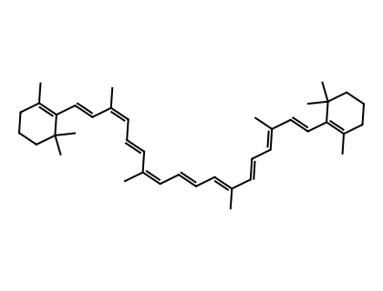
*图：β,β-carotene（β,β-胡萝卜素）母体骨架*

在骨架结构的无环部分，优先去除无环原子连接体或末端链段中最靠近该无环部分自由端的骨架原子（这样做是为了尽可能保持化合物及其衍生物结构特征的编号）。

**示例：** germacrane（基本母体结构，位置 1 即 germacrane 的位置 10）→ 13-norgermacrane，即 (1R,4s,7S)-4-ethyl-1,7-dimethylcyclodecane；prostane（基本母体结构）→ 1,20-dinorprostane，即 (1S,2S)-1-heptyl-2-hexylcyclopentane；ε,ε-carotene（基本母体结构）→ 20-nor-ε,ε-carotene（无撇与带撇位标的用法见 P-14.3.5）

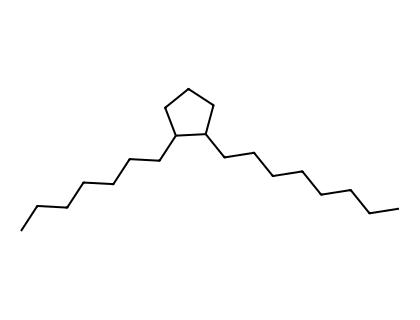
*图：prostane（前列腺烷）母体骨架*

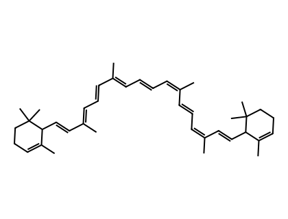
*图：ε,ε-carotene（ε,ε-胡萝卜素）母体骨架*

**P-101.3.1.2** 当从基本母体结构的 mancude 环（含最大数目非累积双键）中去除一个不饱和骨架原子导致产生一个饱和环位时，该位用指示氢（见 P-14.7）描述。在名称中，用相应位标表示的符号 H 引在该不可分离前缀修饰的名称开头。

**示例：** morphinan（基本母体结构）→ 1H-4-normorphinan

### P-101.3.2 增加骨架原子但不影响环数

**P-101.3.2.1** 在基本母体结构的两个骨架原子之间加入一个亚甲基（-CH₂-）用不可分离前缀 'homo' 描述；加入两个或更多亚甲基用数词倍增前缀 'di'、'tri' 等表示。修饰后基本母体结构中插入亚甲基的位置用引在 'homo' 前缀之前、必要时冠以倍增前缀的被加入亚甲基的位标表示。

所加入亚甲基位标的指定取决于其被视为插入原子连接体或末端无环部分，还是插入键连接体。

#### P-101.3.2.2 附加骨架原子的编号

**P-101.3.2.2.1** 插入原子连接体或末端链段的亚甲基，通过在原子连接体或末端部分的最高编号骨架原子的位标后加字母 'a'、'b' 等来标识，与结构中剩余双键的位置保持一致。若有等价原子连接体，则选择最高位的原子连接体，亚甲基插入该连接体最高编号骨架原子之后。

在立体母体氢化物上增加无环侧链或延伸已连接侧链的末端部分，也可按取代命名原理进行。所加取代基按上述 'homo' 原子的方式编号。

**示例：** pregnane（基本母体结构）→ 19a-homo-5β-pregnane（不写作 19-methyl-5β-pregnane；侧链的烷基取代不允许）；→ 16a-homo-5α-pregnane

**P-101.3.2.2.2** 插入键连接体的亚甲基，通过同时引用终止该键连接体的两个骨架原子的位标（括号内包含其中较高的数，后接字母 'a'、'b' 等，按亚甲基数目）来标识。

**示例：** pregnane（基本母体结构）→ 13(17)a-homo-5α-pregnane；→ 13(17)a,13(17)b-dihomo-5α-pregnane（这曾被称为 D(17a,17b)dihomo-5α-pregnane；见文献 16 中规则 2S-7.3）；→ 13(14)a,13(17)b-dihomo-5α-pregnane

**P-101.3.2.2.3** 向 mancude 环或环系（含最大数目非累积双键者）或共轭双键体系插入亚甲基可能产生一个饱和环位，用"指示氢"描述（见 P-14.7 和 P-58.2）。亚甲基的位置由 P-101.3.2.2.2 规定，即使饱和环位可能在以相应指示氢位标表示的不饱和环系中的别处；这是对高卟啉（homoporphyrins）名称的修改（见文献 17 中规则 TP-5.1）。下面表示了两个互变异构形式 (A) 和 (B)，并专门编号和命名。

**示例：** morphinan（基本母体结构）→ 1H-4a-homomorphinan；porphyrin（基本母体结构）→ (A) 20aH-20a-homoporphyrin 和 (B) 20H-20a-homoporphyrin

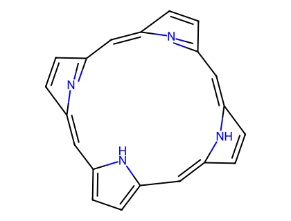
*图：porphyrin（卟啉）母体骨架*

### P-101.3.3 成键（形成新环）

通过直接连接母体结构中任意两个原子来创建附加环（结合操作，见 P-13.5.3），用不可分离前缀 'cyclo'（不斜体）表示，前缀前冠以所连接骨架原子的位标。必要时，新键产生的构型按 P-101.2.6 用 α、β 或 ξ 描述符表示，或按 P-101.2.6.1.3 描述氢原子的构型。

基本母体结构的构型保留。仍带有一个氢原子的环原子的新构型按 P-101.2.6 用 'α/β' 立体描述符表示，或在必要时用序列规则方法（R/S）表示。氢原子在环系平面之下 'α' 或之上 'β' 的投影，用相应符号及大写斜体字母 H 表示，H 后接结构式中环原子的位标，全部置于括号中，引在相应前缀（此处为 'cyclo'）之前（前缀 'abeo' 见 P-101.3.5.1）。此引用方法与甾类规则（文献 16 中规则 3S-7.5）所用的不同。

**示例：** pregnane（基本母体结构）→ 3α,5-cyclo-5α-pregnane；→ (20S)-14,21:16β,20-dicyclo-5α,14β-pregnane；corynan（基本母体结构）→ (16βH)-1,16-cyclocorynan

### P-101.3.4 键的断裂

**P-101.3.4.1** 断裂环键（饱和或不饱和）并在由此产生的每个新端基上加入相应数目的氢原子，用前缀 'seco'（不斜体）及被断键的位标表示。保留原编号。

**示例：** hopane（基本母体结构）→ 2,3-secohopane；curan（基本母体结构）→ 3,4-secocuran

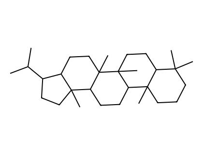
*图：hopane（藿烷）母体骨架*

#### P-101.3.4.2 前缀 'apo'

不斜体的前缀 'apo' 前冠以位标，用于表示去除基本母体结构中超出该位标所对应骨架原子的整个侧链。去除两个或更多侧链用前缀 'diapo'、'triapo' 等表示，前冠所需的位标。所得片段中保留基本母体结构骨架原子的编号。

下列程序仅用于胡萝卜素命名（见文献 40 中胡萝卜素规则 10）。不斜体的前缀 'apo' 前冠以位标，用于表示该位标对应碳原子之外的整个分子已被氢原子取代。侧链甲基不被视为在其所连碳原子"之外"。从分子两端去除片段用数词倍增前缀 'di' 表示，前冠两个位标。所得片段中保留母体结构骨架原子的编号。

前缀及其位标紧置于母体名称之前，除非与前缀 'apo' 相关联的位标大于 5，此时无需给出该端分子的希腊字母端基标示。

**示例：** β,β-carotene（基本母体结构）→ 6′-apo-β-carotene（无撇与带撇位标的用法见 P-14.3.4）

### P-101.3.5 键的迁移

不是接受基本母体简单衍生物、但可被认为由一个或多个键的迁移而由这种母体产生的母体结构，可按下列方法命名。

**P-101.3.5.1** 不可分离前缀 'x(y→z)-abeo' 表示单键的一端从其基本母体结构中的原位置迁移到另一个位置。在该前缀中，'x' 是迁移键不动（即不变）端的位标；'y' 是母体结构中迁移键移动端位置的位标；'z' 是最终结构中移动端位置的位标。保留初始基本母体结构的编号。

此前前缀 'abeo' 用斜体（文献 1 中规则 F-4.9；文献 2 中规则 R-1.2.7.1）。为与其他修饰前缀一致，现建议使用常规正体字。

**示例：** podocarpane（基本母体结构）→ (3αH)-5(4→3)-abeopodocarpane，即 3,5-cyclo-4,5-seco-3β-podocarpane

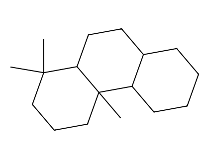
*图：podocarpane（罗汉松烷）母体骨架*

本规则所述 'abeo' 命名是允许的而非强制性的。它最适用于反应机理和生物合成讨论中。

**P-101.3.5.2** 斜体前缀 'retro' 前冠一对位标，用于表示由该对位标划定的共轭多烯体系中所有单键和双键均移动一个位置；该共轭多烯体系不能是环或环系中最大数目非累积双键体系的一部分。第一个位标是失去氢原子的骨架原子，第二个位标是获得氢原子的那个。描述符 'retro' 仅以这种方式用于胡萝卜素命名（见文献 9 中胡萝卜素规则 9）。

**示例：** β,ψ-carotene（基本母体结构）→ 4′,11-retro-β,ψ-carotene（带撇与不带撇位标的用法见 P-16.9）

### P-101.3.6 末端环的去除

从母体结构中去除一个末端环，并在与相邻环的每个连接处加入相应数目的氢原子，用不可分离前缀 'des' 加被去除环的大写斜体字母表示（'des' 在多肽命名中的用法见 P-103.3.5.4）。这是现在用大写字母标识母体结构中的环的唯一场合。立体母体结构名称所隐含的立体化学保持不变，除非另有规定。修饰后结构中保留母体结构骨架原子的编号。'des' 的此用法仅限于甾类。

**示例：** androstane（基本母体结构）→ des-A-androstane；→ des-A-10α-androstane

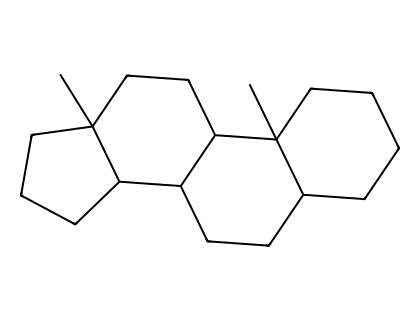
*图：androstane（雄烷）母体骨架*

### P-101.3.7 前缀 'cyclo'、'seco'、'apo'、'homo' 和 'nor' 的组合

前述建议（P-101.3.1 至 P-101.3.4）中各前缀所规定的对基本母体结构的修饰可以组合起来实现更剧烈的结构变化。每个前缀 'cyclo'、'seco'、'apo'、'homo' 和 'nor' 所表示的操作按"向后推进"，即从基本母体结构名称从右向左移动，依次应用于基本母体结构。

**P-101.3.7.1** 当前缀 'cyclo'、'seco'、'apo'、'homo' 和 'nor' 的不同组合可用于对基本母体结构实现同一变换时，所选的组合必须表达最少的操作次数。可分离前缀（如烷基）和不可分离前缀（如 homo 或 nor）都被视为修饰，但优先使用可分离前缀。Dihomo、dinor 等各计为两次修饰（见文献 16 中规则 3S-6.3）。当操作次数相同时，homo/nor 组合优先于 cyclo/seco；表达相同操作次数的其他组合之间的选择，依据前缀的字母顺序在前者。

**示例：**

- podocarpane（基本母体结构）与 labdane（基本母体结构）：13,14-secopodocarpane (I) 优先，而非 8α-14,15,16-trinorlabdane (II)。解释：podocarpane 可用一次操作生成 'seco' 化合物；同一化合物从 labdane 获得需要三次操作。

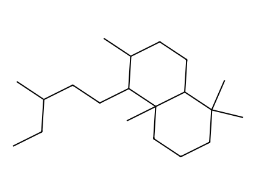
*图：labdane（赖百当烷）母体骨架*
- ergoline（基本母体结构）→ 10(11)a-homo-9-norergoline（首选），即 5,9-cyclo-5,10-secoergoline，即 (9H)-5(10→9)-abeoergoline

**P-101.3.7.2** 结构修饰前缀组合的引用顺序必须避免上述前缀的不当使用，或避免相应操作按上述方式实施时出现不可能的情形。

在满足 P-101.3.7.1 和 P-101.3.7.2 后，先引用表示键重排的不可分离前缀（'cyclo' 和 'seco'），随后引用表示骨架原子加合或去除的前缀（'homo' 和 'nor'）。若这些操作中任一需要多次，则按字母顺序引于基本母体结构名称之前。表示同类多次操作的倍增前缀不影响顺序。

首选半系统名称由仅涉及 'cyclo'、'seco'、'apo'、'homo' 和 'nor' 两个操作的修饰产生。在一般命名中允许多于两个操作。名称的构成方式为：将键重排前缀 'cyclo' 和 'seco' 先引（离母体结构最远），按从左到右顺序，随后按从左到右顺序引去除/加合前缀 'homo' 和 'nor'，置于母体结构名称之前。此顺序示意如下：

| 操作 | 键重排 | 骨架原子加合/去除 | 母体结构 |
|:---|:---|:---|:---|
| 前缀 | cyclo, seco | apo, homo, nor | |

前缀顺序为 cyclo/seco/apo/homo/nor 的名称，优先于这五个前缀按字母顺序 apo/cyclo/homo/nor/seco 的名称。

**示例：**

- pimarane（基本母体结构）→ 6,7-seco-3a-homopimarane（首选），而非 3a-homo-6,7-secopimarane

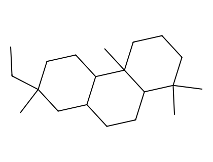
*图：pimarane（海松烷）母体骨架*
- androstane（基本母体结构）→ 3α,5α-cyclo-9,10-seco-5α-androstane；→ 5β,19-cyclo-4a-homo-5β-androstane；→ 9β,19-cyclo-4-nor-5α,9β-androstane
- pregnane（基本母体结构）→ 9,10-seco-4a-homo-5α-pregnane；→ 4,5-seco-7-norpregnane；→ 9a-homo-4-nor-5α-pregnane

---

## P-101.4 骨架原子的置换

### P-101.4.1 一般方法

骨架置换（'a'）命名原理（按 P-15.4 和 P-51.4 修饰母体结构）用于将碳骨架原子替换为杂原子，如 O、S、N。与《Revised Section F》（文献 9）中推荐的名称中按字母顺序引用相反，骨架置换推荐按 P-15.4 规定的 'a' 前缀的优先顺序。除用于生成系统名称的方法外，骨架置换（'a'）命名也用于将母体结构中的杂原子替换为碳原子以及替换为其他杂原子。

### P-101.4.2 碳骨架原子被杂原子置换

杂原子用 'a' 前缀表示，引用在表示基本母体结构中骨架修饰的不可分离前缀之前，各冠以位标标明其位置；保持母体结构的固定编号。骨架修饰（如有）必须在应用骨架置换（'a'）命名之前完成。

**示例：** 3-azaambrosane；→ 3-tellura-4a-homo-5α-androstane

### P-101.4.3 杂原子被碳原子置换

将母体结构中的杂原子替换为碳原子，用置换（'a'）前缀 'carba' 表示。保持原编号。若该杂原子未被编号，则置换的碳原子通过在紧邻的较低编号骨架原子的位标后加字母 'a' 编号。若紧邻的较低编号骨架原子是 'homo' 原子，则酌情用字母 'b'、'c' 等。新碳骨架原子处的构型用规定附加构型的方法描述（见 P-101.2.6.1）。

**示例：** spirostan（基本母体结构）→ 16a,22a-dicarba-5β-spirostan

### P-101.4.4 杂原子被其他杂原子置换

将立体母体氢化物中的杂原子替换为另一杂原子，用相应的骨架置换（'a'）前缀和位标表示。

**示例：** ergoline（基本母体结构）→ 1-thiaergoline

### P-101.4.5 指示氢

当母体结构中 mancude 部分（含最大数目非累积双键）或扩展共轭双键体系的骨架原子被置换导致产生一个饱和骨架位时，该位用指示氢符号表示（见 P-14.7 和 P-58.2）。

**示例：** morphinan（基本母体结构）→ 2H-1-oxamorphinan；yohimban（基本母体结构）→ (4βH)-4-carbayohimban

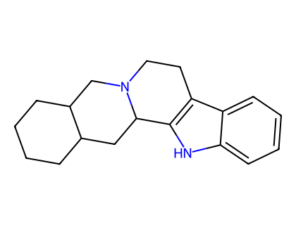
*图：yohimban（育亨烷）母体骨架*

---

## P-101.5 环与环系的并入

有三种类型的环和环系可以并入母体结构：

- P-101.5.1 通过稠合命名并入的 mancude 环和环系
- P-101.5.2 通过桥稠环命名并入的环和环系
- P-101.5.3 通过螺命名并入的环和环系

采用第 P-1 至 P-8 章所述用于构建系统名称的方法，其中某些方法针对母体结构作了适当调整。

### P-101.5.1 通过稠合命名并入的 mancude 环和环系

基本母体结构作为组分按其在正常氢化状态用于稠合命名。因此，仅仅因为另一组分含有最大数目非累积双键，不在稠合位引用双键。此外，与 P-25 规定的规则相反，基本母体结构总是被选为主组分（principal component），所连接的组分必须是 mancude 环或环系。

**P-101.5.1.1** 按第 P-2 章规定的规则被视为 mancude 母体氢化物的环或环系（碳环或杂环）稠合到母体结构上，用其稠合前缀名（见 P-25）置于基本母体结构名称之前来描述。母体结构中参与稠合的骨架原子用普通（不带撇）位标标识，而不用斜体字母 'a'、'b' 等；mancude 组分中参与稠合的骨架原子用带撇数字位标标识。稠合位置用稠合描述符（fusion descriptor）表示，包括两组位标：第一组为所连组分的位标，第二组与主组分（即基本母体结构）有关；两组用冒号分隔，置于方括号中，引在两个组分名称之间。在有选择时，mancude 所连组分的位标取尽可能低，并按与母体结构相同的编号方向引用。前缀名末尾的元音 'o' 或 'a' 后跟元音时不省略，如 P-25.3.1.3 对普通稠合命名所规定。

元音不省略是对此前建议的修改。

**示例：** benzo[2,3]-5α-androstane（省略位标 1′,2′）；→ naphtho[2′,1′:2,3]-5α-androstane；[1,2]thiazolo[5′,4′,3′:4,5,6]cholestane（不写作 isothiazolo[5′,4′,3′:4,5,6]cholestane；名称 isothiazole 不再推荐作为稠合组分，见 P-25.3.2.1.2）

**P-101.5.1.2** 稠合到母体结构上的所连组分是 mancude 化合物（含最大数目非累积双键）。此类组分上含至少一个氢原子的饱和位（包括稠合位）用指示氢规定。它们还用由位标、构型描述符 'α' 或 'β' 及指示氢符号（见 P-14.7）组成的描述符规定，置于括号中并像立体描述符一样放在名称开头。用所连组分的位标标识指示氢的位置，但在带撇与不带撇位标之间有选择时，使用立体母体氢化物（不带撇）的位标。

**示例：** (8αH)-[1,3]oxazolo[5′,4′:8,14]morphinan（不写作 8αH-oxazolo[5′,4′:8,14]morphinan；不带杂原子位标的名称 oxazole 不再推荐作为稠合组分；需要用立体描述符 (8αH) 表示的"指示氢原子"来完成名称）；5′H-cyclopenta[2,3]-5α-androstane；bis[1,2]oxazolo[4′,3′:6,7;5′′,4′′:16,17]-5α-androstane；1′H-pyrrolo[3′,4′:18,19][1,2]thiazolo[4′′,5′′:16,17]yohimban；2′H-[1,3]oxazepino[4′,5′,6′:12,13,17]-5α-androstane；(12βH)-12H-[1,3]oxazepino[4′,5′,6′:12,13,17]-5α-androstane

### P-101.5.2 通过桥稠环命名并入的环和环系

加合到基本母体结构上的原子桥可以用稠合命名中桥稠环系所用的方法描述。桥的名称采用 P-25.4 规定的那些。此法常用于杂原子桥。事实上，此法在描述稠合到基本母体结构上的某些类型杂环时往往比 P-101.5.1 所述稠合程序更有用，例如用 'epoxy' 表示桥而不是用 'oxireno' 表示稠合为所连组分的环。连接基本母体结构中两个不相邻原子时，优先使用原子桥而非稠合命名（环氧化物和硫杂环氧化物为例外，可取代命名，见 P-63.5）。用于表示桥的前缀是不可分离的；它们在名称中引于表示骨架修饰的前缀之前，前冠相应位标。

**示例：** 4,5α-epoxymorphinan；(5βH)-5,13-dihydrofuro[2′,3′,4′,5′:4,12,13,5]morphinan；3α,8-epidioxy-5α,8α-androstane；(16βH)-thiireno[2′,3′:16,17]-5α-pregnane（稠合名）→ 16α,17-epithio-5α-pregnane；11α,18-ethano-5α,13α-pregnane；11α,13-propano-18-nor-5α,13α-pregnane；11β,18-cyclo-12a,12b-dihomo-5α-pregnane；11α,18b-cyclo-18a,18b-dihomo-5α,13α-pregnane

解释：C-13 处构型的反转不计为操作，因为它未修饰分子骨架。

- 8,9′-neolignane（基本母体结构）即 1,1′-(2-methylpentane-1,5-diyl)dibenzene → (7α,8α,8′β,9′α)-7,9a′:8′,9-diepoxy-7′-oxa-9a′-homo-8,9′-neolignane，即 (1S,3aR,4S,6aR)-1-phenoxy-4-phenyltetrahydro-1H,3H-furo[3,4-c]furan

与有机化合物系统命名建议相反，在胡萝卜素命名（见文献 40）中，名为 'epoxy' 的桥被视为可分离的，而 hydro/dehydro 前缀被视为不可分离。下列桥接 β,β-carotene 的名称按胡萝卜素命名规则书写（文献 40 中胡萝卜素规则 7.3），但与规则 P-15.1.5 相抵触。

**示例：** β,β-carotene（基本母体结构）→ 5,8:5′,8′-diepoxy-5,8,5′,8′-tetrahydro-β,β-carotene（无撇与带撇位标的用法见 P-14.3.1）

### P-101.5.3 通过螺命名并入的环和环系

螺化合物按 P-24.5 对至少含一个多环组分的单螺化合物规定命名。

**示例：** (2ξ)-4,4,6′-trimethylspiro[1,3-dioxolane-2,8′-ergoline]

---

## P-101.6 母体结构氢化程度的修饰

第 P-31 节规定的修饰母体氢化物氢化程度的一般原理和规则应用于母体结构。根据所需的是削减还是加成操作，使用词尾 'ene' 和 'yne'（见 P-31.1）以及前缀 'hydro' 和 'dehydro'（见 P-31.2）。母体氢化物中双键的引入不受限制；'hydro/dehydro' 前缀可按需要使用任意次数，前提是不生成 mancude 结构。

**P-101.6.1** 母体结构完全饱和、或母体结构的某部分在其他方面完全饱和且其名称以 'an'、'ane' 或 'anine' 结尾的化合物中的不饱和度，通过将 'an' 或 'ane' 改为 'ene' 或 'yne'、将 'anine' 改为 'enine' 或 'ynine'，并按 P-31.1.1.2 规定加数词倍增前缀来表示。位标紧置于其所涉及的名称部分之前。

**示例：** androsta-5,7-diene；pregn-4-en-20-yne；con-5-enine；5β-furost-20(22)-ene

**P-101.6.2** 描述符 'E' 和 'Z' 前冠相应位标，用于描述双键的修饰或附加立体化学构型。立体描述符 'cis' 和 'trans' 用于胡萝卜素命名（文献 40）和类视黄醇命名（文献 49）。

**示例：** (23E)-5α-cholest-23-ene；(5Z,7E)-9,10-secocholesta-5,7,10(19)-triene；11-cis-retinal；lignane（基本母体结构）→ (7E,8′S)-lign-7-ene，即 [(1E,3S)-2,3-dimethyl-4-phenylbut-1-en-1-yl]benzene，即 1,1′-[(1E,3S)-(2,3-dimethylbut-1-ene-1,4-diyl)]dibenzene

**P-101.6.3** 前缀 'all' 用于立体描述符之前，表示所有构型都相同。此前缀仅用于天然产物命名，例如 'all-trans' 表示在 retinal 中所有双键都是 'trans'。

**示例：** all-trans-retinal

**P-101.6.4** 母体结构名称暗示存在孤立双键和/或共轭双键体系时，双键的饱和用前缀 'hydro' 描述，此前缀本身前冠被饱和位置的位标。'hydro' 前缀是可分离的，总是紧置于基本母体结构名称之前（见 P-31.2）。

**示例：** formosanan（基本母体结构）→ 16,17-dihydroformosanan；β,χ-carotene（基本母体结构）→ 5,6,7,8,1′,2′,3′,4′,5′,6′,7′,8′-dodecahydro-β,χ-carotene（无撇与带撇位标的用法见 P-14.3.1）

**P-101.6.5** 稠合到母体结构上的饱和或部分饱和的碳环和杂环环组分用 'hydro' 前缀命名。在带撇与不带撇位标之间有选择时，用不带撇位标。

**示例：** 3′,4′,5′,6′-tetrahydrobenzo[7,8]morphinan；(6αH)-1′,6-dihydroazirino[2′,3′:5,6]-5β-androstane（符号 (6αH) 见 P-101.5.1.2）

**P-101.6.6** 向名称不以 'an'、'ane' 或 'anine' 结尾的母体结构引入附加于其隐含不饱和度之外的不饱和度、将隐含双键转化为三键、以及伴随隐含双键重排而引入附加双键，用前缀 'dehydro' 表示，此前缀前冠以与去除氢原子数相等的数词倍增项及相应位标。'dehydro' 前缀是可分离的，总是引于基本母体结构名称之前、在任何按字母顺序排列的可分离前缀之后（若有）。

**示例：** penam（基本母体结构，注意新编号）→ 2,3-didehydropenam；lycorenan（基本母体结构）→ 3,5-didehydrolycorenan；ε,ε-carotene（基本母体结构）→ 7,8-didehydro-ε,ε-carotene（无撇与带撇位标的用法见规则 P-14.3.1）

**P-101.6.7** 双键的重排可用 'hydro' 和 'dehydro' 前缀的组合表示。'dehydro' 前缀按字母数字顺序引于 'hydro' 前缀之前。

**示例：** strychnidine（基本母体结构）→ 20,21-didehydro-21,22-dihydro-19,20-secostrychnidine

---

## P-101.7 母体结构的衍生物

母体结构的衍生物按第 P-1 至 P-9 章所述原理、规则和约定命名。

**P-101.7.1** 有机化合物命名的后缀和前缀按规定方式用于命名视为取代母体结构氢原子的原子和基团。立体描述符 α、β 和 ξ 用于描述构型；它们引在前缀或后缀之前，前冠相应位标。如此构建的取代名称优先于由官能团类命名（functional class nomenclature）形成的名称，但某些环状官能团类除外。

环上的取代和末端链段上的取代分开考虑。

### P-101.7.1.1 烷基取代

**P-101.7.1.1.1** 有机基团如芳基和烷基通过取代命名引入。

**示例：** 8α-ethyleudesmane

**P-101.7.1.1.2** 取代程序用于在 androstane 的 17β 位引入甲基；用不可分离前缀 'nor' 从 pregnane 减去亚甲基的替代方法不推荐（见 P-101.3.7.1）。

**示例：** 17β-methyl-5α-androstane（不写作 21-nor-5α-pregnane）

**P-101.7.1.1.3** 文献 16 中规则 3S-2.7 描述了将带侧链（作为母体碳环一部分）及 C-17 烷基取代基的甾类命名的操作方法。规则 3S-2.7 也描述了 C-17 有两个烷基取代基的甾类的命名方法。此方法适用于第 P-101 节所述的任何基本母体结构。带右上标数字的位标用于原子标识，例如在 ¹³C-NMR 归属中，而非作为进一步取代的位标。

**示例：** 17-methyl-5α-campestane（17 位附加甲基编号为 17¹；其他原子照常编号）；17,17-dimethyl-5α-androstane（两个附加甲基都编号为 17¹；β-甲基带撇号）

**P-101.7.1.1.4** 当以后缀引用的特征基团出现在加合到基本母体结构上的烷基取代基团上时，使用取代命名的原理、规则和约定。

**示例：** (17β-methyl-5α-androstan-17α-yl)methanol（不写作 (21-nor-5α-pregnan-17α-yl)methanol）

### P-101.7.1.2 环上的取代

后缀按后缀优先顺序使用，考虑母体氢化物的环状性质。可分离前缀按字母数字顺序引用。词尾 'ene' 和 'yne' 按正常方式引用；'hydro-dehydro' 前缀是可分离的，但引于可分离前缀之末。

**示例：** 3β-bromo-5α-androstane → 5α-androstan-3β-yl bromide；5β-androstan-3β-ol；3β-methyl-5α-androstan-3α-ol；17α-hydroxyandrost-4-en-3-one；(20S)-3β-(dimethylamino)-5α-pregnan-20-ol；3-oxoandrost-4-ene-17α-carboxylic acid（不写作 21-nor-5α-pregnan-20-oic acid；正确名称涉及最少操作次数，见 P-101.3.7.1）；(6R,7R)-7-amino-3-methyl-8-oxo-5-thia-1-azabicyclo[4.2.0]oct-2-en-2-carboxylic acid → 7β-amino-3-methyl-3,4-didehydrocepham-4-carboxylic acid（注意 cepham 的新编号；与文献 9 所报告的不同）

### P-101.7.1.3 末端链段上的取代

推荐用表达特征基团的前缀和后缀对末端链段进行取代，即使特征基团中含碳原子时也如此。末端链段延长两个亚甲基是允许的，用前缀 'dihomo' 表示。进一步延长是可能的，但必须使用烷基，作为与最长链优先规则相关的例外。

**示例：** 3-oxoandrost-4-en-18-oic acid；3-oxoandrost-4-ene-18-carboxylic acid；11α-hydroxy-9-oxoprostan-1-oic acid

**P-101.7.2** 主特征基团的修饰（如酯，见 P-65.6.3.2；缩醛，见 P-66.6.5 等）用第 P-6 章所述的通常方法命名。环状修饰物，如内酯、环状缩醛等，优选按环状物本身命名，而不是作为稠合或螺环系命名，即使这些名称是官能团类名称（另见 P-101.7.4）。

**示例：** methyl 5β-androstane-17β-carboxylate；(1R,5S)-3,3-bis(ethylsulfanyl)-8-methyl-8-azabicyclo[3.2.1]octane → 3,3-bis(ethylsulfanyl)tropane → tropan-3-one diethyl dithioketal

**P-101.7.3** 由母体结构衍生的取代基团名称，按 P-29 所述的一般方法，在母体名称后加后缀 'yl'、'ylidene' 或 'ylidyne'（视情况而定）构成，若母体名称末尾有字母 'e'，则在字母 'y' 前将其省略。

**示例：** erythrinan-1β-yl butanoate；tropan-3β-yl acetate → (1R,3s,5S)-8-methyl-8-azabicyclo[3.2.1]octan-3-yl acetate（见 P-93.5.2.2.1）

### P-101.7.4 表示官能团的环的并入

表示官能团的环优先按构建系统名称的通常方法命名。环状酯和内酯按命名酯的一般方法命名（见 P-65.6.3.5）。缩醛名称用官能团类命名原理形成（见 P-66.6.5），而不是用 P-101.5 所述的稠合命名。在可以选择时，优先用稠合名。

**示例：** (3βH,4βH)-3,4-dihydro[1,3]dioxolo[4′,5′:3,4]aspidospermidin-2′-one；aspidospermidine-3α,4α-diyl carbonate（见 P-65.6.3.5.4）；19,21-epoxyaspidospermidin-21-one；21-noraspidospermidine-20,19-carbolactone（见 P-65.6.3.5.1）；19-hydroxyaspidospermidine-21,19-lactone；(3αH,4αH)-2′,2′-dimethyl-3,4-dihydro[1,3]dioxolo[4′,5′:3,4]matridine；propan-2-one matridine-3β,4β-diyl ketal（见 P-66.6.5）→ acetone matridine-3β,4β-diyl ketal

**P-101.7.5** 前缀 'de'（不是 'des'）后接基团或原子名称（氢除外），表示去除该基团或原子并按需要加入氢原子。前缀 'de' 目前用于碳水化合物命名（见 P-102.5.3），表示从 -OH 上去除氧原子并重新连接氢原子。

**示例：** lythranidine（基本母体结构）→ 2′′-demethoxylythranidine；→ 6′-deoxylythranidine

吗啡与脱甲基吗啡的结构式对（I 为吗啡，II 为脱甲基吗啡）：
- I：morphine（吗啡），即 (5βH)-17-methyl-7,8-didehydrofuro[2′,3′,4′,5′:4,12,13,5]morphinan-3,6α-diol
- II：demethylmorphine（脱甲基吗啡），即 (5βH)-7,8-didehydrofuro[2′,3′,4′,5′:4,12,13,5]morphinan-3,6α-diol

---

## P-101.8 构型规定的其他方面

除用立体描述符 'α'、'β'、'ξ'、'R' 和 'S' 规定基本及修饰母体结构的绝对构型外，还有许多其他立体化学特征需要描述。应用第 P-9 章所述的原理、规则和约定。

**P-101.8.1** 构型反转。全部手性中心的构型反转用斜体前缀 'ent'（'enantio' 的缩写形式）置于化合物完整名称之前表示。此前缀表示所有手性中心（包括由指定取代基产生的手性中心）处的反转，无论这些中心是单独引用还是隐含于名称中。下例中 kaurane 和 ent-kaurane 给出正确的结构和名称；Chemical Abstracts 将其指定颠倒（见文献 22）。

**示例：** kaurane → ent-kaurane

**P-101.8.2** 外消旋体。外消旋体通过在化合物整个名称（包括前缀 'epi'，若有）之前引用斜体立体描述符 'rac'（racemo 的缩写）来命名。对外消旋化合物，绘制的对映体结构应是所示最低编号手性中心处于 α-构型的那一个。这可能与通常做法不同，通常做法是绘制与天然存在的物质具有相同绝对构型的对映体结构。

**P-101.8.3** 相对构型。当已知手性中心之间相对（而非绝对）构型关系时，符号 'rel' 与 R 或 S 结合使用（优于 'R*' 和/或 'S*'），按规则 P-93.5.1.2。或者，相对构型已知、绝对构型未知的对映体可用化合物立体描述符 (+)-rel- 或 (-)-rel- 区分，其中正负号指钠 D 线下偏振光的旋光方向。因此，下列结构的右旋形式命名为 (+)-rel-17β-hydroxy-8α,9β-androst-4-en-3-one。

**P-101.8.4** 立体描述符 'R' 和 'S' 用于描述母体结构非手性的化合物的立体中心绝对构型，例如 bornane。当环被打开产生两个手性部分（其中一个可旋转）时，也用它们替代 'α'、'β'、'ξ'，如维生素 D 所示。

**示例：** (1R,4R)-bornan-2-one → (+)-camphor（(+)-樟脑），即 (1R,4R)-1,7,7-trimethylbicyclo[2.2.1]heptan-2-one；结构式 I 与 II 等效：(3S,5Z,7E)-9,10-secocholesta-5,7,10(19)-trien-3-ol（结构 I 和 II 是同一 3-羟基衍生物的两种构象）

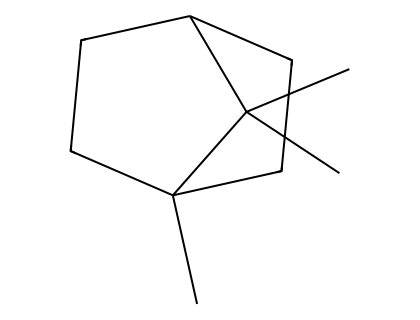
*图：bornane（莰烷）母体骨架*
