# P-102 碳水化合物命名

本节基于近期修订的碳水化合物命名建议（文献 27），介绍此类特定命名体系的基本概念，特别是用于表示众多非对映异构体和对映体构型的符号与立体描述符（stereodescriptor）系统。

> **关于结构式示例的说明：** 原文中用于说明规则的结构式插图为图像（Fischer 投影、Haworth 表示、椅式构象等），本翻译中以「名称 + 系统取代名称」的形式呈现命名实例，并保留母体名称及修饰后名称；规则正文完整翻译。
>
> **关于配图的说明：** 基础母体结构配图由 RDKit 生成，SMILES 取自 PubChem 记录并经分子式与环数核对。**立体化学（D/L 系列、α/β 异头构型等）未在图中标注**——糖类命名以 Fischer 投影和 Haworth 表示中的立体构型为定义核心，RDKit 生成的连接性二维结构图不含这些投影的立体意义，图中仅表示连接性骨架。

## 目录

- P-102.1 定义
- P-102.2 母体单糖
- P-102.3 构型符号体系
- P-102.4 母体结构的选择
- P-102.5 单糖：醛糖和酮糖；脱氧糖和氨基糖
- P-102.6 作为取代基团的单糖和衍生物
- P-102.7 二糖和低聚糖

---

## P-102.1 定义

### P-102.1.1 碳水化合物

通称 'carbohydrates'（碳水化合物）包括单糖（monosaccharide）、低聚糖（oligosaccharide）和多糖（polysaccharide），以及由单糖通过以下操作衍生的物质：羰基还原（糖醇，alditols）、将一个或多个末端基团氧化为羧酸、或将一个或多个羟基替换为氢原子、氨基、巯基或类似的杂原子基团。它还包含这些化合物的衍生物。术语 'sugar'（糖）常用于指单糖和较简单的低聚糖。

环醇（cyclitols）一般不视为碳水化合物。环醇的命名见 P-104 和文献 39。

### P-102.1.2 单糖

母体单糖（parent monosaccharides）是多羟基醛 H-(CHOH)ₙ-CHO 或多羟基酮 H-(CHOH)ₘ-CO-(CHOH)ₙ-H，含有三个或更多个碳原子。

通称 'monosaccharide'（单糖，区别于低聚糖或多糖）指一个独立的单元，不与其他同类单元形成糖苷连接，包括醛糖、二醛糖（dialdose）、酮醛糖（aldoketose）、酮糖、二酮糖（diketose），以及脱氧糖和氨基糖及其衍生物，前提是母体化合物含有（潜在的）羰基。

单糖的名称要么是俗名（trivial name）要么是系统名称。葡萄糖（glucose）、果糖（fructose）等许多俗名被保留，用于描述相应的官能母体。碳水化合物命名的这一方面是有限的，因为它只适用于含四至六个碳原子的单糖。已发展出一套'系统碳水化合物命名'（systematic carbohydrate nomenclature），适用于含四个或更多碳原子的化合物，碳水化合物化学家将其广泛用于含六个以上碳原子的化合物以及不饱和或支链糖类。在这些建议中，此类名称称为'系统碳水化合物名称'（systematic carbohydrate names），以区别于按本建议 P-1 至 P-9 章所述原理、规则和约定系统形成的名称——后者称为'取代名称'（substitutive names）或'系统取代名称'（systematic substitutive names）（这两类命名的讨论与示例见 P-102.5.2.3）。

#### P-102.1.2.1 醛糖和酮糖

含醛羰基或潜在醛羰基的单糖称为醛糖（aldoses）；含酮羰基或潜在酮羰基的单糖称为酮糖（ketoses）。

加上数字前缀（如 'pent'、'hex'）表示所含碳原子数（如 'aldopentose' 醛戊糖、'ketohexose' 酮己糖）。

术语'潜在醛基'（potential aldehydic group）指由环闭合产生的半缩醛基团；术语'潜在酮基'（potential ketonic group）指半缩酮结构。

具有五元环（氧杂戊环 oxolane 或四氢呋喃）的糖的环状半缩醛或半缩酮称为'呋喃糖'（furanoses）；具有六元环（氧杂环己烷 oxane 或四氢吡喃）的称为'吡喃糖'（pyranoses）。

二醛糖（dialdoses）是含两个（潜在）醛基的单糖。

二酮糖（diketoses）是含两个（潜在）酮基的单糖。

酮醛糖（ketoaldoses）是含一个（潜在）醛基和一个（潜在）酮基的单糖；此术语优于 'aldoketoses' 和 'aldosuloses'。

#### P-102.1.2.2 脱氧糖

醇式羟基被氢原子替换的单糖称为'脱氧糖'（deoxy sugars）。

#### P-102.1.2.3 氨基糖

醇式羟基被氨基替换的单糖称为'氨基糖'（amino sugars）。当半缩醛基被氨基替换时，化合物称为'糖基胺'（glycosylamines）。

#### P-102.1.2.4 糖苷

糖苷（glycosides）是混合缩醛，形式上由糖的半缩醛或半缩酮羟基与另一化合物的羟基消去一分子水而成。两个组分之间的键称为'糖苷键'（glycosidic bond）。

### P-102.1.3 低聚糖

低聚糖（oligosaccharides）是单糖单元通过糖苷键相连的化合物。根据单元数目，称为二糖（disaccharides）、三糖（trisaccharides）等。单元数目的上限未作规定。

### P-102.1.4 多糖

'多糖'（polysaccharide，即聚糖 glycan）是指由大量单糖（glycose）残基通过糖苷键彼此连接而成的大分子。术语 'poly(glycose)' 不是多糖（聚糖）的同义词，因为它包括通过非糖苷键彼此连接的单糖残基。

---

## P-102.2 母体单糖

**P-102.2.1** 碳水化合物名称的基础是母体单糖无环形式的结构。表 10.2 和表 10.3 给出含至多六个碳原子的母体醛糖和酮糖的保留名。当无环醛糖或酮糖的碳链含四个、五个或六个碳原子时，通常使用这些保留名。碳骨架由六个以上碳原子构成的单糖名称是系统碳水化合物名称。

表 10.2 给出含三至六个碳原子的醛糖（醛式、无环形式）的结构和保留名。只示出 D 型；L 型是对映体（镜像）。

**表 10.2 含三至六个碳原子的醛糖的保留名和系统碳水化合物名称及结构（醛式无环形式）**

| 名称 | 保留名 | 系统碳水化合物名称 |
|:---|:---|:---|
| (2R)-2,3-二羟基丙醛 | D-甘油醛 (D-glyceraldehyde) | D-glycero-triose |
| 四碳醛糖 | D-赤藓糖 (D-erythrose)、D-苏糖 (D-threose) | D-erythro-tetrose、D-threo-tetrose |
| 五碳醛糖 | D-核糖 (D-ribose)、D-阿拉伯糖 (D-arabinose)、D-木糖 (D-xylose)、D-来苏糖 (D-lyxose) | D-ribo-pentose、D-arabino-pentose、D-xylo-pentose、D-lyxo-pentose |
| 六碳醛糖 | D-阿洛糖 (D-allose)、D-阿卓糖 (D-altrose)、D-葡萄糖 (D-glucose)、D-甘露糖 (D-mannose)、D-古洛糖 (D-gulose)、D-艾杜糖 (D-idose)、D-半乳糖 (D-galactose)、D-塔罗糖 (D-talose) | D-allo-hexose、D-altro-hexose、D-gluco-hexose、D-manno-hexose、D-gulo-hexose、D-ido-hexose、D-galacto-hexose、D-talo-hexose |

表 10.3 给出含三至六个碳原子的 2-酮糖（酮式、无环形式）的结构和保留名。只示出 D 型；L 型是对映体。

**表 10.3 含三至六个碳原子的 2-酮糖的结构和碳水化合物名称**

| 名称 | 保留名 | 系统碳水化合物名称 |
|:---|:---|:---|
| 1,3-二羟基丙酮 | 1,3-二羟基丙酮 (1,3-dihydroxyacetone)、甘油酮 (glycerone) | — |
| 四碳 2-酮糖 | D-赤藓酮糖 (D-erythrulose) | — |
| 五碳 2-酮糖 | D-核酮糖 (D-ribulose)、D-木酮糖 (D-xylulose) | — |
| 六碳 2-酮糖 | D-阿洛酮糖 (D-psicose)、D-果糖 (D-fructose)、D-山梨糖 (D-sorbose)、D-塔格糖 (D-tagatose) | D-ribo-hex-2-ulose、D-arabino-hex-2-ulose、D-xylo-hex-2-ulose、D-lyxo-hex-2-ulose |

### P-102.2.2 母体结构的编号

单糖的碳原子按下列方式连续编号：

(1) （潜在的）醛基得到位标 1（即使存在更高级的特征基团时亦然）；

(2) 以词尾表达的其他特征基团中最优先者得到尽可能低的位标，即羧酸（衍生物）＞（潜在）酮羰基。

**示例：** D-glucose（D-葡萄糖）、D-fructose（D-果糖）、D-glucuronic acid（D-葡萄糖醛酸）

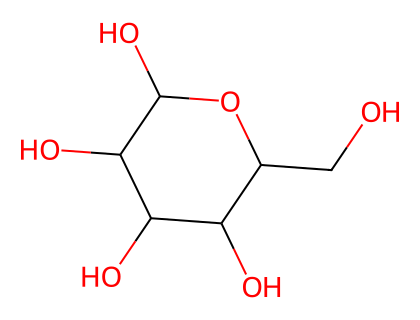
*图：D-葡萄糖 (D-glucose) 母体骨架*

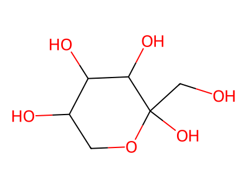
*图：D-果糖 (D-fructose) 母体骨架*

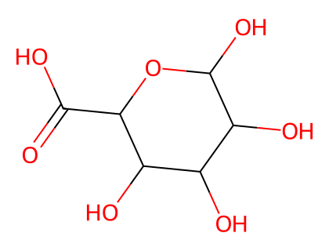
*图：D-葡萄糖醛酸 (D-glucuronic acid) 母体骨架*

---

## P-102.3 构型符号体系

### P-102.3.1 无环形式的 Fischer 投影

在这种单糖表示中，碳链垂直书写，编号最小的碳位于顶端，如 P-102.2.2 所述。为定义构型，逐一考察每个碳原子并将其置于纸平面内。相邻碳原子在下方，H 原子和 OH 基团在纸平面上方。单糖中碳原子在 Fischer 投影中的多种表示 'b'、'c'、'd'、'e' 和 'f' 如下所示（结构 'a' 是三维表示；真正的 Fischer 投影是 'd'）。表示 'c' 在本建议中常用。

（结构式 'a' 至 'f' 为 Fischer 投影的三维与平面示意，此处从略。）

### P-102.3.2 立体描述符 'D' 和 'L'

最简单的醛糖是甘油醛。它含一个手性中心，因此以两种对映体形式存在，称为 D-glyceraldehyde 和 L-glyceraldehyde；二者由下述 Fischer 投影式表示。已知这些投影对应绝对构型。构型立体描述符 'D' 和 'L' 必须以小型大写字母书写，并用连字符与糖的名称相连。构型也常由优选的 CIP 立体描述符 R 和 S 描述。

**示例：**

- D-glyceraldehyde —— (2R)-2,3-dihydroxypropanal
- L-glyceraldehyde —— (2S)-2,3-dihydroxypropanal

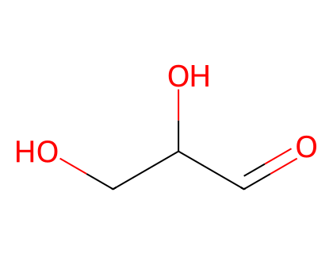
*图：D-甘油醛 (D-glyceraldehyde) 母体骨架*

### P-102.3.3 构型原子

单糖根据编号最高的手性中心的构型归属于 'D' 或 'L' 系列。这个不对称取代的碳原子称为'构型原子'（configurational atom）。因此，若该羟基在 Fischer 投影中伸向右侧，则糖属于 'D' 系列，得到 'D' 立体描述符。

**示例：** D-mannose（D-甘露糖）、L-glucose（L-葡萄糖）、L-ribose（L-核糖）、D-sorbose（D-山梨糖）

*图：D-甘露糖 (D-mannose) 母体骨架*

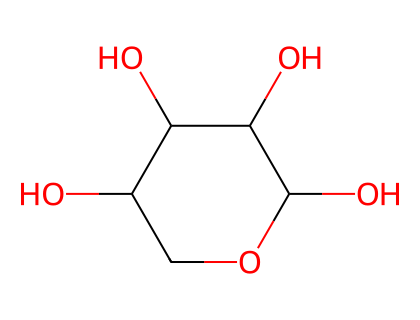
*图：D-核糖 (D-ribose) 母体骨架*

### P-102.3.4 单糖的环状形式

大多数单糖以环状半缩醛或半缩酮存在。必须考察内部成环的两个方面：第一，环的大小；第二，新产生的手性中心的构型。

#### P-102.3.4.1 环的大小

由半缩醛或半缩酮形成产生的各种可能杂环环大小中，含一个氧原子的五元环和六元环占主导，在本节讨论。其名称基于母体杂环呋喃（furan）和吡喃（pyran）的名称。命名时将 'furan' 和 'pyran' 放在糖名称的词尾 'ose' 之前。例如，D-mannose 改为 D-mannopyranose 以表示具有六元环的环状形式；此外，通称 'pyranose'（吡喃糖）包含所有具有六元环结构的糖。类似地，具有五元环结构的糖是'呋喃糖'（furanoses）；氧杂环丙糖（oxiroses）、氧杂环丁糖（oxetoses）和七环糖（septanoses）分别具有三、四或七元环状结构。

需要考虑环状形式的不同表示。

**P-102.3.4.1.1** 环状形式的 Fischer 投影中，用一条长键连接原来的醛基或酮基与包含在环内的氧原子，表示半缩醛或半缩酮的形成。

**示例：** D-glucopyranose（D-吡喃葡萄糖）、D-glucofuranose（D-呋喃葡萄糖）

**P-102.3.4.1.2** Haworth 表示是一种透视画法。环几乎垂直于纸平面取向，但从略上方观察，因此靠近观察者的边画在离观察者最远的边下方，氧在后方，'C-1' 在右端。成环过程设想为逐步进行，如 D-glucopyranose 的图 10.1 所示。

图 10.1 从 Fischer 投影重新取向为 Haworth 投影

从标准 Fischer 投影开始，需要两次重新取向以准备缩醛化或缩酮化操作：第一次重新取向，步骤 (a)，是将非末端羟基竖直放置；第二次重新取向，步骤 (c)，是在 C-5 处旋转，使氧原子位于环平面内。通过表达碳 '1' 处的构型即可完全定义该结构。

#### P-102.3.4.2 异头形式；立体描述符 'α' 和 'β'

**P-102.3.4.2.1** 在环状形式中，必须表达新产生的手性中心 'C-1' 的构型。该中心称为'异头中心'（anomeric center）。两个立体异构体称为'异头物'（anomers）；根据异头中心与所谓的'参考中心'（reference center）之间的构型关系，用立体描述符 'α' 和 'β' 指定。

**P-102.3.4.2.2** 单糖的 'α' 和 'β' 构型

具有保留名的单糖的异头参考中心是按 P-102.3.3 定义的构型原子。在 Fischer 投影中，α-异头物异头中心的环外氧原子与连接在异头参考原子上的氧原子形式上呈 'cis' 关系；β-异头物中该关系为 'trans'。确定 'cis' 和 'trans' 构型的参考平面垂直于 Fischer 投影，包含单糖的所有碳原子。

异头立体描述符 'α' 或 'β' 后接连字符，紧置于碳水化合物名称的构型立体描述符 'D' 或 'L' 之前。

**示例：** α-D-glucopyranose、α-D-glucofuranose、β-D-fructofuranose

### P-102.3.5 单糖的构象

吡喃糖采取的构象不是平面的。例如 β-D-glucopyranose 采取椅式构象，特征取代基处于平伏位置（连接在环上的氢原子未示出）。

**示例：** β-D-glucopyranose（β-D-吡喃葡萄糖，椅式构象）

### P-102.3.6 Mills 表示

在这种表示中，主要的半缩醛环画在纸平面内。楔形虚线表示纸平面下方的取代基，楔形实线表示纸平面上方的取代基。

**示例：** α-D-glucopyranose（α-D-吡喃葡萄糖，Mills 表示）

### P-102.3.7 用于表示外消旋体和不确定构型的立体描述符

#### P-102.3.7.1 表示外消旋体的立体描述符

外消旋体用立体描述符 'DL' 表示。

**示例：** α-DL-glucopyranose（D 构型与 L 构型）；β-DL-galactopyranose（D 构型与 L 构型）

#### P-102.3.7.2 异头物的混合物

当必须描述异头物的混合物时，立体描述符 'α' 和 'β' 置于名称开头，用逗号分隔；在 Haworth 表示中，符号 H 和 OH 取代异头碳原子处的正式键。

**示例：** α,β-D-glucopyranose

---

## P-102.4 母体结构的选择

当一个大分子中嵌入一个以上的单糖结构时，按下述标准选择母体结构，按给定顺序应用直到作出决定：

(a) 包含类别顺序中最优先官能团（见 P-41）的母体。若有选择，按最优先官能团出现次数最多者作出。

因此，酮糖二酸（ketoaldaric acid）/糖二酸（aldaric acid）＞ 酮糖醛酸（ketouronic acid）/糖醛酸（uronic acid）和酮糖酸（ketoaldonic acid）/糖酸（aldonic acid）＞ 二醛糖（dialdose）＞ 酮醛糖（ketoaldose）/醛糖（aldose）＞ 二酮糖（diketose）＞ 酮糖（ketose）；

(b) 链上碳原子数最多的母体，例如庚糖（heptose）优于己糖（hexose）；

(c) 按下列字母顺序排列中名称排在最前的母体：

(i) 俗名或系统名称的构型前缀。例如 glucose 优于 gulose；gluco 衍生物优于 gulo 衍生物；

示例：D-glucitol；不是 L-gulitol（见 P-102.5.6.5.1）；

(ii) 构型符号 D 优于 L；

示例：5-O-methyl-D-galactitol；不是 2-O-methyl-L-galactitol（见 P-102.5.6.5.2）；

(iii) 异头立体描述符 α 优于 β；

示例：α-D-fructofuranose β-D-fructofuranose 1,2′:1′,2-dianhydride；不是 β-D-fructofuranose α-D-fructofuranose 1,2′:1′,2-dianhydride（见 P-102.5.6.7.2）；

(d) 前缀引用的取代基团最多的母体（为此目的，桥接取代例如 2,3-O-methylene 视为多次取代）；前缀 'deoxy' 和 'anhydro' 是可分离的并按字母顺序排列，因此视为取代基团；

(e) 取代基前缀位标最低的母体；

示例：2,3,5-tri-O-methyl-D-mannitol；不是 2,4,5-tri-O-methyl-D-mannitol [见 P-102.5.6.5.3 (a)]；

(f) 首个引用的取代基位标最低的母体。

示例：2-O-acetyl-5-O-methyl-D-mannitol；不是 5-O-acetyl-2-O-methyl-D-mannitol [见 P-102.5.6.5.3 (b)]。

---

## P-102.5 单糖：醛糖和酮糖；脱氧糖和氨基糖

### P-102.5.1 醛糖

醛糖的名称是保留名或按取代规则形成的名称。含三至六个碳原子的醛糖的保留名和半系统碳水化合物名称列于表 10.2。

含六个以上碳原子的醛糖名称按两种方式形成：用系统碳水化合物命名的程序，或用系统取代命名的程序。

#### P-102.5.1.1 系统碳水化合物名称

醛糖的系统碳水化合物名称由词干名和一个或多个构型前缀组成。含三至十个碳原子的醛糖的词干名是 triose、tetrose、pentose、hexose、heptose、octose、nonose 和 decose。碳链的编号使羰基得到位标 '1'。

**P-102.5.1.1.1** 糖的 >CH-OH 基团的构型由表 10.2 所列的构型前缀（如 'glycero'、'gluco'、'manno' 等）指定。每个名称都冠以 'D' 或 'L' 立体描述符，按 P-102.3.2 定义。

**示例：**

- D-manno-hexose（系统碳水化合物名称）
- D-mannose（保留名）

**P-102.5.1.1.2** 由四个以上手性中心组成的醛糖，通过在词干名上添加两个或更多构型前缀（列于表 10.2）来命名。前缀按四个一组依次分配给手性中心，从紧邻醛基的那一组开始。与醛基距离最远的碳原子组（可能含少于四个手性中心）相关的前缀先引用。

**示例：**

- D-glycero-D-gluco-heptose（不是 D-gluco-D-glycero-heptose）
- (2R,3S,4R,5R,6R)-2,3,4,5,6,7-hexahydroxyheptanal

**P-102.5.1.1.3** 当手性中心序列被非手性中心分隔时，忽略非手性中心，剩余的手性中心组被指定以相应的构型前缀（四个或更少中心时用一个，四个以上中心时用多个）。

**示例：**

- 3,6-dideoxy-L-threo-L-talo-decose（脱氧糖见 P-102.5.3）
- (2R,4S,5R,7R,8S,9S)-2,4,5,7,8,9,10-heptahydroxydecanal

**P-102.5.1.1.4** 环状形式

对于含六个以上碳原子的单糖，异头参考中心是参与杂环并被单一构型前缀指定的、紧邻异头中心的那组手性中心中编号最高的原子。在 α-异头物中，Fischer 投影中异头中心的环外氧原子与连接在异头参考原子上的氧原子形式上呈 'cis'；β-异头物中这两个氧原子形式上呈 'trans'。

**示例：**

- L-glycero-α-D-manno-heptopyranose
- (2S,3S,4S,5S,6R)-6-[(1S)-1,2-dihydroxyethyl]oxane-2,3,4,5-tetrol

### P-102.5.2 酮糖

#### P-102.5.2.1 分类

酮糖按（潜在）羰基位置的最低位标分为 2-酮糖、3-酮糖等。

#### P-102.5.2.2 保留名

保留名和结构见表 10.3；构型由 'D' 或 'L' 立体描述符指定，按 P-102.3.2 定义。

#### P-102.5.2.3 系统碳水化合物名称

含四至六个碳原子的酮糖的系统碳水化合物名称由词干名和表 10.3 所列的相应构型前缀组成。词干名由相应醛糖词干名的词尾 'ose' 改为 'ulose' 形成，前冠以羰基的位标，例如 'pent-2-ulose' 和 'hex-3-ulose'。碳链的编号使羰基得到尽可能低的位标。当羰基位于含奇数个碳原子的链中间时，按 P-102.4 在替代名称之间作出选择。

对于 2-酮糖，构型前缀的给出方式与醛糖相同。

取代名称跟在'系统碳水化合物名称'之后给出，以说明碳水化合物命名中推荐的两种系统名称。

**示例：**

- L-xylo-hex-2-ulose（L-sorbose 的系统碳水化合物名称）
- L-glycero-D-manno-oct-2-ulose
- (3S,4S,5R,6R,7S)-1,3,4,5,6,7,8-heptahydroxyoctan-2-one

对于羰基位于 C-3 或更高编号碳原子的酮糖，忽略羰基，并按表 10.3 给手性中心组指定以相应的前缀或前缀组。

**示例：**

- D-arabino-hex-3-ulose
- (2R,4R,5R)-1,2,4,5,6-pentahydroxyhexan-3-one
- L-threo-D-allo-non-3-ulose
- (2S,4R,5R,6R,7R,8S)-1,2,4,5,6,7,8,9-octahydroxynonan-3-one

不是：

- L-gluco-hept-4-ulose
- [不是 D-gulo-hept-4-ulose；gluco 在字母数字顺序中更靠前，见 P-102.4 (c)]
- (2R,3S,5S,6S)-1,2,3,5,6,7-hexahydroxyheptan-4-one
- [不是 (2S,3S,5S,6R)-1,2,3,5,6,7-hexahydroxyheptan-4-one；有选择时，R 构型被指定以最低位标，见 P-14.4 (j)]

不是：

- L-erythro-L-gluco-non-5-ulose
- [不是 D-threo-D-allo-non-5-ulose；erythro-gluco 在字母数字顺序中更靠前]
- (2R,3S,4R,6S,7S,8S)-1,2,3,4,6,7,8,9-octahydroxynonan-5-one

### P-102.5.3 脱氧糖

**P-102.5.3.1** 前缀 'deoxy' 描述去除一个 'oxy' 基团 -O-，氢原子随之回接。在本建议中，前缀 'deoxy' 归类为可分离的（detachable），即它按字母顺序排列在取代命名产生的取代基之中。这是对先前状态的更改（见 R-0.1.8.4，文献 2），先前将前缀 'deoxy' 归入不可分离前缀（nondetachable prefixes）一类（前缀 'anhydro' 现在也归类为可分离的，并排列在所有可分离前缀之中）。

**P-102.5.3.2** 俗名。

下列名称保留：岩藻糖（fucose）、鸡纳糖（quinovose）和鼠李糖（rhamnose）。相应结构以吡喃糖形式示出。

- α-L-fucopyranose —— 6-deoxy-α-L-galactopyranose
- β-D-quinovopyranose —— 6-deoxy-β-D-glucopyranose
- L-rhamnopyranose —— 6-deoxy-L-mannopyranose

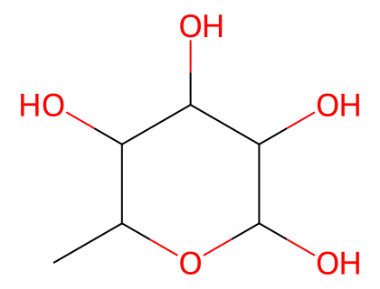
*图：L-岩藻糖 (L-fucose) 母体骨架*

*图：L-鼠李糖 (L-rhamnose) 母体骨架*

**P-102.5.3.3** 由保留名衍生的碳水化合物名称

当脱氧不涉及任何手性中心的构型时，前缀 'deoxy' 与保留名组合使用，例如 6-deoxy-D-allose。但葡萄糖、甘露糖和半乳糖的 6-脱氧衍生物有自己的保留俗名（见 P-102.5.3.2）。当前缀 'deoxy' 修饰手性中心时，优选碳水化合物名称：用 CIP 立体描述符按取代命名形成的名称是合适的（示例见 P-102.5.3.4）。

'氨基'（amino）和 'deoxy' 在同一位置的组合（以及在取代命名中总是以前缀引用的、P-59.1.9 所述前缀与同一位置的 'deoxy' 的组合）是允许的。

**P-102.5.3.4** 系统碳水化合物名称

系统碳水化合物名称由前缀 'deoxy' 组成，前冠以相应的位标，后接词干名及描述脱氧化合物中存在的手性中心所必需的构型前缀。构型前缀从距 C-1 最远的一端开始按顺序引用。不推荐将前缀 'deoxy' 与醛糖和酮糖的保留名连用。

**示例：**

- 2-deoxy-D-erythro-pentofuranose（常称为 2-deoxy-D-ribofuranose 或 2-deoxy-D-ribose）
- (2ξ,4S,5R)-5-(hydroxymethyl)oxolane-2,4-diol
- 4-deoxy-β-D-xylo-hexopyranose（不是 4-deoxy-β-D-galactopyranose）
- (2R,3R,4S,6S)-6-(hydroxymethyl)oxane-2,3,4-triol
- 2-deoxy-D-ribo-hexose（不是 2-deoxy-D-allose）
- (3S,4S,5R)-3,4,5,6-tetrahydroxyhexanal
- 2,6-dideoxy-α-L-arabino-hexopyranose
- (2R,4S,5R,6S)-6-methyloxane-2,4,5-triol
- 1-deoxy-L-glycero-D-altro-oct-2-ulose
- (3S,4R,5R,6R,7S)-3,4,5,6,7,8-hexahydroxyoctan-2-one

当 -CH₂- 基团将手性中心分为两组时，为指定构型前缀而忽略该基团；所指定的前缀应覆盖手性中心的整个序列（见醛糖）（见 P-102.5.1.1.3）。

**示例：**

- 3,6,10-trideoxy-L-threo-L-talo-decose
- (2R,4S,5R,7R,8R,9S)-2,4,5,7,8,9-hexahydroxydecanal

### P-102.5.4 氨基糖

将单糖或单糖衍生物中非异头羟基的羟基替换为氨基，设想为将相应脱氧单糖的适当氢原子用氨基取代。携带氨基的碳原子处的构型按醛糖的构型表达，即认为氨基已替换了羟基。

相反，将羟基替换为巯基视为官能团置换，用前缀 'thio' 表示。

#### P-102.5.4.1 氨基糖

**P-102.5.4.1.1** 俗名

下列糖胺（glycosamine）名称被保留。

- D-galactosamine —— 2-amino-2-deoxy-D-galactose
- D-glucosamine —— 2-amino-2-deoxy-D-glucose
- D-mannosamine —— 2-amino-2-deoxy-D-mannose
- D-fucosamine —— 2-amino-2,6-dideoxy-D-galactose
- D-quinovosamine —— 2-amino-2,6-dideoxy-D-glucose
- N-acetyl-D-galactosamine —— 2-acetamido-2-deoxy-D-galactopyranose

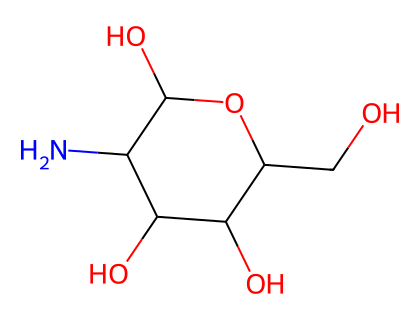
*图：D-氨基葡萄糖 (D-glucosamine) 母体骨架*

*图：D-半乳糖胺 (D-galactosamine) 母体骨架*

**P-102.5.4.1.2** 系统碳水化合物名称

系统碳水化合物名称分两步形成：第一步，在第二步中引入氨基的碳原子处通过脱氧作用创建一个脱氧糖；第二步通过取代形成取代胺的名称。取代胺的名称用取代氨基的名称作为前缀来形成。

**示例：**

- 3,4,6-trideoxy-3-(dimethylamino)-D-xylo-hexose
- (2R,3S,5R)-3-(dimethylamino)-2,5-dihydroxyhexanal

### P-102.5.5 硫代糖和其他硫族类似物

将醛糖或酮糖的羟基氧原子，或无环醛糖或酮糖羰基的氧原子，替换为硫、硒或碲，用前缀 'thio'、'seleno' 或 'telluro' 表示，前冠以相应位标，置于醛糖或酮糖的系统名称或俗名之前。在碳水化合物命名中，前缀 'thio'、'seleno' 和 'telluro' 视为可分离的、按字母顺序排列的前缀。

将醛糖或酮糖环状形式的环氧原子替换为硫、硒或碲，用同样的方式表示，用环中非异头的相邻碳原子的编号作为位标。在这种情况下，不推荐用 'a' 置换前缀表达骨架置换。

亚砜（以及硒氧化物或碲氧化物）和砜（以及硒砜或碲砜）用官能类别命名（functional class nomenclature）命名（亚砜和砜的官能类别名称见 P-63.6）。

**示例：**

- 2-thio-α-D-glucopyranose
- 5-thio-β-D-galactopyranose
- β-D-glucopyranosyl phenyl sulfoxide（糖基见 P-102.6.1.1）
- (2S,3R,4S,5S,6R)-2-(benzenesulfinyl)-6-(hydroxymethyl)oxane-3,4,5-triol

### P-102.5.6 单糖衍生物

#### P-102.5.6.1 O-取代

为保持结构的完整性并利用保留名隐含绝对构型的优点，碳水化合物命名允许 O-取代。替换单糖或单糖衍生物醇式羟基氢原子的取代基记作 O-取代基。异头羟基的取代在 P-102.5.6.3.2 中讨论。同一原子或基团多次取代时，O-位标不重复。数字位标按需用于指明取代基位置；全部位置被相同原子或基团完全取代的化合物不需要位标。

**P-102.5.6.1.1** O-乙酰化和 O-烷基化官能化。

对于 O-酰基衍生物，单糖名称后另起一词、以 'ate' 结尾的酸组分名称比使用 O-酰基前缀的名称更受推荐。然而当 ose 词尾被改变（例如表示糖基或优先于酯的酸官能）时，需要 O-酰基前缀。O-烷基衍生物总是用前缀表达。

**示例：**

- 6-O-trityl-β-D-glucopyranose 2,4-diacetate
- 2,3,4,6-tetra-O-methyl-β-D-glucopyranose
- 4,6-di-O-methyl-β-D-galactopyranose
- phenyl β-D-glucopyranoside 6-(ethyl carbonate)
- D-mannose 2,3,4,5,6-pentabenzoate

**P-102.5.6.1.2** 磷酸酯

糖与磷酸的酯通常称为'磷酸酯'（phosphates）。在生物化学用法中，术语 'phosphate' 无论电离状态或存在的抗衡离子如何均指磷酸残基。然而系统命名必须区分真正的磷酸酯 -O-PO(O⁻)₂ 和酸式磷酸酯即 -O-PO(OH)₂（称为二氢磷酸酯 dihydrogen phosphate）。前缀 'phosphono'（表示 -PO(OH)₂）和 'phosphonato'（表示 PO(O⁻)₂）也用于表示 O-膦酸衍生物。

术语 'phospho' 在生物化学语境中代替 'phosphono' 和 'phosphonato' 使用。

当糖被两个或更多磷酸基团酯化时，使用数字词 'bis'、'tris'，如 'bis(phosphate)'、'tris(phosphate)'。

膦酸酯（phosphonates）的处理方式与磷酸酯相同。

**示例：**

- D-glucopyranose 6-(dihydrogen phosphate) —— 6-O-phosphono-D-glucopyranose
- α-D-glucopyranosyl phosphate —— α-D-glucopyranose 1-phosphate
- D-glucopyranose 6-phosphate —— 6-O-phosphonato-D-glucopyranose
- D-fructofuranose 1,6-bis(phosphate) —— 1,6-di-O-phosphonato-D-fructofuranose
- methyl β-D-arabinofuranoside 5-(hydrogen phosphonate) —— methyl 5-deoxy-β-D-arabinofuranosid-5-yl hydrogen phosphonate

**P-102.5.6.1.3** 硫酸酯

糖与硫酸的酯通过在糖的名称后加 'sulfate' 一词命名，并给出相应的位标。前缀 'sulfo'（表示 -SO₃H）和 'sulfonato'（表示 SO₃⁻）可用于表示 O-衍生物。

**示例：**

- α-D-glucopyranose 2-sulfate —— 2-O-sulfonato-α-D-glucopyranose

#### P-102.5.6.2 糖苷

**P-102.5.6.2.1** 定义

Glycose 是单糖的较少使用的术语。糖苷（glycosides）是由单糖环状形式衍生的混合缩醛（缩酮），因此具有 O-取代的异头 -OH 基团，如 -OR。糖苷术语的完整讨论见文献 27。

**P-102.5.6.2.2** 名称

糖苷用官能类别命名法命名。类别名 'glycoside' 适用于每种环状单糖的名称，将名称末尾的字母 'e' 改为 'ide'，例如 glucopyranose 变为 glucopyranoside，fructofuranose 变为 fructofuranoside。类别名称前，作为单独的词，是作为缩醛或缩酮官能一部分的取代基团名称。

**示例：**

- methyl α-D-gulofuranoside
- ethyl β-D-fructopyranoside

#### P-102.5.6.3 C-取代

**P-102.5.6.3.1** 非末端碳原子上的取代

化合物按 C-取代单糖命名。按 CIP 优先系统具有优先权的基团视为与 -OH 等价以指定构型。任何歧义（例如在发生成环的碳原子处）都通过用 R,S 系统指定被修饰手性中心处的构型来避免。

**示例：**

- 2-C-phenyl-β-D-glucopyranose
- (2R,3R,4S,5S,6R)-6-(hydroxymethyl)-3-phenyloxane-2,3,4,5-tetrol
- 5-C-bromo-β-D-glucopyranose pentaacetate
- (2R,3R,4R,5S,6S)-6-[(acetyloxy)methyl]-6-bromooxane-2,3,4,5-tetrayl tetraacetate

**P-102.5.6.3.2** 替换非末端羟基的取代

化合物按脱氧糖的取代衍生物命名。替换 -OH 的基团决定构型。任何潜在歧义都必须通过使用 R,S 系统处理。R,S 系统必须用于指定双重取代手性中心的优选构型；此方法优于通过使具有高 CIP 优先权的取代基与 -OH 基团等价来建立构型的方法。

**示例：**

- 2-deoxy-2-phenyl-α-D-glucopyranose —— 2-deoxy-2-C-phenyl-α-D-glucopyranose
- (2R)-2-deoxy-2-phenyl-α-D-arabino-hexopyranose
- (2S,3R,4R,5S,6R)-6-(hydroxymethyl)-3-phenyloxane-2,4,5-triol
- 2-bromo-2-deoxy-α-D-glucopyranose
- (2R)-2-bromo-2-chloro-2-deoxy-α-D-arabino-hexopyranose
- 2-bromo-2-chloro-2-deoxy-α-D-glucopyranose
- (2S,3R,4S,5S,6R)-3-bromo-3-chloro-6-(hydroxymethyl)oxane-2,4,5-triol
- 2-C-acetamido-2,3,4,6-tetra-O-acetyl-β-D-mannopyranosyl fluoride
- (2S,3S,4S,5R,6R)-3-acetamido-6-[(acetyloxy)methyl]-2-fluorooxane-3,4,5-triyl triacetate

**P-102.5.6.3.3** 末端碳原子上的取代

碳水化合物链末端碳原子上的取代产生新的手性中心；构型用 'R/S' 系统表示。优选名称按取代命名形成。

**示例：**

- (5R)-5-C-cyclohexyl-5-C-phenyl-D-xylose
- (2R,3S,4S,5R)-5-cyclohexyl-2,3,4,5-tetrahydroxy-5-phenylpentanal
- 1-phenyl-D-glucose
- (2R,3S,4R,5R)-2,3,4,5,6-pentahydroxy-1-phenylhexan-1-one
- 1-C-phenyl-β-D-glucopyranose
- (2R,3R,4S,5S,6R)-6-(hydroxymethyl)-2-phenyloxane-2,3,4,5-tetrol

#### P-102.5.6.4 N-取代

氨基糖 -NH₂ 基上的取代以两种不同方式处理：

(1) 整个被取代的氨基作为前缀指定，如 2-acetamido-2-deoxy-D-glucose 或 2-(butylamino)-2-deoxy-D-glucose。

(2) 若氨基糖有保留俗名，则取代用前冠以大写斜体字母 N 的前缀表示。

**示例：**

- 2-acetamido-2-deoxy-β-D-glucopyranose —— N-acetyl-β-D-glucosamine
- 4-acetamido-4-deoxy-β-D-glucopyranose

#### P-102.5.6.5 糖醇

糖醇（alditols）通过将相应醛糖名称中的词尾 'ose' 改为 'itol' 命名。

**P-102.5.6.5.1** 母体结构的选择

当同一糖醇可由两种不同醛糖中的任何一种、或由醛糖和酮糖衍生时，推荐结构按规则 P-102.4 衍生，但保留名 fucitol 和 rhamnitol 除外。

**示例：**

- D-glucitol（不是 L-gulitol）、D-arabinitol（不是 D-lyxitol）

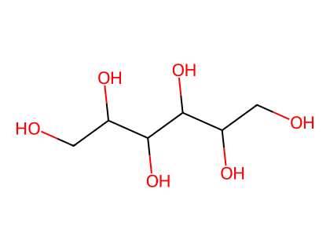
*图：D-葡萄糖醇 (D-glucitol) 母体骨架*
- L-fucitol —— 1-deoxy-D-galactitol、L-rhamnitol —— 1-deoxy-L-mannitol

**P-102.5.6.5.2** meso-形式

前缀 'meso' 必须包含在赤藓糖醇（erythritol）、核糖醇（ribitol）和半乳糖醇（galactitol）的优选名称中。当 'meso' 形式的衍生物因取代而变为不对称时，必须给出立体描述符 'D' 或 'L'。当存在四个以上连续手性中心时，也有必要使用立体描述符 'D' 或 'L'。

**示例：**

- 5-O-methyl-D-galactitol（'D' 构型优先于 'L'；见 P-102.4）
- meso-D-glycero-L-ido-heptitol（'D' 构型优先于 'L'；见 P-102.4）
- (2R,3S,4r,5R,6S)-heptane-1,2,3,4,5,6,7-heptol（注意位标 '1' 必须移到糖醇的另一端）

**P-102.5.6.5.3** 取代糖醇母体结构的选择

母体结构必须具有：

(a) 按规则 P-102.4 标准 (e)，取代基前缀的最低可能的位标；

示例：2,3,5-tri-O-methyl-D-mannitol（不是 2,4,5-tri-O-methyl-D-mannitol）

(b) 按规则 P-102.4 标准 (f)，按字母数字顺序第一个引用的取代基的最低可能的位标。

示例：2-O-butyl-5-O-methyl-D-mannitol（不是 5-O-butyl-2-O-methyl-D-mannitol）

**P-102.5.6.5.4** 氨基糖醇

由半乳糖胺和葡糖胺衍生的糖醇是氨基糖醇（aminoalditols）。它们分别有保留名 galactosaminitol 和 glucosaminitol。

**示例：**

- D-glucosaminitol —— 2-amino-2-deoxy-D-glucitol
- D-galactosaminitol —— 2-amino-2-deoxy-D-galactitol
- 2-deoxy-2-(N-methylacetamido)-D-glucitol 1,3,4,5,6-pentaacetate

#### P-102.5.6.6 单糖羧酸

**P-102.5.6.6.1** 分类

**P-102.5.6.6.2** 糖酸（Aldonic acids）。由醛糖的醛基氧化为羧酸而形式上衍生的一元羧酸称为糖酸（aldonic acids）。

**P-102.5.6.6.3** 酮糖酸（Ketoaldonic acids）。由糖酸的仲 -CHOH 基氧化为羰基而形式上衍生的含氧羧酸称为酮糖酸（ketoaldonic acids）。

**P-102.5.6.6.4** 糖醛酸（Uronic acids）。由醛糖的末端 -CH₂OH 基氧化为羧基而形式上衍生的羧酸称为糖醛酸（uronic acids）。

**P-102.5.6.6.5** 糖二酸（Aldaric acids）。由醛糖的两个末端基团（-CHO 和 -CH₂OH）都氧化为羧基而形成的羧酸称为糖二酸（aldaric acids）。

**P-102.5.6.6.2** 糖酸

糖酸按链上碳原子数分为醛糖三酸（aldotrionic acids）、醛糖四酸（aldotetronic acids）等。个别化合物的名称通过将醛糖的保留名或系统名称中的词尾 'ose' 改为 'onic acid' 形成。位标 1 指定给羧基。

**示例：**

- D-galactonic acid
- 2-deoxy-2-(methylamino)-D-gluconic acid

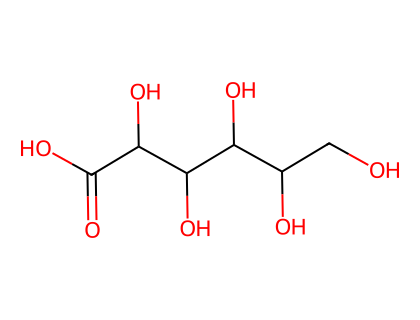
*图：D-半乳糖酸 (D-galactonic acid) 母体骨架*

**P-102.5.6.6.2.1** 糖酸的衍生物

糖酸视为具有保留名的羧酸。它们可以如 P-65 和 P-66 中系统命名所述形成盐、酯、酸酐、酰基和酰卤及拟卤化物、酰胺、酰肼、腈和硫族类似物。

**示例：**

- propan-2-yl D-gluconate
- methyl 3,4-di-O-methyl-D-galactonate
- L-xylonamide
- methyl 3-deoxy-D-threo-pentonate
- 2,3,4,5,6-penta-O-acetyl-D-gluconoyl chloride

**P-102.5.6.6.2.2** 内酯和内酰胺分别通过改写规则 P-65.6.3.5.1 和 P-66.1.5 命名。内酯或内酰胺术语前使用两个位标：第一个是表示羧基位置的位标 1；第二个表示碳链上的连接位置。命名内酰胺时，必须生成并引用氨基 -NH₂。不推荐使用希腊字母表示内酯或内酰胺环的大小。名称也可以按第 P-1 至 P-9 章所述规则在杂环基础上按取代命名形成。

**示例：**

- D-glucono-1,4-lactone
- (3R,4R,5R)-5-[(1R)-1,2-dihydroxyethyl]-3,4-dihydroxyoxolan-2-one
- D-glucono-1,5-lactone
- (3R,4S,5S,6R)-3,4,5-trihydroxy-6-(hydroxymethyl)oxan-2-one
- 5-amino-5-deoxy-D-galactono-1,5-lactam
- (3R,4S,5S,6R)-3,4,5-trihydroxy-6-(hydroxymethyl)piperidin-2-one

**P-102.5.6.6.3** 酮糖酸

**P-102.5.6.6.3.1** 个别酮糖酸的名称通过将相应酮糖名称中的词尾 'ulose' 改为 'ulosonic acid' 形成，前冠以酮基的位标。编号从羧基开始。

**示例：**

- 2,3,4,6-tetra-O-acetyl-D-arabino-hex-5-ulosonic acid
- (2S,3R,4S)-2,3,4,6-tetrakis(acetyloxy)-5-oxohexanoic acid
- 3-deoxy-α-D-manno-oct-2-ulopyranosonic acid
- (2R,4R,5R,6R)-6-[(1R)-1,2-dihydroxyethyl]-2,4,5-trihydroxyoxane-2-carboxylic acid

**P-102.5.6.6.3.2** 酮糖酸的糖苷通过将名称中的组分 'pyranose' 改为 'pyranoside' 命名，得到 '-ulopyranosidonic acid'。酮糖酸衍生物的名称按 P-102.5.6.6.2 中糖酸的命名形成。当糖苷被酯化时，用括号将名称的糖苷部分隔离。

**示例：**

- ethyl (methyl α-D-fructopyranosid)onate —— ethyl (methyl α-D-arabino-hex-2-ulopyranosid)onate
- ethyl (2R,3S,4R,5R)-3,4,5-trihydroxy-2-methoxyoxane-2-carboxylate

**P-102.5.6.6.4** 糖醛酸

**P-102.5.6.6.4.1** 个别糖醛酸的名称通过将相应醛糖的保留名或系统名称中的词尾 'ose' 改为 'uronic acid' 形成。醛糖的编号保持不变；位标 '1' 仍指定给（潜在的）醛基。

**示例：**

- D-glucuronic acid
- α-D-glucopyranuronic acid
- β-D-galactopyranuronic acid

**P-102.5.6.6.4.2** 糖醛酸的糖苷通过将酸的名称中的 'pyran' 组分改为 'pyranoside'、省略末尾字母 'e' 命名，得到 'pyranosiduronic acid'。

**示例：**

- methyl β-D-glucopyranosiduronic acid

**P-102.5.6.6.4.3** 糖醛酸的衍生物按 P-102 及 P-65 和 P-66 指示命名。

**示例：**

- ethyl (methyl β-D-glucopyranosid)uronate
- N,N-dimethyl(methyl β-D-glucopyranosid)uronamide
- (5R)-1,2,3,4-tetra-O-acetyl-5-C-bromo-α-D-xylo-hexopyranuronic acid
- (2R,3S,4R,5R,6R)-3,4,5,6-tetrakis(acetyloxy)-2-bromooxane-2-carboxylic acid

**P-102.5.6.6.5** 糖二酸

**P-102.5.6.6.5.1** 糖二酸的名称通过将母体醛糖的保留名或系统名称中的 'ose' 词尾改为 'aric acid' 形成。母体结构的选择按 P-102.4 和 P-102.5.6.5.1 作出。为清晰起见，必须将立体描述符 'meso' 添加到相应糖二酸的名称中。

**示例：**

- L-altraric acid（不是 L-talaric acid）
- meso-xylaric acid
- 4-O-methyl-D-xylaric acid（不是 2-O-methyl-L-xylaric acid）

**P-102.5.6.6.5.2** 酒石酸（tartaric acid）是用于描述与母体醛糖赤藓糖（erythrose）和苏糖（threose）相应的糖二酸的保留名。'R' 和 'S' 是表示酒石酸构型的优选立体描述符。盐和酯称为酒石酸盐（tartrates）。

**示例：**

- (2R,3R)-2,3-dihydroxybutanedioic acid —— (2R,3R)-tartaric acid —— L-threaric acid —— (+)-tartaric acid
- (2S,3S)-2,3-dihydroxybutanedioic acid —— (2S,3S)-tartaric acid —— D-threaric acid —— (-)-tartaric acid
- (2R,3S)-2,3-dihydroxybutanedioic acid —— (2R,3S)-tartaric acid —— erythraric acid —— meso-tartaric acid

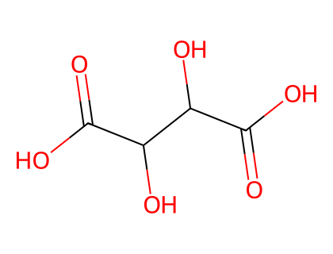
*图：酒石酸 (tartaric acid) 母体骨架*

**P-102.5.6.6.5.3** 通过修饰羧基（变为酯、酰胺、酰肼、腈、酰胺酸等）形成的糖二酸衍生物按 P-102.5.6.6.2.1、P-65 和 P-66 所述方法命名。

**示例：**

- 1-methyl hydrogen L-altrarate —— 6-methyl hydrogen L-altrarate
- 6-amino-6-deoxy-6-oxo-D-gluconic acid —— D-glucar-6-amic acid
- methyl 6-amino-6-deoxy-6-oxo-D-gluconate —— 1-methyl D-glucar-6-amate

#### P-102.5.6.7 酸酐

酸酐是单糖的分子内或分子间衍生物。

**P-102.5.6.7.1** 分子内酸酐

分子内醚（通常称为分子内酸酐），形式上由单糖（醛糖、酮糖）或单糖衍生物一个分子中两个羟基消去一分子水而成，通过将可分离前缀 'anhydro'（前冠以标识两个羟基的一对位标）添加到单糖的名称命名。

**示例：**

- 1,5-anhydro-D-galactitol
- (2R,3R,4R,5S)-2-(hydroxymethyl)oxane-3,4,5-triol
- 3,6-anhydro-2,4,5-tri-O-methyl-D-glucose
- (2R)-2-[(2S,3R,4R)-3,4-dimethoxyoxolan-2-yl]-2-methoxyacetaldehyde

**P-102.5.6.7.2** 分子间酸酐

两个单糖分子消去两分子水缩合的环状产物（通常称为分子间酸酐）通过将术语 'dianhydride' 放在两个母体单糖的名称之后命名。当两个母体不同时，按母体结构的选择标准（见 P-102.4）优先的母体先引用。每个酸酐键的位置用一对位标表示，表明所涉及的两个羟基的位置，与一个单糖相关的位标（在混合酸酐中为第二个命名的单糖）加撇号。该对位标紧置于术语 'dianhydride' 之前。

**示例：**

- α-D-fructopyranose β-D-fructopyranose 1,2′:1′,2-dianhydride
- [α-D-fructopyranose 先引用；按 P-102.4 (c)，α 先于 β]
- (3R,4R,5S,6R,9S,12R,13R,14S)-1,7,10,15-tetraoxadispiro[5.2.59.26]hexadecane-3,4,5,12,13,14-hexol

---

## P-102.6 作为取代基团的单糖和衍生物

### P-102.6.1 糖基

#### P-102.6.1.1 糖基

**P-102.6.1.1.1** 通过从环状单糖去除异头羟基形成的取代基团，通过将单糖名称的末尾字母 'e' 改为 'yl' 命名。术语'糖基残基'（glycosyl residue）用于碳水化合物命名。此类术语在命名糖苷（当其非母体结构时）和低聚糖时广泛使用。

取代基名称不加位标以表示游离价的位。正弦曲线表示游离价，如系统命名对环状取代基团所推荐的。

**示例：**

- β-D-glucopyranosyl（示出位置 1 处的氢原子）

**P-102.6.1.1.2** 当游离价通过在碳 '1' 处减去一个氢原子形成时，取代基团按糖基命名，但羟基的存在通过在碳 '1' 处的取代表示。在这种情况下，立体描述符 'α' 或 'β' 指游离价，而非 -OH 基团。

**示例：**

- 1-hydroxy-α-D-galactopyranosyl

#### P-102.6.1.2 O-糖基化合物

通过从异头 -OH 基去除一个氢原子形成的取代基团，视为由 'glycosyl' 基团和 'oxy' 基团形成的复合取代基团。在示例中，名称通过用类别优先序确定要指定给单糖或苷元（aglycone）组分的主特征基团形成。

**示例：**

- β-D-glucopyranosyloxy
- 1-[4-(β-D-glucopyranosyloxy)phenyl]ethan-1-one
- [不是 4′-(β-D-glucopyranosyloxy)acetophenone；acetophenone 不能被取代（见 P-64.2.1.2）]
- （不是 4-acetylphenyl β-D-glucopyranoside；酮优先于羟基化合物）
- 21β-carboxy-11-oxo-30-norolean-12-en-3β-yl (2-O-β-D-glucopyranosyluronic acid)-α-D-glucopyranosiduronic acid
- 4-[(2R)-2-amino-3-hydroxy-2-methylpropanamido]-N-{1-[(2R,5S,6R)-5-{[4,6-dideoxy-4-(dimethylamino)-α-D-glucopyranosyl]oxy}-6-methyloxan-2-yl]-2-oxo-1,2-dihydropyrimidin-4-yl}benzamide
- 说明：主官能是酰胺；环状酰胺 benzamide 优先于无环酰胺 propanamide。

#### P-102.6.1.3 N-糖基化合物（糖基胺）

N-糖基衍生物按糖基胺（glycosylamines）命名。

**示例：** α-D-fructopyranosylamine

#### P-102.6.1.4 C-糖基化合物

形式上由糖苷羟基与结合在碳原子上的氢原子消去一分子水（从而形成 C-C 键）而成的化合物，用相应的糖基命名。

**示例：**

- 6-(β-D-glucopyranosyl)-5,7-dihydroxy-2-(4-hydroxyphenyl)-4H-chromen-4-one
- 6-(β-D-glucopyranosyl)-5,7-dihydroxy-2-(4-hydroxyphenyl)-4H-1-benzopyran-4-one
- 6-(β-D-glucopyranosyl)-4′,5,7-dihydroxyflavone

#### P-102.6.1.5 糖基卤化物、拟卤化物和酯

糖基卤化物和拟卤化物用官能类别命名法命名，将类别名 'chloride'（氯化物）、'isocyanate'（异氰酸酯）等作为单独的词加到相应糖基的名称后。位置 1 处含氧酸的酯按其他位置酯的处理方式处理（见 P-102.5.6.1）。

**示例：**

- 2,3,4,6-tetra-O-acetyl-α-D-glucopyranosyl bromide
- 2,3-diazido-6-bromo-2,3,6-trideoxy-α-D-mannopyranose 4-benzoate 1-nitrate

### P-102.6.2 非糖基取代基团

氢原子可以从单糖除 C-1 外的任何位置去除。这种游离价的形成用后缀 'yl' 表示，但需要位标表示游离价的位置，以区别于糖基取代基（其位标 '1' 省略）。这些前缀可以通过将单糖的系统名称或俗名的末尾字母 'e' 改为 n-C-yl、n-O-yl 形成。当游离价来自仅连接氢原子的位置时，省略符号 'C'。

**示例：**

- 1-deoxy-D-fructos-1-yl
- 2-amino-2-deoxy-D-glucos-2-C-yl
- D-glucos-2-C-yl
- methyl β-D-ribopyranosid-2-O-yl
- (β-D-glucopyranos-2-O-yl)acetic acid
- （不是 2-O-(carboxymethyl)-β-D-glucopyranose；此名称不是按 P-102.6.1.2 构造的；羧酸优先于羟基化合物）

---

## P-102.7 二糖和低聚糖

二糖和低聚糖的名称按上述单糖的原理、规则和约定形成。

### P-102.7.1 二糖

**P-102.7.1.1** 无游离半缩醛基的二糖

可视为由两个糖苷（异头）羟基消去一分子水而成的二糖，按糖基糖苷（glycosyl glycosides）命名。母体（作为'糖苷'引用）按 P-102.4 所述标准选择。名称中必须引用两个异头描述符。

**示例：**

- β-D-fructofuranosyl α-D-glucopyranoside
- （不是 α-D-glucopyranosyl β-D-fructofuranoside；fructo 在字母顺序中先于 gluco）
- sucrose（蔗糖，俗名）

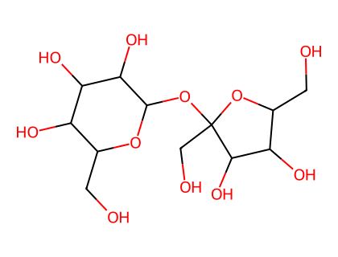
*图：蔗糖 (sucrose) 母体骨架*

**P-102.7.1.2** 有游离半缩醛基的二糖

可视为由一个糖苷（异头）羟基和一个醇式羟基消去一分子水而成的二糖，按糖基糖（glycosylglycoses）命名。完整名称中必须引用位标和异头描述符。

有两种既定的位标引用方法：

(1) 组分之间用括号，用箭头从糖基组分的位标指向糖组分的位标；

(2) 在糖基组分的开头。

**示例：**

(1) α-D-glucopyranosyl-(1→4)-β-D-glucopyranose

(2) 4-O-α-D-glucopyranosyl-β-D-glucopyranose

- β-maltose（β-麦芽糖，俗名；不是 β-D-maltose）

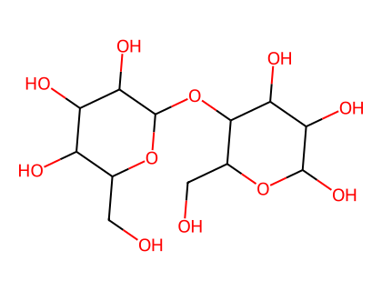
*图：麦芽糖 (maltose) 母体骨架*

### P-102.7.2 低聚糖

低聚糖是多组分糖类，一般含有两个以上单糖单元。根据单元数目，称为三糖（trisaccharides）、四糖（tetrasaccharides）等。在成为多糖之前所涉及的单元数目未作规定。

**P-102.7.2.1** 无游离半缩醛基的低聚糖

例如，三糖按需要命名为糖基糖基糖苷（glycosylglycosyl glycoside）或糖基糖基糖苷（glycosyl glycosylglycoside）。对两个通过其异头位置相连、作为'糖苷'部分引用的残基之间作出选择，可依据 P-102.4。或者，可不顾 P-102.4 使用顺序（端到端）命名方法。名称按命名二糖的优选方法形成。

**示例：**

- β-D-fructofuranosyl α-D-galactopyranosyl-(1→6)-α-D-glucopyranoside（选择葡萄糖而非果糖作为'糖苷'）
- α-D-galactopyranosyl-(1→6)-α-D-glucopyranosyl β-D-fructofuranoside（顺序方法）
- raffinose（棉子糖，俗名）

**P-102.7.2.2** 有游离半缩醛基的低聚糖

此类低聚糖按 glycosyl[glycosyl]ₙglycose 命名，'glycose' 部分是母体。惯常的描绘将'glycose'部分放在右侧。名称按 P-102.7.2.1 所述形成。

**示例：**

- α-D-glucopyranosyl-(1→6)-α-D-glucopyranosyl-(1→4)-D-glucopyranose
- panose（潘糖，俗名）
