# P-103 氨基酸和肽

本节描述构成肽和蛋白质构件块的氨基酸的命名。它们是具有保留名（列于表 10.4）的官能母体（functional parents）。较少见的氨基酸也有保留名（见表 10.5）。氨基酸的命名由两类名称组成：基于官能母体保留名的名称（具有有限的官能化和取代能力），以及针对所有其他化合物的系统取代名称。

这些氨基酸和肽的命名记载于文献《Nomenclature and Symbolism for Amino Acids and Peptides》（文献 18）。一份关于环肽命名的文献正在编制中。在本节中，这些氨基酸和肽的命名仅限于肽和蛋白质领域之外的衍生物。

> **关于结构式示例的说明：** 原文中用于说明规则的结构式插图为图像，本翻译中以「名称 + 系统取代名称」的形式呈现命名实例，并保留母体名称及修饰后名称；规则正文完整翻译。表 10.4、表 10.5 中的氨基酸结构式以文本化学式呈现。
>
> **关于配图的说明：** 基础氨基酸结构配图由 RDKit 生成，SMILES 取自 PubChem 记录并经分子式核对。**立体化学（L/D 系列、R/S 构型等）未在图中标注**——氨基酸命名以 α-碳原子的绝对构型为定义核心（L 对应 S、半胱氨酸 L 对应 R），RDKit 生成的连接性二维结构图不含这些立体信息，图中仅表示连接性骨架。

## 目录

- P-103.1 氨基酸的名称、编号和构型规定
- P-103.2 氨基酸的衍生物
- P-103.3 肽的命名

---

## P-103.1 氨基酸的名称、编号和构型规定

### P-103.1.1 保留名和系统名称

#### P-103.1.1.1 '常见'氨基酸的保留名

蛋白质中常见且由遗传密码编码的 α-氨基酸的保留名，连同其系统名称、符号（3 字母和/或 1 字母）和化学式，列于表 10.4。一些较少见的氨基酸在 P-103.1.1.2 讨论并列于表 10.5。

**表 10.4 '常见' α-氨基酸的保留名**

| 保留名 | 符号（3 字母/1 字母） | 化学式 | 系统名 |
|:---|:---|:---|:---|
| alanine 丙氨酸 | Ala / A | CH₃-CH(NH₂)-COOH | 2-aminopropanoic acid |
| arginine 精氨酸 | Arg / R | H₂N-C(=NH)-NH-[CH₂]₃-CH(NH₂)-COOH | 2-amino-5-(carbamimidoylamino)pentanoic acid |
| asparagine 天冬酰胺 | Asn / N | H₂N-CO-CH₂-CH(NH₂)-COOH | 2,4-diamino-4-oxobutanoic acid |
| aspartic acid 天冬氨酸 | Asp / D | HOOC-CH₂-CH(NH₂)-COOH | 2-aminobutanedioic acid |
| cysteine 半胱氨酸 | Cys / C | HS-CH₂-CH(NH₂)-COOH | 2-amino-3-sulfanylpropanoic acid |
| glutamine 谷氨酰胺 | Gln / Q | H₂N-CO-[CH₂]₂-CH(NH₂)-COOH | 2,5-diamino-5-oxopentanoic acid |
| glutamic acid 谷氨酸 | Glu / E | HOOC-[CH₂]₂-CH(NH₂)-COOH | 2-aminopentanedioic acid |
| glycine 甘氨酸 | Gly / G | H₂N-CH₂-COOH | aminoacetic acid |
| histidine 组氨酸 | His / H | — | 2-amino-3-(1H-imidazol-4-yl)propanoic acid |
| isoleucine 异亮氨酸 | Ile / I | CH₃-CH₂-CH(CH₃)-CH(NH₂)-COOH | rel-(2R,3R)-2-amino-3-methylpentanoic acid（构型规定见 P-103.1.3.2.1） |
| leucine 亮氨酸 | Leu / L | (CH₃)₂CH-CH₂-CH(NH₂)-COOH | 2-amino-4-methylpentanoic acid |
| lysine 赖氨酸 | Lys / K | H₂N-[CH₂]₄-CH(NH₂)-COOH | 2,6-diaminohexanoic acid |
| methionine 甲硫氨酸 | Met / M | CH₃-S-[CH₂]₂-CH(NH₂)-COOH | 2-amino-4-(methylsulfanyl)butanoic acid |
| phenylalanine 苯丙氨酸 | Phe / F | C₆H₅-CH₂-CH(NH₂)-COOH | 2-amino-3-phenylpropanoic acid |
| proline 脯氨酸 | Pro / P | — | pyrrolidine-2-carboxylic acid |
| serine 丝氨酸 | Ser / S | HO-CH₂-CH(NH₂)-COOH | 2-amino-3-hydroxypropanoic acid |
| threonine 苏氨酸 | Thr / T | CH₃-CH(OH)-CH(NH₂)-COOH | rel-(2R,3S)-2-amino-3-hydroxybutanoic acid（构型规定见 P-103.1.3.2.1） |
| tryptophan 色氨酸 | Trp / W | — | 2-amino-3-(1H-indol-3-yl)propanoic acid |
| tyrosine 酪氨酸 | Tyr / Y | — | 2-amino-3-(4-hydroxyphenyl)propanoic acid |
| valine 缬氨酸 | Val / V | (CH₃)₂CH-CH(NH₂)-COOH | 2-amino-3-methylbutanoic acid |
| 未指定氨基酸 | Xaa / X | — | — |

#### P-103.1.1.2 '较少见'氨基酸的保留名

其他几个较少见的俗名及其符号见表 10.5。'较少见'氨基酸命名的完整说明须查阅出版物《Nomenclature and symbolism for amino acids and peptides》（文献 18）。

**表 10.5 具有俗名的氨基酸（表 10.4 所列之外的）**

| 保留名 | 符号 | 化学式 | 系统名 |
|:---|:---|:---|:---|
| β-alanine β-丙氨酸 | βAla | H₂N-CH₂-CH₂-COOH | 3-aminopropanoic acid |
| alloisoleucine 别异亮氨酸 | aIle | CH₃-CH₂-CH(CH₃)-CH(NH₂)-COOH | rel-(2R,3S)-2-amino-3-methylpentanoic acid（构型规定见 P-103.1.3.2.1） |
| allothreonine 别苏氨酸 | aThr | CH₃-CH(OH)-CH(NH₂)-COOH | rel-(2R,3R)-2-amino-3-hydroxybutanoic acid（构型规定见 P-103.1.3.2.1） |
| allysine 醛赖氨酸 | — | HCO-[CH₂]₃-CH(NH₂)-COOH | 2-amino-6-oxohexanoic acid |
| citrulline 瓜氨酸 | Cit | NH₂-CO-NH-[CH₂]₃-CH(NH₂)-COOH | N⁵-carbamoylornithine |
| cystathionine 胱硫醚 | —（Ala/Hcy） | Ala 与 Hcy 经硫醚相连 | S-(2-amino-2-carboxyethyl)homocysteine |
| cysteic acid 磺基丙氨酸 | Cya | HO₃S-CH₂-CH(NH₂)-COOH | 3-sulfoalanine；2-amino-3-sulfopropanoic acid |
| cystine 胱氨酸 | Cys | Cys-S-S-Cys | 3,3′-disulfanediyldialanine |
| dopa 多巴 | — | — | 3-hydroxytyrosine |
| homocysteine 高半胱氨酸 | Hcy | HS-CH₂-CH₂-CH(NH₂)-COOH | 2-amino-4-sulfanylbutanoic acid |
| homoserine 高丝氨酸 | Hse | HO-CH₂-CH₂-CH(NH₂)-COOH | 2-amino-4-hydroxybutanoic acid |
| homoserine lactone 高丝氨酸内酯 | Hsl | — | 3-aminooxolan-2-one |
| lanthionine 羊毛硫氨酸 | —（Ala/Cys） | Ala-S-Cys | 3,3′-sulfanediyldialanine |
| ornithine 鸟氨酸 | Orn | H₂N-[CH₂]₃-CH(NH₂)-COOH | 2,5-diaminopentanoic acid |
| 5-oxoproline 5-氧代脯氨酸 | Glp | — | 5-oxopyrrolidine-2-carboxylic acid |
| sarcosine 肌氨酸 | Sar | CH₃-NH-CH₂-COOH | N-methylglycine |
| thyroxine 甲状腺素 | Thx | — | O-(4-hydroxy-3,5-diiodophenyl)-3,5-diiodotyrosine |

#### P-103.1.1.3 系统取代名称

当不用保留名表示时，氨基酸得到按取代命名的原理、规则和约定构造的系统取代名称。

系统取代名称给予甘氨酸和丙氨酸的同系物，例如 2-aminobutanoic acid、2-aminopentanoic acid（旧称 'norvaline'）和 2-aminohexanoic acid（旧称 'norleucine'）。相应的三字母符号是 Abu、Ape 和 Ahx。立体描述符 D 和 L 用于表示 C-2 上的构型。这些酸及其符号示于文献 18 的 3AA-15.2.3。名称 'norvaline' 和 'norleucine' 不推荐使用（见文献 18 的 3AA-15.2.3）。

**示例：**

- (2S)-2-aminopentanoic acid（三字母符号：Ape）

### P-103.1.2 α-氨基羧酸的编号

在无环氨基酸中，紧邻携带氨基的碳原子的羧基碳原子编号为 '1'。或者，可以使用希腊字母，C-2 指定为 α。

特征基团中的杂原子与其所连的碳原子具有相同的编号，例如 N-2 在 C-2 上。当此类数字用作位标时写成上标，例如 'N²'-acetyllysine（见 P-103.2.1）。

缬氨酸两个甲基的碳原子编号为 '4' 和 '4′'；同样，亮氨酸的为 '5' 和 '5′'。异亮氨酸编号如下：

- isoleucine（异亮氨酸）

脯氨酸中的原子按吡咯烷的编号方式编号，氮原子编号为 '1'，与羧基键合的碳原子编号为 '2'。

- proline（脯氨酸）

苯丙氨酸、酪氨酸和色氨酸芳香环中的碳原子按系统命名编号。链的碳原子指定为 'α' 和 'β'，如下所示：

- phenylalanine（苯丙氨酸）、tyrosine（酪氨酸）、tryptophan（色氨酸）

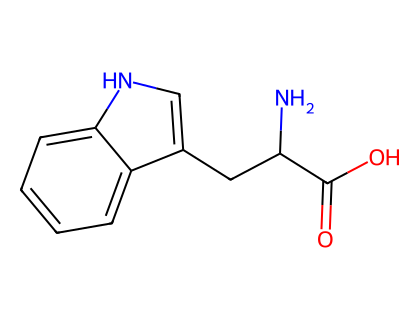
*图：L-色氨酸 (L-tryptophan) 结构*

组氨酸指定了一种特殊的固定编号，由数字和希腊字母组成；希腊字母 π 和 τ 分别用于指定环中靠近侧链和远离侧链的氮原子。

- histidine（组氨酸）

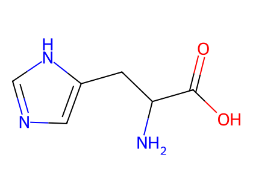
*图：L-组氨酸 (L-histidine) 结构*

### P-103.1.3 α-氨基羧酸的构型

#### P-103.1.3.1 立体描述符 'D' 和 'L'

α-氨基羧酸 α-碳原子的绝对构型用立体描述符 'D' 或 'L' 指定，表示与 'D- 或 L-甘油醛'的形式关系。立体描述符 'ξ'（希腊字母 xi）表示构型未知。

氨基酸的结构可以用几种方式画出以显示构型。可以用 Fischer 投影（见 P-102.3.1），或包含普通键和楔形键（实线或虚线）的结构图（见 P-91.1），如 L-alanine 下方所画：

（L-alanine 的 Fischer 投影与楔形键结构示意）

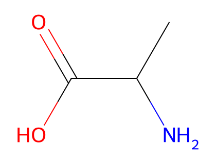
*图：L-丙氨酸 (L-alanine) 结构*

'L' 构型对应 CIP 系统的 'S' 构型，但半胱氨酸具有 'R' 构型（胱氨酸亦然，见 P-103.1.1.2）。

L = S；L = R（对于 cysteine）

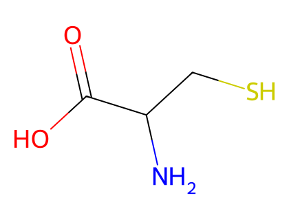
*图：L-半胱氨酸 (L-cysteine) 结构*

等摩尔量 'D' 和 'L' 化合物的混合物称为'外消旋体'（racemate），用立体描述符 'DL' 指定，例如 'DL-leucine'。立体描述符 'DL' 优于 'rac'，即优于 rac-leucine。

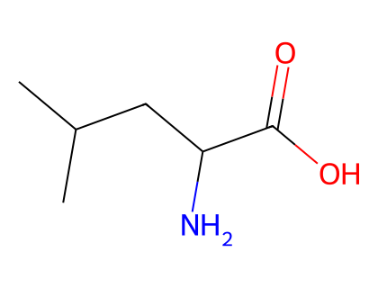
*图：L-亮氨酸 (L-leucine) 结构*

#### P-103.1.3.2 α-碳原子以外手性中心的构型

**P-103.1.3.2.1** CIP 立体描述符的使用

立体描述符 'R' 和 'S' 用于指定 'α-C' 原子以外中心的构型，同时保留 'α-C' 原子的立体描述符 'D' 和 'L'，以保持肽中立体描述符的一致性（见 P-103.3.4）。立体描述符的使用在此以羟基脯氨酸为例；对这些化合物，在氨基酸的专业命名和一般命名中也允许使用立体描述符 cis 和 trans。

**示例：**

- L-proline —— (2S)-proline
- (3R)-3-hydroxy-L-proline —— (2S,3R)-3-hydroxyproline —— cis-3-hydroxy-L-proline
- (3S)-3-hydroxy-L-proline —— (2S,3S)-3-hydroxyproline —— trans-3-hydroxy-L-proline

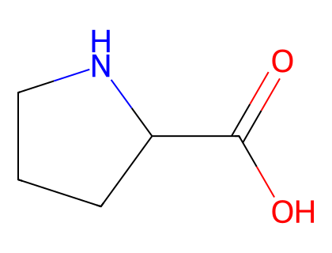
*图：L-脯氨酸 (L-proline) 结构*

**P-103.1.3.2.2** 前缀 'allo' 的使用

当 'C-3' 的构型反转时，前缀 'allo' 用于修饰保留名 'isoleucine' 和 'threonine'。符号相应改为 'aIle' 和 'aThr'。

**示例：**

- L-isoleucine（符号 'Ile'、'I'）—— (2S,3S)-2-amino-3-methylpentanoic acid
- L-alloisoleucine（符号 'aIle'）—— (2S,3R)-2-amino-3-methylpentanoic acid
- L-threonine（符号 'Thr'、'T'）—— (2S,3R)-2-amino-3-hydroxybutanoic acid
- L-allothreonine（符号 'aThr'）—— (2S,3S)-2-amino-3-hydroxybutanoic acid

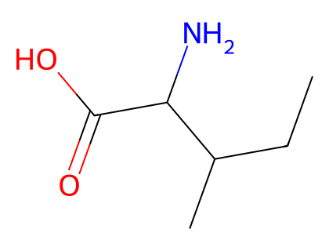
*图：L-异亮氨酸 (L-isoleucine) 结构*

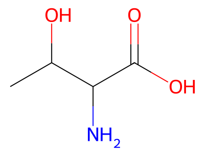
*图：L-苏氨酸 (L-threonine) 结构*

---

## P-103.2 氨基酸的衍生物

保留名用于生成盐、酯和酰基的名称，以及通过在碳原子和氮原子上取代或在氧原子和硫原子上官能化形成的衍生物的名称。

羧基 -COOH 可以转化为各种特征基团，例如羟甲基 -CH₂-OH 或醛基 -CHO。在肽和蛋白质命名的语境下，推荐使用一些由氨基酸保留名衍生的名称来命名酰胺、醇、醛甚至酮。

### P-103.2.1 位标系统

当存在多个氮、氧或硫原子时，推荐用 'N'、'O' 和 'S' 位标、以所连碳原子的数字位标为上标来描述这些原子上的取代。按 P-103.1.2 所述相应 α-氨基酸的编号，赖氨酸推荐用位标 'N²' 和 'N⁶'，精氨酸用 'Nα'、'Nδ' 和 'Nω'，谷氨酰胺用 'N²' 和 'N⁵'，天冬酰胺用 'N²' 和 'N⁴'，组氨酸用 'Nα'、'Nπ' 和 'Nτ'。当只存在一个氮原子时，推荐用位标 'N'，省略数字位标，即使名称中存在其他位标。

当存在两个相同的取代基团时，在倍数前缀与取代基团名称之间用一个字母位标。

**示例：**

- Nτ-methyl-L-histidine
- Nα,Nτ-dimethyl-L-histidine
- N-[(9H-fluoren-9-ylmethoxy)carbonyl]-L-alanine
- N²-(tert-butoxycarbonyl)-L-lysine
- N⁵-acetyl-N²-[(benzyloxy)carbonyl]-L-glutamine
- Nα-{[(4-nitrobenzyl)oxy]carbonyl}-Nω-nitro-L-arginine

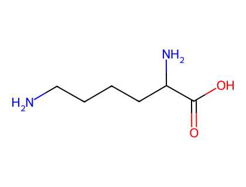
*图：L-赖氨酸 (L-lysine) 结构*

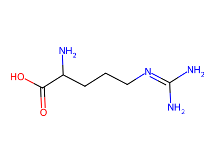
*图：L-精氨酸 (L-arginine) 结构*

### P-103.2.2 取代基团的名称

当 α-氨基羧酸在存在优先作为词尾引用的特征基团的情况下必须以取代基团引用时，按下述原理形成前缀。

#### P-103.2.2.1 游离价在碳原子上的取代基团

游离价在 α-氨基羧酸碳原子上的取代基团按本建议前面各章所给出的取代命名的规则、原理和约定形成。

**示例：**

- 1-[(2S)-2-amino-2-carboxyethyl]-4ξ-hydroxycyclohexane-1-carboxylic acid
- N-[(2S)-1-hydroxy-3-(1H-imidazol-4-yl)propan-2-yl]acetamide

#### P-103.2.2.2 游离价在氮原子上的取代基团

由从氨基酸的氨基上去除一个氢原子形成的、游离价在 α-氨基羧酸氮原子上的取代基团，可以通过将 α-氨基酸名称的词尾 'e' 改为 'o' 命名，在色氨酸名称上加字母 'o'，并分别从天冬氨酸和谷氨酸构造名称 asparto 和 glutamo。

**示例：**

- -HN-CH₂-COOH：glycino —— (carboxymethyl)amino

当氨基酸中有多个氮原子时，推荐使用 'Nx' 形式的位标。

**示例：**

- -HN-[CH₂]₄-CH(NH₂)-COOH：N⁶-lysino —— (5-amino-5-carboxypentyl)amino
- -HN-C(=NH)-NH-[CH₂]₃-CH(NH₂)-COOH：Nω-arginino —— N′-[(4-amino-4-carboxybutyl)amino]carbamimidamido
- -HN-CO-[CH₂]₂-CH(NH₂)-COOH：N⁵-glutamino —— 4-amino-4-carboxybutanamido

#### P-103.2.2.3 游离价在氧原子或硫原子上的取代基团

由从氧原子或硫原子上减去一个氢原子形成的、游离价在氧原子或硫原子上的取代基团，也可以通过将 α-氨基酸名称的末尾字母 'e'（适当时）改为 'x-yl' 命名，x 是被减去氢原子的原子位标，例如 cystein-S-yl、threonin-O-yl。

**示例：**

- -S-CH₂-CH(NH₂)-COOH：cystein-S-yl —— (2-amino-2-carboxyethyl)sulfanyl

### P-103.2.3 由取代形成的衍生物

保留名用于表示碳、氮、氧和硫取代。碳原子上的取代遵循取代命名的原理、规则和约定。数字位标和位标 'N'、'O'、'S' 表示氮、氧或硫原子上取代的位置。对于赖氨酸，用位标 'N²' 和 'N⁶' 分别表示位于 '2' 和 '6' 位的两个氨基。

**示例：**

- 5-hydroxytryptophan
- 3-amino-L-alanine —— (2S)-2,3-diaminopropanoic acid —— L-2,3-diaminopropanoic acid
- (2S)-2-amino-β-alanine（见文献 18）
- (2R,3R)-2-amino-3-(3-chlorophenyl)-3-hydroxypropanoic acid —— (βR)-3-chloro-β-hydroxy-D-phenylalanine
- (2S)-2-amino-2-(3,5-dihydroxyphenyl)acetic acid —— 2-(3,5-dihydroxyphenyl)-L-glycine
- N-[(5S)-5-amino-5-carboxypentyl]-L-glutamic acid
- N-(1-deoxy-α-D-fructopyranos-1-yl)-L-alanine
- methyl N-acetyl-L-alaninate
- S-benzyl-L-cysteine
- (HO)₂N-CH₂-COOH：N,N-dihydroxyglycine
- (HO)₂N-CH(NH₂)-COOCH₃：N-(1-amino-2-methoxy-2-oxoethyl)azonous acid [酸（(HO)₂NH 的 azonous acid）优先于酯；见 P-67.1.1.1]

### P-103.2.4 特征基团的电离

**P-103.2.4.1** 中性溶液（pH 7）中单氨基单羧酸的优势形式是 R-CH(NH₃⁺)-COO⁻ 而非 R-CH(NH₂)-COOH。然而方便起见，按表 10.4 和表 10.5 画惯用形式，并将氨基酸 alanine 命名为 2-aminopropanoic acid，而不是按第 P-7 章（P-74.1.3）命名为 2-azaniumylpropanoate、2-ammoniumylpropanoate 或 2-ammoniopropanoate。

对于含有其他可电离基团的氨基酸的等电形式尤为如此，例如赖氨酸溶液会含有可观数量的 NH₃⁺-[CH₂]₄-CH(NH₂)-COO⁻ 和 NH₂-[CH₂]₄-CH(NH₃⁺)-COO⁻。

**P-103.2.4.2** 当需要提及或强调氨基酸的离子性质时，单氨基单羧酸的阳离子或阴离子可如下表示（表示阴离子时，词尾 'ate' 替换 'ic acid' 或俗名的末尾字母 'e'，或加到名称 tryptophan 上）：

**示例：**

- H₂N-CH₂-COO⁻：glycinate —— glycine anion（甘氨酸阴离子）
- NH₃⁺-CH₂-COOH：glycinium —— glycine cation（甘氨酸阳离子）

**P-103.2.4.3** 含两个氨基或两个羧基的氨基酸需要进一步的形式。

**P-103.2.4.3.1** 天冬氨酸和谷氨酸的单电荷阴离子（严格地说，每种都有两个正电荷和两个负电荷，但此命名指净电荷）与双电荷阴离子的区别，可以通过在名称后标明电荷或说明中和阳离子的数目。

**示例：**

- ⁻OOC-CH₂-CH₂-CH(NH₂)-COO⁻ H⁺：glutamate(1-) —— hydrogen glutamate —— glutamic acid monoanion
- ⁻OOC-CH₂-CH₂-CH(NH₂)-COO⁻ Na⁺ H⁺：sodium glutamate —— sodium hydrogen glutamate —— monosodium glutamate
- ⁻OOC-CH₂-CH₂-CH(NH₂)-COO⁻：glutamate(2-) —— glutamic acid dianion —— glutamate（不加修饰时，名称 'glutamate' 指二价阴离子）
- ⁻OOC-CH₂-CH₂-CH(NH₂)-COO⁻ 2Na⁺：disodium glutamate

**P-103.2.4.3.2** 精氨酸、组氨酸和赖氨酸的单电荷阳离子（严格地说，每种都有两个正电荷和一个负电荷，但此命名指净电荷）与双电荷阳离子的区别，可以通过在名称后标明电荷、用短语 'monocation'、或说明中和阴离子的数目。电荷的位置可以用置于 'ium' 词尾前的上标 'N' 位标指定。

**示例：**

- NH₂-[CH₂]₄-CH(NH₃⁺)-COOH：lysinium(1+) —— lysine monocation —— lysin-N²-ium
- NH₂-[CH₂]₄-CH(NH₃⁺)-COOH Cl⁻：lysinium(1+) chloride —— lysine monohydrochloride —— lysin-N²-ium chloride
- NH₃⁺-[CH₂]₄-CH(NH₃⁺)-COOH：lysinium(2+) —— lysine dication —— lysine-N²,N⁶-diium

**P-103.2.4.4** 两性离子氨基酸以两种方式命名：

(1) 在阴离子母体名称前加阳离子取代基团的名称（见 P-74.1.3），并用 CIP 立体描述符描述构型；

(2) 在氨基酸名称后加术语 'zwitterion'。

**示例：**

- NH₃⁺-CH₂-COO⁻：azaniumylacetate —— glycine zwitterion
- (2S)-2-azaniumyl-3-(methylsulfanyl)propanoate —— S-methyl-L-cysteine zwitterion

### P-103.2.5 酰基

由有机酸衍生的酰基，例如 H₂N-CHR-CO-，通过将词尾 'ine'（tryptophan 中为 'an'）改为 'yl' 命名，例如 alanyl、valyl、tryptophyl。'Cysteinyl' 用于代替 'cysteyl'；'cystyl' 由 'cystine' 衍生（见 P-103.1.1.2）。

下列名称用于命名由二羧基氨基酸衍生的酰基及其相应酰胺：

- HOOC-CH₂-CH(NH₂)-CO-：α-aspartyl —— aspart-1-yl
- -CO-CH₂-CH(NH₂)-COOH：β-aspartyl —— aspart-4-yl
- -CO-CH₂-CH(NH₂)-CO-：aspartoyl
- HOOC-CH₂-CH₂-CH(NH₂)-CO-：α-glutamyl —— glutam-1-yl
- -CO-CH₂-CH₂-CH(NH₂)-COOH：γ-glutamyl —— glutam-5-yl
- -CO-CH₂-CH₂-CH(NH₂)-CO-：glutamoyl
- H₂N-CO-CH₂-CH(NH₂)-CO-：asparaginyl
- H₂N-CO-CH₂-CH₂-CH(NH₂)-CO-：glutaminyl

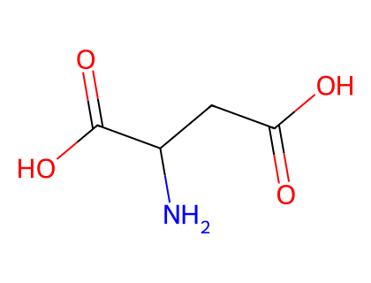
*图：L-天冬氨酸 (L-aspartic acid) 结构*

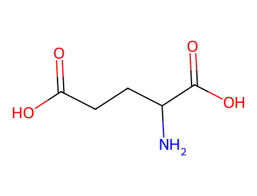
*图：L-谷氨酸 (L-glutamic acid) 结构*

### P-103.2.6 酯

氨基酸的酯 R-CO-OR′ 用一般方法命名，即用 'ate' 词尾（由保留名的 'ic acid' 词尾或末尾字母 'e' 替换而来，或对名称 tryptophan 加 'ate' 词尾）与取代基团 R′ 的名称。

**示例：**

- methyl L-alaninate —— L-alanine methyl ester
- 1-methyl L-aspartate
- (2S)-2-amino-3-methylbutyl L-valinate

### P-103.2.7 酰胺、苯胺、酰肼和其他含氮类似物

由氨基酸衍生的酰胺、苯胺、酰肼和其他含氮类似物衍生物按系统命名。

由氨基酸衍生的酰胺的名称通过将氨基酸名称的末尾字母 'e'（适当时）改为 'amide'，或对名称 tryptophan 加术语 'amide' 形成。

**示例：**

- H₂N-CH₂-CO-NH₂：2-aminoacetamide —— glycinamide

天冬氨酸的 4-酰胺有自己的名称 asparagine，谷氨酸的 5-酰胺是 glutamine（见表 10.4）。它们的 1-酰胺命名如下：

- H₂N-CO-CH₂-CH(NH₂)-CO-NH₂：2-aminobutanediamide —— asparaginamide
- H₂N-CO-CH₂-CH₂-CH(NH₂)-CO-NH₂：2-aminopentanediamide —— glutaminamide

天冬氨酸和谷氨酸的 1-酰胺命名如下：

- HO-CO-CH₂-CH(NH₂)-CO-NH₂：3,4-diamino-4-oxobutanoic acid —— aspartic 1-amide
- HO-CO-CH₂-CH₂-CH(NH₂)-CO-NH₂：4,5-diamino-5-oxopentanoic acid —— glutamic 1-amide

苯胺的名称通过在酰胺基的氮原子上用苯基或被取代苯基进行 N-取代形成。也可以用词尾 'anilide' 代替 'amide'。

**示例：**

- 2-amino-N¹-phenylacetamide —— glycinanilide

氨基酸酰胺氮原子上的取代用酰胺（P-66.1.1.3）和胺（P-62.2.2.1）所述方法系统表达。

**示例：**

- CH₃-NH-CH₂-CO-NH-CH₂-CH₃：N-ethyl-2-(methylamino)acetamide
- CH₃-CO-NH-CH₂-CO-NH₂：2-(acetylamino)acetamide —— 2-acetamidoacetamide —— N²-acetylglycinamide

### P-103.2.8 醇、醛、酮和腈

与具有保留俗名的氨基酸相应的醇、醛、酮和腈，用取代命名的原理、规则和约定系统命名。词尾 'ol'、'al'、'one' 和 'onitrile' 加到保留名上，省略末尾字母 'e'，可用于表示氨基酸特征基团的改变。酮必须用系统 IUPAC 取代命名命名，需要时用 'R' 和 'S' 立体描述符。

**示例：**

- (2S)-2-amino-3-methylbutan-1-ol —— L-valinol
- (CH₃)₂CH-CH₂-CH(NH₂)-CHO：2-amino-4-methylpentanal —— leucinal
- H₂N-CH₂-CO-CH₂Cl：1-amino-3-chloropropan-2-one
- H₂N-CH₂-C≡N：aminoacetonitrile —— glycinonitrile

---

## P-103.3 肽的命名

肽的命名高度专业化，在文献 18 中有充分记载。环肽的命名正由 IUPAC 化学命名与结构表示分部研究。

### P-103.3.1 定义

肽（peptides）是由两个或更多个氨基羧酸分子（相同或不同）通过从一者的羰基碳到另一者的氮原子形成共价键、形式上失去水而衍生的酰胺。该术语通常应用于由 α-氨基羧酸形成的结构，但也包括由任何氨基羧酸衍生的结构。在下列示例中，'R' 可以是任何有机基团，通常是（但不必然是）'常见'氨基酸中出现的基团（见表 10.4）：

（肽键形成示意：R-CO-NH-CHR'-COOH）

肽中的酰胺键称为'肽键'（peptide bonds）。在一个氨基酸的 'C-1' 与另一个氨基酸的 'N-2' 之间形成的肽键称为'正肽键'（eupeptide bonds）。由一个氨基酸的氨基与另一个氨基酸的羧基形成、但不是 'eupeptide' 键的键称为'异肽键'（isopeptide bonds）。

### P-103.3.2 肽的名称

命名肽时，使用以 'yl' 结尾的酰基名称（见 P-103.2.5）。因此，如果氨基酸甘氨酸 H₂N-CH₂-COOH 和丙氨酸 H₂N-CH(CH₃)-COOH 缩合，使甘氨酸酰化丙氨酸，则形成的二肽 H₂N-CH₂-CO-NH-CH(CH₃)-COOH 命名为 glycylalanine。如果它们按相反顺序缩合，产物 H₂N-CH(CH₃)-CO-NH-CH₂-COOH 命名为 alanylglycine。更高级的肽类似地命名，例如 alanylleucyltryptophan。

### P-103.3.3 肽的符号

肽 glycylglycylglycine 符号化为 Gly-Gly-Gly。这涉及以三种方式对甘氨酸符号 Gly（H₂N-CH₂-COOH）进行修饰，即加连字符：

(a) Gly- = H₂N-CH₂-CO-

(b) -Gly = -HN-CH₂-COOH

(c) -Gly- = -HN-CH₂-CO-

因此，表示肽键的连字符，写在符号右侧时从氨基酸的 -COOH 基团去除一个 -OH 基团，写在符号左侧时去除一个氢原子。

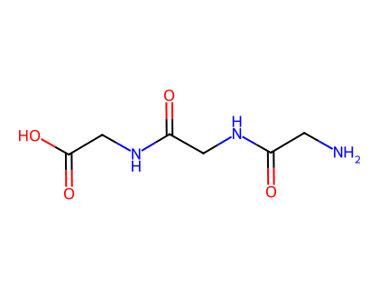
*图：三甘肽 (glycylglycylglycine) 结构*

### P-103.3.4 肽中构型的表示

立体描述符 'L' 不在表 10.4 所列氨基酸组成的肽的名称中、也不在符号表示中注明。相反，立体描述符 'D' 在具有该构型的每个组分的酰基或名称的开头注明。

**示例：**

- Leu-D-Glu-L-aThr-D-Val-Leu（符号 aThr 指别苏氨酸 allothreonine）
- L-leucyl-D-glutamyl-L-allothreonyl-D-valyl-L-leucine

符号 'DL' 用于表示存在一个手性中心时的外消旋混合物（如 P-103.1.3.1 所述），但在肽中不允许使用，因为它的存在表明以未知比例存在非对映异构体。斜体前缀 ambo 用于表示两种立体异构体都存在，例如 DL-丙氨酸酰化 L-亮氨酸的结果是 ambo-alanylleucine 或 ambo-Ala-Leu。构型未知的残基用前缀 ξ（希腊字母 xi）表示。已命名肽的对映体用前缀 ent 指定（enantio，见 P-101.8.1），例如由 bradykinin 得到 ent-bradykinin。

### P-103.3.5 已命名肽的修饰

通常方便通过参照其变体所依据的已命名序列来指定肽的结构。下列建议允许这样做，但仅适用于涉及残基之间正常酰胺键的序列修饰。保留名 angiotensin II、bradykinin、oxytocin 和 insulin (human) 用于说明这些建议。

- angiotensin II：Arg-Pro-Pro-Gly-Phe-Ser-Pro-Phe-Arg
- bradykinin：Arg-Pro-Pro-Gly-Phe-Ser-Pro-Phe-Arg
- oxytocin：（结构式略，仅以名称呈现）

（序列的指定可能需要命名物种以及肽，见下文 insulin。如果是这样，当存在修饰前缀时，物种名称必须用括号附在肽上。）

- insulin (human)：A 链与 B 链（结构略）

#### P-103.3.5.1 残基的替换

在俗名 bradykinin 的肽中，如果从链的 'N-末端' 起第 q 个氨基酸残基被氨基酸 'Xaa' 替换，修饰肽的名称是 [q-aminoacid]bradikinin，缩写形式是 [Xaaq]bradykinin。在全名中，替换氨基酸用其残基名称指定（例如 alanine，而非 alanyl）。在缩写形式中，氨基酸残基用三字母符号指定。在缩写形式中，替换位置用上标表示。

**示例：**

- [2-lysine]bradykinin —— [Lys²]bradykinin
- [5-isoleucine,7-alanine]angiotensin II —— [Ile⁵,Ala⁷]angiotensin II

**P-103.3.5.1.1** 序列的指定需要命名物种以及肽。如果是这样，当存在修饰前缀时，物种名称必须用括号附在肽的名称上。

**示例：**

- [Ala^B12]insulin (human)
- [B3-lysine,B29-glutamic acid]insulin (human)

**P-103.3.5.1.2** 氨基酸残基被其对映体替换的表示如下。将位置 3 的 L-proline 替换为 D-proline 得到 [3-D-proline]bradykinin，缩写为 [D-Pro³]bradykinin。此物与 bradykinin 的混合物得到 [3-ambo-proline]bradykinin 或 [ambo-Pro³]bradykinin。

**示例：**

- [D-Val^A3]insulin (human)

#### P-103.3.5.2 肽链的延伸

通过在 N-末端或 C-末端延伸肽得到的化合物，用下面所示的名称和缩写形式指定。

**P-103.3.5.2.1** 在 'N-末端' 延伸

**示例：**

- valylbradykinin —— Val-bradykinin
- valylglycylbradykinin —— Val-Gly-bradykinin

**P-103.3.5.2.2** 在 'C-末端' 延伸

**示例：**

- bradykininylleucine —— bradykininyl-Leu
- insulin-B30-yl-L-argininyl-L-arginine (human)
- [A21-glycine]insulin-B30-yl-L-argininyl-L-arginine (human)（此胰岛素经 A 链替换和 B 链 C-末端延伸修饰）

#### P-103.3.5.3 残基的插入

在肽命名中，前缀 'endo'（非斜体）用于表示在肽中明确定位的位置插入一个氨基酸残基。例如，名称 endo-6a-alanine-bradykinin 或 [endo-Ala⁶a]bradykinin 表示氨基酸残基 'alanyl' 已插入 bradykinin 结构中位置 6 和 7 之间。前缀 'endo' 不要与 P-93.5.2.2.1 描述的推荐立体描述符 'endo'（斜体书写）混淆。

**示例：**

- endo-6a-alanine-bradykinin —— [endo-Ala⁶a]bradykinin

多次插入、以及在链中同一位置最多插入两个残基，通过此建议的逻辑延伸表示。因此，将苏氨酸插入 bradykinin 残基 1 和 2 之间、以及将缬氨酸和甘氨酸（按此顺序）插入残基 4 和 5 之间，用名称 'endo-1a-threonine,4a-valine,4b-glycine-bradykinin' 或 'endo-Thr¹a,Val⁴a,Gly⁴b-bradykinin' 表示。

**示例：**

- endo-1a-threonine,4a-valine,4b-glycine-bradykinin —— endo-Thr¹a,Val⁴a,Gly⁴b-bradykinin

#### P-103.3.5.4 残基的去除

在肽命名中，减性前缀 'des' 用于表示从肽结构中的任何位置去除一个氨基酸残基。例如，名称 des-8-phenylalanine-bradykinin 表示位于肽 bradykinin 位置 8 的氨基酸残基 'phenylalanyl' 已被去除；缩写形式为 des-Phe⁸-bradykinin。在 P-101 所述母体结构的修饰中，前缀 'des' 用于表示甾体中末端环的去除，并在与相邻环的每个连接处加入适当数目的氢原子（见 P-101.3.6）。

**示例：**

- des-7-proline-oxytocin —— des-Pro⁷-oxytocin
- des-B1-phenylalanine-insulin (cattle) —— des-Phe^B1-insulin (cattle)

### P-103.3.6 环肽

环肽（cyclic peptides）包括由肽（无环肽）通过形成肽键或酯键、二硫键、或新的碳-碳、碳-氮、碳-氧或碳-硫键（酯和酰胺除外）而生成的环。其中环完全由以正肽键相连的氨基酸残基组成的环肽称为'同环环肽'（homodetic cyclic peptides）。由正肽键和异肽键形成的环肽称为'异环环肽'（heterodetic cyclic peptides）。肽命名的这一方面正由 IUPAC 化学命名与结构表示分部研究。