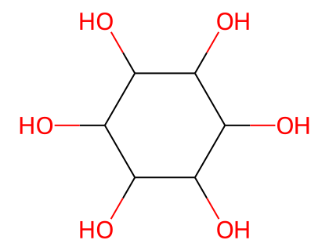
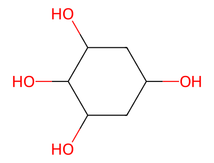

# P-104 环醇

环醇的命名记载于文献《Nomenclature of Cyclitols, Recommendations 1973》（文献 39）。

> **关于结构式示例的说明：** 原文中用于说明规则的结构式插图为图像，本翻译中以「名称 + 系统取代名称」的形式呈现命名实例，并保留母体名称及修饰后名称；规则正文完整翻译。
>
> **关于配图的说明：** 基础环醇结构配图由 RDKit 生成，SMILES 取自 PubChem 记录并经分子式与环数核对。**立体化学（各羟基的取向 D/L、α/β 等）未在图中标注**——环醇命名以各手性中心羟基的相对取向为定义核心，RDKit 生成的连接性二维结构图不含这些立体信息。肌醇的九个立体异构体（cis、epi、allo、myo、muco、neo、scyllo、chiro）具有相同的连接性骨架，配图无法区分，图中仅表示连接性骨架。

## 目录

- P-104.1 定义
- P-104.2 名称构造
- P-104.3 环醇的衍生物

---

## P-104.1 定义

环醇（cyclitols）是环烷烃，其中三个或更多个环原子各被一个羟基取代。肌醇（inositols），即环己烷-1,2,3,4,5,6-六醇，是环醇中的一个特定类别。

*图：肌醇 (myo-inositol) 骨架（九个肌醇异构体连接性相同，仅羟基取向不同）*

肌醇具有保留名，连同其 O-烷基、O-芳基、链烷酸酯/羧酸酯衍生物和氨基衍生物（其中 NH₂ 替换 OH），使用立体描述符 'D' 和 'L' 描述构型。环醇的其他名称是系统取代名称，其构型用 CIP 立体描述符描述。

---

## P-104.2 名称构造

推荐用多种方法命名环醇。

### P-104.2.1 立体异构肌醇通过在名称 'inositol' 开头加斜体前缀描述。下述方法描述的位置编号写在括号内。由这些前缀表示的名称是优选的。

- cis-inositol —— (1,2,3,4,5,6/0)
- epi-inositol（表肌醇）—— (1,2,3,4,5/6-)
- allo-inositol —— (1,2,3,4/5,6-)
- myo-inositol（肌醇）—— (1,2,3,5/4,6-)
- muco-inositol（粘肌醇）—— (1,2,4,5/3,6-)
- neo-inositol —— (1,2,3/4,5,6-)
- scyllo-inositol（鲨肌醇）—— (1,3,5/2,4,6-)
- 1L-chiro-inositol（1L-手性肌醇）—— (1,2,4/3,5,6-) [旧称 L-chiro-inositol 或 (-)-inositol]
- 1D-chiro-inositol（1D-手性肌醇）—— (1,2,4/3,5,6-) [旧称 D-chiro-inositol 或 (+)-inositol]

环醇的绝对构型用 'D' 和 'L' 表示，按下述方式确定。对于编号 '1' 的羟基在环平面上方的平面环表示，构型 'L' 对应顺时针编号，构型 'D' 对应逆时针编号，如上述两个对映的手性肌醇所示。立体描述符 'D' 和 'L' 后接连字符，置于化合物名称之前，前面冠以定义中心的位标，即如上所示的 '1'。

### P-104.2.2 除肌醇外的环醇以环己烷为母体、用 CIP 方法及其序列规则描述立体异构体来系统命名。此方法优于 P-104.2.3 所述的位置编号方法。

**示例：**

- (1R,2R,3R,5R)-cyclohexane-1,2,3,5-tetrol
- (1R,2R,3R,4R)-cyclohexane-1,2,3,4-tetrol

*图：环己烷-1,2,3,5-四醇骨架*

### P-104.2.3 环醇中的位标指定给羟基，因此参考连接到环上的取代基的立体关系和性质来描述编号方向。位于环平面上方的取代基构成一组，位于下方的构成另一组。按下述标准（依次应用直到作出决定）将最低位标与取代基的一组相关联：

(a) 将取代基视为数字序列，不考虑构型；

(b) 若一组取代基比另一组多，则与较多的一组关联；

(c) 若两组数目相同且其中一组可用较低数字表示，则与该组关联；

(d) 与未修饰羟基以外的取代基关联；

(e) 与按字母数字顺序最先引用的取代基关联；

(f) 与按上述 P-104.2.1 方法确定导致 'L' 而非 'D' 构型的那些指定关联（仅适用于 meso 化合物）。

位置编号用分数表达式描述，分子是最低位标的那组取代基（按升序排列），分母是另一组。

**示例：**

- 1L-1,2/3,5-cyclohexanetetrol [标准 (a) 和 (c)] —— (1R,2R,3R,5R)-cyclohexane-1,2,3,5-tetrol
- 1L-1,2/3,4-cyclohexanetetrol [标准 (a)] —— (1R,2R,3R,4R)-cyclohexane-1,2,3,4-tetrol
- 1L-5-O-ethyl-1,2-di-O-methyl-neo-inositol [标准 (d)]
- 1L-1-O-ethyl-4-O-methyl-muco-inositol [标准 (d) 和 (e)]
- 2-O-methyl-myo-inositol [标准 (b) 和 (f)]

---

## P-104.3 环醇的衍生物

### P-104.3.1 肌醇的衍生物

肌醇与碳水化合物以相同方式修饰以生成衍生物的名称。烷基（芳基）的 O-取代没有限制（见 P-102.5.6.1）。羟基可以用 'deoxy' 操作替换为氨基（见 P-102.5.4）。当优先于羟基的特征基团放在羟基的位置时，必须构造完全取代名称。然而，酯按链烷酸酯/羧酸酯命名。肌醇的编号保持不变，构型用 'L' 或 'D' 立体描述符表达。系统名称可能具有与相应肌醇名称不同的编号（见示例 2 和 5）。

**示例：**

- 1D-1-amino-1-deoxy-myo-inositol
- 1L-1-deoxy-6-O-methyl-1-sulfanyl-allo-inositol（不是 1L-6-O-methyl-1-thio-allo-inositol）
- (1S,2R,3S,4S,5S,6S)-5-methoxy-6-sulfanylcyclohexane-1,2,3,4-tetrol
- myo-inositol 2-acetate（碳水化合物酯的命名见 P-102.5.6.1.1）
- 1D-myo-inositol 1-(dihydrogen phosphate)
- 2-C-methyl-myo-inositol —— (1s,2R,3S,4s,5R,6S)-1-methylcyclohexane-1,2,3,4,5,6-hexol
- (1r,2R,3S,4r,5R,6S)-2,3,4,5,6-pentahydroxycyclohexane-1-carboxylic acid（不是 2-carboxy-2-deoxy-myo-inositol；COOH 优先于 OH）

### P-104.3.2 除肌醇外的环醇的衍生物

除肌醇外的环醇的衍生物的名称全部按第 P-1 至 P-9 章所述取代命名的原理、规则和约定构造。

**示例：**

- (1R,2S,3R,4S,5S)-2,3,4,5-tetrahydroxycyclopentane-1-carboxylic acid
- (1R,2S,3R,4S,5r)-5-aminocyclopentane-1,2,3,4-tetrol