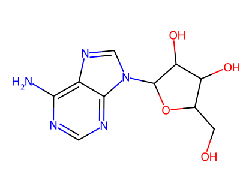
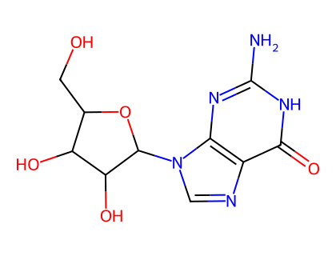
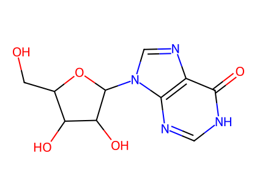
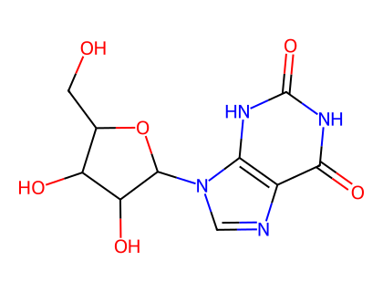
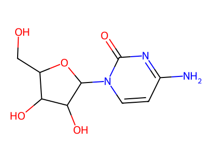
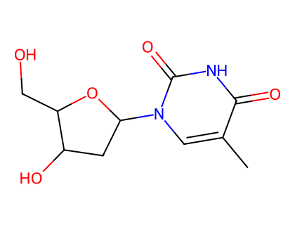
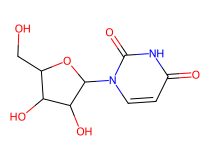

# P-105 核苷

核苷的命名例证于文献《Abbreviations and Symbols for Nucleic Acids, Polynucleotides and their Constituents》（文献 47）。本节给出的衍生物命名程序，碳水化合物部分的修饰改写自 P-102，其余改写自有机化合物取代的一般规则。

> **关于结构式示例的说明：** 原文中用于说明规则的结构式插图为图像，本翻译中以「名称 + 系统取代名称」的形式呈现命名实例，并保留母体名称及修饰后名称；规则正文完整翻译。
>
> **关于配图的说明：** 基础核苷结构配图由 RDKit 生成，SMILES 取自 PubChem 记录并经分子式核对。**立体化学（核糖的 D/L、α/β 等）未在图中标注**——RDKit 生成的连接性二维结构图不含这些立体信息，图中仅表示连接性骨架。

## 目录

- P-105.1 核苷的保留名
- P-105.2 核苷上的取代

---

## P-105.1 核苷的保留名

下列名称保留。

- adenosine（腺苷）
- guanosine（鸟苷）
- inosine（肌苷）
- xanthosine（黄苷）
- cytidine（胞苷）
- thymidine（胸苷）
- uridine（尿苷）

*图：腺苷 (adenosine)*

*图：鸟苷 (guanosine)*

*图：肌苷 (inosine)*

*图：黄苷 (xanthosine)*

*图：胞苷 (cytidine)*

*图：胸苷 (thymidine)*

*图：尿苷 (uridine)*

---

## P-105.2 核苷上的取代

**P-105.2.1** 具有保留名的核苷可以在嘌呤或嘧啶环上完全取代。核苷的 oxo 基团的置换用官能置换前缀描述。ribofuranosyl 组分可以按碳水化合物规定修饰（见 P-102.5）。

**示例：**

- 2′-deoxy-1-methylguanosine
- 2′-deoxy-2′-fluoro-5-iodo-5′-O-methylcytidine（允许在同一位置用氟原子替换羟基）
- 4-amino-1-[(2R,3R,4R,5R)-3-fluoro-4-hydroxy-5-(methoxymethyl)oxolan-2-yl]-5-iodopyrimidin-2(1H)-one
- (2′E)-2′-deoxy-2′-(fluoromethylidene)cytidine
- 4-amino-1-[(2R,3E,4S,5R)-3-(fluoromethylidene)-4-hydroxy-5-(hydroxymethyl)oxolan-2-yl]pyrimidin-2(1H)-one
- 5-ethyl-4-thiouridine
- N²-(2-hydroxyethyl)-5′-S-methyl-5′-thioguanosine
- 2′,3′,5′-tri-O-acetyladenosine —— adenosine 2′,3′,5′-triacetate

**P-105.2.2** 当存在优先于假酮（pseudoketone）的特征基团时，应用正常取代命名原理。

**示例：**

- 3-[4-(methylamino)-2-oxo-1-β-D-ribofuranosyl-1,2-dihydropyrimidin-5-yl]propanoic acid
- 2′,3′-dideoxyguanosine-2′,3′-diyl carbonate（见 P-101.7.4）—— guanosine cyclic-2′,3′-carbonate