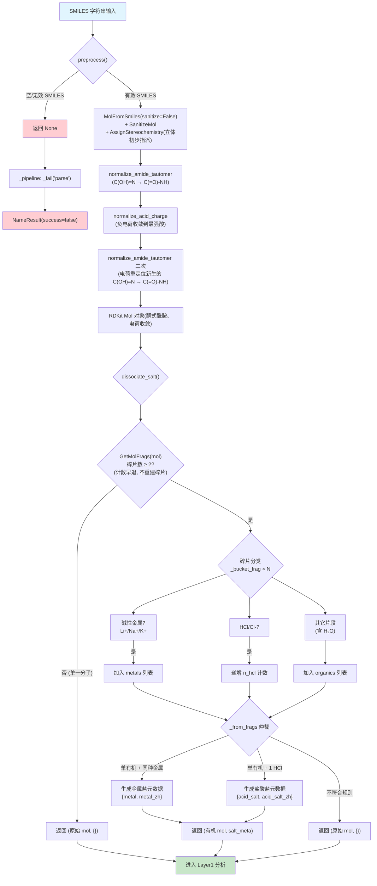
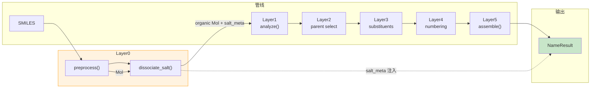

# Layer0: 预处理 (Preprocessor)

> **管线位置:** 第 0 层 / 6 层 | **源文件:** 5 个 `.py` (299 行；不含 `__init__.py` 为 4 个模块 / 292 行) | **最后更新:** 2026-09-13

---

## 概述

Layer0 是 NamePredict 6 层命名管线的入口层，负责将外部输入的 SMILES 字符串转换为内部可操作的分子表示（RDKit `Mol` 对象），并执行盐（salt）检测与解离。`preprocess` 除解析与消毒外，还会做**立体初步指派**、**酰胺烯醇互变异构归一化**（把非芳香中性的 `C(OH)=N` 位点归一为酮式 `C(=O)-NH`，见 §1.1）与**酸性质子重定位**（把质子化强酸 OH 与去质子化弱酸阴离子共存时的负电荷收敛到最强酸位，见 §1.2），两条归一化按"互变 → 重定位 → 互变"的次序串联。它是整个管线中唯一与"原始文本"打交道的层，也是错误处理的第一道防线。

本层用到的跨层常量（酸类判定表 `ACID_CENTERS`、供体白名单 `DONOR_KIND`、弱受体元素集 `ACCEPTOR_Z`、金属名表 `ALKALI_EN` / `METAL_ZH`）统一放在 `src/namepredict/constants.py`（见 §1.2 / §2.2），本层各模块按需导入，不自备副本。

**管线中的位置：**

```
SMILES 字符串
    ↓
┌──────────────┐
│  Layer0 预处理 │  ← 当前层
└──────────────┘
    ↓  RDKit Mol
┌──────────────┐
│  Layer1 分析  │
└──────────────┘
    ↓  ... → Layer5 组装 → NameResult
```

**职责边界：**

| 职责 | 说明 |
|------|------|
| SMILES 解析与归一化 | 将文本输入转换为 `rdkit.Chem.Mol` 对象：空白校验 → `MolFromSmiles(sanitize=False)` → `SanitizeMol` → `AssignStereochemistry`（立体初步指派）→ `normalize_amide_tautomer`（酰胺烯醇 → 酮式）→ `normalize_acid_charge`（酸性质子重定位）→ `normalize_amide_tautomer`（电荷重定位新生酰胺烯醇位的二次归一） |
| 输入验证 | 检测空字符串、纯空白、无效 SMILES 语法，及消毒/归一化异常 |
| 盐解离 | 识别碱性金属盐（Li/Na/K）和盐酸盐（HCl），分离有机片段；水分子不作特殊识别，按普通有机片段参与计数（见 §2.4） |
| 盐元数据生成 | 生成中英双语盐名称元数据，供 Layer5 拼接 |

**非职责（由下游层承担）：**

- 不执行任何官能团识别（属 Layer1）
- 不进行母体选择或命名决策（属 Layer2）
- 不对有机片段本身做任何化学分析

**输入/输出类型：**

```
preprocess(smiles: str) -> Mol | None
dissociate_salt(mol: Mol) -> tuple[Mol, dict]
```

`preprocess` 返回 `None` 表示输入无法解析，管线在此终止并返回失败 `NameResult`。`dissociate_salt` 的 `dict` 为空 `{}` 表示分子不是可识别的简单盐，管线继续以原始分子运行；非空时包含 `salt` 元数据，合并到最终 `NameResult.meta` 中。

---

## 核心逻辑

### 1. SMILES 解析 (`preprocess`)

`preprocess` 函数是 NamePredict 管线入口中最关键的函数之一，负责把原始 SMILES 规整为可供下游各层直接消费的分子形态。其内部为六步：

1. **空白校验**：检查输入是否为 `None`、空字符串或纯空白字符串。任何无法形成有效文本的输入均立即返回 `None`，避免将空值传递给 RDKit 造成异常。
2. **解析与消毒**：调用 `Chem.MolFromSmiles(str(smiles).strip(), sanitize=False)` 先做语法解析，成功后再以 `Chem.SanitizeMol(mol)` 完成消毒。RDKit 的 `MolFromSmiles` 在遇到无效 SMILES 语法时返回 `None`（而非抛出异常），这与 NamePredict 的错误处理策略一致——所有解析失败都统一为"静默失败"，由上层 `_pipeline` 函数捕获并生成 `success=False` 的 `NameResult`，其中 `meta={"reason": "parse"}` 标记失败原因。
3. **立体初步指派**：调用 `Chem.AssignStereochemistry(mol, force=True, cleanIt=False, flagPossibleStereoCenters=True)`，在进入 L1 前即对手性中心 / 双键预先指派 R/S、E/Z，供 L4 位次与 L5 立体描述符使用。
4. **酰胺烯醇互变异构归一化（首轮）**：调用 `normalize_amide_tautomer(mol)`（`tautomer.py`），把分子内非芳香中性的 `C(OH)=N` 烯醇位点归一化为酮式 `C(=O)-NH`（见下 §1.1），使下游面对统一的酰胺形态。
5. **酸性质子重定位**：调用 `normalize_acid_charge(mol)`（`charge.py`），把同片段内质子化强酸（羧酸 `C(=O)OH` / 磷酸 `P(=O)OH`）与去质子化弱酸位（酚氧/烯醇氧/酰胺氧、去质子化氮）共存时的质子搬到弱酸位，使等价负电荷收敛到最强酸（见下 §1.2）——让既有 carboxylate→-oate 的 L1–L5 能力作用于输入侧电荷错位的结构（如 chebi-433）。
6. **酰胺烯醇互变异构归一化（二次）**：再次调用 `normalize_amide_tautomer(mol)`。第 5 步把酰胺 O⁻ 受体搬成中性 `C(OH)=N`，这类位点只有在此刻才出现，须再跑一轮才能收敛为 `C(=O)-NH`——否则会留下 `1-hydroxyethylideneamino` 式亚胺醇名，而 gold 取酰胺式。

以上任一步抛出异常（如消毒失败）都会返回 `None`。

**错误分类**：Layer0 能检测两类输入错误：
- **空白输入**：`""`、`None`、`"   "` -- 在进入 RDKit 之前即被拦截
- **语法无效**：如 `"CCOO"` 中碳的五价——由 RDKit `MolFromSmiles` 返回 `None` 拦截

> **源:** `src/namepredict/layer0/preprocessor.py:11-26`

#### 1.1 酰胺烯醇互变异构归一化 (`tautomer.py`)

模块 `src/namepredict/layer0/tautomer.py`（70 行）专门做互变异构规范化；元素常量 `C` / `N` / `O` 取自 `constants.py`（`tautomer.py:8`）：

- 位点判定：`_is_amide_enol_o`（`tautomer.py:11`）要求与碳**单键**相连、中性、`Degree == 1`（只与碳相连）且 `GetTotalNumHs() >= 1` 的羟基 O——隐氢记账与 `[OH]` 显式氢记账都接受，而以独立 `[H]` 原子或其它重原子成键的羟基（Degree ≠ 1）排除；`_is_amide_enol_n`（`tautomer.py:23`）要求与碳**双键**相连、非芳香、中性、无显式 H 的亚胺 N。遍历排除芳香 C 后由 `_amide_enol_sites(mol)`（`tautomer.py:33`）汇总全部 `(c_idx, n_idx, o_idx)` 位点。
- 改写方式：`normalize_amide_tautomer(mol)`（`tautomer.py:48`）对每个位点把 C=N 双键降为单键、C–O 单键升为 C=O 双键，**只改键级**并靠 RDKit 隐氢重算完成质子迁移——不增删重原子、不改原子序；改写后再次 `SanitizeMol` + `AssignStereochemistry`。
- H 记账：迁移前先把羟基 O 的 `SetNumExplicitHs(0)` 并 `SetNoImplicit(False)`。新生成的 C=O 双键会使 O 价态超限，若不清零其 H 记账则 `SanitizeMol` 失败、整分子回退；`GetTotalNumHs() != 1` 的位点直接放弃（多余 / 缺失的 H 无法靠隐氢重算弥补）。
- 保守跳过：带电 N、O⁻ 阴离子、以独立 `[H]` 原子成键的羟基、硫类似物（C=S 等）位点一律不处理，不做质子化 / 阴离子改写。
- 返回约定：无位点或改写后消毒失败时返回输入的 `mol`；单个位点 H 数不符只跳过该位点。

#### 1.2 酸性质子重定位 (`charge.py`)

模块 `src/namepredict/layer0/charge.py`（106 行）专门处理输入侧**电荷错位**结构——同一片段内去质子化弱酸位（酚氧/烯醇氧/酰胺 O⁻、去质子化 N⁻）与质子化强酸位（羧酸 `C(=O)OH` / 磷酸 `P(=O)OH`）共存时，把质子从强酸搬到弱酸位：等价负电荷收敛到最强酸，使既有 carboxylate→-oate 的 L1–L5 命名能力作用于此类输入（如 chebi-433）。**只改 FormalCharge 与 H 记账，不增删重原子**，走 RWMol 原子级编辑，改后 `SanitizeMol` + `AssignStereochemistry`；含 `*` dummy 或改动失败时保守跳过。

- 成酸中心识别：`_oxo_neighbor`（`charge.py:10`）返回邻接的、带 ≥`min_oxo` 个双键氧的非芳香成酸中心原子；`_acid_kind`（`charge.py:25`）按 `ACID_CENTERS`（`constants.py:105`，`{C: (1, "carboxyl"), P: (1, "phospho"), S: (1, "sulfo")}` 表）把中心元素映射为酸类名，**不检查 O 自身 H/电荷**，因此供体判定与共轭碱判定共用同一张表。
- 强弱判定：`_acid_kind_of_oh`（`charge.py:32`）识别中性含 H 的 O 是否质子化强酸 OH（carboxyl：O–H 连 `C(=O)`；phospho：连 `P(=O)`；sulfo：连 `S(=O)n`；醇/酚/酯 O 无成酸中心天然返回 None）；`_is_weak_anion`（`charge.py:38`）识别去质子化弱酸位（-1 电荷、元素属 `ACCEPTOR_Z`（`constants.py:104`）= `{O, N}`、邻接无 +1 内平衡写法，且 O 位不是已去质子化的强酸共轭碱）。
- 供体白名单：`DONOR_KIND`（`constants.py:102`）= `("carboxyl", "phospho")`——羧酸与磷酸都作强酸供体，搬运序由 `ACID_KIND_PRIO`（`constants.py:103`，carboxyl 1 < phospho 2 < sulfo 3）决定。磷酸供体的产出场景是「酰胺 O⁻ 受体」：重定位把酰胺 O⁻ 搬成中性 `C(OH)=N` 后由 `preprocess` 的二次互变归一收成酰胺，与 gold 把 `N=C([O-])` 写作酰胺、把 P–OH 写作 oxidophosphoryl 的口径一致。`sulfo` 供体实测 0 收益，留在白名单外以免扩大 blast radius。
- 方向性保证：供体只取 `DONOR_KIND` 中酸类、受体只取弱酸阴离子 → 单调收敛，搬走一对后该对即退出候选，终止于无配对。搬运序以酸 kind 优先级加 canonical rank 最小保证确定性。
- 搬运方式：`_relocate_proton`（`charge.py:49`）把强酸 OH 质子搬到弱酸受体——受体变中性 +1 显式 H，供体变 -1 减 1 H；**原子级记账而非重写 SMILES**，保立体中心不随邻居重排翻转；`SanitizeMol` 失败返回 `None` 保守跳过。
- 返回约定：`normalize_acid_charge`（`charge.py:74`）无改动返回原 `mol` 对象；同片段成对质子全部搬运（上界 `mol.GetNumAtoms()` 次循环，每次消耗一对 donor/acceptor，`_frag_of`（`charge.py:69`）给出 `{atom_idx: 片段号}` 映射以限定同片段配对）。

### 2. 盐检测与解离 (`dissociate_salt`)

`salt.py`（90 行）实现了对简单盐结构的检测和有机片段的分离，是 Layer0 中函数最多的模块。其设计遵循 IUPAC 功能类命名（functional class nomenclature）中对盐的处理规则：将盐视为"阳离子（cation）修饰有机母体名称"的模式，例如 "sodium benzoate"（苯甲酸钠）。

#### 2.1 碎片分割

函数入口 `dissociate_salt(mol)`（`salt.py:81`）先做**计数早退**：调用不带 `asMols` 的 `Chem.GetMolFrags(mol)`（`salt.py:84`），它只返回各碎片的原子索引元组，不重建分子；片段数 < 2 时直接返回 `(mol, {})`。这一步是性能关键——`asMols=True, sanitizeFrags=True` 会为每个片段重建 `Mol` 并重新 sanitize（实测 0.003ms vs 0.103ms），而 `_name_mol` 每次递归都会调用本函数，绝大多数分子只有 1 个片段。

片段数 ≥ 2 时才真正分割：`Chem.GetMolFrags(mol, asMols=True, sanitizeFrags=True)`（`salt.py:86`）返回可独立操作的碎片分子，`sanitizeFrags=True` 确保每个碎片都是有效的化学子结构；分割后若片段少于 2 个同样返回原分子与空元数据。

#### 2.2 碱性金属盐检测 (`_alkali_en`)

支持的碱性金属阳离子限于三种：**锂 (Li, Z=3)**、**钠 (Na, Z=11)**、**钾 (K, Z=19)**。检测条件严格：
- 碎片必须为单原子（`GetNumAtoms() == 1`）
- 该原子的形式电荷（formal charge）必须为 `+1`

这排除了中性金属原子（电荷 0）和多原子阳离子（如铵根 NH4+）。注意：钙 Ca²⁺、镁 Mg²⁺ 等多价阳离子不在当前支持范围内，这是有意为之的设计简化——多价盐需要更复杂的化学计量处理（如 "calcium dibenzoate" vs "sodium benzoate"）。

> **源:** `src/namepredict/layer0/salt.py:11-18`（`_alkali_en`；金属名表 `ALKALI_EN`:110 / `METAL_ZH`:111，均在 `src/namepredict/constants.py`）

#### 2.3 盐酸盐检测 (`_is_hcl_frag`)

盐酸盐（hydrochloride）的检测覆盖两种 RDKit 可能产生的表示形式：
- **游离氯离子** `[Cl-]`：原子序数 17，形式电荷 -1，无氢原子
- **中性 HCl 分子**：原子序数 17，形式电荷 0，带 1 个氢原子

两种表示均被识别为同一类反离子。这一设计处理了 SMILES 输入的不同写法（如 `CCO.Cl` 产生 HCl 碎片、`CCO.[Cl-]` 产生 Cl⁻ 碎片），确保两种写法都能正确生成 "hydrochloride / 盐酸盐" 的元数据。

> **源:** `src/namepredict/layer0/salt.py:20-29`

#### 2.4 水分子的处理（无特判）

`_bucket_frag`（`salt.py:32`）只区分两类反离子：碱金属阳离子与 HCl/Cl⁻。水合水（water of hydration，如 `O` 即 H₂O）以独立碎片的身份**落入 organics 列表**——既不进金属列表，也不单独计数，与其它非金属非 HCl 片段同等对待。

因此水分子不参与任何命名（不输出 "monohydrate" 一类词），但会计入有机片段数：`len(organics) == 1` 的单片段约束（§2.5）使得"金属盐 + 结晶水"这类输入因有机片段数为 2 而放弃盐识别，`dissociate_salt` 返回 `(原始mol, {})`，整分子原样交给 Layer1。

#### 2.5 碎片分类与仲裁 (`_partition` + `_from_frags`)

碎片分类由 `_bucket_frag`（`salt.py:32`）完成：碱金属阳离子名 append 进 `metals`，HCl/Cl⁻ 返回 1（由 `_partition`（`salt.py:44`）求和为 `n_hcl` 计数），其余全部 append 进 `organics`。`_from_frags`（`salt.py:67`）执行仲裁逻辑，元数据由 `_meta_metal`（`salt.py:52`）/ `_meta_hcl`（`salt.py:60`）生成：

1. **单有机碎片约束**：仅当 `len(organics) == 1` 时才进行盐识别。多个有机碎片的情况（如混合物、共晶、多组分盐）返回空元数据。
2. **优先级规则**：碱性金属盐优先于盐酸盐。如果同时检测到金属阳离子和 HCl，当前实现拒绝识别（返回 `None`），这是对复杂混合盐的保守处理。
3. **同种金属约束**：多个金属阳离子碎片必须为同一种金属（`len(set(metals)) == 1`），否则拒绝识别。这处理了混合碱盐（如 LiNa 混合盐）的罕见情况。
4. **单 HCl 约束**：仅支持恰好 1 个 HCl 反离子。多个 HCl 的情况（如二盐酸盐 `dihydrochloride`）不在当前支持范围内。

> **源:** `src/namepredict/layer0/salt.py:44-78`（`_partition` / `_meta_metal` / `_meta_hcl` / `_from_frags`）

#### 2.6 盐元数据结构

成功识别盐后，返回的元数据字典包含中英双语字段，供 Layer5 在名称组装时使用：

| 盐类型 | 元数据键 | 示例值 |
|--------|---------|--------|
| 碱性金属盐 | `metal` | `"sodium"` |
| 碱性金属盐 | `metal_zh` | `"钠"` |
| 碱性金属盐 | `n_metal` | `1` |
| 盐酸盐 | `acid_salt` | `"hydrochloride"` |
| 盐酸盐 | `acid_salt_zh` | `"盐酸盐"` |

这些元数据由 `_name_mol` 消费：先以 `info["salt"] = salt`（`namer.py:228`）随分析结果下传，供 L1/L2 的盐门控与磷酸母体 producer 取用；命名成功后再由 `result.meta["salt"] = salt`（`namer.py:232`）注入最终 `NameResult`，供 Layer5 组装器追加盐后缀（`_apply_salt_suffix`，`namer.py:192`）。

### 3. 管线集成

Layer0 在 `namer.py` 的 `_pipeline` 函数中被调用（`namer.py:236`），是管线的第一个处理步骤。调用流程：

```
SMILESNNamer.name(smiles)              # namer.py:281
  → memo.begin_run()                    # namer.py:287 清空本次命名的中间结果记忆
  → _name_uncached(...)                 # namer.py:269 → _pipeline
      → preprocess(smiles)              # namer.py:238 → layer0/preprocessor.py:11
      → if None: _fail(..., "parse")    # namer.py:240 解析失败终止
      → _name_mol(mol, ...)             # namer.py:208
          → dissociate_salt(mol)        # namer.py:219 → layer0/salt.py:81
          → analyze(organic)            # namer.py:226 进入 Layer1
          → _run_candidates(...)        # namer.py:229 Layer2-5
          → info["salt"] = salt         # namer.py:228 下传 L1/L2
          → result.meta["salt"] = salt  # namer.py:232 注入盐元数据
```

当 `preprocess` 返回 `None` 时，`_pipeline` 通过 `_fail`（`namer.py:26`，签名 `_fail(time_ms, reason, **meta)`）生成 `NameResult(en="", zh="", success=False, meta={"reason": "parse"})` 并直接返回，后续层不执行。这是 NamePredict 的快速失败（fail-fast）策略——在管线最前端拦截无效输入，避免下游层对空对象进行无效计算。

盐解离发生在 `_name_mol` 中（`namer.py:219`），在 Layer1 分析之前。这意味着 Layer1-5 始终处理的是解离后的纯有机片段，保证了各层代码无需关心盐的存在，实现了关注点分离。

`SMILESNNamer.name` 在进入 `_pipeline` 前调用 `memo.begin_run()`（`namer.py:287`）清空本次命名的**中间结果记忆**（`src/namepredict/tools/memo.py`）：它按分子对象记忆同一次命名内恒定、会被各层反复计算的量（环感知、CIP 标签、完全氢化骨架、锚定子分子等），纯消除重复计算、不改变任何返回值，跨分子不共享。同一机制在 L1 有调用点（见 [[architecture/layer1-analyzer]] §7.1）。另有 `src/namepredict/tools/rdkit_fast.py` 在包导入时由 `namepredict/__init__.py:5` 安装补丁，把 `Chem.Mol.GetAtoms/GetBonds` 换成索引循环、去掉 RDKit 生成器的每项包装开销。

> **源:** `src/namepredict/namer.py:236` / `:287`

---

## 文件清单

| 文件 | 行数 | 说明 |
|------|------|------|
| `src/namepredict/layer0/__init__.py` | 7 | 包入口，导出 `preprocess` 和 `dissociate_salt` 两个公共接口 |
| `src/namepredict/layer0/preprocessor.py` | 26 | SMILES 预处理：`preprocess(smiles) -> Mol | None`，空白校验 + 解析消毒 + 立体初步指派 + 酰胺烯醇归一化 + 酸性质子重定位 + 电荷重定位后的二次酰胺烯醇归一化 |
| `src/namepredict/layer0/tautomer.py` | 70 | 酰胺烯醇互变异构归一化：非芳香中性 `C(OH)=N` → `C(=O)-NH`（`_is_amide_enol_o`:11 接受隐氢与 `[OH]` 显式氢记账，迁移前清零 O 的 H 记账），`normalize_amide_tautomer`:48 供 preprocess 两轮复用 |
| `src/namepredict/layer0/charge.py` | 106 | 酸性质子重定位：同片段质子化强酸（羧酸 / 磷酸）与去质子化弱酸位共存时收敛负电荷到最强酸，`_acid_kind`:25 按 `constants.ACID_CENTERS` 表判定成酸中心，`normalize_acid_charge`:74 供 preprocess 复用 |
| `src/namepredict/layer0/salt.py` | 90 | 盐解离引擎：检测 Li/Na/K 金属盐和 HCl 盐酸盐，返回有机片段与双语元数据；`dissociate_salt`:81 先以 `GetMolFrags(mol)` 计数早退（`:84`）再按需重建碎片（`:86`） |

> 本层引用的跨层常量在 `src/namepredict/constants.py`（213 行）：`DONOR_KIND`:102 / `ACID_KIND_PRIO`:103 / `ACCEPTOR_Z`:104 / `ACID_CENTERS`:105 / `ALKALI_EN`:110 / `METAL_ZH`:111。

---

## 数据流图

### 主流程



### 管线集成上下文



---

## 对外接口

### `preprocess(smiles: str) -> Mol | None`

SMILES 字符串到 RDKit 分子对象的转换函数（`src/namepredict/layer0/preprocessor.py:11`）；返回的 `Mol` 已完成消毒、立体初步指派、首轮酰胺烯醇互变异构归一化、酸性质子重定位，以及电荷重定位后的二次酰胺烯醇归一化。返回 `None` 表示输入无效或归一化失败。

| 参数 | 类型 | 说明 |
|------|------|------|
| `smiles` | `str` | 输入的 SMILES 字符串 |

| 返回值 | 说明 |
|--------|------|
| `rdkit.Chem.Mol` | 消毒后、立体已指派、完成两轮酰胺烯醇归一化与酸性质子收敛的分子对象 |
| `None` | 空输入、无效 SMILES，或解析/消毒/归一化抛异常 |

**调用者:** 主命名路径为 `namer.py:_pipeline`（`namer.py:238`）；此外 `server/backend/` 的 SVG 与调试路由、以及测试模块直接导入本函数做单分子预处理。

### `dissociate_salt(mol: Mol) -> tuple[Mol, dict]`

检测并解离简单盐结构，返回有机片段与盐元数据（`src/namepredict/layer0/salt.py:81`）。

| 参数 | 类型 | 说明 |
|------|------|------|
| `mol` | `rdkit.Chem.Mol` | 输入分子（可能含盐碎片） |

| 返回值 | 说明 |
|--------|------|
| `tuple[Mol, dict]` | `(organic_mol, salt_meta)`；未经识别的盐返回 `(原始mol, {})` |

**`salt_meta` 字典字段（当非空时）：**

| 键 | 类型 | 出现条件 | 说明 |
|----|------|---------|------|
| `metal` | `str` | 碱性金属盐 | 英文金属名 (`"sodium"`) |
| `metal_zh` | `str` | 碱性金属盐 | 中文金属名 (`"钠"`) |
| `n_metal` | `int` | 碱性金属盐 | 金属阳离子数量 |
| `acid_salt` | `str` | 盐酸盐 | 英文酸盐名 (`"hydrochloride"`) |
| `acid_salt_zh` | `str` | 盐酸盐 | 中文酸盐名 (`"盐酸盐"`) |

**调用者:** 主命名路径为 `namer.py:_name_mol`（`namer.py:219`）；`server/backend/routes_layer_benchmark.py` 与单元测试亦直接调用。

---

## 相关页面

- [[architecture/overview]] — 6 层架构总览与层间数据流
- [[architecture/layer1-analyzer]] — 下一层：官能团分析器（接收 Layer0 输出的 Mol）
- [[architecture/layer5-name-assembly]] — 盐元数据的最终消费方：中英双语名称拼接
- [[reference/core-data-contracts]] — `NameResult` 及 `meta` 字段结构
- [[index]] — Wiki 首页
