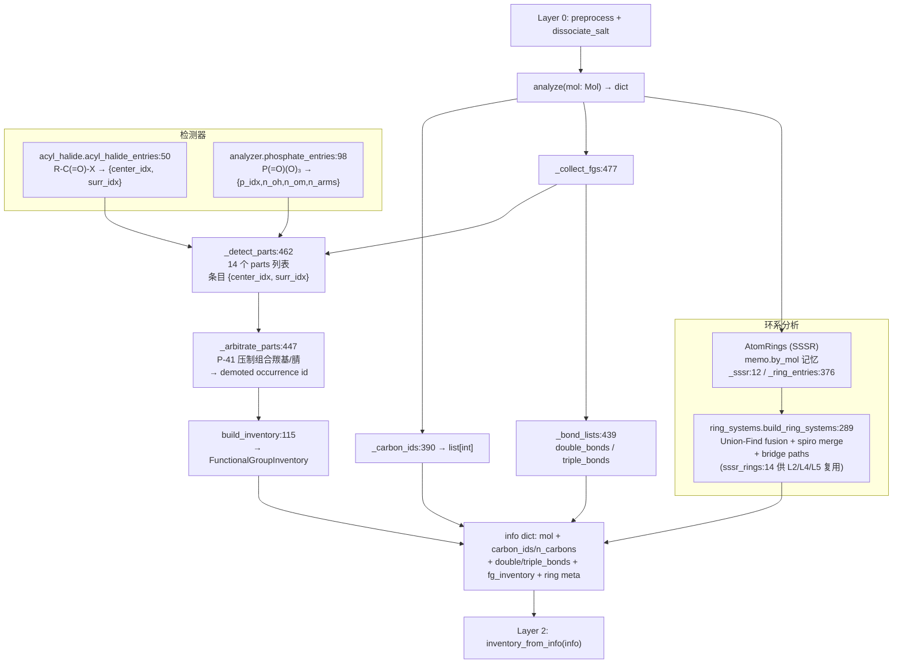
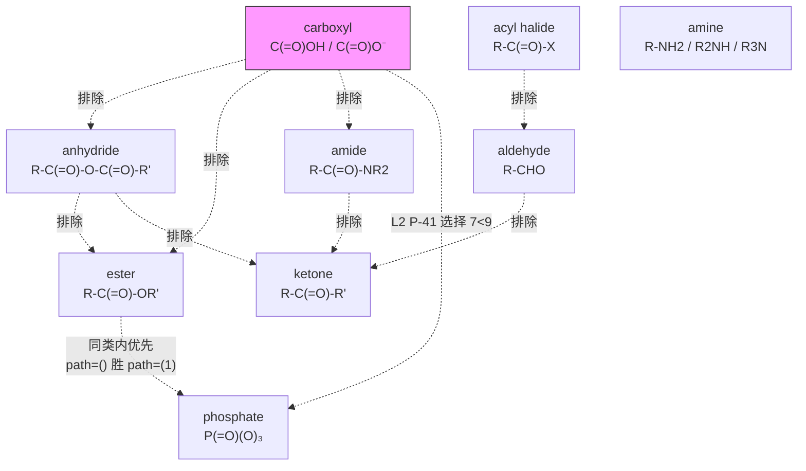

# Layer 1 -- Analyzer (Functional Group Detector)

> **位置:** `src/namepredict/layer1/` | **行数:** 7 个 `.py` (1,173 行；不含 `__init__.py` 为 6 个模块 / 1,167 行) | **最后更新:** 2026-09-13

## 概述

Layer 1 是 NamePredict 6 层命名流水线的 **第一阶段分析层**，位于 layer0（预处理/盐拆分）之后、layer2（parent 选择）之前。其唯一职责是：**接收一个 RDKit `Mol` 对象，检测分子中所有官能团（Functional Group, FG）和环系拓扑结构，返回一个结构化的信息字典（info dict）**，供下游 layer2-layer5 使用。

Layer 1 采取"一次分析、全部输出"策略：全部可能命名的结构特征在一次扫描中检出，各检测器输出**同一种条目形态**（中心原子 + 周边原子索引），按 `fg_registry.FG_SPECS` 登记的 14 个类别分桶，最后收敛为**唯一 FG 出口** —— 类型化的 `FunctionalGroupInventory`（`info["fg_inventory"]`）。下游读 FG 事实只经 `inventory_from_info(info)`：按 `FunctionalGroupClass` 查询出现（occurrence），列表键与布尔标志不属于对外合约；layer2 的 P-41 主基团等级表同样由 `FG_SPECS.p41` 派生，故 FG 的注册事实只有一处。

**输入**: `rdkit.Chem.Mol`（经过 layer0 预处理的有机部分、已去除盐）
**输出**: `dict`，共 11 个键 —— 分子对象引用、碳原子列表（`carbon_ids`/`n_carbons`）、不饱和度键列表（`double_bonds`/`triple_bonds`）、类型化 FG 清单（`fg_inventory`）、环系元信息（`rings`/`n_rings`/`has_ring`/`ring_systems`/`n_ring_systems`）

**关键设计原则**:
- **无状态**: `analyze(mol)` 的返回值只依赖入参 mol，不依赖外部数据；内部的单次命名记忆（`tools/memo.py`）只消除重复计算，不改变任何返回值（见 §7.1）
- **原子级精确**: 每个检测条目都给出具体的原子索引（`center_idx` 为中心原子、`surr_idx` 为周边原子），而非仅布尔标志，确保下游可以精确定位和修饰
- **排他性优先级**: 更"贵"的 FG 优先匹配（如 carboxyl 排斥 ester/amide/anhydride），通过检测谓词互相排除实现；检测之后再经 `_arbitrate_parts`（`analyzer.py:447`）按 P-41 等级压制组合 FG
- **环系独立分析**: 通过 SSSR + Union-Find 融合图 + spiro 合并独立分析环系拓扑，不受 FG 检测影响

Layer1 由 **7 个 `.py`** 组成。FG 检测范围即 `FG_SPECS`（`fg_registry.py:32`）登记的 **14 个 `FgSpec`**（`radical` / `acyl` / `acid` / `phosphate` / `anhydride` / `ester` / `acyl_halide` / `amide` / `nitrile` / `aldehyde` / `ketone` / `alcohol` / `thiol` / `amine`，与 `FunctionalGroupClass` 的 14 个实类一一对应）。醚、硫醚、硝基、季铵、异氰酸酯/异硫氰酸酯，以及 12 个扩展 FG（boronic/carbamate/carbonate/guanidine/hydrazine/sulfonamide/sulfonate/sulfone/sulfonic_acid/sulfonyl_chloride/sulfoxide/urea）都在检测范围之外，既不出现于 `info` dict，也不出现于 `fg_inventory`。

---

## 核心逻辑

### 1. FG 检测模式（Pattern）

Layer 1 的 FG 检测采用统一的"谓词函数 + 条目构建函数 + 收集函数"模式，全部条目共用同一接口：

**统一条目接口**: `{"center_idx": int, "surr_idx": [int, ...]}` —— 前者是官能团的中心原子（羰基碳 / 杂原子 / 腈碳 / 自由基位点），后者是判定与命名所需的周边原子（羰基 O、酰胺 N、酯烷氧 O、卤素、碳臂）。锚点（`parent_anchors`）从这一接口派生：`alcohol`/`thiol`/`amine` 取 `surr_idx`（碳臂即母体锚点），其余类别取 `center_idx`。

**通用检测模式**:
1. 定义"谓词函数"（如 `_is_carboxyl_carbon(atom) -> bool`、`_is_acyl_halide_carbon(atom) -> bool`），基于原子序数、键型、环归属、邻居原子类型等 RDKit API 做规则匹配
2. 定义"条目构建函数"（如 `_carboxyl_entry(atom) -> dict`），把中心原子与相关邻居的索引打包成上述接口
3. 定义"收集函数"（如 `_carboxyl_entries(mol) -> list[dict]`），遍历分子收集所有匹配条目
4. `_detect_parts(mol)`（`analyzer.py:462`）以 `FG_SPECS` 的 `list_key` 为键汇总为 14 个 parts 列表，再交 `_arbitrate_parts`（`analyzer.py:447`）与 `build_inventory`（`functional_group_inventory.py:115`）

| FG 类别 (`FunctionalGroupClass`) | parts 键 | 谓词 / 收集函数 | 条目字段 |
|---|---|---|---|
| `radical` | `radicals` | `_radical_entries`（`analyzer.py:427`） | `center_idx` + 空 `surr_idx` |
| `acyl` | `acyls` | `_is_acyl_head`（`:399`）/ `_acyl_entries`（`:420`） | `center_idx`, `surr_idx`(=O) |
| `acid` | `carboxyls` | `_is_carboxyl_carbon`（`:107`）/ `_carboxyl_entries`（`:258`） | `center_idx`, `surr_idx`(全部 O 邻居) |
| `phosphate` | `phosphates` | `_one_phosphate`（`:44`）/ `phosphate_entries`（`:98`） | `p_idx`, `n_oh`, `n_om`, `n_arms` |
| `anhydride` | `anhydrides` | `_is_anhydride_carbon`（`:305`）/ `_anhydride_entries`（`:313`） | `center_idx`(桥氧), `surr_idx` |
| `ester` | `esters` | `_is_ester_carbon`（`:176`）/ `_ester_entries`（`:293`） | `center_idx`, `surr_idx`(=O + 酯烷氧 O) |
| `acyl_halide` | `acyl_chlorides` | `_is_acyl_halide_carbon`（`acyl_halide.py:35`）/ `_acyl_chloride_entries`（`analyzer.py:283`） | `center_idx`, `surr_idx`(=O + 卤素) |
| `amide` | `amides` | `_is_amide_carbon`（`:117`）/ `_amide_entries`（`:275`） | `center_idx`, `surr_idx`(=O + N) |
| `nitrile` | `nitriles` | `_is_cn_triple`（`:354`）/ `_nitrile_entries`（`:368`） | `center_idx`(腈碳), `surr_idx`(N) |
| `aldehyde` | `aldehydes` | `_is_aldehyde_carbon`（`:190`）/ `_aldehyde_entries`（`:279`） | `center_idx`, `surr_idx`(=O) |
| `ketone` | `ketones` | `_is_ketone_carbon`（`:129`）/ `_ketone_entries`（`:266`） | `center_idx`, `surr_idx`(=O) |
| `alcohol` | `hydroxyls` | `_is_hydroxyl_oxygen`（`:202`）/ `_hydroxyl_entries`（`:218`） | `center_idx`(O), `surr_idx`(C) |
| `thiol` | `thiols` | `_thiol_entries`（`:222`） | `center_idx`(S), `surr_idx`(C) |
| `amine` | `amines` | `_amine_degree`（`:233`）/ `_amine_entries`（`:249`） | `center_idx`(N), `surr_idx`(全部碳臂) |

> `phosphate` 是唯一不套用 `center_idx`/`surr_idx` 接口的类别：其条目为 `{p_idx, n_oh, n_om, n_arms}`，锚点 key 在 `FG_SPECS` 中单列为 `("p_idx",)`，特征原子由例外函数 `_phosphate_atoms`（`functional_group_inventory.py:73`）计算（P 中心 + 全部 O 邻居）。

> `anhydride` 通道当前不完整：`_anhydride_entries`（`analyzer.py:313`）调用 `_anhydride_entry` 但不把结果收进返回列表，且 `_anhydride_entry`（`analyzer.py:297`）引用了未绑定的名字 `other`；含酸酐的分子进入 `analyze` 会抛 `NameError`（实测 `CC(=O)OC(=O)C`）。`anhydrides` 因而实际恒为空。

### 2. 信息字典结构（Info Dict）

`analyze(mol)`（`analyzer.py:489`）返回的字典由 `_info()`（`analyzer.py:484`）组装，**共 11 个键**：

```python
{
    # 基础分子信息（analyzer.py:486）
    "mol": mol,                    # 原始 Mol 对象引用
    "carbon_ids": [0, 1, 2, ...],  # 所有碳原子索引（_carbon_ids analyzer.py:390）
    "n_carbons": 10,               # 碳原子总数

    # 不饱和度键列表（_bond_lists analyzer.py:439；结构事实，独立于 FG 通道）
    "double_bonds": [{"c1": 3, "c2": 4}, ...],  # C=C 双键（非芳香）
    "triple_bonds": [{"c1": 7, "c2": 8}, ...],  # C≡C 三键

    # 类型化 FG 清单 —— 全部 FG 事实的唯一出口（_collect_fgs analyzer.py:482）
    "fg_inventory": FunctionalGroupInventory(...),

    # 环系元信息（_ring_meta analyzer.py:386-387）
    "rings": [{"atom_ids": (0, 1, 2, 3, 4, 5)}, ...],  # SSSR 原始环（_ring_entries analyzer.py:376）
    "n_rings": 1,           # 环总数
    "has_ring": True,       # 是否有环
    "ring_systems": [...],  # ring_systems.build_ring_systems:289 构建的环系拓扑
    "n_ring_systems": 1,    # 环系总数
}
```

> FG 条目列表（parts）只在 L1 内部流转：`_detect_parts` → `_arbitrate_parts` → `build_inventory` 之后不进 `info`。`info` 中**没有** `carboxyls`/`esters`/… 之类的 FG 列表键，也**没有** `has_*` 布尔键；下游读 FG 事实一律经 `inventory_from_info(info)`（`functional_group_inventory.py:121`），缺失即 `KeyError` 显式失败。`has_ring` 是下游直接读的布尔键（`namer.py:142`），`double_bonds`/`triple_bonds` 由 `layer2/principal_expression.py:481`/`:482` 按母体原子集过滤消费。

### 2.1 锚定酰基残基（acyl，酰基头检测）

`*`-锚定分子（`build_anchor_submol` 构造的取代基自由基片段）走**酰基残基通道**：自由价直接连着酰基头羰基碳（如 `*C(=O)C` 乙酰片段、苯环被 `*C(=O)` 顶替的苯甲酰）时，L1 判定其为 acyl 主基团（`FgSpec("acyl")`，`fg_registry.py:36`，p41=1 同 radical），供 L2 选母体、L5 按酸衍生 -oyl/酰 命名（P-65.1.7.2）。

- `_is_acyl_head`（`analyzer.py:399`）— 锚定羰基碳（带 =O、`_is_anchored`（`analyzer.py:394`，原子序 0 邻居））须**恰好 1 个单键碳邻居且无其它重邻居**。环内酮/内酯/酰胺的羰基碳两侧分别被环碳或 N/O 占据（环酮 carbs=2、内酯/酰胺置 hetero），不会误判为酰基头；α 可开链亦可是**环/芳**——苯甲酰、furan-2-carbonyl 等环酸衍生酰基头由此进入 acyl 通道。
- `_acyl_entries`（`analyzer.py:420`）— 收集全部酰基头条目 `{center_idx, surr_idx}`。`_detect_parts` 据此把 `radicals` 的候选排除（`_radical_entries(mol, heads)`，`analyzer.py:468`），并过滤掉同为酰基头的 `aldehydes`（`analyzer.py:470`）。
- `_arbitrate_parts` 语义（见下 §3.5）对酰基残基与其 α 碳上的主 FG 一致成立——酰基头碳是母体的一部分，α 碳上的取代基走常规 L3 路径。

### 2.2 酮/醛羰基的环内约束（环内 N/O/S / H / 内酯 / 环脲）

酮与醛的判定在「碳邻居计数」之外增加了若干结构约束，避免同一羰基被重复归类或误判。`_is_ketone_carbon`（`analyzer.py:129`）按 **碳邻居数 `n_c`** 分三条通道（`n_c == 1` / `n_c == 0` / `n_c == 2`），并统一排除酰胺 N 与酸酐桥氧：

- **单碳羰基连杆内杂原子 → 酮（P-66.1.1）**：`_has_ring_hetero_neighbor`（`analyzer.py:125`）判断羰基碳是否连有**环内 N/O/S**（元素集合取 `constants.RING_HETERO`，`constants.py:36`）；`n_c == 1`（`analyzer.py:136`）时须连环内杂原子才作酮。环内 N 覆盖 N-酰基环胺（`1-(pyrrolidin-1-yl)ethanone` 型，母体为 ethanone 而非乙酰胺）；环内 O/S 覆盖内酯与硫代内酯——羰基碳与杂原子同环经该杂原子闭合，故按杂环 `-one` 命名。已被 `_is_aldehyde_carbon` 判为醛的羰基让位给醛。相应地 `_amide_n_info`（`_carbonyl_common.py:104`）把**环内 N 排除出酰胺判定**（`_carbonyl_common.py:107`），使同一 N 不会既走酰胺又走酮。
- **内酯 / 硫代内酯 → 酮（并入环母体）**：`_is_lactone_carbon`（`analyzer.py:167`）判定酯氧在环内的羰基（`_ester_alkoxy_of`（`analyzer.py:163`）返回的烷氧 O `IsInRing`）；`_has_ring_hetero_neighbor` 的环内 O/S 一支与之同向，共同覆盖 `n_c == 1` 通道，`_is_ester_carbon`（`analyzer.py:176`）则显式排除内酯。这样 2H-chromen-2-one / 2-benzofuran-1-one / 1,3-dioxolan-2-one 等并入环母体走 -one 后缀，不按酯的 -oate 命名。
- **环内零碳邻居羰基 → 环酮**：`n_c == 0`（`analyzer.py:139`）时羰基碳必须在环内，且不得是"非内酯型酯"（`_ester_alkoxy_of` 非 None 且 `_is_lactone_carbon` 为假即排除）；余者（环脲/环碳酸酯，如嘧啶-2,4-二酮、乙内酰脲）作环酮，开链脲/CO₂ 因 `IsInRing()` 为假被排除。
- **醛必须带 H，环内羰基不作醛**：`_is_aldehyde_carbon`（`analyzer.py:190`）要求单碳邻居、带 =O、**至少 1 个 H**（`analyzer.py:198`）且未被 `_ald_blocked`（`analyzer.py:184`，排除酯/酰卤/酸酐占用）阻断；判定不区分环内/环外——无 H 的环内羰基（内酰胺/环脲/环酮）由 `_is_ketone_carbon` 作酮、以 -one 后缀表达（P-66.6.1），同一羰基不双计 oxo（否则喹唑啉-4-酮会被错拼成 …醛）。
- **N-羟基酰胺**：`_amide_n_substituent_ok`（`_carbonyl_common.py:97`）允许 N 上接一个**不连碳的羟基 O**（N-hydroxyamide）参与酰胺判定；`_amide_n_info`（`_carbonyl_common.py:104`）只把碳取代基收进返回的列表，供 L3 归属。

### 3. 类型化 FG 库存 (`functional_group_inventory.py`)

`functional_group_inventory.py`（126 行）把 `analyzer.py` 产出的 parts 条目列表（dict 列表）包装成**类型化的数据容器**，是 L1 FG 事实的对外形态：

- `FunctionalGroupClass(str, Enum)`（L10）— 14 个实类：`RADICAL, ACYL, ACID, PHOSPHATE, ANHYDRIDE, ESTER, ACYL_HALIDE, AMIDE, NITRILE, ALDEHYDE, KETONE, ALCOHOL, THIOL, AMINE`，外加哨兵成员 `NONE`（值 = `"alkane"`）
- `FunctionalGroupOccurrence`（frozen dataclass，L30）— `id / group_class / characteristic_atoms / parent_anchors / payload / demoted`；`id` 形如 `"esters:0"`（`list_key:序号`），`demoted` 标记被 P-41 仲裁降级为前缀叶的条目（P-61.1.3 carboxy/cyano）
- `FunctionalGroupInventory`（frozen dataclass，L41）— `entries` + `occurrences(group_class)`（L45，按类取出现，**排除 demoted**）+ `demoted_entries()`（L49，取全部降级叶）
- `_LIST_CLASSES`（L53）/`_ANCHOR_KEYS`（L55）— **从 `fg_registry.FG_SPECS` 派生**（不手写）。`_ANCHOR_KEYS` 只收声明了 `anchors` 的类别：`amine` 为 `("surr_idx",)`，`phosphate` 为 `("p_idx",)`，其余已声明 `anchors` 的类别为 `("center_idx",)`（`anhydride` 未声明 `anchors`，不收集锚点）
- 特征原子：通用规则 `center_surr_atoms`（L79）= 中心原子 ∪ `surr_idx`；例外表 `FG_ATOM_FNS`（L88）当前只登记 `phosphate` → `_phosphate_atoms`（L73）
- 入口：`build_inventory(lists, mol=None, demoted=frozenset())`（L115）、`inventory_from_info(info)`（L121）

> **源:** `src/namepredict/layer1/functional_group_inventory.py`

### 3.5 FG 元数据单一事实来源（`fg_registry.py`）

`fg_registry.py`（80 行）是各层 FG 注册元数据的**单一事实来源**：`FG_SPECS`（`fg_registry.py:32`，14 条 `FgSpec`）集中每个官能团类别的跨层元数据，下游表由它派生，FG 元数据只在此处登记。`FgSpec`（L10）的 17 个字段：`fg` / `list_key` / `p41` / `path` / `compat` / `expr`（suffix / prefix_only / legacy_compat）/ `anchors` / `parent_anchor_fields` / `chain` / `multi` / `rs` / `keep_locant` / `locant_kind` / `locant_source` / `oh_parent` / `nh2_parent` / `oxo_parent`（字段语义见 `fg_registry.py:13-29` 的逐字段注释）。

四条派生函数：`chain_fgs()`（L63）、`multi_fgs()`（L68）、`srs_fgs()`（L73）、`keep_locant_fgs()`（L78）；消费方分别是 `layer2/principal_expression.py:45`（`_CHAIN_FG`）/`:46`（`_MULTI_FG`）、`layer5/stereo.py:107`（`_RS_KINDS`）、`layer5/assembler_prefixes.py:42`（`_KEEP_LOCANT_KINDS`）。

两条关键 spec：

- `FgSpec("acyl")`（`fg_registry.py:36`，p41=1 同 radical）— 锚定酰基残基（自由价连羰基头的 R-C(=O)- 片段），`chain=True, rs=True, keep_locant=True, locant_kind="acyl"`，parent 锚点字段 `("acyl_c_idx", "acyl_c_idxs")`，L5 按酸衍生 -oyl/酰 命名（P-65.1.7.2）。`FgSpec("radical")`（`:33`）用 `locant_source="anchor_field"`（位次固定取自 `radical_c_idx` 锚点字段，`constants.FIXED_START_KEYS`）。
- `FgSpec("phosphate")`（`fg_registry.py:41`）— 磷酸/磷酸酯，`p41=9, path=(1,), anchors=("p_idx",), chain=True`。P(=O)(O)₃ 中心：`n_arms=0` 为游离磷酸（P-41 类别 7d），`n_arms≥1` 为磷酸酯（P-67.1.3.2 归入类别 9 酯）；检测器不区分两者，故按占多数的酯形态登记 `p41=9`，同类内羧酸酯（`path=()`）优先——含羧酸酯或羧酸（7a < 9）时磷酸降级为 phosphonooxy 前缀（P-67.1.5.1）。该优先级选择由 L2 完成：`layer2/principal.py:42`/`:49` 用 `FG_SPECS.p41`/`path` 建主基团等级表。

`analyzer._arbitrate_parts`（`analyzer.py:447`）—— **P-41 主基团仲裁**（L1 内部）：`_SUPPRESSIBLE`（`analyzer.py:443`）= `constants.CARBONYL_COMPOSITES` + `nitriles`，即组合羰基 FG（酸/酯/酰卤/酰胺/醛/酸酐）与腈；`_LEAF_DEMOTED`（`analyzer.py:444`）= `("carboxyls", "nitriles")`。当 parts 中存在更高优先级 FG（等级表取自 `FG_SPECS` 的 `p41`，`analyzer.py:449`；存在性判定用 `constants.FG_PARTS_KEY`，`analyzer.py:450`）时：

  - **叶型降级（羧酸/腈）**：条目保留在 parts 中并把 occurrence id（`"carboxyls:0"` 式）收进 `demoted`，由 `build_inventory` 写成 `FunctionalGroupOccurrence.demoted=True`（P-61.1.3 carboxy/cyano 前缀叶）：中性 -COOH 整组保持"羧酸叶"身份，供 L3 claim 成 carboxy、L2 链游走把其酸碳排除在开链外（见 layer2 §`_demoted_acid_carbons`）。阴离子羧酸（-COO⁻）与腈同走此通道。
  - **整组清空（酯/酰胺/醛/酰卤/酸酐）**：`parts[key] = []`，组成成员（N/烷氧基/卤素）由 L3 递归/anchored 路径归属。
  - `ketone`/`alcohol`/`thiol`/`amine` 是基础成员 FG，永不退出（不在 `_SUPPRESSIBLE` 中）。

p41 等级序（`fg_registry.py:32-61`）：radical/acyl = 1 < acid = 7 < anhydride = 8 < phosphate/ester = 9 < acyl_halide = 10 < amide = 11 < nitrile = 14 < aldehyde = 15 < ketone = 16 < alcohol/thiol = 17 < amine = 19。

> **源:** `src/namepredict/layer1/fg_registry.py`

### 3.6 跨层共享常量（`constants.py`）

`src/namepredict/constants.py`（213 行）是原子序数与跨层共享常量的单一来源，按用途分区（原子序数 / 常用集合 / L0 电荷归一 / L1 parts 键 / L2·L5 单核母体氢化物 / L3 取代基词表 / L4 位次 / L5 组装词表）。L1 及其上下游都从这里导入，layer1 内直接消费的有 `C/H/N/O/S/P`、`HALO_Z`、`RING_HETERO`、`FG_PARTS_KEY`、`CARBONYL_COMPOSITES`：

- `HALO_Z = frozenset({F, Cl, Br, I})`（`constants.py:35`）— 卤素原子序集合；L1 的酰卤检测（`acyl_halide.py:31`）与 L2/L5 的卤素后缀表都由它派生（另有 `HALO_ZH`（`:37`）/`HALIDE_EN`（`:38`）名称表）。
- `RING_HETERO = frozenset({N, O, S})`（`constants.py:36`）— **环内杂原子集合**：其单碳酰基按环酮命名（内酰胺 / 内酯 / 硫代内酯、N-酰基环胺）。L1 的消费点是 `analyzer._has_ring_hetero_neighbor`（`analyzer.py:125`），见 §2.2。
- `N_PREFIX_KINDS = frozenset({"n_alkyl", "n_block"})`（`constants.py:39`）— **N-取代基 kind（P-62.2.2.1）**：这类取代基走 `N-` 前缀、位次以 `N` 标注或隐含省略，不参与数字位次通道。L1 不消费，供 layer3/layer5/namer 使用。
- `FG_PARTS_KEY`（`constants.py:114`）/`CARBONYL_COMPOSITES`（`constants.py:120`）— **L1 parts 键表**：前者为 `fg 名 → parts 键`（13 条，即 `FG_SPECS` 中带 `p41` 且在 parts 中的链 FG），后者为组合羰基 parts 键 → fg 名（6 条）。`analyzer._arbitrate_parts`（`analyzer.py:450`）与 `_SUPPRESSIBLE`（`analyzer.py:443`）消费它们。注意 `phosphates` 不在 `FG_PARTS_KEY` 中，故磷酸不参与 L1 的存在性判定与压制集合。
- `zh_bridge_root(name)`（`constants.py:90`）— **桥后缀前的中文烃基名去尾「基」**：甲基→甲、叔丁基→叔丁、环己基→环己、丙-2-基→丙-2-（tiers gold 口径），供拼「甲氨基 / 叔丁氧基 / 环己硫基」式中文桥名。消费方是 `layer5/assembler.py:266`/`:330`。
- **杂原子优先序（两条序列同源不同序，勿混用）**：
  - `P25_SENIOR`（`constants.py:41`）= `N, F, Cl, Br, I, O, S, …, B, Al, …`（**N 居首**）— 用于 **P-25.3.2.4**「多个稠环组分并列时选哪个组分当母体」，即"哪个杂原子更优先即该组分更优先"（`layer2/fused_system.py:98` 的 `_key_a`）。
  - `P145_SENIOR`（`constants.py:42`）= `F, Cl, Br, I, O, S, …, N, P, …`（**N 在 O/S 之后**）— 用于 **P-25.3.3.1.2(b)**「稠环/杂环编号时哪个杂原子得低位次」，即按 `F > Cl > … > O > S > … > N > …` 逐元素把低位次给更优先的杂原子（`layer4/numbering_engine.py:168` 的 `_narrow_hetero_ring`，序列消费点 `:176`；`layer4/fused_numbering.py:171`、`layer2/fused_system.py:138`）。

两条序列唯一差别就是 N 的位置（P25 把 N 排在首位，P145 把 N 排到 O/S/Se/Te 之后）。若在"选母体"处误用 P145、或在"定低位次"处误用 P25，稠合杂环的母体组分与编号会双双取反，故 `constants.py:41` 明确标注 `勿混用`。

### 4. 独立 FG 检测器与内联磷酸检测

layer1 有 **1 个独立检测模块**，其余类别的检测逻辑都在 `analyzer.py` 内：

- **`acyl_halide.py`**（56 行）— 检测酰卤 R–C(=O)–X，覆盖 **F/Cl/Br/I**（P-65.5，卤素集合用 `HALO_Z`，`constants.py:35`，判定点 `acyl_halide.py:31`）。入口 `acyl_halide_entries(mol)`（`:50`），entry 为统一接口 `{center_idx, surr_idx(=O + 卤素)}`；模块自带 `_is_ester_alkoxy_o`（`:15`，比 analyzer 版多校验形式电荷为 0）、`_ester_alkoxy_of`（`:23`）与 `_acyl_hal_of`（`:27`，返回 `(hal_idx, hal_z)`）。`acyl_hal_of(carbon)`（`:54`）供 analyzer 复用——`analyzer._acyl_hal_of`（`analyzer.py:102`）惰性导入它，供 `_ald_blocked`（`analyzer.py:184`）判醛阻断。卤素身份不进条目：L2 从 `surr_idx` 里挑原子序落在 `HALO_Z` 的原子，产出 `parent.hal_z`/`hal_idx`（`layer2/principal_expression.py:443`），L5 据此选氟氯溴碘后缀（layer5 §`_ACYL_HALIDE_BY_HAL`，`layer5/chain_engine.py:419`、`layer5/assembler.py:386`）。
- **磷酸中心（内联在 `analyzer.py`）** — `_one_phosphate`（`analyzer.py:44`）逐 P 校验：P 中性无 H、4 个重邻居全为 O、恰 1 个 P=O（该 O 不连其它重原子）与 3 个 P–O 单键；3 个单键 O 各归入 `n_oh`（中性带 H 的 OH）、`n_om`（-1 阴离子 O⁻）或 `n_arms`（O–R 臂，`_arm_component`（`analyzer.py:27`）取不穿过 core 的连通重原子组分，且组分只贴该桥 O）；最后要求**全分子重原子 = core ∪ 全部臂**，从而排除 P–O–P 焦磷酸与臂间成环。入口 `phosphate_entries(mol)`（`analyzer.py:98`）。
- 异氰酸酯/异硫氰酸酯（P-61.9）不在检测范围：`FunctionalGroupClass` 无对应成员，L1 无检测函数，`info`/`fg_inventory` 中都不出现。

### 5. 共享羰基原语 (`_carbonyl_common.py`)

`_carbonyl_common.py`（111 行）为 analyzer.py 与 acyl_halide.py 提供共享的羰基检测原语，共 **13 个函数**：`_is_single_c_oh`:10 / `_dbl_o_on`:17 / `_has_double_bonded_o`:24 / `_double_bonded_o_idxs`:29 / `_is_carboxylate_o`:42 / `_has_acid_o_neighbor`:49 / `_is_anhydride_bridge_o`:56 / `_alkoxy_c_of`:66 / `_ester_alkoxy_of`:74 / `_amide_n_rest`:85 / `_amide_n_single`:91 / `_amide_n_substituent_ok`:97 / `_amide_n_info`:104。调用方为 `analyzer.py:11`、`acyl_halide.py:7` 与 `layer2/principal_expression.py:12`（后者只用 `_alkoxy_c_of`）。

`analyzer.py` 与 `acyl_halide.py` 各自保留自己的 `_is_ester_alkoxy_o` 谓词并传入共享的 `_ester_alkoxy_of`（`_carbonyl_common.py:74`）——analyzer 版排除 anhydride 桥氧（`analyzer.py:155`），acyl halide 版校验形式电荷（`acyl_halide.py:15`）。`_amide_n_info`（`_carbonyl_common.py:104`）排除**环内 N**（P-66.1.1）并经 `_amide_n_substituent_ok`（`_carbonyl_common.py:97`）接纳 N-羟基 O，见 §2.2。

> **源:** `src/namepredict/layer1/_carbonyl_common.py`

### 6. 特殊检测 -- 键遍历 vs 原子遍历

大多数 FG 检测器通过**遍历原子**（`for atom in mol.GetAtoms()`）工作，少数检测器需要**遍历键**：

- **Nitrile** — 遍历所有键找 C≡N 三键（`_is_cn_triple`:354），条目中心是腈碳（`_nitrile_entry`:361）
- **Alkene / Alkyne** — 遍历所有键找 C=C 双键（`_is_cc_double`:323）/ C≡C 三键（`_is_cc_triple`:330），条目为 `{"c1", "c2"}`（`_bond_entry`:337）；两者经 `_bond_lists`（`analyzer.py:439`）作为**不饱和度结构事实**进入 info，而**不走 FG 通道**（`_detect_parts` 只承载 P-41 官能团条目）
- **acyl / radical** — 以原子序 0 的虚拟原子为起点遍历其重原子邻居（`_acyl_entries`:420、`_radical_entries`:427），即锚定分子的自由价位点

### 7. 环系检测（Ring Detection）

环系检测分两个层次（`analyzer.py`、`ring_systems.py`）：

1. **原始环**: `analyzer._ring_entries`（`analyzer.py:376`）取 RDKit 的 `GetRingInfo().AtomRings()` 得到 SSSR（最小环集），包装为 `{"atom_ids": …}` 条目列表（`_ring_entry`:372）
2. **环系拓扑** (`ring_systems.build_ring_systems`:289)——内部经 `_sssr`（`ring_systems.py:12`）取环：
   - `_fusion_edges`（`:31`）取共享 **>=2 个原子**的环配对为稠合边，`_components`（`:64`）用 Union-Find（`_uf_find`:51 / `_uf_union`:58）把稠合环连成连通分量
   - `_spiro_pairs`（`:41`）取**恰好共享 1 个原子**的环配对，`_merge_spiro`（`:272`）按螺原子把它们并查集合并，`_merged_spiro_system`（`:227`）产出 `topology="spiro"` 且带 `ring_sizes` 的环系
   - 桥环（von Baeyer）：`_try_bridge_component`（`:175`）在双环分量中找共享 **>=3 个原子**的稠合边，`_bridgeheads`（`:92`，经 `_non_adjacent_pairs`:83 判"在至少一个环中不相邻"的共享原子）定桥头，`_bridge_paths`（`:125`）由 `_paths_between`:105 / `_walk_path`:98 枚举桥路径并按长度降序
   - 输出字段（`_system_dict`:154）：`atom_ids`、`sssr_indices`、`fusion_edges`（`(i, j, [共享原子])` 三元组，由 `_member_edges`:145 筛为分量内边）、`n_rings`、`n_atoms`、`hetero_atoms`（`_hetero_atoms`:74，非碳原子的 `{idx, Z}` 列表）、`is_aromatic_mancude` 与 `topology`（占位，常规为 `None`；仅螺环合并写 `"spiro"`）；桥环分量另带 `bridgeheads`/`bridge_lengths`/`bridge_paths`

下游消费的字段是 `atom_ids`、`sssr_indices`、`fusion_edges`：`layer2/parent_skeleton.py:105`（环骨架原子集）、`layer2/principal_expression.py:235`（`sssr_indices` 判稠合）、`layer2/fused_system.py:228`（`fusion_edges` 拆解稠环树）；`layer4/numbering_engine.py:269` 与 `layer5/fused_namer.py:137` 则直接再调 `build_ring_systems(mol)` 取同一环系事实。

#### 7.1 环访问缓存（`tools/memo.py` 的两个 L1 调用点）

环感知对分子恒定，但同一分子在一次命名内会被各层反复问十几次，且 `GetRingInfo().AtomRings()` 每次调用都要重建 Python 嵌套对象（实测 25~45 µs/环）。L1 因此把两个环访问器都接进 `tools/memo.py`（49 行）的单次命名记忆（键为 `id(mol)`，值里同时保活 mol）：

- `analyzer._ring_entries`（`analyzer.py:378`）— `memo.by_mol("ring_entries", …)`，info dict 的 `rings` 即此结果。
- `ring_systems._sssr`（`ring_systems.py:12`）— `memo.by_mol("sssr", …)`；对外由 `sssr_rings(mol)`（`ring_systems.py:14`）统一暴露，L2/L4/L5 的环访问都走它（`layer2/fused_system.py:227`、`layer2/parent_skeleton.py:179`、`layer2/principal_expression.py:157`、`layer2/ring_scaffold.py:470`、`layer4/numbering_engine.py:263`/`:276`、`layer5/fused_namer.py:133`），避免各层各自重建 AtomRings。

`memo` 由 `namer.SMILESNNamer.name` 每次顶层命名开始时 `memo.begin_run()`（`namer.py:287`）清空，按线程隔离，跨分子不共享。`sssr_rings` 返回的是同一次命名内所有调用者共享的同一列表对象，**下游只可遍历/求和，不得原地修改**（`sssr_rings` 的 docstring 明确此约定，`ring_systems.py:14`）。

### 8. 收集与组装流程

`analyze()` 函数的完整调用链（`analyzer.py:489`）:

```
analyze(mol)
  └─ _info(mol, _carbon_ids(mol))     # analyzer.py:484
       ├─ _carbon_ids(mol) → 所有碳原子索引        # :390
       ├─ _collect_fgs(mol)                        # :477
       │    ├─ _detect_parts(mol)                  # :462  14 个 parts 列表（统一 {center_idx, surr_idx} 条目）
       │    ├─ _arbitrate_parts(parts)             # :447  P-41 压制组合羰基/腈 → (parts, demoted ids)
       │    ├─ _bond_lists(mol)                    # :439  double_bonds / triple_bonds（非 FG）
       │    └─ build_inventory(parts, mol, demoted) # functional_group_inventory.py:115 → FunctionalGroupInventory
       └─ _ring_meta(mol)                          # :380
            ├─ _ring_entries(mol)   # :376 经 memo.by_mol("ring_entries") 记忆
            └─ build_ring_systems(mol)  # ring_systems.py:289
```

---

## 文件清单

| 文件 | 行数 | 说明 |
|------|------|------|
| `__init__.py` | 6 | 公开导出 `analyze` 函数（`__init__.py:4`） |
| `analyzer.py` | 493 | **主分析器** -- 14 类 FG 检测（含锚定酰基头 `_is_acyl_head`:399 / `_acyl_entries`:420、自由基 `_radical_entries`:427）+ 内联磷酸检测（`_one_phosphate`:44 / `phosphate_entries`:98）+ `_has_ring_hetero_neighbor`:125 / `_is_ketone_carbon`:129 / `_is_lactone_carbon`:167 / `_is_ester_carbon`:176 / `_is_aldehyde_carbon`:190（酮/醛/内酯环内 N/O/S 约束，见 §2.2）+ `_arbitrate_parts`:447（`_SUPPRESSIBLE`:443 / `_LEAF_DEMOTED`:444，P-41 压制与降级叶）+ `_detect_parts`:462 / `_collect_fgs`:477 / `_info`:484 / `_ring_entries`:376（经 `memo.by_mol` 记忆，见 §7.1）；`_amine_degree`:233 排除**环内 N**（饱和杂环 N 是环杂原子而非胺官能团） |
| `_carbonyl_common.py` | 111 | **共享羰基原语**：13 个 `_is_*`/`_*_of` 检测谓词（analyzer / acyl_halide / layer2 共用）；`_amide_n_substituent_ok`:97 接纳 N-羟基 O，`_amide_n_info`:104 排除环内 N（P-66.1.1） |
| `fg_registry.py` | 80 | **FG 元数据单一事实来源**：`FgSpec`:10（17 字段）、`FG_SPECS`:32（14 条，含 `acyl`:36 与 `phosphate`:41）；派生 `chain_fgs`:63 / `multi_fgs`:68 / `srs_fgs`:73 / `keep_locant_fgs`:78 |
| `functional_group_inventory.py` | 126 | **类型化 FG 库存**：`FunctionalGroupClass`:10（14 个实类 + `NONE`）/`FunctionalGroupOccurrence`:30/`FunctionalGroupInventory`:41（供 L2，方法 `occurrences()`:45、`demoted_entries()`:49）；`_LIST_CLASSES`:53 与 `_ANCHOR_KEYS`:55 从 `FG_SPECS` 派生；入口 `build_inventory`:115 / `inventory_from_info`:121 |
| `acyl_halide.py` | 56 | **酰卤** (R-C(=O)-X, X=F/Cl/Br/I) 检测 (P-65.5)；卤素集合取自 `constants.HALO_Z`；`acyl_halide_entries`:50 / `acyl_hal_of`:54 |
| `ring_systems.py` | 301 | **环系拓扑检测** -- 基于 SSSR 的 Union-Find 融合图构建、spiro 合并、桥头/桥路径检测、hetero 原子统计；`_sssr`:12（`memo.by_mol("sssr")`）/`sssr_rings`:14 统一环访问器（L2/L4/L5 复用，见 §7.1）；`build_ring_systems`:289 |

> L1 的检测职责分布如下：酰卤在 `acyl_halide.py`；磷酸中心在 `analyzer.py` 内联（`_one_phosphate`:44 / `phosphate_entries`:98）；其余 12 类 FG 的检测都在 `analyzer.py`。异氰酸酯/异硫氰酸酯无检测实现；环系以 `ring_systems.py` 的 dict 事实形态产出，类型化 IR、布局指纹与相对立体化学推导不在 L1 产出范围。

**跨层模块（不计入上面 7 个 `layer1/` 文件，L1 有调用点）：**

| 模块 | 行数 | L1 调用点 |
|------|------|-----------|
| `src/namepredict/constants.py` | 213 | `analyzer.py:7` / `acyl_halide.py:6` / `ring_systems.py:8` / `functional_group_inventory.py:57` 导入原子序数与 `HALO_Z`、`RING_HETERO`、`FG_PARTS_KEY`、`CARBONYL_COMPOSITES`（见 §3.6） |
| `src/namepredict/tools/memo.py` | 49 | `analyzer._ring_entries`（`analyzer.py:378`）与 `ring_systems._sssr`（`ring_systems.py:12`）两个记忆表，见 §7.1；每次顶层命名由 `namer.py:287` 的 `memo.begin_run()` 清空 |
| `src/namepredict/tools/rdkit_fast.py` | 28 | 非 L1 调用：由 `namepredict/__init__.py:5` 在包导入时安装，把 `Chem.Mol.GetAtoms/GetBonds` 换成索引循环 |

---

## 数据流图



### FG 排他性依赖关系



> 注：醚/硫醚/硝基/季铵/异氰酸酯/异硫氰酸酯及 12 个扩展 FG（carbamate/carbonate/urea/guanidine/sulfoxide/sulfone/sulfonate/sulfonamide/sulfonic_acid/sulfonyl_chloride/boronic/hydrazine）不在 layer1 检测范围，因此无"carbamate 排除 ester""urea 排除 amide"等跨模块排他链——模块级排他检测只发生在 analyzer.py 内部的核心羰基族。磷酸检测内联在 `analyzer.py`（`phosphate_entries`:98），不参与 `_SUPPRESSIBLE`（`analyzer.py:443`）的压制集合；其与羧酸/羧酸酯的先后由 L2 的 P-41 主基团选择决定（`p41=9`，见 §3.5）。

---

## 源码引用

> **源:** `src/namepredict/layer1/analyzer.py:489` -- `analyze()` 函数入口，返回组装好的 info dict

> **源:** `src/namepredict/layer1/analyzer.py:484` -- `_info()` 函数，合并基础分子信息（`:486`）、FG 事实（`_collect_fgs`:477）与环系元信息（`_ring_meta`:380），共 11 个键

> **源:** `src/namepredict/layer1/analyzer.py:462` -- `_detect_parts()` 函数，按 `FG_SPECS` 的 `list_key` 汇总 14 个 parts 列表（含 `_acyl_entries`:420 / `_radical_entries`:427 / `phosphate_entries`:98，以及 `aldehydes` 按酰基头过滤 `:470`）

> **源:** `src/namepredict/layer1/analyzer.py:447` -- `_arbitrate_parts()` P-41 主基团仲裁：`_SUPPRESSIBLE`:443 中的组合 FG 被更高 p41 等级 FG 压制时整组清空，`_LEAF_DEMOTED`:444 中的羧酸/腈保留条目并标记 demoted（P-61.1.3 carboxy/cyano 叶）

> **源:** `src/namepredict/layer1/analyzer.py:125` / `:129` / `:167` / `:190` -- `_has_ring_hetero_neighbor` / `_is_ketone_carbon` / `_is_lactone_carbon` / `_is_aldehyde_carbon`，酮/醛羰基的环内 N/O/S、内酯与 H 约束（P-66.1.1 / P-66.6.1，见 §2.2）

> **源:** `src/namepredict/layer1/analyzer.py:376` / `ring_systems.py:12` / `:14` -- `_ring_entries` / `_sssr` / `sssr_rings`，经 `tools/memo.py` 按分子记忆的单次命名环访问（见 §7.1）

> **源:** `src/namepredict/layer1/analyzer.py:44` / `:98` -- `_one_phosphate` 单中心校验 / `phosphate_entries` 入口（P(=O)(O)₃，P-41 类别 7d / P-67.1.3.2）

> **源:** `src/namepredict/layer1/functional_group_inventory.py:10-26` -- `FunctionalGroupClass` 枚举，14 个实类 + `NONE`（含 `ACYL`、`PHOSPHATE`）

> **源:** `src/namepredict/layer1/functional_group_inventory.py:115` / `:121` -- `build_inventory()` 由 parts 列表 + demoted id 集构建清单 / `inventory_from_info()` 从 info 取清单（缺失即 `KeyError`）

> **源:** `src/namepredict/layer1/fg_registry.py:32` -- `FG_SPECS` 14 条 `FgSpec`，L1-L5 共用的 FG 注册元数据（L1 的 `_arbitrate_parts`、`_LIST_CLASSES`/`_ANCHOR_KEYS`、L2 主基团等级表都由它派生）

> **源:** `src/namepredict/layer1/_carbonyl_common.py` -- 13 个共享羰基检测原语（`_amide_n_substituent_ok`:97、`_amide_n_info`:104）

> **源:** `src/namepredict/layer1/acyl_halide.py:50` / `:54` -- `acyl_halide_entries()` 酰卤入口 / `acyl_hal_of()` 供 analyzer 复用的卤素邻居查询

> **源:** `src/namepredict/constants.py:35-42` -- `HALO_Z` / `RING_HETERO` / `N_PREFIX_KINDS` / `P25_SENIOR` / `P145_SENIOR`；`:90` `zh_bridge_root`；`:114`/`:120` `FG_PARTS_KEY` / `CARBONYL_COMPOSITES`（跨层共享常量，见 §3.6）

---

## 对外接口

### `analyze(mol: Mol) -> dict`

**参数**:
- `mol` (`rdkit.Chem.Mol`): 经过 layer0 预处理的有机分子（已去除盐、标准化）

**返回值** (`dict`，11 个键):
| 键 | 类型 | 说明 |
|---|---|---|
| `mol` | `Mol` | 原始分子对象引用（`analyzer.py:486`） |
| `carbon_ids` | `list[int]` | 所有碳原子的索引列表（`_carbon_ids`，`analyzer.py:390`） |
| `n_carbons` | `int` | 碳原子总数 |
| `double_bonds` | `list[dict]` | C=C 双键条目 `{c1, c2}`（非芳香；`_double_bond_entries`，`analyzer.py:346`） |
| `triple_bonds` | `list[dict]` | C≡C 三键条目 `{c1, c2}`（`_triple_bond_entries`，`analyzer.py:350`） |
| `fg_inventory` | `FunctionalGroupInventory` | **全部 FG 事实的唯一出口**（14 个 `FunctionalGroupClass` 类别的 occurrence；`build_inventory`，`functional_group_inventory.py:115`） |
| `rings` | `list[dict]` | 原始 SSSR 环，含 `atom_ids`（经 `memo.by_mol("ring_entries", …)` 记忆，见 §7.1） |
| `n_rings` | `int` | 环总数 |
| `has_ring` | `bool` | 是否有环（`namer.py:142` 直接消费） |
| `ring_systems` | `list[dict]` | 环系拓扑结构（`atom_ids`/`sssr_indices`/`fusion_edges`/`hetero_atoms`/…，见 §7） |
| `n_ring_systems` | `int` | 环系总数 |

### `functional_group_inventory` 访问接口

- `inventory_from_info(info: dict) -> FunctionalGroupInventory`（`functional_group_inventory.py:121`）— 下游取清单的唯一入口
- `FunctionalGroupInventory.occurrences(group_class) -> tuple[FunctionalGroupOccurrence, ...]`（`:45`）— 按类取出现（含 `payload` 原始条目、`characteristic_atoms`、`parent_anchors`），**不含 demoted 叶**
- `FunctionalGroupInventory.demoted_entries() -> tuple[FunctionalGroupOccurrence, ...]`（`:49`）— 取 P-41 降级的前缀叶（carboxy/cyano）
- `build_inventory(lists, mol=None, demoted=frozenset()) -> FunctionalGroupInventory`（`:115`）— L1 内部构建入口
- `FG_ATOM_FNS`（`:88`）/ `center_surr_atoms`（`:79`）— 特征原子计算的例外表与通用规则
- `FG_SPECS`（`fg_registry.py:32`）、`chain_fgs()`/`multi_fgs()`/`srs_fgs()`/`keep_locant_fgs()`（`fg_registry.py:63-80`）— 跨层 FG 元数据与其派生集合

### `ring_systems` 访问接口

- `sssr_rings(mol) -> list[tuple[int, ...]]`（`ring_systems.py:14`）— L2/L4/L5 统一环访问器（同一次命名内共享同一列表对象，只读）
- `build_ring_systems(mol) -> list[dict]`（`ring_systems.py:289`）— 环系拓扑事实（稠合分量 + 螺环合并 + 桥路径）

### `layer1/__init__.py`

只导出 `analyze`（`__init__.py:4`/`:6`）；下游模块按需直接从子模块导入（如 `from namepredict.layer1.functional_group_inventory import inventory_from_info`、`from namepredict.layer1.ring_systems import sssr_rings`）。

---

## 相关页面

- [[architecture/layer0-preprocessor]] -- 上游：分子预处理与盐拆分
- [[architecture/layer2-parent-selector]] -- 下游：parent 结构选择（经 `inventory_from_info` 读 FG 清单做覆盖度 gate 判断）
- [[architecture/layer3-substituents]] -- 下游：取代基识别
- [[architecture/layer4-numbering]] -- 下游：编号
- [[architecture/layer5-name-assembly]] -- 下游：名称组装
- [[architecture/overview]] -- 架构总览
- [[reference/core-data-contracts]] -- info dict 与 occurrence 字段的跨层合约
