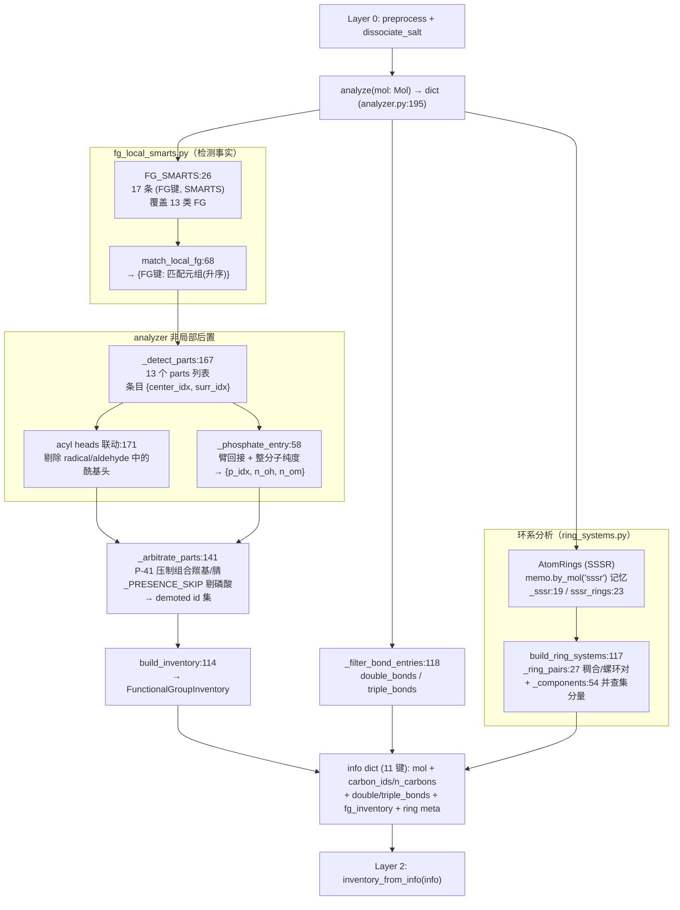
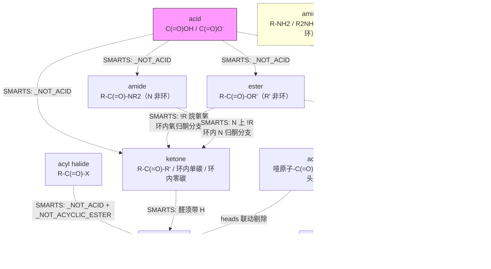

# Layer 1 -- Analyzer (Functional Group Detector)

> **位置:** `src/namepredict/layer1/` | **行数:** 6 个 `.py` (561 行，含 `__init__.py` 2 行) | **最后更新:** 2026-09-15

## 概述

Layer 1 是 NamePredict 6 层命名流水线的 **第一阶段分析层**，位于 layer0（预处理/盐拆分）之后、layer2（parent 选择）之前。其唯一职责是：**接收一个 RDKit `Mol` 对象，检测分子中所有官能团（Functional Group, FG）和环系拓扑结构，返回一个结构化的信息字典（info dict）**，供下游 layer2-layer5 使用。

Layer 1 采取"一次分析、全部输出"策略：全部可能命名的结构特征在一次扫描中检出，各检测器输出**同一种条目形态**（中心原子 + 周边原子索引），按 `fg_registry.FG_SPECS` 登记的 13 个类别分桶，最后收敛为**唯一 FG 出口** —— 类型化的 `FunctionalGroupInventory`（`info["fg_inventory"]`）。下游读 FG 事实只经 `inventory_from_info(info)`：按 `FunctionalGroupClass` 查询出现（occurrence）；layer2 的 P-41 主基团等级表由 `FG_SPECS.p41` 派生，layer4 的 FG 位次表由 `FG_SPECS` 整体派生，故 FG 的注册事实只有一处。

**输入**: `rdkit.Chem.Mol`（经过 layer0 预处理的有机部分、已去除盐）
**输出**: `dict`，共 11 个键 —— 分子对象引用、碳原子列表（`carbon_ids`/`n_carbons`）、不饱和度键列表（`double_bonds`/`triple_bonds`）、类型化 FG 清单（`fg_inventory`）、环系元信息（`rings`/`n_rings`/`has_ring`/`ring_systems`/`n_ring_systems`）

**关键设计原则**:
- **无状态**: `analyze(mol)` 的返回值只依赖入参 mol，不依赖外部数据；内部的单次命名记忆（`tools/memo.py`）只消除重复计算，不改变任何返回值（见 §7.1）
- **表驱动的局部检测**: 官能团判定以 `fg_local_smarts.FG_SMARTS` 的 17 条 SMARTS 为唯一事实来源，新增/收紧官能团只改数据表，不改检测代码；`analyzer.py` 只承担无法用单分子子图表达的**非局部判据**（见 §1.2）
- **原子级精确**: 每个检测条目都给出具体的原子索引（`center_idx` 为中心原子、`surr_idx` 为周边原子），而非仅布尔标志，确保下游可以精确定位和修饰
- **排他性优先级**: 更"贵"的 FG 优先匹配（如 carboxyl 排斥 ester/amide/anhydride），通过 SMARTS 内的否定子模式（`_NOT_ACID` 等）与 `_arbitrate_parts`（`analyzer.py:141`）的 P-41 等级压制双重保证
- **环系独立分析**: 通过 SSSR + 并查集融合图独立分析环系拓扑，不受 FG 检测影响

Layer1 由 **6 个 `.py`** 组成，共 561 行。FG 检测范围即 `FG_SPECS`（`fg_registry.py:20`）登记的 **13 个 `FgSpec`**（`radical` / `acyl` / `acid` / `phosphate` / `ester` / `acyl_halide` / `amide` / `nitrile` / `aldehyde` / `ketone` / `alcohol` / `thiol` / `amine`，与 `FunctionalGroupClass` 的 13 个实类一一对应）。醚、硫醚、硝基、季铵、异氰酸酯/异硫氰酸酯，以及 12 个扩展 FG（boronic/carbamate/carbonate/guanidine/hydrazine/sulfonamide/sulfonate/sulfone/sulfonic_acid/sulfonyl_chloride/sulfoxide/urea）都在检测范围之外，既不出现于 `info` dict，也不出现于 `fg_inventory`。

---

## 核心逻辑

### 1. 表驱动的 FG 检测（`fg_local_smarts.py`）

`fg_local_smarts.py`（77 行）是 **FG 局部环境判定的唯一事实来源**。模块顶层定义 `FG_SMARTS`（`fg_local_smarts.py:26`）—— 一个 `tuple[tuple[str, str], ...]`，**17 条** `(FG 键, SMARTS)`，按 FG 键归并后覆盖全部 13 个类别（`ketone` 3 条、`amine` 3 条，其余各 1 条）。约定：**每条 SMARTS 的首个匹配原子即该官能团的中心原子**；同名多条取并集（同一中心原子去重，保留首个命中元组）。

模块内的共享子模式（`fg_local_smarts.py:11-23`，用 `!$()` 表达"否定子结构"）：

| 常量 | 含义 |
|---|---|
| `_ACID_O` | 酸性氧：与单一碳相连的羟基氧，或羧酸盐阴离子氧（`[#8;-1;X1;H0]`） |
| `_NOT_ACID` | 非羧酸碳（羰基碳上不接 `_ACID_O`） |
| `_NOT_ACYCLIC_ESTER` | 非环外酯（不含 `C(=O)-O(非环)-C` 片段，环内氧不算，留给酮分支） |
| `_NOT_HALO` | 无卤素邻居 |
| `_ONE_C` | 至多一个碳邻居 |
| `_RING_HET` | 环内杂原子邻居（`~[#7,#8,#16;R]`） |
| `_O_PHOS` | 磷酸单键氧的三种角色：OH / O⁻ / O–R（臂根限碳，排除哑原子臂与焦磷酸） |

`_compile()`（`fg_local_smarts.py:54`）在导入期按 FG 键归并编译整表，SMARTS 无法解析即抛 `ValueError`（失败前置，不留到运行期）。公开入口 `match_local_fg(mol)`（`fg_local_smarts.py:68`）返回 `{FG 键: [匹配元组, ...]}`，列表**按中心原子索引升序**，同一中心原子只保留一条。

各 SMARTS 的设计要点：

- `radical`（`:28`）— `[!#1]~[#0]`：哑原子的重原子邻居，中心为该重原子而非哑原子
- `acyl`（`:30`）— 哑原子所连的酰基头羰基碳；要求羰基碳仅 1 个碳邻居、无其它杂原子（`!$([#6]-[!#6;!#0;!#1])`），故环酮/内酯/内酰胺的羰基碳不被判为酰基头
- `acid`（`:31`）— 羰基碳 + `_ACID_O`，中性 -COOH 与阴离子 -COO⁻ 同表
- `ester`（`:32`）— `_NOT_ACID` + 烷氧氧限定 `[#8;X2;H0;+0;!R]`：**环内氧被显式排除**，内酯留给酮分支
- `acyl_halide`（`:33`）— `_NOT_ACID` + `_NOT_ACYCLIC_ESTER` + 卤素邻居 `~[#9,#17,#35,#53]`（覆盖 F/Cl/Br/I，P-65.5）
- `amide`（`:35`）— N 限定 `[#7;X3;!R]`（**排除环内 N**，饱和杂环 N 不作酰胺）且除羰基碳/H 外只容 C 或不再连碳的 O（`!$([#7;X3]~[#8;X2]~[#6])` 挡下酯/酸酐型 N–O–C）；环内 N 被排除后，N-酰基环胺的羰基碳改由 ketone 分支第 3 条接管
- `aldehyde`（`:36`）— 带 H（`H1,H2`）、至多 1 个碳邻居、非酸/非酯/非卤，环内/环外不区分
- `nitrile`（`:37`）— `[#6]#[#7]`
- `ketone`（`:40`/`:41`/`:42`）— 三条分支：①两个碳邻居；②单碳邻居 + 环内杂原子邻居（P-66.1.1，覆盖环内 N/O/S 的 N-酰基环胺、内酯、硫代内酯）；③环内零碳邻居（环酮/环脲/环碳酸酯），并排除非内酯型酯。第一条分支不带 `_RING_HET` 约束，故开链/环内二碳羰基一律作酮
- `phosphate`（`:44`）— `P` 中性无氢 + 恰一个末端双键氧 `[#8;X1;H0;+0]` + 三个单键氧，每个单键氧必须是 `_O_PHOS` 的三种角色之一，可任意组合
- `alcohol`（`:45`）— `[#8;X2;H1]` 接非羧酸碳（酚羟基与醇羟基同表）
- `thiol`（`:46`）— `[#16;X2;H1]~[#6]`
- `amine`（`:48`/`:49`/`:50`）— 三条按**取代度**分（H2,H3,H4 / H1 / H0），统一要求 `!R`（排除环内 N）与 `!a`（排除芳香 N），并通过否定子模式排除**更高取代度**，使每个 N 只落进一条分支

#### 1.1 局部 SMARTS 与非局部判据的分工

`_detect_parts`（`analyzer.py:167`）先调 `match_local_fg(mol)` 拿到全部命中，再做三处**非局部后置处理**（这些判据无法用单分子子图表达）：

1. **酰基头联动**: 先算 `acyl` 条目并取其中心原子集 `heads`（`analyzer.py:170-171`），随后从 `radical` 候选中剔除酰基头（`:174`），并从 `aldehyde` 候选中剔除酰基头（`:176`）——同一碳不能既算醛又算酰基残基。
2. **磷酸臂回接与整分子纯度**: `phosphate_entries(mol, matches)`（`analyzer.py:83`）对每个 SMARTS 命中调 `_phosphate_entry`（`analyzer.py:58`）做逐中心校验，见 §4。
3. **收集顺序**: `_local_entries`（`analyzer.py:161`）按 `_LOCAL_ENTRY_FGS`（`analyzer.py:157`，9 个键：acid/alcohol/ester/amide/ketone/amine/thiol/nitrile/acyl_halide）声明序组装条目，加上 radical/acyl/aldehyde/phosphate 四个特殊键，`_detect_parts` 返回的 parts dict 共 **13 个键**（FG 键即 parts 键，与 `FG_SPECS` 的 `fg` 字段一一对应）。

`_detect_parts` 末尾有一处调试输出 `print(result)`（`analyzer.py:178`），每次 `analyze()` 调用都会向 stdout 打印全部 parts 字典。

> **源:** `src/namepredict/layer1/fg_local_smarts.py`

#### 1.2 统一条目接口

全部 13 类条目共用同一接口（`phosphate` 除外，见 §4）：

**`{"center_idx": int, "surr_idx": [int, ...]}`** —— 前者是官能团的中心原子（羰基碳 / 杂原子 / 腈碳 / 自由基位点），后者是判定与命名所需的周边原子（羰基 O、酰胺 N、酯烷氧 O、卤素、碳臂）。

`_fg_entry`（`analyzer.py:95`）负责组装，周边原子由 `_surr_idx`（`analyzer.py:89`）计算：取中心原子的全部**重**原子邻居；**当中心是碳且不在环内时，环内邻居被排除**（例如 `O=CC1CC1` 的醛碳只收 =O 与链上碳，不收环上的碳）。`radical` 条目走 `_radical_entry`（`analyzer.py:131`），`surr_idx` 恒为空列表。

锚点（`parent_anchors`）从这一接口派生：`alcohol`/`thiol`/`amine` 取 `surr_idx`（碳臂即母体锚点），其余类别取 `center_idx`（`fg_registry.py:21-33` 的 `anchors` 字段）。

| FG 类别 (`FunctionalGroupClass`) | parts 键 | 局部 SMARTS 条数 | `anchors` |
|---|---|---|---|
| `radical` | `radical` | 1 | `("center_idx",)` |
| `acyl` | `acyl` | 1 | `("center_idx",)` |
| `acid` | `acid` | 1 | `("center_idx",)` |
| `phosphate` | `phosphate` | 1（+ `_phosphate_entry` 后置校验） | `("p_idx",)` |
| `ester` | `ester` | 1 | `("center_idx",)` |
| `acyl_halide` | `acyl_halide` | 1 | `("center_idx",)` |
| `amide` | `amide` | 1 | `("center_idx",)` |
| `nitrile` | `nitrile` | 1 | `("center_idx",)` |
| `aldehyde` | `aldehyde` | 1 | `("center_idx",)` |
| `ketone` | `ketone` | 3 | `("center_idx",)` |
| `alcohol` | `alcohol` | 1 | `("surr_idx",)` |
| `thiol` | `thiol` | 1 | `("surr_idx",)` |
| `amine` | `amine` | 3 | `("surr_idx",)` |

> `phosphate` 是唯一不套用 `center_idx`/`surr_idx` 接口的类别：其条目为 `{"p_idx", "n_oh", "n_om"}`，锚点 key 在 `FG_SPECS` 中单列为 `("p_idx",)`，特征原子由例外函数 `_phosphate_atoms`（`functional_group_inventory.py:72`）计算（P 中心 + 全部 O 邻居）。

### 2. 信息字典结构（Info Dict）

`analyze(mol)`（`analyzer.py:195`）返回的字典由 `_info()`（`analyzer.py:190`）组装，**共 11 个键**：

```python
{
    # 基础分子信息（analyzer.py:192）
    "mol": mol,                    # 原始 Mol 对象引用
    "carbon_ids": [0, 1, 2, ...],  # 所有碳原子索引（analyze 内联过滤，analyzer.py:197）
    "n_carbons": 10,               # 碳原子总数

    # 不饱和度键列表（_collect_fgs analyzer.py:186-187；结构事实，独立于 FG 通道）
    "double_bonds": [{"c1": 3, "c2": 4}, ...],  # C=C 双键（非芳香）
    "triple_bonds": [{"c1": 7, "c2": 8}, ...],  # C≡C 三键

    # 类型化 FG 清单 —— 全部 FG 事实的唯一出口（_collect_fgs analyzer.py:188）
    "fg_inventory": FunctionalGroupInventory(...),

    # 环系元信息（_ring_meta analyzer.py:121）
    "rings": [{"atom_ids": (0, 1, 2, 3, 4, 5)}, ...],  # SSSR 原始环
    "n_rings": 1,           # 环总数
    "has_ring": True,       # 是否有环
    "ring_systems": [...],  # ring_systems.build_ring_systems:117 构建的环系拓扑
    "n_ring_systems": 1,    # 环系总数
}
```

> FG 条目列表（parts）只在 L1 内部流转：`_detect_parts` → `_arbitrate_parts` → `build_inventory` 之后不进 `info`。`info` 中**没有** `acid`/`ester`/… 之类的 FG 列表键，也**没有** `has_*` 布尔键或 `demoted_*` 键；下游读 FG 事实一律经 `inventory_from_info(info)`（`functional_group_inventory.py:120`），缺失即 `KeyError` 显式失败。平铺 FG 列表键与 `demoted_*` 键的缺席由架构合约测试固定（`tests/unit/test_architecture_contracts.py:149`）。
>
> `namer.py:206` 调 `analyze(organic)` 后于 `namer.py:208` 追加 `info["salt"] = salt`，故进入 L2 的 info dict 共 12 个键。`has_ring` 由 `namer.py:124` 直接读（判断无主链时是否还有环）；`double_bonds`/`triple_bonds` 由 `layer2/principal_expression.py:443`/`:444` 按母体原子集过滤消费。

### 3. 类型化 FG 库存 (`functional_group_inventory.py`)

`functional_group_inventory.py`（125 行）把 `analyzer.py` 产出的 parts 条目列表（dict 列表）包装成**类型化的数据容器**，是 L1 FG 事实的对外形态：

- `FunctionalGroupClass(str, Enum)`（`:10`）— 13 个实类：`RADICAL, ACYL, ACID, PHOSPHATE, ESTER, ACYL_HALIDE, AMIDE, NITRILE, ALDEHYDE, KETONE, ALCOHOL, THIOL, AMINE`，外加哨兵成员 `NONE`（值 = `"alkane"`）
- `FunctionalGroupOccurrence`（frozen dataclass，`:29`）— `id / group_class / characteristic_atoms / parent_anchors / payload / demoted`；`id` 形如 `"ester:0"`（`FG 键:序号`），`demoted` 标记被 P-41 仲裁降级为前缀叶的条目（P-61.1.3 carboxy/cyano，见 §3.5）
- `FunctionalGroupInventory`（frozen dataclass，`:40`）— `entries` + `occurrences(group_class)`（`:44`，按类取出现，**排除 demoted**）+ `demoted_entries()`（`:48`，取全部降级叶）
- `_FG_KEYS`（`:52`）/`_ANCHOR_KEYS`（`:54`）— **从 `fg_registry.FG_SPECS` 派生**（不手写）。`_FG_KEYS` 即 13 个 FG 键的有序元组，决定 occurrence 的产出顺序；`_ANCHOR_KEYS` 收全部 13 个类别的 `anchors`（`amine`/`alcohol`/`thiol` 为 `("surr_idx",)`，`phosphate` 为 `("p_idx",)`，其余为 `("center_idx",)`）
- 特征原子：通用规则 `center_surr_atoms`（`:78`）= 中心原子 ∪ `surr_idx`；例外表 `FG_ATOM_FNS`（`:87`）当前只登记 `phosphate` → `_phosphate_atoms`（`:72`）；`_indices`（`:91`）把 payload 中标量或序列形式的索引统一摊平为 `frozenset[int]`，供 `_one`（`:106`）收集锚点
- 入口：`build_inventory(lists, mol=None, demoted=frozenset())`（`:114`）、`inventory_from_info(info)`（`:120`）

**三个结构的关系与职责边界**（本层最核心的契约）：

| 结构 | 所在模块 | 职责 |
|---|---|---|
| `FG_SPECS` | `fg_registry.py:20` | **跨层注册元数据**：FG 键、P-41 等级、P-43 路径、表达类型、锚点 key、parent 锚点字段、位次来源。它**不描述如何检测**，只描述"有哪些类别、各自在跨层语义上是什么" |
| `FG_SMARTS` | `fg_local_smarts.py:26` | **检测事实**：如何从分子中认出该官能团（局部子图模式）。键集与 `FG_SPECS.fg` 一致，是判定逻辑的唯一可改点 |
| `FunctionalGroupInventory` | `functional_group_inventory.py:40` | **出口事实**：检测结果经 P-41 仲裁后的类型化产物，由 `FG_SPECS` 驱动键序与锚点收集，是 L2-L5 读 FG 的唯一入口 |

三者的连接点：`FG_SPECS` 的 `fg` 字段同时充当 parts 键（L1 列表 key）与 `FunctionalGroupClass` 的枚举值，所以 `FG_SMARTS` 的键、`FG_SPECS` 的 `fg`、parts 的键、`FunctionalGroupClass` 的值四处**必须是同一套字符串**——新增官能团要同时改 `fg_registry.FG_SPECS`（注册元数据）与 `fg_local_smarts.FG_SMARTS`（检测模式）两处数据表，检测代码不动。

> **源:** `src/namepredict/layer1/functional_group_inventory.py`

### 3.5 FG 元数据单一事实来源（`fg_registry.py`）

`fg_registry.py`（35 行）是各层 FG 注册元数据的**单一事实来源**：`FG_SPECS`（`fg_registry.py:20`）集中每个官能团类别的跨层元数据，下游表由它派生。`FgSpec`（`:10`）的 7 个字段：

| 字段 | 语义 |
|---|---|
| `fg` | `FunctionalGroupClass` 值（权威枚举字符串，如 `"alcohol"`）；**同作 L1 analyzer 的 parts 键与 `FG_SMARTS` 的键** |
| `p41` | P-41 主官能团等级（`0` = 非主官能团；13 条当前全部非 0） |
| `path` | P-43 优先级路径（仅 `acid`/`phosphate`/`alcohol`/`thiol` 声明） |
| `expr` | 表达类型：`suffix` / `prefix_only` / `legacy_compat`（13 条当前均为默认 `suffix`） |
| `anchors` | occurrence payload 的锚点 key（空元组 = 不收集锚点；13 条当前全部声明） |
| `parent_anchor_fields` | parent 锚点字段名（仅 `radical` → `("radical_c_idx")`、`acyl` → `("acyl_c_idx")`） |
| `locant_source` | 位次原子来源：`attachment`（默认）/ `attachment_exocyclic`（`ester`/`amide`/`nitrile`/`aldehyde`）/ `anchor_field`（`radical`） |

两条关键 spec：

- `FgSpec("acyl")`（`fg_registry.py:22`，p41=1 同 `radical`）— 锚定酰基残基（自由价连羰基头的 R-C(=O)- 片段），parent 锚点字段 `("acyl_c_idx")`；`locant_source` 取默认 `attachment`，与 `radical` 的 `anchor_field` 相区分（`radical` 的自由价连接点位次固定取自 `radical_c_idx`）。
- `FgSpec("phosphate")`（`fg_registry.py:24`）— 磷酸/磷酸酯，`p41=9, path=(1,), anchors=("p_idx",)`。P(=O)(O)₃ 中心：全部单键氧为 OH 时是游离磷酸，含 O–R 臂时是磷酸酯；检测器不区分两者，故按占多数的酯形态登记 `p41=9`。同类内羧酸酯（`path=()`）优先——含羧酸酯或羧酸（7 < 9）时磷酸的**主基团选择**在 L2 让位（`layer2/principal.py:45` 用 `FG_SPECS.p41`/`path` 建主基团等级表）；在 L1 的压制仲裁中磷酸被显式排除（见下）。

> `parent_anchor_fields` 的注解是 `tuple[str, str] | None`，而 `radical`/`acyl` 两条实参为**单元素元组**；消费方统一取首位（`layer2/principal_expression.py:61` 的 `_anchor_fields(...)[0]`、`layer4/locant_calc.py:141` 的 `spec.parent_anchor_fields[0]`），故单元素形式是当前实际约定。

**P-41 仲裁 `_arbitrate_parts`（`analyzer.py:141`）现状** —— 三个模块级 frozenset 常量界定行为：

- `_SUPPRESSIBLE`（`analyzer.py:136`）= `{"acid", "ester", "acyl_halide", "amide", "nitrile", "aldehyde"}` —— 可被更高优先级 FG 压制的组合 FG（组合羰基 + 腈）。注意其元素是 **FG 键**（`"acid"` 而非 `"carboxyls"`），因为 parts 字典的键就是 FG 键。
- `_PRESENCE_SKIP`（`analyzer.py:137`）= `{"phosphate"}` —— **磷酸不参与存在性判定**：磷酸的 p41 与酯同为 9，若纳入 `present` 集合会改写压制结果，故在计算"当前存在哪些 FG"时剔除。
- `_LEAF_DEMOTED`（`analyzer.py:138`）= `("acid", "nitrile")` —— 降级为"前缀叶"的两个类别。

算法：`p41` 表由 `FG_SPECS` 现算（`analyzer.py:143`）；`present` = 有 p41 且对应 parts 非空且不在 `_PRESENCE_SKIP` 的 FG 集合（`:144`）；对 `_SUPPRESSIBLE` 中每个类别 `fg`，若存在另一个 `present` 成员 `h` 满足 `p41[h] < p41[fg]`（即 `h` 优先级更高），则：

- **叶型降级（`acid` / `nitrile`）**：条目保留在 parts 中，并把其 occurrence id（`"acid:0"` 式）收进 `demoted` 集合（`:150`），由 `build_inventory` 写成 `FunctionalGroupOccurrence.demoted=True`。中性 -COOH 整组保持"羧酸叶"身份，供 L2 把其酸碳排除在开链外（`layer2/parent_skeleton.py:46` 的 `_demoted_leaf_carbons` 读 `payload["center_idx"]`）；阴离子羧酸（-COO⁻）与腈同走此通道。
- **整组清空（`ester` / `amide` / `aldehyde` / `acyl_halide`）**：`parts[fg] = []`（`:152`），组成成员（N/烷氧基/卤素）由 L3 递归/anchored 路径归属——羰基碳留在链内，仅 O 作 oxo/formyl 前缀。
- `ketone`/`alcohol`/`thiol`/`amine` 是基础成员 FG，不在 `_SUPPRESSIBLE` 中，永不退出。

p41 等级序（`fg_registry.py:21-33`）：radical/acyl = 1 < acid = 7 < phosphate/ester = 9 < acyl_halide = 10 < amide = 11 < nitrile = 14 < aldehyde = 15 < ketone = 16 < alcohol/thiol = 17 < amine = 19。

**共现与仲裁的实际边界**：SMARTS 表并不保证一个杂原子只落进一个类别。实测 `CC(=O)N`（乙酰胺）同时产出 `amide:0` 与 `amine:0` 两条 occurrence——`amine` 的取代度分支不排除酰胺 N；`_arbitrate_parts` 也不压制 `amine`（它不在 `_SUPPRESSIBLE` 中）。两者的取舍由 L2 的主基团等级表完成（amide 11 < amine 19，取酰胺）。同理 `CC(=O)N1CCCC1`（N-酰基吡咯烷）中环内 N 被 `!R` 排除，只产出 `ketone:0`，母体作环酮。

> **源:** `src/namepredict/layer1/fg_registry.py`

### 3.6 跨层共享常量（`constants.py`）

`src/namepredict/constants.py`（195 行）是原子序数与跨层共享常量的单一来源，按用途分区（原子序数 / 常用集合 / 数值词 / L0 电荷归一 / L2·L5 单核母体氢化物 / L3 取代基词表 / L4 位次 / L5 组装词表）。**layer1 只消费原子序数**：`analyzer.py:9-11` 导入 `C, H, O`，`ring_systems.py:8` 导入 `C`，`functional_group_inventory.py:56` 导入 `O`。这些元素常量用在 SMARTS 之外仍需要逐原子判断的位置（`_surr_idx` 排除氢、`_is_cc_double`/`_is_cc_triple` 判碳、`_hetero_atoms` 判非碳、`_phosphate_atoms` 取氧邻居）。卤素与环内杂原子集合已内联进 `FG_SMARTS`（`~[#9,#17,#35,#53]`、`~[#7,#8,#16;R]`），L1 不再从 `constants` 取 `HALO_Z`/`RING_HETERO`（后者仍被 L2/L5 消费）。

### 4. 内联磷酸检测（`analyzer.py`）

磷酸中心是**唯一带非局部判据**的检测：SMARTS（`fg_local_smarts.py:44`）只保证 P 中性无氢、恰一个末端双键氧、三个单键氧各为 OH/O⁻/O–R 角色之一；余下条件由 `_phosphate_entry`（`analyzer.py:58`）逐中心校验：

1. 按原子序拆解 SMARTS 匹配元组 `p_idx, _o_dbl, *o_sgl`（`:60`）。
2. 遍历三个单键氧：中性带 H → `n_oh`；形式电荷 -1 → `n_om`；否则取 O–R 臂根（`_heavy` 过滤非 P 重邻居，须恰 1 个），并用 `_arm_component`（`analyzer.py:41`）从臂根取**不穿过 core 的连通重原子组分**（BFS，跳过 core 与已访问原子）。
3. **整分子纯度**（`:77`）：全分子重原子集合必须恰等于 `core ∪ 全部臂`，从而排除臂间成环、P–O–P 焦磷酸等结构（`:78`，不符即返回 `None`）。

条目为 `{"p_idx", "n_oh", "n_om"}`（`:80`）。入口 `phosphate_entries(mol, matches=None)`（`:83`）在未传 `matches` 时自行调 `match_local_fg`，返回按 `p_idx` 升序的条目列表。卤素身份不进条目：酰卤的卤素由 L2 从 `surr_idx` 里挑原子序落在 `HALO_Z` 的原子，产出 `parent.hal_z`/`hal_idx`（`layer2/principal_expression.py:405`），L5 据此选氟氯溴碘后缀（`layer5/chain_engine.py:418` 的 `_ACYL_HALIDE_BY_HAL`，消费点 `layer5/assembler.py:308`）。

异氰酸酯/异硫氰酸酯（P-61.9）不在检测范围：`FunctionalGroupClass` 无对应成员，`FG_SMARTS` 无对应模式，`info`/`fg_inventory` 中都不出现。

### 5. 内联羰基原语（供 L2 复用）

`analyzer.py` 顶层保留三个羰基原语，**同时供本层与 layer2 使用**：

- `_double_bonded_o_idxs(carbon)`（`analyzer.py:20`）— 返回该碳上双键氧的索引列表
- `_alkoxy_c_of(oxygen, carbonyl)`（`analyzer.py:33`）— 返回氧上除羰基碳外的烷氧基碳索引（`None` 表示没有）
- `_heavy(a)`（`analyzer.py:15`）— 非氢邻居索引（磷酸臂根判定与 L2 共享）

`layer2/principal_expression.py:11` 直接 `from namepredict.layer1.analyzer import _alkoxy_c_of, _double_bonded_o_idxs`：L2 用前者定位酯的 O-侧烷基（`_ester_o_idx`），用后者在 kekulize 后的分子上补环内双键事实。这是 L1→L2 的一条**函数级（而非数据结构级）接口**，故这两个原语的签名是对外合约的一部分。

### 6. 特殊检测 -- 键遍历 vs 原子遍历

大多数 FG 检测由 SMARTS 子图匹配完成（内部即原子/键遍历），只有**不饱和度事实**需要显式遍历键：

- **Alkene / Alkyne** — `_is_cc_double`（`analyzer.py:99`，要求非芳香、两端均碳）/ `_is_cc_triple`（`:106`），条目为 `{"c1", "c2"}`（`_bond_entry`:113，两索引有序），经 `_filter_bond_entries`（`:118`）收集后作为**不饱和度结构事实**进入 info（`_collect_fgs` `:186-187`），而**不走 FG 通道**（`_detect_parts` 只承载 P-41 官能团条目）
- **Nitrile / acyl / radical** — 由 `FG_SMARTS` 的子图匹配产出；`radical` 与 `acyl` 的模式均以原子序 0 的哑原子为锚，即锚定分子的自由价位点

### 7. 环系检测（Ring Detection）

环系检测分两个层次（`analyzer.py`、`ring_systems.py`）：

1. **原始环**: `analyzer._ring_meta`（`analyzer.py:121`）经 `ring_systems.sssr_rings(mol)` 取 SSSR（最小环集），包装为 `{"atom_ids": …}` 条目列表，并统计 `n_rings`/`has_ring`
2. **环系拓扑** (`ring_systems.build_ring_systems`:117) —— 内部经 `_sssr`（`ring_systems.py:19`，带记忆，见 §7.1）取环：
   - `_ring_pairs`（`:27`）**单遍扫全部环对**（各环原子集只构造一次，供 O(R²) 交集复用）：共享 **>=2 个原子**记为稠合边 `(i, j, 共享原子集)`，**恰好共享 1 个原子**记为螺环对 `(i, j, 螺原子)`
   - `_components`（`:54`）用并查集（`_uf_find`:41 / `_uf_union`:48）把稠合环连成连通分量
   - `_member_atoms`（`:73`）汇总分量内全部环成员原子，`_member_edges`（`:80`）把稠合边筛为分量内边
   - 输出字段（`_system_dict`:89）：`atom_ids`、`sssr_indices`、`fusion_edges`（`(i, j, [共享原子])` 三元组）、`n_rings`、`n_atoms`、`hetero_atoms`（`_hetero_atoms`:64，非碳原子的 `{idx, Z}` 列表）、`is_aromatic_mancude` 与 `topology`（当前恒为 `None` 的占位字段）

当前环系划分**只由稠合边决定**：`build_ring_systems`（`:117`）取 `_ring_pairs` 的稠合结果做连通分量，螺环对结果不参与分量划分，因此螺环化合物（实测 `C1CC12CC2`）产出 2 个独立环系；桥环化合物（实测 `C1CC2CCC1C2`）落入同一分量，桥头信息体现在 `fusion_edges` 的共享原子列表（`[2, 5, 6]` 三原子共享）中，`topology` 不标注桥环。

下游消费的字段是 `atom_ids`、`sssr_indices`、`fusion_edges`：`layer2/parent_skeleton.py:159`（环骨架原子集）、`layer2/principal_expression.py:150`（按环原子集判环数）、`layer4/numbering_engine.py:278` 与 `layer5/fused_namer.py:122` 则直接再调 `build_ring_systems(mol)` 取同一环系事实。

#### 7.1 环访问缓存（`tools/memo.py` 的 L1 调用点）

环感知对分子恒定，但同一分子在一次命名内会被各层反复问十几次，且 `GetRingInfo().AtomRings()` 每次调用都要重建 Python 嵌套对象。L1 因此把环访问器接进 `tools/memo.py`（44 行）的单次命名记忆（键为 `id(mol)`，值里同时保活 mol）：

- `ring_systems._sssr`（`ring_systems.py:19`）— `memo.by_mol("sssr", lambda m: list(m.GetRingInfo().AtomRings()), mol)`；对外由 `sssr_rings(mol)`（`ring_systems.py:23`）统一暴露，L1/L2/L4/L5 的环访问都走它（`analyzer.py:124`、`layer2/fused_system.py:219`、`layer2/parent_skeleton.py:159`、`layer2/principal_expression.py:150`、`layer2/ring_scaffold.py:443`、`layer4/numbering_engine.py:272`/`:285`、`layer5/fused_namer.py:119`），避免各层各自重建 AtomRings。

`memo` 由 `namer.SMILESNNamer.name` 每次顶层命名开始时 `memo.begin_run()`（`namer.py:262`）清空，按线程隔离，跨分子不共享。`sssr_rings` 返回的是同一次命名内所有调用者共享的同一列表对象，**下游只可遍历/求和，不得原地修改**（`sssr_rings` 的 docstring 明确此约定，`ring_systems.py:23`）。

`ring_systems.kekulized(mol)`（`ring_systems.py:10`）— 返回 Kekulize 并清芳香标志后的分子副本（失败返 `None`），供 L2/L4 在不破坏原分子的前提下取环内双键事实（`layer2/principal_expression.py:15`、`layer2/ring_scaffold.py:11`、`layer4/indicated_hydrogen.py:6`）。

### 8. 收集与组装流程

`analyze()` 函数的完整调用链（`analyzer.py:195`）:

```
analyze(mol)
  └─ _info(mol, [所有碳原子索引])            # analyzer.py:190 / :197
       ├─ _collect_fgs(mol)                  # :181
       │    ├─ _detect_parts(mol)            # :167  13 个 parts 列表
       │    │    ├─ fg_local_smarts.match_local_fg(mol)   # 17 条 SMARTS → {FG: 匹配元组}
       │    │    ├─ acyl heads 联动（剔除 radical/aldehyde 中的酰基头）  # :171/:174/:176
       │    │    └─ phosphate_entries(mol, hits["phosphate"])          # :83
       │    ├─ _arbitrate_parts(parts)       # :141  P-41 压制 → (parts, demoted ids)
       │    ├─ _filter_bond_entries ×2       # :118   double_bonds / triple_bonds（非 FG）
       │    └─ build_inventory(parts, mol, demoted)  # functional_group_inventory.py:114
       └─ _ring_meta(mol)                    # :121
            ├─ ring_systems.sssr_rings(mol)  # :23  经 memo.by_mol("sssr") 记忆
            └─ ring_systems.build_ring_systems(mol)  # :117
```

---

## 文件清单

| 文件 | 行数 | 说明 |
|------|------|------|
| `__init__.py` | 2 | 层入口说明（docstring + `from __future__ import annotations`）；**不导出符号**，下游直接 `from namepredict.layer1.analyzer import analyze`（`namer.py:13`） |
| `analyzer.py` | 198 | **主分析器** -- 调 `match_local_fg` 取 13 类 parts（`_detect_parts`:167）+ 非局部后置处理（酰基头联动 `:171`；磷酸 `_phosphate_entry`:58 / `phosphate_entries`:83）+ 条目接口 `_surr_idx`:89 / `_fg_entry`:95 + `_arbitrate_parts`:141（`_SUPPRESSIBLE`:136 / `_PRESENCE_SKIP`:137 / `_LEAF_DEMOTED`:138，P-41 压制与降级叶）+ 不饱和度 `_is_cc_double`:99 / `_is_cc_triple`:106 / `_bond_entry`:113 / `_filter_bond_entries`:118 + 环元信息 `_ring_meta`:121 + 集合入口 `_collect_fgs`:181 / `_info`:190 / `analyze`:195；供 L2 复用的羰基原语 `_heavy`:15 / `_double_bonded_o_idxs`:20 / `_alkoxy_c_of`:33 |
| `fg_local_smarts.py` | 77 | **检测事实唯一来源**：`FG_SMARTS`:26（17 条 `(FG 键, SMARTS)`，覆盖 13 类；首原子即中心原子）+ 共享子模式 `_ACID_O`:11 / `_NOT_ACID`:13 / `_NOT_ACYCLIC_ESTER`:15 / `_NOT_HALO`:17 / `_ONE_C`:19 / `_RING_HET`:21 / `_O_PHOS`:23；`_compile`:54 导入期编译并归并，`_PATTERNS_BY_FG`:65，入口 `match_local_fg`:68（按中心原子升序、同中心去重） |
| `fg_registry.py` | 35 | **FG 元数据单一事实来源**：`FgSpec`:10（7 字段）、`FG_SPECS`:20（13 条，含 `acyl`:22 与 `phosphate`:24）；下游 `layer2/principal.py:45`（主基团等级表）、`layer4/locant_calc.py:146`（FG 位次表）由它派生 |
| `functional_group_inventory.py` | 125 | **类型化 FG 库存**：`FunctionalGroupClass`:10（13 实类 + `NONE`）/`FunctionalGroupOccurrence`:29/`FunctionalGroupInventory`:40（供 L2，方法 `occurrences()`:44、`demoted_entries()`:48）；`_FG_KEYS`:52 与 `_ANCHOR_KEYS`:54 从 `FG_SPECS` 派生；特征原子 `center_surr_atoms`:78 / `FG_ATOM_FNS`:87 / `_phosphate_atoms`:72；入口 `build_inventory`:114 / `inventory_from_info`:120 |
| `ring_systems.py` | 124 | **环系拓扑检测** -- 基于 SSSR 的并查集稠合分量、环对扫描（稠合边 + 螺环对）、hetero 原子统计；`_sssr`:19（`memo.by_mol("sssr")`）/`sssr_rings`:23 统一环访问器（L2/L4/L5 复用，见 §7.1）/`kekulized`:10；`build_ring_systems`:117 |

> L1 的检测职责分布如下：全部 13 类 FG 的**局部模式**集中在 `fg_local_smarts.FG_SMARTS`；非局部判据（酰基头联动、磷酸臂回接与整分子纯度）在 `analyzer.py`；异氰酸酯/异硫氰酸酯无检测实现；环系以 `ring_systems.py` 的 dict 事实形态产出，类型化 IR、布局指纹与相对立体化学推导不在 L1 产出范围。

**跨层模块（不计入上面 6 个 `layer1/` 文件，L1 有调用点）：**

| 模块 | 行数 | L1 调用点 |
|------|------|-----------|
| `src/namepredict/constants.py` | 195 | `analyzer.py:9`（`C, H, O`）/ `ring_systems.py:8`（`C`）/ `functional_group_inventory.py:56`（`O`），见 §3.6 |
| `src/namepredict/tools/memo.py` | 44 | `ring_systems._sssr`（`ring_systems.py:19`）的 `sssr` 记忆表，见 §7.1；每次顶层命名由 `namer.py:262` 的 `memo.begin_run()` 清空 |
| `src/namepredict/tools/rdkit_fast.py` | 25 | 非 L1 调用：由 `namepredict/__init__.py:3`/`:5` 在包导入时安装，把 `Chem.Mol.GetAtoms/GetBonds` 换成索引循环 |

---

## 数据流图



### FG 排他性依赖关系



> 注：醚/硫醚/硝基/季铵/异氰酸酯/异硫氰酸酯及 12 个扩展 FG（carbamate/carbonate/urea/guanidine/sulfoxide/sulfone/sulfonate/sulfonamide/sulfonic_acid/sulfonyl_chloride/boronic/hydrazine）不在 layer1 检测范围，因此无"carbamate 排除 ester""urea 排除 amide"等跨类别排他链。图中 `amine` 用虚框标注：`amine` 的 SMARTS 并不排除酰胺/酰亚胺 N，故组合 FG 分子可能同时产出 `amide` 与 `amine` 两条 occurrence，最终由 L2 的 P-41 等级表取舍（见 §3.5 末段）。磷酸在 L1 的压制仲裁中被 `_PRESENCE_SKIP`（`analyzer.py:137`）排除，其与羧酸/羧酸酯的先后完全由 L2 的 P-41 主基团选择决定。

---

## 源码引用

> **源:** `src/namepredict/layer1/analyzer.py:195` -- `analyze()` 函数入口，返回组装好的 info dict

> **源:** `src/namepredict/layer1/analyzer.py:190` -- `_info()` 函数，合并基础分子信息（`:192`）、FG 事实（`_collect_fgs`:181）与环系元信息（`_ring_meta`:121），共 11 个键

> **源:** `src/namepredict/layer1/analyzer.py:167` -- `_detect_parts()` 函数，调 `match_local_fg` 并把 13 类命中组装为 parts 列表（含 acyl heads 联动 `:171`/`:174`/`:176` 与 `phosphate_entries`:83）

> **源:** `src/namepredict/layer1/analyzer.py:141` -- `_arbitrate_parts()` P-41 主基团仲裁：`_SUPPRESSIBLE`:136 中的组合 FG 被更高 p41 等级 FG 压制时，`_LEAF_DEMOTED`:138 中的 acid/nitrile 保留条目并标 demoted，其余整组清空；`_PRESENCE_SKIP`:137 把 phosphate 排除出存在性判定

> **源:** `src/namepredict/layer1/fg_local_smarts.py:26` -- `FG_SMARTS` 17 条 `(FG 键, SMARTS)` 检测事实表；`:68` `match_local_fg()` 按中心原子升序返回命中

> **源:** `src/namepredict/layer1/analyzer.py:89` / `:95` -- `_surr_idx()` 周边原子计算（碳中心不在环内时排除环内邻居）/ `_fg_entry()` 条目组装

> **源:** `src/namepredict/layer1/analyzer.py:58` / `:83` -- `_phosphate_entry()` 非局部校验（臂单点回接 + 整分子纯度）/ `phosphate_entries` 入口

> **源:** `src/namepredict/layer1/analyzer.py:20` / `:33` -- `_double_bonded_o_idxs` / `_alkoxy_c_of`，被 `layer2/principal_expression.py:11` 直接导入复用的羰基原语

> **源:** `src/namepredict/layer1/functional_group_inventory.py:10` -- `FunctionalGroupClass` 枚举，13 个实类 + `NONE`

> **源:** `src/namepredict/layer1/functional_group_inventory.py:114` / `:120` -- `build_inventory()` 由 parts 列表 + demoted id 集构建清单 / `inventory_from_info()` 从 info 取清单（缺失即 `KeyError`）

> **源:** `src/namepredict/layer1/fg_registry.py:20` -- `FG_SPECS` 13 条 `FgSpec`，L1-L5 共用的 FG 注册元数据（L1 的 `_arbitrate_parts`、`_FG_KEYS`/`_ANCHOR_KEYS`，L2 主基团等级表、L4 FG 位次表都由它派生）

> **源:** `src/namepredict/layer1/ring_systems.py:117` -- `build_ring_systems()` 环系拓扑事实（稠合连通分量）

> **源:** `src/namepredict/layer1/ring_systems.py:19` / `:23` / `:10` -- `_sssr` / `sssr_rings` 经 `tools/memo.py` 按分子记忆的单次命名环访问（见 §7.1）/ `kekulized`

---

## 对外接口

### `analyze(mol: Mol) -> dict`

**参数**:
- `mol` (`rdkit.Chem.Mol`): 经过 layer0 预处理的有机分子（已去除盐、标准化）

**返回值** (`dict`，11 个键):
| 键 | 类型 | 说明 |
|---|---|---|
| `mol` | `Mol` | 原始分子对象引用（`analyzer.py:192`） |
| `carbon_ids` | `list[int]` | 所有碳原子的索引列表（`analyze` 内联过滤，`analyzer.py:197`） |
| `n_carbons` | `int` | 碳原子总数 |
| `double_bonds` | `list[dict]` | C=C 双键条目 `{c1, c2}`（非芳香；`_is_cc_double`，`analyzer.py:99`） |
| `triple_bonds` | `list[dict]` | C≡C 三键条目 `{c1, c2}`（`_is_cc_triple`，`analyzer.py:106`） |
| `fg_inventory` | `FunctionalGroupInventory` | **全部 FG 事实的唯一出口**（13 个 `FunctionalGroupClass` 类别的 occurrence；`build_inventory`，`functional_group_inventory.py:114`） |
| `rings` | `list[dict]` | 原始 SSSR 环，含 `atom_ids`（经 `memo.by_mol("sssr", …)` 记忆，见 §7.1） |
| `n_rings` | `int` | 环总数 |
| `has_ring` | `bool` | 是否有环（`namer.py:124` 直接消费） |
| `ring_systems` | `list[dict]` | 环系拓扑结构（`atom_ids`/`sssr_indices`/`fusion_edges`/`n_rings`/`n_atoms`/`hetero_atoms`/…，见 §7） |
| `n_ring_systems` | `int` | 环系总数 |

> `namer.py:206` 调 `analyze(organic)` 后于 `namer.py:208` 追加 `info["salt"] = salt`（供磷酸母体的盐门控与 `salt_meta`），故 L2 实际收到的 info 有 12 个键。

### `functional_group_inventory` 访问接口

- `inventory_from_info(info: dict) -> FunctionalGroupInventory`（`functional_group_inventory.py:120`）— 下游取清单的唯一入口；缺失或类型不符即 `KeyError`
- `FunctionalGroupInventory.occurrences(group_class) -> tuple[FunctionalGroupOccurrence, ...]`（`:44`）— 按类取出现（含 `payload` 原始条目、`characteristic_atoms`、`parent_anchors`），**不含 demoted 叶**
- `FunctionalGroupInventory.demoted_entries() -> tuple[FunctionalGroupOccurrence, ...]`（`:48`）— 取 P-41 降级的前缀叶（carboxy/cyano）
- `build_inventory(lists, mol=None, demoted=frozenset()) -> FunctionalGroupInventory`（`:114`）— L1 内部构建入口
- `FG_ATOM_FNS`（`:87`）/ `center_surr_atoms`（`:78`）— 特征原子计算的例外表与通用规则
- `FG_SPECS`（`fg_registry.py:20`）— 跨层 FG 元数据单一事实来源

### `fg_local_smarts` 访问接口

- `FG_SMARTS`（`fg_local_smarts.py:26`）— 检测模式表（17 条），新增/收紧 FG 的**唯一改动点**（与 `FG_SPECS` 同步加项）
- `match_local_fg(mol) -> dict[str, list[tuple[int, ...]]]`（`:68`）— 局部环境匹配结果，元组首元素为中心原子索引

### `ring_systems` 访问接口

- `sssr_rings(mol) -> list[tuple[int, ...]]`（`ring_systems.py:23`）— L1/L2/L4/L5 统一环访问器（同一次命名内共享同一列表对象，只读）
- `build_ring_systems(mol) -> list[dict]`（`:117`）— 环系拓扑事实（稠合连通分量）
- `kekulized(mol) -> Mol | None`（`:10`）— Kekulize 后的分子副本

### `layer1/__init__.py`

只含模块级 docstring，不导出任何符号；下游按需直接从子模块导入（如 `from namepredict.layer1.analyzer import analyze`、`from namepredict.layer1.functional_group_inventory import inventory_from_info`、`from namepredict.layer1.ring_systems import sssr_rings`、`from namepredict.layer1 import fg_registry`（`layer5/assembler_prefixes.py:6`））。

### 与 layer2 的接口（L1 → L2）

L2 通过四个通道消费 L1 的产出：

| 通道 | L2 调用点 | 用途 |
|---|---|---|
| `info["fg_inventory"]` → occurrence | `layer2/parent_select.py:27`（`select_principal_group`）、`layer2/principal_expression.py:106`/`:116` | 按类取出现；用 `parent_anchors` 收集主官能团锚点碳、用 `characteristic_atoms` 收集特征原子集 |
| `occurrence.demoted` | `layer2/parent_skeleton.py:46` | 降级叶的中心碳排除出主链（P-61.1.3） |
| `occurrence.payload` | `layer2/principal_expression.py:322`/`:330`（`n_oh`/`n_om`/`n_arms`）、`:401`（`surr_idx` 挑卤素） | 磷酸计数与盐门控、酰卤卤素字段 |
| `info` 顶层键 | `info["mol"]`（`layer2/parent_select.py:99` 等）、`info.get("double_bonds")`/`info.get("triple_bonds")`（`layer2/principal_expression.py:443`/`:444`）、`info.get("has_ring")`（`namer.py:124`） | 分子引用、不饱和度事实、环存在性 |
| L1 函数 | `layer2/principal_expression.py:11` 导入 `_alkoxy_c_of` / `_double_bonded_o_idxs`；`layer2/principal.py:45` 由 `FG_SPECS` 建主基团等级表 | 酯 O-侧定位、环内双键补全、P-41 等级表 |

**键位注意**：磷酸条目当前产出 `{"p_idx", "n_oh", "n_om"}`，**不含 `n_arms`**；L2 以 `payload.get("n_arms", 0)`（`layer2/principal_expression.py:330`）容错读取，缺失时按 0 处理（即按游离磷酸/多 OH 形态门控）。

---

## 相关页面

- [[architecture/layer0-preprocessor]] -- 上游：分子预处理与盐拆分
- [[architecture/layer2-parent-selector]] -- 下游：parent 结构选择（经 `inventory_from_info` 读 FG 清单做覆盖度 gate 判断）
- [[architecture/layer3-substituents]] -- 下游：取代基识别
- [[architecture/layer4-numbering]] -- 下游：编号（FG 位次表由 `FG_SPECS` 派生）
- [[architecture/layer5-name-assembly]] -- 下游：名称组装
- [[architecture/overview]] -- 架构总览
- [[reference/core-data-contracts]] -- info dict 与 occurrence 字段的跨层合约
