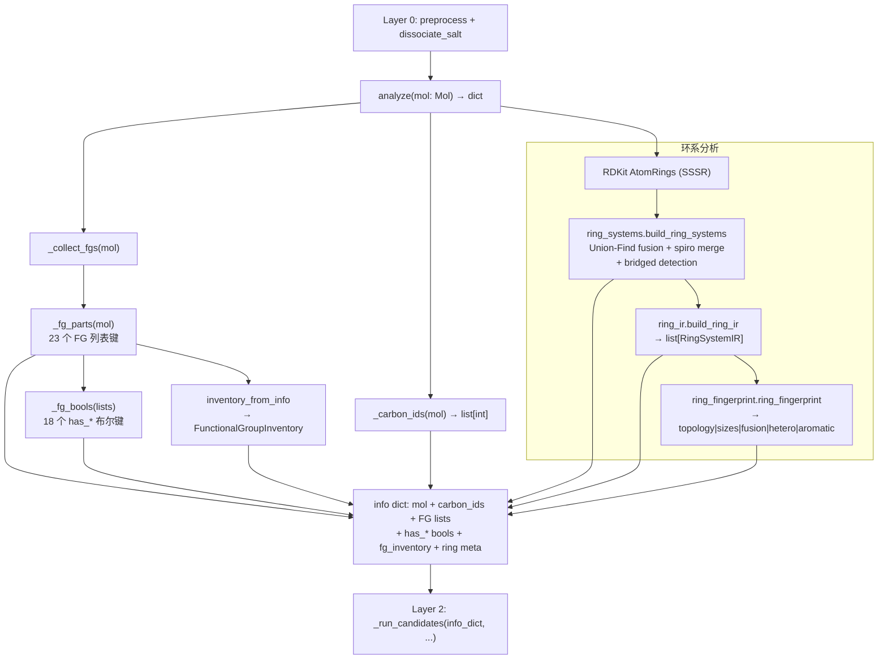
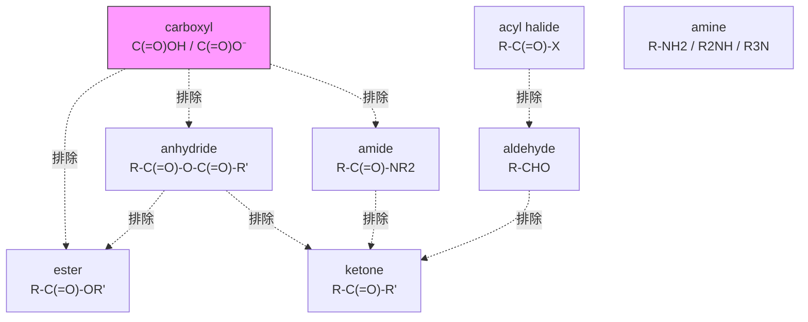

# Layer 1 -- Analyzer (Functional Group Detector)

> **位置:** `src/namepredict/layer1/` | **行数:** 11 个 `.py` (1,589 行) | **最后更新:** 2026-09-05

## 概述

Layer 1 是 NamePredict 6 层命名流水线的 **第一阶段分析层**，位于 layer0（预处理/盐拆分）之后、layer2（parent 选择）之前。其唯一职责是：**接收一个 RDKit `Mol` 对象，检测分子中所有官能团（Functional Group, FG）和环系拓扑结构，返回一个结构化的信息字典（info dict）**，供下游 layer2-layer5 使用。

与传统的"先分类再命名"策略不同，NamePredict 的设计是"一次分析、全部输出"：layer1 将所有可能命名的结构特征同时检测出来（has_acid, has_ester, has_amide 等布尔标志 + 原子索引列表），下游 layer2 通过 `_run_candidates` 根据覆盖度 gate 策略选择不同的 parent 解释路径，而无需再次扫描分子。

**输入**: `rdkit.Chem.Mol`（经过 layer0 预处理的有机部分、已去除盐）
**输出**: `dict`，包含分子对象引用、碳原子列表、各类 FG 的原子索引列表（如 `aldehydes: [{'c_idx': 5}, ...]`）、对应的布尔标志（`has_aldehyde: True`）、环系元信息（`rings`, `ring_systems`）、以及类型化的 `fg_inventory` 对象

**关键设计原则**:
- **无状态**: `analyze(mol)` 是纯函数，不依赖任何全局状态或外部数据
- **原子级精确**: 每个检测到的 FG 都返回具体的原子索引（atom indices），而非仅布尔标志，确保下游可以精确定位和修饰
- **排他性优先级**: 更"贵"的 FG 优先匹配（如 carboxyl 排斥 ester/amide/anhydride），通过互相调用检测函数实现排他逻辑
- **环系独立分析**: 通过 SSSR + Union-Find 融合图 + spiro 合并独立分析环系拓扑，不受 FG 检测影响

Layer1 由 **11 个 `.py`** 组成，只保留核心 FG 的检测（18 个 `FunctionalGroupClass` 类别，`FG_SPECS` 18 条 `FgSpec`，加上烯/炔/硝基列表）。13 个扩展 FG 检测器（boronic/carbamate/carbonate/guanidine/hydrazine/phosphate/sulfonamide/sulfonate/sulfone/sulfonic_acid/sulfonyl_chloride/sulfoxide/urea）不存在。

---

## 核心逻辑

### 1. FG 检测模式（Pattern）

Layer 1 的 FG 检测采用统一的"候选原子判断函数 + 条目构建函数 + 收集函数"模式：

**通用检测模式**:
1. 定义"候选原子判断函数"（如 `_is_carboxyl_carbon(atom) -> bool`），基于原子序数、键型、邻居原子类型等 RDKit API 进行规则匹配
2. 定义"条目构建函数"（如 `_carboxyl_entry(atom) -> dict`），将匹配到的原子及其相关邻居的索引打包为字典
3. 定义"收集函数"（如 `_carboxyl_entries(mol) -> list[dict]`），遍历分子中所有原子，收集所有匹配的条目
4. 在 `_fg_parts` 中汇总所有条目列表，并生成对应的布尔标志

### 2. 信息字典结构（Info Dict）

`analyze(mol)`（`analyzer.py:568`）返回的字典由 `_info()` 构建（`analyzer.py:563`），结构如下：

```python
{
    # 基础分子信息
    "mol": mol,                    # 原始 Mol 对象引用
    "carbon_ids": [0, 1, 2, ...], # 所有碳原子索引
    "n_carbons": 10,              # 碳原子总数

    # FG 条目列表（23 个，来自 _fg_parts analyzer.py:537，经 _arbitrate_parts(mol, …) P-41 仲裁 + 降级叶回收）
    "carboxyls": [{"c_idx": 5, "anion": False}, ...],
    "hydroxyls": [{"o_idx": 3, "c_idx": 2}, ...],
    "esters": [{"c_idx": 4, "o_idx": 6, "alkoxy_c_idx": 7}, ...],
    "amides": [{"c_idx": 8, "n_idx": 9, "n_c_idxs": [10, 11]}, ...],
    "ketones": [{"c_idx": 12}, ...],
    "radicals": [...],            # dummy 自由基位点（排除已判为 acyl 头的碳）
    "acyls": [{"c_idx": 8, "rad_idx": 0}, ...],   # 锚定酰基头（苯甲酰/furan-2-carbonyl 等，见 §2.1）
    "demoted_carboxyls": [...],   # 被压制的中性 -COOH → carboxy 叶（P-61.1.3）
    "demoted_nitriles": [...],    # 被压制的腈 → cyano 叶
    "amines": [{"n_idx": 0, "degree": 2, "c_idx": 3, "c_idxs": [3, 5]}, ...],
    "quaternary_ammoniums": [...],
    "nitriles": [...], "double_bonds": [...], "triple_bonds": [...],
    "acyl_chlorides": [...], "anhydrides": [...], "thiols": [...],
    "ethers": [...], "sulfides": [...], "nitros": [...],
    "isocyanates": [...], "isothiocyanates": [...],

    # 布尔标志（18 个，_fg_bools analyzer.py:412）
    "has_alcohol": True, "has_acid": False, "has_ester": True,
    "has_amide": False, "has_ketone": False,
    "has_aldehyde": False, "has_amine": True, "has_nitrile": False,
    "has_alkene": ..., "has_alkyne": ..., "has_acyl_chloride": ...,
    "has_anhydride": ..., "has_thiol": ..., "has_ether": ...,
    "has_sulfide": ..., "has_nitro": ..., "has_isocyanate": ...,
    "has_isothiocyanate": ...,

    # 类型化 FG 库存（FunctionalGroupInventory，_collect_fgs 追加）
    "fg_inventory": FunctionalGroupInventory(...),

    # 环系元信息
    "rings": [{"atom_ids": (0,1,2,3,4,5)}, ...],
    "n_rings": 1,
    "has_ring": True,
    "ring_systems": [...],   # 由 ring_systems.py 构建
    "n_ring_systems": 1,
}
```

> 注：13 个扩展 FG 列表键（`carbamates`/`carbonates`/`ureas`/`hydrazines`/`guanidines`/`sulfonamides`/`sulfonates`/`sulfonyl_chlorides`/`sulfonic_acids`/`sulfones`/`sulfoxides`/`phosphates`/`boronics`）已全部从 info dict 移除。

### 2.1 锚定酰基残基（acyl，酰基头检测）

`*`-锚定分子（`build_anchor_submol` 构造的取代基自由基片段）新增**酰基残基通道**：自由价直接连着酰基头羰基碳（如 `*C(=O)C` 乙酰片段、苯环被 `*C(=O)` 顶替的苯甲酰）时，L1 判定其为 acyl 主基团（`FgSpec("acyl")`，`fg_registry.py:44`，p41=1 同 radical），供 L2 选母体、L5 按酸衍生 -oyl/酰 命名（P-65.1.7.2）。此前这类羰基碳走 radical 通道，α 环/芳限制把它挡成错误名。

- `_is_acyl_head`（`analyzer.py:389`）— 锚定羰基碳（带 =O、`_is_anchored`）须**恰好 1 个单键碳邻居且无其它重邻居**。环内酮/内酯/酰胺的羰基碳两侧分别被环碳或 N/O 占据（环酮 carbs=2、内酯/酰胺置 hetero），不会误判为酰基头；α 可开链亦可是**环/芳**——苯甲酰、furan-2-carbonyl 等环酸衍生酰基头由此进入 acyl 通道（此前被 `not alpha.IsInRing()/IsAromatic()` 挡成 oxomethyl）。
- `_acyl_entries`（`analyzer.py:414`）— 收集全部酰基头条目 `{c_idx, rad_idx}`。`_fg_parts` 据此把 `radicals` 的候选排除（`_radical_entries(mol, heads)`），并过滤掉同为酰基头的 `aldehydes`（`analyzer.py:540-546`）。
- `_arbitrate_parts` 语义（见下 §3.5）对酰基残基与其 α 碳上的主 FG 一致成立——酰基头碳是母体的一部分，α 碳上的取代基走常规 L3 路径。

### 3. 类型化 FG 库存 (`functional_group_inventory.py`)

`functional_group_inventory.py`（99 行）把 `analyzer.py` 产出的旧式 entry 列表（dict 列表）包装成**类型化的数据容器**，供 layer2 消费：

- `FunctionalGroupClass(str, Enum)`（L10）— 18 个成员：`RADICAL, ACYL, ACID, ANHYDRIDE, ESTER, ACYL_HALIDE, AMIDE, NITRILE, ALDEHYDE, KETONE, ALCOHOL, THIOL, AMINE, QUATERNARY_AMMONIUM, ISOCYANATE, ISOTHIOCYANATE, ETHER, SULFIDE` + `NONE`（`NONE` 值 = `"alkane"`）
- `FunctionalGroupOccurrence`（dataclass，L32）— `id / group_class / characteristic_atoms / parent_anchors / payload`
- `FunctionalGroupInventory`（dataclass，L46）— `entries` + 方法 `occurrences() / has() / count()`
- 入口：`build_inventory(lists)`（L89）、`inventory_from_info(info)`（L95）
- `_ANCHOR_KEYS`（L66）/`_LIST_CLASSES`（L63）— **从 `fg_registry.FG_SPECS` 派生**（不再手写）。AMINE 的 anchors 为 `("c_idx", "c_idxs")`（2°/3° 胺的 N 上全部碳邻居都是候选母体臂锚点，P-62.2 多臂选优），其余 FG 类均为 `("c_idx",)`

> **源:** `src/namepredict/layer1/functional_group_inventory.py`

### 3.5 FG 元数据单一事实来源（`fg_registry.py`）

`fg_registry.py`（103 行）是各层 FG 注册元数据的**单一事实来源**：`FG_SPECS`（18 条 `FgSpec`）集中每个官能团类别的跨层元数据——L1 检测列表 key、P-41 等级与优先级路径、表达类型（suffix/prefix_only/legacy_compat）、兼容等级、锚点 key、parent 锚点字段、chain/multi/rs/keep_locant 标志、`locant_kind`、醇/胺/酮母体标志。下游表由它派生，不再多重登记。**新增 `FgSpec("acyl")`**（`fg_registry.py:44`，p41=1 同 radical）——锚定酰基残基（自由价连羰基头的 R-C(=O)- 片段），`chain=True, rs=True, keep_locant=True, locant_kind="acyl"`，parent 锚点字段 `("acyl_c_idx","acyl_c_idxs")`，L5 按酸衍生 -oyl/酰 命名（P-65.1.7.2）。aldehyde 现亦带 `locant_kind="aldehyde"`（供 L4 环外醛位次、-carbaldehyde 系统名）；R/S FG 集合提供函数已由 `rs_fgs()` 更名为 `srs_fgs()`（`fg_registry.py:96`，全仓唯一调用方 `layer5/stereo.py`）：

- `functional_group_inventory._LIST_CLASSES` / `_ANCHOR_KEYS`（`functional_group_inventory.py:66`）
- `analyzer._FG_PARTS_KEY` / `_CARBONYL_COMPOSITES`（`analyzer.py:466` / `:472`）——**P-41 主基团仲裁**（`_arbitrate_parts`，`analyzer.py:496`）：组合羰基 FG（酸/酯/酰卤/酰胺/醛/酸酐）被更高优先级 FG（如 radical）压制时退出主基团。降级成员的处理分三类：
  - **酰胺**：伯酰胺 N（-CONH2，N 未取代/中性/非芳香/非环、带 2 个 H，经 `_demoted_amide_amine` `analyzer.py:484`）回收为 `amines` 条目（amino 前缀走正规 L1 前缀通道）；其羰基碳仍入 `ketones` 保持链化 oxo。N-取代酰胺（`n_c_idxs` 非空）仍归 L3。
  - **中性羧酸**：不再回收 OH 成 hydroxy、也不把酸碳打成 oxo——整组中性 -COOH 进 `demoted_carboxyls` 保留"羧酸叶"身份（P-61.1.3 carboxy 前缀），由 L3 claim 成 carboxy、L2 链游走把其酸碳排除在开链外（见 layer2 §`_demoted_acid_carbons`）；阴离子羧酸（-COO⁻，无 OH 可回收）仍入 `ketones`。
  - **腈**：被更高优先级主基团压制（自由基/羧酸/酰胺/酯…）时退出为 `demoted_nitriles`（cyano 叶，P-61.1.3），否则腈碳被词干链吞掉、N 悬空误命名成 amino。
  - `ketone/alcohol/thiol/amine` 是基础成员 FG，永不退出；`_fg_lists`（`analyzer.py:442`）把两条降级列表与常规列表一并收进 info dict（共 23 个列表键）
- `principal_expression._CHAIN_FG`/`_MULTI_FG`、`stereo._RS_KINDS`、`assembler_prefixes._KEEP_LOCANT_KINDS`、`layer4.fg_locants` 位次记录 kind

> **源:** `src/namepredict/layer1/fg_registry.py`

### 4. 独立 FG 检测器（仅 2 个）

13 个扩展 FG 检测器删除后，layer1 只剩 **2 个独立模块**，检测逻辑各自独立、不再互相排他引用：

- **`isocyanate.py`**（97 行）— 检测 isocyanate R–N=C=O 和 isothiocyanate R–N=C=S（P-61.9）。入口 `isocyanate_entries(mol)` / `isothiocyanate_entries(mol)`，entry 形如 `{c_idx, n_idx, x_idx, r_c_idx}`
- **`acyl_halide.py`**（66 行）— 检测酰卤 R–C(=O)–X，覆盖 **F/Cl/Br/I**（P-65.5，`_HAL_Z = {F, Cl, Br, I}`）。入口 `acyl_halide_entries(mol)`，entry 形如 `{c_idx, hal_idx, hal_z, cl_idx}`；`acyl_hal_of(carbon)` 供 analyzer 复用。`hal_z` 由 L2 保留、L5 选氟氯溴碘后缀（layer5 §`_ACYL_HALIDE_BY_HAL`）

> **源:** `src/namepredict/layer1/isocyanate.py`, `src/namepredict/layer1/acyl_halide.py`

### 5. 共享羰基原语 (`_carbonyl_common.py`)

`_carbonyl_common.py`（103 行）从 analyzer.py 与 acyl_halide.py 抽取重复的羰基检测原语，提供 **13 个共享函数**（`_is_single_c_oh`/`_dbl_o_on`/`_has_double_bonded_o`/`_is_carboxylate_o`/`_has_carboxylate_o_neighbor`/`_has_acid_o_neighbor`/`_is_anhydride_bridge_o`/`_alkoxy_c_of`/`_ester_alkoxy_of`/`_amide_n_rest`/`_amide_n_single`/`_amide_n_info`/`_amide_n_of`）。两个调用方（`analyzer.py`、`acyl_halide.py`）各自保留自己的 `_is_ester_alkoxy_o` 谓词并传入共享的 `_ester_alkoxy_of`（analyzer 排除 anhydride 桥氧；acyl halide 检查形式电荷）。

> **源:** `src/namepredict/layer1/_carbonyl_common.py`

### 6. 特殊检测 -- 键遍历 vs 原子遍历

大多数 FG 检测器通过**遍历原子**（`for atom in mol.GetAtoms()`）工作，但少数检测器需要**遍历键**：

- **Nitrile / Alkene / Alkyne** — 遍历所有键，寻找 C≡N 三键、C=C 双键、C≡C 三键
- **Isocyanate/Isothiocyanate** — 遍历原子找中心碳，但实际检测的是 N=C=X 累积双键体系

### 7. 环系检测（Ring Detection）

环系检测分为三个层次（`analyzer.py`，`ring_systems.py`，`ring_ir.py`，`ring_fingerprint.py`）：

1. **原始环**: RDKit 的 `GetRingInfo().AtomRings()` 获取 SSSR（最小环集）
2. **环系拓扑** (`ring_systems.py:316`):
   - 通过 Union-Find 算法，将共享 >=2 个原子的环合并为 fused 系统
   - 将共享恰好 1 个原子的环合并为 spiro 系统
   - 检测桥环（bridged）：任一对环共享 >=3 个原子
   - 输出结构包含：`atom_ids`, `sssr_indices`, `fusion_edges`, `hetero_atoms`, `topology`（mono/fused/spiro/bridged）, `n_rings`, `n_atoms`
3. **环系 IR** (`ring_ir.py`): 将环系字典转为类型化的 `RingSystemIR` dataclass，包含 `RingComponent`（size, atom_ids, hetero, aromatic）和 `FusionEdge`
4. **环指纹** (`ring_fingerprint.py`): 生成布局级指纹字符串 `topology|sizes|fusion|hetero|aromatic`，用于环系匹配

### 8. 相对立体化学 (`ring_relative_stereo.py`)

独立模块 `ring_relative_stereo` 处理饱和环上的相对立体化学面（face）符号推导。输入为环序列表和配体字典，基于原子手性标签（`ChiralType`）和奇偶性（parity）计算每个环原子的面朝向（+1/-1），返回 `RingRelativeStereoIR` dataclass。该信息供下游 layer4（编号）和 layer5（组装）生成 cis/trans 或 R/S 描述符。

> **源:** `src/namepredict/layer1/ring_relative_stereo.py`

### 9. 收集与组装流程

`analyze()` 函数的完整调用链（`analyzer.py:568`）:

```
analyze(mol)
  └─ _info(mol, _carbon_ids(mol), _collect_fgs(mol))
       ├─ _carbon_ids(mol) → 所有碳原子索引
       └─ _collect_fgs(mol)
            ├─ _fg_lists(_fg_parts(mol))   # 23 个 FG 列表键（内部经 _arbitrate_parts(mol, …) P-41 仲裁 + 降级叶回收）
            ├─ _fg_bools(lists)            # 18 个 has_* 布尔键
            └─ inventory_from_info(info)   # 类型化 FunctionalGroupInventory
       └─ _ring_meta(mol) → 环系信息
```

---

## 文件清单

| 文件 | 行数 | 说明 |
|------|------|------|
| `__init__.py` | 6 | 公开导出 `analyze` 函数 |
| `analyzer.py` | 570 | **主分析器** -- 核心 FG 检测（acid, alcohol, ester, amide, ketone, aldehyde, amine, quaternary ammonium, nitrile, alkene/alkyne, acyl chloride, anhydride, thiol, ether, sulfide, nitro, radical, acyl）+ `_is_acyl_head`:389 / `_acyl_entries`:414（锚定酰基头检测）+ `_arbitrate_parts(mol, …)` P-41 仲裁（`analyzer.py:496`：伯酰胺 N→amino、中性 COOH→`demoted_carboxyls` carboxy 叶、腈→`demoted_nitriles` cyano 叶）+ info dict 组装 + 环系元信息收集；`_amine_degree` 排除**环内非芳香 N**（饱和杂环 N 是环杂原子而非胺官能团） |
| `_carbonyl_common.py` | 103 | **共享羰基原语**：13 个 `_is_*`/`_*_of` 检测谓词（analyzer 与 acyl_halide 共用） |
| `fg_registry.py` | 103 | **FG 元数据单一事实来源**：`FG_SPECS`（18 条 `FgSpec`，含新增 `acyl`），派生 L1-L5 各下游表；`srs_fgs()` 提供 R/S FG 集合 |
| `functional_group_inventory.py` | 99 | **类型化 FG 库存**：`FunctionalGroupClass`（18 个类别，含新增 `ACYL`）/`FunctionalGroupInventory` 数据容器（供 L2）；`_ANCHOR_KEYS` 从 FG_SPECS 派生，AMINE 为 `("c_idx","c_idxs")` |
| `isocyanate.py` | 97 | **异氰酸酯** (R-N=C=O) 和**异硫氰酸酯** (R-N=C=S) 检测 (P-61.9) |
| `acyl_halide.py` | 66 | **酰卤** (R-C(=O)-X, X=F/Cl/Br/I) 检测 (P-65.5) |
| `ring_systems.py` | 316 | **环系拓扑检测** -- 基于 SSSR 的 Union-Find 融合图构建，spiro 合并，桥环/稠环检测，hetero 原子统计 |
| `ring_ir.py` | 110 | **环系 IR 数据结构** -- `RingComponent`, `FusionEdge`, `RingSystemIR` dataclass 定义 + `build_ring_ir(mol)` |
| `ring_fingerprint.py` | 58 | **环系布局指纹** -- 将 `RingSystemIR` 编码为 `topology\|sizes\|fusion\|hetero\|aromatic` 字符串 |
| `ring_relative_stereo.py` | 61 | **相对立体化学** -- 饱和环上基于手性标签的面朝向推导 |

> 13 个扩展 FG 检测器不存在：`boronic.py`、`carbamate.py`、`carbonate.py`、`guanidine.py`、`hydrazine.py`、`phosphate.py`、`sulfonamide.py`、`sulfonate.py`、`sulfone.py`、`sulfonic_acid.py`、`sulfonyl_chloride.py`、`sulfoxide.py`、`urea.py`（对应 FG 检测不出现，也不在 info dict）。

---

## 数据流图



### FG 排他性依赖关系



> 注：13 个扩展 FG（carbamate/carbonate/urea/guanidine/sulfoxide/sulfone/sulfonate/sulfonamide/sulfonic_acid/sulfonyl_chloride/phosphate/boronic/hydrazine）在 layer1 中不存在，因此无"carbamate 排除 ester""urea 排除 amide"等跨模块排他链——排他检测只发生在 analyzer.py 内部的核心羰基族。

---

## 源码引用

> **源:** `src/namepredict/layer1/analyzer.py:568` -- `analyze()` 函数入口，组装所有 FG 检测结果和环系元信息

> **源:** `src/namepredict/layer1/analyzer.py:537` -- `_fg_parts()` 函数，汇总全部 FG 条目列表（含 `_acyl_entries`:414 / `_radical_entries`:421，经 `_arbitrate_parts(mol, …)` P-41 仲裁）

> **源:** `src/namepredict/layer1/analyzer.py:496` -- `_arbitrate_parts()` P-41 主基团仲裁：伯酰胺 N→amino、中性 COOH→`demoted_carboxyls` carboxy 叶（P-61.1.3）、腈→`demoted_nitriles` cyano 叶（`_demoted_amide_amine`:484）

> **源:** `src/namepredict/layer1/functional_group_inventory.py:10-37` -- `FunctionalGroupClass` 枚举，18 个类别 + NONE（含新增 `ACYL`）

> **源:** `src/namepredict/layer1/_carbonyl_common.py` -- 13 个共享羰基检测原语

---

## 对外接口

### `analyze(mol: Mol) -> dict`

**参数**:
- `mol` (`rdkit.Chem.Mol`): 经过 layer0 预处理的有机分子（已去除盐、标准化）

**返回值** (`dict`):
| 键 | 类型 | 说明 |
|---|---|---|
| `mol` | `Mol` | 原始分子对象引用 |
| `carbon_ids` | `list[int]` | 所有碳原子的索引列表 |
| `n_carbons` | `int` | 碳原子总数 |
| `carboxyls`/`hydroxyls`/`esters`/`amides`/`ketones`/... | `list[dict]` | 23 个 FG 条目列表，含 `acyls`/`demoted_carboxyls`/`demoted_nitriles`（见核心逻辑第 2 节） |
| *(18 个 `has_*` 布尔标志)* | `bool` | 每个 FG 条目列表对应的布尔存在性标志 |
| `fg_inventory` | `FunctionalGroupInventory` | 类型化 FG 库存（`FunctionalGroupClass` 类别） |
| `rings` | `list[dict]` | 原始 SSSR 环，含 `atom_ids` |
| `n_rings` | `int` | 环总数 |
| `has_ring` | `bool` | 是否有环 |
| `ring_systems` | `list[dict]` | 环系拓扑结构 |
| `n_ring_systems` | `int` | 环系总数 |

---

## 相关页面

- [[architecture/layer0-preprocessor]] -- 上游：分子预处理与盐拆分
- [[architecture/layer2-parent-selector]] -- 下游：parent 结构选择（使用 info dict 中的 FG 标志进行覆盖度 gate 判断）
- [[architecture/layer3-substituents]] -- 下游：取代基识别
- [[architecture/layer4-numbering]] -- 下游：编号
- [[architecture/layer5-name-assembly]] -- 下游：名称组装
- [[architecture/overview]] -- 架构总览
