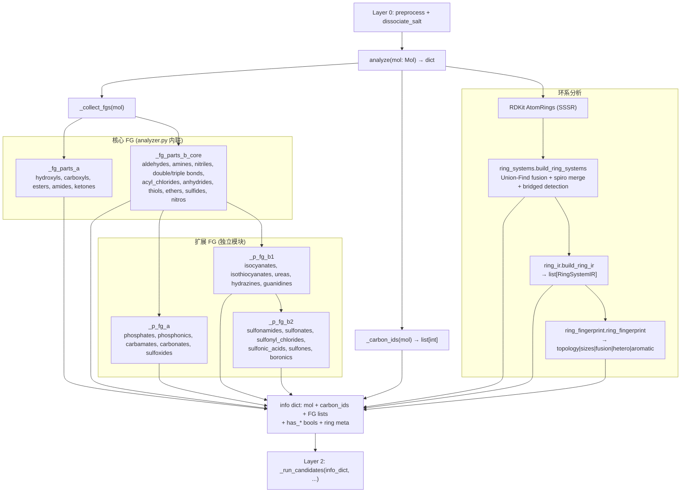
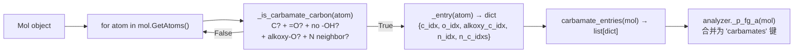
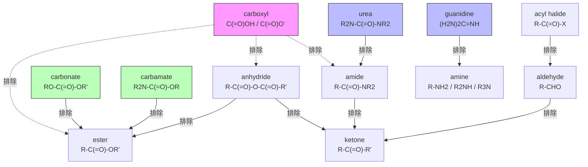

# Layer 1 -- Analyzer (Functional Group Detector)

## 概述

Layer 1 是 NamePredict 6 层命名流水线的 **第一阶段分析层**，位于 layer0（预处理/盐拆分）之后、layer2（parent 选择）之前。其唯一职责是：**接收一个 RDKit `Mol` 对象，检测分子中所有官能团（Functional Group, FG）和环系拓扑结构，返回一个结构化的信息字典（info dict）**，供下游 layer2-layer5 使用。

与传统的"先分类再命名"策略不同，NamePredict 的设计是"一次分析、全部输出"：layer1 将所有可能命名的结构特征同时检测出来（has_acid, has_ester, has_amide 等布尔标志 + 原子索引列表），下游 layer2 通过 `_run_candidates` 根据覆盖度 gate 策略选择不同的 parent 解释路径，而无需再次扫描分子。

**输入**: `rdkit.Chem.Mol`（经过 layer0 预处理的有机部分、已去除盐）
**输出**: `dict`，包含分子对象引用、碳原子列表、各类 FG 的原子索引列表（如 `aldehydes: [{'c_idx': 5}, ...]`）、对应的布尔标志（`has_aldehyde: True`）、环系元信息（`rings`, `ring_systems`）

调用入口位于 `src/namepredict/namer.py:197`：
```python
result = _run_candidates(analyze(organic), depth=0, t0=t0, name_mode=name_mode)
```

**关键设计原则**:
- **无状态**: `analyze(mol)` 是纯函数，不依赖任何全局状态或外部数据
- **原子级精确**: 每个检测到的 FG 都返回具体的原子索引（atom indices），而非仅布尔标志，确保下游可以精确定位和修饰
- **排他性优先级**: 更"贵"的 FG 优先匹配（如 carbamate > ester > amide），通过互相调用检测函数实现排他逻辑
- **环系独立分析**: 通过 SSSR + Union-Find 融合图 + spiro 合并独立分析环系拓扑，不受 FG 检测影响

---

## 核心逻辑

### 1. FG 检测模式（Pattern）

Layer 1 的 FG 检测分为两大类：**内联检测**（inline，位于 `analyzer.py`）和**独立模块检测**（位于各自的 `.py` 文件），但它们的代码模式高度一致：

**通用检测模式**:
1. 定义"候选原子判断函数"（如 `_is_carboxyl_carbon(atom) -> bool`），基于原子序数、键型、邻居原子类型等 RDKit API 进行规则匹配
2. 定义"条目构建函数"（如 `_carboxyl_entry(atom) -> dict`），将匹配到的原子及其相关邻居的索引打包为字典
3. 定义"收集函数"（如 `_carboxyl_entries(mol) -> list[dict]`），遍历分子中所有原子，收集所有匹配的条目
4. 在 `_collect_fgs` 中汇总所有条目列表，并生成对应的布尔标志

示例 -- carboxyl 检测（`analyzer.py:60-63, 272-276`）:
```python
def _is_carboxyl_carbon(atom) -> bool:
    # 碳原子 + 有双键氧 + 有酸性氧邻居（OH 或 O⁻）
    return atom.GetAtomicNum() == 6 and \
           _has_double_bonded_o(atom) and _has_acid_o_neighbor(atom)

def _carboxyl_entry(atom) -> dict:
    return {"c_idx": atom.GetIdx(), "anion": _has_carboxylate_o_neighbor(atom)}

def _carboxyl_entries(mol: Mol) -> list[dict]:
    return [_carboxyl_entry(a) for a in mol.GetAtoms() if _is_carboxyl_carbon(a)]
```

### 2. 信息字典结构（Info Dict）

`analyze(mol)` 返回的字典由 `_info()` 构建（`analyzer.py:481-485`），结构如下：

```python
{
    # 基础分子信息
    "mol": mol,                    # 原始 Mol 对象引用
    "carbon_ids": [0, 1, 2, ...], # 所有碳原子索引
    "n_carbons": 10,              # 碳原子总数

    # 核心 FG 条目列表（原子索引）
    "hydroxyls": [{"o_idx": 3, "c_idx": 2}, ...],
    "carboxyls": [{"c_idx": 5, "anion": False}, ...],
    "esters": [{"c_idx": 4, "o_idx": 6, "alkoxy_c_idx": 7}, ...],
    "amides": [{"c_idx": 8, "n_idx": 9, "n_c_idxs": [10, 11]}, ...],
    "ketones": [{"c_idx": 12}, ...],

    # 扩展 FG 条目列表（通过 _FG_BOOL_MORE_KEYS 映射）
    "aldehydes": [...], "amines": [...], "nitriles": [...],
    "double_bonds": [...], "triple_bonds": [...],
    "acyl_chlorides": [...], "anhydrides": [...], "thiols": [...],
    "ethers": [...], "sulfides": [...], "nitros": [...],
    "phosphates": [...], "phosphonics": [...], "carbamates": [...],
    "carbonates": [...], "sulfoxides": [...],
    "isocyanates": [...], "isothiocyanates": [...],
    "ureas": [...], "hydrazines": [...], "guanidines": [...],
    "sulfonamides": [...], "sulfonates": [...],
    "sulfonyl_chlorides": [...], "sulfonic_acids": [...],
    "sulfones": [...], "boronics": [...],

    # 布尔标志（has_ 前缀）
    "has_alcohol": True, "has_acid": False, "has_ester": True,
    "has_amide": False, "has_ketone": False,
    "has_aldehyde": False, "has_amine": True, "has_nitrile": False,
    # ... 以及 _FG_BOOL_MORE_KEYS 中定义的所有 has_* 键

    # 环系元信息
    "rings": [{"atom_ids": (0,1,2,3,4,5)}, ...],
    "n_rings": 1,
    "has_ring": True,
    "ring_systems": [...],   # 由 ring_systems.py 构建
    "n_ring_systems": 1,
}
```

### 3. 独立 FG 检测器设计模式

16 个独立 FG 检测器文件（从 `carbamate.py` 到 `guanidine.py`）遵循统一的设计契约：

- **公开 API**: 每个模块导出一个 `xxx_entries(mol: Mol) -> list[dict]` 函数
- **内部辅助**: 可选的 `is_xxx_carbon(atom) -> bool` 或 `is_xxx_n(atom) -> bool` 供其他检测器做排他判断
- **排他依赖**: 更高级的 FG 检测器会调用基础检测器的判断函数来避免误匹配。例如：
  - `analyzer.py` 中的 `_is_ester_carbon` 调用 `_is_carbamate_carbon` 和 `_is_carbonate_carbon` 排除后者
  - `_is_amide_n` 调用 `is_guanidine_n` 和 `_is_urea_carbon` 排除更高级的含氮基团
  - `_is_hydroxyl_oxygen` 调用 `is_urea_oh` 排除 urea enol 互变异构体中的 OH
- **检测逻辑粒度**: 每个检测器专门处理一种特征原子环境（如 sulfoxide 检测 S 原子的度=3、一个双键 O、两个 C 邻居），通过精细的邻居约束（键型、原子序数、氢原子数、形式电荷、是否在环内）确保低误报率

**示例 -- sulfoxide (`sulfur.py:42-66`, Sulfoxide 块)**:
```python
def _is_sulfoxide_sulfur(atom) -> bool:
    """S with exactly one =O and two C neighbors (not sulfone/sulfide)."""
    # 原子序数=16, 无H, 总度数=3, 恰好一个双键O, 恰好两个C邻居
    ...

def sulfoxide_entries(mol: Mol) -> list[dict]:
    return [_sulfoxide_entry(a) for a in mol.GetAtoms()
            if _is_sulfoxide_sulfur(a)]
```

**示例 -- boronic acid (`boronic.py:37-59`)**:
```python
def _is_boronic_b(atom) -> bool:
    """Tricoordinate neutral B with two OH and one C."""
    # B原子, 形式电荷0, 度数=3, 恰好两个OH, 恰好一个C
    ...

def boronic_entries(mol: Mol) -> list[dict]:
    return [_boronic_entry(a) for a in mol.GetAtoms() if _is_boronic_b(a)]
```

### 4. 特殊检测 -- 键遍历 vs 原子遍历

大多数 FG 检测器通过**遍历原子**（`for atom in mol.GetAtoms()`）工作，但少数检测器需要**遍历键**：

- **Hydrazine** (`hydrazine.py:83-84`): 遍历所有键，寻找 N-N 单键对
- **Nitrile** (`analyzer.py:380-385`): 遍历所有键，寻找 C≡N 三键
- **Alkene/Alkyne** (`analyzer.py:354-366`): 遍历所有键，寻找 C=C 双键和 C≡C 三键
- **Isocyanate/Isothiocyanate** (`isocyanate.py:75-76`): 遍历原子找中心碳，但实际检测的是 N=C=X 累积双键体系

### 5. 环系检测（Ring Detection）

环系检测分为三个层次（`analyzer.py:393-400`，`ring_systems.py`，`ring_ir.py`，`ring_fingerprint.py`）：

1. **原始环**: RDKit 的 `GetRingInfo().AtomRings()` 获取 SSSR（最小环集）
2. **环系拓扑** (`ring_systems.py:346-358`):
   - 通过 Union-Find 算法，将共享 >=2 个原子的环合并为 fused 系统
   - 将共享恰好 1 个原子的环合并为 spiro 系统
   - 检测桥环（bridged）：任一对环共享 >=3 个原子
   - 输出结构包含：`atom_ids`, `sssr_indices`, `fusion_edges`, `hetero_atoms`, `topology`（mono/fused/spiro/bridged）, `n_rings`, `n_atoms`
3. **环系 IR** (`ring_ir.py`): 将环系字典转为类型化的 `RingSystemIR` dataclass，包含 `RingComponent`（size, atom_ids, hetero, aromatic）和 `FusionEdge`
4. **环指纹** (`ring_fingerprint.py`): 生成布局级指纹字符串 `topology|sizes|fusion|hetero|aromatic`，用于环系匹配

### 6. 相对立体化学 (`ring_relative_stereo.py`)

独立模块 `ring_relative_stereo` 处理饱和环上的相对立体化学面（face）符号推导。输入为环序列表和配体字典，基于原子手性标签（`ChiralType`）和奇偶性（parity）计算每个环原子的面朝向（+1/-1），返回 `RingRelativeStereoIR` dataclass。该信息供下游 layer4（编号）和 layer5（组装）生成 cis/trans 或 R/S 描述符。

> **源:** `src/namepredict/layer1/ring_relative_stereo.py:45-55`

### 7. 收集与组装流程

`analyze()` 函数的完整调用链（`analyzer.py:484-485`）:

```
analyze(mol)
  └─ _info(mol, _carbon_ids(mol), _collect_fgs(mol))
       ├─ _carbon_ids(mol) → 所有碳原子索引
       └─ _collect_fgs(mol)
            └─ _fg_lists(_fg_parts(mol))
                 ├─ _fg_parts_a (核心: hydroxyls, carboxyls, esters, amides, ketones)
                 ├─ _fg_parts_b_core (aldehydes, amines, nitriles, double/triple bonds,
                 │                    acyl_chlorides, anhydrides, thiols, ethers, sulfides, nitros)
                 ├─ _p_fg_a (phosphates, phosphonics, carbamates, carbonates, sulfoxides)
                 ├─ _p_fg_b1 (isocyanates, isothiocyanates, ureas, hydrazines, guanidines)
                 └─ _p_fg_b2 (sulfonamides, sulfonates, sulfonyl_chlorides,
                              sulfonic_acids, sulfones, boronics)
            └─ _fg_bools → 从列表推导布尔标志
       └─ _ring_meta(mol) → 环系信息
```

---

## 文件清单

| 文件 | 说明 |
|------|------|
| `__init__.py` | 公开导出 `analyze` 函数 |
| `analyzer.py` | **主分析器** -- 核心 FG 检测（acid, ester, amide, ketone, aldehyde, amine, nitrile, alkene/alkyne, ether, sulfide, nitro, thiol, hydroxyl, anhydride, acyl_chloride） + info dict 组装 + 环系元信息收集 |
| `ring_systems.py` | **环系拓扑检测** -- 基于 SSSR 的 Union-Find 融合图构建，spiro 合并，桥环/稠环检测，hetero 原子统计 |
| `ring_ir.py` | **环系 IR 数据结构** -- `RingComponent`, `FusionEdge`, `RingSystemIR` dataclass 定义 + `build_ring_ir(mol)` 构建函数 |
| `ring_fingerprint.py` | **环系布局指纹** -- 将 `RingSystemIR` 编码为 `topology\|sizes\|fusion\|hetero\|aromatic` 字符串 |
| `ring_relative_stereo.py` | **相对立体化学** -- 饱和环上基于手性标签的面朝向推导 |
| `phosphate.py` | **磷酸酯** (phosphate monoester) 和**膦酸** (phosphonic acid) 检测 (P-67) |
| `carbamate.py` | **氨基甲酸酯** (carbamate R2N-C(=O)-OR) 检测 (P-65) |
| `carbonate.py` | **碳酸酯** (carbonate RO-C(=O)-OR') 检测 (P-65.6) |
| `sulfur.py` | **硫含氧官能团** -- 亚砜 (P-63.3)、砜 (P-65.3.1.2)、磺酸 (P-65.3)、磺酸酯 (P-65.3.2)、磺酰胺 (P-65.3)、磺酰氯 (P-65.3) 检测 |
| `isocyanate.py` | **异氰酸酯** (R-N=C=O) 和**异硫氰酸酯** (R-N=C=S) 检测 (P-61.9) |
| `urea.py` | **脲** (urea R2N-C(=O)-NR2 / enol tautomer) 检测 (P-66.1.6.1.1) |
| `hydrazine.py` | **肼** (hydrazine N-N) 检测 (P-68.3.1.2) -- 基于键遍历 |
| `boronic.py` | **硼酸** (boronic acid R-B(OH)2) 检测 (P-68.1) |
| `acyl_halide.py` | **酰卤** (acyl halide R-C(=O)-X, X=Cl/Br) 检测 (P-65.5) |
| `guanidine.py` | **胍** (guanidine H2N-C(=NH)-NH2 / tautomers) 检测 (P-66.4.1.2.1) |

---

## 数据流图



### 独立模块检测流程（以 carbamate 为例）



### FG 排他性依赖关系



> 注: 箭头表示"优先级更高的一方排除低优先级检测"。粉色=含酸OH基团优先，蓝色=含多个N基团优先，绿色=含O-C-O-C链基团优先。

---

## 源码引用

> **源:** `src/namepredict/layer1/analyzer.py:484-485` -- `analyze()` 函数入口，组装所有 FG 检测结果和环系元信息

> **源:** `src/namepredict/layer1/analyzer.py:5-20` -- `_FG_BOOL_MORE_KEYS` 映射表，定义 has_* 布尔键到条目列表键的对应关系

> **源:** `src/namepredict/layer1/analyzer.py:415-427` -- `_fg_lists()` 和 `_fg_bools()` 函数，将 FG 条目拆分为核心/扩展两组并生成布尔标志

> **源:** `src/namepredict/layer1/ring_systems.py:346-358` -- `build_ring_systems()` 函数，SSSR → 融合图 → spiro 合并的完整流程

> **源:** `src/namepredict/layer1/carbamate.py:56-72` -- `_is_carbamate_carbon()` 和 `carbamate_entries()`，典型独立 FG 检测器的设计模式

> **源:** `src/namepredict/layer1/urea.py:81-108` -- urea 的 keto/enol 互变异构体双路径检测逻辑

---

## 对外接口

### `analyze(mol: Mol) -> dict`

**参数**:
- `mol` (`rdkit.Chem.Mol`): 经过 layer0 预处理的有机分子（已去除盐、标准化）

**返回值** (`dict`):
| 键 | 类型 | 说明 |
|---|---|---|
| `mol` | `Mol` | 原始分子对象引用 |
| `carbon_ids` | `list[int]` | 所有碳原子的索引列表 |
| `n_carbons` | `int` | 碳原子总数 |
| `hydroxyls` | `list[dict]` | 羟基条目，含 `o_idx`, `c_idx` |
| `carboxyls` | `list[dict]` | 羧基条目，含 `c_idx`, `anion` |
| `esters` | `list[dict]` | 酯条目，含 `c_idx`, `o_idx`, `alkoxy_c_idx` |
| `amides` | `list[dict]` | 酰胺条目，含 `c_idx`, `n_idx`, `n_c_idxs` |
| `ketones` | `list[dict]` | 酮条目，含 `c_idx` |
| *(26 个扩展 FG 条目列表)* | `list[dict]` | 见核心逻辑第 2 节的完整列表 |
| *(26 个 `has_*` 布尔标志)* | `bool` | 每个 FG 条目列表对应的布尔存在性标志 |
| `rings` | `list[dict]` | 原始 SSSR 环，含 `atom_ids` |
| `n_rings` | `int` | 环总数 |
| `has_ring` | `bool` | 是否有环 |
| `ring_systems` | `list[dict]` | 环系拓扑结构 |
| `n_ring_systems` | `int` | 环系总数 |

---

## 相关页面

- [[layer0-preprocess]] -- 上游：分子预处理与盐拆分
- [[layer2-parent-selector]] -- 下游：parent 结构选择（使用 info dict 中的 FG 标志进行覆盖度 gate 判断）
- [[layer3-substituents]] -- 下游：取代基识别
- [[layer4-numbering]] -- 下游：编号
- [[layer5-assembly]] -- 下游：名称组装
- [[namer-orchestrator]] -- namer.py 主调度器
- [[architecture-overview]] -- 架构总览
