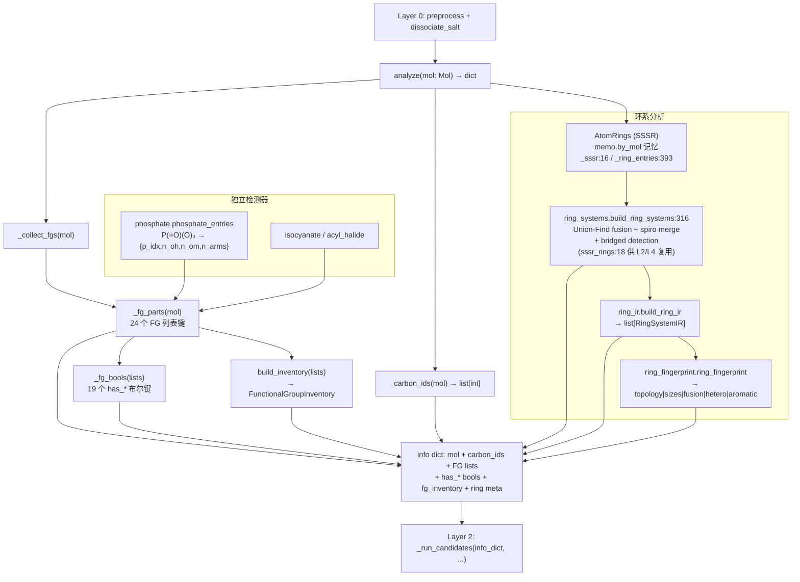

# Layer 1 -- Analyzer (Functional Group Detector)

> **位置:** `src/namepredict/layer1/` | **行数:** 12 个 `.py` (1,693 行；不含 `__init__.py` 为 11 个模块 / 1,687 行) | **最后更新:** 2026-09-12

## 概述

Layer 1 是 NamePredict 6 层命名流水线的 **第一阶段分析层**，位于 layer0（预处理/盐拆分）之后、layer2（parent 选择）之前。其唯一职责是：**接收一个 RDKit `Mol` 对象，检测分子中所有官能团（Functional Group, FG）和环系拓扑结构，返回一个结构化的信息字典（info dict）**，供下游 layer2-layer5 使用。

与传统的"先分类再命名"策略不同，NamePredict 的设计是"一次分析、全部输出"：layer1 将所有可能命名的结构特征同时检测出来（has_acid, has_ester, has_amide 等布尔标志 + 原子索引列表），下游 layer2 通过 `_run_candidates` 根据覆盖度 gate 策略选择不同的 parent 解释路径，而无需再次扫描分子。

**输入**: `rdkit.Chem.Mol`（经过 layer0 预处理的有机部分、已去除盐）
**输出**: `dict`，包含分子对象引用、碳原子列表、各类 FG 的原子索引列表（如 `aldehydes: [{'c_idx': 5}, ...]`）、对应的布尔标志（`has_aldehyde: True`）、环系元信息（`rings`, `ring_systems`）、以及类型化的 `fg_inventory` 对象

**关键设计原则**:
- **无状态**: `analyze(mol)` 的返回值只依赖入参 mol，不依赖外部数据；内部的单次命名记忆（`tools/memo.py`）只消除重复计算，不改变任何返回值（见 §7.1）
- **原子级精确**: 每个检测到的 FG 都返回具体的原子索引（atom indices），而非仅布尔标志，确保下游可以精确定位和修饰
- **排他性优先级**: 更"贵"的 FG 优先匹配（如 carboxyl 排斥 ester/amide/anhydride），通过互相调用检测函数实现排他逻辑
- **环系独立分析**: 通过 SSSR + Union-Find 融合图 + spiro 合并独立分析环系拓扑，不受 FG 检测影响

Layer1 由 **12 个 `.py`** 组成，检测核心 FG 与磷酸中心（19 个 `FunctionalGroupClass` 类别，`FG_SPECS` 19 条 `FgSpec`，加上烯/炔/硝基列表）。12 个扩展 FG 检测器（boronic/carbamate/carbonate/guanidine/hydrazine/sulfonamide/sulfonate/sulfone/sulfonic_acid/sulfonyl_chloride/sulfoxide/urea）不存在。

---

## 核心逻辑

### 1. FG 检测模式（Pattern）

Layer 1 的 FG 检测采用统一的"候选原子判断函数 + 条目构建函数 + 收集函数"模式：

**通用检测模式**:
1. 定义"候选原子判断函数"（如 `_is_carboxyl_carbon(atom) -> bool`），基于原子序数、键型、邻居原子类型等 RDKit API 进行规则匹配
2. 定义"条目构建函数"（如 `_carboxyl_entry(atom) -> dict`），将匹配到的原子及其相关邻居的索引打包为字典
3. 定义"收集函数"（如 `_carboxyl_entries(mol) -> list[dict]`），遍历分子中所有原子，收集所有匹配的条目
4. 在 `_fg_parts` 中汇总所有条目列表，并生成对应的布尔标志

### 2. 信息字典结构（Info Dict）

`analyze(mol)`（`analyzer.py:578`）返回的字典由 `_info()` 构建（`analyzer.py:573`），结构如下：

```python
{
    # 基础分子信息
    "mol": mol,                    # 原始 Mol 对象引用
    "carbon_ids": [0, 1, 2, ...], # 所有碳原子索引
    "n_carbons": 10,              # 碳原子总数

    # FG 条目列表（24 个，来自 _fg_parts analyzer.py:545，经 _arbitrate_parts(mol, …) P-41 仲裁 + 降级叶回收）
    "carboxyls": [{"c_idx": 5, "anion": False}, ...],
    "hydroxyls": [{"o_idx": 3, "c_idx": 2}, ...],
    "esters": [{"c_idx": 4, "o_idx": 6, "alkoxy_c_idx": 7}, ...],
    "amides": [{"c_idx": 8, "n_idx": 9, "n_c_idxs": [10, 11]}, ...],
    "ketones": [{"c_idx": 12}, ...],
    "radicals": [...],            # dummy 自由基位点（排除已判为 acyl 头的碳）
    "acyls": [{"c_idx": 8, "rad_idx": 0}, ...],   # 锚定酰基头（苯甲酰/furan-2-carbonyl 等，见 §2.1）
    "demoted_carboxyls": [...],   # 被压制的中性 -COOH → carboxy 叶（P-61.1.3）
    "demoted_nitriles": [...],    # 被压制的腈 → cyano 叶
    "amines": [{"n_idx": 0, "degree": 2, "c_idx": 3, "c_idxs": [3, 5]}, ...],
    "quaternary_ammoniums": [...],
    "nitriles": [...], "double_bonds": [...], "triple_bonds": [...],
    "acyl_chlorides": [...], "anhydrides": [...], "thiols": [...],
    "ethers": [...], "sulfides": [...], "nitros": [...],
    "isocyanates": [...], "isothiocyanates": [...],
    "phosphates": [{"p_idx": 12, "n_oh": 2, "n_om": 0, "n_arms": 1}, ...],  # P(=O)(O)₃ 中心

    # 布尔标志（19 个，_fg_bools analyzer.py:474）
    "has_alcohol": True, "has_acid": False, "has_ester": True,
    "has_amide": False, "has_ketone": False,
    "has_aldehyde": False, "has_amine": True, "has_nitrile": False,
    "has_alkene": ..., "has_alkyne": ..., "has_acyl_chloride": ...,
    "has_anhydride": ..., "has_thiol": ..., "has_ether": ...,
    "has_sulfide": ..., "has_nitro": ..., "has_isocyanate": ...,
    "has_isothiocyanate": ..., "has_phosphate": ...,

    # 类型化 FG 库存（FunctionalGroupInventory，_collect_fgs 追加）
    "fg_inventory": FunctionalGroupInventory(...),

    # 环系元信息
    "rings": [{"atom_ids": (0,1,2,3,4,5)}, ...],
    "n_rings": 1,
    "has_ring": True,
    "ring_systems": [...],   # 由 ring_systems.py 构建
    "n_ring_systems": 1,
}
```

> 注：12 个扩展 FG 列表键（`carbamates`/`carbonates`/`ureas`/`hydrazines`/`guanidines`/`sulfonamides`/`sulfonates`/`sulfonyl_chlorides`/`sulfonic_acids`/`sulfones`/`sulfoxides`/`boronics`）不在 info dict 中；`phosphates` 由 `layer1/phosphate.py` 检测并进入列表。

### 2.1 锚定酰基残基（acyl，酰基头检测）

`*`-锚定分子（`build_anchor_submol` 构造的取代基自由基片段）走**酰基残基通道**：自由价直接连着酰基头羰基碳（如 `*C(=O)C` 乙酰片段、苯环被 `*C(=O)` 顶替的苯甲酰）时，L1 判定其为 acyl 主基团（`FgSpec("acyl")`，`fg_registry.py:38`，p41=1 同 radical），供 L2 选母体、L5 按酸衍生 -oyl/酰 命名（P-65.1.7.2）。

- `_is_acyl_head`（`analyzer.py:416`）— 锚定羰基碳（带 =O、`_is_anchored`）须**恰好 1 个单键碳邻居且无其它重邻居**。环内酮/内酯/酰胺的羰基碳两侧分别被环碳或 N/O 占据（环酮 carbs=2、内酯/酰胺置 hetero），不会误判为酰基头；α 可开链亦可是**环/芳**——苯甲酰、furan-2-carbonyl 等环酸衍生酰基头由此进入 acyl 通道。
- `_acyl_entries`（`analyzer.py:437`）— 收集全部酰基头条目 `{c_idx, rad_idx}`。`_fg_parts` 据此把 `radicals` 的候选排除（`_radical_entries(mol, heads)`，`analyzer.py:553`），并过滤掉同为酰基头的 `aldehydes`（`analyzer.py:555`）。
- `_arbitrate_parts` 语义（见下 §3.5）对酰基残基与其 α 碳上的主 FG 一致成立——酰基头碳是母体的一部分，α 碳上的取代基走常规 L3 路径。

### 2.2 酮/醛羰基的环内约束（环内 N/O/S / H / 内酯 / 环脲）

酮与醛的判定在「碳邻居计数」之外增加了若干结构约束，避免同一羰基被重复归类或误判。`_is_ketone_carbon`（`analyzer.py:58`）按 **碳邻居数 `n_c`** 分三条通道（`n_c == 1` / `n_c == 0` / `n_c == 2`），并统一排除酰胺 N 与酸酐桥氧：

- **单碳羰基连杆内杂原子 → 酮（P-66.1.1）**：`_has_ring_hetero_neighbor`（`analyzer.py:54`）判断羰基碳是否连有**环内 N/O/S**（元素集合取 `constants.RING_HETERO`，`constants.py:37`）；`n_c == 1`（`analyzer.py:65`）时须连环内杂原子才作酮。环内 N 覆盖 N-酰基环胺（`1-(pyrrolidin-1-yl)ethanone` 型，母体为 ethanone 而非乙酰胺）；环内 O/S 覆盖内酯与硫代内酯——羰基碳与杂原子同环经该杂原子闭合，故按杂环 `-one` 命名。已被 `_is_aldehyde_carbon` 判为醛的羰基让位给醛。相应地 `_amide_n_info`（`_carbonyl_common.py:96`）把**环内 N 排除出酰胺判定**（`_carbonyl_common.py:99`），使同一 N 不会既走酰胺又走酮。
- **内酯 / 硫代内酯 → 酮（并入环母体）**：`_is_lactone_carbon`（`analyzer.py:160`）判定酯氧在环内的羰基（`_ester_alkoxy_of` 返回的烷氧 O `IsInRing`）；`_has_ring_hetero_neighbor` 的环内 O/S 一支与之同向，共同覆盖 `n_c == 1` 通道，`_is_ester_carbon`（`analyzer.py:169`）则显式排除内酯。这样 2H-chromen-2-one / 2-benzofuran-1-one / 1,3-dioxolan-2-one 等并入环母体走 -one 后缀，不按酯的 -oate 命名。
- **环内零碳邻居羰基 → 环酮**：`n_c == 0`（`analyzer.py:68`）时羰基碳必须在环内，且不得是"非内酯型酯"（`_ester_alkoxy_of` 非 None 且 `_is_lactone_carbon` 为假即排除）；余者（环脲/环碳酸酯，如嘧啶-2,4-二酮、乙内酰脲）作环酮，开链脲/CO₂ 因 `IsInRing()` 为假被排除。
- **醛必须带 H，环内羰基不作醛**：`_is_aldehyde_carbon`（`analyzer.py:183`）要求单碳邻居、带 =O、**至少 1 个 H**（`analyzer.py:191`）且未被 `_ald_blocked` 占用；判定不再区分环内/环外——无 H 的环内羰基（内酰胺/环脲/环酮）由 `_is_ketone_carbon` 作酮、以 -one 后缀表达（P-66.6.1），同一羰基不双计 oxo（否则喹唑啉-4-酮会被错拼成 …醛）。
- **N-羟基酰胺**：`_amide_n_substituent_ok`（`_carbonyl_common.py:89`）允许 N 上接**不再连碳的羟基 O**（N-hydroxyamide）参与酰胺判定，但该 O 不进 `n_c_idxs` 列表（只有碳取代基进列表，供 L3 归属）。

### 3. 类型化 FG 库存 (`functional_group_inventory.py`)

`functional_group_inventory.py`（87 行）把 `analyzer.py` 产出的 entry 列表（dict 列表）包装成**类型化的数据容器**，供 layer2 消费：

- `FunctionalGroupClass(str, Enum)`（L10）— 19 个成员：`RADICAL, ACYL, ACID, PHOSPHATE, ANHYDRIDE, ESTER, ACYL_HALIDE, AMIDE, NITRILE, ALDEHYDE, KETONE, ALCOHOL, THIOL, AMINE, QUATERNARY_AMMONIUM, ISOCYANATE, ISOTHIOCYANATE, ETHER, SULFIDE` + `NONE`（`NONE` 值 = `"alkane"`）
- `FunctionalGroupOccurrence`（dataclass，L35）— `id / group_class / characteristic_atoms / parent_anchors / payload`
- `FunctionalGroupInventory`（dataclass，L45）— `entries` + 方法 `occurrences(group_class)`
- 入口：`build_inventory(lists)`（L78）、`inventory_from_info(info)`（L84）
- `_LIST_CLASSES`（L53）/`_ANCHOR_KEYS`（L55）— **从 `fg_registry.FG_SPECS` 派生**（不再手写）。AMINE 的 anchors 为 `("c_idx", "c_idxs")`（2°/3° 胺的 N 上全部碳邻居都是候选母体臂锚点，P-62.2 多臂选优），PHOSPHATE 为 `("p_idx",)`，其余 FG 类均为 `("c_idx",)`

> **源:** `src/namepredict/layer1/functional_group_inventory.py`

### 3.5 FG 元数据单一事实来源（`fg_registry.py`）

`fg_registry.py`（99 行）是各层 FG 注册元数据的**单一事实来源**：`FG_SPECS`（19 条 `FgSpec`）集中每个官能团类别的跨层元数据——L1 检测列表 key、P-41 等级与优先级路径、表达类型（suffix/prefix_only/legacy_compat）、兼容等级、锚点 key、parent 锚点字段、chain/multi/rs/keep_locant 标志、`locant_kind`、醇/胺/酮母体标志。下游表由它派生，不再多重登记。`FgSpec("acyl")`（`fg_registry.py:38`，p41=1 同 radical）——锚定酰基残基（自由价连羰基头的 R-C(=O)- 片段），`chain=True, rs=True, keep_locant=True, locant_kind="acyl"`，parent 锚点字段 `("acyl_c_idx","acyl_c_idxs")`，L5 按酸衍生 -oyl/酰 命名（P-65.1.7.2）。aldehyde 带 `locant_kind="aldehyde"`（供 L4 环外醛位次、-carbaldehyde 系统名）；R/S FG 集合提供函数 `srs_fgs()`（`fg_registry.py:92`，全仓唯一调用方 `layer5/stereo.py`）：

- `FgSpec("phosphate")`（`fg_registry.py:44`）— 磷酸/磷酸酯，`p41=9, path=(1,), compat=10, anchors=("p_idx",), chain=True`，parent 锚点字段 `("p_idx","p_idxs")`。P(=O)(O)₃ 中心：`n_arms=0` 为游离磷酸（P-41 类别 7d），`n_arms≥1` 为磷酸酯（P-67.1.3.2 归入类别 9 酯）；检测器不区分两者，故按占多数的酯形态登记 `p41=9`，同类内羧酸酯（`path=()`）优先——含羧酸酯或羧酸（7a < 9）时磷酸降级为 phosphonooxy 前缀（P-67.1.5.1）
- `functional_group_inventory._LIST_CLASSES` / `_ANCHOR_KEYS`（`functional_group_inventory.py:53` / `:55`）
- `analyzer._FG_PARTS_KEY` / `_CARBONYL_COMPOSITES`（`analyzer.py:484` / `:490`）——**P-41 主基团仲裁**（`_arbitrate_parts`，`analyzer.py:514`）：组合羰基 FG（酸/酯/酰卤/酰胺/醛/酸酐）被更高优先级 FG（如 radical）压制时退出主基团。降级成员的处理分三类：
  - **酰胺**：伯酰胺 N（-CONH2，N 未取代/中性/非芳香/非环、带 2 个 H，经 `_demoted_amide_amine` `analyzer.py:502`）回收为 `amines` 条目（amino 前缀走正规 L1 前缀通道）；其羰基碳仍入 `ketones` 保持链化 oxo。N-取代酰胺（`n_c_idxs` 非空）仍归 L3。
  - **中性羧酸**：不再回收 OH 成 hydroxy、也不把酸碳打成 oxo——整组中性 -COOH 进 `demoted_carboxyls` 保留"羧酸叶"身份（P-61.1.3 carboxy 前缀），由 L3 claim 成 carboxy、L2 链游走把其酸碳排除在开链外（见 layer2 §`_demoted_acid_carbons`）；阴离子羧酸（-COO⁻，无 OH 可回收）仍入 `ketones`。
  - **腈**：被更高优先级主基团压制（自由基/羧酸/酰胺/酯…）时退出为 `demoted_nitriles`（cyano 叶，P-61.1.3），否则腈碳被词干链吞掉、N 悬空误命名成 amino。
  - `ketone/alcohol/thiol/amine` 是基础成员 FG，永不退出；`_fg_lists`（`analyzer.py:465`）把两条降级列表与常规列表一并收进 info dict（共 24 个列表键）
- `principal_expression._CHAIN_FG`/`_MULTI_FG`、`stereo._RS_KINDS`、`assembler_prefixes._KEEP_LOCANT_KINDS`、`layer4.fg_locants` 位次记录 kind

> **源:** `src/namepredict/layer1/fg_registry.py`

### 3.6 跨层共享常量（`constants.py`）

`src/namepredict/constants.py`（126 行）是原子序数与跨层共享常量的单一来源，L1 及其上下游都从这里导入（layer1 内直接消费的有 `C/H/N/O/S`、`HALO_Z`、`RING_HETERO`）：

- `HALO_Z = frozenset({F, Cl, Br, I})`（`constants.py:36`）— 卤素原子序集合；L1 的酰卤检测（`acyl_halide.py:31`）与 L2/L5 的卤素后缀表都由它派生（另有 `HALO_EN/HALO_ZH/HALIDE_EN` 名称表）。
- `RING_HETERO = frozenset({N, O, S})`（`constants.py:37`）— **环内杂原子集合**：其单碳酰基按环酮命名（内酰胺 / 内酯 / 硫代内酯、N-酰基环胺）。L1 的消费点是 `analyzer._has_ring_hetero_neighbor`（`analyzer.py:56`），见 §2.2。
- `N_PREFIX_KINDS = frozenset({"n_alkyl", "n_phenyl", "n_benzyl", "n_block"})`（`constants.py:41`）— **N-取代基 kind（P-62.2.2.1）**：这类取代基走 `N-` 前缀、位次以 `N` 标注或隐含省略，不参与数字位次通道。消费方是 `layer3/claim_extract.py:51`、`layer5/assembler_prefixes.py`（`:26`/`:50`/`:56`/`:233`/`:248`/`:277`）与 `namer.py:123`。
- `zh_bridge_root(name)`（`constants.py:92`）— **桥后缀前的中文烃基名去尾「基」**：甲基→甲、叔丁基→叔丁、环己基→环己、丙-2-基→丙-2-（tiers gold 口径），供拼「甲氨基 / 叔丁氧基 / 环己硫基」式中文桥名。消费方是 `layer5/assembler.py:320` 与 `tools/free_to_yl.py:140`。
- **杂原子优先序（两条序列同源不同序，勿混用）**：
  - `P25_SENIOR`（`constants.py:43`）= `N, F, Cl, Br, I, O, S, …, B, Al, …`（**N 居首**）— 用于 **P-25.3.2.4**「多个稠环组分并列时选哪个组分当母体」，即"哪个杂原子更优先即该组分更优先"（`layer2/fused_system.py:98` 的 `_key_a`）。
  - `P145_SENIOR`（`constants.py:44`）= `F, Cl, Br, I, O, S, …, N, P, …`（**N 在 O/S 之后**）— 用于 **P-25.3.3.1.2(b)**「稠环/杂环编号时哪个杂原子得低位次」，即按 `F > Cl > … > O > S > … > N > …` 逐元素把低位次给更优先的杂原子（`layer4/numbering_engine.py:198` 的 `_narrow_hetero_ring`，序列消费点 `:206`；`layer4/fused_numbering.py:171`、`layer2/fused_system.py:114`/`:138`）。

两条序列唯一差别就是 N 的位置（P25 把 N 排在首位，P145 把 N 排到 O/S/Se/Te 之后）。若在"选母体"处误用 P145、或在"定低位次"处误用 P25，稠合杂环的母体组分与编号会双双取反，故 `constants.py:43` 明确标注 `勿混用`。

### 4. 独立 FG 检测器（仅 3 个）

layer1 有 **3 个独立模块**，检测逻辑各自独立、不互相排他引用：

- **`isocyanate.py`**（97 行）— 检测 isocyanate R–N=C=O 和 isothiocyanate R–N=C=S（P-61.9）。入口 `isocyanate_entries(mol)` / `isothiocyanate_entries(mol)`，entry 形如 `{c_idx, n_idx, x_idx, r_c_idx}`
- **`acyl_halide.py`**（63 行）— 检测酰卤 R–C(=O)–X，覆盖 **F/Cl/Br/I**（P-65.5，卤素集合用 `HALO_Z`，`constants.py:36`，判定点 `acyl_halide.py:31`）。入口 `acyl_halide_entries(mol)`（`:57`），entry 形如 `{c_idx, hal_idx, hal_z, cl_idx}`；`acyl_hal_of(carbon)`（`:61`）供 analyzer 复用。`hal_z` 由 L2 保留、L5 选氟氯溴碘后缀（layer5 §`_ACYL_HALIDE_BY_HAL`）
- **`phosphate.py`**（91 行）— 检测磷酸/磷酸酯的 P(=O)(O)₃ 中心（P-41 类别 7d / P-67.1.3.2）。入口 `phosphate_entries(mol)`，entry 形如 `{p_idx, n_oh, n_om, n_arms}`。`_one_phosphate`（`phosphate.py:34`）逐 P 校验：P 中性无 H、4 个重邻居全为 O、恰 1 个 P=O（该 O 不连其它重原子）与 3 个 P–O 单键；3 个单键 O 各归入 `n_oh`（中性带 H 的 OH）、`n_om`（-1 阴离子 O⁻）或 `n_arms`（O–R 臂，`_arm_component` 取不穿过 core 的连通重原子组分，且组分只贴该桥 O）；最后要求**全分子重原子 = core ∪ 全部臂**，从而排除 P–O–P 焦磷酸与臂间成环

> **源:** `src/namepredict/layer1/isocyanate.py`, `src/namepredict/layer1/acyl_halide.py`, `src/namepredict/layer1/phosphate.py`

### 5. 共享羰基原语 (`_carbonyl_common.py`)

`_carbonyl_common.py`（110 行）从 analyzer.py 与 acyl_halide.py 抽取重复的羰基检测原语，提供 **14 个共享函数**（`_is_single_c_oh`/`_dbl_o_on`/`_has_double_bonded_o`/`_is_carboxylate_o`/`_has_carboxylate_o_neighbor`/`_has_acid_o_neighbor`/`_is_anhydride_bridge_o`/`_alkoxy_c_of`/`_ester_alkoxy_of`/`_amide_n_rest`/`_amide_n_single`/`_amide_n_substituent_ok`/`_amide_n_info`/`_amide_n_of`）。两个调用方（`analyzer.py`、`acyl_halide.py`）各自保留自己的 `_is_ester_alkoxy_o` 谓词并传入共享的 `_ester_alkoxy_of`（analyzer 排除 anhydride 桥氧；acyl halide 检查形式电荷）。`_amide_n_info`（`_carbonyl_common.py:96`）排除**环内 N**（P-66.1.1）并经 `_amide_n_substituent_ok`（`_carbonyl_common.py:89`）接纳 N-羟基 O，见 §2.2。

> **源:** `src/namepredict/layer1/_carbonyl_common.py`

### 6. 特殊检测 -- 键遍历 vs 原子遍历

大多数 FG 检测器通过**遍历原子**（`for atom in mol.GetAtoms()`）工作，但少数检测器需要**遍历键**：

- **Nitrile / Alkene / Alkyne** — 遍历所有键，寻找 C≡N 三键、C=C 双键、C≡C 三键
- **Isocyanate/Isothiocyanate** — 遍历原子找中心碳，但实际检测的是 N=C=X 累积双键体系

### 7. 环系检测（Ring Detection）

环系检测分为三个层次（`analyzer.py`，`ring_systems.py`，`ring_ir.py`，`ring_fingerprint.py`）：

1. **原始环**: `analyzer._ring_entries`（`analyzer.py:393`）取 RDKit 的 `GetRingInfo().AtomRings()` 得到 SSSR（最小环集），包装为 `{"atom_ids": …}` 条目列表
2. **环系拓扑** (`ring_systems.py:316`)——入口 `build_ring_systems`，内部经 `_sssr`（`ring_systems.py:10`）取环：
   - 通过 Union-Find 算法，将共享 >=2 个原子的环合并为 fused 系统
   - 将共享恰好 1 个原子的环合并为 spiro 系统
   - 检测桥环（bridged）：任一对环共享 >=3 个原子
   - 输出结构包含：`atom_ids`, `sssr_indices`, `fusion_edges`, `hetero_atoms`, `topology`（mono/fused/spiro/bridged）, `n_rings`, `n_atoms`
3. **环系 IR** (`ring_ir.py`): 将环系字典转为类型化的 `RingSystemIR` dataclass，包含 `RingComponent`（size, atom_ids, hetero, aromatic）和 `FusionEdge`
4. **环指纹** (`ring_fingerprint.py`): 生成布局级指纹字符串 `topology|sizes|fusion|hetero|aromatic`，用于环系匹配

#### 7.1 环访问缓存（`tools/memo.py` 的两个 L1 调用点）

环感知对分子恒定，但同一分子在一次命名内会被各层反复问十几次，且 `GetRingInfo().AtomRings()` 每次调用都要重建 Python 嵌套对象（实测 25~45 µs/环）。L1 因此把两个环访问器都接进 `tools/memo.py` 的单次命名记忆（键为 `id(mol)`，值里同时保活 mol）：

- `analyzer._ring_entries`（`analyzer.py:395`）— `memo.by_mol("ring_entries", …)`，info dict 的 `rings` 即此结果。
- `ring_systems._sssr`（`ring_systems.py:16`）— `memo.by_mol("sssr", …)`；对外由 `sssr_rings(mol)`（`ring_systems.py:18`）统一暴露，L2/L4/L5 的环访问都走它（`layer2/fused_system.py:227`、`layer2/parent_skeleton.py:176`、`layer2/principal_expression.py:128`、`layer2/ring_scaffold.py:535`、`layer4/numbering_engine.py:293`/`:306`、`layer5/fused_namer.py:141`），避免各层各自重建 AtomRings。

`memo` 由 `namer.SMILESNNamer.name` 每次顶层命名开始时 `memo.begin_run()`（`namer.py:348`）清空，按线程隔离，跨分子不共享。`sssr_rings` 返回的是同一次命名内所有调用者共享的同一列表对象，**下游只可遍历/求和，不得原地修改**（`sssr_rings` 的 docstring 明确此约定，`ring_systems.py:18`）。

### 8. 相对立体化学 (`ring_relative_stereo.py`)

独立模块 `ring_relative_stereo` 处理饱和环上的相对立体化学面（face）符号推导。输入为环序列表和配体字典，基于原子手性标签（`ChiralType`）和奇偶性（parity）计算每个环原子的面朝向（+1/-1），返回 `RingRelativeStereoIR` dataclass。该信息供下游 layer4（编号）和 layer5（组装）生成 cis/trans 或 R/S 描述符。

> **源:** `src/namepredict/layer1/ring_relative_stereo.py`

### 9. 收集与组装流程

`analyze()` 函数的完整调用链（`analyzer.py:578`）:

```
analyze(mol)
  └─ _info(mol, _carbon_ids(mol), _collect_fgs(mol))
       ├─ _carbon_ids(mol) → 所有碳原子索引
       ├─ _collect_fgs(mol)
       │    ├─ _fg_lists(_fg_parts(mol))   # 24 个 FG 列表键（内部经 _arbitrate_parts(mol, …) P-41 仲裁 + 降级叶回收）
       │    ├─ _fg_bools(lists)             # 19 个 has_* 布尔键
       │    └─ build_inventory(lists)       # 类型化 FunctionalGroupInventory
       └─ _ring_meta(mol) → 环系信息（_ring_entries:393 经 memo 记忆 + build_ring_systems）
```

---

## 文件清单

| 文件 | 行数 | 说明 |
|------|------|------|
| `__init__.py` | 6 | 公开导出 `analyze` 函数 |
| `analyzer.py` | 580 | **主分析器** -- 核心 FG 检测（acid, alcohol, ester, amide, ketone, aldehyde, amine, quaternary ammonium, nitrile, alkene/alkyne, acyl chloride, anhydride, thiol, ether, sulfide, nitro, radical, acyl）+ `_is_acyl_head`:416 / `_acyl_entries`:437（锚定酰基头检测）+ `_has_ring_hetero_neighbor`:54 / `_is_ketone_carbon`:58 / `_is_lactone_carbon`:160 / `_is_ester_carbon`:169 / `_is_aldehyde_carbon`:183（酮/醛/内酯环内 N/O/S 约束，见 §2.2）+ `_arbitrate_parts(mol, …)` P-41 仲裁（`analyzer.py:514`：伯酰胺 N→amino、中性 COOH→`demoted_carboxyls` carboxy 叶、腈→`demoted_nitriles` cyano 叶）+ `_ring_entries`:393（经 `memo.by_mol` 记忆，见 §7.1）+ info dict 组装 + 环系元信息收集；`_amine_degree`:231 排除**环内非芳香 N**（饱和杂环 N 是环杂原子而非胺官能团） |
| `_carbonyl_common.py` | 110 | **共享羰基原语**：14 个 `_is_*`/`_*_of` 检测谓词（analyzer 与 acyl_halide 共用）；`_amide_n_substituent_ok`:89 接纳 N-羟基 O，`_amide_n_info`:96 排除环内 N（P-66.1.1） |
| `fg_registry.py` | 99 | **FG 元数据单一事实来源**：`FG_SPECS`（19 条 `FgSpec`，含 `acyl`:38 与 `phosphate`:44），派生 L1-L5 各下游表；`srs_fgs()`:92 提供 R/S FG 集合 |
| `functional_group_inventory.py` | 87 | **类型化 FG 库存**：`FunctionalGroupClass`:10（19 个类别，含 `ACYL` 与 `PHOSPHATE`）/`FunctionalGroupInventory`:45 数据容器（供 L2，方法 `occurrences()`）；`_ANCHOR_KEYS`:55 从 FG_SPECS 派生，AMINE 为 `("c_idx","c_idxs")`、PHOSPHATE 为 `("p_idx",)` |
| `isocyanate.py` | 97 | **异氰酸酯** (R-N=C=O) 和**异硫氰酸酯** (R-N=C=S) 检测 (P-61.9) |
| `acyl_halide.py` | 63 | **酰卤** (R-C(=O)-X, X=F/Cl/Br/I) 检测 (P-65.5)；卤素集合取自 `constants.HALO_Z` |
| `phosphate.py` | 91 | **磷酸/磷酸酯** P(=O)(O)₃ 中心检测 (P-41 类别 7d / P-67.1.3.2)；`phosphate_entries`:88 → `{p_idx, n_oh, n_om, n_arms}` |
| `ring_systems.py` | 328 | **环系拓扑检测** -- 基于 SSSR 的 Union-Find 融合图构建，spiro 合并，桥环/稠环检测，hetero 原子统计；`_sssr`:10（`memo.by_mol("sssr")`）/`sssr_rings`:18 统一环访问器（L2/L4/L5 复用，见 §7.1）；`build_ring_systems`:316 |
| `ring_ir.py` | 113 | **环系 IR 数据结构** -- `RingComponent`:16, `FusionEdge`:26, `RingSystemIR`:35 dataclass 定义 + `build_ring_ir(mol)` |
| `ring_fingerprint.py` | 58 | **环系布局指纹** -- 将 `RingSystemIR` 编码为 `topology\|sizes\|fusion\|hetero\|aromatic` 字符串 |
| `ring_relative_stereo.py` | 61 | **相对立体化学** -- 饱和环上基于手性标签的面朝向推导 |

> 12 个扩展 FG 检测器不存在：`boronic.py`、`carbamate.py`、`carbonate.py`、`guanidine.py`、`hydrazine.py`、`sulfonamide.py`、`sulfonate.py`、`sulfone.py`、`sulfonic_acid.py`、`sulfonyl_chloride.py`、`sulfoxide.py`、`urea.py`（对应 FG 检测不出现，也不在 info dict）。

**跨层模块（不计入上面 12 个 `layer1/` 文件，L1 有调用点）：**

| 模块 | 行数 | L1 调用点 |
|------|------|-----------|
| `src/namepredict/constants.py` | 126 | `analyzer.py` / `acyl_halide.py` / `ring_systems.py` 导入原子序数与 `HALO_Z`、`RING_HETERO`、`N_PREFIX_KINDS`、`P25_SENIOR`/`P145_SENIOR`（见 §3.6） |
| `src/namepredict/tools/memo.py` | 49 | `analyzer._ring_entries`（`analyzer.py:395`）与 `ring_systems._sssr`（`ring_systems.py:16`）两个记忆表，见 §7.1 |
| `src/namepredict/tools/rdkit_fast.py` | 28 | 非 L1 调用：由 `namepredict/__init__.py:5` 在包导入时安装，把 `Chem.Mol.GetAtoms/GetBonds` 换成索引循环 |

---

## 数据流图



### FG 排他性依赖关系


> 注：12 个扩展 FG（carbamate/carbonate/urea/guanidine/sulfoxide/sulfone/sulfonate/sulfonamide/sulfonic_acid/sulfonyl_chloride/boronic/hydrazine）在 layer1 中不存在，因此无"carbamate 排除 ester""urea 排除 amide"等跨模块排他链——模块级排他检测只发生在 analyzer.py 内部的核心羰基族。phosphate 由独立模块 `phosphate.py` 检测、不参与模块级排他；其与羧酸/羧酸酯的先后由 P-41 仲裁决定（`p41=9`，见 §3.5）。

---

## 源码引用

> **源:** `src/namepredict/layer1/analyzer.py:578` -- `analyze()` 函数入口，组装所有 FG 检测结果和环系元信息

> **源:** `src/namepredict/layer1/analyzer.py:545` -- `_fg_parts()` 函数，汇总全部 FG 条目列表（含 `_acyl_entries`:437 / `_radical_entries`:444 / `phosphate_entries` 调用点:564，经 `_arbitrate_parts(mol, …)` P-41 仲裁）

> **源:** `src/namepredict/layer1/analyzer.py:514` -- `_arbitrate_parts()` P-41 主基团仲裁：伯酰胺 N→amino、中性 COOH→`demoted_carboxyls` carboxy 叶（P-61.1.3）、腈→`demoted_nitriles` cyano 叶（`_demoted_amide_amine`:502）

> **源:** `src/namepredict/layer1/analyzer.py:54` / `:58` / `:160` / `:183` -- `_has_ring_hetero_neighbor` / `_is_ketone_carbon` / `_is_lactone_carbon` / `_is_aldehyde_carbon`，酮/醛羰基的环内 N/O/S、内酯与 H 约束（P-66.1.1 / P-66.6.1，见 §2.2）

> **源:** `src/namepredict/layer1/analyzer.py:393` / `ring_systems.py:10` / `:18` -- `_ring_entries` / `_sssr` / `sssr_rings`，经 `tools/memo.py` 按分子记忆的单次命名环访问（见 §7.1）

> **源:** `src/namepredict/layer1/phosphate.py:34` / `:88` -- `_one_phosphate` 单中心校验 / `phosphate_entries` 入口（P(=O)(O)₃）

> **源:** `src/namepredict/layer1/functional_group_inventory.py:10-31` -- `FunctionalGroupClass` 枚举，19 个类别 + NONE（含 `ACYL`、`PHOSPHATE`）

> **源:** `src/namepredict/layer1/_carbonyl_common.py` -- 14 个共享羰基检测原语（`_amide_n_substituent_ok`:89、`_amide_n_info`:96）

> **源:** `src/namepredict/constants.py:36-44` -- `HALO_Z` / `RING_HETERO` / `N_PREFIX_KINDS` / `P25_SENIOR` / `P145_SENIOR`，跨层共享常量（见 §3.6）；`zh_bridge_root`:92

---

## 对外接口

### `analyze(mol: Mol) -> dict`

**参数**:
- `mol` (`rdkit.Chem.Mol`): 经过 layer0 预处理的有机分子（已去除盐、标准化）

**返回值** (`dict`):
| 键 | 类型 | 说明 |
|---|---|---|
| `mol` | `Mol` | 原始分子对象引用 |
| `carbon_ids` | `list[int]` | 所有碳原子的索引列表 |
| `n_carbons` | `int` | 碳原子总数 |
| `carboxyls`/`hydroxyls`/`esters`/`amides`/`ketones`/... | `list[dict]` | 24 个 FG 条目列表，含 `acyls`/`phosphates`/`demoted_carboxyls`/`demoted_nitriles`（见核心逻辑第 2 节） |
| *(19 个 `has_*` 布尔标志)* | `bool` | 每个 FG 条目列表对应的布尔存在性标志（含 `has_phosphate`） |
| `fg_inventory` | `FunctionalGroupInventory` | 类型化 FG 库存（`FunctionalGroupClass` 类别） |
| `rings` | `list[dict]` | 原始 SSSR 环，含 `atom_ids`（经 `memo.by_mol("ring_entries", …)` 记忆，见 §7.1） |
| `n_rings` | `int` | 环总数 |
| `has_ring` | `bool` | 是否有环 |
| `ring_systems` | `list[dict]` | 环系拓扑结构 |
| `n_ring_systems` | `int` | 环系总数 |

---

## 相关页面

- [[architecture/layer0-preprocessor]] -- 上游：分子预处理与盐拆分
- [[architecture/layer2-parent-selector]] -- 下游：parent 结构选择（使用 info dict 中的 FG 标志进行覆盖度 gate 判断）
- [[architecture/layer3-substituents]] -- 下游：取代基识别
- [[architecture/layer4-numbering]] -- 下游：编号
- [[architecture/layer5-name-assembly]] -- 下游：名称组装
- [[architecture/overview]] -- 架构总览
