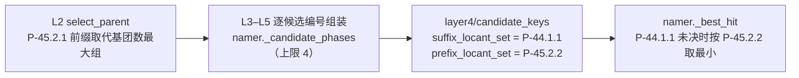
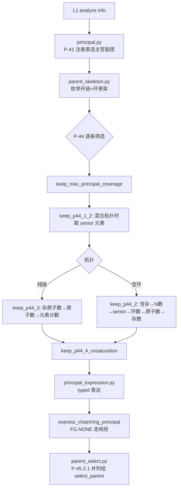
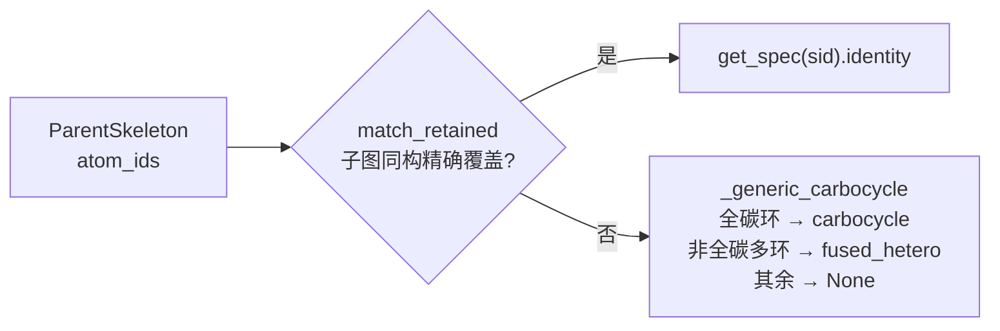
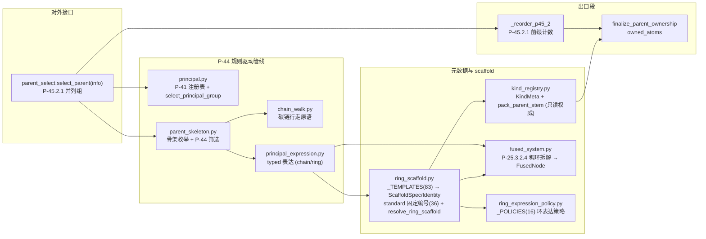

# Layer2: Parent Selector（母体选择器）

> **文件数:** 9 modules（不含 `__init__.py`）| **代码:** 1,838 行（`layer2/` 全部 10 个 `.py` 共 1,840 行）| **最后更新:** 2026-09-15
> **职责:** 给定 layer1 的官能团 (FG) 信息字典，按 IUPAC P-44 选出母体结构 (parent hydride)

---

## 概述

Layer2 是 NamePredict 六层流水线中逻辑最复杂的一层。它接收 layer1 `analyze()` 产出的 FG 信息字典（`fg_inventory` 承载全部官能团、环系、不饱和键的结构化描述），从中选出一个 **母体结构 (parent)**——即 IUPAC 命名中作为骨架的核心部分。母体的选择决定了后续所有层的命名方向：layer3 基于母体提取取代基，layer4 在母体骨架上编号，layer5 基于母体类型组装最终名称。

Layer2 由 9 个模块（不含 `__init__.py`）组成：

- **① 对外入口唯一** —— `parent_select.py`（131 行）是层的唯一门面，`select_parent(info) -> list[dict]`（`parent_select.py:128`）返回 **P-45.2.1 并列最优候选组**；无候选时返回空列表，`namer._run_candidates` 以 `no_assemblable_candidate` 显式失败，不做烷烃兜底。
- **② 层内无 P-44 排序键** —— 全库不存在 `P44Facts`/`ParentCandidate`/`principal_key`/`_p44_1_1`/`_rank_candidates`（grep 零命中）。P-44 的取舍全部落在骨架筛选谓词里（`keep_max_principal_coverage` → `keep_p44_1_2` → `keep_p44_3`/`keep_p44_2` → `keep_p44_4_unsaturation`，`parent_skeleton.py`）。L2 出口只做一条排序：`_p45_2_prefix_count`（`parent_select.py:97`）数 owned_atoms 边界外的取代基团数目，`_reorder_p45_2`（`:104`）按该计数降序稳定重排，`tied=True` 时只留并列最大组。
- **③ 互斥结构性实现** —— 由 `select_principal_group`（`principal.py:60`）的 `min(eligible, key=priority)` 单选择完成（P-44 只认单个最高优先级主官能团），不存在 `fg_helpers.py` 与 `_no_fgs` 谓词。
- **④ 骨架识别在 `ring_scaffold.py`** —— `_TEMPLATES`（`:60`，**83 条**保留模板）为唯一事实来源；36 条模板携带 `standard = (labels, order)` 声明固定编号（import 期 `_validate_standard_fields` `:203` 校验 order 是排列、labels 长度等于模板原子数），派生 `_STANDARD_LABELS`（`:195`）/`_STANDARD_ORDERS`（`:198`）与 ScaffoldSpec/ScaffoldIdentity；`kind_registry._load_from_scaffold_specs()`（`kind_registry.py:76`）在 import 期据此同步词干权威。
- **⑤ kind 正交化** —— 苯、未注册碳环与未注册芳香稠环一律收敛 `alkane`（`_resolved_ring_kind` `:158`、`_generic_ring_kind` `:145`），不饱和度由 `double_bond(s)`/`triple_bond(s)` 字段承载；数量不进 kind，多基团数由 `principal_expression_facts.multiplicity` 承载（无 diacid/diol/diamine 等数量 kind）。
- **⑥ 稠环拆解独立于 scaffold 身份** —— `fused_system.decompose_fused_system`（`:217`）按 P-25.3.2.4 产出 `FusedNode` 树供 L5 组装稠合名；未注册系统 `resolve_ring_scaffold` 返回 None 时仍产出拆解树。
- **⑦ P-45.2 分工** —— L2 `select_parent` 交出 **P-45.2.1** 并列最优候选组；**P-45.2.2** 位次集合须 L4 编号后才可得，由 L4 `candidate_keys.prefix_locant_set`（`layer4/candidate_keys.py:20`）给出、`namer._best_hit`（`namer.py:136`）裁决。
- **⑧ 单次命名记忆** —— `_hydrogenated` 重建（`ring_scaffold.py:220`）与 P-44.4 不饱和度键（`parent_skeleton.py:183`）经 `tools/memo` 记忆，`sssr_rings`（`layer1/ring_systems.py:23`）统一环访问，属性能优化，不改命名结果。

### 输入与输出

| | 类型 | 关键字段 |
|---|---|---|
| **输入 (info)** | `dict` | 13 个键：`analyze()`（`layer1/analyzer.py:195`）产出的 11 个（`mol` (RDKit Mol), `carbon_ids`, `n_carbons`, `fg_inventory`, `double_bonds`, `triple_bonds`, `rings`, `n_rings`, `has_ring`, `ring_systems`, `n_ring_systems`），`namer._name_mol` 再注入 `root_ctx`（`namer.py:207`）与 `salt`（`:208`）。全部布尔标志只有 `has_ring` 一个，FG 存在性一律由 `fg_inventory` 内容判定 |
| **输出 (parent)** | `list[dict]` | `select_parent` 返回 **P-45.2.1 并列最优候选组**（无候选时空列表）；每个元素由 `_parent_dict`（`principal_expression.py:125`）与各字段函数合成，含 `kind` (母体类型), `chain` (骨架原子序号列表), `n_carbons` (= 骨架原子数), `owned_atoms` (frozenset), `stem_en`, `stem_zh`, `scaffold_id`, `scaffold_identity`, `scaffold_match`, `typed_ring_expression_supported`, `numbering_scaffold`, `hydro_atoms`, `fused_tree`, `principal_expression_facts`, `principal_occurrences`, `principal_group_count`, `covered_principal_ids`, `mol`，以及 FG 专属字段 `radical_c_idx`/`acyl_c_idx`、`double_bond(s)`/`triple_bond(s)`、`radical_ylidene`、`anion`、`o_idx`/`alkoxy_n`、`hal_idx`/`hal_z`、`n_oh`/`n_om`/`n_arms`/`salt_meta` |

---

## 核心逻辑

### 对外入口 `select_parent`

```python
def select_parent(info: dict) -> list[dict]   # parent_select.py:128
```

签名只接受 info 字典，返回 `list[dict]`（永不为 None）。三段管线：

```
select_parent(info)                                  # parent_select.py:128
├─ _collect_candidates(info)                         # :91  rule_driven_parent_candidates → 剔除 None
├─ _finalize_ranked(info, cands)                     # :116 pack_parent_stem(词干+编号 facts) → finalize_parent_ownership(owned_atoms)
└─ _reorder_p45_2(info, cands, tied=True)            # :104 P-45.2.1 前缀计数降序稳定重排 → 只留并列最大组
```

`_finalize_ranked`（`:116`）对每个候选先 `pack_parent_stem`（`kind_registry.py:58`）注入 `stem_en`/`stem_zh` 与 `numbering_scaffold`，再 `finalize_parent_ownership`（`:83`）固化不可变 `owned_atoms` frozenset。`_reorder_p45_2` 在 `len(cands) <= 1` 时直接返回，`_p45_2_prefix_count` 内部局部 import L3 `iter_claims`（`layer3/claimable_block.py:123`）枚举边界外 claim。

`rule_driven_parent_candidates`（`:52`）= `select_principal_parent_skeletons`（`:25`，选主官能团 + 筛骨架）∘ `_express_selected`（`:40`，按 `SkeletonTopology` 分派 `express_ring_principal`/`express_chain_principal`）；环酮若 `typed_ring_expression_supported is False` 由 `_unsupported_typed_ring`（`:33`）整体拦截。

`parent_select.py` 的模块划分（131 行、5 段）：

| 段 | 符号 | 行 |
|---|---|---|
| 选择结果类型 | `PrincipalParentSelection`（主官能团选择 + 骨架选择的冻结组合） | `:19` |
| P-44 管线编排 | `select_principal_parent_skeletons` / `_express_selected` / `rule_driven_parent_candidates` / `_unsupported_typed_ring` | `:25` / `:40` / `:52` / `:33` |
| 原子归属 | `_chain_atoms` / `_kind_fg_atoms` / `finalize_parent_ownership` | `:58` / `:63` / `:83` |
| 候选收集 | `_collect_candidates` | `:91` |
| P-45.2 裁决与终态化 | `_p45_2_prefix_count` / `_reorder_p45_2` / `_finalize_ranked` / `select_parent` | `:97` / `:104` / `:116` / `:128` |



`namer._candidate_phases`（`namer.py:156`）取该组前 `_MAX_TIED_CANDIDATES = 4` 个（`namer.py:89`）逐候选跑 L3–L5，`_best_hit`（`namer.py:136`）先比 `suffix_locant_set`，未决时按 `prefix_locant_set` 取最小。

> **源:** `src/namepredict/layer2/parent_select.py`

### P-44 规则驱动主链管线

这条管线按 IUPAC P-44 条款逐步筛选，参与模块全部为无副作用纯函数、可单测：



1. **`principal.py`** — `select_principal_group()`（`:60`）按 `PRINCIPAL_REGISTRY`（`:44`，由 `FG_SPECS`（`layer1/fg_registry.py:20`）取 `p41 != 0` 的条目派生，**13 条**）选出主官能团类：先剔除 `demoted` 条目（降级叶 carboxy/cyano），再 `min(eligible, key=priority)`。`PrincipalPriority`（`:17`）为 `(p41_class, p43_path)` 可比较元组，数值小者优先；`PrincipalFeatureSpec`（`:29`）携带 priority/expression/`anchor_fields`；`feature_spec()`（`:49`）是唯一查询入口。无合格主基团时返回 `PrincipalGroupSelection(FG.NONE, ())`，下游以 `FunctionalGroupClass.NONE`（枚举值 `"alkane"`）走纯烃表达。

2. **`parent_skeleton.py`** — `enumerate_principal_skeletons()`（`:228`）枚举**开链候选**（`_chain_candidates` `:108`）与**环系统候选**（`_ring_candidates` `:101`，每个 ring system 一个骨架；骨架不携带 scaffold_id，身份延迟到表达阶段识别）。`select_principal_skeletons()`（`:215`）依次施加 `keep_max_principal_coverage`（`:178`）→ `keep_p44_1_2`（`:131`，混合拓扑时 `keep_senior_atom` `:124`，senior 序由层内 `_SENIOR_ATOMS` `:115` 给出）→ 按拓扑走 `keep_p44_3`（`:149`，纯链）/`keep_p44_2`（`:171`，含环）→ `keep_p44_4_unsaturation`（`:209`）。
   - **P-44.4 把芳香键按 Kekulé 双键当量计入**（`p44_4_unsaturation_key` `:183`：芳香键 `//2` 计入多重键与双键数，苯 = 3；实算在 `_p44_4_unsaturation_key_uncached` `:192`），使不饱和芳香环优先于同环数饱和环；键值经 `memo.by_key`（`tools/memo.py`）记忆，`id()` 入键保活防复用。
   - **等长最长链全枚举**（`_open_chains` `:58`）—— 穿过锚点的**全部等长最长开链**都作候选（`_all_chains_through` `chain_walk.py:92` 逐一枚举组件与最深叶子），避免单条 DFS 任选一路丢掉平局候选；两锚点之间由 `_pair_chains`（`:51`）经 `_chain_through_two`（`chain_walk.py:147`）生成。无锚点（纯烃）时退化为 `_longest_chain`（`chain_walk.py:48`）作唯一开链骨架。
   - **降级叶碳禁走**（`_demoted_leaf_carbons` `:43`）—— 取 `inventory_from_info(info).demoted_entries()` 中碳中心的 `payload["center_idx"]` 组成 `banned` 集合传入链游走（P-61.1.3）：羧酸/腈碳不得进入开链主链。`_chain_coverage`（`:69`）算链覆盖的 occurrence（胺任一臂在链即覆盖，P-62.2），`_ring_attaches`（`:84`）判定环附着（胺/醇/酮/自由基只认直接附着）。

3. **`principal_expression.py`** — 把选定骨架表达为 parent dict（统一经 `_parent_dict` `:125`）：
   - `express_chain_principal()`（`:408`）—— 开链主官能团经 `_chain_kind`（`:70`）映射 kind：`FG.NONE` + count 0 → `"alkane"`；**ACYL → `"acyl"`**（酰基残基：羰基头为 locant 1，L5 拼 -oyl/酰，P-65.1.7.2）；**RADICAL → `"radical"`**（连接点位次由 L4 承载 `radical_c_idx`）；其余 FG 类别 **count ≥ 1 时恒返回 `group_class.value`**，数量由 `principal_expression_facts.multiplicity` 承载（L5 `chain_engine` 按 multiplicity 切换后缀）。骨架内 C=C/C≡C 写 `double_bond`/`triple_bond`/`double_bonds`；`acyl_halide` 经 `_chain_acyl_halide_fields`（`:394`）携带 `hal_idx`/`hal_z`（卤素纳入母体原子，不作取代基）；酯经 `_chain_ester_fields`（`:333`）写 `o_idx`/`alkoxy_n`；**`phosphate` 经 `_chain_phosphate_fields`（`:317`）携带 `n_oh`/`n_om`/`n_arms`/`salt_meta`**——盐门控不通过（n_om>0 时碱金属数不配对、或中性酸/酯带金属）时返回 None 使该候选不可表达（P-67.1.3.2 磷酸酯 / P-41 类别 7d 游离磷酸）
   - `express_ring_principal()`（`:232`）—— 环骨架先 `resolve_ring_scaffold` 解析身份，再 `_ring_kind`（`:169`）定 kind：RADICAL 在 scaffold 为 None（未知杂环无 -yl 词干）时显式返回 None；**scaffold 存在且主 FG 属 `_FG_CLASSES`（`:44`，全部类别除 NONE）→ 取 `_chain_kind` 的 FG 类别 kind**（本步允许 count=0 落空）；ALDEHYDE 另有显式分支返回 `"aldehyde"`（环上外环 -CHO 可多个，P-66.6.1.1.3）；其余走 `_resolved_ring_kind`。环酸经 `_expression_flags`（`:88`）补 `anion` 标志，环外酰卤同样经 `_chain_acyl_halide_fields` 补 `hal_z`/`hal_idx`，单酯经 `ester_fields`（`:226`）补 `o_idx`；碳锚点自由价双键（`*=C1CCCC1`）经 `_radical_ylidene`（`:385`）置 `radical_ylidene` 让 L5 出 -ylidene
   - **kind 正交化** — `_resolved_ring_kind`（`:158`）：苯与 `fused_hetero` 收敛 `alkane`；`_generic_ring_kind`（`:145`）：未注册芳香稠环（sssr ≥ 2 环）与全碳环收敛 `alkane`，环内成环三键（`_ring_endocyclic_triple` `:137`）不作芳香处理
   - **`_scaffold_fields`（`:184`）** 写 `scaffold_id`/`scaffold_identity`/`scaffold_match`/`typed_ring_expression_supported`，保留模板命中时再写 `hydro_atoms`（`hydrogenated_atoms`）；多环骨架（`sssr_indices` ≥ 2）调 `decompose_fused_system` 写 `fused_tree`
   - **不饱和表达** — `_chain_unsat_fields`（`:278`）经 `_unsat_bond_fields`（`:264`）组装单/复数字段；`_implied_ring_atoms`（`:308`）取 `mancude_ring_atoms`（无匹配但有 `fused_tree` 时取整个骨架）从字段中剔除（否则得 `naphthalene-3-ene-1,2-dione` 这类自相矛盾串）；`scaffold_id == "carbocycle"` 时由 `_kekule_ring_dbs`（`:291`）按 Kekulé 结构补回环内双键（tropolone 不至被写成饱和环）
   - 每个候选携带 `PrincipalExpressionFacts`（`:33`：group_class/multiplicity/relation/occurrence_ids/characteristic_atoms/anchor_atoms/attachment_atoms/charge_state）与 `ScaffoldIdentity`

4. **`chain_walk.py`**（152 行）—— 开链骨架专用碳链行走原语，借 `tools/chain` 的 `_carbon_neighbors`/`_longest_from`：`_side_count`（`:9`，支链度）、`_better`（`:21`，长度优先、仅等长才数支链度）、`_seed_carbons`（`:29`，开链为多碳树时仅用开链叶作种子降集加速）、`_longest_chain`（`:48`）、`_component_leaves`（`:58`）/`_component_path`（`:82`）/`_all_chains_through`（`:92`，平局臂全枚举）、`_bfs_prev`（`:125`）/`_rebuild_path`（`:140`）/`_chain_through_two`（`:147`）。`banned` 集合全局禁走羧酸/腈叶碳。

> **源:** `src/namepredict/layer2/principal.py`, `src/namepredict/layer2/parent_skeleton.py`, `src/namepredict/layer2/principal_expression.py`, `src/namepredict/layer2/chain_walk.py`

### 杂原子锚点自由基（表 2.1 单核母体氢化物）

单一杂原子锚点的自由基（`*O-`、`*NH-`、`*P(=O)<` 等）由 `_mononuclear_radical`（`principal_expression.py:360`）收敛为**单核母体氢化物骨架**（P-15.4.1 表 2.1）：把 skeleton 的 `atom_ids` 收敛为单原子、注入 free 名，碳侧链留给 L3，L5 经 `free_to_yl`（`layer5/assembler.py:178`）转标准取代基名（去氢即 hydroxy/oxy、amino、sulfanyl）。仅支持单一锚点。

词干必须把**锚点的氧化态/自由价键级**写进去，否则不同分子同形（氧被整段丢弃）。词表常量位于 `src/namepredict/constants.py`：

| 元素 | 判定依据 | 词干 |
|---|---|---|
| N | `_anchor_free_double`（`:344`）自由价键级 | `NITROGEN_STEM_BY_FREE_DOUBLE`：单键 azane/氮烷、双键 imine/亚胺（P-66.1.1） |
| O | — | `MONONUCLEAR_BY_ELEMENT[O]` = oxidane/氧化烷 |
| S | `_anchor_oxo_count`（`:355`）的 =O 数 | `SULFUR_STEM_BY_OXO`：0 sulfane/硫烷、1 sulfinyl/亚磺酰、2 sulfonyl/磺酰（P-63.2.2） |
| P | `_anchor_oxo_count` 的 =O 数 | `PHOSPHORUS_STEM_BY_OXO`：0 `phosphanyl`/磷烷基、1 `phosphoryl`/磷酰 |

**P 词干**（P-67.1.4.1.1.2 磷酰基 `phosphoryl` –P(O)<；P-67.1.4.1.1.6 亚磷酸 `phosphanyl`）：=O 数非 0/1 时（如二氧代磷烷）`.get()` 落空，`_mononuclear_radical` 返回 None 明确失败，不落一个氧化态错位的名字。

> **源:** `src/namepredict/layer2/principal_expression.py:360`, `src/namepredict/constants.py`

### Kind Registry: 母体元数据中心

`kind_registry.py`（87 行）是 Layer2 的**母体元数据注册中心 (Registry Authority)**，存储 scaffold 母体种类 (kind) 的元数据并在导入时 bootstrap：

- **`KindMeta`**（`:8`）: 每个 kind 的中英词干 (`en`, `zh`) 与环元数据 (`ring`, `n_rings`, `retained`)
- **bootstrap 只有一步**（`:87`）— `_load_from_scaffold_specs()`（`:76`）从 `ring_scaffold.all_specs()` 读取有词干的 spec，注册为 kind 元数据（**Spec 是词干权威**），已存在则覆盖。主官能团等级不存于 `KindMeta`，运行时按 FG 类经 `PRINCIPAL_REGISTRY` 查询
- 公共 API: `get`（`:20`）/ `parent_names`（`:25`）/ `pack_parent_stem`（`:58`）
- **`pack_parent_stem` 前缀注入**（`:58`）— 词干缺失时按 `scaffold_id`（回落 `kind`）取 kind 词干；五元杂环 locant 前缀（`1H-`/`1,3-`）在此统一成终态：若词干已含 `-{pref_en}`（如 `2,5-dihydro-1H-pyrrole` 自带加氢前缀）则**不前移**，避免位次重复；否则按 `prefix_nh_conditional` 决定是否注入（`_ring_keeps_nh_prefix` `:42`：环含未取代芳香 NH 才写 `1H-`），`_strip_locant_prefix`（`:53`）先剥后加，保证 N-取代 indole 输出 "indol-…"；末尾 `_attach_numbering_scaffold`（`:33`）经 `ring_scaffold.numbering_scaffold_facts`（`ring_scaffold.py:376`）附 `numbering_scaffold` facts（标签数与骨架原子数相符才附）

kind_registry 是**只读权威**：被 `parent_select._finalize_ranked` 消费，不存在对外注册入口；层内不提供 `is_hetero_ring`/`is_carbo_ring`/`n_rings_of`/`retained_bonus` 等评分派生集合。

> **源:** `src/namepredict/layer2/kind_registry.py`

### Ring 骨架识别机制（`ring_scaffold.py`）

`ring_scaffold.py`（457 行）以 `_TEMPLATES`（`:60`）为**唯一事实来源**，派生 ScaffoldSpec/ScaffoldIdentity、固定编号视图与保留条目。职责分三块：

1. **模板注册表（唯一来源）** — `_TEMPLATES`（`:60` 起，**83 条**保留母体，键为 sid，值为 `{smiles, stem_en, stem_zh, naming_class, ...}`）。实测分布：`naming_class` = monohetero 53 / naph_family 9 / fused56 8 / xanthene 2 / mono_carbo、anthra、phenanthrene、pyrene、chrysene、carbazole、acridine、phenothiazine、benzodioxole、purine、steroid 各 1；`fused=True` 67 条（可作稠合组分）、`fused=False` 16 条（饱和保留名等不作稠合零件）；`fused_prefix` 27 条；`fused_stem` 3 条（indene/indole/purine，去指示氢的组分词干覆盖）；`locant_prefix` 41 条；`prefix_nh_conditional` 14 条。可选字段：
   - **稠合命名零件** — `fused`（该环可作稠合组分）/`fused_stem`（词干覆盖，如 1H-indole→indole）/`fused_prefix`（附加组分保留前缀，P-25.3.2.2.3；组分中表征结构的位次须写进方括号）；经 `component_stem()`（`:148`，`fused=False` 时返回 None）/`retained_fusion_prefix()`（`:156`）读取，由 `fused_system._decompose` 打包进 `FusedNode` 下发 L5
   - **`standard = (labels, order)`** — 固定编号声明，`order` 是模板原子按 locant 顺序的下标排列，`labels` 为对应 locant 标签；**实测 36 条登记**（`_STANDARD_ORDERS`（`:198`）/`_STANDARD_LABELS`（`:195`）由该字段派生），与 `smiles` 同条目存放，避免改 SMILES 后编号静默错位。import 期 `_validate_standard_fields()`（`:203`）校验 `order` 是 `0..n-1` 的排列且 `labels` 长度等于 `_Q[sid].GetNumAtoms()`，不符即 `ValueError`
   - **标签表**（声明于 `_TEMPLATES` 上方）— `FUSED56_LABELS`（`:48`，9 项，桥头 3a/7a）、`PURINE_LABELS`（`:49`，9 项纯数字，桥头得数字位）、`CARBAZOLE_LABELS`（`:50`，13 项，N9）、`ACRIDINE_LABELS`（`:51`，14 项，N10）、`PHENOTHIAZINE_LABELS`（`:52`，14 项，S5/N10）、`NAPH_LABELS`（`:53`，pteridine/喹啉系/噌啉/色烯系复用）、`ANTHRACENE_LABELS`（`:54`，14 位：中环碳得数字位 9/10，桥头 4a/10a/8a/9a，P-25.4.1 传统编号）、`PHENANTHRENE_LABELS`（`:55`）、`PYRENE_LABELS`（`:56`，外周 1–10）、`XANTHENE_LABELS`（`:57`，中央碳 9、O/S 10）、`STEROID_LABELS`（`:58`，甾体 1–17 全数字）
   - **派生链** — `_Q`（`:193`，sid→模板 Mol，import 时构建一次）、`_TEMPLATE_ELEM`（`:321`，元素签名预过滤）、`_Q_H`（`:235`，完全氢化模板，排除 mono_carbo）、`_spec_from_template`（`:343`，n_rings/ring 由 smiles 自动算，`retained=True`，`numbering=NumberingPolicy(standard_path=labels)`）→ `_ALL_SPECS`/`_BY_ID` → `all_specs()`（`:371`）/`get_spec()`（`:366`）；`ScaffoldSpec.identity`（`:34`）给 `ScaffoldIdentity`；`kind_registry._load_from_scaffold_specs` 据此注册 KindMeta 词干（活接线，防清扫判死）
2. **环解析** — `resolve_ring_scaffold(info, skeleton)`（`:450`）：① `match_retained(info, skeleton.atom_ids)`（`:387`）模板子图同构精确覆盖 → `get_spec(sid).identity`；② 未命中回 `_generic_carbocycle`（`:437`）：全碳环 → `ScaffoldIdentity("carbocycle", "carbocycle", 1, "carbo")`；非全碳且 sssr ≥ 2 环 → `fused_hetero`；其余 → None（显式失败，避免当开链烷基错名）。`ScaffoldSpec`（`:20`）字段为 id/naming_class/stem_en/stem_zh/n_rings/ring/retained/numbering/locant_prefix/prefix_nh_conditional；`NumberingPolicy`（`:14`）只含 `standard_path`
3. **固定编号匹配** — `_match_with_map(info, atom_ids, mancude_only=False)`（`:393`）返回 `(sid, match)`，`match[i]` 是模板原子 i 对应的分子原子；`match_retained`（`:387`）是其 sid 投影。`mancude_only=True` 时只认 `fused` 保留名作稠合组分（P-25.2.1 表 2.8）。精确匹配失败后按完全氢化骨架 `_Q_H` 再比对（`_hydrogenated` `:220` 经 `memo.by_mol` 记忆），支持加氢衍生物（P-25.3.4）。`standard_chain(spec_id, match)`（`:428`）把模板固定 locant 序映射到分子原子（供 L4 `numbering_engine` 固定编号，`layer4/numbering_engine.py:220`）；`locant_prefix(spec_id)`（`:420`）返回 `(en, zh, nh_conditional)` 供 `pack_parent_stem` 注入词干



**新增 ring 母体的步骤:**
在 `_TEMPLATES` 加一条 `{smiles, stem_en, stem_zh, naming_class}`（ScaffoldSpec 自动派生）；需要词干 locant 前缀时补 `locant_prefix`/`prefix_nh_conditional`；需要固定编号时在该条内加 `standard = (labels, order)`（`order` 须为模板原子下标排列、`labels` 数须等于模板原子数，`_validate_standard_fields` 在 import 期把关）；需要作稠合零件时补 `fused`/`fused_stem`/`fused_prefix`（饱和保留名保持 `fused=False`）；**`fused_prefix` 若含位次（杂原子位置、Hantzsch-Widman 位次）必须带方括号**（P-25.3.1.3 / P-25.3.2.1.2），不能依赖通用「去尾 e 加 o」规则（`1,2,4-triazolo` ≠ `[1,2,4]triazolo`）。位置异构体在元素标注的子图同构下天然区分，无需额外消解。详见 [[guides/adding-new-ring-system]]。

> **源:** `src/namepredict/layer2/ring_scaffold.py`

### 指示氢与加氢位（P-58.2.1 / P-31.2.2）

由 `match`（模板原子→分子原子映射）驱动的三个原子集函数，结果由 `_scaffold_fields` 挂进 parent dict 供 L4 使用：

- **`mancude_ring_atoms(scaffold_id, match)`**（`:259`）— 保留 mancude 母体名的**整个不饱和环**映射到分子后的原子集：该集合内部的 C=C 由母体氢化物名隐含（P-31.1.2），不得再写成 -ene/-yne。`_kekule_double_atoms`（`:244`，按 sid 缓存）把模板芳香键化为确定双键，避免稠合单键（萘 4a-8a）被误当不饱和度；消费方为 `principal_expression._implied_ring_atoms`（`principal_expression.py:308`）
- **`extra_indicated_atoms(mol, scaffold_id, match)`**（`:268`）— 保留母体名未隐含、而分子中该位带 H 的芳香杂环原子（P-58.2.1 须显式标指示氢），如 1H-喹啉-4-酮的 N1；仅对**稠合母体**（模板 ≥2 环、原子数相符）、**非碳原子**成立。L4 经 `numbering._extra_indicated`（`layer4/numbering.py:110`）消费
- **`hydrogenated_atoms(mol, scaffold_id, match)`**（`:284`）— 被加氢的分子原子集（P-31.2.2），由 `_scaffold_fields` 直接产出 `hydro_atoms`。规则：模板某位承载 Kekulé 双键、而分子中该位已全单键且 `GetTotalNumHs() > 0` 者记为加氢位（季碳不占 hydro 位，交给指示氢）；环内碳带**环外**多重键记入 `suffix` 集不占 hydro 位。环杂原子失去双键后新增的 H 由指示氢承载，仅在剔除后计数合法（落进 `HYDRO_MULT_N`）时剔除，否则保留原集合；剔除后计数仍为奇数且存在 `suffix` 时，再剔除一个与后缀位相邻的加氢位，使 naphthalen-1-one 得「2H」+「3,4-dihydro」而非整体放弃

### P-25.3.2.2.1 单环烃附加组分

稠合命名的附加组分词头有两类来源：`_TEMPLATES` 条目的 `fused_prefix`（保留母体附加组分，P-25.3.2.2.3），以及 **`_FUSION_CARBOCYCLES`**（`:323`，**6 条**一级单环烃附加组分）：环丙烷 / 环丁烷 / 环戊烷 / 环己烷 / 环庚烷 / 环辛烷 → `cyclopropa`/`cyclopenta`/… 与 `环丙并`/`环戊并`/… 前缀。这些**不入 `_TEMPLATES`**：入表会让单环骨架解析成保留名、破坏 P-31 单环通用路径（carbocycle 按环大小动态命名），它们也不是母体组分（P-25.3.2.1.1：单环烃母体用 [n]annulene/苯）。

- `_cyclo_component_query(smiles)`（`:333`）由环状 SMILES 的原子数派生纯碳环 SMARTS 查询；`_Q_CYCLO`（`:339`）/`_CYCLO_ELEM`（`:340`）在 import 时构建查询与元素签名
- `fusion_carbocycle_prefix(sid)`（`:164`）返回 (en, zh)；`retained_fusion_prefix(sid)`（`:156`）未命中 `_TEMPLATES` 时回落到它
- `match_fusion_carbocycle(info, atom_ids)`（`:175`）元素签名预过滤 + 骨架子图同构，精确等于某单环烃时返回 sid
- `match_fusion_component(info, atom_ids)`（`:189`）= `match_retained(..., mancude_only=True)` 优先，其次 `match_fusion_carbocycle`——稠环拆解的组分匹配统一入口
- `omits_fusion_numbers(sid)`（`:170`）— 稠合描述符是否省略数字位次（P-25.3.8.1）：苯及一级单环烃附加组分省略，经 `FusedNode.fused_omit_numbers` 下发 L5

### 稠环拆解 (fused_system.py)

`fused_system.py`（223 行）实现 **P-25.3.2.4 稠环拆解**——把含 ≥2 环共享 ≥2 原子的稠合环系拆成**保留母体组分树**（`FusedNode`），供 L5 `fused_namer` 组装 `benzo[a]...`/`naphtho[...]...` 类稠合名。这是**未注册稠环**（无整体保留 scaffold）的命名通道：母体/附加组分均为已注册保留件（或 P-25.3.2.2.1 单环烃），但整体系统不在 `_TEMPLATES` 内。

核心数据结构 `FusedNode`（`:25`）：

```python
@dataclass(frozen=True)
class FusedNode:
    scaffold_id: str                 # 母体组分保留模板 id
    atom_ids: tuple[int, ...]        # 组分原子
    ring_indices: frozenset[int]     # 组分所含环
    fusion_shared: tuple[frozenset[int], ...] = ()  # 与父组分的共享原子集（根节点为 ()）
    attached: tuple["FusedNode", ...] = ()          # 附加组分树（递归）
    # 命名组装数据：L2 打包期从 ring_scaffold 取好挂上，L5 只读（L5 不得 import L2）
    fused_stem: tuple[str, str] | None = None    # 组分词干 (en, zh)；None = 不可作稠合零件
    fused_prefix: tuple[str, str] | None = None  # 附加组分保留前缀 (en, zh)；None = 走通用规则
    fused_omit_numbers: bool = False             # 稠合描述符省略数字位次（P-25.3.8.1）
```

拆解管线（入口 `decompose_fused_system`，`:217`）：

1. **增长式候选枚举**（`_candidates_for`，`:53`）— 从"单环精确匹配某稠合组分"（用 `match_fusion_component`）的种子环 DFS 并入邻接环（`_fusion_adj` `:43`），匹配命中即记候选，元素超集剪枝（`_has_template_superset` `:37`，对照 `_TEMPLATE_COUNTS` `:18`），按原子集去重
2. **P-25.3.2.4 母体组分选择**（`_select_base`，`:81`）— 依次施加 (a) 最优先杂原子（`P25_SENIOR`）→ (b) 环数 → (c) 环大小降序 → (d) 杂原子总数 → (e) 杂原子种类 → (f) 最高优先杂原子数（`P145_SENIOR`）→ (g)-(j) 依赖 L4 优选取代/编号（`_numbered_locants` `:149`，调到 L4 `fused_orientation.preferred_orientations` + `fused_numbering.number_fused_system` + `locant_calc.locant_key`）逐准则收窄（水平行环数 / 杂原子位次低 / 逐元素位次 / 稠合碳位次低）；每步经 L4 `numbering_engine.narrow`（`layer4/numbering_engine.py:75`），末位环集升序兜底
3. **递归拆解**（`_decompose`，`:192`）— 选定母体组分后，剩余环按融合图**连通分量**（`_ring_components` `:170`）递归为附加组分，共享原子经 `fusion_shared` 下传；**同时把 `component_stem(sid)`/`retained_fusion_prefix(sid)`/`omits_fusion_numbers(sid)` 写进节点**（唯一构造点），使 L5 无需持有词干表的第二副本

入口读 `system["fusion_edges"]`/`sssr_indices`（L1 `build_ring_systems` `layer1/ring_systems.py:117` 产出），环表经 `sssr_rings` 取，输出 `FusedNode | None`（无保留候选返回 None）。**拆解独立于 scaffold 身份**——未注册系统 `resolve_ring_scaffold` 解析为 None 时仍产出拆解树。

> **源:** `src/namepredict/layer2/fused_system.py`

### P-45.2 裁决与 P-44 排序键现状

Layer2 出口段只有一条排序键，即 **P-45.2.1**：

- `_p45_2_prefix_count(info, parent)`（`parent_select.py:97`）— 以 owned_atoms 为边界，局部 import L3 `iter_claims(mol, owned_atoms)`（`layer3/claimable_block.py:123`）枚举边界外 claim，取个数
- `_reorder_p45_2(info, cands, *, tied=False)`（`:104`）— 单候选直接返回；否则按 `key=(-count, 原序)` 稳定重排；`tied=True` 时取首位计数，只返回计数等于该值的候选组
- `select_parent` 恒以 `tied=True` 调用（`:131`），即对外语义是「P-45.2.1 并列最优组」

**P-44 排序键层内不存在**：没有 `P44Facts`/`ParentCandidate`/`principal_key`/`_p44_1_1`/`_rank_candidates` 任何一个符号。P-44 的等级取舍（环优先、senior 杂原子、杂原子数、链长、环数、不饱和度）已在 `parent_skeleton.select_principal_skeletons` 的筛选谓词中完成，主官能团等级取舍由 `principal.select_principal_group` 的 `min()` 完成，无需出口再排序。

**P-45.2.2 不在本层**：位次集合只有在 L4 编号后才存在，故由 L4 `candidate_keys.prefix_locant_set`（`layer4/candidate_keys.py:20`）产出、`namer._best_hit` 裁决；L4 `suffix_locant_set`（`layer4/candidate_keys.py:7`）承载 P-44.1.1。

> **源:** `src/namepredict/layer2/parent_select.py:97-113`

### 链 vs 环决策

母体选择的核心分歧点是**链状母体 vs 环状母体**，由 `parent_skeleton.keep_p44_1_2`（`:131`）在筛选阶段解决：当候选集中同时存在两种拓扑时，按 `keep_senior_atom`（`:124`）保留含最优先元素的候选；同拓扑内部不施加该规则。

1. **环系统候选**（`_ring_candidates`，`:101`）— 每个 `ring_systems` 条目生成一个骨架（`atom_ids` 排序后作 `ParentSkeleton.atom_ids`），覆盖集由 `_ring_attaches` 决定
2. **开链候选**（`_chain_candidates`，`:108`）— 按 `frozenset(path)` 去重后逐个建 `ParentSkeleton`，`covered_principal_ids` 由 `_chain_coverage` 给出

随后按候选集的拓扑走 P-44.3（纯链）或 P-44.2（含环），最后统一施加 P-44.4 不饱和度规则。

> **源:** `src/namepredict/layer2/parent_skeleton.py:101-115`

### FG 优先级体系

官能团优先级遵循 IUPAC P-41，由 `principal.py` 的 `PRINCIPAL_REGISTRY`（`principal.py:44`）承载，**由 `fg_registry.FG_SPECS` 自动派生**（取 `sp.p41` 非 0 的条目，经 `_spec_from_fg` `:36`；**实测 13 条**）。`PrincipalPriority`（`:17`）数值小者优先；`select_principal_group` 以 `min(...)` 取唯一主官能团，低优先级 FG 一律成为取代基。`FG_SPECS` 的 13 个条目**全部 `expr="suffix"`**，`PrincipalExpression`（`:23`）枚举当前只有 `SUFFIX` 一个成员，`feature_spec`（`:49`）对全部注册 FG 放行：

| p41 | FG 类别 | kind | path |
|--------|---------|-----------|------|
| 1 | 自由基 (radical) | `radical`（L5 拼 -yl / -ylidene） | () |
| 1 | 酰基 (acyl) | `acyl`（P-65.1.7.2，羰基头 locant 1） | () |
| 7 | 羧酸 (acid) | acid（链酸多基由 multiplicity 承载） | (1,) |
| 9 | 磷酸 / 磷酸酯 (phosphate) | phosphate（游离磷酸为 P-41 类别 7d；L5 由 `_KIND_TABLE["phosphate"]` 的 `_phosphate_tail` 按 `n_oh` 选词尾，再经 `assembler.join_phosphate_name` 整名，同分子含羧酸/羧酸酯时降级 phosphonooxy 前缀 P-67.1.5.1） | (1,) |
| 9 | 酯 (ester) | ester（多酯 kind 恒为 `ester`） | () |
| 10 | 酰卤 (acyl_halide) | acyl_halide（L5 按 `hal_z` 选 -oyl fluoride/chloride/bromide/iodide，苯 → benzoyl halide） | () |
| 11 | 酰胺 (amide) | amide | () |
| 14 | 腈 (nitrile) | nitrile | () |
| 15 | 醛 (aldehyde) | aldehyde（环上多 -CHO 由 `_ring_kind` ALDEHYDE 分支放行） | () |
| 16 | 酮 (ketone) | ketone（`dione` 不产生，二酮由 L5 chain_engine 生成式产出） | () |
| 17 | 醇 (alcohol) | alcohol | (1,) |
| 17 | 硫醇 (thiol) | thiol | (2,) |
| 19 | 胺 (amine) | amine（胺任一臂在骨架即覆盖，P-62.2） | () |

> **源:** `src/namepredict/layer2/principal.py:44` `PRINCIPAL_REGISTRY`（由 `FG_SPECS` 派生）, `src/namepredict/layer1/fg_registry.py:20` `FG_SPECS`

### 多官能团母体与环表达能力策略

无数量派生 kind：**diacid/polycarboxylic/diol/triol/diamine/triamine/tetraamine 不产生**。链式主基团的数量完全交给 L5：`_chain_kind`（`principal_expression.py:70`）对非 ACYL/RADICAL 类别在 count ≥ 1 时恒返回 `group_class.value`，个数写入 `principal_expression_facts.multiplicity`（在 L5 `chain_engine` 中按 multiplicity 切换后缀：4 OH → `butane-1,2,3,4-tetraol`）。

环 typed 表达同理不按 multiplicity 截断——`ring_expression_policy.py`（45 行）的 `RingExpressionPolicy`（`:11`）字段为 `naming_classes`（frozenset）/`group_class`/`relations`（frozenset），**无 multiplicity 上限**。`_POLICIES`（`:18`，**实测 16 条**）按 `(naming_classes, group_class, relations)` 三元组登记能力，`supports_ring_expression`（`:41`）逐一匹配；未登记组合使 `typed_ring_expression_supported=False`，环酮候选被 `parent_select._unsupported_typed_ring`（`parent_select.py:33`）整体拦截：

| naming_classes | group_class | relations |
|---|---|---|
| carbocycle | ALCOHOL / KETONE / AMINE / ACID | in_skeleton / in_skeleton / in_skeleton / exocyclic |
| mono_carbo | ALCOHOL / AMINE | in_skeleton |
| naph_family | ALCOHOL / KETONE | in_skeleton |
| monohetero、fused56、purine、carbazole、acridine、phenothiazine、benzodioxole、anthra、phenanthrene、pyrene | KETONE | in_skeleton |
| xanthene、steroid | KETONE / ALCOHOL | in_skeleton |
| fused_hetero、fused | ALCOHOL / KETONE / AMINE / ACID / NITRILE | in_skeleton ×3 + exocyclic ×2 |

> **源:** `src/namepredict/layer2/ring_expression_policy.py:18`, `src/namepredict/layer2/principal_expression.py:70`

### Atom Ownership: 母体原子归属

`parent_select.py` 的归属段确定**母体"拥有"哪些原子**——FG 异原子由 layer1 的 `FunctionalGroupOccurrence`（`layer1/functional_group_inventory.py:29`：`characteristic_atoms` + `parent_anchors` + `payload`）承载，本层只做收尾：

- `_chain_atoms(parent)`（`:58`）— 骨架链原子集合
- `_kind_fg_atoms(parent, mol)`（`:63`）— 主官能团所有权原子：从 `principal_occurrences` 取锚点与特征原子，**骨架内锚点**作种子（锚点全在骨架外时改取与骨架相邻的锚点，覆盖苯甲酸的羧基这类 exocyclic 基团），再把种子的**直接相连特征原子**并入（=O 归母体，不落入 oxo 前缀）
- `finalize_parent_ownership(parent, mol)`（`:83`）— 两者并集注入不可变 `owned_atoms` frozenset（幂等：已是 frozenset 则原样返回），并由 `namer._prepare_candidate`（`namer.py:116`）在 L3 前再次调用

owned_atoms 是 layer3 提取取代基的关键边界。详见 [[concepts/atom-ownership]]。

> **源:** `src/namepredict/layer2/parent_select.py:83`

### 互斥检查

无 `fg_helpers.py` 与 `_no_fgs(info, keys)` 互斥谓词。互斥语义由 `principal.select_principal_group` **结构性实现**：P-44 只选单个最高优先级主官能团（`min(eligible, key=priority)`），低优先级 FG 一律成为取代基，无需逐候选 `_no_fgs` 检查。

### 侧链识别与块切割（tools / layer3）

Layer2 选完母体后**不做**侧链块切割——侧链识别与命名全部由 Layer3 承担。共享的层无关原语位于 `tools/`：`tools/block_cut.py`（`side_atoms`/`cut_block`/`side_roots`）、`tools/anchored_table.py`（锚定 canonical-SMILES 查表，见 [[architecture/layer3-substituents]]）、`tools/chain.py`（`_carbon_neighbors`/`_longest_from`）。Layer2 反向借用 `tools.chain` 的两个原语给 `chain_walk.py`。`free_to_yl`（free 母体名 → -yl 取代基名）由 **L5 `assembler.free_to_yl`（`layer5/assembler.py:178`）**提供，L3 侧仅做连接点分派。layer2 与 layer3 之间互不 import，**唯一例外**是 `_p45_2_prefix_count` 在函数内局部 import L3 `iter_claims`（见 P-45.2 裁决节）。

### 保留名 (Retained Names)

保留 scaffold 的 stem 与命名类由 **`ring_scaffold.py` 的 `_TEMPLATES`** 提供（唯一事实来源，派生 ScaffoldSpec）：

- **苯系保留名**：benzoic acid / phenol / aniline / benzaldehyde / benzonitrile / benzamide / benzoate——由 L5 chain_engine 的 variant 提供，L2 只把苯环 kind 收敛为 `alkane` 并给出 `scaffold_id="benzene"`（`principal_expression.py:158`）
- **杂环/稠环**：pyridine、naphthalene、indole、purine/pteridine、xanthene/thioxanthene、cyclopenta[a]phenanthrene 等保留母体——由 `_TEMPLATES` 派生 ScaffoldSpec/词干，环+FG 时走通用词干命名（naphthalen-1-ol / pyridine-3-carboxylic acid）；五元杂环的词干 locant 前缀（`1H-`/`1,3-`/`1,2-`）由 `pack_parent_stem` 按 `prefix_nh_conditional` 与环内 NH 决定是否注入
- **固定编号保留母体**：`standard = (labels, order)` 给出 fused 环的 IUPAC 标准 locant 序（purine 的 1–9 纯数字编号、pteridine 的 naph-family 编号、蒽的端环 1–8 与中环数字位 9/10、甾体的 1–17），派生为 `_STANDARD_ORDERS`/`_STANDARD_LABELS`（36 条），L4 经 `scaffold_match` + `standard_chain` 把模板原子映射到分子原子

保留名通过 `scaffold_id` + `scaffold_match` 参与 L4 固定编号与 L5 词干选择，stem 由 `pack_parent_stem` 从 `kind_registry` 注入 parent dict。

### 桥环与螺环母体

Layer2 **不产生** `bridged`/`spiro` 母体候选。环骨架候选只消费 L1 环系条目的 `atom_ids`（构造骨架）与 `sssr_indices`/`fusion_edges`（多环时触发稠环拆解），没有对应的母体候选 kind；`ring_scaffold._generic_carbocycle`（`:437`）对未命中模板的环只区分 `carbocycle` 与 `fused_hetero` 两种身份。

---

## 数据流图

### 模块组织架构



---

## 文件清单

### 对外入口与出口 (Entry & Exit)

| 文件 | 行数 | 职责 |
|------|------|------|
| `parent_select.py` | 131 | 层唯一门面：`select_parent`（P-45.2.1 并列组）+ P-44 编排（`rule_driven_parent_candidates`/`_express_selected`/`select_principal_parent_skeletons`/`_unsupported_typed_ring`）+ owned_atoms 归属（`_chain_atoms`/`_kind_fg_atoms`/`finalize_parent_ownership`）+ 候选收集（`_collect_candidates`）+ 排序终态化（`_p45_2_prefix_count`/`_reorder_p45_2`/`_finalize_ranked`） |
| `__init__.py` | 2 | 包说明（对外入口由 `parent_select.select_parent` 提供，不留转发） |

### P-44 规则驱动管线 (Rule-Driven Pipeline)

| 文件 | 行数 | 职责 |
|------|------|------|
| `principal.py` | 69 | P-41 类 / P-43 表达元数据 + 主官能团选择: `PrincipalPriority`, `PrincipalExpression`, `PrincipalFeatureSpec`, `PRINCIPAL_REGISTRY`(13), `feature_spec`, `select_principal_group`, `PrincipalGroupSelection` |
| `parent_skeleton.py` | 230 | 骨架枚举 + P-44 筛选: `enumerate_principal_skeletons`, `select_principal_skeletons`, `keep_max_principal_coverage`, `keep_p44_1_2`(= 混合拓扑时 `keep_senior_atom`), `keep_p44_2`/`keep_p44_3`/`keep_p44_4_unsaturation`, `p44_2_key`/`p44_3_key`/`p44_4_unsaturation_key`(memo 记忆), `_open_chains`(等长全枚举), `_demoted_leaf_carbons`(降级叶禁走) |
| `principal_expression.py` | 444 | typed 表达: `express_chain_principal`/`express_ring_principal`, `PrincipalExpressionFacts`, `_chain_kind`(NONE→alkane, ACYL→acyl, RADICAL→radical, 其余按 multiplicity), 环 kind 正交化(`_ring_kind`/`_resolved_ring_kind`/`_generic_ring_kind`), 稠环接入(`fused_tree`/`scaffold_match`), 链/环外酰卤字段 `_chain_acyl_halide_fields`, 酯字段, **磷酸字段 `_chain_phosphate_fields`(n_oh/n_om/n_arms/salt_meta + 盐门控)**, **mancude 位屏蔽 `_implied_ring_atoms` / Kekulé 补双键 `_kekule_ring_dbs`**, **杂原子锚点自由基 `_mononuclear_radical`(S/N/P 氧化态词干取自 constants)**, 固定 locant 1 锚点 `_semantic_anchor_fields`(radical_c_idx/acyl_c_idx) |
| `chain_walk.py` | 152 | 碳链行走原语: `_side_count`, `_better`, `_seed_carbons`(叶降集), `_longest_chain`, `_component_leaves`, `_component_path`, `_all_chains_through`(平局臂全枚举), `_bfs_prev`, `_rebuild_path`, `_chain_through_two`；全链 `banned` 禁走集合 |

### 注册与元数据 (Registry & Scaffold)

| 文件 | 行数 | 职责 |
|------|------|------|
| `ring_scaffold.py` | 457 | **`_TEMPLATES`（83 条）→ ScaffoldSpec/ScaffoldIdentity + `resolve_ring_scaffold`**；条目内 `standard=(labels, order)` 经 `_validate_standard_fields` 校验后派生 `_STANDARD_LABELS`/`_STANDARD_ORDERS`（36 条，含 `ANTHRACENE_LABELS` 的 P-25.4.1 传统编号）；含保留杂芳环/小环/二氢环/purine/吡喃/二噁英/噌啉/色烯/呫吨/甾体模板；带方括号的 `fused_prefix`（`[1,3]oxazolo`/`[1,2,4]triazolo`/`[1,4]dioxino` 等）；P-25.3.2.2.1 单环烃附加组分 `_FUSION_CARBOCYCLES`（6 条）；指示氢/加氢位 `mancude_ring_atoms`/`extra_indicated_atoms`/`hydrogenated_atoms` |
| `kind_registry.py` | 87 | `KindMeta` 注册中心（中英词干 + ring/n_rings/retained）; 从 `ScaffoldSpec` 同步词干（只读权威）; `pack_parent_stem` 词干与 locant 前缀注入 + `_ring_keeps_nh_prefix` + `_attach_numbering_scaffold` |
| `ring_expression_policy.py` | 45 | 环 scaffold 上 typed 主官能团表达的能力策略（`RingExpressionPolicy`/`_POLICIES`(16)/`supports_ring_expression`；无 multiplicity 上限） |
| `fused_system.py` | 223 | P-25.3.2.4 稠环拆解: `decompose_fused_system` → `FusedNode` 树（组分匹配 `match_fusion_component`，母体选择 `_select_base` 准则 (a)–(j)，供 L5 稠合名组装） |

> 备注：`layer2/` 下共 10 个 `.py`（9 模块 + `__init__.py`），合计 **1,840 行**。`fg_helpers.py`/`candidate_gate.py`/`arene_carbonyl.py`/`parent_core.py`/`identity.py`/`spiro_parent.py`/`parent_candidate.py`/`scoring.py`/`ring_parent.py`/`ring_systems.py` 及 `scaffold/` 子包均不在本层——互斥由 `select_principal_group` 结构性单选择实现；ScaffoldIdentity 定义于 `ring_scaffold.py`；parent dict 构造与 owned_atoms 归属均由 `parent_select.py`/`principal_expression.py` 承担。

---

## 对外接口

### 公共 API

```python
def select_parent(info: dict) -> list[dict]   # parent_select.py:128，返回 P-45.2.1 并列最优候选组，无候选时 []
```

调用方式：`namer._candidate_phases`（`namer.py:156`）取该组前 `_MAX_TIED_CANDIDATES = 4` 个（`namer.py:89`）逐候选跑 L3–L5，再由 `namer._best_hit`（`namer.py:136`）按 L4 `candidate_keys` 的 `suffix_locant_set`（P-44.1.1）/`prefix_locant_set`（P-45.2.2）裁决。

```python
def finalize_parent_ownership(parent: dict, mol: Mol) -> dict   # parent_select.py:83
def rule_driven_parent_candidates(info: dict) -> list[dict]     # parent_select.py:52
def pack_parent_stem(parent: dict, mol=None) -> dict            # kind_registry.py:58
def select_principal_group(inventory, registry=PRINCIPAL_REGISTRY) -> PrincipalGroupSelection  # principal.py:60
def express_chain_principal(info: dict, selection, skeleton) -> dict | None   # principal_expression.py:408
def express_ring_principal(info: dict, selection, skeleton) -> dict | None    # principal_expression.py:232
def resolve_ring_scaffold(info: dict, skeleton) -> ScaffoldIdentity | None    # ring_scaffold.py:450
def decompose_fused_system(info: dict, system) -> FusedNode | None            # fused_system.py:217
```

### 与上/下游层的接口

| 层 | 方向 | 契约 |
|---|---|---|
| **layer1** | 上游 | `analyze()`（`layer1/analyzer.py:195`）产出 info 11 键；L2 消费 `mol`/`fg_inventory`（经 `inventory_from_info`，`layer1/functional_group_inventory.py:120`）/`double_bonds`/`triple_bonds`/`ring_systems`，环访问经 `sssr_rings`（`layer1/ring_systems.py:23`）与 `kekulized`（`:10`）；`FG_SPECS`（`layer1/fg_registry.py:20`）是 `PRINCIPAL_REGISTRY` 的唯一来源 |
| **layer3** | 下游 / 反向 | 交出 `owned_atoms`（取代基切割边界）与 `chain`；反向局部 import `iter_claims`（`layer3/claimable_block.py:123`）做 P-45.2.1 计数；L3 `extract_substituents`（`layer3/substituent_extractor.py:43`）以 parent dict 为输入 |
| **layer4** | 下游 / 反向 | 交出 `chain`/`kind`/`scaffold_id`/`scaffold_match`/`numbering_scaffold`/`hydro_atoms`/`owned_atoms`/`fused_tree`；L4 经 `numbering._extra_indicated`（`layer4/numbering.py:110`）消费 `extra_indicated_atoms`、`numbering_engine`（`:202`/`:220`/`:233`）消费 `_Q`/`_Q_H`/`_hydrogenated`/`standard_chain`/`_STANDARD_LABELS`，并回写 `suffix_locant_set`（P-44.1.1）/`prefix_locant_set`（P-45.2.2）；反向调用 L4 `narrow`（`layer4/numbering_engine.py:75`）/`preferred_orientations`（`layer4/fused_orientation.py:328`）/`number_fused_system`（`layer4/fused_numbering.py:147`）/`locant_key`（`layer4/locant_calc.py:7`） |
| **layer5** | 下游 | 交出 `kind`/`stem_en`/`stem_zh`/`fused_tree`（`layer5/assembler.py:255` 经 `fused_namer.fused_parent_names` `layer5/fused_namer.py:112`）/`principal_expression_facts.multiplicity`，以及 FG 专属字段 `radical_c_idx`/`acyl_c_idx`/`radical_ylidene`/`anion`/`o_idx`/`hal_z`/`hal_idx`/`n_oh`/`n_om`/`n_arms`/`salt_meta`；`free_to_yl`（`layer5/assembler.py:178`）把单核母体氢化物名转为取代基名 |

### 关键内部类型

| 类型 | 位置 | 说明 |
|------|------|------|
| `PrincipalParentSelection` | `parent_select.py:19` | 主官能团选择 + 骨架选择的冻结组合 |
| `PrincipalPriority` | `principal.py:17` | 主基团优先级: (p41_class, p43_path)，可比较排序 |
| `PrincipalExpression` | `principal.py:23` | 主基团表达方式枚举（当前仅 `SUFFIX`） |
| `PrincipalFeatureSpec` | `principal.py:29` | P-41 表达元数据: priority, expression, anchor_fields |
| `PrincipalGroupSelection` | `principal.py:54` | 选中的主官能团类及其全部 occurrence |
| `SkeletonTopology` | `parent_skeleton.py:18` | 骨架拓扑: ACYCLIC / RING_SYSTEM |
| `ParentSkeleton` | `parent_skeleton.py:25` | 骨架候选: topology, atom_ids, covered_principal_ids |
| `SkeletonSelection` | `parent_skeleton.py:33` | 骨架候选集合（枚举结果或筛选后的胜出候选） |
| `PrincipalRelation` / `PrincipalChargeState` | `principal_expression.py:19` / `:25` | 骨架内/环外关系；中性/全阴离子/混合电荷态 |
| `PrincipalExpressionFacts` | `principal_expression.py:33` | typed 主基团表达: group_class, multiplicity, relation, occurrence_ids, characteristic/anchor/attachment_atoms, charge_state |
| `NumberingPolicy` | `ring_scaffold.py:14` | 编号策略: standard_path |
| `ScaffoldSpec` | `ring_scaffold.py:20` | 骨架规格: id, naming_class, stem, n_rings, ring, retained, numbering, locant_prefix, prefix_nh_conditional |
| `ScaffoldIdentity` | `ring_scaffold.py:40` | 拓扑级身份: id, naming_class, n_rings, ring |
| `KindMeta` | `kind_registry.py:8` | 母体种类元数据: kind, en/zh, ring, n_rings, retained |
| `RingExpressionPolicy` | `ring_expression_policy.py:11` | 环表达能力策略: naming_classes, group_class, relations |
| `FusedNode` | `fused_system.py:25` | 稠环组分树: scaffold_id, atom_ids, ring_indices, fusion_shared, attached, fused_stem/prefix/omit_numbers |

---

## 相关页面

- [[architecture/layer1-analyzer]] — Layer2 的上游，产出 FG info dict
- [[architecture/layer3-substituents]] — 使用 parent.owned_atoms 提取取代基
- [[architecture/layer4-numbering]] — 使用 parent.chain + scaffold_match 编号
- [[architecture/layer5-name-assembly]] — 使用 parent.kind + stem + fused_tree 组装名称
- [[concepts/functional-group-priority]] — FG 优先级与 IUPAC P-44 规则
- [[concepts/atom-ownership]] — owned_atoms 边界与原子归属
- [[guides/adding-new-ring-system]] — 新增保留环系的操作步骤（`_TEMPLATES` 注册）
- [[architecture/overview]] — 系统架构概述
