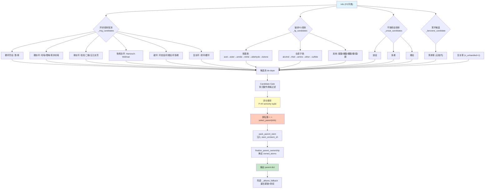
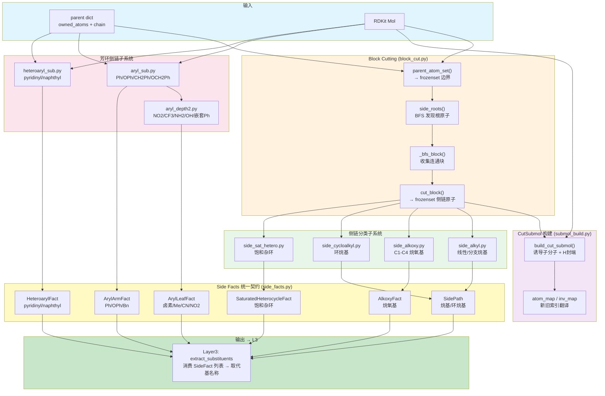
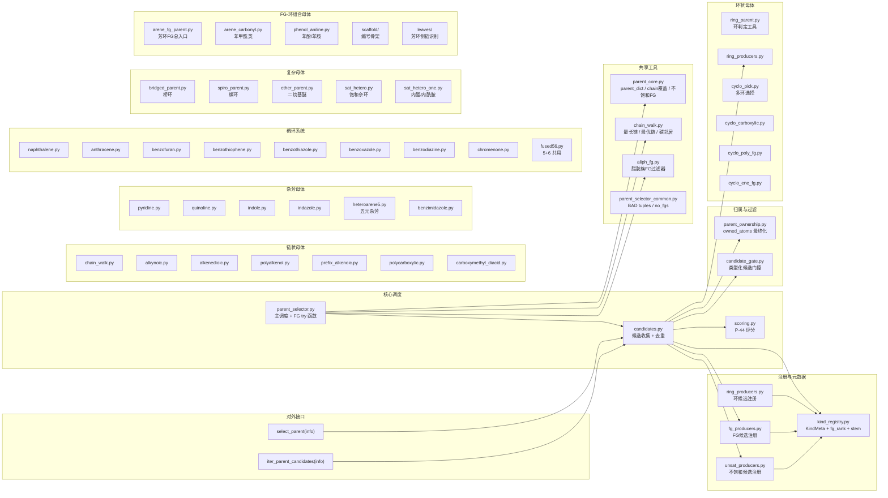
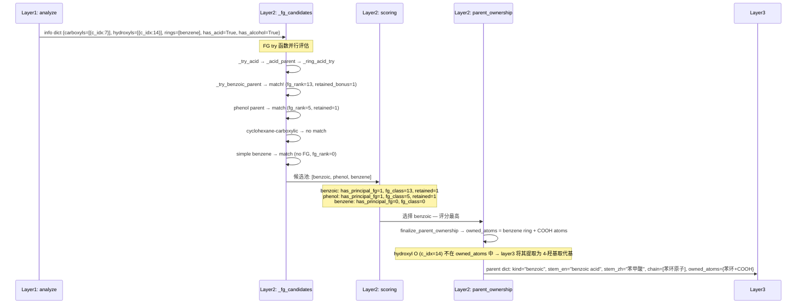

# Layer2: Parent Selector（母体选择器）

> **文件数:** ~85 source files | **代码占比:** ~60% of all project code
> **职责:** 给定 layer1 的功能团 (FG) 信息字典，选出 IUPAC 命名中的母体结构 (parent hydride)

---

## 概述

Layer2 是 NamePredict 六层流水线中体量最大、逻辑最复杂的一层。它接收 layer1 `analyze()` 产出的 FG 信息字典（包含分子中所有官能团、环系、不饱和键等的结构化描述），从中选出一个 **母体结构 (parent)**——即 IUPAC 命名中作为骨架的核心部分。母体的选择决定了后续所有层的命名方向：layer3 基于母体提取取代基，layer4 在母体骨架上编号，layer5 基于母体类型组装最终名称。

### 输入与输出

| | 类型 | 关键字段 |
|---|---|---|
| **输入 (info)** | `dict` | `mol` (RDKit Mol), `rings`, `carboxyls`, `esters`, `ketones`, `hydroxyls`, `amines`, `double_bonds`, `triple_bonds`, `has_acid`, `has_ketone`, `has_alcohol` ... 共 30+ 布尔标志 |
| **输出 (parent)** | `dict` | `chain` (原子序号列表), `kind` (母体类型), `n_carbons`, `owned_atoms` (frozenset), `stem_en`, `stem_zh`, 以及 FG 专属字段如 `cooh_c_idx`, `double_bond` 等 |

## 核心逻辑

### 候选生成架构

Layer2 不采用"if-else 短路"的单一路径选择，而是 **并行生成所有可行的母体候选，再统一评分排序**。这避免了因选择顺序错误导致的优先级问题。

核心入口在 `parent_selector.py` 和 `candidates.py`：

```
_carbonyl_parent(info)  → acid/ester/amide/anhydride → aldehyde/ketone
_hetero_parent(info)    → alcohol/thiol/amine/ether/sulfide
_fg_candidates(info)    → fg_producers 中注册的所有 FG try 函数
_ring_candidates(info)  → ring_producers 中注册的所有环 try 函数
_benzene_candidate(info)→ 苯环候选（特殊处理 n_unhandled）
_unsat_candidates(info) → alkyne/polyene/alkene
_alkane_fallback(info)  → 最终兜底（最长碳链 = 烷烃）
```

> **源:** `E:\chem\src\namepredict\layer2\candidates.py:103-106`

### Kind Registry: 母体元数据中心

`kind_registry.py` 是 Layer2 的 **单一权威注册中心 (Single Registry Authority)**，存储所有母体种类 (kind) 的元数据：

- **`KindMeta`**: 每个 kind 的评分字段 (`fg_rank`, `ring`, `n_rings`, `retained`) 和命名 stem
- **`fg_rank`**: 官能团类别优先级 (acid=13, ester=11, ketone=6, alcohol=5, amine=3...)，遵循 IUPAC P-41 优先顺序
- **`ring_try_fns()` / `fg_try_fns()` / `unsat_try_fns()`**: 三个可扩展的 try 函数注册表

注册表通过 bootstrap 模式懒加载：`ring_producers.py`、`fg_producers.py`、`unsat_producers.py` 各自在模块导入时将 try 函数注入 `kind_registry`。新增母体类别只需在这些文件中添加一个 try 函数，无需修改核心选择逻辑。

> **源:** `E:\chem\src\namepredict\layer2\kind_registry.py:7-17, 157-228`

### Try 函数注册机制

Layer2 的候选生成采用 **Bootstrap Register 模式**，将母体探测逻辑与核心调度解耦。三类母体各有独立的注册表：

| 注册表 | 存储位置 | 生产者文件 | 访问函数 |
|--------|---------|-----------|---------|
| `_RING_TRY` | `kind_registry.py:157` | `ring_producers.py` | `ring_try_fns()` |
| `_FG_TRY` | `kind_registry.py:182` | `fg_producers.py` | `fg_try_fns()` |
| `_UNSAT_TRY` | `kind_registry.py:207` | `unsat_producers.py` | `unsat_try_fns()` |

**注册流程：**

1. `ring_producers.py` 定义 `_RING_PRODUCERS` 元组（~28 个函数），在模块末尾调用 `_bootstrap()` 遍历元组，对每个函数调用 `register_ring_try(fn)` 将其追加到 `_RING_TRY` 列表
2. `fg_producers.py` 同理定义 `_FG_PRODUCERS` 元组（~30 个函数），通过 `register_fg_try(fn)` 注册
3. `unsat_producers.py` 定义 `_UNSAT_PRODUCERS`（3 个函数），通过 `register_unsat_try(fn)` 注册
4. `kind_registry` 中的 `_ensure_*_producers()` 函数采用**懒加载**——当 `candidates.py` 首次调用 `fg_try_fns()` 时，通过 `import fg_producers` 触发模块级 `_bootstrap()`，确保注册表在使用前已填充

**统一的 try 函数签名：**

```python
def _try_xxx_parent(info: dict) -> dict | None
```

每个 try 函数接收 layer1 的 info 字典，返回一个 parent dict（包含 `chain`, `kind`, `n_carbons` 等字段），或返回 `None` 表示该候选不适用。所有 try 函数在 `candidates._fg_candidates(info)` 中被并行评估：

```python
def _fg_candidates(info: dict) -> list[dict]:
    return [c for fn in _kr.fg_try_fns() if (c := fn(info)) is not None]
```

> **源:** `E:\chem\src\namepredict\layer2\candidates.py:43-44`

**具体示例：**

`_try_pyridine_parent`（`ring_producers.py:95`）检测分子是否含单一无取代吡啶环。如果 info 中的 ring_systems 包含一个六元芳环且恰好含一个氮原子，则返回 `parent_dict(ring_atoms, "pyridine")`；否则返回 `None`。

`_try_simple_carboxyl_parent`（对应 `_try_acid` 在 `fg_producers.py:56-58`）检查 `info["has_acid"]` 和 `info["carboxyls"]`，若为真则委托给 `_acid_parent(info)`。`_acid_parent` 内部先尝试环状酸母体（苯甲酸、吡啶甲酸等），再尝试链状酸：

```python
def _acid_parent_core(info: dict) -> dict | None:
    top = _ring_acid_try(info) or _poly_acid_try(info)
    if top is not None:
        return top
    ...
```

> **源:** `E:\chem\src\namepredict\layer2\parent_selector.py:343-354`

**新增母体的步骤：**
1. 在对应的 producer 文件中实现 `_try_xxx_parent(info)` 函数
2. 将其加入 `_RING_PRODUCERS` / `_FG_PRODUCERS` / `_UNSAT_PRODUCERS` 元组（**顺序很重要**——元组中靠前的函数先被评分比较）
3. 在 `kind_registry.py` 的 `_add()` 调用中声明该 kind 的 `fg_rank`、`ring`、`retained` 等元数据

这种设计确保核心调度逻辑（`candidates.py`）永远不需要修改，新母体类别通过纯注册加入。

> **源:** `E:\chem\src\namepredict\layer2\ring_producers.py:76-108`, `E:\chem\src\namepredict\layer2\fg_producers.py:200-228`, `E:\chem\src\namepredict\layer2\kind_registry.py:157-228`

### 评分体系 (P-44 Seniority)

`scoring.py` 将每个候选 parent 编码为 11 维 tuple，遵循 IUPAC P-44 的母体优先级规则（数值越大越优先）：

```python
(has_principal_fg,    # 0/1 — 是否含 Principal Characteristic Group
 fg_class_rank,       # 0-13 — FG 类别优先级
 sides_ok,            # 0/1 — 侧链是否可表达为取代基
 is_hetero_ring,      # 0/1 — 是否杂环
 is_carbo_ring,       # 0/1 — 是否碳环
 n_rings,             # 0+ — 环数
 ring_size,           # 0+ — 环原子数
 retained_bonus,      # 0/1 — 保留名加分
 n_unsat,             # 0+ — 不饱和度
 n_carbons,           # 0+ — 碳原子数
 -n_unhandled_side)   # 负值 — 未识别侧链惩罚
```

`has_principal_fg` 是最高维度——有特征官能团的母体永远优先于纯烃母体。`fg_class_rank` 决定同分子中酸 vs 酮 vs 醇的归属（例如既有 -COOH 又有 -OH 时，-COOH 优先级高，选为母体特征官能团）。`sides_ok` 确保环状母体上的侧链能被正确分类为取代基，否则降级为链状母体——这防止了"裸露环名"的产生。

`retained_bonus` 为 IUPAC 保留名（如 benzoic acid、phenol、aniline、pyridine）提供优先权，确保苯甲酸不会被选为"环己烷羧酸"。

> **源:** `E:\chem\src\namepredict\layer2\scoring.py:73-95`

### 链 vs 环决策

母体选择的核心分歧点是 **链状母体 vs 环状母体**：

1. **环优先探测:** `_ring_candidates` 遍历所有注册的环 try 函数（从高优先级稠杂环到简单环烷烃），每个函数判定分子是否匹配该环骨架。例如：
   - `_try_anthracene_parent` → 检测三环线性稠合芳碳环
   - `_try_naphthalene_parent` → 检测两环邻位稠合芳碳环
   - `_try_pyridine_parent` → 检测含氮六元芳杂环
   - `_try_simple_cycloalkane` → 检测饱和碳环

2. **链探测:** 当环候选不被评分选中或环无法承载特征官能团时，链状母体成为选择。链母体的核心算法在 `chain_walk.py`：
   - `_longest_chain(mol)`: DFS 遍历找到最长碳链
   - `_best_cover_pair(mol, atoms)`: 找到同时覆盖多个 FG 连接点的最优链
   - `_chain_through(info, fg_c)`: 从 FG 连接点出发的最长链
   - `_chain_through_bond(mol, c1, c2)`: 包含特定键（如 C=C）的最长链

   这些函数通过 `_carbon_neighbors` 获取每个碳的相邻碳原子，后者 **排除芳香碳和环碳**，确保链状母体不会错误地穿过环系统。

> **源:** `E:\chem\src\namepredict\layer2\chain_walk.py:7-70`

### FG 优先级体系

官能团优先级遵循 IUPAC P-41 降序排列，在 `kind_registry._CHAIN_FG` 中定义：

| 优先级 | FG 类别 | kind 示例 |
|--------|---------|-----------|
| 13 | 羧酸/多元羧酸 | acid, diacid, polycarboxylic |
| 12 | 酸酐/磺酸 | anhydride, sulfonic_acid |
| 11 | 酯/二酯/氨基甲酸酯 | ester, diester, carbamate |
| 10 | 酰卤 | acyl_chloride, acyl_bromide |
| 9 | 酰胺/脲/胍 | amide, urea, guanidine |
| 8 | 腈 | nitrile |
| 7 | 醛 | aldehyde |
| 6 | 酮/二酮/环酮 | ketone, dione, cycloketone |
| 5 | 醇/二醇/三醇 | alcohol, diol, triol |
| 4 | 硫醇/肼 | thiol, hydrazine |
| 3 | 胺/多胺/环胺 | amine, diamine, cycloamine |
| 2 | 醚/硫醚/亚砜 | ether, sulfide, sulfoxide |

> **源:** `E:\chem\src\namepredict\layer2\kind_registry.py:21-36`

### 多官能团母体

当分子含有同一官能团的多个实例时，Layer2 尝试将它们纳入一个"多官能团母体"：

- **二酸 (diacid):** 两个 -COOH，通过 `_best_cover_pair` 找到涵盖两端的链
- **二醇 (diol) / 三醇 (triol):** 多个 -OH，类似逻辑
- **多胺 (polyamine):** 多个 -NH2，支持 diamine/triamine/tetraamine
- **二酮 (dione):** 两个酮基
- **不饱和多元醇:** 同时含有 -OH 和 C=C，如 `_try_alkenediol_parent`

资格检查 (`_is_simple_n`) 使用"bad tuple"机制：例如二酸候选要求分子中无酯、酰胺、腈、醛等更高优先级官能团（通过 `_DIACID_BAD` 过滤），但不排斥羟基、氨基等低优先级官能团（它们将成为取代基）。

> **源:** `E:\chem\src\namepredict\layer2\parent_selector.py:55-93`

### Atom Ownership: 母体原子归属

选出母体骨架后，`parent_ownership.py` 的 `finalize_parent_ownership()` 确定 **母体"拥有"哪些原子**——即哪些原子在命名时被视为母体的一部分而非取代基。owned_atoms 是 layer3 提取取代基的关键边界：

- `_chain_atoms`: 链状母体的骨架原子
- `_acid_fg_atoms`: 羧酸的 C=O 和 C-OH 氧原子
- `_aldehyde_fg_atoms`: 醛的 C=O 氧原子
- `_amide_fg_atoms`: 酰胺的 C=O 氧和 NH2 氮原子

ownership 信息确保 layer3 只从未被拥有的原子中提取取代基。

> **源:** `E:\chem\src\namepredict\layer2\parent_ownership.py:1-80`

### 块切割与子分子构建

选出母体并确定 `owned_atoms` 后，Layer2 需要识别母体外围的侧链（即取代基候选）。`block_cut.py` 和 `submol_build.py` 提供了基于 BFS 的块切割基础设施。

**parent_atom_set —— 母体原子边界：**

`parent_atom_set(parent, mol)` 将母体的 `owned_atoms` 标准化为 `frozenset[int]`，作为块切割的不可穿越边界。该函数兼容两种场景：母体已经 finalize 过（直接从 `parent["owned_atoms"]` 取 frozenset），或尚未 finalize（调用 `finalize_parent_ownership` 补充）：

```python
def parent_atom_set(parent: dict, mol: Mol) -> frozenset[int]:
    owned = parent.get("owned_atoms")
    if isinstance(owned, frozenset):
        return owned
    return finalize_parent_ownership(parent, mol)["owned_atoms"]
```

> **源:** `E:\chem\src\namepredict\layer2\block_cut.py:9-15`

**side_roots —— BFS 发现侧链根原子：**

`side_roots(mol, parent_atoms)` 遍历每个母体原子的邻居，找出位于母体边界外且非氢的重原子。这些原子是每个侧链的 BFS 起始点（root）：

```python
def side_roots(mol: Mol, parent_atoms: frozenset[int]) -> list[int]:
    roots: set[int] = set()
    for p in parent_atoms:
        roots.update(_heavy_outside(mol, p, parent_atoms))
    return sorted(roots)
```

> **源:** `E:\chem\src\namepredict\layer2\block_cut.py:27-32`

**_bfs_block —— BFS 收集连通块：**

`_bfs_block(mol, root, parent_atoms)` 从 root 出发执行 BFS，收集所有通过非氢重原子连通且不在 parent_atoms 内的原子。BFS 在 parent_atoms 边界自动停止，确保每个块只包含一个独立侧链：

```python
def _bfs_block(mol: Mol, root: int, parent_atoms: frozenset[int]) -> set[int]:
    seen: set[int] = set()
    q: deque[int] = deque([root])
    while q:
        _visit(mol, q.popleft(), parent_atoms, seen, q)
    return seen
```

`cut_block(mol, root, parent_atoms)` 是公开接口，返回 `frozenset[int]` 或 `None`。

> **源:** `E:\chem\src\namepredict\layer2\block_cut.py:44-57`

**CutSubmol —— 诱导子分子与 H-封端：**

`submol_build.py` 定义了 `CutSubmol` 冻结数据类，用于从母体上"切下"一个侧链并构建为独立分子（用于递归命名）：

```python
@dataclass(frozen=True)
class CutSubmol:
    mol: object          # RDKit Mol, attach 处以 H 封端
    atom_map: dict[int, int]  # new_idx -> old_idx
    inv_map: dict[int, int]   # old_idx -> new_idx
    attach_new: int       # submol 中的 attach 原子索引
    attach_old: int       # 原分子中的 attach 原子索引
    atoms_old: frozenset[int]
```

`build_cut_submol(mol, atoms, attach_old)` 构建诱导子分子：复制指定原子及其键，在 attach 处用 H 填充自由价（通过 `SetNoImplicit(False)` + SanitizeMol），确保 RDKit 能正确感知化合价。`atom_map` 和 `inv_map` 提供新旧索引间的双向翻译。

> **源:** `E:\chem\src\namepredict\layer2\submol_build.py:10-70`

**递归命名流程：**

块切割 + CutSubmol 的组合使得 Layer2 能对复杂侧链进行递归命名。典型流程为：

1. `parent_atom_set(parent, mol)` 确定母体边界
2. `side_roots(mol, parent_atoms)` 发现所有根原子
3. 对每个 root，`cut_block(mol, root, parent_atoms)` 收集侧链原子集合
4. `build_cut_submol(mol, block_atoms, root)` 构建 H-封端子分子
5. 对子分子调用 `_name_mol(submol)`（回到 layer1→layer2→...→layer5 流水线）获取该侧链的完整名称
6. 通过 `atom_map` 将子分子索引翻译回原分子索引

这个机制支持任意深度的嵌套芳环侧链（Ph-O-Ph-CH2-Ph-...），受 `depth` 参数限制（默认 max_depth=3），防止无限递归。

### 保留名 (Retained Names)

IUPAC 特许某些结构使用传统保留名而非系统命名。Layer2 通过 `kind_registry._ARENE_NAMED` 注册这些保留名：

- **苯系:** benzoic acid, benzaldehyde, acetophenone, phenol, aniline, benzonitrile
- **杂环羧酸:** furancarboxylic, thiophenecarboxylic, pyridinecarboxylic, indolecarboxylic
- **饱和杂环羧酸:** piperidinecarboxylic, pyrrolidinecarboxylic, morpholinecarboxylic
- **内酯/内酰胺:** oxolanone, oxanone, pyrrolidinone, piperidinone (伪酮类，fg_rank=6)

保留名通过 `retained_bonus` 在评分中获得优先权。`ScaffoldSpec` 系统为这些保留名提供 IUPAC 编号骨架 (`numbering_scaffold`)，如 fused56 的 "1,2,3,3a,4,5,6,7,7a" 编号路径。

> **源:** `E:\chem\src\namepredict\layer2\kind_registry.py:37-73`

### Candidate Gate: 多元羧酸过滤

`candidate_gate.py` 实现了一个类型化的候选过滤系统，专门处理 **多元羧酸作用域冲突**：

- `GateScope` 定义三个作用域: `OPEN_CHAIN_POLYCARBOXYLIC`（链状多元酸）、`BENZENE_POLYCARBOXYLIC`（苯多元酸）、`CYCLOALKANE_POLYCARBOXYLIC`（环烷多元酸）
- 每个候选声明其依赖的作用域和是否为"主候选"
- `scoped_reject` 只拒绝依赖该作用域的候选，`global_reject` 拒绝全部

这防止了例如"苯三甲酸"候选与"链状三甲酸"候选同时出现导致的命名歧义。

> **源:** `E:\chem\src\namepredict\layer2\candidate_gate.py:1-68`

### Leaves: 芳环外侧链识别

`leaves/` 子模块处理芳环上的外侧链识别（Ph-X 中的 X），这是判断"simple benzene"（简单苯环，可作母体）vs "substituted benzene"（取代苯，需选其他母体）的关键：

- `LeafHandler` 协议定义 match/name 接口
- `ArylLeafKind` 枚举: 卤素、氨基、氰基、烷氧基、羟基、甲基、N-烷基、甲硫基、硝基、三氟甲基、苯基、苯氧基、苄基
- 复杂 leaves 优先匹配（OPh 先于简单醚）以正确处理嵌套芳环

> **源:** `E:\chem\src\namepredict\layer2\leaves\protocol.py:10-57`

**Leaves 匹配注册表：**

`leaves/registry.py` 维护一个按优先级排序的 handler 列表，**复杂 handler 排在简单 handler 前面**（`COMPLEX_HANDLERS + SIMPLE_HANDLERS`），确保 OPh 嵌套芳环优先于普通烷氧基匹配。`match_leaf(mol, nb, ring_i, depth)` 遍历 handler 列表，返回第一个成功的匹配。`all_outside_matched(mol, ring, attach, parent, depth)` 检查芳环上所有非 parent-link 的外侧原子是否都能被识别——这是判别 "simple benzene" 的核心条件。

> **源:** `E:\chem\src\namepredict\layer2\leaves\registry.py:12-60`

---

## 侧链事实系统 (Side Facts)

侧链事实系统是 **Layer2 与 Layer3 之间的核心数据契约**。Layer2 不仅选出母体，还负责对母体外围的每个侧链进行拓扑分类，生成类型化的 `SideFact` 数据对象供 Layer3 消费。

### AlkylShape 枚举——支链烷基的 10 种形状

`side_facts.py` 定义了 `AlkylShape` 枚举，将分支烷基侧链分为 12 种可命名的拓扑形状：

| 枚举值 | 代表结构 | 检测函数 |
|--------|---------|---------|
| `C2_VINYL` | 乙烯基 (-CH=CH2) | `_is_vinyl` |
| `C3_ALLYL` | 烯丙基 (-CH2-CH=CH2) | `_is_allyl` |
| `C3_ISOPROPENYL` | 异丙烯基 (-C(=CH2)-CH3) | `_is_isopropenyl` |
| `C3_BRANCH_AT_ROOT` | 异丙基 (-CH(CH3)2) | `_is_isopropyl` |
| `C4_BRANCH_AT_SECOND` | 仲丁基 (-CH(CH3)-CH2-CH3) | `_is_sec_butyl` |
| `C4_TRIPLE_BRANCH_AT_ROOT` | 叔丁基 (-C(CH3)3) | `_is_tert_butyl` |
| `C4_BRANCH_AFTER_ROOT` | 异丁基 (-CH2-CH(CH3)2) | `_is_isobutyl` |
| `C5_ASYMMETRIC_ROOT_BRANCH` | 2-甲基丁-2-基 | `_is_2_methylbutan_2_yl` |
| `C5_PRENYL` | 异戊二烯基 | `_is_prenyl` |
| `C5_BRANCH_NEAR_LEAF` | 异戊基 | `_is_isopentyl` |
| `C5_DOUBLE_BRANCH_AFTER_ROOT` | 新戊基 (-CH2-C(CH3)3) | `_is_neopentyl` |
| `C1_THREE_HALOGEN_LEAVES` | 三氟甲基 (-CF3) | `_is_trifluoromethyl` |

每个形状对应 `_SHAPE_MATCHERS` 字典中的一个检测函数 `(mol, root, parent_set) -> list[int] | None`，返回从 root 出发的碳原子路径或 `None`。

> **源:** `E:\chem\src\namepredict\layer2\side_facts.py:17-29, 115-128`

### 侧链分类子系统

侧链分类由四个独立模块协作完成：

1. **`side_alkyl.py`** — 纯碳烷基侧链的系统识别。核心工具函数：
   - `_c_neighbors(mol, idx)`: 获取碳原子的非氢碳邻居
   - `_walk_linear_n(mol, root, parent, limit)`: BFS 走最长线性碳链（最多 12 个碳）
   - `_is_cf3_carbon(mol, idx)`: 检测 CF3 碳（四取代碳、恰好 3 个氟）
   - `_is_omega_halo_c(mol, idx)`: 检测 ω-卤代末端碳
   - 各分支检测函数（`_is_isopropyl`, `_is_tert_butyl`, `_is_sec_butyl` 等）通过 `_free_neighbors` 和 `_nb_kind` 对碳骨架进行拓扑匹配

2. **`side_alkoxy.py`** — 烷氧基侧链分类（-O-R）。`_outer_alkoxy_n(mol, root, oxygen)` 识别与 ring-O 连接的线性烷基长度（C1-C4），返回碳数 code。

3. **`side_cycloalkyl.py`** — 环烷基侧链分类。`_is_monocycloalkyl(mol, root, parent)` 检测与母体直接相连的单环环烷基。

4. **`side_sat_hetero.py`** — 饱和杂环侧链分类。`_sat_hetero_rings(mol)` 枚举分子中所有饱和杂环，`_exo_only_parent(mol, ring, root, parent)` 检查杂环是否仅通过 root 与母体相连。

> **源:** `E:\chem\src\namepredict\layer2\side_alkyl.py:1-100`, `E:\chem\src\namepredict\layer2\side_facts.py:11-12`

### SideFact 类型体系

`side_facts.py` 定义了 5 种核心事实类型，覆盖所有可能的侧链拓扑：

| SideFact 类型 | 关键字段 | 用途 |
|--------------|---------|------|
| `SidePath` | `root`, `atoms: tuple[int, ...]` | 线性/分支烷基侧链 |
| `AlkoxyFact` | `root`, `oxygen`, `code`, `atoms` | 烷氧基侧链 (C1-C4) |
| `ArylArmFact` | `kind: ArylArmKind`, `attachment`, `outer`, `ring`, `atoms` | 芳环侧链 (Ph/OPh/CH2Ph/OCH2Ph) |
| `HeteroarylFact` | `kind: HeteroarylKind`, `attachment`, `ring`, `locant`, `leaves` | 杂芳环侧链 (pyridinyl/naphthyl) |
| `SaturatedHeterocycleFact` | `root`, `ring`, `signature` | 饱和杂环侧链 |
| `ArylLeafFact` | `kind: ArylLeafKind`, `site`, `atoms`, `child_ring`, `child_attach` | 芳环上的单原子/小基团取代 |
| `CarboxyalkylArm` | `attachment`, `atoms`, `carboxyl` | 羧烷基臂 (如 -CH2-COOH) |

`ArylArmKind` 枚举区分四种芳基连接方式：`DIRECT_C` (Ph-), `METHYLENE_C` (Ph-CH2-), `DIRECT_O` (Ph-O-), `O_METHYLENE_C` (Ph-CH2-O-)。`HeteroarylKind` 枚举区分 `SIX_MEMBER_ONE_N`（吡啶基）与 `FUSED_TEN_MEMBER_C`（萘基）。

> **源:** `E:\chem\src\namepredict\layer2\side_facts.py:32-113`

### L2-to-L3 数据流

`side_facts.py` 提供一系列工厂函数将原始检测结果封装为类型化事实：

```
aryl_arms(info, parent)     → list[ArylArmFact]  (Ph/OPh/CH2Ph/OCH2Ph)
pyridinyl_facts(mol, parent)→ list[HeteroarylFact]
naphthyl_facts(mol, parent) → list[HeteroarylFact]
linear_alkyl(mol, root, p)  → SidePath | None
alkyl_shape(mol, root, p, s)→ SidePath | None
outer_alkoxy(mol, root, o)  → AlkoxyFact | None
cycloalkyl_side(mol, root, p)→ SidePath | None
saturated_heterocycle_side(mol, root, p) → SaturatedHeterocycleFact | None
carboxyalkyl_arms(mol, chain, acids) → tuple[CarboxyalkylArm, ...]
```

Layer3 调用这些工厂函数，获得类型化的事实列表后，直接进行名称组装——Layer3 不需要关心侧链的检测逻辑细节，只需消费事实数据。

> **源:** `E:\chem\src\namepredict\layer2\side_facts.py:174-302`

---

## 芳环侧链深度处理

芳环侧链识别是 Layer2 中体量最大的子系统之一，涉及多个文件协作处理 Ph、OPh、CH2Ph、OCH2Ph 及其嵌套变体。

### aryl_sub.py —— 芳环取代基计数与分类

`aryl_sub.py` 是芳环侧链处理的核心入口，负责：

**四种芳环连接方式的检测：**

| 函数 | 检测目标 | 连接方式 |
|------|---------|---------|
| `_phenyl_at(mol, attach, parent)` | 直接苯基 (Ph-) | C(sp2)-C(arom) 直接键 |
| `_ch2_ph_at(mol, ch2, parent)` | 苄基 (Ph-CH2-) | 通过 sp3 CH2 桥接 |
| `_phenoxy_from_ether(mol, e, parent)` | 苯氧基 (Ph-O-) | 通过醚氧桥接 |
| `_benzyloxy_from_ether(mol, e, parent)` | 苄氧基 (Ph-CH2-O-) | 通过 O-CH2 桥接 |

> **源:** `E:\chem\src\namepredict\layer2\aryl_sub.py:90-95, 286-315`

**卤素/甲基/CN/NO2/CF3 计数：**

`_count_side_leaves(mol, ring, attach, parent)` 遍历芳环上的每个外侧原子，通过 `_side_leaf_kind` 分类为 halo/me/cn/nitro/cf3/alkoxy/phenyl 等，要求叶节点总数不超过 3（IUPAC P-29.3 允许的最多取代数）。该函数排除 parent link 所在位置的原子，确保母体连接点不被计数为取代基。

`_side_ok(mol, ring, attach, parent)` 是最终判定——返回 `True` 当且仅当所有外侧原子均可识别且总数不超过 3。

> **源:** `E:\chem\src\namepredict\layer2\aryl_sub.py:72-88`

**_classify_ph_arm —— 芳环武器分类：**

`_phenyl_name(mol, ph, attach)` 通过递归调用 `_recursive_ph_name`（来自 `leaves/ring_namer.py`）获取芳环的完整命名前缀（包含 halogeno/methyl/nitro 等所有取代基的定位编号）。`_arm_parent_of` 识别芳环与母体的连接点，确保递归命名时知道哪个位置是"外侧"。

> **源:** `E:\chem\src\namepredict\layer2\aryl_sub.py:235-246`

### aryl_depth2.py —— 二级深度芳环处理

当芳环上的取代基本身也是复杂基团（而非简单的 Cl 或 Me）时，`aryl_depth2.py` 提供深度-2 处理：

- **`_d2_sites(mol, ring, nb_outside, attach)`** —— 收集芳环上所有二级取代位点（硝基、羟基、氨基、CF3、嵌套苯基、烷氧基）。返回 `list[int]`（ring atom indices）。
- **`_depth2_atoms_on(mol, ring, attach)`** —— 收集二级取代基涉及的所有原子（用于后续 ownership 计算）。
- **`_d2_pref_parts(mol, ring, attach, locant_fn, nb_outside)`** —— 生成二级取代基的命名前缀，按优先级排序：amino, alkoxy, halo, hydroxy, methyl, nitro, phenyl, CF3。通过 `_join_pref` 用 "-" 连接各部分。

> **源:** `E:\chem\src\namepredict\layer2\aryl_depth2.py:136-216`

**二级取代基种类检测：**

| 函数 | 检测目标 | 判定逻辑 |
|------|---------|---------|
| `_is_terminal_nitro(atom)` | -NO2 | N 连接两个双键 O + 一个 C |
| `_is_terminal_oh(nb, ring_i)` | 酚羟基 | O 仅连接 ring C |
| `_is_terminal_nh2(nb, ring_i)` | 芳胺基 | N 仅连接 ring C |
| `_is_cf3_leaf(mol, c_idx, ring_i)` | -CF3 | C 连接 3 个 F + 1 个 ring C |
| `_is_nested_phenyl(mol, nb, ring_i)` | 嵌套 Ph | arom C 连接另一个 C6 芳环 |
| `_alkoxy_n(mol, o_atom, ring_i)` | C1-C4 烷氧基 | 醚 O 连接线性烷基 |

> **源:** `E:\chem\src\namepredict\layer2\aryl_depth2.py:30-133`

### 深度限制与递归防护

芳环嵌套可能无限递归（如 `Ph-Ph-Ph-...`）。系统通过 `depth` 参数控制最大递归深度：

- `match_leaf(mol, nb, ring_i, depth)` 在 `depth >= 3` 时跳过 `complex` handler（`leaves/registry.py:19`），只允许简单 leaves（卤素、甲基等）
- `aryl_recurse.py` 在每个递归层级递增 depth 并检查上限
- 默认 max_depth=3，对应 IUPAC 命名中常见的 Ph-O-Ph-CH2- 三层嵌套

> **源:** `E:\chem\src\namepredict\layer2\leaves\registry.py:16-23`

### heteroaryl_sub.py —— 杂芳环侧链

当母体是链状结构时，杂芳环（如吡啶基、萘基）可以作为侧链取代基出现。`heteroaryl_sub.py` 处理两种杂芳基：

**吡啶基 (pyridin-n-yl):**
- `_is_pyridine_ring(mol, r)`: 检测六元芳环恰好含一个 N
- `_ring_order(mol, ring, attach)`: 以 N=1 为起点走环，选择使 attach 位获得最低定位的环形走方向
- `_leaf_items(mol, ring, attach, parent, order)`: 收集吡啶环上的取代基（halo/Me/methoxy/ethoxy，最多 3 个）
- `ring_pyridinyls(mol, parent)`: 返回所有吡啶基侧链的完整描述（含命名前缀）

**萘基 (naphthalen-n-yl):**
- `_naph_core(mol)`: 通过遍历所有六元环对，检测邻位稠合的 10 原子芳碳环系
- `_naph_ready(mol, start, att)`: 验证萘核无取代（仅 parent link 为外侧重原子）
- `ring_naphthyls(mol, parent)`: 返回所有萘基侧链

> **源:** `E:\chem\src\namepredict\layer2\heteroaryl_sub.py:21-341`

### aryl_stem.py —— 芳环命名 stem 生成

`aryl_stem.py` 提供 `with_aryl_names(side, mol, c_idx, parent)` 接口，将芳环侧链的检测结果注入 EN/ZH 名称字段。内部调用 `_phenyl_at` 和 `_phenyl_name` 获取完整的苯基命名（含取代基前缀），为 Layer5 的最终名称组装准备数据。

> **源:** `E:\chem\src\namepredict\layer2\aryl_stem.py:1-31`

---

## 桥环与螺环母体

### 桥环母体 (von Baeyer bicyclo[x.y.z]alkane)

`bridged_parent.py` 实现饱和全碳双环桥环体系的母体识别（IUPAC P-23），当前 R1 范围覆盖双环桥环，杂原子/不饱和/多环桥环延后处理。

**检测流程：**

1. `_is_simple_bridged(info)`: 遍历 layer1 输出的 `ring_systems`，检查 `topology == "bridged"` 且 `n_rings == 2` 且无杂原子/芳香性
2. `_bicyclo_stems(bridge_lengths)`: 将桥长降序排列生成 `bicyclo[2.2.1]` / `双环[2.2.1]` 前缀
3. `_build_bridged_parent(br)`: 调用 `_parent_dict` 构建 parent dict，附加 `bridge_lengths`, `bridgeheads`, `bridge_paths` 字段

```python
def _try_bridged_parent(info: dict) -> dict | None:
    br = _is_simple_bridged(info)
    return None if br is None else _build_bridged_parent(br)
```

母体 dict 的 `kind` 为 `"bridged"`，`stem_en`/`stem_zh` 包含完整前缀。桥头原子和桥路径信息传递给 layer4 用于编号。

> **源:** `E:\chem\src\namepredict\layer2\bridged_parent.py:1-43`

### 螺环母体 (spiro[x.y]alkane)

`spiro_parent.py` 实现饱和全碳单螺环体系的母体识别（IUPAC P-24.2.1），当前 R1 范围覆盖两个单环组分的螺环。

**检测流程：**

1. `_is_simple_spiro(info)`: 遍历 `ring_systems`，检查 `topology == "spiro"` 且 `n_rings == 2` 且全碳饱和
2. `_spiro_stems(ring_sizes)`: 生成 `spiro[4.5]` / `螺[4.5]` 前缀
3. `_try_spiro_parent(info)`: 构建 parent dict，kind=`"spiro"`，附加 `ring_sizes` 字段

```python
def _try_spiro_parent(info: dict) -> dict | None:
    sp = _is_simple_spiro(info)
    if sp is None:
        return None
    ...
    return _parent_dict(sp["atom_ids"], "spiro",
                        stem_en=stem_en, stem_zh=stem_zh, ring_sizes=sorted(sizes))
```

> **源:** `E:\chem\src\namepredict\layer2\spiro_parent.py:1-41`

**注册方式：** 两个函数均通过 `ring_producers.py` 注册到 `_RING_TRY` 列表（`ring_producers.py:106-107`），在 `_ring_candidates(info)` 中被评估。桥环和螺环的 try 函数位于 `_RING_PRODUCERS` 元组的末尾，优先级低于芳环和杂环母体。

---

## 数据流图

### 母体选择决策树



### 块切割与侧链事实流水线



### 模块组织架构



### 流水线集成


### 完整走查: 对羟基苯甲酸 (4-hydroxybenzoic acid)

以下以一个具体的中文化学命名示例——对羟基苯甲酸（4-hydroxybenzoic acid，SMILES: `O=C(O)c1ccc(O)cc1`）——展示 Layer2 的端到端处理流程。



**Step-by-step 详解：**

**Step 1: Layer1 输出 info dict**

```python
info = {
    "mol": <RDKit Mol>,
    "rings": [{"atom_ids": [0,1,2,3,4,5], "aromatic": True}],
    "carboxyls": [{"c_idx": 7, "o_idx": 8, "oh_idx": 9}],  # -COOH on C1
    "hydroxyls": [{"c_idx": 14, "o_idx": 15}],              # -OH on C4
    "has_acid": True,
    "has_alcohol": True,
    "has_ring": True,
    ...
}
```

**Step 2: 候选生成 (`_collect_candidates`)**

`_fg_candidates(info)` 遍历 `fg_try_fns()` (~30 个函数)，返回所有匹配的 FG 母体候选。对于对羟基苯甲酸：

| try 函数 | 结果 | kind | fg_rank |
|---------|------|------|---------|
| `_try_acid` → `_ring_acid_try` → `_try_benzoic_parent` | match | benzoic | 13 |
| `_try_alcohol` → phenols try | match | phenol | 5 |
| `_try_amine` → no amine | None | - | - |

`_ring_candidates(info)` 遍历 `ring_try_fns()` (~28 个函数)：

| try 函数 | 结果 | kind |
|---------|------|------|
| `_try_simple_benzene` | match | benzene |

候选池去重后: `[benzoic, phenol, benzene]`

**Step 3: 评分排序**

`scoring._score_parent` 对每个候选计算 11 维 tuple：

| 候选 | has_fg | fg_class | sides_ok | retained | ... | 总分 tuple |
|------|--------|----------|----------|----------|-----|-----------|
| benzoic | 1 | 13 | 1 | 1 | ... | (1, 13, 1, 0, 0, 1, 6, 1, ...) |
| phenol | 1 | 5 | 1 | 1 | ... | (1, 5, 1, 0, 0, 1, 6, 1, ...) |
| benzene | 0 | 0 | 1 | 0 | ... | (0, 0, 1, 0, 0, 1, 6, 0, ...) |

benzoic 的 fg_class_rank=13（酸）高于 phenol 的 fg_class_rank=5（醇），符合 IUPAC P-41 的官能团优先顺序。benzoic 胜出。

**Step 4: pack_parent_stem + finalize_parent_ownership**

- `pack_parent_stem` 从 `kind_registry` 查找 benzoic 的元数据，注入 `stem_en="benzoic acid"`, `stem_zh="苯甲酸"`
- `finalize_parent_ownership` 确定 owned_atoms: 苯环的 6 个碳原子 + COOH 的 C(=O)OH（c_idx=7, o_idx=8, oh_idx=9）。羟基氧原子 (c_idx=14, o_idx=15) **不在 owned_atoms 中**

**Step 5: 输出 parent dict**

```python
parent = {
    "kind": "benzoic",
    "chain": [0, 1, 2, 3, 4, 5],  # 苯环碳原子
    "n_carbons": 7,
    "owned_atoms": frozenset({0,1,2,3,4,5, 7,8,9}),
    "stem_en": "benzoic acid",
    "stem_zh": "苯甲酸",
    "cooh_c_idx": 7,
    "fg_rank": 13,
    "retained": True,
}
```

Layer3 接收 parent dict 后，遍历所有非 owned_atoms 的重原子（o_idx=15 和 c_idx=14），通过 side_facts 系统将其分类为羟基取代基，通过 aryl_sub 系统确定其定位为 4-位（COOH 在 1-位），最终 layer5 组装为 "4-hydroxybenzoic acid" / "4-羟基苯甲酸"。

---

## 文件清单

### 核心调度 (Core Dispatch)

| 文件 | 职责 |
|------|------|
| `parent_selector.py` | **主文件**: select_parent, iter_parent_candidates, 所有 FG try 函数 (~542 lines) |
| `candidates.py` | 候选收集 (_collect_candidates), FG/ring/unsat 三类候选并行生成 |
| `scoring.py` | P-44 评分 tuple, _better_parent, _pick_best |
| `parent_core.py` | 共享工具: _parent_dict, _best_cover_pair, _fg_chain, _is_open_sat, _covers |
| `parent_selector_common.py` | BAD tuple 常量 (_CORE_BAD, _DIOL_BAD, _DIACID_BAD, _DIONE_BAD...) |
| `__init__.py` | 导出 `select_parent` |

### 注册与元数据 (Registry & Metadata)

| 文件 | 职责 |
|------|------|
| `kind_registry.py` | KindMeta 注册中心, fg_rank, stem, ring 元数据 |
| `ring_producers.py` | 环候选 try 函数注册表 (~28 entries) |
| `fg_producers.py` | FG 候选 try 函数注册表 (~30 entries) |
| `unsat_producers.py` | 不饱和母体 try 函数注册表 (3 entries) |

### 块切割与侧链事实 (Block Cutting & Side Facts)

| 文件 | 职责 |
|------|------|
| `block_cut.py` | BFS 块切割: parent_atom_set, side_roots, _bfs_block, cut_block |
| `submol_build.py` | CutSubmol 数据类 + build_cut_submol (H封端诱导子分子) |
| `side_facts.py` | **L2→L3 数据契约**: AlkylShape/ArylArmKind/HeteroarylKind 枚举 + 5 种 SideFact 类型 + 工厂函数 |
| `side_alkyl.py` | 单烷基侧链拓扑: 线性 C1-C4 + 保留分支烷基 (异丙基/叔丁基等 12 种) |
| `side_alkyl_sys.py` | 纯饱和碳侧链树: RootedAlkylTree 数据类 + BFS 树构建 |
| `side_alkoxy.py` | 烷氧基侧链分类 (C1-C4 线性烷氧基) |
| `side_cycloalkyl.py` | 单环环烷基侧链分类 |
| `side_sat_hetero.py` | 饱和杂环侧链处理 |

### 芳环侧链子系统 (Aryl Side-Chain Subsystem)

| 文件 | 职责 |
|------|------|
| `aryl_sub.py` | 芳环侧链核心: Ph/OPh/CH2Ph/OCH2Ph 检测, 卤素/Me 计数, _classify_ph_arm |
| `aryl_depth2.py` | 二级芳环处理: NO2/CF3/NH2/OH/嵌套Ph/烷氧基 site 检测 + 前缀生成 |
| `aryl_recurse.py` | 芳环递归命名深度限制器 |
| `aryl_stem.py` | 芳环 stem 生成: with_aryl_names, aryl_en_zh |
| `heteroaryl_sub.py` | 杂芳环侧链: pyridin-n-yl (含 halo/Me/alkoxy leaves), naphthalen-n-yl |

### 链状母体 (Chain Parents)

| 文件 | 职责 |
|------|------|
| `chain_walk.py` | 碳链 DFS 遍历: _longest_chain, _longest_from, _best_cover_pair, _chain_through |
| `aliph_fg.py` | 脂肪族 FG 过滤器: _aliphatic_entries, _aliph_c_idxs |
| `alkynoic.py` | 不饱和醇/炔醇/炔酸的链-环分派 |
| `alkenedioic.py` | 烯二酸母体 |
| `polyalkenol.py` | 多烯醇母体 |
| `prefix_alkenoic.py` | 前缀烯酸母体 |
| `polycarboxylic.py` | 多元羧酸母体 (三酸及以上) |
| `carboxymethyl_diacid.py` | 羧甲基二酸特殊母体 |
| `alkenamide.py` | 烯酰胺母体 |

### 环状母体 (Ring Parents)

| 文件 | 职责 |
|------|------|
| `ring_parent.py` | 环判定: _is_simple_benzene, _is_simple_cycloalkane, _endocyclic_double, side chain 校验 |
| `cyclo_pick.py` | 多环环烷烃选择: _cyclo_parent_candidates |
| `cyclo_carboxylic.py` | 环烷甲酸母体 |
| `cyclo_poly_fg.py` | 环烷二醇/二酮母体 |
| `cyclo_ene_fg.py` | 环烯醇/环烯酮母体 |
| `cyclo_polycarboxylic.py` | 环烷多元羧酸母体 |

### 杂芳母体 (Heteroaryl Parents)

| 文件 | 职责 |
|------|------|
| `pyridine.py` | 吡啶 / 吡啶甲酸 / 吡啶胺 / 吡啶酚 / 吡啶甲腈 |
| `quinoline.py` | 喹啉 / 异喹啉 / 喹啉甲酸 / 喹啉酚 / 喹啉二醇 |
| `indole.py` | 吲哚 / 吲哚甲酸 |
| `indazole.py` | 吲唑 / 吲唑甲醛 / 吲唑甲腈 |
| `heteroarene5.py` | 五元杂芳通用: 呋喃/噻吩/吡咯/咪唑/吡唑/二嗪/嘧啶胺 |
| `benzimidazole.py` | 苯并咪唑 / 苯并咪唑胺 |
| `azole13.py` | 1,3-唑通用: 噻唑/噁唑 |

### 稠环系统 (Fused Systems)

| 文件 | 职责 |
|------|------|
| `naphthalene.py` | 萘 / 萘甲酸 / 萘酚 / 萘二酚 |
| `anthracene.py` | 蒽母体 |
| `anthraquinone.py` | 蒽醌母体 |
| `benzoquinone.py` | 苯醌母体 |
| `benzofuran.py` | 苯并呋喃 / 苯并呋喃胺 |
| `benzothiophene.py` | 苯并噻吩 / 苯并噻吩酚 |
| `benzothiazole.py` | 苯并噻唑 / 苯并噻唑胺 |
| `benzoxazole.py` | 苯并噁唑 / 苯并噁唑胺 |
| `benzodiazine.py` | 喹唑啉 / 喹喔啉 |
| `chromenone.py` | 色酮 (chromenone) 母体 |
| `fused56.py` | 5+6 稠环通用: _fused_56_pair, _fused56 |

### 复杂母体 (Complex Parents)

| 文件 | 职责 |
|------|------|
| `bridged_parent.py` | 桥环 (von Baeyer): bicyclo[x.y.z] 母体 |
| `spiro_parent.py` | 螺环: spiro[x.y] 母体 |
| `ether_parent.py` | 二烷基醚母体 (线性 + 异丙基/HFIP 特殊支链) |
| `sat_hetero.py` | 饱和单杂环 Hantzsch-Widman: aziridine, oxirane, oxolane, piperidine, morpholine... |
| `sat_hetero_one.py` | 内酯/内酰胺: oxolanone, pyrrolidinone, piperidinone |
| `sat_hetero_carboxylic.py` | 饱和杂环甲酸 |

### FG-环组合母体 (FG-as-Parent)

| 文件 | 职责 |
|------|------|
| `arene_fg_parent.py` | **芳环 FG 母体总入口**: 数据驱动匹配 OH/NH2/CHO/CN 在任意芳环上 |
| `arene_carbonyl.py` | 苯甲酸/苯甲醛/苯乙酮/苯甲酸酯/苯多元酸 |
| `phenol_aniline.py` | 苯酚/苯胺母体 |
| `benzenediamine.py` | 苯二胺母体 |
| `boronic.py` | 苯基硼酸母体 |

### 其他 FG 母体

| 文件 | 职责 |
|------|------|
| `carbamate.py` | 氨基甲酸酯母体 |
| `carbonate.py` | 碳酸酯母体 |
| `diester.py` | 二酯母体 |
| `guanidine.py` | 胍母体 |
| `hydrazine.py` | 肼母体 |
| `isocyanate.py` | 异氰酸酯/异硫氰酸酯母体 |
| `phosphate.py` | 磷酸酯/膦酸母体 |
| `sulfonamide.py` | 磺酰胺母体 |
| `sulfonate.py` | 磺酸酯母体 |
| `sulfone.py` | 砜母体 |
| `sulfonic_acid.py` | 磺酸母体 |
| `sulfonyl_chloride.py` | 磺酰氯母体 |
| `sulfoxide.py` | 亚砜母体 |
| `urea.py` | 脲母体 |
| `hetero5_carboxylic.py` | 五元杂环甲酸 |

### Scaffold 子模块

| 文件 | 职责 |
|------|------|
| `scaffold/specs.py` | `ScaffoldSpec` 定义: 编号骨架 (fused56/naph/monohetero/mono_carbo) |
| `scaffold/builders/__init__.py` | builders 入口 |
| `scaffold/builders/fused56.py` | 5+6 稠环编号骨架构建 |
| `scaffold/builders/carbocycle.py` | 碳环编号骨架构建 |
| `scaffold/builders/sat_hetero_repl.py` | 饱和杂环 replacement 命名 |
| `scaffold/sat_hetero_stem.py` | 饱和杂环 stem 生成 |
| `scaffold/hetero_a_names.py` | 杂环 "a" 命名法 |

### Leaves 子模块 (芳环侧链)

| 文件 | 职责 |
|------|------|
| `leaves/protocol.py` | `LeafHandler` 协议 + `ArylLeafKind` 枚举 |
| `leaves/registry.py` | Leaf 匹配注册表 (复杂 → 简单) |
| `leaves/simple.py` | 简单 leaves: 卤素, 甲基, 羟基, 氰基, 硝基, CF3, N-烷基, 甲硫基 |
| `leaves/complex_h.py` | 复杂 leaves: 苯基, 苯氧基, 苄基 (支持嵌套) |
| `leaves/ring_namer.py` | 递归苯环命名 |
| `leaves/topo.py` | 拓扑工具: nb_out |

### 辅助文件

| 文件 | 职责 |
|------|------|
| `parent_ownership.py` | 母体原子归属最终化 |
| `candidate_gate.py` | 类型化候选门控 (多元酸作用域) |
| `claimable_block.py` | ClaimedBlock / SideSlot 类型定义 |
| `benzene_pick.py` | 多苯环选择 |

---

## 对外接口

### 公共 API

```python
def select_parent(info: dict) -> dict
```
选择单一最优母体。实际实现为 `iter_parent_candidates(info)[0]`。返回的 parent dict 包含 `chain`（骨架原子序号）、`kind`（母体类型）、`owned_atoms`（母体拥有的原子集合）、`stem_en`/`stem_zh` 等字段。layer5 和 layer3/layer4 均通过此 parent dict 获取后续命名所需的全部信息。

> **源:** `E:\chem\src\namepredict\layer2\parent_selector.py:539-541`

```python
def iter_parent_candidates(info: dict) -> list[dict]
```
返回所有排名的母体候选列表，每个候选经过 `pack_parent_stem` 注入 stem 名称和 `finalize_parent_ownership` 确定原子归属。列表按评分降序排列，首个元素即为最优母体。调用方式: `namer.py` 中 `_run_candidates` 在 depth=0 时遍历候选列表进行完整覆盖尝试。

> **源:** `E:\chem\src\namepredict\layer2\parent_selector.py:532-536`

### 关键内部类型

| 类型 | 位置 | 说明 |
|------|------|------|
| `KindMeta` | `kind_registry.py:7-15` | 母体种类元数据: fg_rank, ring, n_rings, retained, en/zh stem |
| `ScaffoldSpec` | `scaffold/specs.py:17-28` | 编号骨架定义: naming_class, stem, NumberingPolicy |
| `CandidateGate` | `candidate_gate.py:20-30` | 候选门控: GateStatus + GateScope + reason |
| `LeafTopology` | `leaves/protocol.py:26-35` | 芳环侧链拓扑: kind, site, atoms, value |
| `NameResult` | `types.py:6-13` | 最终命名结果: en, zh, success, meta |
| `AlkylShape` | `side_facts.py:17-29` | 烷基侧链形状枚举 (12 种分支拓扑) |
| `ArylArmKind` | `side_facts.py:32-36` | 芳基连接方式枚举 (DIRECT_C/METHYLENE_C/DIRECT_O/O_METHYLENE_C) |
| `HeteroarylKind` | `side_facts.py:39-41` | 杂芳基种类枚举 (SIX_MEMBER_ONE_N/FUSED_TEN_MEMBER_C) |
| `SidePath` | `side_facts.py:73-76` | 侧链原子路径: root + atoms tuple |
| `ArylArmFact` | `side_facts.py:79-86` | 芳基臂事实: kind, attachment, outer, bridge, ring, atoms |
| `CutSubmol` | `submol_build.py:10-17` | 诱导子分子: mol, atom_map, inv_map, attach 索引 |
| `RootedAlkylTree` | `side_alkyl_sys.py:10-15` | 有根烷基树: root, atoms, children, depth |

---

## 相关页面

- [[layer1-analyzer]] — Layer2 的上游，产出 FG info dict
- [[layer3-substituent-extractor]] — 使用 parent.owned_atoms 提取取代基
- [[layer4-numbering]] — 使用 parent.chain + kind 编号
- [[layer5-assembler]] — 使用 parent.kind + stem 组装名称
- [[system-architecture]] — 系统架构概述
