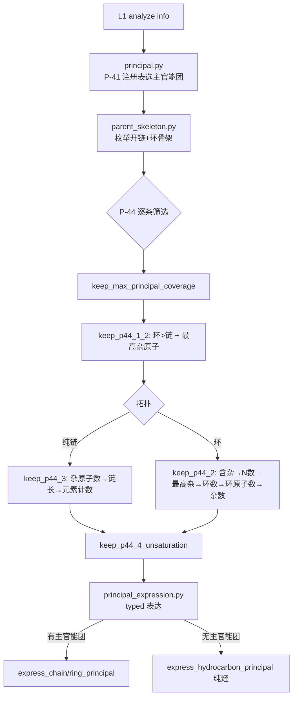
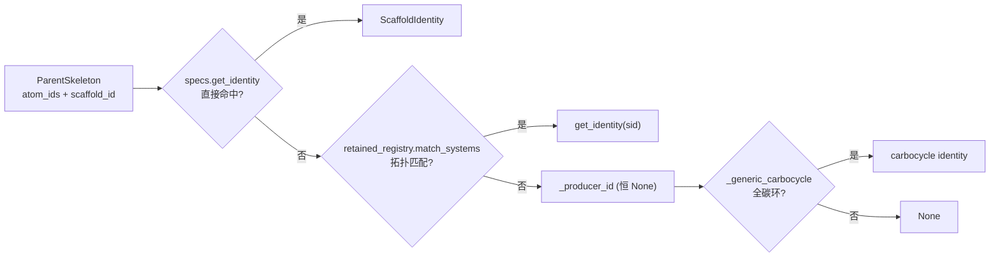
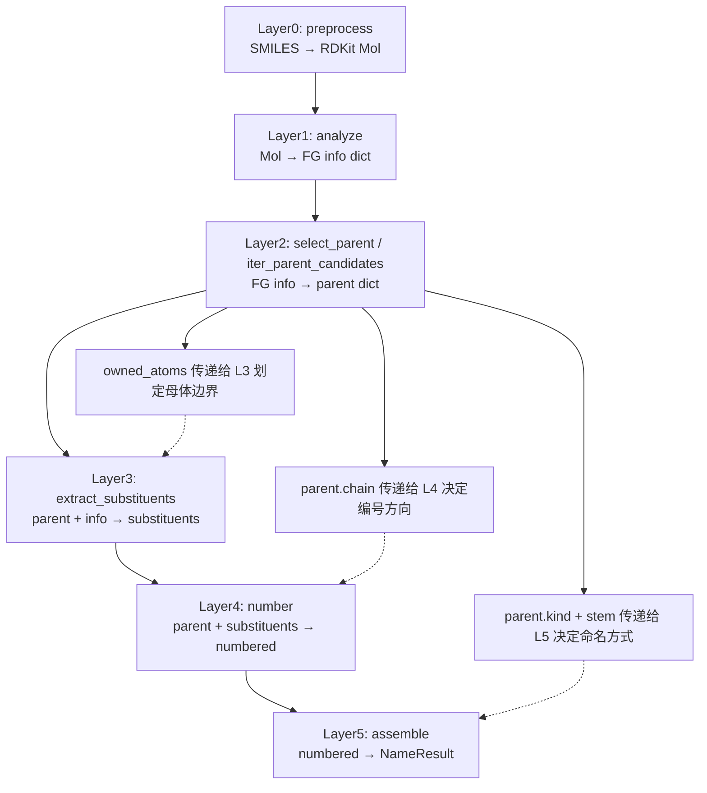
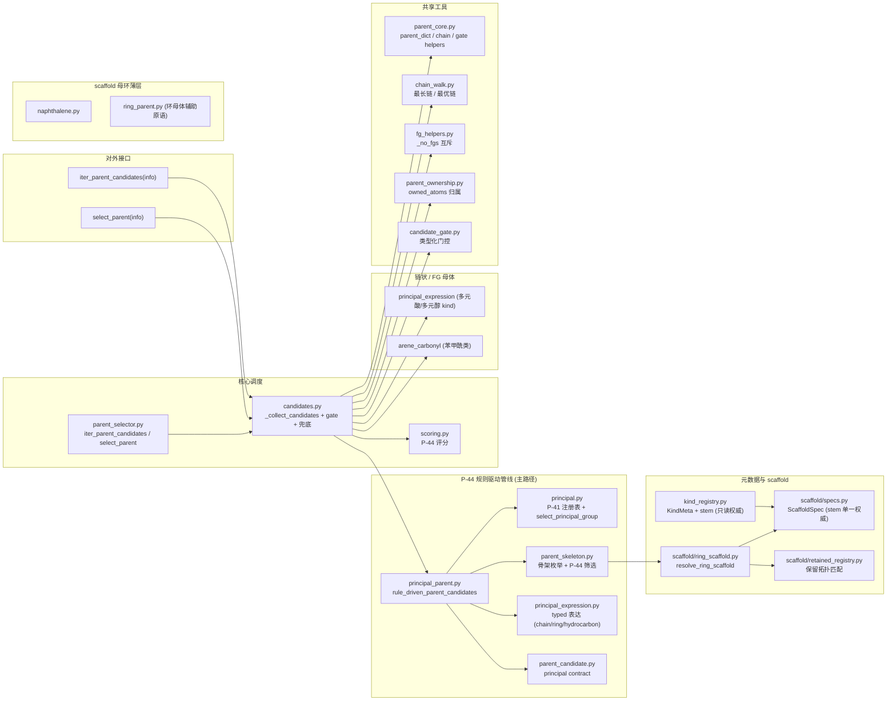

# Layer2: Parent Selector（母体选择器）

> **文件数:** 25 source files（layer2 17 + scaffold 8）| **代码:** 2,728 行（约全项目 22%）
> **职责:** 给定 layer1 的官能团 (FG) 信息字典，按 IUPAC P-44 选出母体结构 (parent hydride)

---

## 概述

Layer2 是 NamePredict 六层流水线中逻辑最复杂的一层。它接收 layer1 `analyze()` 产出的 FG 信息字典（包含分子中所有官能团、环系、不饱和键等的结构化描述），从中选出一个 **母体结构 (parent)**——即 IUPAC 命名中作为骨架的核心部分。母体的选择决定了后续所有层的命名方向：layer3 基于母体提取取代基，layer4 在母体骨架上编号，layer5 基于母体类型组装最终名称。

### 输入与输出

| | 类型 | 关键字段 |
|---|---|---|
| **输入 (info)** | `dict` | `mol` (RDKit Mol), `rings`, `ring_systems`, `carboxyls`, `esters`, `ketones`, `hydroxyls`, `amines`, `double_bonds`, `triple_bonds`, `has_acid`, `has_ketone`, `has_alcohol` ... 共 30+ 布尔标志 |
| **输出 (parent)** | `dict` | `chain` (原子序号列表), `kind` (母体类型), `n_carbons`, `owned_atoms` (frozenset), `stem_en`, `stem_zh`, `scaffold_id`, `principal_expression_facts`, 以及 FG 专属字段如 `cooh_c_idx`, `double_bond` 等 |

## 核心逻辑

### 候选生成架构

Layer2 采用 **P-44 规则驱动主链管线** 作为唯一候选生成路径。入口是 `iter_parent_candidates`（`parent_selector.py:20`）；`select_parent`（`parent_selector.py:26`）是返回首个排序候选的兼容包装。

```
iter_parent_candidates(info)             # 唯一候选入口 (parent_selector.py:20)
└─ _collect_candidates(info)             # 候选收集 (candidates.py:74)
   └─ _principal_candidates(info)
      └─ rule_driven_parent_candidates(info)   # P-44 规则管线 (principal_parent.py:65)
         ├─ select_principal_group            # P-41 注册表选主官能团
         ├─ select_principal_skeletons        # 枚举+筛选骨架 (P-44.1/2/3/4)
         └─ express_ring/chain/hydrocarbon_principal   # typed 表达
```

候选收集后经 `_candidate_result`（`candidates.py:30`）与 `_dedupe_parents`（`candidates.py:18`）去重。选不出候选时**不回退烷烃兜底**：`select_parent` 返回 `None`，调用方显式失败（`namer._candidate_phases` 空 phase → `_fail`）。每个候选最后经 `_finalize_ranked`（`parent_selector.py:8`）：`_rank_candidates`（scoring）→ `with_principal_group_contract`（parent_candidate）→ `pack_parent_stem`（kind_registry）→ `finalize_parent_ownership`（parent_ownership）。

> **源:** `src/namepredict/layer2/parent_selector.py:20-28`, `src/namepredict/layer2/candidates.py:74-76`

### P-44 规则驱动主链管线

这条管线按 IUPAC P-44 条款逐步筛选，由四个模块协作，全部为无副作用纯函数、可单测：



1. **`principal.py`** — `select_principal_group()`（`:94`）按 `PRINCIPAL_REGISTRY`（`principal.py:39-71`，P-41 class 优先级）选出主官能团类。注册表把 FG 分成三档表达权限：**SUFFIX**（acid/ester/amide/nitrile/aldehyde/ketone/alcohol/thiol/amine 等，有资格成为主官能团并 typed 表达）、**LEGACY_COMPAT**（sulfide/sulfone/carbamate 等，`compatibility_rank` 投影到 fg_rank 但不参与主官能团选择）、**PREFIX_ONLY**（ether，只当前缀）。`principal_spec()`（`:78`）只放行 SUFFIX 类。

2. **`parent_skeleton.py`** — `enumerate_principal_skeletons()`（`:204`）从主官能团的附着点出发枚举**开链候选**（`_chain_candidates`，锚点为空即纯烃时退化为最长链）与**环系统候选**（`_ring_candidates`，每个 ring system 一个骨架）。随后 `select_principal_skeletons()`（`:192`）依次施加 `keep_max_principal_coverage`（`:159`）→ `keep_p44_1_2`（`:116`，环优先 + 最高优先级杂原子）→ 按拓扑走 `keep_p44_3`（`:134`，纯链：杂原子数→链长→元素计数）/ `keep_p44_2`（`:153`，环：含杂→N 数→最高杂原子→环数→环原子数→杂原子数）→ `keep_p44_4_unsaturation`（`:181`，最多不饱和度，排除主 FG 自身多元键）。

3. **`principal_expression.py`** — 把选定的骨架表达为 parent dict：
   - `express_chain_principal()`（`:284`）— 开链主官能团经 `_CHAIN_KINDS`（`:34-43`）按多重度映射 kind（ACID→acid/diacid/polycarboxylic，ALCOHOL→alcohol/diol/triol 等）；骨架内 C=C/C≡C 带 `double_bond`/`triple_bond`/`double_bonds` 字段，酯额外带烷氧侧字段（`o_idx`/`alkoxy_c_idx`/`alkoxy_*`，经 `tools/alkoxy_side.classify_alkoxy`）供 L5 命名
   - `express_ring_principal()`（`:234`）— 环骨架：`resolve_ring_scaffold` 解析骨架身份；**苯环 + 单 FG** 走 `_RETAINED_RING_KINDS`（`:117-126`）保留名表（ACID→benzoic、ESTER→benzoate、ALDEHYDE→benzaldehyde、NITRILE→benzonitrile、AMIDE→benzamide、ALCOHOL→phenol、AMINE→aniline）；环酮走 `_ring_ketone_kind`；其余走 `_resolved_ring_kind`（scaffold 解析）
   - 每个候选携带 `PrincipalExpressionFacts`（group_class/multiplicity/relation/characteristic_atoms/attachment_atoms/charge_state，`:23-31`）与 `ScaffoldIdentity`（scaffold_id / naming_class / n_rings / ring）
   - `express_hydrocarbon_principal()`（`:372`）— **无主官能团（纯烃）**：开链按 C=C/C≡C 分布给 alkane/alkene/alkyne/polyene；环按芳香性分流（保留 scaffold 如 benzene/naphthalene，或按环内不饱和度给 cycloalkane/cycloalkene/cyclopolyene）

4. **`principal_parent.py`** — `rule_driven_parent_candidates()`（`:65`）编排以上：`select_principal_parent_skeletons`（`:16`）选主官能团与骨架 → 按拓扑走 `_express_selected`（`express_ring_principal`/`express_chain_principal`）或 `express_hydrocarbon_principal`。`_unsupported_typed_ring`（`:33`）拒绝"无表达能力骨架"的酮表达；`_needs_special`（`:57`）处理酮/胺的排位（typed_first）。`_special_expression`（`:29`）为占位恒返回 `None`。

> **源:** `src/namepredict/layer2/principal.py`, `src/namepredict/layer2/parent_skeleton.py`, `src/namepredict/layer2/principal_expression.py`, `src/namepredict/layer2/principal_parent.py`

### Kind Registry: 母体元数据中心

`kind_registry.py` 是 Layer2 的**母体元数据注册中心 (Registry Authority)**，存储所有母体种类 (kind) 的元数据并在导入时 bootstrap：

- **`KindMeta`**（`kind_registry.py:45-53`）: 每个 kind 的评分字段 (`fg_rank`, `ring`, `n_rings`, `retained`) 和命名 stem
- **`fg_rank`**: 官能团类别优先级，经 `_KIND_CLASS`（`:10-33`）把 kind 映射到 FG 枚举后由 `principal.legacy_rank` 投影（P-41 `compatibility_rank` 为单一权威）
- **bootstrap 顺序**（`_bootstrap` `:217`）: `_load_chain_fg`（`_KIND_CLASS` 全部 kind）→ `_load_arene_fg_names`（`_ARENE_NAMED` 苯系保留名）→ `_load_misc_ring_fg`（`_MISC_RING_FG` 环 FG 变体）→ `_load_cyclo_rings` → `_load_bridged` → `_load_sat_hetero_repl` → `_load_from_scaffold_specs`（**最后加载 = ScaffoldSpec 是 stem 的最终权威**）
- 公共 API: `get` / `fg_rank` / `has_principal_fg` / `is_hetero_ring` / `is_carbo_ring` / `n_rings_of` / `retained_bonus` / `parent_names` / `pack_parent_stem` / `all_kinds`

kind_registry 是**只读权威**：它被 `scoring.py`（模块级 `_FG_RANK`/`_HETERO_RING`/`_CARBO_RING`/`_RETAINED` 派生集合）、`parent_candidate.py`（principal contract 的 kind 分类）、`parent_selector.py`（`pack_parent_stem` 注入 stem）消费，不存在对外注册入口。

> **源:** `src/namepredict/layer2/kind_registry.py:217-227`

### Ring 骨架识别机制

环骨架身份由 `scaffold/ring_scaffold.py` 的 `resolve_ring_scaffold()`（`ring_scaffold.py:37-45`）集中识别，其逻辑为：



1. **specs 直查**：`scaffold/specs.py` 的 `get_identity(skeleton.scaffold_id)`（`:246`）直接命中 `ScaffoldSpec`
2. **保留拓扑匹配**：`_matched_id`（`ring_scaffold.py:10-13`）遍历 `retained_registry.match_systems(info)`（`:84`），找 `atom_ids` 与骨架原子集相等的系统
3. **`_producer_id`**（`ring_scaffold.py:19-27`）为占位桩，恒返回 `None`
4. **兜底**：`_generic_carbocycle`（`:30-34`）对全碳环返回 `ScaffoldIdentity("carbocycle", ...)`

数据来源：
- **`scaffold/specs.py`** — `ScaffoldSpec` 注册表（stem/n_rings/ring/retained/fg_rank/`NumberingPolicy`），7 张规格表（`CARBOCYCLE_SPECS`/`FUSED56_SPECS`/`NAPH_FAMILY_SPECS`/`BENZODIAZINE_SPECS`/`MONO_HETERO_SPECS`/`MONO_CARBO_SPECS`/`POLY_CARBO_SPECS`）
- **`scaffold/retained_registry.py`** — 纯拓扑表 `_TOPOLOGY`（`:16-49`，benzene / pyridine / naphthalene / indole 4 条），stem 在读取时经 `specs.get_spec` 解析

> **源:** `src/namepredict/layer2/scaffold/ring_scaffold.py:37-45`, `src/namepredict/layer2/scaffold/specs.py`, `src/namepredict/layer2/scaffold/retained_registry.py`

**新增 ring 母体的步骤:**
1. 在 `scaffold/specs.py` 的对应规格表声明该 kind 的 `ScaffoldSpec`（stem、fg_rank、ring、retained、`NumberingPolicy`）
2. 若需保留拓扑识别，在 `scaffold/retained_registry.py` 的 `_TOPOLOGY` 添加拓扑条目（n_rings/n_atoms/hetero_Z/topology/aromatic）
3. 特殊环系可新建薄层模块（如 `scaffold/naphthalene.py`）在表达阶段补字段

### 评分体系 (P-44 Seniority)

`scoring.py` 将每个候选 parent 编码为 11 维 tuple（`_score_parent` `scoring.py:65`，数值越大越优先）：

```python
(principal_group_class,   # FG 类别（principal contract，如 ACID/ALCOHOL）
 principal_group_count,   # 主官能团实例数
 sides_ok,                # 0/1 — 侧链是否可表达为取代基
 is_hetero_ring,          # 0/1 — 是否杂环
 is_carbo_ring,           # 0/1 — 是否碳环
 n_rings,                 # 0+ — 环数
 ring_size,               # 0+ — 环原子数
 retained_bonus,          # 0/1 — 保留名加分
 n_unsat,                 # 0+ — 不饱和度
 n_carbons,               # 0+ — 碳原子数
 -n_unhandled)            # 负值 — 未识别侧链惩罚
```

前两维来自 `parent_candidate.principal_key`（`with_principal_group_contract` 的 principal 契约），其余维度从 `kind_registry` 派生的 `_FG_RANK`/`_HETERO_RING`/`_CARBO_RING`/`_RETAINED` 集合计算。`sides_ok` 是最高维度之一——环候选的侧链若不能表达为取代基（`n_unhandled > 0`）则输给链状兜底，防止"裸露环名"。`retained_bonus` 为 IUPAC 保留名（如 benzoic acid、phenol、aniline、pyridine）提供优先权。

> **源:** `src/namepredict/layer2/scoring.py:65-68`

### 链 vs 环决策

母体选择的核心分歧点是**链状母体 vs 环状母体**，由 `parent_skeleton.keep_p44_1_2`（环优先 + 最高优先级杂原子）在筛选阶段解决：

1. **环系统候选**（`_ring_candidates`）— 每个 `ring_systems` 条目生成一个骨架；主官能团附着点至少覆盖一个环（`_ring_attaches`）
2. **开链候选**（`_chain_candidates`）— 从主官能团附着点出发的最长链/覆盖对；`chain_walk.py` 提供 `_longest_chain`/`_chain_through`/`_chain_through_two`/`_path_between` 等碳链行走原语（经 `tools/chain` 借用 `_carbon_neighbors`/`_longest_from`），后者排除芳香碳和环碳，确保链状母体不会错误穿过环系统

当环候选不被评分选中或环无法承载特征官能团时，链状母体成为选择。

> **源:** `src/namepredict/layer2/parent_skeleton.py:40-95`, `src/namepredict/layer2/chain_walk.py`

### FG 优先级体系

官能团优先级遵循 IUPAC P-41 降序排列，由 `principal.py` 的 `PRINCIPAL_REGISTRY`（`compatibility_rank`）定义，经 `kind_registry._KIND_CLASS` 投影到 kind：

| 优先级 | FG 类别 | kind 示例 |
|--------|---------|-----------|
| 14 | 羧酸 | acid, diacid, polycarboxylic, benzoic 等 |
| 13 | 磺酸 | sulfonic_acid |
| 12 | 酸酐 / 硼酸 | anhydride, boronic |
| 11 | 酯 / 氨基甲酸酯 / 碳酸酯 / 磺酸酯 | ester, diester, carbamate, carbonate, sulfonate, benzoate |
| 10 | 酰卤 / 磺酰卤 | acyl_chloride, acyl_bromide, sulfonyl_chloride |
| 9 | 酰胺 / 脲 / 胍 / 磺酰胺 | amide, urea, guanidine, sulfonamide |
| 8 | 腈 / 异氰酸酯 | nitrile, isocyanate, isothiocyanate |
| 7 | 醛 | aldehyde |
| 6 | 酮 / 砜 | ketone, dione, cycloketone, sulfone |
| 5 | 醇 | alcohol, diol, triol, cycloalcohol |
| 4 | 硫醇 / 肼 | thiol, hydrazine |
| 3 | 胺 | amine, diamine, triamine, tetraamine, cycloamine |
| 2 | 硫醚 / 亚砜 / 磷酸 | sulfide, sulfoxide, phosphate, phosphonic |
| 0 | 醚 | ether（PREFIX_ONLY，不参与主官能团选择） |

> **源:** `src/namepredict/layer2/principal.py:39-71` `PRINCIPAL_REGISTRY` + `kind_registry._KIND_CLASS`

### 多官能团母体

当分子含有同一官能团的多个实例时，Layer2 的 principal 管线按多重度（multiplicity）生成多官能团 kind：

- **二酸/多元羧酸 (diacid/polycarboxylic):** 两个及以上 -COOH → `_CHAIN_KINDS[ACID]`（`principal_expression.py:35`）按计数映射 acid/diacid/polycarboxylic；环烷多元酸由 `_MISC_RING_FG` 注册 fg_rank
- **二醇/三醇 (diol/triol):** 多个 -OH → `_CHAIN_KINDS[ALCOHOL]`（acid/alcohol 类走 principal 表达）
- **二酮 (dione):** 两个酮基 → `_CHAIN_KINDS[KETONE]`
- **多胺 (diamine/triamine/tetraamine):** 多个 -NH2 → `_CHAIN_KINDS[AMINE]`

资格检查使用互斥谓词 `_no_fgs(info, keys)`（`fg_helpers.py:26`）：例如二酸候选要求分子中无酯、酰胺、腈、醛等更高优先级官能团，但不排斥羟基、氨基等低优先级官能团（它们将成为取代基）。互斥 keys 由各调用方内联传入。链状多元羧酸的定向与组装事实由 layer4/layer5 的 `polycarboxylic.py` 承担（见 [[architecture/layer4-numbering]]、[[architecture/layer5-name-assembly]]）。

> **源:** `src/namepredict/layer2/principal_expression.py:34-54`, `src/namepredict/layer2/fg_helpers.py:26`

### Atom Ownership: 母体原子归属

选出母体骨架后，`parent_ownership.py` 确定**母体"拥有"哪些原子**——`compute_owned_atoms(parent, mol)`（`:269`）取 `_chain_atoms`（骨架原子）与 `_kind_fg_atoms`（FG 异原子，`:245`，按母体类型分派到 `_acid_fg_atoms`/`_ketone_fg_atoms`/`_amine_fg_atoms`/`_ester_fg_atoms` 等）的并集。`finalize_parent_ownership`（`:274`）注入不可变 `owned_atoms` frozenset（幂等）。owned_atoms 是 layer3 提取取代基的关键边界。详见 [[concepts/atom-ownership]]。

> **源:** `src/namepredict/layer2/parent_ownership.py:269-278`

### 侧链识别与块切割（tools / layer3）

Layer2 选完母体后**不做**侧链块切割——侧链识别与命名全部由 Layer3 承担。共享的层无关原语位于 `tools/`：`tools/block_cut.py`（`side_atoms`/`cut_block`/`side_roots`，母体边界块切割）、`tools/anchored_table.py`（锚定 canonical-SMILES 查表，见 [[architecture/layer3-substituents]]）。Layer2 反向借用 `tools` 的函数：`chain_walk`（`tools/chain`）、`arene_carbonyl`/`principal_expression`（`tools/alkoxy_side.classify_alkoxy`）、`scaffold/naphthalene`（`tools/ring_ident`）。layer2 与 layer3 之间互不 import。

### 保留名 (Retained Names)

IUPAC 特许某些结构使用传统保留名而非系统命名。保留 scaffold 的 stem 与编号策略由 **`scaffold/specs.py` 的 `ScaffoldSpec`** 提供（单一权威），保留拓扑由 **`scaffold/retained_registry.py`** 提供：

- **苯系:** benzoic acid / phenol / aniline / benzaldehyde / benzonitrile / benzamide / acetophenone（`_RETAINED_RING_KINDS` 表达 + `_ARENE_NAMED` stem）
- **杂环:** pyridine、naphthalene、indole 等（`retained_registry._TOPOLOGY` + ScaffoldSpec）
- **环 FG 变体:** cycloalkane_polycarboxylic / benzenediol 等（`_MISC_RING_FG`）

保留名通过 `retained_bonus` 在评分中获得优先权，stem 由 `pack_parent_stem` 从 `kind_registry` 注入 parent dict。

> **源:** `src/namepredict/layer2/kind_registry.py:61-81`, `src/namepredict/layer2/scaffold/specs.py`

### Candidate Gate: 多元羧酸过滤

`candidate_gate.py` 实现类型化的候选过滤系统，专门处理**多元羧酸作用域冲突**：

- `GateScope`（`:14`）定义三个作用域: `OPEN_CHAIN_POLYCARBOXYLIC`（链状多元酸）、`BENZENE_POLYCARBOXYLIC`（苯多元酸）、`CYCLOALKANE_POLYCARBOXYLIC`（环烷多元酸）
- `GateStatus`（`:8`）与 `CandidateGate`（`:20`）声明每个候选依赖的作用域与"主候选"属性
- `gate_result`（`:45`）：`scoped_reject` 只拒绝依赖该作用域的候选，`global_reject` 拒绝全部

这防止了例如"苯三甲酸"候选与"链状三甲酸"候选同时出现导致的命名歧义。候选策略表 `_CANDIDATE_POLICIES` 在 `candidates.py:44-53`。

> **源:** `src/namepredict/layer2/candidate_gate.py:45-67`

### 桥环与螺环母体

`scaffold/polycyclic_parent.py`（曾实现 `_try_bridged_parent`/`_try_spiro_parent` 桥环/螺环母体候选）已删除。当前 Layer2 **不产生** `bridged`/`spiro` 母体候选——桥环/螺环的**拓扑检测**保留在 `layer1/ring_systems.py`（`_topology` 在 `:82-91` 区分 bridged/spiro），但 L2 侧对应母体候选 kind 未被 principal 主路径消费。

> **源:** `src/namepredict/layer1/ring_systems.py:82-91`

## 数据流图

### P-44 主链管线集成



### 模块组织架构



### 完整走查: 对羟基苯甲酸 (4-hydroxybenzoic acid)

以下展示 `O=C(O)c1ccc(O)cc1`（4-hydroxybenzoic acid / 4-羟基苯甲酸）经 Layer2 的端到端处理流程。

```mermaid
sequenceDiagram
    participant L1 as Layer1: analyze
    participant L2_PR as Layer2: rule_driven_parent_candidates
    participant L2_SCORE as Layer2: scoring
    participant L2_OWN as Layer2: parent_ownership
    participant L3 as Layer3

    L1->>L2_PR: info {carboxyls, hydroxyls, ring_systems=[benzene], has_acid=True, has_alcohol=True}

    Note over L2_PR: select_principal_group → ACID (P-41 最高优先 SUFFIX)
    L2_PR->>L2_PR: select_principal_skeletons<br/>keep_max_principal_coverage → keep_p44_1_2 (环优先) → keep_p44_2 → keep_p44_4_unsaturation
    L2_PR->>L2_PR: express_ring_principal<br/>resolve_ring_scaffold → benzene; _RETAINED_RING_KINDS[ACID] → kind="benzoic"
    Note over L2_PR: 候选: benzoic (principal=ACID), 附带 principal_expression_facts

    L2_PR->>L2_SCORE: parent dict {kind: "benzoic", scaffold_id: "benzene"}
    Note over L2_SCORE: principal_group_class=ACID (最高), retained_bonus=1

    L2_SCORE->>L2_OWN: pack_parent_stem → stem_en="benzoic acid", stem_zh="苯甲酸"
    L2_OWN->>L2_OWN: finalize_parent_ownership → owned_atoms = 苯环 + COOH 原子
    Note over L2_OWN: 羟基 O (c_idx=14) 不在 owned_atoms 中 → layer3 将其提取为 4-羟基取代基

    L2_OWN->>L3: parent dict: kind="benzoic", stem_en="benzoic acid", chain=[苯环原子], owned_atoms={苯环+COOH}
```

**Step 1: Layer1 输出 info dict**

```python
info = {
    "mol": <RDKit Mol>,
    "ring_systems": [{"atom_ids": [0,1,2,3,4,5], "n_atoms": 6, "topology": "mono",
                      "is_aromatic_mancude": True, "n_rings": 1}],
    "carboxyls": [{"c_idx": 7, "o_idx": 8, "oh_idx": 9}],  # -COOH on C1
    "hydroxyls": [{"c_idx": 14, "o_idx": 15}],              # -OH on C4
    "has_acid": True,
    "has_alcohol": True,
    "has_ring": True,
    ...
}
```

**Step 2: 候选生成 (`rule_driven_parent_candidates`)**

1. `select_principal_group(inventory_from_info(info))` → `PrincipalGroupSelection(ACID, occurrences)`（ACID 是 P-41 优先级最高的 SUFFIX 类）
2. `select_principal_skeletons` 枚举开链 + 环候选，依次施加 `keep_max_principal_coverage` → `keep_p44_1_2`（环优先 + 最高杂原子）→ `keep_p44_2`（含杂→环数→原子数）→ `keep_p44_4_unsaturation`，苯环骨架胜出
3. `express_ring_principal` 调 `resolve_ring_scaffold` → `get_identity("benzene")` 命中 ScaffoldSpec；`_ring_kind` 判定 `_is_benzene` 且单 FG → `_RETAINED_RING_KINDS[ACID]` = `"benzoic"` → parent dict 含 `scaffold_id="benzene"`、`cooh_c_idx`、`principal_expression_facts`

**Step 3: 评分排序**

`scoring._score_parent` 计算 11 维 tuple：`(principal_group_class=ACID, principal_group_count=1, sides_ok=1, ...)`。benzoic 的 principal 契约（ACID）最高，且 `retained_bonus=1`，在所有候选中最优。

**Step 4: pack_parent_stem + finalize_parent_ownership**

- `pack_parent_stem` 从 `kind_registry` 注入 `stem_en="benzoic acid"`, `stem_zh="苯甲酸"`
- `finalize_parent_ownership` 确定 owned_atoms: 苯环的 6 个碳原子 + COOH 的 C(=O)OH（c_idx=7, o_idx=8, oh_idx=9）。羟基氧原子 (c_idx=14, o_idx=15) **不在 owned_atoms 中**

**Step 5: 输出 parent dict**

```python
parent = {
    "kind": "benzoic",
    "chain": [0, 1, 2, 3, 4, 5],  # 苯环碳原子
    "n_carbons": 7,
    "scaffold_id": "benzene",
    "owned_atoms": frozenset({0,1,2,3,4,5, 7,8,9}),
    "stem_en": "benzoic acid",
    "stem_zh": "苯甲酸",
    "cooh_c_idx": 7,
    "principal_expression_facts": {...},
}
```

Layer3 接收 parent dict 后，遍历所有非 owned_atoms 的重原子（o_idx=15 和 c_idx=14），将其提取为羟基取代基并确定定位为 4-位（COOH 在 1-位），最终 layer5 组装为 "4-hydroxybenzoic acid" / "4-羟基苯甲酸"。

---

## 文件清单

### 核心调度 (Core Dispatch)

| 文件 | 职责 |
|------|------|
| `candidates.py` | 候选收集 (_collect_candidates → _principal_candidates 单一路径); 多元酸门控 |
| `parent_selector.py` | `iter_parent_candidates` / `select_parent` 入口 + 排序/收尾 (`_finalize_ranked`) |
| `scoring.py` | P-44 评分 tuple, `_score_parent`, `_better_parent` 排序 |
| `parent_core.py` | 共享工具: `_parent_dict`, `_best_cover_pair`, `_arm_ok`, `_fg_chain`, chain/gate helpers |
| `fg_helpers.py` | FG 资格谓词 + 脂肪族过滤: `_no_fgs`, `_aliphatic_entries`, `_c_idxs` |
| `chain_walk.py` | 碳链 DFS 遍历: `_longest_chain`, `_chain_through`, `_chain_through_two`, `_path_between` |
| `__init__.py` | 导出 `select_parent` |

### P-44 规则驱动管线 (Rule-Driven Principal Pipeline)

| 文件 | 职责 |
|------|------|
| `principal.py` | P-41 class / P-43 表达元数据 + 主官能团选择: PRINCIPAL_REGISTRY, select_principal_group |
| `parent_skeleton.py` | 骨架枚举 + P-44 筛选: enumerate_principal_skeletons, select_principal_skeletons, keep_p44_1_2/2/3/4 |
| `principal_expression.py` | typed 表达: express_chain/ring/hydrocarbon_principal, PrincipalExpressionFacts, _RETAINED_RING_KINDS |
| `principal_parent.py` | 编排: rule_driven_parent_candidates, select_principal_parent_skeletons |
| `parent_candidate.py` | principal contract: with_principal_group_contract, principal_key |

### 注册与元数据 (Registry & Metadata)

| 文件 | 职责 |
|------|------|
| `kind_registry.py` | KindMeta 注册中心, fg_rank, stem, ring 元数据; 从 ScaffoldSpec 同步词干（只读权威） |
| `scaffold/specs.py` | ScaffoldSpec 定义: 编号骨架 (fused56/naph/monohetero/mono_carbo), stem 单一权威 |
| `scaffold/retained_registry.py` | 保留 scaffold 纯拓扑注册表 (benzene/pyridine/naphthalene/indole; stem 来自 Spec) |
| `scaffold/ring_scaffold.py` | 骨架 → ScaffoldIdentity 解析 (specs 直查 + retained 拓扑匹配 + carbocycle 兜底) |
| `scaffold/ring_expression_policy.py` | 环 scaffold 上 typed 主官能团表达的能力策略 |

### scaffold 母环薄层 (Retained Ring Modules)

| 文件 | 职责 |
|------|------|
| `scaffold/identity.py` | ScaffoldIdentity 拓扑级身份 |
| `scaffold/naphthalene.py` | 萘母体: `_naph_chains` / `_naph_parent_dict`（芳香 scaffold 萘路径消费） |
| `scaffold/ring_parent.py` | 环母体辅助原语: `_outside_carbons`, `_ring_side_starts`, `_is_ring_halo`, `_dbl_o_idx` 等 |

### 归属与过滤 (Ownership & Gating)

| 文件 | 职责 |
|------|------|
| `parent_ownership.py` | 母体原子归属最终化 (immutable owned_atoms, compute_owned_atoms/finalize_parent_ownership) |
| `candidate_gate.py` | 类型化候选门控 (多元酸作用域) |
| `arene_carbonyl.py` | 苯甲酰类保留母体助手 (benzoic/benzaldehyde/acetophenone/benzoate 的酯侧字段) |

---

## 对外接口

### 公共 API

```python
def iter_parent_candidates(info: dict) -> list[dict]
```
返回所有排名的母体候选列表，每个候选经 `with_principal_group_contract` → `pack_parent_stem` 注入 stem 名称，再经 `finalize_parent_ownership` 确定原子归属。列表按评分降序排列，首个元素即为最优母体。调用方式: `namer.py` 中 `_run_candidates` 在 depth=0 时遍历候选列表进行完整覆盖尝试。

> **源:** `src/namepredict/layer2/parent_selector.py:20-24`

```python
def select_parent(info: dict) -> dict
```
兼容包装，返回 `iter_parent_candidates(info)[0]`。

> **源:** `src/namepredict/layer2/parent_selector.py:26-28`

返回的 parent dict 包含 `chain`（骨架原子序号）、`kind`（母体类型）、`owned_atoms`（母体拥有的原子集合）、`stem_en`/`stem_zh`、`scaffold_id`、`principal_expression_facts` 等字段。layer5 和 layer3/layer4 均通过此 parent dict 获取后续命名所需的全部信息。

### 关键内部类型

| 类型 | 位置 | 说明 |
|------|------|------|
| `KindMeta` | `kind_registry.py:45-53` | 母体种类元数据: fg_rank, ring, n_rings, retained, en/zh stem |
| `ScaffoldSpec` | `scaffold/specs.py:19` | 编号骨架定义: naming_class, stem, NumberingPolicy |
| `ScaffoldIdentity` | `scaffold/identity.py:10-15` | 拓扑级身份: id, naming_class, n_rings, ring |
| `PrincipalFeatureSpec` | `principal.py:27-31` | P-41 表达元数据: priority, expression, compatibility_rank |
| `PrincipalExpressionFacts` | `principal_expression.py:23-31` | typed 主基团表达: group_class, multiplicity, relation, attachment_atoms |
| `SkeletonSelection` | `parent_skeleton.py:34-37` | 骨架选择结果: candidates + next_rule |
| `CandidateGate` | `candidate_gate.py:20-25` | 候选门控: GateStatus + GateScope + reason |
| `NameResult` | `types.py:6-13` | 最终命名结果: en, zh, success, meta |

---

## 相关页面

- [[architecture/layer1-analyzer]] — Layer2 的上游，产出 FG info dict
- [[architecture/layer3-substituents]] — 使用 parent.owned_atoms 提取取代基
- [[architecture/layer4-numbering]] — 使用 parent.chain + kind 编号
- [[architecture/layer5-name-assembly]] — 使用 parent.kind + stem 组装名称
- [[concepts/functional-group-priority]] — FG 优先级与 IUPAC P-44 规则
- [[concepts/atom-ownership]] — owned_atoms 边界与原子归属
- [[architecture/overview]] — 系统架构概述
