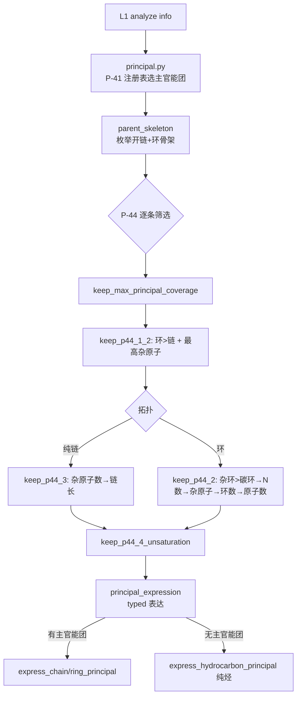
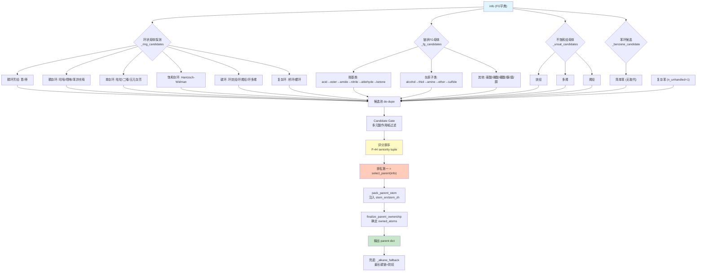
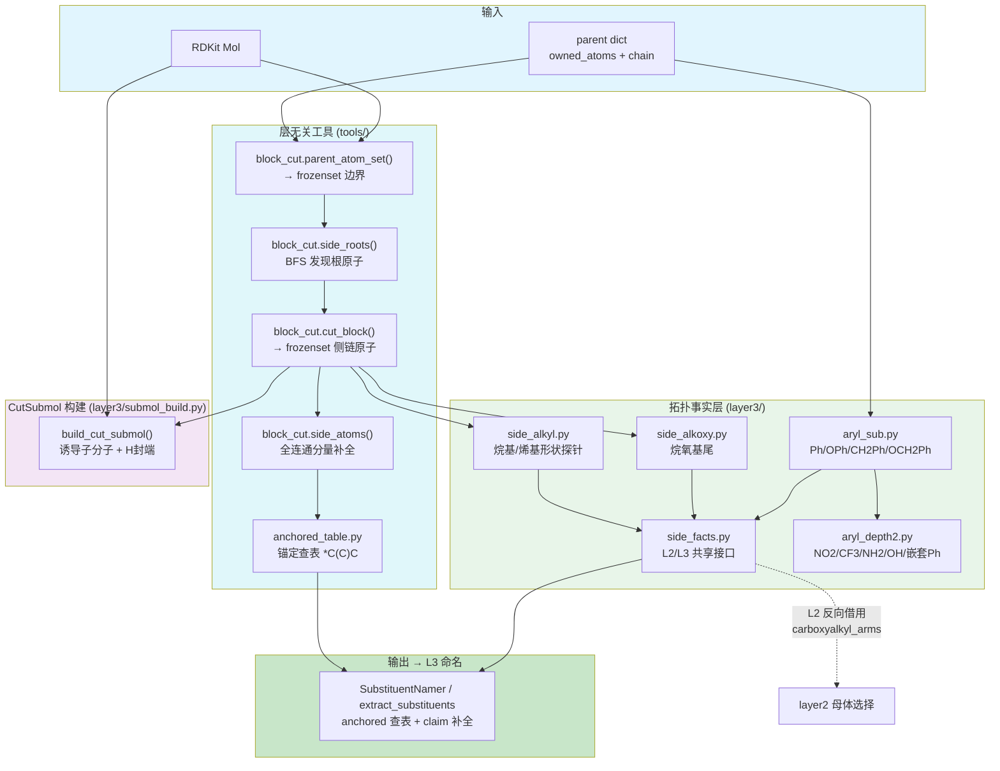
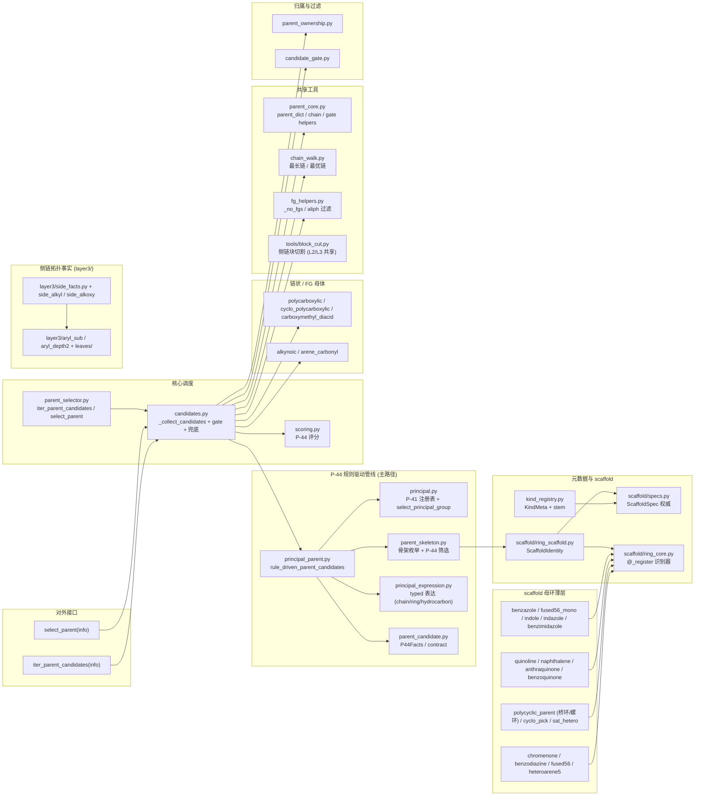
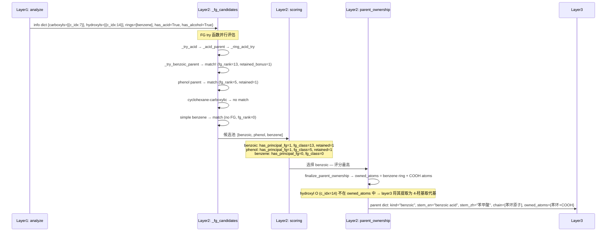

# Layer2: Parent Selector（母体选择器）

> **文件数:** ~75 source files | **代码占比:** ~60% of all project code
> **职责:** 给定 layer1 的功能团 (FG) 信息字典，选出 IUPAC 命名中的母体结构 (parent hydride)

---

## 概述

Layer2 是 NamePredict 六层流水线中体量最大、逻辑最复杂的一层。它接收 layer1 `analyze()` 产出的 FG 信息字典（包含分子中所有官能团、环系、不饱和键等的结构化描述），从中选出一个 **母体结构 (parent)**——即 IUPAC 命名中作为骨架的核心部分。母体的选择决定了后续所有层的命名方向：layer3 基于母体提取取代基，layer4 在母体骨架上编号，layer5 基于母体类型组装最终名称。

### 输入与输出

| | 类型 | 关键字段 |
|---|---|---|
| **输入 (info)** | `dict` | `mol` (RDKit Mol), `rings`, `carboxyls`, `esters`, `ketones`, `hydroxyls`, `amines`, `double_bonds`, `triple_bonds`, `has_acid`, `has_ketone`, `has_alcohol` ... 共 30+ 布尔标志 |
| **输出 (parent)** | `dict` | `chain` (原子序号列表), `kind` (母体类型), `n_carbons`, `owned_atoms` (frozenset), `stem_en`, `stem_zh`, 以及 FG 专属字段如 `cooh_c_idx`, `double_bond` 等 |

## 核心逻辑

### 候选生成架构

Layer2 采用 **"P-44 规则驱动管线"为主路径** 的设计，辅以并行候选评分仲裁。

**主路径（P-44 规则驱动）**：`candidates._collect_candidates` 当前只调用 `_principal_candidates`
→ `rule_driven_parent_candidates`（`principal_parent.py`）。这条管线按 IUPAC P-44 规则逐步筛选：
先用 `PRINCIPAL_REGISTRY`（P-41）选主官能团，再枚举可行骨架（开链 + 环系统），用
P-44.1.2 / P-44.2 / P-44.3 / P-44.4 逐条筛选，最后表达为 typed parent dict
（`principal_expression.py`）。详见下文「P-44 规则驱动主链管线」。

```
_collect_candidates(info)            # 当前唯一入口
└─ _principal_candidates(info)       # = rule_driven_parent_candidates(info)
   ├─ select_principal_group         # P-41 注册表选主官能团
   ├─ select_principal_skeletons     # 枚举+筛选骨架 (P-44.1.2/2/3/4)
   └─ express_ring/chain_principal   # typed 表达；无主官能团→纯烃表达
```

**经典并行通道（已删除）**：历史上 Layer2 通过 `_carbonyl_parent` / `_hetero_parent`
/ `_fg_candidates` / `_ring_candidates` / `_unsat_candidates` / `_benzene_candidate` /
`_alkane_fallback` 并行生成所有候选再统一评分（scoring.py）。该通道及其注册层
**（`fg_producers` / `ring_producers` / `unsat_producers` 三个 try 函数注册表）已整体删除**。
`_collect_candidates` 当前唯一走 principal 单路径；骨架 scaffold 身份改由
`scaffold/ring_core` + `scaffold/specs` 解析，不再依赖 ring try 注册表。

> **源:** `E:\chem\src\namepredict\layer2\candidates.py:103-106`

### P-44 规则驱动主链管线

当前 Layer2 的**主路径**。与旧架构"并行 try + scoring 仲裁"不同，这条管线按 IUPAC P-44
条款逐步筛选，由四个模块协作，全部无副作用纯函数、可单测：



1. **`principal.py`**（原 `principal_selection.py` + `principal_registry.py` 合并）— `select_principal_group()`
   按 `PRINCIPAL_REGISTRY`（P-41 class 优先级）选出主官能团类。注册表把 FG 分成三档表达权限：**SUFFIX**（acid/ester/amide/nitrile/
   aldehyde/ketone/alcohol/thiol/amine 等，有资格成为主官能团并 typed 表达）、**LEGACY_COMPAT**
   （sulfide/sulfone/carbamate 等，不参与主官能团选择）、**PREFIX_ONLY**（ether，只当前缀）。
   `principal_spec()` 只放行 SUFFIX 类。

2. **`parent_skeleton.py`** — `enumerate_principal_skeletons()` 从主官能团的附着点出发枚举
   **开链候选**（`_open_chains`，锚点为空即纯烃时退化为最长链）与**环系统候选**
   （`_ring_candidates`，每个环系统经 `_producer_scaffold_ids` 运行 ring producers 标注
   `scaffold_id`）。随后 `select_principal_skeletons()` 依次施加 `keep_max_principal_coverage` →
   `keep_p44_1_2`（环优先 + 最高优先级杂原子）→ 按拓扑走 `keep_p44_3`（链）/ `keep_p44_2`
   （环，键序：含杂原子→N 数→最高杂原子→环数→环原子数）→ `keep_p44_4_unsaturation`
   （最多不饱和度，排除主 FG 自身多元键）。

3. **`principal_expression.py`** — 把选定的骨架表达为 parent dict：
   - `express_chain_principal()` — 开链全部 8 类主官能团（`_CHAIN_KINDS`，含 ESTER/AMIDE/
     ALDEHYDE/NITRILE），骨架内 C=C/C≡C 带 `double_bond`/`triple_bond`/`double_bonds` 字段，
     酯额外带烷氧侧链字段（`o_idx`/`alkoxy_c_idx`/`alkoxy_n`）供 L5 命名
   - `express_ring_principal()` — 环骨架；**苯环 + 单 FG** 走 `_RETAINED_RING_KINDS` 保留名表
     （ACID→benzoic、ESTER→benzoate、ALDEHYDE→benzaldehyde、NITRILE→benzonitrile、AMIDE→
     benzamide、ALCOHOL→phenol、AMINE→aniline），环酮走 `_ring_ketone_kind`，其余走
     `_resolved_ring_kind`（scaffold 解析）
   - 每个候选携带 `PrincipalExpressionFacts`（group_class/multiplicity/relation/attachment_atoms）
     与 `ScaffoldIdentity`（scaffold_id / naming_class / n_rings / ring）
   - `express_hydrocarbon_principal()` — **无主官能团（纯烃）**：开链按 C=C/C≡C 分布给
     alkane/alkene/alkyne/polyene；环按芳香性分流（保留 scaffold 如 benzene/naphthalene，或
     按环内不饱和度给 cycloalkane/cycloalkene/cyclopolyene）

4. **`principal_parent.py`** — `rule_driven_parent_candidates()` 编排以上：选主官能团 →
   选骨架 → 表达。经典 builder 通道 **`_open_chain_expression` 已删除**，`_special_expression`
   亦随之清空（原 ester×2 / 环酮分支随 `diester.py` / `parent_selector` 旧 builder 一并移除，
   现恒为 `return None`）——骨架表达 `express_chain_principal` 覆盖全部 8 类主官能团，
   成为唯一来源。`_unsupported_typed_ring` 拒绝"无表达能力骨架"的酮表达。

> **源:** `E:\chem\src\namepredict\layer2\principal.py`, `E:\chem\src\namepredict\layer2\parent_skeleton.py`, `E:\chem\src\namepredict\layer2\principal_expression.py`, `E:\chem\src\namepredict\layer2\principal_parent.py`

### Kind Registry: 母体元数据中心

`kind_registry.py` 是 Layer2 的 **单一权威注册中心 (Single Registry Authority)**，存储所有母体种类 (kind) 的元数据：

- **`KindMeta`**: 每个 kind 的评分字段 (`fg_rank`, `ring`, `n_rings`, `retained`) 和命名 stem
- **`fg_rank`**: 官能团类别优先级 (acid=13, ester=11, ketone=6, alcohol=5, amine=3...)，遵循 IUPAC P-41 优先顺序
- **scaffold 识别**: ring/unsat try 函数注册表（`ring_producers.py` / `unsat_producers.py` / `fg_producers.py`）已整体删除；环骨架身份由 `scaffold/ring_core`（SMILES 模板子图同构 + 专用碳羰适配器）+ `scaffold/retained_templates` 识别
- **ScaffoldSpec 单一 stem 权威源**: 词干 (stem_en/zh) 与编号策略由 `scaffold/specs.py` 提供，`kind_registry._load_from_scaffold_specs()` 在 bootstrap 末尾从 Spec 同步 `KindMeta`

FG 母体不走注册表，由 principal 管线的 typed 表达（`principal_expression.py`）处理；`scaffold/ring_core` 的 `ring_core_fns()`（装饰器 `@_register` 注册的核心识别器）为骨架标注 scaffold_id。

> **源:** `E:\chem\src\namepredict\layer2\kind_registry.py:7-17, 157-228`

### Ring 骨架识别机制

历史上的 **Bootstrap Register 模式**（`fg_producers` / `ring_producers` / `unsat_producers`
三个 try 注册表）**已整体删除**。当前环骨架身份由 `scaffold/ring_core.py` 集中识别，其
`ring_core_fns()` 返回一组**装饰器 `@_register` 注册的核心识别器**：

- **模板识别**：`_template_mother` 通过 `scaffold/retained_templates` 的 SMILES 模板
  子图同构匹配保留母环（芳/杂芳/稠合）
- **专用适配器**：碳羰母环（benzoquinone / anthraquinone / chromenone /
  ortho_benzoquinone）与规则母环（cycloalkane / cyclopolyene / bridged / spiro /
  saturated hetero）走各自的 `@_register` 适配器（`_benzoquinone_core` /
  `_cycloalkane_core` / `_bridged_core` / `_spiro_core` 等）

`parent_skeleton._producer_scaffold_ids` 不再依赖 try 注册表，改为调用
`scaffold/ring_scaffold.resolve_ring_scaffold`（经 `ring_core_fns()` 标 scaffold_id，再经
`scaffold/specs` 的 `ScaffoldSpec` 解析编号身份）。各 `scaffold/*.py` 薄层模块仍提供
`_try_*_parent(info) -> dict | None` 风格的完整 producer（如 `benzazole._try_benzothiazole_parent`、
`fused56_mono._try_benzofuran_parent`），供 tests 直接验证与特定 kind 的独立装配。

> **源:** `E:\chem\src\namepredict\layer2\scaffold\ring_core.py`, `E:\chem\src\namepredict\layer2\scaffold\ring_scaffold.py`, `E:\chem\src\namepredict\layer2\scaffold\retained_templates.py`

**新增 ring 母体的步骤：**
1. 在 `scaffold/specs.py` 的对应 `ScaffoldSpec` 元组声明该 kind 的 `fg_rank`、`ring`、`retained`、stem 等元数据
2. 实现核心识别器（carbonyl 专用适配器在 `ring_core.py` 加 `@_register`；规则母环在
   `scaffold/` 薄层模块实现 `_is_*_core` 后接入）
3. 若需保留名模板，在 `scaffold/retained_templates.py` 添加 SMILES 模板

### 评分体系 (P-44 Seniority)

`scoring.py` 将每个候选 parent 编码为 11 维 tuple，遵循 IUPAC P-44 的母体优先级规则（数值越大越优先）：

```python
(has_principal_fg,    # 0/1 — 是否含 Principal Characteristic Group
 fg_class_rank,       # 0-13 — FG 类别优先级
 sides_ok,            # 0/1 — 侧链是否可表达为取代基
 is_hetero_ring,      # 0/1 — 是否杂环
 is_carbo_ring,       # 0/1 — 是否碳环
 n_rings,             # 0+ — 环数
 ring_size,           # 0+ — 环原子数
 retained_bonus,      # 0/1 — 保留名加分
 n_unsat,             # 0+ — 不饱和度
 n_carbons,           # 0+ — 碳原子数
 -n_unhandled_side)   # 负值 — 未识别侧链惩罚
```

`has_principal_fg` 是最高维度——有特征官能团的母体永远优先于纯烃母体。`fg_class_rank` 决定同分子中酸 vs 酮 vs 醇的归属（例如既有 -COOH 又有 -OH 时，-COOH 优先级高，选为母体特征官能团）。`sides_ok` 确保环状母体上的侧链能被正确分类为取代基，否则降级为链状母体——这防止了"裸露环名"的产生。

`retained_bonus` 为 IUPAC 保留名（如 benzoic acid、phenol、aniline、pyridine）提供优先权，确保苯甲酸不会被选为"环己烷羧酸"。

> **源:** `E:\chem\src\namepredict\layer2\scoring.py:73-95`

### 链 vs 环决策

母体选择的核心分歧点是 **链状母体 vs 环状母体**：

1. **环优先探测:** `parent_skeleton` 枚举环系统候选后，由 `scaffold/ring_core` 的
   `ring_core_fns()`（`@_register` 识别器）标注 scaffold_id（保留名经 `retained_templates`
   子图同构匹配）。例如：
   - `scaffold/anthraquinone._aq_system` → 三环线性稠合芳碳环 + 两个 meso 酮
   - `scaffold/naphthalene` → 两环邻位稠合芳碳环
   - `scaffold/quinoline` / `scaffold/indole` → 稠杂环
   - `scaffold/cyclo_pick` / `ring_parent` → 碳环 / 环烯 / 环多烯

2. **链探测:** 当环候选不被评分选中或环无法承载特征官能团时，链状母体成为选择。链母体的核心算法在 `chain_walk.py`：
   - `_longest_chain(mol)`: DFS 遍历找到最长碳链
   - `_best_cover_pair(mol, atoms)`: 找到同时覆盖多个 FG 连接点的最优链
   - `_chain_through(info, fg_c)`: 从 FG 连接点出发的最长链
   - `_chain_through_bond(mol, c1, c2)`: 包含特定键（如 C=C）的最长链

   这些函数通过 `_carbon_neighbors` 获取每个碳的相邻碳原子，后者 **排除芳香碳和环碳**，确保链状母体不会错误地穿过环系统。

> **源:** `E:\chem\src\namepredict\layer2\chain_walk.py:7-70`

### FG 优先级体系

官能团优先级遵循 IUPAC P-41 降序排列，由 `principal.py` 的 `PRINCIPAL_REGISTRY`（`compatibility_rank`）定义，经 `kind_registry._KIND_CLASS` 映射到 kind：

| 优先级 | FG 类别 | kind 示例 |
|--------|---------|-----------|
| 13 | 羧酸/多元羧酸 | acid, diacid, polycarboxylic |
| 12 | 酸酐/磺酸 | anhydride, sulfonic_acid |
| 11 | 酯/二酯/氨基甲酸酯 | ester, diester, carbamate |
| 10 | 酰卤 | acyl_chloride, acyl_bromide |
| 9 | 酰胺/脲/胍 | amide, urea, guanidine |
| 8 | 腈 | nitrile |
| 7 | 醛 | aldehyde |
| 6 | 酮/二酮/环酮 | ketone, dione, cycloketone |
| 5 | 醇/二醇/三醇 | alcohol, diol, triol |
| 4 | 硫醇/肼 | thiol, hydrazine |
| 3 | 胺/多胺/环胺 | amine, diamine, cycloamine |
| 2 | 醚/硫醚/亚砜 | ether, sulfide, sulfoxide |

> **源:** `E:\chem\src\namepredict\layer2\principal.py` `PRINCIPAL_REGISTRY`（`compatibility_rank`）+ `kind_registry._KIND_CLASS`

### 多官能团母体

当分子含有同一官能团的多个实例时，Layer2 尝试将它们纳入一个"多官能团母体"：

- **二酸 (diacid):** 两个 -COOH，通过 `_best_cover_pair` 找到涵盖两端的链
- **二醇 (diol) / 三醇 (triol):** 多个 -OH，类似逻辑
- **多胺 (polyamine):** 多个 -NH2，支持 diamine/triamine/tetraamine
- **二酮 (dione):** 两个酮基
- **不饱和多元醇:** 同时含有 -OH 和 C=C，如 `_try_alkenediol_parent`

资格检查使用互斥谓词 `_no_fgs(info, keys)`（`fg_helpers.py`；共享 BAD 元组常量已删除，keys 由各 producer 内联传入）：例如二酸候选要求分子中无酯、酰胺、腈、醛等更高优先级官能团，但不排斥羟基、氨基等低优先级官能团（它们将成为取代基）。链状多元酸走 `polycarboxylic.py` / `carboxymethyl_diacid.py`，环烷多元酸走 `cyclo_polycarboxylic.py`，环二醇/二酮/环烯 FG 由 principal 管线按 `kind`（`diol`/`dione`/`cycloketone` 等，`kind_registry.py`/`principal_expression.py`）处理——原 `cyclo_fg.py` 已删除。

> **源:** `E:\chem\src\namepredict\layer2\fg_helpers.py`, `E:\chem\src\namepredict\layer2\polycarboxylic.py`

### Atom Ownership: 母体原子归属

选出母体骨架后，`parent_ownership.py` 的 `finalize_parent_ownership()` 确定 **母体"拥有"哪些原子**——即哪些原子在命名时被视为母体的一部分而非取代基。owned_atoms 是 layer3 提取取代基的关键边界：

- `_chain_atoms`: 链状母体的骨架原子
- `_acid_fg_atoms`: 羧酸的 C=O 和 C-OH 氧原子
- `_aldehyde_fg_atoms`: 醛的 C=O 氧原子
- `_amide_fg_atoms`: 酰胺的 C=O 氧和 NH2 氮原子

ownership 信息确保 layer3 只从未被拥有的原子中提取取代基。

> **源:** `E:\chem\src\namepredict\layer2\parent_ownership.py:1-80`

### 块切割与子分子构建

母体边界与侧链原子块切割已下沉为**层无关工具** `tools/block_cut.py`（原 `layer2/block_cut.py` 迁出，L2/L3 共享）。H-封端子分子构建 `submol_build.py` 已迁至 `layer3/`（服务 L3 递归子命名）。Layer2 自身选完母体后不再做侧链块切割——侧链识别全部由 Layer3 的 `extract_claimed_sides`（`iter_claims`）与 `tools.block_cut.side_atoms` 承担。

**parent_atom_set —— 母体原子边界：**

`parent_atom_set(parent, mol)` 将母体的 `owned_atoms` 标准化为 `frozenset[int]`，作为块切割的不可穿越边界。该函数兼容两种场景：母体已经 finalize 过（直接从 `parent["owned_atoms"]` 取 frozenset），或尚未 finalize（调用 `finalize_parent_ownership` 补充）：

```python
def parent_atom_set(parent: dict, mol: Mol) -> frozenset[int]:
    owned = parent.get("owned_atoms")
    if isinstance(owned, frozenset):
        return owned
    return finalize_parent_ownership(parent, mol)["owned_atoms"]
```

> **源:** `E:\chem\src\namepredict\tools\block_cut.py`（`parent_atom_set`）

**side_roots —— BFS 发现侧链根原子：**

`side_roots(mol, parent_atoms)` 遍历每个母体原子的邻居，找出位于母体边界外且非氢的重原子。这些原子是每个侧链的 BFS 起始点（root）：

```python
def side_roots(mol: Mol, parent_atoms: frozenset[int]) -> list[int]:
    roots: set[int] = set()
    for p in parent_atoms:
        roots.update(_heavy_outside(mol, p, parent_atoms))
    return sorted(roots)
```

> **源:** `E:\chem\src\namepredict\tools\block_cut.py`（`side_roots`）

**_bfs_block —— BFS 收集连通块：**

`_bfs_block(mol, root, parent_atoms)` 从 root 出发执行 BFS，收集所有通过非氢重原子连通且不在 parent_atoms 内的原子。BFS 在 parent_atoms 边界自动停止，确保每个块只包含一个独立侧链：

```python
def _bfs_block(mol: Mol, root: int, parent_atoms: frozenset[int]) -> set[int]:
    seen: set[int] = set()
    q: deque[int] = deque([root])
    while q:
        _visit(mol, q.popleft(), parent_atoms, seen, q)
    return seen
```

`cut_block(mol, root, parent_atoms)` 是公开接口，返回 `frozenset[int]` 或 `None`。

> **源:** `E:\chem\src\namepredict\tools\block_cut.py`（`cut_block` / `_bfs_block`）

**CutSubmol —— 诱导子分子与 H-封端：**

`submol_build.py`（**已随重构迁至 `layer3/submol_build.py`**，服务 L3 取代基子命名）定义 `CutSubmol`
冻结数据类，用于从母体上"切下"一个侧链并构建为独立分子（用于递归命名）：

```python
@dataclass(frozen=True)
class CutSubmol:
    mol: object          # RDKit Mol, attach 处以 H 封端
    atom_map: dict[int, int]  # new_idx -> old_idx
    inv_map: dict[int, int]   # old_idx -> new_idx
    attach_new: int       # submol 中的 attach 原子索引
    attach_old: int       # 原分子中的 attach 原子索引
    atoms_old: frozenset[int]
```

`build_cut_submol(mol, atoms, attach_old)` 构建诱导子分子：复制指定原子及其键，在 attach 处用 H 填充自由价（通过 `SetNoImplicit(False)` + SanitizeMol），确保 RDKit 能正确感知化合价。`atom_map` 和 `inv_map` 提供新旧索引间的双向翻译。

> **源:** `E:\chem\src\namepredict\layer3\submol_build.py`（原 `layer2/submol_build.py`）

**递归命名流程：**

块切割 + CutSubmol 的组合使得 Layer2 能对复杂侧链进行递归命名。典型流程为：

1. `parent_atom_set(parent, mol)` 确定母体边界
2. `side_roots(mol, parent_atoms)` 发现所有根原子
3. 对每个 root，`cut_block(mol, root, parent_atoms)` 收集侧链原子集合
4. `build_cut_submol(mol, block_atoms, root)` 构建 H-封端子分子
5. 对子分子调用 `_name_mol(submol)`（回到 layer1→layer2→...→layer5 流水线）获取该侧链的完整名称
6. 通过 `atom_map` 将子分子索引翻译回原分子索引

这个机制支持任意深度的嵌套芳环侧链（Ph-O-Ph-CH2-Ph-...），受 `depth` 参数限制（默认 max_depth=3），防止无限递归。

### 保留名 (Retained Names)

IUPAC 特许某些结构使用传统保留名而非系统命名。Layer2 通过 `kind_registry._ARENE_NAMED` 注册这些保留名：

- **苯系:** benzoic acid, benzaldehyde, acetophenone, phenol, aniline, benzonitrile
- **杂环羧酸:** furancarboxylic, thiophenecarboxylic, pyridinecarboxylic, indolecarboxylic
- **饱和杂环羧酸:** piperidinecarboxylic, pyrrolidinecarboxylic, morpholinecarboxylic
- **内酯/内酰胺:** oxolanone, oxanone, pyrrolidinone, piperidinone (伪酮类，fg_rank=6)

保留名通过 `retained_bonus` 在评分中获得优先权。`ScaffoldSpec` 系统为这些保留名提供 IUPAC 编号骨架 (`numbering_scaffold`)，如 fused56 的 "1,2,3,3a,4,5,6,7,7a" 编号路径。

> **源:** `E:\chem\src\namepredict\layer2\kind_registry.py:37-73`

### Candidate Gate: 多元羧酸过滤

`candidate_gate.py` 实现了一个类型化的候选过滤系统，专门处理 **多元羧酸作用域冲突**：

- `GateScope` 定义三个作用域: `OPEN_CHAIN_POLYCARBOXYLIC`（链状多元酸）、`BENZENE_POLYCARBOXYLIC`（苯多元酸）、`CYCLOALKANE_POLYCARBOXYLIC`（环烷多元酸）
- 每个候选声明其依赖的作用域和是否为"主候选"
- `scoped_reject` 只拒绝依赖该作用域的候选，`global_reject` 拒绝全部

这防止了例如"苯三甲酸"候选与"链状三甲酸"候选同时出现导致的命名歧义。

> **源:** `E:\chem\src\namepredict\layer2\candidate_gate.py:1-68`

### Leaves: 芳环外侧叶子拓扑（已迁 layer3）

`leaves/` 子模块（原 `layer2/leaves/`，2026-08 迁至 `layer3/leaves/`）处理芳环上的外侧叶子（Ph-X 中的 X）拓扑识别。Layer2 不再直接使用它——`simple benzene` vs `substituted benzene` 的判定由 layer3 的 `aryl_sub.py`（`_side_ok`/`_count_side_leaves`）与 `leaves/registry.py` 的 `match_leaf_topology` 提供，Layer2 仅在 `arene_carbonyl.py` 等保留苯母体处通过 `layer3.aryl_sub` 检测环。

新接口为纯拓扑：`layer3/leaves/protocol.py` 定义 `ArylLeafKind`（13 种叶子）与 `LeafTopology` 冻结数据类；`layer3/leaves/registry.py` 提供 `match_leaf_topology(mol, atom, ring_atom, depth)`，经 `layer3/side_facts.ring_leaf` 暴露给 L3 命名层。详见 [[architecture/layer3-substituents]]。

---

## 侧链事实系统 (Side Facts)

侧链事实层 `side_facts.py` 及其配套（`side_alkyl` / `side_alkoxy` / `aryl_sub` / `aryl_depth2` / `leaves`）在 **2026-08 已从 Layer2 整体迁入 `layer3/`**，成为 L2 与 L3 共享的拓扑契约层（受契约测试 `test_l2_l3_side_facts_contract` 保护：纯拓扑、无命名依赖）。Layer2 自身不再对侧链做拓扑分类——侧链识别与命名全部由 Layer3 承担（见 [[architecture/layer3-substituents]]）。Layer2 仅**反向借用**三个拓扑函数：

| L2 消费点 | 借用函数 | 用途 |
|-----------|---------|------|
| `carboxymethyl_diacid.py` | `layer3.side_facts.carboxyalkyl_arms` | 羧甲基二酸母体的羧烷基臂 |
| `cyclo_polycarboxylic.py` | `layer3.side_alkyl._walk_linear` | 环烷多元羧酸的线性臂 |
| `arene_carbonyl.py` | `layer3.aryl_sub` | 苯甲酰类保留母体的芳环检测 |

### AlkylShape 枚举——支链烷基的 12 种形状

`layer3/side_facts.py` 定义了 `AlkylShape` 枚举，将分支烷基侧链分为 12 种可命名的拓扑形状（`alkyl_shape`/`_SHAPE_MATCHERS` 为契约保留 API；当前 L3 主流程经 `tools/anchored_table` 锚定查表命名，不再逐形状匹配）：

| 枚举值 | 代表结构 | 检测函数 |
|--------|---------|---------|
| `C2_VINYL` | 乙烯基 (-CH=CH2) | `_is_vinyl` |
| `C3_ALLYL` | 烯丙基 (-CH2-CH=CH2) | `_is_allyl` |
| `C3_ISOPROPENYL` | 异丙烯基 (-C(=CH2)-CH3) | `_is_isopropenyl` |
| `C3_BRANCH_AT_ROOT` | 异丙基 (-CH(CH3)2) | `_is_isopropyl` |
| `C4_BRANCH_AT_SECOND` | 仲丁基 (-CH(CH3)-CH2-CH3) | `_is_sec_butyl` |
| `C4_TRIPLE_BRANCH_AT_ROOT` | 叔丁基 (-C(CH3)3) | `_is_tert_butyl` |
| `C4_BRANCH_AFTER_ROOT` | 异丁基 (-CH2-CH(CH3)2) | `_is_isobutyl` |
| `C5_ASYMMETRIC_ROOT_BRANCH` | 2-甲基丁-2-基 | `_is_2_methylbutan_2_yl` |
| `C5_PRENYL` | 异戊二烯基 | `_is_prenyl` |
| `C5_BRANCH_NEAR_LEAF` | 异戊基 | `_is_isopentyl` |
| `C5_DOUBLE_BRANCH_AFTER_ROOT` | 新戊基 (-CH2-C(CH3)3) | `_is_neopentyl` |
| `C1_THREE_HALOGEN_LEAVES` | 三氟甲基 (-CF3) | `_is_trifluoromethyl` |

每个形状对应 `_SHAPE_MATCHERS` 字典中的一个检测函数 `(mol, root, parent_set) -> list[int] | None`，返回从 root 出发的碳原子路径或 `None`。

> **源:** `E:\chem\src\namepredict\layer3\side_facts.py:15-28, 95-108`

### 侧链分类子系统（已迁 layer3）

- **`layer3/side_alkyl.py`** — 烷基侧拓扑探针：`_c_neighbors`、`_walk_linear`、`_is_cf3_carbon`、`_is_omega_halo_c` 及 12 个分支/烯基形状匹配器（`_is_isopropyl`/`_is_tert_butyl`/`_is_vinyl` 等）。
- **`layer3/side_alkoxy.py`** — 烷氧基侧拓扑：`_outer_alkoxy_n`/`_outer_atoms`（线性 C1-C4 + PEG code + 分支 isopropoxy/isobutoxy）。
- **`layer3/aryl_sub.py` / `layer3/aryl_depth2.py`** — 芳环侧链拓扑：Ph/OPh/CH2Ph/OCH2Ph 检测、卤素/Me 计数、二级叶子（NO2/CF3/NH2/OH/嵌套 Ph）。
- **`tools/anchored_table.py`** — 2026-08 新增的锚定 canonical-SMILES 查表（`*C(C)C`），统一覆盖环烷基 C3-C8、烯基、卤代烷基、芳基与含杂叶。`side_cycloalkyl.py` 已删除；`side_sat_hetero.py` 未随迁。

### SideFact 类型体系

`layer3/side_facts.py` 定义了 6 种拓扑事实类型（`HeteroarylFact`/`SaturatedHeterocycleFact` 已在重构中删除，杂芳基/饱和杂环侧链改由 L3 通用 cut→free-name→yl 管道命名）：

| SideFact 类型 | 关键字段 | 用途 |
|--------------|---------|------|
| `SidePath` | `root`, `atoms: tuple[int, ...]` | 线性/分支烷基侧链 |
| `AlkoxyFact` | `root`, `oxygen`, `code`, `atoms` | 烷氧基侧链 (C1-C4 + PEG) |
| `ArylArmFact` | `kind: ArylArmKind`, `attachment`, `outer`, `bridge`, `ring`, `atoms` | 芳环侧链 (Ph/OPh/CH2Ph/OCH2Ph) |
| `ArylLeafFact` | `kind: ArylLeafKind`, `site`, `atoms`, `value`, `child_ring`, `child_attach`, `child_parent`, `extra_atom` | 芳环上的叶子取代 |
| `CarboxyalkylArm` | `attachment`, `atoms`, `carboxyl` | 羧烷基臂 (如 -CH2-COOH) |
| `AlkylShape`/`ArylArmKind`/`HeteroarylKind` 枚举 | — | 侧链形状/连接方式/杂芳基分类 |

`ArylArmKind` 枚举区分四种芳基连接方式：`DIRECT_C` (Ph-), `METHYLENE_C` (Ph-CH2-), `DIRECT_O` (Ph-O-), `O_METHYLENE_C` (Ph-CH2-O-)。`HeteroarylKind` 枚举区分 `SIX_MEMBER_ONE_N`（吡啶基）与 `FUSED_TEN_MEMBER_C`（萘基）。

### 公开拓扑接口 (layer3/side_facts)

```
ring_leaf(mol, atom, ring_atom, depth)   → ArylLeafFact | None
carbon_neighbors(mol, atom)              → list[int]
alkyl_shape(mol, root, parent, shape)    → SidePath | None   (契约保留)
outer_alkoxy(mol, root, oxygen)          → AlkoxyFact | None
phenyl_ring(mol, root, parent)           → frozenset | None
benzyl_ring(mol, root, parent)           → frozenset | None
aryl_leaves(mol, ring)                   → frozenset[int]
carboxyalkyl_arms(mol, chain, acids)     → tuple[CarboxyalkylArm, ...]
```

> **源:** `E:\chem\src\namepredict\layer3\side_facts.py:121-176`

---

## 芳环侧链深度处理（已迁 layer3）

芳环侧链识别（Ph/OPh/CH2Ph/OCH2Ph 及其嵌套变体）在 **2026-08 随拓扑事实层整体迁入 `layer3/`**：`aryl_sub.py` / `aryl_depth2.py` / `leaves/` 现位于 `src/namepredict/layer3/`。Layer2 仅在 `arene_carbonyl.py`（苯甲酰类保留母体）通过 `layer3.aryl_sub` 检测芳环；取代苯的完整识别与命名由 Layer3 的 `side_facts` + `aryl_arm_name`（通用 cut→free-name→yl 管道）承担，详见 [[architecture/layer3-substituents]]。

### aryl_sub.py —— 芳环取代基计数与分类（layer3）

`aryl_sub.py` 是芳环侧链拓扑的核心，提供四种芳环连接方式检测（`_phenyl_at`/`_ch2_ph_at`/`_phenoxy_from_ether`/`_benzyloxy_from_ether`）、叶子计数（`_count_side_leaves`/`_side_ok`，P-29.3 限 3 个取代）与叶子原子收集（`_halo_atoms_on`）。芳环臂**命名**不再走 `_recursive_ph_name`（`ring_namer.py` 已删除），改由 `layer3/aryl_names.aryl_arm_name` 调 `name_as_substituent` 通用管道。

> **源:** `E:\chem\src\namepredict\layer3\aryl_sub.py`

### aryl_depth2.py —— 二级深度芳环处理（layer3）

`aryl_depth2.py` 提供二级取代基（NO2/CF3/NH2/OH/嵌套 Ph/烷氧基）的位点检测（`_depth2_kind`/`_depth2_atoms_on`/`_leaf_atoms_*`），供 L3 叶子拓扑与原子归属使用。

> **源:** `E:\chem\src\namepredict\layer3\aryl_depth2.py`

### 深度限制与递归防护

芳环嵌套可能无限递归（如 `Ph-Ph-Ph-...`）。系统通过 `depth` 参数控制最大递归深度：深度控制由 L3 递归命名器 `SubstituentNamer`（`as_substituent.name_as_substituent`，默认 `max_depth=4`）在每层递归递增 `depth` 并检查上限。

### heteroaryl_sub.py —— 已删除

原 `heteroaryl_sub.py`（pyridin-n-yl / naphthalen-n-yl 专用识别，278 行）已在 **2026-08 重构中整体删除**（commit `ff394d0`）。杂芳基侧链作为取代基时由 L3 通用管道命名（如吡啶基经 `anchored_table` / `name_as_substituent`）；作为母体则走 layer2 scaffold（`quinoline.py`/`naphthalene.py` 等保留母环）。

### leaves/ring_namer.py —— 已删除

原 `ring_namer.py` 的 `name_ph_ring` / `recursive_ph_name`（递归苯环命名）已在 **2026-08 移除**（commit `aea616e`）。芳环取代基的完整命名（含 halo/methyl/nitro/alkoxy 等定位编号）改由 `layer3/aryl_names.aryl_arm_name` + `as_substituent` 的苯环锚定自由基路径实现。

---

## 桥环与螺环母体

### 桥环母体 (von Baeyer bicyclo[x.y.z]alkane)

`scaffold/polycyclic_parent.py`（原 `bridged_parent.py` + `spiro_parent.py` 合并）实现饱和全碳
双环桥环体系的母体识别（IUPAC P-23），当前 R1 范围覆盖双环桥环，杂原子/不饱和/多环桥环延后处理。

**检测流程：**

1. `_is_bridged_system(r)` / `_is_simple_bridged(info)`: 遍历 layer1 输出的 `ring_systems`，检查 `topology == "bridged"` 且 `n_rings == 2` 且无杂原子/芳香性
2. `_bicyclo_stems(bridge_lengths)`: 将桥长降序排列生成 `bicyclo[2.2.1]` / `双环[2.2.1]` 前缀
3. `_build_bridged_parent(br)`: 调用 `_parent_dict` 构建 parent dict，附加 `bridge_lengths`, `bridgeheads`, `bridge_paths` 字段

```python
def _try_bridged_parent(info: dict) -> dict | None:
    br = _is_simple_bridged(info)
    return None if br is None else _build_bridged_parent(br)
```

母体 dict 的 `kind` 为 `"bridged"`，`stem_en`/`stem_zh` 包含完整前缀。桥头原子和桥路径信息传递给 layer4 用于编号。

> **源:** `E:\chem\src\namepredict\layer2\scaffold\polycyclic_parent.py`

### 螺环母体 (spiro[x.y]alkane)

`scaffold/polycyclic_parent.py` 亦实现饱和全碳单螺环体系的母体识别（IUPAC P-24.2.1），当前 R1 范围覆盖两个单环组分的螺环。

**检测流程：**

1. `_is_simple_spiro(info)`: 遍历 `ring_systems`，检查 `topology == "spiro"` 且 `n_rings == 2` 且全碳饱和
2. `_spiro_stems(ring_sizes)`: 生成 `spiro[4.5]` / `螺[4.5]` 前缀
3. `_try_spiro_parent(info)`: 构建 parent dict，kind=`"spiro"`，附加 `ring_sizes` 字段

```python
def _try_spiro_parent(info: dict) -> dict | None:
    sp = _is_simple_spiro(info)
    if sp is None:
        return None
    ...
    return _parent_dict(sp["atom_ids"], "spiro",
                        stem_en=stem_en, stem_zh=stem_zh, ring_sizes=sorted(sizes))
```

> **源:** `E:\chem\src\namepredict\layer2\scaffold\polycyclic_parent.py`

**注册方式：** 桥环/螺环核心识别器 `_bridged_core` / `_spiro_core` 经 `@_register` 注册进
`scaffold/ring_core.py` 的 `ring_core_fns()`，供骨架 scaffold 标注。完整 producer
`_try_bridged_parent` / `_try_spiro_parent` 仍保留于 `polycyclic_parent.py` 供装配与测试。

---

## 数据流图

> **架构版本说明**：以下决策树 / 模块图 / 时序图 / 走查描述的是**经典并行通道**（`_fg_candidates` /
> `fg_producers` 等）。当前 `_collect_candidates` 已改为 **principal 单路径**（`_principal_candidates`
> → `rule_driven_parent_candidates`），`fg_producers` 注册层已删除；经典通道的图仅作历史参考，现行
> 主路径见上文「P-44 规则驱动主链管线」的 Mermaid 流程图。

### 母体选择决策树



### 块切割与侧链事实流水线



### 模块组织架构



### 流水线集成


### 完整走查: 对羟基苯甲酸 (4-hydroxybenzoic acid)

以下以一个具体的中文化学命名示例——对羟基苯甲酸（4-hydroxybenzoic acid，SMILES: `O=C(O)c1ccc(O)cc1`）——展示 Layer2 的端到端处理流程。



**Step-by-step 详解：**

**Step 1: Layer1 输出 info dict**

```python
info = {
    "mol": <RDKit Mol>,
    "rings": [{"atom_ids": [0,1,2,3,4,5], "aromatic": True}],
    "carboxyls": [{"c_idx": 7, "o_idx": 8, "oh_idx": 9}],  # -COOH on C1
    "hydroxyls": [{"c_idx": 14, "o_idx": 15}],              # -OH on C4
    "has_acid": True,
    "has_alcohol": True,
    "has_ring": True,
    ...
}
```

**Step 2: 候选生成 (`_collect_candidates`)**

`_fg_candidates(info)` 遍历 `fg_try_fns()` (~30 个函数)，返回所有匹配的 FG 母体候选。对于对羟基苯甲酸：

| try 函数 | 结果 | kind | fg_rank |
|---------|------|------|---------|
| `_try_acid` → `_ring_acid_try` → `_try_benzoic_parent` | match | benzoic | 13 |
| `_try_alcohol` → phenols try | match | phenol | 5 |
| `_try_amine` → no amine | None | - | - |

`_ring_candidates(info)` 遍历 `ring_try_fns()` (~28 个函数)：

| try 函数 | 结果 | kind |
|---------|------|------|
| `_try_simple_benzene` | match | benzene |

候选池去重后: `[benzoic, phenol, benzene]`

**Step 3: 评分排序**

`scoring._score_parent` 对每个候选计算 11 维 tuple：

| 候选 | has_fg | fg_class | sides_ok | retained | ... | 总分 tuple |
|------|--------|----------|----------|----------|-----|-----------|
| benzoic | 1 | 13 | 1 | 1 | ... | (1, 13, 1, 0, 0, 1, 6, 1, ...) |
| phenol | 1 | 5 | 1 | 1 | ... | (1, 5, 1, 0, 0, 1, 6, 1, ...) |
| benzene | 0 | 0 | 1 | 0 | ... | (0, 0, 1, 0, 0, 1, 6, 0, ...) |

benzoic 的 fg_class_rank=13（酸）高于 phenol 的 fg_class_rank=5（醇），符合 IUPAC P-41 的官能团优先顺序。benzoic 胜出。

**Step 4: pack_parent_stem + finalize_parent_ownership**

- `pack_parent_stem` 从 `kind_registry` 查找 benzoic 的元数据，注入 `stem_en="benzoic acid"`, `stem_zh="苯甲酸"`
- `finalize_parent_ownership` 确定 owned_atoms: 苯环的 6 个碳原子 + COOH 的 C(=O)OH（c_idx=7, o_idx=8, oh_idx=9）。羟基氧原子 (c_idx=14, o_idx=15) **不在 owned_atoms 中**

**Step 5: 输出 parent dict**

```python
parent = {
    "kind": "benzoic",
    "chain": [0, 1, 2, 3, 4, 5],  # 苯环碳原子
    "n_carbons": 7,
    "owned_atoms": frozenset({0,1,2,3,4,5, 7,8,9}),
    "stem_en": "benzoic acid",
    "stem_zh": "苯甲酸",
    "cooh_c_idx": 7,
    "fg_rank": 13,
    "retained": True,
}
```

Layer3 接收 parent dict 后，遍历所有非 owned_atoms 的重原子（o_idx=15 和 c_idx=14），通过 side_facts 系统将其分类为羟基取代基，通过 aryl_sub 系统确定其定位为 4-位（COOH 在 1-位），最终 layer5 组装为 "4-hydroxybenzoic acid" / "4-羟基苯甲酸"。

---

## 文件清单

> 经典 builder / 注册表文件（`fg_producers` / `ring_producers` / `unsat_producers` /
> `ether_parent` / `diester` / `alkenamide` / `pyridine` 等）已随重构删除或合并；
> 以下为当前实际存在的模块。

### 核心调度 (Core Dispatch)

| 文件 | 职责 |
|------|------|
| `candidates.py` | 候选收集 (_collect_candidates → _principal_candidates 单一路径); polyacid 门控; _alkane_fallback 兜底 |
| `parent_selector.py` | `select_parent` / `iter_parent_candidates` 经典入口（瘦身版：FG try 已移至 principal 管线，仅存排序/收尾） |
| `scoring.py` | P-44 评分 tuple, _better_parent, _pick_best |
| `parent_core.py` | 共享工具: _parent_dict, _best_cover_pair, _is_open_sat, chain/gate helpers（单一权威） |
| `fg_helpers.py` | FG 资格谓词 + 脂肪族过滤（原 `aliph_fg` + `parent_selector_common` 合并）: `_no_fgs`, `_aliph_c_idxs` |
| `__init__.py` | 导出 `select_parent` |

### P-44 规则驱动管线 (Rule-Driven Principal Pipeline)

| 文件 | 职责 |
|------|------|
| `principal.py` | P-41 class / P-43 表达元数据 + 主官能团选择（原 `principal_selection` + `principal_registry` 合并）: PRINCIPAL_REGISTRY, select_principal_group |
| `parent_skeleton.py` | 骨架枚举 + P-44 筛选: enumerate_principal_skeletons, select_principal_skeletons |
| `principal_expression.py` | typed 表达: express_chain/ring/hydrocarbon_principal, PrincipalExpressionFacts, _RETAINED_RING_KINDS |
| `principal_parent.py` | 编排: rule_driven_parent_candidates, select_principal_parent_skeletons（`_special_expression` 已清空） |
| `parent_candidate.py` | P44Facts / ParentCandidate / with_principal_group_contract / principal_phases |
| `scaffold/identity.py` | ScaffoldIdentity 拓扑级身份 |
| `scaffold/ring_scaffold.py` | 骨架 → ScaffoldIdentity 解析 (retained 匹配 + carbocycle 兜底) |
| `scaffold/ring_expression_policy.py` | 环表达能力白名单 (naming_class × FG × multiplicity) |

### 注册与元数据 (Registry & Metadata)

| 文件 | 职责 |
|------|------|
| `kind_registry.py` | KindMeta 注册中心, fg_rank, stem, ring 元数据; 从 ScaffoldSpec 同步词干 |
| `scaffold/specs.py` | ScaffoldSpec 定义: 编号骨架 (fused56/naph/monohetero/mono_carbo), 数据权威源 |
| `scaffold/ring_core.py` | `@_register` 核心识别器 (ring_core_fns): 模板识别 + 专用适配器 |
| `scaffold/retained_templates.py` | 保留母环 SMILES 模板子图同构匹配 |
| `scaffold/retained_registry.py` | 保留 scaffold 注册表 (拓扑匹配; stem 来自 Spec) |

### 块切割与侧链事实 (Block Cutting & Side Facts)

> **2026-08 已迁出 Layer2**：以下模块现位于 `tools/`（层无关）或 `layer3/`（拓扑事实层），Layer2 仅少量反向借用。详见 [[architecture/layer3-substituents]]。

| 文件（当前位置） | 职责 |
|------|------|
| `tools/block_cut.py` | BFS 块切割: parent_atom_set, side_roots, cut_block, side_atoms（原 `layer2/block_cut.py`） |
| `layer3/side_facts.py` | **L2/L3 共享拓扑契约**: AlkylShape + 事实类型 + 公开接口 |
| `layer3/side_alkyl.py` | 烷基侧拓扑探针（原 layer2） |
| `layer3/side_alkoxy.py` | 烷氧基侧拓扑（原 layer2） |
| `layer3/submol_build.py` | CutSubmol 构建: build_cut_submol / build_anchor_submol（原 layer2） |
| `tools/anchored_table.py` | **锚定 canonical-SMILES 查表**（2026-08 新增核心机制） |

已删除: `side_cycloalkyl.py`（并入 anchored_table）、`side_sat_hetero.py`（未随迁）。

### 芳环侧链子系统 (Aryl Side-Chain Subsystem)

> **2026-08 已迁 Layer2 → layer3**：

| 文件（当前位置） | 职责 |
|------|------|
| `layer3/aryl_sub.py` | 芳环侧链拓扑: Ph/OPh/CH2Ph/OCH2Ph 检测, 卤素/Me 计数 |
| `layer3/aryl_depth2.py` | 二级芳环叶子: NO2/CF3/NH2/OH/嵌套Ph/烷氧基 |
| `layer3/leaves/` | 芳基叶子拓扑 registry (protocol/registry/simple/topo/complex_h) |

已删除: `heteroaryl_sub.py`（杂芳基侧链走通用管道）、`leaves/ring_namer.py`（recursive_ph_name 移除）。

### 链状 / FG 母体 (Chain & FG Parents)

| 文件 | 职责 |
|------|------|
| `chain_walk.py` | 碳链 DFS 遍历: _longest_chain, _best_cover_pair, _chain_through |
| `cyclo_polycarboxylic.py` | 环烷多元羧酸 (P-65.1.1)；借 `layer3.side_alkyl._walk_linear` |
| `polycarboxylic.py` | 开链多元羧酸 (三酸及以上) |
| `carboxymethyl_diacid.py` | 羧甲基二酸特殊母体；借 `layer3.side_facts.carboxyalkyl_arms` |
| `alkynoic.py` | 炔酸/炔醇 |
| `arene_carbonyl.py` | 苯甲酰类保留母体: benzoic/benzaldehyde/acetophenone/benzoate（借 `layer3.aryl_sub`） |

已删除: `cyclo_fg.py`（环烯FG 处理散入各羧酸/scaffold 模块）、`arene_fg_parent.py`（芳环 FG 母体数据驱动入口移除）；`alkoxy_side.py` 已迁至 `tools/alkoxy_side.py`（layer2 仍消费 `classify_alkoxy`）。

### scaffold 母环薄层 (Retained Ring Modules)

| 文件 | 职责 |
|------|------|
| `scaffold/benzazole.py` | 1,3-苯并噻唑 / 苯并噁唑 + amine（原 `benzothiazole` + `benzoxazole` 合并） |
| `scaffold/fused56_mono.py` | 苯并呋喃 / 苯并噻吩 + FG 变体（原 `benzofuran` + `benzothiophene` 合并） |
| `scaffold/fused56.py` | 5+6 稠环通用 helper (P-22.2.1 / P-25) |
| `scaffold/indole.py` / `scaffold/indazole.py` / `scaffold/benzimidazole.py` | 稠杂环保留母体 |
| `scaffold/quinoline.py` / `scaffold/naphthalene.py` | 10 原子路径稠环 |
| `scaffold/anthraquinone.py` | 蒽醌（含原 `anthracene` 的 `_is_linear`） |
| `scaffold/benzoquinone.py` | 苯醌（含原 `ortho_benzoquinone`） |
| `scaffold/chromenone.py` / `scaffold/benzodiazine.py` / `scaffold/heteroarene5.py` | 其他保留母环 |
| `scaffold/polycyclic_parent.py` | 桥环 / 螺环（原 `bridged_parent` + `spiro_parent` 合并） |
| `scaffold/cyclo_pick.py` | 多环环烷烃选择 |
| `scaffold/sat_hetero.py` / `scaffold/sat_hetero_stem.py` / `scaffold/hetero_a_names.py` | 饱和杂环 + stem |
| `scaffold/builders/` | 骨架构建器 (carbocycle / fused56 / sat_hetero_repl) |

### 归属与过滤 (Ownership & Gating)

| 文件 | 职责 |
|------|------|
| `parent_ownership.py` | 母体原子归属最终化 (immutable owned_atoms) |
| `candidate_gate.py` | 类型化候选门控 (多元酸作用域) |

---

## 对外接口## 对外接口

### 公共 API

```python
def select_parent(info: dict) -> dict
```
选择单一最优母体。实际实现为 `iter_parent_candidates(info)[0]`。返回的 parent dict 包含 `chain`（骨架原子序号）、`kind`（母体类型）、`owned_atoms`（母体拥有的原子集合）、`stem_en`/`stem_zh` 等字段。layer5 和 layer3/layer4 均通过此 parent dict 获取后续命名所需的全部信息。

> **源:** `E:\chem\src\namepredict\layer2\parent_selector.py:539-541`

```python
def iter_parent_candidates(info: dict) -> list[dict]
```
返回所有排名的母体候选列表，每个候选经过 `pack_parent_stem` 注入 stem 名称和 `finalize_parent_ownership` 确定原子归属。列表按评分降序排列，首个元素即为最优母体。调用方式: `namer.py` 中 `_run_candidates` 在 depth=0 时遍历候选列表进行完整覆盖尝试。

> **源:** `E:\chem\src\namepredict\layer2\parent_selector.py:532-536`

### 关键内部类型

| 类型 | 位置 | 说明 |
|------|------|------|
| `KindMeta` | `kind_registry.py:7-15` | 母体种类元数据: fg_rank, ring, n_rings, retained, en/zh stem |
| `ScaffoldSpec` | `scaffold/specs.py:17-28` | 编号骨架定义: naming_class, stem, NumberingPolicy |
| `CandidateGate` | `candidate_gate.py:20-30` | 候选门控: GateStatus + GateScope + reason |
| `LeafTopology` | `layer3/leaves/protocol.py:23-32` | 芳环叶子拓扑: kind, site, atoms, value |
| `NameResult` | `types.py:6-13` | 最终命名结果: en, zh, success, meta |
| `AlkylShape` | `layer3/side_facts.py:15-28` | 烷基侧链形状枚举 (12 种分支拓扑) |
| `ArylArmKind` | `layer3/side_facts.py:30-35` | 芳基连接方式枚举 (DIRECT_C/METHYLENE_C/DIRECT_O/O_METHYLENE_C) |
| `HeteroarylKind` | `layer3/side_facts.py:37-40` | 杂芳基种类枚举 (SIX_MEMBER_ONE_N/FUSED_TEN_MEMBER_C) |
| `SidePath` | `layer3/side_facts.py:71-75` | 侧链原子路径: root + atoms tuple |
| `ArylArmFact` | `layer3/side_facts.py:77-85` | 芳基臂事实: kind, attachment, outer, bridge, ring, atoms |
| `CutSubmol` | `layer3/submol_build.py`（原 layer2） | 诱导子分子: mol, atom_map, inv_map, attach 索引 |
| `RootedAlkylTree` | `layer3/side_alkyl_sys.py:10-16`（原 layer2） | 有根烷基树: root, atoms, children, depth |

---

## 相关页面

- [[layer1-analyzer]] — Layer2 的上游，产出 FG info dict
- [[layer3-substituent-extractor]] — 使用 parent.owned_atoms 提取取代基
- [[layer4-numbering]] — 使用 parent.chain + kind 编号
- [[layer5-assembler]] — 使用 parent.kind + stem 组装名称
- [[system-architecture]] — 系统架构概述
