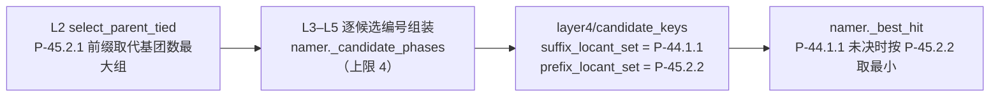
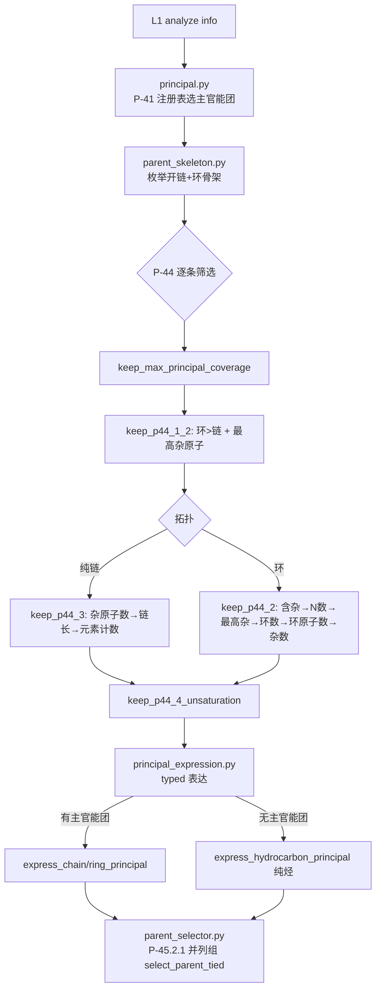
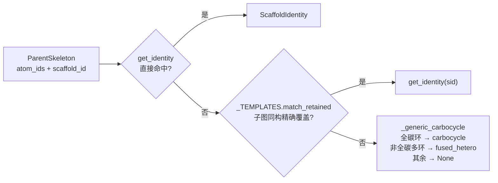
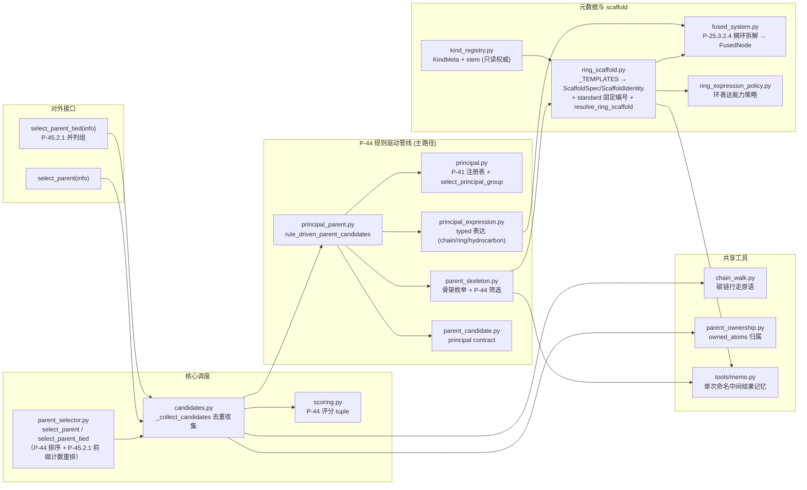

# Layer2: Parent Selector（母体选择器）

> **文件数:** 16 source files | **代码:** 2,661 行 | **最后更新:** 2026-09-10
> **职责:** 给定 layer1 的官能团 (FG) 信息字典，按 IUPAC P-44 选出母体结构 (parent hydride)

---

## 概述

Layer2 是 NamePredict 六层流水线中逻辑最复杂的一层。它接收 layer1 `analyze()` 产出的 FG 信息字典（包含分子中所有官能团、环系、不饱和键等的结构化描述），从中选出一个 **母体结构 (parent)**——即 IUPAC 命名中作为骨架的核心部分。母体的选择决定了后续所有层的命名方向：layer3 基于母体提取取代基，layer4 在母体骨架上编号，layer5 基于母体类型组装最终名称。

Layer2 由 16 个模块组成：**① 骨架识别在 `ring_scaffold.py`**（`_TEMPLATES` 为唯一事实来源，每条可选 `standard = (labels, order)` 二元组承载固定编号，import 期 `_validate_standard_fields()` 校验其与模板原子数一致，并派生 ScaffoldSpec/ScaffoldIdentity/`_STANDARD_LABELS`/`_STANDARD_ORDERS`）；**② kind 正交化**（纯烃/未注册稠环 kind 为 `alkane`，数量由 `principal_expression_facts.multiplicity` 承载，无 diacid/diol/diamine 等数量 kind）；**③ 互斥由 `select_principal_group` 结构性单选择实现**（无 `_no_fgs` 谓词）；**④ 无 `candidate_gate.py`/`arene_carbonyl.py`/`parent_core.py`/`identity.py`/`fg_helpers.py`**——kind_registry 无 `_KIND_CLASS`/`_load_chain_fg`/`all_kinds`，链式 FG 的 rank 由 `principal.legacy_rank` 实时投影；**⑤ 稠环拆解由 `fused_system.decompose_fused_system` 承担**（P-25.3.2.4，组分匹配经 `match_fusion_component`：mancude 保留名优先、其次 P-25.3.2.2.1 单环烃附加组分），产出 `fused_tree` 供 L5 稠合名组装，独立于 scaffold 身份；**⑥ P-45.2 分工**——L2 `select_parent_tied` 交出 **P-45.2.1** 并列最优候选组，**P-45.2.2** 位次集合须 L4 编号后才可得，由 L4 `candidate_keys.prefix_locant_set` 给出、`namer._best_hit` 裁决；**⑦ 磷酸链母体**——kind `phosphate` 经 `_chain_phosphate_fields` 携带 `n_oh`/`n_om`/`n_arms`/`salt_meta` 供 L5 组装，`_phosphate_fg_atoms` 把 P 中心与 4 个 O 纳入 owned_atoms；**⑧ 单次命名记忆**——`_hydrogenated` 重建（`ring_scaffold.py:571`）与 P-44.4 不饱和度键（`parent_skeleton.py:217`）经 `tools/memo` 记忆，`sssr_rings`（`layer1/ring_systems.py:18`）统一环访问，纯性能优化不改命名结果。

### 输入与输出

| | 类型 | 关键字段 |
|---|---|---|
| **输入 (info)** | `dict` | 52 个键：`mol` (RDKit Mol), `rings`, `ring_systems`, `fg_inventory`, `carboxyls`, `esters`, `ketones`, `hydroxyls`, `amines`, `double_bonds`, `triple_bonds`, `demoted_carboxyls`, `demoted_nitriles`, `salt` 等，其中 20 个布尔标志 (`has_acid`/`has_ketone`/`has_alcohol`/`has_ring` ...) |
| **输出 (parent)** | `dict` | `chain` (原子序号列表), `kind` (母体类型), `n_carbons`, `owned_atoms` (frozenset), `stem_en`, `stem_zh`, `scaffold_id`, `scaffold_match`, `principal_expression_facts`, `principal_group_count`, `hydro_atoms`, `fused_tree`，以及 FG 专属字段如 `cooh_c_idx`, `double_bond` 等 |

---

## 核心逻辑

### 候选生成架构

Layer2 采用 **P-44 规则驱动主链管线** 作为唯一候选生成路径。对外入口两个：`select_parent`（`parent_selector.py:44`，返回排序后选定的单个母体）与 `select_parent_tied`（`parent_selector.py:55`，返回 P-45.2.1 并列最优的候选组）。两者共用同一收集/评分/终态化管线，只在最后一步分岔——前者取首位，后者只交出并列最大组供 L4 编号后裁决。

```
select_parent_tied(info)   # 对外入口 (parent_selector.py)：P-44 评分降序 → P-45.2.1 前缀计数 → 并列最大组
└─ _collect_candidates(info)             # 候选收集+去重 (candidates.py:31)
   └─ rule_driven_parent_candidates(info)   # P-44 规则管线 (principal_parent.py:45)
      ├─ select_principal_group            # P-41 注册表选主官能团
      ├─ select_principal_skeletons        # 枚举+筛选骨架 (P-44.1/2/3/4)
      └─ express_ring/chain/hydrocarbon_principal   # typed 表达
```

候选收集后经 `_finalize_ranked`（`parent_selector.py:31`）：`_rank_candidates`（scoring，P-44 评分降序）→ `with_principal_group_contract`（parent_candidate）→ `pack_parent_stem`（kind_registry）→ `finalize_parent_ownership`（parent_ownership）固化不可变 owned_atoms。随后 `_reorder_p45_2`（`parent_selector.py:18`）按 **P-45.2.1 以前缀引用的取代基团数目最多** 稳定重排打平候选——计数由 `_p45_2_prefix_count`（`parent_selector.py:11`）给出，= owned_atoms 边界外 L3 `iter_claims` 枚举的 claim 个数；`tied=True` 时只返回并列最大组（稳定序按候选原始次序保底）。**P-45.2.2/2.3 的位次需 L4 编号后才可得**，故 L2 交出的并列组由 `namer._candidate_phases`（`namer.py:226`）逐候选跑 L3–L5（上限 `_MAX_TIED_CANDIDATES = 4`，`namer.py:115`），再由 `namer._best_hit`（`namer.py:185`）按 L4 `candidate_keys` 的 `suffix_locant_set`（P-44.1.1）/`prefix_locant_set`（P-45.2.2）裁决。选不出候选时**不回退烷烃兜底**：`select_parent` 返回 `None`，调用方显式失败。



> **源:** `src/namepredict/layer2/parent_selector.py`, `src/namepredict/layer2/candidates.py`

### P-44 规则驱动主链管线

这条管线按 IUPAC P-44 条款逐步筛选，由四个模块协作，全部为无副作用纯函数、可单测：



1. **`principal.py`** — `select_principal_group()`（`:80`）按 `PRINCIPAL_REGISTRY`（`principal.py:51`，由 `FG_SPECS` 派生，P-41 class 优先级）选出主官能团类。注册表把 FG 分成三档表达权限：**SUFFIX**（radical/acid/anhydride/ester/acyl_halide/amide/nitrile/aldehyde/ketone/alcohol/thiol/amine 等，有资格成为主官能团并 typed 表达；**acyl 亦为 SUFFIX**，p41=1 同 radical）、**LEGACY_COMPAT**（sulfide/isocyanate/isothiocyanate 等，`compatibility_rank` 经 `legacy_rank`（`:67`）查询但不参与主官能团选择）、**PREFIX_ONLY**（ether，只当前缀）。`principal_spec()`（`:61`）只放行 SUFFIX 类。

2. **`parent_skeleton.py`** — `enumerate_principal_skeletons()`（`:267`）从主官能团的附着点出发枚举**开链候选**（`_chain_candidates`，`:115`）与**环系统候选**（`_ring_candidates`，`:108`，每个 ring system 一个骨架）。随后 `select_principal_skeletons()`（`:254`）依次施加 `keep_max_principal_coverage`（`:195`）→ `keep_p44_1_2`（`:144`，环优先 + 最高优先级杂原子）→ 按拓扑走 `keep_p44_3`（`:166`，纯链）/ `keep_p44_2`（`:188`，环）→ `keep_p44_4_unsaturation`（`:241`）。**P-44.4 不饱和度统计把芳香键按 Kekulé 双键当量计入**（键 `p44_4_unsaturation_key` `:211`：每 2 条芳香键折 1 个多重键 + 1 个双键，如苯 = 3），使不饱和芳香环优先于同环数饱和环（P-44.4.1.1 标准 a）；主官能团特征原子间的多重键仍不计入。键值经 `memo.by_key`（`:217`）记忆，避免每个候选被求两次键时重复扫全分子键。
   - **等长最长链全枚举**（`_open_chains`，`parent_skeleton.py:65`）— 穿过锚点的**全部等长最长开链**都作候选（`_all_chains_through`，`chain_walk.py:102` 逐一枚举组件与最深叶子），避免单条 DFS 任选一路丢掉平局候选（如醛端 C3 连甲基端与羟甲基端同长，须两条都留让 P-44.4/P-45.2 裁决主链）。开链碳子图为森林时组件 DFS 取最深叶子作臂、等深全枚举。
   - **降级叶碳禁走**（`_demoted_acid_carbons`，`parent_skeleton.py:51`）— L1 判为降级叶的中性羧酸碳（carboxy 叶）与腈碳（cyano 叶）组成 `banned` 集合传入链游走：这些碳不得进入开链主链（P-44.3 链不含取代基羧基碳），否则词干链会把酸/腈碳当饱和碳吞掉、杂原子悬空误命名成 hydroxy/amino。

3. **`principal_expression.py`** — 把选定的骨架表达为 parent dict（统一经 `_parent_dict`，`:115`）：
   - `express_chain_principal()`（`:439`）— 开链主官能团经 `_chain_kind`（`:58`，`_CHAIN_FG` frozenset `:42` 由 `fg_registry.chain_fgs()` 派生）按多重度映射 kind：**ACYL → `"acyl"`**（酰基残基：羰基头为 locant 1，L5 拼 -oyl/酰，P-65.1.7.2）；ACID/ALCOHOL/AMINE/KETONE 任意 count≥1 恒返回基团名（`_MULTI_FG` `:43`，数量由 `principal_expression_facts.multiplicity` 承载）；ESTER/AMIDE/NITRILE/ALDEHYDE 仅单基（count≠1 → None）。骨架内 C=C/C≡C 带 `double_bond`/`triple_bond`/`double_bonds` 字段；`acyl_halide` 经 `_chain_acyl_halide_fields`（`:428`）携带 `hal_idx`/`hal_z`（卤素纳入母体原子，不作取代基）；**`phosphate` 经 `_chain_phosphate_fields`（`:320`）携带 `n_oh`/`n_om`/`n_arms`/`salt_meta`**——盐门控不通过（n_om>0 时碱金属数不配对、或中性酸/酯带金属）时返回 None 使该候选不可表达（P-67.1.3.2 磷酸酯 / P-41 类别 7d 游离磷酸）
   - `express_ring_principal()`（`:229`）— 环骨架：`resolve_ring_scaffold` 解析骨架身份。**环 + 主 FG 一律收敛为 FG 类别 kind**（`_ring_kind`，苯/饱和环/未注册稠环/杂环平等），词干由 scaffold 承载；苯保留名（benzoic/phenol/aniline 等）由 L5 chain_engine variant 提供；环酸经 `_expression_flags` 补 anion 标志；**环外酰卤（苯甲酰卤等）同样经 `_chain_acyl_halide_fields` 补 `hal_z`/`hal_idx`**（`express_ring_principal` `:250`，卤素随实际 F/Cl/Br/I 选后缀、纳入母体原子）
   - **环醛 -carbaldehyde/-dicarbaldehyde / 环外酰基头** — `_ring_kind`（`principal_expression.py:150`，ALDEHYDE 分支 `:160`）对骨架 + ALDEHYDE 主基团返回 kind `"aldehyde"`：环上外环 -CHO 可多个同作主官能团（P-66.6.1.1.3）；aldehyde 不在 `_MULTI_FG`，故仅环骨架放行、开链二醛表达不变。**环外 ACYL（苯甲酰/furan-2-carbonyl）经 `_chain_kind` → kind `"acyl"`**（环酸衍生酰基，P-65.1.7.2）。`_ring_fact_fields`（`principal_expression.py:175`）的单附着点组含 ALDEHYDE 与 **ACYL** → 设 `ring_attach_idx`（环附着原子位次供 L4 算 -carbonyl/benzoyl 词形 locant；ACID/ESTER/AMIDE/NITRILE/ALDEHYDE 同组）
   - **稠环接入** — `_scaffold_fields`（`:188`）解析 scaffold 身份外，额外：① 保留模板（`spec.retained`）一律取 `scaffold_match`（`_match_with_map` 的模板→分子原子映射，供 L4 固定编号 `standard_path` 与加氢位换算）；② 多环骨架（sssr_indices≥2）调 `decompose_fused_system` 产出 `fused_tree`（`FusedNode`）——**拆解独立于 scaffold 身份**，未注册系统 scaffold=None 时仍产出，供 L5 `fused_namer` 组装稠合名
   - **不饱和表达与 mancude 位屏蔽** — `_chain_unsat_fields`（`:276`）给骨架内 C=C/C≡C 写 `double_bond(s)`/`triple_bond(s)`；保留 mancude 母体覆盖的环内多重键由母体名隐含，经 `_implied_ring_atoms`（`:310`，取 `ring_scaffold.mancude_atoms`）从不饱和字段中剔除（否则得 `naphthalene-3-ene-1,2-dione` 这类自相矛盾串）；未注册的碳环由 `_kekule_ring_dbs`（`:289`）按 Kekulé 结构补回环内双键（tropolone 不至被写成饱和环）
   - **kind 正交化扩充** — `_resolved_ring_kind`（`:139`）：苯与未注册稠环（`scaffold.id ∈ {"fused", "fused_hetero"}`）一律收敛 `alkane`；`_generic_ring_kind`（`:126`）：未注册芳香稠环（≥2 环）再收敛 `alkane`；`_ring_kind`（`:150`）：RADICAL + scaffold=None（未知杂环无 `-yl` 词干）显式返回 None 而非当开链烷基错名
   - 每个候选携带 `PrincipalExpressionFacts`（group_class/multiplicity/relation/characteristic_atoms/attachment_atoms/charge_state）与 `ScaffoldIdentity`
   - `express_hydrocarbon_principal()` — **无主官能团（纯烃）**：开链按 C=C/C≡C 分布给 alkane/alkene/alkyne/polyene；环按芳香性分流——**非芳香环/未注册稠环 kind 恒为 `"alkane"`**（不饱和度由 `double_bond(s)` 字段承载），芳香环命中保留 scaffold 时 kind=scaffold.id（如 `benzene`）

4. **`principal_parent.py`** — `rule_driven_parent_candidates()`（`:45`）编排以上：`select_principal_parent_skeletons`（`:21`）选主官能团与骨架 → 按拓扑走 `_express_selected`（`:34`，环酮 typed 不支持时经 `_unsupported_typed_ring` `:28` 过滤）或 `express_hydrocarbon_principal`。

> **源:** `src/namepredict/layer2/principal.py`, `src/namepredict/layer2/parent_skeleton.py`, `src/namepredict/layer2/principal_expression.py`, `src/namepredict/layer2/principal_parent.py`

### Kind Registry: 母体元数据中心

`kind_registry.py`（118 行）是 Layer2 的**母体元数据注册中心 (Registry Authority)**，存储 scaffold 母体种类 (kind) 的元数据并在导入时 bootstrap：

- **`KindMeta`**（`kind_registry.py:7-15`）: 每个 kind 的评分字段 (`ring`, `n_rings`, `retained`) 和命名 stem
- **bootstrap 顺序**（`_bootstrap` `:113`）**只有一步**：`_load_from_scaffold_specs()`（`:102`）— 从 `ring_scaffold.all_specs()` 读取有词干的 spec，注册为 ring/n_rings/retained 元数据（**Spec 是词干权威**）。主官能团等级不存于 `KindMeta`，运行时按 FG 枚举经 `legacy_rank` 实时查询（旧式 parent 兜底在 `parent_candidate._kind_rank`，`parent_candidate.py:20`）
- 公共 API: `get`（`:20`）/ `is_hetero_ring`（`:25`）/ `is_carbo_ring`（`:31`）/ `n_rings_of`（`:37`）/ `retained_bonus`（`:43`）/ `parent_names`（`:49`）/ `pack_parent_stem`（`:84`）
- **`pack_parent_stem` 前缀注入**（`:84`）— 五元杂环 locant 前缀（`1H-`/`1,3-`）在此统一成终态：`1,3-` 二唑（噻唑/噁唑/苯并噻唑/苯并噁唑）无条件注入；`1H-` 吡咯型（吡咯/咪唑/吡唑/吲哚/吲唑/苯并咪唑/咔唑/吩噻嗪）仅当环含未取代芳香 NH 时注入（`_ring_keeps_nh_prefix`，`:68`，N 全取代则省略）；词干已带前缀（注册表 indole="1H-indole"）先 `_strip_locant_prefix`（`:79`）剥离再按条件加回，保证 N-取代 indole 输出 "indol-…"；末尾 `_attach_numbering_scaffold`（`:57`）附编号 scaffold facts

kind_registry 是**只读权威**：被 `scoring.py`（模块级派生集合）、`parent_candidate.py`（principal contract 的 kind 分类）、`parent_selector.py`（`pack_parent_stem` 注入 stem）消费，不存在对外注册入口。

> **源:** `src/namepredict/layer2/kind_registry.py`

### Ring 骨架识别机制（`ring_scaffold.py`）

`ring_scaffold.py`（633 行）以 `_TEMPLATES`（SMILES 模板表）为**唯一事实来源**，派生 ScaffoldSpec/ScaffoldIdentity、固定编号视图与保留条目。职责分三块：

1. **模板注册表（唯一来源）** — `_TEMPLATES`（`:95` 起，69 条保留母体，每条 `{smiles, stem_en, stem_zh, naming_class}`，**外加稠合命名零件字段** `fused`（该环可作稠合组分）/`fused_stem`（去指示氢的组分词干覆盖，如 1H-indole→indole）/`fused_prefix`（附加组分保留前缀，P-25.3.2.2.3），经 `component_stem()`（`:209`）/`retained_fusion_prefix()`（`:221`）读取，由 `fused_system._decompose` 打包进 `FusedNode` 下发 L5）；`_spec_from_template`（`:431`）派生 ScaffoldSpec（n_rings/ring 从 smiles 算，retained=True），`all_specs()`（`:465`）/`get_spec()`（`:460`）/`get_identity()`（`:455`）/`kind_ids_for()`（`:496`）均由此派生；`kind_registry._load_from_scaffold_specs` 据此注册 KindMeta 词干（活接线，防清扫判死）。表覆盖：
   - **碳环/稠环**：benzene / naphthalene / anthracene / phenanthrene / **pyrene** / **indene（1H-茚）** / **chrysene（屈）**
   - **芳杂环（单环）**：furan / thiophene / pyrrole / pyridine / pyridazine / pyrimidine / pyrazine / imidazole / pyrazole / oxazole / thiazole / **isoxazole（1,2-噁唑）/ triazole（1,2,4-三唑）/ tetrazole（1H-四唑）/ triazine（1,3,5-三嗪）/ pyran（吡喃，排在 oxane 之前）**
   - **饱和杂环**：pyrrolidine / piperidine / morpholine / piperazine / oxolane（`fused=False`，不作稠合组分）+ oxane（`fused=True`）+ **小环 oxirane / aziridine / oxetane / azetidine** + **含硫 thiolane / thiane**
   - **双氧/三氧饱和环**：**dioxolane（1,3-二氧戊环）/ dioxane（1,4-二氧六环）/ trioxane（1,3,5-三氧六环）**
   - **饱和 5 元双杂环**：**oxazolidine / imidazolidine / thiazolidine**
   - **部分不饱和环**（P-22.2.2 加氢前缀）：**dihydrofuran / dihydropyran / dihydropyrrole / dihydroimidazole / dihydrothiazole**
   - **fused**：indole / indazole / benzimidazole / benzofuran / benzothiophene / benzothiazole / benzoxazole / carbazole / acridine / phenothiazine / benzodioxole / quinoline / isoquinoline / quinazoline / quinoxaline / **cinnoline（噌啉）** / **chromene（色烯）/ isochromene（异色烯）** + **purine（7H-嘌呤，`naming_class="purine"`）/ pteridine（蝶啶，`naph_family`）**
   - **传统编号保留母体**：**xanthene（氧杂蒽）/ thioxanthene（噻吨，同 `naming_class="xanthene"`）** / **cyclopenta[a]phenanthrene（环戊[a]菲，`naming_class="steroid"`，甾体）**

   `ScaffoldSpec` 携带 `standard_path`（固定编号 locant 标签序）、`locant_prefix`（`1H-`/`1,3-`/`1,2-`/`1,3,5-` 等前缀；benzofuran/benzothiophene 为 `1-`）、`prefix_nh_conditional`（`1H-`/`7H-`/`9H-`/`10H-` 仅当环含 NH 注入）；`NumberingPolicy`（`:17`）只含 `standard_path`/`materialize_plan`/`anchors`/`substitutable`。**固定编号由模板条目的 `standard = (labels, order)` 二元组声明**——`order` 是模板原子按 locant 顺序的下标排列，`labels` 为对应 locant 标签，`_STANDARD_LABELS`（`:264`）/`_STANDARD_ORDERS`（`:267`）由 `standard` 字段派生（共 25 条登记），二者与 `smiles` 同条目存放，避免改 SMILES 后编号静默错位；import 期 `_validate_standard_fields()`（`:272`）校验 `order` 是 `0..n-1` 的排列且 `labels` 长度等于模板原子数，不符即 `ValueError`。标签表含 **purine 的 9 项纯数字标签 `PURINE_LABELS`（`:69`，桥头 C4/C5 无 a/b 字母位）**、pteridine（复用 `NAPH_LABELS` `:76`）、**`XANTHENE_LABELS`（`:82`）/`STEROID_LABELS`（`:84`，1–17 全数字）**。`oxane`/`quinoxaline` 的 stem_zh 对齐 IUPAC 中文（oxane「氧杂环己烷」`ring_scaffold.py:136`、quinoxaline「喹喔啉」`ring_scaffold.py:178`）
2. **环解析** — `resolve_ring_scaffold(info, skeleton)`（`:623`）优先级：① `get_identity(skeleton.scaffold_id)` 直接命中 → ② `match_retained`（SMILES 模板子图同构，按环原子集精确覆盖）→ ③ `_generic_carbocycle`（`:609`）：全碳非保留环 → `ScaffoldIdentity("carbocycle",...)`；非全碳多环（`sssr_rings` 计 ≥2 环）→ `fused_hetero`；其余 → None。`match_systems`（`:536`）/`match_scaffold_ids`（`:546`）/`registry`（`:526`）/`get_entry`（`:531`）为模板语义查询
3. **固定编号匹配** — `match_retained`（`:551`）/`_match_with_map`（`:557`）在子图同构命中时返回 `(sid, match)`，`match[i]` 给出模板原子 i 对应的分子原子——L4 `standard_chain`（`:592`）据此把模板固定 locant 序映射到分子原子（供 `numbering_engine._fixed_numbering` 固定编号）；`locant_prefix(spec_id)`（`:584`）返回 (en, zh, nh_conditional) 供 `kind_registry.pack_parent_stem` 注入词干。两者均带 `mancude_only` 参数：**只认 `fused` 保留名作稠合组分**（P-25.2.1 表 2.8），饱和保留名（吡咯烷/哌啶等）不作稠合零件；精确匹配失败后按完全氢化骨架（`_Q_H`，`:309`）再比对，支持加氢衍生物（P-25.3.4）



**新增 ring 母体的步骤:**
在 `ring_scaffold.py` 的 `_TEMPLATES` 加一条 `{smiles, stem_en, stem_zh, naming_class}`（ScaffoldSpec 自动派生；无 `_TOPOLOGY` 表与手写 `_ALL_SPECS`）；需要词干 locant 前缀时补 `locant_prefix`/`prefix_nh_conditional`，需要固定编号时在该条内加 `standard = (labels, order)`（`order` 须为模板原子下标排列、`labels` 数须等于模板原子数，`_validate_standard_fields` 在 import 期把关）；需要作稠合零件时补 `fused`/`fused_stem`/`fused_prefix`。位置异构体在元素标注的子图同构下天然区分，无需额外消解。详见 [[guides/adding-new-ring-system]]。

> **源:** `src/namepredict/layer2/ring_scaffold.py`

### 指示氢与加氢位（P-58.2.1 / P-31.2.2）

三个由 `match`（模板原子→分子原子映射）驱动的原子集函数，结果由 `_scaffold_fields` 挂进 parent dict 供 L4 使用：

- **`mancude_atoms(scaffold_id, match)`**（`:337`）— 模板 Kekulé 双键端点映射到分子后的原子集：该集合内部的 C=C 由母体氢化物名隐含（P-31.1.2），不得再写成 -ene/-yne。`_kekule_double_atoms`（`:318`）把芳香键化为确定双键，避免稠合单键（萘 4a-8a）被误当不饱和度
- **`extra_indicated_atoms(mol, scaffold_id, match)`**（`:344`）— 保留母体名未隐含、而分子中该位带 H 的原子（P-58.2.1 须显式标指示氢），如 1H-喹啉-4-酮的 N1、1H-嘧啶-2,4-二酮的 N1/N3；仅对**稠合母体**（≥2 环、模板原子数相符）、**非碳原子**、**模板该位无 H 而分子有 H 且芳香** 时成立。单环 mancude 杂芳环（吡啶/嘧啶）的 `[nH]` 是内酰胺-内酰亚胺互变异构写法，位次由母体名与后缀共同固定，不标指示氢。L4 经 `numbering._extra_indicated`（`layer4/numbering.py:51`）消费
- **`hydrogenated_atoms(mol, scaffold_id, match)`**（`:363`）— 被加氢的分子原子集（P-31.2.2：hydro 修饰源于双键的饱和），直接产出 `hydro_atoms`。规则：模板某位承载 Kekulé 双键、而分子中该位已全单键且 `GetTotalNumHs() > 0` 者记为加氢位（季碳、4,4-二甲基型位加不了 H，不占 hydro 位次，交给指示氢）；环内碳带**环外**多重键（=O/=N 后缀位）记入 `suffix` 集不占 hydro 位。环杂原子失去双键后新增的 H 由指示氢承载、不计入 hydro 计数——仅在剔除后计数合法（偶数，落进 `layer4/hydrogenation.HYDRO_MULT_N`）时剔除，否则保留原集合（如 1,2-二氢吡啶：N1+C2 恰为 2）；剔除后计数仍为奇数且存在 `suffix` 时，再剔除一个与后缀位相邻的加氢位，使 naphthalen-1-one 得「2H」+「3,4-dihydro」而非整体放弃

### P-25.3.2.2.1 单环烃附加组分

稠环拆解与稠合命名的附加组分词头由两类来源提供：`_TEMPLATES` 条目的 `fused_prefix`（保留母体附加组分，P-25.3.2.2.3），以及 **`_FUSION_CARBOCYCLES`**（`:411`，一级单环烃附加组分）：环丙烷 / 环丁烷 / 环戊烷 / 环己烷 / 环庚烷 / 环辛烷 → `cyclopropa`/`cyclopenta`/… 与 `环丙并`/`环戊并`/… 前缀。这些**不入 `_TEMPLATES`**：入表会让单环骨架解析成保留名、破坏 P-31 单环通用路径（carbocycle 按环大小动态命名），它们也不是母体组分（P-25.3.2.1.1：单环烃母体用 [n]annulene/苯）。

- `_cyclo_component_query(smiles)`（`:421`）由环状 SMILES 的原子数派生纯碳环 SMARTS 查询；`_Q_CYCLO`（`:427`）/`_CYCLO_ELEM`（`:428`）在 import 时构建查询与元素签名
- `fusion_carbocycle_prefix(sid)`（`:229`）返回 (en, zh)；`retained_fusion_prefix(sid)`（`:221`）未命中 `_TEMPLATES` 时回落到它
- `match_fusion_carbocycle(info, atom_ids)`（`:240`）元素签名预过滤 + 骨架子图同构，精确等于某单环烃时返回 sid
- `match_fusion_component(info, atom_ids)`（`:254`）= `match_retained(..., mancude_only=True)` 优先，其次 `match_fusion_carbocycle`——稠环拆解的组分匹配统一入口
- `omits_fusion_numbers(sid)`（`:235`）— 稠合描述符是否省略数字位次（P-25.3.8.1）：苯及一级单环烃附加组分省略，经 `FusedNode.fused_omit_numbers` 下发 L5

### 稠环拆解 (fused_system.py)

`fused_system.py`（234 行）实现 **P-25.3.2.4 稠环拆解**——把含 ≥2 环共享 ≥2 原子的稠合环系拆成**保留母体组分树**（`FusedNode`），供 L5 `fused_namer` 组装 `benzo[a]...`/`naphtho[...]...` 类稠合名。这是**未注册稠环**（无整体保留 scaffold）的命名通道：母体/附加组分均为已注册保留件（或 P-25.3.2.2.1 单环烃），但整体系统不在 `_TEMPLATES` 内。

核心数据结构 `FusedNode`（`fused_system.py:24`）：

```python
@dataclass(frozen=True)
class FusedNode:
    scaffold_id: str                 # 母体组分保留模板 id
    atom_ids: tuple[int, ...]        # 组分原子
    ring_indices: frozenset[int]     # 组分所含环
    fusion_shared: tuple[frozenset, ...] = ()  # 与父组分的共享原子集（根节点为 ()）
    attached: tuple["FusedNode", ...] = ()     # 附加组分树（递归）
    # 命名组装数据：L2 打包期从 ring_scaffold._TEMPLATES 取好挂上，L5 只读（L5 不得 import L2）
    fused_stem: tuple[str, str] | None = None    # 组分词干 (en, zh)；None = 不可作稠合零件
    fused_prefix: tuple[str, str] | None = None  # 附加组分保留前缀 (en, zh)；None = 走通用规则
    fused_omit_numbers: bool = False             # 稠合描述符省略数字位次（P-25.3.8.1：一级单环烃附加组分）
```

拆解管线（`decompose_fused_system`，`:228`）：

1. **增长式候选枚举**（`_candidates_for`，`:50`）— 从"单环精确匹配某稠合组分"（`_seedable`，`:45`，用 `match_fusion_component`）的种子环 DFS 并入邻接环，`match_fusion_component` 精确命中记录候选，元素超集剪枝（`_has_template_superset`，`:39`），按原子集去重
2. **P-25.3.2.4 母体组分选择**（`_select_base`，`:88`）— 依次施加 (a) 最优先杂原子（`P25_SENIOR`，`constants.py:45`）→ (b) 环数 → (c) 环大小降序 → (d) 杂原子总数 → (e) 杂原子种类 → (f) 最高优先杂原子数（`P145_SENIOR`，`constants.py:46`）；(g)-(j) 依赖 L4 优选取代/编号（`_numbered_locants`，`:156`，调到 `fused_orientation`+`fused_numbering`）逐准则收窄（水平行环数 / 杂原子位次低 / 逐元素位次 / 稠合碳位次低）；>1 时环集升序兜底
3. **递归拆解**（`_decompose`，`:203`）— 选定母体组分后，剩余环按融合图**连通分量**（`_ring_components`，`:177`）递归为附加组分，共享原子经 `fusion_shared` 下传；**同时把 `component_stem(sid)`/`retained_fusion_prefix(sid)`/`omits_fusion_numbers(sid)` 写进节点**（唯一构造点），使 L5 无需持有词干表的第二副本

入口 `decompose_fused_system(info, system)`（`:228`）读 `system["fusion_edges"]`/`sssr_indices`（L1 `build_ring_systems` 产出），环表经 `layer1.ring_systems.sssr_rings` 取，输出 `FusedNode | None`（无保留候选返回 None）。**拆解独立于 scaffold 身份**——未注册系统 `resolve_ring_scaffold` 解析为 None 时仍产出拆解树。

> **源:** `src/namepredict/layer2/fused_system.py`

### 评分体系 (P-44 Seniority)

`scoring.py`（63 行）将每个候选 parent 编码为评分 tuple（`_score_parent` `:59`，数值越大越优先）：前两维 `_p44_1_1`（`:48`）来自 `parent_candidate.principal_key`（FG 类别 rank + 主官能团计数），其余 9 维 `_later_score`（`:53`）从 `kind_registry` 派生的集合计算：

```python
(principal_group_class,   # FG 类别 rank（principal contract，rank=0 即无主官能团）
 principal_group_count,   # 主官能团实例数
 sides_ok,                # 0/1 — 侧链是否可表达为取代基
 is_hetero_ring,          # 0/1 — 是否杂环
 is_carbo_ring,           # 0/1 — 是否碳环
 n_rings,                 # 0+ — 环数
 ring_size,               # 0+ — 环原子数
 retained_bonus,          # 0/1 — 保留名加分
 n_unsat,                 # 0+ — 不饱和度
 n_carbons,               # 0+ — 碳原子数
 -n_unhandled)            # 负值 — 未识别侧链惩罚
```

> **源:** `src/namepredict/layer2/scoring.py:59`

### 链 vs 环决策

母体选择的核心分歧点是**链状母体 vs 环状母体**，由 `parent_skeleton.keep_p44_1_2`（`:144`，环优先 + 最高优先级杂原子）在筛选阶段解决：

1. **环系统候选**（`_ring_candidates`，`:108`）— 每个 `ring_systems` 条目生成一个骨架
2. **开链候选**（`_chain_candidates`，`:115`）— 从主官能团附着点出发，经 `_open_chains`（`parent_skeleton.py:65`）产出**穿过锚点的全部等长最长链**（单锚点 `_all_chains_through`）与两两锚点最长链（`_pair_chains` `:58` / `_chain_through_two` `chain_walk.py:183`），并把 `_demoted_acid_carbons`（羧酸/腈叶碳）作 `banned` 排除；`chain_walk.py`（188 行）提供 `_all_carbons`/`_side_count`/`_better`/`_best_among`/`_longest_chain`/`_seed_carbons`/`_all_chains_through`/`_component_leaves` 等碳链行走原语（经 `tools/chain` 借用 `_carbon_neighbors`/`_longest_from`，后者排除芳香碳和环碳，`banned` 全局禁走再排除羧酸/腈叶碳）。`_better`（`chain_walk.py:26`）长度优先、仅等长才数支链度；`_seed_carbons`（`chain_walk.py:35`）在开链为多碳树时仅用开链叶做种子等价加速最长链搜索。

当环候选不被评分选中或环无法承载特征官能团时，链状母体成为选择。

> **源:** `src/namepredict/layer2/parent_skeleton.py`, `src/namepredict/layer2/chain_walk.py`

### FG 优先级体系

官能团优先级遵循 IUPAC P-41 降序排列，由 `principal.py` 的 `PRINCIPAL_REGISTRY`（`compatibility_rank`）定义，经 `legacy_rank`（`principal.py:67`）按 FG 枚举查询。**`PRINCIPAL_REGISTRY` 由 `fg_registry.FG_SPECS` 自动派生**（`principal.py:51`，取 `sp.p41` 的条目）——**`acyl`（p41=1，同 radical）与 `phosphate`（p41=9，`chain=True`）自动进入 `_CHAIN_FG` 可作链式主基团**（`principal_spec` 以 SUFFIX 为门槛放行）。**12 个扩展 FG（sulfoxide/sulfone/sulfonate/sulfonamide/sulfonic_acid/sulfonyl_chloride/boronic/carbamate/carbonate/urea/guanidine/hydrazine）不在 layer1 检测中，故不在优先级体系**：

| 优先级 | FG 类别 | kind 示例 |
|--------|---------|-----------|
| 14 | 羧酸 | acid, benzoic |
| 12 | 酸酐 | anhydride（registry 保留，但 `_CHAIN_FG` 无此类别，链式 acid 无酸酐表达） |
| 11 | 酯 | ester, benzoate |
| 10 | 酰卤 | acyl_halide（kind 单一；L5 按 `hal_z` 选 -oyl fluoride/chloride/bromide/iodide，苯 → benzoyl halide） |
| 10 | 磷酸 / 磷酸酯 | phosphate（`chain=True`；p41=9 按酯形态登记、path=(1,)，游离磷酸为 P-41 类别 7d；L5 `phosphate.py` 按 `n_oh`/`n_om`/`n_arms` 组装，同分子含羧酸/羧酸酯时降级 phosphonooxy 前缀 P-67.1.5.1） |
| 9 | 酰胺 | amide |
| 8 | 腈 / 异氰酸酯 | nitrile, isocyanate, isothiocyanate |
| 7 | 醛 | aldehyde |
| 6 | 酮 | ketone（`dione` 不产生，二酮由 L5 chain_engine mult_ok 生成） |
| 5 | 醇 | alcohol |
| 4 | 硫醇 | thiol |
| 3 | 胺 | amine |
| 2 | 硫醚 | sulfide（LEGACY_COMPAT） |
| 0 | 醚 / 烷 | ether（PREFIX_ONLY，不参与主官能团选择）; alkane/alkene/alkyne 纯烃 |

> **源:** `src/namepredict/layer2/principal.py:51` `PRINCIPAL_REGISTRY`（由 `FG_SPECS` 派生）

### 多官能团母体

无数量派生 kind：**diacid/polycarboxylic/diol/triol/diamine/triamine/tetraamine 不产生**。链式 acid/alcohol/amine/ketone 对任意主基团数 kind 恒为基团名，数量由 `principal_expression_facts.multiplicity` 承载（在 layer5 `chain_engine._Chain.variant` 中按 multiplicity 切换后缀：4 OH → `butane-1,2,3,4-tetraol`）。KETONE 的 `count==2` 也返回 `"ketone"`（`dione` 由 L5 `mult_ok` 生成式产出）。`parent_candidate._FIXED_MULTI`/`_DYNAMIC_IDS` 均为空 dict（`parent_candidate.py:8-9`）。环 typed 表达同理不按 multiplicity 截断——`RingExpressionPolicy`（`ring_expression_policy.py:10`）无 `max_multiplicity` 上限，多羧酸/多醇等环主基团数量交由 L5 后缀组装。`_POLICIES`（`ring_expression_policy.py:18`）按 `(naming_classes, group_class, relations)` 三元组登记能力，`supports_ring_expression`（`:48`）查询。

> **源:** `src/namepredict/layer2/principal_expression.py:40-43`, `src/namepredict/layer2/parent_candidate.py`

### Atom Ownership: 母体原子归属

选出母体骨架后，`parent_ownership.py`（288 行）确定**母体"拥有"哪些原子**——`compute_owned_atoms(parent, mol)`（`:279`）取 `_chain_atoms`（骨架原子，`:9`）与 `_kind_fg_atoms`（FG 异原子，`:254`，按母体类型分派到 `_acid_o_atoms`/`_ketone_fg_atoms`/`_amine_fg_atoms`/`_ester_fg_atoms`/`_anhydride_fg_atoms`/`_acyl_fg_atoms`/`_phosphate_fg_atoms` 等）的并集。`_acyl_fg_atoms`（`parent_ownership.py:232`）让酰基残基拥有其羰基头碳 + 羰基 O（=O 归母体，不落入 oxo 前缀）；**`_phosphate_fg_atoms`（`parent_ownership.py:242`）让磷酸母体拥有 P 中心 + 全部 4 个 O**（=O 与 3 个单键 O，含 O–R 桥 O）。`finalize_parent_ownership`（`:284`）注入不可变 `owned_atoms` frozenset（幂等）。owned_atoms 是 layer3 提取取代基的关键边界。详见 [[concepts/atom-ownership]]。

> **源:** `src/namepredict/layer2/parent_ownership.py:254`

### 互斥检查

无 `fg_helpers.py` 与 `_no_fgs(info, keys)` 互斥谓词。互斥语义由 `principal.py` 的 `select_principal_group` **结构性实现**：P-44 只选单个最高优先级主官能团（`min(eligible, key=priority)`），低优先级 FG 一律成为取代基，无需逐候选 `_no_fgs` 检查。

### 侧链识别与块切割（tools / layer3）

Layer2 选完母体后**不做**侧链块切割——侧链识别与命名全部由 Layer3 承担。共享的层无关原语位于 `tools/`：`tools/block_cut.py`（`side_atoms`/`cut_block`/`side_roots`）、`tools/anchored_table.py`（锚定 canonical-SMILES 查表，见 [[architecture/layer3-substituents]]）、`tools/chain.py`（`_carbon_neighbors`/`_longest_from`）。Layer2 反向借用 `tools` 的函数：`chain_walk`（`tools/chain`）。无 `tools/alkoxy_side.py`——酯 O 侧烷基由 L5 `join_ester_name` 消费取代基 `o_side` 标记（见 layer5 页）。layer2 与 layer3 之间互不 import（**P-45.2 前缀计数例外**：`parent_selector._p45_2_prefix_count` 在函数内局部 import L3 `iter_claims`，枚举 owned_atoms 边界外 claim，供 P-45.2.1 打平，见候选生成架构节）。

### 保留名 (Retained Names)

保留 scaffold 的 stem 与命名类由 **`ring_scaffold.py` 的 `_TEMPLATES`** 提供（唯一事实来源，派生 ScaffoldSpec）：

- **苯系保留名**：benzoic acid / phenol / aniline / benzaldehyde / benzonitrile / benzamide / benzoate——由 L5 chain_engine variant（`_KIND_TABLE` 各 entry 的 `"benzene"` 键）提供
- **杂环/稠环**：pyridine、naphthalene、indole、purine/pteridine、xanthene/thioxanthene、cyclopenta[a]phenanthrene 等保留母体——由 `_TEMPLATES` 派生 ScaffoldSpec/词干，环+FG 时走通用词干命名（naphthalen-1-ol / pyridine-3-carboxylic acid）；五元杂环的词干 locant 前缀（`1H-`/`1,3-`/`1,2-`）由 `pack_parent_stem` 按 `prefix_nh_conditional` 决定是否注入
- **固定编号保留母体**：每条模板的 `standard = (labels, order)` 给出 fused 环的 IUPAC 标准 locant 序（如 purine 的 1–9 纯数字编号、pteridine 的 naph-family 编号、甾体的 1–17），派生为 `_STANDARD_ORDERS`/`_STANDARD_LABELS`，L4 经 `scaffold_match` + `standard_chain` 把模板原子映射到分子原子

保留名通过 `retained_bonus` 在评分中获得优先权，stem 由 `pack_parent_stem` 从 `kind_registry` 注入 parent dict。

### 桥环与螺环母体

Layer2 **不产生** `bridged`/`spiro` 母体候选——桥环/螺环的**拓扑检测**在 `layer1/ring_systems.py`（`_topology` 区分 bridged/spiro），但 L2 侧对应母体候选 kind 未被 principal 主路径消费。

---

## 数据流图

### 模块组织架构



---

## 文件清单

### 核心调度 (Core Dispatch)

| 文件 | 行数 | 职责 |
|------|------|------|
| `candidates.py` | 34 | 候选收集+去重 (_collect_candidates → rule_driven_parent_candidates 单一路径) |
| `parent_selector.py` | 60 | 对外入口 `select_parent` / `select_parent_tied`: P-44 评分降序 + owned_atoms 固化 (`_finalize_ranked`) → P-45.2.1 前缀取代基计数重排 (`_reorder_p45_2`, `tied=True` 只返回并列最大组) |
| `scoring.py` | 63 | P-44 评分 tuple, `_score_parent`, `_p44_1_1`/`_later_score` |
| `chain_walk.py` | 188 | 碳链行走原语: `_all_carbons`, `_side_count`, `_better`, `_best_among`, `_longest_chain`, `_seed_carbons`(叶降集), `_all_chains_through`(等长全枚举), `_component_leaves`, `_chain_through_two`；全链 `banned` 禁走集合 |
| `__init__.py` | 6 | 导出 `select_parent` |

### P-44 规则驱动管线 (Rule-Driven Principal Pipeline)

| 文件 | 行数 | 职责 |
|------|------|------|
| `principal.py` | 89 | P-41 class / P-43 表达元数据 + 主官能团选择: PRINCIPAL_REGISTRY, select_principal_group |
| `parent_skeleton.py` | 271 | 骨架枚举 + P-44 筛选: enumerate_principal_skeletons, select_principal_skeletons, keep_p44_1_2/2/3/4, p44_4_unsaturation_key(memo 记忆), _open_chains(等长全枚举), _demoted_acid_carbons(降级叶禁走) |
| `principal_expression.py` | 475 | typed 表达: express_chain/ring/hydrocarbon_principal, PrincipalExpressionFacts, _chain_kind(ACYL→acyl); 环醛(_ring_kind ALDEHYDE 分支)/环外酰基头 ACYL + 稠环接入(fused_tree/scaffold_match) + 链/环外酰卤字段 + **磷酸字段 `_chain_phosphate_fields`(n_oh/n_om/n_arms/salt_meta + 盐门控)** + **mancude 位屏蔽 `_implied_ring_atoms`/Kekulé 补双键 `_kekule_ring_dbs`** |
| `principal_parent.py` | 49 | 编排: rule_driven_parent_candidates, select_principal_parent_skeletons |
| `parent_candidate.py` | 79 | principal contract: with_principal_group_contract, principal_key, P44Facts |
| `fused_system.py` | 234 | P-25.3.2.4 稠环拆解: decompose_fused_system → FusedNode 树（组分匹配 match_fusion_component，供 L5 稠合名组装） |

### 注册与元数据 (Registry & Scaffold)

| 文件 | 行数 | 职责 |
|------|------|------|
| `kind_registry.py` | 118 | KindMeta 注册中心, stem, ring 元数据; 从 ScaffoldSpec 同步词干（只读权威） |
| `ring_scaffold.py` | 633 | **`_TEMPLATES` → ScaffoldSpec/ScaffoldIdentity + resolve_ring_scaffold**；条目内 `standard=(labels, order)` 经 `_validate_standard_fields` 校验后派生 `_STANDARD_LABELS`/`_STANDARD_ORDERS`；含保留杂芳环/小环/二氢环/purine/吡喃/噌啉/色烯/呫吨/甾体模板；P-25.3.2.2.1 单环烃附加组分 `_FUSION_CARBOCYCLES`；指示氢/加氢位 `mancude_atoms`/`extra_indicated_atoms`/`hydrogenated_atoms` |
| `ring_expression_policy.py` | 52 | 环 scaffold 上 typed 主官能团表达的能力策略（无 multiplicity 上限；含保留稠环/传统编号母体的环内酮、环内醇） |
| `ring_parent.py` | 22 | 环母体辅助原语: `_o_idx`/`_dbl_o_idx` 等 |

### 归属 (Ownership)

| 文件 | 行数 | 职责 |
|------|------|------|
| `parent_ownership.py` | 288 | 母体原子归属最终化 (immutable owned_atoms, compute_owned_atoms/finalize_parent_ownership, _acyl_fg_atoms, _phosphate_fg_atoms) |

> 备注：layer2 只有以上 16 个模块。`fg_helpers.py`/`candidate_gate.py`/`arene_carbonyl.py`/`parent_core.py`/`identity.py`/`spiro_parent.py` 及 `scaffold/` 子包均不存在——互斥由 `select_principal_group` 结构性单选择实现；ScaffoldIdentity 定义于 `ring_scaffold.py`；parent dict 构造归 principal_expression/parent_ownership 承担。

---

## 对外接口

### 公共 API

```python
def select_parent(info: dict, *, all_candidates: bool = False) -> dict | list[dict] | None
```
返回排序后终态化的母体候选：默认取 P-44 评分降序 → P-45.2.1 重排后的首位（`all_candidates=True` 时返回全列表）。每个候选经 `with_principal_group_contract` → `pack_parent_stem` 注入 stem，再经 `finalize_parent_ownership` 确定原子归属。内部候选收集入口为 `candidates._collect_candidates`（`candidates.py:31`）。

```python
def select_parent_tied(info: dict) -> list[dict]
```
返回 **P-45.2.1 并列最优的候选组**（同管线，`tied=True` 只保留前缀取代基团计数最大的那组，稳定序按候选原始次序）。调用方式: `namer.py` 中 `_candidate_phases`（`namer.py:226`）取该组前 `_MAX_TIED_CANDIDATES = 4` 个（`namer.py:115`）逐候选跑 L3–L5，再按 L4 `candidate_keys` 的 P-44.1.1 / P-45.2.2 位次集合裁决（`namer._best_hit`，`namer.py:185`）。

> **源:** `src/namepredict/layer2/parent_selector.py:44`（`select_parent`）、`:55`（`select_parent_tied`）

返回的 parent dict 包含 `chain`（骨架原子序号）、`kind`（母体类型）、`owned_atoms`（母体拥有的原子集合）、`stem_en`/`stem_zh`、`scaffold_id`、`scaffold_match`、`hydro_atoms`、`fused_tree`、`principal_expression_facts`、`principal_group_count` 等字段。layer5 和 layer3/layer4 均通过此 parent dict 获取后续命名所需的全部信息。

### 关键内部类型

| 类型 | 位置 | 说明 |
|------|------|------|
| `KindMeta` | `kind_registry.py:7-15` | 母体种类元数据: kind, en/zh, ring, n_rings, retained |
| `NumberingPolicy` | `ring_scaffold.py:17` | 编号策略: standard_path, materialize_plan, anchors, substitutable |
| `ScaffoldSpec` | `ring_scaffold.py:26` | 编号骨架定义: id, naming_class, stem, numbering, retained, locant_prefix |
| `ScaffoldIdentity` | `ring_scaffold.py:53` | 拓扑级身份: id, naming_class, n_rings, ring |
| `FusedNode` | `fused_system.py:24` | 稠环组分树: scaffold_id, atom_ids, ring_indices, fusion_shared, attached, fused_stem/prefix/omit_numbers |
| `PrincipalFeatureSpec` | `principal.py:31-36` | P-41 表达元数据: priority, expression, compatibility_rank, anchor_fields |
| `PrincipalExpressionFacts` | `principal_expression.py:29` | typed 主基团表达: group_class, multiplicity, relation, attachment_atoms |
| `SkeletonSelection` | `parent_skeleton.py:39` | 骨架选择结果: candidates + next_rule + unsupported_ids |
| `P44Facts` | `parent_candidate.py:26` | principal contract: principal_group_class + principal_group_count |

---

## 相关页面

- [[architecture/layer1-analyzer]] — Layer2 的上游，产出 FG info dict
- [[architecture/layer3-substituents]] — 使用 parent.owned_atoms 提取取代基
- [[architecture/layer4-numbering]] — 使用 parent.chain + kind 编号
- [[architecture/layer5-name-assembly]] — 使用 parent.kind + stem 组装名称
- [[concepts/functional-group-priority]] — FG 优先级与 IUPAC P-44 规则
- [[concepts/atom-ownership]] — owned_atoms 边界与原子归属
- [[guides/adding-new-ring-system]] — 新增保留环系的操作步骤（`_TEMPLATES` 注册）
- [[architecture/overview]] — 系统架构概述
