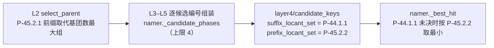
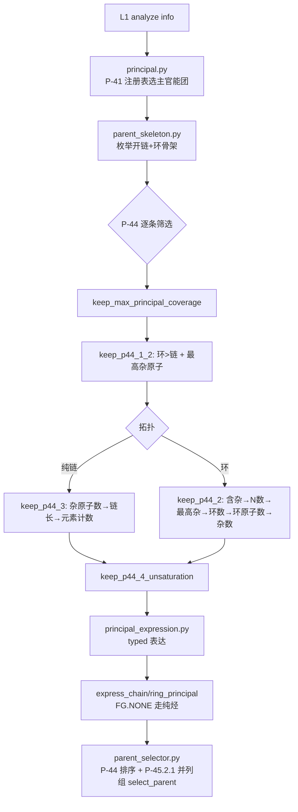
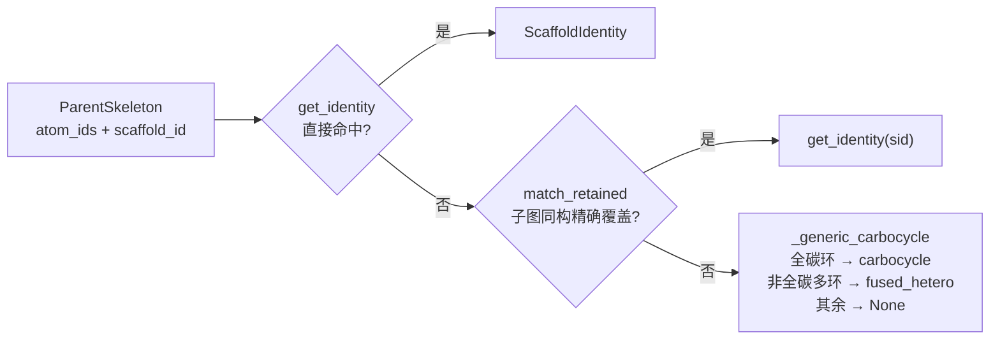
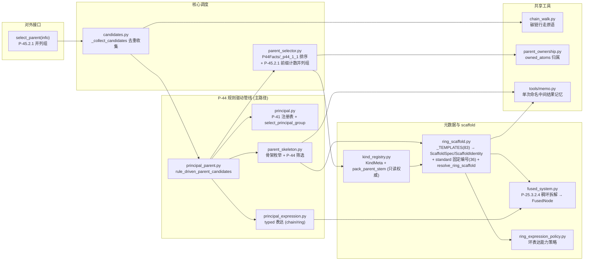

# Layer2: Parent Selector（母体选择器）

> **文件数:** 12 modules（不含 `__init__.py`）| **代码:** 2,077 行 | **最后更新:** 2026-09-13
> **职责:** 给定 layer1 的官能团 (FG) 信息字典，按 IUPAC P-44 选出母体结构 (parent hydride)

---

## 概述

Layer2 是 NamePredict 六层流水线中逻辑最复杂的一层。它接收 layer1 `analyze()` 产出的 FG 信息字典（`fg_inventory` 承载全部官能团、环系、不饱和键的结构化描述），从中选出一个 **母体结构 (parent)**——即 IUPAC 命名中作为骨架的核心部分。母体的选择决定了后续所有层的命名方向：layer3 基于母体提取取代基，layer4 在母体骨架上编号，layer5 基于母体类型组装最终名称。

Layer2 由 12 个模块（不含 `__init__.py`）组成：**① 骨架识别在 `ring_scaffold.py`**（`_TEMPLATES` 为唯一事实来源，83 条保留模板，每条可选 `standard = (labels, order)` 二元组承载固定编号，import 期 `_validate_standard_fields()` 校验其与模板原子数一致，并派生 ScaffoldSpec/ScaffoldIdentity/`_STANDARD_LABELS`/`_STANDARD_ORDERS`）；**② kind 正交化**（纯烃/未注册稠环 kind 为 `alkane`，数量由 `principal_expression_facts.multiplicity` 承载，无 diacid/diol/diamine 等数量 kind）；**③ 互斥由 `select_principal_group` 结构性单选择实现**（无 `_no_fgs` 谓词）；**④ 无 `parent_candidate.py`/`scoring.py`/`ring_parent.py`/`candidate_gate.py`/`arene_carbonyl.py`/`parent_core.py`/`identity.py`/`fg_helpers.py`**——P-44 排序键 `P44Facts`/`ParentCandidate`/`principal_key`/`_p44_1_1`（`parent_selector.py:7/14/21/26`）内联于本层入口，kind_registry 无 `_KIND_CLASS`/`_load_chain_fg`/`all_kinds`/`is_hetero_ring`/`is_carbo_ring`/`n_rings_of`/`retained_bonus`；**⑤ 稠环拆解由 `fused_system.decompose_fused_system` 承担**（P-25.3.2.4，组分匹配经 `match_fusion_component`：mancude 保留名优先、其次 P-25.3.2.2.1 单环烃附加组分），产出 `fused_tree` 供 L5 稠合名组装，独立于 scaffold 身份；**⑥ P-45.2 分工**——L2 `select_parent` 交出 **P-45.2.1** 并列最优候选组，**P-45.2.2** 位次集合须 L4 编号后才可得，由 L4 `candidate_keys.prefix_locant_set` 给出、`namer._best_hit` 裁决；**⑦ 磷酸链母体**——kind `phosphate` 经 `_chain_phosphate_fields` 携带 `n_oh`/`n_om`/`n_arms`/`salt_meta` 供 L5 组装，母体原子归属取骨架锚点+特征原子；**⑧ 单次命名记忆**——`_hydrogenated` 重建（`ring_scaffold.py:231`）与 P-44.4 不饱和度键（`parent_skeleton.py:214`）经 `tools/memo` 记忆，`sssr_rings`（`layer1/ring_systems.py:14`）统一环访问，纯性能优化不改命名结果。

### 输入与输出

| | 类型 | 关键字段 |
|---|---|---|
| **输入 (info)** | `dict` | 13 个键：`analyze()` 产出的 11 个（`mol` (RDKit Mol), `carbon_ids`, `n_carbons`, `fg_inventory`, `double_bonds`, `triple_bonds`, `rings`, `n_rings`, `has_ring`, `ring_systems`, `n_ring_systems`），`namer._name_mol` 再注入 `root_ctx` 与 `salt`；全部布尔标志只有 `has_ring` 一个，FG 存在性一律由 `fg_inventory` 内容判定 |
| **输出 (parent)** | `list[dict]` | `select_parent` 返回 **P-45.2.1 并列最优候选组**（无候选时空列表）；每个元素含 `chain` (原子序号列表), `kind` (母体类型), `n_carbons`, `owned_atoms` (frozenset), `stem_en`, `stem_zh`, `scaffold_id`, `scaffold_identity`, `scaffold_match`, `principal_expression_facts`, `principal_occurrences`, `principal_group_count`, `covered_principal_ids`, `numbering_scaffold`, `hydro_atoms`, `fused_tree`，以及 FG 专属字段如 `radical_c_idx`/`acyl_c_idx`, `double_bond` 等 |

---

## 核心逻辑

### 候选生成架构

Layer2 采用 **P-44 规则驱动主链管线** 作为唯一候选生成路径。对外入口只有一个：`select_parent`（`parent_selector.py:69`）——排序后返回 **P-45.2.1 并列最优的候选组**（列表），组内稳定序按候选原始次序。

```
select_parent(info)   # 对外唯一入口 (parent_selector.py)：P-44 排序降序 → P-45.2.1 前缀计数 → 并列最大组
└─ _collect_candidates(info)                # 候选收集+去重 (candidates.py:29)
   └─ rule_driven_parent_candidates(info)   # P-44 规则管线 (principal_parent.py:45)
      ├─ select_principal_group             # P-41 注册表选主官能团
      ├─ select_principal_skeletons         # 枚举+筛选骨架 (P-44.1/2/3/4)
      └─ express_ring/chain_principal       # typed 表达
```

候选经 `_finalize_ranked`（`parent_selector.py:57`）终态化：`_rank_candidates`（`:32`，P-44 键降序）→ `pack_parent_stem`（`kind_registry.py:65`，注入 stem 与编号 scaffold facts）→ `finalize_parent_ownership`（`parent_ownership.py:37`，固化不可变 owned_atoms）。随后 `_reorder_p45_2`（`parent_selector.py:44`）按 **P-45.2.1 以前缀引用的取代基团数目最多** 稳定重排打平候选——计数由 `_p45_2_prefix_count`（`parent_selector.py:37`）给出，= owned_atoms 边界外 L3 `iter_claims`（`layer3/claimable_block.py:163`）枚举的 claim 个数；`tied=True` 时只返回并列最大组。**P-45.2.2/2.3 的位次需 L4 编号后才可得**，故 L2 交出的并列组由 `namer._candidate_phases`（`namer.py:175`）逐候选跑 L3–L5（上限 `_MAX_TIED_CANDIDATES = 4`，`namer.py:107`），再由 `namer._best_hit`（`namer.py:154`）按 L4 `candidate_keys` 的 `suffix_locant_set`（P-44.1.1）/`prefix_locant_set`（P-45.2.2）裁决。选不出候选时**不回退烷烃兜底**：`select_parent` 返回空列表，`namer._run_candidates` 以 `no_assemblable_candidate` 显式失败。



> **源:** `src/namepredict/layer2/parent_selector.py`, `src/namepredict/layer2/candidates.py`

### P-44 规则驱动主链管线

这条管线按 IUPAC P-44 条款逐步筛选，由四个模块协作，全部为无副作用纯函数、可单测：



1. **`principal.py`** — `select_principal_group()`（`:70`）按 `PRINCIPAL_REGISTRY`（`principal.py:48`，由 `FG_SPECS` 派生，P-41 class 优先级）选出主官能团类。注册表把 FG 按 `PrincipalExpression` 分档表达权限，**当前 `FG_SPECS` 的 14 个条目全部为 `expr="suffix"`**（radical/acyl/acid/phosphate/anhydride/ester/acyl_halide/amide/nitrile/aldehyde/ketone/alcohol/thiol/amine），`compatibility_rank` 全为 0——枚举里保留 `PREFIX_ONLY`/`LEGACY_COMPAT` 两档但无条目使用。`feature_spec()`（`:53`）查任意档规格，`principal_spec()`（`:58`）只放行 SUFFIX 类（故二者对当前注册表等价）。选择逻辑为 `min(eligible, key=priority)`，`PrincipalPriority`（`:16`，`(p41_class, p43_path)` 可比较排序，数值小者优先）；无合格主基团时返回 `PrincipalGroupSelection(FG.NONE, ())`，下游以 `FunctionalGroupClass.NONE` 走纯烃表达。

2. **`parent_skeleton.py`** — `enumerate_principal_skeletons()`（`:266`）从主官能团的附着点出发枚举**开链候选**（`_chain_candidates`，`:118`）与**环系统候选**（`_ring_candidates`，`:111`，每个 ring system 一个骨架，`scaffold_id` 留空延迟到表达阶段识别）。随后 `select_principal_skeletons()`（`:253`）依次施加 `keep_max_principal_coverage`（`:198`）→ `keep_p44_1_2`（`:147`，混合拓扑时环优先 + 最高优先级杂原子，= `keep_ring_over_chain` `:141` ∘ `keep_senior_atom` `:134`）→ 按拓扑走 `keep_p44_3`（`:169`，纯链）/ `keep_p44_2`（`:191`，环）→ `keep_p44_4_unsaturation`（`:240`）。**P-44.4 不饱和度统计把芳香键按 Kekulé 双键当量计入**（键 `p44_4_unsaturation_key` `:214`：芳香键 `//2` 计入多重键与双键数，如苯 = 3；实际计算在 `_p44_4_unsaturation_key_uncached` `:223`），使不饱和芳香环优先于同环数饱和环（P-44.4.1.1 标准 a）；主官能团特征原子间的多重键经 `_principal_multiple_edges`（`:204`）剔除不计入。键值经 `memo.by_key`（`tools/memo.py:41`）记忆，避免每个候选被求两次键时重复扫全分子键。
   - **等长最长链全枚举**（`_open_chains`，`parent_skeleton.py:68`）— 穿过锚点的**全部等长最长开链**都作候选（`_all_chains_through`，`chain_walk.py:102` 逐一枚举组件与最深叶子），避免单条 DFS 任选一路丢掉平局候选（如醛端 C3 连甲基端与羟甲基端同长，须两条都留让 P-44.4/P-45.2 裁决主链）；两锚点之间由 `_pair_chains`（`:61`）经 `_chain_through_two`（`chain_walk.py:183`）生成。无锚点（纯烃）时退化为 `_longest_chain`（`chain_walk.py:63`）作唯一开链骨架。
   - **降级叶碳禁走**（`_demoted_leaf_carbons`，`parent_skeleton.py:53`）— L1 判为降级叶的中性羧酸碳（carboxy 叶）与腈碳（cyano 叶）组成 `banned` 集合传入链游走：这些碳不得进入开链主链（P-44.3 链不含取代基羧基碳），否则词干链会把酸/腈碳当饱和碳吞掉、杂原子悬空误命名成 hydroxy/amino。

3. **`principal_expression.py`** — 把选定的骨架表达为 parent dict（统一经 `_parent_dict`，`:130`）：
   - `express_chain_principal()`（`:446`）— 开链主官能团经 `_chain_kind`（`:71`）按多重度映射 kind：`_CHAIN_FG` frozenset（`:45`，由 `fg_registry.chain_fgs()` 派生 12 类：acid/acyl/acyl_halide/alcohol/aldehyde/amide/amine/ester/ketone/nitrile/phosphate/thiol），`_MULTI_FG`（`:46`，由 `fg_registry.multi_fgs()` 派生 7 类：acid/alcohol/amide/amine/ester/ketone/thiol）。**ACYL → `"acyl"`**（酰基残基：羰基头为 locant 1，L5 拼 -oyl/酰，P-65.1.7.2）；**RADICAL → `"radical"`**（稳定 `radical_c_idx` 由 L4 承载，L5 worker 拼 -yl/-ylidene）；其余 FG 类别：**在 `_MULTI_FG` 内且 count≥1 恒返回基团名**（acid/ester/amide/alcohol/ketone/amine/thiol，数量由 `principal_expression_facts.multiplicity` 承载），**不在 `_MULTI_FG` 者仅单基**（acyl_halide/nitrile/aldehyde/phosphate，count≠1 → None）。骨架内 C=C/C≡C 带 `double_bond`/`triple_bond`/`double_bonds` 字段；`acyl_halide` 经 `_chain_acyl_halide_fields`（`:432`）携带 `hal_idx`/`hal_z`（卤素纳入母体原子，不作取代基）；**`phosphate` 经 `_chain_phosphate_fields`（`:346`）携带 `n_oh`/`n_om`/`n_arms`/`salt_meta`**——盐门控不通过（n_om>0 时碱金属数不配对、或中性酸/酯带金属）时返回 None 使该候选不可表达（P-67.1.3.2 磷酸酯 / P-41 类别 7d 游离磷酸）
   - `express_ring_principal()`（`:256`）— 环骨架：`resolve_ring_scaffold` 解析骨架身份。**环 + 主 FG 一律收敛为 FG 类别 kind**（`_ring_kind` `:176`，苯/饱和环/未注册稠环/杂环平等），词干由 scaffold 承载；苯保留名（benzoic/phenol/aniline 等）由 L5 chain_engine variant 提供；环酸经 `_expression_flags`（`:93`）补 anion 标志；**环外酰卤（苯甲酰卤等）同样经 `_chain_acyl_halide_fields` 补 `hal_z`/`hal_idx`**（`express_ring_principal` `:278`，卤素随实际 F/Cl/Br/I 选后缀、纳入母体原子）
   - **环醛 -carbaldehyde/-dicarbaldehyde / 环外酰基头** — `_ring_kind`（`principal_expression.py:176`，ALDEHYDE 分支 `:186`）对骨架 + ALDEHYDE 主基团返回 kind `"aldehyde"`：环上外环 -CHO 可多个同作主官能团（P-66.6.1.1.3）；aldehyde 不在 `_MULTI_FG`，故仅环骨架放行、开链单醛以外表达不变。**环外 ACYL（苯甲酰/furan-2-carbonyl）经 `_chain_kind` → kind `"acyl"`**（环酸衍生酰基，P-65.1.7.2）。`_ring_fact_fields`（`principal_expression.py:196`）的单附着点组含 ALDEHYDE 与 **ACYL** → 设 `ring_attach_idx`（环附着原子位次供 L4 算 -carbonyl/benzoyl 词形 locant；ACID/ESTER/AMIDE/NITRILE 同组）
   - **稠环接入** — `_scaffold_fields`（`:208`）解析 scaffold 身份外，额外：① 保留模板一律取 `scaffold_match`（`_match_with_map` 的模板→分子原子映射，供 L4 固定编号 `standard_path` 与加氢位换算）；② 同时写入 `typed_ring_expression_supported`（经 `supports_ring_expression`）与 `hydro_atoms`；③ 多环骨架（sssr_indices≥2）调 `decompose_fused_system` 产出 `fused_tree`（`FusedNode`）——**拆解独立于 scaffold 身份**，未注册系统 scaffold=None 时仍产出，供 L5 `fused_namer` 组装稠合名
   - **不饱和表达与 mancude 位屏蔽** — `_chain_unsat_fields`（`:302`，键/列表字段由 `_unsat_bond_fields` `:288` 组装）给骨架内 C=C/C≡C 写 `double_bond(s)`/`triple_bond(s)`；保留 mancude 母体覆盖的环内多重键由母体名隐含，经 `_implied_ring_atoms`（`:336`，取 `ring_scaffold.mancude_ring_atoms`；无匹配但存在 `fused_tree` 时取整个骨架）从不饱和字段中剔除（否则得 `naphthalene-3-ene-1,2-dione` 这类自相矛盾串）；未注册的碳环（`scaffold_id == "carbocycle"`）由 `_kekule_ring_dbs`（`:315`）按 Kekulé 结构补回环内双键（tropolone 不至被写成饱和环）
   - **kind 正交化扩充** — `_resolved_ring_kind`（`:165`）：苯与未注册稠环（`scaffold.id ∈ {"fused", "fused_hetero"}`）一律收敛 `alkane`；`_generic_ring_kind`（`:152`）：未注册芳香稠环（≥2 环）再收敛 `alkane`、纯碳环收敛 `alkane`，环内成环三键（`_ring_endocyclic_triple` `:144`）不作芳香处理；`_ring_kind`（`:176`）：RADICAL + scaffold=None（未知杂环无 `-yl` 词干）显式返回 None 而非当开链烷基错名
   - 每个候选携带 `PrincipalExpressionFacts`（`:33`：group_class/multiplicity/relation/occurrence_ids/characteristic_atoms/anchor_atoms/attachment_atoms/charge_state）与 `ScaffoldIdentity`
   - **无主官能团（纯烃）走同一对表达函数** — `select_principal_group` 返回 `FG.NONE` 后，`_chain_kind(FG.NONE, 0)` 给开链 `"alkane"`，环骨架由 `_resolved_ring_kind`/`_generic_ring_kind` 决定；**非芳香环/未注册稠环/苯环 kind 恒为 `"alkane"`**（不饱和度由 `double_bond(s)` 字段承载），芳香杂环命中保留 scaffold 时 kind=scaffold.id（如 `pyridine`/`naphthalene`）

4. **`principal_parent.py`** — `rule_driven_parent_candidates()`（`:45`）编排以上：`select_principal_parent_skeletons`（`:21`）选主官能团与骨架 → 按拓扑走 `_express_selected`（`:34`，环酮 typed 不支持时经 `_unsupported_typed_ring` `:28` 过滤）。（无独立的纯烃表达分支。）

> **源:** `src/namepredict/layer2/principal.py`, `src/namepredict/layer2/parent_skeleton.py`, `src/namepredict/layer2/principal_expression.py`, `src/namepredict/layer2/principal_parent.py`

### 杂原子锚点自由基（表 2.1 单核母体氢化物）

单一杂原子锚点的自由基（`*O-`、`*NH-`、`*P(=O)<` 等）由 `_mononuclear_radical`（`principal_expression.py:398`）收敛为**单核母体氢化物骨架**（P-15.4.1 表 2.1）：把 chain 限定为单原子、注入 free 名（oxidane/azane/sulfane/phosphoryl 等），碳侧链留给 L3，L5 经 `free_to_yl`（`layer5/assembler.py:280`）转标准取代基名（去氢即 hydroxy/oxy、amino、sulfanyl）。仅支持单一锚点。

词干必须把**锚点的氧化态/自由价键级**写进去，否则不同分子同形（氧被整段丢弃）。词表常量位于 `src/namepredict/constants.py`：

| 元素 | 判定依据 | 词干 |
|---|---|---|
| N | `_anchor_free_double`（`principal_expression.py:373`）自由价键级 | `NITROGEN_STEM_BY_FREE_DOUBLE`（`constants.py:139`）：单键 azane/氮烷、双键 imine/亚胺（P-66.1.1） |
| O | — | `MONONUCLEAR_BY_ELEMENT[O]` = oxidane/氧化烷 |
| S | `_anchor_oxo_count`（`principal_expression.py:384`）的 =O 数 | `SULFUR_STEM_BY_OXO`（`constants.py:137`）：0 sulfane/硫烷、1 sulfinyl/亚磺酰、2 sulfonyl/磺酰（P-63.2.2） |
| P | `_anchor_oxo_count` 的 =O 数 | `PHOSPHORUS_STEM_BY_OXO`（`constants.py:138`）：0 `phosphanyl`/磷烷基、1 `phosphoryl`/磷酰 |

`MONONUCLEAR_BY_ELEMENT`（`constants.py:136`）给出元素→默认 free 名（表 2.1 每元素一行），中英名与去氢取代基名由 `MONONUCLEAR_HYDRIDES`（`constants.py:126`）统一承载。

**P 词干**（P-67.1.4.1.1.2 磷酰基 `phosphoryl` –P(O)<；P-67.1.4.1.1.6 亚磷酸 `phosphanyl`）：=O 数非 0/1 时（如二氧代磷烷）无对应酰基词干，`_mononuclear_radical` 返回 None 明确失败，不落一个氧化态错位的名字。

> **源:** `src/namepredict/layer2/principal_expression.py:398`, `src/namepredict/constants.py:126-143`

### Kind Registry: 母体元数据中心

`kind_registry.py`（99 行）是 Layer2 的**母体元数据注册中心 (Registry Authority)**，存储 scaffold 母体种类 (kind) 的元数据并在导入时 bootstrap：

- **`KindMeta`**（`kind_registry.py:7`）: 每个 kind 的中英词干 (`en`, `zh`) 与环元数据 (`ring`, `n_rings`, `retained`)
- **bootstrap 顺序**（`_bootstrap` `:94`）**只有一步**：`_load_from_scaffold_specs()`（`:83`）— 从 `ring_scaffold.all_specs()` 读取有词干的 spec，注册为 kind 元数据（**Spec 是词干权威**）。主官能团等级不存于 `KindMeta`，运行时按 FG 类经 `PRINCIPAL_REGISTRY` 查询
- 公共 API: `get`（`:20`）/ `parent_names`（`:25`）/ `pack_parent_stem`（`:65`）
- **`pack_parent_stem` 前缀注入**（`:65`）— 词干缺失时按 `scaffold_id`（回落 `kind`）取 kind 词干，五元杂环 locant 前缀（`1H-`/`1,3-`）在此统一成终态：`1,3-` 二唑（噻唑/噁唑/苯并噻唑/苯并噁唑）无条件注入；`1H-` 吡咯型（吡咯/咪唑/吡唑/四唑/吲哚/吲唑/苯并咪唑/咔唑/吩噻嗪）仅当环含未取代芳香 NH 时注入（`_ring_keeps_nh_prefix`，`:44`，N 全取代则省略）；词干已带前缀（注册表 indole="1H-indole"）先 `_strip_locant_prefix`（`:55`）剥离再按条件加回，保证 N-取代 indole 输出 "indol-…"；**词干若把 locant 前缀嵌在词中而非词首，则由 `_embeds_locant_prefix`（`:60`）拦下、前缀留在组分名前不动**（局部不饱和保留名词干自带加氢前缀，如 `2,5-dihydro-1H-pyrrole` 的 `1H-`，再前移会重复位次）；末尾 `_attach_numbering_scaffold`（`:33`）经 `ring_scaffold.numbering_scaffold_facts` 附编号 scaffold facts（`numbering_scaffold`/`numbering_scaffold_required`）

kind_registry 是**只读权威**：被 `parent_selector._finalize_ranked`（`pack_parent_stem` 注入 stem）消费，不存在对外注册入口；模块内不提供 `is_hetero_ring`/`is_carbo_ring`/`n_rings_of`/`retained_bonus` 等评分派生集合。

> **源:** `src/namepredict/layer2/kind_registry.py`

### Ring 骨架识别机制（`ring_scaffold.py`）

`ring_scaffold.py`（487 行）以 `_TEMPLATES`（SMILES 模板表）为**唯一事实来源**，派生 ScaffoldSpec/ScaffoldIdentity、固定编号视图与保留条目。职责分三块：

1. **模板注册表（唯一来源）** — `_TEMPLATES`（`:71` 起，**83 条**保留母体，每条 `{smiles, stem_en, stem_zh, naming_class}`，可选的**稠合命名零件字段** `fused`（该环可作稠合组分）/`fused_stem`（去指示氢的组分词干覆盖，如 1H-indole→indole）/`fused_prefix`（附加组分保留前缀，P-25.3.2.2.3；组分中表征结构的位次须写进方括号）；经 `component_stem()`（`:159`，`fused=False` 时返回 None）/`retained_fusion_prefix()`（`:167`）读取，由 `fused_system._decompose` 打包进 `FusedNode` 下发 L5）；`_spec_from_template`（`:359`）派生 ScaffoldSpec（n_rings/ring 从 smiles 算，retained=True），`all_specs()`（`:393`）/`get_spec()`（`:388`）/`get_identity()`（`:383`）均由此派生；`kind_registry._load_from_scaffold_specs` 据此注册 KindMeta 词干（活接线，防清扫判死）。83 条按 `naming_class` 分布：`monohetero` 53 / `naph_family` 9 / `fused56` 8 / `xanthene` 2，以及 `mono_carbo`/`anthra`/`phenanthrene`/`pyrene`/`chrysene`/`carbazole`/`acridine`/`phenothiazine`/`benzodioxole`/`purine`/`steroid` 各 1。覆盖：
   - **碳环/稠环**：benzene / naphthalene / anthracene / phenanthrene / pyrene / chrysene / indene（1H-茚，`fused_stem=("indene","茚")`）
   - **芳杂环（单环）**：furan / thiophene / pyrrole / pyridine / pyridazine / pyrimidine / pyrazine / pyran / imidazole / pyrazole / oxazole / thiazole / isoxazole（1,2-噁唑）/ thiazole12（1,2-噻唑）/ triazole（1,2,4-三唑）/ tetrazole / triazine（1,3,5-三嗪）/ triazine124（1,2,4-三嗪）/ tetrazine1245 / dioxine（1,4-二噁英）/ oxadiazole124/134/125 / thiadiazole134/124 / thiazine13
     - **带方括号的稠合前缀**：oxazole / thiazole / isoxazole / triazole / triazine / dioxine 及全部噁/噻二唑、噻嗪条目。依据 P-25.3.1.3——组分中表征结构的位次（杂原子位置）在稠合名中置于方括号内；P-25.3.2.1.2 又强制 isoxazole/oxazole/thiazole 在稠合名中改用 Hantzsch-Widman 名 1,2-/[1,3]-。通用「去尾 e 加 o」规则会漏掉方括号（`1,2,4-triazolo` ≠ `[1,2,4]triazolo`）
     - **tetrazole / triazole / 吡咯型 `1H-` 条件化**：`locant_prefix="1H-"` + `prefix_nh_conditional=True`——N1 被取代时环上无 NH，不写 `1H-`
   - **饱和杂环**：pyrrolidine / piperidine / morpholine / piperazine / oxolane（以上 `fused=False`，不作稠合组分）+ oxane / oxirane / aziridine / oxetane / azetidine / thiolane / thiane / oxepane / azepane / oxazepane / thiazepane（`fused=True`）
   - **双氧/三氧饱和环与饱和 5 元双杂环**：dioxolane / dioxane / trioxane / oxazolidine / imidazolidine / thiazolidine
   - **部分不饱和环**（P-22.2.2 加氢前缀）：dihydrofuran / dihydropyran / dihydropyrrole / dihydroimidazole / dihydrothiazole
   - **fused**：indole / indazole / benzimidazole / benzofuran / benzothiophene / benzothiazole / benzoxazole / carbazole / acridine / phenothiazine / benzodioxole / quinoline / isoquinoline / quinazoline / quinoxaline / cinnoline / chromene / isochromene / purine（`naming_class="purine"`）/ pteridine（`naph_family`）
   - **传统编号保留母体**：xanthene / thioxanthene（同 `naming_class="xanthene"`）/ cyclopenta[a]phenanthrene（`naming_class="steroid"`，甾体）

   `ScaffoldSpec`（`:22`）携带 `stem_en`/`stem_zh`/`naming_class`/`n_rings`/`ring`/`retained`/`numbering`（`NumberingPolicy` `:13`）、`locant_prefix`（`1H-`/`1,3-`/`1,2-`/`1,3,5-` 等前缀；benzofuran/benzothiophene 为 `1-`）、`prefix_nh_conditional`（`1H-`/`7H-`/`9H-`/`10H-` 仅当环含 NH 注入）；`NumberingPolicy` 只含 `standard_path`/`materialize_plan`/`anchors`/`substitutable`。**固定编号由模板条目的 `standard = (labels, order)` 二元组声明**——`order` 是模板原子按 locant 顺序的下标排列，`labels` 为对应 locant 标签，`_STANDARD_LABELS`（`:206`）/`_STANDARD_ORDERS`（`:209`）由 `standard` 字段派生（**共 36 条登记**），二者与 `smiles` 同条目存放，避免改 SMILES 后编号静默错位；import 期 `_validate_standard_fields()`（`:214`）校验 `order` 是 `0..n-1` 的排列且 `labels` 长度等于模板原子数，不符即 `ValueError`。标签表含 **`FUSED56_LABELS`（`:59`，9 项，桥头 3a/7a）**、**`PURINE_LABELS`（`:60`，9 项纯数字，桥头 C4/C5 无 a/b 字母位）**、`CARBAZOLE_LABELS`（`:61`）/`ACRIDINE_LABELS`（`:62`）/`PHENOTHIAZINE_LABELS`（`:63`）、`NAPH_LABELS`（`:64`，pteridine/喹啉系/噌啉/色烯系复用）、**`ANTHRACENE_LABELS`（`:65`，14 位：端环 1–4 / 5–8、中环 9/10 为全数字、桥头 4a/10a/8a/9a）**、`PHENANTHRENE_LABELS`（`:66`）、`PYRENE_LABELS`（`:67`）、**`XANTHENE_LABELS`（`:68`）/`STEROID_LABELS`（`:69`，1–17 全数字）**。**蒽的 `standard` 段落按 P-25.4.1 传统编号登记**：与萘不同，蒽的中环碳得数字位（9/10）而非字母位，缺该字段时蒽退到 P-25.3.3 通用外周编号、位号形态错成 `1,2,3,4,4a,5,5a…`。`oxane`/`quinoxaline` 的 stem_zh 对齐 IUPAC 中文（oxane「氧杂环己烷」`ring_scaffold.py:100`、quinoxaline「喹喔啉」`ring_scaffold.py:132`）
2. **环解析** — `resolve_ring_scaffold(info, skeleton)`（`:477`）优先级：① `get_identity(skeleton.scaffold_id)` 直接命中 → ② `_matched_id` → `match_retained`（`:410`，SMILES 模板子图同构，按环原子集精确覆盖）→ ③ `_generic_carbocycle`（`:464`）：全碳环 → `ScaffoldIdentity("carbocycle",...,1,"carbo")`；非全碳多环（`sssr_rings` 计 ≥2 环）→ `fused_hetero`；其余 → None（显式失败，避免当开链烷基错名）
3. **固定编号匹配** — `match_retained`（`:410`）/`_match_with_map`（`:416`）在子图同构命中时返回 `(sid, match)`，`match[i]` 给出模板原子 i 对应的分子原子——L4 `standard_chain`（`:451`）据此把模板固定 locant 序映射到分子原子（供 `numbering_engine._fixed_numbering` 固定编号）；`locant_prefix(spec_id)`（`:443`）返回 (en, zh, nh_conditional) 供 `kind_registry.pack_parent_stem` 注入词干。两者均带 `mancude_only` 参数：**只认 `fused` 保留名作稠合组分**（P-25.2.1 表 2.8），饱和保留名（吡咯烷/哌啶等）不作稠合零件；精确匹配失败后按完全氢化骨架（`_Q_H`，`:246`，由 `_hydrogenated` `:231` 经 `memo.by_mol` 构建）再比对，支持加氢衍生物（P-25.3.4）



**新增 ring 母体的步骤:**
在 `ring_scaffold.py` 的 `_TEMPLATES` 加一条 `{smiles, stem_en, stem_zh, naming_class}`（ScaffoldSpec 自动派生；无 `_TOPOLOGY` 表与手写 `_ALL_SPECS`）；需要词干 locant 前缀时补 `locant_prefix`/`prefix_nh_conditional`，需要固定编号时在该条内加 `standard = (labels, order)`（`order` 须为模板原子下标排列、`labels` 数须等于模板原子数，`_validate_standard_fields` 在 import 期把关）；需要作稠合零件时补 `fused`/`fused_stem`/`fused_prefix`（饱和保留名保持 `fused=False`）；**`fused_prefix` 若含位次（杂原子位置、Hantzsch-Widman 位次）必须带方括号**（P-25.3.1.3 / P-25.3.2.1.2），不能依赖通用「去尾 e 加 o」规则。固定编号标签常量（`FUSED56_LABELS`/`PURINE_LABELS`/`NAPH_LABELS`/`ANTHRACENE_LABELS`/`XANTHENE_LABELS`/`STEROID_LABELS` 等）集中声明于 `_TEMPLATES` 上方，条目内 `standard` 直接引用。位置异构体在元素标注的子图同构下天然区分，无需额外消解。详见 [[guides/adding-new-ring-system]]。

> **源:** `src/namepredict/layer2/ring_scaffold.py`

### 指示氢与加氢位（P-58.2.1 / P-31.2.2）

三个由 `match`（模板原子→分子原子映射）驱动的原子集函数，结果由 `_scaffold_fields` 挂进 parent dict 供 L4 使用：

- **`mancude_ring_atoms(scaffold_id, match)`**（`ring_scaffold.py:274`）— 保留 mancude 母体名的**整个不饱和环**（模板中含 Kekulé 双键的环）映射到分子后的原子集：该集合内部的 C=C 由母体氢化物名隐含（P-31.1.2），不得再写成 -ene/-yne。`_kekule_double_atoms`（`ring_scaffold.py:255`，按 sid 缓存）把芳香键化为确定双键，避免稠合单键（萘 4a-8a）被误当不饱和度；消费方为 `principal_expression._implied_ring_atoms`（`principal_expression.py:336`）
- **`extra_indicated_atoms(mol, scaffold_id, match)`**（`ring_scaffold.py:283`）— 保留母体名未隐含、而分子中该位带 H 的原子（P-58.2.1 须显式标指示氢），如 1H-喹啉-4-酮的 N1、1H-嘧啶-2,4-二酮的 N1/N3；仅对**稠合母体**（≥2 环、模板原子数相符）、**非碳原子**、**模板该位无 H 而分子有 H 且芳香** 时成立。单环 mancude 杂芳环（吡啶/嘧啶）的 `[nH]` 是内酰胺-内酰亚胺互变异构写法，位次由母体名与后缀共同固定，不标指示氢。L4 经 `numbering._extra_indicated`（`layer4/numbering.py:115`）消费
- **`hydrogenated_atoms(mol, scaffold_id, match)`**（`ring_scaffold.py:300`）— 被加氢的分子原子集（P-31.2.2：hydro 修饰源于双键的饱和），由 `_scaffold_fields` 直接产出 `hydro_atoms`。规则：模板某位承载 Kekulé 双键、而分子中该位已全单键且 `GetTotalNumHs() > 0` 者记为加氢位（季碳、4,4-二甲基型位加不了 H，不占 hydro 位次，交给指示氢）；环内碳带**环外**多重键（=O/=N 后缀位）记入 `suffix` 集不占 hydro 位。环杂原子失去双键后新增的 H 由指示氢承载、不计入 hydro 计数——仅在剔除后计数合法（偶数，落进 `layer4/hydrogenation.HYDRO_MULT_N`，`constants.py:159`）时剔除，否则保留原集合（如 1,2-二氢吡啶：N1+C2 恰为 2）；剔除后计数仍为奇数且存在 `suffix` 时，再剔除一个与后缀位相邻的加氢位，使 naphthalen-1-one 得「2H」+「3,4-dihydro」而非整体放弃

### P-25.3.2.2.1 单环烃附加组分

稠环拆解与稠合命名的附加组分词头由两类来源提供：`_TEMPLATES` 条目的 `fused_prefix`（保留母体附加组分，P-25.3.2.2.3），以及 **`_FUSION_CARBOCYCLES`**（`ring_scaffold.py:339`，**6 条**一级单环烃附加组分）：环丙烷 / 环丁烷 / 环戊烷 / 环己烷 / 环庚烷 / 环辛烷 → `cyclopropa`/`cyclopenta`/… 与 `环丙并`/`环戊并`/… 前缀。这些**不入 `_TEMPLATES`**：入表会让单环骨架解析成保留名、破坏 P-31 单环通用路径（carbocycle 按环大小动态命名），它们也不是母体组分（P-25.3.2.1.1：单环烃母体用 [n]annulene/苯）。

- `_cyclo_component_query(smiles)`（`ring_scaffold.py:349`）由环状 SMILES 的原子数派生纯碳环 SMARTS 查询；`_Q_CYCLO`（`:355`）/`_CYCLO_ELEM`（`:356`）在 import 时构建查询与元素签名
- `fusion_carbocycle_prefix(sid)`（`ring_scaffold.py:175`）返回 (en, zh)；`retained_fusion_prefix(sid)`（`:167`）未命中 `_TEMPLATES` 时回落到它
- `match_fusion_carbocycle(info, atom_ids)`（`ring_scaffold.py:186`）元素签名预过滤 + 骨架子图同构，精确等于某单环烃时返回 sid
- `match_fusion_component(info, atom_ids)`（`ring_scaffold.py:200`）= `match_retained(..., mancude_only=True)` 优先，其次 `match_fusion_carbocycle`——稠环拆解的组分匹配统一入口
- `omits_fusion_numbers(sid)`（`ring_scaffold.py:181`）— 稠合描述符是否省略数字位次（P-25.3.8.1）：苯及一级单环烃附加组分省略，经 `FusedNode.fused_omit_numbers` 下发 L5

### 稠环拆解 (fused_system.py)

`fused_system.py`（231 行）实现 **P-25.3.2.4 稠环拆解**——把含 ≥2 环共享 ≥2 原子的稠合环系拆成**保留母体组分树**（`FusedNode`），供 L5 `fused_namer` 组装 `benzo[a]...`/`naphtho[...]...` 类稠合名。这是**未注册稠环**（无整体保留 scaffold）的命名通道：母体/附加组分均为已注册保留件（或 P-25.3.2.2.1 单环烃），但整体系统不在 `_TEMPLATES` 内。

核心数据结构 `FusedNode`（`fused_system.py:24`）：

```python
@dataclass(frozen=True)
class FusedNode:
    scaffold_id: str                 # 母体组分保留模板 id
    atom_ids: tuple[int, ...]        # 组分原子
    ring_indices: frozenset[int]     # 组分所含环
    fusion_shared: tuple[frozenset[int], ...] = ()  # 与父组分的共享原子集（根节点为 ()）
    attached: tuple["FusedNode", ...] = ()          # 附加组分树（递归）
    # 命名组装数据：L2 打包期从 ring_scaffold._TEMPLATES 取好挂上，L5 只读（L5 不得 import L2）
    fused_stem: tuple[str, str] | None = None    # 组分词干 (en, zh)；None = 不可作稠合零件
    fused_prefix: tuple[str, str] | None = None  # 附加组分保留前缀 (en, zh)；None = 走通用规则
    fused_omit_numbers: bool = False             # 稠合描述符省略数字位次（P-25.3.8.1：一级单环烃附加组分）
```

拆解管线（`decompose_fused_system`，`:225`）：

1. **增长式候选枚举**（`_candidates_for`，`:47`）— 从"单环精确匹配某稠合组分"（`_seedable`，`:42`，用 `match_fusion_component`）的种子环 DFS 并入邻接环，`match_fusion_component` 精确命中记录候选，元素超集剪枝（`_has_template_superset`，`:36`，对照 `_TEMPLATE_COUNTS` `:17`），按原子集去重
2. **P-25.3.2.4 母体组分选择**（`_select_base`，`:85`）— 依次施加 (a) 最优先杂原子（`P25_SENIOR`，`constants.py:41`）→ (b) 环数 → (c) 环大小降序 → (d) 杂原子总数 → (e) 杂原子种类 → (f) 最高优先杂原子数（`P145_SENIOR`，`constants.py:42`）→ (g)-(j) 依赖 L4 优选取代/编号（`_numbered_locants`，`:153`，调到 L4 `fused_orientation.preferred_orientations` + `fused_numbering.number_fused_system` + `locant_calc.locant_key`）逐准则收窄（水平行环数 / 杂原子位次低 / 逐元素位次 / 稠合碳位次低）；每步经 `_keep_best`（`:79`），>1 时环集升序兜底
3. **递归拆解**（`_decompose`，`:200`）— 选定母体组分后，剩余环按融合图**连通分量**（`_ring_components`，`:174`）递归为附加组分，共享原子经 `fusion_shared` 下传；**同时把 `component_stem(sid)`/`retained_fusion_prefix(sid)`/`omits_fusion_numbers(sid)` 写进节点**（唯一构造点），使 L5 无需持有词干表的第二副本

入口 `decompose_fused_system(info, system)`（`:225`）读 `system["fusion_edges"]`/`sssr_indices`（L1 `build_ring_systems` 产出，`layer1/ring_systems.py:289`），环表经 `layer1.ring_systems.sssr_rings` 取，输出 `FusedNode | None`（无保留候选返回 None）。**拆解独立于 scaffold 身份**——未注册系统 `resolve_ring_scaffold` 解析为 None 时仍产出拆解树。

> **源:** `src/namepredict/layer2/fused_system.py`

### P-44 排序与并列裁决 (Seniority)

P-44 排序键内联在 `parent_selector.py`。`_rank_candidates`（`parent_selector.py:32`）以 `_p44_1_1`（`:26`）为键对候选做降序排序：

```python
(principal_group_class,   # FG 类别等级（principal_key 取 P44Facts 首维，rank=0 即无主官能团）
 principal_group_count)   # 主官能团实例数
```

`_p44_1_1` 经 `principal_key`（`:21`）构造 `ParentCandidate`（`:14`，候选 dict + P44Facts）后取 `P44Facts`（`:7`，`order=True` 的冻结 dataclass）。**当前 `principal_key` 传入的 FG 等级维为 `None`**（`P44Facts(None, int(parent["principal_group_count"]))`），故排序实际只按 `principal_group_count` 降序生效。

排序完成后进入 P-45.2 裁决：`_p45_2_prefix_count`（`parent_selector.py:37`）给出 P-45.2.1 键——**以前缀引用的取代基团数目**，即 owned_atoms 边界外 L3 `iter_claims` 枚举的 claim 个数；`_reorder_p45_2`（`:44`）按该计数降序稳定重排（`key=(-count, 原序)`），`tied=True` 时只保留并列最大组。

> **源:** `src/namepredict/layer2/parent_selector.py:26`

### 链 vs 环决策

母体选择的核心分歧点是**链状母体 vs 环状母体**，由 `parent_skeleton.keep_p44_1_2`（`parent_skeleton.py:147`，环优先 + 最高优先级杂原子）在筛选阶段解决：

1. **环系统候选**（`_ring_candidates`，`parent_skeleton.py:111`）— 每个 `ring_systems` 条目生成一个骨架（原子集排序后作 `atom_ids`）
2. **开链候选**（`_chain_candidates`，`parent_skeleton.py:118`）— 从主官能团附着点出发，经 `_open_chains`（`parent_skeleton.py:68`）产出**穿过锚点的全部等长最长链**（单锚点 `_all_chains_through`）与两两锚点最长链（`_pair_chains` `:61` / `_chain_through_two` `chain_walk.py:183`），并把 `_demoted_leaf_carbons`（羧酸/腈叶碳）作 `banned` 排除；`chain_walk.py`（188 行）提供 `_all_carbons`/`_side_count`/`_better`/`_best_among`/`_longest_chain`/`_seed_carbons`/`_all_chains_through`/`_component_leaves` 等碳链行走原语（经 `tools/chain` 借用 `_carbon_neighbors`/`_longest_from`，后者排除芳香碳和环碳，`banned` 全局禁走再排除羧酸/腈叶碳）。`_better`（`chain_walk.py:26`）长度优先、仅等长才数支链度；`_seed_carbons`（`chain_walk.py:35`）在开链为多碳树时仅用开链叶做种子等价加速最长链搜索。

当环候选不被评分选中或环无法承载特征官能团时，链状母体成为选择。

> **源:** `src/namepredict/layer2/parent_skeleton.py`, `src/namepredict/layer2/chain_walk.py`

### FG 优先级体系

官能团优先级遵循 IUPAC P-41，由 `principal.py` 的 `PRINCIPAL_REGISTRY`（`principal.py:48`）定义，**由 `fg_registry.FG_SPECS` 自动派生**（取 `sp.p41` 非 0 的条目，`_spec_from_fg` `:39`）。`PrincipalPriority`（`:16`）为 `(p41_class, p43_path)` 可比较元组，**数值小者优先**；`select_principal_group` 以 `min(...)` 取唯一主官能团，低优先级 FG 一律成为取代基。**`FG_SPECS` 的 14 个条目全部 `expr="suffix"`、`compat=0`**，故 `principal_spec`（`:58`）的 SUFFIX 门槛对当前注册表全部放行；`FG_SPECS` 内也没有 PREFIX_ONLY/LEGACY_COMPAT 档位的 FG 条目（ether/sulfide/isocyanate/isothiocyanate 等不在注册表内）：

| p41 | FG 类别 | kind 示例 |
|--------|---------|-----------|
| 1 | 自由基 (radical) | `radical`（L5 拼 -yl / -ylidene） |
| 1 | 酰基 (acyl) | `acyl`（P-65.1.7.2，羰基头 locant 1） |
| 7 | 羧酸 (acid) | acid（path=(1,)；链酸多基，`multi=True`） |
| 8 | 酸酐 (anhydride) | anhydride（注册但 `chain=False`，无链式酸酐表达） |
| 9 | 磷酸 / 磷酸酯 (phosphate) | phosphate（path=(1,)，`chain=True`、`multi=False`；游离磷酸为 P-41 类别 7d；L5 `phosphate.py` 按 `n_oh`/`n_om`/`n_arms` 组装，同分子含羧酸/羧酸酯时降级 phosphonooxy 前缀 P-67.1.5.1） |
| 9 | 酯 (ester) | ester（`multi=True`，多酯 kind 恒为 `ester`） |
| 10 | 酰卤 (acyl_halide) | acyl_halide（kind 单一；L5 按 `hal_z` 选 -oyl fluoride/chloride/bromide/iodide，苯 → benzoyl halide） |
| 11 | 酰胺 (amide) | amide（`multi=True`） |
| 14 | 腈 (nitrile) | nitrile（`multi=False`） |
| 15 | 醛 (aldehyde) | aldehyde（`multi=False`；环上多 -CHO 由 `_ring_kind` ALDEHYDE 分支放行） |
| 16 | 酮 (ketone) | ketone（`dione` 不产生，二酮由 L5 chain_engine mult_ok 生成） |
| 17 | 醇 (alcohol) | alcohol（path=(1,)，`multi=True`） |
| 17 | 硫醇 (thiol) | thiol（path=(2,)，`multi=True`） |
| 19 | 胺 (amine) | amine（`multi=True`） |

> **源:** `src/namepredict/layer2/principal.py:48` `PRINCIPAL_REGISTRY`（由 `FG_SPECS` 派生）, `src/namepredict/layer1/fg_registry.py:32` `FG_SPECS`

### 多官能团母体

无数量派生 kind：**diacid/polycarboxylic/diol/triol/diamine/triamine/tetraamine 不产生**。链式主基团的 kind 是否随数量变化由 `_MULTI_FG`（`principal_expression.py:46`，= `fg_registry.multi_fgs()` 的 acid/alcohol/amide/amine/ester/ketone/thiol）决定：**在 `_MULTI_FG` 内 count≥1 恒返回基团名**，数量由 `principal_expression_facts.multiplicity` 承载（在 L5 `chain_engine._Chain.variant` 中按 multiplicity 切换后缀：4 OH → `butane-1,2,3,4-tetraol`）；**不在 `_MULTI_FG` 的链 FG（acyl/acyl_halide/aldehyde/nitrile/phosphate）仅单基**（count≠1 → 该候选不可表达，`_chain_kind` `:71` 返回 None）。KETONE 的 `count==2` 也返回 `"ketone"`（`dione` 由 L5 `mult_ok` 生成式产出）。环 typed 表达同理不按 multiplicity 截断——`RingExpressionPolicy`（`ring_expression_policy.py:11`）无 `max_multiplicity` 上限，多羧酸/多醇等环主基团数量交由 L5 后缀组装。`_POLICIES`（`ring_expression_policy.py:18`）按 `(naming_classes, group_class, relations)` 三元组登记能力，`supports_ring_expression`（`:41`）查询；未登记组合使 `typed_ring_expression_supported=False`，环酮候选被 `_unsupported_typed_ring` 整体拦截。

> **源:** `src/namepredict/layer2/principal_expression.py:45-46`, `src/namepredict/layer2/ring_expression_policy.py`

### Atom Ownership: 母体原子归属

选出母体骨架后，`parent_ownership.py`（41 行）确定**母体"拥有"哪些原子**——FG 异原子由 layer1 的 `FunctionalGroupOccurrence`（`layer1/functional_group_inventory.py:30`：`characteristic_atoms` + `parent_anchors` + `payload`）承载，本层只做收尾：

- `_chain_atoms`（`parent_ownership.py:7`）— 骨架链原子集合
- `_kind_fg_atoms`（`:12`）— 主官能团所有权原子：从 `principal_occurrences` 取锚点与特征原子，**骨架内锚点**作种子（锚点全在骨架外时改取与骨架相邻的锚点，覆盖苯甲酸的羧基这类 exocyclic 基团），再把种子的**直接相连特征原子**并入（=O 归母体，不落入 oxo 前缀）
- `compute_owned_atoms`（`:32`）— 两者并集（末端所有权集合）
- `finalize_parent_ownership`（`:37`）— 注入不可变 `owned_atoms` frozenset（幂等：已是 frozenset 则原样返回），并由 `namer` 在 L3 前再次调用（`namer.py:139`）

owned_atoms 是 layer3 提取取代基的关键边界。详见 [[concepts/atom-ownership]]。

> **源:** `src/namepredict/layer2/parent_ownership.py:32`

### 互斥检查

无 `fg_helpers.py` 与 `_no_fgs(info, keys)` 互斥谓词。互斥语义由 `principal.py` 的 `select_principal_group` **结构性实现**：P-44 只选单个最高优先级主官能团（`min(eligible, key=priority)`），低优先级 FG 一律成为取代基，无需逐候选 `_no_fgs` 检查。

### 侧链识别与块切割（tools / layer3）

Layer2 选完母体后**不做**侧链块切割——侧链识别与命名全部由 Layer3 承担。共享的层无关原语位于 `tools/`：`tools/block_cut.py`（`side_atoms`/`cut_block`/`side_roots`）、`tools/anchored_table.py`（锚定 canonical-SMILES 查表，见 [[architecture/layer3-substituents]]）、`tools/chain.py`（`_carbon_neighbors`/`_longest_from`）。Layer2 反向借用 `tools` 的函数：`chain_walk`（`tools/chain`）。`free_to_yl`（free 母体名 → -yl 取代基名）由 **L5 `assembler.free_to_yl`（`layer5/assembler.py:280`）**提供，L3 侧仅做连接点分派。layer2 与 layer3 之间互不 import（**P-45.2 前缀计数例外**：`parent_selector._p45_2_prefix_count` 在函数内局部 import L3 `iter_claims`，枚举 owned_atoms 边界外 claim，供 P-45.2.1 打平，见候选生成架构节）。

### 保留名 (Retained Names)

保留 scaffold 的 stem 与命名类由 **`ring_scaffold.py` 的 `_TEMPLATES`** 提供（唯一事实来源，派生 ScaffoldSpec）：

- **苯系保留名**：benzoic acid / phenol / aniline / benzaldehyde / benzonitrile / benzamide / benzoate——由 L5 chain_engine variant 提供（`_KIND_TABLE` 各 entry 的 variant 覆盖），L2 只把苯环 kind 收敛为 `alkane` 并给出 `scaffold_id="benzene"`
- **杂环/稠环**：pyridine、naphthalene、indole、purine/pteridine、xanthene/thioxanthene、cyclopenta[a]phenanthrene 等保留母体——由 `_TEMPLATES` 派生 ScaffoldSpec/词干，环+FG 时走通用词干命名（naphthalen-1-ol / pyridine-3-carboxylic acid）；五元杂环的词干 locant 前缀（`1H-`/`1,3-`/`1,2-`）由 `pack_parent_stem` 按 `prefix_nh_conditional` 决定是否注入
- **固定编号保留母体**：每条模板的 `standard = (labels, order)` 给出 fused 环的 IUPAC 标准 locant 序（如 purine 的 1–9 纯数字编号、pteridine 的 naph-family 编号、**蒽的端环 1–8 与中环数字位 9/10**、甾体的 1–17），派生为 `_STANDARD_ORDERS`/`_STANDARD_LABELS`（36 条），L4 经 `scaffold_match` + `standard_chain` 把模板原子映射到分子原子

保留名通过 `scaffold_id` + `scaffold_match` 参与 L4 固定编号与 L5 词干选择，stem 由 `pack_parent_stem` 从 `kind_registry` 注入 parent dict。

### 桥环与螺环母体

Layer2 **不产生** `bridged`/`spiro` 母体候选。桥环/螺环的**拓扑事实由 layer1 给出**：`layer1/ring_systems.py:289` `build_ring_systems` 产出的 system dict 带 `topology`（螺环合并系统为 `"spiro"`，`_merged_spiro_system` `:227`；桥环经 `_compute_bridged_info` `:185` 得 `is_bridged`/`bridge_info`），但 L2 的环骨架候选只消费 `atom_ids`/`sssr_indices`，没有对应的母体候选 kind。

---

## 数据流图

### 模块组织架构



---

## 文件清单

### 核心调度 (Core Dispatch)

| 文件 | 行数 | 职责 |
|------|------|------|
| `candidates.py` | 32 | 候选收集+去重 (_collect_candidates → rule_driven_parent_candidates 单一路径, 按 (kind, chain) 去重) |
| `parent_selector.py` | 74 | 对外入口 `select_parent`: P-44 排序键 (`P44Facts`/`ParentCandidate`/`principal_key`/`_p44_1_1`) + owned_atoms 固化 (`_finalize_ranked`) → P-45.2.1 前缀取代基计数重排 (`_reorder_p45_2`, `tied=True` 只返回并列最大组) |
| `chain_walk.py` | 188 | 碳链行走原语: `_all_carbons`, `_side_count`, `_better`, `_best_among`, `_longest_chain`, `_seed_carbons`(叶降集), `_all_chains_through`(等长全枚举), `_component_leaves`, `_component_path`, `_chain_through_two`；全链 `banned` 禁走集合 |
| `__init__.py` | 2 | 包说明（对外入口由 `parent_selector.select_parent` 提供，不留转发） |

### P-44 规则驱动管线 (Rule-Driven Principal Pipeline)

| 文件 | 行数 | 职责 |
|------|------|------|
| `principal.py` | 79 | P-41 类 / P-43 表达元数据 + 主官能团选择: `PrincipalPriority`, `PrincipalExpression`, `PrincipalFeatureSpec`, PRINCIPAL_REGISTRY, `feature_spec`/`principal_spec`, `select_principal_group` |
| `parent_skeleton.py` | 270 | 骨架枚举 + P-44 筛选: enumerate_principal_skeletons, select_principal_skeletons, keep_max_principal_coverage, keep_p44_1_2(=keep_ring_over_chain∘keep_senior_atom), keep_p44_2/3/4, p44_2_key/p44_3_key/p44_4_unsaturation_key(memo 记忆), _open_chains(等长全枚举), _demoted_leaf_carbons(降级叶禁走) |
| `principal_expression.py` | 482 | typed 表达: express_chain/ring_principal, PrincipalExpressionFacts, _chain_kind(RADICAL→radical, ACYL→acyl, _MULTI_FG 多基); 环醛(_ring_kind ALDEHYDE 分支)/环外酰基头 ACYL + 稠环接入(fused_tree/scaffold_match) + 链/环外酰卤字段 + **磷酸字段 `_chain_phosphate_fields`(n_oh/n_om/n_arms/salt_meta + 盐门控)** + **mancude 位屏蔽 `_implied_ring_atoms`/Kekulé 补双键 `_kekule_ring_dbs`** + **杂原子锚点自由基 `_mononuclear_radical`(S/N/P 氧化态词干取自 constants)** + 固定 locant 1 锚点 `_semantic_anchor_fields`(radical_c_idx/acyl_c_idx) |
| `principal_parent.py` | 49 | 编排: rule_driven_parent_candidates, select_principal_parent_skeletons, _express_selected, _unsupported_typed_ring |
| `fused_system.py` | 231 | P-25.3.2.4 稠环拆解: decompose_fused_system → FusedNode 树（组分匹配 match_fusion_component，供 L5 稠合名组装） |

### 注册与元数据 (Registry & Scaffold)

| 文件 | 行数 | 职责 |
|------|------|------|
| `kind_registry.py` | 99 | KindMeta 注册中心（中英词干 + ring/n_rings/retained）; 从 ScaffoldSpec 同步词干（只读权威）; `pack_parent_stem` 前缀注入 + `_embeds_locant_prefix`(词干中嵌位次前缀则不前移) + `_attach_numbering_scaffold` |
| `ring_scaffold.py` | 487 | **`_TEMPLATES`（83 条）→ ScaffoldSpec/ScaffoldIdentity + resolve_ring_scaffold**；条目内 `standard=(labels, order)` 经 `_validate_standard_fields` 校验后派生 `_STANDARD_LABELS`/`_STANDARD_ORDERS`（36 条，含 `ANTHRACENE_LABELS` 的 P-25.4.1 传统编号）；含保留杂芳环/小环/二氢环/purine/吡喃/二噁英/噌啉/色烯/呫吨/甾体模板；带方括号的 `fused_prefix`（`[1,3]oxazolo`/`[1,2,4]triazolo`/`[1,4]dioxino` 等）；P-25.3.2.2.1 单环烃附加组分 `_FUSION_CARBOCYCLES`（6 条）；指示氢/加氢位 `mancude_ring_atoms`/`extra_indicated_atoms`/`hydrogenated_atoms` |
| `ring_expression_policy.py` | 45 | 环 scaffold 上 typed 主官能团表达的能力策略（无 multiplicity 上限；含保留稠环/传统编号母体的环内酮、环内醇） |

### 归属 (Ownership)

| 文件 | 行数 | 职责 |
|------|------|------|
| `parent_ownership.py` | 41 | 母体原子归属最终化 (immutable owned_atoms, `_chain_atoms`/`_kind_fg_atoms`/`compute_owned_atoms`/`finalize_parent_ownership`) |

> 备注：layer2 只有以上 12 个模块（不含 `__init__.py`）。`fg_helpers.py`/`candidate_gate.py`/`arene_carbonyl.py`/`parent_core.py`/`identity.py`/`spiro_parent.py`/`parent_candidate.py`/`scoring.py`/`ring_parent.py` 及 `scaffold/` 子包均不存在——互斥由 `select_principal_group` 结构性单选择实现；P-44 评分键内联于 `parent_selector.py`；ScaffoldIdentity 定义于 `ring_scaffold.py`；parent dict 构造归 principal_expression/parent_ownership 承担。

---

## 对外接口

### 公共 API

```python
def select_parent(info: dict) -> list[dict]
```

返回 **P-45.2.1 并列最优的候选组**（P-44 降序排序与 P-45.2.1 前缀计数重排后的并列最大组；稳定序按候选原始次序；无候选时返回空列表）。每个候选经 `pack_parent_stem`（`kind_registry.py:65`）注入 stem 与编号 scaffold facts，再经 `finalize_parent_ownership`（`parent_ownership.py:37`）确定原子归属。内部候选收集入口为 `candidates._collect_candidates`（`candidates.py:29`）。

调用方式：`namer.py` 中 `_candidate_phases`（`namer.py:175`）取该组前 `_MAX_TIED_CANDIDATES = 4` 个（`namer.py:107`）逐候选跑 L3–L5，再按 L4 `candidate_keys` 的 P-44.1.1 / P-45.2.2 位次集合裁决（`namer._best_hit`，`namer.py:154`）。

```python
def finalize_parent_ownership(parent: dict, mol: Mol) -> dict   # parent_ownership.py:37
def pack_parent_stem(parent: dict, mol=None) -> dict            # kind_registry.py:65
def compute_owned_atoms(parent: dict, mol: Mol) -> frozenset[int]  # parent_ownership.py:32
def select_principal_group(inventory, registry=PRINCIPAL_REGISTRY) -> PrincipalGroupSelection | None  # principal.py:70
def express_chain_principal(info: dict, selection, skeleton) -> dict | None   # principal_expression.py:446
def express_ring_principal(info: dict, selection, skeleton) -> dict | None    # principal_expression.py:256
def rule_driven_parent_candidates(info: dict) -> list[dict]                   # principal_parent.py:45
```

返回的 parent dict 包含 `chain`（骨架原子序号）、`kind`（母体类型）、`n_carbons`、`owned_atoms`（母体拥有的原子集合）、`stem_en`/`stem_zh`、`scaffold_id`、`scaffold_identity`、`scaffold_match`（模板→分子原子映射）、`typed_ring_expression_supported`、`numbering_scaffold`/`numbering_scaffold_required`、`hydro_atoms`、`fused_tree`、`principal_expression_facts`、`principal_occurrences`、`principal_group_count`、`covered_principal_ids`、`mol` 等字段。layer3/layer4/layer5 均通过此 parent dict 获取后续命名所需的全部信息。

### 关键内部类型

| 类型 | 位置 | 说明 |
|------|------|------|
| `P44Facts` | `parent_selector.py:7` | P-44 打分事实: principal_group_class, principal_group_count |
| `ParentCandidate` | `parent_selector.py:14` | 候选母体 dict + P44Facts |
| `KindMeta` | `kind_registry.py:7` | 母体种类元数据: kind, en/zh, ring, n_rings, retained |
| `NumberingPolicy` | `ring_scaffold.py:13` | 编号策略: standard_path, materialize_plan, anchors, substitutable |
| `ScaffoldSpec` | `ring_scaffold.py:22` | 编号骨架定义: id, naming_class, stem, numbering, retained, locant_prefix, prefix_nh_conditional |
| `ScaffoldIdentity` | `ring_scaffold.py:46` | 拓扑级身份: id, naming_class, n_rings, ring |
| `FusedNode` | `fused_system.py:24` | 稠环组分树: scaffold_id, atom_ids, ring_indices, fusion_shared, attached, fused_stem/prefix/omit_numbers |
| `PrincipalFeatureSpec` | `principal.py:30` | P-41 表达元数据: priority, expression, compatibility_rank, anchor_fields |
| `PrincipalGroupSelection` | `principal.py:63` | 选中的主官能团类及其全部 occurrence |
| `PrincipalExpressionFacts` | `principal_expression.py:33` | typed 主基团表达: group_class, multiplicity, relation, occurrence_ids, characteristic/anchor/attachment_atoms, charge_state |
| `PrincipalRelation` / `PrincipalChargeState` | `principal_expression.py:20` / `:26` | 骨架内/环外关系；中性/全阴离子/混合电荷态 |
| `ParentSkeleton` | `parent_skeleton.py:24` | 骨架候选: topology, atom_ids, covered_principal_ids, scaffold_id |
| `SkeletonSelection` | `parent_skeleton.py:40` | 骨架选择结果: candidates + next_rule + unsupported_ids |
| `RingExpressionPolicy` | `ring_expression_policy.py:11` | 环表达能力策略: naming_classes, group_class, relations |

---

## 相关页面

- [[architecture/layer1-analyzer]] — Layer2 的上游，产出 FG info dict
- [[architecture/layer3-substituents]] — 使用 parent.owned_atoms 提取取代基
- [[architecture/layer4-numbering]] — 使用 parent.chain + kind 编号
- [[architecture/layer5-name-assembly]] — 使用 parent.kind + stem 组装名称
- [[concepts/functional-group-priority]] — FG 优先级与 IUPAC P-44 规则
- [[concepts/atom-ownership]] — owned_atoms 边界与原子归属
- [[guides/adding-new-ring-system]] — 新增保留环系的操作步骤（`_TEMPLATES` 注册）
- [[architecture/overview]] — 系统架构概述
