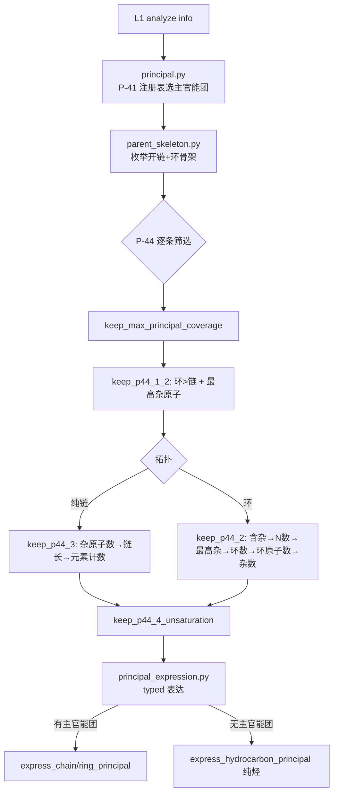
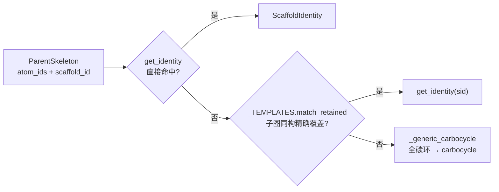
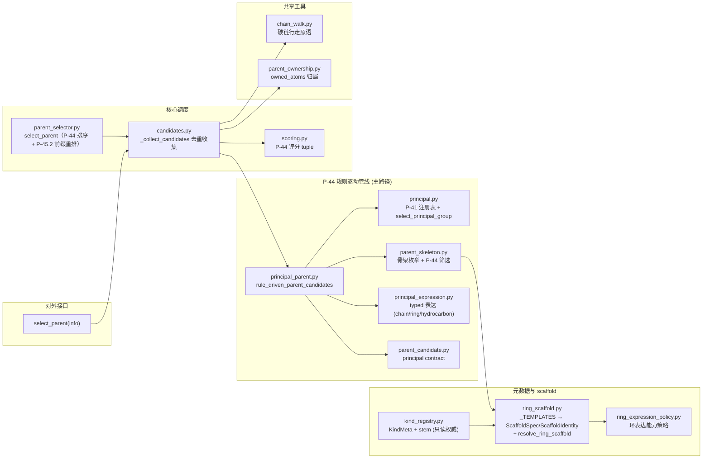

# Layer2: Parent Selector（母体选择器）

> **文件数:** 16 source files | **代码:** 2,183 行
> **职责:** 给定 layer1 的官能团 (FG) 信息字典，按 IUPAC P-44 选出母体结构 (parent hydride)

---

## 概述

Layer2 是 NamePredict 六层流水线中逻辑最复杂的一层。它接收 layer1 `analyze()` 产出的 FG 信息字典（包含分子中所有官能团、环系、不饱和键等的结构化描述），从中选出一个 **母体结构 (parent)**——即 IUPAC 命名中作为骨架的核心部分。母体的选择决定了后续所有层的命名方向：layer3 基于母体提取取代基，layer4 在母体骨架上编号，layer5 基于母体类型组装最终名称。

Layer2 由 16 个模块组成：**① 骨架识别在 `ring_scaffold.py`**（`_TEMPLATES` 为唯一事实来源，派生 ScaffoldSpec/ScaffoldIdentity）；**② kind 正交化**（纯烃/未注册稠环 kind 为 `alkane`，数量由 `principal_expression_facts.multiplicity` 承载，无 diacid/diol/diamine 等数量 kind）；**③ 互斥由 `select_principal_group` 结构性单选择实现**（无 `_no_fgs` 谓词）；**④ 无 `candidate_gate.py`/`arene_carbonyl.py`/`parent_core.py`/`identity.py`/`fg_helpers.py`**——kind_registry 无 `_KIND_CLASS`/`_load_chain_fg`/`all_kinds`，链式 FG 的 rank 由 `principal.legacy_rank` 实时投影；**⑤ 稠环拆解由 `fused_system.decompose_fused_system` 承担**（P-25.3.2.4，产出 `fused_tree` 供 L5 稠合名组装，独立于 scaffold 身份）。

### 输入与输出

| | 类型 | 关键字段 |
|---|---|---|
| **输入 (info)** | `dict` | `mol` (RDKit Mol), `rings`, `ring_systems`, `fg_inventory`, `carboxyls`, `esters`, `ketones`, `hydroxyls`, `amines`, `double_bonds`, `triple_bonds`, `has_acid`, `has_ketone`, `has_alcohol` ... 共 18 个布尔标志 |
| **输出 (parent)** | `dict` | `chain` (原子序号列表), `kind` (母体类型), `n_carbons`, `owned_atoms` (frozenset), `stem_en`, `stem_zh`, `scaffold_id`, `principal_expression_facts`, `principal_group_count`, 以及 FG 专属字段如 `cooh_c_idx`, `double_bond` 等 |

---

## 核心逻辑

### 候选生成架构

Layer2 采用 **P-44 规则驱动主链管线** 作为唯一候选生成路径。入口是 `select_parent`（`parent_selector.py:38`，兼容包装，返回排序后选定的母体）：收集候选后按 P-44 评分降序并终态化 owned_atoms，再经 **P-45.2 前缀取代基重排打平** 取首位。

```
select_parent(info)   # 唯一候选入口 (parent_selector.py)：P-44 评分降序 → P-45.2 前缀取代基重排 → 首位
└─ _collect_candidates(info)             # 候选收集+去重 (candidates.py:31)
   └─ rule_driven_parent_candidates(info)   # P-44 规则管线 (principal_parent.py:44)
      ├─ select_principal_group            # P-41 注册表选主官能团
      ├─ select_principal_skeletons        # 枚举+筛选骨架 (P-44.1/2/3/4)
      └─ express_ring/chain/hydrocarbon_principal   # typed 表达
```

候选收集后经 `_finalize_ranked`（`parent_selector.py:25`）：`_rank_candidates`（scoring，P-44 评分降序）→ `with_principal_group_contract`（parent_candidate）→ `pack_parent_stem`（kind_registry）→ `finalize_parent_ownership`（parent_ownership）固化不可变 owned_atoms。随后 `select_parent` 调 `_reorder_p45_2`（`parent_selector.py:18`），按 **P-45.2.1 以前缀引用的取代基团数目最多** 稳定重排打平候选——计数由 `_p45_2_prefix_count`（`parent_selector.py:11`）给出，= owned_atoms 边界外 L3 `iter_claims` 枚举的 claim 个数（P-45.2.2/2.3 的位次需 L4 编号后才可得，本层只接 P-45.2.1）。选不出候选时**不回退烷烃兜底**：`select_parent` 返回 `None`，调用方显式失败。

> **源:** `src/namepredict/layer2/parent_selector.py`, `src/namepredict/layer2/candidates.py`

### P-44 规则驱动主链管线

这条管线按 IUPAC P-44 条款逐步筛选，由四个模块协作，全部为无副作用纯函数、可单测：



1. **`principal.py`** — `select_principal_group()`（`:86`）按 `PRINCIPAL_REGISTRY`（`principal.py:42-60`，P-41 class 优先级）选出主官能团类。注册表把 FG 分成三档表达权限：**SUFFIX**（radical/acid/anhydride/ester/acyl_halide/amide/nitrile/aldehyde/ketone/alcohol/thiol/amine 等，有资格成为主官能团并 typed 表达）、**LEGACY_COMPAT**（sulfide/isocyanate/isothiocyanate 等，`compatibility_rank` 经 `legacy_rank` 查询但不参与主官能团选择）、**PREFIX_ONLY**（ether，只当前缀）。`principal_spec()` 只放行 SUFFIX 类。

2. **`parent_skeleton.py`** — `enumerate_principal_skeletons()`（`:249`）从主官能团的附着点出发枚举**开链候选**（`_chain_candidates`）与**环系统候选**（`_ring_candidates`，每个 ring system 一个骨架）。随后 `select_principal_skeletons()`（`:236`）依次施加 `keep_max_principal_coverage` → `keep_p44_1_2`（环优先 + 最高优先级杂原子）→ 按拓扑走 `keep_p44_3`（纯链）/ `keep_p44_2`（环）→ `keep_p44_4_unsaturation`（`:223`）。**P-44.4 不饱和度统计现把芳香键按 Kekulé 双键当量计入**（键 `p44_4_unsaturation_key` `:200`：每 2 条芳香键折 1 个多重键 + 1 个双键，如苯 = 3），使不饱和芳香环优先于同环数饱和环（P-44.4.1.1 标准 a）；主官能团特征原子间的多重键仍不计入。

3. **`principal_expression.py`** — 把选定的骨架表达为 parent dict：
   - `express_chain_principal()` — 开链主官能团经 `_chain_kind`（`:65`，`_CHAIN_FG` frozenset `:41` 限定 8 类）按多重度映射 kind：ACID/ALCOHOL/AMINE/KETONE 任意 count≥1 恒返回基团名（`_MULTI_FG` `:47`，数量由 `principal_expression_facts.multiplicity` 承载）；ESTER/AMIDE/NITRILE/ALDEHYDE 仅单基（count≠1 → None）。骨架内 C=C/C≡C 带 `double_bond`/`triple_bond`/`double_bonds` 字段；`acyl_halide` 经 `_chain_acyl_halide_fields` 携带 `hal_idx`/`hal_z`（卤素纳入母体原子，不作取代基）
   - `express_ring_principal()` — 环骨架：`resolve_ring_scaffold` 解析骨架身份。**环 + 主 FG 一律收敛为 FG 类别 kind**（`_ring_kind`，苯/饱和环/未注册稠环/杂环平等），词干由 scaffold 承载；苯保留名（benzoic/phenol/aniline 等）由 L5 chain_engine variant 提供；环酸经 `_expression_flags` 补 anion 标志
   - **环醛 -carbaldehyde/-dicarbaldehyde** — `_ring_kind`（`principal_expression.py:153`，ALDEHYDE 分支 `:167`）对骨架 + ALDEHYDE 主基团返回 kind `"aldehyde"`：环上外环 -CHO 可多个同作主官能团（P-66.6.1.1.3）；aldehyde 不在 `_MULTI_FG`，故仅环骨架放行、开链二醛表达不变。`_ring_fact_fields`（`principal_expression.py:184`）的单附着点组扩充 ALDEHYDE → 设 `ring_attach_idx`（原为 ACID/ESTER/AMIDE/NITRILE）
   - **稠环接入** — `_scaffold_fields`（`:197`）解析 scaffold 身份外，额外：① 保留 fused 模板时算 `scaffold_match`（`_match_with_map` 的模板→分子原子映射，供 L4 固定编号 `standard_path`）；② 多环骨架（sssr_indices≥2）调 `decompose_fused_system` 产出 `fused_tree`（`FusedNode`）——**拆解独立于 scaffold 身份**，未注册系统 scaffold=None 时仍产出，供 L5 `fused_namer` 组装稠合名
   - **kind 正交化扩充** — `_resolved_ring_kind`：苯与未注册稠环（`scaffold.id ∈ {"fused", "fused_hetero"}`）一律收敛 `alkane`；`_generic_ring_kind`：未注册芳香稠环（≥2 环）再收敛 `alkane`；`_ring_kind`：RADICAL + scaffold=None（未知杂环无 `-yl` 词干）显式返回 None 而非当开链烷基错名
   - 每个候选携带 `PrincipalExpressionFacts`（group_class/multiplicity/relation/characteristic_atoms/attachment_atoms/charge_state）与 `ScaffoldIdentity`
   - `express_hydrocarbon_principal()` — **无主官能团（纯烃）**：开链按 C=C/C≡C 分布给 alkane/alkene/alkyne/polyene；环按芳香性分流——**非芳香环/未注册稠环 kind 恒为 `"alkane"`**（不饱和度由 `double_bond(s)` 字段承载），芳香环命中保留 scaffold 时 kind=scaffold.id（如 `benzene`）

4. **`principal_parent.py`** — `rule_driven_parent_candidates()`（`:44`）编排以上：`select_principal_parent_skeletons` 选主官能团与骨架 → 按拓扑走 `_express_selected`（环酮 typed 不支持时过滤）或 `express_hydrocarbon_principal`。

> **源:** `src/namepredict/layer2/principal.py`, `src/namepredict/layer2/parent_skeleton.py`, `src/namepredict/layer2/principal_expression.py`, `src/namepredict/layer2/principal_parent.py`

### Kind Registry: 母体元数据中心

`kind_registry.py`（117 行）是 Layer2 的**母体元数据注册中心 (Registry Authority)**，存储 scaffold 母体种类 (kind) 的元数据并在导入时 bootstrap：

- **`KindMeta`**（`kind_registry.py:7-14`）: 每个 kind 的评分字段 (`ring`, `n_rings`, `retained`) 和命名 stem
- **bootstrap 顺序**（`_bootstrap` `:102`）**只有一步**：`_load_from_scaffold_specs()`（`:92`）— 从 `ring_scaffold.all_specs()` 读取有词干的 spec，注册为 ring/n_rings/retained 元数据（**Spec 是词干权威**）。主官能团等级不存于 `KindMeta`，运行时按 FG 枚举经 `legacy_rank` 实时查询（旧式 parent 兜底在 `parent_candidate._kind_rank`，`parent_candidate.py:20`）
- 公共 API: `register` / `get` / `is_hetero_ring` / `is_carbo_ring` / `n_rings_of` / `retained_bonus` / `parent_names` / `pack_parent_stem`
- **`pack_parent_stem` 前缀注入**（`:70`）— 五元杂环 locant 前缀（`1H-`/`1,3-`）在此统一成终态：`1,3-` 二唑（噻唑/噁唑/苯并噻唑/苯并噁唑）无条件注入；`1H-` 吡咯型（吡咯/咪唑/吡唑/吲哚/吲唑/苯并咪唑/咔唑/吩噻嗪）仅当环含未取代芳香 NH 时注入（`_ring_keeps_nh_prefix`，N 全取代则省略）；词干已带前缀（注册表 indole="1H-indole"）先 `_strip_locant_prefix` 剥离再按条件加回，保证 N-取代 indole 输出 "indol-…"

kind_registry 是**只读权威**：被 `scoring.py`（模块级派生集合）、`parent_candidate.py`（principal contract 的 kind 分类）、`parent_selector.py`（`pack_parent_stem` 注入 stem）消费，不存在对外注册入口。

> **源:** `src/namepredict/layer2/kind_registry.py`

### Ring 骨架识别机制（`ring_scaffold.py`）

`ring_scaffold.py`（408 行）以 `_TEMPLATES`（SMILES 模板表）为**唯一事实来源**，派生 ScaffoldSpec/ScaffoldIdentity 与保留条目。职责分三块：

1. **模板注册表（唯一来源）** — `_TEMPLATES`（`70` 起，保留母体，每条 `{smiles, stem_en, stem_zh, naming_class}`）；`_spec_from_template`（`:212`）派生 ScaffoldSpec（n_rings/ring 从 smiles 算，retained=True），`all_specs()`（`:147`）/`get_spec()`（`:142`）/`get_identity()`（`:137`）/`kind_ids_for()`（`:178`）均由此派生；`kind_registry._load_from_scaffold_specs` 据此注册 KindMeta 词干（活接线，防清扫判死）。**本期扩充**：新增 `phenanthrene`/`pyrene`/`carbazole`/`acridine`/`phenothiazine`/`benzodioxole` 及 6 个饱和单杂环（pyrrolidine/piperidine/morpholine/piperazine/oxolane/oxane）模板；`ScaffoldSpec` 加 `standard_path`（固定编号 locant 标签序）、`locant_prefix`（五元杂环 `1H-`/`1,3-` 前缀）、`prefix_nh_conditional`（1H- 仅当环含 NH 注入）；新增 `_STANDARD_ORDERS`/`_STANDARD_LABELS`（不对称 fused 环与 1,3-二唑的 IUPAC 标准编号）。**本期修正**：`oxane`/`quinoxaline` 的 stem_zh 对齐 IUPAC 中文——oxane「四氢吡喃」→「氧杂环己烷」、quinoxaline「喹噁啉」→「喹喔啉」（`ring_scaffold.py:106`/`:126`）；**acridine 固定编号修正**（原把 N/桥头 locant 标错）：`ACRIDINE_LABELS`（`ring_scaffold.py:136`）改为 14 项 ("1","2","3","4","4a","5","6","7","8","8a","9","9a","10","10a")、`_STANDARD_ORDERS["acridine"]`（`ring_scaffold.py:169`）改为 (9,8,7,6,5,2,1,0,13,12,11,10,4,3)，carbazole/phenothiazine 编号不变
2. **环解析** — `resolve_ring_scaffold(info, skeleton)`（`:265`）优先级：① `get_identity(skeleton.scaffold_id)` 直接命中 → ② `match_retained`（SMILES 模板子图同构，按环原子集精确覆盖）→ ③ `_generic_carbocycle`（全碳非保留环 → `ScaffoldIdentity("carbocycle",...)`）。`match_systems`/`match_scaffold_ids`/`registry`/`get_entry` 为模板语义查询
3. **固定编号匹配** — `_match_with_map`（`:345`）在子图同构命中时返回 `(sid, match)`，`match[i]` 给出模板原子 i 对应的分子原子——供 L4 `standard_path` 把模板固定 locant 映射到分子原子；`locant_prefix(spec_id)` 返回 (en, zh, nh_conditional) 供 `kind_registry.pack_parent_stem` 注入词干



**新增 ring 母体的步骤:**
在 `ring_scaffold.py` 的 `_TEMPLATES` 加一条 `{smiles, stem_en, stem_zh, naming_class}`（ScaffoldSpec 自动派生；无 `_TOPOLOGY` 表与手写 `_ALL_SPECS`）。位置异构体在元素标注的子图同构下天然区分，无需额外消解。

> **源:** `src/namepredict/layer2/ring_scaffold.py`

### 稠环拆解 (fused_system.py)

`fused_system.py`（225 行）实现 **P-25.3.2.4 稠环拆解**——把含 ≥2 环共享 ≥2 原子的稠合环系拆成**保留母体组分树**（`FusedNode`），供 L5 `fused_namer` 组装 `benzo[a]...`/`naphtho[...]...` 类稠合名。这是**未注册稠环**（无整体保留 scaffold）的命名通道：母体/附加组分均为已注册保留件，但整体系统不在 `_TEMPLATES` 内。

核心数据结构 `FusedNode`（`fused_system.py:26`）：

```python
@dataclass(frozen=True)
class FusedNode:
    scaffold_id: str                 # 母体组分保留模板 id
    atom_ids: tuple[int, ...]        # 组分原子
    ring_indices: frozenset[int]     # 组分所含环
    fusion_shared: tuple[frozenset, ...] = ()  # 与父组分的共享原子集（根节点为 ()）
    attached: tuple["FusedNode", ...] = ()     # 附加组分树（递归）
```

拆解管线（`decompose_fused_system`，`:234`）：

1. **增长式候选枚举**（`_candidates_for`，`:46`）— 从"单环精确匹配某保留模板"（`_seedable`）的种子环 DFS 并入邻接环，`match_retained` 精确命中记录候选，元素超集剪枝（`_has_template_superset`），按原子集去重
2. **P-25.3.2.4 母体组分选择**（`_select_base`，`:89`）— 依次施加 (a) 最优先杂原子 → (b) 环数 → (c) 环大小降序 → (d) 杂原子总数 → (e) 杂原子种类 → (f) 最高优先杂原子数；(g)-(j) 依赖 L4 优选取向/编号（`_numbered_locants`，`:158`，调到 `fused_orientation`+`fused_numbering`）逐准则收窄（水平行环数 / 杂原子位次低 / 逐元素位次 / 稠合碳位次低）；>1 时环集升序兜底
3. **递归拆解**（`_decompose`，`:208`）— 选定母体组分后，剩余环按融合图**连通分量**（`_ring_components`，`:182`）递归为附加组分，共享原子经 `fusion_shared` 下传

入口 `decompose_fused_system(info, system)`（`:234`）读 `system["fusion_edges"]`/`sssr_indices`（L1 `build_ring_systems` 产出），输出 `FusedNode | None`（无保留候选返回 None）。**拆解独立于 scaffold 身份**——未注册系统 `resolve_ring_scaffold` 解析为 None 时仍产出拆解树。`_P25_SENIOR`（`:14`）/`_P145_SENIOR`（`:16`）为 P-25.3.2.4(a)/(f) 的杂原子优先序常量。

> **源:** `src/namepredict/layer2/fused_system.py`

### 评分体系 (P-44 Seniority)

`scoring.py`（63 行）将每个候选 parent 编码为评分 tuple（`_score_parent` `:59`，数值越大越优先）：前两维 `_p44_1_1`（`:48`）来自 `parent_candidate.principal_key`（FG 类别 rank + 主官能团计数），其余 9 维 `_later_score`（`:53`）从 `kind_registry` 派生的集合计算：

```python
(principal_group_class,   # FG 类别 rank（principal contract，rank=0 即无主官能团）
 principal_group_count,   # 主官能团实例数
 sides_ok,                # 0/1 — 侧链是否可表达为取代基
 is_hetero_ring,          # 0/1 — 是否杂环
 is_carbo_ring,           # 0/1 — 是否碳环
 n_rings,                 # 0+ — 环数
 ring_size,               # 0+ — 环原子数
 retained_bonus,          # 0/1 — 保留名加分
 n_unsat,                 # 0+ — 不饱和度
 n_carbons,               # 0+ — 碳原子数
 -n_unhandled)            # 负值 — 未识别侧链惩罚
```

> **源:** `src/namepredict/layer2/scoring.py:59`

### 链 vs 环决策

母体选择的核心分歧点是**链状母体 vs 环状母体**，由 `parent_skeleton.keep_p44_1_2`（环优先 + 最高优先级杂原子）在筛选阶段解决：

1. **环系统候选**（`_ring_candidates`）— 每个 `ring_systems` 条目生成一个骨架
2. **开链候选**（`_chain_candidates`）— 从主官能团附着点出发的最长链/覆盖对；`chain_walk.py`（126 行）提供 `_all_carbons`/`_side_count`/`_chain_key`/`_better`/`_best_among` 等碳链行走原语（经 `tools/chain` 借用 `_carbon_neighbors`/`_longest_from`），后者排除芳香碳和环碳

当环候选不被评分选中或环无法承载特征官能团时，链状母体成为选择。

> **源:** `src/namepredict/layer2/parent_skeleton.py`, `src/namepredict/layer2/chain_walk.py`

### FG 优先级体系

官能团优先级遵循 IUPAC P-41 降序排列，由 `principal.py` 的 `PRINCIPAL_REGISTRY`（`compatibility_rank`）定义，经 `legacy_rank`（`principal.py:64`）按 FG 枚举查询。**13 个扩展 FG（sulfoxide/sulfone/sulfonate/sulfonamide/sulfonic_acid/sulfonyl_chloride/phosphate/boronic/carbamate/carbonate/urea/guanidine/hydrazine）已在 layer1 删除检测，随之退出优先级体系**：

| 优先级 | FG 类别 | kind 示例 |
|--------|---------|-----------|
| 14 | 羧酸 | acid, benzoic |
| 12 | 酸酐 | anhydride（registry 保留，但 `_CHAIN_FG` 无此类别，链式 acid 无酸酐表达） |
| 11 | 酯 | ester, benzoate |
| 10 | 酰卤 | acyl_chloride, acyl_bromide |
| 9 | 酰胺 | amide |
| 8 | 腈 / 异氰酸酯 | nitrile, isocyanate, isothiocyanate |
| 7 | 醛 | aldehyde |
| 6 | 酮 | ketone（`dione` 已不再由 L2 产生，二酮由 L5 chain_engine mult_ok 生成） |
| 5 | 醇 | alcohol |
| 4 | 硫醇 | thiol |
| 3 | 胺 | amine |
| 2 | 硫醚 | sulfide（LEGACY_COMPAT） |
| 0 | 醚 / 烷 | ether（PREFIX_ONLY，不参与主官能团选择）; alkane/alkene/alkyne 纯烃 |

> **源:** `src/namepredict/layer2/principal.py:42-60` `PRINCIPAL_REGISTRY`

### 多官能团母体

无数量派生 kind：**diacid/polycarboxylic/diol/triol/diamine/triamine/tetraamine 不产生**。链式 acid/alcohol/amine/ketone 对任意主基团数 kind 恒为基团名，数量由 `principal_expression_facts.multiplicity` 承载（在 layer5 `chain_engine._Chain.variant` 中按 multiplicity 切换后缀：4 OH → `butane-1,2,3,4-tetraol`）。KETONE 的 `count==2` 也返回 `"ketone"`（`dione` 由 L5 `mult_ok` 生成式产出）。`parent_candidate._FIXED_MULTI`/`_DYNAMIC_IDS` 均为空 dict（`parent_candidate.py`）。环 typed 表达同理不再按 multiplicity 截断——`RingExpressionPolicy`（`ring_expression_policy.py`）移除 `max_multiplicity` 上限，多羧酸/多醇等环主基团数量交由 L5 后缀组装。

> **源:** `src/namepredict/layer2/principal_expression.py:41-73`, `src/namepredict/layer2/parent_candidate.py`

### Atom Ownership: 母体原子归属

选出母体骨架后，`parent_ownership.py`（264 行）确定**母体"拥有"哪些原子**——`compute_owned_atoms(parent, mol)`（`:255`）取 `_chain_atoms`（骨架原子，`:9`）与 `_kind_fg_atoms`（FG 异原子，`:232`，按母体类型分派到 `_acid_o_atoms`/`_ketone_fg_atoms`/`_amine_fg_atoms`/`_ester_fg_atoms`/`_anhydride_fg_atoms` 等）的并集。`finalize_parent_ownership`（`:260`）注入不可变 `owned_atoms` frozenset（幂等）。owned_atoms 是 layer3 提取取代基的关键边界。详见 [[concepts/atom-ownership]]。

> **源:** `src/namepredict/layer2/parent_ownership.py:255-260`

### 互斥检查

无 `fg_helpers.py` 与 `_no_fgs(info, keys)` 互斥谓词。互斥语义由 `principal.py` 的 `select_principal_group` **结构性实现**：P-44 只选单个最高优先级主官能团（`min(eligible, key=priority)`），低优先级 FG 一律成为取代基，无需逐候选 `_no_fgs` 检查。

### 侧链识别与块切割（tools / layer3）

Layer2 选完母体后**不做**侧链块切割——侧链识别与命名全部由 Layer3 承担。共享的层无关原语位于 `tools/`：`tools/block_cut.py`（`side_atoms`/`cut_block`/`side_roots`）、`tools/anchored_table.py`（锚定 canonical-SMILES 查表，见 [[architecture/layer3-substituents]]）、`tools/chain.py`（`_carbon_neighbors`/`_longest_from`）。Layer2 反向借用 `tools` 的函数：`chain_walk`（`tools/chain`）。无 `tools/alkoxy_side.py`——酯 O 侧烷基由 L5 `join_ester_name` 消费取代基 `o_side` 标记（见 layer5 页）。layer2 与 layer3 之间互不 import（**P-45.2 前缀计数例外**：`parent_selector._p45_2_prefix_count` 在函数内局部 import L3 `iter_claims`，枚举 owned_atoms 边界外 claim，供 P-45.2.1 打平，见候选生成架构节）。

### 保留名 (Retained Names)

保留 scaffold 的 stem 与命名类由 **`ring_scaffold.py` 的 `_TEMPLATES`** 提供（唯一事实来源，派生 ScaffoldSpec）：

- **苯系保留名**：benzoic acid / phenol / aniline / benzaldehyde / benzonitrile / benzamide / benzoate——由 L5 chain_engine variant（`_KIND_TABLE` 各 entry 的 `"benzene"` 键）提供
- **杂环/稠环**：pyridine、naphthalene、indole 等保留母体——由 `_TEMPLATES` 派生 ScaffoldSpec/词干，环+FG 时走通用词干命名（naphthalen-1-ol / pyridine-3-carboxylic acid）

保留名通过 `retained_bonus` 在评分中获得优先权，stem 由 `pack_parent_stem` 从 `kind_registry` 注入 parent dict。

### 桥环与螺环母体

Layer2 **不产生** `bridged`/`spiro` 母体候选——桥环/螺环的**拓扑检测**在 `layer1/ring_systems.py`（`_topology` 区分 bridged/spiro），但 L2 侧对应母体候选 kind 未被 principal 主路径消费。

---

## 数据流图

### 模块组织架构



---

## 文件清单

### 核心调度 (Core Dispatch)

| 文件 | 行数 | 职责 |
|------|------|------|
| `candidates.py` | 34 | 候选收集+去重 (_collect_candidates → rule_driven_parent_candidates 单一路径) |
| `parent_selector.py` | 46 | `select_parent` 入口: P-44 评分降序 + owned_atoms 固化 (`_finalize_ranked`) → P-45.2 前缀取代基重排 (`_reorder_p45_2`) |
| `scoring.py` | 63 | P-44 评分 tuple, `_score_parent`, `_p44_1_1`/`_later_score` |
| `chain_walk.py` | 126 | 碳链行走原语: `_all_carbons`, `_side_count`, `_best_among` 等 |
| `__init__.py` | 6 | 导出 `select_parent` |

### P-44 规则驱动管线 (Rule-Driven Principal Pipeline)

| 文件 | 行数 | 职责 |
|------|------|------|
| `principal.py` | 85 | P-41 class / P-43 表达元数据 + 主官能团选择: PRINCIPAL_REGISTRY, select_principal_group |
| `parent_skeleton.py` | 253 | 骨架枚举 + P-44 筛选: enumerate_principal_skeletons, select_principal_skeletons, keep_p44_1_2/2/3/4, p44_4_unsaturation_key |
| `principal_expression.py` | 370 | typed 表达: express_chain/ring/hydrocarbon_principal, PrincipalExpressionFacts, _chain_kind; 环醛(_ring_kind ALDEHYDE 分支) + 稠环接入(fused_tree/scaffold_match) + 酰卤字段 |
| `principal_parent.py` | 48 | 编排: rule_driven_parent_candidates, select_principal_parent_skeletons |
| `parent_candidate.py` | 78 | principal contract: with_principal_group_contract, principal_key, P44Facts |
| `fused_system.py` | 225 | P-25.3.2.4 稠环拆解: decompose_fused_system → FusedNode 树（供 L5 稠合名组装） |

### 注册与元数据 (Registry & Scaffold)

| 文件 | 行数 | 职责 |
|------|------|------|
| `kind_registry.py` | 117 | KindMeta 注册中心, stem, ring 元数据; 从 ScaffoldSpec 同步词干（只读权威） |
| `ring_scaffold.py` | 408 | **`_TEMPLATES` → ScaffoldSpec/ScaffoldIdentity + resolve_ring_scaffold** |
| `ring_expression_policy.py` | 38 | 环 scaffold 上 typed 主官能团表达的能力策略（无 multiplicity 上限） |
| `ring_parent.py` | 22 | 环母体辅助原语: `_o_idx`/`_dbl_o_idx` 等 |

### 归属 (Ownership)

| 文件 | 行数 | 职责 |
|------|------|------|
| `parent_ownership.py` | 264 | 母体原子归属最终化 (immutable owned_atoms, compute_owned_atoms/finalize_parent_ownership) |

> 备注：layer2 只有以上 16 个模块。`fg_helpers.py`/`candidate_gate.py`/`arene_carbonyl.py`/`parent_core.py`/`identity.py`/`spiro_parent.py` 及 `scaffold/` 子包均不存在——互斥由 `select_principal_group` 结构性单选择实现；ScaffoldIdentity 定义于 `ring_scaffold.py`；parent_dict/chain 归 principal_expression/parent_ownership 承担。

---

## 对外接口

### 公共 API

```python
def iter_parent_candidates(info: dict) -> list[dict]
```
返回所有排名的母体候选列表，每个候选经 `with_principal_group_contract` → `pack_parent_stem` 注入 stem 名称，再经 `finalize_parent_ownership` 确定原子归属。列表按评分降序排列，首个元素即为最优母体。调用方式: `namer.py` 中 `_run_candidates` 在 depth=0 时遍历候选列表进行完整覆盖尝试。

```python
def select_parent(info: dict, *, all_candidates: bool = False) -> dict | list[dict] | None
```
兼容包装，默认返回 `iter_parent_candidates(info)[0]`（`all_candidates=True` 时返回全列表）。

> **源:** `src/namepredict/layer2/parent_selector.py:23`

返回的 parent dict 包含 `chain`（骨架原子序号）、`kind`（母体类型）、`owned_atoms`（母体拥有的原子集合）、`stem_en`/`stem_zh`、`scaffold_id`、`principal_expression_facts`、`principal_group_count` 等字段。layer5 和 layer3/layer4 均通过此 parent dict 获取后续命名所需的全部信息。

### 关键内部类型

| 类型 | 位置 | 说明 |
|------|------|------|
| `KindMeta` | `kind_registry.py:7-14` | 母体种类元数据: ring, n_rings, retained, en/zh stem |
| `ScaffoldSpec` | `ring_scaffold.py:24` | 编号骨架定义: id, naming_class, stem, numbering, retained |
| `ScaffoldIdentity` | `ring_scaffold.py:45` | 拓扑级身份: id, naming_class, n_rings, ring |
| `PrincipalFeatureSpec` | `principal.py:27-32` | P-41 表达元数据: priority, expression, compatibility_rank |
| `PrincipalExpressionFacts` | `principal_expression.py:31` | typed 主基团表达: group_class, multiplicity, relation, attachment_atoms |
| `SkeletonSelection` | `parent_skeleton.py:34` | 骨架选择结果: candidates + next_rule |
| `P44Facts` | `parent_candidate.py:13` | principal contract: principal_group_class + principal_group_count |

---

## 相关页面

- [[architecture/layer1-analyzer]] — Layer2 的上游，产出 FG info dict
- [[architecture/layer3-substituents]] — 使用 parent.owned_atoms 提取取代基
- [[architecture/layer4-numbering]] — 使用 parent.chain + kind 编号
- [[architecture/layer5-name-assembly]] — 使用 parent.kind + stem 组装名称
- [[concepts/functional-group-priority]] — FG 优先级与 IUPAC P-44 规则
- [[concepts/atom-ownership]] — owned_atoms 边界与原子归属
- [[architecture/overview]] — 系统架构概述
