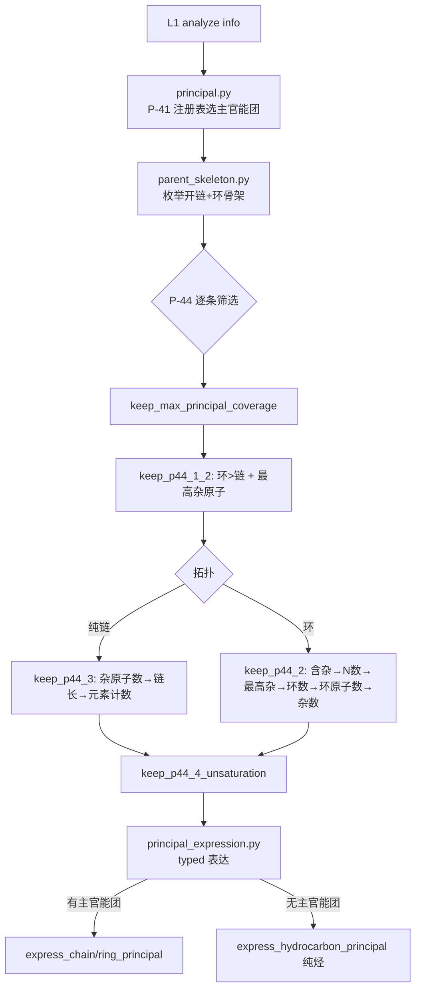
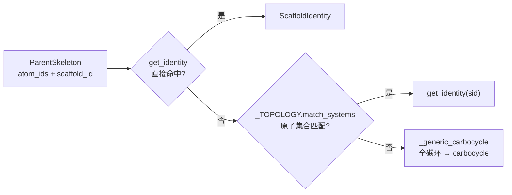
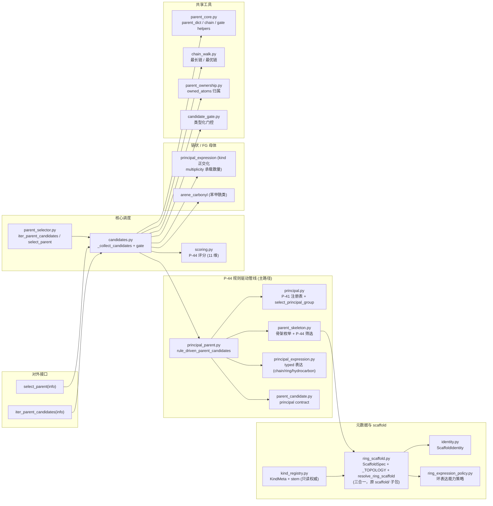

# Layer2: Parent Selector（母体选择器）

> **文件数:** 19 source files | **代码:** 1,897 行
> **职责:** 给定 layer1 的官能团 (FG) 信息字典，按 IUPAC P-44 选出母体结构 (parent hydride)

---

## 概述

Layer2 是 NamePredict 六层流水线中逻辑最复杂的一层。它接收 layer1 `analyze()` 产出的 FG 信息字典（包含分子中所有官能团、环系、不饱和键等的结构化描述），从中选出一个 **母体结构 (parent)**——即 IUPAC 命名中作为骨架的核心部分。母体的选择决定了后续所有层的命名方向：layer3 基于母体提取取代基，layer4 在母体骨架上编号，layer5 基于母体类型组装最终名称。

2026-08 大重构后，layer2 完成了三件事：**① scaffold/ 子包解散**（`specs.py`/`retained_registry.py`/`ring_scaffold.py` 三者合并进根目录 `ring_scaffold.py`）；**② kind 正交化**（纯烃环 kind 并入 `alkane`、数量派生 kind `diacid`/`diol`/`diamine` 等全部删除，multiplicity 由 `principal_expression_facts` 承载）；**③ 删除 `fg_helpers.py`**（`_no_fgs` 互斥谓词由 `select_principal_group` 的结构性单选择替代）。

### 输入与输出

| | 类型 | 关键字段 |
|---|---|---|
| **输入 (info)** | `dict` | `mol` (RDKit Mol), `rings`, `ring_systems`, `fg_inventory`, `carboxyls`, `esters`, `ketones`, `hydroxyls`, `amines`, `double_bonds`, `triple_bonds`, `has_acid`, `has_ketone`, `has_alcohol` ... 共 18 个布尔标志 |
| **输出 (parent)** | `dict` | `chain` (原子序号列表), `kind` (母体类型), `n_carbons`, `owned_atoms` (frozenset), `stem_en`, `stem_zh`, `scaffold_id`, `principal_expression_facts`, `principal_group_count`, 以及 FG 专属字段如 `cooh_c_idx`, `double_bond` 等 |

---

## 核心逻辑

### 候选生成架构

Layer2 采用 **P-44 规则驱动主链管线** 作为唯一候选生成路径。入口是 `iter_parent_candidates`（`parent_selector.py:23-24`）；`select_parent`（`parent_selector.py:27-28`）是返回首个排序候选的兼容包装。

```
iter_parent_candidates(info)             # 唯一候选入口 (parent_selector.py)
└─ _collect_candidates(info)             # 候选收集 (candidates.py:20)
   └─ _principal_candidates(info)
      └─ rule_driven_parent_candidates(info)   # P-44 规则管线 (principal_parent.py:14)
         ├─ select_principal_group            # P-41 注册表选主官能团
         ├─ select_principal_skeletons        # 枚举+筛选骨架 (P-44.1/2/3/4)
         └─ express_ring/chain/hydrocarbon_principal   # typed 表达
```

候选收集后经 `_finalize_ranked`（`parent_selector.py:8`）：`_rank_candidates`（scoring）→ `with_principal_group_contract`（parent_candidate）→ `pack_parent_stem`（kind_registry）→ `finalize_parent_ownership`（parent_ownership）。选不出候选时**不回退烷烃兜底**：`select_parent` 返回 `None`，调用方显式失败。

> **源:** `src/namepredict/layer2/parent_selector.py`, `src/namepredict/layer2/candidates.py`

### P-44 规则驱动主链管线

这条管线按 IUPAC P-44 条款逐步筛选，由四个模块协作，全部为无副作用纯函数、可单测：



1. **`principal.py`** — `select_principal_group()`（`:51`）按 `PRINCIPAL_REGISTRY`（`principal.py:39-71`，P-41 class 优先级）选出主官能团类。注册表把 FG 分成三档表达权限：**SUFFIX**（acid/ester/amide/nitrile/aldehyde/ketone/alcohol/thiol/amine 等，有资格成为主官能团并 typed 表达）、**LEGACY_COMPAT**（sulfide 等，`compatibility_rank` 投影到 fg_rank 但不参与主官能团选择）、**PREFIX_ONLY**（ether，只当前缀）。`principal_spec()` 只放行 SUFFIX 类。

2. **`parent_skeleton.py`** — `enumerate_principal_skeletons()`（`:204`）从主官能团的附着点出发枚举**开链候选**（`_chain_candidates`）与**环系统候选**（`_ring_candidates`，每个 ring system 一个骨架）。随后 `select_principal_skeletons()`（`:192`）依次施加 `keep_max_principal_coverage` → `keep_p44_1_2`（环优先 + 最高优先级杂原子）→ 按拓扑走 `keep_p44_3`（纯链）/ `keep_p44_2`（环）→ `keep_p44_4_unsaturation`。

3. **`principal_expression.py`** — 把选定的骨架表达为 parent dict：
   - `express_chain_principal()` — 开链主官能团经 `_CHAIN_KINDS`（`:36-46`）按多重度映射 kind。**正交化后**：ACID/ALCOHOL/AMINE 任意 count≥1 恒返回基团名（`acid`/`alcohol`/`amine`，`_chain_kind` `:66` 特判），数量由 `principal_expression_facts.multiplicity` 承载；仅 KETONE 保留 `count==2 → "dione"` 区分环酮表达。骨架内 C=C/C≡C 带 `double_bond`/`triple_bond`/`double_bonds` 字段
   - `express_ring_principal()` — 环骨架：`resolve_ring_scaffold` 解析骨架身份。**`_RETAINED_RING_KINDS` 已删除**——苯系保留名（benzoic/phenol/aniline/benzaldehyde 等）决策迁往 `layer5/typed_kinds.py`（`_BENZENE_RETAINED`），L2 只表达结构 kind
   - 每个候选携带 `PrincipalExpressionFacts`（group_class/multiplicity/relation/characteristic_atoms/attachment_atoms/charge_state）与 `ScaffoldIdentity`
   - `express_hydrocarbon_principal()` — **无主官能团（纯烃）**：开链按 C=C/C≡C 分布给 alkane/alkene/alkyne/polyene；环按芳香性分流——**非芳香环 kind 恒为 `"alkane"`**（`_saturated_ring_parent`，不饱和度由 `double_bond(s)` 字段承载），芳香环命中保留 scaffold 时 kind=scaffold.id（如 `benzene`）

4. **`principal_parent.py`** — `rule_driven_parent_candidates()`（`:14`）编排以上：`select_principal_parent_skeletons` 选主官能团与骨架 → 按拓扑走 `_express_selected` 或 `express_hydrocarbon_principal`。

> **源:** `src/namepredict/layer2/principal.py`, `src/namepredict/layer2/parent_skeleton.py`, `src/namepredict/layer2/principal_expression.py`, `src/namepredict/layer2/principal_parent.py`

### Kind Registry: 母体元数据中心

`kind_registry.py` 是 Layer2 的**母体元数据注册中心 (Registry Authority)**，存储所有母体种类 (kind) 的元数据并在导入时 bootstrap：

- **`KindMeta`**（`kind_registry.py:34-42`）: 每个 kind 的评分字段 (`fg_rank`, `ring`, `n_rings`, `retained`) 和命名 stem
- **bootstrap 顺序**（`_bootstrap` `:151-153`）只有两步：
  1. `_load_chain_fg()`（`:129`）— 遍历 `_KIND_CLASS`（`:11-24`）全部键注册为 `ring="none"` 的 KindMeta
  2. `_load_from_scaffold_specs()`（`:141`）— 从 `ring_scaffold.all_specs()` 读取有词干的 spec，注册为 ring/n_rings/retained 元数据（**Spec 是词干权威，最后执行可覆盖**）
- **`all_kinds()`**（`:112`）= **18 个链状 FG kind**（`acid, ester, amide, nitrile, aldehyde, ketone, dione, alcohol, amine, sec_amine, tert_amine, tetraalkylammonium, alkane, ether, thiol, anhydride, acyl_chloride, acyl_bromide`）+ **4 个 scaffold kind**（`benzene, pyridine, naphthalene, indole`）。**没有任何组合 kind**（cycloalcohol/naphthalenol/cycloalkane_polycarboxylic 等已根除）
- 公共 API: `get` / `fg_rank` / `has_principal_fg` / `is_hetero_ring` / `is_carbo_ring` / `n_rings_of` / `retained_bonus` / `parent_names` / `pack_parent_stem` / `all_kinds`

kind_registry 是**只读权威**：被 `scoring.py`（模块级派生集合）、`parent_candidate.py`（principal contract 的 kind 分类）、`parent_selector.py`（`pack_parent_stem` 注入 stem）消费，不存在对外注册入口。

> **源:** `src/namepredict/layer2/kind_registry.py`

### Ring 骨架识别机制（`ring_scaffold.py`）

2026-08 重构后，原 `scaffold/` 子包的 `specs.py`（ScaffoldSpec 注册表）、`retained_registry.py`（保留名拓扑表）、`ring_scaffold.py`（环解析）三者**合并进根目录的 `ring_scaffold.py`**（294 行）。其职责分三块：

1. **ScaffoldSpec 注册表**（原 specs.py）— `ScaffoldSpec`（`:34-50`，字段：`id, naming_class, stem_en, stem_zh, n_rings, ring, retained, fg_rank, numbering, sub_rules, principal_slots`）+ `NumberingPolicy`（`:25-31`）。`_ALL_SPECS` 仅 4 个：`benzene`（mono_carbo）、`pyridine`（monohetero）、`naphthalene`（naph）、`indole`（fused56）
2. **保留名拓扑注册表**（原 retained_registry.py）— `_TOPOLOGY`（`:187-220`）是保留名拓扑唯一事实来源，含 `benzene/pyridine/naphthalene/indole` 四项（键：`kind, n_rings, n_atoms, hetero_Z, topology, aromatic`）；`match_systems`/`match_scaffold_ids` 在此，词干读取时经 `get_spec` 解析
3. **环解析**（原 ring_scaffold.py）— `resolve_ring_scaffold(info, skeleton)`（`:287-294`）优先级：① `get_identity(skeleton.scaffold_id)` 直接命中 → ② `_matched_id`（按 ring_system 原子集合匹配 `_TOPOLOGY`）→ ③ `_generic_carbocycle`（全碳非保留环 → `ScaffoldIdentity("carbocycle",...)`）



**新增 ring 母体的步骤:**
1. 在 `ring_scaffold.py` 的 `_ALL_SPECS` 声明该 kind 的 `ScaffoldSpec`（stem、fg_rank、ring、retained、`NumberingPolicy`）
2. 若需保留拓扑识别，在 `ring_scaffold.py` 的 `_TOPOLOGY` 添加拓扑条目（n_rings/n_atoms/hetero_Z/topology/aromatic）

> **源:** `src/namepredict/layer2/ring_scaffold.py`

### 评分体系 (P-44 Seniority)

`scoring.py` 将每个候选 parent 编码为 11 维 tuple（`_score_parent` `:58`，数值越大越优先）：

```python
(principal_group_class,   # FG 类别 rank（principal contract，rank=0 即无主官能团）
 principal_group_count,   # 主官能团实例数
 sides_ok,                # 0/1 — 侧链是否可表达为取代基
 is_hetero_ring,          # 0/1 — 是否杂环
 is_carbo_ring,           # 0/1 — 是否碳环
 n_rings,                 # 0+ — 环数
 ring_size,               # 0+ — 环原子数
 retained_bonus,          # 0/1 — 保留名加分
 n_unsat,                 # 0+ — 不饱和度
 n_carbons,               # 0+ — 碳原子数
 -n_unhandled)            # 负值 — 未识别侧链惩罚
```

前两维 `_p44_1_1` 来自 `parent_candidate.principal_key`（`with_principal_group_contract` 的 principal 契约），其余 9 维 `_later_score` 从 `kind_registry` 派生的集合计算。**注意**：旧的 `has_principal_fg` 布尔位已折叠进 `principal_group_class`（rank=0 即无主官能团）。`n_unsat`（`:36-41`）为**字段驱动判读**——优先 `len(parent.get("double_bonds"))`，否则 `double_bond`/`triple_bond` 是否为真，不再从 kind 推断（正交化后 kind 不再承载环烯组合）。

> **源:** `src/namepredict/layer2/scoring.py:49-58`

### 链 vs 环决策

母体选择的核心分歧点是**链状母体 vs 环状母体**，由 `parent_skeleton.keep_p44_1_2`（环优先 + 最高优先级杂原子）在筛选阶段解决：

1. **环系统候选**（`_ring_candidates`）— 每个 `ring_systems` 条目生成一个骨架
2. **开链候选**（`_chain_candidates`）— 从主官能团附着点出发的最长链/覆盖对；`chain_walk.py` 提供 `_longest_chain`/`_chain_through`/`_chain_through_two`/`_path_between` 等碳链行走原语（经 `tools/chain` 借用 `_carbon_neighbors`/`_longest_from`），后者排除芳香碳和环碳

当环候选不被评分选中或环无法承载特征官能团时，链状母体成为选择。

> **源:** `src/namepredict/layer2/parent_skeleton.py`, `src/namepredict/layer2/chain_walk.py`

### FG 优先级体系

官能团优先级遵循 IUPAC P-41 降序排列，由 `principal.py` 的 `PRINCIPAL_REGISTRY`（`compatibility_rank`）定义，经 `kind_registry._KIND_CLASS` 投影到 kind。**13 个扩展 FG（sulfoxide/sulfone/sulfonate/sulfonamide/sulfonic_acid/sulfonyl_chloride/phosphate/boronic/carbamate/carbonate/urea/guanidine/hydrazine）已在 layer1 删除检测，随之退出 fg_rank 体系**：

| 优先级 | FG 类别 | kind 示例 |
|--------|---------|-----------|
| 14 | 羧酸 | acid, benzoic |
| 12 | 酸酐 | anhydride |
| 11 | 酯 | ester, benzoate |
| 10 | 酰卤 | acyl_chloride, acyl_bromide |
| 9 | 酰胺 | amide |
| 8 | 腈 / 异氰酸酯 | nitrile, isocyanate, isothiocyanate |
| 7 | 醛 | aldehyde |
| 6 | 酮 | ketone, dione |
| 5 | 醇 | alcohol |
| 4 | 硫醇 | thiol |
| 3 | 胺 | amine, sec_amine, tert_amine, aniline |
| 2 | 硫醚 | sulfide |
| 0 | 醚 / 烷 | ether（PREFIX_ONLY，不参与主官能团选择）; alkane/alkene/alkyne 纯烃 |

> **源:** `src/namepredict/layer2/principal.py:39-71` `PRINCIPAL_REGISTRY` + `kind_registry._KIND_CLASS`

### 多官能团母体（正交化后）

数量派生 kind 已全部删除：**diacid/polycarboxylic/diol/triol/diamine/triamine/tetraamine 不再产生**。链式 acid/alcohol/amine 对任意主基团数 kind 恒为基团名，数量由 `principal_expression_facts.multiplicity` 承载（在 layer5 `chain_engine._Chain.variant` 中按 multiplicity 切换后缀：4 OH → `butane-1,2,3,4-tetraol`）。仅 KETONE 的 `count==2` 仍产生 `dione`。`parent_candidate._FIXED_MULTI`/`_DYNAMIC_IDS` 均为空 dict（`parent_candidate.py:11-12`）。

> **源:** `src/namepredict/layer2/principal_expression.py:36-66`, `src/namepredict/layer2/parent_candidate.py`

### Atom Ownership: 母体原子归属

选出母体骨架后，`parent_ownership.py` 确定**母体"拥有"哪些原子**——`compute_owned_atoms(parent, mol)`（`:226`）取 `_chain_atoms`（骨架原子，`:9`）与 `_kind_fg_atoms`（FG 异原子，`:203`，按母体类型分派到 `_acid_o_atoms`/`_ketone_fg_atoms`/`_amine_fg_atoms`/`_ester_fg_atoms`/`_anhydride_fg_atoms` 等）的并集。`finalize_parent_ownership`（`:231`）注入不可变 `owned_atoms` frozenset（幂等）。owned_atoms 是 layer3 提取取代基的关键边界。详见 [[concepts/atom-ownership]]。

> **源:** `src/namepredict/layer2/parent_ownership.py:226-231`

### 互斥检查（`_no_fgs` 已删除）

`fg_helpers.py` 已删除，`_no_fgs(info, keys)` 互斥谓词**随之移除**（全库无实现无调用）。互斥语义现在由 `principal.py` 的 `select_principal_group` **结构性替代**：P-44 只选单个最高优先级主官能团（`min(eligible, key=priority)`），低优先级 FG 一律成为取代基，不再需要逐候选 `_no_fgs` 检查。

### 侧链识别与块切割（tools / layer3）

Layer2 选完母体后**不做**侧链块切割——侧链识别与命名全部由 Layer3 承担。共享的层无关原语位于 `tools/`：`tools/block_cut.py`（`side_atoms`/`cut_block`/`side_roots`）、`tools/anchored_table.py`（锚定 canonical-SMILES 查表，见 [[architecture/layer3-substituents]]）。Layer2 反向借用 `tools` 的函数：`chain_walk`（`tools/chain`）、`principal_expression`/`arene_carbonyl`（`tools/alkoxy_side.classify_alkoxy`）。layer2 与 layer3 之间互不 import。

### 保留名 (Retained Names)

保留 scaffold 的 stem 与编号策略由 **`ring_scaffold.py` 的 `ScaffoldSpec`** 提供（单一权威），保留拓扑由 **`ring_scaffold.py` 的 `_TOPOLOGY`** 提供：

- **苯系保留名**：benzoic acid / phenol / aniline / benzaldehyde / benzonitrile / benzamide / benzoate——**决策迁往 layer5**（`typed_kinds._BENZENE_RETAINED`），L2 只表达结构 kind `benzene`
- **杂环/稠环**：pyridine、naphthalene、indole（`_TOPOLOGY` + ScaffoldSpec）

保留名通过 `retained_bonus` 在评分中获得优先权，stem 由 `pack_parent_stem` 从 `kind_registry` 注入 parent dict。

### Candidate Gate: 多元羧酸过滤

`candidate_gate.py` 实现类型化的候选过滤系统，专门处理**多元羧酸作用域冲突**（`GateScope`：`OPEN_CHAIN_POLYCARBOXYLIC`/`BENZENE_POLYCARBOXYLIC`/`CYCLOALKANE_POLYCARBOXYLIC`）。`gate_result` 通过 `scoped_reject`（只拒绝依赖该作用域的候选）/`global_reject`（拒绝全部）防止苯三甲酸与链状三甲酸同时出现导致歧义。

> **源:** `src/namepredict/layer2/candidate_gate.py`

### 桥环与螺环母体

`spiro_parent.py`（原 scaffold/spiro_parent.py 迁移后掏空）已删除。当前 Layer2 **不产生** `bridged`/`spiro` 母体候选——桥环/螺环的**拓扑检测**保留在 `layer1/ring_systems.py`（`_topology` 区分 bridged/spiro），但 L2 侧对应母体候选 kind 未被 principal 主路径消费。

---

## 数据流图

### 模块组织架构



---

## 文件清单

### 核心调度 (Core Dispatch)

| 文件 | 行数 | 职责 |
|------|------|------|
| `candidates.py` | 35 | 候选收集 (_collect_candidates → _principal_candidates 单一路径); 多元酸门控 |
| `parent_selector.py` | 28 | `iter_parent_candidates` / `select_parent` 入口 + 排序/收尾 (`_finalize_ranked`) |
| `scoring.py` | 61 | P-44 评分 tuple (11 维), `_score_parent`, `_better_parent` 排序 |
| `parent_core.py` | 19 | 共享工具: `_parent_dict`, `_best_cover_pair`, `_arm_ok`, `_fg_chain`, chain/gate helpers |
| `chain_walk.py` | 111 | 碳链 DFS 遍历: `_longest_chain`, `_chain_through`, `_chain_through_two`, `_path_between` |
| `__init__.py` | 5 | 导出 `select_parent` |

### P-44 规则驱动管线 (Rule-Driven Principal Pipeline)

| 文件 | 行数 | 职责 |
|------|------|------|
| `principal.py` | 89 | P-41 class / P-43 表达元数据 + 主官能团选择: PRINCIPAL_REGISTRY, select_principal_group |
| `parent_skeleton.py` | 207 | 骨架枚举 + P-44 筛选: enumerate_principal_skeletons, select_principal_skeletons, keep_p44_1_2/2/3/4 |
| `principal_expression.py` | 356 | typed 表达: express_chain/ring/hydrocarbon_principal, PrincipalExpressionFacts, _CHAIN_KINDS |
| `principal_parent.py` | 60 | 编排: rule_driven_parent_candidates, select_principal_parent_skeletons |
| `parent_candidate.py` | 63 | principal contract: with_principal_group_contract, principal_key |

### 注册与元数据 (Registry & Scaffold)

| 文件 | 行数 | 职责 |
|------|------|------|
| `kind_registry.py` | 152 | KindMeta 注册中心, fg_rank, stem, ring 元数据; 从 ScaffoldSpec 同步词干（只读权威） |
| `ring_scaffold.py` | 286 | **ScaffoldSpec + _TOPOLOGY + resolve_ring_scaffold 三合一**（原 scaffold/specs.py + scaffold/retained_registry.py + scaffold/ring_scaffold.py） |
| `identity.py` | 19 | ScaffoldIdentity 拓扑级身份 (原 scaffold/identity.py) |
| `ring_expression_policy.py` | 33 | 环 scaffold 上 typed 主官能团表达的能力策略 (原 scaffold/ring_expression_policy.py) |
| `ring_parent.py` | 20 | 环母体辅助原语: `_o_idx`/`_dbl_o_idx` 等 (原 scaffold/ring_parent.py) |

> `spiro_parent.py`（原 scaffold/spiro_parent.py 迁移后掏空）已删除——L2 不产生 spiro 母体候选。

### 归属与过滤 (Ownership & Gating)

| 文件 | 行数 | 职责 |
|------|------|------|
| `parent_ownership.py` | 235 | 母体原子归属最终化 (immutable owned_atoms, compute_owned_atoms/finalize_parent_ownership) |
| `candidate_gate.py` | 65 | 类型化候选门控 (多元羧酸作用域) |
| `arene_carbonyl.py` | 53 | 苯甲酰类保留母体助手 (benzoic/benzaldehyde/acetophenone/benzoate 的酯侧字段) |

> 已删除: `fg_helpers.py`（`_no_fgs` 互斥谓词，由 select_principal_group 结构性替代）、`scaffold/` 子包（`specs.py`/`retained_registry.py`/`ring_scaffold.py`/`naphthalene.py`/`__init__.py`，前三个并入根目录 `ring_scaffold.py`）。

---

## 对外接口

### 公共 API

```python
def iter_parent_candidates(info: dict) -> list[dict]
```
返回所有排名的母体候选列表，每个候选经 `with_principal_group_contract` → `pack_parent_stem` 注入 stem 名称，再经 `finalize_parent_ownership` 确定原子归属。列表按评分降序排列，首个元素即为最优母体。调用方式: `namer.py` 中 `_run_candidates` 在 depth=0 时遍历候选列表进行完整覆盖尝试。

> **源:** `src/namepredict/layer2/parent_selector.py:23-24`

```python
def select_parent(info: dict) -> dict
```
兼容包装，返回 `iter_parent_candidates(info)[0]`。

> **源:** `src/namepredict/layer2/parent_selector.py:27-28`

返回的 parent dict 包含 `chain`（骨架原子序号）、`kind`（母体类型）、`owned_atoms`（母体拥有的原子集合）、`stem_en`/`stem_zh`、`scaffold_id`、`principal_expression_facts`、`principal_group_count` 等字段。layer5 和 layer3/layer4 均通过此 parent dict 获取后续命名所需的全部信息。

### 关键内部类型

| 类型 | 位置 | 说明 |
|------|------|------|
| `KindMeta` | `kind_registry.py:34-42` | 母体种类元数据: fg_rank, ring, n_rings, retained, en/zh stem |
| `ScaffoldSpec` | `ring_scaffold.py:34-50` | 编号骨架定义: id, naming_class, stem, numbering, sub_rules, principal_slots |
| `ScaffoldIdentity` | `identity.py:10-15` | 拓扑级身份: id, naming_class, n_rings, ring |
| `PrincipalFeatureSpec` | `principal.py:27-31` | P-41 表达元数据: priority, expression, compatibility_rank |
| `PrincipalExpressionFacts` | `principal_expression.py:23-31` | typed 主基团表达: group_class, multiplicity, relation, attachment_atoms |
| `SkeletonSelection` | `parent_skeleton.py:34-37` | 骨架选择结果: candidates + next_rule |
| `CandidateGate` | `candidate_gate.py:20-25` | 候选门控: GateStatus + GateScope + reason |

---

## 相关页面

- [[architecture/layer1-analyzer]] — Layer2 的上游，产出 FG info dict
- [[architecture/layer3-substituents]] — 使用 parent.owned_atoms 提取取代基
- [[architecture/layer4-numbering]] — 使用 parent.chain + kind 编号
- [[architecture/layer5-name-assembly]] — 使用 parent.kind + stem 组装名称
- [[concepts/functional-group-priority]] — FG 优先级与 IUPAC P-44 规则
- [[concepts/atom-ownership]] — owned_atoms 边界与原子归属
- [[architecture/overview]] — 系统架构概述
