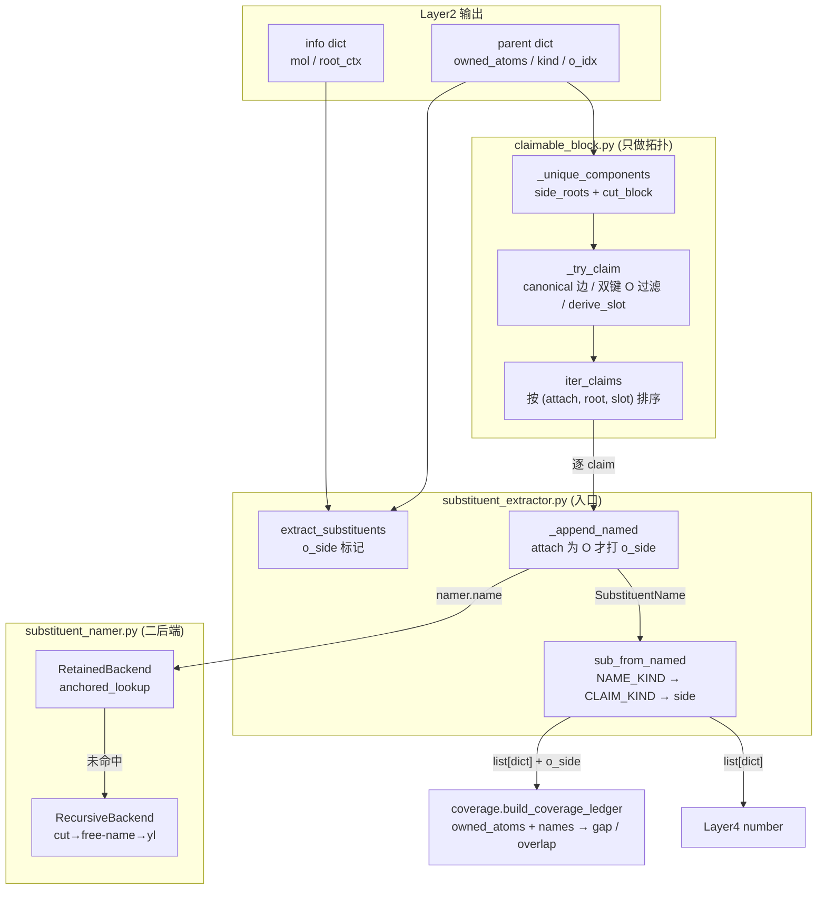
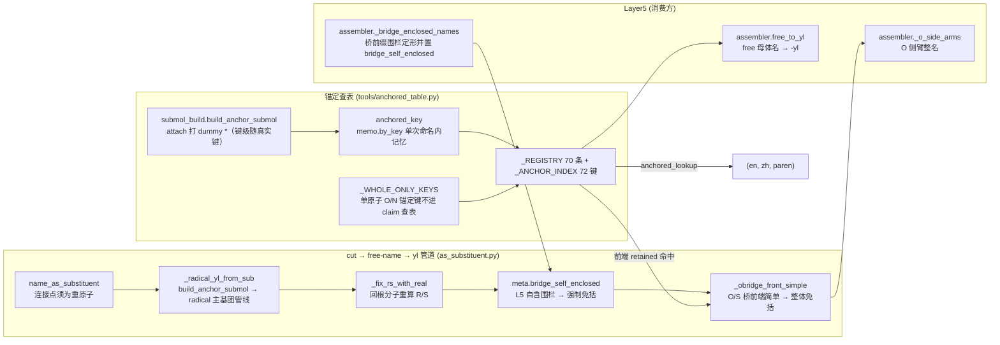

# Layer3: 取代基提取器 (Substituent Extractor)

> **最后更新:** 2026-09-15 | **源文件:** 7 `.py` (516 行) | **公开 API:** `extract_substituents(info, parent, *, cache) -> list[dict]`

## 概述

Layer3 是 NamePredict 6 层流水线中的第三层，负责枚举母体所有权边界之外的所有重原子组分（claim），为每个组分生成中英双语名称，并输出取代基列表供 layer4 编号、layer5 组装。

取代基集合**完全由几何边界枚举得出**：本层只读 `parent["owned_atoms"]`（母体声明拥有的原子），不读 layer1 的官能团列表（`hydroxyls`/`ketones`/`amines`/`ethers` 等）——凡是母体边界之外的重原子连通组分都被切出为一个 claim，再按「锚定查表 → 递归命名」二后端取首个命中的名字。

**输入:**
- `info: dict` — layer1 的分析结果，本层只读 `"mol"`（RDKit Mol 对象）与 `"root_ctx"`（`(root_mol, to_root)`，`namer._name_mol` 注入，`namer.py:207`，供递归取代基回根分子校正 R/S）
- `parent: dict` — layer2 选出的母体，本层只读 `"owned_atoms"`（边界集合，`None` 即返回空列表）、`"kind"` 与 `"o_idx"`（`kind ∈ ESTER_O_SIDE_KINDS` 或有 `o_idx` 时判定为 O 侧臂）
- `cache: CommonNameCache | None` — 递归子结构命名的共享缓存

**输出:**
- `list[dict]` — 取代基列表，每个元素含 `kind`（`halo`/`alkyl`/`n_block`/`side`）、`en`/`zh`（双语名）、`attach_idx`（母体侧连接原子索引）、`atoms`（该取代基的原子索引升序表）、`paren`（是否需围栏）、`n_carbons`（碳原子数）；O 侧臂另带 `o_side=True`

**在流水线中的位置:**

```
layer1 analyze → layer2 select_parent → layer3 extract_substituents → layer4 number → layer5 assemble
```

> **源:** `src/namepredict/namer.py` — `extract_substituents` 由 `_prepare_candidate` 调用（`namer.py:126`），随后同一函数以 `names=[]` 调 `build_coverage_ledger`（`namer.py:127`）取 `complete` 作为覆盖门控；取代基列表经 `_subs_for_numbering`（`namer.py:92`）筛掉不参与编号的项后交给 L4。

## 核心逻辑

### 提取主流程 (extract_substituents)

`extract_substituents`（`substituent_extractor.py:43`）是本层唯一入口，同时也是 claim 命名到取代基 dict 的完整实现，claim 的拓扑枚举外包给 `claimable_block`。流程三步：

1. 取 `owned = parent.get("owned_atoms")`，为 `None` 时直接返回 `[]`（`substituent_extractor.py:48`）。
2. 算一次 `o_side` 标记：`parent.get("kind") in ESTER_O_SIDE_KINDS`（= `{"ester", "phosphate"}`，`constants.py:143`）或 `parent.get("o_idx") is not None`（`substituent_extractor.py:53`）。苯甲酸酯类（苯 base + ester FG）没有 `kind` 表项，靠 `o_idx` 字段识别 O 侧臂。
3. 建一个 `SubstituentNamer(cache=cache, root_ctx=info.get("root_ctx"))`，遍历 `iter_claims(mol, owned)`，对每个 claim 调 `_append_named`（`substituent_extractor.py:32`）；`namer.name` 返回 `None` 的 claim 被静默跳过（该原子最终体现为覆盖台账的 `gap`）。

`_append_named` 拿到 `SubstituentName` 后交 `sub_from_named`（`substituent_extractor.py:17`）封装为 dict；仅当 `o_side` 为真**且**连接原子确为 O（`GetAtomicNum() == 8`）时才写 `o_side=True`（`substituent_extractor.py:38`），故磷酸酯的 P 侧、酰胺 N 侧不会被打上 O 侧标记。

`sub_from_named` 负责 kind 三级映射（`substituent_extractor.py:22`）：先查 `constants.NAME_KIND`（only `fluoro`/`chloro`/`bromo`/`iodo` → `halo`），未命中再查 `constants.CLAIM_KIND`（`amine_n` → `n_block`，`ring_c`/`chain_c` → `alkyl`），仍无则 `"side"`。**环员 N 的 kind 改写**（`substituent_extractor.py:23`）紧随其后：kind ∈ `constants.N_PREFIX_KINDS`（`constants.py:39`，`{"n_alkyl", "n_block"}`，P-62.2.2.1）且附着原子 `IsInRing()` 时，改写为槽位 `ring_c` 对应的 `alkyl`，改用环上位次定位而非 N- 前缀（P-14.4/P-16），使环 N 不与酰基/氨基 N 撞名（如 `3-phenyl-1,3-oxazolidin-2-one` 不写成 N-phenyl）。当前 `N_PREFIX_KINDS` 的唯一来源是 `amine_n` 槽位，而该槽位要求连接原子非环员，故这段是防御性护栏。

### 侧链块枚举与槽位 (claimable_block)

`claimable_block.py` 只做拓扑，不命名。

- `_unique_components`（`claimable_block.py:112`）从 `tools.block_cut.side_roots`（`tools/block_cut.py:15`）给出的边界外邻居出发，用 `cut_block`（`tools/block_cut.py:42`）取不穿越 owned 的连通分量并按原子集去重。
- `_try_claim`（`claimable_block.py:96`）为每个组分取 `_canonical_edge`（`:71`）——owned 与组分之间**最小的 `(attach_parent, root)` 边**，使 claim 的表示与枚举入口无关。
- `_has_dbl_o_edge`（`:83`）丢弃「含经双键连 owned 内**非碳**重原子的氧」的组分（砜/亚砜/磷酰等主 FG 成分由主命名路径承担），避免把它切出 `*O` 后误命成羟基。
- `derive_slot`（`:34`）仅按连接原子定槽位：`_is_amine_n`（`:28`）为真 → `AMINE_N`；碳原子按 `IsInRing()` → `RING_C`/`CHAIN_C`；其余 → `OTHER`。`_is_amine_n` 的判据是「连接原子为 N 且非芳香且非环员」，故芳香胺 N 与环员 N 都落 `OTHER`（环 N 由环位次定位，见上）。
- `claim_block`（`:53`）做最终校验后建块：连接原子必须在 owned 内、`cut_block` 结果非空、且组分对 owned 的附着点必须唯一（`_attach_parents_of`，`:44`，只数重原子邻居）。

`ClaimedBlock`（`claimable_block.py:20`）是 frozen dataclass，字段为 `slot`、`attach_parent`、`root`、`atoms`（frozenset）。`SideSlot`（`:11`）是 `str` 枚举：`CHAIN_C`/`RING_C`/`AMINE_N`/`OTHER`。`iter_claims`（`:123`）按 `(attach_parent, root, slot.value)` 排序返回，保证同分子多次枚举的顺序稳定。

### 取代基命名引擎 (SubstituentNamer)

`SubstituentNamer`（`substituent_namer.py:59`）持有一个后端列表，`name`（`:67`）按序调用各后端的 `try_name`，首个非 `None` 结果即返回。缺省列表在 `__init__`（`:62`）内硬编码为二后端：

1. **RetainedBackend**（`substituent_namer.py:34`）— 锚定 canonical-SMILES 查表。`try_name`（`:39`）调 `anchored_lookup(mol, claim.atoms, claim.root)`，命中即用注册表的 `(en, zh, paren)` 组装结果。
2. **RecursiveBackend**（`substituent_namer.py:43`）— 递归切割命名。构造时记录 `cache` 与 `root_ctx`（`:48`），`try_name`（`:53`）调 `name_as_substituent(mol, claim.root, claim.atoms, cache=..., root_ctx=...)`，把 claim 原子从母分子切出为锚定子分子，作为独立分子跑完整 L1-L5 管道，再转 P-29 -yl 形式；`cache`（`CommonNameCache`，`tools/common_names.py:7`）以 canonical SMILES 去重共享结果，`root_ctx` 贯穿传给 `name_as_substituent`，供 radical 取代基回根分子校正 R/S。

后端协议由 `SubstituentBackend`（`:22`）声明（`Protocol`，要求一个 `name` 字符串属性）。命中结果统一经 `_named`（`:26`）封装为 `SubstituentName`，`en` 或 `zh` 为空视为未命中。

`SubstituentName`（`substituent_namer.py:14`）是 frozen dataclass，字段为 `claim`、`en`、`zh`、`requires_parentheses`。

### 通用 cut→free-name→yl 管道 (as_substituent / submol_build)

`as_substituent.py`（108 行）承载 RecursiveBackend 的底层 cut→free-name→yl 管道，核心是**锚定 radical 路径 + 回根分子 R/S 校正**：

- `submol_build.build_anchor_submol`（`submol_build.py:96`）构建诱导子分子：`_copy_atoms`（`:8`）按 `sorted(atoms)` 复制原子，`_copy_bonds`（`:16`）只复制子图内的键**并返回被复制的源键列表**（供 `_carry_alkene_stereo` 只扫子图内的键、不必遍历整分子），`_add_anchor`（`:88`）在连接原子处加 dummy 原子 `*`。`_sanitize`（`:69`）失败时返回 `None`。连接原子不在 `atoms` 内时直接返回 `None`（`:98`）。子分子是命名替身，原子集不含母体。
- **锚定键级随母体–取代基真实键级**：`_external_bond_type`（`submol_build.py:78`）取连接原子到母体外邻居的键型（无外部邻居的孤立自由基回退单键），`build_anchor_submol` 用它建 dummy 键——取代基叶以双键连母体（环外 `=CH2` 等）时保留双键，否则 canonical 收成 `*C` 会命成饱和 alkyl（methyl 而非 methylidene，式量丢 H₂；P-56.4）。
- `_carry_alkene_stereo`（`submol_build.py:29`）把诱导子图内 C=C 的 E/Z 标签照搬进子分子（键型重建会丢奇偶）：两端引用邻接被保留则映射到新索引，被切配基由连在 sp2 端的 dummy 顶替（`_add_anchor` 返回的 dummy 索引供其使用），无法唯一解析（如把 sp2 端封成非手性 CH2）则跳过留无立体。标签取原分子即真实立体，不随配基被切/被 `*` 顶替而重判；`SetStereoAtoms` 的传参顺序按新键 `begin`/`end` 端换序（`:61`，E/Z 只取决于两引用是否同侧）。
- `_radical_yl_from_sub`（`as_substituent.py:63`）是主命名路径：`build_anchor_submol` 打 `*` 后经 `_name_mol`（`namer.py`）走完整管线自由命名——L1 检测自由基/酰基头、L2 选 radical/acyl 主基团、L4 锚定位次、L5 输出 `{locants}yl`；canonical SMILES 作缓存键与顶层命名共享 `CommonNameCache`。`root_ctx` 为 `None` 时以 `(mol, None)` 兜底（`:73`），`block_root_order` 把块内原子索引映射到根分子索引，末位追加 `-1` 占位 dummy（`:76`）。**缓存语义**：只缓存片段自身的自由基名（`copy.copy(hit)`，不做宿主校正、保留锚定链）——立体随宿主根分子变化，不能跨根共享，故 fresh 与 cache 命中都按当前根分子再过一次 R/S 校正（`:84`）。
- `_fix_rs_with_real`（`as_substituent.py:13`）做 **radical 取代基 R/S 回根分子重算**：糖苷/醚类（如 O-C 糖-糖）异头位被 `*` dummy 顶替后，锚定子结构的 CIP 会随配基翻转，须回到完整根分子重算才正确（与 ChEBI 一致）。门槛为：`hit.meta["parent_kind"] == "radical"`、`parent_chain` 至少 2 个原子且索引未越界（非 `[0]`-坍缩、不含 `*`，`:22`）、锚定 CIP 非空（`:26`），再用 `layer5.stereo._cip_on_chain` 分别对锚定子结构与根分子取 R/S，不一致则以 `_with_rs` 重写 en/zh。位次经 `parent_labels` 改用整体编号标签（稠环桥头 4aS/8aS，`:35`），无标签表或越界时退回链序号。
- **括号判定经 meta 接口给出**（P-16.5.1.1）：词干是否复合由自由基命名的母体取代基数给出——`composite = meta.parent_substituent_count > 0`（`namer` 在 `_ok_result` 注入，`namer.py:57`），`need_paren = composite and en not in ("phenyl", *constants.SIMPLE_ALKOXY_NO_PAREN, *constants.AMIDO_RETAINED_EN)`（`as_substituent.py:89`）——复合前缀必括、未取代简单基免括。**amido 保留式（acetamido/formamido/benzamido，P-66.1.1.4.3 方法 1）作简单前缀免括号**（同 -alkoxy 保留式），否则 3,5-二乙酰苯环会被倍增成 `bis(acetylamino)` 而非 `diacetamido`。
- **`bridge_self_enclosed` 覆盖免括判定**（`as_substituent.py:91`）：命中 meta 带 `bridge_self_enclosed` 时直接置 `need_paren = False`——L5 已把该 O/S 桥复合前缀整名定形为自含围栏形式（如 `(4-甲氧基苯基)磺酰基`），L3 不得再对整体套一层括号，否则成为 `((4-甲氧基苯基)磺酰基)`。该标记由 L5 `assembler._bridge_enclosed_names`（`layer5/assembler.py:128`）定形后置入编号结果（`layer5/assembler.py:208`，N 桥 `azane` 除外——其名仍须 L5 整体围栏），经 `namer._chain_meta`（`namer.py:37`，字段在 `namer.py:42`）随 `parent_chain`/`parent_kind`/`parent_labels` 一起注入 meta。
- **O/S 桥前端简单时整体免括**（P-63.2.1/.2.2）：`need_paren` 且名字以 `oxy`/`sulfanyl` 结尾时，`_obridge_front_simple`（`as_substituent.py:44`）判定 attach 是否为二价 O/S 桥原子（`GetAtomicNum() in (8, 16) and GetDegree() == 2`）、桥内侧是否恰有 1 个组分原子，随后把「去桥后的前端」按 retained→recursive 后端取名，`paren=False` 即前端为简单取代基，整个 O/S 前缀不加围栏（gold/ChEBI 平铺式，如 propan-2-yloxy、hexadecanoyloxy、acetyloxy、benzyloxy、naphthalen-1-yloxy）。前端自身被取代（4-nitrophenyl-、2,6-dichlorophenyl-）时后端给出 `paren=True`，整体仍加括号；`-amino` 连接不走此规则。
- `name_as_substituent`（`:99`）为入口，`atoms` 强制 frozenset 后先判连接原子是否为重原子（原子序数 ≤ 1 返回 `None`，`:105`——dummy/氢连接点会自复制致无限递归），再委托 `_radical_yl_from_sub`（`:107`）；`root_ctx` 参数贯穿到子路径（与 `_name_mol` 的 `root_ctx` 同为 `(root_mol, to_root)`）。
- **`-yl` 转换不在本层**：free 母体名 → P-29 -yl 形式（醇→烷氧基 P-63.2.2、硫醇→烷硫基 P-63.2.1、伯胺→烷氨基 P-62.2）由 L5 `assembler.free_to_yl`（`layer5/assembler.py:178`）承担，连同单核氢化物表 `_MONONUCLEAR_NAMES`（`layer5/assembler.py:148`，oxidane/azane/sulfane/sulfinyl/sulfonyl/imine）；`free_to_yl` 对复合 `-amino` 前缀（P-29.3.6）与带环取代基的 `…anilino` 加围栏。

> **源:** `src/namepredict/layer3/as_substituent.py`, `src/namepredict/layer3/submol_build.py`

### 氨基与铵基取代基 (amino / azaniumyl)

氨基不设独立提取器，走统一 claim 路径：

- **质子化伯胺取铵基名**：`_REGISTRY` 的 `azaniumyl` 锚定叶子（`anchored_table.py:71`，`*[NH3+]` → `铵基`，P-62.4.1：azanium 去氢得 azaniumyl；gold/ChEBI 对氨基酸类一律取 azaniumyl）直接由 RetainedBackend 命中，同时 `methylazaniumyl`/`dimethylazaniumyl`/`trimethylazaniumyl`（`anchored_table.py:72-74`）覆盖 N-甲基化铵。
- **中性氨基**：注册表 `amino` 条目的锚定键 `*N`（`anchored_table.py:89`）落在 `_WHOLE_ONLY_KEYS`（`anchored_table.py:145`）内，`_table_hit` 对它返回 `None`，故单原子 N 叶子不经 claim 查表，改由 RecursiveBackend 的 `*N` 锚定自由基管线（氮烷 `azane` 词干，P-66.1.1）出词。
- **N-取代基（胺母体 N 端）**：非环、非芳香的胺 N 由 `_is_amine_n`（`claimable_block.py:28`）判定为 `AMINE_N` 槽位，经 `CLAIM_KIND` 映为 `n_block`（∈ `N_PREFIX_KINDS`），位次以 N 标注或隐含省略，由 L5 前缀组装消费（P-62.2.2.1）。
- **环员 N** 是环杂原子、按环位次定位，由 `sub_from_named` 的 kind 改写处理，不走 N- 前缀（见上「提取主流程」）。
- **酰胺母体的 N-烷基**由 layer1 检测 + layer5 组装处理，不走 layer3。

### 覆盖台账 (Coverage Ledger)

覆盖台账是 layer3 与上层质量控制的桥梁。`build_coverage_ledger`（`coverage.py:26`）接收分子、母体拥有的原子集合与 `SubstituentName` 列表，输出 frozen dataclass `CoverageLedger`（`coverage.py:13`）：`owned_atoms`、`named_claims`、`gap`（=`重原子集 - owned_atoms`，`coverage.py:40`）、`overlap`（在 owned 与各 claim 中出现次数 > 1 的重原子，`coverage.py:41`），属性 `complete`（`:21`）= `not gap and not overlap`。氢原子不参与统计（`coverage.py:33`）。

> 注：`namer._prepare_candidate`（`namer.py:127`）以 `names=[]` 调用，故当前门控等价于「`owned_atoms` 是否覆盖全部重原子」——`gap` 即母体边界漏掉的重原子，`named_claims`/`overlap` 仅在传入 names 时才有信息量。

> **源:** `src/namepredict/layer3/coverage.py`

### 取代基注册表 (anchored_table._REGISTRY)

`tools/anchored_table.py`（164 行）维护**单一取代基注册表** `_REGISTRY`（`anchored_table.py:24`）——基础取代基与 IUPAC 2013 蓝皮书 P-29/P-57/P-61-P-68 保留条目统一入表。每条 `RetainedSubstituent`（`:16`）四个字段：`en`、`zh`（最终用名，如 `isopropyl` 条目 `en="propan-2-yl"`、`isobutyl` 条目 `en="2-methylpropyl"`）、`anchored`（锚定 canonical-SMILES 键，可为多条）、`paren`（作前缀时是否需围栏）。注册表只读，经 `resolve_name`（`:127`）/`anchored_lookup`（`:156`）查询。

**实测条目数：70 条**（`_ANCHOR_INDEX` 72 键——`phosphonato` 与 `phosphonatooxy` 各带两条锚定键；`paren=True` 的 9 条为 `diaminomethylidene`/`carbamoylamino`/`carbamothioylamino`/`dimethylazaniumyl`/`trimethylazaniumyl`/`phosphonooxymethyl`/`phosphonatooxymethyl`/`carboxymethyl`/`hydroxymethyl`）。分类：

| 类别 | 条目示例 |
|------|---------|
| 基础取代基（halo/leaf） | `*F` fluoro、`*Cl` chloro、`*[N+](=O)[O-]` nitro、`*=O` oxo、`*N=C=O` isocyanato、`*N=C=S` isothiocyanato |
| 线性 n-烷基 C1-C4 | `*C` methyl、`*CC` ethyl、`*CCC` propyl、`*CCCC` butyl |
| 亚基 ylidene（叶以双键连母体） | `*=C` methylidene、`*=CC` ethylidene、`*=CCC` propylidene、`*=C1CC1` cyclopropylidene、`*=C1CCCCC1` cyclohexylidene、`*=S` sulfanylidene |
| 支链/烯/炔保留基 | `*C(C)C` propan-2-yl、`*C(C)(C)C` tert-butyl、`*CC(C)C` 2-methylpropyl、`*C(C)CC` butan-2-yl、`*CC(C)(C)C` 2,2-dimethylpropyl、`*CCC(C)C` 3-methylbutyl、`*C=C` ethenyl、`*CC=C` prop-2-enyl、`*C(=C)C` prop-1-en-2-yl、`*CC#C` prop-2-ynyl |
| 芳烷基 | `*Cc1ccccc1` benzyl |
| 含杂原子保留基（leaf） | `*OC` methoxy、`*OO` hydroperoxy、`*O` hydroxy、`*[O]` oxidanyl、`*SC`/`*SCC`/`*S` 硫系、`*[SeH]` selanyl、`*S(C)=O` methylsulfinyl、`*S(C)(=O)=O` methylsulfonyl、`*S(=O)(=O)O` sulfo、`*S(=O)(=O)c1ccc(C)cc1` tosyl、`*C(=O)O` carboxy、`*C=O` formyl、`*C#N` cyano、`*[N+]#[C-]` isocyano、`*N` amino、`*NN` hydrazinyl、`*Nc1ccccc1` anilino、`*N=O` nitroso、`*N=[N+]=[N-]` azido、`*N=N` diazenyl、`*[N+]=[N-]` diazo、`*CO` hydroxymethyl（`paren=True`）、`*CC(=O)O` carboxymethyl（`paren=True`） |
| 酰胺/脲/磺酰胺残基（leaf） | `*C(N)=O` carbamoyl、`*OC(N)=O` carbamoyloxy、`*NC(N)=O` carbamoylamino（`paren=True`）、`*NC(N)=S` carbamothioylamino（`paren=True`）、`*S(N)(=O)=O` sulfamoyl、`*C(=N)N` diaminomethylidene（`paren=True`，脒/胍残基） |
| 磷系列 | 直连母体 `*P(=O)(O)O` phosphono、`*P(=O)([O-])O`/`*P(=O)([O-])[O-]` phosphonato；O 桥 `*OP(=O)(O)O` phosphonooxy、`*OP(=O)([O-])O`/`*OP(=O)([O-])[O-]` phosphonatooxy、`*COP(=O)(O)O` phosphonooxymethyl（`paren=True`）、`*COP(=O)([O-])O` phosphonatooxymethyl（`paren=True`） |
| 铵型阳离子（leaf） | `*[NH3+]` azaniumyl、`*[NH2+]C` methylazaniumyl、`*[NH+](C)C` dimethylazaniumyl（`paren=True`）、`*[N+](C)(C)C` trimethylazaniumyl（`paren=True`） |

> 亚基（ylidene）叶以**真实双键键级**入表：若 canonical 收成 `*C` 单键，命出的是氢化产物（净多 2H，等于写出另一个分子）。`diaminomethylidene`（`anchored_table.py:40`，`*C(=N)N`，`paren=True`）为脒/胍残基，按 P-66.1.1 取亚基式而非等价的 `amino(imino)methylamino`（两者互变、分子式相同，取测试集口径）。酰胺类 leaf 按 P-66.1.1.4 取保留式：carbamoyl/carbamoyloxy（P-66.1.1.4.1）、carbamoylamino（P-66.1.1.6，替代已不推荐的 ureido）、carbamothioylamino（P-66.1.1.4）、sulfamoyl（P-66.1.1.4.2）；`phosphono`/`phosphonato` 为 P 直连母体的 -PO(OH)₂ / -PO(O⁻)₂（P-102），与 O 桥的 `phosphonooxy` 系列互补。铵型阳离子（P-62.4.1）整体入表：带电 N 片段一旦整体丢失会在覆盖台账里表现为 gap，故按锚定叶子承载。

构建期 `_build_anchor_index`（`anchored_table.py:109`）把各条目 `anchored` 键 canonical 化（`_canon`，`:99`）后反查生成 `_ANCHOR_INDEX`（`:124`），并校验每个锚定键**已是 canonical 形式**且**跨 key 唯一**，违例抛 `ValueError`。

查表键 `anchored_key`（`:132`）经 `tools.memo.by_key("anchored_key", (id(mol), 原子集, 连接原子), …)` 在**单次命名内**记忆（实际构建在 `_anchored_key_uncached`，`:138`）——同一 claim 在查表与递归拆分间会被反复求键且键只依赖 `(mol, 原子集, 连接原子)`，记忆化纯消除重复计算、不改变返回值；`memo.begin_run()`（`tools/memo.py:12`）由 `namer.SMILESNNamer.name` 每次顶层命名开始时清空（`namer.py:262`）。`_table_hit`（`:148`）取索引命中；锚定键为 `*O`/`*[O]`/`*N`（`_WHOLE_ONLY_KEYS`，`:145`）时返回 `None`——只允许整分子顶层命中，避免 L3 把酮羰基氧/酯氧/胺氮误认成羟基/氨基。`anchored_lookup`（`:156`）命中即解析为 `(en, zh, paren)`；`resolve_name`（`:127`）返回条目的 `(en, zh)`。

> **源:** `src/namepredict/tools/anchored_table.py`

## 数据流图





## 文件清单

| 文件 | 行数 | 描述 |
|------|------|------|
| `__init__.py` | 2 | 包声明与层说明（`L3 取代基提取层：入口 extract_substituents`）；入口函数定义在 `substituent_extractor.py`。 |
| `substituent_extractor.py` | 57 | **入口 + claim→dict 封装**。`extract_substituents`（`:43`）遍历 `iter_claims`，未命名成功的 claim 静默跳过；`_append_named`（`:32`）仅在连接原子为 O 时打 `o_side`；`sub_from_named`（`:17`）出 dict（`kind`/`n_carbons`/`attach_idx`/`atoms`/`en`/`zh`/`paren`）并做 kind 三级映射与环员 N 改写；`_claim_kind`（`:12`）。 |
| `claimable_block.py` | 130 | **拓扑与槽位**（不命名）。`SideSlot`(CHAIN_C/RING_C/AMINE_N/OTHER)、`ClaimedBlock`(slot/attach_parent/root/atoms)、`derive_slot`、`claim_block`、`iter_claims`；canonical 边选取、双键 O 组分过滤、单附着点校验。 |
| `substituent_namer.py` | 73 | **命名引擎**。`SubstituentBackend` 协议 + 有序二后端 `RetainedBackend`/`RecursiveBackend`；`SubstituentName(claim, en, zh, requires_parentheses)`；`_named` 封装、`SubstituentNamer.name` 取首个命中。 |
| `as_substituent.py` | 108 | **cut→free-name→yl 管道**。`name_as_substituent` 入口（连接点须为重原子）、`_radical_yl_from_sub`（锚定 `*` radical/acyl 管线 + 缓存 + 括号判定）、`_fix_rs_with_real` 回根分子校正 R/S、`_obridge_front_simple` 判定 O/S 桥前端简单时整体免括。 |
| `submol_build.py` | 104 | **锚定子分子构建**。`build_anchor_submol` / `_copy_atoms` / `_copy_bonds`（返回子图内源键）/ `_carry_alkene_stereo`（E/Z 迁移）/ `_external_bond_type`（锚定键级照搬，双键叶 → methylidene）/ `_add_anchor` / `_sanitize`。 |
| `coverage.py` | 42 | **覆盖台账**。`CoverageLedger`(owned_atoms/named_claims/gap/overlap + `complete`) 与 `build_coverage_ledger`。 |

layer3 合计 **7 个 .py / 516 行**。

> 备注：`side_facts.py`/`aryl_sub.py`/`yl_form.py`/`amino_side.py`/`claim_extract.py` 均不在 `layer3/` 下——氨基与铵基由注册表锚定叶子 + claim 路径承担；claim→dict 的封装与入口同在 `substituent_extractor.py`。`carbon_neighbors` 不在 `tools/chain.py` 的对外面（只有 `_carbon_neighbors`/`_longest_from`，消费方是 L2 `chain_walk`）；yl 转换在 `layer5/assembler.free_to_yl`。

### tools/ 层无关工具（layer3 消费）

| 文件 | 行数 | 描述 |
|------|------|------|
| `tools/__init__.py` | 3 | 包声明与层说明（`tools/` 供 L2/L3 共享，不依赖任何流水线层）。 |
| `tools/anchored_table.py` | 164 | **锚定 canonical-SMILES 查表 + 取代基注册表**。`_REGISTRY`（70 条统一 registry，字段 `en`/`zh`/`anchored`/`paren`）+ `_ANCHOR_INDEX`（72 键）反查 + `anchored_key`（经 `memo` 单次命名内记忆）/`_table_hit`/`anchored_lookup`/`resolve_name`/`_WHOLE_ONLY_KEYS`。核心机制。 |
| `tools/block_cut.py` | 46 | 母体边界块切割：`side_roots`（`:15`，边界外重原子邻居）/`cut_block`（`:42`，不穿越母体的连通分量，BFS）。 |
| `tools/common_names.py` | 29 | **常用名结果缓存** `CommonNameCache`（`:7`，`SMILES → NameResult` 内存字典，`max_entries` 满则 `put` 抛错；`clear()` 供并行评测逐行隔离）。layer3 递归命名与顶层 `namer` 共享。 |
| `tools/memo.py` | 44 | **单次命名的中间结果记忆**（跨层性能基建，不改命名结果）：`begin_run()`（`:12`）由 `namer.SMILESNNamer.name` 每次顶层命名开始时清空，`by_mol`/`by_key`（`:36`）按分子对象或自定义键记忆，`threading.local` 线程隔离。`anchored_table.anchored_key` 经 `by_key` 使用。 |

> 备注：`tools/re.py`（89 行，`alkyl_alpha_key`/`normalize_en`/`normalize_zh`）与 `tools/rdkit_fast.py`（25 行，导入期全局补丁）是 layer-agnostic 工具，层内不直接 import：`re.py` 由 L4/L5 消费，`rdkit_fast.py` 由 `namepredict/__init__.py` 在导入时安装（把 `Mol.GetAtoms()`/`GetBonds()` 换成索引循环，端到端省约 12.6%）。`tools/chain.py`（31 行）同样非 L3 依赖，其消费方是 L2 `chain_walk`。`tools/alkoxy_side.py` 与 `tools/free_to_yl.py` 不存在（酯 O 侧拓扑由 L2 principal_expression + L5 `join_ester_name` 承担，yl 转换在 `layer5/assembler.free_to_yl`）。

## 对外接口

### 主入口

```python
def extract_substituents(
    info: dict,
    parent: dict,
    *,
    cache: CommonNameCache | None = None,
) -> list[dict]:
```

- **info**: layer1 分析结果，必须包含 `"mol"` 键（RDKit Mol 对象）；可选 `"root_ctx"`（= `(root_mol, to_root)`，由 `namer._name_mol` 注入）
- **parent**: layer2 母体选择结果，必须包含 `"owned_atoms"` 键；可选 `"kind"`、`"o_idx"`（判定 O 侧臂）
- **cache**: 递归子结构命名的共享缓存（`CommonNameCache`），加速跨 cut 命名
- **返回**: 取代基 dict 列表，共同键 `kind`, `en`, `zh`, `attach_idx`, `atoms`, `paren`, `n_carbons`；O 侧臂另带 `o_side`

### 与 layer2 的接口

layer2 的 `finalize_parent_ownership`（`layer2/parent_select.py:83`）把候选折叠为不可变 `owned_atoms` frozenset（链原子 ∪ 主官能团特征原子），L3 只消费这一个字段。反向依赖是 `_p45_2_prefix_count`（`layer2/parent_select.py:97`）：P-45.2.1 的候选排序键就是 `len(iter_claims(mol, owned_atoms))`——L2 借 L3 的 claim 枚举数比较候选（`layer2/parent_select.py:100` 就地 import `iter_claims`），故 `iter_claims` 是本层对 L2 的公开面。

### claim 枚举

```python
class SideSlot(str, Enum):
    CHAIN_C = "chain_c"
    RING_C = "ring_c"
    AMINE_N = "amine_n"
    OTHER = "other"

@dataclass(frozen=True)
class ClaimedBlock:
    slot: SideSlot
    attach_parent: int
    root: int
    atoms: frozenset[int]

def derive_slot(mol, attach_parent: int) -> SideSlot
def claim_block(mol, *, owned_atoms, attach_parent: int, root: int, slot: SideSlot) -> ClaimedBlock | None
def iter_claims(mol, owned_atoms: frozenset[int]) -> list[ClaimedBlock]
```

### 内部命名类

```python
@dataclass(frozen=True)
class SubstituentName:
    claim: ClaimedBlock
    en: str
    zh: str
    requires_parentheses: bool

class SubstituentNamer:
    def __init__(self, backends=None, *, cache=None, root_ctx=None)
    def name(self, mol, claim: ClaimedBlock) -> SubstituentName | None

def name_as_substituent(mol, attach_old: int, atoms, *, cache=None, root_ctx=None) -> tuple[str, str, bool] | None
def build_anchor_submol(mol, atoms: frozenset[int], attach_old: int) -> Mol | None
```

### 锚定查表

```python
def anchored_key(mol, atoms: frozenset[int], attach_old: int | None = None) -> str | None
def anchored_lookup(mol, atoms: frozenset[int], attach_old: int | None = None) -> tuple[str, str, bool] | None
def resolve_name(key: str) -> tuple[str, str]
```

### 覆盖台账

```python
def build_coverage_ledger(mol, *, owned_atoms: frozenset[int], names: list[SubstituentName]) -> CoverageLedger
```

`CoverageLedger` 属性: `owned_atoms`, `named_claims`, `gap`, `overlap`, `complete`.

### 与 layer4 / layer5 的接口

- **L3 → L4**：取代基 dict 列表经 `namer._subs_for_numbering`（`namer.py:92`）筛选重映射后进 `number(parent, subs)`；L4 消费 `n_carbons`（`layer4/locant_calc.py:150`）与 `kind`（`layer4/omit_locants.py:18`）决定位次省略。
- **L3 → L5**：`kind` 触发 L5 特化组装（N- 前缀走 `N_PREFIX_KINDS` 通道，`namer.py:98` 的筛选取并集）；`paren` 决定是否围栏（`layer5/assembler.py:110`、`assembler_prefixes.py:228`）；`o_side` 臂由 `assembler._o_side_arms`（`layer5/assembler.py:372`）取出、`_join_o_side_arms`（`:377`）整名，`_build_prefix` 会把 `o_side` 项从普通前缀中剔除（`layer5/assembler_prefixes.py:282`）。
- **L5 → L3（回调）**：`RecursiveBackend` 经 `namer._name_mol` 递归跑完整 L1-L5 管线，并在 `_radical_yl_from_sub` 内用 `layer5.stereo._cip_on_chain`/`_with_rs` 回根分子校正 R/S；L5 `assembler` 置入的 `bridge_self_enclosed`（`layer5/assembler.py:208`）经 `namer._chain_meta`（`namer.py:42`）回传给 L3 的括号判定。
- **架构约束**：layer3 只 import `namepredict.tools.*` 与包内同层模块，不 import layer2 任何私有名（`tests/unit/test_architecture_contracts.py:198` 的 AST 契约），L3 内所有函数显式声明参数、不用 `*args`/`**kwargs`（同文件 `:279`）。

## 相关页面

- [[architecture/layer2-parent-selector]] — Layer2 母体选择器，提供 `parent` dict（含 `owned_atoms`）；经 `iter_claims` 反向调用 L3 作 P-45.2.1 排序键
- [[architecture/layer1-analyzer]] — Layer1 官能团分析器，提供 `info` dict（L3 只取 `mol` 与 `root_ctx`）
- [[architecture/layer4-numbering]] — Layer4 编号引擎，消费 layer3 输出的取代基列表（字母序键经 `tools/re.alkyl_alpha_key`）
- [[architecture/layer5-name-assembly]] — Layer5 名称组装，最终拼接母体名和取代基前缀（-yl 转换在 `layer5/assembler.free_to_yl`）
- [[architecture/overview]] — 系统架构概览，6 层流水线总览
- [[concepts/bilingual-naming]] — 中英双语命名约定
- [[concepts/atom-ownership]] — ClaimedBlock / owned_atoms / CoverageLedger 原子归属模型
