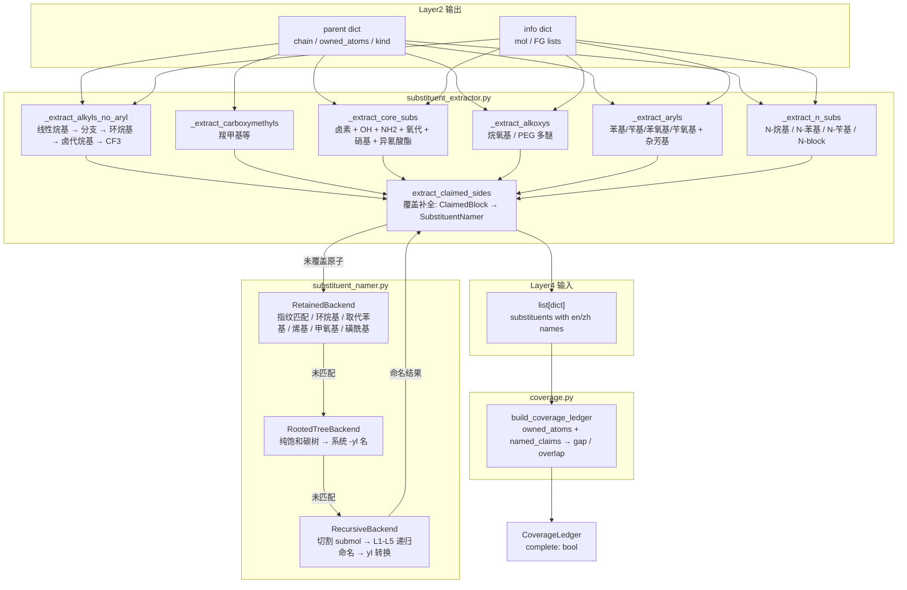
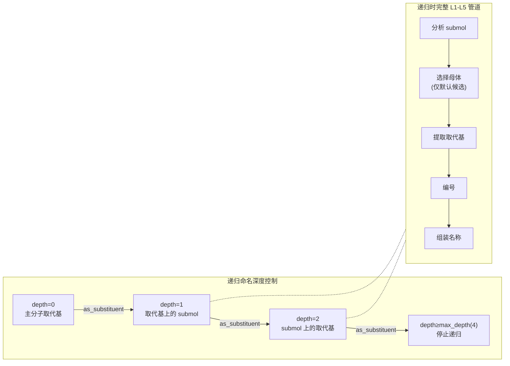

# Layer3: 取代基提取器 (Substituent Extractor)

> **最后更新:** 2026-07-20 | **源文件:** 16 `.py` | **公开 API:** `extract_substituents(info, parent, name_mode) -> list[dict]`

## 概述

Layer3 是 NamePredict 6 层流水线中的第三层，负责从母体结构中识别、切除并命名所有非母体原子作为取代基（substituents）。其核心职责：给定 layer1 的分析结果 `info` 和 layer2 选出的母体 `parent`，提取所有附加在母体链/环上的侧链和官能团，为每个取代基生成中英双语名称，并通过覆盖台账（Coverage Ledger）验证所有重原子均已覆盖、无重叠冲突。

**输入:**
- `info: dict` — layer1 的分析结果，包含 `mol` (RDKit Mol 对象)、羟基列表 `hydroxyls`、酮基列表 `ketones`、硝基列表 `nitros`、异氰酸酯列表 `isocyanates`、胺基列表 `amines`、醚列表 `ethers` 等
- `parent: dict` — layer2 选出的母体，包含 `kind`（母体类型）、`chain`（主链原子索引列表）、`owned_atoms`（母体声明拥有的所有原子 frozenset）、`ring`（环原子）、以及各种 FG 定位符
- `name_mode: str` — 命名模式（`"general"` 保留名 / `"pin"` PIN 首选名）

**输出:**
- `list[dict]` — 取代基列表，每个元素包含 `kind`（取代基类别）、`en`/`zh`（中英名称）、`attach_idx`（连接点原子索引）、`atoms`（取代基包含的原子列表）、`paren`（是否需要括号）、`n_carbons`（碳原子数）、`backend`（命名后端标识）等字段

**在流水线中的位置:**

```
layer1 analyze → layer2 select_parent → layer3 extract_substituents → layer4 number → layer5 assemble
```

> **源:** `src/namepredict/namer.py:119-121`
> ```python
> subst = extract_substituents(info, parent, name_mode=name_mode)
> complete = _ledger_complete(mol, parent["owned_atoms"], subst)
> ```

## 核心逻辑

### 提取算法 (Extraction Algorithm)

`extract_substituents` 是整个 layer3 的入口函数，采用分层提取策略，按照原子类型和结构复杂度依次识别取代基。提取顺序的设计遵循"先简单后复杂"原则，避免早期阶段错误地消耗可由后期阶段更准确命名的原子。

> **源:** `src/namepredict/layer3/substituent_extractor.py:434-444`

**第一阶段: 烷基侧链提取** — 遍历母体主链 (`parent["chain"]`) 上的每个碳原子，通过 `_side_starts` 识别连接在链碳上但不属于链本身的邻居原子，以此为起点探索侧链。对每个侧链起点，`_one_alkyl` 首先尝试线性烷基识别（通过 `side_facts.linear_alkyl` 追踪连续碳链，最多 12 个碳），然后在 `ALKYL_EN` / `ALKYL_ZH` 字典中查找对应名称（methyl/甲基 到 dodecyl/十二烷基）。若线性匹配失败，则转至 `_one_branched` 尝试分支烷基模式匹配。

分支识别通过 `_BRANCH_CHECKS` 中定义的 10 种烷基形状模板（vinyl, allyl, isopropenyl, isopropyl, tert-butyl, 2-methylbutan-2-yl, isobutyl, sec-butyl, neopentyl, 3-methylbut-2-enyl, isopentyl）依次匹配，命中后通过 `retained_substituents.resolve_name` 获取双语名称。未匹配则尝试环烷基/饱和杂环侧链（`_one_cycloalkyl_side`），最后检查三氟甲基 (`C1_THREE_HALOGEN_LEAVES`)。此阶段还有芳基侧链外层起点过滤 (`_aryl_outer_starts`)，避免芳基连接点处的碳被误识别为普通烷基起点——实际上这些碳将作为苯基/苄基等芳基取代基的连接桥梁，由后续芳基提取阶段专门处理。

**第二阶段: 核心官能团提取** — `_extract_core_subs` 按固定顺序收集卤素（F/Cl/Br/I，直接连接在链碳上）、羟基（仅在母体不是醇/酚类时提取，防止与母体官能团冲突）、氨基（仅在母体不是胺/苯胺类时提取）、氧代（仅在母体不是酮/醌类时提取）、硝基、异氰酸酯/异硫氰酸酯（仅在母体本身不是异氰酸酯时）。每个提取器都会检查母体类型 (`_PARENT_OH_KINDS`, `_PARENT_NH2_KINDS`, `_PARENT_OXO_KINDS` 等 frozenset)，当母体本身以该官能团为主要官能团时，链上的相应基团视为母体骨架的一部分而非取代基。

卤素提取有特殊的过滤逻辑 (`_filter_fg_halos`): 对于酰氯/酰溴母体，母体官能团自身的卤素原子被排除；对于功能性醚类别（如 HFIP），醚臂本身的氟原子也不重复提取。

> **源:** `src/namepredict/layer3/substituent_extractor.py:389-396`

**第三阶段: 烷氧基提取** — `_extract_alkoxys` 从 layer1 的醚分析数据中识别连接在环碳上的烷氧基侧链。通过 `outer_alkoxy` 从连接点向外追踪，支持线性烷氧基 (C1-C4: methoxy/甲氧基 到 butoxy/丁氧基)、分支烷氧基（isopropoxy/异丙氧基、isobutoxy/异丁氧基）以及 PEG 类型多醚链（通过 `_peg_alkoxy_en/zh` 递归生成嵌套名称，如 "2-(2-methoxyethoxy)ethoxy"）。

**第四阶段: 芳基和杂芳基提取** — `_extract_aryls` 识别苯基/苄基取代基（通过 `side_facts.aryl_arms` 分析芳基连接模式，区分 DIRECT_C/phenyl、METHYLENE_C/benzyl、DIRECT_O/phenoxy、O_METHYLENE_C/benzyloxy 四种模式），以及杂芳基 (pyridinyl/吡啶基、naphthyl/萘基)。苯环上有取代基时，`aryl_arm_name` 会委托到 `ring_namer.py` 的 `recursive_ph_name` 进行完全的环取代基编号和命名（支持氨基、氰基、羟基、甲基、甲硫基、硝基、三氟甲基、卤素、烷氧基、N-烷基以及嵌套的 phenyl/phenoxy/benzyl 等复杂取代基）。

**第五阶段: N-取代基提取** — `_extract_n_subs` 处理酰胺和胺类母体氮原子上的取代基。分两条路径：简单路径 (`n_side_extract`) 处理 N-甲基、N-乙基、N,N-二甲基、N-苯基等简单取代基；复杂路径 (`n_block_extract`) 当母体标记 `n_block` 时，将整个 N-侧链切割为 block，通过 `SubstituentNamer` 全管道命名（支持保留名→rooted_tree→递归）。两者互斥：n_block 优先，若存在则跳过简单路径。

**第六阶段: 声明侧链补全 (Claimed Sides)** — `extract_claimed_sides` 是覆盖补全机制。它遍历 layer2 通过 `iter_claims` 生成的所有 `ClaimedBlock`（即 ownership 边界处未被前面阶段覆盖的原子块），对每个未被覆盖的 claim 调用 `SubstituentNamer.name()` 进行命名。这是 layer3 的"安全网"——任何逃过前面所有专门提取器的侧链原子最终在这里被捕获命名。

### 取代基命名引擎 (SubstituentNamer)

当直接提取器无法命名的复杂取代基出现时（主要通过 `claim_extract` 和 `n_block_extract`），`SubstituentNamer` 承担命名职责。它采用三后端链式尝试策略：

1. **RetainedBackend** — 保留名/简单取代基。依次尝试：拓扑指纹匹配（`_try_registry_leaf`，通过 `retained_substituents._REGISTRY` 中预定义的 `leaf_atoms` 签名匹配，如 cyano: (6,7) 带三键）、环烷基匹配 (`_try_cycloalkyl`)、取代苯基匹配 (`_try_sub_phenyl`，委托给 `ring_namer.recursive_ph_name` 进行递归苯环命名)、烯基保留名匹配 (`_try_alkenyl_retained`)、甲氧基匹配 (`_try_methoxy`)、甲硫基匹配 (`_try_methylsulfanyl`)、甲基亚磺酰基匹配 (`_try_methylsulfinyl`)、甲基磺酰基匹配 (`_try_methylsulfonyl`)、对甲苯磺酰基匹配 (`_try_tosyl`)、三氟甲磺酰基匹配 (`_try_triflyl`)。匹配成功即返回，不继续尝试。

2. **RootedTreeBackend** — 纯饱和碳树系统命名。适用于不匹配保留名的分支烷基。调用 `side_alkyl_sys.build_rooted_alkyl_tree` 构建以 claim root 为根的有根树，再通过 `alkyl_sys_names.name_rooted_alkyl` 生成系统名称。后者首先确定最长主路径（principal path），然后收集分支（按位次和碳数），最后组装为 `{locants}-{mult}{branch}...{stem}yl` 形式。支持最多 12 个碳原子、最大深度 3 层的饱和碳骨架。

3. **RecursiveBackend** — 有界递归切割命名。当保留名和 rooted_tree 都无法处理时，调用 `as_substituent.name_as_substituent`，将 claim 原子从母分子中切割出来（`build_cut_submol`），作为独立分子运行完整的 L1-L5 管道（`_name_mol` 递归调用），然后将自由名称转换为 P-29 规定的 -yl 形式。递归深度有上限 (`max_depth=4`)，防止无限循环。yl 转换通过 `yl_form.yl_form` 完成，该函数还处理官能团后缀到前缀的特殊转换：醇→烷氧基 (P-63.2.2)、硫醇→烷硫基 (P-63.2.1)、伯胺→烷氨基 (P-62.2)。

> **源:** `src/namepredict/layer3/substituent_namer.py:298-308`

### 覆盖台账 (Coverage Ledger)

覆盖台账是 layer3 与上层质量控制的桥梁。`build_coverage_ledger` 函数接收分子、母体拥有的原子集合和已命名的取代基列表，输出 `CoverageLedger` 对象：

- `owned_atoms` — 母体声明拥有的所有重原子（不含氢）
- `named_claims` — 所有已命名取代基的 claim 元组
- `gap` — 重原子中既不属于母体也不属于任何取代基的原子（遗漏）
- `overlap` — 同时被母体和取代基声明（或同时被多个取代基声明）的原子（冲突）

台账通过 `Counter` 统计每个原子的出现次数实现：母体拥有的原子计 1 次，每个取代基 claim 包含的原子各计 1 次。计数为 0 的是 gap，计数 > 1 的是 overlap。`complete` 属性返回 `not gap and not overlap`。

在 `namer.py` 中，`_ledger_complete` 将取代基 dict 列表转换为 `SubstituentName` 对象后调用 `build_coverage_ledger`。覆盖完整的候选优先被采用（`_run_candidates` 的 Pass 1），仅当所有候选都不完整时才回退到部分覆盖的结果（Pass 2，标记 `fallback: no_coverage_gate`）。

> **源:** `src/namepredict/layer3/coverage.py:51-66`

### N-侧链处理

N-取代基处理分三个层次：

1. **N-烷基简单取代** (`n_side_extract.py`) — 对于仲胺和叔胺母体，从母体字典中读取 `n_alkyl_n`（单个取代基碳数）或 `n_alkyl_ns`（多个取代基碳数列表），生成 N-methyl/N-甲基（C1）到 N-butyl/N-丁基（C4）等前缀。叔胺的两个取代基通过 `_tert_n_prefix` 组合：相同者用 "N,N-di..." 格式，不同者按字母序排列为 "N-...-N-..."。

2. **N-苯基/N-苄基取代** — `_extract_n_benzyl` 专门处理酰胺类母体上的 N-苄基。它通过 benzyl 环识别 (`side_facts.benzyl_ring`) 获取环原子，再通过 `aryl_arm_name` 命名。当苄基上的苯环有额外取代基时需要括号包裹（`N-(substituted_benzyl)` 格式）。`n_side_extract` 中的 `extract_n_phenyl` 则处理直接的 N-苯基。

3. **N-Block 复杂取代** (`n_block_extract.py`) — 当母体标记 `n_block: True` 且 `n_block_root` 存在时，从该根原子出发切割整个 N-侧链 block（通过 `block_cut`），构造为 `ClaimedBlock` 后委托给 `SubstituentNamer`。命名结果包裹为 `N-{name}` 前缀。block 提取与简单 N-取代互斥：block 存在时简单路径被跳过。

### 保留取代基名称系统

`retained_substituents.py` 维护一个集中式保留取代基注册表 (`_REGISTRY`)，覆盖 IUPAC 2013 蓝皮书 P-29/P-57/P-61-P-68 的相关条目。每个条目 (`RetainedSubstituent`) 包含：保留英文名 `en`、保留中文名 `zh`、系统英文名 `systematic_en`、系统中文名 `systematic_zh`、IUPAC 推荐级别（`PIN` / `GENERAL` / `NOT_RECOMMENDED`）、规则引用 `rule_ref`，以及可选的拓扑指纹字段（`leaf_atoms` 原子序数签名、`leaf_root_z` 根原子序数、`leaf_bond_order` 键级、`validate` 自定义验证函数）。

`resolve_name` 函数根据命名模式决定返回保留名还是系统名：`general` 模式始终返回保留名；`pin` 模式仅在条目自身为 PIN 级别时返回保留名，否则返回系统名。注册表覆盖 10 大类 60+ 条目：分支烷基（isopropyl, tert-butyl 等）、不饱和无环基（vinyl, allyl, propargyl 等）、芳基/芳烷基（phenyl, benzyl, tolyl 等）、杂芳基（furyl, thienyl, pyridyl 等）、含氧前缀（methoxy, hydroperoxy）、含硫前缀（methylsulfanyl, sulfo, tosyl, triflyl 等）、含氮前缀（nitroso, azido, cyano, carbamoyl 等）、含磷/硼/硒前缀、卤代烷基（trichloromethyl, pentafluoroethyl 等）、酰基前缀（formyl, acetyl, benzoyl 等）。

## 数据流图





## 文件清单

| 文件 | 行数 | 描述 |
|------|------|------|
| `__init__.py` | 6 | 公开 API 导出：`extract_substituents` |
| `substituent_extractor.py` | 445 | **主提取器**。识别母体链上的各种取代基：烷基、卤素、羟基、氨基、氧代、硝基、异氰酸酯、烷氧基、芳基/杂芳基、N-取代基、羧烷基。定义所有 `_make_*` 辅助函数构建取代基 dict。 |
| `substituent_namer.py` | 334 | **命名引擎**。三后端链式尝试：保留名 (RetainedBackend)、饱和碳树 (RootedTreeBackend)、递归命名 (RecursiveBackend)。`SubstituentNamer` 类是统一入口。 |
| `coverage.py` | 67 | **覆盖台账**。`CoverageLedger` 计算 gap/overlap，验证所有重原子已被母体或取代基恰好覆盖一次。`build_coverage_ledger` 是唯一公开函数。 |
| `claim_extract.py` | 68 | **声明侧链提取**。`extract_claimed_sides` 遍历 layer2 的 `iter_claims`，对未覆盖的原子块调用 `SubstituentNamer` 命名。是覆盖补全的"安全网"。 |
| `n_side_extract.py` | 104 | **N-简单侧链提取**。处理仲胺/叔胺的 N-烷基（methyl 到 butyl）和酰胺的 N-苯基。支持 N,N-二取代基格式。 |
| `n_block_extract.py` | 74 | **N-复杂侧链提取**。当母体标记 n_block 时，切割整个 N-侧链为 block，通过 `SubstituentNamer` 命名后包装为 N-前缀。与 n_side_extract 互斥。 |
| `alkyl_sys_names.py` | 150 | **烷基系统命名**。`name_rooted_alkyl` 将 `RootedAlkylTree` 转换为系统 -yl 双语名。实现主路径选择 (principal path)、分支收集、位次编号、前缀组装。 |
| `alkoxy_names.py` | 99 | **烷氧基命名**。`_extract_alkoxys` 从醚数据中提取环连接烷氧基。支持线性 (C1-C4)、分支 (isopropoxy/isobutoxy)、PEG 多醚链命名。 |
| `amino_side.py` | 71 | **氨基侧链命名**。`_extract_aminos` 处理非胺母体上的伯氨基和仲氨基（包括 N-芳基仲胺如 "(phenyl)amino"）。 |
| `aryl_names.py` | 79 | **芳基命名**。`aryl_arm_name` 结合 `ring_namer.recursive_ph_name` 生成苯基/苄基/苯氧基/苄氧基名称。`heteroaryl_name` 处理吡啶基和萘基。 |
| `cycloalkyl_names.py` | 92 | **环烷基命名**。识别环烷基侧链 (C3-C8)、环烷基乙基侧链、以及饱和杂环侧链（吡咯烷、哌啶、噁烷、氧杂环戊烷、吗啉）。 |
| `ring_namer.py` | 221 | **环取代基命名**。对苯环上的取代基进行编号和命名。`recursive_ph_name` 收集环上所有叶子取代基，按最低位次规则排序，组装为 `{prefix}phenyl/{prefix}苯基`。支持简单取代基和复杂嵌套取代基 (phenyl/phenoxy/benzyl)。 |
| `as_substituent.py` | 47 | **取代基化处理**。`name_as_substituent` 将原子块切割为 submol，调用完整 L1-L5 管道命名，再通过 `yl_form` 转换为 -yl 形式。递归深度有上限。 |
| `retained_substituents.py` | 383 | **保留取代基注册表**。集中管理所有 IUPAC 保留取代基名称（60+ 条目）。支持 `resolve_name` 按命名模式选择保留名或系统名。部分条目含拓扑指纹用于 `_try_registry_leaf` 匹配。 |
| `yl_form.py` | 181 | **-yl 形式转换**。将自由分子名转换为 P-29 规定的取代基 -yl 双名形式。处理官能团后缀到前缀的转换（醇→烷氧基、硫醇→烷硫基、伯胺→烷氨基）。 |

## 对外接口

### 主入口

```python
def extract_substituents(
    info: dict,
    parent: dict,
    *,
    name_mode: str = "general",
) -> list[dict]:
```

- **info**: layer1 分析结果，必须包含 `"mol"` 键（RDKit Mol 对象）以及各类 FG 列表
- **parent**: layer2 母体选择结果，必须包含 `"chain"` 和 `"owned_atoms"` 键
- **name_mode**: `"general"` 使用保留/通用名；`"pin"` 使用 IUPAC 首选名
- **返回**: 取代基 dict 列表，每个 dict 的键视取代基类型而异，共同键包括 `kind`, `en`, `zh`, `attach_idx`, `atoms`

### 内部命名类

```python
class SubstituentNamer:
    def __init__(self, backends=None, *, name_mode="general")
    def name(self, mol, claim: ClaimedBlock, *, depth=0) -> SubstituentName | None
```

`SubstituentName` 数据类包含 `claim`, `en`, `zh`, `requires_parentheses`, `backend` 字段。

### 覆盖台账

```python
def build_coverage_ledger(
    mol: Mol, *,
    owned_atoms: frozenset[int],
    names: list[SubstituentName],
) -> CoverageLedger
```

`CoverageLedger` 属性: `owned_atoms`, `named_claims`, `gap`, `overlap`, `complete`.

## 相关页面

- [[architecture/layer2-parent-selector]] — Layer2 母体选择器，提供 `parent` dict（含 `owned_atoms` 和 `chain`）
- [[architecture/layer1-analyzer]] — Layer1 官能团分析器，提供 `info` dict
- [[architecture/layer4-locants]] — Layer4 编号引擎，消费 layer3 输出的取代基列表
- [[architecture/layer5-name-assembly]] — Layer5 名称组装，最终拼接母体名和取代基前缀
- [[architecture/overview]] — 系统架构概览，6 层流水线总览
- [[concepts/functional-groups]] — 官能团分类与优先级表
- [[concepts/iupac-rules]] — IUPAC 蓝皮书规则映射（P-29 取代基命名、P-57 保留名等）
- [[concepts/bilingual-naming]] — 中英双语命名约定
- [[guides/adding-fg]] — 如何新增官能团（含取代基注册表扩展）
