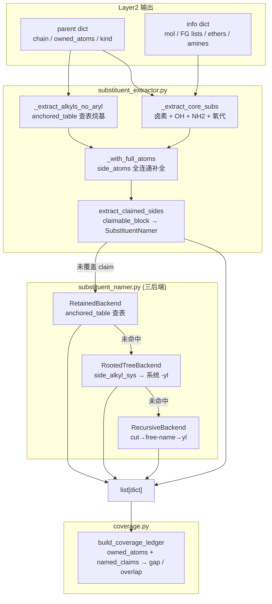
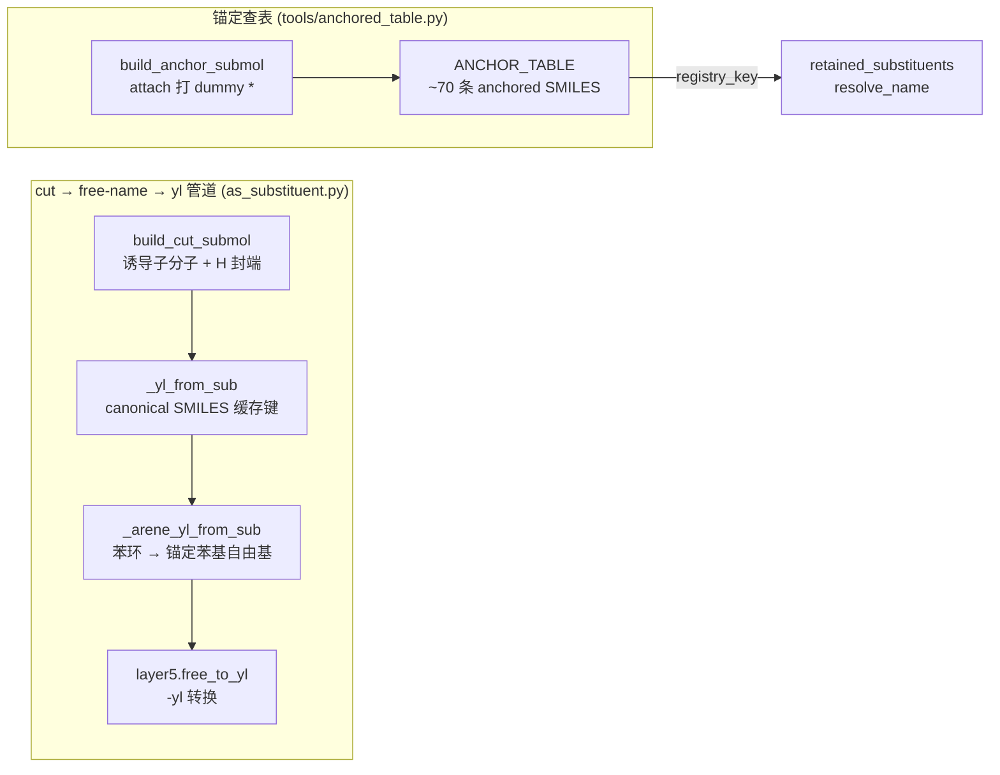

# Layer3: 取代基提取器 (Substituent Extractor)

> **最后更新:** 2026-08-07 | **源文件:** 21 `.py` (+ `leaves/` 5) | **公开 API:** `extract_substituents(info, parent, *, name_mode, cache) -> list[dict]`

## 概述

Layer3 是 NamePredict 6 层流水线中的第三层，负责从母体结构中识别、切除并命名所有非母体原子作为取代基（substituents）。其核心职责：给定 layer1 的分析结果 `info` 和 layer2 选出的母体 `parent`，提取所有附加在母体链/环上的侧链和官能团，为每个取代基生成中英双语名称，并通过覆盖台账（Coverage Ledger）验证所有重原子均已覆盖、无重叠冲突。

**输入:**
- `info: dict` — layer1 的分析结果，包含 `mol` (RDKit Mol 对象)、羟基列表 `hydroxyls`、酮基列表 `ketones`、硝基列表 `nitros`、胺基列表 `amines`、醚列表 `ethers` 等
- `parent: dict` — layer2 选出的母体，包含 `kind`（母体类型）、`chain`（主链原子索引列表）、`owned_atoms`（母体声明拥有的所有原子 frozenset）、`ring`（环原子）、以及各种 FG 定位符
- `name_mode: str` — 命名模式（`"general"` 保留名 / `"pin"` PIN 首选名）

**输出:**
- `list[dict]` — 取代基列表，每个元素包含 `kind`（取代基类别）、`en`/`zh`（中英名称）、`attach_idx`（连接点原子索引）、`atoms`（取代基包含的原子列表）、`paren`（是否需要括号）、`n_carbons`（碳原子数）、`backend`（命名后端标识）等字段

**在流水线中的位置:**

```
layer1 analyze → layer2 select_parent → layer3 extract_substituents → layer4 number → layer5 assemble
```

> **源:** `src/namepredict/namer.py` — `extract_substituents` 由 `_assemble_candidate` 调用，随后 `_ledger_complete` 用 `build_coverage_ledger` 验证覆盖完整性。

## 核心逻辑

### 提取主流程 (extract_substituents)

`extract_substituents` 是 layer3 的入口函数。2026-08 重构后主流程大幅精简——原本按"烷基→FG→烷氧基→芳基→N-取代基"顺序枚举的分阶段提取器已收拢为 **三段流水线**：核心 FG 提取 + 锚定查表烷基 + 覆盖补全（`extract_claimed_sides`）。

```python
def extract_substituents(info, parent, *, name_mode="general", cache=None) -> list:
    mol, chain = info["mol"], parent.get("chain") or []
    base = (
       _extract_core_subs(info, parent)                       # 卤素 + OH + NH2 + 氧代
       + _extract_alkyls_no_aryl(mol, chain, name_mode=name_mode)  # anchored_table 查表烷基
    )
    owned = parent.get("owned_atoms")
    if owned:
        base = [_with_full_atoms(mol, owned, s) for s in base]   # side_atoms 全连通补全
    return base + extract_claimed_sides(info, parent, base, name_mode=name_mode, cache=cache)
```

> **源:** `src/namepredict/layer3/substituent_extractor.py:200-211`

**第一阶段: 核心官能团提取 (`_extract_core_subs`)** — 按固定顺序收集卤素（F/Cl/Br/I，直接连接在链碳上）、羟基（仅当母体不是醇/酚类）、氨基（仅当母体不是胺/苯胺类，委托 `amino_side.py`）、氧代（仅当母体不是酮/醌类）。每个提取器都检查母体类型 (`_PARENT_OH_KINDS`, `_PARENT_NH2_KINDS`, `_PARENT_OXO_KINDS`) 以及 principal-expression 的附着位（`_principal_attachments`），当母体本身以该官能团为主要官能团时，链上相应基团视为母体骨架而非取代基。

卤素提取有特殊过滤 (`_filter_fg_halos`)：对酰氯/酰溴母体排除官能团自身的卤素；对功能性醚（如 HFIP）跳过醚臂上的氟原子。

> **源:** `src/namepredict/layer3/substituent_extractor.py:179-185`

**第二阶段: 烷基侧链提取 (`_extract_alkyls_no_aryl`)** — 遍历母体主链上的每个碳原子，通过 `_side_starts`（`side_facts.carbon_neighbors`）识别链碳的界外邻居。对每个侧链起点调用 `_one_alkyl` → `_one_anchored_alkyl`：用 `tools.block_cut.side_atoms` 计算全非母体连通分量，再经 `tools.anchored_table.anchored_entry` 查表。**仅 `kind == "alkyl"` 的条目被认领**（纯碳侧链）；cyano/nitroso 等杂叶留给 claim 补全器。未命中则静默回退（由 `extract_claimed_sides` 的 SubstituentNamer 兜底）。

> **源:** `src/namepredict/layer3/substituent_extractor.py:60-87, 171-177`

**第三阶段: 声明侧链补全 (`extract_claimed_sides`)** — 覆盖补全机制（`claim_extract.py`）。遍历 `iter_claims`（`claimable_block.py`，原 layer2 迁入）生成的所有 `ClaimedBlock`（ownership 边界处的未覆盖原子块），对每个未被前面阶段覆盖的 claim 调用 `SubstituentNamer.name()` 命名。AMIDE_N slot 与已覆盖原子跳过。这是 layer3 的"安全网"——任何逃过前两段的侧链原子（芳基、烷氧基、N-侧链、复杂分支烷基、杂环等）最终在这里被捕获命名。

> **源:** `src/namepredict/layer3/claim_extract.py:78-83`

### 保留取代基查表 (anchored_table, tools/)

**2026-08 重构引入的核心机制**：用一个锚定 canonical-SMILES 表取代了原先 `_BRANCH_CHECKS` 十种形状模板 + `_try_registry_leaf` 等一串尝试器。`submol_build.build_anchor_submol` 在取代基连接位打上 dummy 原子 `*`，使 canonical SMILES 同时编码形状与附着点（`*C(C)C` 异丙基 vs `*CCC` 正丙基；`*c1ccc(Cl)cc1` 4-氯苯基）。`tools/anchored_table.py` 的 `ANCHOR_TABLE` 覆盖约 70 条：

| 类别 | 条目示例 |
|------|---------|
| 线性 n-烷基 C1-C12 | `*C` methyl … `*CCCCCCCCCCC` undecyl |
| 分支保留烷基 | `*C(C)C` isopropyl、`*C(C)(C)C` tert-butyl、`*C(C)CC` sec-butyl |
| 烯基保留 | `*C=C` vinyl、`*C=C-C` allyl、`*C(=C)C` isopropenyl |
| 卤代烷基 | `*CCl` chloromethyl、`*CCCl` 2-chloroethyl |
| 环烷基 C3-C8 | `*C1CC1` cyclopropyl … `*C1CCCCCCC1` cyclooctyl |
| 芳基/卤代苯基 | `*c1ccccc1` phenyl、`*c1ccc(Cl)cc1` 4-chlorophenyl |
| 单原子卤素 | `*F` fluoro、`*Cl` chloro |
| 含杂叶（FG 前缀） | `*C#N` cyano、`*[N+](=O)[O-]` nitro、`*OC` methoxy、`*S(C)(=O)=O` methylsulfonyl、`*S(=O)(=O)c1ccc(C)cc1` tosyl、`*S(=O)(=O)C(F)(F)F` triflyl、`*N=C=O` isocyanato |
| 哌啶基/环己基乙基 | `*C1CCNCC1` piperidin-4-yl、`*C(C)C1CCCCC1` 1-cyclohexylethyl |

每条映射为 `(registry_key, en, zh, paren, kind)`。`registry_key` 非 None 时经 `retained_substituents.resolve_name` 解析，使 pin 模式输出系统名（如 isopropyl → propan-2-yl）。`kind` 分 `alkyl` / `aryl` / `halo` / `leaf` 四类——**提取器只认领 `alkyl`**，其余类别留给命名器/补全器。

> **源:** `src/namepredict/tools/anchored_table.py:28-109`

### 侧链拓扑事实层 (side_facts)

侧链拓扑事实（原 layer2 的 `side_facts` / `side_alkyl` / `side_alkoxy` / `aryl_sub` / `aryl_depth2` / `leaves`）在 **2026-08 全部迁入 `layer3/`**，成为 L2 与 L3 共享的拓扑契约层。layer2 现在只**反向借用**少量函数：`carboxyalkyl_arms`（`carboxymethyl_diacid.py`）、`_walk_linear`（`cyclo_polycarboxylic.py`）、`aryl_sub` 检测（`arene_carbonyl.py`）。

`side_facts.py` 是统一对外接口，全部为纯拓扑函数（无命名依赖、无 str→enum dispatcher），受契约测试 `test_l2_l3_side_facts_contract.py` 保护：

| 公开函数 | 签名 | 用途 |
|---------|------|------|
| `carbon_neighbors` | `(mol, atom) -> list[int]` | 碳原子非氢碳邻居（`_side_starts` 用） |
| `ring_leaf` | `(mol, atom, ring_atom, depth) -> ArylLeafFact \| None` | 芳环外邻叶子拓扑（经 `leaves.registry.match_leaf_topology`） |
| `alkyl_shape` | `(mol, root, parent, shape) -> SidePath \| None` | 12 种烷基形状匹配（`_SHAPE_MATCHERS`，保留 API） |
| `outer_alkoxy` | `(mol, root, oxygen) -> AlkoxyFact \| None` | 烷氧基尾（C1-C4 + PEG code） |
| `phenyl_ring` | `(mol, root, parent) -> frozenset \| None` | 苯基环（`aryl_sub._phenyl_at`） |
| `benzyl_ring` | `(mol, root, parent) -> frozenset \| None` | 苄基环（`aryl_sub._ch2_ph_at`） |
| `aryl_leaves` | `(mol, ring) -> frozenset[int]` | 芳环上卤素叶子（`aryl_sub._halo_atoms_on`） |
| `carboxyalkyl_arms` | `(mol, chain, acids) -> tuple[CarboxyalkylArm, ...]` | 羧烷基臂（layer2 多元酸母体用） |

配套模块：`side_alkyl.py`（`_is_vinyl`/`_is_isopropyl`/`_is_cf3_carbon`/`_walk_linear` 等 12 形状探针）、`side_alkoxy.py`（`_outer_alkoxy_n`/`_outer_atoms`）、`aryl_sub.py`（`_phenyl_at`/`_ch2_ph_at`/`_halo_atoms_on`/`_ring_phenyls` 等）、`aryl_depth2.py`（`_depth2_atoms_on`/`_leaf_atoms_*` 二级叶子）、`leaves/`（`ArylLeafKind` 叶子拓扑 registry：`protocol`/`registry`/`simple`/`topo`/`complex_h`）。

> **源:** `src/namepredict/layer3/side_facts.py:121-176`

### 取代基命名引擎 (SubstituentNamer)

当直接提取器无法命名或 claim 补全器认领的取代基出现时，`SubstituentNamer` 承担命名职责。它采用三后端链式尝试策略：

1. **RetainedBackend** — 保留名/锚定查表。`_try_anchored_lookup` 用 `tools.anchored_table.anchored_lookup` 查 `ANCHOR_TABLE`（取代原 `_try_registry_leaf`/`_try_cycloalkyl`/`_try_sub_phenyl`/`_try_alkenyl_retained`/`_try_methoxy`/`_try_methylsulfanyl`/`_try_methylsulfinyl`/`_try_methylsulfonyl`/`_try_tosyl`/`_try_triflyl` 一串尝试器）。命中即返回。

2. **RootedTreeBackend** — 纯饱和碳树系统命名。`_rooted_tree_name` 用 `side_alkyl_sys.build_rooted_alkyl_tree`（`RootedAlkylTree`：root + children + depth，限 12 原子、深 3 层）构建有根树，再经 `alkyl_sys_names.name_rooted_alkyl` 生成系统 -yl 名（最长主路径 + 分支收集 + 位次组装）。

3. **RecursiveBackend** — 有界递归切割命名。`as_substituent.name_as_substituent` 将 claim 原子从母分子切出为 submol，作为独立分子跑完整 L1-L5 管道，再转 P-29 -yl 形式。递归深度上限 `max_depth=4`。

> **源:** `src/namepredict/layer3/substituent_namer.py:115-128`

### 通用 cut→free-name→yl 管道 (as_substituent / submol_build)

`as_substituent.py` 承载 RecursiveBackend 与芳基命名的共同底层管道，2026-08 重写：

- `submol_build.py`（新）提供 `build_cut_submol`（诱导子分子 + attach 处 H 封端）与 `build_anchor_submol`（attach 打 dummy `*`，供 anchored SMILES 使用），定义 `CutSubmol` 数据类（`atom_map`/`inv_map`/`attach_new`/`attach_old`）。
- `_yl_from_sub` 用 **canonical SMILES 作为缓存键**与 `_name_mol` 的输入，与主分子共享 `CommonNameCache`（`_cache_put`/`_canonical_result`），消除 cut 上下文（环断点/手性方向）对命名的泄漏。
- `_arene_yl_from_sub` 处理苯环切割：自由名管线的 `_name_mol` 会把取代苯命名为"chlorobenzene"（或 phenol/aniline），但苯基*取代基*必须把 OH/NH2/CN 当作叶并令附着碳位次为 1。该路径重建锚定 submol 重新自由命名，L1 检测自由基、L2 选苯基母体、L4 锚定位次 1、L5 输出 `{leaf-locants}phenyl`。
- yl 转换由 `layer5/free_to_yl.free_to_yl` 完成（原 `layer3/yl_form.py` 迁移至 L5），处理官能团后缀到前缀的特殊转换：醇→烷氧基 (P-63.2.2)、硫醇→烷硫基 (P-63.2.1)、伯胺→烷氨基 (P-62.2)。

> **源:** `src/namepredict/layer3/as_substituent.py:20-129`, `src/namepredict/layer3/submol_build.py`

### 芳基命名 (aryl_names)

`aryl_arm_name(mol, fact, owned_atoms)` 基于 L2 提供的 `ArylArmFact`（DIRECT_C/phenyl、METHYLENE_C/benzyl、DIRECT_O/phenoxy、O_METHYLENE_C/benzyloxy 四种连接模式）命名芳基臂。**取代了已删除的 `ring_namer.py`/`recursive_ph_name`**（2026-08 移除）：以苯环为自由母体，叶子（halo/Me/alkoxy/nitro/OH/NH2/CN/嵌套 Ph）经 `side_atoms` 拓扑收集后整臂切割，走 `name_as_substituent` 通用管道；`_stem` 再按连接模式把后缀替换为 phenyl/phenoxy/benzyl/benzyloxy。

> **源:** `src/namepredict/layer3/aryl_names.py:42-68`

### 氨基取代基 (amino_side)

`amino_side.py` 处理非胺母体上的氨基取代基：伯氨基直接 `_make_amino`；仲氨基（N-苯基/N-苄基）经 `_n_aryl_named` 用 `side_facts.phenyl_ring`/`benzyl_ring` 识别环 + `aryl_arm_name` 命名，组装为 `({name})amino`（如 "(phenyl)amino"），叶子原子经 `side_facts.aryl_leaves` 收集。这是 **2026-08 删除 `n_side_extract.py`/`n_block_extract.py` 后保留的 N-取代基主路径**；酰胺母体的 N-烷基由 layer1 检测 + layer5 组装处理，不走 layer3。

> **源:** `src/namepredict/layer3/amino_side.py:18-30, 66-77`

### 烷氧基 (alkoxy_names)

`alkoxy_names.py` 保留环连接烷氧基的命名逻辑：`_extract_alkoxys` 遍历 layer1 醚数据，对一端在环上的醚用 `side_facts.outer_alkoxy` 追踪尾链，支持线性 C1-C4（methoxy 到 butoxy）、分支（isopropoxy/isobutoxy，code 31/41）与 PEG 多醚（code 12/22/112/122…，递归生成 `2-(2-methoxyethoxy)ethoxy`）。**2026-08 起 `_extract_alkoxys` 移出 `extract_substituents` 主流程**，烷氧基取代基主要经 claim 补全 + anchored methoxy 路径处理。

> **源:** `src/namepredict/layer3/alkoxy_names.py:90-98`

### 覆盖台账 (Coverage Ledger)

覆盖台账是 layer3 与上层质量控制的桥梁。`build_coverage_ledger` 接收分子、母体拥有的原子集合和已命名的取代基列表，输出 `CoverageLedger`：`owned_atoms`、`named_claims`、`gap`（遗漏）、`overlap`（冲突），`complete` = `not gap and not overlap`。在 `namer.py` 中，覆盖完整的候选优先被采用（Pass 1），仅当全部候选不完整时才回退到部分覆盖结果（Pass 2，标记 `fallback: no_coverage_gate`）。

> **源:** `src/namepredict/layer3/coverage.py`

### 保留取代基注册表 (retained_substituents)

`retained_substituents.py` 维护集中式保留取代基注册表 (`_REGISTRY`)，覆盖 IUPAC 2013 蓝皮书 P-29/P-57/P-61-P-68 的 60+ 条目。每条 `RetainedSubstituent` 含保留英文名/中文名、系统名、IUPAC 推荐级别（PIN/GENERAL/NOT_RECOMMENDED）、`rule_ref`。`resolve_name(key, name_mode)` 是 anchored_table `registry_key` 的解析后端：`general` 返回保留名，`pin` 仅对 PIN 条目返回保留名否则返回系统名。

> **源:** `src/namepredict/layer3/retained_substituents.py:368-382`

## 数据流图





## 文件清单

| 文件 | 行数 | 描述 |
|------|------|------|
| `__init__.py` | 5 | 公开 API 导出：`extract_substituents` |
| `substituent_extractor.py` | 211 | **主提取器**。三段流水线：`_extract_core_subs` + `_extract_alkyls_no_aryl`（anchored 查表）+ `extract_claimed_sides`。2026-08 从 445 行精简。 |
| `substituent_namer.py` | 128 | **命名引擎**。三后端链式：Retained(anchored) → RootedTree → Recursive。2026-08 从 334 行精简。 |
| `as_substituent.py` | 129 | **cut→free-name→yl 通用管道**。`name_as_substituent` + 苯环锚定自由基特殊路径，共享 CommonNameCache。 |
| `submol_build.py` | 99 | **子分子构建**。`build_cut_submol` / `build_anchor_submol` / `CutSubmol`（原 layer2 迁入，扩展 anchor 构建）。 |
| `side_facts.py` | 176 | **L2/L3 共享拓扑事实层**。公开接口 + 类型体系（AlkylShape/ArylArmKind/ArylLeafFact/CarboxyalkylArm/SidePath/ArylArmFact/AlkoxyFact）。 |
| `side_alkyl.py` | 393 | 烷基侧拓扑探针：12 种形状匹配器（`_is_vinyl`/`_is_isopropyl`/`_is_cf3_carbon`/`_walk_linear` 等）。 |
| `side_alkoxy.py` | 220 | 烷氧基侧拓扑：`_outer_alkoxy_n`/`_outer_atoms`（线性 + PEG + 分支）。 |
| `aryl_sub.py` | 286 | 芳基拓扑：`_phenyl_at`/`_ch2_ph_at`/`_phenoxy_from_ether`/`_halo_atoms_on` 等。 |
| `aryl_depth2.py` | 191 | 芳环二级深度叶子：NO2/CF3/NH2/OH/嵌套 Ph/烷氧基的 `_leaf_atoms_*`。 |
| `leaves/` | 267 | 芳基叶子拓扑 registry：`protocol.py`（ArylLeafKind/LeafTopology/Match）、`registry.py`（`match_leaf_topology`）、`simple.py`、`topo.py`、`complex_h.py`。 |
| `side_alkyl_sys.py` | 84 | 有根烷基树构建：`build_rooted_alkyl_tree` → `RootedAlkylTree`。 |
| `alkyl_sys_names.py` | 148 | 烷基系统命名：`name_rooted_alkyl`（主路径 + 分支 + 位次 + -yl）。 |
| `claim_extract.py` | 83 | **声明侧链补全**。`extract_claimed_sides` 遍历 `iter_claims`，对未覆盖 claim 调 `SubstituentNamer`。 |
| `claimable_block.py` | 159 | `ClaimedBlock` / `SideSlot`(CHAIN_C/RING_C/AMIDE_N/ETHER_O) / `iter_claims`（原 layer2 迁入）。 |
| `amino_side.py` | 77 | 氨基取代基：伯氨基 + 仲氨基（N-苯基/N-苄基）。N-取代基主路径。 |
| `alkoxy_names.py` | 98 | 烷氧基命名：环连接烷氧基 + PEG 尾（`_extract_alkoxys`，已移出主流程）。 |
| `aryl_names.py` | 68 | 芳基命名：`aryl_arm_name` 走通用 cut→free-name→yl 管道。 |
| `retained_substituents.py` | 382 | 保留取代基注册表（60+ 条目）+ `resolve_name`（anchored_table 解析后端）。 |
| `coverage.py` | 66 | **覆盖台账**。`build_coverage_ledger` 计算 gap/overlap。 |
| `yl_form.py` | 10 | 旧 yl 转换壳（逻辑已迁 `layer5/free_to_yl.py`）。 |

### tools/ 层无关工具（layer3 消费）

| 文件 | 行数 | 描述 |
|------|------|------|
| `tools/anchored_table.py` | 173 | **锚定 canonical-SMILES 查表**。`ANCHOR_TABLE` ~70 条 + `anchored_entry`/`anchored_lookup`/`pick_root`。核心机制。 |
| `tools/block_cut.py` | 90 | 母体边界块切割：`side_atoms`（全连通分量）/`cut_block`/`side_roots`。 |
| `tools/chain.py` | 38 | 开链行走原语（原 layer2/chain_walk.py 抽出，L2/L3 共享）。 |
| `tools/ring_ident.py` | 75 | 萘环拓扑原语（原 layer2/scaffold/naphthalene.py 抽出）。 |
| `tools/alkoxy_side.py` | 118 | 酯/氨基甲酸酯烷氧基侧拓扑（P-65.6），L2 消费。 |

## 对外接口

### 主入口

```python
def extract_substituents(
    info: dict,
    parent: dict,
    *,
    name_mode: str = "general",
    cache: CommonNameCache | None = None,
) -> list[dict]:
```

- **info**: layer1 分析结果，必须包含 `"mol"` 键（RDKit Mol 对象）以及各类 FG 列表
- **parent**: layer2 母体选择结果，必须包含 `"chain"` 和 `"owned_atoms"` 键
- **name_mode**: `"general"` 使用保留/通用名；`"pin"` 使用 IUPAC 首选名
- **cache**: 递归子结构命名的共享缓存（`CommonNameCache`），加速跨 cut 命名
- **返回**: 取代基 dict 列表，共同键包括 `kind`, `en`, `zh`, `attach_idx`, `atoms`, `paren`

### 内部命名类

```python
class SubstituentNamer:
    def __init__(self, backends=None, *, name_mode="general", cache=None)
    def name(self, mol, claim: ClaimedBlock, *, depth=0) -> SubstituentName | None
```

`SubstituentName` 数据类包含 `claim`, `en`, `zh`, `requires_parentheses`, `backend` 字段。

### 覆盖台账

```python
def build_coverage_ledger(mol, *, owned_atoms, names) -> CoverageLedger
```

`CoverageLedger` 属性: `owned_atoms`, `named_claims`, `gap`, `overlap`, `complete`.

## 相关页面

- [[architecture/layer2-parent-selector]] — Layer2 母体选择器，提供 `parent` dict（含 `owned_atoms` 和 `chain`）；side_facts 拓扑事实由 L3 持有、L2 反向借用
- [[architecture/layer1-analyzer]] — Layer1 官能团分析器，提供 `info` dict
- [[architecture/layer4-numbering]] — Layer4 编号引擎，消费 layer3 输出的取代基列表
- [[architecture/layer5-name-assembly]] — Layer5 名称组装，最终拼接母体名和取代基前缀（含 `free_to_yl`）
- [[architecture/overview]] — 系统架构概览，6 层流水线总览
- [[concepts/bilingual-naming]] — 中英双语命名约定
- [[concepts/atom-ownership]] — ClaimedBlock / owned_atoms / CoverageLedger 原子归属模型
