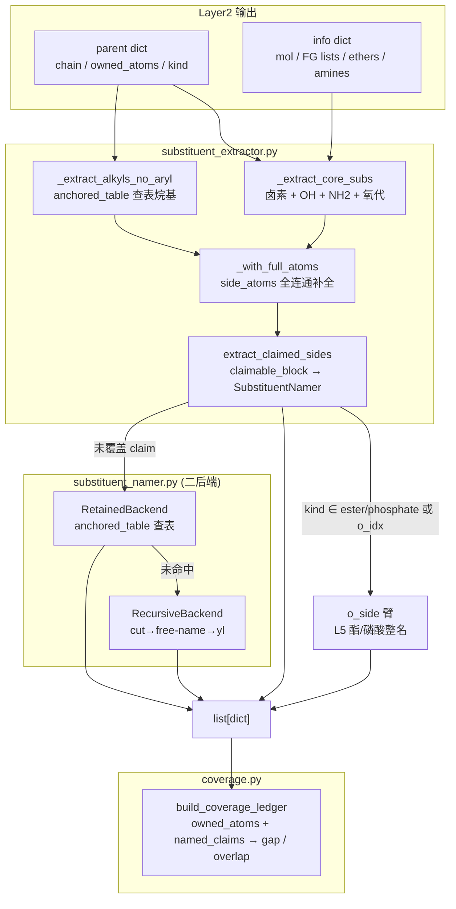
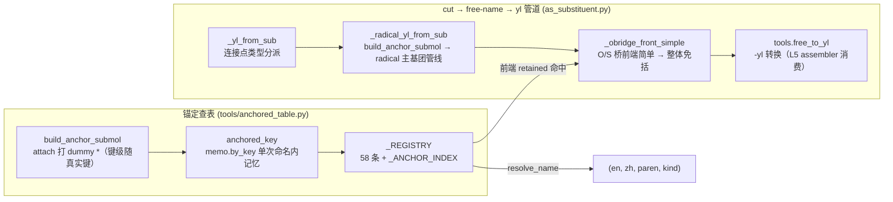

# Layer3: 取代基提取器 (Substituent Extractor)

> **最后更新:** 2026-09-10 | **源文件:** 9 `.py` (1027 行) | **公开 API:** `extract_substituents(info, parent, *, name_mode, cache, depth) -> list[dict]`

## 概述

Layer3 是 NamePredict 6 层流水线中的第三层，负责从母体结构中识别、切除并命名所有非母体原子作为取代基（substituents）。其核心职责：给定 layer1 的分析结果 `info` 和 layer2 选出的母体 `parent`，提取所有附加在母体链/环上的侧链和官能团，为每个取代基生成中英双语名称，并通过覆盖台账（Coverage Ledger）验证所有重原子均已覆盖、无重叠冲突。

**输入:**
- `info: dict` — layer1 的分析结果，包含 `mol` (RDKit Mol 对象)、羟基列表 `hydroxyls`、酮基列表 `ketones`、硝基列表 `nitros`、胺基列表 `amines`、醚列表 `ethers` 等
- `parent: dict` — layer2 选出的母体，包含 `kind`（母体类型）、`chain`（主链原子索引列表）、`owned_atoms`（母体声明拥有的所有原子 frozenset）、`ring`（环原子）、以及各种 FG 定位符
- `name_mode: str` — 命名模式（`"general"` 保留名 / `"pin"` PIN 首选名）

**输出:**
- `list[dict]` — 取代基列表，每个元素包含 `kind`（取代基类别）、`en`/`zh`（中英名称）、`attach_idx`（连接点原子索引）、`atoms`（取代基包含的原子列表）、`paren`（是否需要括号）、`n_carbons`（碳原子数）、`backend`（命名后端标识）等字段

**在流水线中的位置:**

```
layer1 analyze → layer2 select_parent → layer3 extract_substituents → layer4 number → layer5 assemble
```

> **源:** `src/namepredict/namer.py` — `extract_substituents` 由 `_prepare_candidate`（`namer.py:153`）调用，随后 `_ledger_complete`（`namer.py:76`）用 `build_coverage_ledger` 验证覆盖完整性。

## 核心逻辑

### 提取主流程 (extract_substituents)

`extract_substituents` 是 layer3 的入口函数。主流程为 **三段流水线**：核心 FG 提取 + 锚定查表烷基 + 覆盖补全（`extract_claimed_sides`）。

```python
def extract_substituents(info, parent, *, name_mode="general", cache=None, depth=0) -> list:
    mol, chain = info["mol"], parent.get("chain") or []
    base = (
       _extract_core_subs(info, parent)                       # 卤素 + OH + NH2 + 氧代
       + _extract_alkyls_no_aryl(mol, chain, name_mode=name_mode)  # anchored_table 查表烷基
    )
    owned = parent.get("owned_atoms")
    if owned:
        base = [_with_full_atoms(mol, owned, s) for s in base]   # side_atoms 全连通补全
    return base + extract_claimed_sides(info, parent, base, name_mode=name_mode, cache=cache, depth=depth)
```

> **源:** `src/namepredict/layer3/substituent_extractor.py:215`

**第一阶段: 核心官能团提取 (`_extract_core_subs`)** — 按固定顺序收集卤素（F/Cl/Br/I，直接连接在链碳上）、羟基（仅当母体不是醇/酚类）、氨基（仅当母体不是胺/苯胺类，委托 `amino_side.py`）、氧代（仅当母体不是酮/醌类）。每个提取器都检查母体类型 (`_PARENT_OH_KINDS`, `_PARENT_NH2_KINDS`, `_PARENT_OXO_KINDS`) 以及 principal-expression 的附着位（`_principal_attachments`），当母体本身以该官能团为主要官能团时，链上相应基团视为母体骨架而非取代基。

卤素提取有特殊过滤 (`_filter_fg_halos`)：对酰氯/酰溴母体排除官能团自身的卤素；对功能性醚（如 HFIP）跳过醚臂上的氟原子。

> **源:** `src/namepredict/layer3/substituent_extractor.py:194`（`_extract_core_subs`）

**第二阶段: 烷基侧链提取 (`_extract_alkyls_no_aryl`)** — 遍历母体主链上的每个碳原子，通过 `_side_starts`（`carbon_neighbors`，来自 `tools/chain`）识别链碳的界外邻居。对每个侧链起点调用 `_one_alkyl` → `_one_anchored_alkyl`：用 `tools.block_cut.side_atoms` 计算全非母体连通分量，再经 `tools.anchored_table.anchored_entry` 查表。**仅 `kind == "alkyl"` 的条目被认领**（纯碳侧链）；cyano/nitroso 等杂叶留给 claim 补全器。未命中则静默回退（由 `extract_claimed_sides` 的 SubstituentNamer 兜底）。

> **源:** `src/namepredict/layer3/substituent_extractor.py:89, 185`（`_one_anchored_alkyl` / `_extract_alkyls_no_aryl`）

**第三阶段: 声明侧链补全 (`extract_claimed_sides`)** — 覆盖补全机制（`claim_extract.py`）。遍历 `iter_claims`（`claimable_block.py`）生成的所有 `ClaimedBlock`（ownership 边界处的未覆盖原子块），对每个未被前面阶段覆盖的 claim 调用 `SubstituentNamer.name()` 命名。**仅原子已被覆盖的 claim 跳过**（`_should_skip`，不对酰胺 N 特判）。这是 layer3 的"安全网"——任何逃过前两段的侧链原子（芳基、烷氧基、N-侧链、复杂分支烷基、杂环等）最终在这里被捕获命名。母体 kind ∈ `_ESTER_O_SIDE_KINDS`（`{"ester", "phosphate"}`）或带 `o_idx`（benzoate）时，连在母体 O 上的侧链标记 `o_side=True` 交由 L5 酯/磷酸整名消费——磷酸酯的 O–R 臂由此整体递归命名（任意复杂臂：支链/芳环/含 OH/胺/手性/糖环，P-67.1.3）。

`depth` 从 `extract_substituents` 逐层透传至 `_append_named` → `SubstituentNamer.name(mol, claim, depth=...)`，供递归取代基命名累计递归深度（不设显式上限，靠原子集逐层收缩终止）。`sub_from_named` 在封装结果时另做一次 **kind 改写**：命名结果的 kind ∈ `N_PREFIX_KINDS`（`constants.N_PREFIX_KINDS`，P-62.2.2.1）且附着原子是**环员 N**（`_is_ring_attach`，`mol.GetAtomWithIdx(...).IsInRing()`）时，改用环上位次定位而非 N- 前缀（P-14.4/P-16）——内酰胺/环胺母体的环 N 因此不与酰基/氨基的 N- 撞名（如 `3-phenyl-1,3-oxazolidin-2-one` 不会写成 N-phenyl）。

> **源:** `src/namepredict/layer3/claim_extract.py:108`（`extract_claimed_sides`）、`:80`（`_ESTER_O_SIDE_KINDS`）、`:36`（`_is_ring_attach`）、`:44`（`sub_from_named`）

### 保留取代基查表 (anchored_table, tools/)

核心机制是**锚定 canonical-SMILES 查表**。`submol_build.build_anchor_submol` 在取代基连接位打上 dummy 原子 `*`，使 canonical SMILES 同时编码形状与附着点（`*C(C)C` 异丙基 vs `*CCC` 正丙基；`*c1ccc(Cl)cc1` 4-氯苯基），锚定键的键型随母体–取代基真实键级（`*=C` 亚甲基，见下 `_external_bond_type`）。`tools/anchored_table.py`（217 行）维护**单一取代基注册表 `_REGISTRY`**（58 条 `RetainedSubstituent`）——基础取代基与 IUPAC 保留取代基统一入表，各带 `anchored` 锚定键；**长链烷基（C5+）/环烷基/苯基/卤代烷基不查表**，改走完整递归/radical 命名管线：

| 类别 | 条目示例 |
|------|---------|
| 基础取代基（halo/leaf） | `*F` fluoro、`*Cl` chloro、`*[N+](=O)[O-]` nitro、`*N=C=O` isocyanato、`*N=C=S` isothiocyanato |
| 线性 n-烷基 C1-C4 | `*C` methyl … `*CCCC` butyl |
| 亚基 ylidene（叶以双键连母体） | `*=C` methylidene、`*=CC` ethylidene、`*=CCC` propylidene、`*=C1CC1` cyclopropylidene、`*=C1CCCCC1` cyclohexylidene、`*=S` sulfanylidene |
| 支链/烯/炔保留基 | `*C(C)(C)C` tert-butyl、`*C(C)C` isopropyl、`*CC=C` allyl、`*CC#C` propargyl、`*CC(C)(C)C` neopentyl |
| 含杂原子保留基（leaf） | `*OC` methoxy、`*O` hydroxy、`*SC` methylsulfanyl、`*S(C)=O` methylsulfinyl、`*S(=O)(=O)O` sulfo、`*C=O` formyl、`*C#N` cyano、`*C(=N)N` diaminomethylidene（`paren=True`）、`*N` amino、`*N=N` diazenyl、`*OP(=O)(O)O` phosphonooxy 等 |
| 芳烷基 | `*Cc1ccccc1` benzyl |

> 亚基（ylidene）叶以**真实双键键级**入表：若 canonical 收成 `*C` 单键，命出的是氢化产物（净多 2H，等于写出另一个分子）。`diaminomethylidene`（`anchored_table.py:58`，`*C(=N)N`，`paren=True`）为脒/胍残基，按 P-66.1.1 取亚基式而非等价的 `amino(imino)methylamino`（两者互变、分子式相同，取测试集口径）。

构建期 `_build_anchor_index`（`anchored_table.py:119`）把各条目 `anchored` 键 canonical 化后反查生成 `_ANCHOR_INDEX`；`anchored_entry`（`:186`）/`anchored_lookup`（`:198`）经 `_table_hit`（`:178`）命中即解析为 `(en, zh, paren, kind)`。registry 键经 `resolve_name`（`:137`）解析——其 general/pin 分派停用，恒返回系统名（`systematic_en`/`systematic_zh`，如 isopropyl → propan-2-yl）。`kind` 分 `alkyl` / `aryl` / `halo` / `leaf` 四类——**提取器只认领 `alkyl`**，其余类别留给命名器/补全器。构建期校验 anchored 键的 canonical 形式与唯一性。registry 现有 **58 条**：含磷酸降级前缀 `phosphonooxy` 膦酸氧基 / `phosphonatooxy`（双锚定键 `*OP(=O)([O-])O` 与 `*OP(=O)([O-])[O-]`）/ `phosphonooxymethyl` / `phosphonatooxymethyl`（`paren=True`，P-67.1.5.1 羧酸等更高优先级 FG 存在时磷酸以前缀表达）、亚基系列 `methylidene`/`ethylidene`/`propylidene`/`cyclopropylidene`/`cyclohexylidene`/`sulfanylidene`（`*=C`…，P-56.4）、`methylsulfinyl` 甲基亚磺酰（`*S(C)=O`，P-65.3.1）、`hydroxymethyl` 羟甲基（`*CO`，`paren=True`）、`diaminomethylidene` 二氨基亚甲基（`*C(=N)N`，`paren=True`；脒/胍残基按 P-66.1.1 取亚基式）。registry 只读，经 `resolve_name`/`anchored_lookup` 查询。

查表键 `anchored_key`（`:153`）经 `tools/memo.by_key("anchored_key", (id(mol), 原子集, 连接原子), …)` 在**单次命名内**记忆（实际构建在 `_anchored_key_uncached`，`:164`）——同一 claim 在查表与递归拆分间会被反复求键且键只依赖 `(mol, 原子集, 连接原子)`，记忆化纯消除重复计算、不改变返回值；`memo.begin_run()` 由 `namer.SMILESNNamer.name` 每次顶层命名开始时清空。锚定键为 `*O`/`*[O]`/`*N`（`_WHOLE_ONLY_KEYS`，`:175`）时 `_table_hit` 返回 None——只允许整分子顶层命中，避免 L3 把酮羰基氧/酯氧/胺氮误认成羟基/氨基。

> **源:** `src/namepredict/tools/anchored_table.py`

### 取代基命名引擎 (SubstituentNamer)

当直接提取器无法命名或 claim 补全器认领的取代基出现时，`SubstituentNamer` 承担命名职责。它采用有序后端链（`_default_backends`，`substituent_namer.py:93`），首个命中即返回：

1. **RetainedBackend** — 保留名/锚定查表。`_try_anchored_lookup` 用 `tools.anchored_table.anchored_lookup` 查 `_REGISTRY`（`_ANCHOR_INDEX` 反查），命中即返回。

2. **RecursiveBackend**（`substituent_namer.py:66`）— 递归切割命名。`as_substituent.name_as_substituent` 将 claim 原子从母分子切出为 submol，作为独立分子跑完整 L1-L5 管道，再转 P-29 -yl 形式。`depth` 逐层 +1 透传并写入结果 meta，无显式深度上限——每层切出的原子集严格小于上一层，递归自然终止；`CommonNameCache` 以 canonical SMILES 去重共享结果。`RecursiveBackend` 与 `SubstituentNamer`（`substituent_namer.py:98`）接收 `root_ctx`（本层块原子 → 原始根分子索引映射，`claim_extract.py:114` 自 `info.get("root_ctx")` 注入 namer），贯穿传给 `name_as_substituent`，供 radical 取代基回根分子校正 R/S。

> 命名由 retained 与 recursive 两个后端承担（无 RootedTreeBackend）。

> **源:** `src/namepredict/layer3/substituent_namer.py:48-111`

### 通用 cut→free-name→yl 管道 (as_substituent / submol_build)

`as_substituent.py`（125 行）承载 RecursiveBackend 的底层 cut→free-name→yl 管道，核心是**按连接点类型分派的锚定 radical 优先路径**，并经 `root_ctx` 回根分子校正 R/S：

- `submol_build.py` 提供 `build_anchor_submol`（`:124`，attach 打 dummy `*`，供 anchored SMILES 使用），并定义 `CutSubmol` 数据类（`:11`，`atom_map`/`inv_map`/`attach_new`/`attach_old`/`atoms_old`）。`_copy_bonds`（`:34`）只重建键型会丢双键奇偶，故它返回被复制的源键列表给 `_carry_alkene_stereo`（`submol_build.py:47`）——只扫子图内的键、不必遍历整分子——把诱导子图内 C=C 的 E/Z 标签照搬进子分子：子分子只是命名替身，标签取原分子即真实立体，不随配基被切/被 `*` 顶替而重判；两端引用邻接被保留则映射到新索引，被切配基由连在 sp2 端的 dummy 顶替（`_add_anchor`（`:116`）返回 dummy 索引供其使用），无法唯一解析（如把 sp2 端封成非手性 CH2）则跳过留无立体。**锚定键型随母体–取代基真实键级**：`_external_bond_type`（`submol_build.py:106`）取连接原子到母体外部邻居的键型（无外部邻居的孤立自由基回退单键），`build_anchor_submol` 用它建 dummy 键——取代基叶以双键连母体（环外 `=CH2` 等）时保留双键，否则 canonical 收成 `*C` 会命成饱和 alkyl（methyl 而非 methylidene，式量丢 H₂；P-56.4）。
- `_radical_yl_from_sub`（`as_substituent.py:66`）处理**碳连接点**：`build_anchor_submol` 打 `*` 后经完整管线自由命名——L1 检测自由基/酰基头（p41=1）、L2 选 radical/acyl 主基团、L4 锚定位次、L5 输出 `{locants}yl`；canonical SMILES 作缓存键与 `_name_mol` 共享 `CommonNameCache`。**缓存语义**：只缓存片段自身的自由基名（`copy.copy(hit)`，不经 `_canonical_result` 规范化、保留锚定链）——立体随宿主根分子变化，不能跨根共享，故 fresh 与 cache 命中都按当前根分子再过一次 R/S 校正。仅当 `parent_kind ∈ ("radical", "acyl")` 时采用（理论必达，防御性判断）。
- `_fix_rs_with_real`（`as_substituent.py:19`）做 **radical 取代基 R/S 回根分子重算**：糖苷/醚类（如 O-C 糖-糖）异头位被 `*` dummy 顶替后，锚定子结构的 CIP 会随配基翻转，须回到完整根分子重算才正确（与 ChEBI 一致）。仅当命中 meta 的 `parent_kind == "radical"` 且 `parent_chain` 至少 2 个原子（非 `[0]`-坍缩、不含 `*`）时，把其 `parent_chain` 索引经 `block_root_order`（根上下文映射）映到根分子索引，用 `layer5.stereo` 的 `_cip_on_chain` 分别对锚定子结构与根分子取 R/S，不一致则以 `_with_rs` 重写 en/zh；本层未贡献 R/S 时直接返回。
- **括号判定经 meta 接口给出**（P-16.5.1.1）：词干是否复合由自由基命名的母体取代基数给出——`composite = meta.parent_substituent_count > 0`（namer 在 meta 注入母体取代基数），`need_paren = composite and en not in ("phenyl", *_SIMPLE_ALKOXY_NO_PAREN, *AMIDO_RETAINED_EN)`——复合前缀必括、未取代简单基免括。**amido 保留式（acetamido/formamido/benzamido，P-66.1.1.4.3 方法 1）作简单前缀免括号**（同 -alkoxy 保留式），否则 3,5-二乙酰苯环会被倍增成 `bis(acetylamino)` 而非 `diacetamido`。
- **O/S 桥前端简单时整体免括**（P-63.2.1/.2.2）：`need_paren` 且名字以 `oxy`/`sulfanyl` 结尾时，`_obridge_front_simple`（`as_substituent.py:46`）判定 attach 是否为二价 O/S 桥原子、去桥后是否余单一片段，该片段按 retained→recursive 后端取名——`paren=False` 即前端为简单取代基，整个 O/S 前缀不加围栏（gold/ChEBI 平铺式，如 propan-2-yloxy、hexadecanoyloxy、acetyloxy、benzyloxy、naphthalen-1-yloxy）。前端自身被取代（4-nitrophenyl-、2,6-dichlorophenyl-）时后端给出 `paren=True`，整体仍加括号；`-amino` 连接不走此规则。
- `_yl_from_sub`（`:104`）按连接点原子序数分派：碳 → `_radical_yl_from_sub`；非碳路径返回 None。
- `name_as_substituent`（`:118`）为入口，`atoms` 强制 frozenset 后委托 `_yl_from_sub`（depth 再 +1）；`root_ctx` 参数贯穿到子路径（与 `_name_mol` 的 `root_ctx` 同为 `(root_mol, to_root)`）。
- `-yl` 转换由 `tools/free_to_yl.free_to_yl`（`layer3/as_substituent.py` 不直接调用），处理官能团后缀到前缀的特殊转换：醇→烷氧基 (P-63.2.2)、硫醇→烷硫基 (P-63.2.1)、伯胺→烷氨基 (P-62.2)，另加单核氢化物 `_MONONUCLEAR` 表（`free_to_yl.py:117`，oxidane/azane/sulfane/sulfinyl/sulfonyl/imine）；当前消费方是 L5 `assembler`（`layer5/assembler.py:10`）。

> 注：芳基/苯环侧链经 `_radical_yl_from_sub` 锚定自由基管线统一命名（苯 variant 保留名），无独立 `_arene_yl_from_sub`。

> **源:** `src/namepredict/layer3/as_substituent.py`, `src/namepredict/layer3/submol_build.py`

### 氨基取代基 (amino_side)

`amino_side.py` 处理非胺母体上的氨基取代基，主入口 `_extract_aminos`（由 `substituent_extractor._extract_core_subs` 调用）：母体本身以胺为主官能团且无 principal 附着位时跳过（`_principal_attachments` 查 principal expression 的胺附着位）；否则遍历 `info["amines"]`，`_one_amino` 只认领连接碳与全部取代碳都在母体主链内的胺，`_make_amino` 产出 `kind="amino"` 字典。**酰胺母体的 N-烷基由 layer1 检测 + layer5 组装处理，不走 layer3**；胺母体的 N 端取代基（P-62.2 N- 前缀）由 `claimable_block` 的 `AMINE_N` slot 识别 + L5/`namer` 依 `constants.N_PREFIX_KINDS`（P-62.2.2.1）组装。`claimable_block._is_amine_n`（`claimable_block.py:70`）排除**环员 N**（`atom.IsInRing()`）：饱和环内 N（哌啶/氮杂环等）是环杂原子、按环位次定位，不走 N- 前缀。

> **源:** `src/namepredict/layer3/amino_side.py`

### 覆盖台账 (Coverage Ledger)

覆盖台账是 layer3 与上层质量控制的桥梁。`build_coverage_ledger` 接收分子、母体拥有的原子集合和已命名的取代基列表，输出 `CoverageLedger`：`owned_atoms`、`named_claims`、`gap`（遗漏）、`overlap`（冲突），`complete` = `not gap and not overlap`。在 `namer.py` 中，覆盖完整的候选优先被采用（Pass 1），仅当全部候选不完整时才回退到部分覆盖结果（Pass 2，标记 `fallback: no_coverage_gate`）。

> **源:** `src/namepredict/layer3/coverage.py`

### 取代基注册表 (anchored_table._REGISTRY)

`tools/anchored_table.py` 维护集中式取代基注册表 (`_REGISTRY`，58 条)，基础取代基与 IUPAC 2013 蓝皮书 P-29/P-57/P-61-P-68 条目统一入表。每条 `RetainedSubstituent`（`anchored_table.py:25`）含保留英文名/中文名、系统名、IUPAC 推荐级别（PIN/GENERAL/NOT_RECOMMENDED）、`anchored` 锚定键（可多条）、`paren`、`kind`。`resolve_name(key, name_mode)`（`:137`）是 `anchored_key` 的解析后端：general/pin 分派停用，恒返回系统名（`systematic_en`/`systematic_zh`）。

> **源:** `src/namepredict/tools/anchored_table.py`

## 数据流图





## 文件清单

| 文件 | 行数 | 描述 |
|------|------|------|
| `__init__.py` | 6 | 公开 API 导出：`extract_substituents` |
| `substituent_extractor.py` | 227 | **主提取器**。三段流水线：`_extract_core_subs` + `_extract_alkyls_no_aryl`（anchored 查表）+ `extract_claimed_sides`（`depth` 透传）。含 `alkyl_alpha_key`（P-14.5 字母序排序键，剥前导位次/立体组 `(2S,3R)-`/`(E)-`/整体 `[` 后按实质词干排，L3/L5 共享）。 |
| `substituent_namer.py` | 111 | **命名引擎**。有序后端链：Retained(anchored) → Recursive（接收 `root_ctx`）；`name(mol, claim, *, depth)` 透传深度。 |
| `as_substituent.py` | 125 | **cut→free-name→yl 管道**。`_yl_from_sub` 碳连接点 → `_radical_yl_from_sub`（锚定 * radical/acyl 管线），`_fix_rs_with_real` 回根分子校正 R/S，括号经 meta 接口判定（amido 保留式免括号），`_obridge_front_simple` 判定 O/S 桥前端简单时整体免括；共享 CommonNameCache。 |
| `submol_build.py` | 134 | **子分子构建**。`build_anchor_submol` / `_copy_bonds`（返回子图内源键）/ `_carry_alkene_stereo`（E/Z 迁移）/ `_external_bond_type`（锚定键级照搬，双键叶 → methylidene）/ `CutSubmol`。 |
| `claim_extract.py` | 114 | **声明侧链补全**。`extract_claimed_sides` 遍历 `iter_claims`，对未覆盖 claim 调 `SubstituentNamer`（`root_ctx` 自 `info.get("root_ctx")` 注入，`depth` 透传）；`_ESTER_O_SIDE_KINDS` = ester/磷酸，O 侧臂标 `o_side` 交 L5 整名；`sub_from_named` 对环员 N 的 N-前缀 kind 改写为位次定位（`_is_ring_attach`）。 |
| `claimable_block.py` | 196 | `ClaimedBlock` / `SideSlot`(CHAIN_C/RING_C/AMIDE_N/**AMINE_N**/ETHER_O/OTHER) / `iter_claims`。`_is_amine_n` 排除环员 N。 |
| `amino_side.py` | 42 | 氨基取代基：链上氨基（`_extract_aminos`）。 |
| `coverage.py` | 72 | **覆盖台账**。`build_coverage_ledger` 计算 gap/overlap。 |

> 备注：layer3 只有以上 9 个模块。`side_facts.py`/`aryl_sub.py`/`yl_form.py` 均不存在——`carbon_neighbors` 位于 `tools/chain.py`，yl 转换在 `tools/free_to_yl.py`。

### tools/ 层无关工具（layer3 消费）

| 文件 | 行数 | 描述 |
|------|------|------|
| `tools/anchored_table.py` | 217 | **锚定 canonical-SMILES 查表 + 取代基注册表**。`_REGISTRY`（58 条统一 registry）+ `_ANCHOR_INDEX` 锚定反查 + `anchored_key`（经 `memo` 单次命名内记忆）/`anchored_entry`/`anchored_lookup`/`pick_root`/`resolve_name`/`anchored_whole_mol`。核心机制。 |
| `tools/block_cut.py` | 82 | 母体边界块切割：`side_atoms`（全连通分量）/`cut_block`/`side_roots`。 |
| `tools/chain.py` | 47 | 碳链行走原语 `_carbon_neighbors`/`_longest_from`/`carbon_neighbors`（带全局 `banned` 禁走集合，供 L2 排除羧酸/腈叶碳），L2/L3 共享。 |
| `tools/free_to_yl.py` | 191 | **-yl 转换**（layer-agnostic）：醇→烷氧基（P-63.2.2）/硫醇→烷硫基（P-63.2.1）/伯胺→烷氨基（P-62.2）/单核氢化物（oxidane/azane/sulfane/sulfinyl/sulfonyl/imine），复合 `-amino` 前缀加括号（P-29.3.6）。 |
| `tools/memo.py` | 56 | **单次命名的中间结果记忆**（跨层性能基建，不改命名结果）：`begin_run()` 由 `namer.SMILESNNamer.name` 每次顶层命名开始时清空，`by_mol`/`by_key` 按分子对象或自定义键记忆，`threading.local` 线程隔离。`anchored_table.anchored_key` 经 `by_key` 使用。 |

> 备注：`tools/alkoxy_side.py` 不存在（酯 O 侧拓扑由 L2 principal_expression + L5 `join_ester_name` 承担）。

## 对外接口

### 主入口

```python
def extract_substituents(
    info: dict,
    parent: dict,
    *,
    name_mode: str = "general",
    cache: CommonNameCache | None = None,
    depth: int = 0,
) -> list[dict]:
```

- **info**: layer1 分析结果，必须包含 `"mol"` 键（RDKit Mol 对象）以及各类 FG 列表；可选 `"root_ctx"`（= `(root_mol, to_root)`，由 `namer._name_mol` 注入）
- **parent**: layer2 母体选择结果，必须包含 `"chain"` 和 `"owned_atoms"` 键
- **name_mode**: `"general"` 使用保留/通用名；`"pin"` 使用 IUPAC 首选名
- **cache**: 递归子结构命名的共享缓存（`CommonNameCache`），加速跨 cut 命名
- **depth**: 递归深度，透传给 claim 侧链命名（`_append_named` → `SubstituentNamer.name`）
- **返回**: 取代基 dict 列表，共同键包括 `kind`, `en`, `zh`, `attach_idx`, `atoms`, `paren`, `n_carbons`, `backend`，O 侧臂另带 `o_side`

### 内部命名类

```python
class SubstituentNamer:
    def __init__(self, backends=None, *, name_mode="general", cache=None, root_ctx=None)
    def name(self, mol, claim: ClaimedBlock, *, depth=0) -> SubstituentName | None
```

`SubstituentName` 数据类包含 `claim`, `en`, `zh`, `requires_parentheses`, `backend` 字段。

### 覆盖台账

```python
def build_coverage_ledger(mol, *, owned_atoms, names) -> CoverageLedger
```

`CoverageLedger` 属性: `owned_atoms`, `named_claims`, `gap`, `overlap`, `complete`.

## 相关页面

- [[architecture/layer2-parent-selector]] — Layer2 母体选择器，提供 `parent` dict（含 `owned_atoms` 和 `chain`）；L2 与 L3 互不调用，共享仅经 `tools/`
- [[architecture/layer1-analyzer]] — Layer1 官能团分析器，提供 `info` dict
- [[architecture/layer4-numbering]] — Layer4 编号引擎，消费 layer3 输出的取代基列表
- [[architecture/layer5-name-assembly]] — Layer5 名称组装，最终拼接母体名和取代基前缀（-yl 转换在 `tools/free_to_yl`）
- [[architecture/overview]] — 系统架构概览，6 层流水线总览
- [[concepts/bilingual-naming]] — 中英双语命名约定
- [[concepts/atom-ownership]] — ClaimedBlock / owned_atoms / CoverageLedger 原子归属模型
