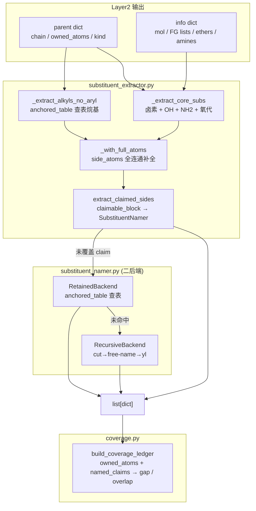
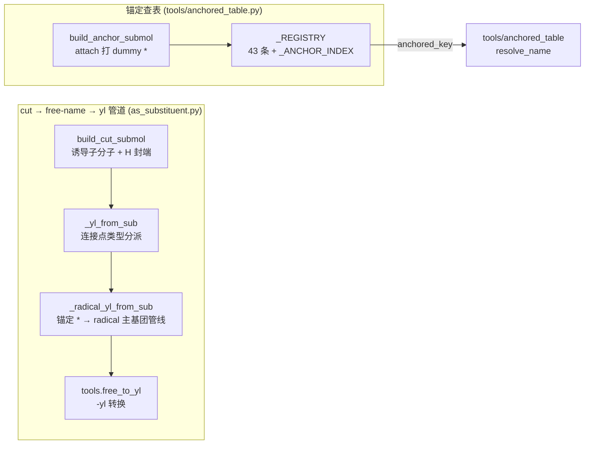

# Layer3: 取代基提取器 (Substituent Extractor)

> **最后更新:** 2026-08-16 | **源文件:** 9 `.py` (906 行) | **公开 API:** `extract_substituents(info, parent, *, name_mode, cache) -> list[dict]`

## 概述

Layer3 是 NamePredict 6 层流水线中的第三层，负责从母体结构中识别、切除并命名所有非母体原子作为取代基（substituents）。其核心职责：给定 layer1 的分析结果 `info` 和 layer2 选出的母体 `parent`，提取所有附加在母体链/环上的侧链和官能团，为每个取代基生成中英双语名称，并通过覆盖台账（Coverage Ledger）验证所有重原子均已覆盖、无重叠冲突。

**输入:**
- `info: dict` — layer1 的分析结果，包含 `mol` (RDKit Mol 对象)、羟基列表 `hydroxyls`、酮基列表 `ketones`、硝基列表 `nitros`、胺基列表 `amines`、醚列表 `ethers` 等
- `parent: dict` — layer2 选出的母体，包含 `kind`（母体类型）、`chain`（主链原子索引列表）、`owned_atoms`（母体声明拥有的所有原子 frozenset）、`ring`（环原子）、以及各种 FG 定位符
- `name_mode: str` — 命名模式（`"general"` 保留名 / `"pin"` PIN 首选名）

**输出:**
- `list[dict]` — 取代基列表，每个元素包含 `kind`（取代基类别）、`en`/`zh`（中英名称）、`attach_idx`（连接点原子索引）、`atoms`（取代基包含的原子列表）、`paren`（是否需要括号）、`n_carbons`（碳原子数）、`backend`（命名后端标识）等字段

**在流水线中的位置:**

```
layer1 analyze → layer2 select_parent → layer3 extract_substituents → layer4 number → layer5 assemble
```

> **源:** `src/namepredict/namer.py` — `extract_substituents` 由 `_assemble_candidate` 调用，随后 `_ledger_complete` 用 `build_coverage_ledger` 验证覆盖完整性。

## 核心逻辑

### 提取主流程 (extract_substituents)

`extract_substituents` 是 layer3 的入口函数。主流程为 **三段流水线**：核心 FG 提取 + 锚定查表烷基 + 覆盖补全（`extract_claimed_sides`）。

```python
def extract_substituents(info, parent, *, name_mode="general", cache=None) -> list:
    mol, chain = info["mol"], parent.get("chain") or []
    base = (
       _extract_core_subs(info, parent)                       # 卤素 + OH + NH2 + 氧代
       + _extract_alkyls_no_aryl(mol, chain, name_mode=name_mode)  # anchored_table 查表烷基
    )
    owned = parent.get("owned_atoms")
    if owned:
        base = [_with_full_atoms(mol, owned, s) for s in base]   # side_atoms 全连通补全
    return base + extract_claimed_sides(info, parent, base, name_mode=name_mode, cache=cache)
```

> **源:** `src/namepredict/layer3/substituent_extractor.py:209`

**第一阶段: 核心官能团提取 (`_extract_core_subs`)** — 按固定顺序收集卤素（F/Cl/Br/I，直接连接在链碳上）、羟基（仅当母体不是醇/酚类）、氨基（仅当母体不是胺/苯胺类，委托 `amino_side.py`）、氧代（仅当母体不是酮/醌类）。每个提取器都检查母体类型 (`_PARENT_OH_KINDS`, `_PARENT_NH2_KINDS`, `_PARENT_OXO_KINDS`) 以及 principal-expression 的附着位（`_principal_attachments`），当母体本身以该官能团为主要官能团时，链上相应基团视为母体骨架而非取代基。

卤素提取有特殊过滤 (`_filter_fg_halos`)：对酰氯/酰溴母体排除官能团自身的卤素；对功能性醚（如 HFIP）跳过醚臂上的氟原子。

> **源:** `src/namepredict/layer3/substituent_extractor.py:187`（`_extract_core_subs`）

**第二阶段: 烷基侧链提取 (`_extract_alkyls_no_aryl`)** — 遍历母体主链上的每个碳原子，通过 `_side_starts`（`carbon_neighbors`，来自 `tools/chain`）识别链碳的界外邻居。对每个侧链起点调用 `_one_alkyl` → `_one_anchored_alkyl`：用 `tools.block_cut.side_atoms` 计算全非母体连通分量，再经 `tools.anchored_table.anchored_entry` 查表。**仅 `kind == "alkyl"` 的条目被认领**（纯碳侧链）；cyano/nitroso 等杂叶留给 claim 补全器。未命中则静默回退（由 `extract_claimed_sides` 的 SubstituentNamer 兜底）。

> **源:** `src/namepredict/layer3/substituent_extractor.py:78, 178`（`_one_anchored_alkyl` / `_extract_alkyls_no_aryl`）

**第三阶段: 声明侧链补全 (`extract_claimed_sides`)** — 覆盖补全机制（`claim_extract.py`）。遍历 `iter_claims`（`claimable_block.py`）生成的所有 `ClaimedBlock`（ownership 边界处的未覆盖原子块），对每个未被前面阶段覆盖的 claim 调用 `SubstituentNamer.name()` 命名。**仅原子已被覆盖的 claim 跳过**（`_should_skip`；酰胺 N 不再特判跳过）。这是 layer3 的"安全网"——任何逃过前两段的侧链原子（芳基、烷氧基、N-侧链、复杂分支烷基、杂环等）最终在这里被捕获命名。

> **源:** `src/namepredict/layer3/claim_extract.py:94`

### 保留取代基查表 (anchored_table, tools/)

核心机制是**锚定 canonical-SMILES 查表**。`submol_build.build_anchor_submol` 在取代基连接位打上 dummy 原子 `*`，使 canonical SMILES 同时编码形状与附着点（`*C(C)C` 异丙基 vs `*CCC` 正丙基；`*c1ccc(Cl)cc1` 4-氯苯基）。`tools/anchored_table.py`（211 行）维护**单一取代基注册表 `_REGISTRY`**（43 条 `RetainedSubstituent`）——基础取代基与 IUPAC 保留取代基统一入表，各带 `anchored` 锚定键；原内联 `ANCHOR_TABLE` 已并入 registry，**长链烷基（C5+）/环烷基/苯基/卤代烷基不再查表**，改走完整递归/radical 命名管线：

| 类别 | 条目示例 |
|------|---------|
| 基础取代基（halo/leaf） | `*F` fluoro、`*Cl` chloro、`*[N+](=O)[O-]` nitro、`*N=C=O` isocyanato、`*N=C=S` isothiocyanato |
| 线性 n-烷基 C1-C4 | `*C` methyl … `*CCCC` butyl |
| 支链/烯/炔保留基 | `*C(C)(C)C` tert-butyl、`*C(C)C` isopropyl、`*CC=C` allyl、`*CC#C` propargyl、`*CC(C)(C)C` neopentyl |
| 含杂原子保留基（leaf） | `*OC` methoxy、`*O` hydroxy、`*SC` methylsulfanyl、`*S(=O)(=O)O` sulfo、`*C#N` cyano、`*N` amino、`*N=N` diazenyl 等 |
| 芳烷基 | `*Cc1ccccc1` benzyl |

构建期 `_build_anchor_index`（`anchored_table.py:105`）把各条目 `anchored` 键 canonical 化后反查生成 `_ANCHOR_INDEX`；`anchored_entry`（`:177`）/`anchored_lookup`（`:189`）经 `_table_hit`（`:169`）命中即解析为 `(en, zh, paren, kind)`。registry 键经 `resolve_name`（`:131`）解析，使 pin 模式输出系统名（如 isopropyl → propan-2-yl）。`kind` 分 `alkyl` / `aryl` / `halo` / `leaf` 四类——**提取器只认领 `alkyl`**，其余类别留给命名器/补全器。构建期校验 anchored 键的 canonical 形式与唯一性。

> **源:** `src/namepredict/tools/anchored_table.py`

### 取代基命名引擎 (SubstituentNamer)

当直接提取器无法命名或 claim 补全器认领的取代基出现时，`SubstituentNamer` 承担命名职责。它采用有序后端链（`_default_backends`，`substituent_namer.py:92-94`），首个命中即返回：

1. **RetainedBackend** — 保留名/锚定查表。`_try_anchored_lookup` 用 `tools.anchored_table.anchored_lookup` 查 `_REGISTRY`（`_ANCHOR_INDEX` 反查），命中即返回。

2. **RecursiveBackend** — 有界递归切割命名。`as_substituent.name_as_substituent` 将 claim 原子从母分子切出为 submol，作为独立分子跑完整 L1-L5 管道，再转 P-29 -yl 形式。递归深度上限 `max_depth=4`。

> 命名由 retained 与 recursive 两个后端承担（无 RootedTreeBackend）。

> **源:** `src/namepredict/layer3/substituent_namer.py:66-109`

### 通用 cut→free-name→yl 管道 (as_substituent / submol_build)

`as_substituent.py`（59 行）承载 RecursiveBackend 的底层 cut→free-name→yl 管道，核心是**按连接点类型分派的锚定 radical 优先路径**：

- `submol_build.py` 提供 `build_cut_submol`（诱导子分子 + attach 处 H 封端）与 `build_anchor_submol`（attach 打 dummy `*`，供 anchored SMILES 使用），定义 `CutSubmol` 数据类（`atom_map`/`inv_map`/`attach_new`/`attach_old`）。
- `_radical_yl_from_sub`（`as_substituent.py:18`）处理**碳连接点**：`build_anchor_submol` 打 `*` 后经完整管线自由命名——L1 检测自由基（p41=1）、L2 选 radical 主基团、L4 锚定位次、L5 输出 `{locants}yl`；canonical SMILES 作缓存键与 `_name_mol` 共享 `CommonNameCache`（`_cache_put`/`_canonical_result`），消除 cut 上下文（环断点/手性方向）对命名的泄漏。仅当 `parent_kind == "radical"` 时采用（理论必达，防御性判断）。
- `_yl_from_sub`（`:41`）按连接点原子序数分派：碳 → `_radical_yl_from_sub`；非碳路径暂返回 None（留 H 封端 free-name + `free_to_yl` 的扩展位）。
- `name_as_substituent`（`:53`）为入口，`atoms` 强制 frozenset 后委托 `_yl_from_sub`。
- yl 转换由 `tools/free_to_yl.free_to_yl` 完成（`as_substituent.py` 直接 `from namepredict.tools.free_to_yl import free_to_yl`，无 `layer3/yl_form.py`），处理官能团后缀到前缀的特殊转换：醇→烷氧基 (P-63.2.2)、硫醇→烷硫基 (P-63.2.1)、伯胺→烷氨基 (P-62.2)。

> 注：芳基/苯环侧链不再走独立 `_arene_yl_from_sub`——苯基等经 `_radical_yl_from_sub` 锚定自由基管线统一命名（苯 variant 保留名）。

> **源:** `src/namepredict/layer3/as_substituent.py`, `src/namepredict/layer3/submol_build.py`

### 氨基取代基 (amino_side)

`amino_side.py` 处理非胺母体上的氨基取代基，主入口 `_extract_aminos`（由 `substituent_extractor._extract_core_subs` 调用）：母体本身以胺为主官能团时跳过（`_principal_attachments` 检查 principal expression 的胺附着位）；否则遍历 `info["amines"]`，链上氨基直接 `_make_amino`，链外仲氨基经 `_sec_amino_off_chain` 组装为带括号的 `({name})amino` 形式。**酰胺母体的 N-烷基由 layer1 检测 + layer5 组装处理，不走 layer3**；胺母体的 N 端取代基（P-62.2 N- 前缀）由 `claimable_block` 的 `AMINE_N` slot 识别 + L5 `_N_PREFIX_KINDS` 组装（8584795）。

> **源:** `src/namepredict/layer3/amino_side.py`

### 覆盖台账 (Coverage Ledger)

覆盖台账是 layer3 与上层质量控制的桥梁。`build_coverage_ledger` 接收分子、母体拥有的原子集合和已命名的取代基列表，输出 `CoverageLedger`：`owned_atoms`、`named_claims`、`gap`（遗漏）、`overlap`（冲突），`complete` = `not gap and not overlap`。在 `namer.py` 中，覆盖完整的候选优先被采用（Pass 1），仅当全部候选不完整时才回退到部分覆盖结果（Pass 2，标记 `fallback: no_coverage_gate`）。

> **源:** `src/namepredict/layer3/coverage.py`

### 取代基注册表 (anchored_table._REGISTRY)

`tools/anchored_table.py` 维护集中式取代基注册表 (`_REGISTRY`)，基础取代基与 IUPAC 2013 蓝皮书 P-29/P-57/P-61-P-68 条目统一入表。每条 `RetainedSubstituent`（L26）含保留英文名/中文名、系统名、IUPAC 推荐级别（PIN/GENERAL/NOT_RECOMMENDED）、`anchored` 锚定键、`paren`、`kind`。`resolve_name(key, name_mode)`（`:131`）是 `anchored_key` 的解析后端：`general` 返回保留名，`pin` 仅对 PIN 条目返回保留名否则返回系统名。

> **源:** `src/namepredict/tools/anchored_table.py`

## 数据流图





## 文件清单

| 文件 | 行数 | 描述 |
|------|------|------|
| `__init__.py` | 6 | 公开 API 导出：`extract_substituents` |
| `substituent_extractor.py` | 221 | **主提取器**。三段流水线：`_extract_core_subs` + `_extract_alkyls_no_aryl`（anchored 查表）+ `extract_claimed_sides`。含 `alkyl_alpha_key`（字母序排序键，L3/L5 共享）。 |
| `substituent_namer.py` | 109 | **命名引擎**。有序后端链：Retained(anchored) → Recursive。 |
| `as_substituent.py` | 59 | **cut→free-name→yl 管道**。`_yl_from_sub` 碳连接点 → `_radical_yl_from_sub`（锚定 * radical 管线），共享 CommonNameCache。 |
| `submol_build.py` | 99 | **子分子构建**。`build_cut_submol` / `build_anchor_submol` / `CutSubmol`。 |
| `claim_extract.py` | 101 | **声明侧链补全**。`extract_claimed_sides` 遍历 `iter_claims`，对未覆盖 claim 调 `SubstituentNamer`。 |
| `claimable_block.py` | 198 | `ClaimedBlock` / `SideSlot`(CHAIN_C/RING_C/AMIDE_N/**AMINE_N**/ETHER_O/OTHER) / `iter_claims`。 |
| `amino_side.py` | 42 | 氨基取代基：伯氨基 + 仲氨基（`_extract_aminos`）。 |
| `coverage.py` | 71 | **覆盖台账**。`build_coverage_ledger` 计算 gap/overlap。 |

> 备注：layer3 只有以上 9 个模块。`side_facts.py`/`aryl_sub.py`/`yl_form.py` 均不存在——`carbon_neighbors` 位于 `tools/chain.py`，yl 转换在 `tools/free_to_yl.py`。

### tools/ 层无关工具（layer3 消费）

| 文件 | 行数 | 描述 |
|------|------|------|
| `tools/anchored_table.py` | 211 | **锚定 canonical-SMILES 查表 + 取代基注册表**。`_REGISTRY`（43 条统一 registry）+ `_ANCHOR_INDEX` 锚定反查 + `anchored_entry`/`anchored_lookup`/`pick_root`/`resolve_name`/`anchored_whole_mol`。核心机制。 |
| `tools/block_cut.py` | 82 | 母体边界块切割：`side_atoms`（全连通分量）/`cut_block`/`side_roots`。 |
| `tools/chain.py` | 46 | 碳链行走原语 `_carbon_neighbors`/`_longest_from`/`carbon_neighbors`，L2/L3 共享。 |
| `tools/free_to_yl.py` | 197 | **-yl 转换**（layer-agnostic）。 |

> 备注：`tools/alkoxy_side.py` 不存在（酯 O 侧拓扑由 L2 principal_expression + L5 `join_ester_name` 承担）。

## 对外接口

### 主入口

```python
def extract_substituents(
    info: dict,
    parent: dict,
    *,
    name_mode: str = "general",
    cache: CommonNameCache | None = None,
) -> list[dict]:
```

- **info**: layer1 分析结果，必须包含 `"mol"` 键（RDKit Mol 对象）以及各类 FG 列表
- **parent**: layer2 母体选择结果，必须包含 `"chain"` 和 `"owned_atoms"` 键
- **name_mode**: `"general"` 使用保留/通用名；`"pin"` 使用 IUPAC 首选名
- **cache**: 递归子结构命名的共享缓存（`CommonNameCache`），加速跨 cut 命名
- **返回**: 取代基 dict 列表，共同键包括 `kind`, `en`, `zh`, `attach_idx`, `atoms`, `paren`

### 内部命名类

```python
class SubstituentNamer:
    def __init__(self, backends=None, *, name_mode="general", cache=None)
    def name(self, mol, claim: ClaimedBlock, *, depth=0) -> SubstituentName | None
```

`SubstituentName` 数据类包含 `claim`, `en`, `zh`, `requires_parentheses`, `backend` 字段。

### 覆盖台账

```python
def build_coverage_ledger(mol, *, owned_atoms, names) -> CoverageLedger
```

`CoverageLedger` 属性: `owned_atoms`, `named_claims`, `gap`, `overlap`, `complete`.

## 相关页面

- [[architecture/layer2-parent-selector]] — Layer2 母体选择器，提供 `parent` dict（含 `owned_atoms` 和 `chain`）；L2 与 L3 互不调用，共享仅经 `tools/`
- [[architecture/layer1-analyzer]] — Layer1 官能团分析器，提供 `info` dict
- [[architecture/layer4-numbering]] — Layer4 编号引擎，消费 layer3 输出的取代基列表
- [[architecture/layer5-name-assembly]] — Layer5 名称组装，最终拼接母体名和取代基前缀（-yl 转换在 `tools/free_to_yl`）
- [[architecture/overview]] — 系统架构概览，6 层流水线总览
- [[concepts/bilingual-naming]] — 中英双语命名约定
- [[concepts/atom-ownership]] — ClaimedBlock / owned_atoms / CoverageLedger 原子归属模型
