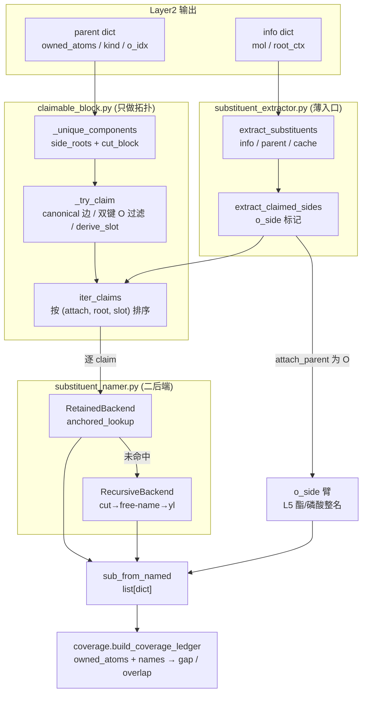
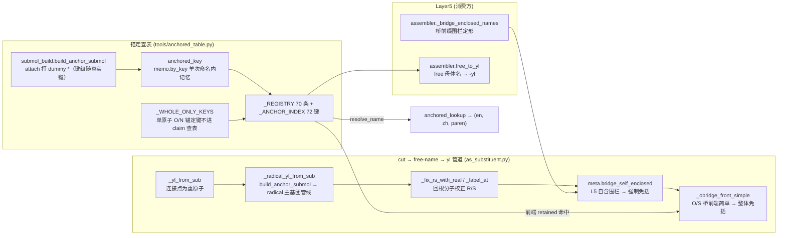

# Layer3: 取代基提取器 (Substituent Extractor)

> **最后更新:** 2026-09-13 | **源文件:** 8 `.py` (682 行) | **公开 API:** `extract_substituents(info, parent, *, cache) -> list[dict]`

## 概述

Layer3 是 NamePredict 6 层流水线中的第三层，负责枚举母体所有权边界之外的所有重原子组分（claim），为每个组分生成中英双语名称，并输出取代基列表供 layer4 编号、layer5 组装。

取代基集合**完全由几何边界枚举得出**：本层只读 `parent["owned_atoms"]`（母体声明拥有的原子），不读 layer1 的官能团列表（`hydroxyls`/`ketones`/`amines`/`ethers` 等）——凡是母体边界之外的重原子连通组分都被切出为一个 claim，再按「锚定查表 → 递归命名」二后端取首个命中的名字。

**输入:**
- `info: dict` — layer1 的分析结果，本层只读 `"mol"`（RDKit Mol 对象）与 `"root_ctx"`（`(root_mol, to_root)`，`namer._name_mol` 注入，供递归取代基回根分子校正 R/S）
- `parent: dict` — layer2 选出的母体，本层只读 `"owned_atoms"`（边界集合）、`"kind"` 与 `"o_idx"`（`kind ∈ {"ester", "phosphate"}` 或有 `o_idx` 时判定为 O 侧臂）
- `cache: CommonNameCache | None` — 递归子结构命名的共享缓存

**输出:**
- `list[dict]` — 取代基列表，每个元素含 `kind`（`halo`/`alkyl`/`n_block`/`side`）、`en`/`zh`（双语名）、`attach_idx`（母体侧连接原子索引）、`atoms`（该取代基的原子索引序列表）、`paren`（是否需围栏）、`n_carbons`（碳原子数）；O 侧臂另带 `o_side=True`

**在流水线中的位置:**

```
layer1 analyze → layer2 select_parent → layer3 extract_substituents → layer4 number → layer5 assemble
```

> **源:** `src/namepredict/namer.py` — `extract_substituents` 由 `_prepare_candidate`（`namer.py:134`）调用（调用点 `namer.py:144`），随后 `_ledger_complete`（`namer.py:63`）用 `build_coverage_ledger` 做覆盖门控。

## 核心逻辑

### 提取主流程 (extract_substituents)

`extract_substituents`（`substituent_extractor.py:6`）是薄入口，把全部工作交给 claim 补全器：`extract_claimed_sides(info, parent, (), cache=cache)`（`substituent_extractor.py:11`）。第三个位置参数 `existing` 以**空元组**传入，故 `_covered_atoms` 起始为空集，`iter_claims` 枚举出的每个 claim 都会参与命名。

```python
def extract_substituents(info, parent, *, cache=None) -> list:
    from namepredict.layer3.claim_extract import extract_claimed_sides
    return extract_claimed_sides(info, parent, (), cache=cache)
```

`extract_claimed_sides`（`claim_extract.py:76`）取 `parent["owned_atoms"]`（缺失即返回空列表），算一次 `o_side` 标记（`parent["kind"] ∈ constants.ESTER_O_SIDE_KINDS` = `{"ester", "phosphate"}`，或 `parent["o_idx"] is not None`），再把 `info["mol"]`、owned、`info.get("root_ctx")` 交给 `_named_new_sides`（`claim_extract.py:65`）。

`_named_new_sides` 构造一个 `SubstituentNamer`，遍历 `iter_claims(mol, owned)`，逐个经 `_append_named`（`claim_extract.py:53`）命名；`namer.name(mol, claim)` 返回 `None` 的 claim 被静默跳过（该原子最终体现为覆盖台账的 gap）。命名结果由 `sub_from_named`（`claim_extract.py:28`）封装为取代基 dict。`o_side` 只在连接原子确为 O（`claim.attach_parent` 原子序数 8）时写入结果。

### 侧链块枚举与槽位 (claimable_block)

`claimable_block.py` 只做拓扑，不命名。

- `_unique_components`（`claimable_block.py:152`）从 `tools.block_cut.side_roots`（`tools/block_cut.py:19`）给出的边界外邻居出发，用 `cut_block`（`tools/block_cut.py:46`）取不穿越 owned 的连通分量并按原子集去重。
- `_try_claim`（`:136`）为每个组分取 `_canonical_edge`（`:111`）——owned 与组分之间**最小的 `(attach_parent, root)` 边**，使 claim 的表示与枚举入口无关。
- `_has_dbl_o_edge`（`:123`）丢弃「含经双键连 owned 内**非碳**重原子的氧」的组分（砜/亚砜/磷酰等主 FG 成分由主命名路径承担），避免把它切出 `*O` 后误命成羟基。
- `derive_slot`（`:63`）按连接原子定槽位：`_is_amide_n`（`:44`，N 与 owned 内单键相连的羰基碳成键）→ `AMIDE_N`；`_is_amine_n`（`:50`）→ `AMINE_N`；碳原子按 `IsInRing()` → `RING_C`/`CHAIN_C`；其余 → `OTHER`。`_is_amine_n` 对任意输入返回 `False`，故 `derive_slot` 实际产出 `AMIDE_N`/`CHAIN_C`/`RING_C`/`OTHER` 四种槽位。
- `claim_block`（`:92`）做最终校验后建块：连接原子必须在 owned 内、root 必须是 owned 外且与连接原子相邻的重原子、组分对 owned 的附着点必须唯一。

`ClaimedBlock`（`claimable_block.py:21`）是 frozen dataclass，字段为 `slot`、`attach_parent`、`root`、`atoms`（frozenset）。`SideSlot`（`:11`）是 `str` 枚举：`CHAIN_C`/`RING_C`/`AMIDE_N`/`AMINE_N`/`OTHER`。`iter_claims`（`:163`）按 `(attach_parent, root, slot.value)` 排序返回，保证同分子多次枚举的顺序稳定。

主导出到取代基 dict 的 kind 由 `_kind_for_named`（`claim_extract.py:15`）决定：先查 `constants.NAME_KIND`（现含 `fluoro`/`chloro`/`bromo`/`iodo` → `halo`），未命中再查 `constants.CLAIM_KIND`（`amide_n`/`amine_n` → `n_block`，`ring_c`/`chain_c` → `alkyl`），仍无则 `"side"`。**环员 N 的 kind 改写**（`claim_extract.py:37`）：kind ∈ `constants.N_PREFIX_KINDS`（`constants.py:39`，`{"n_alkyl", "n_block"}`，P-62.2.2.1）且附着原子是**环员 N**（`_is_ring_attach`，`claim_extract.py:20`，`mol.GetAtomWithIdx(...).IsInRing()`）时，改写为槽位 `ring_c` 对应的 `alkyl`（`_claim_kind("ring_c")`），改用环上位次定位而非 N- 前缀（P-14.4/P-16）——内酰胺/环胺母体的环 N 因此不与酰基/氨基的 N- 撞名（如 `3-phenyl-1,3-oxazolidin-2-one` 不写成 N-phenyl）。

### 取代基命名引擎 (SubstituentNamer)

`SubstituentNamer`（`substituent_namer.py:90`）按序尝试后端，首个命中即返回（`name`，`:97`）。默认链（`_default_backends`，`:85`）为二后端：

1. **RetainedBackend**（`substituent_namer.py:50`）— 锚定 canonical-SMILES 查表。`_retained_name`（`:45`）→ `_try_anchored_lookup`（`:36`）调 `anchored_lookup(mol, claim.atoms, claim.root)`，命中即用注册表的 `(en, zh, paren)` 组装结果。
2. **RecursiveBackend**（`:59`）— 递归切割命名。调 `name_as_substituent(mol, claim.root, claim.atoms, cache=..., root_ctx=...)`，把 claim 原子从母分子切出为锚定子分子，作为独立分子跑完整 L1-L5 管道，再转 P-29 -yl 形式；`cache`（`CommonNameCache`，`tools/common_names.py:7`）以 canonical SMILES 去重共享结果，`root_ctx` 贯穿传给 `name_as_substituent`，供 radical 取代基回根分子校正 R/S。

`SubstituentName`（`substituent_namer.py:14`）是 frozen dataclass，字段为 `claim`、`en`、`zh`、`requires_parentheses`。

### 通用 cut→free-name→yl 管道 (as_substituent / submol_build)

`as_substituent.py`（125 行）承载 RecursiveBackend 的底层 cut→free-name→yl 管道，核心是**锚定 radical 路径 + 回根分子 R/S 校正**：

- `submol_build.build_anchor_submol`（`submol_build.py:103`）构建诱导子分子：`_copy_atoms`（`:13`）复制原子，`_copy_bonds`（`:21`）只复制子图内的键**并返回被复制的源键列表**（供 `_carry_alkene_stereo` 只扫子图内的键、不必遍历整分子），`_add_anchor`（`:95`）在连接原子处加 dummy 原子 `*`。`_sanitize`（`:76`）失败时返回 `None`。子分子是命名替身，原子集不含母体。
- **锚定键级随母体–取代基真实键级**：`_external_bond_type`（`submol_build.py:85`）取连接原子到母体外邻居的键型（无外部邻居的孤立自由基回退单键），`build_anchor_submol` 用它建 dummy 键——取代基叶以双键连母体（环外 `=CH2` 等）时保留双键，否则 canonical 收成 `*C` 会命成饱和 alkyl（methyl 而非 methylidene，式量丢 H₂；P-56.4）。
- `_carry_alkene_stereo`（`submol_build.py:34`）把诱导子图内 C=C 的 E/Z 标签照搬进子分子（键型重建会丢奇偶）：两端引用邻接被保留则映射到新索引，被切配基由连在 sp2 端的 dummy 顶替（`_add_anchor` 返回的 dummy 索引供其使用），无法唯一解析（如把 sp2 端封成非手性 CH2）则跳过留无立体。标签取原分子即真实立体，不随配基被切/被 `*` 顶替而重判。
- `_radical_yl_from_sub`（`as_substituent.py:66`）是主命名路径：`build_anchor_submol` 打 `*` 后经 `_name_mol` 走完整管线自由命名——L1 检测自由基/酰基头（p41=1）、L2 选 radical/acyl 主基团、L4 锚定位次、L5 输出 `{locants}yl`；canonical SMILES 作缓存键与顶层命名共享 `CommonNameCache`。**缓存语义**：只缓存片段自身的自由基名（`copy.copy(hit)`，不做宿主校正、保留锚定链）——立体随宿主根分子变化，不能跨根共享，故 fresh 与 cache 命中都按当前根分子再过一次 R/S 校正。仅当 `parent_kind ∈ ("radical", "acyl")` 时采用（理论必达，防御性判断）。
- `_fix_rs_with_real`（`as_substituent.py:13`）做 **radical 取代基 R/S 回根分子重算**：糖苷/醚类（如 O-C 糖-糖）异头位被 `*` dummy 顶替后，锚定子结构的 CIP 会随配基翻转，须回到完整根分子重算才正确（与 ChEBI 一致）。仅当命中 meta 的 `parent_kind == "radical"` 且 `parent_chain` 至少 2 个原子（非 `[0]`-坍缩、不含 `*`）时，把其 `parent_chain` 索引经 `block_root_order`（根上下文映射）映到根分子索引，用 `layer5.stereo._cip_on_chain`（`layer5/stereo.py:118`）分别对锚定子结构与根分子取 R/S，不一致则以 `_with_rs`（`layer5/stereo.py:217`）重写 en/zh；位次经 `_label_at`（`as_substituent.py:41`）改用整体编号标签（稠环桥头 4aS/8aS），无标签表或越界时退回链序号。本层未贡献 R/S 时直接返回。
- **括号判定经 meta 接口给出**（P-16.5.1.1）：词干是否复合由自由基命名的母体取代基数给出——`composite = meta.parent_substituent_count > 0`（namer 在 `_ok_result` 注入母体取代基数），`need_paren = composite and en not in ("phenyl", *constants.SIMPLE_ALKOXY_NO_PAREN, *constants.AMIDO_RETAINED_EN)`——复合前缀必括、未取代简单基免括。**amido 保留式（acetamido/formamido/benzamido，P-66.1.1.4.3 方法 1）作简单前缀免括号**（同 -alkoxy 保留式），否则 3,5-二乙酰苯环会被倍增成 `bis(acetylamino)` 而非 `diacetamido`。
- **`bridge_self_enclosed` 覆盖免括判定**（`as_substituent.py:96`）：命中 meta 带 `bridge_self_enclosed` 时直接置 `need_paren = False`——L5 已把该 O/S 桥复合前缀整名定形为自含围栏形式（如 `(4-甲氧基苯基)磺酰基`），L3 不得再对整体套一层括号，否则成为 `((4-甲氧基苯基)磺酰基)`。该标记由 L5 `assembler._bridge_enclosed_names`（`layer5/assembler.py:220`）定形后置入编号结果（`layer5/assembler.py:310`，N 桥 `azane` 除外——其名仍须 L5 整体围栏），经 `namer._chain_meta`（`namer.py:39`，字段在 `namer.py:44`）随 `parent_chain`/`parent_kind`/`parent_labels` 一起注入 meta。
- **O/S 桥前端简单时整体免括**（P-63.2.1/.2.2）：`need_paren` 且名字以 `oxy`/`sulfanyl` 结尾时，`_obridge_front_simple`（`as_substituent.py:47`）判定 attach 是否为二价 O/S 桥原子、去桥后是否余单一片段，该片段按 retained→recursive 后端取名——`paren=False` 即前端为简单取代基，整个 O/S 前缀不加围栏（gold/ChEBI 平铺式，如 propan-2-yloxy、hexadecanoyloxy、acetyloxy、benzyloxy、naphthalen-1-yloxy）。前端自身被取代（4-nitrophenyl-、2,6-dichlorophenyl-）时后端给出 `paren=True`，整体仍加括号；`-amino` 连接不走此规则。
- `_yl_from_sub`（`:104`）按连接点分派：连接原子为重原子（原子序数 > 1）时走 `_radical_yl_from_sub`，失败或非重原子返回 `None`。`name_as_substituent`（`:118`）为入口，`atoms` 强制 frozenset 后委托 `_yl_from_sub`；`root_ctx` 参数贯穿到子路径（与 `_name_mol` 的 `root_ctx` 同为 `(root_mol, to_root)`）。
- **`-yl` 转换不在本层**：free 母体名 → P-29 -yl 形式（醇→烷氧基 P-63.2.2、硫醇→烷硫基 P-63.2.1、伯胺→烷氨基 P-62.2）由 L5 `assembler.free_to_yl`（`layer5/assembler.py:280`）承担，连同单核氢化物表 `_MONONUCLEAR_NAMES`（`layer5/assembler.py:242`，oxidane/azane/sulfane/sulfinyl/sulfonyl/imine）、苯胺化成词 `_anilino_en`（`:245`，`phenyl-azane` → `anilino`，P-62.2.1.1）与双语出词 `_mononuclear_en`（`:250`）/`_mononuclear_zh`（`:258`，经 `constants.zh_bridge_root`，`constants.py:90`）；`free_to_yl` 对复合 `-amino` 前缀（P-29.3.6）与带环取代基的 `…anilino` 加围栏。

> **源:** `src/namepredict/layer3/as_substituent.py`, `src/namepredict/layer3/submol_build.py`

### 氨基与铵基取代基 (amino / azaniumyl)

氨基不设独立提取器，走统一 claim 路径：

- **质子化伯胺取铵基名**：`_REGISTRY` 的 `azaniumyl` 锚定叶子（`anchored_table.py:72`，`*[NH3+]` → `铵基`，P-62.4.1：azanium 去氢得 azaniumyl；gold/ChEBI 对氨基酸类一律取 azaniumyl）直接由 RetainedBackend 命中，同时 `methylazaniumyl`/`dimethylazaniumyl`/`trimethylazaniumyl` 覆盖 N-甲基化铵。
- **中性氨基**：注册表 `amino` 条目的锚定键 `*N`（`anchored_table.py:90`）落在 `_WHOLE_ONLY_KEYS`（`anchored_table.py:146`）内，`_table_hit` 对它返回 `None`，故单原子 N 叶子不经 claim 查表，改由 RecursiveBackend 的 `*N` 锚定自由基管线（氮烷 `azane` 词干，P-66.1.1）出词。
- **N-取代基（胺母体 N 端）**：酰胺 N 经 `_is_amide_n` 得 `AMIDE_N` 槽位，`CLAIM_KIND` 映为 `n_block`（∈ `N_PREFIX_KINDS`），位次以 N 标注或隐含省略，由 L5 前缀组装消费（P-62.2.2.1）；非环、非芳香的胺 N 由 `_is_amine_n`（`claimable_block.py:50`）判定，该函数对任意输入返回 `False`，故胺 N 连接的组分落在 `OTHER`，kind 落为 `side`。
- **环员 N** 是环杂原子、按环位次定位，由 `_is_ring_attach` + kind 改写处理，不走 N- 前缀（见上「侧链块枚举与槽位」）。
- **酰胺母体的 N-烷基**由 layer1 检测 + layer5 组装处理，不走 layer3。

### 覆盖台账 (Coverage Ledger)

覆盖台账是 layer3 与上层质量控制的桥梁。`build_coverage_ledger`（`coverage.py:57`）接收分子、母体拥有的原子集合与 `SubstituentName` 列表，输出 frozen dataclass `CoverageLedger`（`coverage.py:13`）：`owned_atoms`、`named_claims`、`gap`（`全部重原子 - (owned ∪ claims)`）、`overlap`（在 owned 与 claims 中出现次数 > 1 的重原子），属性 `complete`（`:21`）= `not gap and not overlap`。

> 注：`namer._ledger_complete`（`namer.py:63`）以 `names=[]` 调用，故当前门控等价于「`owned_atoms` 是否覆盖全部重原子」——`gap` 即母体边界漏掉的重原子；`namer._claim_from_sub`（`namer.py:53`，`slot=SideSlot.OTHER`）提供从取代基 dict 反向构造 `ClaimedBlock` 的桥。候选裁决由 `_try_phase`（`namer.py:164`）在 `meta.coverage_complete` 上标记，供并列候选比较。

> **源:** `src/namepredict/layer3/coverage.py`

### 取代基注册表 (anchored_table._REGISTRY)

`tools/anchored_table.py`（165 行）维护**单一取代基注册表** `_REGISTRY`（`anchored_table.py:24`）——基础取代基与 IUPAC 2013 蓝皮书 P-29/P-57/P-61-P-68 保留条目统一入表。每条 `RetainedSubstituent`（`:16`）四个字段：`en`、`zh`（最终用名，如 `isopropyl` 条目 `en="propan-2-yl"`、`isobutyl` 条目 `en="2-methylpropyl"`）、`anchored`（锚定 canonical-SMILES 键，可为多条）、`paren`（作前缀时是否需围栏）。注册表只读，经 `resolve_name`/`anchored_lookup` 查询。

**条目数：70 条**（`_ANCHOR_INDEX` 72 键——`phosphonato` 与 `phosphonatooxy` 各带两条锚定键）。分类：

| 类别 | 条目示例 |
|------|---------|
| 基础取代基（halo/leaf） | `*F` fluoro、`*Cl` chloro、`*[N+](=O)[O-]` nitro、`*=O` oxo、`*N=C=O` isocyanato、`*N=C=S` isothiocyanato |
| 线性 n-烷基 C1-C4 | `*C` methyl、`*CC` ethyl、`*CCC` propyl、`*CCCC` butyl |
| 亚基 ylidene（叶以双键连母体） | `*=C` methylidene、`*=CC` ethylidene、`*=CCC` propylidene、`*=C1CC1` cyclopropylidene、`*=C1CCCCC1` cyclohexylidene、`*=S` sulfanylidene |
| 支链/烯/炔保留基 | `*C(C)C` propan-2-yl、`*C(C)(C)C` tert-butyl、`*CC(C)C` 2-methylpropyl、`*C(C)CC` butan-2-yl、`*CC(C)(C)C` 2,2-dimethylpropyl、`*CCC(C)C` 3-methylbutyl、`*C=C` ethenyl、`*CC=C` prop-2-enyl、`*C(=C)C` prop-1-en-2-yl、`*CC#C` prop-2-ynyl |
| 芳烷基 | `*Cc1ccccc1` benzyl |
| 含杂原子保留基（leaf） | `*OC` methoxy、`*OO` hydroperoxy、`*O` hydroxy、`*[O]` oxidanyl、`*SC`/`*SCC`/`*S` 硫系、`*[SeH]` selanyl、`*S(C)=O` methylsulfinyl、`*S(C)(=O)=O` methylsulfonyl、`*S(=O)(=O)O` sulfo、`*S(=O)(=O)c1ccc(C)cc1` tosyl、`*C(=O)O` carboxy、`*C=O` formyl、`*C#N` cyano、`*[N+]#[C-]` isocyano、`*N` amino、`*NN` hydrazinyl、`*Nc1ccccc1` anilino、`*N=O` nitroso、`*N=[N+]=[N-]` azido、`*N=N` diazenyl、`*[N+]=[N-]` diazo、`*CO` hydroxymethyl、`*CC(=O)O` carboxymethyl |
| 酰胺/脲/磺酰胺残基（leaf） | `*C(N)=O` carbamoyl、`*OC(N)=O` carbamoyloxy、`*NC(N)=O` carbamoylamino（`paren=True`）、`*NC(N)=S` carbamothioylamino（`paren=True`）、`*S(N)(=O)=O` sulfamoyl、`*C(=N)N` diaminomethylidene（`paren=True`，脒/胍残基） |
| 磷系列 | 直连母体 `*P(=O)(O)O` phosphono、`*P(=O)([O-])O`/`*P(=O)([O-])[O-]` phosphonato；O 桥 `*OP(=O)(O)O` phosphonooxy、`*OP(=O)([O-])O`/`*OP(=O)([O-])[O-]` phosphonatooxy、`*COP(=O)(O)O` phosphonooxymethyl（`paren=True`）、`*COP(=O)([O-])O` phosphonatooxymethyl（`paren=True`） |
| 铵型阳离子（leaf） | `*[NH3+]` azaniumyl、`*[NH2+]C` methylazaniumyl、`*[NH+](C)C` dimethylazaniumyl（`paren=True`）、`*[N+](C)(C)C` trimethylazaniumyl（`paren=True`） |

> 亚基（ylidene）叶以**真实双键键级**入表：若 canonical 收成 `*C` 单键，命出的是氢化产物（净多 2H，等于写出另一个分子）。`diaminomethylidene`（`anchored_table.py:41`，`*C(=N)N`，`paren=True`）为脒/胍残基，按 P-66.1.1 取亚基式而非等价的 `amino(imino)methylamino`（两者互变、分子式相同，取测试集口径）。酰胺类 leaf 按 P-66.1.1.4 取保留式：carbamoyl/carbamoyloxy（P-66.1.1.4.1）、carbamoylamino（P-66.1.1.6，替代已不推荐的 ureido）、carbamothioylamino（P-66.1.1.4）、sulfamoyl（P-66.1.1.4.2）；`phosphono`/`phosphonato` 为 P 直连母体的 -PO(OH)₂ / -PO(O⁻)₂（P-102），与 O 桥的 `phosphonooxy` 系列互补。铵型阳离子（P-62.4.1）整体入表：带电 N 片段一旦整体丢失会使 `coverage_complete` 误判，故按锚定叶子承载。

构建期 `_build_anchor_index`（`anchored_table.py:110`）把各条目 `anchored` 键 canonical 化（`_canon`，`:100`）后反查生成 `_ANCHOR_INDEX`（`:125`），并校验每个锚定键**已是 canonical 形式**且**跨 key 唯一**，违例抛 `ValueError`。

查表键 `anchored_key`（`:133`）经 `tools/memo.by_key("anchored_key", (id(mol), 原子集, 连接原子), …)` 在**单次命名内**记忆（实际构建在 `_anchored_key_uncached`，`:139`）——同一 claim 在查表与递归拆分间会被反复求键且键只依赖 `(mol, 原子集, 连接原子)`，记忆化纯消除重复计算、不改变返回值；`memo.begin_run()`（`tools/memo.py:13`）由 `namer.SMILESNNamer.name` 每次顶层命名开始时清空（`namer.py:287`）。`_table_hit`（`:149`）取索引命中；锚定键为 `*O`/`*[O]`/`*N`（`_WHOLE_ONLY_KEYS`，`:146`）时返回 `None`——只允许整分子顶层命中，避免 L3 把酮羰基氧/酯氧/胺氮误认成羟基/氨基。`anchored_lookup`（`:157`）命中即解析为 `(en, zh, paren)`；`resolve_name`（`:128`）返回条目的 `(en, zh)`。

> **源:** `src/namepredict/tools/anchored_table.py`

## 数据流图





## 文件清单

| 文件 | 行数 | 描述 |
|------|------|------|
| `__init__.py` | 6 | 公开 API 导出：`extract_substituents` |
| `substituent_extractor.py` | 13 | **薄入口**。`extract_substituents(info, parent, *, cache)` 直接委托 `extract_claimed_sides`。 |
| `claim_extract.py` | 82 | **claim 命名 → 取代基 dict**。`extract_claimed_sides` 遍历 `iter_claims`，未命名成功的 claim 静默跳过；`sub_from_named` 出 dict（`kind`/`n_carbons`/`attach_idx`/`atoms`/`en`/`zh`/`paren`，O 侧另加 `o_side`）；`_kind_for_named` + `_is_ring_attach` 做 kind 映射与环员 N 的 N-前缀改写；`root_ctx` 自 `info.get("root_ctx")` 注入 namer。 |
| `claimable_block.py` | 170 | **拓扑与槽位**（不命名）。`ClaimedBlock`/`SideSlot`(CHAIN_C/RING_C/AMIDE_N/AMINE_N/OTHER)/`derive_slot`/`claim_block`/`iter_claims`；canonical 边选取、双键 O 组分过滤、单附着点校验。 |
| `substituent_namer.py` | 103 | **命名引擎**。有序二后端（Retained→Recursive，无 rooted_tree）；`SubstituentName(claim, en, zh, requires_parentheses)`；`name(mol, claim)`。 |
| `as_substituent.py` | 125 | **cut→free-name→yl 管道**。`_radical_yl_from_sub`（锚定 `*` radical/acyl 管线）、`_fix_rs_with_real`/`_label_at` 回根分子校正 R/S，括号经 meta 接口判定（amido/简单烷氧基免括、`bridge_self_enclosed` 强制免括），`_obridge_front_simple` 判定 O/S 桥前端简单时整体免括。 |
| `submol_build.py` | 111 | **锚定子分子构建**。`build_anchor_submol` / `_copy_bonds`（返回子图内源键）/ `_carry_alkene_stereo`（E/Z 迁移）/ `_external_bond_type`（锚定键级照搬，双键叶 → methylidene）/ `_add_anchor` / `_sanitize`。 |
| `coverage.py` | 72 | **覆盖台账**。`CoverageLedger`(owned_atoms/named_claims/gap/overlap + `complete`) 与 `build_coverage_ledger`。 |

> 备注：layer3 只有以上 8 个模块。`side_facts.py`/`aryl_sub.py`/`yl_form.py`/`amino_side.py` 均不存在——氨基与铵基由注册表锚定叶子 + claim 路径承担；`carbon_neighbors` 不在 `tools/chain.py` 的对外面（只有 `_carbon_neighbors`/`_longest_from`，消费方是 L2 `chain_walk`）；yl 转换在 `layer5/assembler.free_to_yl`。

### tools/ 层无关工具（layer3 消费）

| 文件 | 行数 | 描述 |
|------|------|------|
| `tools/__init__.py` | 3 | 包声明与层说明（`tools/` 供 L2/L3 共享，不依赖任何流水线层）。 |
| `tools/anchored_table.py` | 165 | **锚定 canonical-SMILES 查表 + 取代基注册表**。`_REGISTRY`（70 条统一 registry，字段 `en`/`zh`/`anchored`/`paren`）+ `_ANCHOR_INDEX`（72 键）反查 + `anchored_key`（经 `memo` 单次命名内记忆）/`_table_hit`/`anchored_lookup`/`resolve_name`/`_WHOLE_ONLY_KEYS`。核心机制。 |
| `tools/block_cut.py` | 50 | 母体边界块切割：`side_roots`（块根）/`cut_block`（不穿越母体的连通分量，BFS）。 |
| `tools/chain.py` | 39 | 碳链行走原语 `_carbon_neighbors`/`_extend_best`/`_dfs_path`/`_longest_from`（带 `banned` 禁走集合，供 L2 排除羧酸/腈叶碳）；当前唯一消费方是 L2 `chain_walk`。 |
| `tools/common_names.py` | 29 | **常用名结果缓存** `CommonNameCache`（`SMILES → NameResult` 内存字典，`max_entries` 满则 `put` 抛错；`clear()` 供并行评测逐行隔离）。layer3 递归命名与顶层 `namer` 共享。 |
| `tools/memo.py` | 49 | **单次命名的中间结果记忆**（跨层性能基建，不改命名结果）：`begin_run()` 由 `namer.SMILESNNamer.name` 每次顶层命名开始时清空，`by_mol`/`by_key` 按分子对象或自定义键记忆，`threading.local` 线程隔离。`anchored_table.anchored_key` 经 `by_key` 使用。 |
| `tools/re.py` | 94 | **命名文本辅助**（L4/L5 消费，layer-agnostic）：`alkyl_alpha_key`（P-14.5 字母序排序键，剥 sec-/tert-/N- 前缀、括号、前导位次与前导立体组）、`normalize_en`/`normalize_zh`（判分/比对口径的名称规范化）、`nospace`。 |
| `tools/rdkit_fast.py` | 26 | 导入期全局补丁（layer-agnostic，`namepredict/__init__.py` 安装）：把 `Mol.GetAtoms()`/`GetBonds()` 换成索引循环，绕开本构建 RDKit 纯 Python 迭代器的每项包装开销（返回列表的元素/顺序/可变性一致），端到端省约 12.6%。 |

> 备注：`tools/alkoxy_side.py` 与 `tools/free_to_yl.py` 不存在（酯 O 侧拓扑由 L2 principal_expression + L5 `join_ester_name` 承担，yl 转换在 `layer5/assembler.free_to_yl`）；`tools/rdkit_fast.py` 不是 L3 专属依赖，而是包导入时安装的全局性能补丁，因属同一 `tools/` 层在此一并列出。

## 对外接口

### 主入口

```python
def extract_substituents(
    info: dict,
    parent: dict,
    *,
    cache: CommonNameCache | None = None,
) -> list[dict]:
```

- **info**: layer1 分析结果，必须包含 `"mol"` 键（RDKit Mol 对象）；可选 `"root_ctx"`（= `(root_mol, to_root)`，由 `namer._name_mol` 注入）
- **parent**: layer2 母体选择结果，必须包含 `"owned_atoms"` 键；可选 `"kind"`、`"o_idx"`（判定 O 侧臂）
- **cache**: 递归子结构命名的共享缓存（`CommonNameCache`），加速跨 cut 命名
- **返回**: 取代基 dict 列表，共同键 `kind`, `en`, `zh`, `attach_idx`, `atoms`, `paren`, `n_carbons`；O 侧臂另带 `o_side`

### claim 枚举

```python
class SideSlot(str, Enum):
    CHAIN_C = "chain_c"
    RING_C = "ring_c"
    AMIDE_N = "amide_n"
    AMINE_N = "amine_n"
    OTHER = "other"

@dataclass(frozen=True)
class ClaimedBlock:
    slot: SideSlot
    attach_parent: int
    root: int
    atoms: frozenset[int]

def derive_slot(mol, attach_parent: int, owned_atoms: frozenset[int]) -> SideSlot
def claim_block(mol, *, owned_atoms, attach_parent: int, root: int, slot: SideSlot) -> ClaimedBlock | None
def iter_claims(mol, owned_atoms: frozenset[int]) -> list[ClaimedBlock]
```

### 内部命名类

```python
@dataclass(frozen=True)
class SubstituentName:
    claim: ClaimedBlock
    en: str
    zh: str
    requires_parentheses: bool

class SubstituentNamer:
    def __init__(self, backends=None, *, cache=None, root_ctx=None)
    def name(self, mol, claim: ClaimedBlock) -> SubstituentName | None

def name_as_substituent(mol, attach_old: int, atoms, *, cache=None, root_ctx=None) -> tuple[str, str, bool] | None
def build_anchor_submol(mol, atoms: frozenset[int], attach_old: int) -> Mol | None
```

### 锚定查表

```python
def anchored_key(mol, atoms: frozenset[int], attach_old: int | None = None) -> str | None
def anchored_lookup(mol, atoms: frozenset[int], attach_old: int | None = None) -> tuple[str, str, bool] | None
def resolve_name(key: str) -> tuple[str, str]
```

### 覆盖台账

```python
def build_coverage_ledger(mol, *, owned_atoms: frozenset[int], names: list[SubstituentName]) -> CoverageLedger
```

`CoverageLedger` 属性: `owned_atoms`, `named_claims`, `gap`, `overlap`, `complete`.

## 相关页面

- [[architecture/layer2-parent-selector]] — Layer2 母体选择器，提供 `parent` dict（含 `owned_atoms` 与 `chain`）；L2 与 L3 互不调用，共享仅经 `tools/`
- [[architecture/layer1-analyzer]] — Layer1 官能团分析器，提供 `info` dict（L3 只取 `mol` 与 `root_ctx`）
- [[architecture/layer4-numbering]] — Layer4 编号引擎，消费 layer3 输出的取代基列表（字母序键经 `tools/re.alkyl_alpha_key`）
- [[architecture/layer5-name-assembly]] — Layer5 名称组装，最终拼接母体名和取代基前缀（-yl 转换在 `layer5/assembler.free_to_yl`）
- [[architecture/overview]] — 系统架构概览，6 层流水线总览
- [[concepts/bilingual-naming]] — 中英双语命名约定
- [[concepts/atom-ownership]] — ClaimedBlock / owned_atoms / CoverageLedger 原子归属模型
