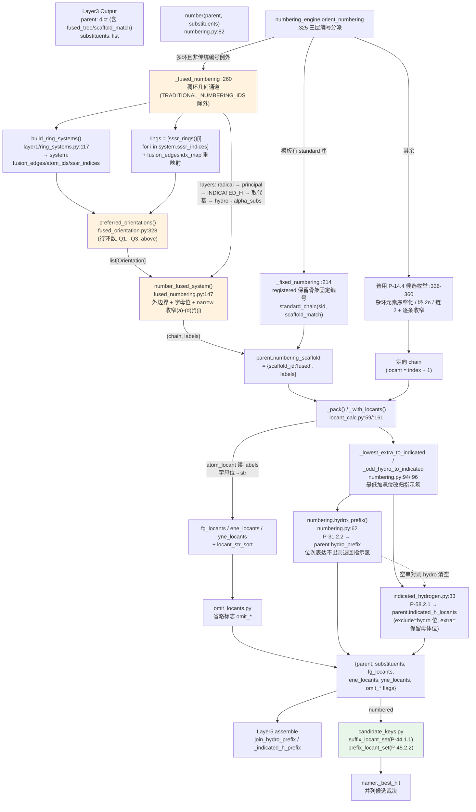

# Layer4: Numbering / Locants（编号与定位符）

> **位置:** `src/namepredict/layer4/` | **行数:** 10 个 `.py` (1496 行) | **最后更新:** 2026-09-15 | **负责:** 按 P-14.4 给母体链/环原子分配位次号、决定编号方向、计算 FG/不饱和键定位符与省略规则；稠环（fused-ring）编号走几何摆放 + 外围骨架通道；加氢前缀（P-31.2.2）与指示氢位次（P-58.2.1）归属，并列候选母体比较键（P-44.1.1 / P-45.2.2）

---

## 概述

Layer4 在 Layer3 完成母体选择与取代基提取之后，为母体骨架的每个原子分配 IUPAC 定位符（locant），并决定链/环的编号方向（orientation）。它接收 Layer3 的输出——一个包含母体骨架信息的 `parent` 字典和一个 `substituents` 列表——返回一个"已编号"的字典：母体链的方向已确定，每个取代基已获得其附着点的 locant 数值，官能团（FG）和多重键的 locant 也已计算好。

Layer4 由 9 个模块（+ `__init__.py`）组成，统一由 `numbering_engine.orient_numbering`（`numbering_engine.py:325`）作为**编号方向总调度器**。它按优先级分派三条路径：

1. **`_fixed_numbering`**（`:214`）— registered 保留骨架（模板有 `standard` 序，如喹啉/萘/菲/芘）走固定编号：`_template_matches` + `standard_chain` 把模板原子映射为标准 locant 序，对称 scaffold 多自同构等价链按三层键最小化。
2. **`_fused_numbering`**（`:260`）— 多环（≥2 环，含未注册的饱和/部分饱和稠环）走稠环几何/编号通道；`scaffold_id` 落在 `constants.TRADITIONAL_NUMBERING_IDS`（`constants.py:147`，anthracene/phenanthrene/acridine/carbazole/purine/xanthene/thioxanthene/cyclopenta[a]phenanthrene）时按 P-25.3.3 传统编号，不接管。
3. **普用 P-14.4 候选枚举**（`:336-360`）— 以上均不满足时（单环、非芳香、开链）枚举候选编号逐条收窄：环系先按杂环/碳环分岔，杂环经 `_narrow_hetero_ring` 元素序窄化（P-22.2.2.1.3）。

位次不一律 `chain.index+1`：稠环/固定编号下 locant 可为**数字+字母混合**（`"4a"` 型融合桥头位）。`locant_calc` 组装完成后由本模块的 `hydro_prefix` 产出加氢前缀（P-31.2.2，`numbering.py:62`）并写入 `parent["hydro_prefix"]`；`indicated_hydrogen` 产出指示氢位次（P-58.2.1）写入 `parent["indicated_h_locants"]`；`candidate_keys.py` 以 `_principal_atoms` 与取代基位次集合生成 namer 的并列候选裁决键（P-44.1.1 / P-45.2.2）。

**输入数据结构:**

- `parent: dict` — 包含 `chain`（原子序列）、`kind`（母体类型）、`mol`（RDKit 分子，编号期一切原子/键事实的源头）、官能团键（如 `double_bond`、`triple_bonds`）、骨架编号事实（`numbering_scaffold`）、principal 表达事实（`principal_expression_facts`，含 `attachment_atoms`/`group_class`/`relation`/`multiplicity`）、`hydro_atoms`（L2 给出的加氢位）、`scaffold_id`（L2 `get_spec` 可查的保留骨架 id）等字段；未注册稠环额外携带 `fused_tree`（FusedNode，L2 拆解）与 `scaffold_match`（模板→分子原子映射）
- `substituents: list[dict]` — 每个元素含 `attach_idx`（附着原子）、`en`（英文名）等字段

**输出数据结构:**

```python
{
    "parent": { ..., "numbering_scaffold": {"scaffold_id": "fused", "labels": ["1",...,"4a",...]},
                "hydro_prefix": ("2,3-dihydro", "2,3-二氢"),
                "indicated_h_locants": ["1"], "indicated_h_forced": False },
    "substituents": [ {**s, "locant": 2}, ... ],
    "fg_locants": [ {"kind": "alcohol", "locants": [1], "omit": False}, ... ],
    "ene_locants": [2], "omit_ene_locant": False,
    "yne_locants": None, "omit_yne_locant": False,
}
```

`labels`（`numbering_scaffold["labels"]`）为稠环/固定编号的并行 locant 标签串（含 `"4a"` 字母位），与 `chain` 同位。`indicated_h_locants` 为指示氢位次字符串列表（如 `['1']`、`['1','2']`），无指示氢时为空列表，由 L5 `assembler._indicated_h_prefix`（`layer5/assembler.py:244`）拼成 `"1H-"` 前缀；`indicated_h_forced` 记录该前缀是否来自保留母体名未隐含、须显式标出的位（`_extra_indicated`）。`hydro_prefix` 为 `(en, zh)` 加氢前缀对，位次表达不出时退回空串对（见下文 `numbering.hydro_prefix` 与 `indicated_hydrogen.py` 两节）。

---

## 核心逻辑

### 入口调度 (`number`)

`numbering.py` 是 Layer4 的唯一对外入口（115 行），流程极短：

1. `orient_numbering(parent, substituents)`（`:84`）— 计算定向后的原子顺序（chain）；`oriented = {**parent, "chain": chain}` 承载上游事实
2. `_with_locants(chain, subs, numbering_scaffold)` + `_pack(...)`（`:86`）— 给每个取代基注入 locant，整合 FG/不饱和键位次
3. `hydro` 归属整理（`:89-92`）— 取 `packed["hydro_atoms"]`（L2 `principal_expression` 注入）；缺失，或分子自推饱和位为**合法倍增数且是模板集的真超集**时改用自推集 `_fallback_hydro_atoms`（模板只写一个 Kekulé 式会漏计稠合/角位饱和碳，cyclopenta[a]phenanthrene 型甾体的 tetradecahydro 因此不会被写成 dodecahydro-1H,2H）
4. `_lowest_extra_to_indicated`（`:94`）→ `_odd_hydro_to_indicated`（`:96`）— 依次把最低位次改用指示氢表达
5. `hydro_prefix(packed["chain"], labels, hydro)`（`:98`）→ 写入 `parent["hydro_prefix"]`：以整体编号 labels 为位次基准算加氢前缀（P-31.2.2）；**位次表达不出（加氢数超倍增表、或加氢位不全在链内）则整体退回指示氢**（`hydro` 清空、前缀置空串对，`:99-100`），不产半截名
6. `indicated_hydrogen(mol, chain, labels, hydro, extra)`（`:102`）→ 写入 `parent["indicated_h_locants"]`：以整体编号 labels 为位次基准算指示氢位次（P-58.2.1）；`_extra_indicated(packed)`（`:101`）给出保留母体名未隐含、须显式标出的位，`parent["indicated_h_forced"]`（`:104`）记录其是否非空

`numbering.py` 的辅助函数：

- `_fallback_hydro_atoms(parent)`（`:10`）— 未注册稠环（无保留模板可比、`hydro_atoms` 缺失；`fused_tree` 为 None 直接返回空集）时由分子自身推导加氢位：取 `saturated_ring_atoms` 中**非芳香**的位（P-31.2.2）。非芳香一条把"mancude 母体本身带 H 的环杂原子"（吡咯型 N-H，指示氢由 P-58.2.1 承载）与"母体双键被饱和而新带 H 的位"区分开；若结果混入杂原子饱和位则改取其中的**碳子集**（且碳子集大小须落在 `HYDRO_MULT_N` 内），否则保留全集
- `_lowest_extra_to_indicated(packed, labels, hydro)`（`:22`）— 把加氢位中最低位次者改用指示氢表达（P-31.2.2、P-58.2.1.2、P-58.2.2.2：指示氢优先得低位次，其余仍是 hydro 位）：与此刻的指示氢位中位次**最高**者互换名次归属（`indicated = 饱和环位集 - hydro`），两边计数不变，故 hydro 倍增前缀的合法性与奇数回退都不受影响（如 `1,4-dihydro-2H-` → `2,4-dihydro-1H-`）。无 hydro 位或无指示氢位时不重排
- `_odd_hydro_to_indicated(packed, labels, hydro)`（`:47`）— 加氢位数为奇数时把其中最低位次改用指示氢表达（P-51.1.1.4、P-58.2.1.2）：饱和环上出现无氢饱和位（偕二甲基季碳等）使其不计入 hydro，环内带 H 的饱和位遂成奇数，hydro 只取偶数个、余下最低位次那个由指示氢承载（4,4,7-三甲基-2,3-二氢-1H-萘 取 hydro=2,3 / 指示氢=1，而非整体放弃加氢描述退成「4,4,7-三甲基萘」）；已在倍增表内时不动；加氢位不全在链内时本层补救不了，原样返回
- `_extra_indicated(packed)`（`:110`）— 经 L2 `ring_scaffold.extra_indicated_atoms(mol, sid, match)`（`layer2/ring_scaffold.py:268`）取保留母体名**未隐含**、须显式标指示氢的环位（P-58.2.1）；`scaffold_id`/`scaffold_match`/`mol` 任一缺失返回空集

> **源:** `src/namepredict/layer4/numbering.py`

### 编号方向总调度 (`numbering_engine.orient_numbering`)

`orient_numbering(parent, substituents, *, float_hetero=False)`（`numbering_engine.py:325`）是三层编号分派器，`_fused_numbering` 只在无保留模板固定编号且非 P-25.3.3 传统编号例外骨架的多环（保留模板/全芳香/链覆盖 ≥2 环任一）时接管，已注册固定编号模板、单环、非稠环全部回落 P-14.4 通用枚举（避免萘/喹啉被通用枚举算错）：

```
orient_numbering(parent, substituents)
  ├─ 1. _fixed_numbering(:214)   # registered 保留骨架固定编号 → 非空则返回
  ├─ 2. _fused_numbering(:260)   # 稠环几何通道（传统编号例外除外）→ 非空则返回
  └─ 3. 普用 P-14.4 枚举(:336-360)  # 杂环元素序窄化 / 环 2n 或链 2 + 逐条收窄
```

**`_fixed_numbering`**（`:214`，P-14.4(a)）— 用 `scaffold_id` 查模板 Mol（`_Q`，`layer2/ring_scaffold.py:193`），`_template_matches(mol, sid, atoms)`（`:200`）找子图匹配并筛出 `set(m)==原子集`；再 `standard_chain(sid, tuple(m))`（`layer2/ring_scaffold.py:428`）投射标准 locant 序的分子链。对称 scaffold（菲/芘）多自同构匹配时生成等价链，按**三层键**（`_fixed_key`，`:251`）逐层最小化：(c) 后缀层——principal 特征基团附着原子 `_principal_atoms(parent)`（`:153`，醛/酸/酚等无 L3 取代基时唯一的方向判据，如 piperonal 取 1,3-benzodioxole-5- 而非 -6-）与自由基连接点 `radical_c_idx`（`:235-236`，同属 (c)，使咔唑类对称 scaffold 的自由价取 locant 1 而非 8）→ (f) 取代基前缀层（`:237`）→ (g) 位次集合仍相同时按引用序（字母序，`alkyl_alpha_key`，`:242`）把最低位次给最先引用者。位次比较按 `_STANDARD_LABELS`（`layer2/ring_scaffold.py:195`）的标签而非链位置（蒽的 10 位在链上先于 5 位，用链位置号会把 10 位判成更低）；三层混为一集时层级丢失，(OH=2,Br=7) 与 (OH=7,Br=2)、或 2-溴-7-氯蒽的溴/氯对调都会平局后随枚举顺序漂移。无 principal 也无取代基时直接取 `chains[0]`（`:238-239`）。

`_template_matches(mol, sid, atoms)`（`:200`）— 模板 atom_ids 全覆盖环系的全部匹配：先 `mol.GetSubstructMatches(_Q[sid], uniquify=False)` 直接匹配，失败则退到**氢化骨架**匹配（`_Q_H[sid]`，`layer2/ring_scaffold.py:235`，原子序不变、映射可回原分子）；氢化骨架经 `memo.by_mol("hydrogenated", _hydrogenated, mol)`（`:208`，`_hydrogenated` 见 `layer2/ring_scaffold.py:220`）按分子对象记忆一次。

**`_fused_numbering`**（`:260`）— 稠环主链整体编号，签名 `_fused_numbering(parent, chain, substituents=None)`：
- 护栏（`:264-265`）：`scaffold_id ∈ TRADITIONAL_NUMBERING_IDS` 时返回 `None`，不进入稠环几何通道（这些骨架由 registered 固定编号承担）
- 接管条件（`:268-274`）：`registered_fused`（L2 `get_spec` 的 `spec.n_rings >= 2`，`:268-269`）/ `chain_arom`（链全芳香）/ `chain_fused`（`sssr_rings(mol)` 中 `set(r) <= set(chain)` 的环 ≥2）三者任一，且 `mol`/`chain` 非空才接管；未注册稠环（`fused_hetero` 身份的饱和/部分饱和环）由 `chain_fused` 放行，否则回落通用枚举会得数字位而非 `4a/8a` 字母位、起点随输入原子序漂移
- `build_ring_systems(mol)`（`layer1/ring_systems.py:117`）过滤出 `atom_ids == sorted(set(chain))` 的系统（`:278`），系统环数 <2 时返回 `None`（单环仍走通用枚举，`:283-284`）
- **rings 取稠合系统自身环并同步重映射 fusion_edges**（`:285-289`）——全分子 AtomRings 会把取代基上的无关环也算进 layout，orientation 必失败而退回通用单环枚举把桥头碳当普通数字位次（chebi-300 thieno 甲基 6,7 应 5,6）；`rings` 过滤后索引重排，故 `fusion_edges` 的 SSSR 索引经 `idx_map` 重映射，否则 `horizontal_rows` KeyError 退化成只命名侧链。环表由 `layer1.ring_systems.sssr_rings`（`:285`）统一给出
- **环外附着原子分层**（`:293-309`）——纯碳环上准则 (a)-(d) 全平局，按优先级构造 `layers` 逐层做位次集合最小化收窄镜像取向：自由基连接点 `radical_c_idx`（`:295-297`，P-29）→ principal 特征基团附着原子（`:298-300`，P-14.4(c)）→ **`INDICATED_H` 哨兵层**（`:301-302`，P-25.3.3.1.2(f) 指示氢位次——按 P-14.4 序插在后缀 (c) 之后、可分离前缀 (f) 之前，如 3,4-二氢萘-1(2H)-酮 的 =O 先占 1 位、指示氢才落到 2 位）→ 取代基 `attach_idx` 集合（`:303-306`，P-14.4(f)）→ `hydro_atoms` 加氢位（`:307-309`，P-31.2.2）
- **字母序平局键**（`:310-312`）——`alpha_subs = [(alkyl_alpha_key(en), attach_idx)]`，位次集合仍相同时按 P-14.5 把最低位次给字母序最前取代基
- `preferred_orientations(mol, rings, fusion_edges)`（`fused_orientation.py:328`）→ `number_fused_system(mol, rings, [o.coord_dict()...], layers, alpha_subs)`（`:313`，`fused_numbering.py:147`）
- 写回 `parent["numbering_scaffold"] = {"scaffold_id": "fused", "labels": tuple(labels)}`（`:317-319`），返回 `fused_chain`

### 普用 P-14.4 候选编号引擎

非稠环路径（`numbering_engine.py:336-360`）实现 **P-14.4 规则管线**（无 kind 派发 orienter）。核心思路：枚举候选编号 → 逐条 P-14.4 规则收窄 → 单候选存活时提前终止。**入口先按杂环 / 碳环-链分岔**：

```
普用路径
  ├─ _is_ring(parent)（:178）→ _ring_cands 环 2n 候选（:33）/ 链 2 个（:341-342，链 inline 正反两向）
  ├─ 杂环（链上有非碳原子）: _narrow_hetero_ring 元素序窄化（P-22.2.2.1.3，:182）
  │        (a)全杂原子集最低位次 → (b)按 F>…>O>S>…>N 逐元素收窄 → (c)同元素 N 带 H/3 价者得低位
  │        不走 FG 锚点/自由基字段，避免醛基环碳抢占 locant 1
  ├─ 碳环/链: 直接用 _ring_cands / 两个方向候选起步（无固定起点锚定）
  ├─ P-14.4(c)：principal characteristic group → 最低位次集收窄（:343-345）
  ├─ P-14.4(e)：多重键 → 最低位次集收窄（双键优先，:346-349）
  ├─ P-14.4(f)：取代基 → 最低位次集收窄（:350-353）→ 平局 _stem_loc_pairs（P-14.5，:354-355）
  └─ P-14.4(j)：立体平局 _rs_locant_key（R/M/r 位次在前，S/P/s 在后）→ _to_chain（:356-360）
```

- **杂环元素序窄化**（`_narrow_hetero_ring`，`:182`）— P-22.2.2.1.3 / P-25.3.3.1.2(b)：先于 principal 收窄，保证唑类 N 必须 1,3/1,2、吡啶甲酸 N=1 后由 principal 定方向。同元素 N 带 H/3 价取代者得低位（唑 NH=1）；`float_hetero`（稠合组分）跳过 (c)（`:190`），镜像方向留共享原子位次最小化定。元素优先序 `P145_SENIOR`（`constants.py:42`）由 `constants` 单一提供。
- **位次集合收窄**（`narrow`，`:75`）— 保留 `key_fn` 键最小者（`skip_none=True` 时任一候选键为 `None` 即判规则不适用、候选原样返回）；`narrow_by_senior`（`:86`）先按整体杂原子集收窄 (a)、再按 `P145_SENIOR` 逐元素收窄 (b)，两个函数的 `skip_none` 一并透传；`_locant_set`（`:46`）给出原子集的升序位次元组。`narrow` 同时被 L2 `fused_system.py:16` 复用。
- **P-14.4(j) 立体平局破**（`numbering_engine.py:356-359`）— (f) 后镜像/反向等价编号仍等优时，按 CIP 立体描述符定方向：`assign_cip`（`:99`，隐式 H 手性碳先补显式 H，经 `memo.by_mol("cip", ...)` 按分子记忆，与 L5 stereo 同一赋值）→ `_chain_rs_codes`（`:124`）取链原子 `_CIPCode`（只收 `RS_HI|RS_LO`，键上 E/Z 不入表）→ `_rs_locant_key`（`:137`）把 R/M/r 描述符的较低位次置于 S/P/s 前（P-91.2），避免内消旋环 1R/7S vs 1S/7R 随输入原子序漂移；该键的 `labels` 参数供稠环传入字母位次（`'4a'`），缺省按链序号。

> **P-14.4(e) 多重键 seam 感知判据（`_bond_locants`，`numbering_engine.py:52`）**：比较多重键"最低位次"时，对**每条多重键**沿编号方向求一个"边位置"数——两端点在编号顺序 order（locant 升序）中相邻 → 记 `ia+1`（`ia` 为较小端序号）；跨编号首尾的闭合 seam 边（`ia==0 and ib==n-1`）→ 记 `n`；端点不沿编号相邻 → 判据不适用返回 None。随后以 `(全部多重键元组, 双键元组)` 双层收窄（双键优先，`:348-349`）。该判据迫使每条多重键占据其沿编号方向的边位，让整条不饱和键落到最低连续位置（如环己二烯 1,3-双键整体起于 locant 1），避免环候选绕行时把闭合键一端误判成 locant 1。

> **源:** `src/namepredict/layer4/numbering_engine.py:325`

### 稠环几何摆放（`fused_orientation.py`）

`fused_orientation.py`（364 行）实现 **P-25.3.2.3 优选取向**——把稠环系"水平行摆放"到平面坐标，按 IUPAC 环计数法离散计数四象限/上方环数，按优选取向准则挑出**平局候选列表**（它只解决"怎么摆/摆哪"，不做编号）。行内中间奇数环（双侧融合）由变形环模板支撑，见下文两段。

核心数据结构 `Orientation`（`fused_orientation.py:21`，frozen dataclass，三个字段）：

```python
@dataclass(frozen=True)
class Orientation:
    row: tuple[int, ...]                 # 水平行环索引（左→右）
    coords: tuple[(atom, x, y), ...]     # 原子坐标（可哈希）
    quad: tuple[float, float, float, float]  # Q1右上/Q2左上/Q3左下/Q4右下 面积分数（IUPAC 环计数法）
    def coord_dict(self) -> {atom:(x,y)}  # 供 number_fused_system 使用（:27）
```

水平轴上方环数不进 dataclass：`_quadrant_fractions`（`:314`）返回 `(quad, above)` 二元组，`above` 只在 `preferred_orientations` 内参与取向键比较。

水平行候选由 `horizontal_rows(rings, fusion_edges)`（`:74`）经 `_extend_row`（`:54`）沿 `opposite_bonds`（`:41`，偶环对面 1 条边、奇环 2 条，P-25.3.2.3.1）递归扩展，按行长度降序返回。

优选取向（`preferred_orientations`，`:328`）：对每个 `(row, flip)` 摆位算 `key = (len(row), q1, -q3, above)`（`:350`），**最大化**（`:353`）——即优先级：**① 水平行环数最多 → ② Q1右上环数最多 → ③ Q3左下环数最少 → ④ 水平轴上方环数最多**。镜像/左右对称环系各 key 相同 → 全部返回为平局候选，交由编号阶段准则(a)-(d) 跨候选收窄（否则编号依赖遍历顺序不稳定）。

**每个候选行只 `_layout` 一次、两个镜像共用**（`:340-346`）：`_layout` 与 flip 无关，故先摆一次，`laid is None` 直接跳过该行，再对 `flip ∈ (False, True)` 复用同一份 `(coords, ring_templates)`（flip 只对 y 取反）；每个 flip 都过 `_valid_deform_overlap(coords, rings, ring_templates)`（`:241`，签名只收坐标、环表与每环模板，一次校验全环）。

四象限/上方按 **IUPAC 环计数法**（P-25.3.2.3.3 准则(b)(c)(d)）由 `_quadrant_fractions`（`:314`）逐环离散计数：原点取水平行中心（`_row_center`，`:263`——偶数环数取中心共同键中点、奇数取中心环中心），经 `_ring_quadrant_contrib`（`:276`）/`_above_contrib`（`:306`）累加——被两轴平分计 1/4、被单轴平分两侧各 1/2、完全在一侧计整环；round 只消浮点尾差。

行内中间奇数环双侧融合（**P-25.3.2.3.2 变形环**，如 6-5-6 线性行）：`_layout`（`:136`）对中间奇数环双侧均有稠合边时用 `ring_shape_template` 构造变形五/七元模板，构造不出才弃行，返回 `(coords, ring_templates)`（ring idx→实际模板）。`_place_ring`（`:88`）支持 template（`side<0` 用镜像模板，保持共享边两端点不动并把镜像模板回传作为 `_ring_deform` 基准）；邻环递归摆放 `_place_neighbor`（`:196`）用集合成员关系确定邻环索引并按共享环对侧（`_opposite_side`，`:125`）选边、失败再试对侧；`_overlaps_any`（`:177`）含共享环的重叠检查；`_ring_deform`（`:222`）相对各环实际模板测最大偏差——变形环对 Kabsch 旋转方向敏感，补试镜像 x 覆盖两手性；`_valid_deform_overlap`（`:241`）以各环模板为基准做刚体偏差 + 重叠检查。`preferred_orientation`（`:361`）为只取首个平局候选的薄封装。

几何模块只从 `ring_geometry` 引入 `DEFORM_MAX`/`OVERLAP_FRAC`/`RING_TEMPLATES`/`apply_rigid`/`overlap_area`/`polygon_area`/`rigid_fit`/`ring_cyclic`/`ring_shape_template`（`:7-17`）。

> **源:** `src/namepredict/layer4/fused_orientation.py:328`

### 稠环编号（`fused_numbering.py`）

`fused_numbering.py`（203 行）实现 **P-25.3.3 稠环编号**——在已摆好坐标的稠环系上生成**外围骨架编号**（数字）+ **稠合碳字母位次**（a/b/c），并按准则 (a)-(d)、(f)、(j) 收敛到唯一编号。模块级哨兵 `INDICATED_H = object()`（`:11`）作为 `sub_layers` 中的一层，承载 P-25.3.3.1.2(f)「指示氢位次最小化」，由 `_fused_numbering` 插在后缀层之后、取代基层之前。

核心函数 `number_fused_system(mol, rings, coords: list[dict], sub_layers=None, alpha_subs=None)`（`:147`）：
- 输入 `coords` 为优选取向平局候选的坐标 dict **列表**，逐个候选枚举全部 `(chain, labels)`（`:153-154`）。
- `sub_layers` 为按优先级排列的环外附着原子组（可含 `INDICATED_H` 哨兵），`alpha_subs` 为 `[(字母序键, 附着原子)]`；二者在 (a)-(d) 之后继续收窄（见下）。
- 返回 `(chain: list[int], labels: list[str])`（chain=外周/稠合原子顺序，labels=对应 locant 串含 `"4a"` 字母位），无候选返回 `None`。

关键内部：
- `fused_atoms(rings)`（`:14`）— 出现在 ≥2 环的原子（稠合原子）集合
- `_candidates(mol, rings, coords, fused)`（`:118`）— P-25.3.3.1.1 全部编号候选：最上端环（`_top_rings`，`:23`，环心 cy 聚成水平行后取行内 cx 最大）× 最上端非稠合原子（`_top_atoms`，`:34`）起点；最上端环无候选时沿相邻环兜底（`:126-130`）
- `_top_atoms(coords, ring, fused)`（`:34`）— 起点限定为**紧邻稠合原子的非稠合原子**（`:39-41`，`_ring_neighbors`，`:48`，P-25.3.3.1.1 外周行走自稠合边一端起算）：起点若取偏环顶端的顶点会整体错位一位，使稠合碳字母与后缀位次全偏（苯并[c]色烯-6-酮被编成 -5-酮）；环内无此类原子（全为稠合原子）时退回全部非稠合原子
- `_boundary_walk`（`:69`）— 沿外部边行走外边界（鞋带面积转顺时针），`_exterior_edges`（`:59`）取只属一环的外部边
- `_assign_labels`（`:94`）— 非稠合原子/稠合杂原子→下一个数字；稠合碳→紧邻前数字 + `a/b/c` 递增
- `_locant_tuples`（`:140`）— 候选编号下某原子集的位次元组，统一经 `locant_calc.locant_key`（`locant_calc.py:7`）排序，兼容 `"4a"` 混合位次
- 准则收缩全部走 `numbering_engine.narrow`（`:9` 导入，取代手写 `_keep`）：(a)+(b) 杂原子集合低位、按 `P145_SENIOR` 逐元素（`narrow_by_senior`，`:165-166`）→ (c) 稠合碳低位（`:167-168`）→ (d) 稠合杂原子低位（`:169-170`）
- **(f) 指示氢位次**（`_as_indicated`，`:174-183`）— 饱和带氢环位数（`indicated_hydrogen.saturated_ring_atoms`，`:172`）为偶数时本规则不适用（hydro 前缀恰可覆盖全部饱和位、名中无显式指示氢，k=0）；为奇数时把最低位次给指示氢原子。收窄按键是**全部**带氢环位的位次集合升序（P-14.3.5 逐项比较）——只比最低 k 个位次会在两个候选低位相同时静默失效（tiers-29113 的甲基因此被取代基层压到 2 位）；位次不全在链内时 `skip_none` 使规则不适用、候选原样返回
- **环外附着原子分层收窄**（`:185-191`）— (a)-(d) 后仍并列时，对 `sub_layers` 逐层收窄：遇 `INDICATED_H` 走 `_as_indicated`，否则 `narrow` 位次集合最小化；纯碳环上 (a)-(d) 全平局，镜像取向由此定，否则编号方向随候选枚举顺序漂移
- **字母序平局键**（`:192-197`）— 位次集合仍相同则按 P-14.5 取 `_alpha_key` 最小：`[(取代基字母序键, 其位次键)]` 排序元组最小者，把最低位次给字母序最前的取代基
- **P-14.4(j) CIP 破局**（`:198-202`）— 位次准则全平局时按 CIP 描述符定方向：`_chain_rs_codes` 取候选链上的 `_CIPCode`，`_rs_locant_key(codes, chain, labels)`（支持字母位次）把 R/M/r 的较低位次置于 S/P/s 前。稠环互为镜像的两个走向位次集合完全相同（取代基、指示氢都不区分），只有 CIP 能破局，否则方向随候选枚举顺序漂移（tiers-29113 的 3aR/6aS 取成 3aS/6aR）；最终 `cands[0]`

> **源:** `src/namepredict/layer4/fused_numbering.py:147`

### 平面几何原语（`ring_geometry.py`）

`ring_geometry.py`（146 行）提供稠环摆放到平面所需的自建正 n 边形/变形环模板坐标与几何原语（**不含编号逻辑**）：

- `regular_polygon(n, *, right_edge_vertical=True)`（`:10`）— 单位圆内接正 n 边形，一条边竖直，另可镜像
- `RING_TEMPLATES`（`:19`）— `{n: regular_polygon(n) for n in range(3,20)}`，3-19 元环模板
- `ring_shape_template(order, exit_idx, row_width=_ROW_WIDTH)`（`:25`）— **P-25.3.2.3.2 变形环模板**：让奇数环在水平行中间也能以两侧竖直边稠合；仅 n=5 & `exit_idx∈(2,3)`、n=7 & `exit_idx∈(2,3)` 可构造，否则 None（n=7 逐顶点分配：索引 0,1 为左共享边、`e,e+1` 为右共享边、`n-1` 为左侧折线顶点）
- `_ROW_WIDTH = sqrt(3)`（`:22`）— 行宽：行首正六边形（边长 1）对边距，使变形五/七元环左右共享竖边与邻环衔接
- `ring_cyclic`（`:57`）/`centroid`（`:66`）/`apply_rigid`（`:72`）/`rigid_fit`（`:79`，Procrustes/Kabsch 2D 刚体+缩放，h12 符号修正定最优旋转方向）/`clip_polygon`（`:115`，Sutherland–Hodgman）/`polygon_area`（`:136`）/`overlap_area`（`:144`）
- 阈值：`DEFORM_MAX = 0.30`（`:6`，单原子最大偏差/环边长上限）、`OVERLAP_FRAC = 0.05`（`:7`，重叠面积/较小环面积上限）

> **源:** `src/namepredict/layer4/ring_geometry.py`

### Locant 排序键（`locant_calc.locant_key`）

稠环编号引入 `"4a"` 这类**数字+字母**混合 locant 后，普通数值 `sorted` 会错序（如 `"10"` 排在 `"4"` 前、`"4a"` 与 `"4"` 混排）。`locant_calc.py` 定义统一可比较键：

- `locant_key(x)`（`locant_calc.py:7`）— 正则 `(\d+)([a-z]*)` 拆数字与字母尾：`"4a" → (4, 'a')`、`"10" → (10, '')`、`4 → (4, '')`，保证 `"4" < "4a" < "5" < "10"`；不匹配时返回 `(0, "")`
- `locant_str_sort(locs)`（`locant_calc.py:13`）— 按 `locant_key` 排序（兼容 int 与 `"4a"` 混合）

本层消费方：`locant_calc._atom_locants`（`:35`）/`_typed_atom_locants`（`:42`）/`_anchor_field_locants`（`:124`）/`_bond_min_locs`（`:72`）/`_fg_locants`（`:148`）、`numbering_engine`（`:10` 导入，用于 `_rs_locant_key` 与 `_fixed_key`）、`fused_numbering._locant_tuples`（`:140`）与其 `_alpha_key`（`:193`）、`numbering.hydro_prefix`（`:77`）与两处 hydro 重排键（`:34`/`:58`）、`candidate_keys`（`:4` 导入）。**跨层消费**：L5 `stereo.py:9`（locant 排序）、`assembler_prefixes.py:7`（`locant_str_sort`）、L2 `fused_system.py:117`。

> **源:** `src/namepredict/layer4/locant_calc.py:7`

### 并列候选母体比较键（`candidate_keys.py`）

`candidate_keys.py`（23 行）为 namer 的并列候选裁决提供两个位次集合键（P-44/P-45 的 L4 侧投影），两键均**升序、保留重复**（P-14.3.5，重复位次参与比较）：

- `suffix_locant_set(numbered)`（`:7`）— **P-44.1.1**：principal 特征基团（后缀）附着原子的位次集合。经 `_principal_atoms(parent)`（`numbering_engine.py:153`）取原子，一律经 `locant_calc.atom_locant`（`locant_calc.py:33`，`facts={"labels": ...}` 传入）定位次——labels 长度与 chain 一致时取 `labels[i]`（含 `"4a"` 字母位），否则回退 `i+1`；元素经 `locant_key` 归一后排序
- `prefix_locant_set(numbered)`（`:20`）— **P-45.2.2**：以前缀引用的取代基位次集合，取 `numbered["substituents"]` 中 `locant is not None` 者；无位次前缀（如 N- 取代基）不入键

两函数均为纯读取，不修改编号结果；消费方见 [[architecture/layer5-name-assembly]] 的候选裁决与 [[architecture/overview]] 的 `_best_hit`。

> **源:** `src/namepredict/layer4/candidate_keys.py`

### 稠合组分编号 (`fused_component_numbering`)

`numbering_engine.py:376` 的 `fused_component_numbering(mol, scaffold_id, sub_rings, shared=None, sub_edges=None)` 供 L5 `fused_namer`（`layer5/fused_namer.py:32` 调用，`layer5/fused_namer.py:8` 导入）组装稠合名时对**每个稠合组分单独编号**（P-25.4/P-25.3.3），返回 `(chain, labels)` 或 `(None, None)`：

- 稠合点 `shared` 先转成 `subs = [{"attach_idx": a} ...]`（`:380`），组分原子集 `chain0 = sorted(set().union(*sub_rings))`（`:381`）
- 单环或 `scaffold_id ∈ _STANDARD_ORDERS`（`layer2/ring_scaffold.py:198`，已登记固定编号）：无 `scaffold_id` 时直接 `(ring, [str(i+1)])`（`:384-386`），否则构造 `parent` 走 `orient_numbering(parent, subs, float_hetero=bool(shared))`（`:387-388`），labels 用 `_component_labels`——`float_hetero` 使 `_narrow_hetero_ring` 跳过 (c)（`numbering_engine.py:190`，对称等价杂环如嘧啶双 N 经元素序窄化后保留两镜像方向），locant 1 交由稠合原子位次最小化决定，使碱环取向与规范稠合描述符字母（d 侧）一致
- 多环无固定编号：`preferred_orientations(mol, sub_rings, sub_edges or [])`（`:394`）→ `number_fused_system(mol, sub_rings, [o.coord_dict()...], [sorted(shared)] if shared else None)`（`:397-398`）→ `(result[0], result[1])`（`:401`）。稠合点集合作 `sub_layers` 逐层最小化位次（P-25.3.1.3）：多环无固定编号组分的镜像对（苯并咪唑 N1/N3 互换）只有靠它分辨，否则编号方向随候选枚举顺序漂移、`[1,2-c]` 被输出成 `[3,2-c]`

**组分编号 vs 整体系统编号的区别**：整体系统（`_fused_numbering`）对整条 parent 骨架原子用系统自身 `rings`（sssr_indices 子集）+`fusion_edges` 编号，产物作为 parent 的 `numbering_scaffold`；组分编号针对**某个稠合组合的子环集** `sub_rings`，其稠合点（`fused_shared`）被当作取代基做位次最小化——用于 L5 把大母体拆成"基底稠合名 + 附加稠合片段"逐片段编号。

### `_component_labels` (labels 并行生成)

`orient_numbering` 只返回 `chain`，`_component_labels(parent, chain)`（`:363`）补并行 `labels`：优先 `numbering_scaffold["labels"]`，其次 `_STANDARD_LABELS`，否则纯数字 `[str(i+1)]`。

### FG 定位符计算 (`locant_calc.py`)

`locant_calc.py`（169 行）从定向后的 chain + labels 计算各类位次。数据驱动核心是 `_FG_LOCANTS`（`locant_calc.py:146`）—— 由 L1 `fg_registry.FG_SPECS`（`layer1/fg_registry.py:20`）全量投影：`tuple((sp.fg, sp) for sp in FG_SPECS if sp.fg is not None)`，即**每条 spec 一条记录、记录 kind 就是 `FgSpec.fg`**（`layer1/fg_registry.py:11` 的 FunctionalGroupClass 值，如 `alcohol`/`thiol`/`ketone`），当前 13 条：`radical, acyl, acid, phosphate, ester, acyl_halide, amide, nitrile, aldehyde, ketone, alcohol, thiol, amine`。kind→位次的取值路径由 `FG_SPECS` 的 `locant_source` 字段声明，新增带位次的 FG 只需在 `FG_SPECS` 加一行。`_fg_locants`（`:148`）对每个 spec 取位次，产出稀疏的 `fg_locants` 列表：

| 记录 kind | `locant_source` | 取值路径与说明 |
|---|---|---|
| `radical` | `anchor_field` | `_anchor_field_locants(oriented, "radical_c_idx")`（`:124`）— 自由基连接点锚点字段位次 |
| `acyl` | `anchor_field` | 同上（`parent_anchor_fields` 声明为 `("acyl_c_idx")`，跨层无扁平锚点读取，见 `test_architecture_contracts.test_locant_calc_reads_no_flat_anchor_fields`） |
| `acid` | `attachment` | 多羧酸取全部附着原子位次 |
| `phosphate` | `attachment` | principal 骨架内附着原子位次 |
| `ester` | `attachment_exocyclic` | 仅 principal 以环外（`relation == "exocyclic"`，`_exocyclic_only` `:132`）方式表达时取附着原子位次 |
| `acyl_halide` | `attachment` | principal 骨架内附着原子位次 |
| `amide` | `attachment_exocyclic` | 同上（外环 -CONH2 的环上附着原子） |
| `nitrile` | `attachment_exocyclic` | 同上（外环 -CN） |
| `aldehyde` | `attachment_exocyclic` | 同上（外环 -CHO） |
| `ketone` | `attachment` | ketone/dione；保留稠环母体（呫吨/甾体等）经 `_atom_locant` 按 standard 标签取（呫吨 9、甾体 3） |
| `alcohol` | `attachment` | 醇的挂载原子位次 |
| `thiol` | `attachment` | 硫醇 |
| `amine` | `attachment` | amine/sec_amine/tert_amine |

- **`_locants_for(oriented, spec)`**（`:138`）— 分派三态：`anchor_field` 取 `spec.parent_anchor_fields[0]` 字段（`:140-141`）；`attachment_exocyclic` 且非环外表达时返回空、该 FG 不进记录（`:142-143`）；其余按 `spec.fg` 经 `_typed_group_atoms`（`:18`，比对 `principal_expression_facts.group_class.value`）取附着原子（`:144`）。**位次原子一律来自 `principal_expression_facts`**（唯一事实来源，`locant_calc` 不按键读扁平锚点字段），非主官能团自然为空。
- **位次来源经 `atom_locant`**（`_atom_locant`，`:23`；公开别名 `atom_locant`，`:33`）：`labels` 存在且长度等于 `chain` 时，取 `labels[chain.index(atom)]`——数字标签转 `int`，字母位（`"4a"`）返回 `str` 原样；否则回退 `chain.index(atom)+1`。`_atom_locants`（`:35`）逐原子映射并跳过不在链表中的原子，`_typed_atom_locants`（`:42`）再统一 `locant_str_sort`。`_single_locant`（`:47`）只在位次恰好一个时返回，供 omit 判定。
- **omit 标志**（`_omit_for`，`:115`）— 经 `_FG_GROUP`（`:112`，记录 kind → `principal_expression_facts` 类别）取类别名后再交 `omit_locants.omit_fg_locant`；`_FG_GROUP` 的键集只与 `amine`/`ketone` 两条记录 kind 相交，其余 kind 取不到类别、`omit` 恒 `False`，其位次省略由 L5 `_Chain.omit_rule` 承担（`layer5/chain_engine.py:385` 把 L4 的 `rec["omit"]` 作为额外判据并入）。酮只在单酮时适用环单酮规则。
- **取代基位次**（`_with_locants`，`:59`）— 每个取代基 `_sub_locant(chain, s["attach_idx"], facts)`（`:54`）注入 `locant`；无位次时取 0。
- **不饱和键位次**（`_unsat_bonds`/`_bond_min_locs`/`_bond_locants`/`ene_locants`/`yne_locants`，`:65`/`:72`/`:84`/`:93`/`:98`）— `_UNSAT_BOND_KEY`（`:63`）把 `ene`/`yne` 映射到 `double`/`triple` 字段前缀，单数键（`double_bond`）与复数列表（`double_bonds`）统一成列表后经 `_bond_min_locs`（`:72`）取**每键较小端点**位次并排序（`ene_locants`/`yne_locants` 单键亦为单元素列表）；`_unsat_locants`（`:102`）把省略选择透传给 `omit_locants.omit_unsat`（`triple=True` 走炔规则）。
- **`_pack`**（`:161`）组装 `parent`（即 `oriented`）/`substituents`/`fg_locants`/`ene_locants`/`omit_ene_locant`/`yne_locants`/`omit_yne_locant`。

> **源:** `src/namepredict/layer4/locant_calc.py:146` `_FG_LOCANTS`

### Locant 省略规则（Omit Locants）

`omit_locants.py`（26 行）实现 IUPAC P-14.3.4 与环单 FG 的省略规则。**环状单环判断基于 `scaffold_id=="carbocycle"` 且无 `fused_tree`**（未注册全碳稠环 scaffold_id 亦为 carbocycle，但有 `fused_tree` 时不作单环环烷烃——位次省略/环烯规则由 L5 `fused_namer` 按稠合名处理）。

- `omit_fg_locant(pos, n_carbons, parent=None, n_subs=0, *, single=True)`（`:5`）— 主官能团位次省略（P-14.3.4）：环状单环且 `single`（单官能团）时无取代基才省位次、多官能团一律保留；开链仅 `pos == 1 and n_carbons <= 2` 省（乙醇/乙胺/硫醇）。`pos` 为 `None`（无位次）时不走环分支
- `omit_unsat(n_carbons, kind=None, parent=None, *, triple=False)`（`:17`）— 不饱和键位次省略：`kind=="alkane"` + `carbocycle` 时纯烃环单烯位次隐含省略（有 `double_bonds` 的环多烯保留）；其余一律阈值 C≤2（烯）或 C≤3（炔，ethyne/propyne，`triple=True`）。关键字 `triple` 由 `locant_calc._unsat_locants` 传 `True` 判 `omit_yne_locant`（C3 烯丙-1-烯 仍保留位次）

> **源:** `src/namepredict/layer4/omit_locants.py`

### 加氢程度前缀（`numbering.hydro_prefix`）

`numbering.hydro_prefix(chain, labels, hydro_atoms)`（`numbering.py:62`）实现 **P-31.2.2 加氢程度前缀（hydro prefix）**——把母体双键被饱和的环位表达为 `hydro` 修饰，完全氢化时省略位次（P-14.3.4.5，如 decahydronaphthalene）：

- 适用域 `HYDRO_MULT_N`（`constants.py:146`）— 本前缀覆盖的加氢原子数域 `{2,4,…,20}`；数量词本身取自 `constants.MULT_EN`/`MULT_ZH`（唯一来源），此处只表达 L4 的适用域，域外放弃而非给错名。`numbering._fallback_hydro_atoms`（`:19`）与 `number.number` 的模板/自推取舍（`:91`）也以它判定某加氢位集合是否合法
- 环原子全加氢（`set(chain) <= hydro`，`:71`）→ 省略位次，返回 `f"{MULT_EN[n]}hydro"` / `f"{MULT_ZH[n]}氢"`
- 否则位次取加氢原子 locant（`labels` 长度须等于 chain，否则回退链序号），经 `locant_key` 排序后拼 `"{loc}-{MULT}kihydro"`（`:73-79`）
- 无加氢 / 加氢数不在 `HYDRO_MULT_N` / 加氢位不全在链内 → 空串对（位次无法完整表达时放弃）

`number.number` 在 `_pack` 之后、`_lowest_extra_to_indicated`/`_odd_hydro_to_indicated` 重分名次之后调用它写入 `parent["hydro_prefix"]`（`numbering.py:98-105`）；`hydro_prefix` 与指示氢是**互斥的位次表达通道**：加氢位优先用 `hydro` 前缀承载，`numbering.py:99-100` 在前缀表达不出时清空 `hydro` 并把全部加氢位退回指示氢，避免半截名。

> **源:** `src/namepredict/layer4/numbering.py:62`

### 指示氢位次（`indicated_hydrogen.py`）

`indicated_hydrogen.py`（47 行）实现 **P-58.2.1 指示氢（indicated hydrogen）**——mancude 环系中仅以单键连接相邻环原子的饱和环位须标 `H`，其位次即该环位在整体编号下的 locant：

- `saturated_ring_atoms(mol, ring_atoms, exclude=frozenset())`（`:10`）— 返回环系内的饱和环位候选：先过滤 `IsInRing()`（`:14`），`exclude` 中的加氢位（已由 `hydro` 前缀表达）跳过（`:22`）；Kekulé 化经 L1 `ring_systems.kekulized`（`layer1/ring_systems.py:10`，`:17`），Kekulize 失败时退回原 mol（芳香键仍是 AROMATIC，该位指示氢静默放弃，`:19`）；取 **H 数取自原始 mol**（`:24`：Kekulize 清芳香会给吡啶型 N 补隐式 H，否则被误判为饱和位）且环内键全为单键者（`:27-28`）。**不按芳香性过滤**，部分饱和的 mancude 环系（含芳香位）与全饱和多环均由分子自身键级判定；非芳香饱和位由 `numbering._fallback_hydro_atoms` 改走 `hydro` 前缀，故同一环内 `hydro` 位与指示氢位并存
- `indicated_hydrogen(mol, chain, labels=None, exclude=frozenset(), extra=frozenset())`（`:33`）— 输出位次字符串列表（如 `['1']`、`['1','2']`）：位次取整体编号 `labels`（长度须等于 chain），缺失时回退链序号（经 `locant_calc.atom_locant`，`:7` 导入）；`sats` 为 `saturated_ring_atoms` 结果**并上保留母体名未隐含而须显式标出的 `extra` 位**（`:39-40`，`extra` 中不在链或已在 `exclude` 的位不入）；**互变异构冗余护栏**（`:42`）——饱和位全为氮且多于一个时只保留最低位次（亚胺-胺式 SMILES 会让咪唑环出现两个 `[nH]`，标准形式如 `1H-imidazo[4,5-c]pyridine` 只标一个）
- 前缀拼装不在本层：`number.number` 把结果写入 `parent["indicated_h_locants"]`（`numbering.py:102-103`），L5 `assembler._indicated_h_prefix`（`layer5/assembler.py:244`）拼成 `"1H-"` / `"1H,2H-"`，`join_hydro_prefix`（`layer5/assembler.py:448`）以 `hydro_prefix` + 指示氢 + 母体名的顺序组装，`indicated_h_forced` 为真时无 hydro 前缀也注入（`layer5/assembler.py:452`）

> **源:** `src/namepredict/layer4/indicated_hydrogen.py:33`

---

## 文件清单

| 文件 | 行数 | 说明 |
|---|---|---|
| `__init__.py` | 2 | 包标记；`number` 由消费者直接自 `layer4.numbering` 导入（`namer.py:19`） |
| `numbering.py` | 115 | **入口**：`number()` 调用 `orient_numbering` + `_with_locants` + `_pack`，整理 `hydro` 归属（模板/自推取舍 + `_lowest_extra_to_indicated` + `_odd_hydro_to_indicated`）并写入 `hydro_prefix` / `indicated_h_locants` / `indicated_h_forced`；`_fallback_hydro_atoms`（未注册稠环加氢位回退，混入杂原子时改取碳子集）/ `hydro_prefix`（P-31.2.2，位次经 `locant_key`，全加氢省略位次）/ `_extra_indicated`（保留母体名未隐含的指示氢位） |
| `numbering_engine.py` | 401 | **编号方向总调度**：`orient_numbering` 三层分派（`_fixed_numbering`/`_fused_numbering`/P-14.4 枚举）+ `narrow`/`narrow_by_senior`（候选收窄，L2 复用）+ `_template_matches`（含氢化骨架匹配，`memo.by_mol`）/`assign_cip`（`memo.by_mol("cip")`）/`_bond_locants`(P-14.4(e) seam)/`_narrow_hetero_ring`(元素序窄化/float_hetero)/`_rs_locant_key`(P-14.4(j) 立体平局，可传稠环字母位次)/`_stem_loc_pairs`(P-14.5 字母序键)/`_fixed_key`(三层键：(c) 后缀 → (f) 前缀 → (g) 引用序) + `fused_component_numbering`/`_component_labels` |
| `fused_orientation.py` | 364 | **稠环几何摆放**：`preferred_orientations`（P-25.3.2.3 优选取向：水平行 + 变形环模板 + IUPAC 环计数；每行只 `_layout` 一次、镜像共用），`Orientation` 结构（row/coords/quad），`horizontal_rows`/`opposite_bonds`/`_place_ring`/`_place_neighbor`/`_ring_deform`/`_valid_deform_overlap`；上方环数由 `_quadrant_fractions` 返回、不进 dataclass |
| `fused_numbering.py` | 203 | **稠环编号**：`INDICATED_H` 哨兵（P-25.3.3.1.2(f) 指示氢层）+ `number_fused_system`（P-25.3.3 外围骨架 + 字母位 + 准则(a)-(d) + `sub_layers` 分层 / `alpha_subs` P-14.5 平局键 / P-14.4(j) CIP 破局），`fused_atoms`/`_top_rings`/`_top_atoms`(起点限紧邻稠合原子)/`_boundary_walk`/`_assign_labels`/`_locant_tuples`/`_as_indicated`；收窄统一走 `numbering_engine.narrow`，元素优先序取自 `constants.P145_SENIOR`，位次排序统一经 `locant_calc.locant_key` |
| `locant_calc.py` | 169 | **FG 位次计算**：`_FG_LOCANTS`（由 L1 `FG_SPECS` 按 `sp.fg` 投影，13 条记录）+ `_locants_for`（`anchor_field`/`attachment_exocyclic`/`attachment` 三态）+ `atom_locant`（公开名，labels 分支返回数字 int 或字母位 str）；`locant_key`/`locant_str_sort`；`_with_locants`/`_bond_min_locs`/`_unsat_locants`/`_pack`；`_omit_for` 经 `_FG_GROUP` 转类别 |
| `candidate_keys.py` | 23 | **并列候选比较键**：`suffix_locant_set`(P-44.1.1)/`prefix_locant_set`(P-45.2.2)，principal 位次统一经 `atom_locant` |
| `indicated_hydrogen.py` | 47 | **指示氢**（P-58.2.1）：`saturated_ring_atoms`（含 `exclude`，Kekulé 化经 L1 `kekulized`）/`indicated_hydrogen`（含 `extra` 保留母体位、全氮互变异构护栏） |
| `omit_locants.py` | 26 | FG/不饱和键位次省略规则（`omit_fg_locant` 按 scaffold_id 判单环，排除 fused_tree；`omit_unsat` 带 `triple` 选炔规则） |
| `ring_geometry.py` | 146 | 平面几何原语：`regular_polygon`/`RING_TEMPLATES`(3-19)/`ring_shape_template`(变形环)/`rigid_fit`(Kabsch)/`clip_polygon`/`polygon_area`/`overlap_area` |

> 备注：layer4 共 9 个模块（+ `__init__.py`）。无 `_chain_orient.py`/`orienters.py`/`polyene.py`/`locants/` 子包，无 `NumberingPlan` 概念——链/键端点位次原语 `_bond_min_locs` 落 `locant_calc`（`:72`）、`_stem_loc_pairs` 落 `numbering_engine`（`:25`）；`_fixed_numbering` 为真实固定编号；杂环 locant-1 由 `_narrow_hetero_ring` 元素序窄化决定；P-25.3.3 传统编号例外骨架（`TRADITIONAL_NUMBERING_IDS`，`constants.py:147`）与 `P145_SENIOR`（`:42`）/`HYDRO_MULT_N`（`:146`）/`RS_HI`/`RS_LO`（`:151-152`）一并在 `namepredict/constants.py` 承载。跨层性能基建见 `tools/memo.py`（`by_mol` `memo.py:25` / `by_key` `:36`，按分子/键记忆中间结果）与 `tools/rdkit_fast.py`（`install` `:8`，`Mol.GetAtoms/GetBonds` 索引循环补丁）；L2 `fused_system.py` 反向复用本层 `narrow`/`fused_atoms`/`locant_key`/`preferred_orientations`/`number_fused_system`。

---

## 数据流图



---

## 对外接口

### `number(parent, substituents) -> dict`

**签名:**

```python
def number(parent: dict, substituents: list) -> dict:   # numbering.py:82
```

**参数:**

- `parent` — Layer3/L2 输出的母体字典，至少包含：
  - `chain: list[int]` — 母体原子 ID 序列
  - `kind: str` — 母体类型标识
  - `mol` — RDKit 分子（编号期一切原子/键事实的源头；缺失时稠环/杂环/立体平局路径直接放弃）
  - 可选：`double_bond`/`double_bonds`/`triple_bond`/`triple_bonds`、`principal_expression_facts`（FG 类别、`attachment_atoms`、`relation`、`multiplicity`）、`numbering_scaffold`（L2 `kind_registry._attach_numbering_scaffold` 注入，含 `labels`）、`hydro_atoms`、`scaffold_id`、`radical_c_idx`、`scaffold_match`/`fused_tree`（稠环）
- `substituents` — 取代基列表，每个元素含 `attach_idx`、`en` 等字段

**返回值:** 一个扁平字典（`locant_calc._pack` 产物 + `number` 追加的字段）：

| 字段 | 类型 | 说明 |
|------|------|------|
| `parent` | `dict` | 增强版 parent（`{**parent, "chain": oriented_chain}`，含 `numbering_scaffold` labels、`hydro_prefix`、`indicated_h_locants`、`indicated_h_forced`） |
| `substituents` | `list[dict]` | 每个元素增加了 `locant` 字段（无位次为 0） |
| `fg_locants` | `list[dict]` | principal FG 位次记录（稀疏）：`[{kind, locants, omit}]`，`kind` 为 `FG_SPECS` 的 `fg` 值 |
| `ene_locants` | `list[int]\|None` | 每键较小端点双键位次（升序，单烯亦为单元素列表） |
| `omit_ene_locant` | `bool` | 是否省略烯键位次 |
| `yne_locants` | `list[int]\|None` | 每键较小端点三键位次（升序） |
| `omit_yne_locant` | `bool` | 是否省略炔键位次 |

`parent["indicated_h_locants"]` 由 `number()` 写入（P-58.2.1）：位次字符串列表（如 `['1']`、`['1','2']`），无指示氢为空列表；`parent["indicated_h_forced"]`（`bool`）标记该前缀是否来自保留母体名未隐含、须显式标出的位；`parent["hydro_prefix"]` 为 `(en, zh)` 加氢前缀对（P-31.2.2），无则空串对。两者在 `number()` 内先按 P-58.2.1.2/P-58.2.2.2 分出加氢位中最低位次那个归指示氢（`_lowest_extra_to_indicated`），奇数加氢位再由 `_odd_hydro_to_indicated` 让出最低位次，故 `hydro_prefix` 与指示氢的位次集合互不相交。L5 `assembler._indicated_h_prefix`（`layer5/assembler.py:244`）拼 `"1H-"` 前缀，`join_hydro_prefix`（`layer5/assembler.py:448`）拼到母体名前。

`fg_locants` 每项结构：`{"kind": <FG_SPECS.fg>, "locants": [int|str, ...], "omit": bool}`，kind 取值见上节 13 条表；locants 可含字母位（`"4a"`）。

**调用方:** `src/namepredict/namer.py` 在 `_assemble_candidate` 中调用（`namer.py:106`，`:19` 导入），随即以 `suffix_locant_set`/`prefix_locant_set` 给结果打裁决键（`namer.py:111-112`）。

### `suffix_locant_set(numbered) -> tuple` / `prefix_locant_set(numbered) -> tuple`

```python
from namepredict.layer4.candidate_keys import suffix_locant_set, prefix_locant_set

suffix_locant_set(numbered: dict) -> tuple   # candidate_keys.py:7  P-44.1.1 principal 后缀附着位次集合
prefix_locant_set(numbered: dict) -> tuple   # candidate_keys.py:20 P-45.2.2 前缀取代基位次集合
```

**参数:** `number()` 的返回字典（读取 `parent.chain`/`parent.numbering_scaffold.labels`/`substituents[].locant`，不修改入参）。

**返回值:** 升序、保留重复的位次键元组（元素经 `locant_key` 归一，兼容 `"4a"` 字母位）；principal 原子不在 chain 上或无带位次取代基时可为空元组。

**调用方:** `src/namepredict/namer.py` — `_assemble_candidate` 写入 `hit.meta`（`namer.py:111-112`），`_best_hit` 据此在并列候选间裁决：P-44.1.1 键已能区分时保持候选顺序，仍并列时按 P-45.2.2 键取最小。

### `orient_numbering(parent, substituents, *, float_hetero=False) -> list[int] | None`

```python
def orient_numbering(parent: dict, substituents: list, *, float_hetero: bool = False) -> list[int] | None:  # numbering_engine.py:325
```

三层分派（`_fixed_numbering` → `_fused_numbering` → P-14.4 枚举）后返回定向原子顺序；`chain` 为空或不适用返回 `None`。`float_hetero` 只由 `fused_component_numbering` 开启（稠合组分路径），令 `_narrow_hetero_ring` 跳过 (c) 使对称等价杂环保留两镜像方向。

### `fused_component_numbering(mol, scaffold_id, sub_rings, shared=None, sub_edges=None)`

```python
def fused_component_numbering(mol, scaffold_id, sub_rings, shared=None, sub_edges=None):  # numbering_engine.py:376
```

**返回值:** `(chain, labels)` 或 `(None, None)`。供 L5 `fused_namer`（`layer5/fused_namer.py:32`）对每个稠合组分单独编号，稠合点 `shared` 作 `sub_layers` 位次最小化。

### 其他可复用入口

| 函数 | 位置 | 说明 |
|---|---|---|
| `number_fused_system(mol, rings, coords, sub_layers=None, alpha_subs=None)` | `fused_numbering.py:147` | 稠环外周编号，`coords` 为坐标 dict 列表，返回 `(chain, labels)` 或 `None` |
| `preferred_orientations(mol, rings, fusion_edges)` | `fused_orientation.py:328` | P-25.3.2.3 优选取向平局候选 `list[Orientation]` |
| `narrow(cands, key_fn, *, reverse=False, skip_none=False)` | `numbering_engine.py:75` | 候选集按键最小/最大收窄（L2 `fused_system.py:16` 复用） |
| `hydro_prefix(chain, labels, hydro_atoms)` | `numbering.py:62` | 加氢前缀 `(en, zh)`，表达不出返回空串对 |
| `indicated_hydrogen(mol, chain, labels=None, exclude=frozenset(), extra=frozenset())` | `indicated_hydrogen.py:33` | 指示氢位次字符串列表 |
| `saturated_ring_atoms(mol, ring_atoms, exclude=frozenset())` | `indicated_hydrogen.py:10` | 饱和带氢环位候选 |
| `assign_cip(mol)` | `numbering_engine.py:99` | 强制重算 CIP（L5 `stereo.py:10` 共用同一实现） |
| `atom_locant(chain, atom, facts=None)` | `locant_calc.py:33` | 定位次公开名（数字 int / 字母位 str），各层统一入口 |
| `locant_key(x)` / `locant_str_sort(locs)` | `locant_calc.py:7` / `:13` | 数字+字母混合 locant 排序（跨层使用，见上） |

---

## 关键设计模式

### 三层编号分派（fixed → fused → generic）

`orient_numbering` 按"保留固定编号 → 稠环几何通道 → 普用枚举"三层分派，不按 kind 枚举 orienter。已登记固定编号的稠环（萘/喹啉/菲/芘）走 `_fixed_numbering`（避免通用枚举翻转），芳香或链覆盖 ≥2 环的多环走几何+外围骨架通道（`TRADITIONAL_NUMBERING_IDS`，含 xanthene/thioxanthene/cyclopenta[a]phenanthrene 等按传统编号的骨架，除外），单环/链走 P-14.4。`_fixed_numbering` 的对称 scaffold 方向平局键按 P-14.4 分三层同时含 principal 特征基团附着原子与自由基连接点（(c) 后缀层）、取代基（(f) 前缀层）与引用序（(g) 层），使无 L3 取代基的 principal 方向（如 piperonal 的 5- vs 6-）也能定序；位次比较一律按 `_STANDARD_LABELS` 标签而非链位置。

### 候选收窄原语统一（`narrow` / `narrow_by_senior`）

P-14.4 通用枚举与 P-25.3.3 稠环编号共用同一对收窄原语（`numbering_engine.py:75`/`:86`，L2 `fused_system.py:16` 也复用 `narrow`）：`narrow` 保留键最小者、`skip_none` 在任一候选键为 `None` 时判规则不适用并原样返回；`narrow_by_senior` 在其上叠加"整体杂原子集 → 按 `P145_SENIOR` 逐元素"两级收窄。稠环侧只提供 `_locant_tuples`（`:140`）作键函数，两条路径的平局语义因此一致。

### 数据驱动的 FG 位次表（`FG_SPECS` 单一来源）

L4 的 kind→位次分派表由 L1 `fg_registry.FG_SPECS` 单一承载：`locant_calc._FG_LOCANTS`（`locant_calc.py:146`）直接按 `sp.fg` 投影，记录 kind 即 FunctionalGroupClass 值（`alcohol`/`thiol`/…），与 L5 `_Chain.fg`（`layer5/chain_engine.py:142` 的 `_fg_locant(numbered, spec.fg)`）同源；取值路径由 `locant_source` 声明（`anchor_field` / `attachment_exocyclic` / `attachment`），位次原子一律来自 `principal_expression_facts`，`locant_calc` 不按键读扁平锚点字段（有 AST 契约测试守护）。新增带位次的官能团只改数据表，本层代码不动。

### 稠环镜像平局 = 位次集合分层收窄

稠环几何摆放返回的镜像/左右对称候选在准则 (a)-(d) 上完全平局。`number_fused_system` 的 `sub_layers` 按 P-29 自由价 → P-14.4(c) principal → P-25.3.3.1.2(f) 指示氢（`INDICATED_H` 哨兵）→ P-14.4(f) 取代基 → P-31.2.2 `hydro_atoms` 的优先级逐层做位次集合最小化，`alpha_subs` 再以 P-14.5 字母序键定序；位次准则全平局时由 P-14.4(j) 用 CIP 描述符（R/M/r 取较低位次）破局，使编号方向与候选枚举顺序无关。

### 加氢位与指示氢的名次重分（P-58.2.1.2 / P-58.2.2.2）

同一环系里 `hydro` 前缀与指示氢是两条并存的位次表达通道：`number()` 先定 `hydro` 集合（模板集缺失时由分子自身推导，模板集为真子集且自推集是合法倍增数时改用自推集），再把加氢位中最低位次那个改归指示氢（`_lowest_extra_to_indicated`，与此刻的指示氢位中位次最高者互换名次，只改归属、两边计数不变）；加氢位数为奇数（饱和环上出现无氢季碳等）时 `_odd_hydro_to_indicated` 再让出最低位次，使 hydro 侧落回 `HYDRO_MULT_N` 倍增表。前缀表达不出的（超表、加氢位不全在链内）整体退回指示氢，不产半截名。

### 稠环编号 = 几何摆放 + 外围骨架 + 字母位

稠环编号由两个解耦阶段组成：**几何摆放**（`fused_orientation`，只定坐标系与优选取向平局，`Orientation` 只携带 row/coords/quad）、**编号**（`fused_numbering`，在外周边界上从最上端环 × 紧邻稠合原子的最上端非稠合原子起点绕行，稠合碳给 `a/b/c` 字母位）。两阶段都以平局列表返回，交由后续跨候选收窄（含 (f) 指示氢层与 P-14.4(j) CIP 破局），避免依赖遍历顺序。

### 固定编号映射 (standard 序 + scaffold_match)

registered 稠环的固定编号由 `_STANDARD_LABELS`（标准 locant 标签序）+ `_STANDARD_ORDERS`（模板原子按 locant 序，`layer2/ring_scaffold.py:198`）+ `scaffold_match`（模板原子 i→分子原子映射）三者配合：`standard_chain` 执行 `[match[t] for t in order]` 投射固定链（`layer2/ring_scaffold.py:428`）。这保证不对称 fused 环（如吲哚/苯并噻唑）与 1,3-二唑（咪唑/吡唑双 N 对称）按 IUPAC 固定编号而非被 principal 最小化翻转。

### 数字+字母混合 locant

稠环 `"4a"` 型字母位使 locant 可为 `int` 或 `str`。`locant_calc.locant_key`（`:7`）提供统一排序键（`"4" < "4a" < "5" < "10"`），`atom_locant`（`:33`）读 `labels`（字母位返回 `str`），`fused_numbering._locant_tuples`（`:140`）与 `numbering_engine._rs_locant_key`（`:137`，`labels` 参数）、`numbering.hydro_prefix`（`:77`）同样经它排序，所有位次集合排序经 `locant_str_sort`（`:13`）。

### 一次性记忆：命名期内按分子复用确定性中间结果（`tools/memo.py`）

L4 有两处调用点落在跨层记忆基建 `namepredict.tools.memo`（`memo.py:25` `by_mol` / `:36` `by_key`）上——纯性能优化，**不改变任何命名结果**：

- `assign_cip`（`numbering_engine.py:99`）→ `memo.by_mol("cip", _assign_cip_uncached, mol)`（`:101`）：CIP 重算是 mol 的确定函数，只依赖分子自身；调用点分布在 L4 编号（`_chain_rs_codes`，`:128`）与 L5 stereo 打印，键按 mol 对象身份，故记忆放在 `assign_cip` 内而非各调用点
- `_template_matches`（`:200`）→ `memo.by_mol("hydrogenated", _hydrogenated, mol)`（`:208`）：氢化骨架匹配只在直接匹配全失败时才构建，同一分子在一次命名内只重建一次

`memo` 的设计要点：`begin_run()` 由 `namer.SMILESNNamer.name` 在每次顶层命名开始时清空（`namer.py:262`）；`by_mol` 以 `id(mol)` 为键并把 mol 存进记忆值保活（一次命名内对象不回收，id 不复用，故不会串到别的分子）；存储经 `threading.local` 线程隔离；不跨分子共享（跨分子会带入宿主相关立体上下文）。另有 `tools/rdkit_fast.install()`（`rdkit_fast.py:8`）由 `namepredict/__init__.py` 在包导入时安装，把 `Chem.Mol.GetAtoms/GetBonds` 换成索引循环以去掉 RDKit 的逐项生成器包装开销，L4 的环/原子遍历（`sssr_rings`、`_exterior_edges`、`_ring_neighbors` 等）随之受益。

---

## 相关页面

- [[architecture/overview]] — 6 层架构总览
- [[architecture/layer3-substituents]] — Layer3：母体选择与取代基提取（Layer4 的输入来源）
- [[architecture/layer5-name-assembly]] — Layer5：名称组装（Layer4 的输出消费方）
- [[architecture/layer2-parent-selector]] — Layer2：母体选择器（注入 numbering_scaffold / scaffold_id / fused_tree / scaffold_match）
- [[concepts/functional-group-priority]] — 官能团分类与优先级表（影响编号优先级）
- [[reference/core-data-contracts]] — `number()` 输入/输出契约（含 `indicated_h_locants`）
