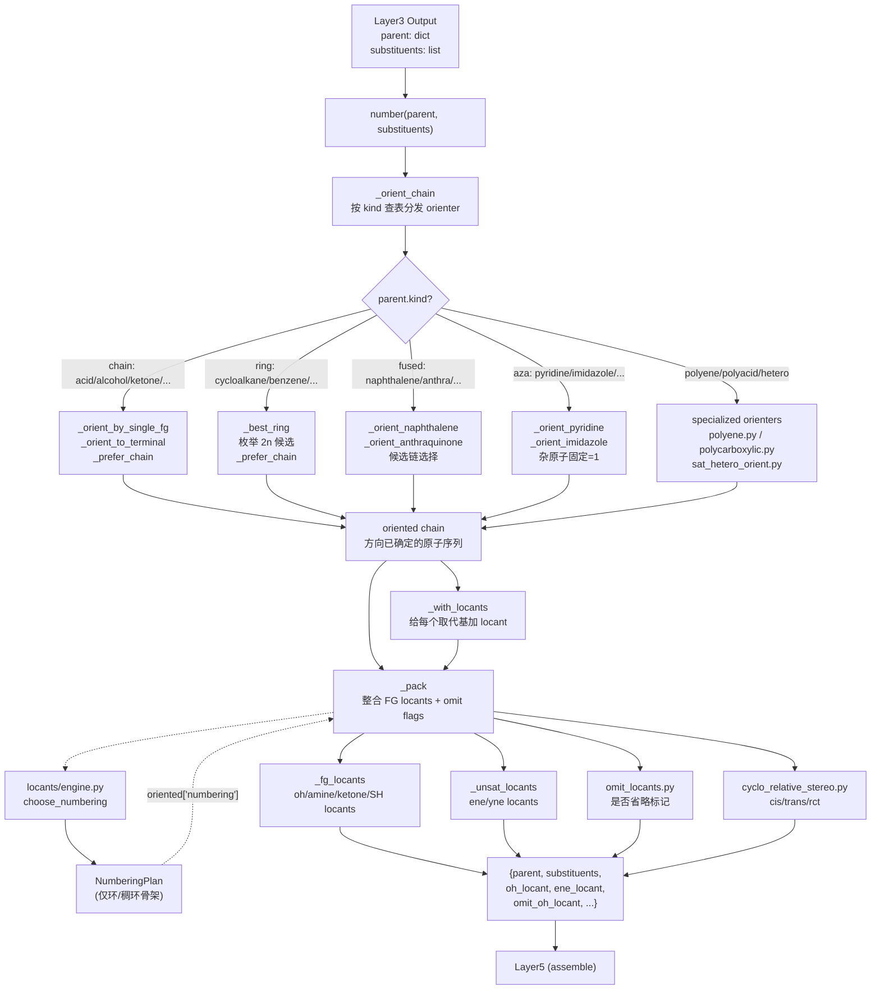

# Layer4: Numbering / Locants（编号与定位符）

> **位置:** `src/namepredict/layer4/` | **行数:** ~1500+ | **负责:** 给母体链/环原子和取代基附着点分配位次号

---

## 概述

Layer4 负责在 Layer3 完成母体选择与取代基提取之后，为母体骨架的每个原子分配 IUPAC 定位符（locant），并决定链/环的编号方向（orientation）。它接收 Layer3 的输出——一个包含母体骨架信息的 `parent` 字典和一个 `substituents` 列表——返回一个"已编号"的字典，其中：母体链的方向已经确定，每个取代基已经获得其附着点的 locant 数值，官能团（FG）和多重键的 locant 也已经计算好。

Layer4 是整个 6 层流水线中**最数学化**的一层：它的大量逻辑是组合优化问题——遍历环的所有旋转+翻转方向（最多 2n 个候选），按 IUPAC 蓝皮书 P-14 的优先级字典序选最优。同时它也是**模块化程度最高**的一层——链状和环状、碳环和杂环、单官能团和多官能团各有独立的 orienter 函数，通过 `_kind_orienters()` 字典统一调度。

**输入数据结构:**

- `parent: dict` — 包含 `chain`（原子序列）、`kind`（母体类型）、官能团键（如 `oh_c_idx`、`cooh_c_idx`、`double_bond`）、骨架编号事实（`numbering_scaffold`）等字段
- `substituents: list[dict]` — 每个元素含 `attach_idx`（附着原子）、`en`（英文名）等

**输出数据结构:**

```python
{
    "parent": { ...  # 带有 chain、kind、FG locants、unsat locants、编号事实的原 parent },
    "substituents": [
        {**s, "locant": 2},  # 每个取代基被附着了 locant
        ...
    ],
    "fg_locants": [          # 示例：principal FG 位次记录（稀疏）
        {"kind": "oh", "locants": [1], "omit": True},  # 如乙醇：省略 1-醇
    ],
    "ene_locant": 2,         # 示例：双键定位（扁平字段，独立于 fg_locants）
    ...
}
```

---

## 核心逻辑

### 编号方向决策（Chain Orientation）

链状母体的编号本质上是一个"从哪头开始编号"的问题。对于简单的饱和烷烃，规则是按取代基的"最低位次集"（lowest locant set）原则选择方向——先比较 locant 集合的字典序，再比较取代基英文名的字母序（stem-alpha 顺序）作为 tiebreaker。

`numbering.py` 使用一组称为"orienter"的函数来解决这个问题。每个官能团类别（alcohol、ketone、amine、acid、aldehyde、ester、amide、nitrile 等）有其专用的 orienter。核心模式是：

1. **末端官能团**（acid、aldehyde、ester、amide、nitrile、acyl halide）：直接强制 FG 所在原子为 1 号位（`_orient_to_terminal`）。
2. **非末端单官能团**（alcohol、ketone、amine、thiol）：先翻转链使 FG 获得较低位次，然后比较正反两个方向的取代基集，择优选。
3. **多官能团**（diol、diamine、dione）：选出使所有 FG 位次字典序最低的方向。
4. **含不饱和键的官能团**（alkenol、alkenedioic、polyene）：不饱和键的 locant 优先级通常高于取代基（按 P-31.1），先优化不饱和键位次，再优化 FG 位次。

> **源:** `src/namepredict/layer4/numbering.py:15-39`

### 环状母体的编号（Ring Numbering）

环状母体的编号远比链状复杂：不再只是"从哪头开始"的问题，而是"从哪个原子开始、顺时针还是逆时针"的问题。对于一个 n 元环，共有 **2n 个候选**（n 种旋转 x 2 个方向）。

`_orient_cycloalkane` 枚举所有 2n 个候选，按取代基最低位次集选出最优方向。对于带有固定官能团的环（如 pyridine 的 N=1，furan 的 O=1），官能团原子固定为 1 号位后只需在两种方向之间选择。对于带两个官能团的环（如 benzenediol），需要在所有 2n 个候选中找出使两个 OH 位次字典序最低的。

> **源:** `src/namepredict/layer4/numbering.py:136-145`

### 约束驱动编号引擎（Constraint-Based Numbering Engine）

`locants/engine.py` 中的 `choose_numbering` 是一个通用的环编号优化器，适用于需要通过多优先级约束选最优方向的复杂场景。它支持四种模式：

| 模式 | 优先级链 | 适用场景 |
|------|----------|----------|
| `carbocycle_free` | 取代基集 → 方向 stable | 普通取代环烷烃 |
| `poly_unsat` | 不饱和键集 → 取代基集 → stable | 环多烯（P-31.1） |
| `polyacid` | 羧基集 → 取代基集 → stable | 多元羧酸环 |
| `multi_hetero` | 杂原子集 → 元素优先级 → 取代基集 → stable | 饱和杂环 replacement naming |

每种模式定义了一条**优先级链（priority cascade）**，引擎按字典序比较各候选编号方案的约束键（constraint key），选出全局最优。

> **源:** `src/namepredict/layer4/locants/engine.py:58-75`

约束系统（`locants/constraints.py`）定义了 locant 集合的比较逻辑。关键实现细节：

- **杂原子元素优先级**（`_Z_RANK`）：O(8) > S(16) > Se(34) > Te(52) > N(7) > P(15)，遵循 IUPAC 蓝皮书的 a-order 约定。这意味着在含 O 和 N 的杂环中，O 优先获得较小的位次号。
- **桥头原子 locant**：使用一种内部约定——普通数字 `n` 映射为 `n*10`，`na` 为 `n*10+1`，使 `"3" < "3a" < "4"` 在数值比较中成立（`30 < 31 < 40`）。
- **环闭合检测**：`_bond_loc` 函数检测原子的环相邻性，处理末尾-开头回环的情况（1 和 n 相邻时使用 n 作为 locant，这是一个被 disfavor 的值）。

> **源:** `src/namepredict/layer4/locants/plan.py:7-13`
> **源:** `src/namepredict/layer4/locants/constraints.py:5-12`

### NumberingPlan 数据结构

`NumberingPlan` 是一个不可变的 `dataclass`，封装了一次编号决策的完整结果：

```python
@dataclass(frozen=True)
class NumberingPlan:
    scaffold_id: str           # 骨架标识（如 "anthracene"）
    atom_order: tuple[int, ...]  # 原子的编号顺序（链/环方向已定）
    labels: tuple[str, ...]     # locant 标签（如 "1","2","3a","4"...）
    atom_to_label: dict[int, str]  # 原子 → locant 映射
    label_to_atom: dict[str, int]  # locant → 原子映射
    sub_atoms: frozenset[int]   # 取代基附着原子集合
    constraints_applied: tuple[str, ...]  # 应用的约束类型名
```

> **源:** `src/namepredict/layer4/locants/plan.py:16-24`

### 稠环骨架编号（Fused Ring Numbering）

对于 naphthalene、anthracene/anthraquinone、indole 等稠环体系，编号不是简单枚举——IUPAC 对每个稠环骨架有固定的编号约定。layer4 通过两种机制处理：

1. **固定编号方向（Fixed Fused）**：indole、quinoline、benzofuran 等 20+ 种稠环母体使用 `_orient_indole`（即保持原样），因为这些骨架的编号在 Layer2 母体选择时已经由骨架事实（scaffold facts）确定。
2. **候选链选择**：naphthalene 提供多条可能的 atom chain（`naph_chains`），每条代表一种编号方向（如标准 IUPAC vs 替代方向）。`_orient_naphthalene` 对所有候选链计算取代基的 naphthalene 位次（1-8，其中 9/10 被排除），选出位次集最低的。

> **源:** `src/namepredict/layer4/numbering.py:282-297`

### 特殊结构的编号

**多烯（Polyene）**：`polyene.py` 处理含多个 C=C 双键的链状和环状体系。链状多烯按 P-31.1 优化不饱和键位次集；环状多烯通过 `choose_numbering` 的 `poly_unsat` 模式优化。`ene_locants` 函数计算所有双键的 min-endpoint locants。

> **源:** `src/namepredict/layer4/polyene.py:36-40`

**多元羧酸（Polycarboxylic acid）**：`polycarboxylic.py` 处理含不饱和键的多元羧酸。特殊之处在于：不饱和键的 locant 集优先于羧基 locant 集——先用不饱和键定位方向，再用羧基集微调。此外，该模块还负责组装最终的英文/中文词干（stem），并在有 E/Z 立体构型时生成前缀。

> **源:** `src/namepredict/layer4/polycarboxylic.py:21-27`

**von Baeyer 桥环**：`_orient_bridged` 实现桥环烷烃的编号：桥头（bridgehead）原子之一为 1，先遍历最长桥，到第二个桥头，再按桥长递减交替方向遍历其余桥。

> **源:** `src/namepredict/layer4/numbering.py:356-363`

**饱和杂环（Saturated Heterocycles）**：`sat_hetero_orient.py` 分三类处理——plain（单杂原子固定为 1）、carboxylic/lactone（杂原子=1 + 羧基附着 virtual sub 选方向）、replacement（多杂原子通过 `multi_hetero` 模式驱动 engine）。

**蒽醌（Anthraquinone）**：`anthra_orient.py` 使用特殊的位置映射表（`ANTHRA_LOCANTS`），将 14 个原子映射到标准蒽骨架编号 1-10（其中位置 9-10 和 12-14 为桥接原子，无标准号）。

### Locant 省略规则（Omit Locants）

当 locant 在上下文中是唯一可能（unambiguous）时，IUPAC 允许省略。`omit_locants.py` 实现了以下省略规则：

- **乙醇/乙胺类**（C1-C2 醇/胺/硫醇）：FG 在 1 位且碳数 <=2 时省略
- **环状单官能团**（cycloalcohol、cycloketone、cycloamine）：无取代基时 FG 默认在 1 位，省略
- **不饱和键**：3 碳以下时省略（如 propene 无需写 1-propene）
- **环己烯**：默认 C=C 在 1 位，省略
- **例外**：当环醇/环酮同时含有内环双键时，FG locant 不能省略（需要区分 FG 和 C=C 的位置）

> **源:** `src/namepredict/layer4/omit_locants.py:52-64`

### 相对立体化学（Relative Stereochemistry）

`cyclo_relative_stereo.py` 专为环烷烃多元羧酸设计。在编号确定后，模块读取立体化学面信息（`relative_stereo.faces`），按 locant 排序后生成 `cis/trans` 前缀（2 取代）或 `r/c/t` locant 字符串（3 取代）。

> **源:** `src/namepredict/layer4/cyclo_relative_stereo.py:16-23`

---

## 文件清单

| 文件 | 说明 |
|------|------|
| `__init__.py` | 导出 `number` 函数 |
| `numbering.py` | **核心调度**（~527 行）：40+ 个 orienter 函数、`_kind_orienters` 字典、`number()` 主入口 |
| `locants/__init__.py` | locants 子模块导出 |
| `locants/plan.py` | `NumberingPlan` 数据类、`locant`/`locant_int` 查找函数、`make_plan` 构造器 |
| `locants/engine.py` | `choose_numbering`：多模式约束驱动的环编号优化器 |
| `locants/constraints.py` | `constraint_key`：软约束字典序比较逻辑（杂原子 a-order、双键位次集、取代基集） |
| `locants/generate.py` | 候选编号生成：`ring_candidates`（旋转×翻转枚举）、`labels_for`（顺序标签） |
| `locants/adapt.py` | `plan_from_chain`/`plan_from_parent`：将 Layer2 的骨架事实适配为 `NumberingPlan` |
| `polyene.py` | 多烯编号方向、烯醇、烯二酸、环多烯、环烯烃的专用 orienter |
| `polycarboxylic.py` | 多元不饱和羧酸的编号方向 + 词干（stem）组装 |
| `anthra_orient.py` | 蒽/蒽醌的候选链选择与编号方向 |
| `sat_hetero_orient.py` | 饱和杂环的 plain/carboxylic/replacement 三类编号方向 |
| `cyclo_relative_stereo.py` | 环多元酸的相对立体化学前缀生成（cis/trans, r/c/t） |
| `omit_locants.py` | 官能团 locant 省略规则（单 FG 环、短链、环烯烃等） |

---

## 数据流图



---

## 对外接口

### `number(parent, substituents) -> dict`

**签名:**

```python
def number(parent: dict, substituents: list[dict]) -> dict:
```

**参数:**

- `parent` — Layer3 输出的母体字典，至少包含：
  - `chain: list[int]` — 母体原子 ID 序列
  - `kind: str` — 母体类型标识（如 `"alcohol"`、`"pyridine"`、`"naphthalene"`）
  - 可选：`oh_c_idx`、`cooh_c_idx`、`ketone_c_idx`、`double_bond`、`triple_bond`、`numbering_scaffold` 等 FG 与编号事实
- `substituents` — 取代基列表，每个元素含 `attach_idx`、`en` 等字段

**返回值:** 一个扁平字典，包含：

| 字段 | 类型 | 说明 |
|------|------|------|
| `parent` | `dict` | 增强版 parent（含 `chain`、`numbering` plan 及立体化学事实） |
| `substituents` | `list[dict]` | 每个元素增加了 `locant` 字段 |
| `fg_locants` | `list[dict]` | principal FG 位次记录（稀疏, 只含实际存在的 FG）: `[{kind, locants, omit}]` |
| `ene_locant` | `int\|None` | 双键位次 |
| `ene_locants` | `list[int]\|None` | 多双键位次集 |
| `omit_ene_locant` | `bool` | 是否省略烯键位次 |
| `yne_locant` | `int\|None` | 三键位次 |
| `omit_yne_locant` | `bool` | 是否省略炔键位次 |
| `stem_en` / `stem_zh` | `str` | polycarboxylic 专用：组装后的英/中词干 |
| `relative_stereo_prefix` | `str` | 相对立体化学前缀（`"cis"`/`"trans"`） |
| `relative_stereo_locants` | `str` | 3 取代 r/c/t locant 字符串 |

`fg_locants` 每项结构：`{"kind": "oh"|"amine"|"ketone"|"sh", "locants": [int, ...], "omit": bool}`。
- `kind` 来自 `principal_expression_facts.group_class` 映射；`locants` 由挂载原子经 chain/plan 换算（统一列表，单 FG 也是 `[x]`）；`omit` 由 `omit_locants.py` 规则算好。
- **稀疏**：只产实际存在的 FG；cooh 不产（单/多酸位次隐含，死字段清理）。
- 烯/炔位次独立为扁平字段，不进 `fg_locants`。

**调用方:** `src/namepredict/namer.py:106` 在 `_assemble_candidate` 中调用。

> **源:** `src/namepredict/layer4/numbering.py:519-526`

---

## 关键设计模式

### 字典驱动的策略模式

`_kind_orienters()` 构建一个约 90 项的 `kind -> orienter_fn` 字典，涵盖所有支持的母体类型。调度逻辑仅一行：

```python
fn = _kind_orienters().get(kind)
return _orient_alkane(chain, subs) if fn is None else fn(chain, parent, subs)
```

新增母体类型只需在对应类别的字典中追加一项，无需修改调度逻辑。

### 优先级传递（Priority Cascade）

整个 layer4 大量使用 **字典序比较** 来实现 IUPAC 的优先级级联规则。例如，`_orient_key` 先比较 locant 集、再比较 stem-alpha 对；多个 orienter 之间通过 `_prefer_chain(a, b, subs)` 统一汇总。`constraint_key` 按 mode 组装不同的优先级链。这种模式精确映射了 IUPAC 蓝皮书的"逐级决断"（stepwise decision）原则。

### 骨架事实注入（Scaffold Facts Injection）

对于编号不遵循简单链/环规则的稠环骨架，Layer2 在母体选择时将编号事实（`numbering_scaffold`）注入 parent 字典。Layer4 通过 `plan_from_chain` → `plan_from_parent` 适配这些事实为 `NumberingPlan`，然后在 locant 映射中使用 `effective_sub_locant` 替代简单的 `chain.index() + 1`。

> **源:** `src/namepredict/layer4/locants/adapt.py:35-42`

---

## 相关页面

- [[architecture/overview]] — 6 层架构总览
- [[architecture/layer3-substituents]] — Layer3：母体选择与取代基提取（Layer4 的输入来源）
- [[architecture/layer5-name-assembly]] — Layer5：名称组装（Layer4 的输出消费方）
- [[concepts/iupac-rules]] — IUPAC 蓝皮书规则映射（P-14、P-25、P-31 编号规则）
- [[concepts/functional-groups]] — 官能团分类与优先级表（影响编号优先级）
- [[concepts/parent-selection]] — 母体选择规则（影响 skeleton kind 分发）
