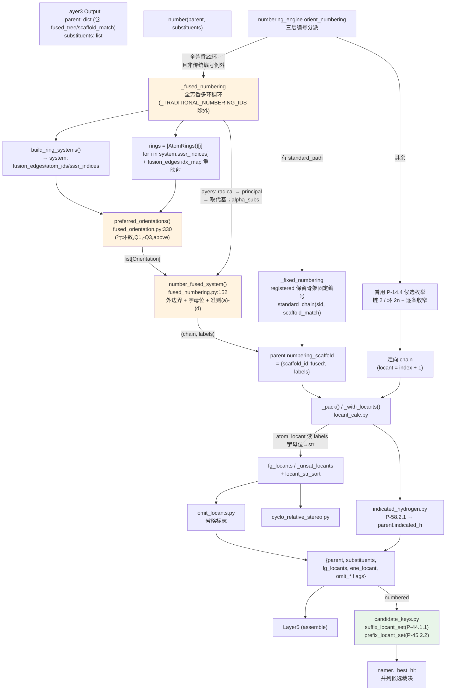

# Layer4: Numbering / Locants（编号与定位符）

> **位置:** `src/namepredict/layer4/` | **行数:** 13 个 `.py` (1685 行) | **最后更新:** 2026-09-09 | **负责:** 按 P-14.4 给母体链/环原子分配位次号、决定编号方向、计算 FG/不饱和键定位符与省略规则；稠环（fused-ring）编号走几何摆放 + 外围骨架通道；指示氢位次（P-58.2.1）与并列候选母体比较键（P-44.1.1 / P-45.2.2）

---

## 概述

Layer4 在 Layer3 完成母体选择与取代基提取之后，为母体骨架的每个原子分配 IUPAC 定位符（locant），并决定链/环的编号方向（orientation）。它接收 Layer3 的输出——一个包含母体骨架信息的 `parent` 字典和一个 `substituents` 列表——返回一个"已编号"的字典：母体链的方向已确定，每个取代基已获得其附着点的 locant 数值，官能团（FG）和多重键的 locant 也已计算好。

Layer4 由 13 个模块组成，统一由 `numbering_engine.orient_numbering`（`numbering_engine.py:293`）作为**编号方向总调度器**。它按优先级分派三条路径：

1. **`_fixed_numbering`**（`:209`）— registered 保留骨架（模板有 `standard_path`，如喹啉/萘/菲/芘）走固定编号：`scaffold_match` + `_STANDARD_ORDERS` 把模板原子映射为标准 locant 序，`standard_chain` 产出固定链。
2. **`_fused_numbering`**（`:238`）— 全芳香多环（≥2 环）走稠环几何/编号通道；`scaffold_id` 落在 `_TRADITIONAL_NUMBERING_IDS`（`:6`，anthracene/phenanthrene/acridine/carbazole/purine）时按 P-25.3.3 传统编号，不接管。
3. **普用 P-14.4 候选枚举**（`:293` 起）— 以上均不满足时（单环、非芳香、开链）枚举候选编号逐条收窄。

位次不一律 `chain.index+1`：稠环/固定编号下 locant 可为**数字+字母混合**（`"4a"` 型融合桥头位）。`numbering.py` 在组装完成后追加 `parent["indicated_h"]`（P-58.2.1 指示氢前缀）；`candidate_keys.py` 以 `_principal_atoms` 与取代基位次集合生成 namer 的并列候选裁决键（P-44.1.1 / P-45.2.2）。

**输入数据结构:**

- `parent: dict` — 包含 `chain`（原子序列）、`kind`（母体类型）、官能团键（如 `oh_c_idx`、`cooh_c_idx`、`double_bond`）、骨架编号事实（`numbering_scaffold`）、principal 表达事实（`principal_expression_facts`）、`principal_attachment_atoms`（principal 特征基团在母体骨架上的附着原子，供稠环镜像平局收窄）等字段；未注册稠环额外携带 `fused_tree`（FusedNode，L2 拆解）与 `scaffold_match`（模板→分子原子映射）
- `substituents: list[dict]` — 每个元素含 `attach_idx`（附着原子）、`en`（英文名）等

**输出数据结构:**

```python
{
    "parent": { ..., "numbering_scaffold": {"scaffold_id": "fused", "labels": ["1",...,"4a",...]},
                "indicated_h": "1H-" },
    "substituents": [ {**s, "locant": 2}, ... ],
    "fg_locants": [ {"kind": "oh", "locants": [1], "omit": True}, ... ],
    "ene_locant": 2,
    ...
}
```

`labels`（`numbering_scaffold["labels"]`）为稠环/固定编号的并行 locant 标签串（含 `"4a"` 字母位），与 `chain` 同位。`indicated_h` 为可直接前置到母体名的指示氢前缀（如 `"1H-"`、`"1H,2H-"`），无指示氢时为空串。

---

## 核心逻辑

### 入口调度 (`number`)

`numbering.py` 是 Layer4 的唯一对外入口（24 行），流程极短：

1. `orient_numbering(parent, substituents)` — 计算定向后的原子顺序（chain）
2. 校验 `numbering_scaffold_required`（保留 scaffold 必须有 L2 注入的 `numbering_scaffold` 事实，缺失抛错）
3. `_with_locants(chain, subs, ...)` + `_pack(...)` — 给每个取代基注入 locant，整合 FG/不饱和键位次与立体化学事实
4. `indicated_hydrogen_prefix(mol, chain, labels)`（`:20`）→ 写入 `parent["indicated_h"]`：以整体编号 labels 为位次基准算指示氢前缀（P-58.2.1），由 L5 `assembler._ensure_fused_stem` 拼到稠合词干最前端（`assembler.py:363`）

> **源:** `src/namepredict/layer4/numbering.py`

### 编号方向总调度 (`numbering_engine.orient_numbering`)

`orient_numbering`（`numbering_engine.py:293`）是三层编号分派器，`_fused_numbering` 只在无保留模板固定编号且非 P-25.3.3 传统编号例外骨架的全芳香多环时接管，已注册模板/单环/非芳香环全部回落 P-14.4 通用枚举（避免萘/喹啉被通用枚举算错）：

```
orient_numbering(parent, substituents)
  ├─ 1. _fixed_numbering(:209)   # registered 保留骨架固定编号 → 非空则返回
  ├─ 2. _fused_numbering(:238)   # 全芳香多环稠环（传统编号例外除外）→ 非空则返回
  └─ 3. 普用 P-14.4 枚举(:293)   # 链正反 / 环 2n 候选 + 逐条收窄
```

**`_fixed_numbering`**（`:209`，P-14.4(a)）— 用 `scaffold_id` 查模板 Mol（`_Q`），`mol.GetSubstructMatches(q)` 找子图匹配并筛出 `set(m)==原子集`；再 `standard_chain(sid, tuple(m))` 投射标准 locant 序的分子链。对称 scaffold（菲/芘）多自同构匹配时生成等价链，按取代基位次最小化（`:230-235`）；取代基位次最小化列表现含自由基连接点 `radical_c_idx`（`:231`），使对称 scaffold（如咔唑）的自由价镜像取 locant 1 而非 8。

**`_fused_numbering`**（`:238`）— 稠环主链整体编号，签名 `_fused_numbering(parent, chain, substituents=None)`：
- 护栏（`:241-243`）：`scaffold_id ∈ _TRADITIONAL_NUMBERING_IDS`（`:6`）时返回 `None`，不进入稠环几何通道（这些骨架由 registered 固定编号承担）；全芳香多环 + `len(sssr) ≥ 2`（`:254-256`）才接管
- `build_ring_systems(mol)` 过滤出 `atom_ids == sorted(set(chain))` 的系统（`:250`）
- **rings 取稠合系统自身环并同步重映射 fusion_edges**（`:257-261`）——全分子 AtomRings 会把取代基上的无关环也算进 layout，orientation 必失败而退回通用单环枚举把桥头碳当普通数字位次（chebi-300 thieno 甲基 6,7 应 5,6）；`rings` 过滤后索引重排，故 `fusion_edges` 的 SSSR 索引经 `idx_map` 重映射，否则 `horizontal_rows` KeyError 退化成只命名侧链
- **环外附着原子分层**（`:265-277`）——纯碳环上准则 (a)-(d) 全平局，按优先级构造 `layers` 逐层做位次集合最小化收窄镜像取向：自由基连接点 `radical_c_idx`（P-29）→ `principal_attachment_atoms`（P-14.4(c)）→ 取代基 `attach_idx` 集合（P-14.4(f)）
- **字母序平局键**（`:278-280`）——`alpha_subs = [(alkyl_alpha_key(en), attach_idx)]`，位次集合仍相同时按 P-14.5 把最低位次给字母序最前取代基
- `preferred_orientations(mol, rings, fusion_edges)` → `number_fused_system(mol, rings, [o.coord_dict()...], layers, alpha_subs)`（`:262`、`:281`）
- 写回 `parent["numbering_scaffold"] = {"scaffold_id":"fused", "labels":..., "relative_stereo":None}`（`:285-287`），返回 `fused_chain`

### 普用 P-14.4 候选编号引擎

非稠环路径（`numbering_engine.py:293-337`）实现 **P-14.4 规则管线**（无 kind 派发 orienter）。核心思路：枚举候选编号 → 逐条 P-14.4 规则收窄 → 单候选存活时提前终止。**入口先按杂环 / 碳环-链分岔**：

```
普用路径
  ├─ _is_ring(parent) → _ring_cands (环 2n) / _chain_cands (链 2 个)
  ├─ 杂环: _narrow_hetero_ring 元素序窄化（P-22.2.2.1.3 先行于 principal）
  │        (a)全杂原子集最低位次 → (b) 按 F>…>O>S>…>N 逐元素收窄 → (c) 同元素 N 带 H/3 价者得低位
  ├─ 碳环/链: _fixed_start（P-14.4(a) FG 锚/自由基字段，_FIXED_START_KEYS 含 acyl_c_idx）强制 locant 1
  │           若固定原子无法置 1（链中部自由基/锚点）→ 不保留链序，并入 principal 竞争最低位次
  ├─ P-14.4(c)：principal characteristic group → 最低位次集收窄
  ├─ P-14.4(e)：多重键 → 最低位次集收窄（双键优先）
  ├─ P-14.4(f)：取代基 → 最低位次集收窄 → 平局 _stem_loc_pairs（P-14.5）
  └─ P-14.4(j)：立体平局 _rs_locant_key（R/M/r 位次在前，S/P/s 在后）→ _to_chain
```

- **杂环元素序窄化**（`_narrow_hetero_ring`，`numbering_engine.py:187`）— P-22.2.2.1.3 / P-25.3.3.1.2(b)：先于 principal 收窄，保证唑类 N 必须 1,3/1,2、吡啶甲酸 N=1 后由 principal 定方向；**不走 FG 锚点/自由基字段**，避免醛基环碳抢占 locant 1。同元素 N 带 H/3 价取代者得低位（唑 NH=1）；`float_hetero`（稠合组分）跳过 (c)，镜像方向留共享原子位次最小化定。
- **固定起点失败回退**（`anchor_as_principal`，`numbering_engine.py:305-317`）— 固定 locant 1 原子在链候选中不可能为 1（链中部自由基/锚点）时，**放弃链序约束**（否则自由价/双键/取代基位次全不最小化、编号随上游原子序漂移），回退全候选并把该原子并入 P-14.4(c) principal 竞争最低位次。
- **P-14.4(j) 立体平局破**（`numbering_engine.py:333-336`）— (f) 后镜像/反向等价编号仍等优时，按 CIP 立体描述符定方向：`_assign_cip_for_numbering`（`:87`，隐式 H 手性碳先补显式 H，与 L5 stereo 同一赋值）→ `_chain_rs_codes`（`:107`）取链原子 `_CIPCode` → `_rs_locant_key`（`:120`）把 R/M/r 描述符的较低位次置于 S/P/s 前（P-91.2），避免内消旋环 1R/7S vs 1S/7R 随输入原子序漂移。

> **P-14.4(e) 多重键 seam 感知判据（`_bond_locants`，`numbering_engine.py:47`）**：比较多重键"最低位次"时，对**每条多重键**沿编号方向求一个"边位置"数——两端点在编号顺序 order（locant 升序）中相邻 → 记 `ia+1`（`ia` 为较小端序号）；跨编号首尾的闭合 seam 边（`ia==0 and ib==n-1`）→ 记 `n`；端点不沿编号相邻 → 判据不适用返回 None。随后以 `(全部多重键元组, 双键元组)` 双层收窄（双键优先，`_bond_locants` 返回值经排序供比较）。该判据迫使每条多重键占据其沿编号方向的边位，让整条不饱和键落到最低连续位置（如环己二烯 1,3-双键整体起于 locant 1），避免环候选绕行时把闭合键一端误判成 locant 1。
>
> **源:** `src/namepredict/layer4/numbering_engine.py:293`

### 稠环几何摆放（`fused_orientation.py`）

`fused_orientation.py`（366 行）实现 **P-25.3.2.3 优选取向**——把稠环系"水平行摆放"到平面坐标，按 IUPAC 环计数法离散计数四象限/上方环数，按优选取向准则挑出**平局候选列表**（它只解决"怎么摆/摆哪"，不做编号）。行内中间奇数环（双侧融合）由变形环模板支撑，见下文两段。

核心数据结构 `Orientation`（`fused_orientation.py:22`，frozen dataclass）：

```python
@dataclass(frozen=True)
class Orientation:
    row: tuple[int, ...]                 # 水平行环索引（左→右）
    coords: tuple[(atom, x, y), ...]     # 原子坐标（可哈希）
    quad: tuple[float, float, float, float]  # Q1右上/Q2左上/Q3左下/Q4右下 环计数（IUPAC，被轴平分计 1/4 或 1/2）
    above: float                         # 水平轴上方环数（被轴平分计 1/2）
    def coord_dict(self) -> {atom:(x,y)}  # 供 number_fused_system 使用
```

优选取向（`preferred_orientations`，`:330`）：对每个 `(row, flip)` 摆位算 `key = (len(row), round(q1,9), round(-q3,9), round(above,9))`，**最大化**（`:354`）——即优先级：**① 水平行环数最多 → ② Q1右上环数最多 → ③ Q3左下环数最少 → ④ 水平轴上方环数最多**。镜像/左右对称环系各 key 相同 → 全部返回为平局候选，交由编号阶段准则(a)-(d) 跨候选收窄（否则编号依赖遍历顺序不稳定）。

四象限/上方按 **IUPAC 环计数法**（P-25.3.2.3.3 准则(b)(c)(d)）由 `_quadrant_fractions`（`:316`）逐环离散计数：原点取水平行中心（`_row_center`，`:265`——偶数环数取中心共同键中点、奇数取中心环中心），经 `_ring_quadrant_contrib`（`:278`）/`_above_contrib`（`:308`）累加——被两轴平分计 1/4、被单轴平分两侧各 1/2、完全在一侧计整环；round 只消浮点尾差。

行内中间奇数环双侧融合（**P-25.3.2.3.2 变形环**，如 6-5-6 线性行）：`_layout`（`:138`）对中间奇数环双侧均有稠合边时用 `ring_shape_template` 构造变形五/七元模板，构造不出才弃行，返回 `(coords, ring_templates)`（ring idx→实际模板）。`_place_ring`（`:90`）支持 template（`side<0` 用镜像模板，保持共享边两端点不动并把镜像模板回传作为 `_ring_deform` 基准）；邻环递归摆放 `_place_neighbor`（`:198`）用集合成员关系确定邻环索引并按共享环对侧选边；`_ring_deform`（`:224`）相对各环实际模板测最大偏差——变形环对 Kabsch 旋转方向敏感，补试镜像 x 覆盖两手性；`_valid_deform_overlap`（`:243`）以各环模板为基准做刚体偏差 + 重叠检查。

> **源:** `src/namepredict/layer4/fused_orientation.py:330`

### 稠环编号（`fused_numbering.py`）

`fused_numbering.py`（196 行）实现 **P-25.3.3 稠环编号**——在已摆好坐标的稠环系上生成**外围骨架编号**（数字）+ **稠合碳字母位次**（a/b/c），并按准则(a)-(d) 收敛到唯一编号。

核心函数 `number_fused_system(mol, rings, coords, sub_layers=None, alpha_subs=None)`（`:152`）：
- 输入 `coords` 既可为单个坐标 dict，也可为优选取向平局列表 `list[dict]`；遍历每个候选坐标枚举全部 `(chain, labels)`。
- `sub_layers` 为按优先级排列的环外附着原子组，`alpha_subs` 为 `[(字母序键, 附着原子)]`；二者在 (a)-(d) 之后继续收窄（见下）。
- 返回 `(chain: list[int], labels: list[str])`（chain=外周/稠合原子顺序，labels=对应 locant 串含 `"4a"` 字母位），无候选返回 `None`。

关键内部：
- `fused_atoms(rings)`（`:24`）— 出现在 ≥2 环的原子（稠合原子）集合
- `_candidates(mol, rings, coords, fused)`（`:123`）— P-25.3.3.1.1 全部编号候选：最上端环（`_top_rings`，环心 cy 最大→cx 最大）× 最上端非稠合原子（`_top_atoms`）起点；最上端环无候选时沿相邻环兜底
- `_boundary_walk`（`:74`）— 沿外部边行走外边界（鞋带面积转顺时针），`_exterior_edges`（`:64`）取只属一环的外部边
- `_assign_labels`（`:99`）— 非稠合原子/稠合杂原子→下一个数字；稠合碳→紧邻前数字 + `a/b/c` 递增
- 准则收缩 `_keep(cands, atoms)`（`:167`）— 保留"该原子集 locant 位次集最小"的候选，依次：(a) 杂原子集合低位（`:172-173`）→ (b) 按 `_P145_SENIOR` 逐元素（`:178-180`）→ (c) 稠合碳低位（`:181-182`）→ (d) 稠合杂原子低位（`:183-184`）
- **环外附着原子分层收窄**（`:184-188`）— (a)-(d) 后仍并列时，对 `sub_layers` 逐层 `_keep` 位次集合最小化；纯碳环上 (a)-(d) 全平局，镜像取向由此定，否则编号方向随候选枚举顺序漂移
- **字母序平局键**（`:189-195`）— 位次集合仍相同则按 P-14.5 取 `min(_alpha_key)`：`[(取代基字母序键, 其位次键)]` 排序元组最小者，把最低位次给字母序最前的取代基；最终 `cands[0]`

> **源:** `src/namepredict/layer4/fused_numbering.py:152`

### 平面几何原语（`ring_geometry.py`）

`ring_geometry.py`（148 行）提供稠环摆放到平面所需的自建正 n 边形/变形环模板坐标与几何原语（**不含编号逻辑**）：

- `regular_polygon(n, *, right_edge_vertical=True)`（`:11`）— 单位圆内接正 n 边形，奇偶环边/尖点模板不同（奇数环 2 模板）
- `RING_TEMPLATES`（`:20`）— `{n: regular_polygon(n) for n in range(3,20)}`，3-19 元环模板
- `ring_shape_template(order, exit_idx, row_width=_ROW_WIDTH)`（`:30`）— **P-25.3.2.3.2 变形环模板**：让奇数环在水平行中间也能以两侧竖直边稠合；仅 n=5 & `exit_idx==2`、n=7 & `exit_idx∈(2,3)` 可构造，否则 None
- `_ROW_WIDTH = sqrt(3)`（`:27`）— 行宽：行首正六边形（边长 1）对边距，使变形五/七元环左右共享竖边与邻环衔接
- `ring_cyclic`（`:59`）/ `centroid`（`:68`）/ `apply_rigid`（`:74`）/ `rigid_fit`（`:81`，Kabsch 2D 刚体+缩放，h12 符号修正定最优旋转方向）/ `clip_polygon`（`:117`，Sutherland–Hodgman）/ `polygon_area`（`:138`）/ `overlap_area`（`:146`）
- 阈值：`DEFORM_MAX = 0.30`（`:7`，单原子最大偏差/环边长上限）、`OVERLAP_FRAC = 0.05`（`:8`，重叠面积/较小环面积上限）

> **源:** `src/namepredict/layer4/ring_geometry.py`

### Locant 排序键（`locant_key.py`）

稠环编号引入 `"4a"` 这类**数字+字母**混合 locant 后，普通数值 `sorted` 会错序（如 `"10"` 排在 `"4"` 前、`"4a"` 与 `"4"` 混排）。`locant_key.py`（15 行）定义统一可比较键：

- `locant_key(x)`（`:7`）— `"4a" → (4, 'a')`、`"10" → (10, '')`、`4 → (4, '')`，保证 `"4" < "4a" < "5" < "10"`
- `locant_str_sort(locs)`（`:13`）— 按 `locant_key` 排序（兼容 int 与 `"4a"` 混合）

被 `locant_calc._typed_atom_locants`（`locant_calc.py:34`）与 `_fg_locants`（`locant_calc.py:316`）及 `fused_numbering._locant_tuples`（`fused_numbering.py:145`）使用；`candidate_keys.py` 的两个位次集合键亦以它排序。

> **源:** `src/namepredict/layer4/locant_key.py`

### 并列候选母体比较键（`candidate_keys.py`）

`candidate_keys.py`（25 行）为 namer 的并列候选裁决提供两个位次集合键（P-44/P-45 的 L4 侧投影），两键均**升序、保留重复**（P-14.3.5，重复位次参与比较）：

- `suffix_locant_set(numbered)`（`:7`）— **P-44.1.1**：principal 特征基团（后缀）附着原子的位次集合。经 `_principal_atoms(parent)` 取原子，按 `chain.index` 定位，labels 长度与 chain 一致时取 `labels[i]`（含 `"4a"` 字母位），否则回退 `i+1`
- `prefix_locant_set(numbered)`（`:22`）— **P-45.2.2**：以前缀引用的取代基位次集合，取 `numbered["substituents"]` 中 `locant is not None` 者；无位次前缀（如 N- 取代基）不入键

两函数均为纯读取，不修改编号结果；消费方见 [[architecture/layer5-name-assembly]] 的候选裁决与 [[architecture/overview]] 的 `_best_hit`。

> **源:** `src/namepredict/layer4/candidate_keys.py`

### 稠合组分编号 (`fused_component_numbering`)

`numbering_engine.py:353` 的 `fused_component_numbering(mol, scaffold_id, sub_rings, shared=None, sub_edges=None)` 供 L5 `fused_namer` 组装稠合名时对**每个稠合组分单独编号**（P-25.4/P-25.3.3），返回 `(chain, labels)` 或 `(None, None)`：

- 单环或 `scaffold_id ∈ _STANDARD_ORDERS`（已登记固定编号）：单环直接 `(ring, [str(i+1)])`，否则构造 `parent` 走 `orient_numbering(parent, subs, float_hetero=bool(shared))`，labels 用 `_component_labels`——`float_hetero` 使 `_narrow_hetero_ring` 跳过 (c)（`numbering_engine.py:187`，对称等价杂环如嘧啶双 N 经元素序窄化后保留两镜像方向），locant 1 交由稠合原子位次最小化决定，使碱环取向与规范稠合描述符字母（d 侧）一致
- 多环无固定编号：`preferred_orientations(mol, sub_rings, sub_edges)` → `number_fused_system(mol, sub_rings, [o.coord_dict()...])` → `(result[0], result[1])`

**组分编号 vs 整体系统编号的区别**：整体系统（`_fused_numbering`）对整条 parent 骨架原子用系统自身 `rings`（sssr_indices 子集）+`fusion_edges` 编号，产物作为 parent 的 `numbering_scaffold`；组分编号针对**某个稠合组合的子环集** `sub_rings`，其稠合点（`fused_shared`）被当作取代基做位次最小化——用于 L5 把大母体拆成"基底稠合名 + 附加稠合片段"逐片段编号。

### `_component_labels` (labels 并行生成)

`orient_numbering` 只返回 `chain`，`_component_labels`（`:340`）补并行 `labels`：优先 `numbering_scaffold["labels"]`，其次 `_STANDARD_LABELS`，否则纯数字 `[str(i+1)]`。

### FG 定位符计算 (`locant_calc.py`)

`locant_calc.py`（339 行）从定向后的 chain + labels 计算各类位次。数据驱动核心是 `_LOCANT_FNS`（`locant_calc.py:298`，kind→位次函数）+ 其 `_FG_LOCANTS` 投影（`:311`，仅保留 FG_SPECS 登记的 locant_kind），产出稀疏的 `fg_locants` 列表：

| 记录 kind | 取值函数 | 说明 |
|---|---|---|
| `oh` | `_oh_locants` | alcohol 的挂载原子位次（`_typed_group_atoms`），回退 `oh_c_idxs` |
| `amine` | `_amine_fg_locants` | amine/sec_amine/tert_amine |
| `ketone` | `_ketone_fg_locants` | ketone/dione |
| `sh` | `_sh_locants_list` | thiol |
| `aldehyde` | `_aldehyde_fg_locants` | 外环 -CHO（-carbaldehyde 单/多通用）环上附着原子位次；开链醛（in_skeleton）不计数 |
| `acyl` | `_acyl_locants` | 开链酰基头碳 `acyl_c_idx`（P-65.1.7.2 酸碳恒 locant 1）；exocyclic 环酰基（furan-2-carbonyl 的 2）回退环附着原子 `ring_attach_idx` |
| `acid` | `_acid_fg_locants` | 多羧酸（multiplicity≥2）取全部附着原子位次（走 `_typed_atom_locants`），单酸回退环上 `ring_attach_idx` |
| `amide` | `_amide_fg_locants` | exocyclic 酰胺取环上附着原子位次（羰基碳在环外） |
| `ester` | `_ester_fg_locants` | exocyclic 酯的环上附着原子位次 |
| `nitrile` | `_nitrile_fg_locants` | exocyclic 腈的环上附着原子位次 |

**位次来源经 `_atom_locant`**（`locant_calc.py:15`，支持 labels 分支）：`labels` 存在且长度等于 `chain` 时，取 `labels[chain.index(atom)]`——数字标签转 `int`，字母位（`"4a"`）返回 `str` 原样；否则回退 `chain.index(atom)+1`。排序统一经 `locant_str_sort`（`locant_key.py:13`）。

> **源:** `src/namepredict/layer4/locant_calc.py:311` `_FG_LOCANTS`

### Locant 省略规则（Omit Locants）

`omit_locants.py`（66 行）实现 IUPAC P-14.3.4 与环单 FG 的省略规则。**环状单环判断基于 `scaffold_id=="carbocycle"` 且无 `fused_tree`**（未注册全碳稠环 scaffold_id 亦为 carbocycle，但有 `fused_tree` 时不作单环环烷烃——位次省略/环烯规则由 L5 `fused_namer` 按稠合名处理）。

- **环单醇/单胺/单酮**（`_is_cyclo(parent)`，`:5`）：无取代基时省略位次（P-14.3.4）；含内环双键时保留位次
- **乙醇/乙胺/硫醇**（C1-C2）：FG 在 1 位且碳数 <=2 时省略
- **不饱和键**：3 碳以下省略
- **纯烃环单烯**（`kind=="alkane"` + `scaffold_id=="carbocycle"`）：位次隐含省略；环多烯保留位次

> **源:** `src/namepredict/layer4/omit_locants.py`

### 指示氢位次（`indicated_hydrogen.py`）

`indicated_hydrogen.py`（49 行）实现 **P-58.2.1 指示氢（indicated hydrogen）**——mancude 环系中仅以单键连接相邻环原子的饱和环位须标 `H`，其位次即该环位在整体编号下的 locant：

- `saturated_ring_atoms(mol, ring_atoms)`（`:7`）— 返回环系内的饱和环位候选：先过滤 `IsInRing()` 且**全环原子均芳香**（`:12`，P-58.2.1 指示氢只标 mancude 环系；含 sp3 环位的环系由 `hydro` 前缀或保留名承载，否则每个饱和碳都会被标 H），再 `Chem.Kekulize` 后取 `GetTotalNumHs() > 0` 且环内键全为单键者
- `indicated_hydrogen(mol, chain, labels=None)`（`:30`）— 输出标签列表（如 `['1H']`、`['9H']`）：位次取整体编号 `labels`（长度须等于 chain），缺失时回退 `chain.index+1`；**互变异构冗余护栏**（`:37`）——饱和位全为氮且多于一个时只保留最低位次（亚胺-胺式 SMILES 会让咪唑环出现两个 `[nH]`，标准形式如 `1H-imidazo[4,5-c]pyridine` 只标一个）
- `indicated_hydrogen_prefix(mol, chain, labels=None)`（`:46`）— 拼成可直接前置母体名的前缀 `"1H-"` / `"1H,2H-"`，无则空串

`numbering.number` 在 `_pack` 之后调用它写入 `parent["indicated_h"]`（`numbering.py:20`），L5 `assembler._ensure_fused_stem` 在组装稠合词干时拼到最前端（`assembler.py:363`）。

> **源:** `src/namepredict/layer4/indicated_hydrogen.py:30`

### 相对立体化学（Relative Stereochemistry）

`cyclo_relative_stereo.py`（26 行）专为环多元羧酸设计。对 `acid` + `scaffold_id=="carbocycle"`（无 `cycloalkane_polycarboxylic` 组合 kind），在编号确定后读取 `relative_stereo.faces`，按 locant 排序生成 `cis/trans` 前缀（2 取代）或 `r/c/t` locant 字符串（3 取代）。依赖 `oriented["numbering"]`（NumberingPlan）；`numbering.py` 不注入该字段（plan 恒为 None），故该路径不产出结果。

> **源:** `src/namepredict/layer4/cyclo_relative_stereo.py`

---

## 文件清单

| 文件 | 行数 | 说明 |
|---|---|---|
| `__init__.py` | 6 | 导出 `number` 函数 |
| `numbering.py` | 24 | **入口**：`number()` 调用 `orient_numbering` + `_with_locants` + `_pack`，并写入 `indicated_h` |
| `numbering_engine.py` | 377 | **编号方向总调度**：`orient_numbering` 三层分派（`_fixed_numbering`/`_fused_numbering`/P-14.4 枚举）+ `_TRADITIONAL_NUMBERING_IDS` 传统编号例外 + `_bond_locants`(P-14.4(e) seam)/`_narrow_hetero_ring`(元素序窄化/float_hetero)/`_rs_locant_key`(P-14.4(j) 立体平局) + `fused_component_numbering`/`_component_labels` |
| `fused_orientation.py` | 366 | **稠环几何摆放**：`preferred_orientations`（P-25.3.2.3 优选取向：水平行 + 变形环模板 + IUPAC 环计数），`Orientation` 结构 |
| `fused_numbering.py` | 196 | **稠环编号**：`number_fused_system`（P-25.3.3 外围骨架 + 字母位 + 准则(a)-(d) + `sub_layers` 分层 / `alpha_subs` P-14.5 平局键），`fused_atoms`/`_boundary_walk`/`_assign_labels` |
| `candidate_keys.py` | 25 | **并列候选比较键**：`suffix_locant_set`(P-44.1.1)/`prefix_locant_set`(P-45.2.2) |
| `indicated_hydrogen.py` | 49 | **指示氢**（P-58.2.1）：`saturated_ring_atoms`/`indicated_hydrogen`/`indicated_hydrogen_prefix` |
| `ring_geometry.py` | 148 | 平面几何原语：`regular_polygon`/`RING_TEMPLATES`(3-19)/`ring_shape_template`(变形环)/`rigid_fit`(Kabsch)/`clip_polygon`/`overlap_area` |
| `locant_key.py` | 15 | locant 统一排序键：`locant_key`/`locant_str_sort`（数字+字母混合） |
| `locant_calc.py` | 339 | **FG 位次计算**：`_fg_locants`/`_with_locants`/`_pack`，`_LOCANT_FNS` 表（含 acyl/aldehyde/amide/ester/nitrile；多羧酸多位次）+ `_atom_locant` labels 分支 + `locant_str_sort` |
| `_chain_orient.py` | 48 | 共享方向原语：`_chain_pos`/`_edge_min_locant`/`_bond_min_locs`/`_pair_locants`/`_stem_loc_pairs` |
| `omit_locants.py` | 66 | FG/不饱和键位次省略规则（按 scaffold_id 判单环，排除 fused_tree） |
| `cyclo_relative_stereo.py` | 26 | 环多元酸的相对立体化学前缀（cis/trans, r/c/t） |

> 备注：layer4 共 13 模块。无 `orienters.py`/`polyene.py`/`locants/` 子包，无 `NumberingPlan` 概念——`_fixed_numbering` 为真实固定编号；杂环 locant-1 由 `_narrow_hetero_ring` 元素序窄化决定；P-25.3.3 传统编号例外骨架列于 `_TRADITIONAL_NUMBERING_IDS`。

---

## 数据流图



---

## 对外接口

### `number(parent, substituents) -> dict`

**签名:**

```python
def number(parent: dict, substituents: list[dict]) -> dict:
```

**参数:**

- `parent` — Layer3 输出的母体字典，至少包含：
  - `chain: list[int]` — 母体原子 ID 序列
  - `kind: str` — 母体类型标识
  - 可选：`oh_c_idx`/`ketone_c_idx`/`double_bond`/`triple_bond`、`principal_expression_facts`（FG 类别与附着原子）、`numbering_scaffold`/`numbering_scaffold_required`（保留 scaffold 编号事实）、`scaffold_id`、`scaffold_match`/`fused_tree`（稠环）
- `substituents` — 取代基列表，每个元素含 `attach_idx`、`en` 等字段

**返回值:** 一个扁平字典，包含：

| 字段 | 类型 | 说明 |
|------|------|------|
| `parent` | `dict` | 增强版 parent（含定向 `chain` 及立体化学事实、`numbering_scaffold` labels） |
| `substituents` | `list[dict]` | 每个元素增加了 `locant` 字段 |
| `fg_locants` | `list[dict]` | principal FG 位次记录（稀疏）：`[{kind, locants, omit}]` |
| `ene_locant` | `int\|None` | 双键位次（单烯） |
| `ene_locants` | `list[int]\|None` | 多双键位次集 |
| `omit_ene_locant` | `bool` | 是否省略烯键位次 |
| `yne_locant` | `int\|None` | 三键位次 |
| `yne_locants` | `list[int]\|None` | 多三键位次集 |
| `omit_yne_locant` | `bool` | 是否省略炔键位次 |
| `relative_stereo_prefix` | `str` | 相对立体化学前缀（`"cis"`/`"trans"`，环二酸） |
| `relative_stereo_locants` | `str` | 3 取代 r/c/t locant 字符串 |

`parent["indicated_h"]` 由 `number()` 写入（P-58.2.1）：`"1H-"` / `"1H,2H-"` 形式的前缀，无指示氢为空串；L5 `assembler._ensure_fused_stem` 在组装稠合词干时将其拼到词干最前端。

`fg_locants` 每项结构：`{"kind": "oh"|"amine"|"ketone"|"sh"|"aldehyde"|"acid"|"amide"|"ester"|"nitrile", "locants": [int|str, ...], "omit": bool}`。locants 可含字母位（`"4a"`）。

**调用方:** `src/namepredict/namer.py` 在 `_assemble_candidate` 中调用（`namer.py:132`），随即以 `suffix_locant_set`/`prefix_locant_set` 给结果打裁决键（`namer.py:137-138`）。

### `suffix_locant_set(numbered) -> tuple` / `prefix_locant_set(numbered) -> tuple`

```python
from namepredict.layer4.candidate_keys import suffix_locant_set, prefix_locant_set

suffix_locant_set(numbered: dict) -> tuple   # P-44.1.1 principal 后缀附着位次集合
prefix_locant_set(numbered: dict) -> tuple   # P-45.2.2 前缀取代基位次集合
```

**参数:** `number()` 的返回字典（读取 `parent.chain`/`parent.numbering_scaffold.labels`/`substituents[].locant`，不修改入参）。

**返回值:** 升序、保留重复的位次键元组（元素经 `locant_key` 归一，兼容 `"4a"` 字母位）；principal 原子不在 chain 上或无带位次取代基时可为空元组。

**调用方:** `src/namepredict/namer.py` — `_assemble_candidate` 写入 `hit.meta`，`_best_hit`（`namer.py:184`）据此在并列候选间裁决：P-44.1.1 键已能区分时保持候选顺序，仍并列时按 P-45.2.2 键取最小。

---

## 关键设计模式

### 三层编号分派（fixed → fused → generic）

`orient_numbering` 按"保留固定编号 → 稠环几何通道 → 普用枚举"三层分派，不按 kind 枚举 orienter。已登记固定编号的稠环（萘/喹啉/菲/芘）走 `_fixed_numbering`（避免通用枚举翻转），全芳香多环走几何+外围骨架通道（`_TRADITIONAL_NUMBERING_IDS` 内的传统编号骨架除外），单环/链走 P-14.4。

### 稠环镜像平局 = 位次集合分层收窄

稠环几何摆放返回的镜像/左右对称候选在准则 (a)-(d) 上完全平局。`number_fused_system` 的 `sub_layers` 按 P-29 自由价 → P-14.4(c) principal → P-14.4(f) 取代基的优先级逐层做位次集合最小化，`alpha_subs` 再以 P-14.5 字母序键定序，使编号方向与候选枚举顺序无关。

### 稠环编号 = 几何摆放 + 外围骨架 + 字母位

稠环编号由两个解耦阶段组成：**几何摆放**（`fused_orientation`，只定坐标系与优选取向平局）、**编号**（`fused_numbering`，在外周边界上从最上端环×最上端原子起点绕行，稠合碳给 `a/b/c` 字母位）。两阶段都以平局列表返回，交由后续跨候选收窄，避免依赖遍历顺序。

### 固定编号映射 (standard_path + scaffold_match)

registered 稠环的固定编号由 `_STANDARD_LABELS`（标准 locant 标签序）+ `_STANDARD_ORDERS`（模板原子按 locant 序）+ `scaffold_match`（模板原子 i→分子原子映射）三者配合：`standard_chain` 执行 `[match[t] for t in order]` 投射固定链。这保证不对称 fused 环（如吲哚/苯并噻唑）与 1,3-二唑（咪唑/吡唑双 N 对称）按 IUPAC 固定编号而非被 principal 最小化翻转。

### 数字+字母混合 locant

稠环 `"4a"` 型字母位使 locant 可为 `int` 或 `str`。`locant_key.py` 提供统一排序键（`"4" < "4a" < "5" < "10"`），`locant_calc` 的 `_atom_locant` 读 `labels`（字母位返回 `str`），所有位次排序经 `locant_str_sort`。

---

## 相关页面

- [[architecture/overview]] — 6 层架构总览
- [[architecture/layer3-substituents]] — Layer3：母体选择与取代基提取（Layer4 的输入来源）
- [[architecture/layer5-name-assembly]] — Layer5：名称组装（Layer4 的输出消费方）
- [[architecture/layer2-parent-selector]] — Layer2：母体选择器（注入 numbering_scaffold / scaffold_id / fused_tree / scaffold_match）
- [[concepts/functional-group-priority]] — 官能团分类与优先级表（影响编号优先级）
- [[reference/core-data-contracts]] — `number()` 输入/输出契约（含 `indicated_h`）
