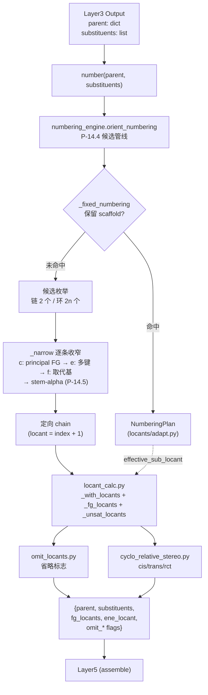

# Layer4: Numbering / Locants（编号与定位符）

> **位置:** `src/namepredict/layer4/` | **行数:** ~655 行 | **负责:** 按 P-14.4 给母体链/环原子分配位次号、决定编号方向、计算 FG/不饱和键定位符与省略规则

---

## 概述

Layer4 在 Layer3 完成母体选择与取代基提取之后，为母体骨架的每个原子分配 IUPAC 定位符（locant），并决定链/环的编号方向（orientation）。它接收 Layer3 的输出——一个包含母体骨架信息的 `parent` 字典和一个 `substituents` 列表——返回一个"已编号"的字典：母体链的方向已确定，每个取代基已获得其附着点的 locant 数值，官能团（FG）和多重键的 locant 也已计算好。

2026-08 重构后，Layer4 从"按 kind 字典派发 40+ 个 orienter 函数"（~1546 行）收敛为**基于候选枚举的 P-14.4 编号引擎**（~655 行）。旧的 `_kind_orienters()` 派发表与 `locants/engine.py`/`constraints.py`/`generate.py` 约束引擎整套删除，统一由 `numbering_engine.orient_numbering` 承担。

**输入数据结构:**

- `parent: dict` — 包含 `chain`（原子序列）、`kind`（母体类型）、官能团键（如 `oh_c_idx`、`cooh_c_idx`、`double_bond`）、骨架编号事实（`numbering_scaffold`）、principal 表达事实（`principal_expression_facts`）等字段
- `substituents: list[dict]` — 每个元素含 `attach_idx`（附着原子）、`en`（英文名）等

**输出数据结构:**

```python
{
    "parent": { ...  # 带有 chain、kind、numbering plan、FG locants、立体化学事实的原 parent },
    "substituents": [
        {**s, "locant": 2},  # 每个取代基被附着了 locant
        ...
    ],
    "fg_locants": [          # principal FG 位次记录（稀疏，只含实际存在的 FG）
        {"kind": "oh", "locants": [1], "omit": True},  # 如乙醇：省略 1-醇
    ],
    "ene_locant": 2,         # 示例：双键定位（扁平字段，独立于 fg_locants）
    ...
}
```

---

## 核心逻辑

### 入口调度 (`number`)

`numbering.py` 是 Layer4 的唯一对外入口（15 行），流程极短：

1. `orient_numbering(parent, substituents)` — 计算定向后的原子顺序（chain）
2. `plan_from_chain(...)` — 若为稠环/保留 scaffold，把 L2 注入的 `numbering_scaffold` 事实适配为 `NumberingPlan`
3. `_with_locants(chain, subs, ...)` + `_pack(...)` — 给每个取代基注入 locant，整合 FG/不饱和键位次与立体化学事实

> **源:** `src/namepredict/layer4/numbering.py:5-15`

### 候选编号引擎 (`numbering_engine.py`)

`orient_numbering` 以 **P-14.4 规则管线**取代旧 kind 派发 orienters。核心思路：枚举候选编号 → 逐条 P-14.4 规则收窄 → 单候选存活时提前终止。

```
orient_numbering(parent, substituents)
  ├─ 1. 固定编号：_fixed_numbering → plan_from_chain（保留 scaffold，P-14.4(a)）
  │       命中即返回，不走候选枚举
  ├─ 2. 生成候选：
  │     链:  forward / reversed（2 个）
  │     环:  每个原子作为 1 号位 × 双向（2n 个）
  ├─ 3. _fixed_start：P-14.4(a) 指定必须为 1 号位的原子
  │     从 _FIXED_START_KEYS（ring_attach_idx/n_idx/nh_idx/hetero_idx/radical_c_idx）
  │     或单杂环的杂原子（_ring_hetero_start）推导 → 过滤候选
  ├─ 4. P-14.4(c)：principal characteristic group → 最低位次集收窄
  │     （_principal_atoms 取 principal_attachment_atoms / principal_expression_facts）
  ├─ 5. P-14.4(e)：多重键 → 最低位次集收窄（双键优先于三键）
  ├─ 6. P-14.4(f)：取代基 → 最低位次集收窄
  └─ 7. 平局时：_stem_loc_pairs 按取代基英文名 α 序 + 位次对收窄（P-14.5）
      → 返回 _to_chain(存活候选)（locant = index + 1）
```

> **源:** `src/namepredict/layer4/numbering_engine.py:148-182`

关键实现细节：

- **候选即 `{atom: locant}` 字典**，收窄用 `_narrow(cands, key_fn)`（`numbering_engine.py:64-72`）：只保留 key 最小的候选；key 为 `None` 表示该特征缺席，规则不适用（保持全量）。`len(cands) <= 1` 时提前终止。
- **固定起点冲突回退**：固定起点原子在链候选里永远不可能是 1 号位（如线性链中部的杂原子/环原子）→ `cands` 为空 → 返回原顺序 `chain`。
- **不饱和键 key** 是 `(全部多键位次, 双键位次)` 二元组（`_bond_locants`，双键优先于三键）。
- **纯环单烯** 的位次隐含（cyclohexene 省略 `1-`）：不饱和度字段（`double_bond(s)`）照常进入第 5 步，但省略由 `omit_locants.py` 基于 `scaffold_id=="carbocycle"` 判定（见下）。

### NumberingPlan 数据结构

`NumberingPlan` 是保留 scaffold 编号的不可变 `dataclass`（`locants/plan.py`）：

```python
@dataclass(frozen=True)
class NumberingPlan:
    scaffold_id: str           # 骨架标识（如 "naphthalene"）
    atom_order: tuple[int, ...]  # 原子的编号顺序
    labels: tuple[str, ...]     # locant 标签（如 "1","2","3","4","4a"...）
    atom_to_label: dict[int, str]  # 原子 → locant 映射
    label_to_atom: dict[str, int]  # locant → 原子映射
    sub_atoms: frozenset[int]   # 取代基附着原子集合
    constraints_applied: tuple[str, ...]  # 应用的约束类型名
```

> **源:** `src/namepredict/layer4/locants/plan.py:7-15`

`locants/adapt.py` 把 L2 注入的 `numbering_scaffold` 事实适配为 plan：

- `plan_from_parent(chain, parent)` — 从 parent 的 `numbering_scaffold` 字段（`{scaffold_id, labels}`）直接建 plan，**不解释 scaffold kind**
- `plan_from_chain(chain, kind, facts, *, required)` — 兼容入口；`required=True` 且 facts 缺失时抛错（`numbering_scaffold_required` 守卫）
- `effective_sub_locant(plan, atom)` — 普通数字标签原样返回，`3a` 类标签回退为 `atom_order.index(atom)+1`（兼容旧 `_sub_locant` 语义）

> **源:** `src/namepredict/layer4/locants/adapt.py:24-52`

### FG 定位符计算 (`locant_calc.py`)

`locant_calc.py` 从定向后的 chain + plan 计算各类位次。数据驱动核心是 `_FG_LOCANTS` 表（`locant_calc.py:145-151`），产出稀疏的 `fg_locants` 列表：

| 记录 kind | 取值函数 | 说明 |
|---|---|---|
| `oh` | `_oh_locants` | alcohol 的挂载原子位次（`_typed_group_atoms`），回退 `oh_c_idxs` |
| `amine` | `_amine_fg_locants` | amine/sec_amine/tert_amine |
| `ketone` | `_ketone_fg_locants` | ketone/dione |
| `sh` | `_sh_locants_list` | thiol |
| `acid` | `_acid_fg_locants` | 环外酸取环上附着原子 `ring_attach_idx` |

**位次来源统一经 `_atom_locant`**（`locant_calc.py:9-15`）：优先 `plan_from_chain` 的 `effective_sub_locant`（保留 scaffold），否则 `chain.index(atom)+1`。组合 kind 已根除（scaffold×FG 正交化），`_OH_KINDS=("alcohol",)`、`_AMINE_KINDS=("amine","sec_amine","tert_amine")` 只含活的 FG 类别 kind。

**不饱和键位次**由 `_unsat_locants`（`locant_calc.py:95-103`）独立产出为扁平字段：`ene_locant`（单烯，`_edge_min_locant`）、`ene_locants`（多烯，`polyene.ene_locants`）、`yne_locant`、`omit_*` 标志。

> **源:** `src/namepredict/layer4/locant_calc.py:145-173`

### 共享方向原语 (`_chain_orient.py`)

`_chain_orient.py` 提供被 numbering_engine、locant_calc、polyene 共用的纯方向原语：`_chain_pos`、`_edge_locants`、`_edge_min_locant`、`_bond_min_locs`、`_pair_locants`、`_stem_loc_pairs`（后者的 `alkyl_alpha_key` 来自 layer3，保证取代基排序与 L3/L5 一致）。kind 派发的 orienter helper（locant 表挑选、环对定向等）随其服务的 orienters 一起删除。

> **源:** `src/namepredict/layer4/_chain_orient.py`

### Locant 省略规则（Omit Locants）

`omit_locants.py` 实现 IUPAC P-14.3.4 与环单 FG 的省略规则。kind 正交化后**环状判断基于 `scaffold_id=="carbocycle"`**，不再虚构 cycloalcohol/cycloketone/cycloamine 组合 kind：

- **环单醇/单胺/单酮**（`_is_cyclo(parent)` + `scaffold_id=="carbocycle"`）：无取代基时省略位次（P-14.3.4）；含内环双键时保留位次（需区分 FG 与 C=C 位置）
- **乙醇/乙胺/硫醇**（C1-C2）：FG 在 1 位且碳数 <=2 时省略
- **不饱和键**：3 碳以下省略（propene 无需写 1-propene）
- **纯烃环单烯**（`kind=="alkane"` + `scaffold_id=="carbocycle"`）：位次隐含省略；环多烯（`double_bonds`）保留位次

> **源:** `src/namepredict/layer4/omit_locants.py:5-66`

### 相对立体化学（Relative Stereochemistry）

`cyclo_relative_stereo.py` 专为环多元羧酸设计。kind 收敛后（`acid` + `scaffold_id=="carbocycle"`，原 `cycloalkane_polycarboxylic` 组合 kind 已删），在编号确定后读取 `relative_stereo.faces`，按 locant 排序生成 `cis/trans` 前缀（2 取代）或 `r/c/t` locant 字符串（3 取代）。

> **源:** `src/namepredict/layer4/cyclo_relative_stereo.py:16-25`

### 多烯定位 (`polyene.py`)

`polyene.py` 只保留 `ene_locants`（`polyene.py:7-12`）：从 `double_bonds` 列表计算所有双键的 min-endpoint locant 集（P-31.1）。链状多烯的编号方向由 numbering_engine 的候选引擎统一处理（不再有专门的 polyene orienter）。

---

## 文件清单

| 文件 | 行数 | 说明 |
|---|---|---|
| `__init__.py` | 5 | 导出 `number` 函数 |
| `numbering.py` | 15 | **入口**：`number()` 调用 `orient_numbering` + `plan_from_chain` + `_pack` |
| `numbering_engine.py` | 182 | **候选编号引擎**：`orient_numbering`（P-14.4 规则管线：候选枚举 + 逐条收窄 + 提前终止） |
| `locant_calc.py` | 173 | **FG 位次计算**：`_fg_locants`/`_with_locants`/`_pack`，`_FG_LOCANTS` 数据表 |
| `_chain_orient.py` | 47 | 共享方向原语：`_chain_pos`/`_edge_min_locant`/`_bond_min_locs`/`_pair_locants`/`_stem_loc_pairs` |
| `orienters.py` | 12 | 仅存 `_typed_group_atoms`（locant_calc 用）；kind 派发 orienters 已删 |
| `locants/plan.py` | 44 | `NumberingPlan` 数据类 + `make_plan`/`locant` |
| `locants/adapt.py` | 52 | `plan_from_parent`/`plan_from_chain`/`effective_sub_locant`（L2 numbering_scaffold → plan） |
| `omit_locants.py` | 66 | FG/不饱和键位次省略规则（按 scaffold_id 判断环状） |
| `polyene.py` | 12 | `ene_locants`：多烯双键 min-endpoint 位次集（P-31.1） |
| `cyclo_relative_stereo.py` | 25 | 环多元酸的相对立体化学前缀（cis/trans, r/c/t） |

---

## 数据流图



---

## 对外接口

### `number(parent, substituents) -> dict`

**签名:**

```python
def number(parent: dict, substituents: list[dict]) -> dict:
```

**参数:**

- `parent` — Layer3 输出的母体字典，至少包含：
  - `chain: list[int]` — 母体原子 ID 序列
  - `kind: str` — 母体类型标识
  - 可选：`oh_c_idx`/`ketone_c_idx`/`double_bond`/`triple_bond`、`principal_expression_facts`（FG 类别与附着原子）、`numbering_scaffold`/`numbering_scaffold_required`（保留 scaffold 编号事实）、`scaffold_id`
- `substituents` — 取代基列表，每个元素含 `attach_idx`、`en` 等字段

**返回值:** 一个扁平字典，包含：

| 字段 | 类型 | 说明 |
|------|------|------|
| `parent` | `dict` | 增强版 parent（含定向 `chain`、`numbering` plan 及立体化学事实） |
| `substituents` | `list[dict]` | 每个元素增加了 `locant` 字段 |
| `fg_locants` | `list[dict]` | principal FG 位次记录（稀疏，只含实际存在的 FG）: `[{kind, locants, omit}]` |
| `ene_locant` | `int\|None` | 双键位次（单烯） |
| `ene_locants` | `list[int]\|None` | 多双键位次集 |
| `omit_ene_locant` | `bool` | 是否省略烯键位次 |
| `yne_locant` | `int\|None` | 三键位次 |
| `omit_yne_locant` | `bool` | 是否省略炔键位次 |
| `relative_stereo_prefix` | `str` | 相对立体化学前缀（`"cis"`/`"trans"`，环二酸） |
| `relative_stereo_locants` | `str` | 3 取代 r/c/t locant 字符串 |

`fg_locants` 每项结构：`{"kind": "oh"|"amine"|"ketone"|"sh"|"acid", "locants": [int, ...], "omit": bool}`。
- `kind` 来自 `principal_expression_facts.group_class` 映射；`locants` 由挂载原子经 chain/plan 换算（统一列表，单 FG 也是 `[x]`）；`omit` 由 `omit_locants.py` 规则算好。
- **稀疏**：只产实际存在的 FG；cooh 不产（单/多酸位次隐含，死字段清理）。
- 烯/炔位次独立为扁平字段，不进 `fg_locants`。

**调用方:** `src/namepredict/namer.py` 在 `_assemble_candidate` 中调用。

---

## 关键设计模式

### P-14.4 规则管线（candidate-based）

编号方向不再按 kind 枚举 orienter，而是枚举全部候选编号（链正反、环 2n），按 P-14.4 规则**逐条收窄**（principal FG → 多重键 → 取代基 → stem-alpha 平局决胜），单候选存活即提前终止。新增母体类型无需注册 orienter——只要 parent dict 携带正确的 FG/不饱和键/取代基字段，引擎自动按 P-14.4 找到最优方向。

### 固定编号注入（Scaffold Facts Injection）

保留 scaffold（naphthalene、indole 等）的编号不遵循简单链/环规则，由 L2 在母体选择时注入 `numbering_scaffold` 事实（`{scaffold_id, labels}`）。Layer4 通过 `plan_from_chain` 适配为 `NumberingPlan`，在 locant 换算中用 `effective_sub_locant` 替代简单的 `chain.index() + 1`（处理 `3a`/`4a` 等非纯数字标签）。

### 字段驱动的环状判断

组合 kind（cycloalcohol/cycloketone/cycloalkane_polycarboxylic 等）已根除，环状判断统一基于 `scaffold_id`（`"carbocycle"`）与不饱和键字段，而非 kind 字符串。这使"加新环只加 ScaffoldSpec + 词干表一行"成为可能。

---

## 相关页面

- [[architecture/overview]] — 6 层架构总览
- [[architecture/layer3-substituents]] — Layer3：母体选择与取代基提取（Layer4 的输入来源）
- [[architecture/layer5-name-assembly]] — Layer5：名称组装（Layer4 的输出消费方）
- [[architecture/layer2-parent-selector]] — Layer2：母体选择器（注入 numbering_scaffold / scaffold_id）
- [[concepts/functional-group-priority]] — 官能团分类与优先级表（影响编号优先级）
