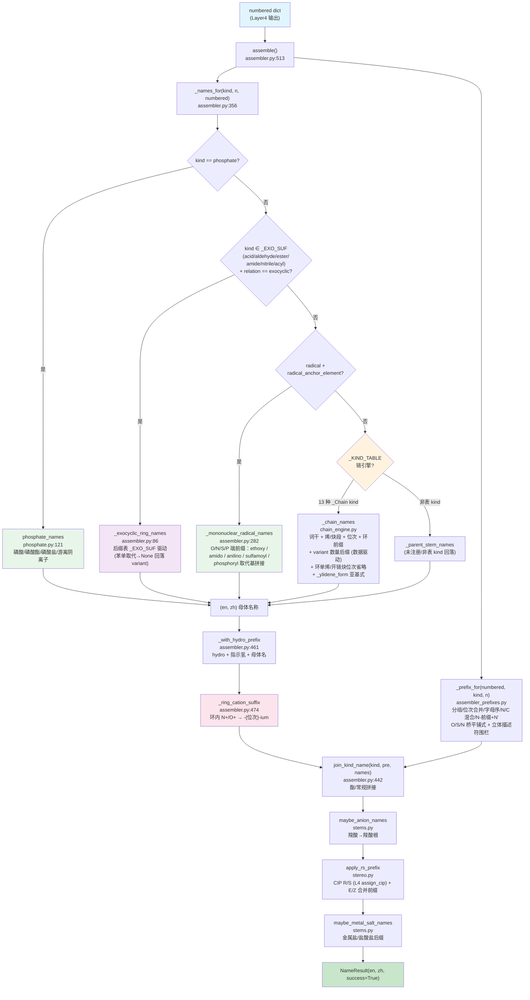

# Layer5: 名称组装 (Name Assembly)

> **管线位置:** 第 5 层 / 6 层 (输出层) | **源文件:** 7 个模块 (2,159 行；含包入口 `__init__.py` 共 8 个 `.py` / 2,165 行) | **最后更新:** 2026-09-12

---

## 概述

Layer5 是 NamePredict 6 层命名管线的终端输出层，负责将前序各层产生的结构化中间数据（编号后的母体信息 + 取代基清单 + 位次分配）组装为完整的中英双语 IUPAC 名称。

Layer5 由 7 个模块组成：**① 词干引擎 `chain_engine.py`**（`_KIND_TABLE` 数据驱动，现 13 个 entry 含 `acyl` 与逐卤素 `acyl_halide`，`mult_ok` 生成式按 multiplicity 派生数量后缀，`variant` 按 scaffold 提供特例覆盖，radical entry 按 `parent.radical_ylidene` 出 `-ylidene` 亚基式，开链烃用 `ene_loc_omit`/`yne_loc_omit` 省略双/三键位次 1）；**② 主组装器 `assembler.py`**（含 `_names_for` 派发与 `join_kind_name` 拼接、`_ensure_fused_stem` 稠合词干注入、`_with_hydro_prefix` 指示氢/hydro 前缀注入、`_ring_cation_suffix` 环内 N⁺/O⁺ 的 `-ium` 母体后缀、`_phosphoryl_sub_names` P 酰基前缀管线、`_bridge_enclosed_names` S 桥前端围栏、`_ring_carbocycle_stem` 单环环烷/环烯词干、环外 -oyl 系系统名）；**③ 稠合名组装 `fused_namer.py`**（`benzo[a]...`/`naphtho[...]...` 类稠合 base 名 + `_RETAINED_FUSION_ALIASES` 稠合组装名→保留名整名替换）；**④ 前缀组装 `assembler_prefixes.py`**（含 N- 前缀与 N' 多重撇号位次、N/C 混合位次、bis/tris/tetrakis、O/S/N 桥平铺式拆分与其中文同形拆分、前导立体描述符围栏）；**⑤ 双语词干表 `stems.py`**（烷烃词干 C1–C99，复用 constants `en_num_term` + 盐/阴离子后缀）；**⑥ 立体化学 `stereo.py`**（E/Z + CIP R/S，CIP 指派委托 L4 `assign_cip`，立体位次支持 `3a/6a` 字母位次）；**⑦ 磷酸 worker `phosphate.py`**（`kind=phosphate` 整分子磷酸/磷酸酯/磷酸盐双语名，由 L2 的 `n_oh`/`n_om`/`salt_meta` + o_side 臂组装）；kind 收敛在 L2 `principal_expression._chain_kind`——L2 直接产生 FG 类别 kind（含 `phosphate`），苯保留名由 chain_engine 各 entry 的 `variant` 提供。

**管线中的位置：**

```
Layer4: numbering (位次分配)
    ↓  numbered dict
┌──────────────────────┐
│  Layer5  名称组装      │  ← 当前层 (输出层)
└──────────────────────┘
    ↓  NameResult {en, zh}
输出: "2-chloropropane" / "2-氯丙烷"
```

**职责边界：**

| 职责 | 说明 |
|------|------|
| 母体名称生成 | 根据 parent kind 和碳数 n 查表/构造双语母体词干 |
| 取代基前缀组装 | 按字母序排列、重复基团合并 (di/tri/tetra)、位次号拼接、N- 前缀 (含 N') |
| 立体化学插入 | R/S (CIP，委托 L4 `assign_cip`) 和 E/Z (双键) 立体描述符的前缀化；位次可为 `3a`/`6a` 等带字母位次 |
| 功能类命名 | 酯 (ester) 拼接；环外酸/醛/酯/酰胺/腈 (-carboxylic acid/-carbaldehyde/-carboxylate/-carboxamide/-carbonitrile) 系统名；苯环保留名 (benzoic acid/benzaldehyde…) 由 variant 提供 |
| 双语输出 | 同步生成英文和中文两套 IUPAC 字符串 |

**输入/输出类型：**

```
assemble(numbered: dict, *, time_ms: float = 0.0, source: str = "iupac") -> NameResult
```

`numbered` 字典是多层管线积累的结构化数据，核心字段包括 `parent`、`substituents`、各种 `_locant`/`_locants` 字段、立体化学字段。`NameResult` 包含 `en: str`, `zh: str`, `success: bool`, `source: str`, `time_ms: float`, `meta: dict`。

---

## 核心逻辑

### 1. 组装总控 (`assemble` 函数)

Layer5 的入口是 `assembler.py` 中的 `assemble` 函数（第 513 行）。它遵循一个清晰的名称变换流水线，每步返回双语元组 `(en, zh)`：

```
assemble(numbered)
  ├─ 0. _ensure_fused_stem(numbered)         # assembler.py:336 未注册稠环词干注入（fused_parent_names），失败→unsupported
  ├─ 1. _names_for(kind, n, numbered)        # assembler.py:356 母体名称 (en, zh)
  ├─ 2. _with_hydro_prefix(names, numbered)  # assembler.py:461 hydro + 指示氢 + 母体名（P-31.2.2）
  ├─ 3. _ring_cation_suffix(numbered, names) # assembler.py:474 环内 N+/O+ → 母体名缀 -{位次}-ium（P-62.4.1）
  ├─ 4. _prefix_for(numbered, kind, n)       # 取代基前缀 (pre_en, pre_zh)
  ├─ 5. join_kind_name(kind, pre, names)     # assembler.py:442 拼接前缀+母体 (酯专属拼接, zh 恒拼"酯")
  ├─ 6. maybe_anion_names(numbered, en, zh)  # 羧酸根阴离子后缀
  ├─ 7. apply_rs_prefix(numbered, en, zh)    # R/S 立体化学前缀
  └─ 8. maybe_metal_salt_names(...)          # 金属盐/盐酸盐后缀（namer._apply_salt_suffix 用独立 {"salt":salt} 调用；kind=phosphate 跳过，盐名已由 worker 组装）
       → NameResult(en, zh)
```

> **源:** `src/namepredict/layer5/assembler.py:513`

`_ensure_fused_stem`（`assembler.py:336`）在取名前注入母体词干：已注册稠环词干由 L2 `pack_parent_stem` 注入（parent.stem_en 非空），不进入本分支；未注册稠环（全碳 `scaffold_id=carbocycle` 或 `fused_hetero`）靠 `fused_tree` 调 `fused_parent_names` 组装稠合 base 名注入词干。注入时把 L4 已按整体编号算好的 `parent.indicated_h` 指示氢前缀拼到词干最前端（`assembler.py:351`，P-58.2.1）——稠合 base 名本身不含指示氢，统一在此补齐。返回 False 表示稠合组装失败（显式 unsupported，避免回落开链词干错名）。

`_with_hydro_prefix`（`assembler.py:461`）把 hydro 前缀与动态指示氢拼到母体名前，顺序为 **hydro + 指示氢 + 母体名**（P-31.2.2，如 2,3-dihydro-1H-indole）。动态指示氢只在氢化衍生物（`parent.hydro_prefix` 非空）时注入，否则 `[nH]` 互变异构型会误产 `1H-pyridine`；但当 `parent.indicated_h_forced` 为真时（指示氢来自保留母体名未隐含的芳香位 H，P-58.2.1）即使无 hydro 前缀也把指示氢拼到最前端。母体名已带静态 `1H-`（保留名）时不重复。

`_ring_cation_suffix`（`assembler.py:474`）在 hydro 前缀之后、拼接之前处理**净正电荷分子的环内阳离子**（P-62.4.1）：分子总电荷为负时不处理（盐/两性离子都可能含环阳离子）；母体链上带 +1 电荷的环内 N/O（`IsInRing()` 且属 `parent.chain`）取该原子位次（经 `parent.numbering_scaffold.labels` 映射）在词干后插 `-{位次}-ium`；色烯型保留名（词干以 `ene` 结尾，如 chromene）走 `chromenylium` 的位次隐含形态。该步只替换母体名、不改中文侧（中文无 `-ium` 对应形态）。

### 2. kind 收敛（在 L2）

**kind 收敛由 L2 `principal_expression._chain_kind` 承担**——L2 直接产出 FG 类别 kind（`acid`/`alcohol`/`amine`/`ketone`/`ester`/`amide`/`nitrile`/`aldehyde`，以及 `acyl` 酰基残基与环外 acyl 头 kind、环外酰卤 kind `acyl_halide`、无机功能母体 `phosphate`），数量统一由 `principal_expression_facts.multiplicity` 承载（`phosphate` 例外：计数由 `n_oh`/`n_om` 承载，见 §4.2），无 diacid/diol/diamine 等数量 kind，**也不产生 `dione`**（二酮由 chain_engine 对 `ketone` 的 `mult_ok` 生成式在命名层产出）。Layer5 无独立的 kind 收敛模块（`typed_kinds` 不存在）。

苯系保留名（phenol/benzoic acid/aniline/benzaldehyde/benzonitrile/benzamide/benzoyl/benzoyl chloride）由 chain_engine `_KIND_TABLE` 各 entry 的 `variant["benzene"]` 提供（见 §4）。

### 3. 链式词干引擎 (`chain_engine.py`)

`chain_engine.py`（613 行）是数据驱动的单链词干引擎——用 `_Chain` spec 描述每类 kind 的命名形态，`_chain_names` 统一渲染，无需按 kind 手写 if 分支。

**`_Chain` 数据类字段**（frozen dataclass，`chain_engine.py:292`）：
- 基础：`kind`/`en_suf`/`zh_suf` **必填**（每 kind 互异，无合理默认）；`coda`/`no_loc`/`omit_rule` 在 `_: KW_ONLY` 分隔后为 keyword-only 默认值——`coda`="an"、`no_loc`="plain"、`omit_rule`=`_NO_OMIT`，仅特例显式覆盖（alkane `coda=""`、thiol `coda="ane"`、ketone `no_loc="none"`、alcohol/thiol/amine `omit_rule=_omit_term_locant`、ketone/alkane 自定义 lambda）
- FG：`fg`（fg_locants 记录 kind）/`need`（FG 数要求）
- 俗名/派生：`plain_maps`/`plain_fn`
- 烯/炔段：`ene_seg`（默认 `("en","烯")`；thiol 用 `("ene","烯")` 保留 e）/`yne_seg`（默认 `("yn","炔")`）/`ene_base`/`ene_special`（俗名钩子）/`yne_suf`/`ez_ene`（单烯 E/Z）/`ez_ene_multi`（多烯 E/Z 前缀，`_chain_ene` 融合式/unsat_polyol/段式多烯分支按 spec 取用）/`ene_loc_omit`（乙烯 ethene 与环单烯 cyclohexene 省略位次 1）/`yne_loc_omit`（开链烃 ethyne/propyne 省略位次 1，P-14.3.4.2(d)）/`ene_omit_aware`
- 环：`cyclic`（恒加 cyclo/环前缀）/`cyclic_unsat`/`zh_full`/`stem`（稠环/杂环词干覆盖）/`aromatic`（assembler 注入；醇→酚语义在此消费）
- **`mult_ok`**（acid/alcohol/amine/ketone=True）— 数量后缀由 `_generated_mult_fields`（`chain_engine.py:369`）生成：`MULT[m]`+基础后缀（diol/triol/tetraol…任意数量，无硬编码上限）；`mult_zh_full`（醇/胺多 FG 中文保留"烷"）/`mult_unsat_polyol`（仅醇）
- **`unsat_polyol`/`mult_unsat_polyol`**（`322`/`327`）— 多 FG 词干模式下的烯/炔插入（but-2-ene-1,4-diol），混合烯炔时词干加 euphonic `a`（P-31.1.1.2）
- **`variant: dict[scaffold, dict[mult, dict]]`**（`{scaffold_id: {multiplicity: 生成式之上的特例字段覆盖}}`，`None` 键=开链）— acid 用 `{None:{2: 草酸俗名/炔禁/ene_single_min=3}}`；苯环保留名用 `{"benzene": {1: {plain_fn=phenol/benzoic…}}}`。`assembler._names_for` 按 `scaffold_id` 注入当前 scaffold 的 variant 子集后，`_chain_names` 见一维 `{mult: fields}`：多 FG（mult>1）先生成通用数量字段再覆盖特例；单 FG（mult==1）直接 `replace(spec, **extra)`
- `wrap`（整体包裹 E/Z，alkane 与 radical 条目用 `_with_ez`——后者使烯基自由基取代基（含立体双键）拼 `(1Z)-` 前缀）

**`_KIND_TABLE`**（`chain_engine.py:508`）现有 **13 个 `_Chain` entry**：12 个链式主官能团 kind `alcohol`/`ketone`/`alkane`/`acid`/`ester`/`thiol`/`amine`/`aldehyde`/`nitrile`/`amide`/`acyl_halide`/`acyl`，外加第 13 个 **`radical`**（取代基 kind，`en_suf="yl"`/`zh_suf="基"`，`plain_fn=_radical_plain`、`variant` 苯环→phenyl、`wrap=_with_ez`）。无 `anhydride` entry（L5 不产生酸酐链式名）及任何组合 kind——纯烃环用 `alkane`（cyclo 前缀由 assembler 按 scaffold_id 动态加），数量统一由 `multiplicity` + `mult_ok` 生成式承载。`alkane` 条目显式置 `ene_loc_omit=True, yne_loc_omit=True`——开链烃的 ethene/ethyne/propyne 位次 1 仅在 L4 置 `omit_*_locant` 标志时省略；有 FG 后缀的 kind 不置 `yne_loc_omit`，故 `prop-2-ynoic acid` 恒保留炔位次（P-14.3.4 例外）。

- **`acyl`**（`chain_engine.py:551`）— 酰基残基（P-65.1.7.2）：酸碳恒 locant 1，C3+ 系统名词干 coda "an"+"oyl"（propanoyl…），C1/C2 走 `_RETAINED` 保留名（formyl/acetyl，`_RETAINED` 加 `"acyl"` 键，`chain_engine.py:36`）；烯/炔与立体照 acid 融合式（enoyl/ynoyl）。`variant["benzene"]` 提供苯环 exocyclic 酰基头保留名 **benzoyl/苯甲酰基**；杂环/碳环（furan-2-carbonyl/cyclopropanecarbonyl）由 assembler `_exocyclic_ring_names` 产出。
- **`acyl_halide`**（`:601`，默认 chloride = `_ACYL_HALIDE_BY_HAL[17]`）— 后缀随实际卤素变：`_ACYL_HALIDE_BY_HAL`（`chain_engine.py:506`，`_ac_hal_chain` `:489` 按 `HALIDE_EN` 生成 F/Cl/Br/I 各自的 spec）——en 后缀 `-oyl fluoride/chloride/bromide/iodide`、zh `-酰氟/氯/溴/碘`，保留名（C1/C2、苯甲酰）随卤素同变；assembler 按 `parent.hal_z` 选择对应 spec（F 走 `-oyl fluoride`，苯 → benzoyl chloride 等）。`_RETAINED` 不再存 acyl_halide 保留名（迁入 `_ac_hal_chain`）。

**`mult_unsat_polyol` / `_mult_elide`**：`ketone` entry 加 `mult_unsat_polyol=True`（`chain_engine.py:524`）；`_mult_elide`（`chain_engine.py:364`）实现 **P-14.3.2 数量前缀元音省略**——前缀以 `a` 结尾（tetra/penta/hexa…）且后缀以元音开头时省略 `a`（tetra+ol→tetrol、hexa+ol→hexol；di/tri 不受影响）。`_chain_stem_pair`（`:336`）中文保留完整"烷"的条件改为 `unsat_polyol and (zh_full or cyclic)`——仅醇/胺/硫醇或环状保留，开链酮用去"烷"词干（戊-2,4-二酮）。

**母体词干结尾 'e' 的省略下沉到拼接端（P-60.2(a)）**：`_ring_stem`（assembler）不再无差别 `rstrip('e')`，改由 `_elide_parent_e(stem, suffix)`（`chain_engine.py:346`）按**最终后缀首字母**判断——仅当 `suffix` 以元音 `a/i/o/u/y` 开头时剥词干尾 `e`，辅音开头（`diol`/`dione`/`diamine`/`carbaldehyde` 等）保留 `e`。无差别剥 e 是把 oxolane-3,4-diol 错拼成 oxolan-3,4-diol 的根因；`_chain_plain` 普通拼接（`chain_engine.py:351`）与 `_chain_names` 稠环 scaffold 词干分支（`chain_engine.py:477`）都以 `_elide_parent_e(s, spec.en_suf)` 处理。

**短链单烯单 FG 位次省略融合（P-14.3.4.2/4.4）**：`_chain_ene`（`chain_engine.py:217`）对 **C≤2 单烯单 FG**（烯只能 1(-2)、后缀锚定 1，位次无歧义）省略并融合——`eth-1-en-1-amine` → `ethenamine`（乙-1-烯-1-胺 → 乙烯胺）；另一端的取代基（如 2-nitro）位次照常由前缀保留。

**环单烯双键位次省略融合（P-31.1.2 / P-14.3.4.2(d)）**：`_chain_ene` 的另一分支（`chain_engine.py:281`）对 **`spec.cyclic` 且双键起点与 FG/自由价同为 1** 的环单烯省略冗余的双键 `1` 并与词干融合——`cyclohexen-1-yl`（而非 `cyclohex-1-en-1-yl`）、cyclohex-2-en-1-ol 等；FG/自由价位次仍显式保留。走此分支的 entry 由 assembler 在 `sid == "carbocycle"` 时置 `cyclic=True, ene_loc_omit=True`（见 §4）。

**开链自由基自由价位次省略（P-29.2 方法 1 的烯/炔拓展）**：`_radical_terminal_yl_elide`（`chain_engine.py:403`）在 `_chain_names` 中对 `kind=="radical"` 且无 `stem`、非环（`not spec.cyclic and not spec.cyclic_unsat`）的母体调用（`chain_engine.py:447`）——自由价在 C-1 时省去 `-1-`（`prop-1-en-1-yl`→`prop-1-enyl`、丁-3-烯-1-炔-1-基→丁-3-烯-1-炔基）；C≤2 时位次 1 无歧义，`-1-` 再整体省略（`eth-1-yn-1-yl`→`ethynyl`，同 `_omit_term_locant` 的 C1–C2 1 位规则）。环自由基与稠环 scaffold 词干（`spec.stem` 非空）不走此省略。

**自由基双键亚基式（P-31.2.3）**：`_ylidene_form`（`chain_engine.py:392`）把 `-yl`/`-基` 改写成 `-ylidene`/`亚…基`——`methyl`→`methylidene`、`octyl`→`octylidene`、`cyclopropyl`→`cyclopropylidene`（中文 环丙基→环丙亚基，非环 乙基→亚乙基）；须在 `-yl` 生成之后调用。`_chain_names`（`chain_engine.py:416`）读 `parent.radical_ylidene`（L2 碳锚点自由价为双键 `*=C<` 时置位，见 `src/namepredict/layer2/principal_expression.py:241`），在**不饱和段路径**（`chain_engine.py:452`）与**普通词干路径**（`chain_engine.py:485`）分别套用。

**多烯 E/Z 前缀补全**：`_chain_ene` 的 unsat_polyol（多 FG）多烯分支补上 `spec.ez_ene_multi` 前缀应用；`_KIND_TABLE` 中 `ketone`/`thiol`/`amine`/`nitrile`/`amide`/`acyl_halide` 条目补 `ez_ene_multi=ez_for_parent`（thiol/amine 并补单烯 `ez_ene`）——多键不饱和时这些 kind 现按 `ez_for_parent` 产出 `(2E,4Z)-` 式多烯前缀（acid/alcohol/ester/aldehyde 条目亦具 `ez_ene_multi`）。**radical 条目加 `wrap=_with_ez`**（radical entry，`chain_engine.py:607`）：烯基自由基取代基（苯环母体上的 prop-1-en-1-yl 等由递归 `*` 锚定命名产出、`submol_build` 已保立体）现按链位次拼 `(1Z)-` 前缀。

**不饱和段引擎**（`_chain_unsat`，`chain_engine.py:99`）支持**混合烯炔**：`_chain_enyne`（`chain_engine.py:117`）组合烯段在前/炔段在后（融合式与段式均合并两组位次，多键加 `a`）；`_chain_yne`（`chain_engine.py:158`）支持多炔（`yne_locants` + `MULT` 后缀，hexa-1,5-diyne），其融合式单炔走 `omit = spec.yne_loc_omit and numbered["omit_yne_locant"]`（`chain_engine.py:176`）——炔位次仅在 spec 允许且 L4 置标志时省略，`acid`/`acyl` 等 FG 后缀 kind 恒保留（`prop-2-ynoic acid`，P-14.3.4 例外）。

> **源:** `src/namepredict/layer5/chain_engine.py`

### 4. 母体名称派发 (`_names_for`)

`_names_for`（`assembler.py:356`）是母体名称的核心派发函数。**`kind == "phosphate"` 最先短路**——直接转 `phosphate_names(numbered)`（`assembler.py:361`），不查 `_KIND_TABLE`（磷酸 P 中心无碳词干，`_Chain` 表结构不适用；计数与盐门控已由 L2 算好，见 §4.2）。其余 kind 按以下顺序派发：

0. `kind` 属于 `{acid, aldehyde, ester, amide, nitrile, acyl}` 时先试 **`_exocyclic_ring_names`**（`assembler.py:86`）——环外主基系统名由**后缀表 `_EXO_SUF`**（`assembler.py:76`：group_class → 单取代后缀 / 多取代后缀基底 / 多取代是否必须位次）驱动同一条管线：环母体词干 + 后缀（`-carboxylic acid`/`-carboxylate`/`-carboxamide`/`-carbonitrile`/`-carbaldehyde`/`-carbonyl`，P-65.1.7.2 酰基头、P-66.6.1.1.3 环醛）。要点：
   - **苯单取代回落 chain_engine 保留名 variant**（benzoic acid/苯甲酸、苯甲醛 benzaldehyde、benzonitrile、benzoyl、benzoate、benzamide）——`mult == 1 and sid == "benzene"` 直接返回 `None`
   - **多取代**仅 acid/aldehyde 支持（酯/酰胺/腈/酰基头 `plural is None` → 放弃）：拼 `-di/tricarboxylic acid`、`-di/tricarbaldehyde`（如 benzene-1,3-dicarboxylic acid，P-65.2.2），**多羧酸位次必带**（`plural_needs_loc`，缺失即返回 `None`），不做链式 Xanedioic 模板；中文后缀统一「羧酸」（不用「甲酸」）
   - **反例 -oyl 直拼（furanoyl）**——丢环酸羧基位次、词干不符金标准，故杂环/稠环/单环碳环 → 母体名/locant + `-carbonyl`（furan-2-carboxylic acid → **furan-2-carbonyl**、cyclopropanecarboxylic acid → cyclopropanecarbonyl）
   - 开链同类（relation `in_skeleton`）不触发（`relation != "exocyclic"` 即返回 `None`）
1. `kind == "radical"` 且有 `radical_anchor_element` → `_mononuclear_radical_names`（`assembler.py:282`）（杂原子锚点自由基；O 锚点 `-yloxy` 经 `_retained_alkoxy` 收拢为 IUPAC 保留烷氧基 ethoxy/propoxy/butoxy/phenoxy；P 酰基锚点走 `_phosphoryl_sub_names`，见下）
2. 查 `_KIND_TABLE.get(kind)`（`chain_engine.py:508`）；命中则先按下列运行时替换改写 spec 再 `_chain_names`：
   - `kind == "acyl_halide"` → 按 `parent.hal_z`（L1 检测/L2 保留的实际卤素）取 `_ACYL_HALIDE_BY_HAL` 对应 spec 覆盖默认 chloride（F→`-oyl fluoride`，苯 → benzoyl fluoride 等）
   - `kind == "alkane" and parent.fused_tree and sid != "benzene"` → 直接返回 `_parent_stem_names`（未注册稠环无 FG：`_ensure_fused_stem` 注入的稠合 base 名，不走 chain_engine 拼 ane）
   - `sid == "benzene" and kind == "alkane"` → 直接返回 `("benzene", "苯")`（无主 FG 纯苯）
   - 保留 scaffold 词干（`_ring_stem`，`assembler.py:23`）→ `replace(entry, stem=(en_stem, zh_stem), coda="", omit_rule=lambda...: bool(omit), aromatic=(sid == "benzene"))`——**`_ring_stem` 返回完整词干（含尾部 `e`）**（benzene 与非苯环同），结尾 `e` 的省略由 chain_engine `_elide_parent_e` 按后缀首字母决定（P-60.2(a)，见 §3）；aromatic **仅对苯环置真**使醇注入 `zh_suf="酚"`（苯酚系；杂环醇→醇，非酚）
   - `sid == "carbocycle"`（无 fused_tree） → `replace(entry, cyclic=True, ene_loc_omit=True, omit_rule=...)`（恒加 cyclo/环前缀；`cyclic`+`ene_loc_omit` 使环单烯双键位次 1 走 `_chain_ene` 的融合省略分支——cyclohexen-1-yl；未注册全碳稠环 fused_tree 存在时不处理）
   - **按 scaffold 注入保留名 variant**：`sc_variant = entry.variant.get(sid)` → `replace(entry, variant=sc_variant)`——苯环单 FG 取 `"benzene"` 键（phenol/benzoic/aniline/benzoyl…），开链取 `None` 键（acid 草酸）
   - 然后 `_chain_names(entry, n, numbered)`
3. 非表内 kind 落到 `_parent_stem_names`（`assembler.py:394`，取 parent.stem_en/stem_zh；苯基自由基 phenyl 由 radical entry 的 benzene variant 产出，非独立 kind worker）

**单环环烷/环烯的环外系统名共用一个词干原语**：`_exocyclic_ring_names` 的 `sid=="carbocycle"` 且无 `fused_tree` 分支统一经 `_ring_carbocycle_stem`（`assembler.py:43`）出母体词干——en 单烯位 1 省略（P-31.1.2 环己烯）、多烯/非 1 位次显式（cyclohexa-1,3-diene），中文环烯位次恒显式（环己-1-烯）。返回 `has_unsat` 时或 `_ring_extra_prefix_located`（`assembler.py:65`，环上另带被编号前缀：O 侧酯烷基、N 端胺取代除外）为真时，后缀 locant 不可省略且须显式——环烯使编号不再唯一，另有前缀取代时主基 locant 1 不能隐含（P-66.6.1 例 4-formylcyclohexane-1-carboxylic acid vs 无取代省略 cyclohexanecarbaldehyde）。

**单核自由基名的 N- 取代基保留与 P 酰基前缀（`_mononuclear_radical_names`，`assembler.py:282`）**：
- **azane（单 N- 酰基残基）**：N- 酰基为乙酰/甲酰/苯甲酰时收成 **amido 保留式**（P-66.1.1.4.3 方法 1：acetamido/formamido/benzamido，取自 `constants.AMIDO_RETAINED`），不走 free_to_yl 的 acylamino 系统式；其余 R（长链/烯酰/被取代苯甲酰/杂环羰酰）保持方法 2 的 acylamino。方法 2 需把内层组整体括起再加 amino（P-29.3.2 复合前缀括号）的情形有两类：带立体描述符的复杂酰基残基（肽类 N-酰基氨基酸）由 `_azane_acyl_stereo_lead`（`assembler.py:224`）识别，芳香酰基/acetyl 系（尾缀 `benzoyl`/`carbonyl`/`acetyl`）由 `_AZANE_PAREN_SUF`（`assembler.py:231`）/`_azane_sub_needs_paren`（`assembler.py:234`）识别；内层组已含圆括号（立体描述符）时升级为方括号（P-16.5.2 嵌套，`[…propanoyl]amino`），否则用圆括号（`(benzoyl)amino`）。
- **零取代基杂原子锚点**：`_MONONUCLEAR_ZERO_YL`（`assembler.py:128`）把单核氢化物母体直译为 -yl 前缀——oxidane/sulfane/azane 之外含高价态硫、亚胺与 P 酰基：`sulfinyl`/亚磺酰基、`sulfonyl`/磺酰基、`imine`/亚氨基（P-66.1.1 亚基式，`assembler.py:132-136`）+ `phosphoryl`/磷酰基、`phosphanyl`/磷烷基。
- **P 酰基前缀管线**（P-67.1.4.1）：`stem_en ∈ _PHOSPHORYL_STEMS`（`("phosphoryl","phosphanyl")`，`assembler.py:139`）时转 `_phosphoryl_sub_names`（`assembler.py:179`）按取代基拼前缀——取代基可 1–3 个，按字母序（`alkyl_alpha_key`）接到 phosphoryl：全为简单基时首基平铺、其余括起（`hydroxy(methyl)phosphoryl`）；同基倍增用 di-/tri-（`dimethoxyphosphoryl`）；含复合组分（自带括号/方括号）时逐组分连字符分隔 + 方括号围栏（`_bracket_bridge_suffix`，`assembler.py:151`，P-16.5.2）。P 上的 –O⁻ 臂由 `_oxido_arm`（`assembler.py:168`）改为 `oxido/氧化`（P-72.6.2）。P 酰基经 O/N/S 桥连母体时按 `_PHOSPHORYL_BRIDGE`（`assembler.py:140`，P-67.1.4.1.3）出 `[hydroxy(methoxy)phosphoryl]oxy` 式。
- **N-氨基与磺酰融合 `sulfamoyl`**（P-66.1.1.4.2 + Glossary）：单取代基且 `stem_en == "sulfonyl"`、取代基名以 amino/氨基 结尾时，N-取代基并入磺酰词干——`(phenylamino)sulfonyl` 收成 `phenylsulfamoyl`、丁基(甲基)走 `butyl(methyl)sulfamoyl`（`assembler.py:295`）。
- **N-芳基-N-烷基胺取 anilino 保留式**（P-62.2.1.1）：两个 N-取代基中恰有一个为苯基（en `…phenyl` / zh `…苯基`）时，苯基侧收成 `anilino/苯胺基`、另一取代基以 `N-` 前缀挂上，两前缀按 P-14.5 字母序比较键 `_alpha_key`（`assembler.py:277`，忽略位次/括号/连字符）决定先后（`4-fluoro-N-propan-2-ylanilino` / `N-ethyl-4-fluoroanilino`，`assembler.py:321-330`）。
- **桥梁围栏与自含标记**：S 桥前端为复合取代基时由 `_bridge_enclosed_names`（`assembler.py:263`）在 L5 定形围栏（`(4-methoxyphenyl)sulfonyl`；直链 -yl 前端 `propan-2-yl` 经 `_SIMPLE_CHAIN_YL_RE` 走平铺融合），中英文同步产出；桥名自身已含围栏（O/S 桥名下自带、或 P 酰基复合前缀）时置 `numbered["bridge_self_enclosed"] = True`（`assembler.py:300`）——仅 N 桥（`azane`）复合前缀作取代基时仍需 L5 再整体围栏（P-16.5.2 嵌套）；该标记经 `namer._chain_meta` 透出供 L3 判断前缀是否还需加括号。
- **双不同 N-取代基**（P-62.2.2.1）：字母序首基平铺、其后各基分别加括号紧贴 amino（2-chloroethylethylamino → `2-chloroethyl(ethyl)amino`）；同基倍增的中文侧用 `constants.zh_bridge_root` 把烃基名去尾「基」（`dimethylamino` → 二甲氨基，`assembler.py:320`）。

> **源:** `src/namepredict/layer5/assembler.py:356`

### 4.1 稠合名组装 (`fused_namer.py`)

`fused_namer.py`（154 行）实现 **P-25.3.2 稠合名称组装**——用 L2 的 `fused_tree` 拆解树生成 `benzo[a]...`/`naphtho[...]...` 类稠合名（供**未注册稠环**的 base 名；母体/附加组分均为已注册保留件，但整体系统不在 `_TEMPLATES` 内）。当前支持**单边融合**，多边/跨位待后续。L5 分层纯净：组件词干与保留前缀**不在 L5 留表**，由 L2 打包期从 `ring_scaffold._TEMPLATES` 取出写进 `FusedNode.fused_stem`/`.fused_prefix`，L5 只读节点字段（L5 不得 import L2）；编号走 L4 `fused_numbering`。

核心入口 `fused_parent_names(mol, node)`（`fused_namer.py:134`）：

- **`_RETAINED_FUSION_ALIASES`**（`fused_namer.py:9`，7 条）— 稠合组装名 → 保留名**整名替换**（P-25.1.1），只在位次形态与稠合名完全相同时命中（`benzo[c]furan→2-benzofuran`、`benzo[c]pyrrole→isoindole`、`benzo[b]benzofuran→dibenzofuran`、`benzo[b]quinoxaline→phenazine`、`benzo[a]indene→fluorene`、`benzo[d]1,2-oxazole→1,2-benzoxazole`、`benzo[b]anthracene→tetracene`）；未命中则整名原样输出（`fused_namer.py:152-154`）
- **`_stem_of`**（`fused_namer.py:20`）/ **`_prefix_of`**（`fused_namer.py:25`）— 只读节点字段：`_stem_of` 取 `node.fused_stem`（L2 未标注的非稠合零件返回 `(None, None)`）；`_prefix_of` 取 `node.fused_prefix`（保留前缀），无则走通用「去尾 e 加 o / 中文加并」（P-25.3.2.2.2）。词干与保留前缀的**事实来源**是 L2 `_TEMPLATES` 的 `fused`/`fused_stem`/`fused_prefix` 字段（zh 修正 quinoxaline→喹喔啉、oxane→氧杂环己烷；含 `purine`/`嘌呤`、`pteridine`/`蝶啶` 稠合杂环组分；indole/purine 用 `fused_stem` 去掉 `1H-`/`7H-` 指示氢前缀）
- **`_component_numbering`**（`fused_namer.py:34`，带 `shared` 参数）— 组分自身编号，委托 L4 `fused_component_numbering`（P-25.4/P-25.3.3），把稠合掉的 `shared` 原子当取代基做位次最小化；`shared` 缺省兜底取 `node.attached[0].fusion_shared[0]` 前须同时判 `fusion_shared` 非空——螺环附加组分只共享 1 个原子、`fusion_shared` 为空，否则 `[0]` 越界
- **融合描述符** — `_fused_one`（`fused_namer.py:89`）**取 child 的 `fusion_shared[0]` 作为同一稠合原子集，同时传给母体与附加组分各自编号**（P-25.3.1.3 位次尽可能低），使取向与规范稠合描述符一致；`_fusion_letter`（`fused_namer.py:67`）共享边在母体外周位次序中的侧字母 `chr(97+i)`；`_fusion_numbers`（`fused_namer.py:79`）附加组分共享原子位次（沿母体低位次端→高位次端）。**`child_node.fused_omit_numbers` 为真时**（一级单环烃附加组分：benzo 及 P-25.3.2.2.1 的 cyclopenta 等，L2 `ring_scaffold.omits_fusion_numbers`（`src/namepredict/layer2/ring_scaffold.py:174`）判定）直接出 `prefix + [字母]` 省略数字位次（P-25.3.8.1），无需再跑附加组分自身编号；否则拼 `prefix + [数字,数字-字母]`
- **`_inner_atoms`**（`fused_namer.py:49`）— 出现在 ≥3 环的原子（perifused 中心）不在外周边界；`_outer_chain_labels`（`fused_namer.py:58`）过滤内原子后取外周 chain/labels
- **`_collect_attached`**（`fused_namer.py:121`）— 递归收集 parent_node 全部附加组分前缀（嵌套组分在附着的一级前），与根词干拼接为最终 `benzo[a]naphthalene` 式名
- 入口环集取 `sssr_rings(mol)`（`fused_namer.py:141`，L1 `ring_systems.sssr_rings`），再按 root 环集从 `build_ring_systems(mol)` 中取该稠合系统的 `fusion_edges`

单节点（`not node.attached`）直接返回 `None`，由 `_parent_stem_names` 走保留名（L2 已注入词干）。

> **源:** `src/namepredict/layer5/fused_namer.py:134`

### 4.2 磷酸/磷酸酯整分子命名 (`phosphate.py`)

`phosphate.py`（162 行）是 `kind=phosphate` 的**整分子** worker（P-67.1.3 单核非碳酸含氧酸的盐/酯）——磷酸的 P 中心不带碳词干，`_Chain`/`_KIND_TABLE` 的「词干 + FG 后缀」结构不适用，故由独立 worker 直接由 L2 的计数与盐元数据拼出整名。入口 `phosphate_names(numbered)`（`phosphate.py:121`）读取 `parent.n_oh`（剩余酸式 –OH 数，决定 `hydrogen`/`dihydrogen` 词）、`parent.n_om`（已酯化 P–O–C 数）、`parent.salt_meta`（L0 盐元数据），臂取 `numbered.substituents` 中 `o_side` 为真的酯烷基条目。

按形态分派（`phosphate.py:131`）：

| 形态 | 条件 | 产出 | worker |
|------|------|------|--------|
| 游离磷酸 | `n_om==0`、无臂、`n_oh==3`、无盐 | `phosphoric acid` / 磷酸 | 内联 |
| 中性磷酸酯 | `n_om==0`、有臂、无盐 | 臂 + `dihydrogen`/`hydrogen`/空 + `phosphate` / 磷酸[二氢\|氢]臂酯 | 内联（`phosphate.py:143`） |
| 纯磷酸盐 | `n_om>0`、有盐、无臂 | metal + [dihydrogen\|hydrogen] phosphate / 磷酸[二氢\|氢]{金属} | `_salt_name`（`:50`） |
| 磷酸酯盐 | `n_om>0`、有盐、有臂 | metal + 臂 + [dihydrogen\|hydrogen] phosphate / 磷酸[二氢\|氢]{臂}酯 {金属}盐 | `_ester_salt_names`（`:68`） |
| 游离阴离子 | `n_om>0`、无盐 | 臂 + tail / 磷酸[二氢\|氢][臂]酯（无臂时 磷酸[二氢\|氢]根） | `_free_anion_names`（`:96`） |

**盐门控在 L2**（`principal_expression._chain_phosphate_fields`，`src/namepredict/layer2/principal_expression.py:317`）：`n_om>0` 时若有碱金属须与其同数配对，中性酸/酯不允许带金属，完全无抗衡金属的游离磷酸根/磷酸酯阴离子放行；不通过则 `kind=phosphate` 不出现在 numbered 中，L5 直接 unsupported。末端 `namer._apply_salt_suffix`（`src/namepredict/namer.py:242`）对 `parent_kind=="phosphate"` 跳过通用金属盐后缀，避免与 worker 已组装的盐名重复。

**词尾与臂词干原语**：
- `_tail_en(h)`（`phosphate.py:8`）— `h=2`→`dihydrogen phosphate`、`h=1`→`hydrogen phosphate`、`h=0`→`phosphate`；`_hyd_zh(h)`（`:17`）对应「二氢」/「氢」/空串。二者按 P-67.1.3.1/3.2「酸式氢以 hydrogen/dihydrogen 单独成词，插在阳离子与阴离子名之间」实现。
- `_group_arms(arms)`（`:34`）— 按臂英文名分组并合并计数（同一臂重复时用 `MULT_EN`/`MULT_ZH` 倍增），按 en 字母序返回 `[(en, zh, m)]`。
- `_arm_zh_root(zh)`（`:26`）— **中性酯**的臂词干：简单单字根去「基」（甲基→甲、苯基→苯），复合/带位次/立体（含连字符或数字）的臂词干原样保留。
- `_arm_ester_zh(zh)`（`:59`）— **酯盐/游离阴离子**的臂词：多位纯中文数字的直链烷基补「烷」对齐金标（十三基→十三烷基），单字根（甲/乙…己）与复合/带位次/立体臂原样保留。
- 负电荷不标注，游离阴离子用基本根词（`phosphate`/`磷酸根`）。

> **源:** `src/namepredict/layer5/phosphate.py:121`

### 5. 双语词干表 (`stems.py`)

`stems.py`（149 行）提供烷烃英中双语词干生成器与盐/阴离子后缀，碳数支持 **C1–C99**。**stems 不提供 FG 词干派生函数**（`alcohol_en`/`acid_en`/`amide_en` 等不存在）——FG 名称由 chain_engine 用 `_en_stem` + `spec.en_suf`/`zh_suf` 直接拼接，stems 不为各官能团单独造词：

- **C1-C10：保留名/系统名基表。** `_ALKANE_EN_BASE`/`_ALKANE_ZH_BASE`（`8-15`）：`methane`/`甲烷`、`propane`/`丙烷`...
- **C11+：英文词干复用 `constants.en_num_term`**（数量词与母链碳数同源）：`_en_stem`（`stems.py:40`）对 n≥11 直接 `en_num_term(n)[:-1]` 去尾 'a'（undec/icos/docos…），stems 内无独立的 `_SEMI_EN`/`_UNITS`/`_TENS`/`_compose_en_stem` 复合表；`constants.MULT_EN/MULT_ZH` 覆盖 1–99 并有 `nospace` 文本辅助。中文 `zh_num(n)`（`stems.py:21`）生成中文数字+烷（十一烷…，支持到 99）。
- **公开 API：** `ALKANE_EN`/`ALKANE_ZH`（`stems.py:148` 起，`_fill`（`139`）自动填充 C1-C99）、`_en_stem`/`alkane_en`/`alkane_zh`/`zh_stem`/`zh_num`、`acid_to_anion_en`/`_zh`、`maybe_anion_names`（羧酸→羧酸根）、`maybe_metal_salt_names`（碱性金属盐和盐酸盐）。

> **源:** `src/namepredict/layer5/stems.py`

### 6. 取代基前缀组装 (`assembler_prefixes.py`)

`assembler_prefixes.py`（306 行）遵循 IUPAC P-14.5 规则：按取代基英文名字母序排列，重复基团用 di/tri/tetra 合并位次号。

核心函数 `_build_prefix(substituents, n_carbons, kind, scaffold, has_ene)`（`assembler_prefixes.py:282`）：滤 O 侧 → `_omit_sub_locants` 位次省略 → `_group_by_stem` 分组 → `_locant_str` 位次合并 → 多重度前缀（di/tri/tetra；复合组分 bis/tris/tetrakis）→ `_stem_needs_paren` 括号规则 → `_sorted_stems` 字母序排列（用 `alkyl_alpha_key`，与 Layer3 共享同一排序键）。

**前导立体描述符围栏（`_stem_needs_paren`，`assembler_prefixes.py:72`）**：除显式 `paren` 标记、前导位次词干（`1H-indol-5-yl`）与未省略位次下的 trifluoromethyl 外，词干匹配 `_STEREO_LEAD_RE`（`assembler_prefixes.py:85`：`(1Z)-`/`(2R,4R)-`/`(9Z,12Z)-`）时英文侧也须整体加括号；中文侧 `_prefix_one_zh`（`assembler_prefixes.py:185`）用同一正则同步加括号（两侧同形，如 `5-[(1Z)-丙-1-烯基]苯`）。

**`_locant_str` 支持 N/C 混合位次（`assembler_prefixes.py:18`）**：N-型取代基（`kind ∈ N_PREFIX_KINDS`）渲染为字母位次 `N`（与 C 数字位次并排、经 `locant_str_sort` 排序后 N 自然排最前）——同一词干组混入 C-型成员时走数字通道而非 N-N 计数吞掉 C 位（如 `N,N,2-trimethyl`）。

**`_omit_sub_locants` 位次省略门控（`assembler_prefixes.py:43`）**：
- **单碳母体（`n_carbons<=1`）**：位次隐含省略；但**同一取代基组内 N-型与 C-型并存时 C 侧必须带数字位次**（`assembler_prefixes.py:48`）——胺的数字位次含单核母体的 `1`，与 `N` 位次并引消歧（P-62.2.4.1.2：`1,1-dimethoxy-N,N-dimethylmethanamine`）。
- **C2 单取代省略收紧**：仅对端碳（FG 所在 C1）无可取代 H 的母体成立（腈/酸/酯/醛/酰胺等）；**醇/胺/硫醇的 C1 带可取代 H，2- 位取代构成不同异构体（P-14.3.4.4），`2-` 必须保留**。
- **复合取代基不省略（`assembler_prefixes.py:61`）**：部分取代基自带位次（`1H-indol-5-yl`、`propan-2-ylsulfanyl`）或显式括号时，母体 `2-` 承载消歧信息、不可省略；简单 FG 前缀（amino/hydroxy/chloro）位次无信息量，仍可省略。

**复合倍增前缀（P-16.3.2）**：`_is_compound_mult`（`assembler_prefixes.py:156`）判"待倍增组分是否为复合/被取代前缀"——retained 组合叶（carboxy-/hydroxymethyl 等整叶名含修饰前缀）由词干子串兜底、递归命名/括号组分由组成员 `paren` 标记体现，命中用 **bis/tris/tetrakis**（en，`_complex_mult_en`）/**双/三/四**（zh，`_complex_mult_zh`）而非 di/tri/tetra。

**O/S/N 桥后缀平铺式（P-63.2.2.1）**：`_BRIDGE_SUFFIX_EN`（`assembler_prefixes.py:87`）= `("oxy","sulfanyl","amino")`；`_split_bridge_suffix`（`assembler_prefixes.py:118`）把 `-yl]oxy`/`-yl]sulfanyl`/`-yl]amino` 拆成 (前端, 桥后缀)——括号闭在前端 `-yl` 后、桥后缀留在括号外。是否拆由 `_front_needs_enclosure`（`assembler_prefixes.py:97`）按前端形态判定：自由价碳带手性描述符者必须围栏（`(2R)-2-amino-2-carboxyethyl`）；酰基前端走 `…oyloxy` 融合（acetyloxy/benzoyloxy，P-63.2.2.1.1）；苄基型前端（`_BENZYL_TAIL_RE`，`assembler_prefixes.py:94`，`…]methyl$`）不拆——桥后缀直接缀在甲基上（methylsulfanyl）；环型内嵌位次（`…oxan-2-yl`）在 oxy/sulfanyl 桥下围栏；`amino` 桥细分（前端括号后接桥/链续写如 `…]sulfanylethyl` 时平铺为 sulfanylethylamino，括号后接数字位次前缀如 `…]amino]-3-oxopropyl` 时拆并整体围栏）。**磺酰/亚磺酰桥 + 直链 `-yl` 前端**（`_sbridge_flat_stem`，`assembler_prefixes.py:130`）英文侧平铺不加围栏（propan-2-ylsulfonyl，P-63.2.1），前端为复合取代基时由 assembler `_bridge_enclosed_names` 定形围栏（`(4-methoxyphenyl)sulfonyl`）。平铺主体由 `_bridge_body`（`assembler_prefixes.py:136`）构造：前端自带围栏 + 桥后缀留括号外，前端围栏已是方括号且桥为氨基时整体再括一层（`[[X]amino]propanoyl`，P-63.2.2.1.2）。`_prefix_one_en`（`assembler_prefixes.py:142`）的括号/桥拆分不再受 `omit`/多重度门控（`need = _stem_needs_paren(...) and not _sbridge_flat_stem(stem)`），位次省略或带数量前缀时同样出桥平铺式。**中文侧同形拆分** `_split_bridge_suffix_zh`（`assembler_prefixes.py:171`）：判据取自英文 stem（`_split_bridge_suffix(en_stem)` 命中才拆，`_parts_for_stem` 透传 `en_stem` 给 `_prefix_one_zh`），保证中英围栏同形；环/链自由价位次在桥融合时被「氧基」顶掉的「基」在拆分时补回（喹啉-8-氧基 → 喹啉-8-基）。

**单碳多取代基括号式（P-16.5.1.3.1/.3.2）**：`_build_prefix` 在母体 `n_carbons==1`（meth 链）且 `kind=="radical"`、位次省略（`omit`）、≥2 个不同词干、且全部词干**简单**时启用 `bracket`——把**首词干平铺、第二及以后词干各自加圆括号**（倍增前缀不括入），词干间**无连字符**。单碳链所有取代基必同处唯一碳，括号式即 locant 省略时的消歧写法。

**N- 前缀（P-62.2 胺 N 端取代基）**：N-型 kind 集合为 `constants.N_PREFIX_KINDS`（`src/namepredict/constants.py:41` = `{n_alkyl, n_phenyl, n_benzyl, n_block}`，`namer.py` 亦 import 它）。`_parts_for_stem`（`assembler_prefixes.py:229`）**仅当整组全为 N-型成员**才走 `_n_prefix_en`/`_n_prefix_zh`（`assembler_prefixes.py:213`/`:221`）计数——输出 `N-methyl`/`N,N-dimethyl`/`N,N'-bis[...]`（英文）/`N-甲基`/`N,N-二甲基`/`N,N'-双[...]`（中文），强制省略位次；复合取代基（含 locant/显式 paren）整体括起（`N-(3-bromophenyl)`）。非 N 通道时 `_parts_for_stem` 把英文 stem 作 `en_stem` 透传给 `_prefix_one_zh`，供中文侧与英文侧同步判定桥平铺式。**多重 N 位次消歧**：`_n_prime_map`（`assembler_prefixes.py:242`）按引用序把 N-型取代基所在的 N 原子排序（字母序最前的取代基所在 N 取不加撇的 `N`，其余依次加撇），`_n_prime_tokens`（`:208`）据此为每个成员生成 `N`/`N'`/`N''` 记号——两个甲基挂不同氮时漏撇号会把结构写成另一个分子（P-14.5）。同词干混入 C-型时落入数字通道、N-型成员由 `_locant_str` 渲染为 `N`。

> **源:** `src/namepredict/layer5/assembler_prefixes.py`

### 7. 名称拼接 (`join_kind_name`)

`join_kind_name`（`assembler.py:442`）是前缀与母体的拼接函数，按 kind 分两种拼接模式：酯类拼接（`join_ester_name`，`assembler.py:424`）、其余走常规拼接（`join_parent_name`，`assembler.py:416`）。`_needs_join_hyphen`（`assembler.py:411`）判定母体名以数字（`1,3-thiazole`）、方括号位次集（`[1,2,4]triazolo[1,5-a]pyridine`）或 `1H-`（`1H-pyrrole`）开头时前缀-母体需连字符。中文额外处理环被取代时的 `1H-` 前缀（`zh_1h_parent`，`assembler.py:454`）。酯命名统一走 `join_ester_name`（无独立苯甲酸酯拼接）。

> 注：`benzene_names.py` 不存在——苯/芳烃/杂环母体拼接函数全部位于 `assembler.py`。

### 8. 立体化学 (`stereo.py`)

`stereo.py`（243 行）承担全部立体前缀（E/Z 与 CIP R/S 同一模块），顶部共享 `_split_stereo_lead`（`13`）立体块切分器。按两个注释分区组织：

**E/Z 段**（P-91.2/P-93.4）：`_ez_prefix`（单烯）、`_ez_multi_prefix`（多烯 `(2E,6Z)-`）、`ez_for_parent`（多烯走 `_ez_multi_prefix`，否则 `_ez_prefix`）。

**R/S 段**（P-92/P-93）：`_RS_KINDS = _fg_reg.srs_fgs() | frozenset({"radical"})`（`107`）——srs_fgs 为 L1 `fg_registry` 标 `rs=True` 的链式 FG（acid/ester/amide/nitrile/aldehyde/ketone/alcohol/thiol/amine + `acyl`）。CIP 指派委托 **L4 `numbering_engine.assign_cip`（`src/namepredict/layer4/numbering_engine.py:90`，按 mol 记忆化）**——该函数赋 CIP 前先给**隐式 H 的手性标记碳**（chiral tag 非 `CHI_UNSPECIFIED`、`TotalNumHs==0`、`degree<4`）补显式 H，再 `AssignStereochemistry(force=True, cleanIt=True)` + `rdCIPLabeler.AssignCIPLabels` 并把 `_CIPCode` 拷回原原子（拷回前清除旧标签，保证重算而非复用缓存）；编号期与 L5 打印共用这一实现。`_cip_on_chain`（`stereo.py:118`）扫母体链上手性中心，`_rs_parts`（`152`）判定**产出 R/S 的母体**：链式主官能团母体按 `kind ∈ _RS_KINDS` 放行；**环/稠合骨架母体（parent 有 `scaffold_id`）不论 kind 都放行**——其 chain 是 L4 定向编号的整环 walk，环上 sp3 手性中心可被扫到（纯烃环/稠合骨架 kind=alkane 亦覆盖）。仍跳过折叠环（`_collapsed_parent`）与空链。

**链序号 → locant 的标签换算（`_chain_locant`，`stereo.py:129`）**：位次经 `parent.numbering_scaffold.labels`（L4 整体编号标签）映射，纯数字标签归一为 `int`、带字母标签保留字符串——稠环桥头手性碳由此得 `3a`/`6a` 而非链序号 `3`/`6`。`_parse_token`（`stereo.py:165`）以正则 `^(\d+)([a-z]*)([EZRS])$` 解析 token，支持 `'2E'`→`(2,'E')` 与 `'3aR'`→`('3a','R')`；`_format_stereo` 的排序键 `_part_key`（`stereo.py:194`）对带字母位次者用 L4 `locant_key`（`src/namepredict/layer4/locant_key.py:7`）——保证 `"4" < "4a" < "5" < "10"` 的数值+字母序。

`_parse_stereo`/`_format_stereo`/`_merge_parts`（按"先 E/Z 后 R/S"、同类型按位次排序合并）、`_ester_en_rs`（酯在烷基词后插 `(2S)-`）、`apply_rs_prefix`（`stereo.py:234`，顶层入口）。

对外被 chain_engine（`_ez_prefix`、`ez_for_parent`）与 assembler（`apply_rs_prefix`、`_split_stereo_lead`）使用。

> **源:** `src/namepredict/layer5/stereo.py`

---

## 文件清单

| 文件 | 行数 | 说明 |
|------|------|------|
| `assembler.py` | 532 | **主组装器**：`_names_for` 派发（`kind=phosphate` 短路转 `phosphate.py` + `_KIND_TABLE` 查表 + scaffold_id 运行时替换 + 环外主基 `_exocyclic_ring_names`/后缀表 `_EXO_SUF`）+ `_ring_carbocycle_stem`/`_ring_extra_prefix_located`（单环环烷/环烯词干与显式 locant 判定）+ `_mononuclear_radical_names`（amido 保留式/N,N 括号式/azane 内层组括号/P 酰基 `_phosphoryl_sub_names`/anilino 保留式/sulfamoyl 融合）+ `_bridge_enclosed_names`/`_bracket_bridge_suffix`/`_alpha_key`（S 桥前端围栏、复合组分方括号、字母序键）+ `_ring_stem`（保留完整词干）+ `_ensure_fused_stem`（稠合词干 + indicated_h 前缀）+ `_with_hydro_prefix`（hydro + 指示氢）+ `_ring_cation_suffix`（环内 N+/O+ → `-ium`）+ 名称变换流水线 + join_kind_name 拼接 |
| `assembler_prefixes.py` | 306 | 取代基前缀：分组、位次合并、N/C 混合 locant、复合倍增 bis/tris/tetrakis、O/S/N 桥平铺式拆分（`_split_bridge_suffix`/`_front_needs_enclosure`/`_bridge_body`/`_sbridge_flat_stem`）与中文同形拆分（`_split_bridge_suffix_zh`）、前导立体描述符围栏（`_STEREO_LEAD_RE`）、N'-撇号多重 N 位次 + N- 前缀 + 单碳括号式（P-16.5.1.3.1） |
| `chain_engine.py` | 613 | **链式词干引擎**：`_Chain` spec + `_KIND_TABLE`（13 个 entry：12 链式 FG kind 含 `acyl`、逐卤素 `acyl_halide` + `radical`）+ `_chain_names` 统一渲染（`mult_ok` 生成式数量后缀 + `_mult_elide` 元音省略 + `_elide_parent_e` + 短链烯融合 + 环单烯双键位次融合 + `ene_loc_omit`/`yne_loc_omit` + `_radical_terminal_yl_elide` + `_ylidene_form` 亚基式 + 混合烯炔段 + 多炔 + 多烯 E/Z + `mult_unsat_polyol`） |
| `fused_namer.py` | 154 | **稠合名组装**：`fused_parent_names`（benzo[a]…/naphtho[…]- 稠合 base 名 + `_RETAINED_FUSION_ALIASES` 保留名整名替换，P-25.1.1），组分词干/保留前缀由 L2 打包进 `FusedNode.fused_stem`/`.fused_prefix` 后只读（含 purine/嘌呤、pteridine/蝶啶；shared 共享编号；`fused_omit_numbers` 单环烃附加组分省数字） |
| `phosphate.py` | 162 | **磷酸整分子 worker**：`phosphate_names` 按 `n_oh`/`n_om`/`salt_meta`/o_side 臂分派磷酸、中性磷酸酯、磷酸盐、磷酸酯盐、游离阴离子（P-67.1.3.1/.2） |
| `stems.py` | 149 | 烷烃双语词干生成器（C1–C99，复用 constants `en_num_term`）+ 盐/阴离子后缀（FG 名称由 chain_engine 拼接） |
| `stereo.py` | 243 | **E/Z + R/S 立体前缀**（单模块；CIP 指派委托 L4 `assign_cip`；环/稠合骨架母体放行；`3a/6a` 字母位次与 `locant_key` 排序） |

> 备注：layer5 共 7 个模块（2,159 行）；另有包入口 `__init__.py`（6 行，导出 `assemble`），全层合计 8 个 `.py` / 2,165 行。`typed_kinds.py`/`benzene_names.py`/`unsat_acid.py`/`acyl_halide_names.py`/`iso_arene_names.py` 均不存在（kind 收敛在 L2 `_chain_kind`；拼接在 assembler.py；酰卤命名由 `_KIND_TABLE` 的 `acyl_halide` entry + `_ACYL_HALIDE_BY_HAL` 承担；isocyanato/isothiocyanato 走取代基前缀；`free_to_yl` 在 `tools/free_to_yl.py`）。

### 跨层依赖

layer5 不 import layer2。外部 import：`constants`（MULT_EN/MULT_ZH/HALIDE_EN/HALO_ZH/AMIDO_RETAINED/`en_num_term`/N_PREFIX_KINDS/`zh_bridge_root`（桥后缀中文烃基去尾「基」：甲基→甲、环己基→环己，供同基倍增与 `free_to_yl` 中文去氢共用））、`types`（NameResult）、`layer1`（`fg_registry` 的 `srs_fgs`/`keep_locant_fgs`、`ring_systems` 的 `sssr_rings`/`build_ring_systems`）、`layer3.substituent_extractor`（`alkyl_alpha_key`，用于前缀分组排序与 P 酰基取代基字母序）、`layer4`（`locant_key.locant_key`/`locant_str_sort`、`numbering_engine.assign_cip`/`fused_component_numbering`）、`tools.free_to_yl`（`free_to_yl`，assembler 的单核自由基 N/O 端转换；N-苯基 azane 出 `anilino`/苯胺基保留式——裸 `anilino` 免括号，带环取代基者（`4-chloroanilino`）与 `…phenylamino` 同理需括号）、`rdkit.Chem`（stereo 的键立体枚举）。

---

## 数据流图

### Layer5 组装流水线



---

## 对外接口

### `assemble(numbered: dict, *, time_ms: float = 0.0, source: str = "iupac") -> NameResult`

Layer5 唯一的公共接口，将编号完成的结构化数据组装为最终的双语 IUPAC 名称。

| 参数 | 类型 | 说明 |
|------|------|------|
| `numbered` | `dict` | Layer4 输出的编号后数据，含 `parent`、`substituents`、各类 `_locant` 字段 |
| `time_ms` | `float` | 可选的时间戳（毫秒），由 `namer.py` 计算并传入 |
| `source` | `str` | 名称来源标识，默认 `"iupac"` |

| 返回值 | 说明 |
|--------|------|
| `NameResult(en="...", zh="...", success=True)` | 组装成功的双语名称 |
| `NameResult(en="", zh="", success=False, meta={"reason": "unsupported", ...})` | 无法识别的 kind 或缺失关键字段 |

**`NameResult` 结构：**

| 字段 | 类型 | 说明 |
|------|------|------|
| `en` | `str` | 英文 IUPAC 名称 |
| `zh` | `str` | 中文 IUPAC 名称 |
| `success` | `bool` | 组装是否成功 |
| `source` | `str` | 名称来源 (`"iupac"`) |
| `time_ms` | `float` | 累计耗时（毫秒） |
| `meta` | `dict` | 元数据（含 `parent_kind`, `parent_chain`, `depth`, `salt`，以及 `namer._chain_meta`（`src/namepredict/namer.py:40`）透出的 `bridge_self_enclosed`（桥名已自含围栏，供 L3 判断前缀是否还需加括号）与 `parent_substituent_count` 等） |

**调用者:** `namer.py:_ok_result`（`src/namepredict/namer.py:83`）— 在 Layer4 编号完成后调用 `assemble`，成功且 `en` 非空才把 `_chain_meta` 并入 `meta` 返回。

---

## 相关页面

- [[architecture/overview]] — 6 层架构总览与层间数据流
- [[architecture/layer4-numbering]] — 上一层：位次分配/编号引擎（Layer5 的直接上游）
- [[architecture/layer2-parent-selector]] — 母体选择器（决定 parent.kind，Layer5 的核心输入）
- [[architecture/layer3-substituents]] — 取代基提取与命名（生成 substituents[] 列表）
- [[architecture/layer1-analyzer]] — 官能团分析器（FG 检测的源头）
- [[concepts/bilingual-naming]] — 中英双语命名约定与差异
- [[concepts/functional-group-priority]] — 官能团优先级表（决定主 FG / 后缀选择）
- [[index]] — Wiki 首页
