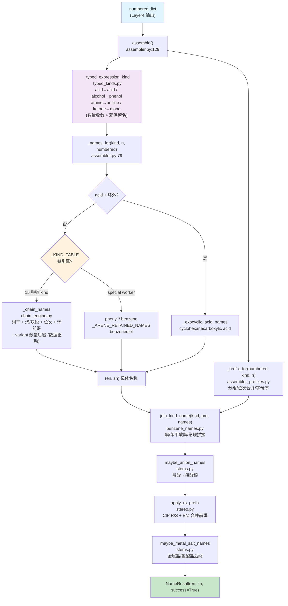

# Layer5: 名称组装 (Name Assembly)

> **管线位置:** 第 5 层 / 6 层 (输出层) | **源文件:** 9 个 `.py` (1387 行) | **最后更新:** 2026-08-14

---

## 概述

Layer5 是 NamePredict 6 层命名管线的终端输出层，负责将前序各层产生的结构化中间数据（编号后的母体信息 + 取代基清单 + 位次分配）组装为完整的中英双语 IUPAC 名称。

2026-08 大重构后，layer5 完成了三件事：**① 词干引擎独立为 `chain_engine.py`**（`_KIND_TABLE` 从 assembler 迁出，新增 `variant` 字段按 multiplicity 切换数量后缀）；**② 新增 `typed_kinds.py`**（kind 正交化收敛 + 苯系保留名决策，原 L2 `_RETAINED_RING_KINDS` 迁此）；**③ 立体化学合并为 `stereo.py`**（`stereo_rs.py`/`stereo_ez.py`/`_stereo_common.py` 三合一），删除 `acyl_halide_names.py`/`iso_arene_names.py`。

**管线中的位置：**

```
Layer4: numbering (位次分配)
    ↓  numbered dict
┌──────────────────────┐
│  Layer5  名称组装      │  ← 当前层 (输出层)
└──────────────────────┘
    ↓  NameResult {en, zh}
输出: "2-chloropropane" / "2-氯丙烷"
```

**职责边界：**

| 职责 | 说明 |
|------|------|
| 母体名称生成 | 根据 parent kind 和碳数 n 查表/构造双语母体词干 |
| 取代基前缀组装 | 按字母序排列、重复基团合并 (di/tri/tetra)、位次号拼接 |
| 立体化学插入 | R/S (CIP) 和 E/Z (双键) 立体描述符的前缀化 |
| 功能类命名 | 酯 (ester)、苯甲酸酯 (benzoate)、酸酐 (anhydride) 的特殊名称模式 |
| 双语输出 | 同步生成英文和中文两套 IUPAC 字符串 |

**输入/输出类型：**

```
assemble(numbered: dict, *, time_ms: float = 0.0, source: str = "iupac") -> NameResult
```

`numbered` 字典是多层管线积累的结构化数据，核心字段包括 `parent`、`substituents`、各种 `_locant`/`_locants` 字段、立体化学字段。`NameResult` 包含 `en: str`, `zh: str`, `success: bool`, `source: str`, `time_ms: float`, `meta: dict`。

---

## 核心逻辑

### 1. 组装总控 (`assemble` 函数)

Layer5 的入口是 `assembler.py` 中的 `assemble` 函数（第 129 行）。它遵循一个清晰的名称变换流水线，每步返回双语元组 `(en, zh)`：

```
assemble(numbered)
  │
  ├─ 0. _typed_expression_kind(kind, numbered)   # typed_kinds.py — kind 正交化收敛
  │      (acid→acid, alcohol→alcohol/苯→phenol, amine→amine/苯→aniline,
  │       ketone→ketone/dione, 苯环单FG→保留名)
  ├─ 1. _names_for(effective_kind, n, numbered)  # 母体名称 (en, zh)
  ├─ 2. _prefix_for(numbered, kind, n)          # 取代基前缀 (pre_en, pre_zh)
  ├─ 3. join_kind_name(kind, pre, names)        # 拼接前缀+母体 (酯/苯甲酸酯有专属拼接)
  ├─ 4. maybe_anion_names(numbered, en, zh)     # 羧酸根阴离子后缀
  ├─ 5. apply_rs_prefix(numbered, en, zh)       # R/S 立体化学前缀
  └─ 6. maybe_metal_salt_names(...)             # 金属盐/盐酸盐后缀
       → NameResult(en, zh)
```

> **源:** `src/namepredict/layer5/assembler.py:129`

### 2. kind 正交化收敛 (`typed_kinds.py`)

`typed_kinds.py`（138 行）把 L2 传入的 kind 收敛为 FG 类别（正交化），并仅在苯环单官能团时返回保留名。**L2 只产生结构 kind，保留名决策完全在 L5**。

- **恒基团名收敛**：链式 case 下 `_typed_acid_kind`（`36-51`）/`_typed_alcohol_kind`（`102-114`）/`_typed_amine_kind`（`116-128`）恒返回 `"acid"`/`"alcohol"`/`"amine"`（数量统一由 `multiplicity` 承载，不再有 diacid/diol/diamine 等数量 kind）
- **苯保留名**（`_ring_retained` `:26-33`）：要求 `scaffold_id=="benzene"` **且** `multiplicity==1`，从 `_BENZENE_RETAINED` 表查（acid→benzoic、ester→benzoate、aldehyde→benzaldehyde、nitrile→benzonitrile、amide→benzamide、amine→aniline、alcohol→phenol）
- **环系判断基于 scaffold_id**（`_scaffold` 读 `parent.scaffold_id`），不再读 L2 组合 kind：
  - `carbocycle` → 返回 FG 类别（"acid"/"alcohol"/"amine"/"ketone"），cyclo 前缀由 chain_engine 运行时加
  - 稠环/杂环 `_RING_FG_SCAFFOLDS = {naphthalene, indole, pyridine, quinoline}` → 同样收敛 FG 类别，词干由 chain_engine 注入
  - 苯环 + 二醇 → `"benzenediol"`
  - 环外酸（`facts.relation.value == "exocyclic"`）→ `"acid"`（"carboxylic acid" 后缀由 chain_engine 组装）
- **ketone**（`_typed_ketone_kind` `:81-90`）：`carbocycle` scaffold 下按 multiplicity 返回 `"ketone"`（=1）/`"dione"`（=2）
- 聚合入口 `_typed_expression_kind`（`:130-138`）依次调用全部 8 个 `_typed_*_kind`

> **源:** `src/namepredict/layer5/typed_kinds.py`

### 3. 链式词干引擎 (`chain_engine.py`)

`chain_engine.py`（365 行）是数据驱动的单链词干引擎——用 `_Chain` spec 描述每类 kind 的命名形态，`_chain_names` 统一渲染，替代了原先按 kind 手写 if 分支。

**`_Chain` 数据类字段**（frozen dataclass，`146-177`）：
- 基础：`kind`/`en_suf`/`zh_suf`/`coda`/`no_loc`（"plain"=无位次出普通名）/`omit_rule`
- FG：`fg`（fg_locants 记录 kind）/`need`（FG 数要求）
- 俗名/派生：`plain_maps`/`plain_fn`
- 烯/炔段：`ene_seg`/`yne_seg`/`mult_seg`（{2:("dien","二烯")…}）/`ene_base`/`ene_special`（俗名钩子）/`yne_suf`/`ez_ene`/`ene_loc_omit`（环单烯省略位次）
- 环：`cyclic`（恒加 cyclo/环前缀）/`cyclic_unsat`/`zh_full`/`stem`（稠环/杂环词干覆盖，如 naphthalen/萘）
- **`variant: dict[int, dict]`**（`{multiplicity: 字段覆盖}`）— 按 multiplicity `replace(spec, **var)` 派生数量后缀（alcohol→diol/triol/tetraol，amine→diamine/triamine/tetraamine，acid→dioic acid）。应用前先 `mult > 1` 判断（mult=1 用默认 spec）

**`_KIND_TABLE`**（`285-365`）现有 **15 个 `_Chain` entry**：`alcohol`、`ketone`、`alkane`、`acid`、`ester`、`thiol`、`amine`、`sec_amine`、`tert_amine`、`aldehyde`、`nitrile`、`dione`、`anhydride`、`amide`（`sec_amine`/`tert_amine` 与 `amine` 共用同一 `_AMINE_SPEC`）。**已删除的组合 kind entry**：`cycloalkane`/`cycloalkene`/`cyclopolyene`/`cycloalcohol`/`cycloketone`/`cycloamine`/`cycloalkanediol`/`cycloalkanedione`——纯烃环并入 `alkane`（cyclo 前缀由 assembler 按 scaffold_id 动态加）。

> **源:** `src/namepredict/layer5/chain_engine.py`

### 4. 母体名称派发 (`_names_for`)

`_names_for`（`assembler.py:79-112`）是母体名称的核心派发函数：

1. `kind == "acid"` 时先试 `_exocyclic_acid_names`（环外 COOH → `cyclohexanecarboxylic acid` / `naphthalene-1-carboxylic acid`，`55-76`）
2. 查 `_KIND_TABLE.get(kind)`；命中则按 `scaffold_id` 运行时替换 spec：
   - `sid in _RING_STEM`（naphthalene/indole/pyridine/quinoline）→ `replace(entry, stem=_RING_STEM[sid], ...)`
   - `sid == "carbocycle"` → `replace(entry, cyclic=True, ene_loc_omit=True, ...)`
   - 然后 `_chain_names(entry, n, numbered)`
3. 非表内 kind 落到具体 worker：`"phenyl"`→("phenyl","苯基")、`"benzene"`→("benzene","苯")、`_ARENE_RETAINED_NAMES`（苯保留名，`15-23`，原 L2 `_ARENE_NAMED` 迁此）、`"benzenediol"`→`_benzenediol_names`、否则 `_parent_stem_names`

> **源:** `src/namepredict/layer5/assembler.py:79-112`

### 5. 双语词干表 (`stems.py`)

`stems.py`（263 行）是整个 Layer5 的数据基础，提供 C1-C35+ 碳数范围的英中双语词干生成器：

**C1-C10：保留名/系统名基表。** 如 `methane`/`甲烷`、`propane`/`丙烷`。

**C11-C19：半系统命名。** 英文复合词干（`undec`, `dodec`...），中文数字+烷（`十一烷`...）。`zh_num(n)` 生成中文数字。

**C20+：乘性组合词干。** 英文按十位 (`icos`, `triacont`...) + 个位 (`hen`, `do`...) 组合，例如 C22 = `docos`。优先 `icos-` 而非旧式 `eicos-`。

**FG 词干派生。** 从烷烃词干推导各官能团的英中名称（alcohol/acid/aldehyde/amide/nitrile/ester/acyl halide）。所有公开词干表通过 `_fill(fn, lo=1, hi=35)` 自动填充。

**盐后缀支持：** `maybe_anion_names` 将羧酸转为羧酸根；`maybe_metal_salt_names` 处理碱性金属盐和盐酸盐。

> **源:** `src/namepredict/layer5/stems.py`

### 6. 取代基前缀组装 (`assembler_prefixes.py`)

`assembler_prefixes.py`（112 行）遵循 IUPAC P-14.5 规则：按取代基英文名字母序排列，重复基团用 di/tri/tetra 合并位次号。

核心函数 `_build_prefix(substituents, n_carbons, kind)`：`_group_by_stem` 分组 → `_locant_str` 位次合并 → 多重度前缀（di/tri/tetra，carboxy 用 bis/tris）→ `_omit_sub_locants` 位次省略 → `_stem_needs_paren` 括号规则 → `_sorted_stems` 字母序排列（用 `alkyl_alpha_key`，与 Layer3 共享同一排序键）。

> **源:** `src/namepredict/layer5/assembler_prefixes.py`

### 7. 苯/芳烃/杂环母体命名 (`benzene_names.py`)

`benzene_names.py`（90 行）提供苯系/杂环母体的拼接与命名助手：

- `benzene_prefix` / `join_parent_name` — 前缀与父名拼接（含 stereo lead 保留）
- `_ester_alkoxy_from` — 酯 O 侧烷基：线性走 `parent.alkoxy_n` 保留名表，特殊基团回落 o_side 取代基
- `join_ester_name`（methyl butanoate / 丁酸甲酯）、`join_benzoate_name`（ethyl 4-chlorobenzoate / 4-氯苯甲酸乙酯）、`join_kind_name`（酯/苯甲酸酯分流）
- `zh_1h_parent` — 中文 1H- 保留名加前缀

**isocyanato/isothiocyanatobenzene 命名去向**：`iso_arene_names.py` 删除后，L5 不再有独立的 iso-芳烃保留名函数。它们现由**取代基前缀路径**处理——`tools/anchored_table.py:111-112` 定义锚定叶基团 `"*N=C=O" → ("isocyanato","异氰酸根合")`、`"*N=C=S" → ("isothiocyanato",…)`，`layer3/claim_extract.py:21` 把它们作为取代基 kind 映射。`isocyanatobenzene` 由「取代基前缀 isocyanato + 苯母体」拼出。

> **源:** `src/namepredict/layer5/benzene_names.py`

### 8. 立体化学 (`stereo.py`)

`stereo.py`（235 行）合并了原 `stereo_rs.py`/`stereo_ez.py`/`_stereo_common.py` 三个模块（同一立体前缀簇），顶部共享 `_split_stereo_lead` 立体块切分器。按两个注释分区组织：

**E/Z 段**（P-91.2/P-93.4）：`_ez_prefix`（单烯）、`_ez_multi_prefix`（多烯 `(2E,6Z)-`）、`ez_for_parent`（多烯走 `_ez_multi_prefix`，否则 `_ez_prefix`）。

**R/S 段**（P-92/P-93）：`_assign_cip`（`Chem.AssignStereochemistry(force=True, cleanIt=True)`）、`_cip_on_chain`（沿母体 chain 检测 `_CIPCode` 手性中心）、`_parse_stereo`/`_format_stereo`/`_merge_parts`（按"先 E/Z 后 R/S"、同类型按位次排序合并）、`_ester_en_rs`（酯在烷基词后插 `(2S)-`）、`apply_rs_prefix`（顶层入口）。

对外被 chain_engine（`_ez_prefix`、`ez_for_parent`）、unsat_acid（`_ez_prefix`）、benzene_names（`_split_stereo_lead`）、assembler（`apply_rs_prefix`）使用。

> **源:** `src/namepredict/layer5/stereo.py`

### 9. 不饱和体系的母体命名 (`unsat_acid.py`)

`unsat_acid.py`（42 行）是烯酸/烯酰胺命名助手，被 chain_engine 消费：

- `_unsat_acid_pair(n, locant, ez, en_sfx, zh_sfx, min_n=2)` — 通用烯酸名对构造
- `alkenamide_names(n, numbered)` — 丙烯酰胺保留名 + `(E)-but-2-enamide` 等；作为 chain_engine `amide` entry 的 `ene_special` 钩子
- `_has_ene`/`_has_yne` — 不饱和检测，供 chain_engine `_chain_unsat` 判断是否进入烯/炔段引擎

醇/酮的多不饱和词干拼接（`but-2-ene-1,4-diol`）由 chain_engine 的 `_chain_polyol_stem`（`190-216`）负责。

> **源:** `src/namepredict/layer5/unsat_acid.py`

### 10. 名称拼接 (`join_kind_name`)

`join_kind_name` 是前缀与母体的拼接函数（`benzene_names.py`），处理三种拼接模式：酯类拼接（`join_ester_name`）、苯甲酸酯拼接（`join_benzoate_name`）、常规拼接（`join_parent_name`，前缀-母体用连字符，数字/`1H-` 开头需连字符）。中文额外处理 `1H-` 前缀（`zh_1h_parent`）。

---

## 文件清单

### 核心组装

| 文件 | 行数 | 说明 |
|------|------|------|
| `src/namepredict/layer5/__init__.py` | 5 | 包入口，导出 `assemble` |
| `src/namepredict/layer5/assembler.py` | 137 | 主组装器：`_typed_expression_kind` 收敛 + `_names_for` 派发（`_KIND_TABLE` 查表 + scaffold_id 运行时替换 + worker）+ 名称变换流水线 |
| `src/namepredict/layer5/assembler_prefixes.py` | 112 | 取代基前缀：分组、位次合并、字母序排列 |
| `src/namepredict/layer5/chain_engine.py` | 365 | **链式词干引擎**：`_Chain` spec + `_KIND_TABLE`（15 个 entry）+ `_chain_names` 统一渲染（variant 按 multiplicity 派生数量后缀） |
| `src/namepredict/layer5/typed_kinds.py` | 138 | **kind 正交化收敛**：`_typed_*_kind` 恒基团名、苯保留名 `_BENZENE_RETAINED`、scaffold_id 环系判断 |

### 词干表 / 母体命名

| 文件 | 行数 | 说明 |
|------|------|------|
| `src/namepredict/layer5/stems.py` | 263 | C1-C35+ 英中双语烷烃及 FG 词干生成器，盐后缀支持 |
| `src/namepredict/layer5/benzene_names.py` | 90 | 苯/芳烃/杂环母体：join_kind_name、酯/苯甲酸酯拼接、`_ARENE_RETAINED_NAMES` |

### 立体化学 / 不饱和体系

| 文件 | 行数 | 说明 |
|------|------|------|
| `src/namepredict/layer5/stereo.py` | 235 | **E/Z + R/S 立体前缀**（原 stereo_rs/stereo_ez/_stereo_common 三合一） |
| `src/namepredict/layer5/unsat_acid.py` | 42 | 烯酰胺保留名 + 不饱和酸助手（chain_engine `ene_special` 钩子） |

> 已删除: `acyl_halide_names.py`（酰卤前缀判断）、`iso_arene_names.py`（iso-芳烃保留名，isocyanato/isothiocyanato 改走取代基前缀）、`stereo_rs.py`/`stereo_ez.py`/`_stereo_common.py`（并入 stereo.py）、`free_to_yl.py`（移至 `tools/free_to_yl.py`）。

### 跨层依赖

layer5 **不再直接 import layer2 或 tools**。全部外部 import 仅：`constants`（MULT_EN/MULT_ZH）、`types`（NameResult）、`layer3.substituent_extractor`（`alkyl_alpha_key`，唯一跨层向下依赖，用于前缀分组排序）。

---

## 数据流图

### Layer5 组装流水线



---

## 对外接口

### `assemble(numbered: dict, *, time_ms: float = 0.0, source: str = "iupac") -> NameResult`

Layer5 唯一的公共接口，将编号完成的结构化数据组装为最终的双语 IUPAC 名称。

| 参数 | 类型 | 说明 |
|------|------|------|
| `numbered` | `dict` | Layer4 输出的编号后数据，含 `parent`、`substituents`、各类 `_locant` 字段 |
| `time_ms` | `float` | 可选的时间戳（毫秒），由 `namer.py` 计算并传入 |
| `source` | `str` | 名称来源标识，默认 `"iupac"` |

| 返回值 | 说明 |
|--------|------|
| `NameResult(en="...", zh="...", success=True)` | 组装成功的双语名称 |
| `NameResult(en="", zh="", success=False, meta={"reason": "unsupported", ...})` | 无法识别的 kind 或缺失关键字段 |

**`NameResult` 结构：**

| 字段 | 类型 | 说明 |
|------|------|------|
| `en` | `str` | 英文 IUPAC 名称 |
| `zh` | `str` | 中文 IUPAC 名称 |
| `success` | `bool` | 组装是否成功 |
| `source` | `str` | 名称来源 (`"iupac"`) |
| `time_ms` | `float` | 累计耗时（毫秒） |
| `meta` | `dict` | 元数据（含 `parent_kind`, `parent_chain`, `depth`, `salt` 等） |

**调用者:** `namer.py:_ok_result` — 在 Layer4 编号完成后立即调用。

---

## 相关页面

- [[architecture/overview]] — 6 层架构总览与层间数据流
- [[architecture/layer4-numbering]] — 上一层：位次分配/编号引擎（Layer5 的直接上游）
- [[architecture/layer2-parent-selector]] — 母体选择器（决定 parent.kind，Layer5 的核心输入）
- [[architecture/layer3-substituents]] — 取代基提取与命名（生成 substituents[] 列表）
- [[architecture/layer1-analyzer]] — 官能团分析器（FG 检测的源头）
- [[concepts/bilingual-naming]] — 中英双语命名约定与差异
- [[concepts/functional-group-priority]] — 官能团优先级表（决定主 FG / 后缀选择）
- [[index]] — Wiki 首页
