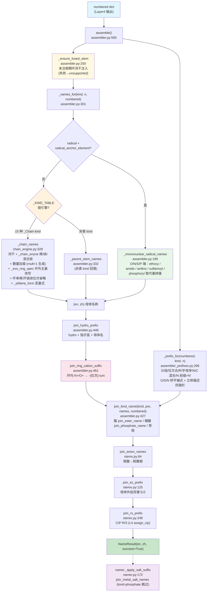

# Layer5: 名称组装 (Name Assembly)

> **管线位置:** 第 5 层 / 6 层 (输出层) | **源文件:** 6 个模块 (1,843 行；含包入口 `__init__.py` 共 7 个 `.py` / 1,845 行，均为 `wc -l` 实测) | **最后更新:** 2026-09-15

---

## 概述

Layer5 是 NamePredict 6 层命名管线的终端输出层，负责将前序各层产生的结构化中间数据（编号后的母体信息 + 取代基清单 + 位次分配）组装为完整的中英双语 IUPAC 名称。

Layer5 由 6 个模块组成：**① 链式词干引擎 `chain_engine.py`**（`_Chain` 规格数据类 + `_KIND_TABLE` 15 个 entry，`_chain_names` 统一渲染：数量后缀由 `mult > 1` 无条件生成、`_elide_parent_e` 母体尾 `e` 省略、`_chain_enyne` 统一烯/炔/混合烯炔段、`_ylidene_form` 亚基式、`_exo_ring_spec` 环外主基后缀改写，并承载 `_BENZENE_RETAINED` 苯单取代保留名表、`_ACYL_HALIDE_BY_HAL` 逐卤素酰卤 spec、`_PHOSPHATE_TAIL` 磷酸词尾钩子）；**② 主组装器 `assembler.py`**（`assemble` 入口 + `_names_for` 派发 + `join_kind_name`/`join_parent_name`/`join_ester_name`/`join_phosphate_name` 拼接 + `_prefix_for` 桥接前缀层 + `_ensure_fused_stem` 稠合词干注入 + `join_hydro_prefix` 指示氢/hydro 前缀 + `join_ring_cation_suffix` 环内 N⁺/O⁺ 的 `-ium` 母体后缀 + `free_to_yl` 母体名→`-yl` 转换 + `_mononuclear_radical_names` 杂原子锚点自由基 + `_phosphoryl_sub_names` P 酰基前缀管线 + `_bridge_enclosed_names` S 桥前端围栏 + `_join_o_side_arms` O-侧臂拼接）；**③ 稠合名组装 `fused_namer.py`**（`benzo[a]...`/`naphtho[...]...` 类稠合 base 名 + `constants.RETAINED_FUSION_ALIASES` 稠合组装名→保留名整名替换）；**④ 前缀组装 `assembler_prefixes.py`**（分组/位次合并、N- 前缀与 N' 多重撇号位次、N/C 混合位次、bis/tris/tetrakis 复合倍增、O/S/N 桥平铺式拆分与其中文同形拆分、前导立体描述符围栏、单碳多取代基括号式）；**⑤ 双语词干表 `stems.py`**（烷烃词干 C1–C99，复用 constants `en_num_term` + 盐/阴离子后缀，金属盐后缀由 `namer` 在 L5 之外调用）；**⑥ 立体化学 `stereo.py`**（E/Z 前缀 + CIP R/S，CIP 指派委托 L4 `assign_cip`，立体位次支持 `3a/6a` 字母位次，并含母体外挂双键的 E/Z 补充入口 `join_ez_prefix`）。**L5 组装用词表集中在 `constants.py`**（`EXO_RING_SUF`/`ESTER_O_SIDE_KINDS`/`AZANE_PAREN_SUF`/`ALKOXY_YLOXY_EN|ZH`/`CHAIN_RETAINED`/`RETAINED_FUSION_ALIASES`/`MONONUCLEAR_HYDRIDES` 派生表/`PHOSPHORYL_STEMS`/`BRIDGE_SUFFIX_EN|ZH`/`BRIDGE_YL_SUFFIX`/`BIS_EN|ZH`/`N_PREFIX_KINDS`/`HALIDE_EN`/`HALO_ZH`/`MULT_EN|ZH`），L5 各模块只按名引用。

**管线中的位置：**

```
Layer4: numbering (位次分配)
    ↓  numbered dict
┌──────────────────────┐
│  Layer5  名称组装      │  ← 当前层 (输出层)
└──────────────────────┘
    ↓  NameResult {en, zh}
输出: "2-chloropropane" / "2-氯丙烷"
```

**职责边界：**

| 职责 | 说明 |
|------|------|
| 母体名称生成 | 根据 parent kind 和碳数 n 查表/构造双语母体词干；环式/稠环母体按 `stem_en`/`stem_zh` 覆盖词干 |
| 取代基前缀组装 | 按字母序排列、重复基团合并 (di/tri/tetra，复合组分 bis/tris)、位次号拼接、N- 前缀 (含 N') |
| 立体化学插入 | R/S (CIP，委托 L4 `assign_cip`) 与 E/Z (母体内双键由 chain_engine 钩子产出、母体外挂双键由 `join_ez_prefix` 补) 的前缀化；位次可为 `3a`/`6a` 等带字母位次 |
| 功能类命名 | 酯 (ester) 的 O-侧臂拼接；环外酸/醛/酯/酰胺/腈 (-carboxylic acid/-carbaldehyde/-carboxylate/-carboxamide/-carbonitrile) 由 `_exo_ring_spec` 改写后缀；苯单取代保留名 (phenol/benzoic acid/benzaldehyde…) 由 `_BENZENE_RETAINED` 提供；磷酸整名由 `join_phosphate_name` 组装 |
| 双语输出 | 同步生成英文和中文两套 IUPAC 字符串 |

**输入/输出类型：**

```
assemble(numbered: dict, *, time_ms: float = 0.0, source: str = "iupac") -> NameResult
```

`numbered` 字典是多层管线积累的结构化数据，核心字段包括 `parent`、`substituents`、各种 `_locant`/`_locants` 字段、立体化学字段。`NameResult` 包含 `en: str`, `zh: str`, `success: bool`, `source: str`, `time_ms: float`, `meta: dict`（`src/namepredict/types.py:9`）。

---

## 核心逻辑

### 1. 组装总控 (`assemble` 函数)

Layer5 的入口是 `assembler.py` 中的 `assemble` 函数（第 500 行），签名 `assemble(numbered: dict, *, time_ms: float = 0.0, source: str = "iupac") -> NameResult`。它遵循一个清晰的名称变换流水线，每步返回双语元组 `(en, zh)`：

```
assemble(numbered)                                   # assembler.py:500
  ├─ 0. _ensure_fused_stem(numbered)                 # assembler.py:250 未注册稠环词干注入（fused_parent_names），失败→unsupported
  ├─ 1. _names_for(kind, n, numbered)                # assembler.py:301 母体名称 (en, zh)
  ├─ 2. join_hydro_prefix(names, numbered)           # assembler.py:448 hydro + 指示氢 + 母体名（P-31.2.2）
  ├─ 3. join_ring_cation_suffix(numbered, names)     # assembler.py:461 环内 N+/O+ → 母体名缀 -{位次}-ium（P-62.4.1）
  ├─ 4. _prefix_for(numbered, kind, n)               # assembler_prefixes.py:296 取代基前缀 (pre_en, pre_zh)
  ├─ 5. join_kind_name(kind, pre, names, numbered)   # assembler.py:427 拼接前缀+母体（酯/磷酸专属拼接，zh 恒拼"酯"）
  ├─ 6. join_anion_names(numbered, en, zh)           # stems.py:64 羧酸根阴离子后缀
  ├─ 7. join_ez_prefix(numbered, en, zh)             # stereo.py:125 母体外挂双键 E/Z 前缀
  └─ 8. join_rs_prefix(numbered, en, zh)             # stereo.py:248 R/S 立体化学前缀
       → NameResult(en, zh)                          # assembler.py:28 _ok
```

> **源:** `src/namepredict/layer5/assembler.py:500`

**金属盐后缀的消费点在 `assemble` 之外**：`assemble` 自身不做盐名处理，`namer._apply_salt_suffix`（`src/namepredict/namer.py:172`）在 L5 返回后以 `{"salt": salt}` 调用 `join_metal_salt_names`（`stems.py:91`）改写成功结果的 `en`/`zh`；`parent_kind == "phosphate"` 时跳过（`namer.py:176`），因为磷酸酯盐名由 `join_phosphate_name` 组装。

`_ensure_fused_stem`（`assembler.py:250`）在取名前注入母体词干：已注册稠环词干由 L2 `pack_parent_stem` 注入（`parent.stem_en` 非空），不进入本分支；未注册稠环（全碳 `scaffold_id=carbocycle` 或 `fused_hetero`）靠 `fused_tree` 调 `fused_parent_names` 组装稠合 base 名注入词干。注入时把 L4 已按整体编号算好的 `parent.indicated_h_locants` 指示氢前缀拼到词干最前端（`_indicated_h_prefix`，`assembler.py:244`；拼接点 `assembler.py:266`，P-58.2.1）——稠合 base 名本身不含指示氢，统一在此补齐。返回 False 表示稠合组装失败（显式 unsupported，避免回落开链词干错名）。

`join_hydro_prefix`（`assembler.py:448`）把 hydro 前缀与动态指示氢拼到母体名前，顺序为 **hydro + 指示氢 + 母体名**（P-31.2.2，如 2,3-dihydro-1H-indole）。动态指示氢只在氢化衍生物（`parent.hydro_prefix` 非空）时注入，否则 `[nH]` 互变异构型会误产 `1H-pyridine`；但当 `parent.indicated_h_forced` 为真时（指示氢来自保留母体名未隐含的芳香位 H，P-58.2.1）即使无 hydro 前缀也把指示氢拼到最前端。母体名已带静态 `1H-`（保留名）时不重复。

`join_ring_cation_suffix`（`assembler.py:461`）在 hydro 前缀之后、拼接之前处理**净正电荷分子的环内阳离子**（P-62.4.1）：分子总电荷为负时不处理（盐/两性离子都可能含环阳离子）；母体链上带 +1 电荷的环内 N/O（`IsInRing()` 且属 `parent.chain`）取该原子位次（经 `parent.numbering_scaffold.labels` 映射）在词干后插 `-{位次}-ium`；色烯型保留名（词干以 `ene` 结尾，如 chromene）走 `chromenylium` 的位次隐含形态。该步只替换母体名、不改中文侧（中文无 `-ium` 对应形态）。

### 2. kind 收敛（在 L2）

**kind 收敛由 L2 `principal_expression._chain_kind`（`src/namepredict/layer2/principal_expression.py:70`）承担**——它对有主基团的骨架直接返回 `group_class.value`（`_chain_kind` 内 `return group_class.value if count >= 1 else None`），`FunctionalGroupClass.NONE` 返回 `"alkane"`，`ACYL`/`RADICAL` 分别固定返回 `"acyl"`/`"radical"`。因此 L2 可达的 kind 集合等于 `FunctionalGroupClass` 的枚举值（`src/namepredict/layer1/functional_group_inventory.py:10`）：`radical`/`acyl`/`acid`/`phosphate`/`ester`/`acyl_halide`/`amide`/`nitrile`/`aldehyde`/`ketone`/`alcohol`/`thiol`/`amine`/`alkane`，共 14 个。数量统一由 `principal_expression_facts.multiplicity` 承载，无 diacid/diol/diamine 等数量 kind，**也不产生 `dione`**（二酮由 chain_engine 的 `_generated_mult_fields` 在命名层产出）。Layer5 无独立的 kind 收敛模块（`typed_kinds.py` 不存在）。

`_KIND_TABLE` 中的 `sulfonic` entry 当前无 L2 kind 落点——`FunctionalGroupClass` 枚举不含 `sulfonic` 成员（`functional_group_inventory.py:10-25`），该 entry 只作为词表存在。

### 3. 链式词干引擎 (`chain_engine.py`)

`chain_engine.py`（529 行）是数据驱动的单链词干引擎——用 `_Chain` spec 描述每类 kind 的命名形态，`_chain_names`（`chain_engine.py:328`）统一渲染，无需按 kind 手写 if 分支。

**`_Chain` 数据类字段**（frozen dataclass，`chain_engine.py:175`；`_: KW_ONLY` 分隔在 `chain_engine.py:181`）：
- 基础：`kind`/`en_suf`/`zh_suf` **必填**（每 kind 互异，无合理默认）；`coda`/`no_loc`/`omit_rule` 为 keyword-only 默认值——`coda`="an"、`no_loc`="plain"、`omit_rule`=`_NO_OMIT`（`chain_engine.py:13`），仅特例显式覆盖（alkane `coda=""`、thiol/sulfonic `coda="ane"`、ketone `no_loc="none"`、alcohol/thiol/amine `omit_rule=_omit_term_locant`（`:8`）、ketone/alkane/radical 自定义 lambda）
- FG：`fg`（fg_locants 记录 kind）/`need`（FG 数要求）
- 俗名/派生：`plain_maps`/`plain_fn`（`_const_plain` `:23`、`_retained_plain` `:28`、`_radical_plain` `:241`）
- 烯/炔段：`ene_seg`（默认 `("en","烯")`；thiol 用 `("ene","烯")` 保留 e）/`yne_seg`（默认 `("yn","炔")`）/`ene_base`/`yne_suf`/`ez_ene`（单烯 E/Z）/`ez_ene_multi`（多烯 E/Z）/`ene_loc_omit`（乙烯 ethene 与环单烯 cyclohexene 省略位次 1）/`yne_loc_omit`（开链烃 ethyne/propyne 省略位次 1，P-14.3.4.2(d)）/`yl_loc_omit`（无环自由基自由价在 C-1 时省略位次）/`zh_loc_omit`/`cyclic`/`cyclic_unsat`/`zh_full`/`stem`/`aromatic`/`wrap`/`unsat_polyol`/`variant`/`plain_hook`
- **数量后缀无开关**：`_chain_names`（`chain_engine.py:339`）在 `mult is not None and mult > 1` 时直接调 `_generated_mult_fields`（`chain_engine.py:247`）生成数量字段——`MULT[m]`+基础后缀（diol/triol/tetraol…任意数量，无硬编码上限），acid/ester 另派生多酸/多酯烯炔基座；`_Chain` 上不存在逐 kind 的数量开关字段。
- **`variant: dict[scaffold, dict[mult, dict]]`**（`{scaffold_id: {multiplicity: 生成式之上的特例字段覆盖}}`，`None` 键=开链）— acid 用 `{None:{2: 草酸俗名/炔禁}}`（`chain_engine.py:475-478`）、ester 用 `{None:{2: oxalate}}`（`:484-487`）、amide 用 `{None:{2: oxamide}}`（`:519-522`）、aldehyde/nitrile/acyl 用 C1/C2 保留名覆盖。`assembler._names_for` 按 `scaffold_id` 注入当前 scaffold 的 variant 子集后，`_chain_names`（`chain_engine.py:343-349`）做多 FG（先数量字段再特例覆盖）或单 FG（`replace(spec, **var)`）分支。
- `wrap`（整体包裹 E/Z，alkane 与 radical 条目用 `_with_ez`（`chain_engine.py:34`）——后者使烯基自由基取代基（含立体双键）拼 `(1Z)-` 前缀）

**`_KIND_TABLE`**（`chain_engine.py:457`）共 **15 个 `_Chain` entry**，键名依次为：
`alcohol`（`:458`）、`ketone`（`:462`）、`alkane`（`:466`）、`acid`（`:471`）、`sulfonic`（`:479`）、`ester`（`:480`）、`phosphate`（`:488`）、`acyl`（`:490`）、`thiol`（`:496`）、`amine`（`:501`）、`aldehyde`（`:505`）、`nitrile`（`:510`）、`amide`（`:515`）、`acyl_halide`（`:523`，默认取 `_ACYL_HALIDE_BY_HAL[Cl]`）、`radical`（`:524`）。无 `anhydride` entry（L5 不产生酸酐链式名）及任何组合 kind——纯烃环用 `alkane`（cyclo 前缀由 assembler 按 scaffold_id 动态加），数量统一由 `multiplicity` + `_generated_mult_fields` 生成式承载。`alkane` 条目显式置 `ene_loc_omit=True, yne_loc_omit=True`——开链烃的 ethene/ethyne/propyne 位次 1 仅在 L4 置 `omit_*_locant` 标志时省略；有 FG 后缀的 kind 不置 `yne_loc_omit`，故 `prop-2-ynoic acid` 恒保留炔位次（P-14.3.4 例外）。

- **`acyl`**（`chain_engine.py:490`）— 酰基残基（P-65.1.7.2）：酸碳恒 locant 1，C3+ 系统名词干 coda "an"+"oyl"（propanoyl…），C1/C2 走 `constants.CHAIN_RETAINED`（`constants.py:178`）保留名（formyl/acetyl）。烯/炔与立体照 acid 融合式（enoyl/ynoyl）。`variant[None]` 供开链保留名；苯环 exocyclic 酰基头保留名 **benzoyl/苯甲酰基** 由 assembler 注入的 `_BENZENE_RETAINED["acyl"]`（`chain_engine.py:451`）产出；杂环/碳环（furan-2-carbonyl/cyclopropanecarbonyl）由 `_exo_ring_spec` 产出。
- **`acyl_halide`**（`chain_engine.py:523`，默认 chloride）— 后缀随实际卤素变：`_ACYL_HALIDE_BY_HAL`（`chain_engine.py:418`，键为卤素原子序数 `{9, 17, 35, 53}`；`_ac_hal_chain` `:402` 按 `HALIDE_EN`/`HALO_ZH` 生成 F/Cl/Br/I 各自的 spec）——en 后缀 `-oyl fluoride/chloride/bromide/iodide`、zh `-酰氟/氯/溴/碘`，保留名（C1/C2、苯甲酰 `benzoyl fluoride` 等）随卤素同变；assembler 按 `parent.hal_z` 选择对应 spec。
- **`sulfonic`**（`chain_engine.py:479`）— P-65.3.1 磺酸后缀：碳母体词干 + `sulfonic acid`/`磺酸`（ethanesulfonic acid / 乙磺酸）；苯单取代走 `_BENZENE_RETAINED["sulfonic"]` **benzenesulfonic acid / 苯磺酸**。
- **`phosphate`**（`chain_engine.py:488`）— 无机功能母体（P-67.1.3）：`fg="phosphate"`，词尾由 `plain_hook=_phosphate_tail` 直接按 `parent.n_oh` 取 `_PHOSPHATE_TAIL`（`chain_engine.py:420`）的双语词尾，不查碳数词表（见 §4.2）。

**多 FG 词干与数量前缀元音省略**：`ketone` entry 置 `unsat_polyol=True`（`chain_engine.py:465`）；数量前缀元音省略（P-14.3.2）在 `_generated_mult_fields`（`chain_engine.py:253`）内联实现——前缀以 `a` 结尾（tetra/penta/hexa…）且后缀以元音开头时省略 `a`（tetra+ol→tetrol、hexa+ol→hexol；di/tri 不受影响）。`_chain_stem_pair`（`chain_engine.py:214`）中文保留完整"烷"的条件是 `unsat_polyol and (zh_full or cyclic)`——仅醇/胺/硫醇或环状保留，开链酮用去"烷"词干（戊-2,4-二酮）。

**母体词干结尾 'e' 的省略由拼接端判定（P-60.2(a)）**：词干交出完整形态（含尾部 `e`，不在此处 `rstrip`），省略交给 `_elide_parent_e(stem, suffix)`（`chain_engine.py:224`）按**最终后缀首字母**判断——仅当 `suffix` 以元音 `a/i/o/u/y` 开头时剥词干尾 `e`，辅音开头（diol/dione/diamine/carbaldehyde 等）保留 `e`，避免 oxolane-3,4-diol 被错拼成 oxolan-3,4-diol；`_chain_plain` 普通拼接（`chain_engine.py:238`）与稠环 scaffold 词干分支（`chain_engine.py:390`）都以 `_elide_parent_e(s, spec.en_suf)` 处理。

**不饱和段引擎三形态**（`_bond_form`，`chain_engine.py:82`）：按 spec 字段择一——`fused`（`ene_base`/`yne_suf` 非空：后缀直接挂词干，enoic acid/ynoic acid）、`polyol`（`unsat_polyol`：词干内嵌 `but-2-ene-1,4-diol`）、`seg`（`fg` 非空：FG 段式）。段词段由 `_bond_seg_str`（`chain_engine.py:93`）出，键位数由 `_bond_locs`（`chain_engine.py:75`）从 `ene_locants`/`yne_locants` 取。

**统一不饱和段引擎 `_chain_enyne`（`chain_engine.py:121`）**：仅有烯 / 仅有炔 / 烯炔混合（烯 `en` 前、炔 `yne` 后）共用同一拼接骨架。非末段出连接段（尾 `e` 在 yne 前省略）、末段出后缀或段式形态；任一段为多键时词干加 `a`（P-31.1.1.2 euphonic a）；E/Z 前缀由 `ez_hook`（`chain_engine.py:140`）挂在整体最前（有任一多键烯时取 `ez_ene_multi`，否则取 `ez_ene`）。**位次省略集中在 `_unsat_loc_omit`（`chain_engine.py:111`）**——仅单段且形态为 `fused`/`polyol` 时：融合式单烯/环单烯（`ene_loc_omit` + L4 `omit_ene_locant`）省位次 1，炔则需 L4 `omit_yne_locant` 且（`yne_loc_omit` 或 polyol 形态）——`acid`/`acyl` 等 FG 后缀 kind 不置 `yne_loc_omit`，故 `prop-2-ynoic acid` 恒保留炔位次（P-14.3.4 例外）；多炔（hexa-1,5-diyne）由 `MULT` 后缀 + 位次列表承载。

**短链单烯单 FG 位次省略融合（P-14.3.4.2/4.4）**：`_chain_enyne` 的段式单段分支（`chain_engine.py:151`）对 **C≤2 单烯单 FG**（烯只能 1(-2)、后缀锚定 1，位次无歧义）省略并融合——`eth-1-en-1-amine` → `ethenamine`（乙-1-烯-1-胺 → 乙烯胺）；另一端的取代基（如 2-nitro）位次照常由前缀保留。

**环单烯双键位次省略融合（P-31.1.2 / P-14.3.4.2(d)）**：`_chain_enyne` 的另一分支（`chain_engine.py:153`）对 **`spec.cyclic`、`ene_loc_omit` 且双键起点与 FG/自由价同为 1** 的环单烯省略冗余的双键 `1` 并与词干融合——`cyclohexen-1-yl`（而非 `cyclohex-1-en-1-yl`）、cyclohex-2-en-1-ol 等；FG/自由价位次仍显式保留。走此分支的 entry 由 assembler 在 `sid == "carbocycle"` 时置 `cyclic=True, ene_loc_omit=True`（见 §4）。

**开链自由基自由价位次省略（P-29.2 方法 1 的烯/炔拓展）**：`_yl_loc_omitted`（`chain_engine.py:62`）判定"无环链式母体（`stem is None`、非 `cyclic`/`cyclic_unsat`）的自由价在 C-1"；`_fg_yl_tail`（`chain_engine.py:68`）据此在**源头**直接返回不含位次的 `en_suf`/`zh_suf`（`prop-1-en-1-yl`→`prop-1-enyl`、丁-3-烯-1-炔-1-基→丁-3-烯-1-炔基），不做事后切串。饱和链的位次省略另由 radical entry 的 `omit_rule`（`loc == 1`，`chain_engine.py:526`）承担；C≤2 时位次 1 无歧义，短链分支（`chain_engine.py:151`）再整体省略（`eth-1-yn-1-yl`→`ethynyl`）。环自由基与稠环 scaffold 词干（`spec.stem` 非空）不走此省略。

**自由基双键亚基式（P-31.2.3）**：`_ylidene_form`（`chain_engine.py:268`）把 `-yl`/`-基` 改写成 `-ylidene`/`亚…基`——`methyl`→`methylidene`、`octyl`→`octylidene`、`cyclopropyl`→`cyclopropylidene`（中文 环丙基→环丙亚基，非环 乙基→亚乙基）；须在 `-yl` 生成之后调用。`_chain_names`（`chain_engine.py:351`/`:397`）读 `parent.radical_ylidene`（L2 碳锚点自由价为双键 `*=C<` 时置位，`src/namepredict/layer2/principal_expression.py:425`），在不饱和段路径与普通词干路径分别套用。

**环外主基后缀改写（`_exo_ring_spec`，`chain_engine.py:298`）**：`constants.EXO_RING_SUF`（`constants.py:161`，键集 `{acid, aldehyde, ester, amide, nitrile, acyl}`）给出每类主基的 `(singular, plural)` 后缀规格。仅当 `principal_expression_facts.relation.value == "exocyclic"` 时改写 `en_suf`/`zh_suf` 并清空 `ene_base`/`yne_suf`（P-65.2.2 环羧酸、P-66.6.1.1.3 环醛）；`plural is None`（酯/酰胺/腈/酰基头）的多取代不改写；苯单取代保留名交给 `_BENZENE_RETAINED`。碳环母体另分两支（`chain_engine.py:319-323`）：环内有 `ene_locants`/`yne_locants` 时用段式后缀（`EXO_RING_SEG`，`chain_engine.py:279`）+ `zh_loc_omit=False`；饱和环取完整氢化物词干 `(cyclo{base}, 环{base})`。`omit_rule` 由 `_ring_prefix_located`（`chain_engine.py:291`）决定：环上另带被编号前缀（非 o_side 且 `attach_idx` 在母体链上）时主基位次不可省略（P-66.6.1）。

**苯单取代保留名 `_BENZENE_RETAINED`（`chain_engine.py:444`，构造器 `_benzene_retained` `:434`）**：10 个键 `alcohol`(phenol/苯酚)/`amine`(aniline/苯胺)/`radical`(phenyl/苯基，`omit_all`)/`acid`/`sulfonic`/`ester`(benzoate)/`acyl`/`aldehyde`/`nitrile`/`amide`；`fg_drop` 者清 `fg` 使保留名不拼 FG 位次，`omit_all` 者恒省位次。assembler 在 `sid == "benzene"` 时优先取该表（见 §4）。

> **源:** `src/namepredict/layer5/chain_engine.py:457`

### 4. 母体名称派发 (`_names_for`)

`_names_for`（`assembler.py:301`）是母体名称的核心派发函数，按以下顺序处理：

1. `kind == "radical"` 且有 `parent.radical_anchor_element` → `_mononuclear_radical_names`（`assembler.py:190`）——杂原子锚点自由基（O 锚点 `-yloxy` 经 `_retained_alkoxy`（`:115`）收拢为 IUPAC 保留烷氧基 ethoxy/propoxy/butoxy/phenoxy；P 酰基锚点走 `_phosphoryl_sub_names`；N 锚点走 azane 系；`assembler.py:304-305`）
2. 查 `_KIND_TABLE.get(kind)`（`assembler.py:306`）；`kind == "acyl_halide"` 时先按 `parent.hal_z` 取 `_ACYL_HALIDE_BY_HAL` 对应 spec 覆盖默认 chloride（`assembler.py:307-308`）；未命中则落 `_parent_stem_names`（`:330`，取 `parent.stem_en`/`stem_zh`）
3. 命中 entry 后按下列运行时替换改写 spec 再 `_chain_names`：
   - `kind == "alkane" and parent.fused_tree and sid != "benzene"` → 直接返回 `_parent_stem_names`（未注册稠环无 FG：`_ensure_fused_stem` 注入的稠合 base 名，不走 chain_engine 拼 ane，`assembler.py:311-312`）
   - `sid == "benzene" and kind == "alkane"` → 直接返回 `("benzene", "苯")`（无主 FG 纯苯，`assembler.py:313-314`）
   - 母体已带词干（`parent.stem_en`/`stem_zh`，环式/稠环/杂环）→ `replace(entry, stem=(en_stem, zh_stem), coda="", omit_rule=lambda n, loc, omit: bool(omit), aromatic=(sid == "benzene"))`（`assembler.py:315-317`）——**词干为完整形态（含尾部 `e`）**，结尾 `e` 的省略由 chain_engine `_elide_parent_e` 按后缀首字母决定（P-60.2(a)，见 §3）；aromatic **仅对苯环置真**使醇注入 `zh_suf="酚"`（苯酚系；杂环醇→醇，非酚，消费点 `chain_engine.py:335`）
   - `sid == "carbocycle"`（无母体词干）→ `replace(entry, cyclic=True, ene_loc_omit=True, omit_rule=...)`（`assembler.py:318-321`；恒加 cyclo/环前缀；`cyclic`+`ene_loc_omit` 使环单烯双键位次 1 走 `_chain_enyne` 的融合省略分支——cyclohexen-1-yl；kind=radical 时该处 `omit_rule` 取 `loc == 1`——单环烃自由价隐式为 1 位）
   - **按 scaffold 注入保留名 variant**：`sid == "benzene"` 且 `kind in _BENZENE_RETAINED` 时取 `_BENZENE_RETAINED[kind]`，否则取 `(entry.variant or {}).get(sid)` → `replace(entry, variant=sc_variant)`（`assembler.py:322-326`）
   - 最后 `_chain_names(entry, n, numbered)`（`assembler.py:327`）

> **源:** `src/namepredict/layer5/assembler.py:301`

### 4.1 稠合名组装 (`fused_namer.py`)

`fused_namer.py`（131 行）实现 **P-25.3.2 稠合名称组装**——用 L2 的 `fused_tree` 拆解树生成 `benzo[a]...`/`naphtho[...]...` 类稠合名（供**未注册稠环**的 base 名；母体/附加组分均为已注册保留件，但整体系统不在 `_TEMPLATES` 内）。当前支持**单边融合**。L5 分层纯净：组件词干与保留前缀**不在 L5 留表**，由 L2 打包期从 `ring_scaffold._TEMPLATES` 取出写进 `FusedNode.fused_stem`/`.fused_prefix`，L5 只读节点字段（L5 不得 import L2）；编号走 L4 `fused_component_numbering`（`src/namepredict/layer4/numbering_engine.py:376`）。

核心入口 `fused_parent_names(mol, node)`（`fused_namer.py:112`）：

- **`constants.RETAINED_FUSION_ALIASES`**（`constants.py:186`，7 条）— 稠合组装名 → 保留名**整名替换**（P-25.1.1），只在位次形态与稠合名完全相同时命中（`benzo[c]furan→2-benzofuran`、`benzo[c]pyrrole→isoindole`、`benzo[b]benzofuran→dibenzofuran`、`benzo[b]quinoxaline→phenazine`、`benzo[a]indene→fluorene`、`benzo[d]1,2-oxazole→1,2-benzoxazole`、`benzo[b]anthracene→tetracene`）；未命中则整名原样输出（`fused_namer.py:130-131`）
- **`_component_prefix`**（`fused_namer.py:11`）— 只读节点字段：优先取 `node.fused_prefix`（保留前缀），无则走通用「去尾 e 加 o / 中文加并」（P-25.3.2.2.2）。词干取 `node.fused_stem`（L2 未标注的非稠合零件返回 `(None, None)`）；**事实来源**是 L2 `_TEMPLATES` 的 `fused`/`fused_stem`/`fused_prefix` 字段（zh 修正 quinoxaline→喹喔啉、oxane→氧杂环己烷；含 `purine`/`嘌呤`、`pteridine`/`蝶啶` 稠合杂环组分；indole/purine 用 `fused_stem` 去掉 `1H-`/`7H-` 指示氢前缀）
- **`_component_numbering`**（`fused_namer.py:21`，带 `shared` 参数）— 组分自身编号，委托 L4 `fused_component_numbering`（P-25.4/P-25.3.3），把稠合掉的 `shared` 原子当取代基做位次最小化；`shared` 缺省时兜底取 `node.attached[0].fusion_shared[0]`，取前须同时判 `fusion_shared` 非空，否则 `[0]` 越界
- **融合描述符** — `_fused_one`（`fused_namer.py:66`）**取 child 的 `fusion_shared[0]` 作为同一稠合原子集，同时传给母体与附加组分各自编号**（P-25.3.1.3 位次尽可能低），使取向与规范稠合描述符一致；`_fusion_letter`（`fused_namer.py:44`）共享边在母体外周位次序中的侧字母 `chr(97+i)`；`_fusion_numbers`（`fused_namer.py:56`）附加组分共享原子位次（沿母体低位次端→高位次端）。**`child_node.fused_omit_numbers` 为真时**（一级单环烃附加组分：benzo 及 P-25.3.2.2.1 的 cyclopenta 等，L2 `ring_scaffold.omits_fusion_numbers`（`src/namepredict/layer2/ring_scaffold.py:170`）判定，字段打包点 `src/namepredict/layer2/fused_system.py:213`）直接出 `prefix + [字母]` 省略数字位次（P-25.3.8.1），无需再跑附加组分自身编号；否则拼 `prefix + [数字,数字-字母]`
- **`_inner_atoms`**（`fused_namer.py:35`）— 出现在 ≥3 环的原子（perifused 中心）不在外周边界；`_fused_one` 过滤内原子后取外周 chain
- **`_collect_attached`**（`fused_namer.py:99`）— 递归收集 parent_node 全部附加组分前缀（嵌套组分在附着的一级前），与根词干拼接为最终 `benzo[a]naphthalene` 式名
- 入口环集取 `sssr_rings(mol)`（`fused_namer.py:119`，L1 `ring_systems.sssr_rings`（`src/namepredict/layer1/ring_systems.py:23`）），再按 root 环集从 `build_ring_systems(mol)`（`fused_namer.py:122`，`ring_systems.py:117`）中取该稠合系统的 `fusion_edges`

单节点（`not node.attached`）直接返回 `None`（`fused_namer.py:114`），由 `_parent_stem_names` 走保留名（L2 已注入词干）。

> **源:** `src/namepredict/layer5/fused_namer.py:112`

### 4.2 磷酸/磷酸酯整分子命名

`kind=phosphate` 走 **`_KIND_TABLE["phosphate"]` entry + `assembler.join_phosphate_name`** 两段式：词尾由 chain_engine 的 `plain_hook` 产出，整名由 assembler 的 O-侧拼接产出（P-67.1.3 单核非碳酸含氧酸的盐/酯）。

**词尾（chain_engine 侧）**：`_PHOSPHATE_TAIL`（`chain_engine.py:420`）以 `parent.n_oh`（P 上剩余酸式氢数）为键给出双语词尾——`3→("phosphoric acid","磷酸")`、`2→("dihydrogen phosphate","磷酸二氢")`、`1→("hydrogen phosphate","磷酸氢")`、`0→("phosphate","磷酸")`；`_phosphate_tail`（`chain_engine.py:428`）为 `plain_hook` 实现，0–3 之外返回 `None`。`_chain_names`（`chain_engine.py:331-334`）在取词干前先跑 `plain_hook`，故 P 中心无碳词干、`_Chain` 的词表字段不被消费。

**整名（assembler 侧）**：`join_phosphate_name(names, numbered)`（`assembler.py:279`）由 `join_kind_name` 在 `kind in ESTER_O_SIDE_KINDS`（`constants.py:143` = `{ester, phosphate}`）时分派（`assembler.py:432-434`）。它读 `parent.n_om`（已酯化 P–O–C 数）与 `parent.salt_meta`（L0 盐元数据），臂取 `numbered.substituents` 中 `o_side` 为真的酯烷基条目（`_o_side_arms` `assembler.py:372`），经 `_join_o_side_arms(..., group=True, arm_zh_fn=_phosphate_arm_zh)`（`assembler.py:282`）按臂名分组倍增（`_mult_rows` `assembler_prefixes.py:13`）。四类形态分支（`assembler.py:290-298`）：

| 形态 | 条件 | 产出 | 锚点 |
|------|------|------|------|
| 酸式盐 | 无臂、有金属 | `metal + tail` / `{tail_zh}{metal_zh}`（磷酸二氢钾，无「酯」） | `assembler.py:291-292` |
| 游离阴离子 | 无臂、`n_om>0`、无金属 | `tail` / `{tail_zh}根`（负电荷不标注） | `assembler.py:293-294` |
| 游离磷酸 | 无臂、`n_om==0`、无盐 | `tail` / `tail_zh` | `assembler.py:295` |
| 酯盐 | 有臂、有金属 | `metal arms tail` / `{tail_zh}{arms_zh}酯 {metal_zh}盐` | `assembler.py:296-297` |
| 中性磷酸酯 | 有臂、无盐 | `arms tail` / `{tail_zh}{arms_zh}酯` | `assembler.py:298` |

**中文臂词干 `_phosphate_arm_zh`**（`assembler.py:269`）：简单单字基去「基」（甲基→甲、苯基→苯），纯中文数字的直链烷基补「烷基」（十三基→十三烷基）以对齐金标，复合/带位次/立体臂原样保留。金属名由 stems 的 `_metal_en_prefix`/`_metal_zh_suffix`（`stems.py:81`/`:86`）提供。

**盐门控在 L2**（`principal_expression._chain_phosphate_fields`，`src/namepredict/layer2/principal_expression.py:317`）：`n_om>0` 时若有碱金属须与其同数配对，中性酸/酯不允许带金属，完全无抗衡金属的游离磷酸根/磷酸酯阴离子放行；不通过则 `kind=phosphate` 不出现在 numbered 中，L5 直接 unsupported。末端 `namer._apply_salt_suffix`（`src/namepredict/namer.py:172`）对 `parent_kind=="phosphate"` 跳过通用金属盐后缀（`namer.py:176`），避免与 `join_phosphate_name` 已组装的盐名重复。

> **源:** `src/namepredict/layer5/assembler.py:279`

### 5. 双语词干表 (`stems.py`)

`stems.py`（104 行）提供烷烃英中双语词干生成器与盐/阴离子后缀，碳数支持 **C1–C99**。**stems 不提供 FG 词干派生函数**（`alcohol_en`/`acid_en`/`amide_en` 等不存在）——FG 名称由 chain_engine 用 `_en_stem` + `spec.en_suf`/`zh_suf` 直接拼接，stems 不为各官能团单独造词：

- **C1-C10：保留名/系统名基表。** `_ALKANE_EN_BASE`/`_ALKANE_ZH_BASE`（`stems.py:8`/`:12`）：`methane`/`甲烷`、`propane`/`丙烷`...
- **C11+：英文词干复用 `constants.en_num_term`**（数量词与母链碳数同源）：`_en_stem`（`stems.py:34`）对 n≥11 直接 `en_num_term(n)[:-1]` 去尾 'a'（undec/icos/docos…）；中文侧用 `constants.HS_NUMBER`（甲…癸）与 `constants.ZH_DIGITS`，`zh_num(n)`（`stems.py:19`）生成中文数字（十一…九十九），`alkane_zh(n)`（`stems.py:48`）补「烷」，`zh_stem`（`stems.py:26`）按 `_ZH_SUFFIXES`（`stems.py:16`）去尾得词干。`constants.MULT_EN`/`MULT_ZH`（`constants.py:87`/`88`）覆盖 1–99 供倍数词使用。
- **公开 API：** `alkane_en`/`alkane_zh`/`zh_num`/`zh_stem`/`_en_stem`、`acid_to_anion_en`（`stems.py:55`，oic/ic acid → oate/ate）、`join_anion_names`（`stems.py:64`，羧酸→羧酸根，读 `parent.anion`）、`join_metal_salt_names`（`stems.py:91`，碱金属盐与酸式盐，读 `numbered.salt`，由 `namer._apply_salt_suffix` 调用）。

> **源:** `src/namepredict/layer5/stems.py`

### 6. 取代基前缀组装 (`assembler_prefixes.py`)

`assembler_prefixes.py`（303 行）遵循 IUPAC P-14.5 规则：按取代基英文名字母序排列，重复基团用 di/tri/tetra 合并位次号。

核心入口 `_prefix_for(numbered, kind, n)`（`assembler_prefixes.py:296`）取上下文后转 `_build_prefix(substituents, n_carbons, kind, scaffold, has_ene)`（`assembler_prefixes.py:279`）：滤 O 侧（`:282`）→ `_omit_sub_locants` 位次省略判定（`:285`）→ `_mult_rows` 分组（`:286`）→ `_collect_parts` 逐词干渲染（`:293`）→ 单碳多取代基括号式门控（`:290-292`，`_groups_simple` `:268`）。字母序用 `alkyl_alpha_key`（`src/namepredict/tools/re.py:56`，与 Layer3/Layer4 共享同一排序键）。`kind == "radical"` 且有 `radical_anchor_element` 时直接返回空前缀（`assembler_prefixes.py:300-301`，烷基取代基已并入杂原子锚点组装名）。

**前导立体描述符围栏（`_stem_needs_paren`，`assembler_prefixes.py:67`）**：除显式 `paren` 标记、前导位次词干（`1H-indol-5-yl`）与未省略位次下的 trifluoromethyl 外，词干匹配 `_STEREO_LEAD_RE`（`assembler_prefixes.py:90`：`(1Z)-`/`(2R,4R)-`/`(9Z,12Z)-`）时英文侧也须整体加括号；中文侧 `_prefix_one_zh`（`assembler_prefixes.py:196`）用同一正则同步加括号（两侧同形，如 `5-[(1Z)-丙-1-烯基]苯`）。加围栏原语 `_enclose`（`:76`）/`_wrap_stem`（`:81`）/`_place`（`:86`）。

**`_locant_str` 支持 N/C 混合位次（`assembler_prefixes.py:26`）**：N-型取代基（`kind ∈ N_PREFIX_KINDS`，`constants.py:39` = `{n_alkyl, n_block}`）渲染为字母位次 `N`（与 C 数字位次并排、经 `locant_str_sort`（`src/namepredict/layer4/locant_calc.py:13`）排序后 N 自然排最前）——同一词干组混入 C-型成员时走数字通道而非 N-N 计数吞掉 C 位（如 `N,N,2-trimethyl`）。

**`_omit_sub_locants` 位次省略门控（`assembler_prefixes.py:39`）**：
- **自由基母体（`:42`）**：连接点隐含 locant 1，单碳链（`n_carbons == 1`）省略位次。
- **单碳母体（`:44`）**：位次隐含省略；但**同一取代基组内 N-型与 C-型并存时 C 侧必须带数字位次**（`assembler_prefixes.py:45-46`）——胺的数字位次含单核母体的 `1`，与 `N` 位次并引消歧（P-62.2.4.1.2：`1,1-dimethoxy-N,N-dimethylmethanamine`）。
- **纯烃环/苯单取代隐含（`:47-50`）**：`kind=="alkane"` 且 `scaffold ∈ {carbocycle, benzene}` 且无烯、且仅 1 个取代基时省略。
- **酰胺 N-（`:51-52`）**：取代基全为 N-型时省略。
- **酰基/酮/酸（`:53-54`）恒不省略**。
- **复合取代基不省略（`:55-56`）**：任一取代基带显式括号（`paren` 或 en 名以 `(` 开头）时母体位次承载消歧信息，保留。
- **C2 单取代省略收紧（`:60-64`）**：仅对端碳（FG 所在 C1）无可取代 H 的母体成立（腈/酸/酯/醛/酰胺等）；**醇/胺/硫醇的 C1 带可取代 H，2- 位取代构成不同异构体（P-14.3.4.4），`2-` 必须保留**；自带位次的取代基同样保留。

**复合倍增前缀（P-16.3.2）**：`_mult_of`（`assembler_prefixes.py:174`）以 `_COMPLEX_MULT_LANG`（`:171`）按语言取表——词干含 sentinel（en `carboxy`/zh `羧`）或组成员带 `paren` 标记时用 **bis/tris/tetrakis**/**双/三/四**（`BIS_EN`/`BIS_ZH`），否则 di/tri/tetra（`MULT_EN`/`MULT_ZH`）。

**O/S/N 桥后缀平铺式（P-63.2.2.1）**：`constants.BRIDGE_SUFFIX_EN`（`constants.py:157`）= `("oxy","sulfanyl","amino")`；`_split_bridge_suffix`（`assembler_prefixes.py:128`）把 `-yl]oxy`/`-yl]sulfanyl`/`-yl]amino` 拆成 (前端, 桥后缀)——括号闭在前端 `-yl` 后、桥后缀留在括号外。是否拆由 `_front_needs_enclosure`（`assembler_prefixes.py:105`）按前端形态判定：前端自身即复合桥名（`…amino`/`…sulfanyl`）须拆；磺酰/亚磺酰前端不拆；苄基型前端（`_BENZYL_TAIL_RE`，`assembler_prefixes.py:102`，`…]methyl$`）不拆——桥后缀直接缀在甲基上（methylsulfanyl）；手性自由价碳前端须围栏（`(2R)-2-amino-2-carboxyethyl`），酰基前端走 `…oyloxy` 融合（acetyloxy/benzoyloxy）；环型内嵌位次（`…oxan-2-yl`）在 oxy/sulfanyl 桥下围栏；`amino` 桥细分（方括号前端在括号后接数字位次前缀如 `…]amino]-3-oxopropyl` 时拆并整体围栏）。**磺酰/亚磺酰桥 + 直链 `-yl` 前端**（`_sbridge_flat_stem`，`assembler_prefixes.py:140`）英文侧平铺不加围栏（propan-2-ylsulfonyl，P-63.2.1），前端为复合取代基时由 assembler `_bridge_enclosed_names` 定形围栏（`(4-methoxyphenyl)sulfonyl`）。平铺主体由 `_bridge_body`（`assembler_prefixes.py:146`）构造：前端围栏 + 桥后缀留括号外，前端围栏已是方括号且桥为氨基时整体再括一层（P-63.2.2.1.2）。`_prefix_one_en`（`assembler_prefixes.py:154`）的括号/桥拆分不受 `omit`/多重度门控（`need = _stem_needs_paren(...) and not _sbridge_flat_stem(stem)`），位次省略或带数量前缀时同样出桥平铺式。**中文侧同形拆分** `_split_bridge_suffix_zh`（`assembler_prefixes.py:182`）：判据取自英文 stem（`_split_bridge_suffix(en_stem)` 命中才拆，`_parts_for_stem` 透传 `en_stem`），保证中英围栏同形；环/链自由价位次在桥融合时被「氧基」顶掉的「基」在拆分时补回（喹啉-8-氧基 → 喹啉-8-基）。

**单碳多取代基括号式（P-16.5.1.3.1/.3.2）**：`_build_prefix`（`assembler_prefixes.py:290`）在母体 `n_carbons==1`（meth 链）且 `kind=="radical"`、位次省略、≥2 个不同词干、且全部词干**简单**（`_groups_simple`）时启用 `bracket`——把**首词干平铺、第二及以后词干各自加圆括号**（倍增前缀不括入），词干间**无连字符**（`_collect_parts` `:258-260`）。

**N- 前缀（P-62.2 胺 N 端取代基）**：`_parts_for_stem`（`assembler_prefixes.py:223`）**仅当整组全为 N-型成员**（`kind ∈ constants.N_PREFIX_KINDS`，即 L3 claim 槽位 `amine_n`→`n_block`（`constants.py:141`））才走 `_n_prefix`（`assembler_prefixes.py:216`）计数——输出 `N-methyl`/`N,N-dimethyl`/`N,N'-bis[...]`（英文）/`N-甲基`/`N,N-二甲基`/`N,N'-双[...]`（中文），强制省略位次；复合取代基（含 locant/显式括号）整体括起（`N-(3-bromophenyl)`）。非 N 通道时 `_parts_for_stem` 把英文 stem 作 `en_stem` 透传给 `_prefix_one_zh`（`assembler_prefixes.py:234-235`），供中文侧与英文侧同步判定桥平铺式。**多重 N 位次消歧**：`_n_prime_map`（`assembler_prefixes.py:238`）按引用序把 N-型取代基所在的 N 原子排序（字母序最前的取代基所在 N 取不加撇的 `N`，其余依次加撇），`_parts_for_stem`（`:231`）据此为每个成员生成 `N`/`N'`/`N''` 记号——两个甲基挂不同氮时漏撇号会把结构写成另一个分子（P-14.5）。同词干混入 C-型时落入数字通道、N-型成员由 `_locant_str` 渲染为 `N`。

> **源:** `src/namepredict/layer5/assembler_prefixes.py:279`

### 7. 名称拼接 (`join_kind_name`)

`join_kind_name`（`assembler.py:427`）是前缀与母体的拼接函数，按 kind 分两种拼接模式：`kind ∈ ESTER_O_SIDE_KINDS`（`{ester, phosphate}`）时 O-侧臂作前缀、酸侧作主体——`phosphate` 转 `join_phosphate_name`（`assembler.py:433-434`，见 §4.2），`ester` 转 `join_ester_name`（`assembler.py:413`）；其余走常规拼接（`join_parent_name`，`assembler.py:343`）。`join_parent_name` 经 `_stereo_lead`（`stereo.py:13`）切出立体块后判定：母体名以数字（`1,3-thiazole`）、方括号位次集（`[1,2,4]triazolo[1,5-a]pyridine`）或 `1H-`（`1H-pyrrole`）开头时前缀-母体需连字符。中文酯名的 O 侧基渲染由 `_zh_alkoxy_part`（`assembler.py:356`，规则 `_ZH_SIMPLE_YL_RE`/`_ZH_PLAIN_YL_RE` `:353`/`:352`）承担（简单烃基省「基」、仅带位次者保留「基」、带括号者加围栏，P-65.6.3）；中文额外处理环被取代时的 `1H-` 前缀（`zh_1h_parent`，`assembler.py:441`）。`_join_o_side_arms`（`assembler.py:377`）在 `group=False`（酯）时同名臂用 di/tri 或 `BIS_EN`（带 `paren` 时，P-16.3.2）、异名臂依次平铺（methyl ethyl oxalate）；在 `group=True`（磷酸）时按臂名分组倍增后以空格相接。

> 注：`benzene_names.py` 不存在——苯/芳烃/杂环母体拼接函数全部位于 `assembler.py`；环外主基后缀改写位于 `chain_engine._exo_ring_spec`。

### 8. 立体化学 (`stereo.py`)

`stereo.py`（255 行）承担全部立体前缀（E/Z 与 CIP R/S 同一模块），顶部共享 `_split_stereo_lead`（`stereo.py:13`）立体块切分器（`assembler.py` 以 `_stereo_lead` 别名导入，`assembler.py:20`）。

**E/Z 段**（P-91.2/P-93.4）：`_ez_prefix`（`stereo.py:37`，单烯 `(2E)-`）、`_ez_multi_prefix`（`stereo.py:72`，多烯 `(2E,6Z)-`）、`ez_for_parent`（`stereo.py:85`，有 `double_bonds` 走多烯，否则单键）；三者经 `_Chain.ez_ene`/`ez_ene_multi` 钩子被 chain_engine 消费（`chain_engine.py:140`）。**母体外挂双键**（仅一端在母体链/环上）由 `_exo_ez_parts`（`stereo.py:105`）扫描全分子双键收集，位次取母体侧并经 `_parent_locants`（`stereo.py:93`）换算；入口 `join_ez_prefix`（`stereo.py:125`）在 `assemble` 第 7 步调用，跳过母体名已携带的同位次描述符，酯名走 `_ester_en_rs` 插到烷基词后。

**R/S 段**（P-92/P-93）：`_RS_KINDS = frozenset(c.value for c in FunctionalGroupClass)`（`stereo.py:141`，枚举来自 `src/namepredict/layer1/functional_group_inventory.py:10`）——覆盖全部 FG 类别值 + `alkane`（`NONE`），烃链手性中心同样标 R/S。CIP 指派委托 **L4 `numbering_engine.assign_cip`（`src/namepredict/layer4/numbering_engine.py:99`，按 mol 记忆化）**——该函数赋 CIP 前先给**隐式 H 的手性标记碳**（chiral tag 非 `CHI_UNSPECIFIED`、`TotalNumHs==0`、`degree<4`）补显式 H，再 `AssignStereochemistry(force=True, cleanIt=True)` + `rdCIPLabeler.AssignCIPLabels` 并把 `_CIPCode` 拷回原原子；编号期与 L5 打印共用这一实现。`_cip_on_chain`（`stereo.py:144`）扫母体链上手性中心，`_rs_parts`（`stereo.py:179`）判定**产出 R/S 的母体**：kind ∈ `_RS_KINDS` 放行，**环/稠合骨架母体（parent 有 `scaffold_id`）不论 kind 都放行**——其 chain 是 L4 定向编号的整环 walk，环上 sp3 手性中心可被扫到。仍跳过折叠环（`_collapsed_parent`，`stereo.py:166`）与空链。`_cip_on_chain`/`_with_rs` 另被 L3 反向复用（`src/namepredict/layer3/as_substituent.py:17`，用原分子 CIP 校正 `*` 锚定块的 R/S）。

**链序号 → locant 的标签换算（`_chain_locant`，`stereo.py:156`）**：位次经 `parent.numbering_scaffold.labels`（L4 整体编号标签）映射，纯数字标签归一为 `int`、带字母标签保留字符串——稠环桥头手性碳由此得 `3a`/`6a` 而非链序号 `3`/`6`。`_parse_token`（`stereo.py:192`）以正则 `^(\d+)([a-z]*)([EZRS])$` 解析 token，支持 `'2E'`→`(2,'E')` 与 `'3aR'`→`('3a','R')`；`_format_stereo` 的排序键 `_part_key`（`stereo.py:216`）对带字母位次者用 L4 `locant_key`（`src/namepredict/layer4/locant_calc.py:7`）——保证 `"4" < "4a" < "5" < "10"` 的数值+字母序。

`_parse_stereo`（`stereo.py:203`）/`_format_stereo`（`:222`）/`_with_rs`（`:231`，按"先 E/Z 后 R/S"、同类型按位次排序并入已有立体块）/`_ester_en_rs`（`stereo.py:240`，酯在烷基词后插 `(2S)-`）/`join_rs_prefix`（`stereo.py:248`，顶层入口）。

> **源:** `src/namepredict/layer5/stereo.py`

---

## 文件清单

| 文件 | 行数 | 说明 |
|------|------|------|
| `assembler.py` | 521 | **主组装器**：`assemble` 入口流水线（稠合词干 → 取名 → hydro/指示氢 → 环阳离子 → 前缀+拼接 → 阴离子 → E/Z → R/S）+ `_names_for` 派发（radical 锚点短路 + `_KIND_TABLE` 查表 + scaffold_id 运行时替换 + `_BENZENE_RETAINED`/`variant` 注入）+ `_mononuclear_radical_names`（amido 保留式/N,N 括号式/azane 内层组括号/P 酰基 `_phosphoryl_sub_names`/anilino 保留式/sulfamoyl 融合）+ `free_to_yl` 与 `_mononuclear_en`/`_mononuclear_zh`/`_retained_alkoxy`（母体名 → -yl 取代基）+ `join_phosphate_name`/`_phosphate_arm_zh`（磷酸整名）+ `_join_o_side_arms`（O-侧臂）+ `_bridge_enclosed_names`/`_bracket_bridge_suffix`/`_alpha_key`（S 桥前端围栏、复合组分方括号、字母序键）+ `join_hydro_prefix`（hydro + 指示氢）+ `join_ring_cation_suffix`（环内 N+/O+ → `-ium`）+ `join_kind_name`/`join_ester_name`/`join_parent_name`/`zh_1h_parent` 拼接 |
| `assembler_prefixes.py` | 303 | 取代基前缀：`_build_prefix` 分组/位次合并、`_locant_str` N/C 混合 locant、`_mult_of` 复合倍增 bis/tris/tetrakis、O/S/N 桥平铺式拆分（`_split_bridge_suffix`/`_front_needs_enclosure`/`_bridge_body`/`_sbridge_flat_stem`）与中文同形拆分（`_split_bridge_suffix_zh`）、前导立体描述符围栏（`_STEREO_LEAD_RE`）、N'-撇号多重 N 位次 + N- 前缀 + 单碳括号式（P-16.5.1.3.1） |
| `chain_engine.py` | 529 | **链式词干引擎**：`_Chain` spec + `_KIND_TABLE`（15 个 entry，键名见 §3）+ `_chain_names` 统一渲染（`mult>1` 数量后缀生成 + `_generated_mult_fields` 元音省略 + `_elide_parent_e` + 短链烯融合 + 环单烯双键位次融合 + `ene_loc_omit`/`yne_loc_omit` + `_yl_loc_omitted`/`_fg_yl_tail` 自由价位次省略 + `_ylidene_form` 亚基式 + `_chain_enyne` 统一烯/炔/混合烯炔段 + 多烯 E/Z + `unsat_polyol`）+ `_exo_ring_spec` 环外主基后缀改写 + `_BENZENE_RETAINED` 苯保留名 + `_PHOSPHATE_TAIL`/`_phosphate_tail` 磷酸词尾 + `_ACYL_HALIDE_BY_HAL` 逐卤素酰卤 spec |
| `fused_namer.py` | 131 | **稠合名组装**：`fused_parent_names`（benzo[a]…/naphtho[…]- 稠合 base 名 + `constants.RETAINED_FUSION_ALIASES` 保留名整名替换，P-25.1.1），组分词干/保留前缀由 L2 打包进 `FusedNode.fused_stem`/`.fused_prefix` 后只读（含 purine/嘌呤、pteridine/蝶啶；shared 共享编号；`fused_omit_numbers` 单环烃附加组分省数字） |
| `stems.py` | 104 | 烷烃双语词干生成器（C1–C99，复用 constants `en_num_term`/`HS_NUMBER`/`ZH_DIGITS`）+ 盐/阴离子后缀（`join_anion_names`/`join_metal_salt_names`；FG 名称由 chain_engine 拼接） |
| `stereo.py` | 255 | **E/Z + R/S 立体前缀**（单模块；CIP 指派委托 L4 `assign_cip`；`_RS_KINDS` 覆盖全部 FG 枚举值；`join_ez_prefix` 补母体外挂双键 E/Z；`3a/6a` 字母位次与 `locant_key` 排序） |

> 备注：layer5 共 6 个模块（1,843 行）；另有包入口 `__init__.py`（2 行，仅文档字符串），全层合计 7 个 `.py` / 1,845 行。调用方 `namer.py:20` 直接从 `namepredict.layer5.assembler` 导入 `assemble`。`benzene_names.py`/`typed_kinds.py`/`unsat_acid.py`/`acyl_halide_names.py`/`iso_arene_names.py` 均不存在（kind 收敛在 L2 `_chain_kind`；拼接在 assembler.py；环外主基后缀改写由 `chain_engine._exo_ring_spec` + `constants.EXO_RING_SUF` 承担；酰卤命名由 `_KIND_TABLE` 的 `acyl_halide` entry + `_ACYL_HALIDE_BY_HAL` 承担；isocyanato/isothiocyanato 走取代基前缀；`free_to_yl` 在 `assembler.py:178`）。

### 跨层依赖

layer5 不 import layer2 与 layer3（`free_to_yl` 在 L5 内、`alkyl_alpha_key` 在 `tools` 内，L5 不依赖 L3 模块）。

**向下依赖（L5 → 其它层）**：`constants`（`MULT_EN`/`MULT_ZH`/`HALIDE_EN`/`HALO_ZH`/`AMIDO_RETAINED`/`CLAIM_KIND`/`en_num_term`/`zh_numeral`/`ZH_DIGITS`/`HS_NUMBER`/`N_PREFIX_KINDS`/`zh_bridge_root`/`EXO_RING_SUF`/`ESTER_O_SIDE_KINDS`/`AZANE_PAREN_SUF`/`ALKOXY_YLOXY_EN|ZH`/`CHAIN_RETAINED`/`RETAINED_FUSION_ALIASES`/`MONONUCLEAR_HYDRIDES` 派生表/`PHOSPHORYL_STEMS`/`BRIDGE_SUFFIX_EN|ZH`/`BRIDGE_YL_SUFFIX`/`BRIDGE_ZH_YL_SUFFIX`/`BIS_EN|ZH`）、`types`（`NameResult`）、`layer1`（`functional_group_inventory.FunctionalGroupClass`（`stereo.py:8`）、`ring_systems.sssr_rings`/`build_ring_systems`（`fused_namer.py:7`）、`fg_registry`（`assembler_prefixes.py:6`，当前未在该模块内消费其符号））、`tools.re`（`alkyl_alpha_key`）、`layer4`（`locant_calc.locant_key`/`locant_str_sort`、`numbering_engine.assign_cip`/`fused_component_numbering`）、`rdkit.Chem`（stereo 的键立体枚举与 CIP）。

**L3 → L5 反向引用**：`src/namepredict/layer3/as_substituent.py:17` 导入 `layer5.stereo._cip_on_chain`/`_with_rs`，用原始根分子 CIP 校正 `*` 锚定块产出的 R/S。

**L5 → namer**：`namer._ok_result`（`src/namepredict/namer.py:51`）调 `assemble`，成功且 `en` 非空才把 `_chain_meta`（`namer.py:37`，含 `parent_chain`/`parent_kind`/`parent_labels`/`bridge_self_enclosed`）与 `parent_substituent_count` 并入 `meta`；`_apply_salt_suffix`（`namer.py:172`）另调 `stems.join_metal_salt_names`。

`assembler.free_to_yl`（`assembler.py:178`）承担单核自由基的 N/O/S/P 端转换，签名 `free_to_yl(en, zh, attach_locant, *, paren=True) -> (en, zh, need_paren) | None`，当前唯一调用点在 `_mononuclear_radical_names`（`assembler.py:218`，取前两项）；`need_paren` 判定复合 `…amino`/`…anilino` 前缀需括号（P-29.3.6），`attach_locant` 形参在当前实现内未被消费。桥名自含围栏标记在 `assembler.py:208` 置 `numbered["bridge_self_enclosed"] = True`（仅 N 桥复合前缀仍须 L5 再整体围栏，P-16.5.2 嵌套）。

---

## 数据流图

### Layer5 组装流水线



---

## 对外接口

### `assemble(numbered: dict, *, time_ms: float = 0.0, source: str = "iupac") -> NameResult`

Layer5 唯一的公共接口（`assembler.py:500`），将编号完成的结构化数据组装为最终的双语 IUPAC 名称。

| 参数 | 类型 | 说明 |
|------|------|------|
| `numbered` | `dict` | Layer4 输出的编号后数据，含 `parent`、`substituents`、各类 `_locant` 字段 |
| `time_ms` | `float` | 可选的时间戳（毫秒），由 `namer.py` 计算并传入 |
| `source` | `str` | 名称来源标识，默认 `"iupac"` |

| 返回值 | 说明 |
|--------|------|
| `NameResult(en="...", zh="...", success=True)` | 组装成功的双语名称 |
| `NameResult(en="", zh="", success=False, meta={"reason": "unsupported", "n_carbons": n, "kind": kind})` | 无法识别的 kind 或缺失关键字段（`_unsupported` `assembler.py:338`） |

**`NameResult` 结构**（`src/namepredict/types.py:9`）：

| 字段 | 类型 | 说明 |
|------|------|------|
| `en` | `str` | 英文 IUPAC 名称 |
| `zh` | `str` | 中文 IUPAC 名称 |
| `success` | `bool` | 组装是否成功 |
| `source` | `str` | 名称来源 (`"iupac"`) |
| `time_ms` | `float` | 累计耗时（毫秒） |
| `meta` | `dict` | 元数据（L5 侧写入 `reason`/`n_carbons`/`kind`（失败）与 `bridge_self_enclosed`（`assembler.py:208`，桥名已自含围栏，供 L3 判断前缀是否还需加括号）；`namer._chain_meta`（`src/namepredict/namer.py:37`）另并入 `parent_chain`/`parent_kind`/`parent_labels`（`3a`/`6a` 字母位次）与 `parent_substituent_count`） |

**调用者:** `namer._ok_result`（`src/namepredict/namer.py:51`）— 在 Layer4 编号完成后调用 `assemble`，成功且 `en` 非空才把 `_chain_meta` 并入 `meta` 返回。另有 `namer._apply_salt_suffix`（`src/namepredict/namer.py:172`）以 `{"salt": salt}` 单独再调一次 `join_metal_salt_names`（kind=phosphate 跳过）。

---

## 相关页面

- [[architecture/overview]] — 6 层架构总览与层间数据流
- [[architecture/layer4-numbering]] — 上一层：位次分配/编号引擎（Layer5 的直接上游）
- [[architecture/layer2-parent-selector]] — 母体选择器（决定 parent.kind 与 principal_expression_facts，Layer5 的核心输入）
- [[architecture/layer3-substituents]] — 取代基提取与命名（生成 substituents[] 列表；复用 `stereo._cip_on_chain`）
- [[architecture/layer1-analyzer]] — 官能团分析器（FG 检测与 `FunctionalGroupClass` 枚举的源头）
- [[concepts/bilingual-naming]] — 中英双语命名约定与差异
- [[concepts/functional-group-priority]] — 官能团优先级表（决定主 FG / 后缀选择）
- [[index]] — Wiki 首页
