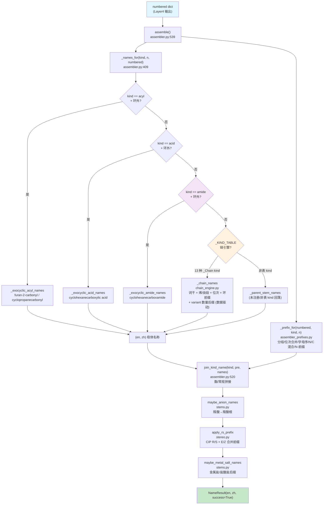

# Layer5: 名称组装 (Name Assembly)

> **管线位置:** 第 5 层 / 6 层 (输出层) | **源文件:** 7 个 `.py` (1992 行) | **最后更新:** 2026-09-05

---

## 概述

Layer5 是 NamePredict 6 层命名管线的终端输出层，负责将前序各层产生的结构化中间数据（编号后的母体信息 + 取代基清单 + 位次分配）组装为完整的中英双语 IUPAC 名称。

Layer5 由 7 个模块组成：**① 词干引擎 `chain_engine.py`**（`_KIND_TABLE` 数据驱动，现 13 个 entry 含新增 `acyl` 与逐卤素 `acyl_halide`，`mult_ok` 生成式按 multiplicity 派生数量后缀，`variant` 按 scaffold 提供特例覆盖）；**② 主组装器 `assembler.py`**（含 `_names_for` 派发与 `join_kind_name` 拼接、`_ensure_fused_stem` 稠合词干注入、`_ring_carbocycle_stem` 单环环烷/环烯词干、环外 -oyl 系系统名）；**③ 稠合名组装 `fused_namer.py`**（`benzo[a]...`/`naphtho[...]...` 类稠合 base 名）；**④ 前缀组装 `assembler_prefixes.py`**（含 N- 前缀、N/C 混合位次、bis/tris/tetrakis、O/S 桥平铺）；**⑤ 双语词干表 `stems.py`**（烷烃词干 C1–C99，复用 constants `en_num_term` + 盐/阴离子后缀）；**⑥ 立体化学 `stereo.py`**（E/Z + CIP R/S，CIP 标签强制重算）；kind 收敛在 L2 `principal_expression._chain_kind`——L2 直接产生 FG 类别 kind，苯保留名由 chain_engine 各 entry 的 `variant` 提供。

**管线中的位置：**

```
Layer4: numbering (位次分配)
    ↓  numbered dict
┌──────────────────────┐
│  Layer5  名称组装      │  ← 当前层 (输出层)
└──────────────────────┘
    ↓  NameResult {en, zh}
输出: "2-chloropropane" / "2-氯丙烷"
```

**职责边界：**

| 职责 | 说明 |
|------|------|
| 母体名称生成 | 根据 parent kind 和碳数 n 查表/构造双语母体词干 |
| 取代基前缀组装 | 按字母序排列、重复基团合并 (di/tri/tetra)、位次号拼接、N- 前缀 |
| 立体化学插入 | R/S (CIP) 和 E/Z (双键) 立体描述符的前缀化 |
| 功能类命名 | 酯 (ester) 拼接；环外酸/醛/酯/酰胺/腈 (-carboxylic acid/-carbaldehyde/-carboxylate/-carboxamide/-carbonitrile) 系统名；苯环保留名 (benzoic acid/benzaldehyde…) 由 variant 提供 |
| 双语输出 | 同步生成英文和中文两套 IUPAC 字符串 |

**输入/输出类型：**

```
assemble(numbered: dict, *, time_ms: float = 0.0, source: str = "iupac") -> NameResult
```

`numbered` 字典是多层管线积累的结构化数据，核心字段包括 `parent`、`substituents`、各种 `_locant`/`_locants` 字段、立体化学字段。`NameResult` 包含 `en: str`, `zh: str`, `success: bool`, `source: str`, `time_ms: float`, `meta: dict`。

---

## 核心逻辑

### 1. 组装总控 (`assemble` 函数)

Layer5 的入口是 `assembler.py` 中的 `assemble` 函数（第 539 行）。它遵循一个清晰的名称变换流水线，每步返回双语元组 `(en, zh)`：

```
assemble(numbered)
  ├─ 0. _ensure_fused_stem(numbered)         # 未注册稠环词干注入（fused_parent_names），失败→unsupported
  ├─ 1. _names_for(kind, n, numbered)        # 母体名称 (en, zh)
  ├─ 2. _prefix_for(numbered, kind, n)       # 取代基前缀 (pre_en, pre_zh)
  ├─ 3. join_kind_name(kind, pre, names)     # 拼接前缀+母体 (酯专属拼接, zh 恒拼"酯")
  ├─ 4. maybe_anion_names(numbered, en, zh)  # 羧酸根阴离子后缀
  ├─ 5. apply_rs_prefix(numbered, en, zh)    # R/S 立体化学前缀
  └─ 6. maybe_metal_salt_names(...)          # 金属盐/盐酸盐后缀（namer._apply_salt_suffix 用独立 {"salt":salt} 调用）
       → NameResult(en, zh)
```

> **源:** `src/namepredict/layer5/assembler.py:539`

`_ensure_fused_stem`（`assembler.py:390`）在取名前注入母体词干：已注册稠环词干由 L2 `pack_parent_stem` 注入（parent.stem_en 非空），不进入本分支；未注册稠环（全碳 `scaffold_id=carbocycle` 或 `fused_hetero`）靠 `fused_tree` 调 `fused_parent_names` 组装稠合 base 名注入词干。返回 False 表示稠合组装失败（显式 unsupported，避免回落开链词干错名）。

### 2. kind 收敛（在 L2）

**kind 收敛由 L2 `principal_expression._chain_kind` 承担**——L2 直接产出 FG 类别 kind（`acid`/`alcohol`/`amine`/`ketone`/`ester`/`amide`/`nitrile`/`aldehyde`，以及新增的 `acyl` 酰基残基与环外 acyl 头 kind、环外酰卤 kind `acyl_halide`），数量统一由 `principal_expression_facts.multiplicity` 承载，无 diacid/diol/diamine 等数量 kind，**也不产生 `dione`**（二酮由 chain_engine 对 `ketone` 的 `mult_ok` 生成式在命名层产出）。Layer5 无独立的 kind 收敛模块（`typed_kinds` 不存在）。

苯系保留名（phenol/benzoic acid/aniline/benzaldehyde/benzonitrile/benzamide/benzoyl/benzoyl chloride）由 chain_engine `_KIND_TABLE` 各 entry 的 `variant["benzene"]` 提供（见 §4）。

### 3. 链式词干引擎 (`chain_engine.py`)

`chain_engine.py`（604 行）是数据驱动的单链词干引擎——用 `_Chain` spec 描述每类 kind 的命名形态，`_chain_names` 统一渲染，无需按 kind 手写 if 分支。

**`_Chain` 数据类字段**（frozen dataclass，`296`）：
- 基础：`kind`/`en_suf`/`zh_suf` **必填**（每 kind 互异，无合理默认）；`coda`/`no_loc`/`omit_rule` 在 `_: KW_ONLY` 分隔后为 keyword-only 默认值——`coda`="an"、`no_loc`="plain"、`omit_rule`=`_NO_OMIT`，仅特例显式覆盖（alkane `coda=""`、thiol `coda="ane"`、ketone `no_loc="none"`、alcohol/thiol/amine `omit_rule=_omit_term_locant`、ketone/alkane 自定义 lambda）
- FG：`fg`（fg_locants 记录 kind）/`need`（FG 数要求）
- 俗名/派生：`plain_maps`/`plain_fn`
- 烯/炔段：`ene_seg`（默认 `("en","烯")`；thiol 用 `("ene","烯")` 保留 e）/`yne_seg`（默认 `("yn","炔")`）/`ene_base`/`ene_special`（俗名钩子）/`yne_suf`/`ez_ene`（单烯 E/Z）/`ez_ene_multi`（多烯 E/Z 前缀，`_chain_ene` 融合式/unsat_polyol/段式多烯分支按 spec 取用）/`ene_loc_omit`（环单烯省略位次）/`ene_omit_aware`
- 环：`cyclic`（恒加 cyclo/环前缀）/`cyclic_unsat`/`zh_full`/`stem`（稠环/杂环词干覆盖）/`aromatic`（assembler 注入；醇→酚语义在此消费）
- **`mult_ok`**（acid/alcohol/amine/ketone=True）— 数量后缀由 `_generated_mult_fields`（`368`）生成：`MULT[m]`+基础后缀（diol/triol/tetraol…任意数量，无硬编码上限）；`mult_zh_full`（醇/胺多 FG 中文保留"烷"）/`mult_unsat_polyol`（仅醇）
- **`unsat_polyol`/`mult_unsat_polyol`**（`318`/`324`）— 多 FG 词干模式下的烯/炔插入（but-2-ene-1,4-diol），混合烯炔时词干加 euphonic `a`（P-31.1.1.2）
- **`variant: dict[scaffold, dict[mult, dict]]`**（`{scaffold_id: {multiplicity: 生成式之上的特例字段覆盖}}`，`None` 键=开链）— acid 用 `{None:{2: 草酸俗名/炔禁/ene_single_min=3}}`；苯环保留名用 `{"benzene": {1: {plain_fn=phenol/benzoic…}}}`。`assembler._names_for` 按 `scaffold_id` 注入当前 scaffold 的 variant 子集后，`_chain_names` 见一维 `{mult: fields}`：多 FG（mult>1）先生成通用数量字段再覆盖特例；单 FG（mult==1）直接 `replace(spec, **extra)`
- `wrap`（整体包裹 E/Z，alkane 与 radical 条目用 `_with_ez`——后者使烯基自由基取代基（含立体双键）拼 `(1Z)-` 前缀）

**`_KIND_TABLE`**（`chain_engine.py:491`）现有 **13 个 `_Chain` entry**：12 个链式主官能团 kind `alcohol`/`ketone`/`alkane`/`acid`/`ester`/`thiol`/`amine`/`aldehyde`/`nitrile`/`amide`/`acyl_halide`/`acyl`，外加第 13 个 **`radical`**（取代基 kind，`en_suf="yl"`/`zh_suf="基"`，`plain_fn=_radical_plain`、`variant` 苯环→phenyl、`wrap=_with_ez`）。无 `anhydride` entry（L5 不产生酸酐链式名）及任何组合 kind——纯烃环用 `alkane`（cyclo 前缀由 assembler 按 scaffold_id 动态加），数量统一由 `multiplicity` + `mult_ok` 生成式承载。

- **`acyl`**（`chain_engine.py:535`）— 酰基残基（P-65.1.7.2）：酸碳恒 locant 1，C3+ 系统名词干 coda "an"+"oyl"（propanoyl…），C1/C2 走 `_RETAINED` 保留名（formyl/acetyl，`_RETAINED` 加 `"acyl"` 键，`chain_engine.py:39`）；烯/炔与立体照 acid 融合式（enoyl/ynoyl）。`variant["benzene"]` 提供苯环 exocyclic 酰基头保留名 **benzoyl/苯甲酰基**；杂环/碳环（furan-2-carbonyl/cyclopropanecarbonyl）由 assembler `_exocyclic_acyl_names` 产出。
- **`acyl_halide`**（`:588`，默认 chloride = `_ACYL_HALIDE_BY_HAL[17]`）— 后缀随实际卤素变：`_ACYL_HALIDE_BY_HAL`（`chain_engine.py:489`，`_ac_hal_chain` `:470` 按 `HALIDE_EN` 生成 F/Cl/Br/I 各自的 spec）——en 后缀 `-oyl fluoride/chloride/bromide/iodide`、zh `-酰氟/氯/溴/碘`，保留名（C1/C2、苯甲酰）随卤素同变；assembler 按 `parent.hal_z` 选择对应 spec（F 走 `-oyl fluoride`，苯 → benzoyl chloride 等）。`_RETAINED` 不再存 acyl_halide 保留名（迁入 `_ac_hal_chain`）。

**`mult_unsat_polyol` / `_mult_elide`**：`ketone` entry 加 `mult_unsat_polyol=True`（`chain_engine.py:477`）；`_mult_elide`（`:363`）实现 **P-14.3.2 数量前缀元音省略**——前缀以 `a` 结尾（tetra/penta/hexa…）且后缀以元音开头时省略 `a`（tetra+ol→tetrol、hexa+ol→hexol；di/tri 不受影响）。`_chain_stem_pair`（`:333`）中文保留完整"烷"的条件改为 `unsat_polyol and (zh_full or cyclic)`——仅醇/胺/硫醇或环状保留，开链酮用去"烷"词干（戊-2,4-二酮）。

**母体词干结尾 'e' 的省略下沉到拼接端（P-60.2(a)）**：`_ring_stem`（assembler）不再无差别 `rstrip('e')`，改由新增的 `_elide_parent_e(stem, suffix)`（`chain_engine.py:351`）按**最终后缀首字母**判断——仅当 `suffix` 以元音 `a/i/o/u/y` 开头时剥词干尾 `e`，辅音开头（`diol`/`dione`/`diamine`/`carbaldehyde` 等）保留 `e`。无差别剥 e 是把 oxolane-3,4-diol 错拼成 oxolan-3,4-diol 的根因；现 `_chain_plain` 普通拼接（`:358`）与 `_chain_names` 稠环 scaffold 词干分支（`:452`）都以 `_elide_parent_e(s, spec.en_suf)` 处理。

**短链单烯单 FG 位次省略融合（P-14.3.4.2/4.4）**：`_chain_ene`（`chain_engine.py:221`）对 **C≤2 单烯单 FG**（烯只能 1(-2)、后缀锚定 1，位次无歧义）省略并融合——`eth-1-en-1-amine` → `ethenamine`（乙-1-烯-1-胺 → 乙烯胺）；另一端的取代基（如 2-nitro）位次照常由前缀保留。

**多烯 E/Z 前缀补全**：`_chain_ene` 的 unsat_polyol（多 FG）多烯分支补上 `spec.ez_ene_multi` 前缀应用；`_KIND_TABLE` 中 `ketone`/`thiol`/`amine`/`nitrile`/`amide`/`acyl_halide` 条目补 `ez_ene_multi=ez_for_parent`（thiol/amine 并补单烯 `ez_ene`）——多键不饱和时这些 kind 现按 `ez_for_parent` 产出 `(2E,4Z)-` 式多烯前缀（acid/alcohol/ester/aldehyde 此前已具 `ez_ene_multi`）。**radical 条目加 `wrap=_with_ez`**（radical entry，`chain_engine.py:589`）：烯基自由基取代基（苯环母体上的 prop-1-en-1-yl 等由递归 `*` 锚定命名产出、`submol_build` 已保立体）现按链位次拼 `(1Z)-` 前缀。

**不饱和段引擎**（`_chain_unsat`，`101`）现支持**混合烯炔**：`_chain_enyne`（`119`）组合烯段在前/炔段在后（融合式与段式均合并两组位次，多键加 `a`）；`_chain_yne`（`161`）支持多炔（`yne_locants` + `MULT` 后缀，hexa-1,5-diyne）。

> **源:** `src/namepredict/layer5/chain_engine.py`

### 4. 母体名称派发 (`_names_for`)

`_names_for`（`assembler.py:409`）是母体名称的核心派发函数：

0. `kind == "acyl"` 时先试 `_exocyclic_acyl_names`（`assembler.py:276`）：环外酰基头（羰基头连环/芳骨架的 -CO-X，P-65.1.7.2）→ **苯 → benzoyl/苯甲酰基 保留名（回落 chain_engine acyl variant）**；杂环/稠环/单环碳环 → 母体名/locant + `-carbonyl`/`-羰基`（furan-2-carboxylic acid → **furan-2-carbonyl**、cyclopropanecarboxylic acid → cyclopropanecarbonyl）。**反例 -oyl 直拼（furanoyl）**——丢环酸羧基位次、词干不符金标准。开链 acyl（relation `in_skeleton`）无关此 worker
1. `kind == "acid"` 时先试 `_exocyclic_acid_names`（`89`）：环外 COOH → `cyclohexanecarboxylic acid` / `naphthalene-1-carboxylic acid` 式系统名。**单酸苯环回落 chain_engine variant（benzoic acid/苯甲酸）**；**multiplicity≥2 多羧酸** → `-di/tricarboxylic acid`（如 benzene-1,3-dicarboxylic acid，P-65.2.2），位次必带（locant 取 `fg_locants` 的 acid 记录），不做链式 Xanedioic 模板——未注册 carbocycle/fused_tree 分支也带 mult/loc；中文后缀统一「羧酸」（非旧「甲酸」）
2. `kind == "ester"` 时先试 `_exocyclic_ester_names`（`139`）：环酯 COOR → `-carboxylate`；苯甲酸酯保留名 benzoate 由 chain_engine variant 处理，显式排除（中文环酯酸侧现亦为「羧酸」）
3. `kind == "amide"` 时先试 `_exocyclic_amide_names`（`170`）：环外 CONH2 → `-carboxamide`/`-甲酰胺`；苯酰胺保留名由 chain_engine variant 处理，显式排除
4. `kind == "nitrile"` 时先试 `_exocyclic_nitrile_names`（`200`）：环腈 C#N → `-carbonitrile`/`-甲腈`；苯甲腈保留名由 chain_engine variant 处理，显式排除
5. `kind == "aldehyde"` 时先试 `_exocyclic_aldehyde_names`（`230`）：环外 -CHO → `-carbaldehyde`/`-甲醛` 系统名（P-66.6.1.1.3）；**苯单醛保留名（benzaldehyde/苯甲醛）回落 chain_engine**，苯双醛（benzene-1,2-dicarbaldehyde）及杂环/稠环走 base-carbaldehyde，mult≥2 → `-di/tricarbaldehyde`/`-二/三甲醛`
6. `kind == "radical"` 且有 `radical_anchor_element` → `_mononuclear_radical_names`（`349`）（杂原子锚点自由基；O 锚点 `-yloxy` 经 `_retained_alkoxy` 收拢为 IUPAC 保留烷氧基 ethoxy/propoxy/butoxy/phenoxy）
7. 查 `_KIND_TABLE.get(kind)`（`chain_engine.py:491`）；命中则先做两件运行时替换再 `_chain_names`：
   - `kind == "acyl_halide"` → 按 `parent.hal_z`（L1 检测/L2 保留的实际卤素）取 `_ACYL_HALIDE_BY_HAL` 对应 spec 覆盖默认 chloride（F→`-oyl fluoride`，苯 → benzoyl fluoride 等）
   - `kind == "alkane" and parent.fused_tree and sid != "benzene"` → 直接返回 `_parent_stem_names`（未注册稠环无 FG：`_ensure_fused_stem` 注入的稠合 base 名，不走 chain_engine 拼 ane）
   - `sid == "benzene" and kind == "alkane"` → 直接返回 `("benzene", "苯")`（无主 FG 纯苯）
   - 保留 scaffold 词干（`_ring_stem`，`24`）→ `replace(entry, stem=(en_stem, zh_stem), coda="", omit_rule=lambda...: bool(omit), aromatic=(sid == "benzene"))`——**`_ring_stem` 现返回完整词干、不再剥尾部 `e`**（benzene 与非苯环同），结尾 `e` 的省略改由 chain_engine `_elide_parent_e` 按后缀首字母决定（P-60.2(a)，见 §3）；aromatic **仅对苯环置真**使醇注入 `zh_suf="酚"`（苯酚系；杂环醇→醇，非酚）
   - `sid == "carbocycle"`（无 fused_tree） → `replace(entry, cyclic=True, ene_loc_omit=True, omit_rule=...)`（恒加 cyclo/环前缀；未注册全碳稠环 fused_tree 存在时不处理）
   - **按 scaffold 注入保留名 variant**：`sc_variant = entry.variant.get(sid)` → `replace(entry, variant=sc_variant)`——苯环单 FG 取 `"benzene"` 键（phenol/benzoic/aniline/benzoyl…），开链取 `None` 键（acid 草酸）
   - 然后 `_chain_names(entry, n, numbered)`
8. 非表内 kind 落到 `_parent_stem_names`（`472`，取 parent.stem_en/stem_zh；苯基自由基 phenyl 由 radical entry 的 benzene variant 产出，非独立 kind worker）

**单环环烷/环烯的环外系统名共用一个词干原语**：`_exocyclic_acid/ester/amide/nitrile/aldehyde/acyl_names` 的 `sid=="carbocycle"` 且无 `fused_tree` 分支统一经 `_ring_carbocycle_stem`（`assembler.py:46`）出母体词干——en 单烯位 1 省略（P-31.1.2 环己烯）、多烯/非 1 位次显式（cyclohexa-1,3-diene），中文环烯位次恒显式（环己-1-烯）。返回 `has_unsat` 时或 `_ring_extra_prefix_located`（`72`，环上另带被编号前缀：O 侧酯烷基、N 端胺取代除外）为真时，后缀 locant 不可省略且须显式——环烯使编号不再唯一，另有前缀取代时主基 locant 1 不能隐含（P-66.6.1 例 4-formylcyclohexane-1-carboxylic acid vs 无取代省略 cyclohexanecarbaldehyde）。

**单核自由基名的 N- 酰基保留与双取代歧义（`_mononuclear_radical_names`，`assembler.py:349`）**：
- **azane（单 N- 酰基残基）**：N- 酰基为乙酰/甲酰/苯甲酰时收成 **amido 保留式**（P-66.1.1.4.3 方法 1：acetamido/formamido/benzamido，取自 `constants.AMIDO_RETAINED`），不走 free_to_yl 的 acylamino 系统式；其余 R（长链/烯酰/被取代苯甲酰/杂环羰酰）保持方法 2 的 acylamino。带立体描述符的复杂酰基残基（肽类 N-酰基氨基酸）方法 2 需把酰基名整体括起再加 amino（`[…propanoyl]amino`，P-29.3.2），否则 `(2S)-2-amino-…propanoylamino` 融合式与 N-端 amino 位次歧义。
- **双不同 N-取代基**（P-62.2.2.1）：字母序首基平铺、其后各基分别加括号紧贴 amino（2-chloroethylethylamino → `2-chloroethyl(ethyl)amino`）。

> **源:** `src/namepredict/layer5/assembler.py:409`

### 4.1 稠合名组装 (`fused_namer.py`)

`fused_namer.py`（190 行）实现 **P-25.3.2 稠合名称组装**——用 L2 的 `fused_tree` 拆解树生成 `benzo[a]...`/`naphtho[...]...` 类稠合名（供**未注册稠环**的 base 名；母体/附加组分均为已注册保留件，但整体系统不在 `_TEMPLATES` 内）。当前支持**单边融合**，多边/跨位待后续。L5 分层纯净：组件词干用本地表（与 L2 `_TEMPLATES` 需同步），编号走 L4 `fused_numbering`。

核心入口 `fused_parent_names(mol, node)`（`:172`）：

- **`_FUSED_PREFIX`**（`:8`）— 附加组分保留前缀（`benzo`/`naphtho`/`anthra`/`phenanthro`/`furo`/`thieno`/`pyrido`/`pyrimido`/`imidazo`），`_prefix_of`（`:67`）无保留前缀时走通用「去尾 e 加 o / 中文加并」（P-25.3.2.2.2）
- **`_COMPONENT_STEM`**（`:21`）— 组分词干表（en/zh），L5 本地、与 `ring_scaffold._TEMPLATES` 词干需同步（zh 修正：quinoxaline→喹喔啉、oxane→氧杂环己烷）
- **`_component_numbering`**（`:77`，现带 `shared` 参数）— 组分自身编号，委托 L4 `fused_component_numbering`（P-25.4/P-25.3.3），把稠合掉的 `shared` 原子当取代基做位次最小化
- **融合描述符** — `_fused_one`（`:133`）现**取 child 的 `fusion_shared[0]` 作为同一稠合原子集，同时传给母体与附加组分各自编号**（P-25.3.1.3 位次尽可能低），使取向与规范稠合描述符一致（此前 parent/child 各取自身 attached 组分的 shared，取向可能不一致）；`_fusion_letter`（`:111`）共享边在母体外周位次序中的侧字母 `chr(97+i)`；`_fusion_numbers`（`:123`）附加组分共享原子位次（沿母体低位次端→高位次端）；`_fused_one` 拼 `prefix + [数字-字母]`（benzo 单环烃省略数字位次，P-25.3.8.1）
- **`_inner_atoms`**（`:93`）— 出现在 ≥3 环的原子（perifused 中心）不在外周边界；`_outer_chain_labels`（`:102`）过滤内原子后取外周 chain/labels
- **`_collect_attached`**（`:159`）— 递归收集 parent_node 全部附加组分前缀（嵌套组分在附着的一级前），与根词干拼接为最终 `benzo[a]naphthalene` 式名

单节点（`not node.attached`）直接返回 `None`，由 `_parent_stem_names` 走保留名（L2 已注入词干）。

> **源:** `src/namepredict/layer5/fused_namer.py:172`

### 5. 双语词干表 (`stems.py`)

`stems.py`（151 行）提供烷烃英中双语词干生成器与盐/阴离子后缀，碳数支持 **C1–C99**。**stems 不提供 FG 词干派生函数**（`alcohol_en`/`acid_en`/`amide_en` 等不存在）——FG 名称由 chain_engine 用 `_en_stem` + `spec.en_suf`/`zh_suf` 直接拼接，stems 不为各官能团单独造词：

- **C1-C10：保留名/系统名基表。** `_ALKANE_EN_BASE`/`_ALKANE_ZH_BASE`（`8-15`）：`methane`/`甲烷`、`propane`/`丙烷`...
- **C11+：英文词干复用 `constants.en_num_term`**（数量词与母链碳数同源）：`_en_stem`（`stems.py:40`）对 n≥11 直接 `en_num_term(n)[:-1]` 去尾 'a'（undec/icos/docos…），删除了旧的 `_SEMI_EN`/`_UNITS`/`_TENS`/`_compose_en_stem` 本地复合表；`constants.MULT_EN/MULT_ZH` 亦扩到 1–99 并加 `nospace` 文本辅助。中文 `zh_num(n)`（`stems.py:21`）生成中文数字+烷（十一烷…，支持到 99）。
- **公开 API：** `ALKANE_EN`/`ALKANE_ZH`（`stems.py:150` 起，`_fill`（`139`）自动填充 C1-C99）、`_en_stem`/`alkane_en`/`alkane_zh`/`zh_stem`/`zh_num`、`acid_to_anion_en`/`_zh`、`maybe_anion_names`（羧酸→羧酸根）、`maybe_metal_salt_names`（碱性金属盐和盐酸盐）。

> **源:** `src/namepredict/layer5/stems.py`

### 6. 取代基前缀组装 (`assembler_prefixes.py`)

`assembler_prefixes.py`（240 行）遵循 IUPAC P-14.5 规则：按取代基英文名字母序排列，重复基团用 di/tri/tetra 合并位次号。

核心函数 `_build_prefix(substituents, n_carbons, kind, scaffold, has_ene)`（`assembler_prefixes.py:212`）：滤 O 侧 → `_omit_sub_locants` 位次省略 → `_group_by_stem` 分组 → `_locant_str` 位次合并 → 多重度前缀（di/tri/tetra；复合组分 bis/tris/tetrakis）→ `_stem_needs_paren` 括号规则 → `_sorted_stems` 字母序排列（用 `alkyl_alpha_key`，与 Layer3 共享同一排序键）。

**`_locant_str` 支持 N/C 混合位次（`assembler_prefixes.py:18`）**：N-型取代基（`kind ∈ _N_PREFIX_KINDS`）渲染为字母位次 `N`（与 C 数字位次并排、经 `locant_str_sort` 排序后 N 自然排最前）——同一词干组混入 C-型成员时不再走 N-N 计数吞掉 C 位（如 `N,N,2-trimethyl` 而非把 C-位吞成 N-计数）。

**`_omit_sub_locants` C2 省略收紧（`:43`）**：C2 单取代省略仅对端碳（FG 所在 C1）无可取代 H 的母体成立（腈/酸/酯/醛/酰胺等）；**醇/胺/硫醇的 C1 带可取代 H，2- 位取代构成不同异构体（P-14.3.4.4），`2-` 必须保留**。

**复合倍增前缀（P-16.3.2）**：`_is_compound_mult`（`assembler_prefixes.py:124`）判"待倍增组分是否为复合/被取代前缀"——retained 组合叶（carboxy-/hydroxymethyl 等整叶名含修饰前缀）由词干子串兜底、递归命名/括号组分由组成员 `paren` 标记体现，命中用 **bis/tris/tetrakis**（en，`_complex_mult_en`）/**双/三/四**（zh，`_complex_mult_zh`）而非 di/tri/tetra。

**O/S 桥后缀平铺式（P-63.2.2）**：带立体描述符的基 `-<N>-yl]oxy`/`-yl]sulfanyl` 拆分（`_split_bridge_suffix`，`assembler_prefixes.py:89`，仅拆 base 含手性描述符如 2R/3S 的情形）——括号闭在 `-yl` 后、`-oxy`/`-sulfanyl` 后缀追加在括号外（gold 对糖/环基 O(S) 桥用平铺式；无手性 acyclic/苄基…methylsulfanyl 整括不拆）。

**单碳多取代基括号式（P-16.5.1.3.1/.3.2）**：`_build_prefix` 在母体 `n_carbons==1`（meth 链）且 `kind=="radical"`、位次省略（`omit`）、≥2 个不同词干、且全部词干**简单**时启用 `bracket`——把**首词干平铺、第二及以后词干各自加圆括号**（倍增前缀不括入），词干间**无连字符**。单碳链所有取代基必同处唯一碳，括号式即 locant 省略时的消歧写法。

**N- 前缀（P-62.2 胺 N 端取代基）**：`_N_PREFIX_KINDS = {n_alkyl, n_phenyl, n_benzyl, n_block}`（`assembler_prefixes.py:145`）。`_parts_for_stem`（`:169`）**仅当整组全为 N-型成员**才走 `_n_prefix_en`/`_n_prefix_zh`（`153`）计数——输出 `N-methyl`/`N,N-dimethyl`/`N,N,N-trimethyl`（英文）/`N-甲基`/`N,N-二甲基`（中文），强制省略位次；复合取代基（含 locant/显式 paren）整体括起（`N-(3-bromophenyl)`）。同词干混入 C-型时落入数字通道、N-型成员由 `_locant_str` 渲染为 `N`。

> **源:** `src/namepredict/layer5/assembler_prefixes.py`

### 7. 名称拼接 (`join_kind_name`)

`join_kind_name`（`assembler.py:520`）是前缀与母体的拼接函数，处理三种拼接模式：酯类拼接（`join_ester_name`）、常规拼接（`join_parent_name`，前缀-母体用连字符，数字/`1H-` 开头需连字符）。中文额外处理 `1H-` 前缀（`zh_1h_parent`）。酯命名统一走 `join_ester_name`（无独立苯甲酸酯拼接）。

> 注：`benzene_names.py` 不存在——苯/芳烃/杂环母体拼接函数全部位于 `assembler.py`。

### 8. 立体化学 (`stereo.py`)

`stereo.py`（245 行）承担全部立体前缀（E/Z 与 CIP R/S 同一模块），顶部共享 `_split_stereo_lead`（`10`）立体块切分器。按两个注释分区组织：

**E/Z 段**（P-91.2/P-93.4）：`_ez_prefix`（单烯）、`_ez_multi_prefix`（多烯 `(2E,6Z)-`）、`ez_for_parent`（多烯走 `_ez_multi_prefix`，否则 `_ez_prefix`）。

**R/S 段**（P-92/P-93）：`_RS_KINDS = _fg_reg.srs_fgs() | frozenset({"radical"})`（`104`）——srs_fgs 为 L1 `fg_registry` 标 `rs=True` 的链式 FG（acid/ester/amide/nitrile/aldehyde/ketone/alcohol/thiol/amine + `acyl`，函数由 `rs_fgs` 更名而来）。`_assign_cip`（`106`）赋 CIP 前先给**隐式 H 的手性标记碳**（chiral tag 非 `CHI_UNSPECIFIED`、`TotalNumHs==0`、`degree<4`）补显式 H，再 `AssignStereochemistry(force=True, cleanIt=True)` + **`rdCIPLabeler.AssignCIPLabels`（`stereo.py:114`，强制重算 CIP 标签）**并把 `_CIPCode` 拷回原原子（拷回前清除旧标签，保证重算而非复用缓存）。`_rs_parts`（`154`）判定**产出 R/S 的母体**：链式主官能团母体按 `kind ∈ _RS_KINDS` 放行；**环/稠合骨架母体（parent 有 `scaffold_id`）不论 kind 都放行**——其 chain 是 L4 定向编号的整环 walk，环上 sp3 手性中心可被 `_cip_on_chain`（`128`）扫到（纯烃环/稠合骨架 kind=alkane 亦覆盖）。仍跳过折叠环（`_collapsed_parent`）与空链。`_parse_stereo`/`_format_stereo`/`_merge_parts`（按"先 E/Z 后 R/S"、同类型按位次排序合并）、`_ester_en_rs`（酯在烷基词后插 `(2S)-`）、`apply_rs_prefix`（`236`，顶层入口）。

对外被 chain_engine（`_ez_prefix`、`ez_for_parent`）与 assembler（`apply_rs_prefix`、`_split_stereo_lead`）使用。

> **源:** `src/namepredict/layer5/stereo.py`

---

## 文件清单

| 文件 | 行数 | 说明 |
|------|------|------|
| `__init__.py` | 6 | 包入口，导出 `assemble` |
| `assembler.py` | 556 | **主组装器**：`_names_for` 派发（`_KIND_TABLE` 查表 + scaffold_id 运行时替换 + exocyclic acyl/acid/ester/amide/nitrile/aldehyde worker）+ `_ring_carbocycle_stem`/`_ring_extra_prefix_located`（单环环烷/环烯词干与显式 locant 判定）+ `_mononuclear_radical_names`（amido 保留式/N,N 括号式）+ `_ring_stem`（不剥尾部 e）+ `_ensure_fused_stem` + 名称变换流水线 + join_kind_name 拼接 |
| `assembler_prefixes.py` | 240 | 取代基前缀：分组、位次合并、N/C 混合 locant、复合倍增 bis/tris/tetrakis、O/S 桥平铺式、N- 前缀 + 单碳括号式（P-16.5.1.3.1） |
| `chain_engine.py` | 604 | **链式词干引擎**：`_Chain` spec + `_KIND_TABLE`（13 个 entry：12 链式 FG kind 含 `acyl`、逐卤素 `acyl_halide` + `radical`）+ `_chain_names` 统一渲染（`mult_ok` 生成式数量后缀 + `_mult_elide` 元音省略 + `_elide_parent_e` + 短链烯融合 + 混合烯炔段 + 多炔 + 多烯 E/Z + `mult_unsat_polyol`） |
| `fused_namer.py` | 190 | **稠合名组装**：`fused_parent_names`（benzo[a]…/naphtho[…]- 稠合 base 名），`_FUSED_PREFIX` 保留前缀 + `_COMPONENT_STEM` 组分词干（shared 共享编号） |
| `stems.py` | 151 | 烷烃双语词干生成器（C1–C99，复用 constants `en_num_term`）+ 盐/阴离子后缀（FG 名称由 chain_engine 拼接） |
| `stereo.py` | 245 | **E/Z + R/S 立体前缀**（单模块；R/S 补显式 H + CIP 强制重算 + 环/稠合骨架母体） |

> 备注：layer5 共 7 个模块。`typed_kinds.py`/`benzene_names.py`/`unsat_acid.py`/`acyl_halide_names.py`/`iso_arene_names.py` 均不存在（kind 收敛在 L2 `_chain_kind`；拼接在 assembler.py；酰卤命名由 `_KIND_TABLE` 的 `acyl_halide` entry + `_ACYL_HALIDE_BY_HAL` 承担；isocyanato/isothiocyanato 走取代基前缀；`free_to_yl` 在 `tools/free_to_yl.py`）。

### 跨层依赖

layer5 **不再直接 import layer2 或 tools**。全部外部 import 仅：`constants`（MULT_EN/MULT_ZH/HALIDE_EN/AMIDO_RETAINED/`en_num_term`）、`types`（NameResult）、`layer3.substituent_extractor`（`alkyl_alpha_key`，唯一跨层向下依赖，用于前缀分组排序）。

---

## 数据流图

### Layer5 组装流水线



---

## 对外接口

### `assemble(numbered: dict, *, time_ms: float = 0.0, source: str = "iupac") -> NameResult`

Layer5 唯一的公共接口，将编号完成的结构化数据组装为最终的双语 IUPAC 名称。

| 参数 | 类型 | 说明 |
|------|------|------|
| `numbered` | `dict` | Layer4 输出的编号后数据，含 `parent`、`substituents`、各类 `_locant` 字段 |
| `time_ms` | `float` | 可选的时间戳（毫秒），由 `namer.py` 计算并传入 |
| `source` | `str` | 名称来源标识，默认 `"iupac"` |

| 返回值 | 说明 |
|--------|------|
| `NameResult(en="...", zh="...", success=True)` | 组装成功的双语名称 |
| `NameResult(en="", zh="", success=False, meta={"reason": "unsupported", ...})` | 无法识别的 kind 或缺失关键字段 |

**`NameResult` 结构：**

| 字段 | 类型 | 说明 |
|------|------|------|
| `en` | `str` | 英文 IUPAC 名称 |
| `zh` | `str` | 中文 IUPAC 名称 |
| `success` | `bool` | 组装是否成功 |
| `source` | `str` | 名称来源 (`"iupac"`) |
| `time_ms` | `float` | 累计耗时（毫秒） |
| `meta` | `dict` | 元数据（含 `parent_kind`, `parent_chain`, `depth`, `salt` 等） |

**调用者:** `namer.py:_ok_result` — 在 Layer4 编号完成后立即调用。

---

## 相关页面

- [[architecture/overview]] — 6 层架构总览与层间数据流
- [[architecture/layer4-numbering]] — 上一层：位次分配/编号引擎（Layer5 的直接上游）
- [[architecture/layer2-parent-selector]] — 母体选择器（决定 parent.kind，Layer5 的核心输入）
- [[architecture/layer3-substituents]] — 取代基提取与命名（生成 substituents[] 列表）
- [[architecture/layer1-analyzer]] — 官能团分析器（FG 检测的源头）
- [[concepts/bilingual-naming]] — 中英双语命名约定与差异
- [[concepts/functional-group-priority]] — 官能团优先级表（决定主 FG / 后缀选择）
- [[index]] — Wiki 首页
