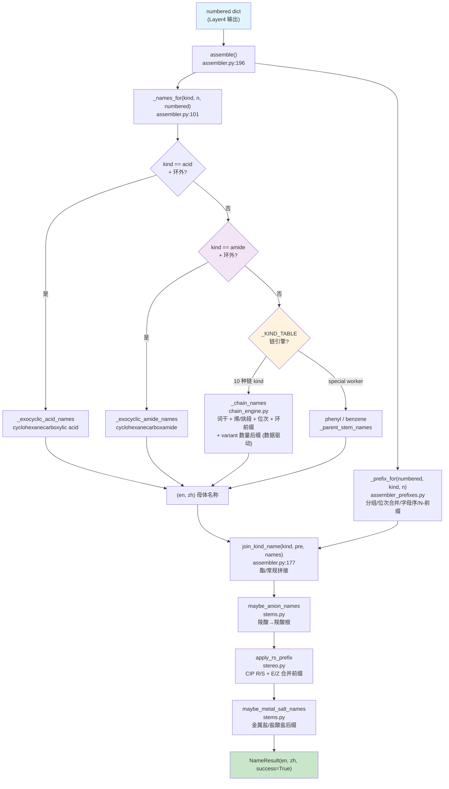

# Layer5: 名称组装 (Name Assembly)

> **管线位置:** 第 5 层 / 6 层 (输出层) | **源文件:** 6 个 `.py` (1239 行) | **最后更新:** 2026-08-15

---

## 概述

Layer5 是 NamePredict 6 层命名管线的终端输出层，负责将前序各层产生的结构化中间数据（编号后的母体信息 + 取代基清单 + 位次分配）组装为完整的中英双语 IUPAC 名称。

Layer5 由 6 个模块组成：**① 词干引擎 `chain_engine.py`**（`_KIND_TABLE` 数据驱动，`variant` 字段按 multiplicity 切换数量后缀）；**② 主组装器 `assembler.py`**（含 `_names_for` 派发与 `join_kind_name` 拼接）；**③ 前缀组装 `assembler_prefixes.py`**（含 N- 前缀）；**④ 双语词干表 `stems.py`**（烷烃词干 + 盐/阴离子后缀）；**⑤ 立体化学 `stereo.py`**（E/Z + CIP R/S）；kind 收敛在 L2 `principal_expression._chain_kind`——L2 直接产生 FG 类别 kind，苯保留名由 chain_engine 各 entry 的 `variant` 提供。

**管线中的位置：**

```
Layer4: numbering (位次分配)
    ↓  numbered dict
┌──────────────────────┐
│  Layer5  名称组装      │  ← 当前层 (输出层)
└──────────────────────┘
    ↓  NameResult {en, zh}
输出: "2-chloropropane" / "2-氯丙烷"
```

**职责边界：**

| 职责 | 说明 |
|------|------|
| 母体名称生成 | 根据 parent kind 和碳数 n 查表/构造双语母体词干 |
| 取代基前缀组装 | 按字母序排列、重复基团合并 (di/tri/tetra)、位次号拼接、N- 前缀 |
| 立体化学插入 | R/S (CIP) 和 E/Z (双键) 立体描述符的前缀化 |
| 功能类命名 | 酯 (ester)、苯甲酸酯 (benzoate)、环外酸/酰胺 (-carboxamide) 的特殊名称模式 |
| 双语输出 | 同步生成英文和中文两套 IUPAC 字符串 |

**输入/输出类型：**

```
assemble(numbered: dict, *, time_ms: float = 0.0, source: str = "iupac") -> NameResult
```

`numbered` 字典是多层管线积累的结构化数据，核心字段包括 `parent`、`substituents`、各种 `_locant`/`_locants` 字段、立体化学字段。`NameResult` 包含 `en: str`, `zh: str`, `success: bool`, `source: str`, `time_ms: float`, `meta: dict`。

---

## 核心逻辑

### 1. 组装总控 (`assemble` 函数)

Layer5 的入口是 `assembler.py` 中的 `assemble` 函数（第 196 行）。它遵循一个清晰的名称变换流水线，每步返回双语元组 `(en, zh)`：

```
assemble(numbered)
  ├─ 1. _names_for(kind, n, numbered)        # 母体名称 (en, zh)
  ├─ 2. _prefix_for(numbered, kind, n)       # 取代基前缀 (pre_en, pre_zh)
  ├─ 3. join_kind_name(kind, pre, names)     # 拼接前缀+母体 (酯专属拼接, zh 恒拼"酯")
  ├─ 4. maybe_anion_names(numbered, en, zh)  # 羧酸根阴离子后缀
  ├─ 5. apply_rs_prefix(numbered, en, zh)    # R/S 立体化学前缀
  └─ 6. maybe_metal_salt_names(...)          # 金属盐/盐酸盐后缀
       → NameResult(en, zh)
```

> **源:** `src/namepredict/layer5/assembler.py:196`

### 2. kind 收敛（在 L2）

**kind 收敛由 L2 `principal_expression._chain_kind` 承担**——L2 直接产出 FG 类别 kind（`acid`/`alcohol`/`amine`/`ketone`/`ester`/`amide`/`nitrile`/`aldehyde`），数量统一由 `principal_expression_facts.multiplicity` 承载，无 diacid/diol/diamine 等数量 kind，**也不产生 `dione`**（二酮由 chain_engine 对 `ketone` 的 `mult_ok` 生成式在命名层产出）。Layer5 无独立的 kind 收敛模块（`typed_kinds` 不存在）。

苯系保留名（phenol/benzoic acid/aniline/benzaldehyde/benzonitrile/benzamide）由 chain_engine `_KIND_TABLE` 各 entry 的 `variant["benzene"]` 提供（见 §4）。

### 3. 链式词干引擎 (`chain_engine.py`)

`chain_engine.py`（441 行）是数据驱动的单链词干引擎——用 `_Chain` spec 描述每类 kind 的命名形态，`_chain_names` 统一渲染，无需按 kind 手写 if 分支。

**`_Chain` 数据类字段**（frozen dataclass，`195-232`）：
- 基础：`kind`/`en_suf`/`zh_suf` **必填**（每 kind 互异，无合理默认）；`coda`/`no_loc`/`omit_rule` 在 `_: KW_ONLY` 分隔后为 keyword-only 默认值——`coda`="an"、`no_loc`="plain"、`omit_rule`=`_NO_OMIT`，仅特例显式覆盖（alkane `coda=""`、thiol `coda="ane"`、ketone `no_loc="none"`、alcohol/thiol/amine `omit_rule=_omit_term_locant`、ketone/alkane 自定义 lambda）
- FG：`fg`（fg_locants 记录 kind）/`need`（FG 数要求）
- 俗名/派生：`plain_maps`/`plain_fn`
- 烯/炔段：`ene_seg`（默认 `("en","烯")`；thiol 用 `("ene","烯")` 保留 e）/`yne_seg`（默认 `("yn","炔")`）/`ene_base`/`ene_special`（俗名钩子）/`yne_suf`/`ez_ene`/`ene_loc_omit`（环单烯省略位次）/`ene_omit_aware`
- 环：`cyclic`（恒加 cyclo/环前缀）/`cyclic_unsat`/`zh_full`/`stem`（稠环/杂环词干覆盖）/`aromatic`（assembler 注入；醇→酚语义在此消费）
- **`mult_ok`**（acid/alcohol/amine/ketone=True）— 数量后缀由 `_generated_mult_fields`（`273`）生成：`MULT[m]`+基础后缀（diol/triol/tetraol…任意数量，无硬编码上限）；`mult_zh_full`（醇/胺多 FG 中文保留"烷"）/`mult_unsat_polyol`（仅醇）
- **`variant: dict[scaffold, dict[mult, dict]]`**（`{scaffold_id: {multiplicity: 生成式之上的特例字段覆盖}}`，`None` 键=开链）— acid 用 `{None:{2: 草酸俗名/炔禁/ene_single_min=3}}`；苯环保留名用 `{"benzene": {1: {plain_fn=phenol/benzoic…}}}`。`assembler._names_for` 按 `scaffold_id` 注入当前 scaffold 的 variant 子集后，`_chain_names` 见一维 `{mult: fields}`：多 FG（mult>1）先生成通用数量字段再覆盖特例；单 FG（mult==1）直接 `replace(spec, **extra)`
- `wrap`（整体包裹 E/Z，alkane 用 `_with_ez`）

**`_KIND_TABLE`**（`363-441`）现有 **10 个 `_Chain` entry**：`alcohol`、`ketone`、`alkane`、`acid`、`ester`、`thiol`、`amine`、`aldehyde`、`nitrile`、`amide`。无 `anhydride` entry（L5 不产生酸酐链式名）及任何组合 kind——纯烃环用 `alkane`（cyclo 前缀由 assembler 按 scaffold_id 动态加），数量统一由 `multiplicity` + `mult_ok` 生成式承载。

> **源:** `src/namepredict/layer5/chain_engine.py`

### 4. 母体名称派发 (`_names_for`)

`_names_for`（`assembler.py:101-136`）是母体名称的核心派发函数：

1. `kind == "acid"` 时先试 `_exocyclic_acid_names`（环外 COOH → `cyclohexanecarboxylic acid` / `naphthalene-1-carboxylic acid`，`46-70`）
2. `kind == "amide"` 时先试 `_exocyclic_amide_names`（环外 CONH2 → `cyclohexanecarboxamide` / `naphthalene-1-carboxamide` / `-甲酰胺`，`73-98`；苯酰胺保留名由 chain_engine variant 处理，显式排除）
3. 查 `_KIND_TABLE.get(kind)`；命中则按 `scaffold_id` 运行时替换 spec：
   - `sid == "benzene" and kind == "alkane"` → 直接返回 `("benzene", "苯")`（无主 FG 纯苯）
   - 保留 scaffold 词干（`_ring_stem`，`22-30`）→ `replace(entry, stem=(en_stem, zh_stem), coda="", omit_rule=lambda...: bool(omit), aromatic=True)`——IUPAC 词干去尾部 e（benzene 例外保留完整名），aromatic 使醇注入 `zh_suf="酚"`（苯酚系；萘/吡啶/吲哚/喹啉同，主路径自动）
   - `sid == "carbocycle"` → `replace(entry, cyclic=True, ene_loc_omit=True, omit_rule=...)`（恒加 cyclo/环前缀）
   - **按 scaffold 注入保留名 variant**：`sc_variant = entry.variant.get(sid)` → `replace(entry, variant=sc_variant)`（`128-130`）——苯环单 FG 取 `"benzene"` 键（phenol/benzoic/aniline…），开链取 `None` 键（acid 草酸）
   - 然后 `_chain_names(entry, n, numbered)`
4. 非表内 kind 落到具体 worker：`"phenyl"`→("phenyl","苯基")、否则 `_parent_stem_names`（取 parent.stem_en/stem_zh，`138-142`）

> **源:** `src/namepredict/layer5/assembler.py:101-136`

### 5. 双语词干表 (`stems.py`)

`stems.py`（177 行）提供烷烃英中双语词干生成器与盐/阴离子后缀。**stems 不提供 FG 词干派生函数**（`alcohol_en`/`acid_en`/`amide_en` 等不存在）——FG 名称由 chain_engine 用 `_en_stem` + `spec.en_suf`/`zh_suf` 直接拼接，stems 不为各官能团单独造词：

- **C1-C10：保留名/系统名基表。** `_ALKANE_EN_BASE`/`_ALKANE_ZH_BASE`（`8-15`）：`methane`/`甲烷`、`propane`/`丙烷`...
- **C11-C19：半系统命名。** `_SEMI_EN`（`16-19`）英文复合词干（`undec`, `dodec`...）；中文 `zh_num(n)` 生成中文数字+烷（`十一烷`...）。
- **C20+：乘性组合词干。** `_compose_en_stem`（`52-62`）按十位 (`icos`, `triacont`...) + 个位 (`hen`, `do`...) 组合，C22 = `docos`（优先 `icos-` 而非旧式 `eicos-`）。
- **公开 API：** `ALKANE_EN`/`ALKANE_ZH`（`176-177`，`_fill` 自动填充 C1-C35）、`_en_stem`/`alkane_en`/`alkane_zh`/`zh_stem`/`zh_num`、`acid_to_anion_en`/`_zh`、`maybe_anion_names`（羧酸→羧酸根）、`maybe_metal_salt_names`（碱性金属盐和盐酸盐）。

> **源:** `src/namepredict/layer5/stems.py`

### 6. 取代基前缀组装 (`assembler_prefixes.py`)

`assembler_prefixes.py`（163 行）遵循 IUPAC P-14.5 规则：按取代基英文名字母序排列，重复基团用 di/tri/tetra 合并位次号。

核心函数 `_build_prefix(substituents, n_carbons, kind, scaffold, has_ene)`（`144-156`）：滤 O 侧 → `_omit_sub_locants` 位次省略（环烷烃/苯单取代、酰胺 N- 等）→ `_group_by_stem` 分组 → `_locant_str` 位次合并 → 多重度前缀（di/tri/tetra，carboxy 用 bis/tris）→ `_stem_needs_paren` 括号规则 → `_sorted_stems` 字母序排列（用 `alkyl_alpha_key`，与 Layer3 共享同一排序键）。

**N- 前缀（P-62.2 胺 N 端取代基）**：`_N_PREFIX_KINDS = {n_alkyl, n_phenyl, n_benzyl, n_block}`（`101`）。当取代基 kind 命中时，`_parts_for_stem` 走 `_n_prefix_en`/`_n_prefix_zh`（`109-122`）——输出 `N-methyl`/`N,N-dimethyl`/`N,N,N-trimethyl`（英文）/`N-甲基`/`N,N-二甲基`（中文），强制省略位次（N 附着在 N 上而非链上）。这是 8584795 新增的胺 N- 命名支持。

> **源:** `src/namepredict/layer5/assembler_prefixes.py`

### 7. 名称拼接 (`join_kind_name`)

`join_kind_name`（`assembler.py:177-186`）是前缀与母体的拼接函数，处理三种拼接模式：酯类拼接（`join_ester_name`，`163-174`）、常规拼接（`join_parent_name`，`155-161`，前缀-母体用连字符，数字/`1H-` 开头需连字符）。中文额外处理 `1H-` 前缀（`zh_1h_parent`，`189-193`）。酯命名统一走 `join_ester_name`（无独立苯甲酸酯拼接）。

> 注：`benzene_names.py` 不存在——苯/芳烃/杂环母体拼接函数全部位于 `assembler.py`。

### 8. 立体化学 (`stereo.py`)

`stereo.py`（244 行）承担全部立体前缀（E/Z 与 CIP R/S 同一模块），顶部共享 `_split_stereo_lead` 立体块切分器。按两个注释分区组织：

**E/Z 段**（P-91.2/P-93.4）：`_ez_prefix`（单烯）、`_ez_multi_prefix`（多烯 `(2E,6Z)-`）、`ez_for_parent`（多烯走 `_ez_multi_prefix`，否则 `_ez_prefix`）。

**R/S 段**（P-92/P-93）：`_assign_cip`（`Chem.AssignStereochemistry(force=True, cleanIt=True)`）、`_cip_on_chain`（沿母体 chain 检测 `_CIPCode` 手性中心）、`_parse_stereo`/`_format_stereo`/`_merge_parts`（按"先 E/Z 后 R/S"、同类型按位次排序合并）、`_ester_en_rs`（酯在烷基词后插 `(2S)-`）、`apply_rs_prefix`（顶层入口）。

对外被 chain_engine（`_ez_prefix`、`ez_for_parent`）与 assembler（`apply_rs_prefix`、`_split_stereo_lead`）使用。

> **源:** `src/namepredict/layer5/stereo.py`

---

## 文件清单

| 文件 | 行数 | 说明 |
|------|------|------|
| `__init__.py` | 6 | 包入口，导出 `assemble` |
| `assembler.py` | 208 | **主组装器**：`_names_for` 派发（`_KIND_TABLE` 查表 + scaffold_id 运行时替换 + exocyclic acid/amide worker）+ 名称变换流水线 + join_kind_name 拼接 |
| `assembler_prefixes.py` | 163 | 取代基前缀：分组、位次合并、字母序排列、N- 前缀 |
| `chain_engine.py` | 441 | **链式词干引擎**：`_Chain` spec + `_KIND_TABLE`（10 个 entry）+ `_chain_names` 统一渲染（variant 按 multiplicity 派生数量后缀） |
| `stems.py` | 177 | 烷烃双语词干生成器 + 盐/阴离子后缀（FG 名称由 chain_engine 拼接） |
| `stereo.py` | 244 | **E/Z + R/S 立体前缀**（单模块） |

> 备注：layer5 只有以上 6 个模块。`typed_kinds.py`/`benzene_names.py`/`unsat_acid.py`/`acyl_halide_names.py`/`iso_arene_names.py` 均不存在（kind 收敛在 L2 `_chain_kind`；拼接在 assembler.py；烯酰胺命名由 `_exocyclic_amide_names` + chain_engine amide entry 承担；isocyanato/isothiocyanato 走取代基前缀；`free_to_yl` 在 `tools/free_to_yl.py`）。

### 跨层依赖

layer5 **不再直接 import layer2 或 tools**。全部外部 import 仅：`constants`（MULT_EN/MULT_ZH）、`types`（NameResult）、`layer3.substituent_extractor`（`alkyl_alpha_key`，唯一跨层向下依赖，用于前缀分组排序）。

---

## 数据流图

### Layer5 组装流水线



---

## 对外接口

### `assemble(numbered: dict, *, time_ms: float = 0.0, source: str = "iupac") -> NameResult`

Layer5 唯一的公共接口，将编号完成的结构化数据组装为最终的双语 IUPAC 名称。

| 参数 | 类型 | 说明 |
|------|------|------|
| `numbered` | `dict` | Layer4 输出的编号后数据，含 `parent`、`substituents`、各类 `_locant` 字段 |
| `time_ms` | `float` | 可选的时间戳（毫秒），由 `namer.py` 计算并传入 |
| `source` | `str` | 名称来源标识，默认 `"iupac"` |

| 返回值 | 说明 |
|--------|------|
| `NameResult(en="...", zh="...", success=True)` | 组装成功的双语名称 |
| `NameResult(en="", zh="", success=False, meta={"reason": "unsupported", ...})` | 无法识别的 kind 或缺失关键字段 |

**`NameResult` 结构：**

| 字段 | 类型 | 说明 |
|------|------|------|
| `en` | `str` | 英文 IUPAC 名称 |
| `zh` | `str` | 中文 IUPAC 名称 |
| `success` | `bool` | 组装是否成功 |
| `source` | `str` | 名称来源 (`"iupac"`) |
| `time_ms` | `float` | 累计耗时（毫秒） |
| `meta` | `dict` | 元数据（含 `parent_kind`, `parent_chain`, `depth`, `salt` 等） |

**调用者:** `namer.py:_ok_result` — 在 Layer4 编号完成后立即调用。

---

## 相关页面

- [[architecture/overview]] — 6 层架构总览与层间数据流
- [[architecture/layer4-numbering]] — 上一层：位次分配/编号引擎（Layer5 的直接上游）
- [[architecture/layer2-parent-selector]] — 母体选择器（决定 parent.kind，Layer5 的核心输入）
- [[architecture/layer3-substituents]] — 取代基提取与命名（生成 substituents[] 列表）
- [[architecture/layer1-analyzer]] — 官能团分析器（FG 检测的源头）
- [[concepts/bilingual-naming]] — 中英双语命名约定与差异
- [[concepts/functional-group-priority]] — 官能团优先级表（决定主 FG / 后缀选择）
- [[index]] — Wiki 首页
