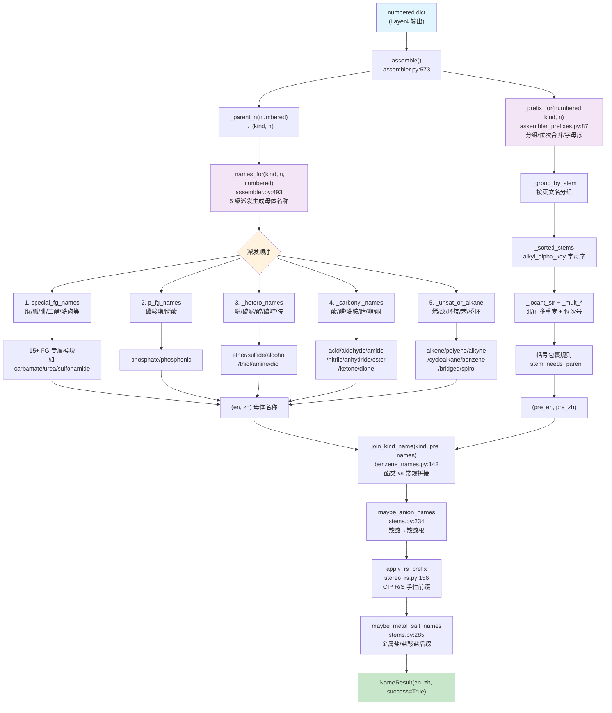
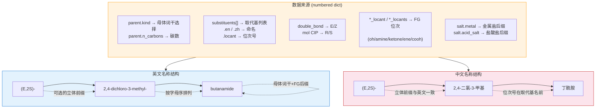

# Layer5: 名称组装 (Name Assembly)

> **管线位置:** 第 5 层 / 6 层 (输出层) | **源文件:** 22 个 `.py` | **最后更新:** 2026-08-11

---

## 概述

Layer5 是 NamePredict 6 层命名管线的终端输出层，负责将前序各层产生的结构化中间数据（编号后的母体信息 + 取代基清单 + 位次分配）组装为完整的中英双语 IUPAC 名称。它是整个管线中与 Layer2 并列为代码量最大的两层之一（wiki_plan 标注："重点关注 layer2 母体选择逻辑和 layer5 名称组装"）。

**管线中的位置：**

```
Layer4: numbering (位次分配)
    ↓  numbered dict
┌──────────────────────┐
│  Layer5  名称组装      │  ← 当前层 (输出层)
└──────────────────────┘
    ↓  NameResult {en, zh}
输出: "2-chloropropane" / "2-氯丙烷"
```

**职责边界：**

| 职责 | 说明 |
|------|------|
| 母体名称生成 | 根据 parent kind 和碳数 n 查表/构造双语母体词干 |
| 取代基前缀组装 | 按字母序排列、重复基团合并 (di/tri/tetra)、位次号拼接 |
| 立体化学插入 | R/S (CIP) 和 E/Z (双键) 立体描述符的前缀化 |
| 功能类命名 | 酯 (ester)、酸酐 (anhydride)、盐 (salt) 的特殊名称模式 |
| 双语输出 | 同步生成英文和中文两套 IUPAC 字符串 |
| 特殊 FG 命名 | 磷酸酯、磺酸/磺酰胺、脲/胍/肼、氨基甲酸酯等专属命名规则 |

**非职责（由上游层承担）：**

- 不执行任何化学分析或官能团识别（属 Layer1）
- 不进行母体选择决策（属 Layer2）
- 不进行取代基提取与命名（属 Layer3）
- 不进行位次分配/编号（属 Layer4）

**输入/输出类型：**

```
assemble(numbered: dict, *, time_ms: float = 0.0, source: str = "iupac") -> NameResult
```

`numbered` 字典是多层管线积累的结构化数据，核心字段包括：
- `parent` — 母体信息 (`kind`, `n_carbons`, `stem_en`, `stem_zh`, `chain`, `mol` 等)
- `substituents` — 取代基列表 (每条含 `en`, `zh`, `locant`, `kind`, `paren` 等)
- 各种 `_locant` / `_locants` 字段 — FG 位次 (如 `oh_locant`, `amine_locant`, `ketone_locant`, `ene_locant`, `cooh_locants` 等)
- 立体化学字段 — `double_bond` / `double_bonds` (供 E/Z), 分子内嵌 CIP (供 R/S)

`NameResult` 包含字段 `en: str`, `zh: str`, `success: bool`, `source: str`, `time_ms: float`, `meta: dict`。

---

## 核心逻辑

### 1. 组装总控 (`assemble` 函数)

Layer5 的入口是 `assembler.py` 中的 `assemble` 函数（第 640 行）。它遵循一个清晰的名称变换流水线，每步返回双语元组 `(en, zh)`：

```
assemble(numbered)
  │
  ├─ 0. _typed_expression_kind(kind, numbered) → 按 principal expression 重定型
  ├─ 1. _names_for(kind, n, numbered)     → 母体名称 (en, zh)
  ├─ 2. _prefix_for(numbered, kind, n)    → 取代基前缀 (pre_en, pre_zh)
  ├─ 3. join_kind_name(kind, pre, names)  → 拼接前缀+母体
  ├─ 4. maybe_anion_names(numbered, en, zh) → 羧酸根阴离子后缀
  ├─ 5. apply_rs_prefix(numbered, en, zh) → R/S 立体化学前缀
  └─ 6. maybe_metal_salt_names(...)       → 金属盐/盐酸盐后缀
       → NameResult(en, zh)
```

> **源:** `src/namepredict/layer5/assembler.py:640-651`

这 5 步体现了 IUPAC 名称的标准模板：**[立体前缀]-[取代基前缀]-[母体词干]-[官能团后缀]-[盐后缀]**。每一步都是纯文本操作，不涉及任何化学计算——所有化学推理已在 Layer1-4 完成。

### 2. 母体名称生成的派发机制 (`_names_for`)

`_names_for` 是母体名称的核心派发函数（第 569 行），按优先级依次尝试五种命名策略：

1. **特殊 FG 命名** (`special_fg_names`)：覆盖 carbamate、carbonate、urea、guanidine、hydrazine、diester、boronic、acyl halide、sulfoxide、sulfonamide、sulfonate、sulfone、sulfonic acid、sulfonyl chloride、cyclo exo-FG 等。这些类别有独特的命名模式，不符合标准的"词干-FG后缀"模板。

2. **磷酸酯命名** (`p_fg_names`)：phosphate 和 phosphonic 的专属规则。

3. **杂原子/羟基/胺基命名** (`_hetero_names`)：处理 ether、sulfide、alcohol、thiol、diol、triol、amine、polyamine、cycloalcohol、cycloamine 等含 O/N/S 的母体。

4. **羰基命名** (`_carbonyl_names`)：处理 acid、aldehyde、amide、nitrile、anhydride、ester、ketone、dione 等含 C=O 的母体，包括其不饱和变体（alkenoic acid、alkynone 等）。

5. **不饱和烃/环命名** (`_unsat_or_alkane`)：处理 alkene、polyene、alkyne、cycloalkane、cycloalkene、benzene、bridged、spiro 等。

> **源:** `src/namepredict/layer5/assembler.py:569-576`

这种 5 级派发确保了特殊命名优先于通用命名——例如 diethyl carbonate 调用 `carbonate_names` 而非走通用 `ether` 分支。

### 3. 双语词干表 (`stems.py`)

`stems.py` 是整个 Layer5 的数据基础，提供 C1-C35+ 碳数范围的英中双语词干生成器。设计要点：

**C1-C10：保留名/系统名基表。** 如 `methane`/`甲烷`、`propane`/`丙烷`。这是 IUPAC 规定的保留前缀，不可由规则推导。

**C11-C19：半系统命名。** 英文使用复合词干（`undec`, `dodec`, `tridec`...），中文使用数字+烷（`十一烷`, `十二烷`...）。中文数字由 `zh_num(n)` 函数生成，支持 1-99 范围。

**C20+：乘性组合词干。** 英文按十位 (`icos`, `triacont`, `tetracont`...) + 个位 (`hen`, `do`, `tri`...) 组合，例如 C22 = `docos` (do+cos)。这是 IUPAC P-21 规定的规则，优先使用 `icos-` 而非旧式 `eicos-`。

**FG 词干派生。** 对于每个碳数 n，从烷烃词干推导出对应官能团的英中名称：
- 醇 (alcohol): methane → methanol (EN) / 甲 → 甲醇 (ZH)
- 酸 (acid): ethane → acetic acid (EN) / 乙 → 乙酸 (ZH)——C1/C2 保留名
- 醛 (aldehyde): pentane → pentanal (EN) / 戊 → 戊醛 (ZH)
- 酰胺 (amide): hexane → hexanamide (EN) / 己 → 己酰胺 (ZH)
- 腈 (nitrile): octane → octanenitrile (EN) / 辛 → 辛腈 (ZH)
- 酯 (ester acyl): decane → decanoate (EN)
- 酰氯/酰溴 (acyl halide): butane → butanoyl chloride (EN) / 丁 → 丁酰氯 (ZH)

所有公开词干表通过 `_fill(fn, lo=1, hi=35)` 自动填充为字典，确保 C20+ 的长链名称无需手动维护。

> **源:** `src/namepredict/layer5/stems.py:9-13` (基表), `src/namepredict/layer5/stems.py:333-352` (Fill 生成)

**中文词干处理：** `zh_stem(zh_full)` 函数从中文全名中剥离末端 FG/母体后缀（如 `十一烷` → `十一`），用于构造带位次号的 FG 名称（如 `丁-2-醇`）。

**盐后缀支持：** `maybe_anion_names` 将羧酸名称转为羧酸根形式（`dodecanoic acid` → `dodecanoate` / `十二酸` → `十二酸根`）。`maybe_metal_salt_names` 处理碱性金属盐（`sodium dodecanoate` / `十二酸钠`）和盐酸盐（`;hydrochloride` / `;盐酸盐`）。

> **源:** `src/namepredict/layer5/stems.py:234-238`, `src/namepredict/layer5/stems.py:285-290`

### 4. 取代基前缀组装 (`assembler_prefixes.py`)

取代基前缀的组装遵循 IUPAC P-14.5 规则：按取代基英文名的字母序排列，重复基团用 di/tri/tetra 合并位次号。

**核心函数 `_build_prefix(substituents, n_carbons, kind)`：**

1. **分组** (`_group_by_stem`)：将取代基列表按英文名 (`s["en"]`) 分为 `{stem: [sub, sub, ...]}` 的字典。相同化学种类的多个实例（如两个氯原子）合并处理。

2. **位次号合并** (`_locant_str`)：同种取代基的多个位次号排序后用逗号连接，如 `2,4-dichloro`。

3. **多重度前缀**：1 个时不加前缀，2 个 `di`/`二`，3 个 `tri`/`三`，以此类推。特殊词干（含 `carboxy`）使用 `bis`/`tris` 避免歧义（如 `1,2-bis(carboxymethyl)`）。

4. **位次号省略规则** (`_omit_sub_locants`)：多种条件决定是否省略位次号——单碳母体 (C1)、单取代苯/环烷、N-取代基（如 sec_amine 的 N-alkyl 不标位次）等自动省略位次号。

5. **括号规则** (`_stem_needs_paren`)：取代基名称含括号、以数字开头、或特定词干（如 `trifluoromethyl`）需要额外括号包裹。

6. **字母序排列** (`_sorted_stems`)：英文词干按 `alkyl_alpha_key` 定义的规则排序（与 Layer3 的取代基提取器共享同一排序键，保证一致性）。

> **源:** `src/namepredict/layer5/assembler_prefixes.py:80-86` (_build_prefix), `src/namepredict/layer5/assembler_prefixes.py:12-16` (_group_by_stem)

**特殊前缀模式：** `_prefix_for` 在苯、苯甲酸酯、嘧啶胺等特定母体上施加额外规则，确保前缀生成与母体命名风格的协调。例如苯的取代基数 >= 4 时，中文前缀使用括号包裹三氟甲基以确保可读性。

> **源:** `src/namepredict/layer5/assembler_prefixes.py:87-97` (_prefix_for)

### 5. 苯/芳烃母体命名 (`benzene_names.py`)

芳烃命名是 Layer5 中最复杂的子系统之一，因为存在大量 IUPAC 保留名和特殊编号规则：

**保留名识别：** 单甲基苯 → `toluene`/`甲苯`；单甲氧基苯 → `anisole`/`甲氧基苯`；二甲基苯 → `xylene`/`苯`（中文用"苯"作母体，二甲苯位次号前置）。

**多甲氧基苯：** 当苯环上有 >=2 个取代基、恰好一个甲氧基、且无烷基取代时，中文使用 `苯甲醚` 作母体，并对其他取代基重新编号（以甲氧基为 1 位），取较低位次组的方向。

**二甲苯前缀：** `_xylene_prefix` 将两个甲基位次号前置，英文为 `2,3-` 格式，中文为 `2,3-二甲基` 格式。

**稠合 iso 芳烃：** 通过 `iso_arene_names.py` 处理 isoindole、isobenzofuran 等特殊稠合体系。

**苯甲酸酯 (benzoate)：** `benzoate_parent_names` 处理 alkyl benzoate 格式——英文为 `methyl benzoate`，中文为 `苯甲酸甲酯`（酸在前、醇在后，与英文语序相反）。支持复杂 O-烷基（`alkoxy_complex`）模式。

**杂环羧酸：** `hetero5carboxylic_names` 处理五元杂环（呋喃、噻吩、吡咯、咪唑、吡唑）的羧酸衍生物，自动添加 `1H-` 前缀（如 `1H-pyrrole-2-carboxylic acid`）。`sat_hetero_carboxylic_names` 处理饱和杂环（哌啶、吗啉、氧杂环戊烷等）。

**吡啶/喹啉/吲哚/萘衍生物：** `pyridine_kind_names` 派发吡啶类官能团母体（pyridinecarboxylic、pyridinamine、pyridinol）、嘧啶胺、苯并噻唑/噁唑/咪唑胺，以及萘/喹啉/吲哚/吲唑的羧酸/醛/腈等。

**泛化芳烃 FG 母体：** `_ARENE_FG_STEM` 表驱动地处理 naphthalenol、naphthalenediol、naphthalenamine、quinolinediol、pyrazolamine、thiazolamine、quinazolinamine 等，通过统一的 `_arene_fg_parent_names` 函数生成 `{stem}-{locants}-{suffix}` 格式名称。

> **源:** `src/namepredict/layer5/benzene_names.py:82-87` (benzene_parent_names), `src/namepredict/layer5/benzene_names.py:493-525` (arene FG stem)

### 6. 立体化学插入

**E/Z 前缀 (`stereo_ez.py`)：** 检查母体的 `double_bond`（单个双键）或 `double_bonds`（多个双键）字段，读取 RDKit 的双键立体标签 (`BondStereo.STEREOE` / `BondStereo.STEREOZ`)，生成 `(E)-` 或 `(Z)-` 前缀。多烯体系生成复合前缀如 `(2E,6Z)-`。

> **源:** `src/namepredict/layer5/stereo_ez.py:64-69` (ez_for_parent)

**R/S 前缀 (`stereo_rs.py`)：** 调用 RDKit 的 `AssignStereochemistry` 强制重算 CIP 优先级，然后沿母体 chain 检测携带 `_CIPCode` 属性（`R` 或 `S`）的手性中心，按 IUPAC P-92/P-93 规则生成前缀。`apply_rs_prefix` 在组装流水线的最后阶段调用，将 R/S 描述符合并到名称开头（与已有的 E/Z 前缀共存）。

**合并规则：** R/S 前缀与已有的 E/Z 前缀共享同一个括号块，按"先 E/Z 后 R/S"、同类型按位次号排序。例如 `(E,2S)-` 而非 `(E)-(2S)-`。对于酯，R/S 描述符插入烷基词之后（`methyl (2S)-butanoate`）。

> **源:** `src/namepredict/layer5/stereo_rs.py:154` (apply_rs_prefix), `src/namepredict/layer5/stereo_rs.py:92-114` (_parse_stereo / _format_stereo)

### 7. 功能性命名模式

**酯 (ester)：** 英文格式 `{alkyl} {acyl}ate`（如 `methyl butanoate`），中文格式 `{酸}{醇}酯`（如 `丁酸甲酯`，酸在前醇在后）。`join_ester_name` 处理取代基前缀在酯中的插入——前缀插入 acyl 词干前（`methyl 2-oxobutanoate`），而 E/Z 立体前缀保留在 alkyl 词之后。不饱和酯通过 `unsat_acid.py` 派发为 alkenoate/alkynoate 格式。

> **源:** `src/namepredict/layer5/benzene_names.py:131-139` (join_ester_name)

**酸酐 (anhydride)：** `_anhydride_from_acid` 将酸名转为酸酐名——英文 `oic acid` → `oic anhydride`，中文 `酸` → `酐`（如 `acetic anhydride`/`乙酸酐`）。

**二酯 (diester)：** `diester_names.py` 处理对称二酯 `di{alkyl} {alkane}dioate` 格式（如 `diethyl oxalate`/`草酸二乙酯`），支持不饱和二酯的 E/Z 立体标记。

**金属盐：** `maybe_metal_salt_names` 将羧酸根名称转为金属盐——检测 `salt.metal` 字段，英文追加金属名前缀（`sodium acetate`），中文将 `酸根` 替换为 `酸{金属}`（`乙酸钠`）。盐酸盐通过 `acid_salt` 字段追加 `;hydrochloride`/`;盐酸盐`。

**酰卤 (acyl halide)：** `acyl_halide_names.py` 生成 `{alkan}oyl chloride`/`{烷}酰氯` 格式。特殊保留名如 `acetyl chloride`（C2）、`isobutyryl bromide`（C3 + 2-甲基分支）。

### 8. 不饱和体系的母体命名

`unsat_acid.py` 提供完整的不饱和羰基/羟基/酮体系的母体命名：

- **烯酸 (alkenoic acid)：** `{alkane}enoic acid`，如 `but-2-enoic acid`/`丁-2-烯酸`，多烯使用 `dienoic acid`/`二烯酸` 等复合后缀
- **炔酸 (alkynoic acid)：** `{alkane}ynoic acid`/`{烷}炔酸`
- **烯醛 (alkenal)：** `{alkane}enal`/`{烷}烯醛`
- **烯腈 (alkenenitrile)：** `{alkane}enenitrile`/`{烷}烯腈`
- **烯醇 (alkenol)：** `{alkane}-{ene}-en-{oh}-ol` 格式，同时标记双键和 OH 位次
- **烯酮 (alkenone)：** `{alkane}-{ene}-en-{one}-one` 格式
- **不饱和多元醇：** `assembler.py` 中的 `_unsat_polyol_names` 在 diol/triol 母体上优先尝试不饱和命名，如 `but-2-ene-1,4-diol`/`丁-2-烯-1,4-二醇`

> **源:** `src/namepredict/layer5/unsat_acid.py:75` (alkenoic_acid_names), `src/namepredict/layer5/assembler.py:129` (_unsat_polyol_names)

### 9. FG 专属命名模块的设计模式

Layer5 的多个 FG 专属命名模块遵循一个统一的设计模式——每个模块导出一个或多个函数，签名为 `(numbered: dict) -> tuple[str, str] | None` 或 `(kind: str, n: int, numbered: dict) -> tuple[str, str] | None`。以 `sulfur_names.sulfonamide_names` 为例：

1. **kind 门控：** 入口函数检查 `parent["kind"]` 是否匹配，不匹配直接返回 `None`。
2. **mode 派发：** 通过 `parent["mode"]` 字段（如 `"alkyl"`, `"aryl"`, `"n_alkyl"` 等）派发到不同的子模式函数。
3. **侧链 (side) 提取：** 从 `parent["s_side"]`（S 侧）和 `parent["n_side"]`（N 侧）提取芳基/烷基信息。
4. **双语拼接：** 英文使用 "X benzenesulfonamide" 格式，中文使用 "X 苯磺酰胺" 格式，N-取代前缀通过 `N-` 标记。

其他模块的类似模式：
- **carbamate_names**: `alkyl N-substituent carbamate` / `N-取代基 氨基甲酸 烷基酯`
- **nitrogen_names.urea_names**: 无取代 `urea`/`脲` → 单芳基 `phenylurea`/`苯脲` → 1,1-二甲基-3-芳基模式
- **phosphate_names**: `alkyl dihydrogen phosphate` / `磷酸烷基酯`
- **sulfur_names.sulfonic_acid_names**: `alkanesulfonic acid` / `烷磺酸` 或 `arenesulfonic acid` / `芳烃磺酸`

氮族（urea/guanidine/hydrazine/isocyanate/isothiocyanate）集中在 `nitrogen_names.py`，硫族（sulfonamide/sulfonate/sulfone/sulfonic acid/sulfonyl chloride/sulfoxide）集中在 `sulfur_names.py`。这种设计模式确保了每个 FG 模块的高内聚性——特定官能团的所有命名知识封装在单个文件中，`special_fg_names` 仅作为薄派发层。

> **源:** `src/namepredict/layer5/special_fg_names.py:54` (special_fg_names dispatch)

### 10. 名称拼接 (`join_kind_name`)

`join_kind_name` 是前缀与母体的拼接函数（`benzene_names.py:142-149`），处理两种拼接模式：

- **酯类拼接** (`join_ester_name`)：将前缀插入 alkyl-acyl 结构之间，保留 E/Z 立体标记在 alkyl 词后
- **常规拼接** (`join_parent_name`)：前缀-母体用连字符连接，但以数字或 `1H-` 开头的母体需要连字符（`pre-stem` 而非 `prestem`）

中文额外处理：当英文母体以 `1H-` 开头且中文母体尚未携带此前缀时，自动添加 `1H-` 前缀（`zh_1h_parent`）。

> **源:** `src/namepredict/layer5/benzene_names.py:142-149` (join_kind_name), `src/namepredict/layer5/benzene_names.py:117-122` (join_parent_name)

---

## 文件清单

### 核心组装

| 文件 | 说明 |
|------|------|
| `src/namepredict/layer5/__init__.py` | 包入口，导出 `assemble` |
| `src/namepredict/layer5/assembler.py` | 主组装器：typed-kind 重定型 + 母体名称派发 + 名称变换流水线 (651 行) |
| `src/namepredict/layer5/assembler_prefixes.py` | 取代基前缀：分组、位次合并、字母序排列 (93 行) |

### 词干表

| 文件 | 说明 |
|------|------|
| `src/namepredict/layer5/stems.py` | C1-C35+ 英中双语烷烃及 FG 词干生成器，盐后缀支持 (375 行) |

### 芳烃/杂环母体

| 文件 | 说明 |
|------|------|
| `src/namepredict/layer5/benzene_names.py` | 苯/芳烃/杂环母体：保留名、前缀、杂环羧酸、泛化芳烃 FG、`pyridine_kind_names` 分发 (324 行) |
| `src/namepredict/layer5/aryl_helpers.py` | 芳基辅助：tolyl 交换、phenyl→benzene 转换、括号包裹 (38 行) |
| `src/namepredict/layer5/iso_arene_names.py` | iso-芳烃稠合体系命名 (73 行) |

### 立体化学

| 文件 | 说明 |
|------|------|
| `src/namepredict/layer5/stereo_rs.py` | CIP R/S 手性中心立体描述符 (162 行) |
| `src/namepredict/layer5/stereo_ez.py` | E/Z 双键立体描述符 (73 行) |

### 不饱和体系

| 文件 | 说明 |
|------|------|
| `src/namepredict/layer5/unsat_acid.py` | 烯/炔酸、醛、腈、酯、醇、酮的不饱和母体命名 (321 行) |
| `src/namepredict/layer5/polycarboxylic.py` | 多元羧酸（开链/苯/环烷）(43 行) |

### FG 专属命名（按字母序）

| 文件 | 说明 |
|------|------|
| `src/namepredict/layer5/acyl_halide_names.py` | 酰氯/酰溴 (39 行) |
| `src/namepredict/layer5/boronic_names.py` | 硼酸命名 (45 行) |
| `src/namepredict/layer5/carbamate_names.py` | 氨基甲酸酯：N-取代模式 (77 行) |
| `src/namepredict/layer5/carbonate_names.py` | 碳酸酯命名 (65 行) |
| `src/namepredict/layer5/cyclo_exo_fg_names.py` | 环烷外环羰基 FG (31 行) |
| `src/namepredict/layer5/diester_names.py` | 对称二酯 (67 行) |
| `src/namepredict/layer5/nitrogen_names.py` | **氮族合并模块**：urea / guanidine / hydrazine / isocyanate / isothiocyanate (199 行) |
| `src/namepredict/layer5/phosphate_names.py` | 磷酸酯/膦酸命名 (44 行) |
| `src/namepredict/layer5/special_fg_names.py` | FG 派发层：统筹所有 FG 专属命名模块 (58 行) |
| `src/namepredict/layer5/sulfur_names.py` | **硫族合并模块**：sulfonamide / sulfonate / sulfone / sulfonic acid / sulfonyl chloride / sulfoxide (358 行) |

### yl 转换

| 文件 | 说明 |
|------|------|
| `src/namepredict/layer5/free_to_yl.py` | 自由母体名 → P-29 取代基 -yl 形式（FG 后缀→前缀，`free_to_yl`) (185 行) |

### 管线集成

| 文件 | 说明 |
|------|------|
| `src/namepredict/namer.py` | 主协调器：L0→L5 管线调度，Layer5 为最终输出步骤 |

---

## 数据流图

### Layer5 组装流水线



### 双语输出结构 — IUPAC 名称模板



---

## 对外接口

### `assemble(numbered: dict, *, time_ms: float = 0.0, source: str = "iupac") -> NameResult`

Layer5 唯一的公共接口，将编号完成的结构化数据组装为最终的双语 IUPAC 名称。

| 参数 | 类型 | 说明 |
|------|------|------|
| `numbered` | `dict` | Layer4 输出的编号后数据，含 `parent`、`substituents`、各类 `_locant` 字段 |
| `time_ms` | `float` | 可选的时间戳（毫秒），由 `namer.py` 计算并传入 |
| `source` | `str` | 名称来源标识，默认 `"iupac"` |

| 返回值 | 说明 |
|--------|------|
| `NameResult(en="...", zh="...", success=True)` | 组装成功的双语名称 |
| `NameResult(en="", zh="", success=False, meta={"reason": "unsupported", ...})` | 无法识别的 kind 或缺失关键字段 |

**`NameResult` 结构：**

| 字段 | 类型 | 说明 |
|------|------|------|
| `en` | `str` | 英文 IUPAC 名称 |
| `zh` | `str` | 中文 IUPAC 名称 |
| `success` | `bool` | 组装是否成功 |
| `source` | `str` | 名称来源 (`"iupac"`) |
| `time_ms` | `float` | 累计耗时（毫秒） |
| `meta` | `dict` | 元数据（含 `parent_kind`, `parent_chain`, `depth`, `salt` 等） |

**调用者:** `namer.py:_ok_result` (第 70 行) — 在 Layer4 编号完成后立即调用，将结果封装为 `NameResult` 并注入覆盖率元数据。

---

## 相关页面

- [[architecture/overview]] — 6 层架构总览与层间数据流
- [[architecture/layer4-locants]] — 上一层：位次分配/编号引擎（Layer5 的直接上游）
- [[architecture/layer2-parent-selector]] — 母体选择器（决定 parent.kind，Layer5 的核心输入）
- [[architecture/layer3-numbering]] — 取代基提取与命名（生成 substituents[] 列表）
- [[architecture/layer1-analyzer]] — 官能团分析器（FG 检测的源头）
- [[concepts/bilingual-naming]] — 中英双语命名约定与差异
- [[concepts/functional-groups]] — 官能团优先级表（决定主 FG / 后缀选择）
- [[concepts/iupac-rules]] — IUPAC 蓝皮书规则映射（P-14, P-21, P-63, P-65, P-91-93）
- [[reference/api]] — `SMILESNNamer.name()` 公开 API（从 SMILES 到 NameResult 的完整流程）
- [[reference/molecule-model]] — `NameResult` 及 `numbered` 字典的完整字段结构
- [[guides/adding-fg]] — 如何新增官能团命名（需同时修改 Layer1-5）
- [[guides/adding-ring-system]] — 如何新增环系命名
- [[index]] — Wiki 首页
