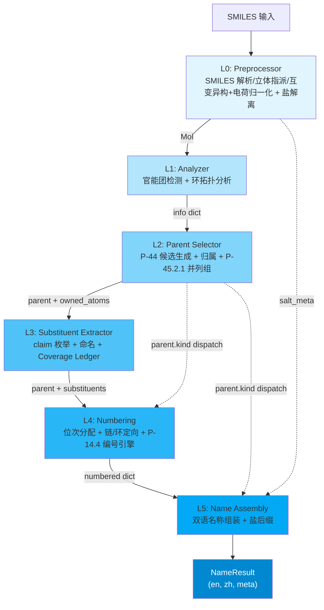

# Architecture Overview / 架构总览

**NamePredict** 是一个基于规则的 SMILES -> IUPAC 双语（EN/ZH）有机化合物命名引擎。它采用 6 层流水线架构，自 SMILES 字符串解析开始，逐层推进至最终的中英文名称输出。

> 最后更新: 2026-09-13 | 源文件: 64 `.py` / 8,880 行（`src/namepredict` 全量，含 `tools/`、`constants.py`、`namer.py`）

---

## 1. 核心入口：SMILESNNamer

整个引擎的入口点是 `SMILESNNamer` 类（`src/namepredict/namer.py:274`）。它是流水线的 orchestrator，对外暴露唯一的公共 API：

```python
namer = SMILESNNamer(cache=CommonNameCache())
result: NameResult = namer.name("CC(=O)O")  # acetic acid / 乙酸
```

`NameResult`（`src/namepredict/types.py:8-16`）是一个统一的输出契约：

| Field | Type | Description |
|-------|------|-------------|
| `en` | `str` | 英文 IUPAC 名称 |
| `zh` | `str` | 中文 IUPAC 名称 |
| `success` | `bool` | 命名是否成功 |
| `source` | `str` | 名称来源（通常为 `"iupac"`） |
| `time_ms` | `float` | 流水线耗时（ms） |
| `meta` | `dict` | L1-L5 各级元数据（parent_chain、kind、p44_1_1_key 等，见 [[reference/core-data-contracts]]） |

---

## 2. 六层流水线



### 2.1 Layer 0 -- Preprocessor（预处理器）

**职责**：SMILES 解析 + 立体初步指派 + 酰胺烯醇互变异构归一化（两次）+ 酸性质子收敛 + 盐解离（5 个 `.py`，299 行）

- `preprocess(smiles)`（`src/namepredict/layer0/preprocessor.py:11-26`）：`MolFromSmiles(smiles, sanitize=False)` → `SanitizeMol` → `Chem.AssignStereochemistry(force=True, cleanIt=False, flagPossibleStereoCenters=True)` → `normalize_amide_tautomer(mol)` → `normalize_acid_charge(mol)` → `normalize_amide_tautomer(mol)`；任一步异常返回 `None`，由 namer 触发 `_fail("parse")`。**二次互变归一**（`:23`）是必需的：电荷重定位把酰胺 O⁻ 变回中性 `C(OH)=N` 后才出现可归一的酰胺烯醇位，不重跑会留下亚胺醇式名（gold 取酰胺式）。
- `normalize_amide_tautomer(mol)`（`src/namepredict/layer0/tautomer.py:48`）：把分子内非芳香中性 `C(OH)=N` 位点归一化为酮式酰胺 `C(=O)-NH`（只改键级、靠 RDKit 隐氢重算完成质子迁移，不增删重原子）。羟基 O 的候选判据是「与碳单键相连（Degree==1）且总 H 数 ≥1」——隐氢与 `normalize_acid_charge` 写下的显式 H（`[OH]`）都接受；迁移前先把羟基 O 的显式 H 记账清零（`SetNumExplicitHs(0)` + `SetNoImplicit(False)`，`tautomer.py:58-59`），否则新生成的 C=O 会让 O 价态超限、整分子消毒失败回退；羟基 H 数 ≠1 的点位直接放弃。带电 N / O⁻ 阴离子 / 硫类似物位点跳过。
- `normalize_acid_charge(mol)`（`src/namepredict/layer0/charge.py:74`）：同一片段内质子化强酸（供体 `constants.DONOR_KIND`，`constants.py:102`）与去质子化弱酸位共存时，逐次把质子搬到弱酸位，使等价负电荷收敛到最强酸；只改 `FormalCharge`/H 记账（RWMol 原子级编辑），含 `*` dummy 或消毒失败时保守跳过。成酸中心由 `_acid_kind`（`charge.py:25`）按 `constants.ACID_CENTERS`（`constants.py:105`）查表识别，供体与共轭碱判定共用同一张表。
- `dissociate_salt(mol)`（`src/namepredict/layer0/salt.py:81`）：先用只数片段的 `Chem.GetMolFrags(mol)` 早退（单片段直接返回），再检测碱金属盐（Li<sup>+</sup>, Na<sup>+</sup>, K<sup>+</sup>）和 HCl 盐，分离有机片段与盐组分。返回 `(organic_mol, salt_meta)` 元组。早退省掉 `asMols=True, sanitizeFrags=True` 为每片段重建分子并重新 sanitize 的开销（`_name_mol` 每次递归都会调本函数，绝大多数分子只有 1 个片段）。水片段无特判，按普通有机片段计入片段数——「金属盐 + 结晶水」因有机片段数为 2 而不被识别为盐。

**关键设计**：salt_meta 注入链 -- L0 产生的 salt 元数据跨越 L1-L4，经 `info["salt"]`（`namer.py:228`）与 `result.meta["salt"]`（`:232`）直接注入 L5 的名称组装阶段（`_apply_salt_suffix`，`namer.py:192`），用于生成 "sodium ..." / "...钠" 等盐名称格式。参见 [[concepts/bilingual-naming]]。立体指派把 RDKit 初步立体信息带进下游，供 L5 E/Z 与 R/S 判定；互变异构归一化保证酰胺烯醇数据与酮式酰胺同判；电荷归一化把输入侧电荷错位的结构（如 chebi-433）交给既有 carboxylate → -oate 能力处理（详见 [[architecture/layer0-preprocessor]]）。

> 源文件：`src/namepredict/layer0/preprocessor.py`, `src/namepredict/layer0/tautomer.py`, `src/namepredict/layer0/charge.py`, `src/namepredict/layer0/salt.py`（L0 常量集中在 `src/namepredict/constants.py`，模块内不自备副本）

### 2.2 Layer 1 -- Analyzer（分析器）

**职责**：官能团检测 + 环系拓扑分析，输出 info dict

`analyze(mol)`（`src/namepredict/layer1/analyzer.py:489`）对 Mol 进行全原子扫描，由 `_info`（`:484`）汇总出一个标准化 info dict（实测 11 键，namer 再注入 `root_ctx`/`salt` 共 13）：

```python
info = {
    "mol": mol,                    # RDKit Mol 对象
    "carbon_ids": [...],           # 所有碳原子索引（analyzer.py:390）
    "n_carbons": N,                # 碳原子总数
    # --- 不饱和度事实列表（_bond_lists，analyzer.py:439）---
    "double_bonds": [{"c1": i, "c2": j}, ...],
    "triple_bonds": [...],
    # --- 官能团库存（_collect_fgs，analyzer.py:482）---
    "fg_inventory": FunctionalGroupInventory(...),
    # --- 环系事实（_ring_meta，analyzer.py:380）---
    "rings": [...], "n_rings": int, "has_ring": bool,
    "ring_systems": [...], "n_ring_systems": int,
}
```

官能团不再以独立列表键（`carboxyls`/`esters`/…）进入 info：所有检测结果收敛为单一 `fg_inventory` 对象，下游一律经 `functional_group_inventory.inventory_from_info(info)`（`functional_group_inventory.py:121`）读取。`FunctionalGroupOccurrence` 携带 `id`（`"{list_key}:{序号}"`）/`group_class`/`characteristic_atoms`/`parent_anchors`/`payload`/`demoted` 六个字段，`demoted=True` 标识被 P-41 压制的降级叶（carboxy/cyano 前缀）。布尔标志只剩 `has_ring` 一个。信息 dict 从 L1 产出后贯穿 L2-L5，是整个流水线的通用数据合约（[[reference/core-data-contracts]]）。

**统一 FG 条目接口**：`FG_SPECS`（`layer1/fg_registry.py:32`，14 条 `FgSpec`）声明每类的 `list_key`、`p41` 优先级、`path`、锚点字段与 `locant_kind`/`locant_source`，检测器一律产出 `{"center_idx": int, "surr_idx": [int, ...]}`（磷酸例外：`{"p_idx", "n_oh", "n_om", "n_arms"}`，`analyzer.phosphate_entries:98`）。`_arbitrate_parts(parts)`（`analyzer.py:447`）执行 P-41 仲裁：`_SUPPRESSIBLE` 组的组合羰基 FG 被更高优先级 FG 压制时清空，`_LEAF_DEMOTED` 组（carboxyls/nitriles）保留条目并置 `demoted=True` 供 L2 产出 carboxy/cyano 前缀叶。

**检测约束**：环内杂原子（`constants.RING_HETERO` = N/O/S，`_has_ring_hetero_neighbor:125`）使单碳羰基按环酮归类（P-66.1.1）——环内 N 为 N-酰基环胺、环内 O/S 为内酯/硫代内酯，同由 `_is_ketone_carbon:129` 判定；环外羰基须带 H 才作醛（`_is_aldehyde_carbon:190`）；锚定酰基头由 `_is_acyl_head:399` 识别（α 环/芳放行——苯甲酰/furan-2-carbonyl）。`_amine_degree` 排除环内非芳香 N——饱和杂环 N 是环杂原子而非胺官能团。环系由 `ring_systems.build_ring_systems:289` 产出，`sssr_rings:14` 是 SSRR 环表单一入口，经 `memo.by_mol("sssr", …)` 在单次命名内只算一次（L2/L4 复用）。

> 源文件：`src/namepredict/layer1/analyzer.py`, `src/namepredict/layer1/fg_registry.py`, `src/namepredict/layer1/functional_group_inventory.py`, `src/namepredict/layer1/_carbonyl_common.py`, `src/namepredict/layer1/acyl_halide.py`, `src/namepredict/layer1/ring_systems.py`（7 个 `.py`，1,173 行）。`analyze()` 出口保留一行 `print(result)`（`analyzer.py:492`）。

### 2.3 Layer 2 -- Parent Selector（母体选择器）

**职责**：母体氢化物（parent hydride）选择——按 IUPAC P-44 规则驱动管线选出主链/主环母体，并按 P-45.2.1 交出并列候选组

这是流水线中逻辑最复杂的层（13 个 `.py`，2,079 行），位于 `src/namepredict/layer2/`。对外只有 `select_parent(info)`（`parent_selector.py:69`），返回 **P-45.2.1 并列最优候选组 `list[dict]`**（namer 逐候选跑 L3–L5 后裁决，见 §3.2）。

**主路径（P-44 规则驱动管线 + P-45.2 打平）**：

`principal_parent.rule_driven_parent_candidates`（`principal_parent.py:45`）产出候选，`parent_selector._rank_candidates:32` 排序，最后 `_reorder_p45_2` 按 P-45.2 稳定重排。管线分四步：

1. **主官能团选择**（`principal.select_principal_group:70`）：按 `PRINCIPAL_REGISTRY`（由 `FG_SPECS` 派生）的 P-41 优先级选主官能团（`PrincipalPriority` 取最小）
2. **骨架枚举 + 筛选**（`parent_skeleton.py`）：枚举开链 + 环系统骨架，依次施加 P-44.1.2（环>链 + 最高杂原子）/ P-44.2 / P-44.3（链长）/ P-44.4（不饱和度，芳香键按 Kekulé 双键当量计入，苯=3）
3. **typed 表达**（`principal_expression.py`）：`express_chain_principal:446` / `express_ring_principal:256` 产出带 `PrincipalExpressionFacts` 与 `ScaffoldIdentity` 的 parent dict。链/多数量集合由 `fg_registry.chain_fgs()`（12 类）/`multi_fgs()`（7 类）派生（`_CHAIN_FG:45`/`_MULTI_FG:46`）；kind 正交化——纯烃与未注册稠环收敛为 `alkane`、数量由 `multiplicity` 承载。
4. **P-45.2 母体打平**（`parent_selector.py`）：P-44 排序后按 **P-45.2.1 前缀取代基团数最多**稳定重排（`_p45_2_prefix_count` = L3 `iter_claims` 在 owned_atoms 边界外的 claim 个数），面向芳基臂仲胺等多臂候选选母体。

**评分现状**：候选键为 `P44Facts(principal_group_class, principal_group_count)`（`parent_selector.py:8`），`principal_key:21` 当前以 `P44Facts(None, count)` 构造，FG 等级维恒为 `None`——候选排序实际只由 `principal_group_count` 与 P-45.2.1 决定；`_p44_1_1:26` 返回该二元组供 namer 裁决。

**骨架识别**（`ring_scaffold.py`，487 行）：`_TEMPLATES` 是唯一事实来源（**83 条**，含 `standard` 固定编号的 **36 条**），派生 `ScaffoldSpec`/`ScaffoldIdentity`；`_FUSION_CARBOCYCLES`（**6 条**）承载 P-25.3.2.2.1 单环烃附加组分（环丙烷…环辛烷 → `cyclopropa`/`环丙并`），不入 `_TEMPLATES`。稠环拆解在 `fused_system.py`（P-25.3.2.4 拆解 `fused_tree` 供 L5 稠合名组装）。母体元数据（词干、locant 前缀注入）由 `kind_registry.py` 提供，对外只有 `get`/`parent_names`/`pack_parent_stem:65`。

**parent dict 结构**（`principal_expression._parent_dict:130`）：

```python
parent = {
    "kind": str,          # 母体种类：决定 L4/L5 的 dispatch 路径
    "chain": [int, ...],  # 母体链原子索引（定向到 L4）
    "owned_atoms": frozenset,  # 归母体所有的原子（L2->L3 的边界桥梁）
    "principal_expression_facts": PrincipalExpressionFacts(...),  # typed 主基团表达
    "principal_occurrences": [...],       # 主基团 occurrence 全集
    "principal_group_count": int,         # 主官能团实例数
    "covered_principal_ids": [...],       # 母体已覆盖的 occurrence id
    "scaffold_id": str, "scaffold_identity": ..., "scaffold_match": ...,
    # FG 专属字段（按 kind 选择性存在）
    "radical_c_idx": int, "acyl_c_idx": int,   # P-14.4(a) 固定 locant 1
    "ring_attach_idx": int, "o_idx": int, "alkoxy_n": int,
    "hal_idx": int, "hal_z": int, "n_oh": int, "n_om": int, "n_arms": int,
    ...
}
```

扁平锚点字段只剩 `radical_c_idx`/`acyl_c_idx`（`_semantic_anchor_fields:58` 只为 RADICAL/ACYL 写出）；其余 FG 的锚点一律经 `principal_expression_facts` 流转。**原子归属**在 `parent_ownership.py`（**41 行**）：`_kind_fg_atoms:12` 以 `anchors ∩ chain` 为种子、单轮邻接扩展出 `owned_atoms`，`compute_owned_atoms:32` 计算、`finalize_parent_ownership:37` 由 namer 二次调用固化（详见 [[concepts/atom-ownership]]）。

> 源文件：`src/namepredict/layer2/principal.py`, `principal_expression.py`, `principal_parent.py`, `parent_skeleton.py`, `candidates.py`, `parent_selector.py`, `chain_walk.py`, `parent_ownership.py`, `kind_registry.py`, `fused_system.py`, `ring_scaffold.py`, `ring_expression_policy.py`, `__init__.py`

### 2.4 Layer 3 -- Substituent Extractor（取代基提取器）

**职责**：从 parent 的 owned_atoms 边界出发，枚举并命名所有取代基

`extract_substituents(info, parent, *, cache=None)`（`src/namepredict/layer3/substituent_extractor.py:6`）是 13 行薄入口，直接转调 `extract_claimed_sides`（`claim_extract.py:76`）——**claim 枚举是本层唯一提取路径**（8 个 `.py`，682 行）：

1. **块切割与槽位判定**（`claimable_block.py`）：`iter_claims:163` 从 `owned_atoms` 的几何边界枚举所有 `ClaimedBlock`（`slot`/`attach_parent`/`root`/`atoms`），`derive_slot:63` 按 `SideSlot`（`CHAIN_C`/`RING_C`/`AMIDE_N`/`AMINE_N`/`OTHER`）判定连接点类型，`claim_block:92` 校验块完整性。槽位到 kind 的映射由 `constants.CLAIM_KIND`（`constants.py:154`）给出。
2. **二后端命名**（`substituent_namer.py`）：`SubstituentNamer.name(mol, claim)`（`:97`）先 `_try_anchored_lookup`（Retained 后端，`anchored_lookup`，`tools/anchored_table.py:157`），未命中走 Recursive 后端——以 submol 为输入重新进入 L1-L5（[[#4.9 递归命名]]）。产出 `SubstituentName`（`:14`，`claim`/`en`/`zh`/`requires_parentheses`）。
3. **覆盖台账**（`coverage.py`）：`build_coverage_ledger(mol, *, owned_atoms, names)`（`:57`）给出 `CoverageLedger`（`owned_atoms`/`named_claims`/`gap`/`overlap` + `complete`），供 namer 记录覆盖完整度。

**锚定查表**（`tools/anchored_table.py`，165 行）：`_REGISTRY`（`:24`，**70 条** `RetainedSubstituent`）以 canonical SMILES 反查索引 `_ANCHOR_INDEX`（**72 键**，`phosphonato`/`phosphonatooxy` 各带两条锚定键）；`RetainedSubstituent`（`:16`）只有 `en`/`zh`/`anchored`/`paren` 四个字段，`en`/`zh` 即最终用名。`anchored_key:133` 经 `memo.by_key` 缓存，`resolve_name:128` 直接把键映射为名称对。

**取代基 dict**（L3 -> L4）：`kind`/`n_carbons`/`attach_idx`/`atoms`/`en`/`zh`/`paren`，O 侧臂另加 `o_side=True`。母体 kind ∈ `constants.ESTER_O_SIDE_KINDS`（`constants.py:156`）时，母体 O 上的侧链标 `o_side` 交 L5 酯/磷酸整名消费（P-67.1.3）。切子分子用 `_carry_alkene_stereo` 把 C=C E/Z 标签照搬进 submol；`*` 锚定取代基带 `root_ctx`（`namer.py:227` 注入），其 R/S 回完整根分子重算（异头碳 CIP 随配基被 `*` 顶替会翻转）。

> 源文件：`src/namepredict/layer3/substituent_extractor.py`, `claim_extract.py`, `claimable_block.py`, `substituent_namer.py`, `as_substituent.py`, `submol_build.py`, `coverage.py`；消费 `tools/anchored_table.py`、`tools/common_names.py`、`tools/block_cut.py`、`tools/chain.py`

### 2.5 Layer 4 -- Numbering（编号层）

**职责**：位次分配 + 链/环定向 + omit-locant 决策

layer4 是**编号方向总调度 + 稠环编号引擎**（11 个 `.py`，1,551 行）。`number(parent, substituents)`（`src/namepredict/layer4/numbering.py:84`）的核心是 `numbering_engine.orient_numbering`（`numbering_engine.py:316`，三层分派）：

1. **`_fixed_numbering`**（`:204`）— registered 保留骨架（模板带 `standard`）按固定编号（`scaffold_match` + `standard_chain`）；对称 scaffold 的镜像取向由**三层位次键**决定：后缀层（principal 特征基团与 `radical_c_idx` 同属）→ 取代基前缀层（位次集合升序整体比较）→ 位次集合仍相同时按引用序（字母序）。比较按 `ring_scaffold` 的**标签**而非链位置（蒽的 10 位在链上先于 5 位，用位置号会把 10 位判成更低）。
2. **`_fused_numbering`**（`:251`）— 全芳香多环走几何 + 外围骨架编号（`fused_orientation` 优选取向 + `fused_numbering` 外边界/字母位 + `ring_geometry` 平面原语 + `locant_calc.locant_key:8` 混合 locant 排序）；`constants.TRADITIONAL_NUMBERING_IDS`（`constants.py:162`）登记的骨架按传统编号不走此路。优选取向按 IUPAC 环计数法计四象限/上方针环数（P-25.3.2.3.3），并以 P-25.3.2.3.2 变形环模板放行水平行中间奇数环；对称等价杂环通过 `float_hetero` 放行镜像。**rings 只取稠合系统自身环**（`sssr_indices` 子集）。收窄层序按 P-14.4：环外附着原子 → 指示氢层 `INDICATED_H`（`fused_numbering.py`，P-25.3.3.1.2(f)）→ 取代基前缀，镜像平局再以 `alpha_subs`（P-14.5 字母序）裁定，最后以 **P-14.4(j) CIP 破局**。
3. **普用 P-14.4 候选枚举**（`:316-354`）— 链正反 / 环每原子 1 号位 × 双向 → 固定起点 → P-14.4(c)(e)(f) 逐条收窄（principal FG 最低位次集 → seam 感知多重键 → 取代基）→ stem-alpha 平局 → **P-14.4(j) CIP 立体平局**。入口先分岔：**杂环走 `_narrow_hetero_ring`**（`:168`，P-22.2.2.1.3 杂环元素序窄化），碳环/链走 `constants.FIXED_START_KEYS`（`constants.py:168`，含 `acyl_c_idx`）固定 locant 1。CIP 标签由 `assign_cip`（`:85`）算，经 `memo.by_mol("cip", …)` 只算一次。`fused_component_numbering`（`:370`）把稠合点集合作为 `sub_layers` 传入，使多环无固定编号组分的镜像对逐层最小化位次（P-25.3.1.3）。

**指示氢与加氢描述归一**：`indicated_hydrogen.py`（P-58.2.1）产出 `indicated_h_locants`，由 `numbering.number` 写入 numbered dict；加氢前缀由 `numbering.hydro_prefix`（`numbering.py:63`）给出（覆盖域 `constants.HYDRO_MULT_N`，`constants.py:159`）。L5 侧 `assembler._indicated_h_prefix:346` 拼 `1H-`、`join_hydro_prefix:510` 组装。

**FG 位次**由 `locant_calc.py` 的 `_FG_LOCANTS`（`:140`，由 L1 `FG_SPECS` 的 `locant_kind`/`locant_source` 直接投影）+ `_locants_for:132` 三态分派产出稀疏 `fg_locants`；omit 标志由 `omit_locants.py`（`omit_fg_locant:10` / `omit_unsat:22`）基于 `scaffold_id` 与键级判定——烯/炔省略按键级分流（炔阈值 C≤3、烯 C≤2）。

并列候选的裁决键由 `candidate_keys.py` 从 numbered dict 计算（`suffix_locant_set:7` P-44.1.1 / `prefix_locant_set:22` P-45.2.2）。

> 源文件：`src/namepredict/layer4/numbering.py`, `numbering_engine.py`, `candidate_keys.py`, `indicated_hydrogen.py`, `fused_orientation.py`, `fused_numbering.py`, `ring_geometry.py`, `locant_calc.py`, `omit_locants.py`, `_chain_orient.py`

### 2.6 Layer 5 -- Name Assembly（名称组装）

**职责**：双语名称组装 + 盐后缀拼接

`assemble(numbered, *, time_ms=0.0, source="iupac")`（`src/namepredict/layer5/assembler.py:562`）是流水线的最终输出层（8 个 `.py`，2,114 行）：

1. **母体命名**：`_names_for`（`assembler.py:372`）按固定顺序派发——`kind == "phosphate"` → `phosphate.phosphate_names:111`（P 中心无碳词干）；`kind in constants.EXO_RING_SUF`（`constants.py:179`）→ `_exocyclic_ring_names:78`（环外系统名，覆盖 acid/aldehyde/ester/amide/nitrile/acyl）；`kind == "radical"` 且有杂原子锚点 → `_mononuclear_radical_names:292`；否则查 `chain_engine._KIND_TABLE`（`chain_engine.py:421`，**14 个** `_Chain` spec，含 `sulfonic` 与逐卤素 `acyl_halide`——`_ACYL_HALIDE_BY_HAL:419` 按 `parent.hal_z` 选 F/Cl/Br/I）；未命中回落 `_parent_stem_names:410`。链式词干 + 烯/炔段由 `_chain_enyne:145` 统一生成（键位次省略 `_unsat_loc_omit:135`、自由价位次省略 `_yl_loc_omitted:86`）。`_ensure_fused_stem:352` 调 `fused_namer.fused_parent_names:126` 组装稠合名（母体/附加组分共用同一稠合共享原子集编号），并前置 `parent.indicated_h_locants` 指示氢前缀；稠合名命中 `constants.RETAINED_FUSION_ALIASES`（`constants.py:204`，P-25.1.1）时整名替换为保留名。
2. **取代基排序与围栏**（`assembler_prefixes.py`，306 行）：按字母序（EN）排列前缀，重复基团 di/tri/tetra 合并（复合组分 bis/tris/tetrakis）；N- 类取代基（`constants.N_PREFIX_KINDS`，`constants.py:39` = `{n_alkyl, n_block}`）走 `N-` 前缀（N/C 混合位次由 `_locant_str` 渲染）；O/S/N 桥平铺式（`constants.BRIDGE_SUFFIX_EN`，`constants.py:175`）把括号闭在前端 `-yl` 后、桥后缀留在括号外（P-63.2.2.1，中英同形）；带立体描述符的词干整体括起。字母序键 `alkyl_alpha_key` 由共享模块 `tools/re.py:61` 提供（P-14.5，L4 亦消费）。
3. **双语生成**：同时产出英文与中文名称 -- 英文遵循 IUPAC Blue Book，中文遵循中国化学会《有机化学命名原则》。
4. **立体化学**（`stereo.py`）：E/Z 与 CIP R/S 前缀；位次经整体编号标签换算，稠环桥头得 `3a`/`6a` 而非链序号；`join_rs_prefix:234` 拼接，CIP 指派统一走 `layer4.numbering_engine.assign_cip`。
5. **盐后缀**：`stems.join_metal_salt_names:129`（金属盐）/`join_anion_names:74`（阴离子）追加 "sodium"/"钠" 等；`kind=phosphate` 的盐名由 phosphate worker 自行组装，此步跳过（`namer._apply_salt_suffix:192` 对 `parent_kind=="phosphate"` 直接返回）。
6. **`free_to_yl`**（`assembler.py:280`）：单核母体氢化物 free 名 → P-29 `-yl` 取代基形式（`*OCC→ethoxy`），返回 `(en, zh, need_paren)` 三元组，供杂原子锚点自由基命名。

> 源文件：`src/namepredict/layer5/assembler.py`, `assembler_prefixes.py`, `chain_engine.py`, `phosphate.py`, `fused_namer.py`, `stems.py`, `stereo.py`

---

## 3. Namer 流水线流程

`SMILESNNamer.name(smiles)` 的完整调用路径（`src/namepredict/namer.py`）：

```
name(smiles)                                # namer.py:281（缓存命中直接返回整分子缓存结果）
  └─ memo.begin_run()                       # :287 清空本次命名的中间结果记忆（memo 不跨分子共享）
  └─ _name_uncached → _pipeline(smiles, t0) # :269 / :236；回传 (NameResult, mol)
       └─ preprocess(smiles)                # :238 → Mol | None（解析/消毒 + 立体指派 + 酰胺烯醇归一化 + 酸性质子收敛 + 二次归一化）
       └─ if None: _fail("parse")           # :26 → 解析失败快速返回
       └─ _name_mol(mol)                    # :208
            └─ dissociate_salt(mol)         # :219 → (organic_mol, salt_meta)（单片段早退）
            └─ 顶层 root_ctx：root_mol=organic、to_root=恒等；片段命名用本次运行的私有缓存
            └─ analyze(organic)             # :226 → info dict；再注入 info["root_ctx"]（:227）与 info["salt"]（:228）
            └─ _run_candidates(info)        # :181
                 ├─ _candidate_phases → select_parent(info)  # :175，P-45.2.1 并列最优组（≤ _MAX_TIED_CANDIDATES=4）
                 ├─ _prepare_candidate       # :134 finalize_parent_ownership → extract_substituents → coverage ledger
                 └─ _try_phase               # :164 逐候选 _assemble_candidate（number → assemble），按裁决键取最优
            └─ _apply_salt_suffix           # :192 盐后缀（kind=phosphate 由 L5 worker 自行组装，跳过）
  └─ 成功时用回传的 mol 写 canonical 缓存    # _canonical_result :252 / _cache_put :244
```

> `_pipeline` 与 `_name_uncached` 返回 `(NameResult, mol)` 二元组：`mol` 在解析后即被返回，`name()` 出口直接用它做 `_canonical_result`，省掉一次 `preprocess`。解析失败时 `mol` 为 `None`。

### 3.1 并列候选裁决（P-44.1.1 → P-45.2.2）

`_candidate_phases`（`namer.py:175`）取 `select_parent` 返回组的**前 `_MAX_TIED_CANDIDATES = 4` 个**（`:107`），`_prepare_candidate` 为每候选完成归属与取代基提取，`_try_phase`（`:164`）逐候选跑完 L4+L5：`_assemble_candidate`（`:121`）在 `meta` 写入 `p44_1_1_key = suffix_locant_set(numbered)` 与 `p45_2_2_key = prefix_locant_set(numbered)`（`layer4/candidate_keys.py`），`_best_hit`（`:154`）据此裁决——**后缀位次集合未决（并列）**时按前缀位次集合取字典序最小者，否则保持候选顺序（首个即 P-44.1.1 已决的首选）。编号异常（`ValueError`/`KeyError`/`TypeError`）的候选直接跳过；全失败 → `_fail("no_assemblable_candidate", attempts=…)`。成功的候选一律在 `meta` 记 `coverage_complete` 与 `fallback="no_coverage_gate"`。

### 3.2 覆盖门控、缓存与递归立体（root_ctx）

- **覆盖门控**：`_ok_result`（`namer.py:68`）以 `_ledger_complete`（`:63`）构建台账——注意以 `names=[]` 调用，故门控等价于「`owned_atoms` 是否覆盖全部重原子」（只看 gap，`overlap` 恒空），结果只记入 `meta.coverage_complete`，不阻断组装。
- `root_ctx is None`（顶层整分子）：`_name_mol` 在提供了外部缓存时改用本次运行的私有 `CommonNameCache(max_entries=2000)`——`*` 锚定片段名只在本分子运行内共享（跨根会带入他宿主的异头立体，须禁用）；整分子结果经 `_canonical_result` 规范化 `meta.parent_chain` 后写回调用方缓存。
- 递归子命名：L3 构建 `*` 锚定/切分子 submol 后再次调 `_name_mol(..., root_ctx=(root_mol, 块原子→根索引映射))`——递归取代基/糖苷异头碳的 R/S 回完整根分子重算；`_ok_result` 在 meta 注入 `parent_substituent_count` 供 L3 判词干是否复合；`_chain_meta`（`namer.py:39`）另注入 `parent_chain`/`parent_kind`/`parent_labels`/`bridge_self_enclosed`。
- **中间结果记忆**：`memo`（`src/namepredict/tools/memo.py`）按分子对象/自定义键记忆同一次顶层命名内不变的确定性中间量（SSSR 环表、环条目、氢化骨架、CIP 标签、锚定键），只消除重复计算、不改变任何返回值。每次 `name()` 开头由 `memo.begin_run()` 清空，**不跨分子共享**；存储按线程隔离（`threading.local`）。

参见 [[concepts/atom-ownership]] 和标准的 recursive naming 模式。

---

## 4. 跨层设计模式

### 4.1 salt_meta 注入链（L0 -> L5）

L0 的 `dissociate_salt()` 产出的 `salt_meta` 不参与 L1-L4 的计算 -- 它经 `info["salt"]` 保存，在 L5 组装时由 `_apply_salt_suffix`（`namer.py:192`）追加到最终名称中。这是跨层 bypass 模式，避免了中间层对盐信息的无意义传播。

### 4.2 Mol 作为通用跨层货币

RDKit `Mol` 对象是整个流水线中传递分子信息的基础载体。L0 产出 Mol，L1 包装进 info dict，L2/L3/L4 在需要原子级信息时从 info["mol"] 取出。

### 4.3 info dict 数据合约（L1 -> L5）

L1 产出的 info dict 是流水线中最重要的数据合约（11 键 + namer 注入的 2 键）：结构事实（`carbon_ids`/`double_bonds`/`triple_bonds`/`rings`/`ring_systems`）+ 官能团库存对象 `fg_inventory` + 标量 `n_carbons`/`n_rings`/`has_ring`/`n_ring_systems`。官能团的存在性一律经 `inventory_from_info(info)` 查询 `FunctionalGroupOccurrence`，因此新增官能团检测只需在 `FG_SPECS` 登记并让检测器产出统一条目，无需扩展 info 的键集。合约的内容定义由 L1 的 `analyze()` 集中管理。

参见 [[reference/core-data-contracts]]。

### 4.4 parent["kind"] dispatch（L2 -> L4/L5）

L2 产出的 parent dict 中的 `"kind"` 字段是下游调度键，kind 已高度收敛：

- L4 不按 kind 枚举 orienter——`numbering_engine.orient_numbering` 按 P-14.4 对 parent 携带的 FG/不饱和键/取代基字段自动定向。
- L5 直接查 `chain_engine._KIND_TABLE`（14 entry）命名；未注册 kind 由 `_parent_stem_names` 兜底。

新增母体类型只需：L2 设置新 kind -> L5 注册命名 spec（登记新 kind 后还需让 L2 真能产出该 kind——`sulfonic` 目前只有 L5 侧 spec、无 L2 生产者）。这是典型的策略模式（strategy pattern）向数据驱动的收敛。

### 4.5 FG 层级与优先级（L1 -> L2 -> L5）

官能团优先级是 IUPAC 命名的基础规则：

- **L1**：检测所有官能团实例并统一为 `FunctionalGroupOccurrence`；`_arbitrate_parts` 按 P-41 压制组合羰基 FG、把 carboxyls/nitriles 置为降级叶。
- **L2**：`select_principal_group` 按 `FgSpec.p41` 选主官能团（后缀体现），其余为前缀取代基。
- **L5**：把 principal group 翻译为后缀（-ol/-al/-oic acid 等），前缀取代基按字母序排列。

参见 [[concepts/functional-group-priority]]。

### 4.6 owned_atoms 桥梁（L2 -> L3）

`parent["owned_atoms"]` 定义了 parent-substituent 边界：属于 parent 的原子集合（`parent_ownership._kind_fg_atoms` 由 L1 的锚点/特征原子经邻接扩展得出）。L3 基于此集合的几何边界枚举 `ClaimedBlock`。这是 atom ownership 模式的核心。

参见 [[concepts/atom-ownership]]。

### 4.7 parent chain 原子索引与立体（L2 -> L4 -> L5）

- **L2**：确定 parent chain 的原子索引序列（`parent["chain"]`）。
- **L4**：对 chain 做定向（reverse/normal），确定编号方向（最低位次规则）；环/稠合骨架的 chain 是整环定向 walk。
- **L5**：使用编号后的 chain 位置生成 R/S 绝对构型描述——同时覆盖链 FG kind（`srs_fgs()`）与环/稠合骨架母体（scaffold_id）；位次经整体编号标签换算出 `3a`/`6a`。取代基递归碎片的 R/S 经 `root_ctx` 回完整根分子重算（见 §3.2）。L4 当前不产出相对立体化学字段。

### 4.8 Coverage Ledger（L3 -> namer）

L3 的 `build_coverage_ledger()` 产出 `CoverageLedger` 对象，namer 层通过 `.complete` 属性记录命名质量——当前以 `names=[]` 调用，故只反映 gap（未被母体覆盖的重原子）。名称质量量化结果写入 `meta.coverage_complete`，不参与候选门控。

### 4.9 递归命名（L3 -> L1）

取代基中可能含有自身的官能团（如 `2-hydroxyethyl`）。L3 的 `substituent_namer` 在 Retained 后端未命中时将取代基 submol 作为新的命名目标，从 L1 `analyze()` 重新进入完整流水线。递归链由 `info["root_ctx"]` 回传根分子上下文。参见 §3.2。

### 4.10 双语元数据（L0 -> L5）

双语支持贯穿整个流水线：跨层词表集中在 `constants.py`（数字词干、单核氢化物、桥后缀、保留名等），L5 `stems.py` 由词表派生碳数词干与盐/阴离子形式；所有中间层使用原子索引和结构化数据，语言无关。

参见 [[concepts/bilingual-naming]]。

### 4.11 Fail-Fast at Pipeline Boundary

每一层边界都有明确的 fail-fast 检查：

- L0: `preprocess()` 返回 `None` -> `_fail("parse")`（`namer.py:238-240`）
- L1-L5: `analyze()` 始终返回 valid dict（空 Mol 产生空列表，不失败）
- L2-L3: 候选无 owned_atoms，或无 chain 且无环 -> `_prepare_candidate` 返回 `complete=False`
- L4: `number()` 异常被 `_assemble_candidate` 捕获 -> 跳过该候选
- L5: `assemble()` 返回 `success=False` -> `_ok_result` 返回 `None`，上层跳过该候选

### 4.12 Omit-Locant Flags（L4 -> L5）

L4 的编号阶段判定哪些位次 locant 可以被省略（如末端基团 locant=1 时，根据 IUPAC P-14.3.4 可省略）。L4 在 numbered dict 中设置 `omit_fg_locant`/`omit_ene_locant`/`omit_yne_locant` 标志，L5 在组装名称时检查并决定是否输出 locant。

### 4.13 单次命名的中间结果记忆（memo）

`tools/memo.py` 是跨层共享的**纯性能设施**：同一次顶层命名内，`AtomRings()`、氢化骨架、CIP 标签、锚定键这些只依赖分子自身、结果不变的量会被不同层反复问到。`by_mol(name, fn, mol)` 按分子对象记忆、`by_key(name, key, fn, *keepalive)` 按自定义键记忆，`begin_run()` 每次顶层命名清空，`threading.local` 按线程隔离。**关键约束**：不跨分子共享（跨分子会带入宿主相关的立体上下文），故只在 `SMILESNNamer.name` 内有效；记忆里同时保存 mol 以保活，避免 `id` 复用串号。

调用点：L1 `analyzer._ring_entries` / `ring_systems.sssr_rings`，L2 `parent_skeleton.p44_4_unsaturation_key` / `ring_scaffold._hydrogenated`，L3 `anchored_table.anchored_key`，L4 `numbering_engine.assign_cip` / `_hydrogenated`。

### 4.14 RDKit 迭代器补丁（rdkit_fast）

`tools/rdkit_fast.py` 的 `install()` 把 `Chem.Mol.GetAtoms`/`GetBonds` 换成索引循环（`[self.GetAtomWithIdx(i) for i in range(self.GetNumAtoms())]`），由 `namepredict/__init__.py` 在包导入时安装，对全项目（含直接 import 各层的测试）生效。返回列表与迭代器元素、顺序、可变性完全一致，只去掉每项包装开销。

---

## 5. 文件组织

```
src/namepredict/
├── namer.py                  # Orchestrator (SMILESNNamer + _pipeline + P-44.1.1/P-45.2.2 并列候选裁决) — 291 行
├── types.py                  # NameResult dataclass — 16 行
├── constants.py              # 跨层共享常量与词表：原子序数、倍数/数值词干(en_num_term/zh_numeral)、单核氢化物、
│                             #   桥后缀、保留名、P25/P145 优先序、FIXED_START_KEYS、FG_PARTS_KEY 等 — 213 行
├── layer0/                   # 预处理器 (5 .py, 299 行)
│   ├── preprocessor.py       # SMILES → Mol（解析+消毒+立体指派+酰胺烯醇归一化+酸性质子收敛+二次归一化）
│   ├── tautomer.py           # 酰胺烯醇互变异构归一化 (C(OH)=N → C(=O)-NH)
│   ├── charge.py             # 酸性质子重定位 (normalize_acid_charge: 负电荷收敛到最强酸)
│   └── salt.py               # 盐解离 (碱金属盐 / HCl 盐)
├── layer1/                   # 分析器 (7 .py, 1,173 行)
│   ├── analyzer.py           # FG 统一检测 + 环系/不饱和事实 + info dict + P-41 仲裁 _arbitrate_parts
│   ├── fg_registry.py        # FG_SPECS 元数据单一事实来源 (14 条 FgSpec；派生 chain/multi/srs/keep_locant 集合)
│   ├── functional_group_inventory.py  # 类型化 FG 库存 (FunctionalGroupClass/Occurrence + 特征原子)
│   ├── _carbonyl_common.py   # 共享羰基检测原语 (酰胺 N / 环内羰基等)
│   ├── acyl_halide.py        # 酰卤 (F/Cl/Br/I) 检测
│   └── ring_systems.py       # 环系拓扑 (sssr_rings / build_ring_systems: 桥环/螺环/稠合)
├── layer2/                   # 母体选择器 (13 .py, 2,079 行)
│   ├── principal.py          # P-41 主官能团注册表 + 选择 (select_principal_group)
│   ├── principal_expression.py  # typed 表达 (chain/ring, kind 正交化) + PrincipalExpressionFacts + fused_tree
│   ├── principal_parent.py   # P-44 规则驱动管线编排
│   ├── parent_skeleton.py    # 骨架枚举 + P-44 筛选 (环>链/环优先级/链长/不饱和度)
│   ├── candidates.py         # 候选收集去重
│   ├── parent_selector.py    # select_parent 入口 + P44Facts/_p44_1_1 + P-45.2.1 前缀取代基打平
│   ├── chain_walk.py         # 碳链行走原语 (banned 禁走 + 等长最长链全枚举)
│   ├── parent_ownership.py   # owned_atoms 归属 (41 行: _kind_fg_atoms + 邻接扩展)
│   ├── kind_registry.py      # 母体词干/元数据 (get / parent_names / pack_parent_stem)
│   ├── fused_system.py       # P-25.3.2.4 稠环拆解 → FusedNode 树 (fused_tree)
│   ├── ring_scaffold.py      # _TEMPLATES (83 条, 36 条带 standard) + _FUSION_CARBOCYCLES (6 条) + 固定编号
│   └── ring_expression_policy.py / __init__.py
├── layer3/                   # 取代基提取 (8 .py, 682 行)
│   ├── substituent_extractor.py  # 13 行薄入口 → extract_claimed_sides
│   ├── claim_extract.py      # claim 枚举 → 递归命名的组装层
│   ├── claimable_block.py    # 侧链块枚举 + SideSlot 槽位判定 (ClaimedBlock)
│   ├── substituent_namer.py  # 二后端命名 (retained / recursive)
│   ├── as_substituent.py / submol_build.py  # cut→yl 管道（E/Z 照搬 + R/S 回根重算 root_ctx）
│   └── coverage.py           # Coverage Ledger
├── layer4/                   # 编号 (11 .py, 1,551 行)
│   ├── numbering.py          # 入口: number() + hydro_prefix + 加氢/指示氢名次归一
│   ├── numbering_engine.py   # 三层分派 (fixed → fused → 普用 P-14.4) + _narrow_hetero_ring + CIP 平局
│   ├── locant_calc.py        # FG 位次 (_FG_LOCANTS 由 FG_SPECS 投影) + locant_key + _pack
│   ├── omit_locants.py       # omit-locant 决策 (FG / 烯 / 炔)
│   ├── indicated_hydrogen.py # 指示氢位次 (P-58.2.1)
│   ├── fused_orientation.py  # 稠环几何摆放 (环计数法优选取向)
│   ├── fused_numbering.py    # 稠环编号 (外围骨架 + 字母位 + INDICATED_H 层)
│   ├── ring_geometry.py      # 平面几何原语 (正 n 边形模板/重叠面积/Kabsch 拟合)
│   ├── candidate_keys.py     # 并列候选裁决键 (P-44.1.1 / P-45.2.2)
│   └── _chain_orient.py      # 共享方向原语
├── layer5/                   # 名称组装 (8 .py, 2,114 行)
│   ├── assembler.py          # 组装总控 assemble + _names_for 派发 + 环外 worker + free_to_yl + join_* 拼接
│   ├── assembler_prefixes.py # 取代基前缀 + N- 前缀 + bis/tris/tetrakis + O/S/N 桥围栏
│   ├── chain_engine.py       # _KIND_TABLE 链引擎 (14 entry) + _chain_enyne + _elide_parent_e + 逐卤素酰卤
│   ├── phosphate.py          # 整分子磷酸/磷酸酯命名 worker
│   ├── fused_namer.py        # 稠合名组装 + 保留别名整名替换
│   ├── stems.py              # 碳数词干 C1-C99 (由 constants 词表派生) + 盐/阴离子后缀
│   └── stereo.py             # E/Z + CIP R/S 立体前缀
└── tools/                    # 跨层工具 (8 .py, 455 行)
    ├── anchored_table.py     # 取代基锚定查表 (_REGISTRY 70 条 / _ANCHOR_INDEX 72 键)
    ├── memo.py               # 命名期内按分子/键的确定性中间结果记忆
    ├── block_cut.py          # 母体边界块切割
    ├── chain.py              # 碳拓扑原语
    ├── re.py                 # 命名文本工具 (alkyl_alpha_key / normalize_en / normalize_zh / nospace)
    ├── common_names.py       # 常用名结果缓存 (CommonNameCache，键为 SMILES)
    └── rdkit_fast.py         # RDKit 迭代器补丁
```

---

## 6. 相关文档

- [[architecture/layer0-preprocessor]] -- L0 预处理器详解
- [[architecture/layer1-analyzer]] -- L1 分析器详解
- [[architecture/layer2-parent-selector]] -- L2 母体选择器详解
- [[architecture/layer3-substituents]] -- L3 取代基提取详解
- [[architecture/layer4-numbering]] -- L4 编号层详解
- [[architecture/layer5-name-assembly]] -- L5 名称组装详解
- [[concepts/functional-group-priority]] -- 官能团优先级体系
- [[concepts/atom-ownership]] -- 原子归属机制
- [[concepts/bilingual-naming]] -- 中英双语命名策略
- [[reference/core-data-contracts]] -- 核心数据合约参考
- [[guides/adding-new-functional-group]] / [[guides/adding-new-ring-system]] -- 扩展指南
