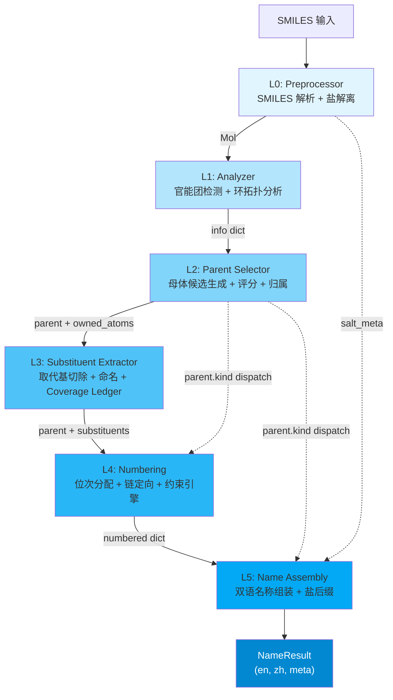

# Architecture Overview / 架构总览

**NamePredict** 是一个基于规则的 SMILES -> IUPAC 双语（EN/ZH）有机化合物命名引擎。它采用 6 层流水线架构，自 SMILES 字符串解析开始，逐层推进至最终的中英文名称输出。

---

## 1. 核心入口：SMILESNNamer

整个引擎的入口点是 `SMILESNNamer` 类（`src/namepredict/namer.py:221-234`）。它是流水线的 orchestrator，对外暴露唯一的公共 API：

```python
namer = SMILESNNamer(cache=CommonNameCache())
result: NameResult = namer.name("CC(=O)O")  # acetic acid / 乙酸
```

`NameResult`（`src/namepredict/types.py:7-14`）是一个统一的输出契约：

| Field | Type | Description |
|-------|------|-------------|
| `en` | `str` | 英文 IUPAC 名称 |
| `zh` | `str` | 中文 IUPAC 名称 |
| `success` | `bool` | 命名是否成功 |
| `source` | `str` | 名称来源（通常为 `"iupac"`） |
| `time_ms` | `float` | 流水线耗时（ms） |
| `meta` | `dict` | L1-L5 各级元数据（parent_chain, kind, depth, etc.） |

---

## 2. 六层流水线



### 2.1 Layer 0 -- Preprocessor（预处理器）

**职责**：SMILES 解析 + 盐解离

- `preprocess(smiles)`（`src/namepredict/layer0/preprocessor.py:7-11`）：将 SMILES 字符串解析为 RDKit `Mol` 对象。如果解析失败返回 `None`，由 namer 层触发 `_fail("parse")`。
- `dissociate_salt(mol)`（`src/namepredict/layer0/salt.py`）：检测碱金属盐（Li<sup>+</sup>, Na<sup>+</sup>, K<sup>+</sup>）和 HCl 盐，分离有机片段与盐组分。返回 `(organic_mol, salt_meta)` 元组。

**关键设计**：salt_meta 注入链 -- L0 产生的 salt 元数据跨越 L1-L4，直接注入 L5 的名称组装阶段，用于生成 "sodium ..." / "...钠" 等盐名称格式。参见 [[concepts/bilingual-naming]]。

> 源文件：`src/namepredict/layer0/preprocessor.py`, `src/namepredict/layer0/salt.py`

### 2.2 Layer 1 -- Analyzer（分析器）

**职责**：官能团检测 + 环系拓扑分析，输出 info dict

`analyze(mol)`（`src/namepredict/layer1/analyzer.py:484-485`）对 Mol 进行全原子扫描，输出一个标准化的 info dict：

```python
info = {
    "mol": mol,                   # RDKit Mol 对象
    "carbon_ids": [...],          # 所有碳原子索引
    "n_carbons": N,               # 碳原子总数
    # --- 官能团布尔标记 ---
    "has_alcohol": bool, "has_acid": bool, "has_ester": bool,
    "has_amide": bool, "has_ketone": bool, "has_aldehyde": bool,
    "has_amine": bool, "has_nitrile": bool, "has_alkene": bool,
    "has_alkyne": bool, ...       # 共 30+ 种官能团
    # --- 官能团实例列表 ---
    "hydroxyls": [...], "carboxyls": [...], "esters": [...],
    "amides": [...], "ketones": [...], "aldehydes": [...], ...
    # --- 环系拓扑 ---
    "has_ring": bool, "ring_count": int,
    "ring_systems": [...],        # 环系分组信息
}
```

信息 dict 是整个流水线的通用数据合约（data contract），从 L1 产出后贯穿 L2-L5 全部层级。L2 基于它做母体决策，L3 基于它做取代基切除，L4/L5 基于它做位次分配和名称组装。

> 源文件：`src/namepredict/layer1/analyzer.py`, `src/namepredict/layer1/*.py`

### 2.3 Layer 2 -- Parent Selector（母体选择器）

**职责**：母体氢化物（parent hydride）候选生成 + 评分 + 归属

这是整个流水线中代码量最大的层（约占 60%，约 85 个文件），位于 `src/namepredict/layer2/`。

**两层调度架构**：

1. **iter_parent_candidates(info)**（`src/namepredict/layer2/parent_selector.py:159`）：生成器，依次调用各 producer 模块生成候选母体。每个 producer 检查 info dict 特征（如是否含苯环、是否开链羧酸），匹配则 yield 一个 parent dict。
2. **select_parent(info)**：始终返回默认母体（由 parent_core 模块生成），作为降级兜底。

**Producer 模块**（按化学领域划分）：

| 领域 | 代表模块 | 覆盖范围 |
|------|---------|---------|
| 开链脂肪族 | `aliph_fg.py`, `polycarboxylic.py`, `alkynoic.py` | 醇/酮/酸/胺/烯/炔 |
| 苯系芳香族 | `ring_parent.py`, `arene_fg_parent.py`, `arene_carbonyl.py` | 苯/苯二酚/苯胺/苯甲酸 |
| 稠环芳香族 | `naphthalene.py`, `anthracene.py`, `quinoline.py` | 萘/蒽/喹啉衍生物 |
| 杂环芳香族 | `indole.py`, `benzofuran.py`, `pyridine.py`, `azole13.py` | 吲哚/苯并呋喃/吡啶/唑 |
| 饱和杂环 | `sat_hetero.py`, `sat_hetero_one.py`, `sat_hetero_carboxylic.py` | 氧杂/氮杂/硫杂环烷 |
| 特殊功能团 | `phosphate.py`, `sulfonate.py`, `guanidine.py`, `urea.py` | 磷酸酯/磺酸/胍/脲 |
| 桥环/螺环 | `bridged_parent.py`, `spiro_parent.py` | 桥环/螺环母体 |
| FG 母体（新） | `arene_fg_parent.py`, `cyclo_poly_fg.py` | NH2/CHO/CN 作为母体后缀 |

**parent dict 结构**：

```python
parent = {
    "kind": str,          # 母体种类：决定 L4/L5 的 dispatch 路径
    "chain": [int, ...],  # 母体链原子索引（定向到 L4）
    "owned_atoms": set,   # 归母体所有的原子（L2->L3 的边界桥梁）
    "double_bonds": [...], # 双键信息
    # FG 特定字段
    "oh_c_idx": int,      # 羟基碳索引
    "cooh_c_idxs": [...], # 羧基碳索引
    "amine_c_idx": int,   # 氨基碳索引
    ...
}
```

**评分系统**：`scoring.py` 对候选做多维度评分（骨架覆盖率、官能团优先级、产业链长度等），确保最优母体被选中。

**CandidateGate**：`candidate_gate.py` 提供类型化的门控合约 -- producer 可以将自己的候选标记为 `SCOPED_REJECT` 或 `GLOBAL_REJECT`，由 `gate_result()` 统一仲裁。

> 源文件：`src/namepredict/layer2/parent_selector.py`, `src/namepredict/layer2/scoring.py`, `src/namepredict/layer2/candidate_gate.py`, `src/namepredict/layer2/parent_core.py`

### 2.4 Layer 3 -- Substituent Extractor（取代基提取器）

**职责**：从 parent 的 owned_atoms 边界出发，切除并命名所有取代基

`extract_substituents(info, parent)`（`src/namepredict/layer3/substituent_extractor.py`）执行取代基切割：

1. **识别取代基附着点**：扫描 parent.owned_atoms 的边界原子，找到所有连接非 owned 原子组的 bond。
2. **逐取代基命名**：对每个取代基调用子命名递归（`substituent_namer`），根据其结构类型生成名称（alkyl/alkoxy/cycloalkyl/aryl/heteroaryl 等）。
3. **递归命名**：当取代基本身含官能团时，启动递归管线 -- 以取代基的 submol 为输入，重新进入 L1-L5，depth+1（最大深度 `max_depth=4`）。

**Coverage Ledger**（`src/namepredict/layer3/coverage.py:12-21`）：

```python
@dataclass(frozen=True)
class CoverageLedger:
    owned_atoms: frozenset[int]       # 母体所有原子
    named_claims: tuple[SubstituentName, ...]  # 已命名的取代基
    gap: frozenset[int]               # 未被任何方覆盖的重原子
    overlap: frozenset[int]           # 被多方重复声明的重原子

    @property
    def complete(self) -> bool:
        return not self.gap and not self.overlap
```

Coverage Ledger 是 Pass1/Pass2 门控的核心机制（见第 4 节）。参见 [[concepts/atom-ownership]]。

> 源文件：`src/namepredict/layer3/substituent_extractor.py`, `src/namepredict/layer3/coverage.py`, `src/namepredict/layer3/substituent_namer.py`

### 2.5 Layer 4 -- Numbering（编号层）

**职责**：位次分配 + 链定向 + omit-locant 决策

`number(parent, substituents)`（`src/namepredict/layer4/numbering.py`）基于 parent["kind"] 调度到不同的编号策略：

| parent kind | 编号模式 | 策略说明 |
|-------------|---------|---------|
| `alkane`, `alcohol`, etc. | mode=`chain` | 开链定位（烷烃/醇/胺/酮） |
| `cycloalkane`, `cycloalcohol` | mode=`cycle` | 环烷烃官能团定向 |
| `benzene`, `phenol`, `aniline` | mode=`benzene` | 苯系最低位次规则 |
| `naphthalene`, `quinoline` | mode=`fused` | 稠环固定编号系统 |
| `heteroarene` | mode=`hetero` | 杂环 O/N/S 优先级编号 |
| `bridged`, `spiro` | mode=`von_baeyer` | 桥环/螺环特殊编号 |

**约束引擎**（`src/namepredict/layer4/locants/engine.py:58`）：`choose_numbering(chain, mode, ...)` 生成所有合法编号候选，按约束优先级排序，选择最优方案。

**omit-locant 标志**：L4 判定哪些位次可以被省略（如末端取代基 locant 为 1 时可省略），设置 omit 标志传递至 L5。

> 源文件：`src/namepredict/layer4/numbering.py`, `src/namepredict/layer4/locants/engine.py`, `src/namepredict/layer4/omit_locants.py`

### 2.6 Layer 5 -- Name Assembly（名称组装）

**职责**：双语名称组装 + 盐后缀拼接

`assemble(numbered_dict)`（`src/namepredict/layer5/assembler.py`）是流水线的最终输出层：

1. **KIND DISPATCH**：根据 parent["kind"] 选择对应的名称模板 -- 烷烃/醇/酸/醛/酮/酰胺/酯/腈/杂环/桥环/螺环等各有独立命名逻辑。
2. **取代基排序**：按字母顺序（EN）或笔画/拼音（ZH）排列前缀取代基。
3. **双语生成**：同时产出英文和中文名称 -- 英文遵循 IUPAC Blue Book，中文遵循中国化学会《有机化学命名原则》。
4. **盐后缀追加**：如果 L0 的 salt_meta 存在，追加 "sodium"/"钠"、"potassium"/"钾"、"hydrochloride"/"盐酸盐" 等。

> 源文件：`src/namepredict/layer5/assembler.py`, `src/namepredict/layer5/stems.py`, `src/namepredict/layer5/benzene_names.py`

---

## 3. Namer 流水线流程

`SMILESNNamer.name(smiles)` 的完整调用路径（`src/namepredict/namer.py`）：

```
name(smiles)
  └─ 缓存命中检查 (namer.py:227-230)
  └─ _pipeline(smiles, t0) (namer.py:203-207)
       └─ preprocess(smiles)                  → Mol | None
       └─ if None: _fail("parse")             → 解析失败快速返回
       └─ _name_mol(mol) (namer.py:184-200)
            └─ dissociate_salt(mol)             → (organic_mol, salt_meta)
            └─ analyze(organic_mol)             → info dict
            └─ _run_candidates(info) (namer.py:145-181)
                 ├─ iter_parent_candidates(info)  (depth=0 only)
                 │    └─ 各 producer yield parent dict
                 ├─ select_parent(info)           (depth>0 或 fallback)
                 │
                 ├─ Pass 1: 完整覆盖
                 │    for each candidate:
                 │      finalize_parent_ownership(parent, mol)
                 │      extract_substituents(info, parent)
                 │      build_coverage_ledger(mol, owned, names)
                 │      if ledger.complete:
                 │        number(parent, subs) → assemble(numbered) → NameResult
                 │
                 └─ Pass 2: fallback（无覆盖门控）
                      for each prepared (parent, subs):
                        number(parent, subs) → assemble(numbered) → NameResult
```

### 3.1 双通门控（Two-Pass Gating）

`_run_candidates()` 的核心策略是**两轮候选评估**：

- **Pass 1**（`namer.py:161-167`）：仅接受 **coverage complete** 的候选。Coverage Ledger 必须 `gap == empty` 且 `overlap == empty`，即每个重原子被有且仅有一方（parent 或 substituent）声明。这保证输出名称的高质量。
- **Pass 2**（`namer.py:169-180`）：当所有 Pass 1 候选失败时，降级到无 coverage gate 模式。复用 Pass 1 的 L3 提取结果，跳过 ledger 检查直接尝试 assembly。`meta.fallback = "no_coverage_gate"` 标记降级。

### 3.2 深度控制与递归

- `depth == 0`（顶层）：`iter_parent_candidates()` 展开全部候选，遍历评估。
- `depth > 0`（递归子命名）：仅调用 `select_parent()` 获取默认母体，**不展开候选**，避免组合爆炸。

递归入口在 L3：当取代基本身含官能团时，`substituent_namer` 构建 submol 重新调用 `_name_mol(submol, depth=depth+1)`。

参见 [[concepts/atom-ownership]] 和标准的 recursive naming 模式。

---

## 4. 跨层设计模式

### 4.1 salt_meta 注入链（L0 -> L5）

L0 的 `dissociate_salt()` 产出的 `salt_meta` 不参与 L1-L4 的计算 -- 它直接被 namer 层保存，在 L5 组装时追加到最终名称中。这是跨层 bypass 模式，避免了中间层对盐信息的无意义传播。

### 4.2 Mol 作为通用跨层货币

RDKit `Mol` 对象是整个流水线中传递分子信息的基础载体。L0 产出 Mol，L1 包装进 info dict，L2/L3/L4 在需要原子级信息时从 info["mol"] 取出。

### 4.3 info dict 数据合约（L1 -> L5）

L1 产出的 info dict 是流水线中最重要的数据合约。它的结构稳定且向后兼容：新增官能团检测只需添加新的 key，不影响已有 producer/assembler。合约的内容定义由 L1 的 `analyze()` 函数集中管理。

参见 [[reference/core-data-contracts]]。

### 4.4 parent["kind"] dispatch（L2 -> L4/L5）

L2 产出的 parent dict 中的 `"kind"` 字段是整个下游的调度键：

- L4 根据 kind 选择编号模式（chain/cycle/benzene/fused/hetero/von_baeyer）。
- L5 根据 kind 选择名称模板（醇/酸/醛/酮/杂环命名格式不同）。

新增母体类型只需：L2 producer 设置新 kind -> L4 注册编号模式 -> L5 注册名称模板。这是典型的策略模式（strategy pattern）。

### 4.5 FG 层级与优先级（L1 -> L2 -> L5）

官能团优先级是 IUPAC 命名的基础规则：

- **L1**：检测所有官能团实例，产出列表 + 布尔标记。
- **L2**：根据官能团优先级选择 principal group（将体现为名称后缀），其余为前缀取代基。
- **L5**：将 principal group 翻译为后缀（-ol/-al/-oic acid 等），前缀取代基按字母序排列。

参见 [[concepts/functional-group-priority]]。

### 4.6 owned_atoms 桥梁（L2 -> L3）

`parent["owned_atoms"]` 定义了 parent-substituent 边界：属于 parent 的原子集合。L3 基于此集合识别边界 bond，切除取代基。这是 atom ownership 模式的核心。

参见 [[concepts/atom-ownership]]。

### 4.7 parent chain 原子索引（L2 -> L4 -> L5）

- **L2**：确定 parent chain 的原子索引序列（`parent["chain"]`）。
- **L4**：对 chain 做定向（reverse/normal），确定编号方向（最低位次规则）。
- **L5**：使用编号后的 chain 位置生成 R/S 绝对构型描述。

### 4.8 Coverage Ledger（L3 -> namer）

L3 的 `build_coverage_ledger()` 产出 `CoverageLedger` 对象，namer 层通过 `.complete` 属性做 Pass1/Pass2 路由。这提供了对命名质量的量化度量 -- 不完全覆盖的名称被视为 "fallback quality"。

### 4.9 递归命名（L3 -> L1）

取代基中可能含有自身的官能团（如 `2-hydroxyethyl`）。L3 的 `substituent_namer` 检测到这种情况时，将取代基 submol 作为新的命名目标，从 L1 `analyze()` 重新进入完整流水线，depth+1。最大递归深度为 4。

### 4.10 双语元数据（L0 -> L5）

双语支持贯穿整个流水线：L0 启动 EN/ZH 配对，L5 同时产出两种语言的名称。所有中间层使用原子索引和结构化数据，语言无关 -- 只有 L5 的 stems 模块包含具体的中英文词素映射。

参见 [[concepts/bilingual-naming]]。

### 4.11 Fail-Fast at Pipeline Boundary

每一层边界都有明确的 fail-fast 检查：

- L0: `preprocess()` 返回 `None` -> `_fail("parse")`（`namer.py:205-206`）
- L1-L5: `analyze()` 始终返回 valid dict（空 Mol 产生空列表，不失败）
- L2-L3: 候选无 owned_atoms 或无 chain -> `_prepare_candidate` 返回 `False`
- L4: `number()` 异常被 `_assemble_candidate` 捕获 -> 返回 `None`
- L5: `assemble()` 返回 `success=False` -> 上层跳过该候选

### 4.12 Omit-Locant Flags（L4 -> L5）

L4 的编号阶段判定哪些位次 locant 可以被省略（如末端基团 locant=1 时，根据 IUPAC P-14.3.4 可省略）。L4 在 numbered dict 中设置 omit 标志，L5 在组装名称时检查并决定是否输出 locant。

---

## 5. 文件组织

```
src/namepredict/
├── namer.py                  # Orchestrator (SMILESNNamer + pipeline)
├── types.py                  # NameResult dataclass
├── cache/                    # 常用名缓存
├── layer0/                   # 预处理器
│   ├── preprocessor.py       # SMILES → Mol
│   └── salt.py               # 盐解离
├── layer1/                   # 分析器
│   ├── analyzer.py           # FG 检测 + info dict
│   ├── a*_*.py               # ~20 FG 子检测模块
│   └── ring_*.py             # 环系拓扑
├── layer2/                   # 母体选择器（~85 文件）
│   ├── parent_selector.py    # 调度中心
│   ├── parent_core.py        # 核心母体逻辑
│   ├── scoring.py            # 候选评分
│   ├── candidate_gate.py     # 类型化门控
│   ├── aliph_fg.py           # 脂肪族 FG 母体
│   ├── ring_parent.py        # 苯系母体
│   ├── arene_fg_parent.py    # 芳环 FG 母体
│   ├── [fused ring].py       # 稠环系列（~15 文件）
│   ├── [heterocycle].py      # 杂环系列（~10 文件）
│   ├── [special FG].py       # 特殊功能团（~12 文件）
│   └── scaffold/             # 骨架构建器
├── layer3/                   # 取代基提取
│   ├── substituent_extractor.py
│   ├── substituent_namer.py  # 递归命名入口
│   ├── coverage.py           # Coverage Ledger
│   ├── alkyl_names.py        # 烷基名称
│   ├── alkoxy_names.py       # 烷氧基名称
│   └── aryl_names.py         # 芳基名称
├── layer4/                   # 编号
│   ├── numbering.py          # 编号调度
│   ├── omit_locants.py       # omit-locant 决策
│   ├── polyene.py            # 多烯定向
│   ├── locants/              # 约束引擎
│   │   ├── engine.py         # choose_numbering
│   │   ├── constraints.py    # 约束定义
│   │   ├── generate.py       # 编号候选生成
│   │   └── plan.py           # NumberingPlan
│   └── [orient modules].py   # 各类定向策略
└── layer5/                   # 名称组装
    ├── assembler.py          # 组装调度
    ├── stems.py              # 词素映射 (EN/ZH)
    └── benzene_names.py      # 苯系名称
```

---

## 6. 相关文档

- [[architecture/layer0-preprocessor]] -- L0 预处理器详解
- [[architecture/layer1-analyzer]] -- L1 分析器详解
- [[architecture/layer2-parent-selector]] -- L2 母体选择器详解
- [[architecture/layer3-substituents]] -- L3 取代基提取详解
- [[architecture/layer4-numbering]] -- L4 编号层详解
- [[architecture/layer5-name-assembly]] -- L5 名称组装详解
- [[concepts/functional-group-priority]] -- 官能团优先级体系
- [[concepts/atom-ownership]] -- 原子归属机制
- [[concepts/bilingual-naming]] -- 中英双语命名策略
- [[reference/core-data-contracts]] -- 核心数据合约参考
