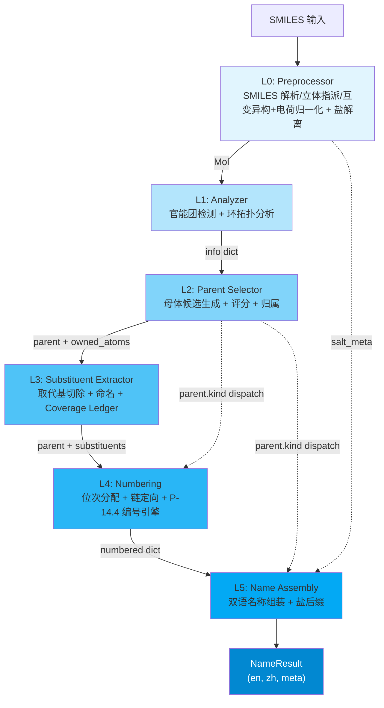

# Architecture Overview / 架构总览

**NamePredict** 是一个基于规则的 SMILES -> IUPAC 双语（EN/ZH）有机化合物命名引擎。它采用 6 层流水线架构，自 SMILES 字符串解析开始，逐层推进至最终的中英文名称输出。

---

## 1. 核心入口：SMILESNNamer

整个引擎的入口点是 `SMILESNNamer` 类（`src/namepredict/namer.py:335`）。它是流水线的 orchestrator，对外暴露唯一的公共 API：

```python
namer = SMILESNNamer(cache=CommonNameCache())
result: NameResult = namer.name("CC(=O)O")  # acetic acid / 乙酸
```

`NameResult`（`src/namepredict/types.py:9-16`）是一个统一的输出契约：

| Field | Type | Description |
|-------|------|-------------|
| `en` | `str` | 英文 IUPAC 名称 |
| `zh` | `str` | 中文 IUPAC 名称 |
| `success` | `bool` | 命名是否成功 |
| `source` | `str` | 名称来源（通常为 `"iupac"`） |
| `time_ms` | `float` | 流水线耗时（ms） |
| `meta` | `dict` | L1-L5 各级元数据（parent_chain, kind, depth, etc.） |

---

## 2. 六层流水线



### 2.1 Layer 0 -- Preprocessor（预处理器）

**职责**：SMILES 解析 + 立体初步指派 + 酰胺烯醇互变异构归一化（两次）+ 酸性质子收敛 + 盐解离（5 个 `.py`，339 行）

- `preprocess(smiles)`（`src/namepredict/layer0/preprocessor.py:11-26`）：`MolFromSmiles(smiles, sanitize=False)` → `SanitizeMol` → `Chem.AssignStereochemistry(force=True, cleanIt=False, flagPossibleStereoCenters=True)` → `normalize_amide_tautomer(mol)` → `normalize_acid_charge(mol)` → `normalize_amide_tautomer(mol)`；任一步异常返回 `None`，由 namer 触发 `_fail("parse")`。**二次互变归一**（`:24`）是必需的：电荷重定位把酰胺 O⁻ 变回中性 `C(OH)=N` 后才出现可归一的酰胺烯醇位，不重跑会留下亚胺醇式名（gold 取酰胺式）。
- `normalize_amide_tautomer(mol)`（`src/namepredict/layer0/tautomer.py:50`）：把分子内非芳香中性 `C(OH)=N` 位点归一化为酮式酰胺 `C(=O)-NH`（只改键级、靠 RDKit 隐氢重算完成质子迁移，不增删重原子）。羟基 O 的候选判据是「与碳单键相连（Degree==1）且总 H 数 ≥1」——隐氢与 `normalize_acid_charge` 写下的显式 H（`[OH]`）都接受；迁移前先把羟基 O 的显式 H 记账清零（`SetNumExplicitHs(0)` + `SetNoImplicit(False)`，`tautomer.py:59-60`），否则新生成的 C=O 会让 O 价态超限、整分子消毒失败回退；羟基 H 数 ≠1 的点位直接放弃（`:58`）。带电 N / O⁻ 阴离子 / 硫类似物位点跳过。
- `normalize_acid_charge(mol)`（`src/namepredict/layer0/charge.py:95`）：同一片段内质子化强酸（供体 `_DONOR_KIND = ("carboxyl", "phospho")`，`:12`）与去质子化弱酸位共存时，逐次把质子搬到弱酸位，使等价负电荷收敛到最强酸；只改 `FormalCharge`/H 记账（RWMol 原子级编辑），含 `*` dummy 或消毒失败时保守跳过。磷酸供体只在「酰胺 O⁻ 受体」场景有产出（与 `preprocessor` 二次互变归一配套）；磺酸供体实测 0 收益，`_KIND_PRIO` 仍留位但未启用。
- `dissociate_salt(mol)`（`src/namepredict/layer0/salt.py:94`）：先用只数片段的 `Chem.GetMolFrags(mol)` 早退（单片段直接返回），再检测碱金属盐（Li<sup>+</sup>, Na<sup>+</sup>, K<sup>+</sup>）和 HCl 盐，分离有机片段与盐组分。返回 `(organic_mol, salt_meta)` 元组。早退省掉 `asMols=True, sanitizeFrags=True` 为每片段重建分子并重新 sanitize 的开销（`_name_mol` 每次递归都会调本函数，绝大多数分子只有 1 个片段）。

**关键设计**：salt_meta 注入链 -- L0 产生的 salt 元数据跨越 L1-L4，直接注入 L5 的名称组装阶段，用于生成 "sodium ..." / "...钠" 等盐名称格式。参见 [[concepts/bilingual-naming]]。立体指派把 RDKit 初步立体信息带进下游，供 L5 E/Z 与 R/S 判定；互变异构归一化保证酰胺烯醇数据与酮式酰胺同判；电荷归一化把输入侧电荷错位的结构（如 chebi-433）交给既有 carboxylate → -oate 能力处理（详见 [[architecture/layer0-preprocessor]]）。

> 源文件：`src/namepredict/layer0/preprocessor.py`, `src/namepredict/layer0/tautomer.py`, `src/namepredict/layer0/charge.py`, `src/namepredict/layer0/salt.py`

### 2.2 Layer 1 -- Analyzer（分析器）

**职责**：官能团检测 + 环系拓扑分析，输出 info dict

`analyze(mol)`（`src/namepredict/layer1/analyzer.py:584`）对 Mol 进行全原子扫描，输出一个标准化 info dict（实测 52 键）：

```python
info = {
    "mol": mol,                   # RDKit Mol 对象
    "carbon_ids": [...],          # 所有碳原子索引
    "n_carbons": N,               # 碳原子总数
    # --- 官能团布尔标记 (20 个 has_*：19 个 FG + has_ring) ---
    "has_alcohol": bool, "has_acid": bool, "has_ester": bool,
    "has_amide": bool, "has_ketone": bool, "has_aldehyde": bool,
    "has_amine": bool, "has_nitrile": bool, "has_alkene": bool,
    "has_alkyne": bool, "has_phosphate": bool, "has_ring": bool, ...
    # --- 官能团实例列表 (22 个) ---
    "hydroxyls": [...], "carboxyls": [...], "esters": [...],
    "amides": [...], "ketones": [...], "aldehydes": [...],
    "acyls": [...], "phosphates": [...], "radicals": [...], ...
    # --- 结构事实列表 (4 个，另加上方 carbon_ids) ---
    "rings": [...], "ring_systems": [...], "double_bonds": [...],
    "triple_bonds": [...],
    # --- 类型化 FG 库存 ---
    "fg_inventory": FunctionalGroupInventory(...),
    # --- 环系拓扑标量 ---
    "has_ring": bool, "n_rings": int, "n_ring_systems": int,
}
```

信息 dict 是整个流水线的通用数据合约（data contract），从 L1 产出后贯穿 L2-L5 全部层级。L2 基于它做母体决策，L3 基于它做取代基切除，L4/L5 基于它做位次分配和名称组装。

> 源文件：`src/namepredict/layer1/analyzer.py`（12 个 `.py`，1,693 行；`FG_SPECS` 19 条 FgSpec / 19 个 `FunctionalGroupClass`，12 个扩展 FG 检测器不存在；`_amine_degree` 排除环内非芳香 N——饱和杂环 N 是环杂原子而非胺官能团）。`_arbitrate_parts(mol, parts)`（`analyzer.py:514`）P-41 仲裁在"组合羰基 FG 退出"基础上：降级伯酰胺 N 回收为 `amines`（amino 前缀，`_demoted_amide_amine`:502）、中性 -COOH 整组进 `demoted_carboxyls` 保留 carboxy 叶（P-61.1.3）、腈进 `demoted_nitriles` 保留 cyano 叶（P-61.1.3）。**锚定酰基头检测**：`_is_acyl_head`:416/`_acyl_entries`:437（`*C(=O)-` 自由价连羰基头，α 环/芳可——苯甲酰/furan-2-carbonyl 进 acyl 通道），`fg_registry.FG_SPECS` 的 `FgSpec("acyl")` 与 radical 同列 p41=1；`acyl_halide` 检测覆盖 F/Cl/Br/I。**磷酸检测器**（`layer1/phosphate.py:88`）：`P(=O)(O)₃` 中心产出 `phosphates` 条目（`p_idx`/`n_oh`/`n_om`/`n_arms`），`FgSpec("phosphate")` 列 p41=9。**酮/醛羰基约束**：环内杂原子（`constants.RING_HETERO` = N/O/S，`_has_ring_hetero_neighbor`:54）使单碳羰基按环酮归类（P-66.1.1）——环内 N 为 N-酰基环胺、环内 O/S 为内酯/硫代内酯，三者同由 `_is_ketone_carbon`:58 判定；环外羰基须带 H 才作醛（`_is_aldehyde_carbon`:183）。支持 R/S 的查询函数 `srs_fgs()`（`fg_registry.py:99`）。**环感知原语**：`ring_systems.sssr_rings(mol)`（`ring_systems.py:18`）是 SSRR 环表的单一入口，内部经 `memo.by_mol("sssr", …)` 在单次命名内只算一次，供 L2/L4 复用（`analyzer._ring_entries`:393 同样走 `memo.by_mol("ring_entries", …)`）。

### 2.3 Layer 2 -- Parent Selector（母体选择器）

**职责**：母体氢化物（parent hydride）选择——按 IUPAC P-44 规则驱动管线选出主链/主环母体

这是整个流水线中逻辑最复杂的层之一（16 个文件，2,571 行），位于 `src/namepredict/layer2/`。骨架识别在根目录 `ring_scaffold.py`（`_TEMPLATES` 为唯一事实来源，70 条模板、27 条带 `standard` 固定编号，派生 ScaffoldSpec/ScaffoldIdentity；可选 `locant_prefix`/`prefix_nh_conditional` 词干前缀与 `fused_prefix` 稠合前缀）。**固定编号与模板 SMILES 同表**：条目内 `standard = (labels, order)` 二元组（`order` 为模板原子按 locant 顺序的下标排列，`labels` 为对应 locant 标签）取代早期分离的 `_STANDARD_ORDERS`/`_STANDARD_LABELS` 两表，`_STANDARD_LABELS`/`_STANDARD_ORDERS` 改为从 `_TEMPLATES` 派生；`_validate_standard_fields()`（导入期）校验 `order` 是 `0..n-1` 的排列且 `labels` 长度等于模板原子数，避免改 SMILES 后编号静默错位。`NumberingPolicy` 只剩 `standard_path`/`materialize_plan`/`anchors`/取代位（`mode` 与 `_NUMBERING_MODE` 已不存在）。kind 正交化（纯烃/未注册稠环用 `alkane`、数量由 `multiplicity` 承载），**稠环拆解在 `fused_system.py`**（P-25.3.2.4 拆解 `fused_tree` 供 L5 稠合名组装），无 `scaffold/` 子包与 `candidate_gate.py`/`arene_carbonyl.py`/`parent_core.py`/`identity.py`/`fg_helpers.py`。链行走（`chain_walk.py`，188 行）全链带 `banned` 禁走集合、`_all_chains_through` 等长最长链全枚举；`parent_skeleton._demoted_acid_carbons` 把 L1 降级羧酸/腈叶碳排除在开链主链外；`parent_ownership` 的 `_acyl_fg_atoms`/`_phosphate_fg_atoms` 分别归属酰基与磷酸中心（P + 4 O）。

**保留母体模板的三条通道**（`ring_scaffold.py`）：

- **保留 mancude 母体**（`_TEMPLATES`，70 条）：含 `indene`、`chrysene`、`pyran`（排在 `oxane` 之前，否则 `pyran-2-one` 会静默丢环内 C=C 落成 `oxan-2-one`）、`dioxine`（1,4-二噁英，`locant_prefix="1,4-"`、稠合前缀 `[1,4]dioxino`、带 `standard`）、`cinnoline`、`chromene`/`isochromene`、`xanthene`/`thioxanthene`（`naming_class="xanthene"`）、`cyclopenta[a]phenanthrene`（`naming_class="steroid"`，传统甾体编号 1–17 全数字）。`anthracene` 已登记 `standard = (ANTHRACENE_LABELS, order)`（`ring_scaffold.py:68`/`:75`）：中环 9/10 取**全数字位**、桥头为 4a/10a/8a/9a，未登记固定编号的稠环会退到 P-25.3.3 通用外周编号、位号形态错成 1,2,3,4,4a,5,5a…。`tetrazole` 不再把 `1H-` 写进词干，改由 `locant_prefix="1H-"` + `prefix_nh_conditional=True` 条件注入（N1 被取代时环上无 NH，不写 `1H-`）。异噁唑/噁唑/噻唑/三唑/三嗪的 `fused_prefix` 自带方括号（`[1,3]oxazolo`、`[1,2]oxazolo`、`[1,2,4]triazolo`、`[1,3,5]triazino`）：P-25.3.1.3 要求组分中表征结构的位次（杂原子位置）在稠合名中置于方括号内，P-25.3.2.1.2 又强制这三个单杂环在稠合名中改用 Hantzsch-Widman 名，通用「去尾 e 加 o」会漏掉方括号。`kind_registry._embeds_locant_prefix`:84 另拦住「词干把 locant 前缀嵌在词中」的情形（`4,5-dihydro-1,3-thiazole` 的 `1,3-`）：此时前缀不再前移/剥离，否则会重复位次。饱和保留名（pyrrolidine/piperidine/morpholine/piperazine/oxolane）`fused` 标 `False`——它们不作稠合组分（`match_retained(mancude_only=True)` 跳过）。
- **单环烃附加组分**（P-25.3.2.2.1，`_FUSION_CARBOCYCLES`，6 条）：环丙烷…环辛烷 → `cyclopropa`/`环丙并` 等前缀。**不入 `_TEMPLATES`**——入表会让单环骨架解析成保留名、破坏 P-31 单环通用路径；它们也不是母体组分。查询走 SMARTS 环骨架（`_Q_CYCLO`）。`fusion_carbocycle_prefix`/`omits_fusion_numbers`/`match_fusion_carbocycle`/`match_fusion_component` 为对外接口，`retained_fusion_prefix` 未命中注册表时回落到 `fusion_carbocycle_prefix`。
- **指示氢与 mancude 位**：`mancude_atoms(scaffold_id, match)` 给出保留模板 Kekulé 双键位映射到分子后的原子集（该集合内部 C=C 由母体氢化物名隐含，P-31.1.2，不得再写 `-ene`/`-yne`）；`extra_indicated_atoms(mol, scaffold_id, match)` 给出母体名未隐含、而分子中该芳香杂环位带 H 的原子（P-58.2.1 须显式标指示氢，如 1H-喹啉-4-酮的 N1）——仅对稠合母体（≥2 环）生效。`hydrogenated_atoms` 据此重写：环内碳带环外多重键（`=O`/`=N` 后缀位）记入 `suffix` 集不占 hydro 位次；环杂原子失去双键后新增的 H 由指示氢承载，仅在剔除后计数合法（偶数倍增，`layer4/hydrogenation.HYDRO_MULT_N`）时剔除；计数仍为奇数且存在 `suffix` 时，剔除一个与后缀位相邻的加氢位。无 H 可加的位置（季碳、4,4-二甲基型）不占 hydro 位次。

**主路径（P-44 规则驱动管线 + P-45.2 打平）**：

`parent_selector.select_parent`（`parent_selector.py:44`）是母体选定入口：经
`principal_parent.rule_driven_parent_candidates`（`principal_parent.py:45`，P-44 规则管线）产出候选，
最后 `_reorder_p45_2`（`parent_selector.py:18`）按 P-45.2 重排并以 `_finalize_ranked`（`:31`）固化。
管线分四步：

1. **主官能团选择**（`principal.py` `select_principal_group:77`）：按 `PRINCIPAL_REGISTRY`（`principal.py:48`，P-41）优先级选主官能团
2. **骨架枚举 + 筛选**（`parent_skeleton.py`）：枚举开链 + 环系统骨架，依次施加
   P-44.1.2（环>链 + 最高杂原子）/ P-44.2（环系统优先级）/ P-44.3（链长）/ P-44.4（不饱和度）。
   P-44.4 不饱和度键统计现把**芳香键按 Kekulé 双键当量计入**（`p44_4_unsaturation_key`：
   每 2 条芳香键 ≈ 1 个双键，苯=3），使不饱和芳香环优先于同环数饱和环（P-44.4.1.1 标准 a）
3. **typed 表达**（`principal_expression.py`）：`express_chain/ring_principal` 产出带
   `PrincipalExpressionFacts` 与 `ScaffoldIdentity` 的 parent dict。**kind 正交化**：
   ACID/ALCOHOL/AMINE/KETONE 任意主基团数恒返回基团名（数量由 `multiplicity` 承载），
   `dione` 不产生；环上外环 -CHO 放行为 kind `aldehyde`（多醛 → -di/carbaldehyde，
   P-66.6.1.1.3，`_ring_kind`）；**锚定酰基残基与环外酰基头放行为 kind `acyl`**
   （`_chain_kind` ACYL 分支，P-65.1.7.2；`_ring_fact_fields` 单附着 ACYL/ALDEHYDE 设
   `ring_attach_idx`）；环外酰卤（苯甲酰卤）经 `express_ring_principal` 补 `hal_z`/`hal_idx`；
   苯保留名决策由 `layer5/chain_engine` variant 提供；杂原子锚点单核母体自由基的
   母体词干按氧化态定（`_PHOSPHORUS_STEM_BY_OXO`:356——P 上 1 个 =O → `phosphoryl`/磷酰、
   0 个 → `phosphanyl`/磷烷基，非 0/1 个明确返回 None 失败；`_MONONUCLEAR_STEM`:343 的
   N/O/S/P 项同理承载 `azane`/`oxidane`/`sulfane` 等 free 名）；
   无主官能团的纯烃走 `express_hydrocarbon_principal`（alkane/alkene/alkyne/polyene/保留 scaffold，
   非芳香环 kind 恒为 `alkane`）
4. **P-45.2 母体打平**（`parent_selector.py`）：P-44 评分降序后按 **P-45.2.1 前缀取代基团数最多**稳定重排
   （`_p45_2_prefix_count` = L3 `iter_claims` 在 owned_atoms 边界外的 claim 个数）——面向芳基臂仲胺等
   多臂候选选母体；`select_parent_tied`（`:55`）额外交出并列最大组，由 namer 逐候选跑 L3–L5 后按
   **P-45.2.2 前缀位次集合**裁决（见 §3.1.1）；typed 环表达不再按 multiplicity 截断
   （`RingExpressionPolicy` 已移除 `max_multiplicity` 上限）。

**parent dict 结构**：

```python
parent = {
    "kind": str,          # 母体种类：决定 L4/L5 的 dispatch 路径
    "chain": [int, ...],  # 母体链原子索引（定向到 L4）
    "owned_atoms": set,   # 归母体所有的原子（L2->L3 的边界桥梁）
    "principal_expression_facts": ...,  # typed 主基团表达（L4/L5 消费）
    "principal_group_count": int,       # 主官能团实例数
    "scaffold_id": str, "scaffold_identity": ...,  # 骨架身份（编号策略）
    # FG 特定字段
    "oh_c_idx": int,      # 羟基碳索引
    "cooh_c_idxs": [...], # 羧基碳索引
    "amine_c_idx": int,   # 氨基碳索引
    "p_idx": int,         # 磷酸中心 P 索引（n_oh/n_om/n_arms 计臂形态）
    ...
}
```

**评分与门控**：`scoring.py` 对候选做 P-44 评分 tuple（`_p44_1_1` 来自 `parent_candidate.principal_key`
的 principal 契约 + 9 维 `_later_score`）。无 `candidate_gate.py`——多元羧酸作用域冲突由
评分 + 契约结构性解决。无 `fg_helpers.py` 的 `_no_fgs` 互斥谓词，互斥由
`select_principal_group` 的单选择结构性实现。

> 源文件：`src/namepredict/layer2/principal_parent.py`, `src/namepredict/layer2/parent_skeleton.py`, `src/namepredict/layer2/principal_expression.py`, `src/namepredict/layer2/principal.py`, `src/namepredict/layer2/parent_selector.py`, `src/namepredict/layer2/scoring.py`, `src/namepredict/layer2/parent_candidate.py`, `src/namepredict/layer2/chain_walk.py`

### 2.4 Layer 3 -- Substituent Extractor（取代基提取器）

**职责**：从 parent 的 owned_atoms 边界出发，切除并命名所有取代基

`extract_substituents(info, parent)`（`src/namepredict/layer3/substituent_extractor.py`）执行取代基切割（三段流水线：核心 FG + anchored 查表烷基 + claim 补全）：

1. **核心 FG 提取**：卤素 / OH / NH2 / 氧代（按母体类型过滤主官能团）。
2. **锚定查表烷基**：`tools/anchored_table` canonical-SMILES 查表认领侧链——`_REGISTRY` 69 条 / `_ANCHOR_INDEX` 71 键（含酰胺/脲/磺酰胺残基 `carbamoyl`/`sulfamoyl`、P 直连母体 `phosphono`/`phosphonato`、铵型阳离子 `azaniumyl` 系列）；`resolve_name` 仅 PIN 级取保留名（与系统名有别的实为 `anilino` ← `phenylamino`），GENERAL/NOT_RECOMMENDED 一律系统名（`vinyl`→`ethenyl`、`isobutyl`→`2-methylpropyl`）。
3. **claim 补全 + 递归命名**：`extract_claimed_sides` 遍历 `iter_claims`（claimable_block），对未覆盖 claim 调 `SubstituentNamer`；取代基本身含官能团时启动递归管线 -- 以 submol 为输入重新进入 L1-L5，depth+1（最大深度 `max_depth=4`）。递归/`*` 锚定取代基带 `root_ctx`（namer 注入），其 R/S 回完整根分子重算（异头碳 CIP 随配基被 `*` 顶替会翻转）；切子分子用 `_carry_alkene_stereo` 把 C=C E/Z 标签照搬进 submol，复合词干是否加括号由 namer meta `parent_substituent_count` 决定（P-16.5.1.1）。母体 kind ∈ `{"ester","phosphate"}`（`claim_extract.py:73` 的 `_ESTER_O_SIDE_KINDS`；另有 `o_idx` 字段识别苯甲酸酯型 O-side）时，母体 O 上的侧链标 `o_side` 交 L5 整名消费（磷酸酯 O–R 臂整体递归命名，P-67.1.3）；O/S 桥前缀（`…oxy`/`…sulfanyl`）前端为简单取代基时免括号（`as_substituent._obridge_front_simple`，P-63.2.1/.2.2）。质子化伯胺（NH3+）的取代基名取保留式 `azaniumyl`/`铵基`（`amino_side._one_amino`:15，P-62.4.1；氨基酸类一律用该式而非 amino）。括号判定多一道 meta 开关 `bridge_self_enclosed`（`as_substituent.py:93`）——S 桥复合前端名已自含围栏（`(4-甲氧基苯基)磺酰基`）时不再整体加括号。

**Coverage Ledger**（`src/namepredict/layer3/coverage.py:13`）：

```python
@dataclass(frozen=True)
class CoverageLedger:
    owned_atoms: frozenset[int]       # 母体所有原子
    named_claims: tuple[SubstituentName, ...]  # 已命名的取代基
    gap: frozenset[int]               # 未被任何方覆盖的重原子
    overlap: frozenset[int]           # 被多方重复声明的重原子

    @property
    def complete(self) -> bool:
        return not self.gap and not self.overlap
```

Coverage Ledger 是 Pass1/Pass2 门控的核心机制（见第 4 节）。参见 [[concepts/atom-ownership]]。

> 源文件：`src/namepredict/layer3/substituent_extractor.py`, `src/namepredict/layer3/coverage.py`, `src/namepredict/layer3/substituent_namer.py`（9 个 `.py`，1,023 行）

### 2.5 Layer 4 -- Numbering（编号层）

**职责**：位次分配 + 链定向 + omit-locant 决策

layer4 是**编号方向总调度 + 稠环编号引擎**（14 个 `.py`，1,873 行）。`number(parent, substituents)`（`src/namepredict/layer4/numbering.py`）的核心是 `numbering_engine.orient_numbering`（`numbering_engine.py:347`，三层分派）：

1. **`_fixed_numbering`**（`:234`）— registered 保留骨架（模板有 `standard`）按固定编号（`scaffold_match` + `_STANDARD_ORDERS` → `standard_chain`）；对称 scaffold 的镜像取向由**三层位次键**决定：(c) 后缀层（principal 特征基团与 `radical_c_idx` 同属 (c)）→ (f) 取代基前缀层（位次集合升序整体比较）→ (g) 位次集合仍相同时按引用序（字母序）把最低位次给最先引用者。比较按 `ring_scaffold._STANDARD_LABELS` 的**标签**而非链位置（蒽的 10 位在链上先于 5 位，用位置号会把 10 位判成更低）；三层混为一集时层级丢失，(OH=2,Br=7) 与 (OH=7,Br=2) 会平局后随枚举顺序漂移
2. **`_fused_numbering`**（`:281`）— 全芳香多环走几何 + 外围骨架编号（`fused_orientation` 优选取向 + `fused_numbering` 外边界/字母位 + `ring_geometry` 平面原语 + `locant_key` 混合 locant 排序）；`_TRADITIONAL_NUMBERING_IDS`（`:8`：anthracene/phenanthrene/acridine/carbazole/purine/xanthene/thioxanthene/cyclopenta[a]phenanthrene）按传统编号不走此路。优选取向按 **IUPAC 环计数法**计四象限/上方针环数（P-25.3.2.3.3），并以 **P-25.3.2.3.2 变形环模板**放行水平行中间奇数环（6-5-6 等）；对称等价杂环碱环（嘧啶双 N）通过 `float_hetero` 放行镜像，由稠合原子位次最小化决定，使稠合描述符字母与规范一致。**rings 只取稠合系统自身环**（`sssr_indices` 子集，不含取代基上的无关环）并按 `idx_map` 重映射 `fusion_edges`。收窄层序按 P-14.4：环外附着原子（P-29 自由价 → (c) principal）→ **指示氢层 `INDICATED_H`**（`fused_numbering.py:10`，P-25.3.3.1.2(f)，插在 (c) 之后、(f) 之前）→ (f) 取代基前缀，镜像平局再以 `alpha_subs`（P-14.5 字母序）裁定，最后以 **P-14.4(j) CIP 破局**（`_rs_locant_key`，R/M/r 取较低位次）——互为镜像的两个走向位次集合完全相同，只有 CIP 能区分
3. **普用 P-14.4 候选枚举** — 链正反（2 个）/ 环每原子 1 号位 × 双向（2n 个）→ 固定起点 → P-14.4(c)(e)(f) 逐条收窄（principal FG 最低位次集 → **seam 感知多重键** → 取代基）→ stem-alpha 平局（P-14.5）→ **P-14.4(j) CIP 立体平局**（R/M/r 位次优先于 S/P/s）。入口先分岔：**杂环走 `_narrow_hetero_ring`**（`:198`，P-22.2.2.1.3：全杂原子最低位次→逐元素序→唑 NH=1，先行于 principal），碳环/链走 `_fixed_start` 固定 locant 1（`_FIXED_START_KEYS`:184，含 `acyl_c_idx`；固定原子无法置 1 时并入 principal 竞争最低位次）。`_bond_locants` 按每条多重键沿编号方向占据的边位置记位（闭合 seam 边记 n），把整条不饱和键压到最低连续位次。CIP 标签由 `_assign_cip_uncached`（`:99`）算，经 `memo.by_mol("cip", …)`（`:96`）在单次命名内只算一次。`fused_component_numbering`（`:408`）把稠合点集合作为 `sub_layers` 传入，使多环无固定编号组分的镜像对（苯并咪唑 N1/N3 互换）逐层最小化位次（P-25.3.1.3）
4. **指示氢与加氢描述归一** — `indicated_hydrogen.py`（P-58.2.1：环系中仅以单键连接相邻环原子的饱和环位标 `H`）产出 `parent.indicated_h`，`numbering.py` 写入 numbered dict，供 L5 `_ensure_fused_stem` 拼 `1H-`/`2H-` 前缀。`numbering.number()`（`numbering.py:70`）在出 hydro 前缀前做三次归一：**模板修正**——保留模板只写一个 Kekulé 式会漏计稠合/角位饱和碳，分子自推饱和位是合法倍增数（`HYDRO_MULT_N`）且为模板集真超集时改用后者（`:88`）；**最低位次转指示氢** `_lowest_extra_to_indicated`（`:23`）——加氢位中最低位次改用指示氢表达，与指示氢位中位次最高者互换（只改名次归属、不改两边计数）；**奇数补救** `_odd_hydro_to_indicated`（`:51`）——饱和环上出现无氢饱和位（偕二甲基季碳等）使加氢位成奇数时，hydro 只取偶数个、余下最低位次那个由指示氢承载（`4,4,7-三甲基-2,3-二氢-1H-萘` 而非退成纯芳香名）。未注册稠环的加氢位回退 `_fallback_hydro_atoms`（`:11`）取环内非芳香饱和碳位（混入杂原子位时改取碳子集）。分子完全氢化骨架（`memo.by_mol("hydrogenated", _hydrogenated, mol)`，`numbering_engine.py:228`）在本层与 L2 之间共用同一份记忆。

并列候选的裁决键由 `candidate_keys.py` 从 numbered dict 计算（`suffix_locant_set` P-44.1.1 / `prefix_locant_set` P-45.2.2），由 namer `_best_hit` 消费（见 §3.1.1）。

FG 位次由 `locant_calc.py` 的 `_LOCANT_FNS`/`_FG_LOCANTS` 数据表产出（稀疏 `fg_locants`，kind 含 acid/ester/amide/nitrile/aldehyde/**acyl**/ketone/oh/amine/sh/radical；酸/醛/环外酰基记录为环外 -carboxylic acid/-carbaldehyde/-carbonyl 系统名提供附着位次，多羧酸/多醛取全部附着原子），omit 标志由 `omit_locants.py` 基于 `scaffold_id` 判定。无 `locants/` 子包（`engine.py`/`constraints.py`/`generate.py`/`plan.py`/`adapt.py`）、`orienters.py`、`polyene.py`，无 `NumberingPlan` 概念。

**omit-locant 标志**：L4 判定哪些位次可以被省略（如末端取代基 locant 为 1 时可省略），设置 omit 标志传递至 L5。烯/炔位次的省略由 `omit_locants.omit_unsat`（`omit_locants.py:54`）按**键级分流**：`triple=True`（炔）时阈值为 C≤3（`ethyne`/`propyne` 位次 1 隐含省略），否则 C≤2（`ethene`）；开链烃骨架（kind 为 `alkane`）**不因自身双键而保留位次**，交回短链规则（P-14.3.4.2(d)）。`locant_calc._unsat_locants`（`locant_calc.py:162`）据此分别产出 `omit_ene_locant` 与 `omit_yne_locant`（后者以 `triple=True` 调用）。

> 源文件：`src/namepredict/layer4/numbering.py`, `src/namepredict/layer4/numbering_engine.py`, `src/namepredict/layer4/candidate_keys.py`, `src/namepredict/layer4/indicated_hydrogen.py`, `src/namepredict/layer4/fused_orientation.py`, `src/namepredict/layer4/fused_numbering.py`, `src/namepredict/layer4/ring_geometry.py`, `src/namepredict/layer4/locant_key.py`, `src/namepredict/layer4/locant_calc.py`, `src/namepredict/layer4/omit_locants.py`

### 2.6 Layer 5 -- Name Assembly（名称组装）

**职责**：双语名称组装 + 盐后缀拼接

`assemble(numbered_dict)`（`src/namepredict/layer5/assembler.py:513`）是流水线的最终输出层（8 个 `.py`，2,165 行）：

1. **母体命名**：`_names_for`（`assembler.py:356`）先短路 `kind == "phosphate"` → `phosphate.py` 的 `phosphate_names`（P 中心无碳词干，不进 `_KIND_TABLE`），否则查 `chain_engine._KIND_TABLE`（`chain_engine.py:508`，13 个 `_Chain` spec：12 链式 FG kind 含 `acyl`、逐卤素 `acyl_halide` + `radical`，词干 + 烯/炔段 + 位次 + variant 数量后缀；开链自由基自由价位次按 P-29.2 方法 1 省略，`_radical_terminal_yl_elide`，`chain_engine.py:403`：`prop-1-en-1-yl`→`prop-1-enyl`、C≤2 整体省成 `ethynyl`），特殊 case 走 worker（环外主基统一由 `_exocyclic_ring_names`（`assembler.py:86`，后缀表 `_EXO_SUF` 驱动，覆盖 acid/aldehyde/ester/amide/nitrile/acyl）、`_mononuclear_radical_names`（`:282`，含杂原子锚点：P 酰基前缀 `_phosphoryl_sub_names`:179、N-酰基 amido 保留式、N-芳基-N-烷基取 `anilino`、N-氨基与磺酰融合为 `sulfamoyl`）、`_parent_stem_names`（`:394`））；`acyl_halide` 按 `parent.hal_z` 选 F/Cl/Br/I 对应 spec；`_ring_stem` 返回完整词干不再剥尾 `e`（省略下沉到 `chain_engine._elide_parent_e`，`chain_engine.py:346`，P-60.2(a)，-diol/-diamine 保留 e）；单环环烷/环烯的环外系统名（acid/ester/amide/nitrile/aldehyde/acyl）共走 `_ring_carbocycle_stem`（`assembler.py:43`）+ `_ring_extra_prefix_located`（`:65`，环烯或另带前缀取代时后缀 locant 显式）；未注册稠环经 `_ensure_fused_stem`（`assembler.py:336`）调 `fused_namer.fused_parent_names`（`fused_namer.py:134`）组装稠合 base 名（母体/附加组分共用同一稠合共享原子集编号），并前置 L4 算好的 `parent.indicated_h` 指示氢前缀（P-58.2.1）；稠合名命中 `_RETAINED_FUSION_ALIASES`（`fused_namer.py:9`，7 条，P-25.1.1：`benzo[c]pyrrole`→`isoindole`、`benzo[b]benzofuran`→`dibenzofuran`、`benzo[a]indene`→`fluorene`、`benzo[b]anthracene`→`tetracene` 等，仅当位次形态与稠合名完全相同时整名替换）；组件词干/保留前缀的事实来源是 L2 `ring_scaffold._TEMPLATES` 的 `fused`/`fused_stem`/`fused_prefix` 字段，由 L2 打包进 `FusedNode` 后 L5 只读，`fused_namer.py` 不再留本地副本表。无 kind 收敛层（`typed_kinds.py`）——L2 直接产出 FG 类别 kind。stems 词干扩到 C1–C99（复用 constants `en_num_term`）。词干拼装后 `_ring_cation_suffix`（`assembler.py:474`）处理阳离子：净正电荷分子的环内 N+/O+ 把母体名缀成 `-{位次}-ium`（P-62.4.1，`chromene`→`chromenylium`），在 `_with_hydro_prefix` 之后、`join_kind_name` 之前调用。
2. **取代基排序**：按字母序（EN）排列前缀取代基，重复基团 di/tri/tetra 合并（复合组分用 bis/tris/tetrakis，`_complex_mult_en`/`_complex_mult_zh`，`assembler_prefixes.py:161`/`:166`）；N- 类取代基（`constants.N_PREFIX_KINDS`：n_alkyl/n_phenyl/n_benzyl/n_block）走 `N-` 前缀（N/C 混合位次如 N,N,2-trimethyl 由 `_locant_str`:18 渲染为 `N`）；**多氮消歧**：同碳上不同 N 各挂取代基时按引用序最前的取代基所在 N 取未加撇的 `N`、其余依次 `N'`（`_n_prime_map`，`assembler_prefixes.py:242`，P-14.5——漏撇号会把结构写成另一个分子）；单碳母链多取代基按 P-16.5.1.3.1 括号式（第二词干起各自括注、无连字符），单碳母体 N-型与 C-型取代基并存时位次不省略（`_omit_sub_locants`，`assembler_prefixes.py:43`，P-62.2.4.1.2）；C2 单取代的 2- 位省略须排除复合取代基（自带位次如 `1H-indol-5-yl` 或显式括号，`:60`）。**桥前缀围栏**分三类统一裁决：带立体描述符的词干须整体括起（`_STEREO_LEAD_RE`:85，`(1Z)-`/`(2R,4R)-`，中英同步 `5-[(1Z)-丙-1-烯基]苯`）；O/S/N 桥平铺式（`_BRIDGE_SUFFIX_EN`:87 = oxy/sulfanyl/amino）把括号闭在前端 `-yl` 后、桥后缀留在括号外，中文侧 `_split_bridge_suffix_zh`:171 与英文侧同形（P-63.2.2.1）；磺酰/亚磺酰桥前端为直链 `-yl` 时英文侧平铺不加围栏（`_sbridge_flat_stem`:130，`propan-2-ylsulfonyl`）；前端是否为自带围栏的复合取代基由 `_front_needs_enclosure`:97 判定（带立体描述符的自由价碳、环型内嵌位次 `…oxan-2-yl` 须括；酰基前端走 `…oyloxy` 融合、苄基型前端不拆）。
3. **双语生成**：同时产出英文和中文名称 -- 英文遵循 IUPAC Blue Book，中文遵循中国化学会《有机化学命名原则》。
4. **立体化学**：`stereo.py` 承担 E/Z 与 CIP R/S 前缀——多烯/烯基自由基现也拼 (…)- E/Z 前缀；R/S 覆盖链 FG kind（`srs_fgs()`）与环/稠合骨架母体（scaffold_id，L4 整环 walk 上手性中心）。位次经 `_chain_locant`（`stereo.py:129`）换 `numbering_scaffold.labels` 的整体编号标签——稠环桥头手性碳由此得 `3a`/`6a` 而非链序号，故支持 `(3aR,6aR)-` 这类带字母的立体描述符（`_parse_token`/`_part_key` 按 `locant_key` 排序）。CIP 指派统一走 `layer4.numbering_engine.assign_cip`（`numbering_engine.py:90`，隐式 H 手性碳先补显式 H），由 `memo.by_mol("cip", …)` 在单次命名内只算一次。不饱和链的位次省略分两路（`_Chain.ene_loc_omit`/`yne_loc_omit`，`chain_engine.py:316`/`:317`）：开链烃 `ethene`/`ethyne`/`propyne` 位次 1 隐含省略（P-14.3.4.2(d)），而 FG 后缀（`prop-2-ynoic acid`）恒保留炔位次；环单烯双键起点与 FG/自由价同为 1 时融合省略（`cyclohexen-1-yl` 而非 `cyclohex-1-en-1-yl`，P-31.1.2）。
5. **盐后缀追加**：如果 L0 的 salt_meta 存在，追加 "sodium"/"钠"、"potassium"/"钾"、"hydrochloride"/"盐酸盐" 等；`kind=phosphate` 的盐名由 L5 phosphate worker 自行组装，此步跳过（`_apply_salt_suffix` 对 `parent_kind=="phosphate"` 直接返回，`namer.py:242`）。

> 源文件：`src/namepredict/layer5/assembler.py`, `src/namepredict/layer5/assembler_prefixes.py`, `src/namepredict/layer5/chain_engine.py`, `src/namepredict/layer5/phosphate.py`, `src/namepredict/layer5/fused_namer.py`, `src/namepredict/layer5/stems.py`, `src/namepredict/layer5/stereo.py`

---

## 3. Namer 流水线流程

`SMILESNNamer.name(smiles)` 的完整调用路径（`src/namepredict/namer.py`）：

```
name(smiles)                                # namer.py:342（缓存命中直接返回整分子缓存结果）
  └─ memo.begin_run()                       # 清空本次命名的中间结果记忆（memo 不跨分子共享）
  └─ _name_uncached → _pipeline(smiles, t0)  # namer.py:329 / :288；回传 (NameResult, mol)
       └─ preprocess(smiles)                → Mol | None（解析/消毒 + 立体指派 + 酰胺烯醇归一化 + 酸性质子收敛 + 二次酰胺烯醇归一化）
       └─ if None: _fail("parse")           → 解析失败快速返回
       └─ anchored_whole_mol(mol)           → 整分子命中锚定查表（带 * 输入本身即锚定键）直接返回保留名
       └─ _name_mol(mol, depth=0)           # namer.py:258
            └─ dissociate_salt(mol)         → (organic_mol, salt_meta)（单片段早退）
            └─ 顶层 root_ctx：root_mol=organic、to_root=恒等；片段命名用本次运行的私有缓存
            └─ analyze(organic)             → info dict（namer 注入 info["root_ctx"] 与 info["salt"]）
            └─ _run_candidates(info)        # namer.py:231
                 ├─ _candidate_phases → select_parent_tied(info)  # P-45.2.1 并列最优组（≤ _MAX_TIED_CANDIDATES=4）
                 ├─ _prepare_candidate: finalize_parent_ownership → extract_substituents(depth=…) → coverage ledger
                 └─ _try_phase: _complete_hit（coverage 完整）→ 否则 _partial_hit 兜底
            └─ _apply_salt_suffix           → 盐后缀（"sodium"/"…钠"、"hydrochloride"/"…盐酸盐"；kind=phosphate 由 L5 worker 自行组装，跳过）
  └─ 成功时用回传的 mol 写 canonical 缓存  # 免去 _canonical_result 前再 preprocess 一次
```

> `_pipeline` 与 `_name_uncached` 现返回 `(NameResult, mol)` 二元组（`namer.py:288`/`:329`）：`mol` 在解析后即被返回，`name()` 出口直接用它做 `_canonical_result`（`:312`），省掉一次 `preprocess`。解析失败时 `mol` 为 `None`。

### 3.1 覆盖门控两阶段（complete → fallback）

`_run_candidates`（`namer.py:231`）评估 `select_parent_tied` 返回的 P-45.2.1 并列最优候选组（上限 `_MAX_TIED_CANDIDATES = 4`，`:114`；`_candidate_phases`:225 组组产出），由 `_try_phase`（`namer.py:217`）两阶段收束：

- **完整命中**（`_complete_hit`，`:193`）：候选的 `CoverageLedger.complete`（gap 空且 overlap 空——每个重原子被有且仅有一方 parent/substituent 声明）且可组装，直接返回；`meta.coverage_complete=True`。
- **兜底命中**（`_partial_hit`，`:206`）：完整候选不可组装时，放宽覆盖门控取可组装候选，`meta.fallback="no_coverage_gate"`、`attempts` 记录尝试次数。
- 全失败 → `_fail("no_assemblable_candidate", attempts=…)`。

### 3.1.1 并列候选裁决（P-44.1.1 → P-45.2.2）

每个候选先跑完 L4+L5，由 `_assemble_candidate`（`namer.py:128`）在 `meta` 写入两个位次键：`p44_1_1_key = suffix_locant_set(numbered)`（P-44.1.1 后缀位次集合）与 `p45_2_2_key = prefix_locant_set(numbered)`（P-45.2.2 前缀位次集合），二者由 `layer4/candidate_keys.py` 计算。`_best_hit`（`:184`）据此裁决：**后缀位次集合并列**（各候选相同）时按前缀位次集合取字典序最小者，否则保持候选顺序（首个即 P-44.1.1 已决的首选）。

### 3.2 深度、缓存与递归立体（root_ctx）

- `depth == 0`（顶层）：`_name_mol` 在提供了外部缓存时改用本次运行的私有 `CommonNameCache(max_entries=2000)`——`*` 锚定片段名只在本分子运行内共享（跨根会带入他宿主的异头立体，须禁用）；整分子结果在 `name()` 出口经 `_canonical_result`（`namer.py:312`）规范化 `meta.parent_chain` 后写回调用方缓存。
- `depth > 0`（递归子命名）：L3 构建 `*` 锚定/切分子 submol 后再次调 `_name_mol(..., root_ctx=(root_mol, 块原子→根索引映射))`——递归取代基/糖苷异头碳的 R/S 回完整根分子用 `layer5.stereo._cip_on_chain` 重算（`as_substituent._fix_rs_with_real`），fresh 与 cache 命中都按当前根校正一次；`_ok_result`（`namer.py:83`）在 meta 注入 `parent_substituent_count` 供 L3 判词干是否复合；`_chain_meta`（`namer.py:40`）另注入 `bridge_self_enclosed`（`:44`，L5 判定桥名已自含围栏时回传给 L3，见 §2.4）。
- **中间结果记忆**：`memo`（`src/namepredict/tools/memo.py`）按分子对象/自定义键记忆同一次顶层命名内不变的确定性中间量（SSSR 环表、环条目、氢化骨架、CIP 标签、锚定键），只消除重复计算、不改变任何返回值。每次 `name()` 开头由 `memo.begin_run()` 清空，**不跨分子共享**（跨分子会带入宿主相关的立体上下文，同私有缓存的理由）；存储按线程隔离（`threading.local`），并发请求不互相清空。键用 `id(mol)` 并把 mol 存进记忆值保活，本次命名内对象不回收、id 不复用。

递归入口在 L3：当取代基本身含官能团时，`substituent_namer` 构建 submol 重新调用 `_name_mol(submol, depth=depth+1)`（最大深度 4）。

参见 [[concepts/atom-ownership]] 和标准的 recursive naming 模式。

---

## 4. 跨层设计模式

### 4.1 salt_meta 注入链（L0 -> L5）

L0 的 `dissociate_salt()` 产出的 `salt_meta` 不参与 L1-L4 的计算 -- 它直接被 namer 层保存，在 L5 组装时追加到最终名称中。这是跨层 bypass 模式，避免了中间层对盐信息的无意义传播。

### 4.2 Mol 作为通用跨层货币

RDKit `Mol` 对象是整个流水线中传递分子信息的基础载体。L0 产出 Mol，L1 包装进 info dict，L2/L3/L4 在需要原子级信息时从 info["mol"] 取出。

### 4.3 info dict 数据合约（L1 -> L5）

L1 产出的 info dict 是流水线中最重要的数据合约。它的结构稳定且向后兼容：新增官能团检测只需添加新的 key，不影响已有 producer/assembler。合约的内容定义由 L1 的 `analyze()` 函数集中管理。

参见 [[reference/core-data-contracts]]。

### 4.4 parent["kind"] dispatch（L2 -> L4/L5）

L2 产出的 parent dict 中的 `"kind"` 字段是下游调度键，kind 已高度收敛：

- L4 不再按 kind 枚举 orienter——`numbering_engine.orient_numbering` 按 P-14.4 对 parent 携带的 FG/不饱和键/取代基字段自动定向。
- L5 直接查 `chain_engine._KIND_TABLE` 命名（kind 收敛在 L2 `_chain_kind`，无 `typed_kinds` 模块）。

新增母体类型只需：L2 设置新 kind -> L5 注册命名模板；L4 无需改动（候选引擎自动适用）。这是典型的策略模式（strategy pattern）向数据驱动的收敛。

### 4.5 FG 层级与优先级（L1 -> L2 -> L5）

官能团优先级是 IUPAC 命名的基础规则：

- **L1**：检测所有官能团实例，产出列表 + 布尔标记。
- **L2**：根据官能团优先级选择 principal group（将体现为名称后缀），其余为前缀取代基。
- **L5**：将 principal group 翻译为后缀（-ol/-al/-oic acid 等），前缀取代基按字母序排列。

参见 [[concepts/functional-group-priority]]。

### 4.6 owned_atoms 桥梁（L2 -> L3）

`parent["owned_atoms"]` 定义了 parent-substituent 边界：属于 parent 的原子集合。L3 基于此集合识别边界 bond，切除取代基。这是 atom ownership 模式的核心。

参见 [[concepts/atom-ownership]]。

### 4.7 parent chain 原子索引与立体（L2 -> L4 -> L5）

- **L2**：确定 parent chain 的原子索引序列（`parent["chain"]`）。
- **L4**：对 chain 做定向（reverse/normal），确定编号方向（最低位次规则）；环/稠合骨架的 chain 是整环定向 walk。
- **L5**：使用编号后的 chain 位置生成 R/S 绝对构型描述（`stereo._cip_on_chain`）——现同时覆盖链 FG kind（`srs_fgs()`）与环/稠合骨架母体（scaffold_id）；位次经 `stereo._chain_locant` 换成整体编号标签，稠环桥头得 `3a`/`6a` 而非链序号。取代基递归碎片的 R/S 会经 `root_ctx` 回完整根分子重算（异头碳 CIP 随 `*` 顶替配基而翻转，见 §3.2）。

### 4.8 Coverage Ledger（L3 -> namer）

L3 的 `build_coverage_ledger()` 产出 `CoverageLedger` 对象，namer 层通过 `.complete` 属性做 Pass1/Pass2 路由。这提供了对命名质量的量化度量 -- 不完全覆盖的名称被视为 "fallback quality"。

### 4.9 递归命名（L3 -> L1）

取代基中可能含有自身的官能团（如 `2-hydroxyethyl`）。L3 的 `substituent_namer` 检测到这种情况时，将取代基 submol 作为新的命名目标，从 L1 `analyze()` 重新进入完整流水线，depth+1。最大递归深度为 4。

### 4.10 双语元数据（L0 -> L5）

双语支持贯穿整个流水线：L0 启动 EN/ZH 配对，L5 同时产出两种语言的名称。所有中间层使用原子索引和结构化数据，语言无关 -- 只有 L5 的 stems 模块包含具体的中英文词素映射。

参见 [[concepts/bilingual-naming]]。

### 4.11 Fail-Fast at Pipeline Boundary

每一层边界都有明确的 fail-fast 检查：

- L0: `preprocess()` 返回 `None` -> `_fail("parse")`（`namer.py:270` / `:292`）
- L1-L5: `analyze()` 始终返回 valid dict（空 Mol 产生空列表，不失败）
- L2-L3: 候选无 owned_atoms 或无 chain -> `_prepare_candidate` 返回 `False`
- L4: `number()` 异常被 `_assemble_candidate` 捕获 -> 返回 `None`
- L5: `assemble()` 返回 `success=False` -> 上层跳过该候选

### 4.12 Omit-Locant Flags（L4 -> L5）

L4 的编号阶段判定哪些位次 locant 可以被省略（如末端基团 locant=1 时，根据 IUPAC P-14.3.4 可省略）。L4 在 numbered dict 中设置 omit 标志，L5 在组装名称时检查并决定是否输出 locant。

### 4.13 单次命名的中间结果记忆（memo）

`tools/memo.py` 是跨层共享的**纯性能设施**：同一次顶层命名内，`AtomRings()`、氢化骨架、CIP 标签、锚定键这些只依赖分子自身、结果不变的量会被不同层反复问到（实测同一分子 `AtomRings()` 被取十几次、`_hydrogenated` 被重建几十次）。`by_mol(name, fn, mol)` 按分子对象记忆、`by_key(name, key, fn, *keepalive)` 按自定义键记忆，`begin_run()` 每次顶层命名清空，`threading.local` 按线程隔离。**关键约束**：不跨分子共享（跨分子会带入宿主相关的立体上下文），故只在 `SMILESNNamer.name` 内有效；记忆里同时保存 mol 以保活，避免 `id` 复用串号。

调用点：L1 `analyzer._ring_entries` / `ring_systems.sssr_rings`，L2 `parent_skeleton.p44_4_unsaturation_key` / `ring_scaffold._hydrogenated`，L3 `anchored_table`，L4 `numbering_engine.assign_cip` / `_hydrogenated`。

### 4.14 RDKit 迭代器补丁（rdkit_fast）

`tools/rdkit_fast.py` 的 `install()` 把 `Chem.Mol.GetAtoms`/`GetBonds` 换成索引循环（`[self.GetAtomWithIdx(i) for i in range(self.GetNumAtoms())]`），由 `namepredict/__init__.py` 在包导入时安装，对全项目（含直接 import 各层的测试）生效。本构建里这两个方法被补丁成纯 Python 生成器，每取一个原子要过 5 层 Python 帧；返回列表与迭代器元素、顺序、可变性完全一致，只去掉每项包装开销。

---

## 5. 文件组织

```
src/namepredict/
├── namer.py                  # Orchestrator (SMILESNNamer + pipeline + P-45.2.2 并列候选裁决)
├── types.py                  # NameResult dataclass
├── cache/                    # 常用名缓存
├── constants.py              # 化学常量 (元素符号, MULT_EN/MULT_ZH 1-99, HALIDE_EN, AMIDO_RETAINED, RING_HETERO, en_num_term/zh_bridge_root 等)
├── layer0/                   # 预处理器 (5 .py, 339 行)
│   ├── preprocessor.py       # SMILES → Mol（解析+消毒+立体指派+酰胺烯醇归一化+酸性质子收敛+二次烯醇归一化）
│   ├── tautomer.py           # 酰胺烯醇互变异构归一化 (C(OH)=N → C(=O)-NH，含显式 [OH] 的 H 记账)
│   ├── charge.py             # 酸性质子重定位 (normalize_acid_charge: 负电荷收敛到最强酸；供体 carboxyl+phospho)
│   └── salt.py               # 盐解离
├── layer1/                   # 分析器 (12 .py, 1,693 行)
│   ├── analyzer.py           # FG 检测 (24 列表键/20 bool) + info dict + P-41 仲裁（伯酰胺 N→amino、中性 COOH/腈→降级叶 carboxy/cyano）+ 锚定酰基头检测 (_is_acyl_head/_acyl_entries)
│   ├── fg_registry.py        # FG_SPECS 元数据单一事实来源 (19 条, 含 acyl/phosphate; 派生 L1-L5 各表)
│   ├── phosphate.py          # 磷酸/磷酸酯检测 (P(=O)(O)₃ 中心 → phosphates 条目)
│   ├── _carbonyl_common.py   # 共享羰基检测原语 (14 函数)
│   ├── functional_group_inventory.py  # 类型化 FG 库存 (FunctionalGroupClass, 19 类)
│   ├── isocyanate.py         # isocyanate / isothiocyanate 检测
│   ├── acyl_halide.py        # 酰卤 (F/Cl/Br/I) 检测
│   └── ring_*.py             # 环系拓扑 (systems/ir/fingerprint/relative_stereo)
├── layer2/                   # 母体选择器 (16 .py, 2,571 行)
│   ├── principal.py          # P-41 主官能团注册表 + 选择 (select_principal_group)
│   ├── principal_expression.py  # typed 表达 (chain/ring/hydrocarbon, kind 正交化) + fused_tree/scaffold_match + 磷酸字段
│   ├── principal_parent.py   # P-44 规则驱动管线编排
│   ├── parent_skeleton.py    # 骨架枚举 + P-44 筛选 (+ _demoted_acid_carbons 降级叶禁走 + 等长最长链全枚举)
│   ├── candidates.py         # 候选收集去重
│   ├── parent_selector.py    # select_parent / select_parent_tied 入口 (P-44 评分 + P-45.2.1 前缀取代基打平/并列组)
│   ├── scoring.py            # 候选评分 (P-44 tuple)
│   ├── parent_candidate.py   # principal contract (with_principal_group_contract/principal_key)
│   ├── chain_walk.py         # 碳链行走原语 (_seed_carbons/_all_chains_through, banned 禁走)
│   ├── parent_ownership.py   # owned_atoms 归属 (+ _acyl_fg_atoms / _phosphate_fg_atoms)
│   ├── kind_registry.py      # 母体元数据注册中心（只读权威）+ locant 前缀注入
│   ├── fused_system.py       # P-25.3.2.4 稠环拆解 → FusedNode 树 (fused_tree)
│   ├── ring_scaffold.py      # _TEMPLATES (70 条, 27 条带 standard) → ScaffoldSpec + 固定编号 + 保留名环模板表（稠环/杂芳环/饱和杂环）
│   └── ring_expression_policy.py / ring_parent.py  (typed 环表达不再按 multiplicity 截断)
│   (无 candidate_gate.py/arene_carbonyl.py/parent_core.py/identity.py/fg_helpers.py)
├── layer3/                   # 取代基提取 (9 .py, 1,023 行)
│   ├── substituent_extractor.py  # 三段流水线 (core + anchored + claim)
│   ├── substituent_namer.py  # 有序后端命名 (retained / recursive)
│   ├── as_substituent.py / submol_build.py  # cut→free-name→yl 管道（E/Z 照搬 + R/S 回根重算 root_ctx + O/S 桥前端免括号）
│   ├── claim_extract.py / claimable_block.py  # 覆盖补全 (SideSlot 含 AMINE_N)
│   ├── amino_side.py         # 氨基取代基（质子化胺取 azaniumyl/铵基）
│   └── coverage.py           # Coverage Ledger
│   (无 side_facts.py/aryl_sub.py/yl_form.py → carbon_neighbors 在 tools/chain)
├── layer4/                   # 编号 (14 .py, 1,873 行)
│   ├── numbering.py          # 入口: number() + 加氢描述归一（模板修正/最低位次转指示氢/奇数补救）
│   ├── numbering_engine.py   # 编号方向调度 (orient_numbering 三层分派 + _narrow_hetero_ring 元素序窄化 + P-14.4(j) 立体平局 + fused_component_numbering)
│   ├── candidate_keys.py     # 并列候选裁决键 (P-44.1.1 后缀位次集合 / P-45.2.2 前缀位次集合)
│   ├── indicated_hydrogen.py # 指示氢位次 (P-58.2.1)
│   ├── fused_orientation.py  # 稠环几何摆放 (P-25.3.2.3 优选取向：环计数法 + 变形环模板)
│   ├── fused_numbering.py    # 稠环编号 (P-25.3.3 外围骨架 + 字母位 + INDICATED_H 层 + CIP 破局)
│   ├── ring_geometry.py      # 平面几何原语 (正 n 边形模板/重叠面积/Kabsch 拟合)
│   ├── locant_key.py         # 混合 locant 排序键 ("4a")
│   ├── locant_calc.py        # FG 位次 (_LOCANT_FNS：acid/ester/amide/nitrile/aldehyde/acyl/… 多羧酸/多醛全附着) + _pack
│   ├── _chain_orient.py      # 共享方向原语
│   ├── omit_locants.py       # omit-locant 决策 (排除 fused_tree)
│   └── cyclo_relative_stereo.py  # 环多元酸 cis/trans
│   (无 orienters.py/polyene.py/locants/ 子包)
└── layer5/                   # 名称组装 (8 .py, 2,165 行)
    ├── assembler.py          # 组装调度 + _names_for 派发 + exocyclic worker(acyl/酸/醛…) + 单环环烷/环烯词干 + 杂原子锚点 worker(P 酰基/anilino/sulfamoyl) + _ring_cation_suffix(-ium) + join_kind_name 拼接
    ├── assembler_prefixes.py # 取代基前缀 + N- 前缀/N-C 混合 locant + bis/tris/tetrakis + O/S/N 桥围栏（立体描述符/复合前端，中英同形）(P-16.5.1.3.1/P-63.2.2.1)
    ├── chain_engine.py       # _KIND_TABLE 链引擎 (13 entry 含 acyl + 逐卤素 acyl_halide, _Chain spec, mult_ok 数量后缀 + 短链烯融合 + ene/yne_loc_omit + _elide_parent_e + E/Z)
    ├── phosphate.py          # 整分子磷酸/磷酸酯命名 worker (phosphate_names)
    ├── fused_namer.py        # 稠合名组装 (fused_parent_names: benzo[a]…/naphtho[…]-) + 保留别名整名替换 (_RETAINED_FUSION_ALIASES)
    ├── stems.py              # 烷烃词干 C1-C99 (复用 constants.en_num_term) + 盐/阴离子后缀
    ├── stereo.py             # E/Z + CIP R/S 立体前缀
    └── __init__.py
    (无 typed_kinds.py/benzene_names.py/unsat_acid.py)
```

---

## 6. 相关文档

- [[architecture/layer0-preprocessor]] -- L0 预处理器详解
- [[architecture/layer1-analyzer]] -- L1 分析器详解
- [[architecture/layer2-parent-selector]] -- L2 母体选择器详解
- [[architecture/layer3-substituents]] -- L3 取代基提取详解
- [[architecture/layer4-numbering]] -- L4 编号层详解
- [[architecture/layer5-name-assembly]] -- L5 名称组装详解
- [[concepts/functional-group-priority]] -- 官能团优先级体系
- [[concepts/atom-ownership]] -- 原子归属机制
- [[concepts/bilingual-naming]] -- 中英双语命名策略
- [[reference/core-data-contracts]] -- 核心数据合约参考
