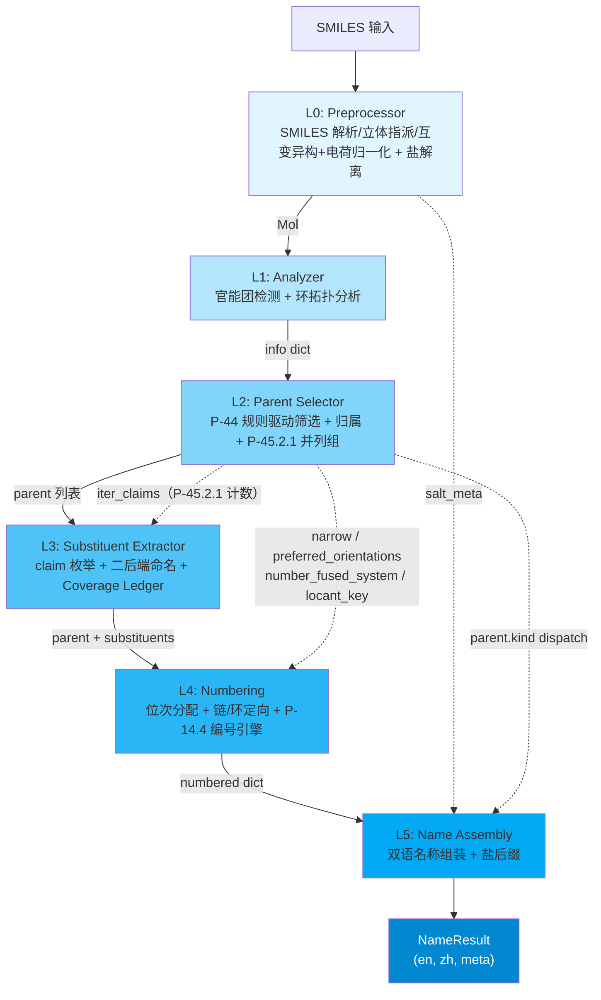

# Architecture Overview / 架构总览

**NamePredict** 是一个基于规则的 SMILES -> IUPAC 双语（EN/ZH）有机化合物命名引擎。它采用 6 层流水线架构，自 SMILES 字符串解析开始，逐层推进至最终的中英文名称输出。

> 最后更新: 2026-09-15 | 源文件: 57 `.py` / 7,433 行（`src/namepredict` 全量，含 `tools/`、`constants.py`、`namer.py`）

---

## 1. 核心入口：SMILESNNamer

整个引擎的入口点是 `SMILESNNamer` 类（`src/namepredict/namer.py:249`）。它是流水线的 orchestrator，对外暴露唯一的公共 API：

```python
namer = SMILESNNamer(cache=CommonNameCache())
result: NameResult = namer.name("CC(=O)O")  # acetic acid / 乙酸
```

`name(smiles)`（`namer.py:256`）先查整分子缓存（命中即返回，`namer.py:259-261`），未命中则 `memo.begin_run()`（`:262`）清空本次命名的中间结果记忆，再经 `_pipeline`（`:263`）跑完整管线，成功后用回传的 `mol` 写 canonical 缓存（`:264-265`）。

`NameResult`（`src/namepredict/types.py:8-16`）是一个统一的输出契约：

| Field | Type | Description |
|-------|------|-------------|
| `en` | `str` | 英文 IUPAC 名称 |
| `zh` | `str` | 中文 IUPAC 名称 |
| `success` | `bool` | 命名是否成功 |
| `source` | `str` | 名称来源（通常为 `"iupac"`） |
| `time_ms` | `float` | 流水线耗时（ms） |
| `meta` | `dict` | 链元数据（`parent_chain`/`parent_kind`/`parent_labels`）、并列候选裁决键（`p44_1_1_key`/`p45_2_2_key`）、`salt`、`fallback` 等，见 [[reference/core-data-contracts]] |

失败结果的 `meta` 只有 `reason` 一个核心字段（`_fail`，`namer.py:24`），取值仅 `"parse"` 与 `"no_assemblable_candidate"` 两种。

---

## 2. 六层流水线



### 2.1 Layer 0 -- Preprocessor（预处理器）

**职责**：SMILES 解析 + 立体初步指派 + 酰胺烯醇互变异构归一化（两次）+ 酸性质子收敛 + 盐解离（5 个 `.py`，260 行）

- `preprocess(smiles)`（`src/namepredict/layer0/preprocessor.py:11`）：`MolFromSmiles(smiles, sanitize=False)` → `SanitizeMol` → `Chem.AssignStereochemistry(force=True, cleanIt=False, flagPossibleStereoCenters=True)` → `normalize_amide_tautomer(mol)` → `normalize_acid_charge(mol)` → `normalize_amide_tautomer(mol)`；任一步异常返回 `None`，由 namer 触发 `_fail("parse")`。**二次互变归一**（`:23`）是必需的：电荷重定位把酰胺 O⁻ 变回中性 `C(OH)=N` 后才出现可归一的酰胺烯醇位，不重跑会留下亚胺醇式名（gold 取酰胺式）。
- `normalize_amide_tautomer(mol)`（`src/namepredict/layer0/tautomer.py:47`）：把分子内非芳香中性 `C(OH)=N` 位点归一化为酮式酰胺 `C(=O)-NH`（只改键级、靠 RDKit 隐氢重算完成质子迁移，不增删重原子）。羟基 O 的候选判据是「与碳单键相连（Degree==1）且总 H 数 ≥1」——隐氢与 `normalize_acid_charge` 写下的显式 H（`[OH]`）都接受；迁移前先把羟基 O 的显式 H 记账清零（`SetNumExplicitHs(0)` + `SetNoImplicit(False)`，`tautomer.py:57-58`），否则新生成的 C=O 会让 O 价态超限、整分子消毒失败回退；羟基 H 数 ≠1 的点位直接放弃。带电 N / O⁻ 阴离子 / 硫类似物位点跳过。
- `normalize_acid_charge(mol)`（`src/namepredict/layer0/charge.py:69`）：同一片段内质子化强酸（供体 `constants.DONOR_KIND`，`constants.py:102`）与去质子化弱酸位共存时，逐次把质子搬到弱酸位，使等价负电荷收敛到最强酸；只改 `FormalCharge`/H 记账（RWMol 原子级编辑），含 `*` dummy 或消毒失败时保守跳过。成酸中心由 `_acid_kind`（`charge.py:25`）按 `constants.ACID_CENTERS`（`constants.py:104`，值即裸字符串 `{C:"carboxyl", P:"phospho", S:"sulfo"}`）查表识别，**字典键序即酸强度序**，供体搬运序走 `DONOR_KIND.index(...)`，供体与共轭碱判定共用同一张表。
- `dissociate_salt(mol)`（`src/namepredict/layer0/salt.py:57`）：先用只数片段的 `Chem.GetMolFrags(mol)` 早退（单片段直接返回），再检测碱金属盐（Li<sup>+</sup>, Na<sup>+</sup>, K<sup>+</sup>）和 HCl 盐，分离有机片段与盐组分。返回 `(organic_mol, salt_meta)` 元组。早退省掉 `asMols=True, sanitizeFrags=True` 为每片段重建分子并重新 sanitize 的开销（`_name_mol` 每次递归都会调本函数，绝大多数分子只有 1 个片段）。水片段无特判，按普通有机片段计入片段数——「金属盐 + 结晶水」因有机片段数为 2 而不被识别为盐。

**关键设计**：salt_meta 注入链 -- L0 产生的 salt 元数据跨越 L1-L4，经 `info["salt"]`（`namer.py:208`）与 `result.meta["salt"]`（`:212`）直接注入 L5 的名称组装阶段（`_apply_salt_suffix`，`namer.py:172`），用于生成 "sodium ..." / "...钠" 等盐名称格式。参见 [[concepts/bilingual-naming]]。立体指派把 RDKit 初步立体信息带进下游，供 L5 E/Z 与 R/S 判定；互变异构归一化保证酰胺烯醇数据与酮式酰胺同判；电荷归一化把输入侧电荷错位的结构（如 chebi-433）交给既有 carboxylate → -oate 能力处理（详见 [[architecture/layer0-preprocessor]]）。

**L0 → L1 只交接一个 `Mol`**：`analyze` 的签名是 `analyze(mol: Mol) -> dict`（`layer1/analyzer.py:195`），L0 的全部归一化都必须体现为分子结构本身的变化，不传任何 L0 私有标志位。

> 源文件：`src/namepredict/layer0/preprocessor.py`（26 行）, `tautomer.py`（69 行）, `charge.py`（100 行）, `salt.py`（63 行）；`layer0/__init__.py`（2 行）只含层说明、**不做 re-export**。L0 常量集中在 `src/namepredict/constants.py`（195 行），模块内不自备副本。

### 2.2 Layer 1 -- Analyzer（分析器）

**职责**：官能团检测 + 环系拓扑分析，输出 info dict（6 个 `.py`，561 行）

`analyze(mol)`（`src/namepredict/layer1/analyzer.py:195`）对 Mol 进行全原子扫描，由 `_info`（`:190`）汇总出一个标准化 info dict（**11 键**，namer 再注入 `root_ctx`/`salt` 共 13 键）：

```python
info = {
    "mol": mol,                    # RDKit Mol 对象（analyzer.py:192）
    "carbon_ids": [...],           # 所有碳原子索引（analyze 内联过滤，analyzer.py:197）
    "n_carbons": N,                # 碳原子总数
    # --- 不饱和度事实列表（_collect_fgs，analyzer.py:186-187）---
    "double_bonds": [{"c1": i, "c2": j}, ...],
    "triple_bonds": [...],
    # --- 官能团库存（_collect_fgs，analyzer.py:188）---
    "fg_inventory": FunctionalGroupInventory(...),
    # --- 环系事实（_ring_meta，analyzer.py:121）---
    "rings": [...], "n_rings": int, "has_ring": bool,
    "ring_systems": [...], "n_ring_systems": int,
}
```

info 中不含独立 FG 列表键（`carboxyls`/`esters`/…）：所有检测结果收敛为单一 `fg_inventory` 对象，下游一律经 `functional_group_inventory.inventory_from_info(info)`（`functional_group_inventory.py:120`）读取。`FunctionalGroupOccurrence`（`:29`）携带 `id`（`"{FG 键}:{序号}"`，如 `"acid:0"`，`functional_group_inventory.py:110`）/`group_class`/`characteristic_atoms`/`parent_anchors`/`payload`/`demoted` 六个字段，`demoted=True` 标识被 P-41 压制的降级叶（carboxy/cyano 前缀）。布尔标志只剩 `has_ring` 一个。信息 dict 从 L1 产出后贯穿 L2-L5，是整个流水线的通用数据合约（[[reference/core-data-contracts]]）。

**表驱动的局部检测**：`fg_local_smarts.py`（77 行）的 `FG_SMARTS`（`:26`，**17 条** `(FG 键, SMARTS)`，覆盖 13 类，`ketone`/`amine` 各 3 条）是局部判定的唯一事实来源，`match_local_fg(mol)`（`:68`）是唯一入口，返回按中心原子升序、同中心去重的 `{FG 键: [匹配元组]}`。**统一 FG 条目接口**：`FG_SPECS`（`layer1/fg_registry.py:20`，**13 条 `FgSpec`**）以 7 个字段（`fg`/`p41`/`path`/`expr`/`anchors`/`parent_anchor_fields`/`locant_source`）声明每类的跨层语义，检测器一律产出 `{"center_idx": int, "surr_idx": [int, ...]}`（磷酸例外：`{"p_idx", "n_oh", "n_om"}`，**无 `n_arms`**；`analyzer.phosphate_entries:83`）。`_arbitrate_parts(parts)`（`analyzer.py:141`）执行 P-41 仲裁：`_SUPPRESSIBLE`（`:136`）组的组合羰基 FG 被更高优先级 FG 压制时清空，`_LEAF_DEMOTED`（`:138`）= `("acid", "nitrile")` 保留条目并置 `demoted=True` 供 L2 产出 carboxy/cyano 前缀叶。

**检测约束**：环内杂原子模式 `_RING_HET`（`fg_local_smarts.py:21` = `~[#7,#8,#16;R]`，N/O/S 已内联进 SMARTS）使单碳羰基按环酮归类（P-66.1.1）——环内 N 为 N-酰基环胺、环内 O/S 为内酯/硫代内酯；环外羰基须带 H 才作醛；锚定酰基头由 `acyl` SMARTS 识别（α 环/芳放行）。胺的三条 SMARTS 按取代度分且统一要求 `!R`/`!a`，饱和杂环 N 是环杂原子而非胺官能团。`FunctionalGroupClass`（`functional_group_inventory.py:10`）= 13 个实类 + 哨兵 `NONE`（值 `"alkane"`）；**`anhydride` 不是枚举成员**。环系由 `ring_systems.build_ring_systems:117` 产出，`sssr_rings:23` 是 SSSR 环表单一入口，经 `memo.by_mol("sssr", …)` 在单次命名内只算一次（L2/L4/L5 复用）。

`_detect_parts`（`analyzer.py:167`）末尾保留一行调试输出 `print(result)`（`analyzer.py:178`），每次 `analyze()` 调用都会向 stdout 打印全部 parts 字典。

> 源文件：`src/namepredict/layer1/analyzer.py`（198 行）, `fg_local_smarts.py`（77 行）, `fg_registry.py`（35 行）, `functional_group_inventory.py`（125 行）, `ring_systems.py`（124 行）, `__init__.py`（2 行，不导出符号）。L1 只消费 `constants.py` 的原子序数（`analyzer.py:9-11` 的 `C, H, O` 等）。

### 2.3 Layer 2 -- Parent Selector（母体选择器）

**职责**：母体氢化物（parent hydride）选择——按 IUPAC P-44 规则驱动管线选出主链/主环母体，并按 P-45.2.1 交出并列候选组

层内逻辑最重（10 个 `.py`，1,840 行），位于 `src/namepredict/layer2/`。对外只有 `select_parent(info)`（`parent_select.py:128`），返回 **P-45.2.1 并列最优候选组 `list[dict]`**（namer 逐候选跑 L3–L5 后裁决，见 §3.1）；无候选时返回空列表，`namer._run_candidates` 以 `no_assemblable_candidate` 显式失败，不做烷烃兜底。

**① 唯一门面 `parent_select.py`（131 行）** 分五段：选择结果类型 `PrincipalParentSelection`（`:19`）、P-44 编排（`select_principal_parent_skeletons:25` / `_express_selected:40` / `rule_driven_parent_candidates:52` / `_unsupported_typed_ring:33`）、原子归属（`_chain_atoms:58` / `_kind_fg_atoms:63` / `finalize_parent_ownership:83`）、候选收集 `_collect_candidates:91`、P-45.2 裁决与终态化（`_p45_2_prefix_count:97` / `_reorder_p45_2:104` / `_finalize_ranked:116` / `select_parent:128`）。

**② 层内无 P-44 排序键** —— 全库不存在 `P44Facts`/`ParentCandidate`/`principal_key`/`_p44_1_1`/`_rank_candidates`。P-44 的取舍全部落在 `parent_skeleton.select_principal_skeletons`（`:215`）的筛选谓词里：`keep_max_principal_coverage`（`:178`）→ `keep_p44_1_2`（`:131`，混合拓扑时取 senior 元素）→ `keep_p44_3`（`:149`，纯链）/`keep_p44_2`（`:171`，含环）→ `keep_p44_4_unsaturation`（`:209`，芳香键按 Kekulé 双键当量计入，苯 = 3）。L2 出口只做一条排序：`_p45_2_prefix_count`（`parent_select.py:97`）数 owned_atoms 边界外的取代基团数目，`_reorder_p45_2`（`:104`）按该计数降序稳定重排，`tied=True` 时只留并列最大组。

**③ 主官能团选择在 `principal.py`（69 行）** —— `select_principal_group`（`:60`）先剔除 `demoted` 条目，再 `min(eligible, key=priority)` 单选择完成互斥（P-44 只认单个最高优先级主官能团）。`PRINCIPAL_REGISTRY`（`:44`）由 `FG_SPECS` 取 `p41 != 0` 的条目派生，**13 条**；`PrincipalPriority`（`:17`）为 `(p41_class, p43_path)` 可比较元组。无合格主基团时返回 `FunctionalGroupClass.NONE`（值 `"alkane"`）走纯烃表达。

**④ 骨架识别在 `ring_scaffold.py`（457 行）** —— `_TEMPLATES`（`:60`，**83 条**保留母体模板，`naming_class` 覆盖 monohetero 53 / naph_family 9 / fused56 8 / xanthene 2 及 11 个单条类目）为唯一事实来源；**36 条**模板携带 `standard = (labels, order)` 声明固定编号（import 期 `_validate_standard_fields:203` 校验 order 是排列、labels 长度等于模板原子数），派生 `_STANDARD_LABELS:195`/`_STANDARD_ORDERS:198` 与 `ScaffoldSpec`/`ScaffoldIdentity`。`_FUSION_CARBOCYCLES`（`:323`，**6 条**）承载 P-25.3.2.2.1 单环烃附加组分（环丙烷…环辛烷 → `cyclopropa`/`环丙并`），**不入 `_TEMPLATES`**。稠环拆解在 `fused_system.py:217`（P-25.3.2.4 产出 `FusedNode` 树，含 `fused_stem`/`fused_prefix`/`fused_omit_numbers`，供 L5 稠合名组装）。母体元数据（词干、locant 前缀注入）由 `kind_registry.py` 提供，对外只有 `get`/`parent_names`/`pack_parent_stem:58`，且是**只读权威**——`_load_from_scaffold_specs:76` 从 `ring_scaffold.all_specs()` 同步词干（Spec 是词干权威）。

**⑤ kind 正交化** —— 苯、未注册碳环与未注册芳香稠环一律收敛 `alkane`（`_resolved_ring_kind:158` / `_generic_ring_kind:145`），不饱和度由 `double_bond(s)`/`triple_bond(s)` 字段承载；**数量不进 kind**——多基团数只由 `principal_expression_facts.multiplicity` 承载（无 diacid/diol/diamine/dione 等数量 kind）。`ParentSkeleton` 已无 `scaffold_id`，骨架身份延迟到表达阶段由 `resolve_ring_scaffold`（`ring_scaffold.py:450`）识别。

**⑥ 与下游的双向依赖** —— L2 **反向**依赖 L3 `iter_claims`（`layer3/claimable_block.py:123`，`_p45_2_prefix_count` 内 `parent_select.py:100` 局部 import）与 L4 `narrow`/`preferred_orientations`/`number_fused_system`/`locant_key`（`fused_system.py` 的母体组分选择准则 (g)-(j)）；L2→L5 不 import，`free_to_yl` 在 L5 侧（`layer5/assembler.py:178`）。

**parent dict 结构**（`principal_expression._parent_dict:125`）：

```python
parent = {
    "kind": str,          # 母体种类：决定 L5 的命名 dispatch 路径
    "chain": [int, ...],  # 母体链/环原子索引（定向到 L4）
    "owned_atoms": frozenset,  # 归母体所有的原子（L2->L3 的边界桥梁）
    "principal_expression_facts": PrincipalExpressionFacts(...),  # typed 主基团表达
    "principal_occurrences": [...],       # 主基团 occurrence 全集
    "principal_group_count": int,         # 主官能团实例数
    "covered_principal_ids": [...],       # 母体已覆盖的 occurrence id
    "stem_en": str, "stem_zh": str,
    "scaffold_id": str, "scaffold_identity": ..., "scaffold_match": ...,
    "numbering_scaffold": {"scaffold_id": ..., "labels": ...},
    "hydro_atoms": ..., "fused_tree": ..., "typed_ring_expression_supported": bool,
    # FG 专属字段（按 kind 选择性存在）
    "radical_c_idx": int, "acyl_c_idx": int,   # P-14.4(a) 固定 locant 1
    "o_idx": int, "alkoxy_n": int, "hal_idx": int, "hal_z": int,
    "n_oh": int, "n_om": int, "n_arms": int, "salt_meta": ...,
    "radical_ylidene": bool, "anion": bool, "mol": ...,
}
```

扁平锚点字段只剩 `radical_c_idx`/`acyl_c_idx`（`_semantic_anchor_fields:57` 只为 RADICAL/ACYL 写出）；其余 FG 的锚点一律经 `principal_expression_facts` 流转。**原子归属**在 `parent_select.py:83` 的 `finalize_parent_ownership`：`_kind_fg_atoms`（`:63`）以 `anchors ∩ chain` 为种子、并入种子的直接相连特征原子扩展出 `owned_atoms`，由 namer `_prepare_candidate`（`namer.py:121`）在 L3 前二次调用固化（详见 [[concepts/atom-ownership]]）。

> 源文件：`src/namepredict/layer2/parent_select.py`（131 行）, `principal.py`（69）, `parent_skeleton.py`（230）, `principal_expression.py`（444）, `chain_walk.py`（152）, `ring_scaffold.py`（457）, `kind_registry.py`（87）, `ring_expression_policy.py`（45，`_POLICIES` **16 条**）, `fused_system.py`（223）, `__init__.py`（2）。派生集合 `chain_fgs`/`multi_fgs`/`srs_fgs`/`keep_locant_fgs` **不存在**，下游各自从 `FG_SPECS` 现算。

### 2.4 Layer 3 -- Substituent Extractor（取代基提取器）

**职责**：从 parent 的 owned_atoms 边界出发，枚举并命名所有取代基（7 个 `.py`，516 行）

`extract_substituents(info, parent, *, cache=None)`（`src/namepredict/layer3/substituent_extractor.py:43`）是**入口即实现**：取 `parent["owned_atoms"]`（为 `None` 直接返回 `[]`），算一次 `o_side` 标记（`parent["kind"] ∈ ESTER_O_SIDE_KINDS` 或有 `o_idx`），遍历 `iter_claims(mol, owned)` 对每个 claim 调 `_append_named:32`。命名失败的 claim 被静默跳过（该原子最终体现为覆盖台账的 `gap`）。

1. **块枚举与槽位判定**（`claimable_block.py`，130 行，只做拓扑不命名）：`_unique_components:112` 从 `tools.block_cut.side_roots` 出发用 `cut_block` 取不穿越 owned 的连通分量；`_try_claim:96` 取 owned 与组分之间**最小的 `(attach_parent, root)` 边**保证表示与枚举入口无关；`_has_dbl_o_edge:83` 丢弃「含经双键连 owned 内非碳重原子的氧」的组分（砜/亚砜/磷酰等由主命名路径承担）；`derive_slot:34` 按连接原子定槽位——`_is_amine_n:28`（N 且非芳香且非环员）→ `AMINE_N`，碳按 `IsInRing()` → `RING_C`/`CHAIN_C`，其余 → `OTHER`。`SideSlot`（`:11`）收缩为 4 值（**`AMIDE_N` 不是成员**）；`claim_block:53` 校验连接原子在 owned 内且附着点唯一；`iter_claims:123` 按 `(attach_parent, root, slot.value)` 排序返回。
2. **二后端命名**（`substituent_namer.py`，73 行）：`SubstituentNamer.name`（`:67`）按序调用各后端的 `try_name`，首个非 `None` 即返回。`RetainedBackend`（`:34`）走 `anchored_lookup` 查锚定 canonical-SMILES 表；`RecursiveBackend`（`:43`）把 claim 原子切出为锚定子分子、作为独立分子重跑完整 L1-L5 再转 P-29 -yl 形式。后端协议由 `SubstituentBackend`（`:22`，`Protocol`）声明。产出 `SubstituentName`（`:14`，`claim`/`en`/`zh`/`requires_parentheses`）。
3. **覆盖台账**（`coverage.py`，42 行）：`build_coverage_ledger(mol, *, owned_atoms, names)`（`:26`）给出 `CoverageLedger`（`:13`：`owned_atoms`/`named_claims`/`gap`/`overlap` + 属性 `complete`），其中 **`gap` = 重原子集 − `owned_atoms`**。

**取代基 kind 三级映射**（`sub_from_named:17`）：先查 `constants.NAME_KIND`（only `fluoro`/`chloro`/`bromo`/`iodo` → `halo`），未命中再查 `constants.CLAIM_KIND`（`:141`，**只剩 3 键**：`amine_n` → `n_block`、`ring_c`/`chain_c` → `alkyl`），仍无则 `"side"`。环员 N 的 kind 会被改写为 `alkyl` 改用环上位次定位（P-62.2.2.1 护栏）。

**取代基 dict**（L3 -> L4）：`kind`/`n_carbons`/`attach_idx`/`atoms`/`en`/`zh`/`paren`，O 侧臂另加 `o_side=True`（仅当连接原子确为 O 时写入）。切子分子用 `submol_build._carry_alkene_stereo:29` 把 C=C E/Z 标签照搬进 submol、`_external_bond_type:78` 让锚定键级随母体–取代基真实键级（双键叶 → methylidene）；`*` 锚定取代基带 `root_ctx`（`namer.py:207` 注入），其 R/S 经 `as_substituent._fix_rs_with_real:13` 回完整根分子重算。

**锚定查表**（`tools/anchored_table.py`，164 行）：`_REGISTRY`（`:24`，**70 条** `RetainedSubstituent`，字段 `en`/`zh`/`anchored`/`paren`）以 canonical SMILES 反查索引 `_ANCHOR_INDEX`（`:124`，**72 键**——`phosphonato` 与 `phosphonatooxy` 各带两条锚定键）；`_WHOLE_ONLY_KEYS`（`:145` = `*O`/`*[O]`/`*N`）只允许整分子顶层命中，L3 的 claim 查表跳过；`anchored_key:132` 经 `memo.by_key` 记忆，`anchored_lookup:156` 直接把键映射为 `(en, zh, paren)`。

> 源文件：`substituent_extractor.py`（57 行）, `claimable_block.py`（130）, `substituent_namer.py`（73）, `as_substituent.py`（108）, `submol_build.py`（104）, `coverage.py`（42）, `__init__.py`（2）；消费 `tools/anchored_table.py`、`tools/common_names.py`、`tools/block_cut.py`。

### 2.5 Layer 4 -- Numbering（编号层）

**职责**：位次分配 + 链/环定向 + omit-locant 决策（10 个 `.py`，1,496 行）

layer4 是**编号方向总调度 + 稠环编号引擎**。`number(parent, substituents)`（`src/namepredict/layer4/numbering.py:82`）的核心是 `numbering_engine.orient_numbering`（`numbering_engine.py:325`，三层分派）：

1. **`_fixed_numbering`**（`:214`）— registered 保留骨架（模板带 `standard`）按固定编号（`_template_matches:200` + `_STANDARD_LABELS`/`standard_chain`）；对称 scaffold 的镜像取向由**三层位次键** `_fixed_key:251` 决定：后缀层（principal 特征基团附着原子与 `radical_c_idx` 同属）→ 取代基前缀层 → 位次集合仍相同时按引用序（字母序，`alkyl_alpha_key`）。比较按 `ring_scaffold` 的**标签**而非链位置（蒽的 10 位在链上先于 5 位，用位置号会把 10 位判成更低）。
2. **`_fused_numbering`**（`:260`）— 多环走几何 + 外围骨架编号（`preferred_orientations:328` 优选取向 + `number_fused_system:147` 外边界/字母位 + `ring_geometry` 平面原语 + `locant_calc.locant_key:7` 混合 locant 排序）；`constants.TRADITIONAL_NUMBERING_IDS`（`constants.py:147`）登记的骨架按传统编号不走此路。优选取向按 IUPAC 环计数法计四象限/上方针环数（P-25.3.2.3.3），并以 P-25.3.2.3.2 变形环模板放行水平行中间奇数环；对称等价杂环通过 `float_hetero` 放行镜像。**rings 只取稠合系统自身环**（`sssr_indices` 子集）。收窄层序按 P-14.4：环外附着原子 → 指示氢层 `INDICATED_H`（`fused_numbering.py:11`，P-25.3.3.1.2(f)）→ 取代基前缀，镜像平局再以 `alpha_subs`（P-14.5 字母序）裁定，最后以 **P-14.4(j) CIP 破局**。
3. **普用 P-14.4 候选枚举**（`:336-360`）— 链正反 / 环每原子 1 号位 × 双向 → P-14.4(c)(e)(f) 逐条收窄（principal FG 最低位次集 → seam 感知多重键 → 取代基）→ stem-alpha 平局 → **P-14.4(j) CIP 立体平局**。入口先分岔：**杂环走 `_narrow_hetero_ring`**（`:182`，P-22.2.2.1.3 杂环元素序窄化），碳环/链按环 2n 候选或链正反双向起步（无固定起点锚定）。CIP 标签由 `assign_cip`（`:99`）算，经 `memo.by_mol("cip", …)` 只算一次。`fused_component_numbering`（`:376`）把稠合点集合作为 `sub_layers` 传入，使多环无固定编号组分的镜像对逐层最小化位次（P-25.3.1.3）。

**收窄原语是公共 API**：`narrow`（`numbering_engine.py:75`，保留键最小者、`skip_none` 判规则适用性）与 `narrow_by_senior`（`:86`，整体杂原子集 → `constants.P145_SENIOR` 逐元素两级收窄）由 L4 通用枚举、L4 稠环编号与 **L2 `fused_system.py:16`** 三处共用；位次集合排序统一走 `locant_calc.locant_key`/`locant_str_sort`（`:7`/`:13`）。链/键端点位次原语落 `locant_calc._bond_min_locs`（`:72`）与 `numbering_engine._stem_loc_pairs`（`:25`）。

**指示氢与加氢描述归一**：`indicated_hydrogen.py`（P-58.2.1）产出 `indicated_h_locants`，由 `numbering.number` 写入 numbered dict；加氢前缀由 `numbering.hydro_prefix`（`numbering.py:62`）给出（覆盖域 `constants.HYDRO_MULT_N`，`constants.py:146`），`_lowest_extra_to_indicated:22`/`_odd_hydro_to_indicated:47` 把最低加氢位改归指示氢。L5 侧 `assembler._indicated_h_prefix:244` 拼 `1H-`、`join_hydro_prefix:448` 组装。

**FG 位次**由 `locant_calc.py` 的 `_FG_LOCANTS`（`:146`）= `tuple((sp.fg, sp) for sp in FG_SPECS …)`，**13 条、记录 kind 就是 `FgSpec.fg`**（未注册的 FG 类别不在表内），配合 `_locants_for:138` 三态分派（`anchor_field`/`attachment_exocyclic`/`attachment`）产出稀疏 `fg_locants`；位次原子一律来自 `principal_expression_facts`（`_typed_group_atoms:18`）。omit 标志由 `omit_locants.py`（`omit_fg_locant:5` / `omit_unsat:17`）基于 `scaffold_id` 与键级判定——烯/炔省略按键级分流（炔阈值 C≤3、烯 C≤2）。`locant_calc.atom_locant:33` 是公开别名（数字标签返 `int`、字母位返 `str`）。

并列候选的裁决键由 `candidate_keys.py`（23 行）从 numbered dict 计算（`suffix_locant_set:7` P-44.1.1 / `prefix_locant_set:20` P-45.2.2）。

> 源文件：`numbering.py`（115 行）, `numbering_engine.py`（401）, `fused_orientation.py`（364，`Orientation` 只含 `row`/`coords`/`quad` 三字段）, `fused_numbering.py`（203）, `locant_calc.py`（169）, `candidate_keys.py`（23）, `indicated_hydrogen.py`（47）, `omit_locants.py`（26）, `ring_geometry.py`（146）, `__init__.py`（2）。

### 2.6 Layer 5 -- Name Assembly（名称组装）

**职责**：双语名称组装 + 盐后缀拼接（7 个 `.py`，1,845 行）

`assemble(numbered, *, time_ms=0.0, source="iupac")`（`src/namepredict/layer5/assembler.py:500`）是流水线的最终输出层，**8 步**：

```
assemble(numbered)                                   # assembler.py:500
  ├─ 0. _ensure_fused_stem(numbered)                 # :250 未注册稠环词干注入（fused_parent_names），失败→unsupported
  ├─ 1. _names_for(kind, n, numbered)                # :301 母体名称 (en, zh)
  ├─ 2. join_hydro_prefix(names, numbered)           # :448 hydro + 指示氢 + 母体名（P-31.2.2）
  ├─ 3. join_ring_cation_suffix(numbered, names)     # :461 环内 N+/O+ → 母体名缀 -{位次}-ium（P-62.4.1）
  ├─ 4. _prefix_for(numbered, kind, n)               # assembler_prefixes.py:296 取代基前缀
  ├─ 5. join_kind_name(kind, pre, names, numbered)   # :427 拼接前缀+母体（酯/磷酸专属拼接）
  ├─ 6. join_anion_names(numbered, en, zh)           # stems.py:64 羧酸根阴离子后缀
  ├─ 7. join_ez_prefix(numbered, en, zh)             # stereo.py:125 母体外挂双键 E/Z 前缀
  └─ 8. join_rs_prefix(numbered, en, zh)             # stereo.py:248 R/S 立体化学前缀
```

1. **母体命名**：`_names_for`（`assembler.py:301`）按固定顺序派发——`kind == "radical"` 且有 `radical_anchor_element` → `_mononuclear_radical_names:190`（O/N/S/P 杂原子锚点）；否则查 `chain_engine._KIND_TABLE`（`chain_engine.py:457`，**15 个** `_Chain` entry：alcohol/ketone/alkane/acid/sulfonic/ester/phosphate/acyl/thiol/amine/aldehyde/nitrile/amide/acyl_halide/radical），`acyl_halide` 先按 `parent.hal_z` 取 `_ACYL_HALIDE_BY_HAL`（`chain_engine.py:418`）覆盖默认 chloride；未命中回落 `_parent_stem_names:332`。链式词干 + 烯/炔段由 `_chain_enyne:121` 统一生成（位次省略 `_unsat_loc_omit:111`、自由价位次省略 `_fg_yl_tail:68`）。环外主基命名收进 `_exo_ring_spec:298`（配 `constants.EXO_RING_SUF`）与 `_ring_prefix_located:291`。苯单取代保留名上提为 `_BENZENE_RETAINED`（`chain_engine.py:444`，**10 个 kind**：alcohol/amine/radical/acid/sulfonic/ester/acyl/aldehyde/nitrile/amide）。`_ensure_fused_stem:250` 调 `fused_namer.fused_parent_names:112` 组装稠合名（母体/附加组分共用同一稠合共享原子集编号），并前置 L4 算好的 `indicated_h_locants` 指示氢前缀；稠合名命中 `constants.RETAINED_FUSION_ALIASES`（`constants.py:186`，7 条，P-25.1.1）时整名替换为保留名。
2. **取代基排序与围栏**（`assembler_prefixes.py`，303 行）：按字母序（EN）排列前缀，重复基团 di/tri/tetra 合并（复合组分 bis/tris/tetrakis）；N- 类取代基（`constants.N_PREFIX_KINDS`，`constants.py:39` = `{n_alkyl, n_block}`）走 `N-` 前缀（N/C 混合位次由 `_locant_str:26` 渲染，`N'` 撇号由 `_n_prime_map:238` 分配）；O/S/N 桥平铺式（`constants.BRIDGE_SUFFIX_EN`，`constants.py:157`）把括号闭在前端 `-yl` 后、桥后缀留在括号外（P-63.2.2.1，中英同形，中文侧 `_split_bridge_suffix_zh:182` 判据取自英文 stem）；带立体描述符的词干整体括起。字母序键 `alkyl_alpha_key` 由共享模块 `tools/re.py:56` 提供（P-14.5，L4/L5 共 4 处消费）。
3. **双语生成**：同时产出英文与中文名称 -- 英文遵循 IUPAC Blue Book，中文遵循中国化学会《有机化学命名原则》。
4. **立体化学**（`stereo.py`，255 行）：E/Z 与 CIP R/S 前缀；位次经整体编号标签换算（`_chain_locant:156`），稠环桥头得 `3a`/`6a` 而非链序号；`join_rs_prefix:248` 拼接，CIP 指派统一走 `layer4.numbering_engine.assign_cip:99`。
5. **盐后缀**：`stems.join_metal_salt_names:91`（金属盐）/`join_anion_names:64`（阴离子）追加 "sodium"/"钠" 等；`kind=phosphate` 的盐名由 `join_phosphate_name:279` 自行组装，此步跳过（`namer._apply_salt_suffix:172` 对 `parent_kind=="phosphate"` 直接返回，`namer.py:176`）。
6. **`free_to_yl`**（`assembler.py:178`）：单核母体氢化物 free 名 → P-29 `-yl` 取代基形式（`*OCC→ethoxy`），返回 `(en, zh, need_paren)` 三元组，供杂原子锚点自由基命名（`_mononuclear_radical_names` 取前两项）。
7. **磷酸**：`kind=phosphate` 由 `_KIND_TABLE["phosphate"]`（`chain_engine.py:488`，词尾表 `_PHOSPHATE_TAIL:420` 按 `n_oh` 出双语词尾）+ `assembler.join_phosphate_name:279`（配 `_phosphate_arm_zh:269`）两段式产出。

> 源文件：`assembler.py`（521 行）, `assembler_prefixes.py`（303）, `chain_engine.py`（529，`_Chain` 上无 `mult_ok` 开关，数量后缀由 `mult > 1` 无条件生成）, `fused_namer.py`（131）, `stems.py`（104）, `stereo.py`（255）, `__init__.py`（2）。

---

## 3. Namer 流水线流程

`SMILESNNamer.name(smiles)` 的完整调用路径（`src/namepredict/namer.py`）：

```
name(smiles)                                # namer.py:256（缓存命中直接返回整分子缓存结果，:259-261）
  └─ memo.begin_run()                       # :262 清空本次命名的中间结果记忆（memo 不跨分子共享）
  └─ _pipeline(smiles, t0, cache=self.cache) # :263 → 定义在 :216；回传 (NameResult, mol)
       └─ preprocess(smiles)                # :218 → Mol | None（解析/消毒 + 立体指派 + 酰胺烯醇归一化 + 酸性质子收敛 + 二次归一化）
       └─ if None: _fail("parse")           # :220 → 解析失败快速返回
       └─ _name_mol(mol, t0=t0, cache=...)  # :221 → 定义在 :188
            └─ dissociate_salt(mol)         # :199 → (organic_mol, salt_meta)（单片段早退）
            └─ 顶层 root_ctx：root_mol=organic、to_root=恒等；片段命名用本次运行的私有缓存（:200-205）
            └─ analyze(organic)             # :206 → info dict；再注入 info["root_ctx"]（:207）与 info["salt"]（:208）
            └─ _run_candidates(info, ...)   # :209 → 定义在 :162
                 ├─ _candidate_phases → select_parent(info)  # :158，P-45.2.1 并列最优组（≤ _MAX_TIED_CANDIDATES=4，:89）
                 ├─ _prepare_candidate      # :167 定义在 :116：finalize_parent_ownership(:121) → extract_substituents(:126) → coverage ledger(:127)
                 └─ _try_phase              # :168 定义在 :145：逐候选 _assemble_candidate(:149) → number(:106) → _ok_result(:109) → assemble(:53)
            └─ _apply_salt_suffix           # :210 盐后缀（kind=phosphate 由 L5 worker 自行组装，跳过 :176）
  └─ 成功时用回传的 mol 写 canonical 缓存    # _canonical_result :232 / _cache_put :224（调用点 :264-265）
```

> `_pipeline` 与 `_name_mol` 返回 `(NameResult, mol)` 二元组：`mol` 在解析后即被返回，`name()` 出口直接用它做 `_canonical_result`，省掉一次 `preprocess`。解析失败时 `mol` 为 `None`。

### 3.1 并列候选裁决（P-44.1.1 → P-45.2.2）

`_candidate_phases`（`namer.py:156`）取 `select_parent` 返回组的**前 `_MAX_TIED_CANDIDATES = 4` 个**（`:89`），`_prepare_candidate`（`:116`）为每候选完成归属与取代基提取，`_try_phase`（`:145`）逐候选跑完 L4+L5：`_assemble_candidate`（`:103`）在 `meta` 写入 `p44_1_1_key = suffix_locant_set(numbered)` 与 `p45_2_2_key = prefix_locant_set(numbered)`（`:111-112`，`layer4/candidate_keys.py`），`_best_hit`（`:136`）据此裁决——**后缀位次集合未决（并列）**时按前缀位次集合取最小者，否则保持候选顺序（首个即 P-44.1.1 已决的首选）。编号异常（`ValueError`/`KeyError`/`TypeError`）的候选直接跳过（`:107`）；全失败 → `_fail("no_assemblable_candidate")`（`:169`）。

### 3.2 覆盖台账、缓存与递归立体（root_ctx）

- **覆盖台账只作记录**：`_prepare_candidate`（`namer.py:127`）以 `names=[]` 调 `build_coverage_ledger`，故 `complete` 等价于「`owned_atoms` 是否覆盖全部重原子」（只看 `gap`，`overlap` 恒空）；该三元组第三项在 `_try_phase`（`:148`）被解包接收，但函数体内未使用——成功候选一律在 `meta` 记 `fallback="no_coverage_gate"`（`:151`），不阻断组装。
- `root_ctx is None`（顶层整分子）：`_name_mol` 在提供了外部缓存时改用本次运行的私有 `CommonNameCache(max_entries=2000)`（`namer.py:202`）——`*` 锚定片段名只在本分子运行内共享（跨根会带入他宿主的异头立体，须禁用）；整分子结果经 `_canonical_result`（`:232`）规范化 `meta.parent_chain` 后写回调用方缓存。
- 递归子命名：L3 构建 `*` 锚定/切分子 submol 后再次调 `_name_mol(..., root_ctx=(root_mol, 块原子→根索引映射))`——递归取代基/糖苷异头碳的 R/S 回完整根分子重算；`_ok_result`（`:51`）在 meta 注入 `parent_substituent_count` 供 L3 判词干是否复合；`_chain_meta`（`:37`）另注入 `parent_chain`/`parent_kind`/`parent_labels`（`:44` 的 `_label_list` 取整体编号标签，稠环桥头 `3a`/`6a`）与 `bridge_self_enclosed`。
- **中间结果记忆**：`memo`（`src/namepredict/tools/memo.py`）按分子对象/自定义键记忆同一次顶层命名内不变的确定性中间量（SSSR 环表、环条目、氢化骨架、CIP 标签、锚定键），只消除重复计算、不改变任何返回值。每次 `name()` 开头由 `memo.begin_run()`（`:12`）清空，**不跨分子共享**；存储按线程隔离（`threading.local`）。

参见 [[concepts/atom-ownership]] 和标准的 recursive naming 模式。

---

## 4. 跨层设计模式

### 4.1 salt_meta 注入链（L0 -> L5）

L0 的 `dissociate_salt()` 产出的 `salt_meta` 不参与 L1-L4 的计算 -- 它经 `info["salt"]`（`namer.py:208`）保存，在 L5 组装完成、`_apply_salt_suffix`（`namer.py:172`）内以 `join_metal_salt_names`（`layer5/stems.py:91`）重写 `en`/`zh`；`parent_kind == "phosphate"` 时跳过（`:176`，磷酸盐名已由 `join_phosphate_name` 组装）。这是跨层 bypass 模式，避免了中间层对盐信息的无意义传播。

### 4.2 Mol 作为通用跨层货币

RDKit `Mol` 对象是整个流水线中传递分子信息的基础载体。L0 产出 Mol，L1 包装进 info dict，L2/L3/L4 在需要原子级信息时从 `info["mol"]` 取出；L0→L1 的交接面**只有一个 Mol**，L0 的全部归一化都体现为结构变化而非标志位。

### 4.3 info dict 数据合约（L1 -> L5）

L1 产出的 info dict 是流水线中最重要的数据合约（11 键 + namer 注入的 `root_ctx`/`salt` 共 13 键）：结构事实（`carbon_ids`/`double_bonds`/`triple_bonds`/`rings`/`ring_systems`）+ 官能团库存对象 `fg_inventory` + 标量 `n_carbons`/`n_rings`/`has_ring`/`n_ring_systems`。官能团的存在性一律经 `inventory_from_info(info)` 查询 `FunctionalGroupOccurrence`，因此新增官能团检测只需在 `FG_SPECS` 登记并让检测器产出统一条目，无需扩展 info 的键集。合约的内容定义由 L1 的 `analyze()` 集中管理。

参见 [[reference/core-data-contracts]]。

### 4.4 parent["kind"] dispatch（L2 -> L5）

L2 产出的 parent dict 中的 `"kind"` 字段是下游调度键，kind 已高度收敛：

- **kind 集合 = `FunctionalGroupClass` 的枚举值**（13 个实类 + `NONE` 的 `"alkane"`）：`_chain_kind`（`layer2/principal_expression.py:70`）对有主基团的骨架返回 `group_class.value`，NONE 返回 `"alkane"`，ACYL/RADICAL 分别固定返回 `"acyl"`/`"radical"`，共 14 个可达 kind。
- L4 不按 kind 枚举 orienter——`numbering_engine.orient_numbering` 按 P-14.4 对 parent 携带的 FG/不饱和键/取代基字段自动定向，`chain` 与 `scaffold_id`/`scaffold_match` 决定走固定编号、稠环通道还是通用枚举。
- L5 直接查 `chain_engine._KIND_TABLE`（**15 entry**）命名；未注册 kind 由 `_parent_stem_names` 兜底。`sulfonic` entry 只作词表存在——`FunctionalGroupClass` 无 `sulfonic` 成员，L2 不产出该 kind。

新增母体类型只需：L2 设置新 kind -> L1 增补枚举成员与 `FG_SPECS`/`FG_SMARTS` -> L5 注册命名 spec。这是典型的策略模式（strategy pattern）向数据驱动的收敛。

### 4.5 FG 层级与优先级（L1 -> L2 -> L5）

官能团优先级是 IUPAC 命名的基础规则，注册事实只有一处（`FG_SPECS`，13 条）：

- **L1**：检测所有官能团实例并统一为 `FunctionalGroupOccurrence`；p41 等级表由 `FG_SPECS.p41` 现算（`analyzer.py:143`），`_arbitrate_parts` 按 P-41 压制组合羰基 FG（`_SUPPRESSIBLE`，`analyzer.py:136`）、把 acid/nitrile 置为降级叶（`_LEAF_DEMOTED`，`:138`），磷酸由 `_PRESENCE_SKIP`（`:137`）排除出存在性判定。
- **L2**：`select_principal_group` 按 `FgSpec.p41` 选主官能团（后缀体现），其余为前缀取代基；`PRINCIPAL_REGISTRY` 是 `FG_SPECS` 的投影。
- **L4**：FG 位次表 `_FG_LOCANTS`（`locant_calc.py:146`）同样由 `FG_SPECS` 按 `sp.fg` 投影。
- **L5**：把 principal group 翻译为后缀（-ol/-al/-oic acid 等），前缀取代基按字母序排列。

参见 [[concepts/functional-group-priority]]。

### 4.6 owned_atoms 桥梁（L2 -> L3）

`parent["owned_atoms"]` 定义了 parent-substituent 边界：属于 parent 的原子集合（`parent_select._kind_fg_atoms:63` 由 L1 的锚点/特征原子经邻接扩展得出，`finalize_parent_ownership:83` 固化）。L3 基于此集合的几何边界枚举 `ClaimedBlock`。这是 atom ownership 模式的核心。

参见 [[concepts/atom-ownership]]。

### 4.7 parent chain 原子索引与立体（L2 -> L4 -> L5）

- **L2**：确定 parent chain 的原子索引序列（`parent["chain"]`），并把 `radical_c_idx`/`acyl_c_idx` 等语义锚点写入 parent。
- **L4**：对 chain 做定向（reverse/normal），确定编号方向（最低位次规则）；环/稠合骨架的 chain 是整环定向 walk，并写出并行 `numbering_scaffold.labels`（含 `"4a"` 型字母位）。
- **L5**：`stereo._rs_parts`（`layer5/stereo.py:179`）用编号后的 chain 生成 R/S 绝对构型描述——`_RS_KINDS`（`:141`）= `FunctionalGroupClass` 全部枚举值 + `alkane`，且**凡带 `scaffold_id` 的环/稠合骨架母体不论 kind 一律放行**；位次经 `numbering_scaffold.labels` 换算成 `3a`/`6a`。取代基递归碎片的 R/S 经 `root_ctx` 回完整根分子重算（见 §3.2）。L4 当前不产出相对立体化学字段。

### 4.8 Coverage Ledger（L3 -> namer）

L3 的 `build_coverage_ledger()`（`coverage.py:26`）产出 `CoverageLedger`（`owned_atoms`/`named_claims`/`gap`/`overlap` + `complete`）。namer 以 `names=[]` 调用（`namer.py:127`），故只反映 `gap`（= 重原子 − owned_atoms，未被母体覆盖的重原子）；返回值不写入 `meta`，也不参与候选门控——成功候选统一记 `meta["fallback"] = "no_coverage_gate"`（`namer.py:151`）。

### 4.9 递归命名（L3 -> L1）

取代基中可能含有自身的官能团（如 `2-hydroxyethyl`）。L3 的 `SubstituentNamer` 在 Retained 后端未命中时把取代基 submol 作为新的命名目标，从 L1 `analyze()` 重新进入完整流水线。递归链由 `info["root_ctx"]` 回传根分子上下文。参见 §3.2。

### 4.10 双语元数据（L0 -> L5）

双语支持贯穿整个流水线：跨层词表集中在 `constants.py`（数字词干、单核氢化物、桥后缀、保留名等），L5 `stems.py` 由词表派生碳数词干与盐/阴离子形式；所有中间层使用原子索引和结构化数据，语言无关。

参见 [[concepts/bilingual-naming]]。

### 4.11 Fail-Fast at Pipeline Boundary

每一层边界都有明确的 fail-fast 检查：

- L0: `preprocess()` 返回 `None` -> `_fail("parse")`（`namer.py:218-220`）
- L1-L5: `analyze()` 始终返回 valid dict（空 Mol 产生空列表，不失败）
- L2: 候选列表为空 -> `_candidate_phases` 返回 `[[]]`，`_try_phase` 无命中 -> `_fail("no_assemblable_candidate")`（`namer.py:169`）
- L2-L3: 候选无 owned_atoms，或无 chain 且无环 -> `_prepare_candidate` 返回 `complete=False`（`namer.py:122-125`）
- L4: `number()` 抛 `ValueError`/`KeyError`/`TypeError` 时被 `_assemble_candidate` 捕获 -> 跳过该候选（`namer.py:107`）
- L5: `assemble()` 返回 `success=False` 或 `en` 为空 -> `_ok_result` 返回 `None`（`namer.py:54-55`），上层跳过该候选

### 4.12 Omit-Locant Flags（L4 -> L5）

L4 的编号阶段判定哪些位次 locant 可以被省略（如末端基团 locant=1 时，根据 IUPAC P-14.3.4 可省略）。L4 在 numbered dict 中设置 `omit_fg_locant`/`omit_ene_locant`/`omit_yne_locant` 标志，L5 在组装名称时检查并决定是否输出 locant（`_Chain.omit_rule` 可把 L4 的 omit 并入自身判据）。

### 4.13 单次命名的中间结果记忆（memo）

`tools/memo.py`（44 行）是跨层共享的**纯性能设施**：同一次顶层命名内，`AtomRings()`、氢化骨架、CIP 标签、锚定键这些只依赖分子自身、结果不变的量会被不同层反复问到。`by_mol(name, fn, mol)`（`:25`）按分子对象记忆、`by_key(name, key, fn, *keepalive)`（`:36`）按自定义键记忆，`begin_run()`（`:12`）每次顶层命名清空，`threading.local` 按线程隔离。**关键约束**：不跨分子共享（跨分子会带入宿主相关的立体上下文），故只在 `SMILESNNamer.name` 内有效；记忆里同时保存 mol 以保活，避免 `id` 复用串号。

调用点：L1 `ring_systems._sssr`（`ring_systems.py:19`），L2 `parent_skeleton.p44_4_unsaturation_key`（`:183`）/`ring_scaffold._hydrogenated`（`:220`），L3 `anchored_table.anchored_key`（`:132`），L4 `numbering_engine.assign_cip`（`:99`）/`_template_matches`（`:200`）。

### 4.14 RDKit 迭代器补丁（rdkit_fast）

`tools/rdkit_fast.py` 的 `install()`（`:8`）把 `Chem.Mol.GetAtoms`/`GetBonds` 换成索引循环（`[self.GetAtomWithIdx(i) for i in range(self.GetNumAtoms())]`），由 `namepredict/__init__.py:3-5` 在包导入时安装，对全项目（含直接 import 各层的测试）生效。返回列表与迭代器元素、顺序、可变性完全一致，只去掉每项包装开销。

---

## 5. 文件组织

```
src/namepredict/                              # 57 个 .py / 7,433 行（wc -l 实测）
├── namer.py                    # 266 行  Orchestrator：SMILESNNamer + _pipeline + _name_mol + 并列候选裁决（P-44.1.1/P-45.2.2）
├── types.py                    # 16 行   NameResult dataclass
├── constants.py                # 195 行  跨层共享常量与词表：原子序数、倍数/数值词干(en_num_term/zh_numeral)、
│                               #           环内杂原子/卤素、P25/P145 优先序、单核母体氢化物、桥后缀、保留名、
│                               #           HYDRO_MULT_N、TRADITIONAL_NUMBERING_IDS、N_PREFIX_KINDS、ACID_CENTERS 等
├── __init__.py                 # 7 行   包入口：安装 rdkit_fast 迭代器补丁（:3-5）
├── layer0/                     # 预处理器 (5 .py, 260 行)
│   ├── __init__.py             # 2 行   层说明，不做 re-export
│   ├── preprocessor.py         # 26 行  SMILES → Mol（解析+消毒+立体指派+酰胺烯醇归一化+酸性质子收敛+二次归一化）
│   ├── tautomer.py             # 69 行  酰胺烯醇互变异构归一化 (C(OH)=N → C(=O)-NH)
│   ├── charge.py               # 100 行 酸性质子重定位（负电荷收敛到最强酸，供体序走 DONOR_KIND.index）
│   └── salt.py                 # 63 行  盐解离（碱金属盐 / HCl 盐；4 个函数 + 计数早退）
├── layer1/                     # 分析器 (6 .py, 561 行)
│   ├── __init__.py             # 2 行   层说明，不导出符号
│   ├── analyzer.py             # 198 行 主分析器：_detect_parts 组装 13 类 parts + 磷酸非局部校验 + P-41 仲裁
│   │                           #           （_SUPPRESSIBLE/_PRESENCE_SKIP/_LEAF_DEMOTED）+ 不饱和度事实 + _ring_meta；
│   │                           #           :178 保留一行调试输出 print(result)
│   ├── fg_local_smarts.py      # 77 行  检测事实唯一来源：FG_SMARTS 17 条 (FG 键, SMARTS)；match_local_fg 唯一入口
│   ├── fg_registry.py          # 35 行  FG 元数据单一事实来源：FgSpec 7 字段 + FG_SPECS 13 条
│   ├── functional_group_inventory.py  # 125 行  类型化 FG 库存：FunctionalGroupClass(13 实类+NONE)/Occurrence/Inventory
│   └── ring_systems.py         # 124 行 环系拓扑：sssr_rings（memo 记忆）/ kekulized / build_ring_systems
├── layer2/                     # 母体选择器 (10 .py, 1,840 行)
│   ├── __init__.py             # 2 行   层说明
│   ├── parent_select.py        # 131 行  唯一门面：select_parent + P-44 编排 + owned_atoms 归属 + P-45.2.1 排序
│   ├── principal.py            # 69 行  FgSpec → PrincipalFeatureSpec；PRINCIPAL_REGISTRY(13) + select_principal_group
│   ├── parent_skeleton.py      # 230 行 骨架枚举（开链全枚举 + 环系统）+ P-44 逐条筛选谓词
│   ├── principal_expression.py # 444 行  typed 表达（chain/ring, kind 正交化）+ PrincipalExpressionFacts + FusedNode 接入
│   ├── chain_walk.py           # 152 行 碳链行走原语（等长最长链全枚举 + banned 禁走）
│   ├── ring_scaffold.py        # 457 行 _TEMPLATES(83, 其中 36 条带 standard) + _FUSION_CARBOCYCLES(6) + resolve_ring_scaffold
│   ├── kind_registry.py        # 87 行  KindMeta 只读权威 + pack_parent_stem 词干/locant 前缀注入
│   ├── ring_expression_policy.py       # 45 行  环表达策略 _POLICIES(16) + supports_ring_expression
│   └── fused_system.py         # 223 行 P-25.3.2.4 稠环拆解 → FusedNode 树（decompose_fused_system）
├── layer3/                     # 取代基提取 (7 .py, 516 行)
│   ├── __init__.py             # 2 行   层说明
│   ├── substituent_extractor.py # 57 行 入口即实现：extract_substituents + claim→dict 封装 + kind 三级映射
│   ├── claimable_block.py      # 130 行 拓扑与槽位：SideSlot(4 值)/ClaimedBlock/derive_slot/claim_block/iter_claims
│   ├── substituent_namer.py    # 73 行  二后端命名：SubstituentBackend Protocol + RetainedBackend/RecursiveBackend
│   ├── as_substituent.py       # 108 行 cut→free-name→yl 管道 + 回根分子 R/S 校正 + O/S 桥前端免括
│   ├── submol_build.py         # 104 行 锚定子分子构建（键级照搬 + C=C E/Z 迁移）
│   └── coverage.py             # 42 行  CoverageLedger + build_coverage_ledger
├── layer4/                     # 编号 (10 .py, 1,496 行)
│   ├── __init__.py             # 2 行   层说明
│   ├── numbering.py            # 115 行 入口 number() + hydro_prefix + 加氢/指示氢名次重分
│   ├── numbering_engine.py     # 401 行 三层分派（fixed → fused → 普用 P-14.4）+ narrow/narrow_by_senior + CIP
│   ├── fused_orientation.py    # 364 行 稠环几何摆放（Orientation: row/coords/quad；环计数法优选取向平局）
│   ├── fused_numbering.py      # 203 行 稠环编号（外围骨架 + 字母位 + INDICATED_H 哨兵层）
│   ├── locant_calc.py          # 169 行 FG 位次（_FG_LOCANTS 由 FG_SPECS 投影）+ locant_key + _pack
│   ├── candidate_keys.py       # 23 行  并列候选裁决键（P-44.1.1 / P-45.2.2）
│   ├── indicated_hydrogen.py   # 47 行  指示氢位次（P-58.2.1）
│   ├── omit_locants.py         # 26 行  omit-locant 决策（FG / 烯 / 炔）
│   └── ring_geometry.py        # 146 行 平面几何原语（正 n 边形/变形环模板/刚体拟合/重叠面积）
├── layer5/                     # 名称组装 (7 .py, 1,845 行)
│   ├── __init__.py             # 2 行   层说明
│   ├── assembler.py            # 521 行 组装总控 assemble(8 步) + _names_for 派发 + free_to_yl + join_* 拼接
│   ├── assembler_prefixes.py   # 303 行 取代基前缀 + N- 前缀(N') + bis/tris/tetrakis + O/S/N 桥围栏
│   ├── chain_engine.py         # 529 行 _KIND_TABLE(15) + _Chain spec + _chain_enyne + _exo_ring_spec +
│   │                           #           _BENZENE_RETAINED(10) + _ACYL_HALIDE_BY_HAL + _PHOSPHATE_TAIL
│   ├── fused_namer.py          # 131 行 稠合名组装 + RETAINED_FUSION_ALIASES 整名替换
│   ├── stems.py                # 104 行 碳数词干 C1-C99（由 constants 词表派生）+ 盐/阴离子后缀
│   └── stereo.py               # 255 行 E/Z + CIP R/S 立体前缀（含 join_ez_prefix 母体外挂双键）
└── tools/                      # 跨层工具 (8 .py, 431 行)
    ├── __init__.py             # 3 行   包说明（供 L2/L3 共享，不依赖任何流水线层）
    ├── anchored_table.py       # 164 行 取代基锚定查表（_REGISTRY 70 条 / _ANCHOR_INDEX 72 键 / _WHOLE_ONLY_KEYS）
    ├── block_cut.py            # 46 行  母体边界块切割（side_roots / cut_block）
    ├── chain.py                # 31 行  碳拓扑原语（_carbon_neighbors / _longest_from，消费方 L2 chain_walk）
    ├── common_names.py         # 29 行  常用名结果缓存（CommonNameCache，键为 SMILES）
    ├── memo.py                 # 44 行  命名期内按分子/键的确定性中间结果记忆
    ├── re.py                   # 89 行  retained name 文本工具：alkyl_alpha_key（P-14.5 字母序键，L4/L5 消费）
    │                           #           + normalize_en/normalize_zh/nospace（判分口径，仅 tests/benchmarks 使用）
    └── rdkit_fast.py           # 25 行  RDKit 迭代器补丁（install 幂等）
```

---

## 6. 相关文档

- [[architecture/layer0-preprocessor]] -- L0 预处理器详解
- [[architecture/layer1-analyzer]] -- L1 分析器详解
- [[architecture/layer2-parent-selector]] -- L2 母体选择器详解
- [[architecture/layer3-substituents]] -- L3 取代基提取详解
- [[architecture/layer4-numbering]] -- L4 编号层详解
- [[architecture/layer5-name-assembly]] -- L5 名称组装详解
- [[concepts/functional-group-priority]] -- 官能团优先级体系
- [[concepts/atom-ownership]] -- 原子归属机制
- [[concepts/bilingual-naming]] -- 中英双语命名策略
- [[reference/core-data-contracts]] -- 核心数据合约参考
- [[guides/adding-new-functional-group]] / [[guides/adding-new-ring-system]] -- 扩展指南
