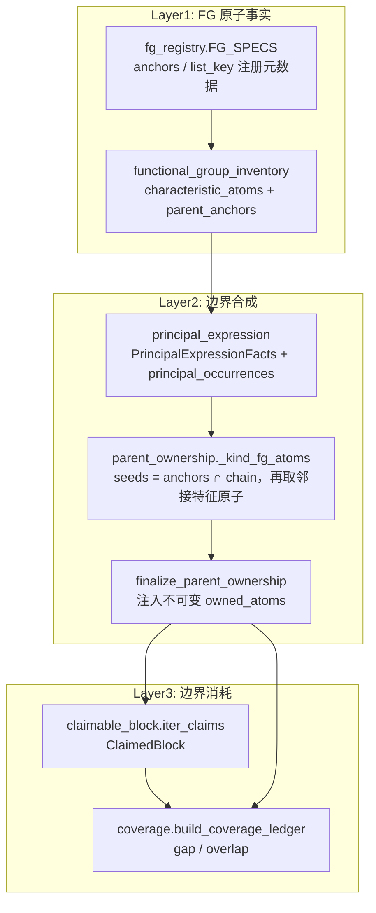
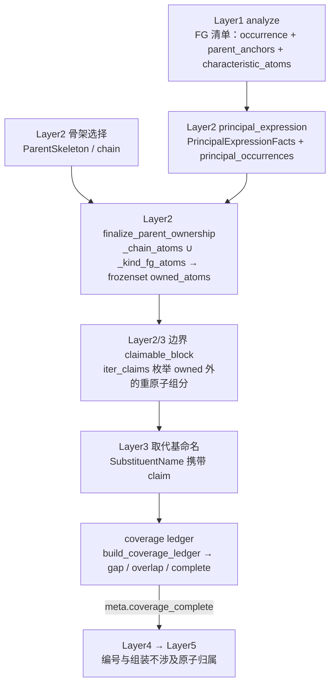

# 原子归属 (Atom Ownership)

> **概念层级:** 跨层核心概念 | **涉及层次:** Layer1 (提供 FG 原子事实)、Layer2 (合成边界)、Layer3 (消耗边界)
> **核心数据结构:** `owned_atoms: frozenset[int]` | `PrincipalExpressionFacts` | `ClaimedBlock` | `CoverageLedger`

---

## 概述

在 NamePredict 的 6 层命名流水线中，**原子归属 (atom ownership)** 是一个贯穿 Layer1、Layer2 和 Layer3 的基础概念。它定义了分子中每个重原子（即非氢原子）的"所有权"——哪些原子属于母体 (parent)，哪些原子属于取代基 (substituent)，以及是否存在 gap（未被任何实体声明的原子）或 overlap（被多个实体重复声明的原子）。

IUPAC 命名的本质是：选定一个母体结构作为骨架，然后将分子其余部分描述为连接在该骨架上的取代基。原子归属机制精确地划定了这条边界，确保每个原子被恰好一次 ——不遗漏、不重复——分配给了正确的命名实体。

三层的分工是：**Layer1 的官能团清单为每个 occurrence 计算特征原子集与母体锚点**（`functional_group_inventory.py`），**Layer2 把锚点对齐到选定骨架上并合成不可变的 `owned_atoms`**（`parent_ownership.py`），**Layer3 在边界外枚举并命名取代基**（`claimable_block.iter_claims`），最后由 `coverage.build_coverage_ledger` 统计 gap/overlap。



## 母体拥有的原子 (Owned Atoms)

### 计算模型

母体拥有的原子集合 `owned_atoms` 是两个子集的 **并集**：

1. **骨架原子 (Chain Atoms):** 母体骨架（开链链原子或环系环原子）的全部原子索引，由 `parent["chain"]` 字段提供。
2. **官能团特征原子 (FG Characteristic Atoms):** 母体主官能团中"锚点落在骨架内（或直接与骨架相邻）"的那些锚点，以及它们**直接相连**的特征原子（O、N、S、卤素等），由 `_kind_fg_atoms()` 计算。

```
owned_atoms = chain_atoms ∪ _kind_fg_atoms(parent, mol)
```

> **源:** `src/namepredict/layer2/parent_ownership.py:32-34`
> ```python
> def compute_owned_atoms(parent: dict, mol: Mol) -> frozenset[int]:
>     """链与主官能团特征原子的并集（末端所有权集合）。"""
>     return frozenset(_chain_atoms(parent) | _kind_fg_atoms(parent, mol))
> ```

`_kind_fg_atoms()`（`parent_ownership.py:12-29`）的输入全部来自 Layer1 清单经 Layer2 转写后的两个 parent 字段，算法为四步：

| 步骤 | 表达式 | 源码 |
|------|--------|------|
| 1. 取锚点 | `anchors = ∪ occurrence.parent_anchors` | `parent_ownership.py:19` |
| 2. 取特征原子 | `atoms = ∪ occurrence.characteristic_atoms`（并集为空时退回 `facts.characteristic_atoms`） | `parent_ownership.py:20` |
| 3. 锚点对齐骨架 | `seeds = anchors ∩ chain` | `parent_ownership.py:21` |
| 3'. 环外兜底 | `seeds` 为空时改取 `anchors ∩ (chain 原子的邻居)` —— 覆盖 exocyclic 基团（苯甲酸的羧基碳不与环直接同属 `chain`） | `parent_ownership.py:22-24` |
| 4. 邻接扩展 | `out = seeds ∪ { seeds 的邻居中属于 atoms 且不是 anchor 者 }`（单轮扩展，不回代） | `parent_ownership.py:25-28` |

两个前提字段由 Layer2 的表达阶段写入：

- `parent["principal_occurrences"]` —— **全部**主官能团 occurrence（不限本次骨架覆盖），`FunctionalGroupOccurrence` 元组，取自 `selection.occurrences`；
- `parent["principal_expression_facts"]` —— `PrincipalExpressionFacts`（含 `characteristic_atoms` / `anchor_atoms` / `attachment_atoms`）。

> **源:** `src/namepredict/layer2/principal_expression.py:130-138`（`_parent_dict`）、`principal_expression.py:33-43`（facts 结构）、`principal_expression.py:119-127`（`_facts` 汇总）

`_parent_dict` 的注释明确了 `principal_occurrences` 取全量而非本骨架子集的原因：未被本骨架覆盖的同级基团（多酯的第二个酯等）仍属母体，若漏掉其羰基氧会被 L3 切成假羟基前缀。`principal_expression_facts` 缺失时 `_kind_fg_atoms` 直接返回空集（`parent_ownership.py:16-17`），此时 `owned_atoms` 退化为 `chain`。

### L1 侧的原子事实来源

Layer1 只提供"原子事实"，不做归属判定；归属所需的两个集合在清单构建期就已随每条 occurrence 落定：

| 事实 | 生产者 | 说明 |
|------|--------|------|
| FG 类别与检测 key | `fg_registry.FG_SPECS`（`fg_registry.py:32-61`） | 14 条 `FgSpec` 的跨层注册元数据；`anchors` 字段声明该类别 occurrence payload 里的锚点 key，`list_key` 指向 analyzer 的检测列表 |
| occurrence 清单 | `analyzer._collect_fgs`（`analyzer.py:477-482`）→ `build_inventory`（`functional_group_inventory.py:115-119`） | L1 单一 FG 出口：`_detect_parts`（`analyzer.py:462-475`）检测、`_arbitrate_parts`（`analyzer.py:447-459`）做 P-41 仲裁 |
| `parent_anchors` | `functional_group_inventory.py:55`（`_ANCHOR_KEYS` 由 `FG_SPECS.anchors` 派生）→ `_indices`（`:92-96`） | 按类取 payload 中的锚点索引：**羧酸/醛/酮/酯/酰胺/腈/酰卤/酰基/自由基取 `center_idx`；醇/硫醇/胺取 `surr_idx`** |
| `characteristic_atoms` | `_characteristic_atoms`（`functional_group_inventory.py:99-104`） | 默认规则 `center_surr_atoms`（`:79-85`）= `{center_idx} ∪ surr_idx`；例外表 `FG_ATOM_FNS`（`:88-90`）只登记 `phosphate` → `_phosphate_atoms`（`:73-76`，P + 全部 O 邻居） |

> **源:** `src/namepredict/layer1/functional_group_inventory.py:107-112`（`_one` 组装 occurrence）

因此"某个 FG 拥有哪些异原子"这一事实的**唯一来源是 L1 检测阶段写入 payload 的 `center_idx`/`surr_idx`**（检测函数见 `analyzer.py:214-436`、`acyl_halide.py:43-52`、`analyzer.py:44-101`）；Layer2 侧没有按 FG 类别分派的归属函数。

### 不可变性

`owned_atoms` 被存储为 Python `frozenset[int]` 类型，在 Layer2 最终确定后 **不可修改**。这个不可变性保证了 Layer3 提取取代基时不会意外地修改母体边界，也避免了官能团原子的重复计入。

> **源:** `src/namepredict/layer2/parent_ownership.py:37-41`
> ```python
> def finalize_parent_ownership(parent: dict, mol: Mol) -> dict:
>     """一次性复制候选，生成不可变 owned_atoms frozenset。"""
>     if isinstance(parent.get("owned_atoms"), frozenset):
>         return parent
>     return {**parent, "owned_atoms": compute_owned_atoms(parent, mol)}
> ```

若 `parent` 字典中已经存在 `frozenset` 类型的 `owned_atoms` 字段，则直接返回原字典（幂等保障），避免重复计算。

调用点有两处：Layer2 候选终态化 `parent_selector._finalize_ranked`（`parent_selector.py:57-67`），以及 L3 入口前的 `namer._prepare_candidate`（`namer.py:139`）。

### 骨架原子

作为所有母体的共同基础，骨架原子由 `_chain_atoms()` 获取：

> **源:** `src/namepredict/layer2/parent_ownership.py:7-9`
> ```python
> def _chain_atoms(parent: dict) -> set[int]:
>     """取母体链原子集合。"""
>     return set(parent.get("chain") or ())
> ```

`chain` 由 Layer2 表达阶段写为 `list(skeleton.atom_ids)`（`principal_expression.py:135`），**环骨架的环原子同样进 `chain`**——例如苯酚 `chain=[1..6]`、苯甲酸乙酯 `chain=[5..10]`。仅当候选未能选出骨架时 `chain` 才为空（此时 `namer._prepare_candidate` 提前失败，`namer.py:142-143`）。

### 按 FG 类型的异原子归属

14 个已注册 FG 类别（`fg_registry.py:32-61`）的归属逐项如下。所有类别都遵循同一算法：**锚点在骨架内（或紧邻骨架）→ 该锚点 + 其直接相连的特征原子进所有权**；"特征原子"由 L1 检测 payload 决定。

| FG 类别 | anchors key（`FG_SPECS`） | L1 特征原子集 | 归属结果（并含 `chain`） | 源码锚点 |
|---------|--------------------------|---------------|--------------------------|----------|
| radical | `center_idx`（`fg_registry.py:33`） | `{C}`（`surr_idx` 为空） | `{C}` | `analyzer.py:427-436` |
| acyl | `center_idx`（`:36`） | `{C_acyl} ∪ {=O}` | `{C_head} ∪ {=O}`（=O 归母体，不落 oxo 前缀） | `analyzer.py:420-424`、`analyzer.py:262-264` |
| acid | `center_idx`（`:39`） | `{C} ∪ {=O} ∪ {–OH}` | 每个羧基 `{C} ∪ {=O} ∪ {–OH}` | `analyzer.py:253-260`、`analyzer.py:107-111` |
| phosphate | `p_idx`（`:41`） | `{P} ∪ {O×4}` | `{P} ∪ {=O} ∪ {O_single × 3}` | `functional_group_inventory.py:73-76`、`:88-90` |
| anhydride | 未声明（`:42`） | — | 规则缺失，见下 | `analyzer.py:313-321` |
| ester | `center_idx`（`:43`） | `{C} ∪ {=O} ∪ {–O–}` | `{C_ester} ∪ {=O} ∪ {–O–}`，不含烷氧臂 | `analyzer.py:288-295` |
| acyl_halide | `center_idx`（`:45`） | `{C} ∪ {=O} ∪ {X}` | `{C_acyl} ∪ {=O} ∪ {X}`（X = F/Cl/Br/I） | `analyzer.py:283-286`、`acyl_halide.py:43-52` |
| amide | `center_idx`（`:46`） | `{C} ∪ {=O} ∪ {N}` | `{C_amide} ∪ {=O} ∪ {N}` | `analyzer.py:270-277` |
| nitrile | `center_idx`（`:48`） | `{C} ∪ {N}` | `{C_nitrile} ∪ {N≡}` | `analyzer.py:361-370` |
| aldehyde | `center_idx`（`:50`） | `{C} ∪ {=O}` | `{C_aldehyde} ∪ {=O}`；环上外环 `-CHO` 同样按此（anchor 经环外兜底命中） | `analyzer.py:279-281` |
| ketone | `center_idx`（`:52`） | `{C} ∪ {=O}` | `{C_carbonyl} ∪ {=O}` | `analyzer.py:266-268` |
| alcohol | `surr_idx`（`:55`） | `{C_attach} ∪ {O}` | 每个羟基 `{C_attach} ∪ {–OH}` | `analyzer.py:214-220` |
| thiol | `surr_idx`（`:57`） | `{C_attach} ∪ {S}` | `{C_attach} ∪ {–SH}` | `analyzer.py:222-231` |
| amine | `surr_idx`（`:59`） | `{N} ∪ {全部碳臂}` | `{C_attach} ∪ {N}`；链外碳臂留边界外 | `analyzer.py:244-251` |

要点说明：

- **多官能团实例取并集。** `_kind_fg_atoms` 对 `principal_occurrences` 的**每一条** occurrence 求 `parent_anchors`/`characteristic_atoms` 后再并集（`parent_ownership.py:19-20`），因此丁烷-2,3-二酮的两个羰基氧都被纳入母体。
- **锚点同时也是特征原子时不重复加入**（`n.GetIdx() not in anchors` 过滤，`parent_ownership.py:28`）。
- **醇/硫醇/胺的锚点用 `surr_idx`（连接碳）而非中心杂原子**：这些基团的 payload 中心是 O/S/N，`center_idx` 不作锚点使用；杂原子本身在步骤 4 中作为"锚点的特征原子邻居"进入所有权。
- **胺只纳入链内碳臂**：`surr_idx` 是 N 的全部碳邻居，但只有落在 `chain` 内的臂成为 seed（`parent_ownership.py:21`），其余臂（如三乙胺的两个乙基）留在边界外，由 L3 作为取代基提取。
- **`ketone` 的归属恰为 `{C} ∪ {=O}`**：乙酰基类酮（苯乙酮）的甲基碳位于骨架 `chain` 内，由 `_chain_atoms` 侧纳入，无需额外字段。

#### 环内酮、内酯与硫代内酯

环内单碳羰基的锚点即环内羰基碳，本身在 `chain` 内直接成为 seed；环内 O/S 作为骨架原子随 `chain` 一并进入 `owned_atoms`。此类分子走酮母体的判定在 L1：`_is_ketone_carbon`（`analyzer.py:129-145`）经 `_has_ring_hetero_neighbor`（`analyzer.py:125-127`）取 `constants.RING_HETERO = {N, O, S}`（`constants.py:36`），故 `thiolan-2-one` 这类硫代内酯、N-酰基环胺也走酮母体。环外部分（如 N-酰基环胺的吡咯烷环）仍在母体边界之外、由 Layer3 作为取代基提取。

#### 醚与硫醚

`FG_SPECS` 不登记 `ether`/`sulfide` 类别（`fg_registry.py:32-61`），`FunctionalGroupClass` 也没有对应枚举值（`functional_group_inventory.py:10-26`）。醚/硫醚分子因此没有"醚氧归母体"这条规则：`CCOCC`（乙醚）选出 kind `alkane` 母体、`owned_atoms = {0, 1}`（只有两个碳，不含醚氧），醚氧随外部组分进入 `ClaimedBlock`（slot `chain_c`）由 L3 命名；`CSC`（二甲硫醚）同理，`owned_atoms = {0}`（只含一个甲基碳），S 与另一甲基留在边界外；`CSCCO`（2-(methylthio)ethanol）的醇母体也只拥有 `{2, 3, 4}`（OH 与两个碳），S 与甲基硫臂在边界外。

#### 酸酐

`FgSpec("anhydride", "anhydrides", p41=8)`（`fg_registry.py:42`）未声明 `anchors`，`FG_ATOM_FNS`（`functional_group_inventory.py:88-90`）也没有 anhydride 分支，故该类别不产出任何 FG 异原子。同时当前检测路径不可达：`_anhydride_entries`（`analyzer.py:313-321`）对每个酸酐碳调用 `_anhydride_entry`，后者在 `analyzer.py:303` 引用未定义的 `other` 名并抛出 `NameError`；不含酸酐碳的分子则返回空列表。因此 `anhydrides` occurrence 不会进入清单，酸酐母体不经由归属路径产生。

#### 酰卤与酰基残基

- **酰卤**：卤素经 `surr_idx` 进入 acyl_halide 的 `characteristic_atoms`（`acyl_halide.py:43-48`；`HALO_Z` 见 `constants.py:35`），在步骤 4 中作为锚点邻居进入 `owned_atoms`。`parent["hal_idx"]`/`hal_z` 仍由 `_chain_acyl_halide_fields`（`principal_expression.py:432-443`）写入供 L5 选词干，但**当前所有权计算不读 `hal_idx`**。
- **酰基残基 / 环外酰基头**（苯甲酰、furan-2-carbonyl）：锚点是羰基头碳，其锚定 `*` 使骨架为环，锚点不在 `chain` 内 → 走环外兜底（`parent_ownership.py:22-24`）成为 seed，羰基 =O 作为其特征原子邻居进入 `owned_atoms`（=O 归母体，不落 oxo 前缀）。

#### 磷酸

`_one_phosphate`（`analyzer.py:44-95`）要求整个分子的重原子恰好 = P 中心 + 4 个 O + 各 O–R 臂组分，因此磷酸母体的 `chain` 只含 P 中心一个原子（`OP(=O)(O)O` → `chain=[1]`，`CCCCCCOP(=O)(O)O` → `chain=[7]`）。锚点 `p_idx` 在 `chain` 内直接成为 seed，4 个氧（=O 与 3 个单键 O）作为特征原子邻居全部进入 `owned_atoms`，共 5 个原子。桥氧归母体，O 上的烷基臂在母体边界之外，由 Layer3 以 `o_side` 取代基提取（`constants.ESTER_O_SIDE_KINDS` 含 `"phosphate"`，`constants.py:156`；`claim_extract.py:81`），最终由 L5 `phosphate_names` 拼进磷酸酯整名。

### FG 原子聚合

FG 原子的聚合发生在 **Layer1 的清单构建期**：`build_inventory`（`functional_group_inventory.py:115-119`）遍历 `_LIST_CLASSES`（`:53`，由 `FG_SPECS.list_key` 派生）为每条检测条目调用 `_one`（`:107-112`），一次算出 `parent_anchors` 与 `characteristic_atoms` 并固化进 `FunctionalGroupOccurrence`（`:29-37`）。Layer2 的 `_kind_fg_atoms`（`parent_ownership.py:12-29`）只做"锚点对齐骨架 + 单轮邻接扩展"的收尾并集，不含任何按 FG 类别的分派。

这种"清单承载事实、L2 只做几何收尾"的设计使得扩展一个新的 FG 类别只需三处落点，不必改 Layer2 归属逻辑：

1. `FG_SPECS` 加一条 `FgSpec`（声明 `list_key`、`anchors`，`fg_registry.py:32-61`）；
2. `analyzer._detect_parts` 加检测函数并登记列表键（`analyzer.py:462-475`）；
3. 特征原子不符合通用 `center_surr_atoms` 规则时，在 `FG_ATOM_FNS` 加例外（`functional_group_inventory.py:88-90`）。

## ClaimedBlock 与 SideSlot

### 从母体边界到取代基声明

当 `owned_atoms` 确定后，Layer3 的工作是将所有 **不在** `owned_atoms` 中的重原子组件识别为取代基。`ClaimedBlock` 是这一过程的中间数据结构，它记录了取代基原子块的基本拓扑信息。

### ClaimedBlock 数据结构

```python
@dataclass(frozen=True)
class ClaimedBlock:
    slot: SideSlot       # 母体侧连接点的化学角色
    attach_parent: int   # 母体上被连接的原子索引
    root: int            # 取代基侧的根原子索引
    atoms: frozenset[int]  # 取代基包含的所有重原子
```

> **源:** `src/namepredict/layer3/claimable_block.py:20-26`

`ClaimedBlock` 是一个冻结的 dataclass，不可变，保证在命名过程中不会被意外修改。它只承载拓扑，不含名字；命名结果由 `SubstituentName`（`claim` + `en`/`zh`/`requires_parentheses`，`substituent_namer.py:14-19`）承载。

### SideSlot 枚举

`SideSlot` 描述了母体侧连接点的化学环境，影响取代基的命名通道与排序：

| 枚举值 | 含义 | 判断条件 | 源码 |
|--------|------|----------|------|
| `CHAIN_C` | 母体链碳上的连接 | 连接原子是碳、不在环中 | `claimable_block.py:58-60, 69-71` |
| `RING_C` | 母体环碳上的连接 | 连接原子是碳、在环中 | `claimable_block.py:58-60, 69-71` |
| `AMIDE_N` | 酰胺（或胺）氮上的连接 | 连接原子原子序数 7，且存在"在 owned 内 + 与 N 以单键相连"的碳邻居（`_owned_carbonyl_c`） | `claimable_block.py:44-48, 32-41` |
| `AMINE_N` | 胺氮上的连接（保留槽位） | `_is_amine_n` 当前在元素/芳香/成环校验之后直接 `return False`，故该槽位不被产出 | `claimable_block.py:50-55, 67-68` |
| `OTHER` | 其他杂原子的连接 | 不满足以上任何条件 | `claimable_block.py:72` |

> **源:** `src/namepredict/layer3/claimable_block.py:11-17`（枚举定义）、`claimable_block.py:63-72`（`derive_slot`）

`derive_slot()` 仅根据母体侧已归属原子的化学环境判断槽位类型，先判 `AMIDE_N`、再判 `AMINE_N`，最后按连接原子的元素与成环状态落到碳槽位或 `OTHER`。

注意 `_owned_carbonyl_c`（`claimable_block.py:32-41`）只校验"邻居在 owned 内、是碳、与 N 单键相连"，**不校验该碳带双键氧**；`_is_amide_n`（`:44-48`）只额外校验原子序数 7。因此胺氮（如三乙胺的 N）同样落 `AMIDE_N` 槽位，`_is_amine_n` 的分支在其之前已被 `AMIDE_N` 截获。

槽位到取代基 `kind` 的映射表在 `constants.CLAIM_KIND`（`constants.py:154-155`）：`amide_n`/`amine_n` → `n_block`，`ring_c`/`chain_c` → `alkyl`，未登记槽位经 `_claim_kind`（`claim_extract.py:10-12`）退回默认 `"side"`。`n_block` 属 `constants.N_PREFIX_KINDS`（`constants.py:39`），走 N- 前缀通道。

### 声明块的生成

`claim_block()` 函数负责创建单个 ClaimedBlock：

1. 验证 `attach_parent` 确实在 `owned_atoms` 内（否则连接点不在母体中，无效）
2. 验证 `root` 确实在母体外、是重原子且是 `attach_parent` 的邻居（`_is_outside_root`）
3. 通过 `cut_block()` 从 root 出发、绕开母体原子割出整个连通块
4. 验证该组件仅有 **唯一一个** 连接回母体的点（多连接点=桥连=不是简单取代基，返回 None）

> **源:** `src/namepredict/layer3/claimable_block.py:92-108`（`claim_block`）、`:85-90`（`_is_outside_root`）、`src/namepredict/tools/block_cut.py:46-51`（`cut_block`）

组件级入口是 `_try_claim()`（`claimable_block.py:136-149`）：先取组件与母体之间的 canonical 边（`_canonical_edge`，`:111-121`），再用 `_has_dbl_o_edge`（`:123-133`）滤掉"经双键连 owned 重原子的外部氧"（羰基/砜等主 FG 成分由主提取器命名，不切成假羟基侧链），最后由 `derive_slot` 定槽位。

`iter_claims()` 遍历所有外部重原子组件：`_unique_components`（`claimable_block.py:152-161`）经 `side_roots`（`block_cut.py:19-24`，母体原子的外部重原子邻居）取得起点、`cut_block` 割块并去重，为每个组件建立 claim。结果按 `(attach_parent, root, slot.value)` 三元组排序，保证输出顺序确定。

> **源:** `src/namepredict/layer3/claimable_block.py:163-170`

## Coverage Ledger: Gap 与 Overlap 验证

### 完整性约束

原子归属的正确性由一个核心约束定义：**分子的每个重原子必须恰好被一个命名实体覆盖**。这意味着：

- 母体声明了其骨架原子 + 官能团特征原子的所有权
- 每个取代基声明了其原子块的所有权
- 两个集合的并集必须覆盖所有重原子（无 gap）
- 两个集合的交集必须为空（无 overlap）

### CoverageLedger 数据结构

```python
@dataclass(frozen=True)
class CoverageLedger:
    owned_atoms: frozenset[int]
    named_claims: tuple[SubstituentName, ...]
    gap: frozenset[int]       # 未被任何实体覆盖的重原子
    overlap: frozenset[int]   # 被多个实体重复覆盖的重原子

    @property
    def complete(self) -> bool:
        return not self.gap and not self.overlap
```

> **源:** `src/namepredict/layer3/coverage.py:12-23`

### 构建过程

`build_coverage_ledger()` 函数构造覆盖台账：

1. 从 RDKit Mol 对象获取所有重原子集合（`_heavy_atoms`）
2. 计算所有被覆盖原子的并集：`owned_atoms ∪ (每个 SubstituentName 的 claim.atoms)`（`_covered_atoms`）
3. gap = 所有重原子 - 被覆盖原子
4. 计算每个原子的"被计数次数"：`owned_atoms` 中计 1 次，每个 claim 的原子各计 1 次（`_membership_counts`）
5. overlap = 计数次数 > 1 的原子集合（`_overlap_atoms`）

> **源:** `src/namepredict/layer3/coverage.py:57-72`（入口）、`:26-54`（四个辅助函数）

### gap 与 overlap 的含义

- **gap (缺口):** 存在某个重原子既不属于母体也不属于任何取代基。这通常意味着母体边界定义不完整（`_kind_fg_atoms` 未把某个特征原子纳入）。gap 原子是母体边界漏原子的信号。

- **overlap (重叠):** 存在某个重原子同时被母体和某个取代基声明，或被多个取代基重复声明。这通常意味着：
  - 母体的 FG 特征原子归属有遗漏，导致某个原子未能被母体声明，反而被取代基错误地提取
  - 或者取代基切割逻辑未能正确地尊重母体边界

### 在流水线中的位置

Coverage Ledger 在 Layer3 提取取代基之后、编号与组装之前构建。在 `namer.py` 中：

```python
subst = extract_substituents(info, parent, cache=cache)
complete = _ledger_complete(mol, parent["owned_atoms"], subst)
```

> **源:** `src/namepredict/namer.py:144-145`（`_prepare_candidate` 内）

`_ledger_complete()`（`namer.py:63-65`）以 `names=[]` 调用 `build_coverage_ledger`，因此当前门控等价于"`owned_atoms` 是否覆盖全部重原子"：`gap = 重原子 − owned_atoms`，`overlap` 恒为空集。该布尔值随候选结果记入 `meta.coverage_complete`（`namer.py:170`），供并列候选比较与外部诊断使用；真正的提前失败条件是 `owned_atoms` 为空或既无 `chain` 又无环（`namer.py:140-143`）。

## 原子归属的生命周期



文字化摘要（与上图对应）：

```
Layer1 (analyze)
  └→ 检测全部 FG，为每条 occurrence 计算 parent_anchors 与 characteristic_atoms
     （analyzer._detect_parts → build_inventory，未确立归属关系）

Layer2 (parent_selector / principal_expression)
  └→ 选定母体骨架，chain = list(skeleton.atom_ids)
  └→ 写出 principal_expression_facts 与 principal_occurrences
  └→ finalize_parent_ownership() 计算 owned_atoms
      ├── _chain_atoms: 骨架原子（开链链原子或环系环原子）
      └── _kind_fg_atoms: seeds = anchors ∩ chain（环外兜底取骨架邻居）+ 邻接特征原子
  └→ owned_atoms 以 frozenset 冻结，不可变更

Layer2/3 边界 (claimable_block)
  └→ iter_claims() 遍历 owned_atoms 外的所有重原子组件
  └→ 为每个组件创建 ClaimedBlock (slot + attach_parent + root + atoms)

Layer3 (substituent_extractor / claim_extract)
  └→ 以 owned_atoms 为边界，在边界外提取并命名取代基
  └→ build_coverage_ledger() 统计 gap/overlap

Layer4 → Layer5
  └→ 编号和名称组装不涉及原子归属（边界已在之前确立）
```

## 相关页面

- [[architecture/layer1-analyzer]] — Layer1 分析器，产出 FG 清单与 occurrence 的锚点/特征原子
- [[architecture/layer2-parent-selector]] — Layer2 母体选择器，决定 owned_atoms 的内容
- [[architecture/layer3-substituents]] — Layer3 取代基提取器，基于 owned_atoms 边界提取取代基
- [[concepts/functional-group-priority]] — 官能团优先级，决定哪个 FG 成为母体主要官能团
- [[architecture/overview]] — 6 层架构总览
- [[reference/core-data-contracts]] — 核心数据契约（parent dict 字段规范）
