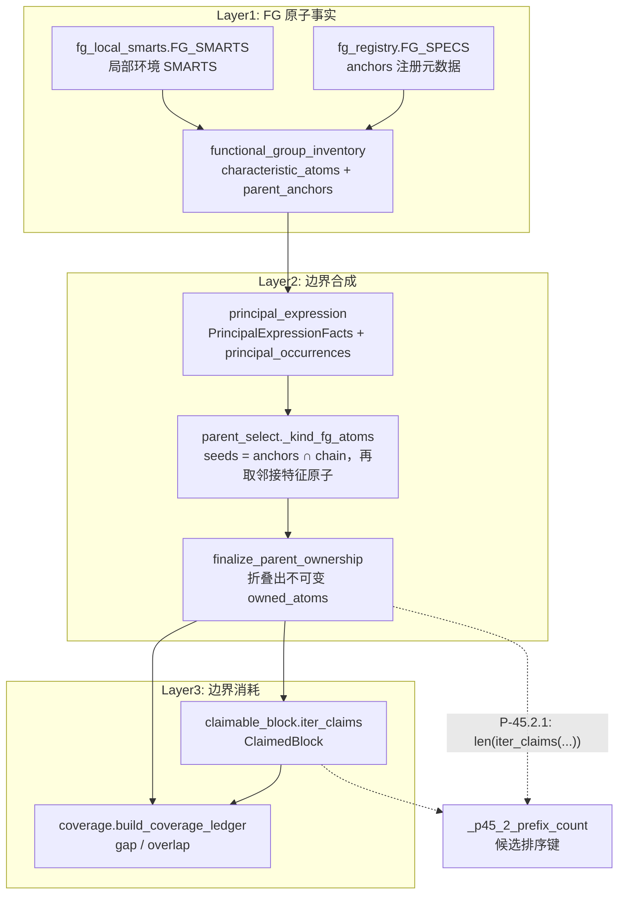
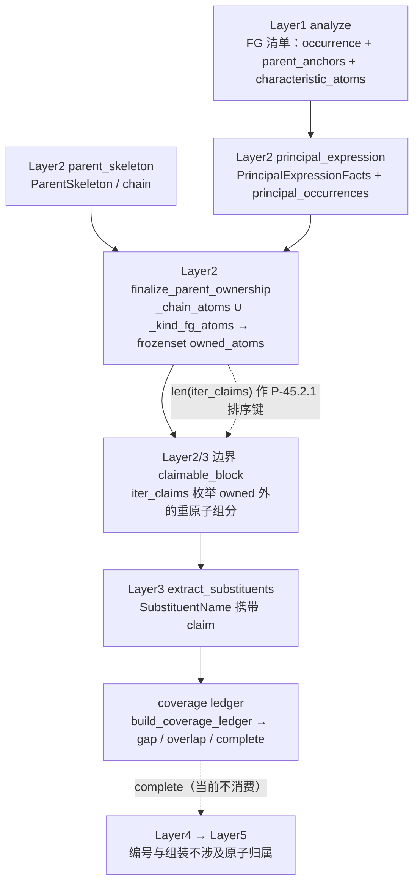

# 原子归属 (Atom Ownership)

> **概念层级:** 跨层核心概念 | **涉及层次:** Layer1 (提供 FG 原子事实)、Layer2 (合成边界)、Layer3 (消耗边界)
> **核心数据结构:** `owned_atoms: frozenset[int]` | `FunctionalGroupOccurrence` | `PrincipalExpressionFacts` | `ClaimedBlock` | `CoverageLedger`
> **最后更新:** 2026-09-15

---

## 概述

在 NamePredict 的 6 层命名流水线中，**原子归属 (atom ownership)** 是一个贯穿 Layer1、Layer2 和 Layer3 的基础概念。它定义了分子中每个重原子（即非氢原子）的"所有权"——哪些原子属于母体 (parent)，哪些原子属于取代基 (substituent)，以及是否存在 gap（未被所有权声明的原子）或 overlap（被重复声明的原子）。

IUPAC 命名的本质是：选定一个母体结构作为骨架，然后将分子其余部分描述为连接在该骨架上的取代基。原子归属机制精确地划定了这条边界，确保每个原子被恰好一次——不遗漏、不重复——分配给正确的命名实体。

三层的分工是：**Layer1 的官能团清单为每个 occurrence 计算特征原子集与母体锚点**（`functional_group_inventory.py`），**Layer2 把锚点对齐到选定骨架上并合成不可变的 `owned_atoms`**（`parent_select.py:58-88`），**Layer3 在边界外枚举并命名取代基**（`claimable_block.iter_claims`），最后由 `coverage.build_coverage_ledger` 统计 gap/overlap。

`owned_atoms` 是双向使用的：L3 以它为几何边界向外切取代基；L2 又以"边界外 claim 的个数"作 P-45.2.1 的候选排序键（`parent_select._p45_2_prefix_count`），即归属边界同时是取代基计数基准。



## 母体拥有的原子 (Owned Atoms)

### 计算模型

母体拥有的原子集合 `owned_atoms` 是两个子集的 **并集**：

1. **骨架原子 (Chain Atoms):** 母体骨架（开链链原子或环系环原子）的全部原子索引，由 `parent["chain"]` 字段提供。
2. **官能团特征原子 (FG Characteristic Atoms):** 母体主官能团中"锚点落在骨架内（或直接与骨架相邻）"的那些锚点，以及它们**直接相连**的特征原子（O、N、S、卤素等），由 `_kind_fg_atoms()`（`parent_select.py:63-80`）计算。

```
owned_atoms = chain_atoms ∪ _kind_fg_atoms(parent, mol)
```

> **源:** `src/namepredict/layer2/parent_select.py:83-88`
> ```python
> def finalize_parent_ownership(parent: dict, mol: Mol) -> dict:
>     """一次性复制候选，生成不可变 owned_atoms frozenset。"""
>     if isinstance(parent.get("owned_atoms"), frozenset):
>         return parent
>     owned = frozenset(_chain_atoms(parent) | _kind_fg_atoms(parent, mol))  # 链与主官能团特征原子的并集
>     return {**parent, "owned_atoms": owned}
> ```

`_kind_fg_atoms()` 的输入全部来自 Layer1 清单经 Layer2 转写后的两个 parent 字段，算法为四步：

| 步骤 | 表达式 | 源码 |
|------|--------|------|
| 1. 取锚点 | `anchors = ∪ occurrence.parent_anchors` | `parent_select.py:70` |
| 2. 取特征原子 | `atoms = ∪ occurrence.characteristic_atoms` | `parent_select.py:71` |
| 3. 锚点对齐骨架 | `seeds = anchors ∩ chain` | `parent_select.py:72` |
| 3'. 环外兜底 | `seeds` 为空时改取 `anchors ∩ (chain 原子的邻居)` —— 覆盖 exocyclic 基团（苯甲酸的羧基碳不与环直接同属 `chain`） | `parent_select.py:73-75` |
| 4. 邻接扩展 | `out = seeds ∪ { seeds 的邻居中属于 atoms 且不是 anchor 者 }`（单轮扩展，不回代） | `parent_select.py:76-79` |

`principal_expression_facts` 缺失时 `_kind_fg_atoms` 直接返回空集（`parent_select.py:67-68`），此时 `owned_atoms` 退化为 `chain`。

两个前提字段由 Layer2 的表达阶段写入：

- `parent["principal_occurrences"]` —— **全部**主官能团 occurrence（不限本次骨架覆盖），`FunctionalGroupOccurrence` 元组，取自 `selection.occurrences`；
- `parent["principal_expression_facts"]` —— `PrincipalExpressionFacts`（含 `characteristic_atoms` / `anchor_atoms` / `attachment_atoms`）。

> **源:** `src/namepredict/layer2/principal_expression.py:125-131`（`_parent_dict`）、`principal_expression.py:32-42`（facts 结构）、`principal_expression.py:114-122`（`_facts` 汇总）、`principal_expression.py:255` / `:435-436`（两处调用点传入 `selection.occurrences`）

`_parent_dict` 的注释明确了 `principal_occurrences` 取全量而非本骨架子集的原因：未被本骨架覆盖的同级基团（多酯的第二个酯等）仍属母体，若漏掉其羰基氧会被 L3 切成假羟基前缀。实测丁烷-2,3-二酮 `CC(=O)C(C)=O` 的单一酮母体拥有全部 6 个重原子 `{0,1,2,3,4,5}`（两个羰基氧都并入），即两条 `ketone` occurrence 的并集结果。

### L1 侧的原子事实来源

Layer1 只提供"原子事实"，不做归属判定；归属所需的两个集合在清单构建期就已随每条 occurrence 落定。`FunctionalGroupOccurrence`（`functional_group_inventory.py:28-36`）的六个字段为 `id` / `group_class` / `characteristic_atoms` / `parent_anchors` / `payload` / `demoted`，其中 `id` 形如 `"acid:0"`（`f"{key}:{index}"`，`functional_group_inventory.py:110`）。

| 事实 | 生产者 | 说明 |
|------|--------|------|
| FG 类别与检测 key | `fg_registry.FG_SPECS`（`fg_registry.py:20-33`） | 13 条 `FgSpec` 的跨层注册元数据；`anchors` 字段声明该类别 occurrence payload 里的锚点 key |
| 局部环境检测 | `fg_local_smarts.FG_SMARTS`（`fg_local_smarts.py:26-51`）→ `match_local_fg`（`:68`） | 每条 `(FG 键, SMARTS)` 的模式首原子即中心原子，同名多条取并集；新增官能团只加表项，不改检测代码 |
| occurrence 清单 | `analyzer._collect_fgs`（`analyzer.py:181-186`）→ `build_inventory`（`functional_group_inventory.py:114-118`） | L1 单一 FG 出口：`_detect_parts`（`analyzer.py:167-179`）检测、`_arbitrate_parts`（`analyzer.py:141`）做 P-41 仲裁 |
| `parent_anchors` | `functional_group_inventory.py:54`（`_ANCHOR_KEYS` 由 `FG_SPECS.anchors` 派生）→ `_indices`（`:91-95`） | 按类取 payload 中的锚点索引：**羧酸/醛/酮/酯/酰胺/腈/酰卤/酰基/自由基取 `center_idx`；醇/硫醇/胺取 `surr_idx`** |
| `characteristic_atoms` | `_characteristic_atoms`（`functional_group_inventory.py:98-103`） | 默认规则 `center_surr_atoms`（`:78-84`）= `{center_idx} ∪ surr_idx`；例外表 `FG_ATOM_FNS`（`:87-89`）只登记 `phosphate` → `_phosphate_atoms`（`:72-75`，P + 全部 O 邻居） |

> **源:** `src/namepredict/layer1/functional_group_inventory.py:106-111`（`_one` 组装 occurrence）

`surr_idx` 由 `_surr_idx`（`analyzer.py:89-93`）产出，带一条过滤：**碳中心不在环内时，环内的重原子邻居被排除**。因此苯甲酰基的 `surr_idx` 只含羰基氧（苯环 ipso 碳被滤掉），而环内羰基碳的 `surr_idx` 保留全部环内邻居（δ-戊内酯 `C1COC(=O)C1` 的酯氧因此进入母体所有权）。

因此"某个 FG 拥有哪些异原子"这一事实的**唯一来源是 L1 检测阶段写入 payload 的 `center_idx`/`surr_idx`**（检测表 `fg_local_smarts.py:26-51`、`_radical_entry`（`analyzer.py:131-133`）、`_fg_entry`（`analyzer.py:95-97`）、`_phosphate_entry`（`analyzer.py:58`））；Layer2 侧没有按 FG 类别分派的归属函数。

### 不可变性

`owned_atoms` 被存储为 Python `frozenset[int]` 类型，在 Layer2 最终确定后 **不可修改**。这个不可变性保证了 Layer3 提取取代基时不会意外地修改母体边界，也避免了官能团原子的重复计入。

若 `parent` 字典中已经存在 `frozenset` 类型的 `owned_atoms` 字段，则直接返回原字典（幂等保障），避免重复计算（`parent_select.py:85-86`）。

调用点有两处：Layer2 候选终态化 `_finalize_ranked`（`parent_select.py:116-125`，经 `pack_parent_stem` 补词干后调用），以及 L3 入口前的 `namer._prepare_candidate`（`namer.py:121`）。

### 骨架原子

作为所有母体的共同基础，骨架原子由 `_chain_atoms()` 获取：

> **源:** `src/namepredict/layer2/parent_select.py:58-60`
> ```python
> def _chain_atoms(parent: dict) -> set[int]:
>     """取母体链原子集合。"""
>     return set(parent.get("chain") or ())
> ```

`chain` 由 Layer2 表达阶段写为 `list(skeleton.atom_ids)`（`principal_expression.py:128`），**环骨架的环原子同样进 `chain`**——例如苯酚 `chain=[0..5]`、苯甲酸乙酯 `chain=[5..10]`（实测苯酚 `c1ccccc1O` 的 `owned_atoms = {0,1,2,3,4,5,6}`）。仅当候选未能选出骨架时 `chain` 才为空（此时 `namer._prepare_candidate` 提前失败，`namer.py:123-124`）。

### 按 FG 类型的异原子归属

13 个已注册 FG 类别（`fg_registry.py:20-33`）的归属逐项如下。所有类别都遵循同一算法：**锚点在骨架内（或紧邻骨架）→ 该锚点 + 其直接相连且不在锚点集内的特征原子进所有权**；"特征原子"由 L1 检测 payload 决定。

| FG 类别 | anchors key（`FG_SPECS`） | L1 特征原子集（`center_idx ∪ surr_idx`） | 归属结果（并含 `chain`） |
|---------|--------------------------|------------------------------------------|--------------------------|
| radical | `center_idx`（`fg_registry.py:21`） | `{X}`（`_radical_entry` 的 `surr_idx=[]`） | `{X}` |
| acyl | `center_idx`（`:22`） | `{C_acyl} ∪ {=O} ∪ {C_α 若不在环内}` | `{C_acyl} ∪ {=O}`（=O 归母体，不落 oxo 前缀） |
| acid | `center_idx`（`:23`） | `{C} ∪ {=O} ∪ {–OH}` | 每个羧基 `{C} ∪ {=O} ∪ {–OH}` |
| phosphate | `p_idx`（`:24`） | `{P} ∪ {O×4}`（`_phosphate_atoms`） | `{P} ∪ {=O} ∪ {O_single × 3}` |
| ester | `center_idx`（`:25`） | `{C} ∪ {=O} ∪ {–O–}` | `{C_ester} ∪ {=O} ∪ {–O–}`，不含烷氧臂碳 |
| acyl_halide | `center_idx`（`:26`） | `{C} ∪ {=O} ∪ {X}` | `{C_acyl} ∪ {=O} ∪ {X}`（X = F/Cl/Br/I） |
| amide | `center_idx`（`:27`） | `{C} ∪ {=O} ∪ {N}` | `{C_amide} ∪ {=O} ∪ {N}` |
| nitrile | `center_idx`（`:28`） | `{C} ∪ {N}` | `{C_nitrile} ∪ {N≡}` |
| aldehyde | `center_idx`（`:29`） | `{C} ∪ {=O} ∪ {C_α 若不在环内}` | `{C_aldehyde} ∪ {=O}`；环上外环 `-CHO` 同样按此（anchor 经环外兜底命中） |
| ketone | `center_idx`（`:30`） | `{C} ∪ {=O} ∪ {两个碳邻居}` | `{C_carbonyl} ∪ {=O}`（α-碳通常已在 `chain` 内） |
| alcohol | `surr_idx`（`:31`） | `{C_attach} ∪ {O}` | 每个羟基 `{C_attach} ∪ {–OH}` |
| thiol | `surr_idx`（`:32`） | `{C_attach} ∪ {S}` | `{C_attach} ∪ {–SH}` |
| amine | `surr_idx`（`:33`） | `{N} ∪ {全部碳臂}` | `{C_attach} ∪ {N}`；链外碳臂留边界外 |

要点说明：

- **多官能团实例取并集。** `_kind_fg_atoms` 对 `principal_occurrences` 的**每一条** occurrence 求 `parent_anchors`/`characteristic_atoms` 后再并集（`parent_select.py:70-71`），因此丁烷-2,3-二酮的两个羰基氧都被纳入母体。
- **锚点同时也是特征原子时不重复加入**（`n.GetIdx() not in anchors` 过滤，`parent_select.py:79`）。
- **醇/硫醇/胺的锚点用 `surr_idx`（连接碳）而非中心杂原子**：这些基团的 payload 中心是 O/S/N，`center_idx` 不作锚点使用；杂原子本身在步骤 4 中作为"锚点的特征原子邻居"进入所有权。实测乙醇 `CCO` → `chain=[0,1]`、`owned_atoms={0,1,2}`。
- **胺只纳入链内碳臂**：`surr_idx` 是 N 的全部碳邻居，但只有落在 `chain` 内的臂成为 seed（`parent_select.py:72`）。三乙胺 `CCN(CC)CC` 的并列候选组给出 3 个候选（chain 分别为 `[0,1]`/`[4,3]`/`[6,5]`），每个候选的 `owned_atoms` 都是"该乙基 + N"，另外两条臂留在边界外由 L3 作为取代基提取。
- **`ketone` 的归属恰为 `{C} ∪ {=O}`**：乙酰基类酮（苯乙酮）的甲基碳位于骨架 `chain` 内，由 `_chain_atoms` 侧纳入，无需额外字段；`surr_idx` 的碳邻居也已在 `chain` 内，重复并入不影响结果。实测丙酮 `CC(=O)C` → `chain=[0,1,3]`、`owned_atoms={0,1,2,3}`。

#### 环内酮、内酯与硫代内酯

环内单碳羰基的锚点即环内羰基碳，本身在 `chain` 内直接成为 seed。该类别由 `FG_SMARTS` 的酮分支承接：`_RING_HET`（`fg_local_smarts.py:21`）声明环内杂原子邻居 `~[#7,#8,#16;R]`，`constants.RING_HETERO = {N, O, S}`（`constants.py:36`）记录同一事实。故 `O=C1CCCS1` 这类硫代内酯走酮母体：实测 `kind='ketone'`、`chain=[1,2,3,4,5]`、`owned_atoms={0,1,2,3,4,5}`（环内 S 随 `chain` 进入所有权）。环内零碳分支（`_NOT_ACYCLIC_ESTER`）使 `C1COC(=O)C1` 同样走酮母体，且环内酯氧经 `surr_idx` 进入 `owned_atoms`。环外部分（如 N-酰基环胺的吡咯烷环）仍在母体边界之外、由 Layer3 作为取代基提取。

#### 醚与硫醚

`FG_SPECS` 不登记 `ether`/`sulfide` 类别（`fg_registry.py:20-33`），`FunctionalGroupClass` 也没有对应枚举值（`functional_group_inventory.py:10-25`，14 个值含 `NONE = 'alkane'`）。醚/硫醚分子因此没有"醚氧归母体"这条规则：`CCOCC`（乙醚）选出 kind `alkane` 母体、`owned_atoms = {0, 1}`（只有两个碳，不含醚氧），醚氧随外部组分进入 `ClaimedBlock`（slot `chain_c` 或 `other`）由 L3 命名；`CSC`（二甲硫醚）同理，`owned_atoms = {0}`（只含一个甲基碳），S 与另一甲基留在边界外；`CSCCO`（2-(methylthio)ethanol）的醇母体也只拥有 `{2, 3, 4}`（OH 与两个碳），S 与甲基硫臂在边界外。

#### 酰卤与酰基残基

- **酰卤**：卤素经 `surr_idx` 进入 acyl_halide 的 `characteristic_atoms`（`HALO_Z` 见 `constants.py:35`），在步骤 4 中作为锚点邻居进入 `owned_atoms`。`parent["hal_idx"]`/`hal_z` 仍由 `_chain_acyl_halide_fields`（`principal_expression.py:394-405`）与环骨架路径（`:253-254`）写入供 L5 选词干，但**所有权计算不读 `hal_idx`**。
- **酰基残基 / 环外酰基头**（苯甲酰、furan-2-carbonyl）：锚点是羰基头碳，其锚定 `*` 使骨架为环，锚点不在 `chain` 内 → 走环外兜底（`parent_select.py:73-75`）成为 seed，羰基 =O 作为其特征原子邻居进入 `owned_atoms`（=O 归母体，不落 oxo 前缀）。实测苯甲酸 `c1ccccc1C(=O)O` → `chain=[0..5]`、`owned_atoms={0..8}`（环 6 碳 + 羧基 C + =O + OH）。

#### 磷酸

`_phosphate_entry`（`analyzer.py:58`）要求整个分子的重原子恰好 = P 中心 + 4 个 O + 各 O–R 臂组分，因此磷酸母体的 `chain` 只含 P 中心一个原子（实测 `OP(=O)(O)O` → `chain=[1]`、`owned_atoms={0,1,2,3,4}`，共 5 个原子；`CCCCCCOP(=O)(O)O` → `chain=[7]`、`owned_atoms={6,7,8,9,10}`）。锚点 `p_idx` 在 `chain` 内直接成为 seed，4 个氧（=O 与 3 个单键 O）作为特征原子邻居全部进入 `owned_atoms`。桥氧归母体，O 上的烷基臂在母体边界之外，由 Layer3 以 `o_side` 取代基提取（`constants.ESTER_O_SIDE_KINDS` 含 `"phosphate"`，`constants.py:143`；`substituent_extractor.py:53`），最终由 L5 `phosphate_names` 拼进磷酸酯整名。

### FG 原子聚合

FG 原子的聚合发生在 **Layer1 的清单构建期**：`build_inventory`（`functional_group_inventory.py:114-118`）遍历 `_FG_KEYS`（`:52`，由 `FG_SPECS` 派生）为每条检测条目调用 `_one`（`:106-111`），一次算出 `parent_anchors` 与 `characteristic_atoms` 并固化进 `FunctionalGroupOccurrence`。Layer2 的 `_kind_fg_atoms` 只做"锚点对齐骨架 + 单轮邻接扩展"的收尾并集，不含任何按 FG 类别的分派。

这种"清单承载事实、L2 只做几何收尾"的设计使得扩展一个新的 FG 类别只需三处落点，不必改 Layer2 归属逻辑：

1. `FG_SPECS` 加一条 `FgSpec`（声明 `anchors`，`fg_registry.py:20-33`）；
2. `FG_SMARTS` 加检测模式并登记到 `_LOCAL_ENTRY_FGS`（`fg_local_smarts.py:26-51`、`analyzer.py:157-158`）；
3. 特征原子不符合通用 `center_surr_atoms` 规则时，在 `FG_ATOM_FNS` 加例外（`functional_group_inventory.py:87-89`）。

### 反向使用：P-45.2.1 前缀计数

`owned_atoms` 不只是 L3 的输入，它同样是 L2 候选排序的基准。`_p45_2_prefix_count`（`parent_select.py:97-101`）就地 import L3 的 `iter_claims`（`claimable_block.py:123`），以 `len(iter_claims(mol, parent["owned_atoms"]))` 作为候选的 P-45.2.1 键；`_reorder_p45_2`（`parent_select.py:104-113`）按该计数**降序**稳定重排，`tied=True` 时只保留并列最大组作为 `select_parent`（`:128-131`）的返回值。

```
select_parent(info)                                   # parent_select.py:128
├─ _collect_candidates(info)                          # :91
├─ _finalize_ranked(info, cands)                      # :116  pack_parent_stem → finalize_parent_ownership
└─ _reorder_p45_2(info, cands, tied=True)             # :104  _p45_2_prefix_count 降序 → 只留并列最大组
       └─ _p45_2_prefix_count                        # :97   len(iter_claims(mol, owned_atoms))
```

这条反向依赖的含义是：**归属边界越紧（边界外组分越多），候选排序键越高**。实测三乙胺 3 个并列候选的计数键均为 2（两条链外乙基臂），苯甲酸乙酯类候选的键为 1。计数的具体口径由 `iter_claims` 决定（§ClaimedBlock 与 SideSlot），`_has_dbl_o_edge` 与单附着点校验都会影响计入的 claim 个数。

## ClaimedBlock 与 SideSlot

### 从母体边界到取代基声明

当 `owned_atoms` 确定后，Layer3 的工作是将所有 **不在** `owned_atoms` 中的重原子连通组分识别为取代基。`ClaimedBlock` 是这一过程的中间数据结构，它记录了取代基原子块的基本拓扑信息。

### ClaimedBlock 数据结构

```python
@dataclass(frozen=True)
class ClaimedBlock:
    slot: SideSlot       # 母体侧连接点的化学角色
    attach_parent: int   # 母体上被连接的原子索引
    root: int            # 取代基侧的根原子索引
    atoms: frozenset[int]  # 取代基包含的所有重原子
```

> **源:** `src/namepredict/layer3/claimable_block.py:19-25`

`ClaimedBlock` 是一个冻结的 dataclass，不可变，保证在命名过程中不会被意外修改。它只承载拓扑，不含名字；命名结果由 `SubstituentName`（`claim` + `en`/`zh`/`requires_parentheses`，`substituent_namer.py:14-19`）承载。

### SideSlot 枚举

`SideSlot` 描述了母体侧连接点的化学环境，影响取代基的命名通道与排序，共 **4 个值**：

| 枚举值 | 含义 | 判断条件 | 源码 |
|--------|------|----------|------|
| `CHAIN_C` | 母体链碳上的连接 | 连接原子是碳、不在环中 | `claimable_block.py:39-40` |
| `RING_C` | 母体环碳上的连接 | 连接原子是碳、在环中 | `claimable_block.py:39-40` |
| `AMINE_N` | 胺氮上的连接 | `_is_amine_n`：连接原子原子序数 7、非芳香、非环员 | `claimable_block.py:28-31, 36-37` |
| `OTHER` | 其他杂原子的连接 | 不满足以上任何条件 | `claimable_block.py:41` |

> **源:** `src/namepredict/layer3/claimable_block.py:11-16`（枚举定义）、`claimable_block.py:34-41`（`derive_slot`）

`derive_slot()` 仅根据母体侧已归属原子的化学环境判断槽位类型。实测 `CC(=O)Nc1ccccc1`（乙酰苯胺）的 N 全局满足 `_is_amine_n`（非芳香、非环员），苯基臂落 `AMINE_N`；三乙胺的两条链外乙基臂同样落 `AMINE_N`。芳香胺 N 与环员 N 不满足 `_is_amine_n`，均落 `OTHER`（环 N 由环上位次定位，见 [[architecture/layer3-substituents]]）。

槽位到取代基 `kind` 的映射表在 `constants.CLAIM_KIND`（`constants.py:141-142`），**只有 3 个键**：`amine_n` → `n_block`，`ring_c` → `alkyl`，`chain_c` → `alkyl`；未登记槽位（`other`）经 `_claim_kind`（`substituent_extractor.py:12-14`）退回默认 `"side"`。`n_block` 属 `constants.N_PREFIX_KINDS`（`constants.py:39`），走 N- 前缀通道；`sub_from_named`（`substituent_extractor.py:17-29`）另有环员 N 改写（`:23`）：kind 属 N- 前缀通道而附着原子 `IsInRing()` 时改用 `ring_c` 的 `alkyl`。

O 侧臂不走槽位通路：`extract_substituents`（`substituent_extractor.py:43-57`）在遍历前算一次 `o_side`（`kind ∈ ESTER_O_SIDE_KINDS` 或存在 `o_idx` 字段，`:53`），仅当 claim 的连接原子确为 O 时打上 `s["o_side"] = True`（`_append_named`，`:38`）。实测乙酸乙酯 `CCOC(=O)C` 的乙氧臂落 `OTHER` 槽位（连接原子是酯氧）并带 `o_side` 标记。

### 声明块的生成

`claim_block()` 函数负责创建单个 ClaimedBlock（`claimable_block.py:53-68`）：

1. 验证 `attach_parent` 确实在 `owned_atoms` 内（否则连接点不在母体中，无效）
2. 通过 `cut_block()` 从 root 出发、绕开母体原子割出整个连通块
3. 验证块非空，且该组件仅有 **唯一一个** 连接回母体的点（`_attach_parents_of`，`:44-51`，只数重原子邻居；多连接点=桥连=不是简单取代基，返回 None）

> **源:** `src/namepredict/layer3/claimable_block.py:53-68`、`src/namepredict/tools/block_cut.py:42-47`（`cut_block`）

组件级入口是 `_try_claim()`（`claimable_block.py:96-109`）：先取组件与母体之间的 canonical 边（`_canonical_edge`，`:71-81`，取最小 `(attach_parent, root)` 对），再用 `_has_dbl_o_edge`（`:83-93`）滤掉"含经双键连 owned 内**非碳**重原子的氧"的组分（砜/亚砜/磷酰等主 FG 成分由主命名路径承担，不切成假羟基侧链），最后由 `derive_slot` 定槽位。

`iter_claims()`（`claimable_block.py:123-130`）遍历所有外部重原子组件：`_unique_components`（`:112-121`）经 `side_roots`（`block_cut.py:15-20`，母体原子的外部重原子邻居）取得起点、`cut_block` 割块并按原子集去重，为每个组件建立 claim。结果按 `(attach_parent, root, slot.value)` 三元组排序，保证输出顺序确定。

## Coverage Ledger: Gap 与 Overlap 验证

### 完整性约束

原子归属的正确性由一个核心约束定义：**分子的每个重原子必须恰好被一个命名实体覆盖**。这意味着：

- 母体声明了其骨架原子 + 官能团特征原子的所有权
- 每个取代基声明了其原子块的所有权
- 两个集合的并集必须覆盖所有重原子（无 gap）
- 两个集合的交集必须为空（无 overlap）

### CoverageLedger 数据结构

```python
@dataclass(frozen=True)
class CoverageLedger:
    owned_atoms: frozenset[int]
    named_claims: tuple[SubstituentName, ...]
    gap: frozenset[int]       # 未被所有权覆盖的重原子
    overlap: frozenset[int]   # 被重复声明的重原子

    @property
    def complete(self) -> bool:
        return not self.gap and not self.overlap
```

> **源:** `src/namepredict/layer3/coverage.py:12-23`

### 构建过程

`build_coverage_ledger()`（`coverage.py:26-42`）构造覆盖台账：

1. 从 RDKit Mol 对象获取所有重原子集合 `heavy`（`GetAtomicNum() != 1`，含哑原子）
2. **`gap = heavy - owned_atoms`**（`:40`）—— 口径只扣所有权，不扣 claims：未被 `owned_atoms` 覆盖的重原子即为缺口
3. `counts` 以 `Counter(owned_atoms)` 起算，再 `update` 每个 `SubstituentName.claim.atoms`（`:34-36`）
4. **`overlap = {i | counts[i] > 1}`**（`:41`）—— 被重复计数的原子，即 owned 与 claim 之间、或 claim 彼此之间的重复声明

> **源:** `src/namepredict/layer3/coverage.py:26-42`

### gap 与 overlap 的含义

- **gap (缺口):** 存在某个重原子不属于母体所有权。这通常意味着母体边界定义不完整（`_kind_fg_atoms` 未把某个特征原子纳入），也可能来自未命名成功的 claim——`extract_substituents` 对命名返回 `None` 的 claim 静默跳过（`substituent_extractor.py:35-36`），其原子最终只能体现为 `gap`。gap 是母体边界漏原子的信号。

- **overlap (重叠):** 存在某个重原子被重复声明。管线内部`iter_claims` 产出的 claim 原子按构造位于 `owned_atoms` 之外（`cut_block` 拒绝穿越 owned）且互不重叠（`_unique_components` 按原子集去重），故 **`overlap` 在管线内恒为空集**；它是对调用方传入 claim 的契约校验——诊断路径手工重建 `SubstituentName` 时，若原子集与 owned 或彼此相交即在此暴露。

### 在流水线中的位置

Coverage Ledger 在 Layer3 提取取代基之后、编号与组装之前构建。`namer._prepare_candidate`（`namer.py:116-128`）是唯一调用点：

```python
parent = finalize_parent_ownership(parent, mol)
if not parent.get("owned_atoms"):
    return parent, [], False
if not parent.get("chain") and not info.get("has_ring"):
    return parent, [], False
subst = extract_substituents(info, parent, cache=cache)
complete = build_coverage_ledger(mol, owned_atoms=parent["owned_atoms"], names=[]).complete
return parent, subst, complete
```

> **源:** `src/namepredict/namer.py:121-128`

`names=[]` 使 `overlap` 恒空，`gap = 重原子 − owned_atoms`，故 `complete` 等价于"`owned_atoms` 是否覆盖全部重原子"。该布尔值作为三元组的第三项返回，`_try_phase`（`namer.py:145-154`）解包但**不消费**它，也不写入 `meta`；成功候选一律在 `meta` 标注 `fallback = "no_coverage_gate"`（`namer.py:151`）。真正的提前失败条件只有两条：`owned_atoms` 为空（`:122-123`），或既无 `chain` 又无环（`:124-125`）。

带真实 `names` 的台账只在诊断路径构建：`routes_debug` 用 `extract_substituents` 的原子集重建 `SubstituentName` 后调 `build_coverage_ledger`（`server/backend/routes_debug.py:142, 220`），把 `complete`/`gap`/`overlap` 一并输出到 L3 段结果。测试侧同样以 `names=[]` 校验并列母体组内至少有一个候选覆盖完整（`tests/unit/test_architecture_contracts.py:563`）。

## 原子归属的生命周期



文字化摘要（与上图对应）：

```
Layer1 (analyze)
  └→ 检测全部 FG，为每条 occurrence 计算 parent_anchors 与 characteristic_atoms
     （analyzer._detect_parts → build_inventory，未确立归属关系）

Layer2 (parent_skeleton / principal_expression / parent_select)
  └→ 选定母体骨架，chain = list(skeleton.atom_ids)
  └→ 写出 principal_expression_facts 与 principal_occurrences
  └→ finalize_parent_ownership() 计算 owned_atoms
      ├── _chain_atoms: 骨架原子（开链链原子或环系环原子）
      └── _kind_fg_atoms: seeds = anchors ∩ chain（环外兜底取骨架邻居）+ 邻接特征原子
  └→ owned_atoms 以 frozenset 冻结，不可变更
  └→ _reorder_p45_2 以 len(iter_claims(mol, owned_atoms)) 降序重排候选（P-45.2.1）

Layer2/3 边界 (claimable_block)
  └→ iter_claims() 遍历 owned_atoms 外的所有重原子组件
  └→ 为每个组件创建 ClaimedBlock (slot + attach_parent + root + atoms)

Layer3 (substituent_extractor / coverage)
  └→ 以 owned_atoms 为边界，在边界外提取并命名取代基
  └→ build_coverage_ledger() 统计 gap/overlap（管线内以 names=[] 调用）

Layer4 → Layer5
  └→ 编号和名称组装不涉及原子归属（边界已在之前确立）
```

## 相关页面

- [[architecture/layer1-analyzer]] — Layer1 分析器，产出 FG 清单与 occurrence 的锚点/特征原子
- [[architecture/layer2-parent-selector]] — Layer2 母体选择器，决定 owned_atoms 的内容
- [[architecture/layer3-substituents]] — Layer3 取代基提取器，基于 owned_atoms 边界提取取代基
- [[concepts/functional-group-priority]] — 官能团优先级，决定哪个 FG 成为母体主要官能团
- [[architecture/overview]] — 6 层架构总览
- [[reference/core-data-contracts]] — 核心数据契约（parent dict 字段规范）
