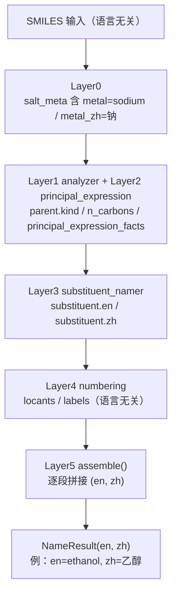

# 中英双语命名约定 (Bilingual Naming Convention)

> **概念层级:** 跨层核心概念 | **涉及层次:** Layer0 (盐元数据)、Layer2 (kind 与词尾选择)、Layer3 (取代基递归命名)、Layer4 (位次/字母序)、Layer5 (双语名称组装)
> **核心数据结构:** `(en, zh)` 元组 | `_Chain` (chain_engine) | `_KIND_TABLE` | `NameResult(en, zh)`
> **最后更新:** 2026-09-15

---

## 概述

NamePredict 的核心设计决策之一是从管线起点到终点**同步生成英文与中文两套 IUPAC 名称**。不存在"先生成英文再翻译为中文"的二次处理阶段——每一层、每一个函数，都同时产出或传递双语名称。这一约定贯穿全部 6 层架构，是 NamePredict 区别于仅支持单语言的命名引擎的根本特征。

**管线中的双语数据流：**

## 核心约定：`(en, zh)` 元组

整个 Layer5 组装管线中，所有名称生成函数遵循一个统一的返回值约定：**返回 `tuple[str, str] | None`，其中第一个元素为英文名、第二个元素为中文名**。这一约定确保了函数的可组合性——上游的输出可以直接作为下游的输入，无需额外转换。少数辅助函数的形状不同：`free_to_yl`（`src/namepredict/layer5/assembler.py:178`）返回 `(en, zh, need_paren)` 三元组，第三位是中英两侧共用的围栏标记；`_mononuclear_en`（`assembler.py:151`）只加工英文侧，`_mononuclear_zh`（`assembler.py:161`）只加工中文侧，两者由 `_fg_prefix`（`assembler.py:172`）成对约束——任一语言未命中即整体返回 `None`。

### 管线的双语流水线

以 `assemble()` 函数（`src/namepredict/layer5/assembler.py:500`）为例，每一步都操作 `(en, zh)` 对：

| 步骤 | 函数 | 语义 | 位置 |
|---|---|---|---|
| 1 | `_ensure_fused_stem(numbered)` | 未注册稠环词干注入（返回 bool，非名称） | `assembler.py:250` |
| 2 | `_names_for(kind, n, numbered)` | 母体名称 → `(en, zh) \| None` | `assembler.py:301` |
| 3 | `join_hydro_prefix(names, numbered)` | hydro + 指示氢前缀 | `assembler.py:448` |
| 4 | `join_ring_cation_suffix(numbered, names)` | 环内 N⁺/O⁺ 母体名缀 `-{位次}-ium` | `assembler.py:461` |
| 5 | `_prefix_for(numbered, kind, n)` | 取代基前缀 → `(pre_en, pre_zh)` | `assembler_prefixes.py:296` |
| 6 | `join_kind_name(kind, pre, names, numbered)` | 前缀 + 母体拼接；酯走 `join_ester_name`（`assembler.py:413`）、磷酸走 `join_phosphate_name`（`assembler.py:279`） | `assembler.py:427` |
| 7 | `join_anion_names(numbered, en, zh)` | 羧酸根转换 | `stems.py:64` |
| 8 | `join_ez_prefix` / `join_rs_prefix` | E/Z 与 R/S 立体化学 | `stereo.py:125` / `stereo.py:248` |
| 9 | `_apply_salt_suffix(result, salt)` | 盐后缀（在 `assemble` 之外、由 `namer` 调用） | `namer.py:172` |

每一步都是纯文本转换：输入 `(en, zh)`，输出 `(en, zh)`。这种设计具有三个优点：

1. **可测试性**：每个步骤可以独立验证其中英双语输出的正确性。
2. **可追踪性**：当名称出现错误时，可以精确定位到出错的步骤（例如中文盐后缀错位但英文正确）。
3. **可扩展性**：新增官能团命名时，只需在 `_KIND_TABLE` 增加一个 `_Chain` 条目或实现一个新的 `(kind, n, numbered) -> (en, zh) | None` worker。

### 母体名称派发中的双语约定

`_names_for`（`src/namepredict/layer5/assembler.py:301`）是整个 L5 的双语派发枢纽，按以下顺序收敛到唯一的 `(en, zh)`：

1. `kind == "radical"` 且母体带 `radical_anchor_element` → `_mononuclear_radical_names`（`assembler.py:305`，定义于 `assembler.py:190`），走单核氢化物去氢管线；
2. 查 `chain_engine._KIND_TABLE`（`chain_engine.py:457`）；`acyl_halide` 再按 `parent["hal_z"]` 覆盖为 `_ACYL_HALIDE_BY_HAL` 中的逐卤素 spec（`assembler.py:308`，表在 `chain_engine.py:418`）；
3. 母体为苯单取代（`scaffold_id == "benzene"`）时按 kind 直取 `_BENZENE_RETAINED`（`assembler.py:323-326`，表在 `chain_engine.py:444`）；苯的纯烃 base 直接给 `("benzene", "苯")`（`assembler.py:313-314`）；
4. 母体已注入 `stem_en`/`stem_zh`（稠环/杂环/保留模板）时，把词干与 `coda=""` 覆盖进 `_Chain` spec（`assembler.py:315-317`）；
5. 未注册稠环的无 FG 情形回落 `_parent_stem_names`（`assembler.py:332`）。

每个 worker 都是返回 `(en, zh)` 或 `None` 的双语函数——返回 `None` 时派发链降级到下一策略，全部失败则由 `_unsupported`（`assembler.py:338`）产出 `success=False`。这种"尝试-失败-降级"模式在双语的上下文中尤其重要——如果一个命名策略返回了英文名但无法生成中文名（或反之），则整个结果不被接受。

## 三层分工：词表 / 词干 / kind 分派

双语名称的文本来源被切成三层，职责边界互不重叠：**跨层词表集中在 `constants.py`**（唯一存放处）、**碳数词干派生集中在 `layer5/stems.py`**、**kind → 词尾的分派集中在 `chain_engine._KIND_TABLE`**。

```mermaid
flowchart LR
    subgraph C["constants.py — 跨层词表（195 行）"]
        C1["数值词 en_num_term / zh_numeral<br/>派生 MULT_EN / MULT_ZH"]
        C2["保留名 CHAIN_RETAINED / AMIDO_RETAINED<br/>RETAINED_FUSION_ALIASES"]
        C3["单核氢化物 MONONUCLEAR_HYDRIDES<br/>及其 MONONUCLEAR_* 派生表"]
        C4["L5 组装词表 EXO_RING_SUF / BIS_EN 与 BIS_ZH<br/>BRIDGE_SUFFIX_EN 与 BRIDGE_SUFFIX_ZH / ALKOXY_YLOXY_*"]
    end
    subgraph S["layer5/stems.py — 词干派生（104 行）"]
        S1["C1–C10 基表 _ALKANE_*_BASE"]
        S2["_en_stem / alkane_en / alkane_zh<br/>zh_num / zh_stem"]
        S3["join_anion_names / join_metal_salt_names"]
    end
    subgraph K["layer5/chain_engine.py — kind 分派（529 行）"]
        K1["_KIND_TABLE：15 个 _Chain spec"]
        K2["_chain_names 统一渲染"]
        K3["_PHOSPHATE_TAIL / _BENZENE_RETAINED<br/>/_ACYL_HALIDE_BY_HAL"]
    end
    C --> S
    C --> K
    S --> K
    K --> A["layer5/assembler.py<br/>拼前缀 → 拼母体 → 缀盐"]
```

### `constants.py` 的分节结构

`constants.py`（195 行）只放**跨层共享的词表与纯数据**，不含逻辑分支，按注释分节：

| 分节 | 内容 | 位置 |
|---|---|---|
| 原子序数 | `H`/`C`/`N`/`O`/`P`/`S`/`Cl`/`Br`/`I`/`Na`/`K` 等元素符号常量 | `constants.py:5-32` |
| 常用集合 | `HALO_Z`、`RING_HETERO`、`HALO_ZH`/`HALIDE_EN`（卤素中英文）、`N_PREFIX_KINDS`、`P25_SENIOR`/`P145_SENIOR` | `constants.py:35-42` |
| 跨层 kind 集合 | `NAME_KIND`（锚定保留叶子名 → kind）、`CLAIM_KIND`、`ESTER_O_SIDE_KINDS` | `constants.py:136-143` |
| 数值词 | `en_num_term(n)`（英文 1–99，末带 'a'）/ `zh_numeral(n)`（中文 1–99，1 返空串）及其派生 `MULT_EN` / `MULT_ZH` | `constants.py:56` / `:76` / `:87-88` |
| 酰胺保留名 | `AMIDO_RETAINED` 与英文名集合 `AMIDO_RETAINED_EN` | `constants.py:94` / `:99` |
| L0 电荷归一与盐解离 | `DONOR_KIND`、`ACCEPTOR_Z`、`ACID_CENTERS`、`ALKALI_EN`（原子序数→英文金属名）、`METAL_ZH`（英文金属名→中文） | `constants.py:102-110` |
| L2-L5 单核母体氢化物 | `MONONUCLEAR_HYDRIDES`（free 名、(元素, 中文名)、零价去氢名、桥后缀、组装名中文尾五元组）及 `MONONUCLEAR_ZERO_YL`/`MONONUCLEAR_BRIDGE`/`MONONUCLEAR_YL`/`PHOSPHORYL_STEMS` | `constants.py:113-130` |
| L3 取代基词表 | `SIMPLE_ALKOXY_NO_PAREN`（简单保留烷氧基免括号白名单） | `constants.py:133-135` |
| L4 位次/编号 | `HYDRO_MULT_N`、`TRADITIONAL_NUMBERING_IDS`、`RS_HI`/`RS_LO` | `constants.py:146-152` |
| L5 组装词表 | `BIS_EN`/`BIS_ZH`、`BRIDGE_SUFFIX_EN`/`BRIDGE_SUFFIX_ZH` 及其 `-yl` 型派生 `BRIDGE_YL_SUFFIX`/`BRIDGE_ZH_YL_SUFFIX`、`EXO_RING_SUF`、`AZANE_PAREN_SUF`、`ALKOXY_YLOXY_EN`/`ALKOXY_YLOXY_ZH`、`CHAIN_RETAINED`、`RETAINED_FUSION_ALIASES`、`HS_NUMBER` | `constants.py:155-195` |

几条易被误用的词表语义：

- `EXO_RING_SUF`（`constants.py:161`）是**两元组** `(singular, plural|None)`：`singular` 为 `(en, zh)` 单取代后缀（如 `("carboxylic acid", "羧酸")` / `("carbaldehyde", "甲醛")`），`plural` 为多取代后缀基底或 `None`（酯/酰胺/腈/酰基四类无多取代系统名）。覆盖 acid/aldehyde/ester/amide/nitrile/acyl 六类，消费方是 `chain_engine._exo_ring_spec`（`chain_engine.py:298`）。
- `CLAIM_KIND`（`constants.py:141`）只映射三个 claim 槽位：`amine_n`→`n_block`，`ring_c`/`chain_c`→`alkyl`。
- `zh_bridge_root(name)`（`constants.py:90`）是函数而非表：剥掉中文烃基名末尾的「基」，供桥后缀前拼接。英文侧无对应函数——英文用 `di-`/`tri-` 表达同一倍增。消费点为 `assembler.py:169`（乙基-氧化烷 → 乙氧基）与 `assembler.py:228`（`dimethylamino` ↔ `二甲氨基`）。
- `HS_NUMBER`（`constants.py:195`）是「甲乙丙丁戊己庚辛壬癸」天干串，中文链碳数词干的数据源；`ZH_DIGITS`（`constants.py:53`）是「一二三…九」，供 `zh_numeral` 与 `assembler._phosphate_arm_zh`（`assembler.py:269`）使用。两者口径不同，不可互换。

### `stems.py`：碳数词干派生

`layer5/stems.py`（104 行）只做一件事：把碳数 n 变成双语词干，并把酸/盐词尾做语言特定的翻转。它从 `constants` 取词（`stems.py:5`），自身不定义任何跨层共享数据。

| 函数 | 语义 | 位置 |
|---|---|---|
| `_ALKANE_EN_BASE` / `_ALKANE_ZH_BASE` | C1–C10 保留/系统基干（methane…decane ↔ 甲烷…癸烷），两表同 key 严格一一对应 | `stems.py:8` / `stems.py:12` |
| `zh_num(n)` | 中文链碳数词干：1–10 取天干串 `HS_NUMBER`（甲…癸），11+ 复用 `constants.zh_numeral` | `stems.py:19` |
| `zh_stem(zh_full)` | 中文全名剥末端官能团/母体后缀（十一烷→十一） | `stems.py:26` |
| `_en_stem(n)` | 不含 `ane` 的英文烷烃词干；C11+ 由 `en_num_term(n)[:-1]` 去尾 'a'（undec/icos） | `stems.py:34` |
| `alkane_en(n)` / `alkane_zh(n)` | 烷烃双语全名（C1–C10 查基表，C11–C99 生成） | `stems.py:42` / `stems.py:48` |
| `acid_to_anion_en` / `join_anion_names` | `-oic/-ic acid` → `-oate/-ate`；中文补「根」 | `stems.py:55` / `stems.py:64` |
| `_metal_prefix` / `_metal_en_prefix` / `_metal_zh_suffix` | 金属名加数量前缀，数量词分别取 `MULT_EN` / `MULT_ZH` | `stems.py:71` / `:81` / `:86` |
| `join_metal_salt_names` | 盐后缀总入口：碱金属盐 + HCl 酸式盐 | `stems.py:91` |

`_ZH_SUFFIXES`（`stems.py:16`，`("酰胺", "酰氯", "硫醇", "烷", "醇", "酸", "醛", "腈", "胺", "酮", "烯", "炔")`）按长后缀在前、短后缀在后的顺序匹配，且要求 `len(zh_full) > len(s)`——避免把 `酮` 之类短后缀从更长后缀尾部误切。无任何后缀命中时原样返回，故 `zh_stem` 对任意中文字符串安全。消费点唯一：`chain_engine._chain_zh_base`（`chain_engine.py:208-211`）用它把 `alkane_zh(n)` 去「烷」得词干。

`zh_num` 供 `alkane_zh`（`stems.py:48-53`）生成 C11+ 中文长链名（十一烷、三十五烷）；英文侧不存在对应函数，因为英文 C11+ 词干由 `constants.en_num_term` 去尾 'a' 派生（数量词与母链碳数同源），倍数前缀侧的中文数值词另走 `constants.zh_numeral`。

### `_KIND_TABLE`：kind → 词尾分派

`chain_engine.py` 的 `_KIND_TABLE`（`chain_engine.py:457`）是 kind → 词尾（`en_suf`/`zh_suf` + 位次规则）的唯一分派表，**15 个 entry**：alcohol/ketone/alkane/acid/sulfonic/ester/phosphate/acyl/thiol/amine/aldehyde/nitrile/amide/acyl_halide/radical。每个 entry 是 `_Chain`（`chain_engine.py:175`）冻结数据类实例，字段承载词缀、`coda`、位次省略规则、不饱和段形态、保留名 variant、`plain_hook` 等；`_chain_names`（`chain_engine.py:328`）是唯一渲染入口。

官能团名称**不由 stems 逐官能团派生**（stems 无 `alcohol_en`/`acid_en`/`amide_en` 之类的函数）——由 `_chain_names` 用 `_en_stem(n)` + `spec.en_suf` / `zh_suf` 现场拼接（`_chain_plain`，`chain_engine.py:229`），C1/C2 保留名由 `constants.CHAIN_RETAINED`（`constants.py:178`）经 `_retained_plain`（`chain_engine.py:28`）提供：

| 官能团 | kind | 词尾 (en / zh) | 示例 (C2) |
|--------|------|-----------|---------------|
| 烷烃 | `alkane` | `ane` / `烷`（`coda=""`） | `ethane` / `乙烷` |
| 醇 | `alcohol` | `ol` / `醇` | `ethanol` / `乙醇` |
| 酸 | `acid` | `oic acid` / `酸`（C1/C2 走保留名） | `acetic acid` / `乙酸` |
| 醛 | `aldehyde` | `al` / `醛`（C1/C2 走保留名） | `acetaldehyde` / `乙醛` |
| 酰胺 | `amide` | `amide` / `酰胺` | `acetamide` / `乙酰胺` |
| 腈 | `nitrile` | `enitrile` / `腈` | `acetonitrile` / `乙腈` |
| 酯 | `ester` | `oate` / `酸` | `acetate` / `乙酸` |
| 硫醇 | `thiol` | `thiol` / `硫醇`（`coda="ane"`，段式保留 e） | `ethanethiol` / `乙硫醇` |
| 酰基 | `acyl` | `oyl` / `酰基` | `acetyl` / `乙酰基` |
| 自由基 | `radical` | `yl` / `基` | `ethyl` / `乙基` |
| 磷酸 | `phosphate` | 由 `plain_hook` 切换（见下） | `phosphoric acid` / `磷酸` |

酸/醛/腈/酰胺/酯在 C1/C2 走 `CHAIN_RETAINED` 或 `variant` 中的双语保留名（`chain_engine.py:471-522`）；`acid` 的 C2 另有 `oxalic acid`/`草酸`（`chain_engine.py:477`），`ester` 的 C2 为 `oxalate`/`草酸`（`chain_engine.py:486`），`amide` 的 C2 为 `oxamide`/`草酰胺`（`chain_engine.py:521`）。多 FG（`mult > 1`）时由 `_generated_mult_fields`（`chain_engine.py:247`）把 `MULT_EN`/`MULT_ZH` 注入 `en_suf`/`zh_suf` 并强制 `need=mult`、`no_loc="none"`，故「二酸/二醇」与「单酸/单醇」共用同一条渲染路径。

## 中英文命名差异

虽然英文和中文 IUPAC 名称共享相同的位次号和化学结构语义，但两者的语序和词法规则存在系统性的差异。以下表格总结了主要差异：

| 特征 | 英文 | 中文 |
|------|------|------|
| **取代基前缀** | `2,4-dichloro-3-methyl-` | `2,4-二氯-3-甲基` |
| **取代基命名** | `methyl`, `ethyl`, `chloro` | `甲基`, `乙基`, `氯` (带 `基` 介词) |
| **多重度前缀** | `di`, `tri`, `tetra` | `二`, `三`, `四` |
| **复合前缀倍增** | `bis`, `tris`, `tetrakis` | `双`, `三`, `四` |
| **位次号位置** | 在取代基名前：`2-chloro-` | 在取代基名前：`2-氯`（与英文一致） |
| **字母序** | 英文名按字母序排列前缀 | 中文仍用 `alkyl_alpha_key`（英文排序键）以保持一致 |
| **母体名称** | `butanamide` | `丁酰胺` |
| **醇后缀** | `-ol` | `醇` |
| **醛后缀** | `-al` | `醛` |
| **酸后缀** | `-oic acid` / `-ic acid` | `酸` |
| **酮后缀** | `-one` | `酮` |
| **酯命名** | `methyl benzoate` (醇在前、酸在后) | `苯甲酸甲酯` (酸在前、醇在后) |
| **磷酸酯命名** | `trimethyl phosphate` (烷基在前) | `磷酸三甲酯` (酸在前、醇在后) |
| **盐命名** | `sodium acetate` (阳离子在前) | `乙酸钠` (阳离子在末尾) |
| **盐酸盐** | `… hydrochloride`（空格连接） | `…盐酸盐`（直接相接） |
| **立体化学** | `(E,2S)-` | `(E,2S)-` (与英文一致，不翻译) |
| **环前缀** | `cyclohexane` | `环己烷` |
| **编号前缀** | `1H-pyrrole-` | `1H-吡咯`（`1H-` 保留，母体翻译） |
| **环阳离子** | `-{位次}-ium`（`pyridin-1-ium`） | 沿用母体名（`吡啶`） |

编号前缀（`1H-`、`1,2-`、`1,3,5-` 等）由 `layer2/ring_scaffold.py` 的 `locant_prefix` 提供，在 L2 打包母体词干时并入 `stem_en`/`stem_zh`；L5 侧只负责在环被取代时给中文保留名补回 `1H-`（`zh_1h_parent`，`assembler.py:441`，由 `join_kind_name` 调用，`assembler.py:437`）。

### 酯命名的语序反转

酯命名是中英文差异最显著的例子。英文的酯命名为 `{alkyl} {acyl}ate` 格式，烷基（醇部分）在酰基（酸部分）之前：

- EN: `methyl benzoate`（甲基 + 苯甲酸酯）

中文则遵循"酸在前、醇在后"的规则，格式为 `{酸}{醇}酯`：

- ZH: `苯甲酸甲酯`（苯甲酸 + 甲基 + 酯）

这一差异在 `join_ester_name`（`assembler.py:413`）中显式处理：英文把 O-侧臂拼在 `join_parent_name(pre_en, en)` 之前，中文把 O-侧臂拼在 `join_parent_name(pre_zh, zh)` 之后再加「酯」（`assembler.py:420-423`）。

O-侧臂的取用与拼装由 `_o_side_arms`（`assembler.py:372`，筛 `substituents[]` 中带 `o_side` 标记者）与 `_join_o_side_arms`（`assembler.py:377`）完成。同基臂按 `MULT_EN`/`MULT_ZH` 倍增为 `trimethyl`/`三甲`（`assembler.py:406-409`）；带复合前缀（`paren`）时英文改用 `BIS_EN` 的 `bis(...)`；异名臂依次平铺为 `methyl ethyl oxalate`（`assembler.py:410`）。中文臂词形由 `_zh_alkoxy_part`（`assembler.py:356`）渲染，三档分明：简单烃基省「基」（乙酸乙酯），仅带位次的基保留「基」（乙酸丙-2-基酯），其余加围栏。

`ester` 的 kind 同时出现在 `ESTER_O_SIDE_KINDS`（`constants.py:143`）中，`join_kind_name`（`assembler.py:432-435`）据此把 `ester`/`phosphate` 路由到 O-侧拼接，其余 kind 走普通前缀 + 母体拼接。

### 磷酸/磷酸酯的双语词形

磷酸/磷酸酯（`kind == "phosphate"`）无独立模块，由两段式产出：**词尾**在 chain_engine，**整名与盐**在 assembler。

**词尾**由 `_KIND_TABLE["phosphate"]`（`chain_engine.py:488`）的 `plain_hook=_phosphate_tail` 提供，经 `_chain_names` 的钩子分支（`chain_engine.py:331-334`）在查碳数词表之前直接产出，按 P 上剩余酸式氢数（`parent["n_oh"]`）取 `_PHOSPHATE_TAIL`（`chain_engine.py:420`）四档：

| `n_oh` | 英文词尾 | 中文词尾 |
|---|---|---|
| 3 | `phosphoric acid` | `磷酸` |
| 2 | `dihydrogen phosphate` | `磷酸二氢` |
| 1 | `hydrogen phosphate` | `磷酸氢` |
| 0 | `phosphate` | `磷酸` |

**整名**由 `join_phosphate_name`（`assembler.py:279`）组装，四象限分明（`assembler.py:290-298`）：

- **中性酯**：EN `{臂} {tail}`（`trimethyl phosphate`），ZH `磷酸{臂}酯`（`磷酸三甲酯`）——"酸在前、醇在后"的中文语序；
- **带酯臂的碱金属盐**：EN 金属名前置（`disodium tridecyl phosphate`），ZH 金属名置末并加「盐」（`磷酸十三烷基酯 二钠盐`）——与羧酸盐相同的语序反转；
- **无臂的酸式盐**：金属直接缀在酸式词后（`磷酸二氢钾`），不出现「酯」字；
- **游离酸式根**（`parent["n_om"] > 0`，无抗衡金属）：中文补「根」（`磷酸根`），负电荷不标注。

中文臂词形由 `_phosphate_arm_zh`（`assembler.py:269`）定形：简单基去「基」（甲基→甲、苯基→苯）；整串由 `ZH_DIGITS` + 「十」构成的多位纯中文数字根补「烷」（十三基→十三烷基）；含 `-` 或 `(` 的复合名原样保留。

### P 酰基前缀的双语词干

P 锚点自由基母体的词干按氧化态选定（`constants.PHOSPHORUS_STEM_BY_OXO`，`constants.py:125`，由 `layer2/principal_expression.py:376` 消费）：0 个 `=O` 取 `phosphanyl`/`磷烷基`，1 个 `=O` 取 `phosphoryl`/`磷酰`（P-67.1.4.1.1.2/6）。S 与 N 锚点同构：`SULFUR_STEM_BY_OXO`（`constants.py:124`）按 `=O` 数取 sulfane/sulfinyl/sulfonyl，`NITROGEN_STEM_BY_FREE_DOUBLE`（`constants.py:126`）按自由价键级取 azane/imine。

P 酰基的取代基拼接由 `_phosphoryl_sub_names`（`assembler.py:57`）成对产出中英名（P-67.1.4.1.1.5）：

- 全为简单基：首基平铺、其余括起，中英同形（`hydroxy(methyl)phosphoryl` / `羟基(甲基)磷酰基`）；
- 同基倍增：用 `di-`/`二` 而非逐基括号（`dimethoxyphosphoryl` / `二甲氧基磷酰基`，`assembler.py:71-76`）；
- 含复合组分：逐组分以连字符分隔、需围栏者按嵌套规则升级为方括号（P-16.5.2，`_bracket_bridge_suffix`，`assembler.py:32`）；
- 酸式 H 被夺去的 O⁻ 臂由 `_oxido_arm`（`assembler.py:46`）改写为 `oxido`/`氧化`；
- P 酰基经 O/N/S 桥连母体（P-67.1.4.1.3）时整体加方括号后接桥后缀（`[hydroxy(methoxy)phosphoryl]oxy` / `[羟基(甲氧基)磷酰]氧基`，`_bridge_enclosed_names`，`assembler.py:128-132`）。

### 盐命名的后缀位置反转

盐的命名也体现出语序差异。英文将金属阳离子放在酸根名称之前作为前缀（`sodium dodecanoate`），而中文将金属名放在名称末尾（`十二酸钠`）。转换由 `stems.join_metal_salt_names`（`src/namepredict/layer5/stems.py:91`）完成：

- 英文侧（`stems.py:97-98`）：金属名作为前缀拼接，**仅当英文名以 `ate` 结尾**；数量词取 `MULT_EN`（`_metal_en_prefix`，`stems.py:81`）；
- 中文侧（`stems.py:99`）：金属名替换末尾的「根」——`zh[:-1] + suf`，故 `…酸根` → `…酸钠`；数量词取 `MULT_ZH`（`_metal_zh_suffix`，`stems.py:86`），得「二钠」；
- 盐酸盐（`stems.py:101-103`）：不走金属路径，追加 `acid_salt` / `acid_salt_zh` 字段——英空格相接（`…… hydrochloride`），中直接相接（`……盐酸盐`）。

盐元数据由 L0 `dissociate_salt`（`src/namepredict/layer0/salt.py:57`）产出，`_from_frags`（`salt.py:31`）内部分两路：碱金属盐给 `metal`/`metal_zh`/`n_metal`（`salt.py:49`），盐酸盐给 `acid_salt`/`acid_salt_zh`（`salt.py:53`）。该 meta 在 `_name_mol` 中先注入 `info["salt"]`（`namer.py:208`），命名成功后再写入 `result.meta["salt"]`（`namer.py:211-212`）。

盐后缀的最终施加在 L5 之外：`_apply_salt_suffix`（`src/namepredict/namer.py:172`）只对成功结果生效，**当 `meta["parent_kind"] == "phosphate"` 时直接返回**（`namer.py:176`）——磷酸的盐形态已在 `join_phosphate_name` 内整体组装，通用路径不得二次施加。其余 kind 延迟导入 `join_metal_salt_names`（`namer.py:178`）并在名称真正改变时才复制结果改写（`namer.py:183-185`）。

### 取代基前缀的排序一致性

虽然英文前缀按取代基英文名的字母序排列（符合 IUPAC P-14.5），但中文前缀的排列仍使用 `alkyl_alpha_key`——一个基于英文名的字母数字序排序键，定义在 `src/namepredict/tools/re.py:56`（依次剥掉 `sec-`/`tert-`、`N-`、括号、前导位次、前导立体组，循环剥到稳定），消费点为 L4 的 `numbering_engine.py:28`、`:242`、`:311` 与 L5 的 `assembler.py:70`、`assembler_prefixes.py:246`、`:287`。这确保了在双语输出中，取代基的排列顺序始终保持一致：中英文前缀里的基团顺序总是相同的，避免了因语种不同导致取代基排列顺序不一致的混淆。

同一模块内另有 `_alpha_key`（`assembler.py:142`，仅保留字母的简化键），专用于 `_mononuclear_radical_names` 中 N-芳基-N-某基胺的 `anilino` 前缀顺序判定（`assembler.py:234`）。

### 桥平铺式围栏的中英同形

O/S/N 桥后缀（`-oxy`/`-sulfanyl`/`-amino` ↔ `氧基`/`硫基`/`氨基`，表在 `constants.BRIDGE_SUFFIX_EN`/`BRIDGE_SUFFIX_ZH`，`constants.py:157-158`）采取"平铺式"：括号闭在前端基的 `-yl`/`基` 之后，桥后缀留在括号外——`(4-methoxyphenyl)sulfonyl` ↔ `(4-甲氧基苯基)磺酰基`。中文侧的拆分由 `_split_bridge_suffix_zh`（`assembler_prefixes.py:182`）完成，其**唯一判据是英文 stem 是否拆**（先调 `_split_bridge_suffix`，`assembler_prefixes.py:128`），故中英围栏必然同形。

前端是否拆分由 `_front_needs_enclosure`（`assembler_prefixes.py:105`）判定：

- 整括不拆：简单保留基（`methyl`/`benzyl`）、无取代直链 -yl（`propan-2-yloxy` 平铺）、酰基前端（`acetyloxy`/`benzoyloxy`）、自由价在端碳的链基（`…phenyl)methyl`、`5-(X)pentyl`）、以及磺酰/亚磺酰基前端（其围栏由 L3 定形）
- 须围栏：自由价碳带手性描述符（`(2R)-2-amino-2-carboxyethyl`）、环型内嵌位次（`…oxan-2-yl`）以及已自带方括号/括号的复合前端；`amino` 桥在括号后仍接位次前缀时再叠一层方括号（P-63.2.2.1.2：`[[X]amino]propanoyl`）
- 磺酰/亚磺酰桥 + 无取代直链 -yl 前端：英文侧平铺不加围栏（`propan-2-ylsulfonyl`，`_sbridge_flat_stem`，`assembler_prefixes.py:140`），中文侧仍括注

前导立体描述符须整体围栏：取代基名以 `(1Z)-`/`(2R,4R)-` 开头时中英两侧同时置位（`_STEREO_LEAD_RE`，`assembler_prefixes.py:90`），如 `5-[(1Z)-prop-1-enyl]…` ↔ `5-[(1Z)-丙-1-烯基]…`。

同基倍增（N 桥）的中文词根由 `zh_bridge_root`（`constants.py:90`）去尾「基」后再接桥后缀：甲基→甲、叔丁基→叔丁、环己基→环己、丙-2-基→丙-2-，故英文 `dimethylamino` 对应 `二甲氨基`（而非 `二甲基氨基`）。N- 型取代基的计数前缀另走 `_n_prefix`（`assembler_prefixes.py:216`）与 `_n_prime_map`（`assembler_prefixes.py:238`，同 N 用 `N,N-`、跨不同 N 用 `N,N'-`）。复合组分的倍增语言参数集中在 `_COMPLEX_MULT_LANG`（`assembler_prefixes.py:171`）：英文哨兵 `carboxy` + `BIS_EN`，中文哨兵 `羧` + `BIS_ZH`，由 `_mult_of`（`assembler_prefixes.py:174`）统一取用。

### 环阳离子：英文 `-{位次}-ium` 与中文母体名

净正电荷分子的环内 N⁺/O⁺ 由 `join_ring_cation_suffix`（`assembler.py:461`）缀在母体名上（P-62.4.1）：英文取 `-{位次}-ium`（`pyridin-1-ium`），色烯型氧鎓保留名整词干替换（`chromene` → `chromenylium`，`assembler.py:484-485`）；中文侧沿用母体名（`吡啶`、`色烯`），不译出 `-ium` 的对应词形。位次取 `parent.numbering_scaffold.labels`，缺失时回落到链内序号（`assembler.py:481-483`）；净负分子直接跳过（`assembler.py:468-469`），已含 `ium` 的名称不重复缀加（`assembler.py:471-472`）。

### 位次省略的双语同步

不饱和位次的省略由 L4 的 `omit_ene_locant`/`omit_yne_locant` 与 L5 `_Chain` 的 `ene_loc_omit`/`yne_loc_omit` 共同决定，中英两侧共用同一判定、同一字段：

- 开链烃二核烯与二/三核炔（`ethene`/`乙烯`、`ethyne`/`乙炔`、`propyne`/`丙炔`）位次 1 隐含省略（P-14.3.4.2(d)，`_unsat_loc_omit`，`chain_engine.py:111`）；C3 烯仍保留（`prop-1-ene`/`丙-1-烯`）
- 带 FG 后缀的炔恒保留炔位次（`spec.yne_loc_omit` 为假时不给省略，P-14.3.4 例外：`prop-2-ynoic acid`）
- 环单烯在双键起点与 FG/自由价同为 1 时省去冗余的 `1` 并融合（P-31.1.2：`cyclohexen-1-yl`，`chain_engine.py:153-156`），FG 位次仍显式保留
- 取代基侧的省略由 `_omit_sub_locants`（`assembler_prefixes.py:39`）单点判定，英文侧 `_prefix_one_en`（`assembler_prefixes.py:154`）与中文侧 `_prefix_one_zh`（`assembler_prefixes.py:196`）共用同一 `omit` 布尔

### amido 保留式的双语词形

N-酰基取代基有两条表达路径，双语词形由 `constants.AMIDO_RETAINED`（`constants.py:94`）区分：

| 路径 | 英文 | 中文 | 说明 |
|---|---|---|---|
| retained amido（P-66.1.1.4.3 方法 1） | `acetamido` / `formamido` / `benzamido` | `乙酰氨基` / `甲酰胺基` / `苯甲酰胺基` | 仅 acetyl/formyl/benzoyl 三词入表，由 `_mononuclear_radical_names` 查表（`assembler.py:211-213`）；中文按 P-66 CN 译本取「酰氨基」式 |
| acylamino（方法 2） | `acetylamino` 等 | `…酰氨基` | 长链/烯酰/被取代苯甲酰/杂环羰酰，不入表，走 `free_to_yl` 的 `_mononuclear_en`（`assembler.py:151`） |

amido 与 acylamino 的区分由**英文词干**承担：`AMIDO_RETAINED_EN`（`constants.py:99`）供 L3 判定免括号（`layer3/as_substituent.py:90`），中文两者词形一致（`乙酰氨基`）。`AZANE_PAREN_SUF`（`constants.py:169`，`("benzoyl", "carbonyl", "acetyl")`）决定方法 2 中哪些尾缀需把内层组整体括起再加 `amino`（`_azane_sub_needs_paren`，`assembler.py:108`）。

### 其他保留式取代基的双语词形

| 结构 | 英文 | 中文 | 依据（实现位置） |
|---|---|---|---|
| 质子化伯胺 NH&#8323;&#8314; | `azaniumyl` | `铵基` | P-62.4.1（锚定保留叶 `*[NH3+]`，`tools/anchored_table.py:71`；同类 `methylazaniumyl`/`dimethylazaniumyl` 见 `:72-73`） |
| 苯胺去氢（N-苯基氨基） | `anilino`；带环取代基 `4-chloroanilino` | `苯胺基`；`4-氯苯胺基` | P-62.2.1.1（`assembler._mononuclear_en`，`assembler.py:157`；中文侧 `_mononuclear_zh`，`assembler.py:167-168`）；双不同 N-取代基的引用序见 `assembler.py:229-238` |
| N-取代磺酰胺基 | 与 `sulfamoyl` 融合：`butyl(methyl)sulfamoyl` | `…磺酰基` | P-66.1.1.4.2（`assembler._mononuclear_radical_names`，`assembler.py:203-204`；裸 `sulfamoyl`/氨磺酰基 为锚定保留叶 `anchored_table.py:77`） |
| O 锚点 `-yloxy` | `ethyloxy` → `ethoxy` | `乙基氧基` → `乙氧基` | P-66.5.2.1.2（`constants.ALKOXY_YLOXY_EN`/`ALKOXY_YLOXY_ZH`，`constants.py:170`/`:174`；消费点 `_retained_alkoxy`，`assembler.py:115`） |

这些词形都是"英文取保留式、中文取对应基名"的成对产出：`azaniumyl`/`铵基` 由 L3 的锚定保留表直接产出，`anilino`/`苯胺基` 由 `free_to_yl`（`assembler.py:178`）的去氢转换产出，`sulfamoyl` 融合在 L5 单核自由基母体管线中定形。

### 单核氢化物词表的成对派生

`MONONUCLEAR_HYDRIDES`（`constants.py:113`）每行是五元组 `(元素, 中文名, 零价去氢名对, 桥后缀对, 组装名中文尾)`，其余四张表全由它派生，保证中英永远成对：

| 派生表 | 键 → 值 | 位置 |
|---|---|---|
| `MONONUCLEAR_BY_ELEMENT` | 原子序数 → 该元素默认 free 名 | `constants.py:123` |
| `MONONUCLEAR_ZERO_YL` | `(free_en, free_zh)` → 零价去氢名对 | `constants.py:127` |
| `MONONUCLEAR_BRIDGE` | `(free_en, free_zh)` → 桥后缀对（仅 O/N/S 三行） | `constants.py:128` |
| `MONONUCLEAR_YL` | `free_en` → `(free_zh, 去氢 yl_en, 中文尾)` | `constants.py:129` |
| `PHOSPHORYL_STEMS` | P 酰基词干元组（避免 P 被当碳中心） | `constants.py:130` |

键刻意使用 `(en, zh)` 二元组而非单独的英文名——单核氢化物不是"英文名 + 中文翻译"，而是同一个化学实体的两个词形，去氢/桥接操作必须同时对两者成立。`_MONONUCLEAR_NAMES`（`assembler.py:148`）是 L5 侧真正参与转换的子集。

## 递归命名的 `(en, zh)` 缓存与宿主根上下文

管线只产出一种命名风格（通用名），`(en, zh)` 对不带风格开关；双语结果通过**结果缓存**与**宿主根上下文**在递归调用之间传播。

**结果缓存**（`src/namepredict/tools/common_names.py`）：`CommonNameCache`（`common_names.py:7`）以 SMILES 为键存 `NameResult`（含 `en`/`zh` 两字段），提供 `get`（`common_names.py:15`）、`put`（`common_names.py:19`，容量满抛 `ValueError`）、`clear`（`common_names.py:28`）。`SMILESNNamer.__init__`（`namer.py:252`）默认建 20000 条容量的缓存；`name`（`namer.py:256`）先查缓存，未命中才走 `_pipeline`（`namer.py:216`）并写回（`_cache_put`，`namer.py:224`，容量满的 `ValueError` 静默忽略）。顶层整分子另行开一个 2000 条容量的 `run_cache`（`namer.py:202`）：内部 `*` 片段名只在本次分子运行内共享，跨根缓存会带入别的宿主的异头立体。

**宿主根上下文**：`_name_mol`（`namer.py:188`）的 `root_ctx` 参数是 `tuple(root_mol, to_root)`——根分子对象与其「当前块原子序号 → 根分子原子序号」映射；传入 `None` 表示这是**顶层整分子**，此时 `root_mol` 取解离盐之后的 `organic`、`to_root` 取恒等映射 `list(range(N))`（`namer.py:200-201`）。非 `None` 时直接沿用上游传入的根分子与映射（`namer.py:204`，锚定碎片必为单片段不含盐，索引映射可沿链传递）。随后写入 `info["root_ctx"]`（`namer.py:207`），取代基命名端据此把 `(en, zh)` 里的 R/S 描述符按真实宿主根重算。

**递归入口**在 `layer3/as_substituent.py`：`name_as_substituent`（`as_substituent.py:99`）是唯一对外入口，`_radical_yl_from_sub`（`as_substituent.py:63`）解包 `root_ctx`（`as_substituent.py:73`）并构造锚定块的 `anchored_to_root` 映射后，递归调 `_name_mol(..., root_ctx=(root_mol, anchored_to_root))`（`as_substituent.py:80-81`）。`_fix_rs_with_real`（`as_substituent.py:13`，调用点 `as_substituent.py:84`）用原始根分子 CIP 校正被 `*` 顶替后翻转的异头位 R/S——fresh 计算与缓存命中都按当前根分子校正一次（`as_substituent.py:83` 只缓存片段自身的自由基名，不做宿主校正）。桥前端自含围栏的标记 `bridge_self_enclosed`（`_bridge_enclosed_names` 置位，`assembler.py:208`）经 `meta` 回传给 L3（`as_substituent.py:91-92`），使 L5 前缀渲染跳过二次加括号。

写缓存前还会经 `_canonical_result`（`namer.py:232`）把 `meta.parent_chain` 重写为规范原子序（`CanonicalRankAtoms`）——缓存键是子结构 SMILES，链序不能依赖随母体变化的切分点。`SMILESNNamer.name` 在管线前调用 `memo.begin_run()`（`namer.py:262`）清空本次运行的中间结果记忆，与跨分子缓存 `self.cache` 分离。

## `tools/re.py` 的判分口径函数

`src/namepredict/tools/re.py`（89 行）分两组：`alkyl_alpha_key`（`re.py:56`）是**生产代码**，被 L4/L5 的取代基排序共用；`normalize_en`（`re.py:70`）、`normalize_zh`（`re.py:80`）、`nospace`（`re.py:87`）是**判分口径**，只被 `tests/` 与 `benchmarks/` 消费，命名管线本身从不调用。三者把两种语言的名称折叠到可比形式：英文统一小写、空白、连字符与方括号→圆括号；中文只统一首尾空白与括号种类（方/圆等价，仅括注外观不同不判分）；`nospace` 删去全部空白。

## 设计原则总结

NamePredict 的双语命名设计遵循以下原则：

1. **同步而非翻译**：英文和中文名称从同一结构化数据源（`numbered` 字典）同时生成，而非先生成一种语言再翻译为另一种。这避免了翻译过程中引入的二次歧义。

2. **词表 / 词干 / 分派三层分工**：跨层词表集中在 `constants.py`（数值词、单核氢化物、保留名、桥后缀、环外主基后缀等双语词表的唯一存放处）；`layer5/stems.py` 在其上派生碳数词干（`alkane_en(n)`/`alkane_zh(n)`、`_en_stem(n)`/`zh_stem()`、`zh_num()`）；`layer5/chain_engine._KIND_TABLE` 把 kind 映射到词尾与位次规则。中英差异只在这三层内显式表达，杜绝了不同模块各造一套翻译的可能性。

3. **成对函数约定**：英中双语始终以成对形式出现——表（`_ALKANE_EN_BASE` / `_ALKANE_ZH_BASE`、`MULT_EN` / `MULT_ZH`、`BRIDGE_SUFFIX_EN` / `BRIDGE_SUFFIX_ZH`）、函数（`alkane_en(n)` / `alkane_zh(n)`、`_prefix_one_en` / `_prefix_one_zh`、`_metal_en_prefix` / `_metal_zh_suffix`、`_mononuclear_en` / `_mononuclear_zh`）、元组（`(en, zh)`）。

4. **语序差异显式化**：酯的语序（`join_ester_name`）、磷酸酯的语序（`join_phosphate_name`）、盐的后缀位置（`join_metal_salt_names`）都在对应函数里对两种语言分别构造，而非隐藏在通用逻辑中。中英语序不同的几处（盐/酯反序、`zh_num` 中文数字、`zh_bridge_root`）是这套设计里唯一无法共用模板的片段。

5. **空值安全**：所有双语返回函数在任一语言无法生成时返回 `None`（而非部分成功）。客户端代码（如 `_names_for` 的派发链）在返回 `None` 时自动降级到备选策略，确保管线始终产出完整的中英双语名称。

---

## 相关页面

- [[architecture/overview]] — 6 层架构总览，展示双语数据在各层之间的流转
- [[architecture/layer5-name-assembly]] — Layer5 名称组装层的完整文档，包含 `(en, zh)` 流水线与 `_KIND_TABLE` 的实现细节
- [[architecture/layer0-preprocessor]] — Layer0 预处理层，盐元数据的双语字段定义
- [[architecture/layer3-substituents]] — 取代基递归命名与 `root_ctx` 宿主根传播
- [[reference/core-data-contracts]] — `NameResult` 及 `numbered` 字典的双语字段结构
- [[concepts/functional-group-priority]] — 官能团优先级（决定 `parent.kind` 与词尾选择）
- [[index]] — Wiki 首页
