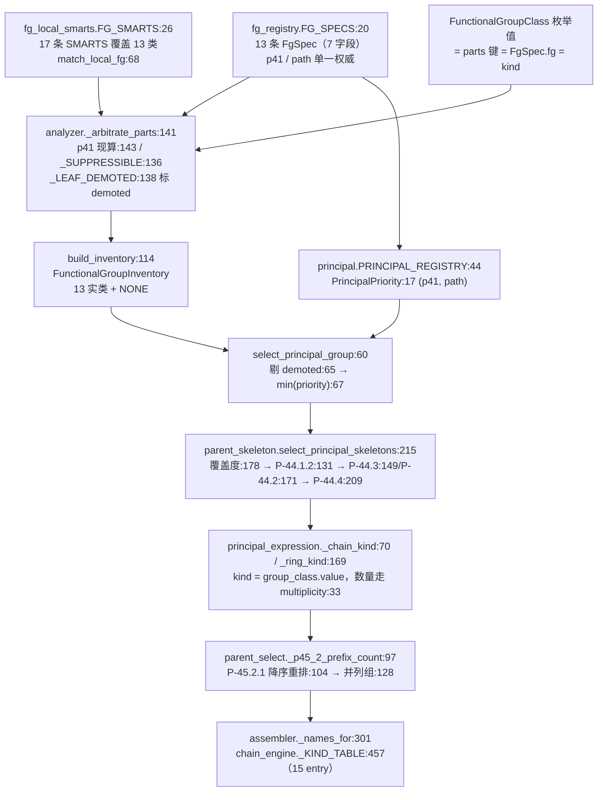

# 官能团优先层级 (Functional Group Priority Hierarchy)

> **核心概念** | 关联: [[architecture/overview]], [[architecture/layer1-analyzer]], [[architecture/layer2-parent-selector]], [[architecture/layer4-numbering]], [[architecture/layer5-name-assembly]], [[concepts/atom-ownership]]

---

## 概述

IUPAC 有机命名中，一个分子可能同时含有多种官能团（Functional Group, FG），例如羟基酸（含 -COOH 和 -OH）、氨基酮（含 -NH&#8322; 和 >C=O）、氰基酯（含 -CN 和 -COOR）等。按照 IUPAC P-41 规则，这些官能团之间存在严格的**优先顺序**：优先级最高的官能团成为 **principal characteristic group（主特征基团）**，以母体后缀（suffix）表达；较低优先级的官能团退化为取代基前缀（prefix）。

NamePredict 把这一优先级体系的**单一事实来源放在 `fg_registry.FG_SPECS`**（`fg_registry.py:20`，13 条 `FgSpec`）的 `p41` / `path` 两个字段上。`FgSpec`（`fg_registry.py:10`）共 7 个字段（`fg` / `p41` / `path` / `expr` / `anchors` / `parent_anchor_fields` / `locant_source`）。下游不另设派生副本，各自**从 `FG_SPECS` 现算**：

| 下游表 | 位置 | 内容 |
|---|---|---|
| `PRINCIPAL_REGISTRY` | `layer2/principal.py:44` | 主基团等级表（取 `sp.p41` 非 0 的条目，13 条） |
| `_FG_LOCANTS` | `layer4/locant_calc.py:146` | FG 位次表（`(sp.fg, sp)` 全量投影） |
| `_RS_KINDS` | `layer5/stereo.py:141` | `frozenset(c.value for c in FunctionalGroupClass)`，全量类别枚举 |
| `_FG_KEYS` / `_ANCHOR_KEYS` | `layer1/functional_group_inventory.py:52` / `:54` | L1 occurrence 产出顺序与锚点 key |

`p41` / `path` 随后在三层接力：**L1 用 `p41` 做压制仲裁 → L2 用 `p41`/`path` 选主基团并收敛骨架 → L5 按 FG 类别 kind 分派后缀**。



---

## 官能团优先级表（`FgSpec.p41` / `FgSpec.path`）

**`p41` 数值越小优先级越高**（`select_principal_group` 取 `min`），`path` 为同 `p41` 类内的 P-43 决胜键。表格依据 `src/namepredict/layer1/fg_registry.py` 的 `FG_SPECS`（`fg_registry.py:20`）逐条生成，后缀列对应 L5 `chain_engine._KIND_TABLE`（`chain_engine.py:457`）同名 entry。

| `p41` | `path` | FG 类别（= parts 键 = kind） | 后缀（EN / ZH） | `_KIND_TABLE` | 说明 |
|:---:|:---:|---|---|:---:|---|
| **1** | `()` | `radical` | `-yl` / `-基` | `:524` | 自由价（P-29/P-31）；`yl_loc_omit` + 自定义 `omit_rule` 使饱和无环链 C-1 自由价位次省略 |
| **1** | `()` | `acyl` | `-oyl` / `-酰基` | `:490` | 锚定酰基残基（P-65.1.7.2）；酸碳恒 locant 1，C1/C2 走 `constants.CHAIN_RETAINED` 保留名 |
| **7** | `(1,)` | `acid` | `-oic acid` / `-酸` | `:471` | 羧酸；`_LEAF_DEMOTED` 成员，被压制时保留条目并标 `demoted` |
| **9** | `()` | `ester` | `-oate` / `-酸酯` | `:480` | 羧酸酯；与 `phosphate` 同 `p41=9`，`path=()` 使其胜出（P-43） |
| **9** | `(1,)` | `phosphate` | `-phosphate` / `-磷酸` | `:488` | P 中心无碳词干，词尾由 `plain_hook=_phosphate_tail` 按 `n_oh` 切换；L1 `_PRESENCE_SKIP` 把它排除出压制存在性判定 |
| **10** | `()` | `acyl_halide` | `-oyl fluoride/chloride/bromide/iodide` / `-酰氟/酰氯/酰溴/酰碘` | `:523` | 后缀随实际卤素：`_ACYL_HALIDE_BY_HAL`（`:418`，`_ac_hal_chain`:402 生成）按 `parent.hal_z` 覆盖默认 chloride（P-65.5） |
| **11** | `()` | `amide` | `-amide` / `-酰胺` | `:515` | 酰胺 |
| **14** | `()` | `nitrile` | `-nitrile` / `-腈` | `:510` | C&#8801;N；`_LEAF_DEMOTED` 成员 |
| **15** | `()` | `aldehyde` | `-al` / `-醛` | `:505` | 醛基；环骨架另有 `_ring_kind`（`principal_expression.py:179`）显式分支放行多 -CHO（P-66.6.1.1.3） |
| **16** | `()` | `ketone` | `-one` / `-酮` | `:462` | 羰基；含环内单碳/零碳羰基（内酰胺/内酯/硫代内酯、N-酰基环胺），由 `FG_SMARTS` 三条 ketone 分支承担 |
| **17** | `(1,)` | `alcohol` | `-ol` / `-醇` | `:458` | 羟基；与 `thiol` 同 `p41=17`，`path=(1,)` 使其胜出（P-43） |
| **17** | `(2,)` | `thiol` | `-thiol` / `-硫醇` | `:496` | 巯基 |
| **19** | `()` | `amine` | `-amine` / `-胺` | `:501` | 氨基；多臂锚点语义见 P-62.2（`_chain_coverage`，`parent_skeleton.py:69`） |

> 源：`src/namepredict/layer1/fg_registry.py` 的 `FG_SPECS`（`p41`/`path`）→ `src/namepredict/layer2/principal.py` 的 `PRINCIPAL_REGISTRY`

### `_KIND_TABLE` 中无对应 `FgSpec` 的两个 kind

- **`alkane`**（`chain_engine.py:466`）—— 无主官能团时由 `FunctionalGroupClass.NONE`（枚举值 `"alkane"`，`functional_group_inventory.py:25`）投影；纯烃、苯与正交化环骨架共用该 kind。
- **`sulfonic`**（`chain_engine.py:479`）—— `FunctionalGroupClass` 无同名枚举成员，L2 无产生它的 kind 落点，该 entry 只作为词表存在（P-65.3.1）。

### `FgSpec` 其余字段的分布

| FG 类别 | `anchors` | `parent_anchor_fields` | `locant_source` |
|---|---|---|---|
| `radical` | `("center_idx",)` | `("radical_c_idx")` | `attachment` |
| `acyl` | `("center_idx",)` | `("acyl_c_idx")` | `attachment` |
| `acid` / `acyl_halide` / `ketone` | `("center_idx",)` | `None` | `attachment` |
| `ester` / `amide` / `nitrile` / `aldehyde` | `("center_idx",)` | `None` | `attachment_exocyclic` |
| `phosphate` | `("p_idx",)` | `None` | `attachment` |
| `alcohol` / `thiol` / `amine` | `("surr_idx",)` | `None` | `attachment` |

- `expr` 13 条全部为默认值 `"suffix"`，与 `PrincipalExpression`（`principal.py:23`）当前唯一成员 `SUFFIX` 一致，故 `feature_spec` 对全部注册 FG 放行。
- `anchors` 决定 occurrence 收集哪些 payload key：`center_idx`（羰基/腈/醛/酮/酰卤/酸/自由基）、`p_idx`（磷酸）、`surr_idx`（醇/硫醇/胺，碳臂即母体锚点），由 `_ANCHOR_KEYS`（`functional_group_inventory.py:54`）消费。
- `parent_anchor_fields` 经 `PRINCIPAL_REGISTRY.anchor_fields` 传到 L2，由 `_semantic_anchor_fields`（`principal_expression.py:57`）写成 parent 的固定 locant 1 字段（`radical_c_idx` / `acyl_c_idx`）。
- `locant_source` 只在 L4 `_locants_for`（`locant_calc.py:138`）三态分派中消费：`anchor_field` 分支（`:140`）走 `_anchor_field_locants`（`:124`）直读 `parent_anchor_fields[0]`，**当前无 `FgSpec` 取该值**；`attachment_exocyclic`（`:142`）在非环外表达时返回空位次表；其余取 `attachment` 默认分支。

> 注 1：`p41` 与 `path` 合成 `PrincipalPriority(p41_class, p43_path)`（`principal.py:17`，`order=True`）。`p41=1` 的 `radical` 与 `acyl` 两行键完全相同 `(1, ())`——同碳上二者由 L1 的 acyl heads 联动互斥（`analyzer.py:174`）；不同碳共存时（`*C(=O)C*`）`min` 在 `set` 迭代序中取首位，实测随 `PYTHONHASHSEED` 变化。
>
> 注 2：数量派生 kind（`diacid`/`polycarboxylic`/`diol`/`triol`/`diamine`/`triamine`/`tetraamine`）与组合 kind（`cycloalcohol`/`cycloketone`/`cycloamine`/`cycloalkane_polycarboxylic` 等）都不存在——链式 FG 对任意 count 恒返回基团名 kind，多基团数只由 `principal_expression_facts.multiplicity`（`principal_expression.py:33`）承载。苯/杂环保留名（benzoic/phenol/aniline 等）由 L5 `_BENZENE_RETAINED`（`chain_engine.py:444`）提供，不占独立 kind 行。

---

## KindMeta 数据结构

`kind_registry.py:7` 定义了 `KindMeta` 数据类，作为 scaffold 母体种类的统一元数据容器：

```python
@dataclass(frozen=True)
class KindMeta:
    kind: str              # 母体种类标识符（如 "benzene", "naphthalene"）
    en: str | None = None  # 英文 stem 名称
    zh: str | None = None  # 中文 stem 名称
    ring: str = "none"     # 环系类型: "none" | "hetero" | "carbo"
    n_rings: int = 0       # 环的数量
    retained: bool = False # 是否为 IUPAC 保留名（retained name）
```

名称为 `None` 的 scaffold 不登记（`kind_registry.py:81`）。全部 scaffold 母体种类经模块级函数统一注册：`_load_from_scaffold_specs()`（`kind_registry.py:76`，从 `ring_scaffold.all_specs()` 读取有词干的 spec，已存在则覆盖），并在模块导入时调用一次（`kind_registry.py:87`）。**`ring_scaffold` 的 scaffold spec 是 stem 的最终权威来源**。链式 FG kind 不预先注册——`KindMeta` 不承载主官能团等级，等级由 `FgSpec.p41` → `PrincipalPriority` 承载。

---

## 三层 FG 生命周期

### Layer 1: 检测与仲裁 —— `p41` 的第一次消费

`src/namepredict/layer1/analyzer.py` 的检测是**表驱动**的：局部判据全部落在 `fg_local_smarts.FG_SMARTS`（`fg_local_smarts.py:26`）的 17 条 `(FG 键, SMARTS)` 上（覆盖 13 类，模式首原子即该官能团的中心原子，同名多条取并集），`match_local_fg(mol)`（`fg_local_smarts.py:68`）是唯一局部判定入口，返回 `{FG 键: [匹配元组升序]}`，同一中心原子只保留一条匹配。

**排他性由 SMARTS 内的否定子模式承担**，共享子模式定义在 `fg_local_smarts.py:11-23`：`_ACID_O`（酸性氧）、`_NOT_ACID`、`_NOT_ACYCLIC_ESTER`、`_NOT_HALO`、`_ONE_C`、`_RING_HET`、`_O_PHOS`。因此

- 羧酸碳不会被同时认成酯 / 酰胺 / 酰卤 / 醛；
- 内酯（环内酯氧）、硫代内酯、内酰胺、N-酰基环胺、零碳环羰基统一落 `ketone` 的三条分支（两个碳邻居 / 单碳连环内杂原子 / 环内零碳）；
- 内酰胺与内酯的环内杂原子由 `_RING_HET` 判定，故环内 O/S 与羰基同环的化合物同归环酮（`oxolan-2-one`/`thiolan-2-one`/`1-pyrrolidin-1-ylethanone`）。

**非局部判据留在 `analyzer` 后置**：`_detect_parts`（`analyzer.py:167`）调 `match_local_fg(mol)` 后做三件事——酰基头的 heads 联动（`:171` 收集 heads，`:174` 从 radical 候选中剔除、`:176` 从 aldehyde 候选中剔除，避免醛→酮误降级）、磷酸的臂回接与整分子纯度校验（`_phosphate_entry`，`analyzer.py:58`；入口 `phosphate_entries`，`analyzer.py:83`）、按 `_LOCAL_ENTRY_FGS`（`analyzer.py:157`，9 个 FG 键）组装条目。parts dict 的键**就是 FG 类别值**，共 **13 个键**，与 `FG_SPECS` 的 `fg` 字段一一对应。

**P-41 仲裁 `_arbitrate_parts(parts)`（`analyzer.py:141`）是 `p41` 的第一次消费**，由三个模块级 frozenset 常量界定行为：

| 常量 | 位置 | 取值 | 语义 |
|---|---|---|---|
| `_SUPPRESSIBLE` | `analyzer.py:136` | `{"acid", "ester", "acyl_halide", "amide", "nitrile", "aldehyde"}` | 可被更高优先级 FG 整体压制的组合羰基 FG + 腈 |
| `_PRESENCE_SKIP` | `analyzer.py:137` | `{"phosphate"}` | 磷酸不参与存在性判定（`p41` 与酯同为 9，纳入会改写压制结果） |
| `_LEAF_DEMOTED` | `analyzer.py:138` | `("acid", "nitrile")` | 降级为「前缀叶」的类别（P-61.1.3 carboxy/cyano） |

算法：`p41` 表由 `FG_SPECS` 现算（`analyzer.py:143`）；`present` = 有 `p41` 且对应 parts 非空且不在 `_PRESENCE_SKIP` 的 FG 集合（`:144`）；对 `_SUPPRESSIBLE` 中每个类别 `fg`，若存在另一个 `present` 成员 `h` 满足 `p41[h] < p41[fg]`，则 `_LEAF_DEMOTED` 成员保留条目并对每条 occurrence 标 `demoted` id（`f"{fg}:{i}"`），其余整组清空（其羰基碳降级为「氧代」前缀候选）。`ketone`/`alcohol`/`thiol`/`amine` 是基础成员 FG，**永不退出**。

检测与仲裁结果经 `build_inventory(parts, mol, demoted)`（`functional_group_inventory.py:114`）收敛为**唯一 FG 出口** `FunctionalGroupInventory`（`:40`，13 个实类 `FunctionalGroupClass` + `NONE("alkane")`），随 `double_bonds`/`triple_bonds` 一起构成 info dict 传给 Layer 2。降级标记落在 `FunctionalGroupOccurrence.demoted`（`:36`）上：`occurrences()`（`:44`）过滤降级条目，`demoted_entries()`（`:48`）取回它们。

> **共现与仲裁的实际边界**：SMARTS 表并不保证一个杂原子只落进一个类别。实测 `CC(=O)N`（乙酰胺）同时产出 `amide:0` 与 `amine:0`——`amine` 的取代度分支不排除酰胺 N，`_arbitrate_parts` 也不压制 `amine`（不在 `_SUPPRESSIBLE` 中）。两者的取舍由 L2 的主基团等级表完成（amide 11 < amine 19 → 取酰胺）。同理 `CC(=O)N1CCCC1`（N-酰基吡咯烷）中环内 N 被 `!R` 排除，只产出 `ketone:0`，母体作环酮。

> **源:** `src/namepredict/layer1/analyzer.py`, `src/namepredict/layer1/fg_local_smarts.py` | 详情见 [[architecture/layer1-analyzer]]

### Layer 2: 主基团选择与骨架收敛 —— `p41`/`path` 的第二次消费

L2 分**主基团选择**、**骨架筛选**、**出口排序**三段：

**主基团选择（`principal.py`）**：`PRINCIPAL_REGISTRY`（`principal.py:44`）由 `FG_SPECS` 中 `p41 != 0` 的条目经 `_spec_from_fg`（`:36`）派生，**实测 13 条**，把 `FgSpec` 的 `p41`/`path`/`expr`/`parent_anchor_fields` 投影为 `PrincipalFeatureSpec`（`:29`）的 `PrincipalPriority`（`:17`）/`PrincipalExpression`（`:23`）/`anchor_fields`。`select_principal_group(inventory, registry)`（`principal.py:60`）先剔除 `demoted` 条目（`:65`），再 `min(eligible, key=priority)`（`:67`）选出**唯一**最高优先级主官能团类，取该类全部 occurrence 封装为 `PrincipalGroupSelection`（`:53`）；无合格主基团时回落 `PrincipalGroupSelection(FG.NONE, ())`（`:69`），下游走纯烃表达。L2 入口是 `select_principal_parent_skeletons`（`parent_select.py:25`）。

**骨架筛选（`parent_skeleton.py`，P-44）**：`select_principal_skeletons(info, occurrences)`（`parent_skeleton.py:215`）在候选骨架上依次施加

1. `keep_max_principal_coverage`（`:178`）——取覆盖主基团 occurrence 最多的骨架；覆盖口径见 `_chain_coverage`（`:69`）：胺任一臂在链即算覆盖（P-62.2），其余类别要求锚点全部落在骨架内；环骨架的附着判据见 `_ring_attaches`（`:84`）：胺/醇/自由基/酮只认直接附着；
2. `keep_p44_1_2`（`:131`）——混合拓扑时取 senior 元素（`keep_senior_atom`，`:124`）；
3. 纯开链走 `keep_p44_3`（`:149`，键 `p44_3_key`：`:143`），含环走 `keep_p44_2`（`:171`，键 `p44_2_key`：`:162`）；
4. `keep_p44_4_unsaturation`（`:209`，键 `p44_4_unsaturation_key`：`:183`）。

被压制的叶型降级条目，其中心碳由 `_demoted_leaf_carbons`（`parent_skeleton.py:43`）排除出主链（P-61.1.3 carboxy/cyano），进而在 `_open_chains`（`:58`）中作为 banned 集生效。

**kind 投影（`principal_expression.py`）**：`_chain_kind(group_class, count)`（`:70`）把主基团类别映射为母体 kind——`NONE` 在 count 0 时返回 `"alkane"`，`ACYL` 固定返回 `"acyl"`，`RADICAL` 固定返回 `"radical"`，**其余类别在 count ≥ 1 时恒返回 `group_class.value`**；环骨架走 `_ring_kind`（`:169`），对 `_FG_CLASSES`（`:44`，全部类别除 `NONE`）成员复用同一映射，并为 `ALDEHYDE` 单列分支。因此 **kind 集合等于 `FunctionalGroupClass` 的枚举值（14 个），与 multiplicity 彻底解耦**：所有数量信息只写入 `PrincipalExpressionFacts.multiplicity`（`:33`），交 L5 承载。

**出口排序（`parent_select.py`）**：L2 出口的唯一排序是 **P-45.2.1 前缀取代基计数**——`_p45_2_prefix_count`（`parent_select.py:97`）取 L3 `iter_claims(mol, owned_atoms)`（`layer3/claimable_block.py:123`）在 `owned_atoms` 边界外的 claim 个数，`_reorder_p45_2`（`:104`）按该计数降序稳定重排，`select_parent`（`:128`）以 `tied=True` 只返回并列最大组 `list[dict]`。P-44 的等级取舍全部落在 `parent_skeleton` 的筛选谓词与 `principal.select_principal_group` 的 `min()` 里，**L2 出口没有 P-44 排序键**。

> **源:** `src/namepredict/layer2/principal.py:60`, `src/namepredict/layer2/parent_skeleton.py:215`, `src/namepredict/layer2/parent_select.py:97-131`, `src/namepredict/layer2/principal_expression.py:70` | 详情见 [[architecture/layer2-parent-selector]]

### Layer 5: 后缀分派 —— `FgSpec.fg` 的第三次消费

L5 由 `_names_for(kind, n, numbered)`（`assembler.py:301`）查 **`chain_engine._KIND_TABLE`**（`chain_engine.py:457`，**15 个 `_Chain` entry**）渲染词干、不饱和段、位次与环前缀：

| entry | 行 | entry | 行 | entry | 行 |
|---|---|---|---|---|---|
| `alcohol` | `:458` | `ketone` | `:462` | `alkane` | `:466` |
| `acid` | `:471` | `sulfonic` | `:479` | `ester` | `:480` |
| `phosphate` | `:488` | `acyl` | `:490` | `thiol` | `:496` |
| `amine` | `:501` | `aldehyde` | `:505` | `nitrile` | `:510` |
| `amide` | `:515` | `acyl_halide` | `:523` | `radical` | `:524` |

**后缀位次的来源**是 `_fg_locant(numbered, kind)`（`chain_engine.py:56`）：它从 `numbered["fg_locants"]` 中按 `kind` 取记录（`_fg_record`，`:40`），仅当恰好 1 个位次时返回，否则返回 `None`（段式渲染随之失败）。而 `fg_locants` 记录的 kind 正是 `FgSpec.fg`——`_FG_LOCANTS`（`locant_calc.py:146`）把 `(sp.fg, sp)` 全量投影后，由 `_locants_for`（`:138`）按 `locant_source` 三态分派取位次原子（`anchor_field` → `parent_anchor_fields[0]`；`attachment_exocyclic` → 仅环外表达时取；默认 → `_typed_atom_locants`，`:144`）。**`spec.fg` 与 `FgSpec.fg` 同名同值，是 L4 记录 kind 与 L5 查表 kind 的对齐点。**

**数量后缀**不在 kind 中，而由 `_parent_multiplicity`（`chain_engine.py:46`）读 `principal_expression_facts.multiplicity`（缺失时回落 `parent.principal_group_count`），`_chain_names`（`:328`）在 `mult > 1` 时经 `_generated_mult_fields`（`:247`）生成式派生（alcohol→diol/triol/tetraol，amine→diamine/triamine/tetraamine，acid→dioic acid），再叠加 `variant` 特例覆盖（草酸/oxalate/oxamide 等）。多基团数既不改 kind，也不改 `_KIND_TABLE` 行数。

**其余分支**：`acyl_halide` 一行的实际 spec 由 `_ACYL_HALIDE_BY_HAL`（`:418`）按 `parent.hal_z` 覆盖（消费点 `assembler.py:307`）；环外（exocyclic）主基由 `_exo_ring_spec`（`:298`）按 `constants.EXO_RING_SUF` 改写后缀（`…-carboxylic acid`/`…-carbaldehyde`/`…-carbonitrile` 等，P-65.2.2 / P-66.6.1.1.3）；苯单取代保留名由 `_BENZENE_RETAINED`（`:444`）提供（phenol/benzoic acid/aniline 等 10 键）；`kind == "radical"` 且 parent 带 `radical_anchor_element` 时短路到 `_mononuclear_radical_names`（`assembler.py:304`），不经 `_KIND_TABLE`。

调度因此是分层的：**L1 按 FG 类别收敛 occurrence → L2 把主基团类别投影为同名 kind → L5 按 kind 查链引擎**。被选为主基团的 FG 获得后缀，劣后 FG 在 Layer 3 中转为取代基前缀（hydroxy-、oxo-、amino- 等）。

> **源:** `src/namepredict/layer5/chain_engine.py:457`, `src/namepredict/layer5/assembler.py:301` | 详情见 [[architecture/layer5-name-assembly]]

---

## 互斥排除（P-41 互斥约束）

IUPAC P-41 规定某些 FG 之间不能作为母体共存。NamePredict 通过 **`select_principal_group` 的结构性单选择**实现互斥：在未降级（`not entry.demoted`）的 occurrence 里筛出 `feature_spec` 非空的类，按 `PrincipalPriority` 取 `min` 选出单个最高优先级主官能团，低优先级 FG 一律成为取代基，不需要逐候选互斥检查。

L1 侧另有一道 `_arbitrate_parts`（`analyzer.py:141`）的 P-41 仲裁：`_SUPPRESSIBLE` 中的 6 个组合 FG 在存在更高 `p41` 等级 FG 时整组退出主基团（`_LEAF_DEMOTED` 的 acid/nitrile 保留条目并标 `demoted`，其碳排除出主链）。

> 无 `fg_helpers.py` 与 `_no_fgs(info, keys)` 互斥谓词——互斥由 `select_principal_group` 的单选择与 `_arbitrate_parts` 的双重结构实现。

---

## 注册体系：kind_registry 作为词干注册中心

`src/namepredict/layer2/kind_registry.py` 是**词干与环元数据的注册查询中心**：保留 scaffold 的 stem/ring/n_rings/retained 由 `ring_scaffold` 的 scaffold spec 派生（`_load_from_scaffold_specs`，`kind_registry.py:76`），**不承载主官能团等级**（等级单一权威在 `fg_registry.FG_SPECS.p41/path` → `principal.PRINCIPAL_REGISTRY`）。公共 API：

| API | 功能 |
|---|---|
| `kind_registry.get(kind)`（`kind_registry.py:20`） | 查 `KindMeta`（未注册返回 None） |
| `kind_registry.parent_names(kind)`（`kind_registry.py:25`） | 返回 `(en_stem, zh_stem)` 元组 |
| `kind_registry.pack_parent_stem(parent, mol)`（`kind_registry.py:58`） | 为候选补齐 `stem_en`/`stem_zh`（含五元杂环 locant 前缀终态化）与 `numbering_scaffold`；由 `parent_select._finalize_ranked`（`parent_select.py:116`）调用 |

新增 FG 种类时，只需在两处数据表登记：`fg_registry.FG_SPECS`（注册元数据：`fg` / `p41` / `path` / `anchors` 等）与 `fg_local_smarts.FG_SMARTS`（检测模式）。主基团等级表（`principal.py:44`）、FG 位次表（`locant_calc.py:146`）、L5 查表 kind（`_KIND_TABLE` 若已有同名 entry）随之自动接通；`fg` 字段同时是 parts 键、`FunctionalGroupClass` 枚举值与 L5 kind，四处必须同串。评分、候选收集与组装逻辑不变，保持**开放-封闭原则**。

> **源:** `src/namepredict/layer2/kind_registry.py`

---

## 总结

官能团优先级是 NamePredict 命名正确性的基石。从 Layer 1 的压制仲裁、Layer 2 的主基团等级与骨架筛选、到 Layer 5 的后缀分派，整个系统严格遵循 IUPAC P-41 与 P-44 的层级化思维，且**等级事实只登记一次**（`FgSpec.p41` / `FgSpec.path`）：

1. **L1 保证「一碳一 FG」**——`FG_SMARTS` 的否定子模式使同一碳原子不会被重复识别为多个 FG；`_arbitrate_parts` 再用现算的 `p41` 表把组合羰基整组压制或标 `demoted`
2. **L2 保证「优先级强制」**——`select_principal_group` 按 `PrincipalPriority` 取最小选出唯一 principal FG，`p41` 与 `path` 一并生效；骨架级 P-44 规则在其上收敛候选，并把类别投影为同名 kind
3. **L5 保证「劣后 FG 降级」**——低优先级 FG 在 Layer 3 中从候选后缀降为取代基前缀；后缀位次经 `fg_locants` 记录（kind = `FgSpec.fg`）与 `_fg_locant` 对齐
4. **互斥层保证「互斥正确」**——`select_principal_group` 的单选择结构性排除无法共存的 FG 组合，数量差异交由 `principal_expression_facts.multiplicity` 表达而非 kind 分裂
