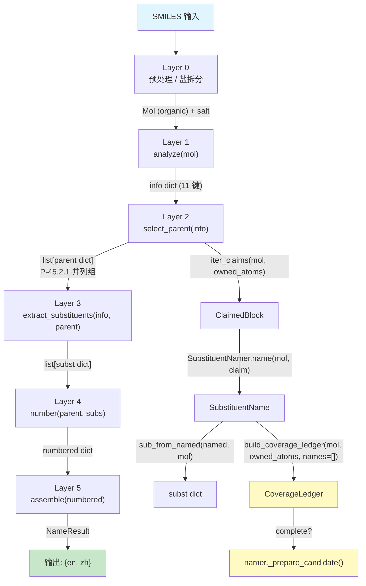

# 核心数据契约 (Core Data Contracts)

> 本文档定义 NamePredict 6 层流水线中流转的 **全部关键数据结构** 的字段规格。每个数据结构均标注源文件与行号，便于代码导航。

---

## 数据流全景



**流程说明**：

1. SMILES 经 Layer 0 预处理后得到有机部分的 `Mol` 对象与盐元数据 `salt`
2. Layer 1 `analyze(mol)` 产出 **info dict**（11 键）——分子中全部官能团 occurrence 的"一次性全景快照"
3. `namer._name_mol` 向 info 追加 `root_ctx` 与 `salt`（共 13 键）后进入 Layer 2
4. Layer 2 `select_parent(info)` 产出 **并列候选组 `list[parent dict]`**（P-45.2.1 前缀取代基团数最多者）；未覆盖原子由 `iter_claims()` 切分为 **ClaimedBlock**
5. Layer 3 为每个 ClaimedBlock 命名，产出 **SubstituentName** 并组装 **subst dict** 列表；`namer._prepare_candidate()` 用 **CoverageLedger** 做缺口门控
6. Layer 4 对 parent + subs 编号，产出 **numbered dict**——带完整位次信息的增强 parent + 带 locant 的 subs
7. Layer 5 将 numbered dict 组装为最终中英双语 **NameResult**

---

## 1. info dict（L1 输出）

**全称**: Functional Group Information Dictionary（官能团信息字典）

**产出**: `analyze(mol)` in `src/namepredict/layer1/analyzer.py:195`

**构建**: `_info(mol, carbons)` at `analyzer.py:190`，由三段合并：
- `base`: `mol`, `carbon_ids`, `n_carbons`
- `_collect_fgs(mol)`（`analyzer.py:181`）: `double_bonds`, `triple_bonds`, `fg_inventory`
- `_ring_meta(mol)`（`analyzer.py:121`）: 环系元信息

`namer._name_mol` 在 `analyze()` 返回后再注入 `root_ctx`（`namer.py:207`）与 `salt`（`namer.py:208`）——不属于 `_info` 的三段合并。

**输入方**: Layer 2 (`select_parent(info)`), Layer 3 (`extract_substituents(info, parent, ...)`), Layer 4 (间接通过 parent), Layer 5 (间接)

### 基础字段

| 字段 | 类型 | 产出 | 说明 |
|---|---|---|---|
| `mol` | `rdkit.Chem.Mol` | `_info`（`analyzer.py:192`） | 原始 RDKit 分子对象引用（有机部分，已去盐） |
| `carbon_ids` | `list[int]` | `_info` | 分子中所有碳原子的 atom index |
| `n_carbons` | `int` | `_info` | 碳原子总数（= `len(carbon_ids)`） |
| `root_ctx` | `tuple[Mol, list[int]]` | `namer._name_mol`（`namer.py:207`） | 根分子上下文 `(根Mol, 本分子原子索引→根索引映射)`；顶层整分子为 `(organic, list(range(n)))`（`namer.py:201`），递归子结构沿用传入值（`namer.py:204`），供 Layer3 取代基 R/S 在完整根分子上重算 |
| `salt` | `dict` | `namer._name_mol`（`namer.py:208`） | Layer0 盐元数据（`metal`/`metal_zh`/`n_metal`/`acid_salt`/…）；磷酸母体 producer（`principal_expression._chain_phosphate_fields`，`principal_expression.py:317`）据此做盐门控并写入 `salt_meta` |

> **info dict 不携带 `has_*` 布尔标志，也不携带按 FG 类分组的条目列表**——全部官能团事实只经 `fg_inventory` 一个出口承载，存在性由清单内容判定。

### 官能团清单 `fg_inventory`

`fg_inventory` 的类型是 `FunctionalGroupInventory`（`layer1/functional_group_inventory.py:39`），由 `build_inventory(lists, mol, demoted)`（`functional_group_inventory.py:114`）在 `_collect_fgs` 内构建；`inventory_from_info(info)`（`functional_group_inventory.py:120`）是下游唯一取用入口（缺失即抛 `KeyError`，不静默退化为空清单）。

```python
@dataclass(frozen=True)
class FunctionalGroupInventory:          # functional_group_inventory.py:39-50
    entries: tuple[FunctionalGroupOccurrence, ...]

    def occurrences(self, group_class) -> tuple[...]   # :44 该类全部未降级 occurrence
    def demoted_entries(self) -> tuple[...]            # :48 被 P-41 仲裁降级为前缀叶的条目
```

```python
@dataclass(frozen=True)
class FunctionalGroupOccurrence:          # functional_group_inventory.py:28-36
    id: str                               # "{fg}:{i}"，如 "acid:0"（_one，:110）
    group_class: FunctionalGroupClass      # functional_group_inventory.py:10
    characteristic_atoms: frozenset[int]   # 特征原子（默认 center ∪ surr，例外见 FG_ATOM_FNS）
    parent_anchors: frozenset[int]         # 由 FgSpec.anchors 声明的 key 从 payload 取出
    payload: dict                          # L1 原始条目 dict
    demoted: bool = False                  # P-41 仲裁降级为前缀叶（P-61.1.3 carboxy/cyano）
```

`FunctionalGroupClass`（`functional_group_inventory.py:10`）共 **14 个成员**：13 个 P-41 类别 + `NONE = "alkane"`（无 primary FG）。类别 ↔ 列表键的映射由 `fg_registry.FG_SPECS` 派生（`_FG_KEYS`，`functional_group_inventory.py:52`），锚点 key 亦同源（`_ANCHOR_KEYS`，`functional_group_inventory.py:54`）。

### FG 注册表 `FgSpec`

`FgSpec`（`layer1/fg_registry.py:9`）是 FG 跨层元数据的 **唯一事实来源**：L1 检测键、L2 优先级、L4 位次来源全部由 `FG_SPECS`（`fg_registry.py:20`，13 条）投影。

| 字段 | 类型 | 说明 |
|---|---|---|
| `fg` | `str` | `FunctionalGroupClass` 值（权威枚举字符串，如 `"alcohol"`）；同作 L1 analyzer 列表 key |
| `p41` | `int` | P-41 主官能团等级（`0` = 非主官能团）；L2 `PrincipalPriority.p41_class` 取此值 |
| `path` | `tuple[int, ...]` | P-43 优先级路径，为 `p41` 同级别内的次序（`PrincipalPriority.p43_path`） |
| `expr` | `str` | 表达类型：`suffix` / `prefix_only` / `legacy_compat`（当前全部条目取默认 `suffix`） |
| `anchors` | `tuple[str, ...]` | occurrence payload 的锚点 key（空 = 不收集锚点），决定 `occurrence.parent_anchors` |
| `parent_anchor_fields` | `tuple[str, str] \| None` | parent 锚点字段（单, 复）；仅 `radical`（`("radical_c_idx",)`）与 `acyl`（`("acyl_c_idx",)`）登记 |
| `locant_source` | `str` | L4 位次原子来源：`attachment`（默认，取 `principal_expression_facts.attachment_atoms`）/ `attachment_exocyclic`（仅环外表达时取）/ `anchor_field`（取 `parent_anchor_fields[0]` 语义字段） |

`FG_SPECS` 全表（`fg_registry.py:20-34`）：

| `fg` | `p41` | `path` | `anchors` | `parent_anchor_fields` | `locant_source` |
|---|---|---|---|---|---|
| `radical` | 1 | — | `center_idx` | `("radical_c_idx",)` | `attachment` |
| `acyl` | 1 | — | `center_idx` | `("acyl_c_idx",)` | `attachment` |
| `acid` | 7 | `(1,)` | `center_idx` | — | `attachment` |
| `phosphate` | 9 | `(1,)` | `p_idx` | — | `attachment` |
| `ester` | 9 | — | `center_idx` | — | `attachment_exocyclic` |
| `acyl_halide` | 10 | — | `center_idx` | — | `attachment` |
| `amide` | 11 | — | `center_idx` | — | `attachment_exocyclic` |
| `nitrile` | 14 | — | `center_idx` | — | `attachment_exocyclic` |
| `aldehyde` | 15 | — | `center_idx` | — | `attachment_exocyclic` |
| `ketone` | 16 | — | `center_idx` | — | `attachment` |
| `alcohol` | 17 | `(1,)` | `surr_idx` | — | `attachment` |
| `thiol` | 17 | `(2,)` | `surr_idx` | — | `attachment` |
| `amine` | 19 | — | `surr_idx` | — | `attachment` |

> 当前注册表中 **无任何条目取 `locant_source="anchor_field"`**，故 `locant_calc._locants_for`（`locant_calc.py:138`）的该分支不产出记录；`attachment_exocyclic` 只在 `facts.relation == "exocyclic"` 时产出位次（`_exocyclic_only`，`locant_calc.py:132`）。

### FG 条目列表与 payload 结构

每个 `FunctionalGroupClass` 对应一个 L1 检测键（= `FgSpec.fg`），键集由 `_detect_parts`（`analyzer.py:167`）一次产出，**唯一事实来源是 `fg_local_smarts.FG_SMARTS`（`layer1/fg_local_smarts.py:28`，13 类）+ `fg_registry.FG_SPECS`**：

| `group_class` | 检测键 | 条目 payload 键 | 检测路径 |
|---|---|---|---|
| `RADICAL` | `radical` | `center_idx`、`surr_idx=[]` | `_radical_entry`（`analyzer.py:131`），排除已判 acyl 头的碳（`analyzer.py:174`） |
| `ACYL` | `acyl` | `center_idx`、`surr_idx`（=O + 碳） | `analyzer.py:170`（先于 aldehyde/radical 判定） |
| `ACID` | `acid` | `center_idx`（羧基碳）、`surr_idx`（2 个 O） | `_local_entries`（`analyzer.py:161`） |
| `PHOSPHATE` | `phosphate` | `p_idx`、`n_oh`、`n_om` | `phosphate_entries`（`analyzer.py:83`）/ `_phosphate_entry`（`analyzer.py:58`） |
| `ESTER` | `ester` | `center_idx`、`surr_idx`（=O + 酯 O） | `_local_entries` |
| `ACYL_HALIDE` | `acyl_halide` | `center_idx`、`surr_idx`（=O + 卤素） | `_local_entries` |
| `AMIDE` | `amide` | `center_idx`、`surr_idx`（=O + N） | `_local_entries` |
| `NITRILE` | `nitrile` | `center_idx`（腈碳）、`surr_idx`（N） | `_local_entries` |
| `ALDEHYDE` | `aldehyde` | `center_idx`、`surr_idx`（=O） | `analyzer.py:176`，排除 acyl 头碳 |
| `KETONE` | `ketone` | `center_idx`、`surr_idx`（=O + C） | `_local_entries` |
| `ALCOHOL` | `alcohol` | `center_idx`（O）、`surr_idx`（所连 C） | `_local_entries` |
| `THIOL` | `thiol` | `center_idx`（S）、`surr_idx`（所连 C） | `_local_entries` |
| `AMINE` | `amine` | `center_idx`（N）、`surr_idx`（全部碳臂） | `_local_entries` |

`_local_entries`（`analyzer.py:161`）只覆盖 `_LOCAL_ENTRY_FGS`（`analyzer.py:157`）的 9 个键（acid/alcohol/ester/amide/ketone/amine/thiol/nitrile/acyl_halide），其条目一律经 `_fg_entry`（`analyzer.py:95`）产 `{"center_idx", "surr_idx"}`；`radical`/`acyl`/`aldehyde`/`phosphate` 由 `_detect_parts` 单独组装（`analyzer.py:173-177`）。

`surr_idx` 的计算在 `_surr_idx`（`analyzer.py:89`）：中心原子的全部重原子邻居；当中心是 **碳且不在环内** 时额外排除环内邻居。

**payload 的两套形状**：

- 除 `phosphate` 外统一 `{"center_idx": int, "surr_idx": [int, ...]}`
- `phosphate` 为 `{"p_idx": int, "n_oh": int, "n_om": int}`——`n_oh` = 中性含 H 氧数、`n_om` = 形式电荷 -1 的氧数（`_phosphate_entry`，`analyzer.py:58`）。**`n_arms` 已不由 L1 产出**，L2 以 `payload.get("n_arms", 0)` 容错取值（`principal_expression.py:330`）

**锚点 key**（`_ANCHOR_KEYS`，`functional_group_inventory.py:54`）：`radical`/`acyl`/`acid`/`acyl_halide`/`ester`/`amide`/`nitrile`/`aldehyde`/`ketone` 取 `center_idx`；`alcohol`/`thiol`/`amine` 取 `surr_idx`；`phosphate` 取 `p_idx`。

**特征原子**（`_characteristic_atoms`，`functional_group_inventory.py:98`）默认取 `center_idx ∪ surr_idx`（`center_surr_atoms`，`functional_group_inventory.py:78`）；例外表 `FG_ATOM_FNS`（`functional_group_inventory.py:87`）只登记 `phosphate` → `_phosphate_atoms`（`functional_group_inventory.py:72`，P 中心 + 全部氧，含 O–R 桥氧）。

### P-41 主基团仲裁

`_arbitrate_parts(parts)`（`analyzer.py:141`）在清单构建之前按 `FgSpec.p41` 做一次整组压制：`_SUPPRESSIBLE`（`analyzer.py:136` = `{acid, ester, acyl_halide, amide, nitrile, aldehyde}`）中的组合 FG 只要存在 `p41` 更小的 FG，即整组退出主基团；`_PRESENCE_SKIP = {"phosphate"}`（`analyzer.py:137`）不参与存在性判定（其 `p41` 与酯同为 9，纳入会改写压制结果）。叶型降级（`_LEAF_DEMOTED = ("acid", "nitrile")`，`analyzer.py:138`）保留条目、其 occurrence 打 `demoted=True`、碳排除出主链（P-61.1.3 carboxy/cyano 叶）；其余组（酯/酰胺/醛/酰卤）整组清空。返回 `(parts, demoted_ids)`，`demoted_ids` 传给 `build_inventory` 落到 `FunctionalGroupOccurrence.demoted`（`_one`，`functional_group_inventory.py:106`）。

### 不饱和度键（结构事实，不入清单）

| 键 | 类型 | 产出 | 说明 |
|---|---|---|---|
| `double_bonds` | `list[dict]` | `_filter_bond_entries`（`analyzer.py:118`）→ `_bond_entry`（`analyzer.py:113`） | 每项 `{"c1": int, "c2": int}`（C=C，排除芳香键，`_is_cc_double`，`analyzer.py:99`） |
| `triple_bonds` | `list[dict]` | 同上（`_is_cc_triple`，`analyzer.py:106`） | 每项 `{"c1": int, "c2": int}`（C≡C） |

### 环系元信息

来自 `_ring_meta(mol)`（`analyzer.py:121`）：

| 字段 | 类型 | 说明 |
|---|---|---|
| `rings` | `list[dict]` | 每个 SSSR 环的原子索引信息，如 `{"atom_ids": (0,1,2,3,4,5)}`（`sssr_rings`，`layer1/ring_systems.py:23`） |
| `n_rings` | `int` | SSSR 环的数量 |
| `has_ring` | `bool` | 是否含环（= `bool(rings)`）；`namer._prepare_candidate` 用它判定空链路候选（`namer.py:124`） |
| `ring_systems` | `list[dict]` | 环系（稠合连通 + 螺环合并），由 `build_ring_systems(mol)`（`layer1/ring_systems.py:117`）产出，每条为 `_system_dict`（`layer1/ring_systems.py:89`）：`atom_ids`/`sssr_indices`/`fusion_edges`/`n_rings`/`n_atoms`/`hetero_atoms` |
| `n_ring_systems` | `int` | 环系的数量 |

---

## 2. parent dict（L2 输出）

**全称**: Parent Structure Dictionary（母体结构字典）

**产出**: `select_parent(info)` at `src/namepredict/layer2/parent_select.py:128`，返回 `list[dict]` —— P-44 评分降序经 P-45.2.1 重排后的 **并列最优组**（`_reorder_p45_2`，`parent_select.py:104`；组大小由 `namer._MAX_TIED_CANDIDATES=4` 截取，`namer.py:89`）。

**构建**: 每个候选由 `_collect_candidates(info)`（`parent_select.py:91`）经 `rule_driven_parent_candidates`（`parent_select.py:52`）生成，再由 `_finalize_ranked(info, cands)`（`parent_select.py:116`）按 `pack_parent_stem`（`kind_registry.py:58`）补词干、`finalize_parent_ownership`（`parent_select.py:83`）固化 `owned_atoms`。

上游选择类型：`PrincipalParentSelection`（`parent_select.py:18`，主官能团选择 + 骨架选择）由 `select_principal_parent_skeletons`（`parent_select.py:25`）产出，其中 `PrincipalGroupSelection`（`layer2/principal.py:53`，字段 `group_class: FunctionalGroupClass` + `occurrences: tuple[FunctionalGroupOccurrence, ...]`）来自 `select_principal_group`（`principal.py:60`，按 `PrincipalPriority`，`principal.py:16` 取最小者）。骨架候选类型 `ParentSkeleton`（`layer2/parent_skeleton.py:24`，字段 `topology: SkeletonTopology` + `atom_ids: tuple[int, ...]` + `covered_principal_ids: frozenset[str]`）与 `SkeletonSelection`（`parent_skeleton.py:32`）由 `enumerate_principal_skeletons`/`select_principal_skeletons`（`parent_skeleton.py:228`/`:215`）产出。

### 通用字段

| 字段 | 类型 | 产出 | 说明 |
|---|---|---|---|
| `kind` | `str` | `_parent_dict`（`principal_expression.py:125`） | 母体类型；FG 正交化后为 FG 类别名（`"acid"`/`"ketone"`/`"radical"`/`"phosphate"`…）或纯烃 `"alkane"`、`FunctionalGroupClass.NONE.value` |
| `chain` | `list[int]` | `_parent_dict` | 骨架原子索引（主链或环系统原子集） |
| `n_carbons` | `int` | `_parent_dict` | = `len(chain)` |
| `covered_principal_ids` | `tuple[str, ...]` | `_parent_dict` | 本骨架表达的主基团 occurrence id |
| `principal_occurrences` | `tuple[FunctionalGroupOccurrence, ...]` | `_parent_dict` | **全部**主基团 occurrence（不限本骨架覆盖），供 L2 所有权判定 |
| `principal_group_count` | `int` | `_parent_dict` | 本骨架覆盖的主基团 occurrence 个数（= `len(occurrences)`） |
| `principal_expression_facts` | `PrincipalExpressionFacts` | `_parent_dict` | 主基团表达事实（见下节），下游锚点/位次的主要载体 |
| `owned_atoms` | `frozenset[int]` | `finalize_parent_ownership`（`parent_select.py:83`） | 母体拥有的全部原子索引（链 ∪ 主基团特征原子），不可变；已存在则原样返回（`parent_select.py:85`） |
| `mol` | `rdkit.Chem.Mol` | `pack_parent_stem`（`kind_registry.py:62`） | RDKit Mol 引用（环外基团归属判定、标记氢计算用）；已有则不覆盖 |
| `stem_en` / `stem_zh` | `str` | `pack_parent_stem`（`kind_registry.py:73`） | 双语母体词干（保留名可带 `1H-` 等 locant 前缀，`locant_prefix`，`ring_scaffold.py:420`）；已有词干则不覆盖 |
| `numbering_scaffold` | `dict` / 缺省 | `_attach_numbering_scaffold`（`kind_registry.py:33`）→ `numbering_scaffold_facts`（`ring_scaffold.py:376`） | 固定编号骨架事实：`{"scaffold_id": str, "labels": tuple}`；标签数与 `chain` 长度不符时不写入 |

`owned_atoms` 的计算：`compute` 内联于 `finalize_parent_ownership`（`parent_select.py:87`）= 链原子（`_chain_atoms`，`parent_select.py:58`）∪ `_kind_fg_atoms`（`parent_select.py:63`，落在骨架内/直接连骨架的 occurrence 锚点及其直接相连的特征原子）。

### PrincipalExpressionFacts（`principal_expression.py:32-42`）

```python
@dataclass(frozen=True)
class PrincipalExpressionFacts:
    group_class: FunctionalGroupClass        # 主基团类别
    multiplicity: int                        # 本骨架覆盖的主基团实例数
    relation: PrincipalRelation              # "in_skeleton" | "exocyclic"
    occurrence_ids: tuple[str, ...]
    characteristic_atoms: frozenset[int]
    anchor_atoms: frozenset[int]             # 官能团原锚点（occurrence.parent_anchors）
    attachment_atoms: frozenset[int]         # 骨架内附着原子（骨架外锚点取其骨架内邻居）
    charge_state: PrincipalChargeState       # "neutral" | "anion" | "mixed"
```

产出方：`_facts(selection, skeleton, occurrences, mol)`（`principal_expression.py:114`），链骨架经 `express_chain_principal`（`principal_expression.py:408`）、环骨架经 `express_ring_principal`（`principal_expression.py:232`）。L4 位次一律由 `_principal_atoms(parent)`（`numbering_engine.py:153`，取 `facts.attachment_atoms`）与 `locant_calc._atom_locants` 读取，扁平锚点字段不参与位次计算。

### 扁平锚点字段（仅 RADICAL / ACYL）

`_semantic_anchor_fields`（`principal_expression.py:57`）只为 `_SEMANTIC_ANCHOR_FGS = {RADICAL, ACYL}`（`principal_expression.py:54`）写单数字段，其余 FG 类别的锚点全部经 `principal_expression_facts` 流转。字段名取自 `FgSpec.parent_anchor_fields[0]`（`_anchor_fields`，`principal_expression.py:46`）：

| 字段 | 类型 | 出现条件 | 说明 |
|---|---|---|---|
| `radical_c_idx` | `int` | `radical` 类、单锚点 | `*` 自由基锚定原子（P-14.4(a) 固定 locant 1） |
| `acyl_c_idx` | `int` | `acyl` 类、单锚点 | 酰基残基羰基头碳（P-65.1.7.2） |

### FG / 拓扑专属字段（按 kind 选择性存在）

| 字段 | 类型 | 出现条件 | 说明 | 产出 |
|---|---|---|---|---|
| `radical_anchor_element` | `str` | 杂原子锚点 `radical` 系 | 锚点元素 `"N"`/`"O"`/`"P"`/`"S"`；L5 `_mononuclear_radical_names`（`assembler.py:190`）据此转单核氢化物管线 | `_mononuclear_radical`（`principal_expression.py:360`） |
| `stem_en` / `stem_zh` | `str` | 同上（覆盖 `pack_parent_stem` 结果） | 单核氢化物 free 名；同时把骨架收缩为单原子 `replace(skeleton, atom_ids=(anchor,))` | 同上 |
| `radical_ylidene` | `bool` | 碳锚点自由价为双键 | L5 出 `-ylidene` | `_radical_ylidene`（`principal_expression.py:385`） |
| `anion` | `bool` | 酸全阴离子 | L5 据此转 `-ate`/`-酸根`（`_expression_flags` 仅对 `ACID` 生效，`principal_expression.py:88`） | `_expression_flags`（`principal_expression.py:88`） |
| `o_idx` / `alkoxy_n` | `int` / `int` | `ester` 类 | 酯烷氧基桥 O 索引；`alkoxy_n` 仅在多取代基数为 1 时给 0（`_chain_ester_fields`，`principal_expression.py:333`）；环骨架走 `ester_fields`（`principal_expression.py:226`，恒给 0） | 同上 |
| `n_oh` / `n_om` / `n_arms` | `int` | `phosphate` 类（盐门控通过） | 酸式 H 氧数 / 阴离子氧数 / O–R 臂数；`n_oh`/`n_om` 由 payload 透传，`n_arms` 取 `payload.get("n_arms", 0)`（payload 不产出该键，故恒 `0`） | `_chain_phosphate_fields`（`principal_expression.py:317`） |
| `salt_meta` | `dict` / `None` | `phosphate` 类 | 盐门控通过后的 Layer0 盐元数据；`n_om > 0` 时要求 `n_metal == n_om`，否则整个候选返回 `None`（`principal_expression.py:324-328`） | 同上 |
| `hal_idx` / `hal_z` | `int` | `acyl_halide` 类（单 occurrence） | 卤原子索引与原子序（`hal_z ∈ HALO_Z`，`constants.py:35`）；L5 据此选卤素后缀。链与环外共用同一 producer | `_chain_acyl_halide_fields`（`principal_expression.py:394`） |
| `double_bond` / `double_bonds` | `tuple[int,int]` / `list[tuple]` | 骨架内 C=C | 单键写单数、多键写复数；端点均在 `chain` 内 | `_chain_unsat_fields`（`principal_expression.py:278`）→ `_unsat_bond_fields`（`principal_expression.py:264`） |
| `triple_bond` / `triple_bonds` | `tuple[int,int]` / `list[tuple]` | 骨架内 C≡C | 同上 | 同上 |
| `scaffold_id` | `str` | 解析到 scaffold | 骨架标识（`"benzene"`/`"fused"`/`"carbocycle"`/保留母体 id） | `_scaffold_fields`（`principal_expression.py:184`） |
| `scaffold_identity` | `ScaffoldIdentity` | 同上 | scaffold 解析对象（`id`/`naming_class`/`n_rings`/`ring`，`ring_scaffold.py:39`） | 同上 |
| `scaffold_match` | `tuple` / `None` | 保留模板命中 | 模板原子 → 分子原子映射（L4 固定编号/稠环拆解用） | 同上 |
| `typed_ring_expression_supported` | `bool` | 同上 | 环骨架能否 typed 表达（`supports_ring_expression`，`ring_expression_policy.py:41`）；环酮为 `False` 时整个候选被剔除（`_unsupported_typed_ring`，`parent_select.py:33`） | 同上 |
| `hydro_atoms` | `frozenset[int]` | 保留模板命中且推导出加氢位 | 加氢位（P-31.2.2），L4 换算为 hydro 前缀位次 | `hydrogenated_atoms`（`ring_scaffold.py:284`） |
| `fused_tree` | `FusedNode` | 多环骨架（`sssr_indices` 数 ≥ 2） | 稠环拆解树（`scaffold_id`/`atom_ids`/`ring_indices`/`fusion_shared`/`attached`/`fused_stem`/`fused_prefix`/`fused_omit_numbers`，`fused_system.py:24`），L5 组装稠合名 | `decompose_fused_system`（`fused_system.py:217`） |

> 注：杂原子锚点自由基母体（`radical_anchor_element` 存在）的 `stem_en`/`stem_zh` 由锚点元素与氧化态/自由价键级选定，取值域为——N：`azane`/`氮烷`（自由价单键）或 `imine`/`亚胺`（自由价双键）；O：`oxidane`/`氧化烷`；S：`sulfane`/`硫烷`（0 个 =O）、`sulfinyl`/`亚磺酰`（1 个）、`sulfonyl`/`磺酰`（2 个）；P：`phosphanyl`/`磷烷基`（0 个 =O）或 `phosphoryl`/`磷酰`（1 个）。词表在 `constants.py`：`MONONUCLEAR_HYDRIDES`（`constants.py:113`）、`MONONUCLEAR_BY_ELEMENT`（`constants.py:123`）、`SULFUR_STEM_BY_OXO`（`constants.py:124`）、`PHOSPHORUS_STEM_BY_OXO`（`constants.py:125`）、`NITROGEN_STEM_BY_FREE_DOUBLE`（`constants.py:126`）；P 的 `=O` 数不落 0/1 时 `_mononuclear_radical` 返回 `None` 明确失败（`principal_expression.py:377`）。
>
> 环骨架 kind 收敛：`benzene` 与未注册稠环（`fused_hetero`）的 `kind` 均收敛为 `"alkane"`，环系身份由 `scaffold_id`/`fused_tree` 承载（`_resolved_ring_kind`，`principal_expression.py:158`）；环 + 主 FG 时优先取 FG 类别 kind（`_ring_kind`，`principal_expression.py:169`）。

### P-44 / P-45 选择键

| 键 | 产出 | 说明 |
|---|---|---|
| `P44Facts.principal_group_class` / `principal_group_count` | 骨架筛选谓词（`parent_skeleton.py:178` `keep_max_principal_coverage` 等） | 骨架级 P-44 筛选在 L2 内部完成，已物化为候选顺序 |
| P-45.2.1 前缀取代基团数 | `_p45_2_prefix_count`（`parent_select.py:97`） | `len(iter_claims(mol, owned_atoms))`；`_reorder_p45_2` 按其降序稳定重排（`parent_select.py:104`） |
| P-44.1.1 后缀位次集合 | `suffix_locant_set`（`candidate_keys.py:7`） | 写入 `NameResult.meta["p44_1_1_key"]` |
| P-45.2.2 前缀位次集合 | `prefix_locant_set`（`candidate_keys.py:20`） | 写入 `NameResult.meta["p45_2_2_key"]`；`namer._best_hit`（`namer.py:136`）取最小者 |

---

## 3. ClaimedBlock（L2 -> L3 桥接类型）

**全称**: Ownership-Only Claimable Side Block

**定义**: `src/namepredict/layer3/claimable_block.py:19-25`

**用途**: 描述 parent 未覆盖的一个"外侧"原子组件（side block），仅记录拓扑归属信息，不含名称。Layer 3 基于 ClaimedBlock 生成 `SubstituentName`。

```python
@dataclass(frozen=True)
class ClaimedBlock:
    slot: SideSlot          # 附着位置类型
    attach_parent: int      # 母体侧附着点 atom index
    root: int               # 取代基侧根原子 atom index
    atoms: frozenset[int]   # 该侧块的所有原子索引（不可变集合）
```

### SideSlot 枚举

定义于 `layer3/claimable_block.py:11-16`：

| 值 | 含义 |
|---|---|
| `CHAIN_C` | 附着于母体链上的碳原子（`derive_slot`，`claimable_block.py:40`） |
| `RING_C` | 附着于母体环上的碳原子（同上） |
| `AMINE_N` | 附着于胺氮（`_is_amine_n`，`claimable_block.py:28`：非芳香、非环员 N） |
| `OTHER` | 其他类型（杂原子附着） |

### 产出函数

`iter_claims(mol, owned_atoms)` at `layer3/claimable_block.py:123`：遍历所有外侧重原子组件（`_unique_components`，`claimable_block.py:112`），为每个组件经 `_try_claim`（`claimable_block.py:96`）确定 canonical edge `(attach_parent, root)` 与 slot，返回按 `(attach_parent, root, slot.value)` 排序的 `list[ClaimedBlock]`。

`_try_claim` 的两道过滤（`claimable_block.py:100-104`）：无连接边则丢弃；外部组分含 **双键连 owned 重原子的氧**（`_has_dbl_o_edge`，`claimable_block.py:83`，且该 owned 原子非碳）则丢弃——主 FG 成分不入 claim。`claim_block`（`claimable_block.py:53`）另要求 `attach_parent ∈ owned_atoms` 且组分的 owned 连接点唯一。

---

## 4. SubstituentName（L3 内部类型）

**定义**: `src/namepredict/layer3/substituent_namer.py:13-19`

**用途**: ClaimedBlock 经过命名后的结果，包含中英文名称和书写规则。

```python
@dataclass(frozen=True)
class SubstituentName:
    claim: ClaimedBlock        # 来源声明块
    en: str                    # 英文取代基名称（如 "methyl", "chloro"）
    zh: str                    # 中文取代基名称（如 "甲基", "氯"）
    requires_parentheses: bool # 命名时是否需要括号（如复合取代基）
```

**产出**: `SubstituentNamer.name(mol, claim)` at `substituent_namer.py:67`，按 `self._backends` 顺序依次尝试（默认 `[RetainedBackend(), RecursiveBackend(cache=..., root_ctx=...)]`，`substituent_namer.py:64`），返回第一个成功的结果；全部失败返回 `None`。后端协议 `SubstituentBackend`（`substituent_namer.py:22`）要求实现 `name` 属性与 `try_name(mol, claim)`；`_named`（`substituent_namer.py:26`）把后端命中的 `(en, zh, paren)` 三元组封装为 `SubstituentName`，**en 或 zh 为空即判失败**。

---

## 5. Substituent dict（L3 输出 -> L4 输入）

**全称**: Substituent Dictionary（取代基字典）

**产出**: `extract_substituents(info, parent, *, cache=None)` at `src/namepredict/layer3/substituent_extractor.py:43`

**用途**: 每个 dict 描述一个待编号的取代基。Layer 4 通过 `_with_locants()`（`locant_calc.py:59`）向每个 subst dict 注入 `locant` 字段。

### 内置取代基字段（L3 产出）

字段由 `sub_from_named(named, mol)`（`substituent_extractor.py:17`）装配：

| 字段 | 类型 | 说明 |
|---|---|---|
| `kind` | `str` | 取代基类型。优先取 `constants.NAME_KIND`（`constants.py:136`，名称暗含 kind，当前只登记 halo 四名）中的特殊保留名；否则用槽位映射 `constants.CLAIM_KIND`（`constants.py:141`，3 键：`amine_n → n_block`、`ring_c`/`chain_c → alkyl`），未命中槽位回落 `"side"`（`_claim_kind`，`substituent_extractor.py:12`）。附着原子为环员且 kind ∈ `N_PREFIX_KINDS`（`constants.py:39`，`{n_alkyl, n_block}`）时改写为环碳 kind，改走环上位次（`substituent_extractor.py:23`） |
| `en` | `str` | 英文名称（如 `"methyl"`, `"chloro"`, `"hydroxy"`） |
| `zh` | `str` | 中文名称（如 `"甲基"`, `"氯"`, `"羟基"`） |
| `attach_idx` | `int` | 附着于母体的原子索引（= `claim.attach_parent`） |
| `atoms` | `list[int]` | 取代基占用的所有原子索引（升序） |
| `paren` | `bool` | 命名时是否需要括号包裹（= `SubstituentName.requires_parentheses`） |
| `n_carbons` | `int` | 取代基中的碳原子数（影响排序优先级） |
| `o_side` | `bool`（可选键） | 仅 O 侧烷基臂：`_append_named`（`substituent_extractor.py:32`）在 `parent["kind"] ∈ ESTER_O_SIDE_KINDS`（`constants.py:143`，`{ester, phosphate}`）或 `parent` 带 `o_idx` 字段、且附着原子为 O 时写入（`substituent_extractor.py:53`）。L5 `join_ester_name`/`phosphate_names` 消费；`namer._remap_attach`（`namer.py:66`）见该键即跳过链重映射 |

### L4 注入字段

| 字段 | 类型 | 注入方 | 说明 |
|---|---|---|---|
| `locant` | `int` / `str` | `_with_locants(chain, substituents, facts)` at `locant_calc.py:59` | 该取代基在母体骨架上的位次（保留稠环字母位如 `"4a"`）；不在链上取 0（`_sub_locant`，`locant_calc.py:54`） |

> `namer._subs_for_numbering(parent, subst)`（`namer.py:92`）在编号前筛选参与 L4 的取代基：`o_side`、`attach_idx ∈ chain`、或 `kind ∈ N_PREFIX_KINDS` 三者之一才进入 `number()`；其余（环外基团）不进编号链但仍留在 numbered `substituents` 中供 L5 拼前缀。

---

## 6. CoverageLedger（L3 -> Namer 桥接）

**全称**: Heavy-Atom Coverage Ledger（重原子覆盖台账）

**定义**: `src/namepredict/layer3/coverage.py:12-23`

**用途**: 记录 parent 所有权与已命名 claim 对分子重原子的覆盖，给出遗漏（gap）与重叠（overlap）。

```python
@dataclass(frozen=True)
class CoverageLedger:
    owned_atoms: frozenset[int]                # parent 拥有的原子
    named_claims: tuple[SubstituentName, ...]  # 已命名的取代基列表
    gap: frozenset[int]                        # 未被任何方覆盖的重原子
    overlap: frozenset[int]                    # 被多方同时覆盖的重原子

    @property
    def complete(self) -> bool:
        return not self.gap and not self.overlap
```

**构建**: `build_coverage_ledger(mol, *, owned_atoms, names)` at `coverage.py:26`

`gap = frozenset(重原子全集 - owned_atoms)`（`coverage.py:40`，重原子 = 非 H，`coverage.py:33`）；`overlap` 由归属计数 `> 1` 判定（`coverage.py:34-41`）。

**使用**: `namer._prepare_candidate()` at `namer.py:127` —— 以 `names=[]` 构建台账，故实际门控**只看 gap**（owned_atoms 是否覆盖全部重原子），`named_claims` / `overlap` 维不参与。结果以第三元组项 `complete` 返回；`namer._try_phase`（`namer.py:145`）对每个成功候选写入 `meta["fallback"] = "no_coverage_gate"`（`namer.py:151`），`coverage_complete` 键不写入 `meta`。

---

## 7. numbered dict（L4 输出 -> L5 输入）

**全称**: Numbered Structure Dictionary（编号结构字典）

**产出**: `number(parent, substituents)` at `src/namepredict/layer4/numbering.py:82`

**构建**: `_pack(oriented, subs_with_locants)` at `locant_calc.py:161`；`oriented = {**parent, "chain": orient_numbering(parent, substituents)}`（`numbering.py:84-85`，`orient_numbering` 在 `numbering_engine.py:325`）。

### 结构

```python
{
    "parent":       {...},    # 增强的 parent dict（定向后的 chain + 全部母体字段 + 指示氢/加氢事实）
    "substituents": [...],    # list[subst dict]，每项已注入 locant
    # principal FG 位次: 结构化稀疏列表, 只含实际存在的 FG:
    "fg_locants":   list[dict],  # [{kind, locants, omit}, ...]
    # 不饱和度位次 (扁平字段, 烯/炔独立于 fg_locants):
    "ene_locants":            list[int] | None,
    "omit_ene_locant":        bool,
    "yne_locants":            list[int] | None,
    "omit_yne_locant":        bool,
    # 由 L5 assembler._mononuclear_radical_names 按需置入:
    "bridge_self_enclosed":   bool,
}
```

`fg_locants` 每项结构：

```python
{
    "kind":     str,        # FG 类别 (fg_registry FgSpec.fg)：radical / acyl / acid / phosphate /
                            # ester / acyl_halide / amide / nitrile / aldehyde / ketone /
                            # alcohol / thiol / amine
    "locants":  list[int | str],  # 统一列表 (单 FG 也是 [x]); 由 principal_expression_facts
                                  # 附着原子经 chain 换算, 保留稠环字母位
    "omit":     bool,       # L4 omit_locants 规则算好的省略标志
}
```

### numbered["parent"] 的附加字段

`number()` 在 `_pack` 之后向 `numbered["parent"]` 写入三个字段（`numbering.py:102-105`）：

| 字段 | 类型 | 产出 | 说明 |
|---|---|---|---|
| `indicated_h_locants` | `list[str]` | `indicated_hydrogen(mol, chain, labels, exclude, extra)`（`indicated_hydrogen.py:33`） | 需显式标出的指示氢位次（P-58.2.1）；`exclude` 传 `hydro`，`extra` 传 `_extra_indicated(packed)` |
| `indicated_h_forced` | `bool` | `numbering.py:104`，取值自 `_extra_indicated(packed)`（`numbering.py:101`/定义于 `numbering.py:110`） | 指示氢来自保留母体名未隐含的芳环位时置 `True`（`extra_indicated_atoms`，`ring_scaffold.py:268`） |
| `hydro_prefix` | `tuple[str, str]` | `hydro_prefix(chain, labels, hydro_atoms)`（`numbering.py:62`） | 加氢前缀 `(en, zh)`（P-14.3.4.5 / P-31.2.2）；全加氢时省略位次，位次表达不出时回退 `("", "")`（`numbering.py:99`，同时把 `hydro` 清空退回指示氢） |

`numbering_scaffold`（若 `parent` 原本没有或标签数不符）也会在稠合路径被写入 `{"scaffold_id": "fused", "labels": tuple(labels)}`（`numbering_engine.py:317-319`）。

### locant 产出方

| 产出方 | 内容 |
|---|---|
| `_fg_locants(oriented, n_subs)` at `locant_calc.py:148`（数据表 `_FG_LOCANTS`，`locant_calc.py:146`，由 `fg_registry.FG_SPECS` 投影） | `fg_locants`: `[{kind, locants, omit}]` — 稀疏，只产实际存在位次的 FG |
| `_unsat_locants(oriented, n)` at `locant_calc.py:102` | `ene_locants`, `omit_ene_locant`, `yne_locants`, `omit_yne_locant`（位次由 `_bond_locants` 取键较小端，`locant_calc.py:84`） |
| `_with_locants(chain, substituents, facts)` at `locant_calc.py:59` | 每个 subst dict 的 `locant` |

位次原子一律取自 `principal_expression_facts.attachment_atoms`（`_locants_for`，`locant_calc.py:138`；`locant_source == "anchor_field"` 时改读 `parent_anchor_fields[0]`，为 `attachment_exocyclic` 且 `facts.relation != "exocyclic"` 时不出位次）。`omit` 由 `omit_locants.omit_fg_locant`（`omit_locants.py:5`）判定——`_omit_for`（`locant_calc.py:115`）先经 `_FG_GROUP`（`locant_calc.py:112`，登记键 `oh`/`sh`/`amine`/`ketone`）映射到 principal 类别，未登记的 kind 恒 `False`；不饱和位次由 `omit_locants.omit_unsat`（`omit_locants.py:17`）判定（`triple=True` 走炔规则：二/三核炔 ethyne/propyne 位次 1 省略，C3 烯丙-1-烯仍保留）。

---

## 8. NameResult（L5 输出 / 最终 API 返回）

**全称**: Named Result Dataclass

**定义**: `src/namepredict/types.py:8-16`

**用途**: NamePredict 的最终对外返回值，包含中英文 IUPAC 名称及元信息。

```python
@dataclass
class NameResult:
    en: str                # 英文 IUPAC 名称
    zh: str                # 中文 IUPAC 名称
    success: bool          # 命名是否成功
    source: str = "iupac"  # 命名来源标识
    time_ms: float = 0.0   # 累计处理时间（毫秒）
    meta: dict[str, Any] = field(default_factory=dict)  # 元信息字典
```

### meta 字段

成功路径由 `namer._ok_result()`（`namer.py:51`）、`namer._try_phase()`（`namer.py:145`）、`namer._assemble_candidate()`（`namer.py:103`）与 `namer._name_mol()`（`namer.py:188`）累加填充：

| 字段 | 类型 | 来源 | 说明 |
|---|---|---|---|
| `parent_chain` | `list[int]` | `_chain_meta()` at `namer.py:37`（`namer.py:40`） | 母体链的原子索引列表；缓存写入前由 `_canonical_result()`（`namer.py:232`）改写为规范排序（`CanonicalRankAtoms`） |
| `parent_kind` | `str` | `_chain_meta()`（`namer.py:40`） | 母体 `kind`（`"phosphate"` 触发 L5 磷酸整名与盐后缀跳过，`_apply_salt_suffix`，`namer.py:176`） |
| `parent_labels` | `list` | `_chain_meta()` → `_label_list()` at `namer.py:44` | 母体整体编号标签（稠环桥头 `3a`/`6a`）；长度与 `chain` 不符时为空表（`namer.py:48`） |
| `bridge_self_enclosed` | `bool` | `_chain_meta()`（读 numbered 顶层同名键，`namer.py:42`） | S/P 桥复合前缀名已自含围栏标记，由 L5 `_mononuclear_radical_names`（`assembler.py:208`）置入 `numbered`；L3 读到该标记即按原样使用，不整体加括号 |
| `parent_substituent_count` | `int` | `_ok_result()` at `namer.py:51`（`namer.py:57`） | `len(numbered["substituents"])`，供 Layer3 递归取代基判定"词干是否复合"时直读 |
| `p44_1_1_key` | `tuple` | `_assemble_candidate()` at `namer.py:103`（`namer.py:111`） | P-44.1.1 后缀位次集合（`candidate_keys.suffix_locant_set`），并列候选裁决键 |
| `p45_2_2_key` | `tuple` | `_assemble_candidate()`（`namer.py:112`） | P-45.2.2 前缀位次集合（`candidate_keys.prefix_locant_set`），`_best_hit()` 取最小者 |
| `fallback` | `str` | `_try_phase()` at `namer.py:151` | 成功候选恒为 `"no_coverage_gate"` |
| `salt` | `dict` | `_name_mol()`（`namer.py:212`） | Layer0 盐元数据字典（仅在 `salt` 非空且成功时写入） |
| `reason` | `str` | `namer._fail()`（`namer.py:24`） | 失败原因（`"parse"` / `"no_assemblable_candidate"` / `"unsupported"`） |
| `n_carbons` / `kind` | `int` / `str` | `assembler._unsupported()`（`assembler.py:338`） | 仅 L5 组名失败时随 `reason="unsupported"` 写入 |

### 实例化路径

- **成功路径**: `assembler._ok()`（`assembler.py:28`）→ `NameResult(en=..., zh=..., success=True, source=..., time_ms=...)` ← `assemble(numbered, time_ms=...)`（`assembler.py:500`）；`namer._ok_result()` 再补齐链元数据
- **失败路径**: `namer._fail()`（`namer.py:24`）→ `NameResult(en="", zh="", success=False, reason="...")`；`assembler._fail()`（`assembler.py:23`）只带 `meta`

### 顶层入口与缓存

`SMILESNNamer`（`namer.py:249`）：`name(smiles)`（`namer.py:256`）先查 `CommonNameCache`，未命中则 `memo.begin_run()` → `_pipeline`（`namer.py:216`）→ `preprocess` → `_name_mol`，成功结果经 `_canonical_result` 改写后写回缓存。`_name_mol` 内部对非顶层（递归）调用传入 `root_ctx` 时共用跨根缓存，顶层则新建 `CommonNameCache(max_entries=2000)`（`namer.py:202`）。

---

## 数据流转汇总表

| 阶段 | 输入 | 产出 | 产出类型 | 关键函数 |
|---|---|---|---|---|
| L0 -> L1 | SMILES | `Mol` (organic) + `salt` | `rdkit.Chem.Mol` + `dict` | `preprocess(smiles)` / `dissociate_salt(mol)` |
| L1 | `Mol` | **info dict** | `dict` | `analyze(mol)` |
| L2 | info dict | **list[parent dict]** | `list[dict]` | `select_parent(info)` |
| L2 -> L3 | parent (`owned_atoms`) | **ClaimedBlock** | `dataclass` | `iter_claims(mol, owned_atoms)` |
| L3 | ClaimedBlock | **SubstituentName** | `dataclass` | `SubstituentNamer.name(mol, claim)` |
| L3 | info + parent | **subst dict** | `list[dict]` | `extract_substituents(info, parent)` |
| L3 -> Namer | owned | **CoverageLedger** | `dataclass` | `build_coverage_ledger(mol, owned_atoms=..., names=[])` |
| L4 | parent + subst dicts | **numbered dict** | `dict` | `number(parent, substituents)` |
| L5 | numbered dict | **NameResult** | `dataclass` | `assemble(numbered)` |

---

## 相关页面

- [[architecture/overview]] — 架构总览与跨层设计模式
- [[architecture/layer0-preprocessor]] — 预处理与盐拆分
- [[architecture/layer1-analyzer]] — FG 分析器详解
- [[architecture/layer2-parent-selector]] — 母体选择器详解（核心）与优先级
- [[architecture/layer3-substituents]] — 取代基提取与命名
- [[architecture/layer4-numbering]] — 编号与定位符分配
- [[architecture/layer5-name-assembly]] — 中英双语名称组装
- [[concepts/functional-group-priority]] — 官能团分类与优先级表
- [[concepts/atom-ownership]] — `owned_atoms` 边界与覆盖完整性
- [[concepts/bilingual-naming]] — 中英双语命名约定
- [[index]] — Wiki 首页
