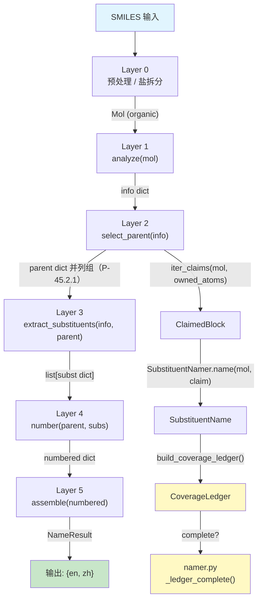

# 核心数据契约 (Core Data Contracts)

> 本文档定义 NamePredict 6 层流水线中流转的 **全部关键数据结构** 的字段规格。每个数据结构均标注源文件与行号，便于代码导航。

---

## 数据流全景



**流程说明**：

1. SMILES 经 Layer 0 预处理后得到有机部分的 `Mol` 对象
2. Layer 1 分析 Mol，产出 **info dict** —— 分子中全部官能团 occurrence 的"一次性全景快照"
3. Layer 2 基于 info 选择母体，产出 **并列候选组 `list[parent dict]`**（P-45.2.1 前缀取代基团数最多者）；未覆盖原子由 `iter_claims()` 切分为 **ClaimedBlock**
4. Layer 3 为每个 ClaimedBlock 命名，产出 **SubstituentName** 并组装 **subst dict** 列表；`namer._ledger_complete()` 用 **CoverageLedger** 对 owned 做缺口门控
5. Layer 4 对 parent + subs 进行编号，产出 **numbered dict** —— 带完整位次信息的增强 parent + 带 locant 的 subs
6. Layer 5 将 numbered dict 组装为最终中英双语 **NameResult**

---

## 1. info dict（L1 输出）

**全称**: Functional Group Information Dictionary（官能团信息字典）

**产出**: `analyze(mol)` in `src/namepredict/layer1/analyzer.py:489`

**构建**: `_info(mol, carbons)` at `analyzer.py:484`，由三段合并：
- `base`: `mol`, `carbon_ids`, `n_carbons`
- `_collect_fgs(mol)`（`analyzer.py:477`）: `double_bonds`, `triple_bonds`, `fg_inventory`
- `_ring_meta(mol)`（`analyzer.py:380`）: 环系元信息

`namer._name_mol` 在 `analyze()` 返回后再注入 `root_ctx`（`namer.py:227`）与 `salt`（`namer.py:228`）——不属于 `_info` 的三段合并。

**输入方**: Layer 2 (`select_parent(info)`), Layer 3 (`extract_substituents(info, parent, ...)`), Layer 4 (间接通过 parent), Layer 5 (间接)

### 基础字段

| 字段 | 类型 | 产出 | 说明 |
|---|---|---|---|
| `mol` | `rdkit.Chem.Mol` | `_info` | 原始 RDKit 分子对象引用（有机部分，已去盐） |
| `carbon_ids` | `list[int]` | `_info` | 分子中所有碳原子的 atom index |
| `n_carbons` | `int` | `_info` | 碳原子总数（= `len(carbon_ids)`） |
| `root_ctx` | `tuple[Mol, list[int]]` | `namer._name_mol`（`namer.py:227`） | 根分子上下文 `(根Mol, 本分子原子→根索引映射)`；供 Layer3 取代基 R/S 在完整根分子上重算 |
| `salt` | `dict` | `namer._name_mol`（`namer.py:228`） | Layer0 盐元数据（`metal`/`metal_zh`/`n_metal`/`acid_salt`/…）；磷酸母体 producer（`principal_expression._chain_phosphate_fields`，`principal_expression.py:346`）据此做盐门控并写入 `salt_meta` |

> **info dict 不携带 `has_*` 布尔标志，也不携带按 FG 类分组的条目列表**——全部官能团事实只经 `fg_inventory` 一个出口承载，存在性由清单内容判定。

### 官能团清单 `fg_inventory`

`fg_inventory` 的类型是 `FunctionalGroupInventory`（`layer1/functional_group_inventory.py:40`），由 `build_inventory(parts, mol, demoted)`（`functional_group_inventory.py:115`）在 `_collect_fgs` 内构建；`inventory_from_info(info)`（`functional_group_inventory.py:121`）是下游唯一取用入口（缺失即抛 `KeyError`，不静默退化为空清单）。

```python
@dataclass(frozen=True)
class FunctionalGroupInventory:          # functional_group_inventory.py:40-51
    entries: tuple[FunctionalGroupOccurrence, ...]

    def occurrences(self, group_class) -> tuple[...]   # 该类全部未降级 occurrence
    def demoted_entries(self) -> tuple[...]            # 被 P-41 仲裁降级为前缀叶的条目
```

```python
@dataclass(frozen=True)
class FunctionalGroupOccurrence:          # functional_group_inventory.py:29-37
    id: str                               # "{list_key}:{i}"，如 "hydroxyls:0"
    group_class: FunctionalGroupClass      # functional_group_inventory.py:10
    characteristic_atoms: frozenset[int]   # 特征原子（默认 center ∪ surr，例外见 FG_ATOM_FNS）
    parent_anchors: frozenset[int]         # 由 FgSpec.anchors 声明的 key 从 payload 取出
    payload: dict                          # L1 原始条目 dict
    demoted: bool = False                  # P-41 仲裁降级为前缀叶（P-61.1.3 carboxy/cyano）
```

`FunctionalGroupClass`（`functional_group_inventory.py:10`）共 **15 个成员**：14 个 P-41 类别 + `NONE = "alkane"`（无 primary FG）。类别 ↔ 列表键的映射由 `fg_registry.FG_SPECS` 派生（`_LIST_CLASSES`，`functional_group_inventory.py:53`），锚点 key 亦同源（`_ANCHOR_KEYS`，`functional_group_inventory.py:55`）。

### FG 条目列表与 payload 结构

每个 `FunctionalGroupClass` 对应一个 L1 检测列表键（`FgSpec.list_key`），键集由 `_detect_parts`（`analyzer.py:462`）一次产出，**唯一事实来源是 `fg_registry.FG_SPECS`**：

| `group_class` | 列表键 | 条目 payload 键 | 检测函数 |
|---|---|---|---|
| `RADICAL` | `radicals` | `center_idx`（`*` 锚点碳）、`surr_idx=[]` | `_radical_entries`（`analyzer.py:427`，排除已判 acyl 头的碳） |
| `ACYL` | `acyls` | `center_idx`、`surr_idx`（=O 索引） | `_acyl_entries`（`analyzer.py:420`）；头碳由 `_is_acyl_head`（`analyzer.py:399`）判定（P-65.1.7.2） |
| `ACID` | `carboxyls` | `center_idx`（羧基碳）、`surr_idx`（2 个 O） | `_carboxyl_entries`（`analyzer.py:258`） |
| `PHOSPHATE` | `phosphates` | `p_idx`、`n_oh`、`n_om`、`n_arms` | `phosphate_entries`（`analyzer.py:98`）/ `_one_phosphate`（`analyzer.py:44`） |
| `ANHYDRIDE` | `anhydrides` | —（`_anhydride_entries`，`analyzer.py:313`，当前恒返回空 list，不产 occurrence） | `_is_anhydride_carbon`（`analyzer.py:305`） |
| `ESTER` | `esters` | `center_idx`、`surr_idx`（=O + 酯 O） | `_ester_entries`（`analyzer.py:293`） |
| `ACYL_HALIDE` | `acyl_chlorides` | `center_idx`、`surr_idx`（=O + 卤素） | `_acyl_chloride_entries`（`analyzer.py:283`）→ `acyl_halide_entries`（`layer1/acyl_halide.py:50`） |
| `AMIDE` | `amides` | `center_idx`、`surr_idx`（=O + N） | `_amide_entries`（`analyzer.py:275`） |
| `NITRILE` | `nitriles` | `center_idx`（腈碳）、`surr_idx`（N） | `_nitrile_entries`（`analyzer.py:368`） |
| `ALDEHYDE` | `aldehydes` | `center_idx`、`surr_idx`（=O） | `_aldehyde_entries`（`analyzer.py:279`） |
| `KETONE` | `ketones` | `center_idx`、`surr_idx`（=O） | `_ketone_entries`（`analyzer.py:266`） |
| `ALCOHOL` | `hydroxyls` | `center_idx`（O）、`surr_idx`（所连 C） | `_hydroxyl_entries`（`analyzer.py:218`） |
| `THIOL` | `thiols` | `center_idx`（S）、`surr_idx`（所连 C） | `_thiol_entries`（`analyzer.py:222`） |
| `AMINE` | `amines` | `center_idx`（N）、`surr_idx`（全部碳臂） | `_amine_entries`（`analyzer.py:249`） |

锚点 key（`parent_anchors`）：`radical`/`acyl`/`acid`/`acyl_halide`/`ester`/`amide`/`nitrile`/`aldehyde`/`ketone` 取 `center_idx`；`alcohol`/`thiol`/`amine` 取 `surr_idx`；`phosphate` 取 `p_idx`；`anhydride` 无锚点。

`characteristic_atoms` 默认取 `center_idx ∪ surr_idx`（`center_surr_atoms`，`functional_group_inventory.py:79`）；例外表 `FG_ATOM_FNS`（`functional_group_inventory.py:88`）只登记 `phosphate` → `_phosphate_atoms`（`functional_group_inventory.py:73`，P 中心 + 全部氧）。

### P-41 主基团仲裁

`_arbitrate_parts(parts)`（`analyzer.py:447`）在清单构建之前按 `FgSpec.p41` 做一次整组压制：`_SUPPRESSIBLE`（`analyzer.py:443` = `CARBONYL_COMPOSITES` + `nitriles`）中的组合 FG 只要存在 `p41` 更小的 FG（如自由基、酰基），即整组退出主基团——叶型降级（`_LEAF_DEMOTED = ("carboxyls", "nitriles")`，`analyzer.py:444`）保留条目、其 occurrence 打 `demoted=True`、碳排除出主链（P-61.1.3 carboxy/cyano 叶）；其余组（酯/酰胺/醛/酰卤/酸酐）整组清空。返回 `(parts, demoted_ids)`，`demoted_ids` 传给 `build_inventory` 落到 `FunctionalGroupOccurrence.demoted`。

### 不饱和度键（结构事实，不入清单）

| 键 | 类型 | 产出 | 说明 |
|---|---|---|---|
| `double_bonds` | `list[dict]` | `_bond_lists`（`analyzer.py:439`）→ `_double_bond_entries`（`analyzer.py:346`） | 每项 `{"c1": int, "c2": int}`（C=C，排除芳香键） |
| `triple_bonds` | `list[dict]` | `_triple_bond_entries`（`analyzer.py:350`） | 每项 `{"c1": int, "c2": int}`（C≡C） |

### 环系元信息

来自 `_ring_meta(mol)`（`analyzer.py:380`）：

| 字段 | 类型 | 说明 |
|---|---|---|
| `rings` | `list[dict]` | 每个环的原子索引信息，如 `{"atom_ids": (0,1,2,3,4,5)}`（`_ring_entries`，`analyzer.py:376`） |
| `n_rings` | `int` | 环的数量 |
| `has_ring` | `bool` | 是否含环（= `bool(rings)`）；`namer._prepare_candidate` 用它判定空链路候选（`namer.py:142`） |
| `ring_systems` | `list[dict]` | 环系（fused ring systems），由 `build_ring_systems(mol)`（`layer1/ring_systems.py`）产出 |
| `n_ring_systems` | `int` | 环系的数量 |

---

## 2. parent dict（L2 输出）

**全称**: Parent Structure Dictionary（母体结构字典）

**产出**: `select_parent(info)` at `src/namepredict/layer2/parent_selector.py:69`，返回 `list[dict]` —— P-44 评分降序经 P-45.2.1 重排后的 **并列最优组**（`_reorder_p45_2`，`parent_selector.py:44`；组大小由 `namer._MAX_TIED_CANDIDATES=4` 截取，`namer.py:107`）。

**构建**: 每个候选由 `_collect_candidates(info)`（`layer2/candidates.py:29`）经 `rule_driven_parent_candidates`（`layer2/principal_parent.py:45`）生成，再由 `_finalize_ranked(info, cands)`（`parent_selector.py:57`）按 `_p44_1_1`（`parent_selector.py:26`）排序、`pack_parent_stem`（`kind_registry.py:65`）补词干、`finalize_parent_ownership`（`parent_ownership.py:37`）固化 `owned_atoms`。

### 通用字段

| 字段 | 类型 | 产出 | 说明 |
|---|---|---|---|
| `kind` | `str` | `_parent_dict`（`principal_expression.py:130`） | 母体类型；FG 正交化后为 FG 类别名（`"acid"`/`"ketone"`/`"radical"`/`"phosphate"`…）或纯烃 `"alkane"`、`FunctionalGroupClass.NONE.value` |
| `chain` | `list[int]` | `_parent_dict` | 骨架原子索引（主链或环系统原子集） |
| `n_carbons` | `int` | `_parent_dict` | = `len(chain)` |
| `covered_principal_ids` | `tuple[str, ...]` | `_parent_dict` | 本骨架表达的主基团 occurrence id |
| `principal_occurrences` | `tuple[FunctionalGroupOccurrence, ...]` | `_parent_dict` | **全部**主基团 occurrence（不限本骨架覆盖），供 L2 所有权判定 |
| `principal_group_count` | `int` | `_parent_dict` | 主基团 occurrence 个数（= `len(occurrences)`） |
| `principal_expression_facts` | `PrincipalExpressionFacts` | `_parent_dict` | 主基团表达事实（见下节），下游锚点/位次的主要载体 |
| `owned_atoms` | `frozenset[int]` | `finalize_parent_ownership`（`parent_ownership.py:37`） | 母体拥有的全部原子索引（链 ∪ 主基团特征原子），不可变；已存在则原样返回 |
| `stem_en` / `stem_zh` | `str` | `pack_parent_stem`（`kind_registry.py:65`） | 双语母体词干（保留名可带 `1H-`/`1,3-` locant 前缀） |
| `mol` | `rdkit.Chem.Mol` | `pack_parent_stem` | RDKit Mol 引用（环外基团归属判定用） |
| `numbering_scaffold` | `dict` / 缺省 | `pack_parent_stem` → `numbering_scaffold_facts`（`ring_scaffold.py:398`） | 稠环编号骨架事实：`{"scaffold_id": str, "labels": tuple, "relative_stereo": None}` |
| `numbering_scaffold_required` | `bool` | `_attach_numbering_scaffold`（`kind_registry.py:33`） | 有编号骨架事实时置 `True` |

`owned_atoms` 的计算：`compute_owned_atoms(parent, mol)`（`parent_ownership.py:32`）= 链原子 ∪ `_kind_fg_atoms`（`parent_ownership.py:12`，落在骨架内/直接连骨架的 occurrence 锚点及其直接相连的特征原子）。

### PrincipalExpressionFacts（`principal_expression.py:33-43`）

```python
@dataclass(frozen=True)
class PrincipalExpressionFacts:
    group_class: FunctionalGroupClass        # 主基团类别
    multiplicity: int                        # 主基团实例数（L5 数量后缀据此派生）
    relation: PrincipalRelation              # "in_skeleton" | "exocyclic"
    occurrence_ids: tuple[str, ...]
    characteristic_atoms: frozenset[int]
    anchor_atoms: frozenset[int]             # 官能团原锚点（occurrence.parent_anchors）
    attachment_atoms: frozenset[int]         # 骨架内附着原子（骨架外锚点取其骨架内邻居）
    charge_state: PrincipalChargeState       # "neutral" | "anion" | "mixed"
```

产出方：`_facts(selection, skeleton, occurrences, mol)`（`principal_expression.py:119`），链骨架经 `express_chain_principal`（`principal_expression.py:446`）、环骨架经 `express_ring_principal`（`principal_expression.py:256`）。L4 位次一律由 `_principal_atoms(parent)`（`numbering_engine.py:139`，取 `facts.attachment_atoms`）与 `locant_calc._typed_atom_locants` 读取，扁平锚点字段不参与位次计算。

### 扁平锚点字段（仅 RADICAL / ACYL）

`_semantic_anchor_fields`（`principal_expression.py:58`）只为 `_SEMANTIC_ANCHOR_FGS = {RADICAL, ACYL}`（`principal_expression.py:55`）写单数字段，其余 FG 类别的锚点全部经 `principal_expression_facts` 流转。`constants.FIXED_START_KEYS`（`constants.py:168`）列出这些 P-14.4(a) 固定 locant 1 字段：

| 字段 | 类型 | 出现条件 | 说明 |
|---|---|---|---|
| `radical_c_idx` | `int` | `radical` 类、单锚点（`_semantic_anchor_fields`，`principal_expression.py:58`） | `*` 自由基锚定碳（对称 scaffold 镜像取 locant 1） |
| `acyl_c_idx` | `int` | `acyl` 类、单锚点（同上） | 酰基残基羰基头碳（`parent_anchor_fields=("acyl_c_idx","acyl_c_idxs")`） |

### FG / 拓扑专属字段（按 kind 选择性存在）

| 字段 | 类型 | 出现条件 | 说明 | 产出 |
|---|---|---|---|---|
| `radical_anchor_element` | `str` | 杂原子锚点 `radical` 系 | 锚点元素 `"N"`/`"O"`/`"P"`/`"S"`；L5 `_mononuclear_radical_names`（`assembler.py:292`）据此转单核氢化物管线 | `_mononuclear_radical`（`principal_expression.py:398`） |
| `stem_en` / `stem_zh` | `str` | 同上（覆盖 `pack_parent_stem` 结果） | 单核氢化物 free 名 | 同上 |
| `radical_ylidene` | `bool` | 碳锚点自由价为双键 | L5 出 `-ylidene`（`_ylidene_form`，`chain_engine.py:321`） | `_radical_ylidene`（`principal_expression.py:423`） |
| `ring_attach_idx` | `int` | 环 + 单附着 exocyclic FG（`ACID`/`ESTER`/`AMIDE`/`NITRILE`/`ALDEHYDE`/`ACYL`） | 环上附着原子索引（环外 -carbonyl/-carboxylic acid 词形的 locant） | `_ring_fact_fields`（`principal_expression.py:196`） |
| `double_bond` / `double_bonds` | `tuple[int,int]` / `list[tuple]` | 骨架内 C=C | 单键写单数、多键写复数 | `_chain_unsat_fields`（`principal_expression.py:302`） |
| `triple_bond` / `triple_bonds` | `tuple[int,int]` / `list[tuple]` | 骨架内 C≡C | 同上 | 同上 |
| `o_idx` / `alkoxy_n` | `int` | `ester` 类 | 酯烷氧基桥 O 索引；`alkoxy_n` 仅在严格线性单酯时给 0 | `_chain_ester_fields`（`principal_expression.py:362`）/ `ester_fields`（`principal_expression.py:250`） |
| `hal_idx` / `hal_z` | `int` | `acyl_halide` 类（链/环外） | 卤原子索引与原子序（F/Cl/Br/I）；L5 `_ACYL_HALIDE_BY_HAL` 据此选后缀 | `_chain_acyl_halide_fields`（`principal_expression.py:432`） |
| `n_oh` / `n_om` / `n_arms` | `int` | `phosphate` 类 | 酸式 H 氧数 / 阴离子氧数 / O–R 臂数（L1 `n_oh`/`n_om`/`n_arms` 透传） | `_chain_phosphate_fields`（`principal_expression.py:346`） |
| `salt_meta` | `dict` / `None` | `phosphate` 类（盐门控通过） | 盐门控通过后的 Layer0 盐元数据；门控不通过则整个候选返回 `None` | 同上 |
| `scaffold_id` | `str` | 解析到 scaffold | 骨架标识（`"benzene"`/`"fused"`/`"carbocycle"`/保留母体 id） | `_scaffold_fields`（`principal_expression.py:208`） |
| `scaffold_identity` | `ScaffoldIdentity` | 同上 | scaffold 解析对象 | 同上 |
| `scaffold_match` | `tuple` / `None` | 保留模板命中 | 模板原子 → 分子原子映射（L4 固定编号用） | 同上 |
| `typed_ring_expression_supported` | `bool` | 同上 | 环骨架能否 typed 表达 | 同上 |
| `hydro_atoms` | `frozenset[int]` | 氢化衍生物 | 加氢位（P-31.2.2），L4 换算为 hydro 前缀位次 | `hydrogenated_atoms`（`ring_scaffold.py:300`） |
| `fused_tree` | `FusedNode` | 多环骨架（sssr 环数 ≥ 2） | 稠环拆解树，L5 `fused_namer` 组装稠合名 | `_scaffold_fields` |
| `anion` | `bool` | 酸全阴离子 | L5 据此转 `-ate`/`-酸根` | `_expression_flags`（`principal_expression.py:93`） |

> 注：杂原子锚点自由基母体（`radical_anchor_element` 存在）的 `stem_en`/`stem_zh` 由锚点元素与氧化态/自由价键级选定，取值域为——N：`azane`/`氮烷`（自由价单键）或 `imine`/`亚胺`（自由价双键）；O：`oxidane`/`氧化烷`；S：`sulfane`/`硫烷`（0 个 =O）、`sulfinyl`/`亚磺酰`（1 个）、`sulfonyl`/`磺酰`（2 个）；P：`phosphanyl`/`磷烷基`（0 个 =O）或 `phosphoryl`/`磷酰`（1 个）。词表在 `constants.py`：`MONONUCLEAR_HYDRIDES`（`constants.py:126`）、`MONONUCLEAR_BY_ELEMENT`（`constants.py:136`）、`SULFUR_STEM_BY_OXO`（`constants.py:137`）、`PHOSPHORUS_STEM_BY_OXO`（`constants.py:138`）、`NITROGEN_STEM_BY_FREE_DOUBLE`（`constants.py:139`）；P 的 `=O` 数不落 0/1 时 `_mononuclear_radical` 返回 `None` 明确失败。

### P-44 / P-45 选择键

| 键 | 产出 | 说明 |
|---|---|---|
| `P44Facts.principal_group_class` / `principal_group_count` | `principal_key`（`parent_selector.py:21`） | 排序键；`principal_group_class` 当前以 `None` 传入，实际判别量为 `principal_group_count` |
| P-45.2.1 前缀取代基团数 | `_p45_2_prefix_count`（`parent_selector.py:37`） | `len(iter_claims(mol, owned_atoms))`（无 cache 依赖） |
| P-44.1.1 后缀位次集合 | `suffix_locant_set`（`candidate_keys.py:7`） | 写入 `NameResult.meta["p44_1_1_key"]` |
| P-45.2.2 前缀位次集合 | `prefix_locant_set`（`candidate_keys.py:22`） | 写入 `NameResult.meta["p45_2_2_key"]`；`namer._best_hit`（`namer.py:154`）取最小者 |

---

## 3. ClaimedBlock（L2 -> L3 桥接类型）

**全称**: Ownership-Only Claimable Side Block

**定义**: `src/namepredict/layer3/claimable_block.py:20-26`

**用途**: 描述 parent 未覆盖的一个"外侧"原子组件（side block），仅记录拓扑归属信息，不含名称。Layer 3 基于 ClaimedBlock 生成 `SubstituentName`。

```python
@dataclass(frozen=True)
class ClaimedBlock:
    slot: SideSlot          # 附着位置类型
    attach_parent: int      # 母体侧附着点 atom index
    root: int               # 取代基侧根原子 atom index
    atoms: frozenset[int]   # 该侧块的所有原子索引（不可变集合）
```

### SideSlot 枚举

定义于 `layer3/claimable_block.py:11-17`：

| 值 | 含义 |
|---|---|
| `CHAIN_C` | 附着于母体链上的碳原子（`_carbon_slot`，`claimable_block.py:58`） |
| `RING_C` | 附着于母体环上的碳原子（同上） |
| `AMIDE_N` | 附着于酰胺氮（`_is_amide_n`，`claimable_block.py:44`：N 与 owned 内带 =O 的羰基碳单键相连） |
| `AMINE_N` | 附着于胺氮（`_is_amine_n`，`claimable_block.py:50`；当前实现恒返回 `False`，故不产出该槽位） |
| `OTHER` | 其他类型（杂原子附着；`namer._claim_from_sub` 亦以此构造合成 claim，`namer.py:53`） |

### 产出函数

`iter_claims(mol, owned_atoms)` at `layer3/claimable_block.py:163`：遍历所有外侧重原子组件（`_unique_components`，`claimable_block.py:152`），为每个组件经 `_try_claim`（`claimable_block.py:136`）确定 canonical edge `(attach_parent, root)` 与 slot，返回按 `(attach_parent, root, slot.value)` 排序的 `list[ClaimedBlock]`。

---

## 4. SubstituentName（L3 内部类型）

**定义**: `src/namepredict/layer3/substituent_namer.py:13-19`

**用途**: ClaimedBlock 经过命名后的结果，包含中英文名称和书写规则。

```python
@dataclass(frozen=True)
class SubstituentName:
    claim: ClaimedBlock        # 来源声明块
    en: str                    # 英文取代基名称（如 "methyl", "chloro"）
    zh: str                    # 中文取代基名称（如 "甲基", "氯"）
    requires_parentheses: bool # 命名时是否需要括号（如复合取代基）
```

**产出**: `SubstituentNamer.name(mol, claim)` at `substituent_namer.py:97`，按 `self._backends` 顺序依次尝试（默认 `[RetainedBackend(), RecursiveBackend(...)]`，`_default_backends`，`substituent_namer.py:85`），返回第一个成功的结果；全部失败返回 `None`。

---

## 5. Substituent dict（L3 输出 -> L4 输入）

**全称**: Substituent Dictionary（取代基字典）

**产出**: `extract_substituents(info, parent, *, cache=None)` at `src/namepredict/layer3/substituent_extractor.py:6`（内部转调 `extract_claimed_sides(info, parent, (), cache=cache)`，`claim_extract.py:76`；`root_ctx` 自 `info.get("root_ctx")` 注入）

**用途**: 每个 dict 描述一个待编号的取代基。Layer 4 通过 `_with_locants()`（`locant_calc.py:64`）向每个 subst dict 注入 `locant` 字段。

### 内置取代基字段（L3 产出）

字段由 `sub_from_named(named, mol)`（`claim_extract.py:28`）装配：

| 字段 | 类型 | 说明 |
|---|---|---|
| `kind` | `str` | 取代基类型（`"amide_n"`/`"amine_n"`/`"n_block"`/`"alkyl"`/`"halo"`/`"side"` 等；槽位 → kind 用 `constants.CLAIM_KIND`，`constants.py:154`，名称暗含 kind 用 `constants.NAME_KIND`，`constants.py:149`） |
| `en` | `str` | 英文名称（如 `"methyl"`, `"chloro"`, `"hydroxy"`） |
| `zh` | `str` | 中文名称（如 `"甲基"`, `"氯"`, `"羟基"`） |
| `attach_idx` | `int` | 附着于母体的原子索引（= `claim.attach_parent`） |
| `atoms` | `list[int]` | 取代基占用的所有原子索引（升序） |
| `paren` | `bool` | 命名时是否需要括号包裹（= `SubstituentName.requires_parentheses`） |
| `n_carbons` | `int` | 取代基中的碳原子数（影响排序优先级） |
| `o_side` | `bool` | 仅 O 侧烷基臂：附着原子是氧且母体为 `constants.ESTER_O_SIDE_KINDS`（`constants.py:156`，`{"ester", "phosphate"}`）之一或带 `o_idx` 字段时置入（`claim_extract.py:59`、`claim_extract.py:81`）。L5 `join_ester_name`（`assembler.py:460`）/ `phosphate_names` 消费 |

### L4 注入字段

| 字段 | 类型 | 注入方 | 说明 |
|---|---|---|---|
| `locant` | `int` / `str` | `_with_locants(chain, substituents, facts)` at `locant_calc.py:64` | 该取代基在母体链上的位次编号（不在链上取 0） |

---

## 6. CoverageLedger（L3 -> Namer 桥接）

**全称**: Heavy-Atom Coverage Ledger（重原子覆盖台账）

**定义**: `src/namepredict/layer3/coverage.py:12-23`

**用途**: 记录 parent 所有权与已命名 claim 对分子重原子的覆盖，给出遗漏（gap）与重叠（overlap）。

```python
@dataclass(frozen=True)
class CoverageLedger:
    owned_atoms: frozenset[int]                # parent 拥有的原子
    named_claims: tuple[SubstituentName, ...]  # 已命名的取代基列表
    gap: frozenset[int]                         # 未被任何方覆盖的重原子
    overlap: frozenset[int]                     # 被多方同时覆盖的重原子

    @property
    def complete(self) -> bool:
        return not self.gap and not self.overlap
```

**构建**: `build_coverage_ledger(mol, *, owned_atoms, names)` at `coverage.py:57-72`

**使用**: `namer._ledger_complete(mol, owned, subst)` at `namer.py:63-65`——以 `names=[]` 构建台账，故实际门控**只看 gap**（owned_atoms 是否覆盖全部重原子），named_claims / overlap 维不参与。门控结果经 `namer._try_phase`（`namer.py:164`）写入 `NameResult.meta["coverage_complete"]`，并同时写入 `meta["fallback"] = "no_coverage_gate"`。

---

## 7. numbered dict（L4 输出 -> L5 输入）

**全称**: Numbered Structure Dictionary（编号结构字典）

**产出**: `number(parent, substituents)` at `src/namepredict/layer4/numbering.py:84`

**构建**: `_pack(oriented, subs_with_locants)` at `locant_calc.py:155`；`oriented = {**parent, "chain": orient_numbering(parent, substituents)}`（`numbering.py:86-87`）。

### 结构

```python
{
    "parent":       {...},    # 增强的 parent dict（定向后的 chain + 全部母体字段 + 立体/指示氢事实）
    "substituents": [...],    # list[subst dict]，每项已注入 locant
    # principal FG 位次: 结构化稀疏列表, 只含实际存在的 FG:
    "fg_locants":   list[dict],  # [{kind, locants, omit}, ...]
    # 不饱和度位次 (扁平字段, 烯/炔独立于 fg_locants):
    "ene_locants":            list[int] | None,
    "omit_ene_locant":        bool,
    "yne_locants":            list[int] | None,
    "omit_yne_locant":        bool,
    # 由 L5 assembler._mononuclear_radical_names 按需置入:
    "bridge_self_enclosed":   bool,
}
```

`fg_locants` 每项结构：

```python
{
    "kind":     "oh" | "amine" | "ketone" | "sh" | "acid" | "ester" | "amide" | "nitrile" | "aldehyde" | "acyl" | "radical",  # FG 类别 (fg_registry FgSpec.locant_kind)
    "locants":  list[int],   # 统一列表 (单 FG 也是 [x]); 由 principal_expression_facts 附着原子经 chain 换算
    "omit":     bool,        # L4 omit_locants.py 规则算好的省略标志
}
```

### numbered["parent"] 的附加字段

`number()` 在 `_pack` 之后向 `numbered["parent"]` 写入三个字段（`numbering.py:107-110`）：

| 字段 | 类型 | 产出 | 说明 |
|---|---|---|---|
| `indicated_h_locants` | `list[str]` | `indicated_hydrogen(mol, chain, labels, hydro, extra)`（`indicated_hydrogen.py:32`） | 需显式标出的指示氢位次（P-58.2.1） |
| `indicated_h_forced` | `bool` | `_extra_indicated(packed)`（`numbering.py:115`） | 指示氢来自保留母体名未隐含的芳环位时置 `True`（无 hydro 前缀也须注入） |
| `hydro_prefix` | `tuple[str, str]` | `hydro_prefix(chain, labels, hydro_atoms)`（`numbering.py:63`） | 加氢前缀 `(en, zh)`（P-14.3.4.5 / P-31.2.2）；位次表达不出时回退 `("", "")` |

`numbering_scaffold`（若 `parent` 原本没有）也会在稠合路径被写入 `{"scaffold_id": "fused", "labels": ..., "relative_stereo": None}`（`numbering_engine.py:308-310`）。

### locant 产出方

| 产出方 | 内容 |
|---|---|
| `_fg_locants(oriented, n_subs)` at `locant_calc.py:142`（数据表 `_FG_LOCANTS`，`locant_calc.py:140`，由 `fg_registry.FgSpec.locant_kind`/`locant_source` 派生） | `fg_locants`: `[{kind, locants, omit}]` — 稀疏，只产实际存在的 principal FG |
| `_unsat_locants(oriented, n)` at `locant_calc.py:95` | `ene_locants`, `omit_ene_locant`, `yne_locants`, `omit_yne_locant` |
| `_with_locants(chain, substituents, facts)` at `locant_calc.py:64` | 每个 subst dict 的 `locant` |

位次原子一律取自 `principal_expression_facts.attachment_atoms`（`_locants_for`，`locant_calc.py:132`；`locant_source` 为 `anchor_field` 时改读 `parent_anchor_fields[0]`，为 `attachment_exocyclic` 时仅环外表达才产出）。`omit` 由 `omit_locants.omit_fg_locant`（`omit_locants.py:10`）判定，不饱和位次由 `omit_locants.omit_unsat`（`omit_locants.py:22`）判定（`triple=True` 走炔规则：二/三核炔 ethyne/propyne 位次 1 省略，C3 烯丙-1-烯仍保留）。

---

## 8. NameResult（L5 输出 / 最终 API 返回）

**全称**: Named Result Dataclass

**定义**: `src/namepredict/types.py:8-16`

**用途**: NamePredict 的最终对外返回值，包含中英文 IUPAC 名称及元信息。

```python
@dataclass
class NameResult:
    en: str                # 英文 IUPAC 名称
    zh: str                # 中文 IUPAC 名称
    success: bool          # 命名是否成功
    source: str = "iupac"  # 命名来源标识
    time_ms: float = 0.0   # 累计处理时间（毫秒）
    meta: dict[str, Any] = field(default_factory=dict)  # 元信息字典
```

### meta 字段

成功路径由 `_ok_result()`（`namer.py:68`）、`_try_phase()`（`namer.py:164`）与 `_assemble_candidate()`（`namer.py:121`）三处累加填充：

| 字段 | 类型 | 来源 | 说明 |
|---|---|---|---|
| `parent_chain` | `list[int]` | `_chain_meta()` at `namer.py:39` | 母体链的原子索引列表；缓存写入前由 `_canonical_result()`（`namer.py:252`）改写为规范排序 |
| `parent_kind` | `str` | `_chain_meta()` | 母体 `kind`（`"phosphate"` 触发 L5 磷酸整名与盐后缀跳过，`namer.py:196`） |
| `parent_labels` | `list` | `_chain_meta()` → `_label_list()` at `namer.py:46` | 稠环桥头字母位（`3a`/`6a`）；长度与 `chain` 不符时为空表 |
| `bridge_self_enclosed` | `bool` | `_chain_meta()`（读 numbered 顶层同名键） | S/P 桥复合前缀名已自含围栏标记，由 L5 `_mononuclear_radical_names`（`assembler.py:310`）置入 `numbered`；L3 读到该标记即按原样使用，不整体加括号 |
| `coverage_complete` | `bool` | `_try_phase()` at `namer.py:170` | `_ledger_complete` 的缺口门控结果（覆盖 `_ok_result` 写入的初始 `True`） |
| `parent_substituent_count` | `int` | `_ok_result()` at `namer.py:75` | `len(numbered["substituents"])`，供 Layer3 递归取代基判定"词干是否复合"时直读 |
| `p44_1_1_key` | `tuple` | `_assemble_candidate()` at `namer.py:129` | P-44.1.1 后缀位次集合（`candidate_keys.suffix_locant_set`），并列候选裁决键 |
| `p45_2_2_key` | `tuple` | `_assemble_candidate()` at `namer.py:130` | P-45.2.2 前缀位次集合（`candidate_keys.prefix_locant_set`），`_best_hit()` 取最小者 |
| `fallback` | `str` | `_try_phase()` at `namer.py:170` | 恒为 `"no_coverage_gate"` |
| `attempts` | `list` | `_try_phase()` at `namer.py:170` | 本阶段尝试记录（`_run_candidates` 以空 list 传入） |
| `salt` | `dict` | `_name_mol()` at `namer.py:232` | Layer0 盐元数据字典（仅在 `salt` 非空且成功时写入） |
| `reason` | `str` | `_fail()` at `namer.py:26` | 失败原因（`"parse"` / `"no_assemblable_candidate"` / `"unsupported"`） |
| `n_carbons` / `kind` | `int` / `str` | `assembler._unsupported()` at `assembler.py:422` | 仅 L5 组名失败时随 `reason="unsupported"` 写入 |

### 实例化路径

- **成功路径**: `_ok_result()`（`namer.py:68`）→ `assemble(numbered, time_ms=...)` → `NameResult(en=..., zh=..., success=True, ...)`
- **失败路径**: `namer._fail()`（`namer.py:26`）→ `NameResult(en="", zh="", success=False, reason="...")`

---

## 数据流转汇总表

| 阶段 | 输入 | 产出 | 产出类型 | 关键函数 |
|---|---|---|---|---|
| L0 -> L1 | SMILES | `Mol` (organic) | `rdkit.Chem.Mol` | `preprocess(smiles)` |
| L1 | `Mol` | **info dict** | `dict` | `analyze(mol)` |
| L2 | info dict | **list[parent dict]** | `list[dict]` | `select_parent(info)` |
| L2 -> L3 | parent (`owned_atoms`) | **ClaimedBlock** | `dataclass` | `iter_claims(mol, owned_atoms)` |
| L3 | ClaimedBlock | **SubstituentName** | `dataclass` | `SubstituentNamer.name(mol, claim)` |
| L3 | info + parent | **subst dict** | `list[dict]` | `extract_substituents(info, parent)` |
| L3 -> Namer | owned | **CoverageLedger** | `dataclass` | `build_coverage_ledger(mol, owned_atoms=..., names=[])` |
| L4 | parent + subst dicts | **numbered dict** | `dict` | `number(parent, substituents)` |
| L5 | numbered dict | **NameResult** | `dataclass` | `assemble(numbered)` |

---

## 相关页面

- [[architecture/layer0-preprocessor]] — 预处理与盐拆分
- [[architecture/layer1-analyzer]] — FG 分析器详解
- [[architecture/layer2-parent-selector]] — 母体选择器详解（核心）与优先级
- [[architecture/layer3-substituents]] — 取代基提取与命名
- [[architecture/layer4-numbering]] — 编号与定位符分配
- [[architecture/layer5-name-assembly]] — 中英双语名称组装
- [[concepts/functional-group-priority]] — 官能团分类与优先级表
- [[concepts/bilingual-naming]] — 中英双语命名约定
- [[index]] — Wiki 首页
