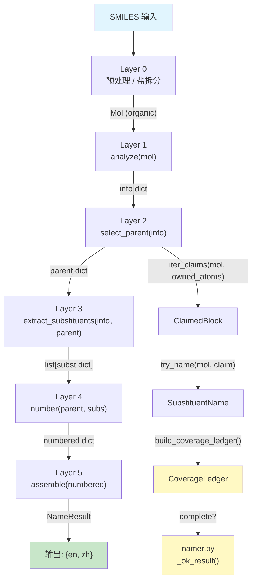

# 核心数据契约 (Core Data Contracts)

> 本文档定义 NamePredict 6 层流水线中流转的 **全部关键数据结构** 的字段规格。每个数据结构均标注源文件与行号，便于代码导航。

---

## 数据流全景



**流程说明**：

1. SMILES 经 Layer 0 预处理后得到有机部分的 `Mol` 对象
2. Layer 1 分析 Mol，产出 **info dict** —— 分子中所有官能团和环系的"一次性全景快照"
3. Layer 2 基于 info 选择母体，产出 **parent dict**；同时通过 `iter_claims()` 将 parent 未覆盖的原子切分为 **ClaimedBlock** 列表
4. Layer 3 为每个 ClaimedBlock 命名，产出 **SubstituentName**；同时从 info + parent 提取内置取代基，产出 **subst dict** 列表；通过 **CoverageLedger** 验证全分子覆盖
5. Layer 4 对 parent + subs 进行编号，产出 **numbered dict** —— 带完整位次信息的增强 parent + 带 locant 的 subs
6. Layer 5 将 numbered dict 组装为最终中英双语 **NameResult**

---

## 1. info dict（L1 输出）

**全称**: Functional Group Information Dictionary（官能团信息字典）

**产出**: `analyze(mol)` in `src/namepredict/layer1/analyzer.py:521`

**构建**: `_info(mol, carbons, fgs)` at `analyzer.py:516`，由三层合并：
- `base`: `mol`, `carbon_ids`, `n_carbons`
- `fgs`: 所有 FG 条目列表 + 布尔标志 + `fg_inventory`（`_collect_fgs`）
- `_ring_meta(mol)`: 环系元信息

`namer._name_mol` 在 `analyze()` 返回后再注入 `root_ctx`（见基础字段表）供 Layer3 取代基 R/S 回根重算——不属于 `_info` 的三层合并。

**输入方**: Layer 2 (`select_parent(info)`), Layer 3 (`extract_substituents(info, parent)`), Layer 4 (间接通过 parent), Layer 5 (间接)

### 基础字段

| 字段 | 类型 | 说明 |
|---|---|---|
| `mol` | `rdkit.Chem.Mol` | 原始 RDKit 分子对象引用（有机部分，已去盐） |
| `carbon_ids` | `list[int]` | 分子中所有碳原子的 atom index |
| `n_carbons` | `int` | 碳原子总数（= `len(carbon_ids)`） |
| `root_ctx` | `tuple[Mol, list[int]]` | 根分子上下文 `(根Mol, 本分子原子→根索引映射)`，由 `namer._name_mol` 注入；供 Layer3 取代基 R/S 在完整根分子上重算（`_fix_rs_with_real`） |

### 官能团条目列表（FG entry lists）

每个 FG 列表为 `list[dict]`，每项是一个 dict，其字段因 FG 类型而异。以下列出全部 20 个列表键（来自 `_fg_parts` at `analyzer.py:494`，经 `_arbitrate_parts(mol, parts)` P-41 仲裁——被更高优先级主基团压制而退出的组合羰基 FG，其羰基碳降级并入 `ketones`（oxo 前缀候选），组成成员伯酰胺 N / 中性羧酸 OH 分别回收进 `amines` / `hydroxyls`）：

| 键名 | 条目 dict 典型字段 | 来源 |
|---|---|---|
| `carboxyls` | `c_idx`, `anion` | `analyzer.py:_carboxyl_entries` |
| `hydroxyls` | `o_idx`, `c_idx` | `analyzer.py:_hydroxyl_entries` |
| `esters` | 酯键原子索引 | `analyzer.py:_ester_entries` |
| `amides` | 酰胺键原子索引 | `analyzer.py:_amide_entries` |
| `ketones` | `c_idx` | `analyzer.py:_ketone_entries`（+ `_arbitrate_parts` 降级：组合羰基 FG 被更高优先级压制时羰基碳并入；其组成成员经 `_demoted_amide_amine`/`_demoted_acid_hydroxyl` 回收——伯酰胺 N → amines、中性羧酸 OH → hydroxyls） |
| `radicals` | 自由基（dummy 位点） | `analyzer.py` |
| `aldehydes` | `c_idx` | `analyzer.py` |
| `amines` | `n_idx` | `analyzer.py` |
| `quaternary_ammoniums` | 季铵 | `analyzer.py` |
| `nitriles` | `c_idx`, `n_idx` | `analyzer.py` |
| `double_bonds` | 双键原子对 | `analyzer.py` |
| `triple_bonds` | 三键原子对 | `analyzer.py` |
| `acyl_chlorides` | — | `analyzer.py` |
| `anhydrides` | — | `analyzer.py` |
| `thiols` | `s_idx` | `analyzer.py` |
| `ethers` | `o_idx` | `analyzer.py` |
| `sulfides` | `s_idx` | `analyzer.py` |
| `nitros` | — | `analyzer.py` |
| `isocyanates` | `c_idx`, `n_idx`, `x_idx`, `r_c_idx` | `layer1/isocyanate.py` |
| `isothiocyanates` | `c_idx`, `n_idx`, `x_idx`, `r_c_idx` | `layer1/isocyanate.py` |

> 13 个扩展 FG 列表键（`phosphates`/`phosphonics`/`carbamates`/`carbonates`/`sulfoxides`/`ureas`/`hydrazines`/`guanidines`/`sulfonamides`/`sulfonates`/`sulfonyl_chlorides`/`sulfonic_acids`/`sulfones`/`boronics`）已随检测模块删除。

### 布尔标志（Boolean flags）

对应 `_fg_bools(lists)` at `analyzer.py:416`，每个 `has_*` 标志 = `bool(对应的 FG 列表)`。共 **18 个**：

| 标志 | 对应列表 | 标志 | 对应列表 |
|---|---|---|---|
| `has_alcohol` | `hydroxyls` | `has_acid` | `carboxyls` |
| `has_ester` | `esters` | `has_amide` | `amides` |
| `has_ketone` | `ketones` | `has_aldehyde` | `aldehydes` |
| `has_amine` | `amines` | `has_nitrile` | `nitriles` |
| `has_alkene` | `double_bonds` | `has_alkyne` | `triple_bonds` |
| `has_acyl_chloride` | `acyl_chlorides` | `has_anhydride` | `anhydrides` |
| `has_thiol` | `thiols` | `has_ether` | `ethers` |
| `has_sulfide` | `sulfides` | `has_nitro` | `nitros` |
| `has_isocyanate` | `isocyanates` | `has_isothiocyanate` | `isothiocyanates` |

另有类型化键 `fg_inventory`：`FunctionalGroupInventory`（17 个 `FunctionalGroupClass` 类别，由 `functional_group_inventory.inventory_from_info` 构建）。

### 环系元信息

来自 `_ring_meta(mol)`：

| 字段 | 类型 | 说明 |
|---|---|---|
| `rings` | `list[dict]` | 每个环的原子索引信息，如 `{"atom_ids": [0,1,2,3,4,5]}` |
| `n_rings` | `int` | 环的数量 |
| `has_ring` | `bool` | 是否含环（= `n_rings > 0`） |
| `ring_systems` | `list[dict]` | 环系（fused ring systems），由 `build_ring_systems(mol)` 产出 |
| `n_ring_systems` | `int` | 环系的数量 |

---

## 2. parent dict（L2 输出）

**全称**: Parent Structure Dictionary（母体结构字典）

**产出**: `select_parent(info)` at `src/namepredict/layer2/parent_selector.py:27-28`；候选列表由 `iter_parent_candidates(info)` at `parent_selector.py:23-24` 生成。

**构建**: 每个候选由 `_collect_candidates(info)` 生成，经 `_finalize_ranked(info, cands)` 排序并注入 `owned_atoms`（frozenset）。

### 通用字段

| 字段 | 类型 | 说明 |
|---|---|---|
| `kind` | `str` | 母体类型标识符，如 `"alcohol"`, `"acid"`, `"pyridine"`, `"benzene"`, `"alkane"` 等 |
| `chain` | `list[int]` | 有序的母体骨架原子索引（主链或环系统） |
| `n_carbons` | `int` | 母体中碳原子数量 |
| `owned_atoms` | `frozenset[int]` | 母体拥有的全部原子索引（由 `finalize_parent_ownership` 设置，不可变） |
| `stem_en` | `str` | 英文 stem 名称（如 `"ethanol"`, `"benzoic acid"`） |
| `stem_zh` | `str` | 中文 stem 名称（如 `"乙醇"`, `"苯甲酸"`） |
| `mol` | `rdkit.Chem.Mol` | RDKit Mol 引用（由 `pack_parent_stem` 附加） |

### FG 专属字段（按 kind 选择性存在）

以下字段根据母体类型（`kind`）选择性出现，并非所有 parent dict 都包含全部字段：

| 字段 | 类型 | 出现条件（kind） | 说明 |
|---|---|---|---|
| `cooh_c_idx` | `int` / `list[int]` | `acid`, `polycarboxylic` 等 | 羧基碳的原子索引 |
| `aldehyde_c_idx` | `int` | `aldehyde` 系 | 醛基碳的原子索引 |
| `ketone_c_idx` | `int` | `ketone` 系 | 酮羰基碳的原子索引 |
| `oh_c_idx` | `int` | `alcohol` 系 | 羟基所连碳的原子索引 |
| `amine_c_idx` | `int` | `amine` 系 | 胺基所连碳的原子索引 |
| `nitrile_c_idx` | `int` | `nitrile` 系 | 腈基碳的原子索引 |
| `ester_c_idx` | `int` | `ester` 系 | 酯基碳的原子索引 |
| `amide_c_idx` | `int` | `amide` 系 | 酰胺基碳的原子索引 |
| `sh_c_idx` | `int` | `thiol` 系 | 硫醇所连碳的原子索引 |
| `double_bond` | `tuple[int,int]` | `alkene` 系 | 双键原子对 |
| `triple_bond` | `tuple[int,int]` | `alkyne` 系 | 三键原子对 |
| `numbering_scaffold` | `dict` / `None` | fused ring 系 | 稠环编号骨架事实（来自 L2 scaffold specs） |
| `numbering_scaffold_required` | `bool` | fused ring 系 | 是否必须提供 numbering scaffold |
| `scaffold_id` | `str` | fused ring 系 | 骨架标识符（如 `"naphthalene"`） |

---

## 3. ClaimedBlock（L2 -> L3 桥接类型）

**全称**: Ownership-Only Claimable Side Block

**定义**: `src/namepredict/layer3/claimable_block.py:21-27`

**用途**: 描述 parent 未覆盖的一个"外侧"原子组件（side block），仅记录拓扑归属信息，不含名称。Layer 3 基于 ClaimedBlock 生成 `SubstituentName`。

```python
@dataclass(frozen=True)
class ClaimedBlock:
    slot: SideSlot          # 附着位置类型
    attach_parent: int      # 母体侧附着点 atom index
    root: int               # 取代基侧根原子 atom index
    atoms: frozenset[int]   # 该侧块的所有原子索引（不可变集合）
```

### SideSlot 枚举

定义于 `layer3/claimable_block.py:12-18`：

| 值 | 含义 |
|---|---|
| `CHAIN_C` | 附着于母体链上的碳原子 |
| `RING_C` | 附着于母体环上的碳原子 |
| `AMIDE_N` | 附着于酰胺氮（母体拥有羰基，侧块从氮延伸） |
| `AMINE_N` | 附着于胺氮（8584795 新增；非芳香 N，至少一个 owned 内非羰基碳邻居 → N- 前缀） |
| `ETHER_O` | 附着于醚氧 |
| `OTHER` | 其他类型（如杂原子附着） |

### 产出函数

`iter_claims(mol, owned_atoms)` at `layer3/claimable_block.py:172-179`：遍历所有外侧重原子组件，为每个组件确定 canonical edge `(attach_parent, root)` 和 slot，返回排序后的 `list[ClaimedBlock]`。

---

## 4. SubstituentName（L3 内部类型）

**定义**: `src/namepredict/layer3/substituent_namer.py:13-19`

**用途**: ClaimedBlock 经过命名后的结果，包含中英文名称和书写规则。

```python
class SubstituentName:
    claim: ClaimedBlock        # 来源声明块
    en: str                    # 英文取代基名称（如 "methyl", "chloro"）
    zh: str                    # 中文取代基名称（如 "甲基", "氯"）
    requires_parentheses: bool # 命名时是否需要括号（如复合取代基）
    backend: str               # 命名后端: "retained" / "recursive"
```

**产出**: `SubstituentNamer.name(mol, claim)` at `substituent_namer.py:103-109`，依次尝试 retained -> recursive 两个后端（无 RootedTreeBackend），返回第一个成功的结果。

---

## 5. Substituent dict（L3 输出 -> L4 输入）

**全称**: Substituent Dictionary（取代基字典）

**产出**: `extract_substituents(info, parent)` at `src/namepredict/layer3/substituent_extractor.py:219`（now `extract_substituents(info, parent, *, name_mode, cache)`，root_ctx 由内部 claim_extract 自 `info.get("root_ctx")` 注入）

**用途**: 每个 dict 描述一个待编号的取代基。Layer 4 通过 `_with_locants()` 向每个 substit dict 注入 `locant` 字段。

### 内置取代基字段（L3 产出）

| 字段 | 类型 | 说明 |
|---|---|---|
| `kind` | `str` | 取代基类型（如 `"alkyl"`, `"alkoxy"`, `"halo"`, `"hydroxy"`, `"n_alkyl"`, `"n_phenyl"` 等） |
| `en` | `str` | 英文名称（如 `"methyl"`, `"chloro"`, `"hydroxy"`） |
| `zh` | `str` | 中文名称（如 `"甲基"`, `"氯"`, `"羟基"`） |
| `attach_idx` | `int` | 附着于母体链上的 atom index（用于编号定位） |
| `atoms` | `list[int]` | 取代基占用的所有原子索引 |
| `paren` | `bool` | 命名时是否需要括号包裹 |
| `n_carbons` | `int` | 取代基中的碳原子数（影响排序优先级） |
| `backend` | `str` | 命名后端标识 |
| `o_side` | `bool` | 是否酯 O 侧烷基臂（L5 `join_ester_name` 消费） |

### L4 注入字段

| 字段 | 类型 | 注入方 | 说明 |
|---|---|---|---|
| `locant` | `int` / `str` | `_with_locants()` at `locant_calc.py:134` | 该取代基在母体链上的位次编号 |

---

## 6. CoverageLedger（L3 -> Namer 桥接）

**全称**: Heavy-Atom Coverage Ledger（重原子覆盖台账）

**定义**: `src/namepredict/layer3/coverage.py:12-21`

**用途**: 验证 parent + named claims 是否完整覆盖分子的所有重原子（排除氢），无遗漏（gap）、无重叠（overlap）。

```python
@dataclass(frozen=True)
class CoverageLedger:
    owned_atoms: frozenset[int]                # parent 拥有的原子
    named_claims: tuple[SubstituentName, ...]  # 已命名的取代基列表
    gap: frozenset[int]                         # 未被任何方覆盖的重原子
    overlap: frozenset[int]                     # 被多方同时覆盖的重原子

    @property
    def complete(self) -> bool:
        return not self.gap and not self.overlap
```

**构建**: `build_coverage_ledger(mol, owned_atoms=owned, names=names)` at `coverage.py:51-66`

**使用**: `namer.py:_ledger_complete()` at `namer.py:63-65`。只有当 `complete == True` 时，命名结果才被视为有效（`coverage_complete: True` 写入 NameResult.meta）。

---

## 7. numbered dict（L4 输出 -> L5 输入）

**全称**: Numbered Structure Dictionary（编号结构字典）

**产出**: `number(parent, substituents)` at `src/namepredict/layer4/numbering.py`

**构建**: `_pack(oriented, subs_with_locants)` at `locant_calc.py:312`

### 结构

```python
{
    "parent":       {...},    # 增强的 parent dict（带 oriented chain + numbering plan + 立体化学事实）
    "substituents": [...],    # list[subst dict]，每项已注入 locant
    # principal FG 位次: 结构化稀疏列表, 只含实际存在的 FG:
    "fg_locants":   list[dict],  # [{kind, locants, omit}, ...]
    # 不饱和度位次 (扁平字段, 烯/炔独立于 fg_locants):
    "ene_locant":             int | None,
    "ene_locants":            list[int] | None,
    "omit_ene_locant":        bool,
    "yne_locant":             int | None,
    "omit_yne_locant":        bool,
    # 来自 cyclo_relative_stereo (环二酸):
    "relative_stereo_prefix": str,
    "relative_stereo_locants": str,
    # 由 namer._ok_result 注入:
    "name_mode":              str,   # "general" | "screened" | ...
}
```

`fg_locants` 每项结构：

```python
{
    "kind":     "oh" | "amine" | "ketone" | "sh" | "acid" | "amide" | "ester" | "nitrile" | "aldehyde" | "radical",  # FG 类别 (fg_registry locant_kind)
    "locants":  list[int],   # 统一列表 (单 FG 也是 [x]); 由挂载原子经 chain 换算
    "omit":     bool,        # L4 omit_locants.py 规则算好的省略标志
}
```

### locant 字段详解

`_fg_locants()`（`locant_calc.py:299`）数据驱动（`_FG_LOCANTS` 表，`locant_calc.py:294-297`，由 `fg_registry.FgSpec.locant_kind` 派生）产出 `fg_locants` 稀疏列表——只产实际存在的 principal FG。locant_kind 覆盖 acid/ester/amide/nitrile/aldehyde/ketone/oh/amine/sh/radical；其中 `aldehyde`（`_aldehyde_fg_locants`，外环醛取环上附着原子，单/多 -carbaldehyde 通用）与 `acid` 的多羧酸（multiplicity≥2 取全部附着原子位次）为本次新增。烯/炔位次由 `_unsat_locants()` 独立产出为扁平字段：

| 产出方 | 内容 |
|---|---|
| `_fg_locants()` at `locant_calc.py:299`（`_FG_LOCANTS` 数据表 `:294-297`） | `fg_locants`: [{kind, locants, omit}] — 稀疏, 只含实际存在的 principal FG |
| `_unsat_locants()` at `locant_calc.py:157` | `ene_locant`, `ene_locants`, `omit_ene_locant`, `yne_locant`, `omit_yne_locant` |

`_with_locants()`（注入取代基 locant）位于 `locant_calc.py:134`。

---

## 8. NameResult（L5 输出 / 最终 API 返回）

**全称**: Named Result Dataclass

**定义**: `src/namepredict/types.py:6-13`

**用途**: NamePredict 的最终对外返回值，包含中英文 IUPAC 名称及元信息。

```python
@dataclass
class NameResult:
    en: str                # 英文 IUPAC 名称
    zh: str                # 中文 IUPAC 名称
    success: bool          # 命名是否成功
    source: str = "iupac"  # 命名来源标识
    time_ms: float = 0.0   # 累计处理时间（毫秒）
    meta: dict = {}        # 元信息字典
```

### meta 字段

由 `_ok_result()` at `src/namepredict/namer.py:79` 填充：

| 字段 | 类型 | 来源 | 说明 |
|---|---|---|---|
| `parent_chain` | `list[int]` | `_chain_meta()` at `namer.py:37-40` | 母体链的原子索引列表 |
| `parent_kind` | `str` | `_chain_meta()` | 母体类型标识符 |
| `depth` | `int` | `_ok_result()` 参数 | 递归深度（一般化合物为 0） |
| `coverage_complete` | `bool` | 硬编码为 `True` | 仅当 CoverageLedger.complete 时调用 |
| `parent_substituent_count` | `int` | `_ok_result()` | 母体取代基数量（`len(numbered["substituents"])`），供 Layer3 递归取代基判定"词干是否复合"时直读 |
| `salt` | `str` | (如有盐) | 盐部分的名称 |
| `reason` | `str` | (如失败) | 失败原因（如 `"parse"`, `"no_candidate"`） |

### 实例化路径

- **成功路径**: `namer.py:79` → `_ok_result()` → `assemble(numbered, time_ms=...)` → `NameResult(en=..., zh=..., success=True, ...)`
- **失败路径**: `namer.py:24` → `_fail()` → `NameResult(en="", zh="", success=False, reason="...")`

---

## 数据流转汇总表

| 阶段 | 输入 | 产出 | 产出类型 | 关键函数 |
|---|---|---|---|---|
| L0 -> L1 | SMILES | `Mol` (organic) | `rdkit.Chem.Mol` | `preprocess_smiles()` |
| L1 | `Mol` | **info dict** | `dict` | `analyze(mol)` |
| L2 | info dict | **parent dict** | `dict` | `select_parent(info)` |
| L2 -> L3 | parent (owned_atoms) | **ClaimedBlock** | `dataclass` | `iter_claims(mol, owned_atoms)` |
| L3 | ClaimedBlock | **SubstituentName** | `dataclass` | `SubstituentNamer.name()` |
| L3 | info + parent | **subst dict** | `list[dict]` | `extract_substituents(info, parent)` |
| L3 -> Namer | owned + names | **CoverageLedger** | `dataclass` | `build_coverage_ledger()` |
| L4 | parent + subst dicts | **numbered dict** | `dict` | `number(parent, substituents)` |
| L5 | numbered dict | **NameResult** | `dataclass` | `assemble(numbered)` |

---

## 相关页面

- [[architecture/layer0-preprocessor]] — 预处理与盐拆分
- [[architecture/layer1-analyzer]] — FG 分析器详解
- [[architecture/layer2-parent-selector]] — 母体选择器详解（核心）与优先级
- [[architecture/layer3-substituents]] — 取代基提取与命名
- [[architecture/layer4-numbering]] — 编号与定位符分配
- [[architecture/layer5-name-assembly]] — 中英双语名称组装
- [[concepts/functional-group-priority]] — 官能团分类与优先级表
- [[concepts/bilingual-naming]] — 中英双语命名约定
- [[index]] — Wiki 首页
